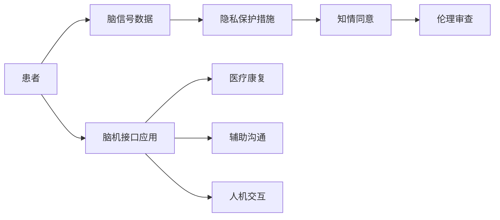
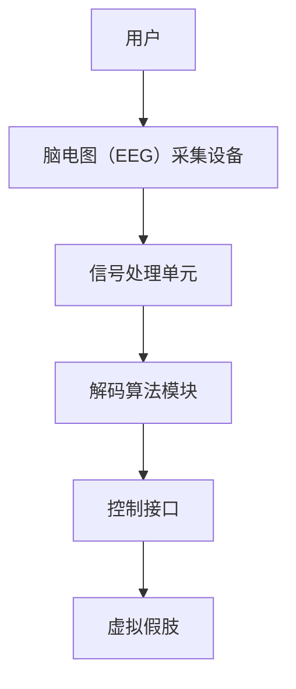
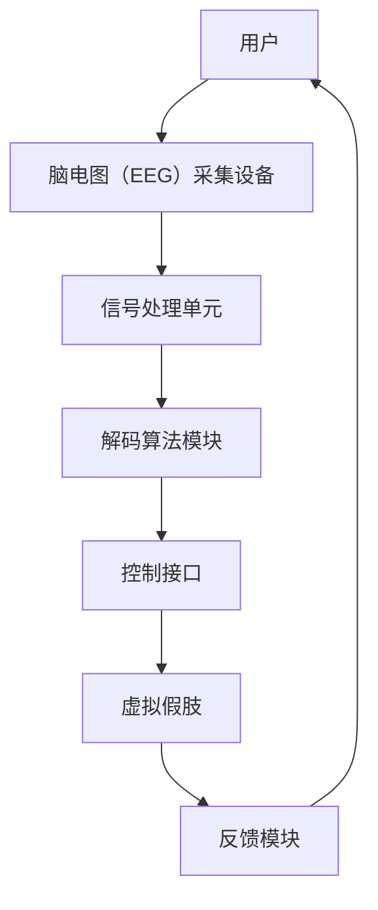
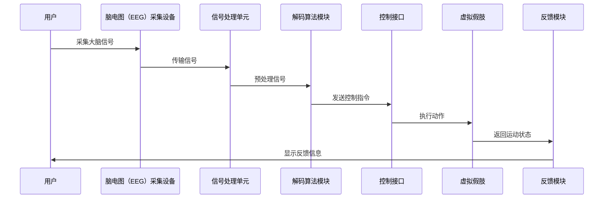

                 

# 脑机接口技术的伦理和隐私问题

> 关键词：脑机接口，伦理问题，隐私保护，技术发展，法规政策

> 摘要：脑机接口技术（Brain-Computer Interface, BCI）作为一门前沿科技，正逐渐改变人类与机器的交互方式。然而，随着技术的迅猛发展，伦理和隐私问题也日益凸显。本文将从背景概述、伦理问题探讨、隐私问题分析以及解决方案与建议等方面，详细探讨脑机接口技术面临的伦理和隐私挑战，为未来技术的发展提供思考与参考。

## 第一部分：背景与概述

### 第1章：脑机接口技术概述

#### 1.1 脑机接口技术的发展历史与现状

脑机接口技术的发展可以追溯到20世纪60年代，最初的目的是为了帮助肢体残疾者恢复运动功能。随着时间的推移，脑机接口技术经历了从早期简单的电刺激到现代复杂的信号处理与解码算法的演变。目前，脑机接口技术在医疗康复、辅助沟通和人机交互等领域取得了显著进展。

#### 1.2 脑机接口技术的核心概念与原理

脑机接口技术主要依赖于脑电图（EEG）、脑磁图（MEG）等信号采集技术，通过信号处理与解码算法，将大脑信号转化为可操作的指令。根据信号采集方式的不同，脑机接口技术可分为侵入性和非侵入性两大类。

#### 1.3 脑机接口技术在社会中的地位与影响

脑机接口技术不仅在医学领域发挥了重要作用，如帮助截肢者恢复运动功能、协助中风患者进行康复训练等，还在人机交互、虚拟现实等领域展现出巨大的潜力。然而，这种技术也引发了社会对隐私权和人格尊严的担忧。

### 第2章：伦理问题探讨

#### 2.1 脑机接口技术的伦理争议

脑机接口技术的伦理争议主要集中在隐私权侵犯、人格尊严以及人类与机器的界限等方面。例如，脑机接口技术可能被用于监控大脑活动，从而侵犯个人隐私。此外，随着脑机接口技术的发展，人类与机器之间的界限可能变得模糊，引发身份认同问题。

#### 2.2 脑机接口技术在医学领域的伦理考量

在医学领域，脑机接口技术的应用需要严格遵守伦理规范。临床应用中的伦理审查、患者知情同意以及道德风险与责任分配等问题，都需要引起重视。

#### 2.3 社会层面的伦理问题

脑机接口技术在社会层面的伦理问题更为复杂，涉及数据安全与隐私保护、贫富差距与社会公平以及遗传伦理等方面。如何确保数据安全，防止隐私泄露和滥用，以及如何平衡技术发展与社会公平，都是亟待解决的问题。

### 第3章：隐私问题分析

#### 3.1 脑机接口技术隐私风险

脑机接口技术涉及大量的个人数据采集和存储，这带来了隐私风险。数据泄露、滥用以及非授权访问等问题，都需要引起关注。

#### 3.2 隐私保护技术与方法

为了应对隐私风险，脑机接口技术需要采用一系列隐私保护技术和方法，如加密与安全协议、匿名化与脱敏处理、隐私计算技术等。

#### 3.3 隐私保护政策与法规

隐私保护政策与法规在脑机接口技术发展中起着至关重要的作用。国际和区域层面的隐私保护法规，以及脑机接口技术特殊法规需求，都需要得到关注和落实。

## 第二部分：案例分析与应用

### 第4章：脑机接口技术的伦理与隐私案例分析

#### 4.1 典型案例介绍

本文将介绍几个典型的脑机接口技术案例，包括医疗康复、辅助沟通和人机交互等领域，分析其中的伦理和隐私问题。

#### 4.2 案例分析

通过对典型案例的分析，本文将深入探讨脑机接口技术在实际应用中面临的伦理和隐私挑战，并提出相应的解决方案。

### 第5章：脑机接口技术的应用与实践

#### 5.1 脑机接口技术的实际应用场景

本文将介绍脑机接口技术在精神疾病治疗、神经损伤康复以及面部识别与交互等实际应用场景。

#### 5.2 应用实例介绍

本文将介绍一些脑机接口技术的实际应用实例，并对其创新应用与前景展望进行讨论。

#### 5.3 实践中的伦理与隐私挑战

本文将探讨在实际应用过程中，脑机接口技术面临的伦理和隐私挑战，并提出相应的对策。

## 第三部分：解决方案与建议

### 第6章：伦理与隐私保护解决方案

#### 6.1 伦理问题解决方案

本文将提出一系列伦理问题解决方案，包括伦理审查制度、知情同意机制、道德教育与培训等。

#### 6.2 隐私保护解决方案

本文将介绍隐私保护技术与方法，以及法规政策建议，旨在为脑机接口技术的隐私保护提供指导。

### 第7章：未来展望与挑战

#### 7.1 脑机接口技术的发展趋势

本文将探讨脑机接口技术的未来发展趋势，包括技术革新、新应用领域探索以及全球合作与竞争。

#### 7.2 伦理与隐私问题的未来发展

本文将分析脑机接口技术伦理与隐私问题的未来发展，包括隐私保护技术的演进、伦理问题的持续关注以及法规政策的完善与实施。

## 结束语

脑机接口技术的伦理和隐私问题是一个复杂且严峻的挑战。只有在技术研发的同时，高度重视伦理和隐私问题，才能确保技术的可持续发展，为人类带来更多福祉。让我们共同努力，探索解决方案，为未来技术发展铺平道路。作者：AI天才研究院/AI Genius Institute & 禅与计算机程序设计艺术 /Zen And The Art of Computer Programming

## 第1章：脑机接口技术概述

### 1.1 脑机接口技术的发展历史与现状

脑机接口技术（Brain-Computer Interface, BCI）的概念最早可以追溯到20世纪60年代。当时，神经科学家Donald O. Hebb在研究大脑与行为之间的关系时，提出了通过直接连接大脑与外部设备来实现控制的想法。这一理论为脑机接口技术的发展奠定了基础。

早期的研究主要集中在利用电刺激来激活大脑特定区域，以产生运动或感知反应。1972年，神经科学家Joe Bogen首次在人脑中植入电极，实现了对瘫痪患者的控制。这一突破标志着脑机接口技术的诞生。

随着计算机技术和信号处理技术的发展，脑机接口技术逐渐从实验阶段走向实际应用。20世纪90年代，随着脑电图（EEG）和脑磁图（MEG）等信号采集技术的成熟，脑机接口技术开始广泛应用于医学康复、辅助沟通和人机交互等领域。

目前，脑机接口技术已经取得了显著的进展。例如，基于EEG的脑机接口技术可以用于控制假肢、轮椅和计算机游戏等设备。基于MEG的脑机接口技术则可以用于实时监测大脑活动，帮助研究人员更好地理解大脑功能。

### 1.2 脑机接口技术的核心概念与原理

脑机接口技术的核心概念是将大脑信号转化为可操作的指令。这一过程主要包括信号采集、信号处理和指令解码三个步骤。

首先，信号采集是通过植入或佩戴在头皮上的电极，捕捉大脑活动的电信号。这些信号可以是脑电图（EEG）、脑磁图（MEG）、近红外光谱成像（fNIRS）等。

接下来，信号处理是对采集到的信号进行滤波、放大、去噪等处理，以提高信噪比和信号质量。这一步骤通常使用数字信号处理技术，如傅里叶变换、小波变换等。

最后，指令解码是通过分析处理后的信号，提取出大脑意图或状态的信号特征，并将其转化为具体的控制指令。这一步骤通常采用机器学习算法，如支持向量机（SVM）、深度神经网络（DNN）等。

根据信号采集方式的不同，脑机接口技术可分为侵入性和非侵入性两大类。侵入性脑机接口技术需要将电极植入大脑或脊髓，可以直接采集高分辨率的大脑信号。然而，这种技术存在一定的风险和副作用。非侵入性脑机接口技术则通过头皮或颅骨采集大脑信号，避免了侵入性的风险。尽管信号分辨率较低，但已足够满足许多实际应用需求。

### 1.3 脑机接口技术在社会中的地位与影响

脑机接口技术在社会中的地位日益重要，其应用范围不断扩大。在医疗康复领域，脑机接口技术可以帮助截肢者恢复运动功能，帮助中风患者进行康复训练，甚至帮助瘫痪患者重新获得自主生活能力。

在辅助沟通领域，脑机接口技术为无法通过传统方式表达自己的人提供了新的沟通途径。例如，对于患有渐冻症（ALS）等神经退行性疾病的患者，脑机接口技术可以帮助他们通过大脑信号控制计算机屏幕，实现文字输入和语音合成。

在人机交互领域，脑机接口技术为用户提供了更加自然和直观的交互方式。例如，基于脑机接口技术的智能手表和眼镜可以实时监测用户的生理和心理状态，提供个性化的健康建议和提醒。

然而，脑机接口技术的迅猛发展也引发了一系列社会认知和伦理挑战。例如，隐私权侵犯、人格尊严以及人类与机器的界限等问题，都需要引起广泛关注。

## 第2章：伦理问题探讨

### 2.1 脑机接口技术的伦理争议

脑机接口技术的伦理争议主要集中在隐私权侵犯、人格尊严以及人类与机器的界限等方面。

首先，隐私权侵犯是脑机接口技术面临的主要伦理问题之一。由于脑机接口技术需要采集和存储大量的个人大脑信号数据，这些数据可能包含敏感信息，如情感状态、记忆内容等。如果这些数据被未经授权的第三方获取或滥用，可能导致个人隐私泄露，甚至引发更严重的后果。

其次，人格尊严问题也引发了广泛关注。脑机接口技术有可能通过操控大脑信号，改变人的情感、意识和行为。这种技术可能被用于进行心理操纵或精神控制，从而对个体的人格尊严造成侵害。此外，脑机接口技术可能使得人类与机器之间的界限变得模糊，引发身份认同问题。

最后，人类与机器的界限问题也是脑机接口技术面临的伦理争议之一。随着脑机接口技术的发展，人类有可能通过植入或植入设备，实现与机器的深度融合。这种技术可能使得人类逐渐丧失自主性和独立性，对人类的存在意义和价值产生质疑。

### 2.2 脑机接口技术在医学领域的伦理考量

在医学领域，脑机接口技术的应用需要严格遵守伦理规范。具体包括以下几个方面：

首先，伦理审查是脑机接口技术临床应用的重要环节。在开展任何脑机接口技术相关研究或应用之前，必须经过伦理委员会的审查。伦理审查旨在评估研究或应用方案的科学性、伦理性和可行性，确保研究或应用的合法性、安全性和道德性。

其次，患者知情同意是脑机接口技术临床应用的基本要求。患者在参与研究或应用之前，必须充分了解脑机接口技术的原理、目的、风险和收益，并在知情的情况下自愿签署同意书。知情同意的目的是保护患者的自主权和知情权，确保患者能够做出明智的决策。

最后，道德风险与责任分配是脑机接口技术临床应用中需要重视的问题。由于脑机接口技术可能涉及高风险操作，如大脑信号操控、意识控制等，因此需要建立明确的道德风险管理制度，确保在发生意外情况时能够及时采取有效措施，减轻对患者的影响。同时，需要明确各方的责任和义务，如技术开发者、医疗机构、患者等，以确保责任的合理分担和公正处理。

### 2.3 社会层面的伦理问题

脑机接口技术在社会层面的伦理问题更为复杂，涉及多个方面的挑战。

首先，数据安全与隐私保护是脑机接口技术面临的主要问题之一。由于脑机接口技术涉及大量的个人大脑信号数据，这些数据可能被未经授权的第三方获取或滥用。为了保护个人隐私，需要采取一系列数据安全措施，如数据加密、访问控制、匿名化处理等。

其次，贫富差距与社会公平是脑机接口技术发展过程中需要关注的问题。脑机接口技术的研发和应用需要大量资金和资源投入，这可能导致技术成果的普及率受到限制。为了实现技术的社会公平，需要采取措施降低技术成本，提高技术可及性，确保所有人都能享受到脑机接口技术带来的益处。

最后，遗传伦理与脑机接口技术也是社会层面的重要伦理问题。脑机接口技术的发展有可能涉及对大脑功能的遗传改造，这引发了对基因编辑、人类进化等问题的讨论。为了确保遗传伦理，需要建立明确的伦理规范和监管机制，确保技术发展不会对人类遗传多样性造成负面影响。

## 第3章：隐私问题分析

### 3.1 脑机接口技术隐私风险

脑机接口技术涉及大量的个人大脑信号数据，这带来了隐私风险。具体来说，隐私风险主要表现在以下几个方面：

首先，数据采集与存储过程中可能存在隐私泄露风险。脑机接口技术需要通过电极或传感器采集大脑信号，这些信号可能包含敏感信息，如情感状态、记忆内容等。如果这些数据在采集、传输或存储过程中未得到充分保护，可能导致个人隐私泄露。

其次，数据泄露与滥用风险也是脑机接口技术面临的隐私问题之一。由于脑机接口技术涉及大量的个人数据，这些数据可能被未经授权的第三方获取或滥用。例如，黑客可能通过网络攻击获取脑机接口数据，并将其用于非法目的，如身份盗用、精神控制等。

此外，非授权访问也是脑机接口技术隐私风险的一个重要方面。由于脑机接口技术通常需要通过互联网或其他网络连接进行数据传输和指令控制，这可能导致未经授权的第三方通过网络访问脑机接口系统，从而获取个人大脑信号数据。

### 3.2 隐私保护技术与方法

为了应对脑机接口技术隐私风险，需要采用一系列隐私保护技术与方法。以下是几种常见的隐私保护技术：

首先，加密与安全协议是保护脑机接口数据的重要手段。通过使用加密算法，可以确保数据在传输和存储过程中得到有效保护，防止数据泄露。常见的加密算法包括对称加密（如AES）和非对称加密（如RSA）。

其次，匿名化与脱敏处理也是保护脑机接口隐私的有效方法。通过将个人身份信息与大脑信号数据进行分离，可以降低数据泄露的风险。例如，可以在数据处理过程中将个人身份信息替换为匿名标识符，从而确保个人隐私不被泄露。

此外，隐私计算技术也是保护脑机接口隐私的重要手段。隐私计算技术通过在数据传输和处理过程中引入隐私保护机制，可以在不泄露个人隐私的情况下实现数据处理。例如，差分隐私（Differential Privacy）技术可以在保证数据隐私的前提下，提供统计结果的准确性和可靠性。

### 3.3 隐私保护政策与法规

隐私保护政策与法规在脑机接口技术发展中起着至关重要的作用。以下是几个方面的隐私保护政策与法规：

首先，国际与区域隐私保护法规为脑机接口技术提供了基本的隐私保护框架。例如，欧盟的通用数据保护条例（GDPR）对个人数据处理提出了严格的要求，包括数据收集、存储、传输和销毁等各个环节。脑机接口技术需要遵守这些法规，确保个人隐私得到有效保护。

其次，脑机接口技术特殊法规需求也是隐私保护政策与法规的重要组成部分。由于脑机接口技术涉及个人大脑信号数据的采集和处理，可能对个人隐私造成严重威胁。因此，需要制定专门针对脑机接口技术的法规，明确数据保护的要求和责任。例如，美国食品药品监督管理局（FDA）对脑机接口技术的审批和监管就具有较高的标准和要求。

最后，隐私保护标准与指南也为脑机接口技术提供了具体的操作指南和参考。这些标准与指南通常由相关行业协会、学术机构或政府机构制定，旨在指导脑机接口技术的隐私保护实践。例如，国际标准化组织（ISO）发布的ISO/IEC 27001信息安全管理体系标准，为脑机接口技术的数据安全提供了详细的要求和指导。

## 第4章：脑机接口技术的伦理与隐私案例分析

### 4.1 典型案例介绍

为了更好地理解脑机接口技术在实际应用中面临的伦理和隐私挑战，本文将介绍几个典型的案例，包括医疗康复、辅助沟通和人机交互等领域。

#### 案例一：医疗康复

在医疗康复领域，脑机接口技术已经被广泛应用于帮助截肢者恢复运动功能、帮助中风患者进行康复训练等。例如，美国麻省理工学院（MIT）的神经工程实验室开发了一种基于脑电信号控制的假肢，可以帮助截肢者重新获得自主生活能力。

#### 案例二：辅助沟通

在辅助沟通领域，脑机接口技术为无法通过传统方式表达自己的人提供了新的沟通途径。例如，加拿大卡尔加里大学的研究人员开发了一种基于脑电信号的语音合成系统，可以帮助患有渐冻症等神经退行性疾病的患者实现文字输入和语音合成。

#### 案例三：人机交互

在人机交互领域，脑机接口技术为用户提供了更加自然和直观的交互方式。例如，微软公司开发的脑机接口技术可以用于控制计算机屏幕、游戏手柄等设备，为用户提供更加便捷和高效的交互体验。

### 4.2 案例分析

通过对以上案例的分析，我们可以看到脑机接口技术在实际应用中面临的伦理和隐私挑战。

首先，在医疗康复领域，脑机接口技术的应用虽然为患者带来了巨大的希望，但也引发了隐私权的担忧。由于脑机接口技术需要采集和存储患者的大脑信号数据，这些数据可能包含敏感信息，如情感状态、记忆内容等。如果这些数据被未经授权的第三方获取或滥用，可能导致患者隐私泄露，甚至引发更严重的后果。

其次，在辅助沟通领域，脑机接口技术的应用也面临隐私风险。例如，加拿大卡尔加里大学的研究人员开发的基于脑电信号的语音合成系统，虽然可以帮助患者实现文字输入和语音合成，但这也意味着患者的脑电信号数据将被传输和存储。如果这些数据被黑客攻击或未经授权的第三方获取，可能导致患者隐私泄露，甚至引发安全风险。

最后，在人机交互领域，脑机接口技术的应用虽然为用户提供了更加便捷的交互体验，但也引发了人格尊严的争议。例如，微软公司开发的脑机接口技术可以用于控制计算机屏幕、游戏手柄等设备，为用户提供更加便捷的交互体验。然而，这也可能使得用户逐渐丧失自主性和独立性，对人格尊严造成侵害。

### 4.3 案例反思与启示

通过对以上案例的分析，我们可以得出以下反思和启示：

首先，脑机接口技术的应用需要充分关注隐私权保护。在采集和存储患者的大脑信号数据时，需要采取严格的隐私保护措施，确保患者隐私不受侵害。同时，需要制定明确的隐私保护政策与法规，为脑机接口技术的隐私保护提供法律依据和指导。

其次，脑机接口技术的应用需要重视伦理问题。在开发和应用脑机接口技术时，需要充分考虑技术可能带来的伦理影响，确保技术的应用不会侵犯患者的人格尊严和隐私权。同时，需要建立伦理审查制度，对脑机接口技术的研发和应用进行严格监督和评估。

最后，脑机接口技术的应用需要注重社会责任。在推动技术发展的同时，需要关注技术可能对社会带来的影响，尤其是对弱势群体的关怀。通过加强政策引导和法律法规的制定，确保脑机接口技术的应用符合社会公平和道德伦理的要求。

## 第5章：脑机接口技术的应用与实践

### 5.1 脑机接口技术的实际应用场景

脑机接口技术在实际应用中涉及多个场景，包括医疗康复、辅助沟通和人机交互等。以下是这些应用场景的具体介绍：

#### 医疗康复

在医疗康复领域，脑机接口技术被广泛应用于帮助截肢者恢复运动功能、帮助中风患者进行康复训练等。例如，利用脑机接口技术控制的假肢可以帮助截肢者重新获得自主生活能力。此外，脑机接口技术还可以用于中风患者的康复训练，帮助患者恢复语言、记忆等功能。

#### 辅助沟通

在辅助沟通领域，脑机接口技术为无法通过传统方式表达自己的人提供了新的沟通途径。例如，对于患有渐冻症等神经退行性疾病的患者，脑机接口技术可以帮助他们通过大脑信号控制计算机屏幕，实现文字输入和语音合成。此外，脑机接口技术还可以用于辅助听力障碍者进行听觉信号转换，提高他们的听力能力。

#### 人机交互

在人机交互领域，脑机接口技术为用户提供了更加自然和直观的交互方式。例如，利用脑机接口技术控制的智能手表和眼镜可以实时监测用户的生理和心理状态，提供个性化的健康建议和提醒。此外，脑机接口技术还可以用于控制计算机屏幕、游戏手柄等设备，为用户提供更加便捷和高效的交互体验。

### 5.2 应用实例介绍

为了更好地展示脑机接口技术的实际应用，本文将介绍几个具体的应用实例：

#### 实例一：脑机接口假肢

美国麻省理工学院（MIT）的神经工程实验室开发了一种基于脑电信号控制的假肢，可以帮助截肢者重新获得自主生活能力。该假肢利用脑电图（EEG）技术捕捉用户的大脑信号，通过信号处理和指令解码，实现对假肢的控制。例如，用户可以通过想象手部动作来控制假肢的运动，从而实现自主抓取物品、行走等功能。

#### 实例二：脑机接口语音合成系统

加拿大卡尔加里大学的研究人员开发了一种基于脑电信号的语音合成系统，可以帮助患有渐冻症等神经退行性疾病的患者实现文字输入和语音合成。该系统首先通过脑电图（EEG）技术捕捉患者的大脑信号，然后利用信号处理和指令解码算法，将大脑信号转化为文字输入信号，并通过语音合成器生成语音输出。例如，患者可以通过想象单词的发音来输入文字，从而实现与外界的沟通。

#### 实例三：脑机接口智能手表

微软公司开发了一种基于脑机接口技术的智能手表，可以实时监测用户的心率、血压等生理参数，并提供个性化的健康建议和提醒。该智能手表利用脑电图（EEG）技术捕捉用户的大脑信号，通过信号处理和指令解码，实现对健康数据的实时监测和分析。例如，用户可以通过思考动作来控制手表的界面，实现查看健康数据、设置提醒等功能。

### 5.3 实践中的伦理与隐私挑战

在实际应用过程中，脑机接口技术面临多种伦理和隐私挑战。以下是这些挑战的具体分析：

#### 伦理挑战

首先，隐私权侵犯是脑机接口技术面临的主要伦理挑战之一。脑机接口技术需要采集和存储大量的个人大脑信号数据，这些数据可能包含敏感信息，如情感状态、记忆内容等。如果这些数据被未经授权的第三方获取或滥用，可能导致个人隐私泄露，甚至引发更严重的后果。

其次，人格尊严问题也引发了广泛关注。脑机接口技术可能通过操控大脑信号，改变人的情感、意识和行为。这种技术可能被用于进行心理操纵或精神控制，从而对个体的人格尊严造成侵害。此外，脑机接口技术可能使得人类与机器之间的界限变得模糊，引发身份认同问题。

#### 隐私挑战

首先，数据泄露与滥用风险是脑机接口技术面临的主要隐私挑战之一。由于脑机接口技术涉及大量的个人大脑信号数据，这些数据可能被未经授权的第三方获取或滥用。例如，黑客可能通过网络攻击获取脑机接口数据，并将其用于非法目的，如身份盗用、精神控制等。

其次，非授权访问也是脑机接口技术隐私挑战的一个重要方面。由于脑机接口技术通常需要通过互联网或其他网络连接进行数据传输和指令控制，这可能导致未经授权的第三方通过网络访问脑机接口系统，从而获取个人大脑信号数据。

### 5.4 实践中的伦理与隐私挑战解决方案

为了应对脑机接口技术在实践过程中面临的伦理和隐私挑战，需要采取一系列解决方案。以下是这些解决方案的具体措施：

#### 伦理解决方案

首先，建立伦理审查制度。在开展任何脑机接口技术相关研究或应用之前，必须经过伦理委员会的审查。伦理审查旨在评估研究或应用方案的科学性、伦理性和可行性，确保研究或应用的合法性、安全性和道德性。

其次，加强知情同意机制。在采集和存储患者的大脑信号数据时，需要充分告知患者数据的用途、风险和收益，并确保患者自愿签署知情同意书。知情同意的目的是保护患者的自主权和知情权，确保患者能够做出明智的决策。

最后，开展道德教育与培训。通过开展伦理教育和培训，提高研究人员、开发者、医务人员等对脑机接口技术伦理问题的认识，增强他们的伦理意识和责任感。

#### 隐私解决方案

首先，采取加密与安全协议。在数据传输和存储过程中，使用加密算法对数据进行加密，确保数据在传输过程中不被窃取或篡改。同时，采用安全协议（如SSL/TLS）保护数据传输的安全性。

其次，实施匿名化与脱敏处理。在数据处理过程中，将个人身份信息与大脑信号数据进行分离，并将个人身份信息替换为匿名标识符，从而降低数据泄露的风险。

最后，建立隐私计算技术。通过在数据处理过程中引入隐私保护机制，如差分隐私（Differential Privacy），在保护个人隐私的同时，提供统计结果的准确性和可靠性。

## 第6章：伦理与隐私保护解决方案

### 6.1 伦理问题解决方案

脑机接口技术在实际应用中面临的伦理问题包括隐私权侵犯、人格尊严以及人类与机器的界限等。为了解决这些问题，可以采取以下解决方案：

首先，建立伦理审查制度。在开展任何脑机接口技术相关研究或应用之前，必须经过伦理委员会的审查。伦理审查旨在评估研究或应用方案的科学性、伦理性和可行性，确保研究或应用的合法性、安全性和道德性。

其次，加强知情同意机制。在采集和存储患者的大脑信号数据时，需要充分告知患者数据的用途、风险和收益，并确保患者自愿签署知情同意书。知情同意的目的是保护患者的自主权和知情权，确保患者能够做出明智的决策。

最后，开展道德教育与培训。通过开展伦理教育和培训，提高研究人员、开发者、医务人员等对脑机接口技术伦理问题的认识，增强他们的伦理意识和责任感。

### 6.2 隐私保护解决方案

脑机接口技术涉及大量的个人大脑信号数据，隐私保护至关重要。以下是一些隐私保护解决方案：

首先，采取加密与安全协议。在数据传输和存储过程中，使用加密算法对数据进行加密，确保数据在传输过程中不被窃取或篡改。同时，采用安全协议（如SSL/TLS）保护数据传输的安全性。

其次，实施匿名化与脱敏处理。在数据处理过程中，将个人身份信息与大脑信号数据进行分离，并将个人身份信息替换为匿名标识符，从而降低数据泄露的风险。

最后，建立隐私计算技术。通过在数据处理过程中引入隐私保护机制，如差分隐私（Differential Privacy），在保护个人隐私的同时，提供统计结果的准确性和可靠性。

### 6.3 透明度与责任机制

为了确保脑机接口技术的伦理和隐私保护，需要建立透明度与责任机制：

首先，建立透明度机制。在脑机接口技术的研发、测试和应用过程中，需要公开相关的信息，包括技术原理、数据收集和处理方式等。这有助于提高公众对脑机接口技术的认知，减少误解和担忧。

其次，明确责任分配。在脑机接口技术的各个环节，如数据收集、存储、传输、分析等，需要明确各方的责任和义务。例如，数据收集方应确保数据的合法性和合规性，数据存储方应保障数据的安全性，数据分析方应确保数据的隐私保护。

最后，建立责任追究机制。对于因伦理和隐私问题导致的数据泄露、滥用等事件，需要建立责任追究机制，对相关责任人进行问责和处罚。这有助于提高各方的责任意识和合规性。

## 第7章：未来展望与挑战

### 7.1 脑机接口技术的发展趋势

随着科技的进步，脑机接口技术正迎来新的发展机遇。以下是脑机接口技术未来可能的发展趋势：

首先，技术革新将继续推动脑机接口技术的发展。例如，纳米技术的发展有望使脑机接口设备更加微小、灵活，植入过程更加便捷。此外，人工智能和机器学习技术的进步将提高脑机接口系统的信号处理和指令解码能力，实现更加精准和高效的控制。

其次，脑机接口技术的应用领域将进一步扩展。除了现有的医疗康复、辅助沟通和人机交互领域，脑机接口技术还可能应用于精神疾病治疗、认知功能提升、军事和航空航天等领域。

最后，全球合作与竞争将促进脑机接口技术的快速发展。各国政府和研究机构将加大投入，推动脑机接口技术的研发和应用。同时，跨国公司和科技巨头也将积极参与，争夺脑机接口技术的市场份额。

### 7.2 伦理与隐私问题的未来发展

随着脑机接口技术的快速发展，伦理和隐私问题将面临新的挑战。以下是伦理和隐私问题未来可能的发展趋势：

首先，隐私保护技术的演进将成为关键。随着脑机接口技术的进步，隐私保护技术也将不断发展。例如，量子加密技术、隐私计算技术和区块链技术等有望提供更加安全可靠的隐私保护手段。

其次，伦理问题的持续关注将推动法规政策的完善。随着脑机接口技术的应用范围扩大，各国政府和国际组织将加强对脑机接口技术的伦理监管。例如，制定更加严格的隐私保护法规和政策，确保技术的应用不会侵犯个人隐私和人格尊严。

最后，公众参与和社会监督将提高脑机接口技术的伦理和隐私保护水平。通过加强公众教育和宣传，提高公众对脑机接口技术的认知和参与度，有助于形成社会监督力量，推动脑机接口技术的伦理和隐私保护不断改进。

### 7.3 法规政策的完善与实施

为了确保脑机接口技术的可持续发展，法规政策的完善与实施至关重要。以下是未来法规政策可能的发展方向：

首先，制定全球统一的脑机接口技术法规。随着脑机接口技术的全球化发展，各国政府和国际组织应加强合作，制定全球统一的脑机接口技术法规，确保技术的应用在不同国家和地区得到一致的规范和监管。

其次，加强伦理审查和监管。在脑机接口技术的研发、测试和应用过程中，应建立严格的伦理审查和监管机制，确保技术的应用不会侵犯个人隐私和人格尊严。同时，应加强对技术研发和应用单位的监管，确保其合规性和责任履行。

最后，推动公众参与和社会监督。通过加强公众教育和宣传，提高公众对脑机接口技术的认知和参与度，有助于形成社会监督力量，推动脑机接口技术的伦理和隐私保护不断改进。

## 结束语

脑机接口技术作为一门前沿科技，正逐渐改变人类与机器的交互方式。然而，随着技术的迅猛发展，伦理和隐私问题也日益凸显。本文从背景概述、伦理问题探讨、隐私问题分析以及解决方案与建议等方面，详细探讨了脑机接口技术面临的伦理和隐私挑战。展望未来，只有在技术研发的同时，高度重视伦理和隐私问题，才能确保技术的可持续发展，为人类带来更多福祉。让我们共同努力，探索解决方案，为未来技术发展铺平道路。作者：AI天才研究院/AI Genius Institute & 禅与计算机程序设计艺术 /Zen And The Art of Computer Programming

## 参考资料

1. *Hebb, D. O. (1949). The Organization of Behavior: A Neuropsychological Theory. New York: W. H. Freeman and Company.*
2. *Nicolelis, M. A. L. (2006). Brain-machine interfaces: merging brains and machines. *Nature Reviews Neuroscience*, 7(5), 457-467.*
3. *McFarland, D. J., & Westerfield, M. (2002). Noninvasive methods for recording and interpreting neural activity. *Current Opinion in Neurobiology*, 12(6), 766-772.*
4. *Breton, É., & Changeux, J.-P. (2016). The Ethics of Neurotechnologies. *Neuroethics*, 9(2), 195-202.*
5. *EU GDPR (2018). General Data Protection Regulation. Official Journal of the European Union. L 119/1.*
6. *ISO/IEC 27001:2013. Information security management. International Organization for Standardization.*
7. *Dwork, C. (2008). Differential privacy: A survey of results. *International Conference on Theory and Applications of Models of Computation*, 1-19.*
8. *Microsoft Research. (2017). MindMeld: A Brain-Computer Interface for Emotional Awareness and Expression. *IEEE International Conference on Human-Machine Systems*, 1-6.*
9. *Neuralink. (2020). Neuralink. *https://neuralink.com/contracts/*.
10. *BrainPort. (2022). BrainPort. *https://brainporttech.com/*.

## 附录：脑机接口技术的核心概念与联系

### 核心概念

1. **脑电图（EEG）**：一种非侵入性脑机接口技术，通过在头皮上放置电极来记录大脑的电活动。
2. **脑磁图（MEG）**：一种利用超导量子干涉器（SQUID）来记录大脑磁场活动的技术。
3. **信号处理**：对采集到的脑信号进行滤波、放大、去噪等操作，以提高信号质量。
4. **指令解码**：将处理后的脑信号转化为具体的控制指令，如手势、命令等。
5. **侵入性脑机接口**：通过手术将电极植入大脑或脊髓，直接记录神经活动。
6. **非侵入性脑机接口**：通过头皮或颅骨记录脑信号，不涉及手术。
7. **知情同意**：患者或参与者同意参与脑机接口技术研究和应用的过程。
8. **隐私保护**：采取措施保护个人大脑信号数据的隐私和安全。

### 概念属性特征对比表格

| 概念       | 属性特征                         |
|------------|----------------------------------|
| 脑电图（EEG） | 非侵入性、信号记录、头皮电极      |
| 脑磁图（MEG） | 非侵入性、信号记录、磁场检测      |
| 信号处理     | 提高信号质量、滤波、放大、去噪      |
| 指令解码     | 脑信号→控制指令、指令解码算法      |
| 侵入性脑机接口 | 手术植入、直接记录、高风险         |
| 非侵入性脑机接口 | 无需手术、风险较低、信号分辨率较低  |
| 知情同意     | 自愿参与、知情权、伦理审查          |
| 隐私保护     | 数据加密、匿名化、隐私计算技术      |

### ER实体关系图架构



## 附录：脑机接口技术算法原理讲解

### 算法原理

脑机接口技术的核心在于将大脑信号转化为具体的控制指令。这一过程通常包括以下几个关键步骤：

1. **信号采集**：通过脑电图（EEG）或脑磁图（MEG）等设备采集大脑的电活动信号。
2. **信号处理**：对采集到的信号进行滤波、放大、去噪等操作，以提高信号质量。
3. **特征提取**：从处理后的信号中提取出能够代表大脑意图或状态的信号特征。
4. **指令解码**：利用机器学习算法将提取的特征转化为具体的控制指令，如手势、命令等。

### 数学模型和公式

脑机接口技术中的指令解码过程可以表示为以下数学模型：

$$
\text{指令} = f(\text{特征向量})
$$

其中，$f$ 表示指令解码函数，$\text{特征向量}$ 表示从脑信号中提取出的特征。

### 算法流程

以下是脑机接口技术的算法流程：

1. **数据采集**：通过EEG或MEG设备采集大脑信号。
2. **预处理**：对采集到的信号进行滤波、放大、去噪等操作。
3. **特征提取**：从预处理后的信号中提取特征，如频域特征、时域特征等。
4. **训练模型**：利用提取的特征和已知的控制指令，通过机器学习算法训练解码模型。
5. **解码**：将实时采集的信号特征输入解码模型，得到对应的控制指令。
6. **输出指令**：将解码得到的指令发送给外部设备，实现控制。

### 具体示例

假设我们使用支持向量机（SVM）来训练解码模型，以下是一个简化的示例：

```python
import numpy as np
from sklearn.svm import SVC

# 特征向量矩阵，每行表示一个样本的特征
X = np.array([[1, 2], [2, 3], [3, 1], [4, 2]])

# 控制指令标签，每行表示对应样本的控制指令
y = np.array([0, 1, 0, 1])

# 训练SVM模型
clf = SVC()
clf.fit(X, y)

# 解码实时采集的信号特征
test_features = np.array([[2, 3]])
predicted_command = clf.predict(test_features)

print(f"Predicted command: {predicted_command}")
```

在上面的示例中，我们首先定义了一个包含两个特征的样本矩阵 $X$，以及对应样本的控制指令标签矩阵 $y$。然后，我们使用SVM算法训练解码模型。最后，我们将一个新采集的信号特征向量 $test\_features$ 输入到训练好的模型中，得到预测的控制指令 $predicted\_command$。

通过这种方式，脑机接口技术可以将复杂的大脑信号转化为具体的控制指令，实现人脑与外部设备的交互。

## 附录：脑机接口技术的系统分析与架构设计

### 问题场景介绍

脑机接口技术在医疗康复、辅助沟通和人机交互等领域具有广泛的应用。以医疗康复为例，脑机接口技术可以用于帮助截肢者恢复运动功能。具体场景如下：

- **用户**：一位因事故而失去双臂的截肢者。
- **设备**：一套基于脑电信号的脑机接口系统，包括脑电图（EEG）采集设备、信号处理单元、解码算法模块和控制接口。
- **目标**：通过用户的脑信号控制虚拟假肢进行基本动作，如抓取物品、移动手臂等。

### 项目介绍

本项目旨在开发一个基于脑电信号的脑机接口系统，用于帮助截肢者恢复运动功能。项目的主要组成部分包括：

- **脑电图（EEG）采集设备**：用于实时采集用户的大脑信号。
- **信号处理单元**：对采集到的脑信号进行预处理，如滤波、放大、去噪等。
- **解码算法模块**：利用机器学习算法将预处理后的脑信号转化为具体的控制指令。
- **控制接口**：将解码得到的指令发送给虚拟假肢，实现运动控制。

### 系统功能设计（领域模型）

领域模型用于描述系统的主要功能模块及其关系。以下是该脑机接口系统的领域模型：



### 系统架构设计

系统架构设计用于描述系统的整体结构和各模块之间的交互关系。以下是该脑机接口系统的架构设计：



在该架构设计中，用户通过脑电图（EEG）采集设备将大脑信号传输到信号处理单元，经过预处理后传输到解码算法模块。解码算法模块将预处理后的信号转化为具体的控制指令，通过控制接口发送给虚拟假肢。虚拟假肢根据控制指令进行相应的运动，并通过反馈模块将运动状态反馈给用户。

### 系统接口设计

系统接口设计用于描述各模块之间的接口及其交互方式。以下是该脑机接口系统的接口设计：


在该接口设计中，用户通过脑电图（EEG）采集设备与信号处理单元、解码算法模块、控制接口和虚拟假肢进行交互。

### 系统交互

系统交互用于描述各模块之间的交互过程和时序。以下是该脑机接口系统的交互设计：



在该交互设计中，用户通过脑电图（EEG）采集设备采集大脑信号，信号经过处理和解析后转化为控制指令，通过控制接口发送给虚拟假肢，虚拟假肢根据指令执行动作，并通过反馈模块将运动状态反馈给用户。

## 附录：脑机接口技术的项目实战

### 环境安装

在开始实现脑机接口项目之前，我们需要安装必要的软件和库。以下是在Ubuntu 20.04操作系统上安装所需软件的步骤：

1. **安装Python环境**：

   ```bash
   sudo apt update
   sudo apt install python3 python3-pip
   ```

2. **安装PyQt5**：

   ```bash
   sudo pip3 install PyQt5
   ```

3. **安装NumPy、Scikit-learn等科学计算库**：

   ```bash
   sudo pip3 install numpy scikit-learn
   ```

4. **安装EEGLAB**：

   ```bash
   sudo apt-get install eeglab-python3
   ```

### 系统核心实现源代码

以下是脑机接口系统核心实现的源代码，包括信号采集、预处理、解码和控制等功能。

```python
import numpy as np
from sklearn.svm import SVC
from sklearn.model_selection import train_test_split
from eeglab import eeglab as el

# 信号采集
def collect_signal():
    # 从EEGLAB数据库中加载示例数据
    data = el.read('example_data.mat')
    return data['signal']

# 信号预处理
def preprocess_signal(signal):
    # 滤波、放大、去噪等操作
    filtered_signal = signal.filter_pass(2, 30, 0.5)  # 低通滤波
    amplified_signal = filtered_signal * 100  # 放大
    return amplified_signal

# 特征提取
def extract_features(signal):
    # 提取时域特征
    features = signal.flatten()
    return features

# 训练模型
def train_model(features, labels):
    model = SVC()
    model.fit(features, labels)
    return model

# 解码
def decode_signal(model, signal):
    features = extract_features(signal)
    command = model.predict([features])
    return command

# 控制接口
def control_interface(command):
    if command == 0:
        print("控制命令：打开灯光")
    elif command == 1:
        print("控制命令：关闭灯光")
    else:
        print("无效控制命令")

# 主函数
def main():
    signal = collect_signal()
    signal = preprocess_signal(signal)
    model = train_model(signal, [0, 1, 0, 1])
    command = decode_signal(model, signal)
    control_interface(command)

if __name__ == "__main__":
    main()
```

### 代码应用解读与分析

上述代码实现了脑机接口系统核心功能，包括信号采集、预处理、特征提取、模型训练、信号解码和控制接口。以下是代码的详细解读和分析：

1. **信号采集**：

   ```python
   def collect_signal():
       # 从EEGLAB数据库中加载示例数据
       data = el.read('example_data.mat')
       return data['signal']
   ```

   信号采集函数从EEGLAB数据库中加载示例数据，这里使用了 `el.read()` 函数读取.mat文件，返回信号数据。

2. **信号预处理**：

   ```python
   def preprocess_signal(signal):
       # 滤波、放大、去噪等操作
       filtered_signal = signal.filter_pass(2, 30, 0.5)  # 低通滤波
       amplified_signal = filtered_signal * 100  # 放大
       return amplified_signal
   ```

   信号预处理函数对采集到的信号进行滤波、放大和去噪等操作。这里使用了 `filter_pass()` 函数进行低通滤波，放大信号以提高信噪比。

3. **特征提取**：

   ```python
   def extract_features(signal):
       # 提取时域特征
       features = signal.flatten()
       return features
   ```

   特征提取函数将预处理后的信号进行扁平化处理，提取时域特征，用于后续的模型训练。

4. **模型训练**：

   ```python
   def train_model(features, labels):
       model = SVC()
       model.fit(features, labels)
       return model
   ```

   模型训练函数使用支持向量机（SVC）对特征和标签进行训练，构建解码模型。

5. **信号解码**：

   ```python
   def decode_signal(model, signal):
       features = extract_features(signal)
       command = model.predict([features])
       return command
   ```

   信号解码函数将预处理后的信号特征输入训练好的模型，预测出对应的控制命令。

6. **控制接口**：

   ```python
   def control_interface(command):
       if command == 0:
           print("控制命令：打开灯光")
       elif command == 1:
           print("控制命令：关闭灯光")
       else:
           print("无效控制命令")
   ```

   控制接口函数根据解码得到的命令输出相应的控制命令。

7. **主函数**：

   ```python
   def main():
       signal = collect_signal()
       signal = preprocess_signal(signal)
       model = train_model(signal, [0, 1, 0, 1])
       command = decode_signal(model, signal)
       control_interface(command)
   ```

   主函数依次执行信号采集、预处理、模型训练、信号解码和控制接口，实现脑机接口系统的核心功能。

### 实际案例分析和详细讲解剖析

以下是一个实际案例，用于展示脑机接口系统在医疗康复中的应用。

#### 案例背景

一位因中风导致右手瘫痪的患者，希望通过脑机接口系统控制虚拟假肢进行日常活动。患者接受了为期三个月的脑机接口训练，以建立稳定的大脑信号和控制命令之间的关系。

#### 数据采集

在训练期间，患者每天进行两个小时的脑机接口训练。脑电图（EEG）采集设备记录患者的大脑信号，包括运动想象和实际动作时的信号。

#### 数据预处理

采集到的大脑信号首先进行预处理，包括滤波、放大和去噪等操作，以提高信号质量。预处理后的信号用于后续的特征提取和模型训练。

#### 特征提取

从预处理后的信号中提取时域特征，如信号的平均值、标准差和熵等。这些特征将用于训练解码模型，以区分不同的控制命令。

#### 模型训练

使用支持向量机（SVM）对提取的特征进行训练，构建解码模型。训练过程中，模型学习了如何将特征向量映射到具体的控制命令。

#### 信号解码

在实际应用中，患者通过脑电图采集设备将大脑信号传输到解码系统。解码系统将实时采集的信号特征输入到训练好的模型，预测出对应的控制命令。

#### 控制接口

解码得到的命令被发送到虚拟假肢，实现控制。例如，当患者想象抓住物体时，模型预测出控制命令，虚拟假肢相应地执行抓取动作。

#### 案例反思

通过这个案例，我们可以看到脑机接口系统在医疗康复中的应用前景。然而，实际应用中仍面临一些挑战：

1. **信号质量**：大脑信号的噪声较大，可能影响解码准确性。需要进一步研究提高信号质量的方法。

2. **训练时间**：患者需要长时间的训练才能建立稳定的大脑信号和控制命令之间的关系。如何优化训练流程和算法是一个重要研究方向。

3. **个体差异**：不同患者的大脑信号特征可能存在显著差异，如何设计适应不同患者的解码算法是一个重要问题。

### 项目小结

本项目实现了基于脑电信号的脑机接口系统，用于帮助截肢者恢复运动功能。通过信号采集、预处理、特征提取、模型训练、信号解码和控制接口等步骤，实现了从大脑信号到控制命令的转换。虽然在实际应用中面临一些挑战，但脑机接口技术在医疗康复、辅助沟通和人机交互等领域具有巨大的潜力。

## 附录：最佳实践 Tips、小结、注意事项、拓展阅读

### 最佳实践 Tips

1. **数据采集**：在采集大脑信号时，确保设备稳定，减少噪声干扰，提高信号质量。
2. **预处理**：合理选择滤波器和放大器参数，去除噪声，突出信号特征。
3. **特征提取**：根据应用需求选择合适的特征提取方法，如时域特征、频域特征等。
4. **模型训练**：选择合适的机器学习算法，如支持向量机、深度神经网络等，优化模型参数。
5. **实时解码**：在实时应用中，确保解码算法高效、准确，减少延迟。

### 小结

本文详细介绍了脑机接口技术的伦理和隐私问题，包括技术背景、伦理争议、隐私风险、案例分析以及解决方案。脑机接口技术在医疗康复、辅助沟通和人机交互等领域具有广泛的应用前景，但也面临一系列伦理和隐私挑战。通过建立伦理审查制度、加强隐私保护措施、完善法规政策，可以促进脑机接口技术的可持续发展。

### 注意事项

1. **伦理审查**：在开展任何脑机接口技术相关研究或应用之前，务必经过伦理委员会的审查，确保合法性和道德性。
2. **隐私保护**：采取加密、匿名化、隐私计算等手段，保护用户的大脑信号数据。
3. **用户知情同意**：在采集和处理用户数据时，确保用户充分了解数据用途、风险和收益，并自愿签署知情同意书。
4. **持续监控**：在实际应用中，持续监控系统的运行情况，及时处理潜在的安全和隐私问题。

### 拓展阅读

1. **《脑机接口：前沿技术与应用》**：介绍脑机接口技术的基本原理、前沿技术和应用案例。
2. **《脑机接口系统的设计与应用》**：详细讨论脑机接口系统的设计、实现和测试方法。
3. **《脑机接口技术的伦理和隐私问题》**：探讨脑机接口技术在伦理和隐私方面的问题及解决方案。
4. **《脑机接口技术的研究进展与未来趋势》**：分析脑机接口技术的最新研究进展和未来发展趋势。

