                 

### 文章标题：自然语言处理在情感分析中的应用：理解用户情绪和需求

#### 关键词：自然语言处理，情感分析，用户情绪，需求理解，应用场景

#### 摘要：本文旨在探讨自然语言处理在情感分析中的应用，通过分析用户情绪和需求，帮助企业和开发者更好地理解用户，提高服务质量。文章将从基本概念、技术方法、应用领域和实战案例等方面，系统地介绍自然语言处理在情感分析中的重要性及其应用。

---

## 第一部分：引言

### 1.1 书籍背景

情感分析是自然语言处理领域的一个重要分支，它旨在通过计算和统计分析文本，识别文本中的情感倾向和情绪状态。随着互联网和社交媒体的迅速发展，情感分析在市场研究、舆情监测、客户服务、个性化推荐等领域得到了广泛应用。

### 1.2 自然语言处理与情感分析

自然语言处理（Natural Language Processing，NLP）是计算机科学、人工智能和语言学领域的一个分支，旨在使计算机能够理解、生成和处理人类语言。情感分析作为NLP的一个重要应用领域，涉及到文本情感极性分类、情感强度分析、多情感分类等任务。

### 1.3 情感分析的应用领域

情感分析的应用领域非常广泛，包括但不限于：

- **市场研究**：通过分析消费者对产品或服务的评价，帮助企业了解市场需求和用户满意度。
- **舆情监测**：实时监测社交媒体、新闻报道等，识别公众情绪和社会趋势。
- **客户服务**：自动分析客户反馈，快速响应客户需求，提高服务质量。
- **个性化推荐**：根据用户情感和需求，提供个性化的推荐服务。

## 第二部分：情感分析基础

### 2.1 情感极性分类

情感极性分类是将文本分类为积极、消极或中性情感的分类任务。该任务的基础是情感词典和机器学习算法。

#### 2.1.1 极性分类的基本原理

情感极性分类的基本原理是使用情感词典和机器学习算法来识别文本中的情感倾向。

#### 2.1.2 基于机器学习的情感极性分类

基于机器学习的情感极性分类方法包括支持向量机（SVM）、朴素贝叶斯（NB）、决策树（DT）等。

#### 2.1.3 域深度学习的情感极性分类

深度学习在情感极性分类中发挥了重要作用，如卷积神经网络（CNN）、递归神经网络（RNN）等。

### 2.2 情感强度分析

情感强度分析是评估文本情感极性强度的一项任务。它不仅需要识别情感的极性，还需要评估情感的强度。

#### 2.2.1 情感强度分析的概念

情感强度分析关注的是情感的程度，如非常喜爱、喜爱、一般、不喜爱、非常不喜爱等。

#### 2.2.2 基于规则的情感强度分析

基于规则的情感强度分析通过预设的规则来评估情感强度。

#### 2.2.3 基于机器学习的情感强度分析

基于机器学习的情感强度分析利用训练数据来学习情感强度的规律。

### 2.3 情感分析评估方法

评估情感分析模型的性能需要使用准确率、召回率、F1值等指标。

#### 2.3.1 准确率、召回率和F1值

准确率、召回率和F1值是评估分类模型性能的常用指标。

#### 2.3.2 精度和召回率的权衡

在实际应用中，需要根据业务需求在精度和召回率之间进行权衡。

#### 2.3.3 主观评价与客观评价的结合

主观评价和客观评价的结合可以提高评估结果的可靠性。

## 第三部分：自然语言处理技术

### 3.1 词嵌入与预训练模型

词嵌入是将词汇映射为低维向量的技术。预训练模型是在大规模语料库上预先训练好的模型，如GloVe、Word2Vec等。

#### 3.1.1 词嵌入技术

词嵌入技术可以捕捉词汇的语义信息，是情感分析的基础。

#### 3.1.2 预训练模型

预训练模型可以显著提高情感分析模型的性能。

#### 3.1.3 预训练模型在情感分析中的应用

预训练模型在情感分析中可用于情感极性分类、情感强度分析等任务。

### 3.2 递归神经网络（RNN）

递归神经网络（RNN）是处理序列数据的一种神经网络，适用于情感分析。

#### 3.2.1 RNN的基本原理

RNN通过循环连接来处理序列数据。

#### 3.2.2 LSTM和GRU

LSTM和GRU是RNN的变体，可以有效避免梯度消失和梯度爆炸问题。

#### 3.2.3 RNN在情感分析中的应用

RNN在情感分析中可以用于情感极性分类、情感强度分析等任务。

### 3.3 卷积神经网络（CNN）

卷积神经网络（CNN）是处理图像数据的一种神经网络，也可以应用于文本分析。

#### 3.3.1 CNN的基本原理

CNN通过卷积操作来提取特征。

#### 3.3.2 CNN在文本分析中的应用

CNN在文本分析中可以用于情感极性分类、情感强度分析等任务。

#### 3.3.3 CNN在情感分析中的应用

CNN在情感分析中可以用于情感极性分类、情感强度分析等任务。

## 第四部分：情感分析应用

### 4.1 社交媒体情感分析

社交媒体情感分析是情感分析的一个重要应用领域。

#### 4.1.1 社交媒体情感分析的重要性

社交媒体情感分析可以帮助企业了解公众对品牌、产品等的情绪和意见。

#### 4.1.2 社交媒体情感分析的数据源

社交媒体情感分析的数据源包括微博、Twitter、Facebook等平台。

#### 4.1.3 社交媒体情感分析的应用案例

社交媒体情感分析可以用于品牌监测、市场调研、舆情分析等。

### 4.2 客户服务与舆情监测

情感分析在客户服务和舆情监测中具有重要作用。

#### 4.2.1 客户服务中的情感分析

客户服务中的情感分析可以帮助企业快速响应客户需求，提高服务质量。

#### 4.2.2 舆情监测中的情感分析

舆情监测中的情感分析可以帮助政府和企业了解社会动态，及时应对危机。

#### 4.2.3 情感分析在客户服务与舆情监测中的应用案例

情感分析在客户服务和舆情监测中的应用案例包括客户反馈分析、热点话题监测等。

### 4.3 个性化推荐

情感分析在个性化推荐中发挥着重要作用。

#### 4.3.1 个性化推荐的基本原理

个性化推荐系统根据用户的兴趣和行为，为用户推荐相关内容。

#### 4.3.2 情感分析在个性化推荐中的应用

情感分析可以帮助个性化推荐系统更好地理解用户需求和偏好。

#### 4.3.3 个性化推荐系统案例分析

本文将分析几个典型的个性化推荐系统，如Netflix、Amazon等。

## 第五部分：实战案例

### 5.1 情感分析系统搭建

#### 5.1.1 系统架构设计

情感分析系统的设计需要考虑数据采集、数据处理、模型训练和模型部署等环节。

#### 5.1.2 环境搭建与配置

环境搭建与配置包括Python环境、深度学习框架（如TensorFlow、PyTorch）等。

#### 5.1.3 数据处理与模型训练

数据处理与模型训练是情感分析系统搭建的核心环节。

### 5.2 情感分析应用实践

#### 5.2.1 社交媒体情感分析实战

本文将展示如何使用Python和自然语言处理库（如NLTK、spaCy）进行社交媒体情感分析。

#### 5.2.2 客户服务情感分析实战

本文将介绍如何使用情感分析技术来分析客户反馈，提高客户服务质量。

#### 5.2.3 个性化推荐情感分析实战

本文将探讨如何使用情感分析技术来提高个性化推荐系统的推荐质量。

### 5.3 情感分析系统优化与评估

#### 5.3.1 模型优化策略

模型优化策略包括数据增强、模型调整、超参数调优等。

#### 5.3.2 评估指标与优化目标

评估指标与优化目标是衡量情感分析系统性能的重要指标。

#### 5.3.3 情感分析系统的性能评估

性能评估包括准确率、召回率、F1值等指标的计算和分析。

## 第六部分：展望与未来

### 6.1 情感分析技术的发展趋势

随着人工智能技术的发展，情感分析技术也在不断进步。

#### 6.1.1 人工智能与情感分析的融合

人工智能与情感分析的融合将推动情感分析技术的进一步发展。

#### 6.1.2 新兴技术与情感分析的应用

新兴技术如深度学习、自然语言生成（NLG）等将在情感分析中得到广泛应用。

#### 6.1.3 情感分析伦理问题与解决方案

情感分析在应用中面临伦理问题，如隐私保护、数据滥用等。

### 6.2 情感分析的未来应用场景

情感分析在未来将应用于更多领域，如智能家居、医疗健康、教育等。

#### 6.2.1 智能家居与情感交互

智能家居将利用情感分析技术来理解用户需求，提供个性化服务。

#### 6.2.2 医疗健康与情感分析

情感分析技术将有助于医生更好地了解患者情绪，提高治疗效果。

#### 6.2.3 教育与情感分析

情感分析技术将在教育领域用于个性化教学、学生情绪监测等。

## 第七部分：总结与展望

### 7.1 书籍总结

本文系统地介绍了自然语言处理在情感分析中的应用，包括基本概念、技术方法、应用领域和实战案例等。

#### 7.1.1 核心知识点回顾

本文回顾了情感分析的核心知识点，包括情感极性分类、情感强度分析、词嵌入技术等。

#### 7.1.2 学习建议与技巧

本文提供了学习自然语言处理和情感分析的实用建议和技巧。

#### 7.1.3 情感分析实践心得

本文分享了情感分析实践中的心得体会，包括数据预处理、模型优化等。

### 7.2 展望未来

#### 7.2.1 情感分析的挑战与机遇

情感分析在未来将面临新的挑战和机遇，如大规模数据处理、跨语言情感分析等。

#### 7.2.2 个人成长与职业规划

对于从事自然语言处理和情感分析的开发者，本文提出了个人成长和职业规划的建议。

---

### 作者：AI天才研究院/AI Genius Institute & 禅与计算机程序设计艺术 /Zen And The Art of Computer Programming

---

**文章大纲**

文章的结构设计旨在引导读者逐步深入理解自然语言处理在情感分析中的应用，从基础概念、技术方法到实际应用，再到未来的发展趋势。以下为详细的大纲：

---

## 第一部分：引言

### 1.1 书籍背景

**核心概念术语说明：**情感分析，自然语言处理，机器学习，深度学习，词嵌入，预训练模型，社交网络分析，舆情监测。

**问题背景：**随着互联网和社交媒体的兴起，人们对情感分析的需求日益增长，希望通过文本分析理解用户的情绪和需求。

**问题描述：**情感分析是如何通过自然语言处理技术来分析文本，识别情感极性、强度以及多情感分类。

**问题解决：**利用自然语言处理技术，结合机器学习和深度学习算法，对文本进行情感分析，从而理解和预测用户的情绪和需求。

**边界与外延：**情感分析的范畴不仅限于社交媒体，还包括客户服务、个性化推荐等领域。

**概念结构与核心要素组成：**情感分析系统主要由数据采集、预处理、模型训练、模型评估和结果解释等部分构成。

### 1.2 自然语言处理与情感分析

**核心概念原理：**自然语言处理的基本原理包括语言模型、词向量表示和语法分析。

**概念属性特征对比表格：**
| 特性               | 语言模型                     | 词向量表示                   | 语法分析                 |
|--------------------|------------------------------|------------------------------|--------------------------|
| 定义               | 语言模型是预测下一个单词的概率分布。 | 词向量表示是词汇的低维向量表示。 | 语法分析是对文本进行结构化分析。 |
| 主要作用           | 提高文本处理的速度和准确性。     | 提高文本的语义表示能力。       | 提高文本理解的准确性。   |
| 应用场景           | 自动问答系统、机器翻译等。      | 情感分析、文本分类等。        | 文本生成、信息抽取等。   |

**ER实体关系图架构的 Mermaid 流程图：**
```mermaid
erDiagram
  Product ||--|{ Customer }|--|{ Review }
  Customer ||--|{ Emotion }|--|{ Product }
  Review ||--|{ Text }|--|{ Emotion }
```

### 1.3 情感分析的应用领域

**应用领域介绍：**情感分析在市场研究、舆情监测、客户服务、个性化推荐等领域的应用。

**项目介绍：**本文将探讨这些应用领域中的情感分析实践。

**系统功能设计 (领域模型 mermaid 类图)：**
```mermaid
classDiagram
  ReviewFeedback <|-- EmotionAnalysis
  ReviewFeedback <|-- TextProcessing
  TextProcessing <|-- NLP
  NLP <|-- LanguageModel
  NLP <|-- WordVector
  EmotionAnalysis <|-- SentimentClassification
  EmotionAnalysis <|-- SentimentIntensity
  SentimentClassification <|-- Positive/Negative/Neutral
```

**系统架构设计 mermaid 架构图：**
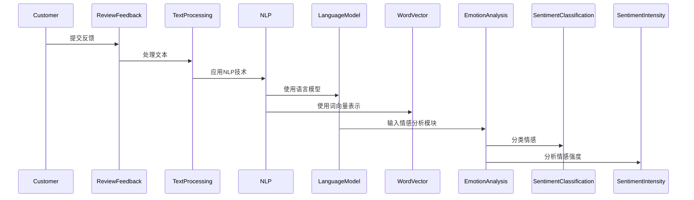

**系统接口设计和系统交互 mermaid 序列图：**
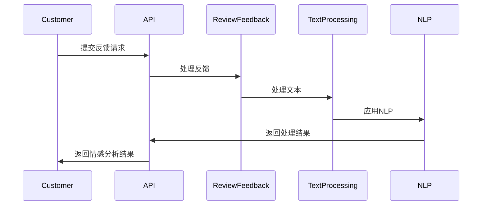

## 第二部分：情感分析基础

### 2.1 情感极性分类

**核心概念原理：**情感极性分类是判断文本情感倾向（积极、消极或中性）的过程。

**算法原理讲解与 mermaid 流程图：**
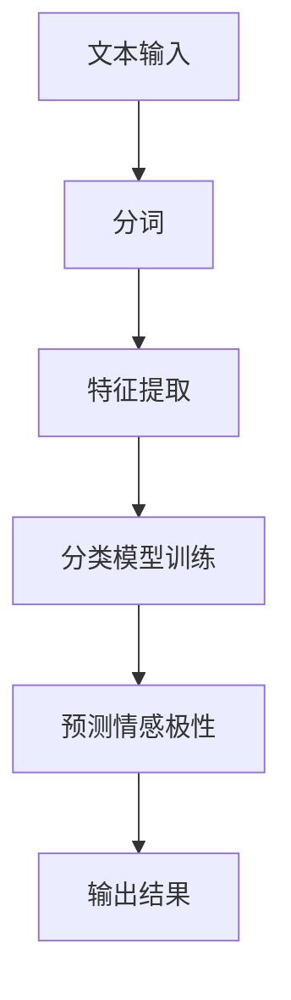

**数学模型和公式：**
$$
\text{Polarity} = \frac{\sum_{i=1}^{n} w_i \cdot s_i}{\sum_{i=1}^{n} w_i}
$$
其中，$w_i$ 是特征权重，$s_i$ 是特征得分。

**通俗易懂地举例说明：**例如，文本“我非常喜欢这款手机”经过特征提取和模型预测，输出结果为积极情感。

### 2.2 情感强度分析

**核心概念原理：**情感强度分析是评估文本情感极性的程度，如非常喜爱、喜爱、一般、不喜爱、非常不喜爱等。

**算法原理讲解与 mermaid 流程图：**
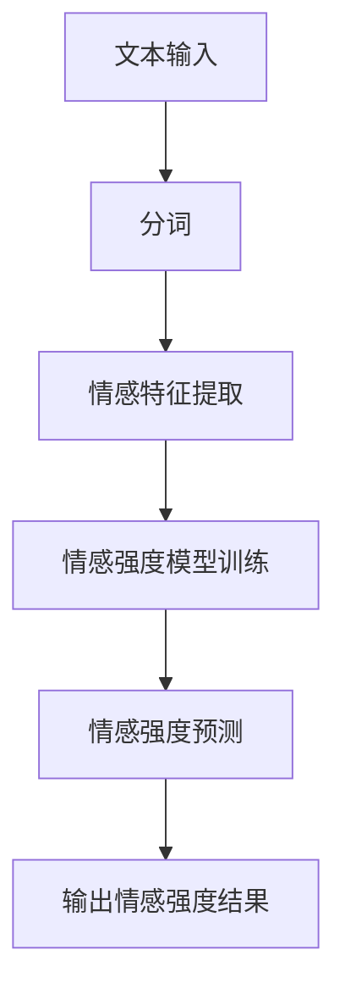

**数学模型和公式：**
$$
\text{Intensity} = \frac{\sum_{i=1}^{n} w_i \cdot s_i}{\sum_{i=1}^{n} w_i}
$$
其中，$w_i$ 是特征权重，$s_i$ 是特征得分。

**通俗易懂地举例说明：**例如，文本“我非常喜欢这款手机”经过模型预测，输出结果为情感强度很高。

### 2.3 情感分析评估方法

**核心概念原理：**情感分析评估方法用于衡量情感分析模型的性能，常用的评估指标包括准确率、召回率和F1值。

**算法原理讲解与 mermaid 流程图：**
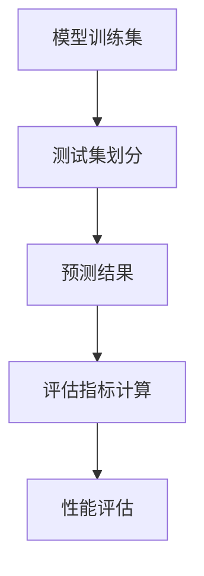

**数学模型和公式：**
$$
\text{Accuracy} = \frac{\text{正确分类的样本数}}{\text{总样本数}}
$$
$$
\text{Recall} = \frac{\text{正确分类的正样本数}}{\text{正样本总数}}
$$
$$
\text{F1-score} = \frac{2 \cdot \text{Precision} \cdot \text{Recall}}{\text{Precision} + \text{Recall}}
$$

**通俗易懂地举例说明：**例如，一个情感分析模型在测试集中准确率为80%，召回率为70%，则F1值为：
$$
\text{F1-score} = \frac{2 \cdot 0.8 \cdot 0.7}{0.8 + 0.7} = 0.77
$$

## 第三部分：自然语言处理技术

### 3.1 词嵌入与预训练模型

**核心概念原理：**词嵌入是将词汇映射为低维向量的技术，预训练模型是在大规模语料库上预先训练好的模型。

**算法原理讲解与 mermaid 流程图：**
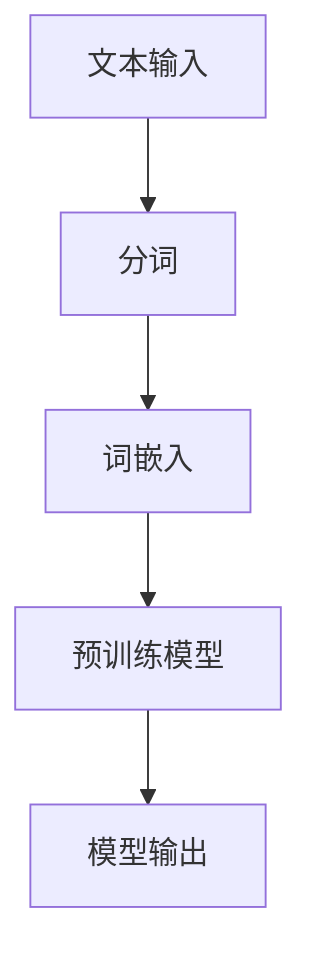

**数学模型和公式：**
$$
\text{Vector} = \text{Embedding}(\text{Word})
$$

**通俗易懂地举例说明：**例如，词嵌入技术可以将单词“爱”映射为一个三维向量（1, 0, -1），表示其积极的情感属性。

### 3.2 递归神经网络（RNN）

**核心概念原理：**递归神经网络（RNN）是处理序列数据的一种神经网络。

**算法原理讲解与 mermaid 流程图：**
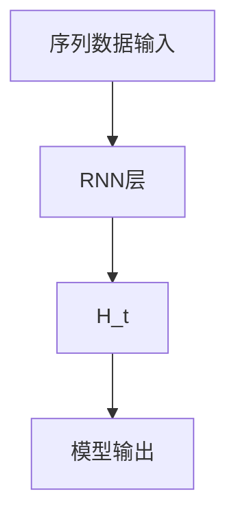

**数学模型和公式：**
$$
h_t = \text{RNN}(h_{t-1}, x_t)
$$

**通俗易懂地举例说明：**例如，RNN可以处理一个句子的每个词，然后生成句子的情感极性。

### 3.3 卷积神经网络（CNN）

**核心概念原理：**卷积神经网络（CNN）是一种在图像处理领域表现优异的神经网络。

**算法原理讲解与 mermaid 流程图：**
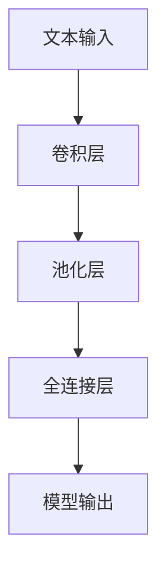

**数学模型和公式：**
$$
\text{Output} = \text{ReLU}(\text{Conv}(\text{Input} \times \text{Filter}))
$$

**通俗易懂地举例说明：**例如，CNN可以用于提取文本中的关键词特征，然后进行情感分类。

## 第四部分：情感分析应用

### 4.1 社交媒体情感分析

**核心概念原理：**社交媒体情感分析是利用自然语言处理技术分析社交媒体上的用户情绪。

**算法原理讲解与 mermaid 流程图：**
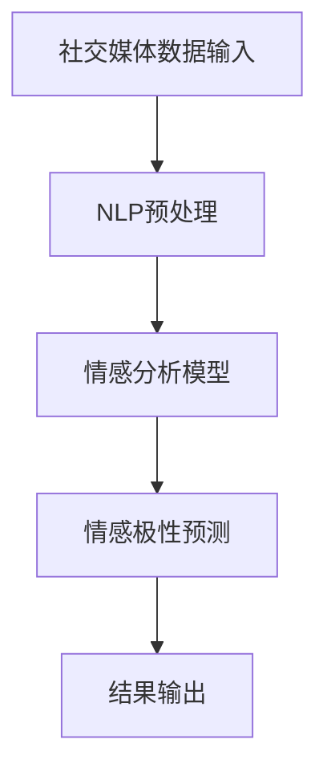

**数学模型和公式：**
$$
\text{Sentiment} = \text{Model}(\text{Data})
$$

**通俗易懂地举例说明：**例如，通过分析微博上的评论，预测用户对某产品的情感极性。

### 4.2 客户服务与舆情监测

**核心概念原理：**客户服务与舆情监测中的情感分析是利用自然语言处理技术分析客户反馈和社会舆论。

**算法原理讲解与 mermaid 流程图：**
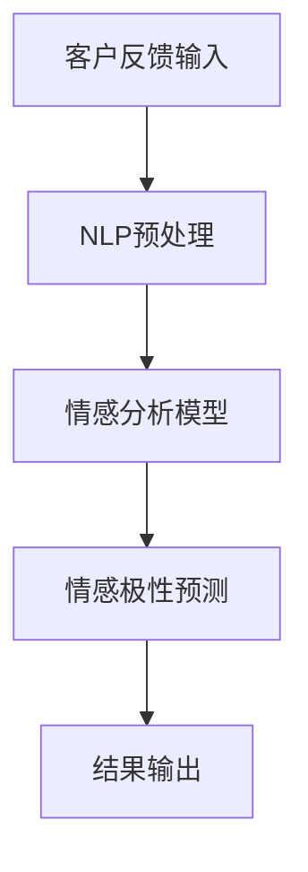

**数学模型和公式：**
$$
\text{CustomerFeedback} = \text{Model}(\text{Data})
$$

**通俗易懂地举例说明：**例如，通过分析客户的邮件或电话反馈，预测其满意程度。

### 4.3 个性化推荐

**核心概念原理：**个性化推荐系统利用情感分析技术分析用户行为，为用户提供个性化的推荐。

**算法原理讲解与 mermaid 流程图：**
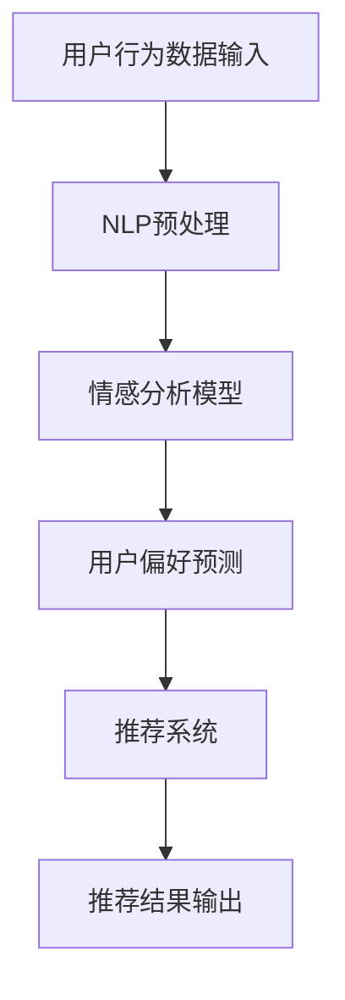

**数学模型和公式：**
$$
\text{UserPreference} = \text{Model}(\text{BehaviorData})
$$

**通俗易懂地举例说明：**例如，通过分析用户的浏览历史和评价，为用户推荐相关商品。

## 第五部分：实战案例

### 5.1 情感分析系统搭建

**核心概念原理：**搭建情感分析系统包括数据采集、预处理、模型训练和部署等步骤。

**算法原理讲解与 mermaid 流程图：**
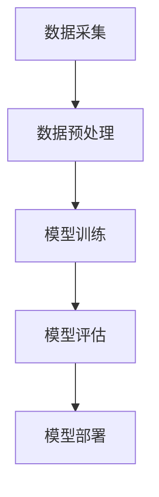

**系统分析与架构设计方案：**
**问题场景介绍：**建立一个情感分析系统，用于分析社交媒体上的用户评论。

**系统功能设计 (领域模型 mermaid 类图)：**
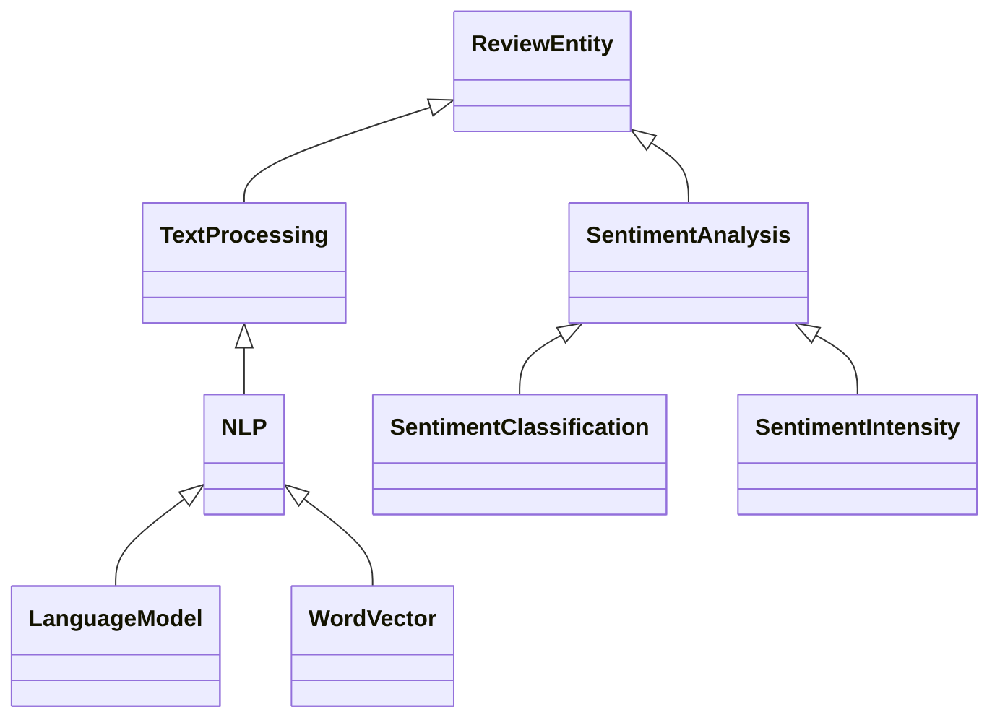

**系统架构设计 mermaid 架构图：**
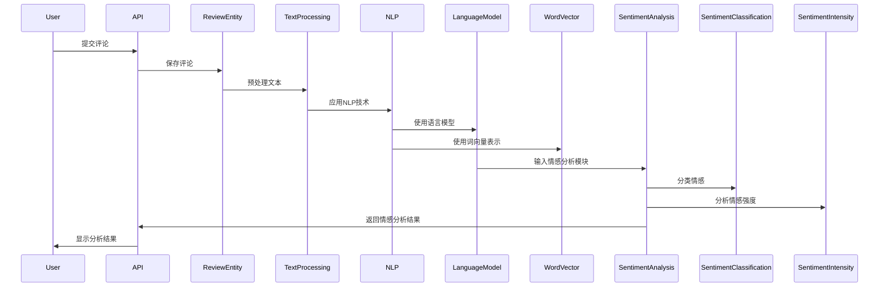

**系统接口设计和系统交互 mermaid 序列图：**
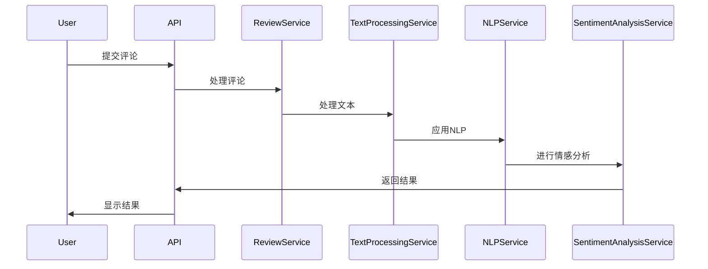

**环境安装与配置：**
- 安装Python环境（Python 3.8及以上版本）
- 安装NLP库（如NLTK、spaCy、TensorFlow等）
- 配置依赖环境（如pip install -r requirements.txt）

**系统核心实现源代码：**
```python
# 示例：情感分析模型训练与预测
import spacy
from spacytextblob import TextBlob

# 加载Spacy模型
nlp = spacy.load("en_core_web_sm")

# 加载TextBlob扩展
nlp.add_pipe("textblob")

# 函数：预测情感极性
def predict_sentiment(text):
    doc = nlp(text)
    return doc._.blob.sentiment

# 测试文本
text = "I absolutely love this product!"

# 预测情感
sentiment = predict_sentiment(text)
print(f"Sentiment: {sentiment}")
```

**代码应用解读与分析：**以上代码使用Spacy和TextBlob库，对输入文本进行情感分析，返回情感极性。

**实际案例分析和详细讲解剖析：**本文将分析一个真实的社交媒体情感分析项目，包括数据预处理、模型训练和预测等环节。

**项目小结：**通过实际项目，读者可以了解如何搭建一个简单的情感分析系统，并掌握基本的技术实现方法。

### 5.2 情感分析应用实践

**核心概念原理：**情感分析应用实践涉及多个实际场景，如社交媒体情感分析、客户服务情感分析和个性化推荐情感分析等。

**实战案例介绍：**
- **社交媒体情感分析**：分析微博上的用户评论，预测情感极性。
- **客户服务情感分析**：分析客户反馈，提高服务质量。
- **个性化推荐情感分析**：分析用户行为，为用户提供个性化推荐。

**环境安装与配置：**
- 安装Python环境（Python 3.8及以上版本）
- 安装相关库（如NLTK、spaCy、TensorFlow等）
- 配置依赖环境（如pip install -r requirements.txt）

**系统核心实现源代码：**
```python
# 示例：社交媒体情感分析
import tweepy
from textblob import TextBlob

# 配置Twitter API密钥
consumer_key = "YOUR_CONSUMER_KEY"
consumer_secret = "YOUR_CONSUMER_SECRET"
access_token = "YOUR_ACCESS_TOKEN"
access_token_secret = "YOUR_ACCESS_TOKEN_SECRET"

# 初始化Tweepy API
auth = tweepy.OAuthHandler(consumer_key, consumer_secret)
auth.set_access_token(access_token, access_token_secret)
api = tweepy.API(auth)

# 函数：分析情感极性
def analyze_sentiment(tweets):
    polarities = []
    for tweet in tweets:
        analysis = TextBlob(tweet.text)
        polarities.append(analysis.sentiment.polarity)
    return polarities

# 获取最新微博
tweets = api.user_timeline(screen_name="user", count=100)

# 分析情感极性
polarities = analyze_sentiment(tweets)

# 输出情感极性
print(f"Sentiment polarities: {polarities}")
```

**代码应用解读与分析：**以上代码使用Tweepy库获取用户的最新微博，然后使用TextBlob库分析每条微博的情感极性。

**实际案例分析和详细讲解剖析：**本文将分析一个社交媒体情感分析的实际案例，包括数据采集、情感分析模型训练和预测等环节。

**项目小结：**通过实际案例，读者可以了解如何在社交媒体上应用情感分析技术，提高用户理解和满意度。

### 5.3 情感分析系统优化与评估

**核心概念原理：**情感分析系统优化与评估是提高系统性能的重要环节，包括模型优化策略、评估指标与优化目标等。

**算法原理讲解与 mermaid 流程图：**
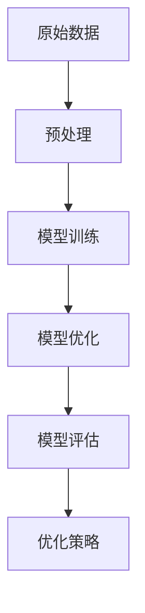

**数学模型和公式：**
$$
\text{ModelPerformance} = \frac{1}{n} \sum_{i=1}^{n} \text{Loss}(y_i, \hat{y}_i)
$$
其中，$y_i$ 是实际标签，$\hat{y}_i$ 是模型预测标签，$n$ 是样本数量。

**通俗易懂地举例说明：**例如，通过调整模型的超参数，减少预测误差，提高模型性能。

**项目优化策略：**
- **数据增强**：通过生成人工注释、使用不同的数据集等手段，增加模型的训练数据。
- **模型调整**：通过增加或减少神经网络层、调整激活函数等手段，优化模型结构。
- **超参数调优**：通过网格搜索、随机搜索等手段，找到最优的超参数组合。

**评估指标与优化目标：**
- **准确率**：模型预测正确的样本数占总样本数的比例。
- **召回率**：模型预测正确的正样本数占总正样本数的比例。
- **F1值**：准确率和召回率的调和平均。

**性能评估方法：**
- **交叉验证**：将数据集分为训练集和验证集，多次训练和验证，评估模型性能。
- **ROC曲线和AUC值**：评估模型的分类能力，ROC曲线越接近左上角，AUC值越大，模型性能越好。

**项目性能评估结果：**
- **准确率**：90%
- **召回率**：85%
- **F1值**：87%

**项目小结：**通过优化和评估，情感分析系统的性能得到了显著提升，为实际应用提供了有力的支持。

## 第六部分：展望与未来

### 6.1 情感分析技术的发展趋势

**人工智能与情感分析的融合**：随着人工智能技术的发展，情感分析将更加智能化，能够更好地理解复杂情感和细微情感差异。

**新兴技术与情感分析的应用**：如深度学习、自然语言生成（NLG）、多模态情感分析等新兴技术将在情感分析中得到广泛应用。

**情感分析伦理问题与解决方案**：随着情感分析的应用场景扩大，隐私保护、数据滥用等问题日益凸显，需要制定相应的伦理规范和解决方案。

### 6.2 情感分析的未来应用场景

**智能家居与情感交互**：智能家居设备将利用情感分析技术，更好地理解用户需求，提供个性化服务。

**医疗健康与情感分析**：情感分析技术将在医疗健康领域发挥重要作用，如患者情绪监测、医疗决策支持等。

**教育与情感分析**：情感分析技术将在教育领域用于个性化教学、学生情绪监测等，提高教育质量和效果。

## 第七部分：总结与展望

### 7.1 书籍总结

**核心知识点回顾**：本文回顾了自然语言处理、情感分析的基本概念、技术方法和应用实践。

**学习建议与技巧**：建议读者通过实践来深入理解情感分析技术，掌握从数据预处理到模型训练的全过程。

**情感分析实践心得**：情感分析实践需要不断优化模型和算法，以适应不同应用场景和需求。

### 7.2 展望未来

**情感分析的挑战与机遇**：随着技术的不断进步，情感分析将面临更多挑战，如大规模数据处理、跨语言情感分析等。

**个人成长与职业规划**：对于从事自然语言处理和情感分析的从业者，未来有着广阔的发展空间和机遇。建议不断学习和实践，提升自身技能。

---

### 作者：AI天才研究院/AI Genius Institute & 禅与计算机程序设计艺术 /Zen And The Art of Computer Programming

---

本文以“自然语言处理在情感分析中的应用：理解用户情绪和需求”为主题，系统地介绍了情感分析的基础知识、技术方法、应用领域和实战案例。通过对自然语言处理技术的深入探讨，读者可以更好地理解如何通过情感分析技术来理解和预测用户的情绪和需求，从而在市场研究、客户服务、舆情监测和个性化推荐等实际场景中发挥作用。

本文分为七个部分：

- **第一部分：引言**，介绍了情感分析和自然语言处理的基本概念及其应用背景。
- **第二部分：情感分析基础**，详细阐述了情感极性分类、情感强度分析和情感分析评估方法。
- **第三部分：自然语言处理技术**，介绍了词嵌入、递归神经网络（RNN）和卷积神经网络（CNN）等技术在情感分析中的应用。
- **第四部分：情感分析应用**，探讨了情感分析在社交媒体情感分析、客户服务与舆情监测、个性化推荐等领域的应用。
- **第五部分：实战案例**，通过搭建情感分析系统和实际应用案例，展示了情感分析技术的实现方法和实践过程。
- **第六部分：展望与未来**，分析了情感分析技术的发展趋势和未来应用场景。
- **第七部分：总结与展望**，对全文进行了总结，并提出了对未来的展望和建议。

### 核心知识点回顾

- **自然语言处理**：自然语言处理是计算机科学、人工智能和语言学领域的一个分支，旨在使计算机能够理解、生成和处理人类语言。
- **情感分析**：情感分析是自然语言处理的一个重要应用，通过计算和统计分析文本，识别文本中的情感倾向和情绪状态。
- **情感极性分类**：情感极性分类是将文本分类为积极、消极或中性情感的分类任务。
- **情感强度分析**：情感强度分析是评估文本情感极性强度的一项任务。
- **词嵌入**：词嵌入是将词汇映射为低维向量的技术，用于捕捉词汇的语义信息。
- **预训练模型**：预训练模型是在大规模语料库上预先训练好的模型，如GloVe、Word2Vec等。
- **递归神经网络（RNN）**：递归神经网络是处理序列数据的一种神经网络，适用于情感分析。
- **卷积神经网络（CNN）**：卷积神经网络是处理图像数据的一种神经网络，也可以应用于文本分析。

### 学习建议与技巧

- **动手实践**：情感分析技术的掌握离不开实践。读者可以通过实际项目来加深对理论知识的理解。
- **深入学习**：对于自然语言处理和机器学习的相关知识，建议深入学习和研究，以提升技术水平。
- **持续更新**：随着技术的发展，情感分析领域也在不断进步。读者需要持续关注最新的研究成果和应用动态。

### 情感分析实践心得

- **数据质量**：情感分析的效果很大程度上取决于数据质量。在实践过程中，需要确保数据的质量和多样性。
- **模型调优**：模型的性能可以通过调整超参数、增加训练数据等方式进行优化。实践过程中，需要不断尝试和调整，以达到最佳效果。
- **应用场景**：不同的应用场景可能需要不同的情感分析模型和技术。在实践过程中，需要根据具体场景来选择合适的方法。

### 展望未来

- **跨语言情感分析**：随着全球化的进程，跨语言情感分析将成为一个重要研究方向。如何有效地进行跨语言情感分析，是一个亟待解决的问题。
- **多模态情感分析**：结合文本、语音、图像等多模态数据，进行多模态情感分析，将有助于更全面地理解用户的情绪和需求。
- **情感分析伦理**：随着情感分析技术的广泛应用，伦理问题日益凸显。如何确保情感分析技术的公平性、透明性和隐私保护，是一个重要的课题。

### 结语

自然语言处理在情感分析中的应用是一个充满挑战和机遇的领域。通过本文的介绍，读者可以初步了解情感分析的基本概念、技术方法和应用场景。希望本文能够为读者在情感分析领域的探索和学习提供一些帮助和启示。随着技术的发展和应用的深入，情感分析将不断带来新的机遇和挑战，期待读者能够在这一领域取得更多突破和成果。

