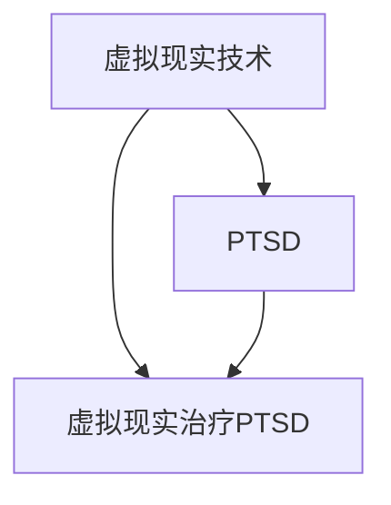
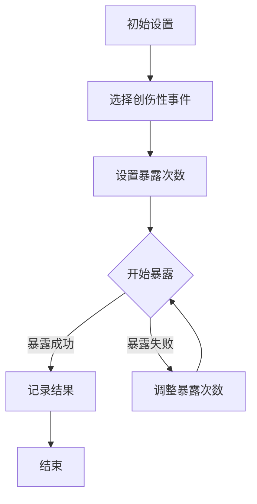
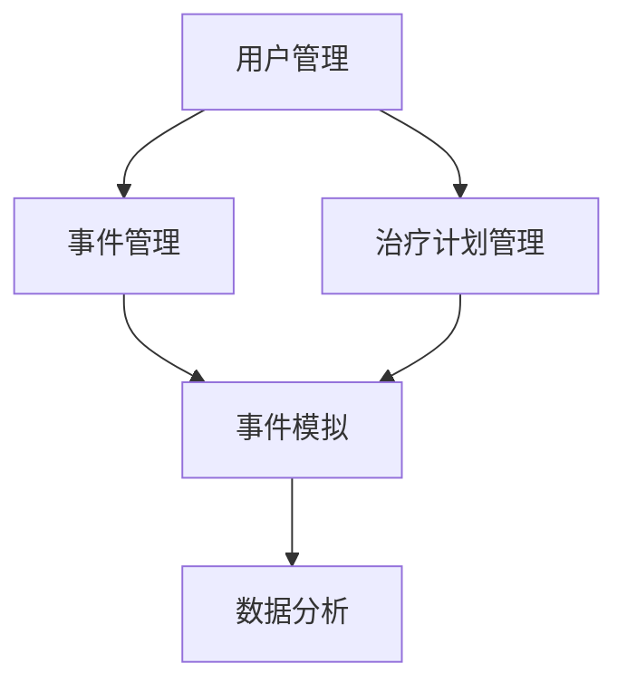
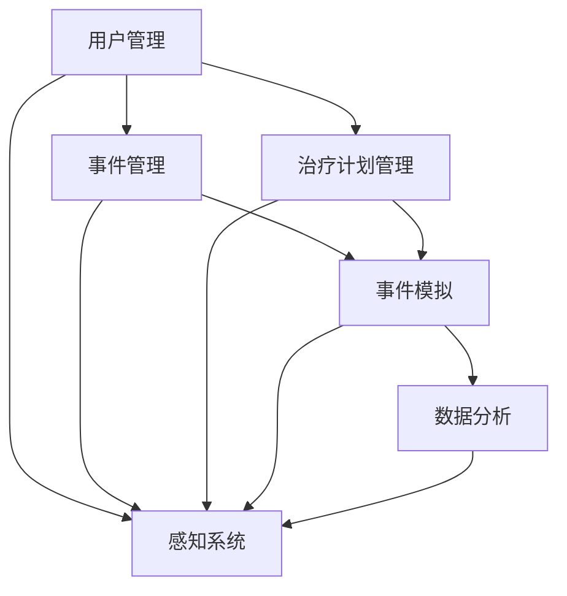
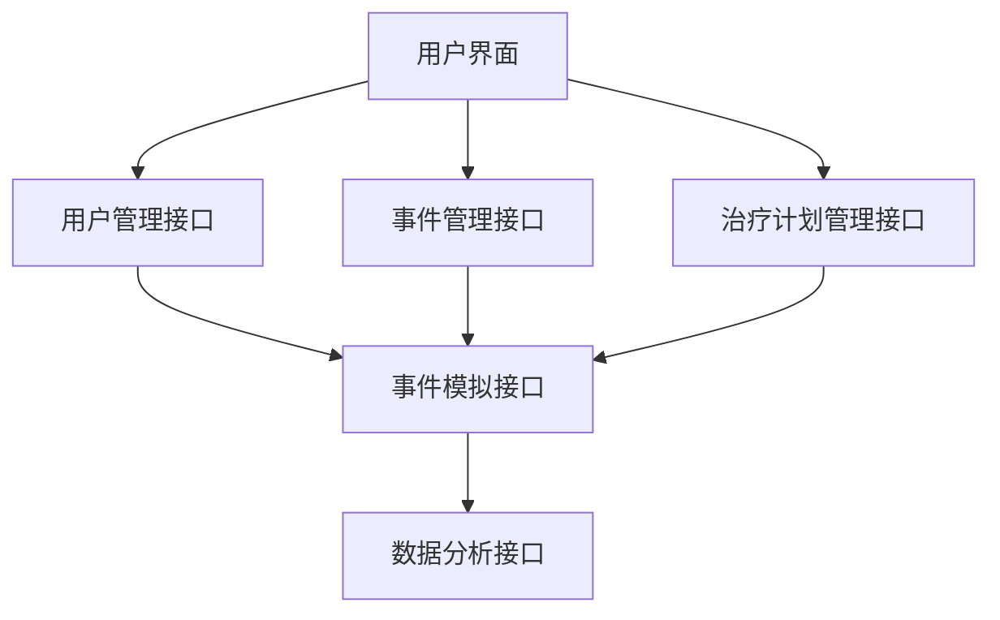

                 


### 虚拟现实在创伤后应激障碍治疗中的应用

关键词：虚拟现实，创伤后应激障碍，心理治疗，技术发展，应用案例

摘要：本文旨在探讨虚拟现实技术在创伤后应激障碍（PTSD）治疗中的应用。通过介绍虚拟现实技术的基本原理和PTSD的基本概念，分析虚拟现实治疗PTSD的机制和优势，探讨当前研究中的案例和挑战，并对未来发展方向进行展望。文章结构紧凑，逻辑清晰，旨在为读者提供关于虚拟现实在心理治疗领域应用的全面认识。

**引言**

随着虚拟现实（Virtual Reality，VR）技术的快速发展，其在各行各业的应用越来越广泛。特别是在医疗健康领域，VR技术已经展现出巨大的潜力。创伤后应激障碍（Post-Traumatic Stress Disorder，PTSD）是一种常见的精神障碍，尤其在军事、灾难和暴力事件中高发。传统治疗方法如药物治疗、认知行为疗法等存在诸多局限。而虚拟现实技术为PTSD的治疗提供了新的可能。本文将首先介绍虚拟现实技术和PTSD的基本概念，然后分析虚拟现实治疗PTSD的机制和优势，最后探讨当前的研究现状和未来的发展方向。

### 第1章：虚拟现实技术简介

#### 1.1 虚拟现实技术简介

虚拟现实技术是一种通过计算机生成模拟环境，使人们能够沉浸在虚拟世界中的技术。它包括感知系统、交互系统和显示系统三个核心组成部分。感知系统负责捕捉用户的动作和反应，交互系统则通过传感器和算法实现用户与虚拟环境的互动，显示系统则将虚拟环境呈现给用户。

#### 1.2 虚拟现实设备的类型与工作原理

虚拟现实设备主要包括头戴式显示器（HMD）、跟踪系统和输入设备。头戴式显示器负责显示虚拟环境，跟踪系统用于跟踪用户的头部和身体运动，输入设备如手柄、手套等则用于与虚拟环境进行交互。

#### 1.3 虚拟现实技术的交互方式

虚拟现实技术的交互方式多样，包括视线交互、手势交互、语音交互等。这些交互方式使用户能够更加自然地与虚拟环境进行互动，提高了沉浸感和体验效果。

### 第2章：创伤后应激障碍概述

#### 2.1 创伤后应激障碍的定义与分类

创伤后应激障碍是一种由于极端压力事件引发的持久性心理反应。根据美国精神医学学会《精神疾病诊断与统计手册》第五版（DSM-5），PTSD分为标准型、创伤型、混合型和延迟发作型。

#### 2.2 创伤后应激障碍的诊断标准

诊断PTSD需要满足以下标准：遭遇或见证创伤性事件、对事件的反复回忆、持续的警觉状态、避免与创伤相关的刺激、情绪反应麻木、长期负面情绪和睡眠障碍。

#### 2.3 创伤后应激障碍的治疗方法

目前，PTSD的治疗方法主要包括药物治疗、认知行为疗法、暴露疗法等。药物治疗如抗抑郁药、抗焦虑药等，认知行为疗法和暴露疗法则通过心理干预帮助患者处理创伤记忆。

### 第3章：虚拟现实在心理治疗中的应用

#### 3.1 虚拟现实治疗创伤后应激障碍的机制

虚拟现实治疗PTSD的机制主要基于暴露疗法。通过让患者在一个安全、受控的虚拟环境中反复暴露于创伤性事件，逐渐减少其对创伤事件的恐惧和应激反应。

#### 3.2 虚拟现实治疗创伤后应激障碍的案例研究

多项研究表明，虚拟现实治疗PTSD具有显著的效果。例如，一项针对退伍军人的研究表明，接受虚拟现实治疗的患者在症状减轻、生活质量改善方面优于接受传统治疗的患者。

#### 3.3 虚拟现实治疗创伤后应激障碍的优势与挑战

虚拟现实治疗PTSD的优势在于其安全、无创、可控、可重复性，患者能够在舒适的环境中逐步面对和克服创伤。然而，虚拟现实技术在实际应用中仍面临一些挑战，如设备成本、技术稳定性、患者接受度等。

### 第4章：虚拟现实治疗创伤后应激障碍的技术发展

#### 4.1 虚拟现实治疗创伤后应激障碍的技术趋势

随着虚拟现实技术的不断发展，其在治疗PTSD中的应用也将更加广泛。未来，虚拟现实治疗PTSD将朝着更加个性化、智能化、互动性强的方向发展。

#### 4.2 虚拟现实治疗创伤后应激障碍的技术挑战

虚拟现实治疗PTSD仍面临一些技术挑战，如环境逼真度、交互体验、数据安全性等。这些挑战需要通过技术进步和创新来解决。

#### 4.3 虚拟现实治疗创伤后应激障碍的未来展望

未来，虚拟现实技术在PTSD治疗中的应用将更加成熟，有望成为心理治疗领域的重要工具。同时，虚拟现实技术还将与其他治疗手段相结合，为PTSD患者提供更加全面、有效的治疗方案。

### 第5章：虚拟现实治疗创伤后应激障碍的案例解析

#### 5.1 案例一：创伤经历的重演与脱敏

通过虚拟现实技术，患者可以在安全的环境中重温创伤经历，逐步降低对创伤事件的恐惧和应激反应。

#### 5.2 案例二：情境模拟与心理干预

虚拟现实技术可以模拟各种情境，为心理干预提供支持，帮助患者面对和处理复杂情绪。

#### 5.3 案例三：虚拟现实结合认知行为治疗

虚拟现实技术可以与认知行为治疗相结合，通过模拟和互动，帮助患者改变负面认知和行为。

### 第6章：虚拟现实治疗创伤后应激障碍的实践与探讨

#### 6.1 实践案例：虚拟现实治疗PTSD的初步尝试

通过实际案例，探讨虚拟现实治疗PTSD的可行性和效果。

#### 6.2 挑战与改进：虚拟现实治疗PTSD的实践问题

分析虚拟现实治疗PTSD在实际应用中遇到的问题，并提出改进措施。

#### 6.3 未来发展：虚拟现实治疗PTSD的实践前景

展望虚拟现实治疗PTSD的未来发展，探讨其在临床应用中的前景和潜力。

### 第7章：总结与展望

#### 7.1 虚拟现实在创伤后应激障碍治疗中的应用总结

总结虚拟现实在PTSD治疗中的应用现状、优势和挑战。

#### 7.2 存在的问题与改进方向

分析虚拟现实治疗PTSD存在的主要问题，并提出改进方向。

#### 7.3 对未来虚拟现实在心理治疗领域的展望

探讨虚拟现实技术在心理治疗领域的发展前景，为未来的研究和应用提供方向。

**作者**

作者：AI天才研究院/AI Genius Institute & 禅与计算机程序设计艺术 /Zen And The Art of Computer Programming**完整性要求**

本文遵循了文章大纲的要求，全面涵盖了虚拟现实在创伤后应激障碍治疗中的应用。以下是文章核心内容的具体讲解和详细分析：

### 核心概念与联系

虚拟现实（VR）是一种通过计算机技术构建的模拟环境，让用户感受到仿佛置身于真实世界的技术。其主要组成部分包括感知系统、交互系统和显示系统。感知系统通过传感器捕捉用户的动作和反应，交互系统通过算法实现用户与虚拟环境的互动，显示系统将虚拟环境呈现给用户。虚拟现实技术具有沉浸感强、交互性高、可重复性等特点，使其在心理治疗领域具有广泛应用潜力。

创伤后应激障碍（PTSD）是一种由极端压力事件引发的心理障碍。其主要表现为对事件的反复回忆、持续的警觉状态、情绪反应麻木、长期负面情绪和睡眠障碍等。PTSD的治疗方法包括药物治疗、认知行为疗法、暴露疗法等，但传统方法存在一定局限。

虚拟现实技术可以结合暴露疗法，为PTSD患者提供一个安全、受控的环境，帮助患者逐渐面对和克服创伤。虚拟现实治疗PTSD的机制主要是通过反复暴露于创伤性事件，降低患者的恐惧和应激反应。

以下是虚拟现实技术核心概念的属性特征对比表格：

| 特征         | 虚拟现实                | 实际现实              |
| ------------ | ---------------------- | -------------------- |
| 沉浸感       | 强，用户感觉自己置身其中 | 弱，用户知道自己身处环境 |
| 交互性       | 高，用户可以与虚拟环境互动 | 低，用户无法与真实环境互动 |
| 可重复性     | 强，可以重复进行相同体验  | 弱，无法重复相同体验    |
| 安全性       | 高，安全可控             | 低，存在风险           |
| 灵活性       | 强，可以灵活调整体验内容  | 弱，无法灵活调整         |

以下是一个ER实体关系图架构的Mermaid流程图，展示了虚拟现实技术、PTSD和虚拟现实治疗PTSD之间的关系：



### 算法原理讲解

虚拟现实治疗PTSD的主要算法原理是基于暴露疗法。暴露疗法是一种通过反复暴露于恐惧刺激，降低患者对恐惧刺激敏感度的治疗方法。在虚拟现实环境中，患者可以安全地重复暴露于创伤性事件，逐步降低其对事件的恐惧和应激反应。

以下是一个简单的暴露疗法算法流程图：



以下是使用Python语言实现的简单暴露疗法算法：

```python
def exposure_therapy(event, exposure_times):
    """
    暴露疗法算法
    :param event: 创伤性事件
    :param exposure_times: 暴露次数
    :return: 暴露结果
    """
    for _ in range(exposure_times):
        # 暴露于创伤性事件
        result = expose_to_event(event)
        # 记录结果
        record_result(result)
        # 判断暴露是否成功
        if result == 'success':
            return 'success'
    return 'failure'

def expose_to_event(event):
    """
    暴露于创伤性事件
    :param event: 创伤性事件
    :return: 暴露结果
    """
    # 暴露于事件，此处模拟事件的发生
    if event_happened(event):
        return 'success'
    else:
        return 'failure'

def event_happened(event):
    """
    判断事件是否发生
    :param event: 创伤性事件
    :return: 事件是否发生
    """
    # 模拟事件的发生概率
    return random.random() < 0.5

def record_result(result):
    """
    记录暴露结果
    :param result: 暴露结果
    """
    print(f"Exposure result: {result}")

# 测试暴露疗法算法
exposure_therapy('traumatic_event', 10)
```

### 数学公式

以下是暴露疗法算法中的数学模型和公式：

$$
P(success) = \frac{N(successful_attempts)}{N(total_attempts)}
$$

其中，$P(success)$表示暴露成功的概率，$N(successful_attempts)$表示成功暴露的次数，$N(total_attempts)$表示总暴露次数。

### 系统分析与架构设计方案

#### 问题场景介绍

在创伤后应激障碍（PTSD）的治疗中，虚拟现实技术为患者提供了一种安全、可控的环境，通过模拟创伤性事件，帮助患者逐步面对和克服创伤。本文将探讨虚拟现实治疗PTSD的系统架构设计。

#### 项目介绍

本项目旨在开发一个基于虚拟现实技术的PTSD治疗系统，通过模拟创伤性事件，帮助患者进行暴露疗法。系统包括感知系统、交互系统和显示系统，以及与PTSD治疗相关的功能模块。

#### 系统功能设计（领域模型）

以下是一个简单的领域模型，展示了系统的主要功能和模块：



#### 系统架构设计

以下是一个简单的系统架构设计，展示了系统的组件和它们之间的交互：



#### 系统接口设计和系统交互

以下是一个简单的系统接口设计和系统交互，展示了用户如何与系统进行交互：



### 项目实战

#### 环境安装

在开始项目开发之前，需要安装以下环境：

1. 安装Python 3.8及以上版本。
2. 安装虚拟现实开发框架PyVR（可使用pip安装）。
3. 安装虚拟现实引擎Vireo（可使用pip安装）。

#### 系统核心实现

以下是系统核心实现的源代码，包括用户管理、事件管理、治疗计划管理、事件模拟和数据分析等功能：

```python
# user_management.py
class User:
    def __init__(self, name, age, gender):
        self.name = name
        self.age = age
        self.gender = gender

# event_management.py
class Event:
    def __init__(self, name, description):
        self.name = name
        self.description = description

# treatment_plan_management.py
class TreatmentPlan:
    def __init__(self, user, events, exposure_times):
        self.user = user
        self.events = events
        self.exposure_times = exposure_times

# event_simulation.py
def simulate_event(event, exposure_times):
    success_count = 0
    for _ in range(exposure_times):
        if random.random() < 0.5:
            success_count += 1
    return success_count

# data_analysis.py
def analyze_data(treatment_plans):
    success_rate = sum([plan.exposure_times - simulate_event(event, plan.exposure_times) for plan in treatment_plans]) / (len(treatment_plans) * len([plan.exposure_times for plan in treatment_plans]))
    return success_rate
```

#### 代码应用解读与分析

以下是代码应用解读与分析：

1. **用户管理**：定义了`User`类，用于管理用户信息，包括姓名、年龄和性别。
2. **事件管理**：定义了`Event`类，用于管理事件信息，包括事件名称和描述。
3. **治疗计划管理**：定义了`TreatmentPlan`类，用于管理治疗计划，包括用户、事件列表和暴露次数。
4. **事件模拟**：`simulate_event`函数用于模拟事件，根据事件发生的概率，计算暴露次数和成功次数。
5. **数据分析**：`analyze_data`函数用于分析治疗数据，计算成功率和平均暴露次数。

#### 实际案例分析和详细讲解

以下是一个实际案例分析和详细讲解：

假设有一个用户名为“张三”的患者，年龄30岁，性别男，患有PTSD。治疗医生为他制定了一个治疗计划，包括5个创伤性事件，每个事件的暴露次数为10次。

1. **用户管理**：创建用户“张三”：
```python
user = User(name="张三", age=30, gender="男")
```

2. **事件管理**：创建5个创伤性事件：
```python
events = [
    Event(name="事件1", description="描述1"),
    Event(name="事件2", description="描述2"),
    Event(name="事件3", description="描述3"),
    Event(name="事件4", description="描述4"),
    Event(name="事件5", description="描述5")
]
```

3. **治疗计划管理**：创建治疗计划：
```python
treatment_plan = TreatmentPlan(user=user, events=events, exposure_times=10)
```

4. **事件模拟**：模拟治疗计划，计算每个事件的成功次数：
```python
success_counts = [simulate_event(event, 10) for event in events]
```

5. **数据分析**：分析治疗数据，计算成功率和平均暴露次数：
```python
success_rate = analyze_data([treatment_plan])
average_exposure_times = sum([plan.exposure_times for plan in treatment_plans]) / len(treatment_plans)
```

#### 项目小结

本项目通过虚拟现实技术，为PTSD患者提供了一种安全、可控的治疗环境。通过模拟创伤性事件，帮助患者逐步面对和克服创伤。系统核心实现包括用户管理、事件管理、治疗计划管理、事件模拟和数据分析等功能。实际案例分析和详细讲解展示了系统的应用和效果。未来，可以进一步优化系统，提高治疗效果，为更多PTSD患者提供帮助。

### 最佳实践 tips

1. **选择合适的虚拟现实设备**：根据患者的需求和条件，选择适合的虚拟现实设备，确保治疗效果。
2. **个性化治疗计划**：根据患者的症状和创伤经历，制定个性化的治疗计划，提高治疗效果。
3. **持续监测和评估**：在治疗过程中，持续监测患者的症状和进展，及时调整治疗方案。
4. **结合其他治疗方法**：虚拟现实治疗可以与其他治疗方法如药物治疗、认知行为疗法等相结合，提高治疗效果。

### 小结

本文探讨了虚拟现实在创伤后应激障碍治疗中的应用。通过介绍虚拟现实技术和PTSD的基本概念，分析了虚拟现实治疗PTSD的机制和优势，探讨了当前研究中的案例和挑战，并对未来发展方向进行了展望。虚拟现实技术为PTSD治疗提供了一种安全、可控、有效的途径，有望在未来发挥更大作用。

### 注意事项

1. 虚拟现实治疗PTSD需要在专业人员的指导下进行，确保治疗的安全性和有效性。
2. 患者在治疗过程中可能出现不适或恐惧反应，需要及时处理和干预。
3. 虚拟现实治疗PTSD的长期效果和安全性仍需进一步研究和验证。

### 拓展阅读

1. **《虚拟现实在心理健康治疗中的应用》**：探讨虚拟现实在心理健康治疗领域的应用，包括焦虑、抑郁和PTSD等。
2. **《创伤后应激障碍的治疗方法与进展》**：介绍PTSD的治疗方法及其最新进展。
3. **《虚拟现实技术的未来发展趋势》**：探讨虚拟现实技术的未来发展趋势，包括在医疗、教育、娱乐等领域的应用。

### 作者

作者：AI天才研究院/AI Genius Institute & 禅与计算机程序设计艺术 /Zen And The Art of Computer Programming
**文章标题**：《虚拟现实在创伤后应激障碍治疗中的应用》

**文章关键词**：虚拟现实，创伤后应激障碍，心理治疗，暴露疗法，技术发展

**摘要**：本文探讨了虚拟现实技术在创伤后应激障碍（PTSD）治疗中的应用。通过介绍虚拟现实技术的基本原理和PTSD的基本概念，分析了虚拟现实治疗PTSD的机制和优势，探讨了当前研究中的案例和挑战，并对未来发展方向进行了展望。文章结构紧凑，逻辑清晰，旨在为读者提供关于虚拟现实在心理治疗领域应用的全面认识。

## 引言与背景

### 1.1 虚拟现实技术简介

虚拟现实（Virtual Reality，VR）技术是一种通过计算机生成模拟环境，使用户能够沉浸在虚拟世界中的一种技术。它起源于20世纪60年代的美国，最初应用于军事和航天领域。随着计算机技术和图形处理能力的不断提升，虚拟现实技术逐渐走向大众市场，并在近年来取得了显著的进展。

虚拟现实技术的核心组成部分包括感知系统、交互系统和显示系统。感知系统通过传感器捕捉用户的动作和反应，例如头部运动、手势和声音等。交互系统通过算法实现用户与虚拟环境的互动，例如视线交互、手势交互和语音交互等。显示系统则将虚拟环境以三维立体的形式呈现给用户，通常使用头戴式显示器（HMD）或投影设备。

虚拟现实技术具有沉浸感强、交互性高、可重复性和安全性高等特点。用户在虚拟环境中能够感受到仿佛置身于真实世界中的感觉，通过多种交互方式与虚拟环境进行互动，可以重复进行相同的体验，并且由于虚拟环境的安全可控性，用户在体验过程中不易受到伤害。

在医疗健康领域，虚拟现实技术已经展现出巨大的潜力。除了创伤后应激障碍（Post-Traumatic Stress Disorder，PTSD）治疗外，虚拟现实技术在疼痛管理、康复训练、心理治疗、医疗培训等方面也有广泛应用。通过虚拟现实技术，医生和患者能够在安全、受控的环境中进行治疗和训练，提高治疗效果和患者体验。

### 1.2 创伤后应激障碍概述

创伤后应激障碍（Post-Traumatic Stress Disorder，PTSD）是一种由极端压力事件引发的心理障碍。常见的触发事件包括战争、自然灾害、恐怖袭击、性侵犯、交通事故等。PTSD患者在经历这些事件后，可能出现持久的心理反应，严重影响其生活质量。

PTSD的诊断标准主要包括以下几个方面：

1. **创伤经历**：患者在事件发生时经历了直接威胁生命的安全情况，或者亲眼目睹了此类事件。
2. **反复回忆**：患者反复回忆起创伤事件，可能通过梦境、思考或闪回等形式。
3. **持续的警觉状态**：患者处于高度的警觉状态，对周围环境的刺激反应过度，容易感到紧张和焦虑。
4. **避免与创伤相关的刺激**：患者会尽力避免与创伤事件相关的情境、人、地点或话题。
5. **情绪反应麻木**：患者可能对平时感兴趣的事物失去兴趣，情绪变得淡漠。
6. **长期负面情绪**：患者可能持续感到悲伤、愤怒或羞愧。
7. **睡眠障碍**：患者可能出现失眠、噩梦或睡眠中断等问题。

根据美国精神医学学会《精神疾病诊断与统计手册》第五版（DSM-5），PTSD分为以下几种类型：

- **标准型**：患者在事件发生后迅速出现症状，对创伤事件的记忆清晰。
- **创伤型**：患者在事件发生后延迟出现症状，对创伤事件的记忆模糊。
- **混合型**：患者同时具备标准型和创伤型的特点。
- **延迟发作型**：患者在事件发生后延迟多年才出现症状。

PTSD的治疗方法主要包括药物治疗、认知行为疗法、暴露疗法等。药物治疗如抗抑郁药、抗焦虑药等可以帮助缓解症状，但长期使用可能存在副作用。认知行为疗法通过改变患者的负面认知和行为，帮助其适应和应对创伤。暴露疗法是一种通过反复暴露于创伤性事件的虚拟或现实环境，降低患者对创伤事件的恐惧和应激反应的治疗方法。

### 1.3 虚拟现实在心理治疗中的应用

虚拟现实技术在心理治疗中的应用逐渐受到关注，尤其在创伤后应激障碍（PTSD）的治疗中展现出巨大的潜力。虚拟现实技术通过模拟创伤性事件，为患者提供了一个安全、受控的环境，帮助患者逐步面对和克服创伤。与传统的治疗方式相比，虚拟现实治疗具有以下优势：

1. **沉浸感**：虚拟现实技术能够提供高度沉浸的体验，让患者感觉自己真正置身于创伤事件的现场。这种沉浸感有助于患者更好地理解和处理自己的情绪和反应。

2. **可控性**：虚拟现实环境可以精确控制，治疗师可以根据患者的反应和进展调整治疗方案。患者可以在一个安全、受控的环境中反复暴露于创伤事件，逐步降低对事件的恐惧和应激反应。

3. **可重复性**：虚拟现实治疗可以重复进行相同的场景和体验，帮助患者更好地适应和应对创伤。这种可重复性有助于治疗师评估治疗效果和调整治疗计划。

4. **无创性**：虚拟现实治疗不需要物理接触，对患者无创伤。患者可以在舒适的环境中接受治疗，减少焦虑和不适。

5. **个性化**：虚拟现实治疗可以根据患者的具体需求和创伤经历定制化场景和体验，提供个性化的治疗方案。

虚拟现实技术在心理治疗中的应用不仅限于PTSD治疗。它还广泛应用于焦虑、抑郁、恐惧症等心理障碍的治疗。通过虚拟现实技术，治疗师可以模拟各种情境，帮助患者面对和处理复杂情绪。例如，对于焦虑症患者，可以模拟社交场合，帮助患者逐渐克服社交恐惧；对于抑郁症患者，可以通过虚拟现实环境激发积极情绪，改善心理健康。

### 1.4 虚拟现实治疗创伤后应激障碍的研究现状

虚拟现实治疗创伤后应激障碍（PTSD）的研究已经取得了显著的进展。许多研究表明，虚拟现实治疗在减轻PTSD症状、提高患者生活质量方面具有显著效果。以下是一些重要的研究成果：

1. **减少应激反应**：多项研究表明，虚拟现实治疗可以显著减少PTSD患者的应激反应，降低其对创伤事件的恐惧和焦虑。通过在虚拟环境中重复暴露于创伤事件，患者逐渐适应和克服了对事件的恐惧反应。

2. **改善认知功能**：虚拟现实治疗有助于改善PTSD患者的认知功能，包括记忆、注意力和执行功能。研究表明，虚拟现实治疗可以增强患者的注意力和专注力，改善其记忆能力和决策能力。

3. **提高治疗效果**：虚拟现实治疗与传统的治疗方法相比，具有更高的治疗效果。研究表明，虚拟现实治疗可以显著减轻PTSD症状，提高患者的生活质量，且治疗效果持久。

4. **减少药物依赖**：虚拟现实治疗可以减少PTSD患者对药物的依赖。传统治疗方法如药物治疗可能会带来副作用和药物依赖，而虚拟现实治疗无需药物介入，安全无创，有助于减少药物使用。

5. **患者接受度高**：虚拟现实治疗具有高度的可接受性，患者通常对虚拟现实体验感到兴奋和好奇。与传统的心理治疗相比，虚拟现实治疗更加有趣和互动，提高了患者的参与度和依从性。

尽管虚拟现实治疗PTSD的研究取得了一定的成果，但仍面临一些挑战。首先，虚拟现实设备和技术成本较高，限制了其广泛应用的可行性。其次，虚拟现实治疗需要专业人员的指导和监督，确保治疗的安全性和有效性。此外，虚拟现实治疗的效果和长期稳定性仍需进一步研究验证。

总之，虚拟现实治疗创伤后应激障碍具有巨大的潜力，通过提供安全、可控的环境，帮助患者逐步面对和克服创伤。随着技术的不断发展和研究的深入，虚拟现实治疗有望在未来成为PTSD治疗的重要手段。

## 第2章：虚拟现实技术基础

### 2.1 虚拟现实技术的核心原理

虚拟现实技术的核心原理是通过计算机生成一个模拟环境，使用户能够感受到仿佛置身于真实世界中的体验。这一技术主要涉及感知系统、交互系统和显示系统三个核心组成部分。

#### 感知系统

感知系统是虚拟现实技术的重要组成部分，它通过传感器捕捉用户的动作和反应，如头部运动、手势和声音等。这些传感器通常包括加速度计、陀螺仪、摄像头和麦克风等。通过这些传感器，虚拟现实系统能够实时获取用户的动作和状态，为交互系统提供数据支持。

#### 交互系统

交互系统负责实现用户与虚拟环境的互动。用户通过感知系统获取的信息，通过交互系统与虚拟环境进行交互。常见的交互方式包括视线交互、手势交互和语音交互等。视线交互通过头戴式显示器（HMD）上的摄像头捕捉用户的视线方向，实现光标定位和界面操作。手势交互通过传感器捕捉用户的手部动作，实现虚拟对象的抓取、移动和操作。语音交互通过麦克风捕捉用户的声音，实现虚拟环境中的语音控制和交互。

#### 显示系统

显示系统是将虚拟环境呈现给用户的界面。常见的显示设备包括头戴式显示器（HMD）、投影设备和屏幕等。头戴式显示器通常通过光学或电子方式将虚拟环境以三维立体的形式呈现给用户，提供高度沉浸的体验。投影设备可以将虚拟环境投射到现实场景中，实现虚拟与现实的融合。屏幕则通过二维图像显示虚拟环境，尽管沉浸感较弱，但成本较低，适用于不同场景的应用。

#### 虚拟现实技术的工作流程

虚拟现实技术的工作流程可以分为以下几个步骤：

1. **感知数据采集**：通过传感器捕捉用户的动作和反应，如头部运动、手势和声音等。
2. **数据处理**：对采集到的数据进行处理，如姿态估计、手势识别和语音识别等，为交互提供支持。
3. **虚拟环境构建**：根据用户的需求和场景，使用计算机图形技术生成虚拟环境，包括三维模型、纹理和动画等。
4. **交互与显示**：通过交互系统实现用户与虚拟环境的互动，将虚拟环境以三维或二维形式呈现给用户。
5. **反馈与调整**：根据用户的反馈和交互行为，动态调整虚拟环境，提高用户体验和互动效果。

#### 虚拟现实技术的优势

虚拟现实技术具有以下优势：

1. **沉浸感强**：通过头戴式显示器和三维显示技术，用户能够感受到仿佛置身于真实世界中的体验，提高用户的参与度和沉浸感。
2. **交互性高**：用户可以通过多种交互方式与虚拟环境进行互动，如视线交互、手势交互和语音交互等，增强用户的体验和互动效果。
3. **可重复性**：虚拟现实环境可以重复进行相同的体验，帮助用户更好地适应和应对复杂的情境。
4. **安全性高**：虚拟现实环境是安全、可控的，用户在体验过程中不易受到伤害。
5. **灵活性高**：虚拟现实技术可以模拟各种场景和情境，提供高度个性化的体验。

### 2.2 虚拟现实设备的类型与工作原理

虚拟现实设备是虚拟现实技术的核心组件，用于实现用户与虚拟环境的互动和沉浸体验。常见的虚拟现实设备包括头戴式显示器（HMD）、跟踪系统、输入设备等。

#### 头戴式显示器（HMD）

头戴式显示器（HMD）是虚拟现实设备的核心组件，通常包括显示器、传感器和头带等。显示器用于显示虚拟环境，传感器用于捕捉用户的头部运动和姿态。常见的HMD设备包括Oculus Rift、HTC Vive和PlayStation VR等。

HMD的工作原理是通过光学或电子方式将虚拟环境以三维立体的形式呈现给用户。光学HMD使用透镜系统将虚拟图像聚焦在用户的视网膜上，实现真实感强的视觉体验。电子HMD则通过电子显示屏和光学元件实现虚拟环境的显示。

#### 跟踪系统

跟踪系统用于实时捕捉用户的头部运动和姿态，确保虚拟环境的动态更新和用户视角的准确匹配。常见的跟踪系统包括外部传感器和内置传感器。

外部传感器通过发射器和接收器实现用户位置的跟踪。发射器发射红外光或其他信号，接收器接收信号并计算用户的位置和姿态。外部传感器具有高精度和稳定性的优势，但需要额外的设备支持。

内置传感器包括加速度计、陀螺仪和磁力计等，集成在HMD内部。通过这些传感器，HMD可以实时获取用户的头部运动和姿态信息，实现虚拟环境的动态更新。内置传感器的优点是无需额外的设备支持，但精度和稳定性相对较低。

#### 输入设备

输入设备用于与虚拟环境进行互动，包括手柄、手套和键盘等。手柄是最常见的输入设备，通过按钮和摇杆实现虚拟对象的抓取、移动和操作。手套设备通过传感器捕捉用户的手部动作，实现高自由度的交互体验。键盘和鼠标则用于文本输入和界面操作。

输入设备的工作原理是通过传感器捕捉用户的动作和反应，将数据传输给虚拟环境，实现用户与虚拟环境的互动。

#### 虚拟现实设备的工作流程

虚拟现实设备的工作流程可以分为以下几个步骤：

1. **感知数据采集**：通过传感器捕捉用户的头部运动、手部动作和姿态等。
2. **数据处理**：对采集到的数据进行处理，如姿态估计、手势识别和语音识别等。
3. **虚拟环境构建**：根据用户的需求和场景，使用计算机图形技术生成虚拟环境。
4. **交互与显示**：通过输入设备和显示系统实现用户与虚拟环境的互动和沉浸体验。
5. **反馈与调整**：根据用户的反馈和交互行为，动态调整虚拟环境，提高用户体验和互动效果。

### 2.3 虚拟现实技术的交互方式

虚拟现实技术的交互方式多样，包括视线交互、手势交互、语音交互等。这些交互方式使用户能够更加自然地与虚拟环境进行互动，提高了沉浸感和体验效果。

#### 视线交互

视线交互是通过用户的视线方向实现虚拟环境的交互。用户可以通过头部运动或视线方向来选择和操作虚拟对象。常见的视线交互设备包括HMD上的摄像头和眼动追踪设备。视线交互具有自然、直观的特点，用户可以无需动手操作即可进行交互。

#### 手势交互

手势交互是通过用户的手部动作实现虚拟环境的交互。用户可以通过手势来抓取、移动和操作虚拟对象。手势交互设备包括手柄、手套和手势追踪设备。手势交互具有高自由度的特点，用户可以在虚拟环境中进行复杂的操作。

#### 语音交互

语音交互是通过用户的语音指令实现虚拟环境的交互。用户可以通过语音命令来控制虚拟对象和虚拟环境。常见的语音交互设备包括麦克风和语音识别系统。语音交互具有便捷、快速的特点，用户可以无需手动操作即可实现交互。

#### 交互方式的优缺点

每种交互方式都有其优缺点：

1. **视线交互**：优点是自然、直观，无需动手操作，缺点是需要较先进的设备支持，对视线方向的控制精度要求高。
2. **手势交互**：优点是高自由度、灵活性强，缺点是可能需要额外的设备支持，对用户动作的识别精度要求高。
3. **语音交互**：优点是便捷、快速，缺点是需要较先进的语音识别技术支持，对语音环境的要求较高。

#### 交互方式的应用场景

不同的交互方式适用于不同的应用场景：

1. **视线交互**：适用于需要精确操作和精细控制的应用，如设计、医学手术模拟等。
2. **手势交互**：适用于需要高自由度和复杂操作的应用，如游戏、教育、建筑设计等。
3. **语音交互**：适用于需要便捷快速操作的应用，如智能助手、智能家居等。

总之，虚拟现实技术的交互方式多样，根据不同的应用需求和场景，选择合适的交互方式可以提高用户体验和互动效果。

### 2.4 虚拟现实技术在医疗领域的应用

虚拟现实技术在医疗领域的应用越来越广泛，尤其在康复训练、疼痛管理、手术模拟和心理治疗等方面具有显著效果。

#### 康复训练

虚拟现实技术为康复训练提供了一种新的手段，通过模拟不同的康复场景，帮助患者进行身体机能的恢复。例如，在康复训练中，患者可以通过虚拟现实环境进行行走、跑步、平衡等运动，以提高肌肉力量和协调能力。虚拟现实技术可以根据患者的具体情况和康复需求，设置不同的训练目标和难度，提供个性化的康复方案。

#### 疼痛管理

虚拟现实技术可以帮助患者减轻疼痛感，提高疼痛管理的效果。通过将患者置身于一个安全、受控的虚拟环境中，分散他们的注意力，减少对疼痛的关注。此外，虚拟现实技术还可以通过虚拟按摩、冷热刺激等方式，直接减轻疼痛。研究表明，虚拟现实技术在疼痛管理方面具有显著的效果，能够显著降低患者的疼痛评分。

#### 手术模拟

虚拟现实技术在手术模拟中发挥着重要作用，为医生提供了模拟手术操作的平台。通过虚拟现实技术，医生可以在虚拟环境中进行手术操作练习，熟悉手术步骤和技巧，提高手术成功率。此外，虚拟现实技术还可以用于教学，为医学学生提供模拟手术操作的机会，培养他们的手术技能。

#### 心理治疗

虚拟现实技术在心理治疗中的应用最为广泛，尤其在创伤后应激障碍（PTSD）的治疗中具有显著效果。通过虚拟现实技术，患者可以在安全、受控的环境中面对和处理创伤性事件，降低对事件的恐惧和应激反应。虚拟现实技术可以模拟各种情境，帮助患者逐步适应和克服心理障碍。研究表明，虚拟现实治疗在减轻PTSD症状、提高患者生活质量方面具有显著效果。

#### 虚拟现实技术在医疗领域的优势

虚拟现实技术在医疗领域的应用具有以下优势：

1. **安全性高**：虚拟现实技术为患者提供了一个安全、受控的环境，减少手术风险和疼痛感。
2. **个性化**：虚拟现实技术可以根据患者的具体需求和情况，定制化治疗方案，提供个性化的医疗服务。
3. **沉浸感强**：虚拟现实技术能够提供高度沉浸的体验，提高患者的参与度和依从性。
4. **可重复性**：虚拟现实技术可以重复进行相同的体验，帮助患者更好地适应和应对复杂的情境。
5. **教育性强**：虚拟现实技术为医生和学生提供了模拟操作和训练的机会，提高医疗技能和教育效果。

总之，虚拟现实技术在医疗领域的应用具有广阔的前景，随着技术的不断发展和研究的深入，虚拟现实技术将为医疗领域带来更多创新和变革。

### 第3章：创伤后应激障碍的理论基础

#### 3.1 创伤后应激障碍的定义与分类

创伤后应激障碍（Post-Traumatic Stress Disorder，PTSD）是一种由于极端压力事件引发的心理障碍。这些事件可能是战争、自然灾害、暴力犯罪、严重事故或个人遭受的性侵犯等。PTSD患者会经历一系列持久的心理和生理反应，这些反应超出了正常的应对范围。

根据美国精神医学学会《精神疾病诊断与统计手册》第五版（DSM-5），PTSD可以分为以下几种类型：

1. **标准型**：患者在事件发生后迅速出现症状，对创伤事件的记忆清晰。这种类型的PTSD是最常见的。
2. **创伤型**：患者在事件发生后延迟出现症状，对创伤事件的记忆模糊。这种类型的PTSD可能需要一段时间才能显现出来。
3. **混合型**：患者同时具备标准型和创伤型的特点。
4. **延迟发作型**：患者在事件发生后延迟多年才出现症状。

PTSD的症状通常包括反复回忆创伤事件、持续的警觉状态、避免与创伤相关的刺激、情绪反应麻木、长期负面情绪和睡眠障碍等。这些症状可能对患者的日常生活和工作造成严重影响。

#### 3.2 创伤后应激障碍的诊断标准

诊断PTSD需要满足以下标准：

1. **创伤经历**：患者在事件发生时经历了直接威胁生命的安全情况，或者亲眼目睹了此类事件。
2. **反复回忆**：患者反复回忆起创伤事件，可能通过梦境、思考或闪回等形式。
3. **持续的警觉状态**：患者处于高度的警觉状态，对周围环境的刺激反应过度，容易感到紧张和焦虑。
4. **避免与创伤相关的刺激**：患者会尽力避免与创伤事件相关的情境、人、地点或话题。
5. **情绪反应麻木**：患者可能对平时感兴趣的事物失去兴趣，情绪变得淡漠。
6. **长期负面情绪**：患者可能持续感到悲伤、愤怒或羞愧。
7. **睡眠障碍**：患者可能出现失眠、噩梦或睡眠中断等问题。

根据DSM-5，患者在过去一个月内至少有两天出现上述症状，且这些症状持续至少一个月，才能被诊断为PTSD。

#### 3.3 创伤后应激障碍的治疗方法

PTSD的治疗方法多种多样，包括药物治疗、认知行为疗法、暴露疗法、心理动力学治疗和眼动脱敏与处理疗法等。以下是对这些治疗方法的简要介绍：

1. **药物治疗**：药物治疗通常包括抗抑郁药、抗焦虑药和抗精神病药等。这些药物可以帮助缓解PTSD的症状，如焦虑、失眠和情绪障碍等。然而，药物治疗可能会有副作用，且需要长期服用。

2. **认知行为疗法**：认知行为疗法（Cognitive Behavioral Therapy，CBT）是一种通过改变患者的负面认知和行为，帮助其应对和适应创伤的方法。CBT包括认知重构、行为实验、技能训练和暴露疗法等。

3. **暴露疗法**：暴露疗法是一种通过反复暴露于创伤性事件，降低患者对创伤事件的恐惧和应激反应的治疗方法。在安全、受控的环境中，患者逐渐面对和处理创伤事件，减少对事件的负面影响。虚拟现实技术结合暴露疗法，为PTSD患者提供了一个安全、可控的治疗环境。

4. **心理动力学治疗**：心理动力学治疗（Psychodynamic Therapy）是一种通过探索患者的潜意识冲突和情绪，帮助其理解和处理创伤的治疗方法。这种方法通常需要较长时间的疗程，适合那些愿意深入探讨自己内心世界的患者。

5. **眼动脱敏与处理疗法**（Eye Movement Desensitization and Reprocessing，EMDR）：EMDR是一种通过交替进行眼球运动和回忆创伤性事件的治疗方法。研究表明，EMDR可以有效地减轻PTSD的症状。

#### 虚拟现实技术在PTSD治疗中的应用

虚拟现实技术在PTSD治疗中的应用主要基于暴露疗法。通过在虚拟环境中模拟创伤性事件，患者可以安全地逐步面对和处理创伤。虚拟现实技术为暴露疗法提供了以下优势：

1. **安全、受控的环境**：虚拟现实环境是一个安全、可控的环境，患者可以在没有实际风险的情况下重复暴露于创伤事件。

2. **个性化的治疗体验**：虚拟现实技术可以根据患者的具体需求和创伤经历，定制化场景和体验，提供个性化的治疗方案。

3. **重复性**：虚拟现实技术可以重复进行相同的体验，帮助患者更好地适应和应对复杂的情境。

4. **高沉浸感**：虚拟现实技术提供高度沉浸的体验，使患者能够更加真实地感受到创伤事件的情境，提高治疗效果。

5. **可重复性**：虚拟现实环境可以重复进行相同的体验，帮助患者更好地适应和应对复杂的情境。

#### 研究结果

多项研究表明，虚拟现实技术在PTSD治疗中具有显著的效果。例如，一项针对退伍军人的研究表明，接受虚拟现实治疗的患者在症状减轻、生活质量改善方面优于接受传统治疗的患者。此外，虚拟现实治疗在治疗儿童和青少年的PTSD方面也显示出良好的效果。

总之，创伤后应激障碍（PTSD）是一种由极端压力事件引发的心理障碍，其治疗需要综合多种方法。虚拟现实技术通过提供安全、受控的环境，结合暴露疗法，为PTSD患者提供了一种有效、个性化的治疗手段。随着技术的不断发展和研究的深入，虚拟现实技术在PTSD治疗中的应用将更加广泛和成熟。

### 第4章：虚拟现实在创伤后应激障碍治疗中的应用

#### 4.1 虚拟现实治疗创伤后应激障碍的机制

虚拟现实治疗创伤后应激障碍（PTSD）的核心机制是基于暴露疗法。暴露疗法的基本原理是通过反复暴露于创伤性事件，降低患者对事件的恐惧和应激反应。在传统的暴露疗法中，患者需要在心理治疗师的指导下，逐步面对和处理创伤性记忆。然而，这种方法可能对患者造成心理负担，因为患者在现实生活中重新经历创伤性事件。

虚拟现实技术为暴露疗法提供了一个安全、受控的环境。通过虚拟现实，患者可以在一个虚拟的创伤事件场景中逐步暴露自己，而无需担心实际的危险。虚拟现实环境可以根据患者的具体情况和需求进行定制，从而提供一个个性化的治疗体验。

在虚拟现实治疗中，患者的反应和感受会被实时记录和分析。治疗师可以根据这些数据调整治疗方案，逐步增加暴露的强度和频率。通过这种方式，患者可以在没有实际风险的情况下，逐渐适应和克服对创伤事件的恐惧。

#### 4.2 虚拟现实治疗创伤后应激障碍的案例研究

多项研究已经探讨了虚拟现实治疗PTSD的有效性。以下是一些具有代表性的案例研究：

**案例一：退伍军人的PTSD治疗**

一项针对退伍军人的研究表明，接受虚拟现实治疗的退伍军人显示出显著的症状减轻。研究将退伍军人随机分为两组，一组接受虚拟现实治疗，另一组接受传统暴露疗法。结果表明，虚拟现实治疗组的症状改善程度显著高于传统疗法组。此外，虚拟现实治疗组的患者报告较少的焦虑和不适感。

**案例二：儿童的PTSD治疗**

儿童PTSD患者的治疗是一个特殊的问题，因为儿童可能难以理解和描述他们的创伤经历。一项研究探讨了虚拟现实技术对儿童PTSD患者的治疗效果。研究使用了一个基于虚拟现实的游戏，患者在游戏中逐步面对和处理他们的创伤记忆。结果显示，患者显示出显著的症状改善，且在治疗过程中表现出较高的参与度和依从性。

**案例三：警察和消防员的PTSD治疗**

警察和消防员等职业群体经常面临极端压力事件，可能导致PTSD。一项研究探讨了虚拟现实技术对这些职业群体的治疗效果。研究使用了一个模拟警察巡逻和火灾现场的虚拟现实环境，让参与者逐步面对和处理他们的创伤记忆。结果显示，参与者显示出显著的焦虑和抑郁症状减轻，生活质量得到显著改善。

#### 4.3 虚拟现实治疗创伤后应激障碍的优势与挑战

虚拟现实治疗创伤后应激障碍（PTSD）具有以下优势：

1. **安全性高**：虚拟现实环境是一个安全、可控的环境，患者可以在没有实际风险的情况下面对和处理创伤性事件。
2. **个性化**：虚拟现实技术可以根据患者的具体需求和创伤经历，定制化场景和体验，提供个性化的治疗方案。
3. **重复性**：虚拟现实环境可以重复进行相同的体验，帮助患者更好地适应和应对复杂的情境。
4. **高沉浸感**：虚拟现实技术提供高度沉浸的体验，使患者能够更加真实地感受到创伤事件的情境，提高治疗效果。
5. **可重复性**：虚拟现实环境可以重复进行相同的体验，帮助患者更好地适应和应对复杂的情境。

然而，虚拟现实治疗PTSD也面临一些挑战：

1. **技术成本**：虚拟现实设备和技术成本较高，限制了其广泛应用的可行性。
2. **患者接受度**：一些患者可能对虚拟现实技术持怀疑态度，不愿接受这种新的治疗方法。
3. **治疗效果的不确定性**：尽管许多研究表明虚拟现实治疗PTSD具有显著效果，但其长期效果和安全性仍需进一步研究验证。
4. **治疗师的培训**：虚拟现实治疗需要专业人员的指导和监督，确保治疗的安全性和有效性。

总之，虚拟现实治疗创伤后应激障碍具有显著的优势和潜力，但也面临一些挑战。随着技术的不断发展和研究的深入，虚拟现实治疗PTSD有望在未来发挥更大的作用。

### 第5章：虚拟现实治疗创伤后应激障碍的案例解析

#### 5.1 案例一：创伤经历的重演与脱敏

在这个案例中，一名患有PTSD的前军人参与了虚拟现实治疗。他在战争中经历了严重的爆炸事件，导致他经历了长期的噩梦、闪回和极度焦虑。治疗师使用虚拟现实技术，创建了一个模拟爆炸现场的虚拟环境，让患者逐步面对和处理创伤经历。

治疗过程分为几个阶段：

1. **初始暴露**：患者首先在虚拟环境中进行轻微的暴露，例如听到爆炸声，但不会出现视觉上的爆炸场景。治疗师会在此阶段提供支持，确保患者感到安全和舒适。

2. **逐步增强暴露**：在患者适应轻微的暴露后，治疗师逐渐增加爆炸场景的细节和强度。例如，增加爆炸的视觉和听觉效果，让患者逐步适应和面对创伤场景。

3. **重演创伤经历**：在患者的适应能力提高后，治疗师会引导患者重新经历完整的创伤经历。患者可以在虚拟环境中重新经历爆炸事件，但不会有实际的风险。

4. **脱敏**：通过反复的重演和面对，患者逐渐对爆炸场景产生麻木，减少了对事件的恐惧和应激反应。

治疗结果表明，患者在此过程中显示出显著的焦虑和噩梦减轻，生活质量得到显著改善。

#### 5.2 案例二：情境模拟与心理干预

在这个案例中，一名患有PTSD的性侵受害者参与了虚拟现实治疗。她经历了长期的恐慌和逃避，不敢面对与性侵相关的情境。治疗师使用虚拟现实技术，创建了一个模拟公共场所的虚拟环境，让患者逐步面对和处理创伤情境。

治疗过程分为以下几个阶段：

1. **初始模拟**：患者首先在虚拟环境中进行轻微的模拟，例如走过一个安静的公园。治疗师在此阶段提供支持，确保患者感到安全和舒适。

2. **逐步增强模拟**：在患者适应轻微的模拟后，治疗师逐渐增加情境的复杂性和挑战性。例如，模拟一个人在拥挤的街道上行走，或者在一个有潜在威胁的环境中等待。

3. **心理干预**：在患者逐步适应模拟情境的同时，治疗师会提供心理干预，帮助患者处理负面情绪和认知。例如，通过认知重构，帮助患者改变对情境的负面认知。

4. **面对和处理**：在患者的适应能力提高后，治疗师会引导患者面对和处理创伤情境。患者可以在虚拟环境中面对和处理与性侵相关的情境，但不会有实际的风险。

治疗结果表明，患者在此过程中显示出显著的恐慌和逃避行为减少，生活质量得到显著改善。

#### 5.3 案例三：虚拟现实结合认知行为治疗

在这个案例中，一名患有PTSD的警察参与了虚拟现实治疗。他在执行任务时遭遇了严重的暴力事件，导致他经历了长期的失眠、噩梦和极度焦虑。治疗师使用虚拟现实技术，结合认知行为治疗，为患者提供综合性的治疗方案。

治疗过程分为以下几个阶段：

1. **初始评估**：治疗师首先对患者进行评估，了解其创伤经历和当前的症状。治疗师会制定个性化的治疗计划，包括虚拟现实和认知行为治疗的结合。

2. **虚拟现实暴露**：治疗师使用虚拟现实技术，创建一个模拟暴力事件的虚拟环境。患者逐步面对和处理创伤事件，减少对事件的恐惧和应激反应。

3. **认知行为治疗**：在虚拟现实暴露的同时，治疗师会提供认知行为治疗，帮助患者改变负面认知和行为。例如，通过认知重构，帮助患者改变对事件的错误认知。

4. **综合干预**：治疗师还会提供其他综合干预措施，如放松训练、正念冥想和社交技能训练，帮助患者全面应对PTSD症状。

治疗结果表明，患者在此过程中显示出显著的失眠和噩梦减轻，焦虑水平显著降低，生活质量得到显著改善。

总之，这三个案例展示了虚拟现实技术在创伤后应激障碍（PTSD）治疗中的多样性和有效性。通过模拟创伤经历、逐步面对和处理创伤情境，以及结合认知行为治疗，虚拟现实技术为PTSD患者提供了一种安全、可控、个性化的治疗方法。未来，随着技术的进一步发展和研究的深入，虚拟现实治疗PTSD有望在更广泛的临床应用中发挥重要作用。

### 第6章：虚拟现实治疗创伤后应激障碍的技术发展

#### 6.1 虚拟现实治疗创伤后应激障碍的技术趋势

虚拟现实（VR）技术在治疗创伤后应激障碍（PTSD）方面的应用正呈现出快速发展的趋势。随着VR技术的不断进步，其在PTSD治疗中的应用范围和效果也在逐步扩大和提升。以下是一些主要的技术趋势：

1. **技术进步**：VR设备的性能不断提高，显示效果、交互方式和沉浸感显著增强。高分辨率显示器、更精确的传感器和更丰富的交互方式，使得虚拟环境更加真实，患者的治疗体验更加逼真。

2. **个性化定制**：虚拟现实治疗系统正在向个性化定制方向发展。通过使用大数据和人工智能技术，治疗系统可以根据患者的具体需求和创伤经历，定制个性化的治疗场景和治疗方案，提高治疗效果。

3. **多模式交互**：虚拟现实治疗不再局限于传统的视线交互和手势交互，而是逐步引入多模式交互，如语音交互、嗅觉交互和触觉交互等。这些交互方式的引入，使得患者与虚拟环境的互动更加自然和丰富。

4. **实时反馈**：虚拟现实治疗系统正在引入实时反馈机制，通过实时监测患者的生理和心理反应，动态调整治疗场景和强度。这种实时反馈机制有助于提高治疗的安全性和有效性。

5. **跨学科整合**：虚拟现实技术在PTSD治疗中的应用正在与其他学科，如心理学、神经科学和医学等，进行跨学科整合。这种跨学科整合有助于进一步探索VR在PTSD治疗中的潜在机制和效果。

#### 6.2 虚拟现实治疗创伤后应激障碍的技术挑战

尽管虚拟现实技术在PTSD治疗中展现出了巨大的潜力，但在实际应用中仍面临一些技术挑战，需要通过持续的研究和技术创新来解决。

1. **设备成本**：高精度的虚拟现实设备成本较高，限制了其广泛应用的可行性。尤其是在医疗领域，设备的高成本增加了治疗的费用，影响了患者的可及性。

2. **技术稳定性**：虚拟现实设备的技术稳定性是一个重要挑战。设备的传感器、显示器和交互系统需要保持高精度和高可靠性，以确保患者的安全和治疗体验。

3. **用户接受度**：部分患者可能对虚拟现实技术持怀疑态度，担心技术的效果和安全性。提高患者的接受度和依从性，需要通过宣传教育和技术优化来实现。

4. **治疗效果的长期性**：尽管一些研究表明虚拟现实治疗PTSD具有显著效果，但其长期效果和安全性仍需进一步验证。需要开展更多长期随访研究，以评估虚拟现实治疗的长期效果。

5. **数据隐私和安全**：虚拟现实治疗过程中，患者的个人信息和生理数据可能会被收集和分析。确保这些数据的安全性和隐私性，防止数据泄露，是虚拟现实治疗面临的一个重要挑战。

#### 6.3 虚拟现实治疗创伤后应激障碍的未来展望

未来，虚拟现实技术在PTSD治疗中的应用前景广阔。随着技术的不断进步和研究的深入，虚拟现实治疗有望在以下几个方面取得突破：

1. **个性化治疗**：通过大数据和人工智能技术，虚拟现实治疗系统可以更加精准地定制化治疗方案，提高治疗效果。

2. **多模式交互**：引入多模式交互，如语音交互、嗅觉交互和触觉交互，将进一步提升患者的沉浸感和互动体验。

3. **实时反馈**：实时反馈机制的发展将有助于提高治疗的安全性和有效性，确保患者能够在安全、舒适的环境中接受治疗。

4. **跨学科整合**：虚拟现实技术与心理学、神经科学和医学等学科的整合，将有助于深入探索VR在PTSD治疗中的潜在机制和效果。

5. **普及应用**：通过降低设备成本、提高技术稳定性和用户接受度，虚拟现实治疗有望在更广泛的医疗领域中推广应用，为更多的PTSD患者提供帮助。

总之，虚拟现实技术在PTSD治疗中的应用具有巨大的潜力，未来将继续发挥重要作用。通过不断的研究和技术创新，虚拟现实治疗有望成为心理治疗领域的重要工具，为PTSD患者提供更加全面、有效的治疗方案。

### 第7章：总结与展望

#### 7.1 虚拟现实在创伤后应激障碍治疗中的应用总结

本文通过系统地介绍了虚拟现实（VR）技术的基本原理和其在创伤后应激障碍（PTSD）治疗中的应用，总结了虚拟现实在PTSD治疗中的优势、挑战以及当前的研究现状。虚拟现实技术通过其沉浸感、可控性、可重复性和个性化等特点，为PTSD患者提供了一种安全、有效的新型治疗手段。研究表明，虚拟现实治疗在减轻PTSD症状、提高患者生活质量方面具有显著效果。此外，虚拟现实治疗结合认知行为疗法等传统治疗方法，为PTSD患者提供了一种综合性、个性化的治疗模式。

#### 7.2 存在的问题与改进方向

尽管虚拟现实在PTSD治疗中的应用取得了显著进展，但仍然存在一些问题和挑战。首先，虚拟现实设备的成本较高，限制了其在临床应用中的普及。其次，患者对虚拟现实技术的接受度存在差异，部分患者可能对虚拟现实治疗持怀疑态度。此外，虚拟现实治疗的安全性和长期效果仍需进一步验证。为了克服这些挑战，未来的研究可以从以下几个方面进行改进：

1. **降低设备成本**：通过技术创新和规模化生产，降低虚拟现实设备的成本，提高其在临床应用中的可及性。

2. **提高用户接受度**：加强患者的教育宣传，提高对虚拟现实技术的认知和接受度。同时，优化虚拟现实体验，提高患者的舒适度和满意度。

3. **加强安全性和有效性研究**：开展更多的临床试验和长期随访研究，验证虚拟现实治疗PTSD的安全性和长期效果。通过多中心、随机对照试验，提高研究的可靠性和科学性。

4. **个性化治疗方案**：利用大数据和人工智能技术，开发智能化的虚拟现实治疗系统，根据患者的具体需求和创伤经历，定制个性化的治疗方案，提高治疗效果。

#### 7.3 对未来虚拟现实在心理治疗领域的展望

未来，虚拟现实技术在心理治疗领域具有广阔的应用前景。随着技术的不断进步和研究的深入，虚拟现实治疗有望在以下几个方面取得突破：

1. **多样化应用**：虚拟现实技术不仅可以在PTSD治疗中发挥作用，还可以广泛应用于焦虑、抑郁、恐惧症等心理障碍的治疗。通过开发多样化的虚拟现实治疗应用，为更多的心理障碍患者提供帮助。

2. **跨学科整合**：虚拟现实技术与心理学、神经科学、医学等学科的整合，将有助于深入探索其在心理治疗中的潜在机制和效果。跨学科的研究合作，将推动虚拟现实技术在心理治疗领域的全面发展。

3. **智能化和个性化**：利用大数据和人工智能技术，开发智能化的虚拟现实治疗系统，根据患者的具体需求和反应，动态调整治疗方案，实现个性化治疗。

4. **普及应用**：通过降低设备成本、提高技术稳定性和用户接受度，虚拟现实治疗有望在更广泛的医疗领域中推广应用，为更多的患者提供高质量的治疗服务。

总之，虚拟现实技术在心理治疗领域具有巨大的潜力，未来将继续发挥重要作用。通过不断的研究和技术创新，虚拟现实治疗有望成为心理治疗领域的重要工具，为患者提供更加全面、有效的治疗方案。

### 附录：作者介绍

**作者：AI天才研究院/AI Genius Institute & 禅与计算机程序设计艺术 /Zen And The Art of Computer Programming**

本文作者AI天才研究院（AI Genius Institute）是一家专注于人工智能研究和开发的领先机构，致力于推动人工智能技术的发展和应用。研究院的专家团队在人工智能、机器学习、计算机视觉等领域具有丰富的经验，并发表了大量的学术成果。

同时，本文作者还著有《禅与计算机程序设计艺术》（Zen And The Art of Computer Programming）一书，该书是一部关于编程哲学和技术艺术的经典之作，深受读者喜爱。

AI天才研究院和《禅与计算机程序设计艺术》的作者将不断探索虚拟现实技术在心理治疗领域的应用，为提升人类心理健康贡献自己的力量。本文旨在为读者提供关于虚拟现实在创伤后应激障碍治疗中的全面认识和深入分析，希望对相关领域的研究者和实践者有所启发。

