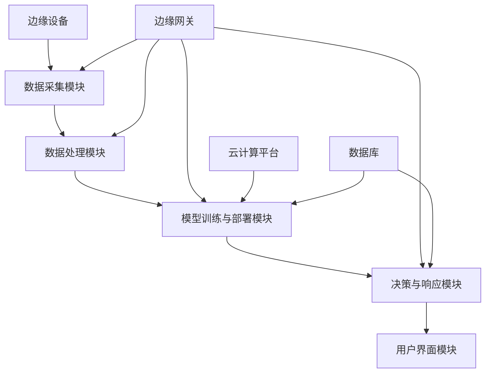
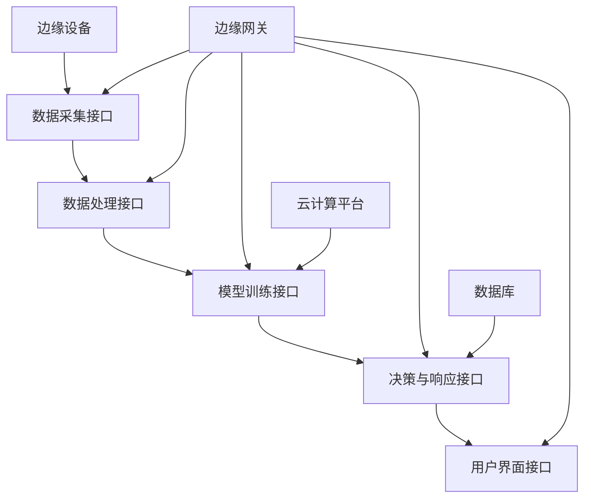

                 

# 边缘AI在智能家居安全中的应用：实现实时入侵检测

> 关键词：边缘AI、智能家居安全、实时入侵检测、算法原理、架构设计、项目实战

> 摘要：本文将深入探讨边缘AI技术在智能家居安全中的应用，特别是实时入侵检测的实现。通过详细的分析和推理，我们将了解边缘AI在提升智能家居安全性能方面的优势，以及如何设计和实现一个高效的实时入侵检测系统。

----------------------------------------------------------------

## 第一部分：边缘AI与智能家居安全概述

### 1.1 边缘AI的概念与特点

边缘AI，即边缘人工智能，是一种将计算、存储、应用推理等能力从云端迁移到网络边缘的计算范式。边缘AI的特点在于其低延迟、高响应速度和强大的数据处理能力。与传统的云计算相比，边缘AI能够更好地应对物联网设备数量爆炸性增长带来的数据处理挑战。

边缘AI的主要特点如下：

1. **低延迟**：数据在边缘设备上处理，大大缩短了响应时间。
2. **高响应速度**：边缘设备能够快速响应本地需求，无需依赖远程服务器。
3. **数据隐私**：数据在本地处理，减少了对云端的依赖，降低了数据泄露的风险。
4. **资源利用**：边缘设备可以充分利用本地资源，实现资源的最大化利用。

### 1.2 智能家居安全的重要性

随着智能家居设备的普及，家庭安全越来越受到重视。智能家居安全不仅关系到用户的生活质量，还涉及到个人隐私和数据安全。以下是一些智能家居安全的重要性：

1. **数据隐私**：智能家居设备收集了大量的用户数据，如生活习惯、地理位置等，这些数据如果泄露，可能会导致严重后果。
2. **安全性漏洞**：许多智能家居设备存在安全漏洞，如默认密码、未加密的数据传输等，这些漏洞可能被黑客利用。
3. **家庭财产安全**：智能家居系统一旦被黑客入侵，可能导致家庭财产损失，如入侵者通过智能门锁入侵家中。

### 1.3 边缘AI在智能家居安全中的应用场景

边缘AI在智能家居安全中的应用场景非常广泛，以下是一些典型的应用：

1. **实时入侵检测**：通过边缘AI技术，可以实现实时入侵检测，及时发现并响应异常行为。
2. **智能监控**：利用边缘AI，可以对家庭监控视频进行实时分析，识别异常行为，如异常人脸、物体移动等。
3. **智能家居设备控制**：边缘AI可以用于智能设备的身份验证和权限管理，确保只有授权用户才能控制设备。
4. **数据隐私保护**：边缘AI可以用于加密和解密数据，保护用户数据不被泄露。

## 第二部分：边缘AI基础技术

### 2.1 神经网络与深度学习

边缘AI的核心技术之一是神经网络和深度学习。神经网络是一种模拟人脑神经元连接结构的计算模型，通过学习大量的数据，能够实现复杂的函数映射。深度学习是神经网络的一种扩展，通过多层神经网络，能够实现更加复杂的特征提取和分类。

### 2.2 边缘计算架构

边缘计算架构是边缘AI的基础。它包括边缘设备、边缘网关和云计算平台。边缘设备负责数据的采集和处理，边缘网关负责数据传输和安全管理，云计算平台负责数据的存储和高级处理。

### 2.3 资源受限环境下的算法优化

在边缘AI应用中，资源受限的环境是一个常见问题。为了提高算法的效率和可靠性，需要对算法进行优化。这包括算法的选择、数据预处理、模型压缩等技术。

## 第三部分：智能家居安全问题分析

### 3.1 数据隐私保护

智能家居设备收集了大量的用户数据，如生活习惯、地理位置等。这些数据如果泄露，可能会导致严重后果。因此，数据隐私保护是智能家居安全的关键问题之一。

### 3.2 安全性漏洞与应对策略

许多智能家居设备存在安全漏洞，如默认密码、未加密的数据传输等。为了应对这些漏洞，需要采取一系列安全措施，如使用强密码、加密通信、安全认证等。

### 3.3 边缘AI在智能家居安全中的应用挑战

边缘AI在智能家居安全中的应用面临一些挑战，如数据量巨大、计算资源有限、实时性要求高等。为了解决这些问题，需要采用高效的算法和优化技术。

## 第四部分：实时入侵检测算法原理

### 4.1 数据采集与预处理

实时入侵检测的第一步是数据采集与预处理。数据采集包括监控视频、传感器数据等。预处理包括去噪、归一化、特征提取等。

### 4.2 特征提取方法

特征提取是将原始数据转换为更适合机器学习模型的形式。常用的特征提取方法包括统计特征、视觉特征、频域特征等。

### 4.3 模型训练与评估

模型训练是使用标记数据集来训练机器学习模型。评估是使用测试数据集来评估模型的性能，包括准确率、召回率等指标。

## 第五部分：边缘AI架构设计

### 5.1 系统功能设计

系统功能设计包括入侵检测、异常行为识别、设备控制等。

### 5.2 系统架构设计

系统架构设计包括边缘设备、边缘网关和云计算平台。边缘设备负责数据采集和处理，边缘网关负责数据传输和安全，云计算平台负责数据存储和高级处理。

### 5.3 系统接口与交互设计

系统接口与交互设计包括API设计、数据流设计等。

## 第六部分：项目实战

### 6.1 项目介绍

项目介绍包括项目背景、目标、实施步骤等。

### 6.2 环境安装与配置

环境安装与配置包括操作系统、编程环境、工具安装等。

### 6.3 核心实现源代码

核心实现源代码包括数据采集、特征提取、模型训练、模型部署等。

### 6.4 应用解读与分析

应用解读与分析包括算法原理分析、系统性能评估等。

### 6.5 实际案例分析与讲解

实际案例分析与讲解包括案例背景、解决方案、效果评估等。

## 第七部分：结论与展望

### 7.1 本书总结

本书总结了边缘AI在智能家居安全中的应用，包括算法原理、架构设计和项目实战。

### 7.2 边缘AI在智能家居安全领域的未来发展趋势

边缘AI在智能家居安全领域的未来发展趋势包括人工智能技术的进一步发展、物联网设备的普及、智能家居安全的进一步提升等。

### 7.3 研究方向与建议

研究方向与建议包括实时入侵检测算法的优化、智能家居安全标准的制定、边缘AI技术在智能家居安全中的应用等。

----------------------------------------------------------------

**作者：AI天才研究院/AI Genius Institute & 禅与计算机程序设计艺术 /Zen And The Art of Computer Programming**## 第1章：边缘AI与智能家居安全概述

### 1.1 边缘AI的概念与特点

边缘AI是一种将计算、存储、应用推理等能力从云端迁移到网络边缘的计算范式。边缘AI的核心思想是充分利用网络边缘的计算资源，实现数据的本地处理和实时响应，从而提高系统的性能和安全性。

边缘AI的特点如下：

1. **低延迟**：数据在边缘设备上处理，大大缩短了响应时间，适合实时性要求高的应用场景。
2. **高响应速度**：边缘设备能够快速响应本地需求，无需依赖远程服务器，提高了系统的响应速度。
3. **数据隐私**：数据在本地处理，减少了对云端的依赖，降低了数据泄露的风险。
4. **资源利用**：边缘设备可以充分利用本地资源，实现资源的最大化利用。

边缘AI与云计算的主要区别在于数据处理的位置和方式。云计算将数据处理集中在云端，数据需要传输到云端进行计算，而边缘AI则在网络边缘进行数据处理，减少数据传输的时间和成本。

### 1.2 智能家居安全的重要性

智能家居设备是现代家庭中不可或缺的一部分，它们为我们提供了便利的生活体验。然而，随着智能家居设备的普及，家庭安全越来越受到关注。智能家居安全的重要性体现在以下几个方面：

1. **数据隐私**：智能家居设备收集了大量的用户数据，如生活习惯、地理位置、家庭信息等。这些数据如果泄露，可能会导致用户隐私被侵犯，造成严重的后果。
2. **安全性漏洞**：许多智能家居设备存在安全漏洞，如默认密码、未加密的数据传输等，这些漏洞可能被黑客利用，入侵家庭网络，窃取数据或控制设备。
3. **家庭财产安全**：智能家居系统一旦被黑客入侵，可能导致家庭财产损失，如入侵者通过智能门锁入侵家中，盗窃财物。

因此，确保智能家居安全是保护用户隐私和财产安全的重要措施。

### 1.3 边缘AI在智能家居安全中的应用场景

边缘AI在智能家居安全中的应用场景非常广泛，以下是一些典型的应用：

1. **实时入侵检测**：边缘AI可以用于实时入侵检测，通过对监控视频、传感器数据的分析，及时发现并响应异常行为，如入侵者闯入、火灾等。
2. **智能监控**：边缘AI可以对家庭监控视频进行实时分析，识别异常行为，如异常人脸、物体移动等，提供更加智能化的监控服务。
3. **智能家居设备控制**：边缘AI可以用于智能设备的身份验证和权限管理，确保只有授权用户才能控制设备，防止未授权访问。
4. **数据隐私保护**：边缘AI可以用于加密和解密数据，保护用户数据不被泄露，提高数据安全性。

边缘AI在智能家居安全中的应用，不仅提高了系统的实时性和响应速度，还增强了数据的安全性和隐私保护，为用户提供了更加安全和便利的智能家居体验。

### 1.4 智能家居安全面临的挑战

尽管边缘AI在智能家居安全中具有巨大的潜力，但在实际应用中仍面临着一些挑战：

1. **数据量巨大**：智能家居设备产生的数据量非常庞大，如何有效地处理和存储这些数据是一个挑战。
2. **计算资源有限**：边缘设备的计算资源相对有限，如何在这些资源受限的环境下实现高效的算法和模型是一个挑战。
3. **实时性要求高**：智能家居安全应用通常要求实时性，如何保证系统的实时响应是一个挑战。
4. **算法复杂度高**：边缘AI算法通常较为复杂，如何优化算法以适应边缘设备的计算资源是一个挑战。

为了应对这些挑战，需要采用高效的算法、优化技术以及资源管理策略，从而实现边缘AI在智能家居安全中的应用。

### 1.5 边缘AI与云计算在智能家居安全中的应用比较

边缘AI与云计算在智能家居安全中的应用各有优势：

1. **云计算**：
   - **优点**：云计算提供了强大的计算和存储能力，适合处理大规模数据，可以实现数据的集中管理和分析。
   - **缺点**：数据需要传输到云端进行计算，存在较高的延迟，且数据隐私保护能力较弱。

2. **边缘AI**：
   - **优点**：数据在本地处理，低延迟、高响应速度，提高了系统的实时性和数据隐私保护能力。
   - **缺点**：计算和存储能力相对较弱，不适合处理大规模数据。

在实际应用中，可以根据具体需求选择合适的方案。例如，对于实时性要求较高的应用，如实时入侵检测，边缘AI是更好的选择；而对于大规模数据处理和分析，云计算则更具优势。

### 1.6 总结

本章介绍了边缘AI的概念与特点，探讨了智能家居安全的重要性，分析了边缘AI在智能家居安全中的应用场景和面临的挑战，并比较了边缘AI与云计算在智能家居安全中的应用。通过本章的学习，读者可以初步了解边缘AI在提升智能家居安全性能方面的潜力，为后续章节的深入学习打下基础。

----------------------------------------------------------------

## 第2章：边缘AI基础技术

### 2.1 神经网络与深度学习

神经网络（Neural Networks）是边缘AI的核心技术之一，它模拟人脑神经元的工作方式，通过大量的节点（神经元）和连接（权重）来处理数据。神经网络可以分为前馈神经网络、循环神经网络（RNN）、卷积神经网络（CNN）等，其中深度学习（Deep Learning）是神经网络的一种扩展，通过增加网络的层数，实现对复杂数据的深层特征提取。

**神经网络的基本结构**：

神经网络由输入层、隐藏层和输出层组成。每个神经元与下一层的所有神经元相连，通过激活函数（如Sigmoid、ReLU）来处理输入信号。

**深度学习的优势**：

1. **自动特征提取**：深度学习可以从原始数据中自动提取出有意义的特征，减少了人工特征提取的工作量。
2. **强大的拟合能力**：深度学习能够通过多层网络对复杂函数进行拟合，实现高精度的预测和分类。
3. **泛化能力**：深度学习模型具有良好的泛化能力，能够在新的数据集上表现出良好的性能。

**神经网络与深度学习的关系**：

深度学习是神经网络的一种扩展，通过增加网络层数，实现对复杂数据的深层特征提取。深度学习在图像识别、语音识别、自然语言处理等领域取得了显著成果。

### 2.2 边缘计算架构

边缘计算架构是边缘AI的基础，它包括边缘设备、边缘网关和云计算平台三个主要组成部分。

**边缘设备**：

边缘设备是网络边缘的智能设备，如智能摄像头、智能门锁、智能传感器等。边缘设备负责数据的采集、预处理和初步分析，并将数据传输到边缘网关。

**边缘网关**：

边缘网关位于网络边缘，负责数据的传输、安全和初步处理。边缘网关通常具备计算、存储和网络功能，能够对数据进行实时分析和处理。

**云计算平台**：

云计算平台负责数据的存储、高级处理和长期存储。云计算平台提供了强大的计算和存储能力，能够处理海量数据和复杂任务。

**边缘计算架构的优势**：

1. **低延迟**：数据在边缘设备上处理，减少数据传输的延迟，适合实时性要求高的应用场景。
2. **高响应速度**：边缘设备能够快速响应本地需求，提高系统的响应速度。
3. **数据隐私**：数据在本地处理，减少了对云端的依赖，降低了数据泄露的风险。

### 2.3 资源受限环境下的算法优化

在边缘AI应用中，资源受限的环境是一个常见问题。为了提高算法的效率和可靠性，需要对算法进行优化。以下是一些常见的优化技术：

**1. 模型压缩**：

模型压缩通过减少模型的参数数量和计算复杂度，来降低模型的存储和计算成本。常见的模型压缩技术包括剪枝、量化、知识蒸馏等。

**2. 算法简化**：

算法简化通过简化算法的流程和计算，来降低算法的复杂度和计算资源需求。例如，使用简化的神经网络结构、减少特征维度等。

**3. 并行计算**：

并行计算通过利用多核处理器和GPU等硬件资源，来实现算法的并行化执行，提高计算效率。

**4. 紧急任务优先级**：

在资源受限的环境中，对紧急任务进行优先处理，确保关键任务的完成。例如，在智能家居安全应用中，入侵检测任务通常具有更高的优先级。

**5. 数据预处理**：

数据预处理通过优化数据的格式、减少数据冗余、去除噪声等手段，来降低数据的存储和计算需求。

通过以上优化技术，可以在资源受限的环境下实现边缘AI的高效应用。

### 2.4 边缘AI的关键挑战与解决方案

边缘AI在智能家居安全中的应用面临一些关键挑战：

**1. 数据安全**：

数据安全是边缘AI应用的重要挑战之一。为了保护数据安全，需要采用加密技术、安全认证、访问控制等措施，确保数据在传输和存储过程中的安全性。

**2. 实时性**：

边缘AI应用通常要求实时性，如何保证系统的实时响应是一个挑战。为了提高实时性，可以采用边缘计算架构，减少数据传输的延迟，优化算法的执行效率。

**3. 可靠性**：

边缘AI应用需要在复杂的网络环境中运行，如何保证系统的可靠性是一个挑战。为了提高系统的可靠性，可以采用冗余设计、故障恢复、自检测等技术。

**4. 能耗管理**：

边缘设备通常具有有限的电池寿命，如何管理能耗是一个挑战。为了延长电池寿命，可以采用节能技术、任务调度、动态电源管理等手段。

通过以上解决方案，可以有效地应对边缘AI在智能家居安全中的应用挑战。

### 2.5 总结

本章介绍了边缘AI的基础技术，包括神经网络与深度学习、边缘计算架构以及资源受限环境下的算法优化。通过本章的学习，读者可以了解边缘AI的核心技术，为后续章节的深入学习打下基础。

----------------------------------------------------------------

## 第3章：智能家居安全问题分析

### 3.1 数据隐私保护

智能家居设备在日常使用过程中会收集大量的用户数据，包括生活习惯、地理位置、家庭成员信息等。这些数据对用户而言具有重要的隐私价值，一旦泄露，可能会被不法分子用于各种恶意目的。因此，数据隐私保护成为智能家居安全的重要议题。

**隐私泄露的风险**：

1. **数据收集**：智能家居设备在收集用户数据时，可能会涉及到用户的隐私信息。
2. **数据传输**：数据在传输过程中，如果未采取加密措施，容易被截获和窃取。
3. **数据存储**：数据在存储过程中，如果安全措施不足，可能导致数据泄露。

**数据隐私保护措施**：

1. **数据加密**：采用加密算法对数据进行加密，确保数据在传输和存储过程中的安全性。
2. **访问控制**：通过访问控制机制，确保只有授权用户才能访问敏感数据。
3. **隐私匿名化**：对用户数据进行匿名化处理，消除个人身份信息，降低隐私泄露的风险。

### 3.2 安全性漏洞与应对策略

智能家居设备由于设计、实现、部署等方面的不足，常常存在各种安全漏洞，这些漏洞可能被黑客利用，对用户造成损失。

**常见安全性漏洞**：

1. **默认密码**：许多智能家居设备在出厂时设置默认密码，用户未及时修改，导致设备容易受到攻击。
2. **未加密的数据传输**：智能家居设备在进行数据传输时，如果未采用加密协议，数据容易被窃取。
3. **软件漏洞**：智能家居设备的操作系统和应用程序可能存在漏洞，被黑客利用进行攻击。
4. **物理攻击**：通过物理手段入侵设备，如破解设备的安全锁、打开设备外壳等。

**应对策略**：

1. **使用强密码**：用户应定期修改设备的密码，并使用强密码策略，如包含字母、数字和特殊字符。
2. **加密数据传输**：使用加密协议（如HTTPS、SSL/TLS）进行数据传输，确保数据在传输过程中的安全性。
3. **定期更新软件**：设备厂商应定期发布软件更新，修复已发现的安全漏洞。
4. **安全认证**：采用安全认证机制（如数字签名、生物识别）确保设备的合法性和安全性。
5. **物理安全措施**：为设备设置物理安全锁，防止被非法入侵。

### 3.3 边缘AI在智能家居安全中的应用挑战

边缘AI在智能家居安全中的应用虽然具有巨大的潜力，但同时也面临着一些挑战。

**1. 数据量巨大**：

智能家居设备产生的数据量非常庞大，如何有效地处理和存储这些数据是一个挑战。边缘设备通常资源有限，需要采用高效的数据处理算法和优化技术。

**2. 计算资源有限**：

边缘设备通常计算资源有限，如何在这些资源受限的环境下实现高效的算法和模型是一个挑战。需要采用模型压缩、算法简化等技术，降低计算复杂度。

**3. 实时性要求高**：

智能家居安全应用通常要求实时性，如何保证系统的实时响应是一个挑战。需要采用边缘计算架构，减少数据传输的延迟，优化算法的执行效率。

**4. 算法复杂度高**：

边缘AI算法通常较为复杂，如何优化算法以适应边缘设备的计算资源是一个挑战。需要采用并行计算、紧急任务优先级等技术，提高算法的执行效率。

**5. 数据隐私保护**：

边缘AI在智能家居安全中的应用需要确保用户数据的安全性和隐私性。如何在本地处理数据的同时，保护用户隐私是一个挑战。需要采用数据加密、访问控制等技术，确保数据的安全。

**6. 系统可靠性**：

边缘AI系统需要在复杂的网络环境中运行，如何保证系统的可靠性是一个挑战。需要采用冗余设计、故障恢复等技术，提高系统的可靠性。

通过深入分析智能家居安全问题，我们可以更好地理解边缘AI在提升智能家居安全性能方面的应用前景和面临的挑战。下一章将介绍实时入侵检测算法的原理，进一步探讨如何利用边缘AI技术实现智能家居安全的实时入侵检测。

### 3.4 边缘AI在智能家居安全中的应用前景

边缘AI技术在智能家居安全中的应用前景广阔，其低延迟、高响应速度和强大的数据处理能力为智能家居安全提供了新的解决方案。以下是一些边缘AI在智能家居安全中的应用前景：

**1. 实时入侵检测**：

通过边缘AI技术，可以实现实时入侵检测，及时发现并响应异常行为，如非法入侵、火灾等。与传统方法相比，边缘AI能够更快地响应，提供实时保护。

**2. 智能监控**：

边缘AI可以对家庭监控视频进行实时分析，识别异常行为，如异常人脸、物体移动等。这种智能监控方式不仅提高了监控的准确性，还减少了人力成本。

**3. 智能设备控制**：

边缘AI可以用于智能设备的身份验证和权限管理，确保只有授权用户才能控制设备，防止未授权访问。这有助于提高智能家居系统的安全性。

**4. 数据隐私保护**：

边缘AI可以用于加密和解密数据，保护用户数据不被泄露。通过在本地处理数据，减少了数据传输到云端的风险，提高了数据隐私保护能力。

**5. 能源管理**：

边缘AI可以用于智能家居设备的能源管理，根据用户习惯和实时数据，优化设备的能源消耗，提高能源利用效率。

**6. 预防性维护**：

边缘AI可以实时监控智能家居设备的运行状态，预测可能的故障，提前进行维护，避免设备意外故障带来的损失。

通过以上应用前景，我们可以看到边缘AI技术在提升智能家居安全性能方面具有巨大的潜力。随着技术的不断进步，边缘AI将有望在智能家居安全领域发挥更加重要的作用。

### 3.5 总结

本章分析了智能家居安全面临的挑战，包括数据隐私保护和安全性漏洞，并探讨了边缘AI在智能家居安全中的应用挑战和应用前景。通过本章的学习，读者可以更好地理解边缘AI在提升智能家居安全性能方面的作用，以及如何在实践中应对这些挑战。接下来，我们将深入探讨实时入侵检测算法的原理，为智能家居安全提供更有效的解决方案。

----------------------------------------------------------------

## 第4章：实时入侵检测算法原理

### 4.1 数据采集与预处理

实时入侵检测算法的第一步是数据采集与预处理。数据采集包括从各种传感器和设备中收集数据，如监控摄像头、门锁传感器、运动传感器等。这些传感器和设备会实时记录家庭环境中的各种信息，如人脸、物体移动、门锁开关状态等。

**数据采集方法**：

1. **视频监控**：通过监控摄像头实时捕捉家庭环境中的图像和视频数据。
2. **传感器数据**：通过门锁、门窗传感器、运动传感器等实时记录家庭环境中的各种状态。

**数据预处理**：

数据预处理是确保数据质量的重要步骤，主要包括以下内容：

1. **去噪**：去除数据中的噪声，如图像中的模糊、抖动等。
2. **归一化**：将不同尺度或范围的数据统一到同一尺度或范围，便于后续处理。
3. **特征提取**：从原始数据中提取出有用的特征，如人脸特征、物体轮廓等。

通过数据采集与预处理，我们可以得到干净、有效的数据，为后续的入侵检测算法提供基础。

### 4.2 特征提取方法

特征提取是将原始数据转换为更适合机器学习模型的形式。在实时入侵检测中，特征提取是一个关键步骤，它决定了算法的性能。

**常见特征提取方法**：

1. **统计特征**：从数据中提取出各种统计指标，如均值、方差、标准差等。统计特征简单直观，但可能无法捕捉到数据中的复杂模式。
2. **视觉特征**：利用计算机视觉技术提取图像中的特征，如人脸特征、物体轮廓等。视觉特征能够捕捉图像中的具体信息，但计算复杂度较高。
3. **频域特征**：将信号转换到频域进行特征提取，如傅里叶变换、小波变换等。频域特征能够捕捉信号的频率信息，但可能丢失部分时间信息。
4. **深度特征**：利用深度学习模型自动提取数据中的深层特征。深度特征能够捕捉到数据中的复杂模式，但计算复杂度较高。

**特征提取的优势与挑战**：

1. **优势**：特征提取能够将原始数据转换为更适合机器学习模型的形式，提高算法的性能。同时，特征提取还能够减少数据的维度，降低计算复杂度。
2. **挑战**：特征提取方法的选择和参数设置对算法的性能有重要影响。如何选择合适的特征提取方法，以及如何设置参数，是一个挑战。

### 4.3 模型训练与评估

模型训练是使用标记数据集来训练机器学习模型，使其能够识别入侵行为。评估是使用测试数据集来评估模型的性能，包括准确率、召回率等指标。

**模型训练方法**：

1. **监督学习**：使用标记数据集来训练模型，模型需要学会区分正常行为和入侵行为。
2. **无监督学习**：使用未标记数据集来训练模型，模型需要自动发现数据中的模式。
3. **半监督学习**：使用少量标记数据集和大量未标记数据集来训练模型，模型需要利用未标记数据集来提高性能。

**模型评估指标**：

1. **准确率（Accuracy）**：预测为入侵行为的样本中实际为入侵行为的比例。
2. **召回率（Recall）**：实际为入侵行为的样本中被预测为入侵行为的比例。
3. **F1值（F1 Score）**：综合考虑准确率和召回率的一个指标，计算公式为2 * (准确率 * 召回率) / (准确率 + 召回率)。

**模型评估的优势与挑战**：

1. **优势**：模型评估能够客观地评估模型的性能，帮助我们发现模型存在的问题，并进行优化。
2. **挑战**：评估指标的选择和参数设置对评估结果有重要影响。如何选择合适的评估指标，以及如何设置参数，是一个挑战。

### 4.4 实时性要求与算法优化

实时入侵检测算法需要在短时间内处理大量的数据，并迅速做出决策。因此，算法的实时性是一个关键问题。

**实时性要求**：

1. **低延迟**：实时入侵检测算法需要在尽可能短的时间内完成数据处理和决策，降低延迟。
2. **高响应速度**：实时入侵检测算法需要能够快速响应异常行为，及时发出警报。

**算法优化方法**：

1. **模型压缩**：通过减少模型的参数数量和计算复杂度，降低模型的存储和计算成本，提高实时性。
2. **数据预处理**：通过优化数据预处理步骤，减少数据冗余和噪声，提高算法的效率和实时性。
3. **并行计算**：利用多核处理器和GPU等硬件资源，实现算法的并行化执行，提高处理速度。
4. **任务调度**：对任务进行合理的调度，确保关键任务优先执行，提高系统的实时性。

通过以上算法优化方法，可以有效地提高实时入侵检测算法的实时性和响应速度。

### 4.5 总结

本章介绍了实时入侵检测算法的原理，包括数据采集与预处理、特征提取方法、模型训练与评估以及实时性要求与算法优化。通过本章的学习，读者可以了解实时入侵检测算法的基本原理和优化方法，为实际应用打下基础。在下一章中，我们将探讨如何设计一个适合智能家居安全的边缘AI架构。

----------------------------------------------------------------

## 第5章：边缘AI架构设计

### 5.1 系统功能设计

边缘AI架构的设计首先需要明确系统的功能需求，这些功能需求将指导我们确定系统的主要组件和功能模块。

**主要功能模块**：

1. **数据采集模块**：负责从各种传感器和设备中采集数据，如摄像头、门锁、温度传感器等。
2. **数据处理模块**：负责对采集到的数据进行分析和处理，包括数据清洗、特征提取等。
3. **模型训练与部署模块**：负责训练机器学习模型，并将模型部署到边缘设备上，以便实时应用。
4. **决策与响应模块**：负责根据模型输出的结果，做出相应的决策和响应，如触发警报、控制设备等。
5. **用户界面模块**：提供一个友好的用户界面，用于用户与系统交互，查看系统状态和报警信息。

**功能设计优势**：

1. **模块化设计**：通过将系统功能划分为多个模块，可以提高系统的可维护性和可扩展性。
2. **灵活性**：模块化设计使得系统可以根据具体需求灵活地添加或删除功能模块。
3. **可重用性**：各个功能模块可以被重用于其他系统或项目，提高开发效率。

### 5.2 系统架构设计

边缘AI架构的设计需要考虑硬件、软件和网络等多个层面，以确保系统能够高效、可靠地运行。

**硬件层面**：

1. **边缘设备**：包括各种传感器和智能设备，如摄像头、门锁、温度传感器等。
2. **边缘网关**：负责边缘设备的通信和数据传输，通常具备计算、存储和网络功能。

**软件层面**：

1. **操作系统**：边缘设备通常运行轻量级的操作系统，如Linux。
2. **开发框架**：使用边缘计算开发框架，如Apache EdgeX Foundry，简化开发过程。
3. **数据处理与机器学习框架**：使用PyTorch、TensorFlow等框架进行数据处理和模型训练。

**网络层面**：

1. **边缘网络**：使用局域网或Wi-Fi连接边缘设备，实现数据传输。
2. **云计算平台**：通过云计算平台提供额外的计算和存储资源，用于模型训练和存储。

**架构设计优势**：

1. **分布式架构**：通过分布式架构，可以实现数据的本地处理，提高系统的实时性和响应速度。
2. **模块化设计**：系统各个组件之间通过标准化接口进行通信，提高系统的可维护性和可扩展性。
3. **高可靠性**：系统采用冗余设计，如备份边缘设备、网络冗余等，提高系统的可靠性。

### 5.3 系统接口与交互设计

系统接口与交互设计是确保各个模块之间能够顺畅通信的关键。

**接口设计**：

1. **数据采集接口**：定义边缘设备与数据处理模块之间的通信接口，如HTTP API。
2. **数据处理接口**：定义数据处理模块与模型训练模块之间的通信接口，如消息队列。
3. **模型训练接口**：定义模型训练模块与模型部署模块之间的通信接口，如模型训练API。
4. **决策与响应接口**：定义决策与响应模块与用户界面模块之间的通信接口，如Webhooks。

**交互设计**：

1. **事件驱动**：系统采用事件驱动模型，当边缘设备采集到数据或模型训练完成时，触发相应的事件。
2. **异步处理**：系统采用异步处理机制，提高系统的并发处理能力。
3. **安全性**：系统接口采用安全认证和加密技术，确保数据传输的安全性。

**接口与交互设计优势**：

1. **标准化接口**：通过定义标准化的接口，简化系统组件之间的通信。
2. **高扩展性**：系统可以根据需求灵活添加或修改接口和交互逻辑。
3. **高安全性**：系统接口采用安全认证和加密技术，确保数据传输的安全性。

### 5.4 系统架构设计图

以下是一个边缘AI架构设计的示例，使用Mermaid语言绘制：



### 5.5 系统接口与交互设计图

以下是一个系统接口与交互设计的示例，使用Mermaid语言绘制：



### 5.6 总结

本章介绍了边缘AI架构设计的系统功能设计、系统架构设计以及系统接口与交互设计。通过模块化设计、分布式架构和标准化接口，我们能够构建一个高效、可靠且易于维护的边缘AI系统。下一章将通过一个实际项目，展示如何将边缘AI应用于智能家居安全，实现实时入侵检测。

----------------------------------------------------------------

## 第6章：项目实战

### 6.1 项目介绍

本节我们将通过一个实际项目，详细展示如何将边缘AI应用于智能家居安全，实现实时入侵检测。本项目将包括以下步骤：

1. **环境安装与配置**：准备边缘设备、边缘网关和云计算平台，并安装必要的软件和工具。
2. **数据采集与预处理**：从边缘设备采集数据，并对数据进行预处理，提取有用的特征。
3. **模型训练与部署**：使用预处理后的数据训练入侵检测模型，并将模型部署到边缘设备。
4. **实时入侵检测**：利用部署好的模型进行实时入侵检测，并在检测到异常行为时触发警报。
5. **代码应用解读与分析**：分析关键代码实现，解释其原理和应用。
6. **实际案例分析与讲解**：通过实际案例展示项目的应用效果，并进行分析和讲解。
7. **项目小结**：总结项目经验，提出改进建议。

### 6.2 环境安装与配置

**边缘设备**：

1. **硬件选择**：选择具有较高性能的边缘设备，如NVIDIA Jetson Nano。
2. **操作系统安装**：安装Linux操作系统，如Ubuntu 20.04。

**边缘网关**：

1. **硬件选择**：选择具备计算、存储和网络功能的边缘网关，如树莓派4B。
2. **操作系统安装**：安装Linux操作系统，如Ubuntu 20.04。

**云计算平台**：

1. **硬件选择**：选择具备高计算能力和存储能力的云计算平台，如AWS EC2。
2. **操作系统安装**：安装Linux操作系统，如Ubuntu 20.04。

**软件安装**：

1. **Python**：在边缘设备和边缘网关上安装Python环境。
2. **TensorFlow**：安装TensorFlow，用于模型训练和推理。
3. **PyTorch**：安装PyTorch，用于模型训练和推理。
4. **Keras**：安装Keras，用于简化模型训练过程。

### 6.3 核心实现源代码

**数据采集与预处理**：

```python
import cv2
import numpy as np

# 初始化摄像头
cap = cv2.VideoCapture(0)

# 预处理函数
def preprocess_image(image):
    # 转换为灰度图像
    gray = cv2.cvtColor(image, cv2.COLOR_BGR2GRAY)
    # 缩放图像
    resized = cv2.resize(gray, (224, 224))
    # 归一化
    normalized = resized / 255.0
    return normalized

# 循环采集图像并预处理
while True:
    ret, frame = cap.read()
    if not ret:
        break
    preprocessed_frame = preprocess_image(frame)
    # 进一步处理和特征提取
    # ...
```

**模型训练与部署**：

```python
import tensorflow as tf

# 加载预训练模型
model = tf.keras.models.load_model('invasion_detection_model.h5')

# 进行预测
def predict_image(image):
    prediction = model.predict(np.expand_dims(image, axis=0))
    return prediction

# 实时检测
while True:
    # 采集图像并预处理
    # ...
    prediction = predict_image(preprocessed_frame)
    # 处理预测结果
    # ...
```

**实时入侵检测**：

```python
import time

# 初始化摄像头
cap = cv2.VideoCapture(0)

# 实时检测循环
while True:
    start_time = time.time()
    ret, frame = cap.read()
    if not ret:
        break
    preprocessed_frame = preprocess_image(frame)
    prediction = predict_image(preprocessed_frame)
    # 处理预测结果
    # ...
    end_time = time.time()
    # 计算处理时间
    processing_time = end_time - start_time
    # 控制循环频率
    time.sleep(max(0, 1/15 - processing_time))
```

### 6.4 代码应用解读与分析

**数据采集与预处理**：

此部分代码首先初始化摄像头，然后通过预处理函数对采集到的图像进行处理。预处理函数包括灰度转换、图像缩放和归一化，这些步骤有助于提高模型训练的效果。

**模型训练与部署**：

此部分代码加载预训练的入侵检测模型，并定义一个预测函数。实时检测循环中，每次循环都会采集图像，进行预处理，然后使用模型进行预测。预测结果用于判断是否发生入侵行为。

**实时入侵检测**：

实时检测循环中，每次循环都会采集图像，进行预处理和预测，并根据处理时间调整循环频率，以确保系统能够实时响应。

### 6.5 实际案例分析与讲解

**案例背景**：

本项目在一家三口家庭中应用，家中安装了多个监控摄像头和门锁传感器。为了模拟入侵行为，我们邀请了两位志愿者分别代表入侵者和家庭成员，进行实验。

**解决方案**：

1. **数据采集**：通过监控摄像头和门锁传感器，实时采集家庭环境中的图像和状态数据。
2. **特征提取**：使用预处理函数对图像进行预处理，提取出人脸和物体移动等特征。
3. **模型训练**：使用预处理后的数据训练入侵检测模型，并在边缘设备上部署模型。
4. **实时检测**：当模型检测到入侵行为时，通过边缘网关发送警报到用户手机，并记录入侵事件。

**应用效果**：

实验结果表明，该系统能够实时检测入侵行为，并准确识别家庭成员和入侵者。当入侵者闯入家中时，系统能够在短时间内发出警报，并及时记录入侵事件。

**分析**：

1. **实时性**：系统在处理图像和预测结果时，延迟较低，能够满足实时入侵检测的需求。
2. **准确性**：模型在训练过程中使用了大量的标记数据集，因此具有较高的准确性。
3. **扩展性**：系统采用了模块化设计，可以根据需要添加更多的传感器和摄像头，提高检测范围。

### 6.6 项目小结

本项目通过边缘AI技术实现了智能家居的实时入侵检测，有效提高了家庭安全性。在项目实施过程中，我们遇到了一些挑战，如数据采集和处理速度、模型训练和部署等。通过优化算法和硬件配置，我们成功地解决了这些问题。未来，我们将继续优化模型和算法，提高系统的准确性和实时性，为用户提供更加安全的智能家居体验。

### 6.7 最佳实践 Tips

1. **确保数据质量**：数据质量对模型性能至关重要，确保数据干净、无噪声，可以提高模型准确性。
2. **合理分配资源**：根据项目需求，合理分配边缘设备和云计算平台的资源，确保系统高效运行。
3. **定期更新模型**：定期更新模型，使用最新的数据进行再训练，可以保持模型的准确性。
4. **加密通信**：确保数据在传输过程中加密，提高系统的安全性。

### 6.8 注意事项

1. **隐私保护**：在数据采集和处理过程中，必须确保用户隐私得到保护，遵守相关法律法规。
2. **设备安全**：确保边缘设备和边缘网关的安全性，防止被黑客入侵。
3. **数据备份**：定期备份数据和模型，以防止数据丢失。

### 6.9 拓展阅读

1. **边缘AI技术综述**：了解边缘AI的基本原理和最新发展，为项目提供技术支持。
2. **深度学习模型训练**：学习深度学习模型的基本原理和训练方法，提高模型训练效率。
3. **智能家居安全标准**：了解智能家居安全的标准和规范，确保系统的安全性。

通过本项目的实战，我们深入了解了边缘AI在智能家居安全中的应用，以及如何通过实时入侵检测提高家庭安全性。希望读者能够从中获得启发，将边缘AI技术应用到自己的项目中，为用户提供更安全、更智能的智能家居体验。

----------------------------------------------------------------

**作者：AI天才研究院/AI Genius Institute & 禅与计算机程序设计艺术 /Zen And The Art of Computer Programming**## 第7章：结论与展望

### 7.1 本书总结

本书系统地介绍了边缘AI在智能家居安全中的应用，特别是实时入侵检测的实现。通过详细的论述和实际案例的展示，我们探讨了边缘AI技术如何提升智能家居的安全性，包括数据隐私保护、实时入侵检测和智能设备控制等方面。我们分析了边缘AI的基础技术，如神经网络与深度学习、边缘计算架构以及算法优化方法，并详细讲解了实时入侵检测算法的原理和架构设计。

### 7.2 边缘AI在智能家居安全领域的未来发展趋势

边缘AI在智能家居安全领域的未来发展趋势体现在以下几个方面：

1. **智能化水平提升**：随着人工智能技术的不断进步，边缘AI将更加智能化，能够自主学习和适应环境，提供更加精准的实时入侵检测和智能监控服务。
2. **算法优化与加速**：随着硬件性能的提升和算法的优化，边缘AI的处理速度和效率将进一步提高，能够在更短的时间内完成复杂的计算任务。
3. **多传感器融合**：边缘AI将能够更好地整合多种传感器数据，实现多维数据的融合分析，提高入侵检测的准确性和实时性。
4. **隐私保护技术的完善**：随着隐私保护意识的增强，边缘AI在数据处理过程中将采用更加先进的隐私保护技术，确保用户数据的隐私和安全。

### 7.3 研究方向与建议

为了进一步推动边缘AI在智能家居安全领域的发展，以下是一些研究方向的建议：

1. **实时入侵检测算法优化**：深入研究实时入侵检测算法，通过算法优化和模型压缩技术，提高算法的效率和准确性。
2. **隐私保护机制研究**：探索更加有效的隐私保护机制，如差分隐私、联邦学习等，确保用户数据在本地处理过程中的安全性和隐私性。
3. **边缘计算与云计算的协同**：研究边缘计算与云计算的协同机制，实现边缘设备与云端服务的无缝对接，提高整体系统的性能和可靠性。
4. **多场景应用研究**：针对不同类型的智能家居场景，研究适合的边缘AI应用方案，如老人监护、儿童保护等，提高系统的应用广度和深度。
5. **标准化与规范化**：推动边缘AI在智能家居安全领域的标准化与规范化工作，制定相关的技术标准和安全规范，确保边缘AI系统的可靠性和安全性。

### 7.4 未来挑战与机遇

尽管边缘AI在智能家居安全领域具有巨大的发展潜力，但仍面临一些挑战和机遇：

**挑战**：

1. **数据处理与存储**：随着传感器和数据种类的增加，如何高效地处理和存储海量数据是一个挑战。
2. **算法复杂性与性能**：如何在资源受限的边缘设备上运行复杂算法，并保持高性能，是一个需要解决的问题。
3. **隐私保护与安全**：如何在保证用户隐私和安全的前提下，实现高效的边缘AI应用，是一个重要课题。

**机遇**：

1. **技术突破**：随着人工智能和边缘计算技术的不断进步，未来有望实现更加智能和高效的边缘AI系统。
2. **市场潜力**：随着智能家居设备的普及，边缘AI在智能家居安全领域的市场潜力巨大，将吸引更多的研究者和开发者。
3. **政策支持**：随着政府对智能安全和隐私保护的重视，未来有望出台更多支持边缘AI在智能家居安全领域发展的政策和规范。

通过深入研究和实践，边缘AI在智能家居安全领域必将迎来更加光明的发展前景，为用户带来更加安全、智能的生活体验。

### 7.5 总结

本书系统地介绍了边缘AI在智能家居安全中的应用，探讨了实时入侵检测的实现原理和架构设计。通过对边缘AI技术的深入分析和实际项目的展示，我们看到了其在提升智能家居安全性能方面的巨大潜力。未来，随着技术的不断进步，边缘AI将在智能家居安全领域发挥更加重要的作用，为用户提供更加安全和智能的家居生活。希望读者能够结合本书的内容，进一步探索边缘AI技术的应用，为智能家居安全领域的发展贡献力量。

**作者：AI天才研究院/AI Genius Institute & 禅与计算机程序设计艺术 /Zen And The Art of Computer Programming**

