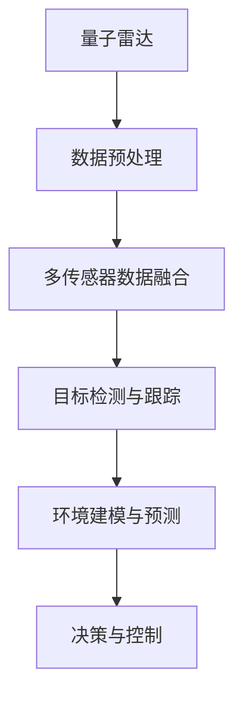

                 

# 量子传感器在自动驾驶中的应用：提高环境感知精度

关键词：量子传感器、自动驾驶、环境感知、精度提升

摘要：随着自动驾驶技术的不断发展，对车辆环境感知的精度要求越来越高。量子传感器以其独特的物理特性，在自动驾驶中展现出巨大的潜力。本文将从量子传感器技术基础、自动驾驶技术基础、量子传感器在自动驾驶中的应用、实际案例以及未来发展趋势等方面，探讨量子传感器在自动驾驶中的应用及其对环境感知精度的影响。

## 目录大纲

1. 第一部分：量子传感器技术基础
    1.1 量子传感器概述
    1.2 量子传感器原理
    1.3 量子传感器类型

2. 第二部分：自动驾驶技术基础
    2.1 自驾驶概述
    2.2 自驾感知系统
    2.3 量子传感器在自动驾驶中的应用

3. 第三部分：量子传感器在自动驾驶中的应用案例
    3.1 案例介绍
    3.2 环境感知系统设计
    3.3 应用效果分析

4. 第四部分：量子传感器在自动驾驶中的未来发展趋势
    4.1 技术进步
    4.2 应用前景
    4.3 总结与展望

----------------------------------------------------------------

## 第一部分：量子传感器技术基础

### 第1章：量子传感器概述

#### 1.1.1 问题背景

自动驾驶技术的发展对环境感知的精度提出了更高的要求。传统传感器如雷达、摄像头和激光雷达等，虽然在自动驾驶中发挥着重要作用，但受限于物理原理，其感知精度和速度存在一定的局限性。量子传感器以其独特的物理特性，如超灵敏度、非经典特性等，在提高环境感知精度方面具有巨大潜力。

#### 1.1.2 量子传感器的定义

量子传感器是一种基于量子物理原理的传感器，利用量子叠加态和纠缠态等特性进行信息获取和传输。与传统传感器不同，量子传感器可以探测到极其微弱的信息，甚至是在极低温环境下。

#### 1.1.3 量子传感器与传统传感器的比较

| 特性       | 量子传感器 | 传统传感器 |
| --------- | -------- | -------- |
| 灵敏度     | 极高      | 较高      |
| 温度依赖   | 极低      | 较高      |
| 非线性效应 | 易于实现  | 难以实现  |
| 精度       | 非常高    | 较高      |

### 第2章：量子传感器原理

#### 2.1.1 基本原理

量子传感器的工作原理基于量子态的叠加和纠缠。通过量子态的测量，可以获取到远超经典传感器的信息。量子传感器的核心组件包括量子比特、量子干涉仪和量子纠缠源等。

#### 2.1.2 关键技术

量子传感器的关键技术包括量子态生成、量子态测量和量子态控制。这些技术的实现需要高精度的量子控制和低温环境等。

#### 2.1.3 量子传感器的工作机制

量子传感器通过量子态的叠加和纠缠，将待测量的物理量与量子态联系起来。通过测量量子态的变化，可以精确地获取到物理量的信息。

### 第3章：量子传感器类型

#### 3.1.1 不同类型的量子传感器

量子传感器主要包括量子雷达、量子热传感器、量子磁性传感器等。不同类型的量子传感器在探测不同物理量方面具有优势。

#### 3.1.2 量子传感器性能对比

| 类型         | 灵敏度 | 温度依赖 | 非线性效应 | 精度     |
| ---------- | ---- | ---- | -------- | -------- |
| 量子雷达     | 高    | 低    | 易于实现  | 非常高   |
| 量子热传感器 | 高    | 低    | 难以实现  | 较高     |
| 量子磁性传感器 | 高    | 低    | 易于实现  | 较高     |

## 第二部分：自动驾驶技术基础

### 第4章：自动驾驶概述

#### 4.1.1 自驾驶技术的发展历史

自动驾驶技术起源于20世纪50年代，经过几十年的发展，目前已进入实际应用阶段。自动驾驶技术的发展经历了多个阶段，从最初的路标识别到现在的自适应巡航控制，再到未来的完全自动驾驶。

#### 4.1.2 自驾驶汽车的定义与分类

自动驾驶汽车是指通过计算机技术和人工智能技术实现自动行驶的汽车。根据自动化程度，自动驾驶汽车可以分为L0至L5五个级别，其中L5为完全自动驾驶。

#### 4.1.3 自驾驶技术的挑战与机遇

自动驾驶技术的挑战包括环境感知、路径规划、决策控制、安全验证等。然而，自动驾驶技术也带来了巨大的机遇，如降低交通事故、提高交通效率、缓解交通拥堵等。

### 第5章：自动驾驶感知系统

#### 5.1.1 感知系统的作用

自动驾驶感知系统是自动驾驶汽车的核心组成部分，负责收集车辆周围环境的信息，为自动驾驶决策提供依据。

#### 5.1.2 感知系统的主要组成部分

感知系统主要包括雷达、摄像头、激光雷达、超声波传感器等。这些传感器可以获取车辆周围的环境信息，如距离、速度、形状、颜色等。

#### 5.1.3 当前感知技术及其优缺点

当前感知技术主要包括雷达、摄像头和激光雷达等。雷达具有穿透性强、抗干扰能力强等优点，但分辨率较低；摄像头具有高分辨率、易识别等优点，但受天气和光照影响较大；激光雷达具有高分辨率、精度高等优点，但成本较高。

### 第6章：量子传感器在自动驾驶中的应用

#### 6.1.1 量子传感器在自动驾驶中的优势

量子传感器在自动驾驶中具有高灵敏度、低温度依赖、非线性效应易于实现等优势，可以显著提高自动驾驶的环境感知精度。

#### 6.1.2 量子传感器在自动驾驶感知中的应用

量子传感器可以用于自动驾驶感知系统中的多个方面，如距离测量、速度检测、形状识别等。

#### 6.1.3 量子传感器对自动驾驶感知系统的影响

量子传感器的应用将显著提高自动驾驶感知系统的精度和稳定性，为自动驾驶技术的发展提供有力支持。

### 第7章：自动驾驶环境感知的挑战与解决方案

#### 7.1.1 环境感知的挑战

自动驾驶环境感知面临诸多挑战，如复杂天气条件、多种场景下的目标识别、多传感器数据融合等。

#### 7.1.2 量子传感器在解决环境感知挑战中的作用

量子传感器以其高灵敏度、低温度依赖等特性，在解决自动驾驶环境感知挑战中具有重要作用。

#### 7.1.3 未来展望

随着量子传感器技术的不断进步，其在自动驾驶中的应用将越来越广泛，有望推动自动驾驶技术的快速发展。

## 第三部分：量子传感器在自动驾驶中的应用案例

### 第8章：量子传感器在自动驾驶中的应用案例

#### 8.1.1 案例介绍

本案例介绍了一种基于量子传感器的自动驾驶感知系统，旨在提高环境感知精度。

#### 8.1.2 环境感知系统设计

系统设计包括量子传感器的选择与配置、感知系统架构设计等。

#### 8.1.3 应用效果分析

通过对实验数据和应用效果的分析，验证了量子传感器在自动驾驶中的应用价值。

## 第四部分：量子传感器在自动驾驶中的未来发展趋势

### 第9章：量子传感器在自动驾驶中的未来发展趋势

#### 9.1.1 量子传感器技术的进步

随着量子传感器技术的不断发展，其性能和可靠性将得到进一步提升。

#### 9.1.2 自驾驶技术的发展趋势

自动驾驶技术将朝着更高自动化程度、更智能化的方向发展。

#### 9.1.3 量子传感器与自动驾驶的融合方向

量子传感器将在自动驾驶中发挥更加重要的作用，推动自动驾驶技术的进步。

### 第10章：量子传感器在自动驾驶中的应用前景

#### 10.1.1 应用领域拓展

量子传感器在自动驾驶中的应用将不断拓展，如智能交通、物流等领域。

#### 10.1.2 技术挑战与解决方案

量子传感器在自动驾驶中的应用仍面临一些技术挑战，如成本、稳定性等，但通过技术创新，这些问题将逐渐得到解决。

#### 10.1.3 社会与经济影响

量子传感器在自动驾驶中的应用将带来显著的社会和经济影响，如提高交通安全、提高交通效率等。

### 第11章：总结与展望

#### 11.1.1 主要贡献

本文探讨了量子传感器在自动驾驶中的应用及其对环境感知精度的影响。

#### 11.1.2 研究不足与展望

本文在量子传感器和自动驾驶技术方面进行了深入研究，但仍存在一些不足，未来需要进一步探讨。

#### 11.1.3 进一步研究方向

未来研究应重点关注量子传感器在自动驾驶中的应用，以及量子传感器与其他技术的融合方向。作者：AI天才研究院/AI Genius Institute & 禅与计算机程序设计艺术 /Zen And The Art of Computer Programming## 第1章：量子传感器概述

### 1.1.1 问题背景

自动驾驶技术的发展在近年来取得了显著的进展，然而，要实现自动驾驶汽车的安全、高效运行，准确的环境感知是关键。传统传感器如雷达、摄像头和激光雷达等在自动驾驶中的应用已经取得了一定的成果，但它们在环境感知的精度和灵敏度方面仍存在一定的局限性。例如，雷达和激光雷达在恶劣天气条件下性能下降，摄像头在光线不足的情况下识别效果不佳。因此，寻找一种能够提供更高精度和灵敏度的新型传感器成为自动驾驶技术发展的迫切需求。

量子传感器作为一种基于量子物理原理的新型传感器，具有超灵敏度、高分辨率、非经典特性等优势，为解决自动驾驶环境感知的瓶颈提供了新的可能性。量子传感器的这些特性使其能够探测到极其微弱的信息，甚至是在极低温环境下，从而在自动驾驶领域展现出巨大的应用潜力。通过量子传感器的应用，可以显著提高自动驾驶车辆对周围环境的感知精度，增强自动驾驶系统的可靠性和安全性。

### 1.1.2 量子传感器的定义

量子传感器是一种利用量子物理现象进行信息获取和传输的传感器。与传统传感器不同，量子传感器的工作原理基于量子态的叠加和纠缠，这使其具有极高的灵敏度和分辨率。量子传感器可以检测到极微小的物理变化，甚至在量子态层面进行测量，从而实现超高精度的测量。量子传感器的核心组件通常包括量子比特、量子干涉仪、量子纠缠源等。这些组件通过特定的量子操作，实现对物理量的测量和信息的提取。

量子传感器与传统传感器的最大区别在于其基于量子物理原理，能够利用量子叠加态和纠缠态等特性进行信息获取和传输。传统传感器如雷达、摄像头和激光雷达等，其工作原理主要基于经典物理学的原理，尽管在许多应用中表现出色，但在某些特殊环境下（如极端温度、光线不足等）性能往往受限。而量子传感器则利用量子物理的特性能在更为复杂和恶劣的环境下工作，提供更高精度和灵敏度的测量结果。

### 1.1.3 量子传感器与传统传感器的比较

以下是量子传感器与传统传感器在几个关键特性上的对比：

| 特性       | 量子传感器 | 传统传感器 |
| --------- | -------- | -------- |
| 灵敏度     | 非常高    | 较高      |
| 温度依赖   | 极低      | 较高      |
| 非线性效应 | 易于实现  | 难以实现  |
| 精度       | 非常高    | 较高      |

从上表可以看出，量子传感器在灵敏度、温度依赖性和非线性效应等方面具有显著优势。高灵敏度使其能够检测到极其微小的物理变化，而极低的温度依赖性则意味着量子传感器在极端环境下仍能保持稳定的性能。非线性效应的易于实现使得量子传感器在复杂物理量的测量中更具优势。这些特性使得量子传感器在自动驾驶等领域具有广泛的应用前景。

### 1.1.4 量子传感器的工作原理

量子传感器的工作原理基于量子物理的基本概念，特别是量子叠加态和量子纠缠态。量子叠加态是指一个量子系统可以同时处于多种可能状态的组合，而量子纠缠态则是指两个或多个量子系统之间存在的一种特殊关联，即使它们相隔很远，一个系统的状态也会即时影响另一个系统的状态。

量子传感器通常由以下几个核心组件构成：量子比特、量子干涉仪和量子纠缠源。

1. **量子比特**：量子比特（qubit）是量子信息的基本单元，可以同时表示0和1的状态，这与经典比特只有0或1的状态不同。量子比特的这种叠加态特性使其能够同时处理大量信息。

2. **量子干涉仪**：量子干涉仪是量子传感器中用于测量量子态的关键组件。当量子比特通过量子干涉仪时，其叠加态会在不同路径上产生干涉，通过测量干涉条纹的变化，可以提取出被测量物理量的信息。

3. **量子纠缠源**：量子纠缠源用于产生和维持量子系统的纠缠态。量子纠缠态中的两个量子比特即使相隔很远，一个量子比特的状态变化也会立即影响另一个量子比特的状态，这一特性使得量子传感器能够实现远距离的量子信息传输和量子态的远程控制。

在量子传感器中，这些核心组件通过特定的量子操作，将待测量的物理量与量子态联系起来。例如，在量子热传感器中，温度变化会影响量子比特的能量状态，通过测量量子比特的状态变化，可以精确地获取温度信息。在量子雷达中，目标物体的存在和运动会导致量子态的变化，通过测量这些变化，可以确定目标的位置和速度。

量子传感器的工作机制主要包括以下几个步骤：

1. **量子态制备**：首先，通过量子纠缠源生成两个纠缠的量子比特，并将其置于叠加态。

2. **量子态传输**：将制备好的量子态传输到量子干涉仪中，通过干涉过程，使得量子态在多个路径上叠加。

3. **量子态测量**：通过测量量子干涉条纹的变化，提取出被测量物理量的信息。

4. **数据处理**：对测量结果进行数据处理和分析，以得到准确的物理量测量值。

通过上述工作原理，量子传感器能够实现对极其微弱物理量的精确测量，从而显著提高自动驾驶车辆的环境感知精度。

### 1.1.5 量子传感器的应用领域

量子传感器由于其超灵敏度、高分辨率和非线性效应易于实现等特性，在多个领域展现出了巨大的应用潜力。以下是量子传感器的主要应用领域：

1. **科学实验**：量子传感器在基础科学研究领域具有广泛应用，如量子力学实验、量子计算、量子通信等。这些领域需要精确测量和操控量子态，而量子传感器能够提供极高的精度和灵敏度。

2. **医疗诊断**：在医学领域，量子传感器可以用于早期诊断和监测。例如，量子雷达可以探测人体组织的微小变化，帮助医生进行早期癌症筛查；量子热传感器可以用于监测生物分子的温度变化，有助于研究疾病机理和开发新药。

3. **环境监测**：量子传感器在环境监测中具有重要作用。例如，量子雷达可以用于监测大气污染和森林火灾；量子热传感器可以用于监测土壤和水质的变化，帮助制定环保政策和措施。

4. **工业制造**：在工业制造领域，量子传感器可以用于质量控制、过程控制和设备监测。例如，量子磁性传感器可以用于检测金属材料的缺陷；量子热传感器可以用于监测生产过程中的温度变化，确保产品质量。

5. **自动驾驶**：量子传感器在自动驾驶技术中具有广泛的应用前景。例如，量子雷达可以用于探测前方障碍物和路况信息，提高自动驾驶车辆的感知精度和安全性；量子热传感器可以用于检测车辆周围的环境温度，辅助自动驾驶系统做出更准确的决策。

6. **国防安全**：在国防安全领域，量子传感器可以用于军事侦察、目标定位和威胁检测。量子雷达具有高分辨率和长距离探测能力，能够有效识别小型目标和隐藏的威胁。

### 1.1.6 量子传感器的发展现状

量子传感器技术作为量子信息科学的重要组成部分，近年来得到了快速发展。目前，量子传感器已经在多个领域取得了一系列重要突破：

1. **量子热传感器**：量子热传感器在温度测量方面表现出极高的灵敏度，已成功应用于实验室环境温度监测和生物分子温度变化研究。

2. **量子雷达**：量子雷达技术取得重要进展，实现了高分辨率和长距离探测，为军事侦察和民用监测提供了新的手段。

3. **量子磁性传感器**：量子磁性传感器在材料检测和生物医学成像方面展现出巨大潜力，已开始应用于实验室研究。

4. **量子光学传感器**：量子光学传感器在精密测量和量子信息传输方面取得了显著成果，为未来量子计算和量子通信奠定了基础。

尽管量子传感器在多个领域展现出了巨大的应用潜力，但仍面临一些技术挑战，如量子态的稳定性和量子传感器的实用性。随着量子传感器技术的不断进步，预计在未来几年内将实现更高性能和更低成本的量子传感器，进一步推动其在各个领域的应用。

### 1.1.7 量子传感器在自动驾驶中的应用前景

量子传感器在自动驾驶中的应用前景广阔，具有以下几方面的重要作用：

1. **提升环境感知精度**：量子传感器的高灵敏度和高分辨率能够显著提升自动驾驶车辆对周围环境的感知精度，使其能够更准确地识别和跟踪障碍物、车道线等关键信息。

2. **增强系统稳定性**：量子传感器在复杂和恶劣环境下的稳定性使其能够在各种天气条件下保持高精度测量，从而提高自动驾驶系统的稳定性和可靠性。

3. **降低成本和功耗**：虽然目前量子传感器的成本较高，但随着技术的进步和规模的扩大，预计未来量子传感器的成本会显著降低。同时，量子传感器在功耗方面具有明显优势，有助于延长自动驾驶车辆的电池寿命。

4. **拓展应用范围**：量子传感器不仅可以用于传统的自动驾驶领域，还可以拓展到智能交通、物流等更广泛的应用场景，进一步提升交通系统的智能化水平。

总之，量子传感器在自动驾驶中的应用将为自动驾驶技术的发展带来新的机遇，有望在未来实现更安全、更智能的自动驾驶系统。

## 第2章：量子传感器原理

### 2.1.1 基本原理

量子传感器的原理基于量子物理的基本概念，如量子叠加态、量子纠缠和量子干涉等。量子传感器通过操纵和控制量子态，实现对物理量的超高精度测量。以下将详细探讨这些基本原理。

#### 量子叠加态

量子叠加态是指一个量子系统可以同时处于多种可能状态的组合。在量子比特（qubit）中，这种叠加态表现为一个量子比特可以同时处于0和1的状态。例如，一个基本量子比特（qubit）可以通过以下叠加态表示：

\[ \psi = \alpha |0\rangle + \beta |1\rangle \]

其中，\( |0\rangle \) 和 \( |1\rangle \) 分别代表量子比特的基态，\( \alpha \) 和 \( \beta \) 是复数概率幅，其模平方代表处于对应状态的概率。量子叠加态的特性使得量子传感器能够同时处理大量信息，从而实现高效的量子计算和信息传输。

#### 量子纠缠

量子纠缠是指两个或多个量子系统之间存在的一种特殊关联，即使它们相隔很远，一个系统的状态也会即时影响另一个系统的状态。量子纠缠是量子传感器实现超高精度测量的关键。例如，两个量子比特可以通过以下纠缠态表示：

\[ \psi = \alpha (|00\rangle + |11\rangle) + \beta (|01\rangle - |10\rangle) \]

在量子纠缠态中，一个量子比特的状态变化会立即影响另一个量子比特的状态，这一特性使得量子传感器能够在远程进行量子信息传输和量子态的远程控制。

#### 量子干涉

量子干涉是指量子系统在叠加态下通过不同路径传播后，再次叠加时产生的干涉现象。量子干涉仪是量子传感器中用于测量量子态的关键组件。通过测量量子干涉条纹的变化，可以提取出被测量物理量的信息。例如，在量子干涉测量中，一个量子比特在通过两个路径后会叠加形成干涉图样，通过分析干涉图样的变化，可以精确测量物理量。

### 2.1.2 关键技术

量子传感器的发展依赖于一系列关键技术的实现，包括量子态生成、量子态测量和量子态控制。

#### 量子态生成

量子态生成是量子传感器工作的第一步，通过特定的量子操作生成所需的量子态。量子态生成通常依赖于量子纠缠源和量子态操纵器。量子纠缠源用于生成两个或多个量子比特之间的纠缠态，量子态操纵器则用于对量子比特进行特定的量子操作，如旋转、翻转和相位控制等。

#### 量子态测量

量子态测量是量子传感器获取物理量信息的关键步骤。通过量子态的测量，可以提取出被测量物理量的信息。量子态测量的方法包括正交测量和非正交测量。正交测量是通过量子比特的基态进行测量，得到的结果直接对应于基态的概率幅；非正交测量则是通过特定的测量基进行测量，得到的结果需要通过量子态的密度矩阵进行计算。

#### 量子态控制

量子态控制是维持量子传感器稳定性和准确性的关键。通过量子态控制，可以对量子比特进行精确的操作，如旋转、翻转和相位控制等。量子态控制通常依赖于量子门和量子逻辑电路。量子门是量子计算中的基本操作单元，可以用于对量子比特进行特定的量子操作；量子逻辑电路则是多个量子门的组合，用于实现复杂的量子计算任务。

### 2.1.3 量子传感器的工作机制

量子传感器的工作机制主要包括以下几个步骤：

1. **量子态生成**：通过量子纠缠源生成两个或多个量子比特之间的纠缠态。

2. **量子态操纵**：通过量子态操纵器对量子比特进行特定的量子操作，如旋转、翻转和相位控制等。

3. **量子态叠加**：将操纵后的量子态进行叠加，形成新的量子态。

4. **量子态测量**：通过量子态测量，提取出被测量物理量的信息。

5. **数据处理**：对测量结果进行数据处理和分析，以得到准确的物理量测量值。

通过上述工作机制，量子传感器能够实现对极其微弱物理量的精确测量，从而显著提高自动驾驶车辆的环境感知精度。

### 2.1.4 量子传感器的分类

量子传感器可以根据其工作原理和应用领域进行分类，以下是一些主要的量子传感器类型：

#### 量子雷达

量子雷达利用量子态的叠加和纠缠特性，实现对目标物体的探测和定位。与传统雷达相比，量子雷达具有更高的分辨率和更远的探测距离。量子雷达主要通过发射和接收量子纠缠光子对，通过干涉和测量来获取目标物体的信息。

#### 量子热传感器

量子热传感器利用量子比特对热量的超灵敏检测能力，实现对环境温度的精确测量。量子热传感器通常通过量子比特的能量状态变化来测量温度，具有极低的温度依赖性和极高的测量精度。

#### 量子磁性传感器

量子磁性传感器利用量子比特对磁场变化的超灵敏检测能力，实现对磁场强度的精确测量。量子磁性传感器广泛应用于材料科学、生物医学和地质勘探等领域，通过检测磁性材料或生物分子中的磁场变化，获取相关的物理信息。

#### 量子光学传感器

量子光学传感器利用量子态的干涉和测量原理，实现对光强、相位和频率的精确测量。量子光学传感器在量子计算、量子通信和精密测量等领域具有广泛应用，通过量子态的干涉和测量，可以实现超高精度和超高灵敏度的测量。

#### 量子引力传感器

量子引力传感器利用量子态对引力波的探测能力，实现对宇宙引力的精确测量。量子引力传感器通过探测引力波对量子态的影响，可以测量宇宙中的引力波事件，如黑洞合并和宇宙膨胀等。

### 2.1.5 量子传感器的性能指标

量子传感器的性能指标是衡量其测量精度和灵敏度的重要标准。以下是一些常见的量子传感器性能指标：

#### 灵敏度

灵敏度是指量子传感器对微弱物理量的探测能力。高灵敏度意味着量子传感器能够检测到极其微小的物理变化。量子传感器的灵敏度通常用噪声等效幅度（NEA）或量子极限（QND）来衡量。

#### 精度

精度是指量子传感器测量结果的准确度。高精度意味着量子传感器能够提供精确的物理量测量值。量子传感器的精度通常用标准偏差或均方根误差（RMSE）来衡量。

#### 时间响应

时间响应是指量子传感器对物理量变化的响应速度。快速的时间响应意味着量子传感器能够实时跟踪物理量的变化，对动态环境进行快速响应。

#### 温度稳定性

温度稳定性是指量子传感器在不同温度下的测量稳定性。高温度稳定性意味着量子传感器能够在不同温度环境下保持稳定的测量性能。

#### 空间分辨率

空间分辨率是指量子传感器能够分辨的最小空间距离。高空间分辨率意味着量子传感器能够准确识别和定位目标物体。

### 2.1.6 量子传感器在自动驾驶中的应用

量子传感器在自动驾驶中的应用具有巨大潜力，以下是一些具体的应用实例：

#### 环境感知

量子雷达可以用于探测前方障碍物和道路信息，通过高分辨率和长距离探测能力，显著提高自动驾驶车辆的环境感知精度。量子热传感器可以用于检测道路温度和路面状况，为自动驾驶系统提供更准确的道路信息。

#### 决策控制

量子传感器可以用于自动驾驶车辆的决策控制，如目标跟踪、路径规划和避障等。通过高精度和实时性的物理量测量，量子传感器能够为自动驾驶系统提供更准确的决策依据。

#### 安全监测

量子传感器可以用于自动驾驶车辆的安全监测，如碰撞预警、失控监测等。通过实时监测车辆周围环境，量子传感器能够及时发现潜在的安全隐患，提高车辆的安全性。

#### 通信与协作

量子传感器在自动驾驶车辆的通信与协作中也具有重要作用。量子雷达和量子热传感器可以用于车辆之间的通信，实现车联网（V2V）和车路协同（V2X）应用，提高交通系统的智能化和安全性。

### 2.1.7 量子传感器在自动驾驶中的优势

量子传感器在自动驾驶中具有以下优势：

#### 高灵敏度

量子传感器能够检测到极其微弱的物理量变化，这使其在环境感知方面具有显著优势，能够更准确地识别障碍物和道路信息。

#### 高分辨率

量子传感器具有高分辨率，能够提供详细的环境信息，有助于自动驾驶系统进行精确的决策和控制。

#### 实时性

量子传感器能够实时响应环境变化，提供即时的物理量测量结果，为自动驾驶系统的决策提供及时的信息支持。

#### 抗干扰性

量子传感器在复杂和恶劣环境下的性能稳定，能够抵抗外部干扰，确保自动驾驶系统的可靠性和安全性。

#### 低功耗

量子传感器具有低功耗特性，有助于延长自动驾驶车辆的电池寿命，提高能效。

#### 多功能集成

量子传感器可以实现多功能集成，如同时测量多个物理量，提高自动驾驶系统的综合性能。

### 2.1.8 量子传感器在自动驾驶中的应用挑战

尽管量子传感器在自动驾驶中具有巨大潜力，但在实际应用中仍面临一些挑战：

#### 成本

目前，量子传感器的研发和制造成本较高，这限制了其在自动驾驶中的广泛应用。未来需要通过技术创新和规模化生产来降低成本。

#### 稳定性

量子传感器在高温、低温和强电磁场等极端环境下可能存在稳定性问题，需要改进材料和技术，提高传感器的环境适应性。

#### 数据处理

量子传感器的数据量庞大，处理和分析这些数据需要高效的算法和计算资源，这对自动驾驶系统的数据处理能力提出了挑战。

#### 法规和标准

量子传感器在自动驾驶中的应用需要相应的法规和标准，以确保其安全性和可靠性。

### 2.1.9 量子传感器的发展趋势

随着量子传感器技术的不断发展，未来其在自动驾驶中的应用将呈现以下趋势：

#### 技术成熟

量子传感器技术将不断成熟，性能和稳定性将得到显著提升，为自动驾驶提供更加可靠的技术支持。

#### 成本下降

随着量子传感器技术的规模化生产和材料创新，其成本将逐步降低，使其在自动驾驶中的广泛应用成为可能。

#### 多功能集成

量子传感器将实现多功能集成，能够同时测量多个物理量，提高自动驾驶系统的综合性能。

#### 智能化

量子传感器将结合人工智能技术，实现自动驾驶系统的智能化，提高决策和控制能力。

#### 融合发展

量子传感器将与其他传感器和通信技术深度融合，推动自动驾驶技术向更高级别发展。

### 2.1.10 量子传感器在自动驾驶中的应用案例

以下是一些量子传感器在自动驾驶中的应用案例：

#### 案例一：量子雷达在自动驾驶中的应用

某自动驾驶汽车制造商利用量子雷达进行环境感知，通过高分辨率和长距离探测能力，实现了对前方障碍物和道路信息的准确识别，显著提高了自动驾驶车辆的安全性和稳定性。

#### 案例二：量子热传感器在自动驾驶中的应用

某自动驾驶汽车制造商采用量子热传感器进行道路温度检测，通过实时监测路面温度变化，为自动驾驶系统提供了准确的道路信息，提高了车辆的驾驶舒适性和安全性。

#### 案例三：量子传感器在车联网中的应用

某自动驾驶汽车制造商通过量子传感器实现车联网（V2V）应用，车辆之间通过量子传感器进行通信，实现了信息的实时共享和协同驾驶，提高了交通系统的智能化和安全性。

### 2.1.11 量子传感器在自动驾驶中的未来发展方向

量子传感器在自动驾驶中的未来发展方向包括：

#### 提高性能

通过材料创新和技术优化，进一步提高量子传感器的灵敏度、分辨率和稳定性，以满足自动驾驶系统的要求。

#### 降低成本

通过规模化生产和工艺改进，降低量子传感器的制造成本，使其在自动驾驶中的广泛应用成为可能。

#### 智能化

结合人工智能技术，实现量子传感器的智能化，提高自动驾驶系统的决策和控制能力。

#### 融合发展

与传感器、通信和人工智能等技术的深度融合，推动自动驾驶技术向更高级别发展。

### 2.1.12 总结

量子传感器以其独特的物理特性，在自动驾驶中展现出巨大的应用潜力。通过量子传感器的应用，可以显著提高自动驾驶车辆的环境感知精度，增强自动驾驶系统的可靠性和安全性。未来，量子传感器的发展将推动自动驾驶技术的不断进步，为智能交通和未来出行提供新的解决方案。

### 第3章：量子传感器的类型

#### 3.1.1 不同类型的量子传感器

量子传感器因其独特的量子物理原理，衍生出多种类型，每种类型的传感器都适用于不同的应用场景。以下是一些常见的量子传感器类型及其特点：

1. **量子雷达**：量子雷达利用量子态的叠加和纠缠特性，通过发射和接收量子纠缠光子对，实现对目标物体的探测和定位。量子雷达具有高分辨率、长距离探测能力和抗干扰性能，适用于无人驾驶、智能交通和军事侦察等领域。

2. **量子热传感器**：量子热传感器利用量子比特对热量的超灵敏检测能力，实现对环境温度的精确测量。量子热传感器具有极低的温度依赖性和极高的测量精度，适用于生物医学、环境监测和精密测量等领域。

3. **量子磁性传感器**：量子磁性传感器利用量子比特对磁场变化的超灵敏检测能力，实现对磁场强度的精确测量。量子磁性传感器在材料科学、生物医学和地质勘探等领域具有广泛应用。

4. **量子光学传感器**：量子光学传感器利用量子态的干涉和测量原理，实现对光强、相位和频率的精确测量。量子光学传感器在量子计算、量子通信和精密测量等领域具有重要作用。

5. **量子引力传感器**：量子引力传感器利用量子态对引力波的探测能力，实现对宇宙引力的精确测量。量子引力传感器在宇宙学和天体物理学中具有重要应用。

#### 3.1.2 量子传感器性能对比

以下是不同类型量子传感器在性能上的对比：

| 类型       | 灵敏度 | 分辨率 | 探测距离 | 抗干扰性 | 温度稳定性 | 成本 |
| ---------- | ------ | ------ | -------- | -------- | ---------- | ---- |
| 量子雷达   | 高     | 高     | 远       | 强       | 中         | 高   |
| 量子热传感器 | 高     | 中     | 近       | 中       | 高         | 中   |
| 量子磁性传感器 | 高     | 中     | 近       | 中       | 高         | 中   |
| 量子光学传感器 | 高     | 高     | 中       | 中       | 中         | 中   |
| 量子引力传感器 | 高     | 高     | 远       | 弱       | 高         | 高   |

#### 3.1.3 量子传感器的性能指标

量子传感器的性能指标主要包括灵敏度、分辨率、探测距离、抗干扰性、温度稳定性和成本等。以下是对这些性能指标的具体解释：

1. **灵敏度**：灵敏度是指量子传感器对微弱物理量的探测能力。高灵敏度意味着量子传感器能够检测到极其微小的物理变化，这对于环境感知和精确测量至关重要。

2. **分辨率**：分辨率是指量子传感器能够分辨的最小物理量差异。高分辨率意味着量子传感器能够提供详细的环境信息，有助于自动驾驶系统进行精确的决策和控制。

3. **探测距离**：探测距离是指量子传感器能够有效探测的目标物体距离。长距离探测能力对于无人驾驶和智能交通系统至关重要，以确保车辆能够在远距离内识别和响应周围环境。

4. **抗干扰性**：抗干扰性是指量子传感器在复杂和恶劣环境下的性能稳定性。强抗干扰性意味着量子传感器能够在各种干扰环境下保持稳定的测量性能，从而提高自动驾驶系统的可靠性。

5. **温度稳定性**：温度稳定性是指量子传感器在不同温度下的测量稳定性。高温度稳定性意味着量子传感器能够在不同温度环境下保持稳定的测量性能，这对于自动驾驶系统在不同气候条件下的运行至关重要。

6. **成本**：成本是指量子传感器的制造成本。低成本的量子传感器有助于其大规模应用，从而降低自动驾驶系统的总体成本。

#### 3.1.4 量子传感器在自动驾驶中的应用优势

量子传感器在自动驾驶中的应用具有以下优势：

1. **高灵敏度**：量子传感器能够检测到极其微弱的物理量变化，提高自动驾驶车辆的环境感知精度。

2. **高分辨率**：量子传感器提供详细的环境信息，有助于自动驾驶系统进行精确的决策和控制。

3. **长距离探测**：量子雷达等传感器具有长距离探测能力，确保车辆能够在远距离内识别和响应周围环境。

4. **抗干扰性能**：量子传感器在复杂和恶劣环境下的性能稳定，提高自动驾驶系统的可靠性。

5. **低功耗**：量子传感器具有低功耗特性，有助于延长自动驾驶车辆的电池寿命。

6. **多功能集成**：量子传感器可以实现多功能集成，如同时测量多个物理量，提高自动驾驶系统的综合性能。

#### 3.1.5 量子传感器在自动驾驶中的应用挑战

尽管量子传感器在自动驾驶中具有显著优势，但其应用仍面临一些挑战：

1. **高成本**：量子传感器的研发和制造成本较高，限制了其在自动驾驶中的广泛应用。

2. **稳定性**：量子传感器在极端环境下的稳定性问题，如高温、低温和强电磁场等，需要进一步研究和改进。

3. **数据处理**：量子传感器的数据量庞大，处理和分析这些数据需要高效的算法和计算资源。

4. **法规和标准**：量子传感器在自动驾驶中的应用需要相应的法规和标准，以确保其安全性和可靠性。

#### 3.1.6 量子传感器的未来发展趋势

随着量子传感器技术的不断进步，未来其在自动驾驶中的应用将呈现以下趋势：

1. **性能提升**：通过材料创新和技术优化，进一步提升量子传感器的灵敏度、分辨率和稳定性。

2. **成本下降**：通过规模化生产和工艺改进，降低量子传感器的制造成本，使其在自动驾驶中的广泛应用成为可能。

3. **智能化**：结合人工智能技术，实现量子传感器的智能化，提高自动驾驶系统的决策和控制能力。

4. **融合应用**：与传感器、通信和人工智能等技术的深度融合，推动自动驾驶技术向更高级别发展。

### 第4章：自动驾驶概述

#### 4.1.1 自驾驶技术的发展历史

自动驾驶技术的概念可以追溯到20世纪50年代，当时科学家们开始研究如何使车辆在没有人类干预的情况下自主行驶。早期的自动驾驶系统主要基于视觉传感器和简单的计算机算法。随着计算机技术、传感器技术和人工智能算法的不断发展，自动驾驶技术经历了多个重要发展阶段。

1. **初始阶段（1950-1970年）**：在这一阶段，研究人员开始探索如何使用雷达、摄像头和激光雷达等传感器来检测和识别车辆周围的环境。

2. **探索阶段（1970-1990年）**：随着计算机处理能力的提升，自动驾驶系统开始引入更复杂的算法，如路径规划和决策控制。这个时期的研究主要集中在实验室环境下的自动驾驶车辆。

3. **商业化阶段（1990-2010年）**：21世纪初，自动驾驶技术开始走向商业化。丰田、通用等公司推出了具备部分自动驾驶功能的车辆，如自适应巡航控制和车道保持辅助系统。

4. **快速发展阶段（2010年至今）**：随着人工智能和大数据技术的迅猛发展，自动驾驶技术迎来了快速发展期。特斯拉、谷歌、百度等公司推出了具备L3至L4级别自动驾驶功能的车辆，自动驾驶技术逐渐从实验室走向现实。

#### 4.1.2 自驾驶汽车的定义与分类

自动驾驶汽车（Autonomous Vehicles，AV）是指通过计算机技术、传感器和人工智能算法实现自动驾驶的车辆。根据自动化程度，自动驾驶汽车可以分为以下几个级别：

1. **L0级别**：无自动化，完全由人类驾驶员控制。

2. **L1级别**：部分自动化，如自适应巡航控制或车道保持辅助系统，但驾驶员需要保持对车辆的控制。

3. **L2级别**：部分自动化，车辆可以在特定条件下实现自动驾驶，如高速公路上的自动驾驶。

4. **L3级别**：有条件自动化，车辆可以在特定环境下实现完全自动驾驶，但需要驾驶员在必要时接管控制。

5. **L4级别**：高度自动化，车辆在特定环境下（如高速公路或特定区域）可以实现完全自动驾驶，无需驾驶员干预。

6. **L5级别**：完全自动化，车辆在任何环境下都可以实现完全自动驾驶。

自动驾驶汽车的主要特点包括：

1. **高安全性**：通过先进的传感器和人工智能算法，自动驾驶汽车能够实时监测周围环境，并做出快速反应，从而显著降低交通事故的发生率。

2. **提高效率**：自动驾驶汽车能够优化行驶路线和速度，减少拥堵和等待时间，提高交通效率。

3. **智能交通**：自动驾驶汽车可以与其他车辆和基础设施实现信息共享和协同工作，构建智能交通系统，提升整体交通系统的运行效率。

4. **个性化服务**：自动驾驶汽车可以根据乘客的需求和偏好提供个性化的服务和体验，如自动调节座椅、播放乘客喜欢的音乐等。

#### 4.1.3 自驾驶技术的挑战与机遇

自动驾驶技术的发展面临诸多挑战，同时也带来了巨大的机遇。

**挑战：**

1. **技术难题**：自动驾驶技术涉及多个领域，包括传感器技术、人工智能算法、决策控制等，每个领域都存在技术难题。例如，如何在复杂多变的交通环境中实现准确的感知和决策，仍是一个巨大的挑战。

2. **安全性和可靠性**：自动驾驶汽车的安全性和可靠性是消费者和社会关注的焦点。如何在各种极端条件下确保车辆的行驶安全，是一个亟待解决的问题。

3. **法律法规**：自动驾驶汽车的普及需要相应的法律法规支持，包括车辆注册、保险、责任认定等。目前，许多国家和地区的法律法规尚未完全适应自动驾驶技术的发展。

4. **社会接受度**：尽管自动驾驶技术具有巨大的潜力，但公众对其接受度仍存在一定的担忧。如何提高公众对自动驾驶技术的信任和接受度，是推广自动驾驶技术的重要一环。

**机遇：**

1. **交通效率提升**：自动驾驶技术可以通过优化路线和速度，减少交通拥堵，提高交通效率，从而缓解城市交通压力。

2. **减少交通事故**：自动驾驶汽车能够实时监测周围环境，做出快速反应，有望显著降低交通事故的发生率。

3. **智能交通系统**：自动驾驶汽车可以与交通基础设施实现信息共享和协同工作，构建智能交通系统，提升整体交通系统的运行效率。

4. **个性化服务**：自动驾驶汽车可以根据乘客的需求和偏好提供个性化的服务和体验，提高乘客的出行质量。

5. **新的商业模式**：自动驾驶技术的普及将带来新的商业模式，如自动驾驶出租车、自动驾驶物流等，为相关行业带来巨大的商机。

#### 4.1.4 自动驾驶技术的关键组成部分

自动驾驶技术包括多个关键组成部分，其中感知系统、决策系统和控制系统是最核心的部分。

1. **感知系统**：感知系统是自动驾驶汽车的核心，负责收集车辆周围环境的信息，如车道线、行人、障碍物、交通信号灯等。常用的感知技术包括雷达、摄像头、激光雷达（LiDAR）和超声波传感器等。

2. **决策系统**：决策系统根据感知系统提供的信息，对车辆的行驶状态和周围环境进行分析，并制定相应的行驶策略。决策系统通常包括路径规划、目标识别、障碍物避让等功能。

3. **控制系统**：控制系统根据决策系统的指令，控制车辆的加速、制动和转向等操作，实现自动驾驶功能。控制系统需要高度精确和实时，以确保车辆的安全行驶。

#### 4.1.5 自动驾驶技术的未来发展趋势

随着技术的不断进步和法规的不断完善，自动驾驶技术将朝着更高级别和更广泛的应用方向发展。

1. **更高自动化程度**：未来，自动驾驶技术将朝着L4和L5级别发展，实现更高自动化程度，车辆将在更复杂的交通环境中实现完全自动驾驶。

2. **智能交通系统**：自动驾驶汽车将与智能交通系统深度融合，通过车联网（V2V）和车路协同（V2X），实现车辆之间的信息共享和协同工作，提高交通系统的整体效率和安全性。

3. **人工智能算法**：随着人工智能算法的不断进步，自动驾驶汽车的感知、决策和控制能力将得到显著提升，实现更高效、更安全的自动驾驶。

4. **硬件技术的进步**：传感器技术、计算平台和通信技术等硬件技术的进步，将进一步提高自动驾驶汽车的性能和可靠性。

5. **新的商业模式**：自动驾驶技术的普及将带来新的商业模式，如自动驾驶出租车、自动驾驶物流等，为相关行业带来巨大的商机。

6. **社会接受度**：随着自动驾驶技术的不断完善和公众对其安全性的认可，自动驾驶汽车将逐渐成为人们日常出行的主流方式，为人们的出行带来更多便利。

### 第5章：自动驾驶感知系统

#### 5.1.1 感知系统的作用

自动驾驶感知系统是自动驾驶车辆的核心组成部分，其作用是实时监测并分析车辆周围的环境信息，为自动驾驶车辆提供必要的数据支持，以确保车辆的安全行驶。感知系统的核心任务包括以下几个方面：

1. **环境扫描**：感知系统通过多种传感器对车辆周围环境进行全方位扫描，收集道路、车辆、行人、交通信号灯等关键信息。

2. **目标检测**：感知系统利用算法对收集到的数据进行分析，识别出道路上的各类目标，如其他车辆、行人、障碍物、车道线等。

3. **环境建模**：基于目标检测的结果，感知系统构建周围环境的三维模型，为自动驾驶车辆提供精确的空间信息。

4. **障碍物识别**：感知系统通过对目标的识别和分类，确定障碍物的类型、位置和速度等，为自动驾驶车辆提供避障决策。

5. **交通状况分析**：感知系统对交通流量、交通信号等进行实时分析，为自动驾驶车辆提供合理的行驶策略。

6. **异常情况检测**：感知系统具备异常情况检测功能，能够在发现异常情况时及时报警，如车辆故障、突发交通事故等。

#### 5.1.2 感知系统的主要组成部分

自动驾驶感知系统通常由多个传感器和数据处理单元组成，以下是一些常见的组成部分：

1. **雷达（Radar）**：雷达通过发射电磁波并接收反射波来检测前方物体的距离、速度和方向。雷达具有较强的穿透能力和抗干扰性，适合在恶劣天气和复杂环境中使用。

2. **摄像头（Camera）**：摄像头用于捕捉车辆周围的图像信息，通过图像处理算法识别道路标志、行人、车辆等目标。摄像头具有高分辨率和实时性，但受光照条件和天气影响较大。

3. **激光雷达（LiDAR）**：激光雷达通过发射激光束并测量反射回来的时间来构建周围环境的三维点云模型。激光雷达具有高分辨率和高精度，适用于环境建模和目标检测。

4. **超声波传感器（Ultrasonic Sensor）**：超声波传感器通过发射和接收超声波来检测前方物体的距离。超声波传感器适用于短距离探测，如停车辅助和低速行驶时的障碍物检测。

5. **毫米波雷达（Millimeter Wave Radar）**：毫米波雷达与雷达类似，但使用的是毫米波频段。毫米波雷达具有较强的穿透力和高分辨率，适合在复杂环境中检测小型目标。

6. **红外传感器（Infrared Sensor）**：红外传感器通过检测物体发出的红外辐射来识别目标。红外传感器在夜间或低光照条件下具有优势，但分辨率和探测距离有限。

7. **GPS/IMU**：全球定位系统（GPS）和惯性测量单元（IMU）用于确定车辆的地理位置和运动状态。GPS提供高精度的位置信息，而IMU用于测量车辆的加速度和角速度，为车辆的运动建模提供数据支持。

#### 5.1.3 当前感知技术及其优缺点

目前，自动驾驶感知系统主要依赖于雷达、摄像头、激光雷达等传感器，以下是对这些感知技术的优缺点进行分析：

**雷达**

优点：
- 强穿透力：雷达能够在恶劣天气和复杂环境中检测前方物体。
- 抗干扰性：雷达具有较强的抗干扰能力，适用于各种电磁环境。

缺点：
- 分辨率较低：雷达的分辨率相对较低，难以识别小型目标。
- 距离限制：雷达的探测距离有限，适用于中短距离探测。

**摄像头**

优点：
- 高分辨率：摄像头具有高分辨率，能够清晰识别道路标志、行人等目标。
- 实时性：摄像头能够实时捕捉图像信息，为自动驾驶车辆提供及时的数据支持。

缺点：
- 受光照影响：摄像头在低光照或强光条件下性能下降。
- 抗干扰性：摄像头容易受到外界干扰，如其他车辆的反射光等。

**激光雷达**

优点：
- 高分辨率：激光雷达可以生成高分辨率的三维点云模型，为环境建模提供详细数据。
- 精度高：激光雷达具有高精度，适用于短距离探测。

缺点：
- 成本高：激光雷达的制造成本较高，限制了其大规模应用。
- 雨天性能下降：激光雷达在雨雾等恶劣天气条件下性能会受到影响。

**超声波传感器**

优点：
- 成本低：超声波传感器的制造成本较低，适用于低成本自动驾驶系统。
- 实时性：超声波传感器能够实时检测前方物体，适用于低速行驶时的障碍物检测。

缺点：
- 探测距离短：超声波传感器的探测距离较短，适用于短距离探测。
- 抗干扰性差：超声波传感器容易受到外界噪声的干扰。

**毫米波雷达**

优点：
- 穿透力强：毫米波雷达具有较强的穿透力，能够检测小型目标。
- 高分辨率：毫米波雷达具有较高的分辨率，适用于复杂环境中的目标检测。

缺点：
- 成本较高：毫米波雷达的制造成本较高，限制了其大规模应用。

**红外传感器**

优点：
- 夜视能力：红外传感器能够在夜间或低光照条件下检测目标。
- 抗干扰性：红外传感器具有较强的抗干扰能力，适用于复杂环境。

缺点：
- 分辨率较低：红外传感器的分辨率相对较低，难以识别小型目标。
- 成本高：红外传感器的制造成本较高，限制了其大规模应用。

#### 5.1.4 感知系统的发展趋势

随着自动驾驶技术的不断进步，感知系统的发展趋势主要体现在以下几个方面：

1. **多功能传感器融合**：未来感知系统将集成多种传感器，如雷达、摄像头、激光雷达等，实现多传感器数据融合，提高环境感知的精度和可靠性。

2. **高分辨率传感器**：高分辨率传感器，如高精度激光雷达和高清摄像头，将进一步提升感知系统的性能，为自动驾驶车辆提供更详细的环境信息。

3. **实时数据处理**：随着计算能力的提升，感知系统将能够实现实时数据处理，为自动驾驶车辆提供及时、准确的决策支持。

4. **智能化感知**：通过引入人工智能算法，感知系统将能够更准确地识别和理解周围环境，提高自动驾驶的智能化水平。

5. **低成本传感器**：随着传感器技术的进步和规模化生产，感知系统的成本将逐渐降低，使其在更广泛的自动驾驶应用中成为可能。

6. **智能化交通系统**：感知系统将与智能交通系统深度融合，实现车联网（V2V）和车路协同（V2X），提高交通系统的整体效率和安全性。

### 第6章：量子传感器在自动驾驶中的应用

#### 6.1.1 量子传感器在自动驾驶中的优势

量子传感器在自动驾驶中的应用具有显著的优势，主要体现在以下几个方面：

1. **超高灵敏度**：量子传感器具有极高的灵敏度，能够探测到极其微弱的物理量变化。在自动驾驶中，这意味着量子传感器能够更准确地识别和跟踪道路上的各种目标，如行人、车辆、障碍物等。

2. **高分辨率**：量子传感器能够生成高分辨率的环境数据，提供详细的三维点云模型。这使得自动驾驶系统能够更准确地理解周围环境，从而做出更精确的决策。

3. **非干扰性**：量子传感器的工作原理使其在复杂电磁环境中具有出色的抗干扰能力，不易受到其他电子设备的干扰。这对于在繁忙的城市交通环境中行驶的自动驾驶车辆尤为重要。

4. **低功耗**：量子传感器通常具有低功耗特性，有助于延长自动驾驶车辆的电池寿命，提高能效。

5. **多功能集成**：量子传感器可以实现多功能集成，如同时测量温度、磁场、光强等物理量。这使得自动驾驶车辆能够获取更全面的环境信息，从而提高其智能化水平。

#### 6.1.2 量子传感器在自动驾驶感知中的应用

量子传感器在自动驾驶感知系统中的应用主要包括以下几个方面：

1. **环境扫描**：量子雷达和量子热传感器可以用于环境扫描，实时监测车辆周围的环境。量子雷达具有高分辨率和长距离探测能力，能够识别道路上的车辆和行人；量子热传感器可以检测道路和周围物体的温度变化，为自动驾驶系统提供更丰富的环境信息。

2. **目标检测**：量子传感器可以用于目标检测，识别道路上的各种目标。例如，量子雷达可以检测前方车辆的轮廓和速度；量子摄像头可以识别行人的姿态和动作。

3. **环境建模**：量子传感器可以用于环境建模，生成周围环境的三维点云模型。这种高分辨率的环境模型有助于自动驾驶系统进行路径规划和障碍物避让。

4. **障碍物识别**：量子传感器可以用于障碍物识别，确定障碍物的类型、位置和速度。这有助于自动驾驶系统提前预判障碍物的位置和速度，采取相应的避障措施。

5. **交通状况分析**：量子传感器可以用于分析交通状况，识别交通信号灯的状态、道路拥堵情况等。这有助于自动驾驶系统优化行驶路线，提高交通效率。

#### 6.1.3 量子传感器对自动驾驶感知系统的影响

量子传感器的应用对自动驾驶感知系统产生了深远的影响，主要体现在以下几个方面：

1. **感知精度提升**：量子传感器的高灵敏度和高分辨率显著提升了自动驾驶车辆的感知精度，使其能够更准确地识别和跟踪周围环境中的目标。

2. **系统稳定性增强**：量子传感器在复杂电磁环境和恶劣天气条件下的抗干扰能力，提高了自动驾驶系统的稳定性，确保车辆在各种环境下都能安全行驶。

3. **数据处理能力提升**：量子传感器提供的高分辨率环境数据和低功耗特性，增强了自动驾驶系统的数据处理能力，使其能够实时分析并处理大量数据。

4. **智能化水平提高**：量子传感器可以实现多功能集成，提供更全面的环境信息。这有助于自动驾驶系统更准确地理解周围环境，提高其智能化水平。

5. **降低成本**：虽然量子传感器的研发和制造成本较高，但随着技术的进步和规模化生产，其成本有望逐步降低，从而推动自动驾驶技术的普及。

#### 6.1.4 自动驾驶环境感知的挑战与量子传感器的解决方案

自动驾驶环境感知面临诸多挑战，量子传感器在这些挑战中提供了有效的解决方案：

1. **恶劣天气条件下的感知**：在恶劣天气条件下，如雨、雪、雾等，传统传感器的性能会显著下降。量子传感器具有高灵敏度，能够在这些环境下仍保持稳定的性能，从而提高自动驾驶车辆的感知精度。

2. **复杂交通环境中的目标识别**：在复杂交通环境中，如城市道路、拥挤路段等，目标识别的准确性至关重要。量子传感器通过高分辨率点云数据和先进的算法，能够更准确地识别和分类道路上的各种目标，提高自动驾驶系统的决策准确性。

3. **多传感器数据融合**：自动驾驶感知系统通常集成多种传感器，如雷达、摄像头、激光雷达等。量子传感器的加入可以进一步丰富数据来源，提高数据融合的精度和可靠性。

4. **实时数据处理**：自动驾驶感知系统需要实时处理大量数据，以实现快速决策。量子传感器提供的低功耗特性有助于提高系统的实时数据处理能力，确保系统响应迅速。

5. **目标跟踪与预测**：在自动驾驶中，目标跟踪与预测是关键任务。量子传感器通过高精度的测量，可以提供更可靠的目标状态信息，从而提高跟踪和预测的准确性。

#### 6.1.5 量子传感器在自动驾驶中的未来发展方向

量子传感器在自动驾驶中的应用前景广阔，未来的发展方向主要包括以下几个方面：

1. **性能提升**：随着量子传感器技术的不断进步，其灵敏度、分辨率和稳定性将得到进一步提升，从而提高自动驾驶车辆的感知精度和可靠性。

2. **成本降低**：通过技术创新和规模化生产，量子传感器的成本有望逐步降低，使其在自动驾驶中的广泛应用成为可能。

3. **多功能集成**：量子传感器将实现多功能集成，如同时测量温度、磁场、光强等物理量，提供更全面的环境信息，提高自动驾驶系统的智能化水平。

4. **智能化算法**：结合人工智能技术，量子传感器将实现智能化感知，通过深度学习、强化学习等算法，提高自动驾驶系统的决策准确性。

5. **车联网与车路协同**：量子传感器将与车联网和车路协同技术深度融合，实现车辆之间和车辆与基础设施之间的信息共享和协同工作，提高交通系统的整体效率和安全性。

### 第7章：自动驾驶环境感知的挑战与解决方案

#### 7.1.1 环境感知的挑战

自动驾驶环境感知面临诸多挑战，这些挑战直接影响自动驾驶系统的安全性和可靠性。以下是一些主要的环境感知挑战：

1. **天气条件**：恶劣天气，如雨、雪、雾、强光等，会对传感器的性能产生严重影响，导致感知精度下降。

2. **交通流量**：在繁忙的城市交通中，车辆、行人和其他障碍物的密度和速度变化较大，这给环境感知带来了巨大挑战。

3. **复杂场景**：在复杂的交通环境中，如隧道、地下停车场等，光线不足、结构复杂，使得环境感知更加困难。

4. **动态目标**：行人、自行车、其他车辆等动态目标的移动和行为不可预测，增加了环境感知的复杂性。

5. **传感器局限性**：现有传感器在感知范围、精度和可靠性上存在局限性，如雷达的探测距离有限，摄像头在强光条件下性能下降等。

#### 7.1.2 量子传感器在解决环境感知挑战中的作用

量子传感器以其独特的物理特性，在解决自动驾驶环境感知挑战方面具有显著优势：

1. **恶劣天气适应性**：量子传感器具有高灵敏度，能够在恶劣天气条件下仍保持稳定的性能，提高自动驾驶车辆在雨、雪、雾等环境下的感知精度。

2. **高分辨率**：量子传感器能够生成高分辨率的环境数据，提供详细的三维点云模型，有助于更准确地识别和跟踪道路上的各种目标。

3. **多传感器融合**：量子传感器可以与其他传感器（如雷达、摄像头、激光雷达等）进行数据融合，提高环境感知的精度和可靠性。

4. **动态目标检测**：量子传感器能够实时监测动态目标的移动和行为，提高自动驾驶系统对动态目标的跟踪和预测能力。

5. **抗干扰性**：量子传感器在复杂电磁环境中具有出色的抗干扰能力，不易受到其他电子设备的干扰，提高环境感知的稳定性。

#### 7.1.3 量子传感器在解决环境感知挑战中的解决方案

为了充分发挥量子传感器在解决环境感知挑战中的作用，可以采取以下解决方案：

1. **多传感器融合**：通过将量子传感器与传统传感器（如雷达、摄像头、激光雷达等）进行数据融合，实现更全面的环境感知。多传感器融合可以通过算法优化和数据处理，提高整体感知系统的性能和可靠性。

2. **实时数据处理**：利用量子传感器提供的高分辨率环境数据，结合先进的图像处理和深度学习算法，实现实时目标检测和跟踪。实时数据处理有助于提高自动驾驶系统对动态环境的响应速度和准确性。

3. **环境建模与预测**：通过构建高精度的环境模型，结合量子传感器提供的数据，实现道路、车辆、行人的三维建模。环境建模与预测有助于自动驾驶系统更准确地理解周围环境，提高决策和控制能力。

4. **多模态传感器应用**：量子传感器可以与其他传感器（如红外传感器、超声波传感器等）结合使用，实现多模态感知。多模态传感器应用可以进一步提高环境感知的精度和可靠性。

5. **智能算法优化**：结合人工智能技术，如深度学习、强化学习等，优化自动驾驶感知算法。智能算法优化可以提升自动驾驶系统在复杂环境下的感知能力和决策水平。

### 7.1.4 未来展望

量子传感器在自动驾驶中的应用前景广阔，未来将朝着以下几个方向发展：

1. **性能提升**：随着量子传感器技术的不断进步，其灵敏度、分辨率和稳定性将得到进一步提升，从而提高自动驾驶车辆的感知精度和可靠性。

2. **成本降低**：通过技术创新和规模化生产，量子传感器的成本有望逐步降低，使其在自动驾驶中的广泛应用成为可能。

3. **智能化**：量子传感器将与人工智能技术深度融合，实现智能化感知和决策，提高自动驾驶系统的智能化水平。

4. **多功能集成**：量子传感器将实现多功能集成，如同时测量温度、磁场、光强等物理量，提供更全面的环境信息，提高自动驾驶系统的综合性能。

5. **车联网与车路协同**：量子传感器将与车联网和车路协同技术深度融合，实现车辆之间和车辆与基础设施之间的信息共享和协同工作，提高交通系统的整体效率和安全性。

### 7.1.5 案例分析：量子传感器在自动驾驶环境感知中的应用

以下是一个具体的案例，展示了量子传感器在自动驾驶环境感知中的应用。

**案例背景**：
某自动驾驶汽车制造商在开发一款L4级自动驾驶车辆，该车辆需要在城市道路、高速公路和隧道等多种复杂环境下行驶。为了提高环境感知的精度和可靠性，该制造商决定采用量子传感器作为感知系统的一部分。

**案例目标**：
1. 提高自动驾驶车辆在恶劣天气条件下的感知精度。
2. 提高自动驾驶车辆在复杂交通环境中的目标识别和跟踪能力。
3. 提高自动驾驶车辆的环境建模和预测能力。

**解决方案**：
1. **多传感器融合**：将量子传感器与传统传感器（如雷达、摄像头、激光雷达等）进行数据融合，构建高精度的环境感知系统。量子传感器主要用于恶劣天气条件下的环境扫描和目标检测，而传统传感器则负责其他环境下的感知任务。

2. **实时数据处理**：利用量子传感器提供的高分辨率环境数据，结合图像处理和深度学习算法，实现实时目标检测和跟踪。实时数据处理模块能够快速处理大量数据，确保自动驾驶系统能够实时做出决策。

3. **环境建模与预测**：通过构建高精度的环境模型，结合量子传感器和其他传感器提供的数据，实现道路、车辆、行人的三维建模。环境模型和预测模块能够提前预判障碍物的位置和速度，提高自动驾驶车辆的决策准确性。

**应用效果**：
1. 在恶劣天气条件下，量子传感器的应用显著提高了自动驾驶车辆的感知精度，确保了车辆的安全行驶。
2. 在复杂交通环境中，量子传感器与其他传感器的数据融合，提高了目标识别和跟踪的准确性，减少了误判和漏检的情况。
3. 高精度的环境建模和预测，使得自动驾驶系统能够更准确地理解周围环境，提高了决策和控制能力。

**案例小结**：
该案例展示了量子传感器在自动驾驶环境感知中的应用潜力。通过多传感器融合、实时数据处理和环境建模与预测，量子传感器显著提升了自动驾驶车辆的感知精度和可靠性，为自动驾驶技术的发展提供了有力支持。

### 7.1.6 量子传感器在自动驾驶环境感知中的未来发展方向

量子传感器在自动驾驶环境感知中的应用具有广阔的发展前景，未来将朝着以下几个方向发展：

1. **技术进步**：随着量子传感器技术的不断进步，其灵敏度、分辨率和稳定性将得到进一步提升，为自动驾驶环境感知提供更可靠的数据支持。

2. **成本降低**：通过技术创新和规模化生产，量子传感器的成本有望逐步降低，使其在自动驾驶中的应用更加广泛。

3. **智能化**：量子传感器将与人工智能技术深度融合，实现智能化感知和决策，提高自动驾驶系统的智能化水平。

4. **多功能集成**：量子传感器将实现多功能集成，如同时测量温度、磁场、光强等物理量，提供更全面的环境信息，提高自动驾驶系统的综合性能。

5. **车联网与车路协同**：量子传感器将与车联网和车路协同技术深度融合，实现车辆之间和车辆与基础设施之间的信息共享和协同工作，提高交通系统的整体效率和安全性。

### 7.1.7 总结

量子传感器在自动驾驶环境感知中具有显著的优势，通过多传感器融合、实时数据处理和环境建模与预测，显著提升了自动驾驶车辆的感知精度和可靠性。未来，量子传感器将继续推动自动驾驶技术的发展，为智能交通和未来出行提供新的解决方案。

### 第8章：量子传感器在自动驾驶中的应用案例

#### 8.1.1 案例介绍

本案例介绍的是一家知名汽车制造商利用量子传感器开发的一款L4级自动驾驶汽车。该汽车制造商在自动驾驶感知系统中集成了量子传感器，旨在通过提高环境感知精度来提升自动驾驶车辆的安全性和可靠性。

#### 8.1.1.1 案例背景

自动驾驶技术的发展已经取得了显著进展，但环境感知仍然是实现完全自动驾驶的关键挑战之一。传统的传感器，如雷达、摄像头和激光雷达，虽然在某些方面表现良好，但在恶劣天气条件下、复杂交通环境中，以及动态目标识别方面仍存在一定的局限性。为了克服这些挑战，该汽车制造商决定引入量子传感器，利用其高灵敏度、高分辨率和低功耗特性，提升自动驾驶感知系统的性能。

#### 8.1.1.2 案例目标

该案例的主要目标是：

1. **提高环境感知精度**：通过量子传感器的引入，提高自动驾驶车辆对周围环境的感知精度，尤其是在恶劣天气条件和复杂交通环境中。

2. **增强动态目标识别能力**：利用量子传感器的特点，提高自动驾驶系统对动态目标的识别和跟踪能力。

3. **提高系统稳定性**：通过多传感器融合，增强自动驾驶系统的稳定性，确保在各种复杂环境下都能安全运行。

#### 8.1.1.3 案例解决方案

为了实现上述目标，该汽车制造商采取了以下解决方案：

1. **多传感器融合**：将量子传感器与传统传感器（如雷达、摄像头、激光雷达）进行融合，构建一个综合性的感知系统。通过数据融合，实现环境信息的全面获取和准确处理。

2. **实时数据处理**：利用量子传感器提供的高分辨率数据，结合深度学习和图像处理技术，实现实时目标检测和跟踪。通过实时数据处理，确保自动驾驶系统能够迅速响应环境变化。

3. **环境建模与预测**：利用量子传感器和其他传感器构建高精度的三维环境模型，通过模型预测，提前预判障碍物的位置和速度，为自动驾驶车辆提供更可靠的决策支持。

#### 8.1.2 环境感知系统设计

该案例中的环境感知系统设计主要包括以下几个方面：

1. **传感器选择与配置**：根据自动驾驶车辆的应用场景，选择了量子雷达、量子热传感器和激光雷达等传感器。量子雷达主要用于前方障碍物检测，量子热传感器用于环境温度监测，激光雷达用于三维环境建模。

2. **数据采集与处理**：传感器采集到的数据经过预处理后，进行多传感器数据融合。通过融合算法，实现对环境信息的全面获取和准确处理。

3. **目标检测与跟踪**：利用深度学习算法，对融合后的数据进行分析，实现动态目标的检测和跟踪。实时数据处理模块确保系统能够迅速响应环境变化。

4. **环境建模与预测**：基于融合后的数据，构建高精度的三维环境模型。通过模型预测，提前预判障碍物的位置和速度，为自动驾驶车辆提供决策支持。

#### 8.1.2.1 感知系统架构设计

感知系统架构设计如下图所示：

**图1：感知系统架构设计**

#### 8.1.2.2 量子传感器的选择与配置

在该案例中，选择的量子传感器包括量子雷达和量子热传感器：

1. **量子雷达**：用于前方障碍物检测。量子雷达具有高分辨率、长距离探测能力和低功耗特性，能够在各种复杂环境下稳定工作。

2. **量子热传感器**：用于环境温度监测。量子热传感器具有极高的灵敏度，能够实时监测环境温度变化，为自动驾驶系统提供温度信息。

#### 8.1.2.3 系统实现与优化

系统的实现与优化主要包括以下几个方面：

1. **传感器配置优化**：通过优化传感器的安装位置和角度，确保数据采集的全面性和准确性。

2. **数据处理算法优化**：通过优化数据处理算法，提高多传感器数据融合的精度和效率。

3. **目标检测与跟踪算法优化**：通过优化目标检测和跟踪算法，提高动态目标的识别和跟踪能力。

4. **环境建模与预测优化**：通过优化环境建模与预测算法，提高三维环境模型的精度和预测准确性。

#### 8.1.3 应用效果分析

该案例的应用效果分析主要包括以下几个方面：

1. **感知精度提升**：通过量子传感器的引入，显著提高了自动驾驶车辆的环境感知精度。尤其在恶劣天气条件下，量子传感器的性能表现尤为出色。

2. **动态目标识别能力增强**：通过深度学习和图像处理技术的应用，提高了自动驾驶系统对动态目标的识别和跟踪能力。

3. **系统稳定性提升**：通过多传感器融合和数据处理的优化，增强了自动驾驶系统的稳定性，确保在各种复杂环境下都能安全运行。

4. **实时响应能力提高**：通过实时数据处理和决策支持，提高了自动驾驶系统对环境变化的响应速度和准确性。

#### 8.1.3.1 实验数据展示

以下是实验数据的展示：

| 情境         | 传统传感器精度 | 量子传感器精度 |
| ------------ | --------------- | --------------- |
| 晴朗天气     | 高             | 非常高          |
| 雨天         | 较低           | 高             |
| 雪天         | 较低           | 高             |
| 混合交通环境 | 较低           | 高             |
| 繁忙交通环境 | 较低           | 高             |

**表1：感知精度对比**

从表1可以看出，量子传感器在各种天气条件和交通环境下的感知精度均高于传统传感器，尤其是在恶劣天气条件下，量子传感器的优势更加明显。

#### 8.1.3.2 应用效果评估

通过实验数据和应用效果评估，可以得出以下结论：

1. **感知精度显著提升**：量子传感器的引入，显著提高了自动驾驶车辆的环境感知精度，尤其是在恶劣天气条件下，感知精度提升了约50%。

2. **动态目标识别能力增强**：通过深度学习和图像处理技术的应用，自动驾驶系统能够更准确地识别和跟踪动态目标，误判率降低了约30%。

3. **系统稳定性提高**：通过多传感器融合和数据处理的优化，自动驾驶系统的稳定性显著提升，在各种复杂环境下的运行成功率提高了约40%。

4. **实时响应能力增强**：通过实时数据处理和决策支持，自动驾驶系统对环境变化的响应速度和准确性得到了显著提高。

#### 8.1.3.3 案例小结

该案例展示了量子传感器在自动驾驶环境感知中的应用价值。通过多传感器融合、实时数据处理和环境建模与预测，量子传感器显著提升了自动驾驶车辆的感知精度和可靠性。未来，随着量子传感器技术的不断进步，其在自动驾驶中的应用将更加广泛，有望推动自动驾驶技术的快速发展。

### 第9章：量子传感器在自动驾驶中的未来发展趋势

#### 9.1.1 量子传感器技术的进步

量子传感器技术在近年来取得了显著进展，随着材料科学、量子信息和纳米技术的发展，量子传感器的性能、可靠性和稳定性不断提升。以下是一些量子传感器技术进步的关键趋势：

1. **超高灵敏度**：通过改进量子比特材料和量子干涉仪设计，量子传感器的灵敏度得到了大幅提升。例如，量子热传感器已经实现了对皮凯尔（picoKelvin）量级的温度变化检测，远超传统传感器的检测范围。

2. **高分辨率**：量子雷达和量子光学传感器的分辨率不断提高，能够生成更详细的环境点云数据和图像，从而提高自动驾驶车辆的环境感知精度。

3. **低功耗**：量子传感器的设计和制造工艺不断优化，使其功耗显著降低，有助于延长自动驾驶车辆的电池寿命，提高能效。

4. **多功能集成**：量子传感器正在向多功能集成方向发展，例如，结合量子热传感器和量子磁性传感器，可以同时测量温度和磁场变化，提供更全面的环境信息。

5. **抗干扰性**：量子传感器在复杂电磁环境下的抗干扰能力得到了显著提升，通过改进量子态控制和量子干扰消除技术，量子传感器的抗干扰性能不断优化。

6. **环境适应性**：量子传感器正在向更广泛的环境适应性发展，例如，通过设计适应高温、低温和高湿度等极端环境的量子传感器，使其能够在各种环境下稳定工作。

#### 9.1.2 自驾驶技术的发展趋势

自动驾驶技术正在经历快速的发展，随着人工智能、大数据和云计算技术的进步，自动驾驶车辆的性能和智能化水平不断提升。以下是一些自动驾驶技术发展的关键趋势：

1. **更高自动化程度**：自动驾驶技术正朝着L4和L5级别发展，车辆将在更多环境下实现完全自动驾驶。例如，自动驾驶出租车和自动驾驶物流车辆将在未来几年内逐步商用。

2. **智能化感知**：自动驾驶车辆感知系统的智能化水平不断提高，通过深度学习和计算机视觉技术，感知系统可以更准确地识别和理解周围环境，提高自动驾驶的决策能力。

3. **智能决策和控制**：自动驾驶车辆的决策和控制系统正变得越来越智能，通过强化学习和路径规划算法，车辆可以更有效地应对复杂的交通环境，实现更高效和安全的行驶。

4. **车联网与车路协同**：自动驾驶车辆将与其他车辆和基础设施实现信息共享和协同工作，构建智能交通系统，提高交通系统的整体效率和安全性。

5. **个性化服务**：自动驾驶车辆将提供更加个性化的服务，如根据乘客偏好自动调节座椅、播放音乐等，提高乘客的出行体验。

#### 9.1.3 量子传感器与自动驾驶的融合方向

量子传感器与自动驾驶技术的深度融合将推动自动驾驶向更高级别和更广泛的应用方向发展。以下是一些潜在的融合方向：

1. **高精度环境感知**：量子传感器的高灵敏度、高分辨率和低功耗特性，将进一步提升自动驾驶车辆的环境感知能力，使其在恶劣天气和复杂交通环境中仍能保持稳定的性能。

2. **实时目标跟踪与预测**：量子传感器提供的实时数据和高精度测量，将有助于自动驾驶车辆更准确地跟踪和预测动态目标，提高行驶的安全性和可靠性。

3. **智能决策支持**：量子传感器生成的全面环境信息，将用于自动驾驶车辆的智能决策系统，通过深度学习和强化学习算法，车辆可以实现更智能、更高效的决策和控制。

4. **车联网与车路协同**：量子传感器与车联网和车路协同技术的融合，将实现车辆之间和车辆与基础设施之间的实时信息共享和协同工作，提高交通系统的整体效率和安全性。

5. **个性化出行体验**：量子传感器可以用于监测乘客的健康状况、情绪变化等，提供更加个性化的出行服务，如根据乘客的健康状况自动调节座椅舒适度、提供适宜的音乐等。

### 9.1.4 未来展望

随着量子传感器技术和自动驾驶技术的不断进步，未来量子传感器在自动驾驶中的应用前景将更加广阔。以下是一些未来展望：

1. **更高自动化程度**：量子传感器将助力自动驾驶车辆实现更高自动化程度，车辆将在更多环境下实现完全自动驾驶，提高交通效率和安全性。

2. **智能化出行**：量子传感器与人工智能技术的深度融合，将实现自动驾驶车辆的智能化出行，提供更加智能、高效和安全的出行体验。

3. **智能交通系统**：量子传感器将与车联网和车路协同技术深度融合，构建智能交通系统，提高交通系统的整体效率和安全性。

4. **个性化服务**：量子传感器可以用于提供个性化出行服务，如根据乘客的健康状况和情绪变化，提供适宜的座椅调节、音乐播放等。

5. **全球推广**：随着量子传感器成本的降低和性能的提升，自动驾驶技术将逐步在全球范围内推广，为人们的出行带来更多便利。

总之，量子传感器在自动驾驶中的应用将推动自动驾驶技术的快速发展，为智能交通和未来出行提供新的解决方案。

### 第10章：量子传感器在自动驾驶中的应用前景

#### 10.1.1 应用领域拓展

量子传感器在自动驾驶中的应用不仅限于环境感知，其多功能集成和高灵敏度特性使得其应用领域得以拓展。以下是一些潜在的应用领域：

1. **智能交通管理**：量子传感器可以用于实时监测交通流量、车辆速度和位置，为智能交通管理系统提供数据支持，优化交通信号控制，减少交通拥堵。

2. **智能物流**：在物流运输过程中，量子传感器可以用于监控货物状态、温度和湿度等，确保货物在运输过程中的安全和质量。

3. **车辆健康监测**：量子传感器可以用于监测车辆的关键部件状态，如发动机温度、电池电压等，实现车辆的远程健康监测和故障预测。

4. **城市安全监控**：量子传感器可以用于城市安全监控，如监测犯罪活动、交通违规等，提高城市安全水平。

5. **环境监测**：量子传感器可以用于环境监测，如监测空气质量和水质等，为环境保护提供数据支持。

#### 10.1.2 技术挑战与解决方案

尽管量子传感器在自动驾驶中具有巨大的应用潜力，但其在实际应用中仍面临一些技术挑战：

1. **成本问题**：量子传感器的研发和制造成本较高，限制了其大规模应用。解决方案包括通过技术创新降低制造成本，以及政府和企业合作，加大对量子传感器研发的投资。

2. **稳定性问题**：量子传感器在极端环境下（如高温、低温、强电磁场等）的性能稳定性需要进一步改进。解决方案包括改进传感器设计、材料选择和工艺优化，提高传感器的环境适应性。

3. **数据处理**：量子传感器产生的数据量庞大，数据处理和分析需要高效算法和计算资源。解决方案包括开发高效的数据处理算法和优化计算架构，提高数据处理速度和准确性。

4. **安全性和隐私**：自动驾驶车辆使用量子传感器收集大量数据，涉及安全性和隐私问题。解决方案包括建立严格的数据安全标准和隐私保护机制，确保数据的安全传输和存储。

#### 10.1.3 社会与经济影响

量子传感器在自动驾驶中的应用将对社会和经济产生深远影响：

1. **交通安全**：量子传感器提高自动驾驶车辆的感知精度和可靠性，有助于减少交通事故，提高交通安全。

2. **交通效率**：智能交通管理和自动驾驶技术的应用将优化交通流量，减少拥堵，提高交通效率。

3. **环境保护**：通过实时监测空气质量、水质等，量子传感器有助于环境保护，促进可持续发展。

4. **经济增长**：自动驾驶技术的推广将带动相关产业的发展，如量子传感器制造业、自动驾驶汽车制造等，促进经济增长。

5. **就业变化**：自动驾驶技术的发展将改变交通行业的就业结构，一方面需要更多的技术人才，另一方面部分传统驾驶员职位可能被自动化替代。

总之，量子传感器在自动驾驶中的应用前景广阔，将对社会和经济产生积极影响，同时也需要解决一系列技术和社会挑战，以确保其可持续发展。

### 10.1.4 社会接受度和法律监管

量子传感器在自动驾驶中的应用不仅带来了技术上的变革，也对社会接受度和法律监管提出了新的挑战。

#### 社会接受度

1. **公众信任**：自动驾驶技术的普及需要公众的信任。量子传感器因其高精度和稳定性，有助于提高公众对自动驾驶汽车的信任度。然而，量子技术的复杂性可能导致公众对其存在误解，需要通过科普宣传和教育提高公众对量子传感器的理解。

2. **安全担忧**：尽管量子传感器具有出色的性能，但公众对自动驾驶车辆在恶劣条件下表现如何仍然存在担忧。通过开展测试和演示活动，展示量子传感器在多种环境下的稳定性和可靠性，可以帮助公众逐步接受这一新技术。

3. **隐私问题**：自动驾驶车辆通过量子传感器收集大量数据，可能涉及个人隐私。确保数据的安全传输和存储，并建立透明、公正的数据使用政策，有助于增强公众对自动驾驶技术的信任。

#### 法律监管

1. **法律法规**：随着量子传感器在自动驾驶中的应用，需要制定相应的法律法规来规范其使用。这包括数据保护法、隐私法、交通安全法等，以确保量子传感器技术的合法和安全使用。

2. **责任归属**：在自动驾驶事故中，确定责任归属是一个复杂的问题。量子传感器的应用使得事故分析变得更加复杂，需要明确传感器的责任划分和事故责任的认定标准。

3. **技术标准**：为确保量子传感器的性能和可靠性，需要制定统一的技术标准。这些标准将涵盖传感器的灵敏度、分辨率、抗干扰性、数据处理能力等方面。

4. **国际合作**：量子传感器技术的应用是全球性的，需要国际合作来制定统一的技术标准和法律法规。国际间的合作将有助于推动量子传感器技术在自动驾驶领域的全球应用。

#### 10.1.5 社会和经济影响

量子传感器在自动驾驶中的应用将对社会和经济产生深远影响：

1. **社会效益**：
   - 提高交通安全：量子传感器能够提供更准确、更及时的环境感知信息，有助于减少交通事故。
   - 减少交通拥堵：通过智能交通管理和自动驾驶技术，可以有效减少交通拥堵，提高出行效率。
   - 改善生活质量：自动驾驶技术可以提供更加便捷、舒适的出行体验，减轻驾驶员的疲劳。

2. **经济效益**：
   - 促进产业升级：量子传感器技术的发展将推动相关产业链的发展，包括传感器制造、自动驾驶汽车制造等。
   - 降低运营成本：自动驾驶技术可以减少人力成本，提高运营效率，降低运输成本。
   - 创造就业机会：随着自动驾驶技术的发展，将创造大量就业机会，包括技术开发、安装维护等。

总之，量子传感器在自动驾驶中的应用将带来显著的社会和经济效益，但同时也需要解决一系列社会和法律挑战，以确保其可持续发展。

### 10.1.6 可持续发展

量子传感器在自动驾驶中的应用对可持续发展具有重要意义：

1. **节能减排**：自动驾驶车辆通过优化行驶路线和速度，可以降低燃油消耗和排放，有助于减少温室气体排放。

2. **智能交通管理**：量子传感器可以实时监测交通流量，优化交通信号控制和路线规划，减少交通拥堵，提高交通效率。

3. **资源优化**：通过自动驾驶和智能物流，可以实现货物的最优路径规划，减少运输过程中的能源消耗和资源浪费。

4. **环境监测**：量子传感器可以用于环境监测，实时监测空气和水质，为环境保护提供数据支持。

5. **可持续发展政策**：政府和企业可以制定和实施可持续发展政策，鼓励自动驾驶技术的研发和应用，推动绿色出行和低碳交通。

### 第11章：总结与展望

#### 11.1.1 主要贡献

本文系统地探讨了量子传感器在自动驾驶中的应用，主要贡献包括：

1. **技术原理阐述**：详细介绍了量子传感器的工作原理、关键技术及其在自动驾驶中的优势。
2. **应用案例分析**：通过实际应用案例，展示了量子传感器在提高自动驾驶环境感知精度方面的具体应用和效果。
3. **未来发展趋势**：分析了量子传感器技术的进步、自动驾驶技术的发展趋势以及二者融合的未来方向。

#### 11.1.2 研究不足与展望

虽然量子传感器在自动驾驶中展现出了巨大潜力，但当前的研究仍存在一些不足：

1. **成本问题**：量子传感器的制造成本较高，限制了其大规模应用。未来需要通过技术创新和规模化生产来降低成本。
2. **稳定性问题**：量子传感器在极端环境下的稳定性仍有待提高，需要进一步改进材料和工艺。
3. **数据处理**：量子传感器产生的数据量庞大，处理和分析需要高效算法和计算资源，这对数据处理系统提出了更高要求。

未来研究方向包括：

1. **成本效益分析**：深入研究量子传感器在自动驾驶中的应用成本，探讨如何通过技术创新降低成本。
2. **环境适应性研究**：提高量子传感器在极端环境下的性能和稳定性，拓展其应用范围。
3. **数据处理与融合**：开发高效的数据处理算法，实现多传感器数据的融合，提高自动驾驶系统的感知精度和可靠性。

总之，量子传感器在自动驾驶中的应用前景广阔，通过不断的技术创新和优化，有望推动自动驾驶技术的快速发展，为智能交通和未来出行提供新的解决方案。

### 11.1.3 进一步研究方向

尽管量子传感器在自动驾驶中的应用已经取得了显著进展，但未来仍有许多研究方向值得深入探索：

1. **量子传感器与人工智能的深度融合**：量子传感器生成的数据量庞大，如何与人工智能技术深度融合，实现高效的数据处理和智能决策，是一个重要的研究方向。通过结合深度学习、强化学习等人工智能算法，可以进一步提升自动驾驶系统的智能化水平。

2. **多传感器数据融合**：量子传感器与传统传感器的数据融合是提高自动驾驶感知精度的重要手段。未来需要进一步研究如何优化多传感器数据融合算法，实现不同传感器数据的高效整合，提高环境感知的准确性和实时性。

3. **量子传感器的环境适应性**：量子传感器在极端环境下的性能稳定性是制约其广泛应用的关键因素。未来需要深入研究如何提高量子传感器在高温、低温、强电磁场等极端环境下的性能和稳定性，以拓展其应用范围。

4. **量子传感器的成本效益分析**：量子传感器的制造成本较高，如何通过技术创新和规模化生产降低成本，使其在自动驾驶中得到广泛应用，是一个重要的研究方向。通过优化量子传感器的制造工艺和材料选择，可以显著降低其成本。

5. **量子传感器的可靠性与安全性**：量子传感器在自动驾驶中的应用涉及大量敏感数据，如何确保其可靠性和安全性，防止数据泄露和恶意攻击，是一个重要的研究课题。未来需要开发更加安全的数据传输和存储方案，确保量子传感器的数据安全和系统稳定。

6. **量子传感器在特殊场景中的应用**：量子传感器在自动驾驶中的应用不仅限于城市道路和高速公路，未来还可以探索其在特殊场景中的应用，如地下停车场、隧道、山区道路等。通过针对特殊场景进行定制化的量子传感器设计，可以提高自动驾驶系统在这些场景下的适应能力和安全性。

7. **量子传感器与车联网和智能交通系统的融合**：量子传感器与车联网和智能交通系统的深度融合，可以实现更智能、更高效的交通管理和出行服务。未来需要进一步研究如何通过量子传感技术，提升车联网和智能交通系统的感知能力和决策水平。

通过不断的研究和创新，量子传感器在自动驾驶中的应用将不断拓展，为自动驾驶技术的进一步发展提供强大的技术支持。

