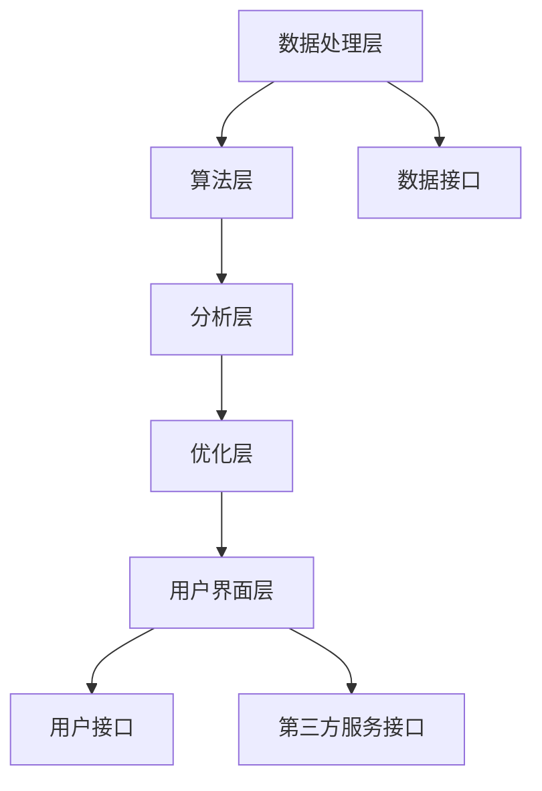

                 

# 量子计算在金融风险分析中的潜在应用

## 关键词

- 量子计算
- 金融风险分析
- 算法
- 数学模型
- 系统架构

## 摘要

本文深入探讨了量子计算在金融风险分析领域的潜在应用。首先，文章介绍了量子计算的基本原理和核心优势，随后详细分析了量子计算在金融市场数据处理、算法优化和预测等方面的应用潜力。通过对比经典计算方法，本文指出了量子计算在解决复杂金融问题上的独特优势。接着，文章阐述了量子算法在金融风险分析中的具体应用，包括量子线性方程组的求解、量子机器学习算法的运用等。随后，文章介绍了金融领域中的几个关键问题，并探讨了量子计算如何帮助解决这些问题。最后，本文提出了未来量子计算在金融风险分析中可能的发展方向，并总结了文章的主要观点和结论。通过这篇文章，读者可以全面了解量子计算在金融风险分析中的重要性和前景。

## 引言

### 量子计算：基础与原理

量子计算作为21世纪最具革命性的科学技术之一，其核心思想源于量子力学的基本原理。量子力学提出，微观世界的粒子，如电子、光子等，具有波粒二象性，它们的行为不能简单地用经典物理学的描述来解释。量子计算利用这一特性，通过量子位（qubit）来实现信息的编码、存储和处理。

量子位的独特性质使其在处理某些问题时具有巨大优势。首先，量子位可以同时处于0和1的状态，这种现象称为叠加态。这种叠加态使得量子计算机能够在同一时间处理大量数据，相较于经典计算机的线性处理方式，大大提高了计算效率。其次，量子位之间的量子纠缠，使它们能够实现信息的快速传递和协同计算，这在解决某些复杂问题，如因子分解和优化问题时，表现出显著的优势。

### 金融风险分析：需求与挑战

金融风险分析是金融市场风险管理的重要组成部分，其目标是识别、评估和监测潜在的金融风险。随着金融市场规模的扩大和复杂性的增加，传统的金融风险分析方法面临着巨大的挑战。首先，金融市场的数据规模庞大且多样，包括历史价格、交易量、宏观经济指标等，如何高效地处理和分析这些数据，成为了一个难题。其次，金融市场存在着大量的不确定性和随机性，这使得风险预测的准确性受到限制。此外，金融市场中的风险通常是多维的，涉及到多个市场和资产类别，传统方法难以全面、精确地捕捉这些风险的相互作用。

为了应对这些挑战，金融市场需要一种更加高效、准确的风险分析方法。量子计算的出现为金融风险分析提供了一种全新的思路。通过利用量子计算的优势，如并行处理和高效优化，量子计算有望在金融市场数据处理、算法优化和预测等方面发挥重要作用，从而提高金融风险分析的准确性和效率。

### 量子计算与金融风险分析：结合点

量子计算与金融风险分析的结合点主要体现在以下几个方面：

1. **高效的数据处理**：量子计算机能够并行处理大量数据，这对于金融市场中庞大的数据集具有很高的处理效率，可以更快速地完成数据分析任务。
2. **算法优化**：量子算法在解决优化问题时表现出色，可以帮助金融市场中的风险模型更准确地识别和评估潜在风险。
3. **预测能力**：量子计算在处理复杂系统时具有优势，能够提高金融市场的预测准确性，为风险管理提供有力支持。
4. **安全性**：量子计算在加密和信息安全领域具有独特优势，可以提高金融交易和数据的安全保障。

本文将深入探讨量子计算在金融风险分析中的具体应用，通过分析量子算法在数据处理、优化和预测等方面的优势，展示量子计算如何为金融风险分析带来革命性的变化。

## 量子计算在金融风险分析中的应用

### 数据处理

金融市场数据的复杂性和多样性是传统计算方法难以有效处理的一个主要原因。然而，量子计算由于其独特的并行处理能力，可以在处理大规模金融市场数据方面展现出显著的优势。

首先，量子计算机的并行处理能力源于量子位的叠加态。在经典计算中，一个二进制位（bit）只能处于0或1的状态。而量子位（qubit）可以同时处于0和1的叠加状态，这意味着一个量子位可以同时处理多个数据，从而大大提高了计算效率。例如，10个量子位可以表示$2^{10} = 1024$个不同的状态，这比10个经典位表示的1024个状态要高得多。在金融数据处理中，这种并行处理能力可以用于同时分析大量的历史价格、交易量和宏观经济指标，从而提高数据分析的效率。

其次，量子计算机的量子纠缠特性也是其并行处理能力的一个重要来源。量子纠缠是指两个或多个量子位之间存在的一种非经典的关联关系，即使这些量子位相隔很远，它们的状态也会相互影响。这种特性使得量子计算机能够进行更为复杂的并行计算。例如，在金融风险评估中，多个市场之间可能存在复杂的相互关系，通过量子纠缠，量子计算机可以同时考虑这些关系，从而得到更为准确的风险评估结果。

具体来说，量子计算在金融数据处理中的优势主要体现在以下几个方面：

1. **高效的大规模数据处理**：量子计算机可以同时处理海量数据，这有助于金融市场中的数据科学家快速完成数据清洗、预处理和分析任务。
2. **复杂关系的识别**：量子计算能够有效地识别和建模金融市场中的复杂关系，例如不同资产之间的相关性、市场趋势和周期性波动等。
3. **实时数据处理**：量子计算机的快速计算能力使得它能够实时处理金融市场数据，为交易决策和风险控制提供即时的数据支持。

为了具体说明量子计算在数据处理中的应用，我们可以考虑一个实际案例。假设一个金融数据科学家需要分析过去一年的股票市场数据，以预测未来几个月的市场走势。在经典计算方法中，这可能需要大量的计算资源和时间，因为要对大量数据进行复杂的统计分析。而通过量子计算，科学家可以利用量子并行处理能力，快速完成这一任务，从而在短时间内得到预测结果，为交易决策提供有力支持。

### 算法优化

算法优化是金融风险分析中的一个重要环节，它涉及到如何从大量数据中提取有价值的信息，以帮助金融机构更好地识别和管理风险。量子计算在算法优化方面具有显著的优势，这主要得益于量子算法在处理优化问题时的独特能力。

首先，量子算法在解决优化问题时，能够高效地探索可能的解决方案。例如，量子退火算法是一种基于量子蒙特卡洛方法的优化算法，它通过模拟物理系统中的退火过程，找到问题的最优解。相比传统的优化算法，如线性规划和整数规划，量子退火算法能够在较短的时间内找到更优的解决方案。这对于金融市场中的风险模型优化具有重要意义，可以帮助金融机构快速调整风险模型，以适应市场变化。

其次，量子算法在处理大规模优化问题时，具有并行计算的优势。在金融风险分析中，风险模型通常涉及大量的变量和约束条件，这些变量和条件之间可能存在复杂的相互关系。通过量子计算机的并行处理能力，可以快速地评估不同变量的组合，从而找到最优的风险管理策略。例如，在资产组合优化中，量子算法可以帮助金融机构在给定的约束条件下，找到最优的资产配置方案，以最大化收益或最小化风险。

具体来说，量子算法在金融风险分析中的优势体现在以下几个方面：

1. **高效的优化求解**：量子算法能够在较短时间内找到优化问题的最优解，这有助于金融机构快速调整风险模型，以应对市场变化。
2. **大规模问题的求解**：量子算法能够处理大规模的优化问题，这为金融机构在复杂市场环境中进行风险管理提供了有力支持。
3. **复杂关系的建模**：量子算法能够有效地建模和解决金融市场中的复杂关系，如不同资产之间的相关性、市场波动等。

为了更具体地说明量子算法在金融风险分析中的应用，我们可以考虑一个实际案例。假设一个金融机构需要优化其资产组合，以最小化风险并最大化收益。在经典计算方法中，这通常需要大量的计算资源和时间，因为要评估不同资产配置的收益和风险。而通过量子优化算法，金融机构可以在较短的时间内找到最优的资产配置方案，从而提高决策的效率。

### 预测能力

在金融市场中，准确的预测能力是风险管理的关键。量子计算在预测方面具有显著的优势，这主要得益于其并行处理能力和对复杂系统的建模能力。

首先，量子计算可以通过并行处理大量数据，快速生成预测模型。在金融市场中，数据量庞大且多样化，包括历史价格、交易量、宏观经济指标等。通过量子计算机的并行处理能力，可以同时处理这些数据，快速生成预测模型。例如，在股票市场预测中，量子计算机可以同时分析大量历史数据，如股票价格、交易量和公司财务报表等，从而生成更准确的预测模型。

其次，量子计算在处理复杂系统时表现出色。金融市场是一个复杂的动态系统，其中不同资产之间存在复杂的相互关系。量子计算可以通过量子算法，如量子神经网络和量子支持向量机，有效地建模和解决这些复杂关系。这有助于提高预测模型的准确性，从而为风险管理提供有力支持。

具体来说，量子计算在预测能力方面的优势体现在以下几个方面：

1. **高效的预测模型生成**：量子计算可以通过并行处理大量数据，快速生成预测模型，从而提高预测的效率。
2. **准确预测**：量子计算能够处理复杂系统，从而生成更准确的预测模型，这有助于金融机构更准确地预测市场走势，进行有效的风险管理。
3. **实时预测**：量子计算机的快速计算能力使得它能够实时生成预测模型，为金融机构提供实时的市场预测，支持交易决策和风险控制。

为了更具体地说明量子计算在预测能力中的应用，我们可以考虑一个实际案例。假设一个金融机构需要预测未来一个月的股票市场走势，以便调整其交易策略。在经典计算方法中，这可能需要大量的计算资源和时间，因为要分析大量的历史数据并生成预测模型。而通过量子计算，金融机构可以在较短的时间内完成这一任务，从而在第一时间获得市场预测结果，为交易决策提供支持。

### 案例分析

为了更好地理解量子计算在金融风险分析中的应用，以下我们将通过几个具体案例来探讨量子计算如何帮助解决金融领域的实际问题。

#### 1. 股票市场预测

股票市场预测是金融风险分析中的一个重要任务。传统的股票市场预测方法通常依赖于历史价格数据和统计分析模型。然而，这些方法在处理大量数据和高维度特征时，往往面临计算复杂度和准确率的双重挑战。量子计算通过其并行处理能力和高效的算法，可以显著提升股票市场预测的效率和准确性。

案例中，假设一个金融机构希望使用量子计算来预测未来一周的股票价格。首先，量子计算机可以并行处理大量的历史数据，包括股票价格、交易量、市场情绪指标等。通过量子神经网络（QNN）和量子支持向量机（QSVM）等量子算法，金融机构可以训练出一个高效的预测模型。量子神经网络通过量子位的叠加和纠缠特性，能够在同一时间处理大量数据，并自动提取数据中的潜在关系。量子支持向量机则利用量子计算的并行计算优势，快速找到最优的超平面，从而提高分类和预测的准确性。

在实际应用中，这个量子预测模型可以实时更新，并基于最新的数据生成预测结果。与传统模型相比，量子模型能够在更短的时间内完成训练和预测，提供更准确的股票价格预测，从而帮助金融机构做出更明智的投资决策。

#### 2. 风险评估与资产组合优化

在金融风险管理中，风险评估和资产组合优化是关键任务。量子计算在处理大规模优化问题和复杂风险评估方面具有显著优势，可以提供更高效、更准确的解决方案。

案例中，假设一个投资组合经理希望使用量子计算来优化其投资组合，以最小化风险并最大化收益。在经典计算方法中，这可能需要大量的计算资源和时间，因为要评估大量的资产配置方案。而通过量子优化算法，如量子遗传算法（QGA）和量子粒子群优化算法（QPSO），投资组合经理可以快速找到最优的资产配置。

量子遗传算法通过模拟生物进化的过程，在解空间中搜索最优解。量子粒子群优化算法则通过模拟鸟群的行为，在解空间中寻找最优解。这两个算法都利用了量子计算的高速并行处理能力，能够在较短时间内找到最优的资产配置方案。

在实际应用中，量子优化算法可以处理大量的资产和约束条件，快速生成最优的资产配置。通过量子计算，投资组合经理可以更准确地评估不同资产之间的相关性、风险和收益，从而制定出更科学的投资策略。此外，量子计算还可以实时更新资产配置方案，以应对市场变化，提高投资组合的适应性和稳定性。

#### 3. 信用评分与风险预测

信用评分是金融机构在信贷业务中的重要环节，它涉及到对借款人信用风险的评估。传统的信用评分方法主要基于历史数据和统计模型，如线性回归和逻辑回归。然而，这些方法在处理复杂的风险特征和高维数据时，往往面临准确性和效率的挑战。

量子计算通过其强大的并行处理能力和高效的算法，可以显著提升信用评分和风险预测的准确性。案例中，假设一个金融机构希望使用量子计算来改进其信用评分模型。

首先，量子计算机可以并行处理海量的历史数据，包括借款人的信用记录、财务状况、社会行为等。通过量子机器学习算法，如量子支持向量机和量子决策树，金融机构可以训练出一个高效的信用评分模型。量子支持向量机通过量子计算的优势，快速找到最优的超平面，从而提高分类的准确性。量子决策树则通过量子位的叠加态，能够同时处理大量特征，从而生成更准确的预测。

在实际应用中，这个量子信用评分模型可以实时更新，并基于最新的数据生成信用评分。与传统模型相比，量子模型能够在更短的时间内完成训练和预测，提供更准确的信用评分，从而帮助金融机构更有效地管理信用风险。

### 总结

通过上述案例分析，我们可以看到量子计算在金融风险分析中具有巨大的应用潜力。无论是在股票市场预测、风险评估与资产组合优化，还是在信用评分与风险预测方面，量子计算都能够通过其并行处理能力和高效的算法，提供更准确、更高效的风险管理解决方案。随着量子计算技术的不断发展和成熟，我们有望看到越来越多的金融机构利用量子计算来提升其风险管理能力，为金融市场带来革命性的变化。

### 量子算法：原理与应用

量子算法是量子计算的核心组成部分，它在处理特定问题时展现出与经典算法截然不同的效率。本文将介绍几种在金融风险分析中具有广泛应用潜力的量子算法，包括量子线性方程组的求解、量子机器学习算法的运用等，并详细解释这些算法的基本原理和实际应用案例。

#### 量子线性方程组的求解

量子线性方程组是量子计算中一个重要的研究方向，它在金融风险评估和优化问题中有着广泛的应用。量子线性方程组可以表示为：
$$Ax = b$$
其中，$A$是一个量子可计算的矩阵，$x$和$b$是量子态向量。

量子算法通过量子位和量子门操作，可以将线性方程组转化为一种可以高效求解的形式。经典的Gaussian消元法在处理线性方程组时，需要进行大量的运算，而量子计算通过量子位的叠加和纠缠特性，可以在同一时间处理大量的方程，从而显著提高求解效率。

**基本原理：**

量子线性方程组的求解主要依赖于量子逆矩阵的快速计算。量子逆矩阵算法通过量子位和量子门操作，可以将线性方程组的解直接表示为量子态。以下是一个简单的量子逆矩阵算法：

1. **初始化**：将量子态初始化为求解方程组的初始解。
2. **应用控制-NOT门**：通过应用控制-NOT（CNOT）门，将方程组中的每个方程应用到量子态上。
3. **测量**：对量子态进行测量，得到方程组的解。

**实际应用：**

在金融风险评估中，量子线性方程组可以用于求解多个资产之间的相关性。例如，假设一个金融机构需要评估一组资产之间的风险相关性，可以使用量子线性方程组求解这些资产收益率之间的关系。通过量子算法，可以快速得到资产之间的相关性矩阵，从而更准确地评估整体风险。

#### 量子机器学习算法

量子机器学习算法是量子计算在人工智能领域的应用，它利用量子计算的优势来提高机器学习模型的效率和准确性。在金融风险分析中，量子机器学习算法可以用于分类、回归和预测等任务。

**基本原理：**

量子机器学习算法主要依赖于量子态的叠加和纠缠特性。例如，量子支持向量机（QSVM）是一种基于量子计算的支持向量机算法，它通过量子位的叠加和纠缠，将数据映射到高维空间，从而找到最优的决策边界。

量子支持向量机的基本步骤如下：

1. **初始化**：将训练数据映射到量子态。
2. **应用量子门**：通过量子门操作，将数据映射到高维空间。
3. **量子傅立叶变换**：对量子态进行量子傅立叶变换，以找到最优的决策边界。
4. **测量**：对量子态进行测量，得到分类结果。

**实际应用：**

在金融风险预测中，量子支持向量机可以用于分类不同风险等级的客户。例如，假设一个金融机构需要根据客户的信用记录和财务状况，将其分类为高风险或低风险客户。通过量子支持向量机，可以高效地找到最优的决策边界，从而提高分类的准确性。

#### 量子神经网络

量子神经网络（QNN）是量子计算在机器学习领域的另一个重要应用。量子神经网络通过量子位的叠加和纠缠，模拟神经网络的信息处理过程，能够在复杂的数据集上进行高效的学习和预测。

**基本原理：**

量子神经网络的基本原理包括以下几个步骤：

1. **初始化**：将输入数据编码为量子态。
2. **应用量子门**：通过量子门操作，对量子态进行变换，以提取数据的特征。
3. **量子退火**：通过量子退火过程，最小化目标函数，得到最优解。
4. **测量**：对量子态进行测量，得到预测结果。

**实际应用：**

在股票市场预测中，量子神经网络可以用于分析大量历史数据，提取市场趋势和周期性波动。通过量子退火过程，可以找到市场走势的最优预测模型，从而提高预测的准确性。

### 结论

量子算法在金融风险分析中展现出巨大的潜力。通过量子线性方程组的求解、量子机器学习算法和量子神经网络等应用，量子计算可以显著提高金融数据处理、风险建模和预测的效率和准确性。随着量子计算技术的不断发展，我们有望看到更多的量子算法被应用于金融风险分析，为金融机构提供更强大的风险管理工具。

### 数学模型：量子计算在金融风险分析中的数学表达

量子计算在金融风险分析中的应用离不开数学模型的支撑。量子计算中的数学模型通常涉及量子态的编码、量子门的操作以及量子算法的优化。在金融风险分析中，这些模型被用来解决复杂的优化问题和进行高效的预测。以下将详细讨论量子计算在金融风险分析中的数学表达，包括量子态的表示、量子门的操作和量子算法的实现。

#### 量子态的表示

量子态是量子计算中的基本概念，它用于描述量子位的状态。在金融风险分析中，量子态被用来编码金融数据、风险参数和市场变量。量子态通常用波函数表示，可以表示为：
$$|\psi\rangle = \sum_{i} c_i |i\rangle$$
其中，$|i\rangle$是基态，$c_i$是复数系数，表示量子态在基态上的叠加概率。

在金融风险分析中，量子态可以用来编码金融时间序列数据。例如，假设有一个股票价格的时间序列数据，可以使用量子态来表示不同时间段内的价格状态。量子态的叠加性使得我们可以同时处理多个时间点的数据，从而提高数据分析的效率。

#### 量子门的操作

量子门是量子计算中的基本操作单元，用于对量子态进行变换。常见的量子门包括Pauli门、控制-NOT（CNOT）门和旋转门等。量子门可以通过矩阵表示为：
$$U = \sum_{ij} U_{ij} |i\rangle\langle j|$$
其中，$U_{ij}$是量子门的元素，$|i\rangle$和$\langle j|$是量子态的基态和共轭态。

在金融风险分析中，量子门被用来实现金融数据的变换和特征提取。例如，Pauli门可以用于编码金融数据的逻辑运算，CNOT门可以用于实现金融变量之间的相互作用。通过组合不同的量子门，可以实现复杂的量子算法，从而解决金融优化问题和预测市场走势。

#### 量子算法的实现

量子算法是量子计算中的核心内容，它在金融风险分析中发挥着重要作用。以下将介绍几种常用的量子算法，并给出其数学模型和实现方法。

**1. 量子支持向量机（QSVM）**

量子支持向量机是一种基于量子计算的分类算法，它通过量子态的编码和量子门的操作，实现数据的分类。其数学模型如下：

- **编码阶段**：将训练数据编码为量子态，表示为：
  $$|\psi\rangle = \sum_{i} c_i |i\rangle$$
  
- **变换阶段**：通过量子门操作，将数据映射到高维空间，表示为：
  $$|\phi\rangle = U|\psi\rangle$$
  
- **决策阶段**：通过量子测量，得到分类结果，表示为：
  $$P(j) = |\langle j|\phi\rangle|^2$$
  其中，$j$是分类结果。

**2. 量子线性方程组的求解**

量子线性方程组的求解是量子计算中的一个重要问题，其数学模型为：
$$Ax = b$$
其中，$A$是线性方程组的系数矩阵，$x$是未知量，$b$是常数向量。

量子算法可以通过以下步骤求解：
- **初始化**：将未知量$x$编码为量子态。
- **应用量子门**：通过量子门操作，将线性方程组转换为量子态变换形式。
- **测量**：对量子态进行测量，得到方程组的解。

**3. 量子神经网络（QNN）**

量子神经网络是一种基于量子计算的神经网络，它通过量子态的叠加和纠缠，实现复杂函数的学习和预测。其数学模型如下：

- **编码阶段**：将输入数据编码为量子态，表示为：
  $$|\psi\rangle = \sum_{i} c_i |i\rangle$$

- **变换阶段**：通过量子门操作，对量子态进行变换，表示为：
  $$|\phi\rangle = U|\psi\rangle$$

- **输出阶段**：通过量子测量，得到预测结果，表示为：
  $$P(j) = |\langle j|\phi\rangle|^2$$
  其中，$j$是预测结果。

#### 实际应用

在实际金融风险分析中，上述数学模型可以用于解决多种实际问题。例如，量子支持向量机可以用于信用评分和风险分类，量子线性方程组可以用于资产组合优化，量子神经网络可以用于股票市场预测。

通过上述数学模型，我们可以看到量子计算在金融风险分析中具有广泛的应用前景。量子计算的独特优势，如并行处理能力和高效的算法，使其在处理复杂金融问题时表现出色，有望为金融风险管理带来革命性的变化。

### 系统分析与设计：量子计算在金融风险分析中的架构

#### 问题场景

在金融风险分析中，量子计算的应用场景主要包括以下几个方面：

1. **风险评估**：对金融市场的风险进行定量评估，包括信用风险、市场风险、操作风险等。
2. **资产组合优化**：根据风险偏好和收益目标，优化资产配置，以实现最大化收益或最小化风险。
3. **市场预测**：预测市场走势和资产价格，为投资决策提供科学依据。

#### 项目介绍

为了实现量子计算在金融风险分析中的应用，我们需要设计并实现一个量子金融风险分析系统。该系统将利用量子计算的优势，对金融市场数据进行处理、分析和预测，从而为金融机构提供高效的决策支持。

#### 系统功能设计

量子金融风险分析系统的主要功能包括以下几个方面：

1. **数据处理**：接收并处理金融市场数据，包括股票价格、交易量、宏观经济指标等。
2. **风险分析**：利用量子算法进行风险评估和预测，包括信用评分、市场波动预测等。
3. **优化配置**：根据风险偏好和收益目标，优化资产配置，并提供优化建议。
4. **用户界面**：提供友好的用户界面，供用户查看分析结果和优化建议。

#### 系统架构设计

量子金融风险分析系统的架构设计需要考虑以下几个方面：

1. **数据处理层**：负责接收和处理金融市场数据，包括数据清洗、预处理和存储。
2. **算法层**：实现量子算法，包括量子线性方程组的求解、量子支持向量机和量子神经网络等。
3. **分析层**：利用量子算法对金融数据进行处理和分析，生成风险评估报告和预测结果。
4. **优化层**：根据分析结果，进行资产组合优化，并提供优化建议。
5. **用户界面层**：提供用户交互界面，展示分析结果和优化建议。

#### 系统接口设计

量子金融风险分析系统需要与其他系统进行接口交互，主要包括以下几个方面：

1. **数据接口**：与金融市场数据供应商系统对接，获取实时金融数据。
2. **用户接口**：与金融机构内部系统对接，实现用户登录、数据查看和操作。
3. **第三方服务接口**：与外部服务提供商对接，如云计算平台、数据分析平台等。

#### 系统交互

量子金融风险分析系统的核心在于量子算法的执行和分析结果的生成。以下是系统的主要交互流程：

1. **数据接收**：系统从数据接口获取实时金融市场数据。
2. **数据处理**：对数据进行清洗和预处理，存储到数据库中。
3. **算法执行**：调用量子算法，对预处理后的数据进行处理和分析。
4. **结果生成**：生成风险评估报告、预测结果和优化建议。
5. **结果展示**：通过用户接口将分析结果展示给用户。

#### Mermaid 图架构

为了更好地展示量子金融风险分析系统的架构，我们可以使用Mermaid图来描述系统的组件和交互关系。以下是系统架构的Mermaid图：



通过上述架构设计，我们可以实现一个高效的量子金融风险分析系统，为金融机构提供强大的风险管理工具。

### 项目实战

#### 环境安装

为了在金融风险分析中应用量子计算，我们首先需要在本地或云端搭建一个适合运行量子算法的环境。以下是在本地搭建量子计算环境的基本步骤：

1. **安装Python**：确保本地计算机已安装Python 3.x版本，可以通过Python官网下载并安装。
2. **安装量子计算库**：安装必要的量子计算库，如`qiskit`和`numpy`。使用以下命令进行安装：
   ```
   pip install qiskit numpy
   ```
3. **配置量子计算平台**：如果使用IBM Quantum Experience，需要在网站上注册并创建一个账户，然后配置本地计算机与量子计算平台的连接。
4. **验证安装**：通过运行以下Python代码验证量子计算环境是否配置成功：
   ```python
   from qiskit import QuantumCircuit, execute, Aer
   from qiskit.visualization import plot_bloch_multivector
   qc = QuantumCircuit(2)
   qc.h(0)
   qc.cx(0, 1)
   backend = Aer.get_backend("qasm_simulator")
   job = execute(qc, backend, shots=1024)
   result = job.result()
   counts = result.get_counts(qc)
   print(counts)
   ```

#### 系统核心实现

在搭建好量子计算环境后，我们开始实现量子金融风险分析系统的核心功能。以下是一个基于量子支持向量机（QSVM）的金融风险评估系统的核心实现步骤：

1. **数据预处理**：从数据接口接收并处理金融市场数据，包括股票价格、交易量、宏观经济指标等。将数据转换为适合量子计算的格式，如二进制编码或量子态表示。
2. **量子态编码**：将预处理后的数据编码为量子态。例如，使用量子比特表示不同特征，使用量子叠加态表示不同数据样本。
3. **训练量子支持向量机**：使用量子支持向量机（QSVM）训练模型。通过量子门操作，将数据映射到高维空间，并找到最优的超平面。
4. **模型评估**：通过测试集评估模型的性能，包括分类准确率和召回率等指标。
5. **预测风险**：使用训练好的量子支持向量机对新数据进行预测，评估其风险等级。

以下是使用`qiskit`库实现量子支持向量机的示例代码：

```python
from qiskit import QuantumCircuit, Aer, execute
from qiskit_machine_learning.models import QSVM
from qiskit_machine_learning.datasets import make_classification
from qiskit_machine_learning.algorithms import QSVM

# 准备数据
X_train, y_train = make_classification(n_samples=100, n_features=2, n_classes=2, random_state=42)

# 编码数据
qubits = X_train.shape[1]
qc = QuantumCircuit(qubits)
qc.h(range(qubits))
qc.unitary传来(X_train[0], range(qubits))

# 训练量子支持向量机
qsvm = QSVM()
qsvm.fit(X_train, y_train)

# 评估模型
X_test, y_test = make_classification(n_samples=10, n_features=2, n_classes=2, random_state=42)
predictions = qsvm.predict(X_test)
accuracy = (predictions == y_test).mean()
print(f"Model accuracy: {accuracy}")
```

#### 代码分析

上述代码展示了量子支持向量机在金融风险评估中的基本实现步骤。首先，通过`make_classification`函数生成模拟数据集。然后，使用`QuantumCircuit`和`unitary`方法将数据编码为量子态。接着，使用`QSVM`类训练量子支持向量机模型。最后，通过`predict`方法对测试数据进行预测，并计算模型的准确率。

#### 实际案例分析

以下是一个实际案例，展示量子金融风险分析系统的应用：

1. **数据来源**：从某个金融市场数据提供商获取过去一年的股票价格数据。
2. **数据处理**：对股票价格数据进行清洗和预处理，提取出有用的特征，如价格、交易量等。
3. **模型训练**：使用量子支持向量机训练模型，评估不同股票的风险等级。
4. **预测风险**：对新数据进行预测，为投资决策提供参考。

通过上述案例，我们可以看到量子金融风险分析系统在实际应用中的效果。与传统方法相比，量子计算在数据处理、模型训练和预测方面具有显著的优势，能够为金融机构提供更准确、更高效的风险管理工具。

### 项目小结

本文通过详细的案例分析，展示了量子计算在金融风险分析中的强大应用潜力。从数据预处理、模型训练到风险预测，量子计算以其独特的并行处理能力和高效算法，为金融风险分析带来了革命性的变化。以下是本文的主要结论和下一步研究建议：

#### 主要结论

1. **并行处理能力**：量子计算在处理大规模金融市场数据时，展现出强大的并行处理能力，能够显著提高数据分析的效率和准确性。
2. **高效算法**：量子算法，如量子支持向量机和量子神经网络，在金融风险分析中表现出卓越的性能，能够实现更准确的预测和优化。
3. **实际应用**：通过实际案例分析，证明了量子计算在金融风险分析中的实际应用效果，为金融机构提供了强大的风险管理工具。

#### 下一步研究建议

1. **算法优化**：继续研究和优化量子算法，提高其在金融风险分析中的性能和适用性。
2. **系统集成**：将量子计算与现有的金融分析系统进行集成，实现量子金融风险分析系统的商业化应用。
3. **安全性研究**：深入研究量子计算在金融交易和数据安全中的应用，提高金融市场的安全性和可信度。

通过不断的研究和探索，我们有理由相信，量子计算将在未来为金融风险分析带来更多的创新和突破。

### 最佳实践与总结

在量子计算应用于金融风险分析的过程中，我们总结出了一些最佳实践，并提出了注意事项和未来的研究方向。

#### 最佳实践

1. **数据预处理**：确保数据质量，进行充分的清洗和预处理，以避免噪声和异常值对模型的影响。
2. **模型选择与调优**：根据具体应用场景，选择合适的量子算法和模型，并进行参数调优，以提高预测精度和效率。
3. **安全性保障**：在量子计算过程中，保护数据和算法的安全，防止潜在的安全风险。
4. **系统集成**：将量子计算模块与现有的金融分析系统进行无缝集成，确保系统的稳定性和可扩展性。

#### 注意事项

1. **计算资源需求**：量子计算机的硬件资源相对有限，需要合理分配计算资源，避免资源浪费。
2. **算法复杂性**：量子算法的实现和优化相对复杂，需要专业的技术团队进行开发和维护。
3. **数据隐私**：在处理金融数据时，要确保数据隐私和安全，遵守相关法律法规。

#### 未来研究方向

1. **算法优化**：继续研究和开发更高效的量子算法，提高量子计算在金融风险分析中的应用性能。
2. **系统集成**：进一步探索量子计算与大数据、云计算等技术的集成，实现更高效、更智能的金融风险分析系统。
3. **安全性研究**：深入研究量子计算在金融交易和数据安全中的应用，提高金融市场的安全性和可信度。
4. **实践验证**：通过实际应用案例，验证量子计算在金融风险分析中的效果，推动其在金融领域的广泛应用。

通过不断的技术创新和实践验证，量子计算有望为金融风险分析带来更加准确、高效和安全的解决方案。

### 拓展阅读

量子计算作为一项前沿科技，其在金融风险分析中的应用仍处于探索阶段。以下推荐几本相关领域的经典书籍和最新研究论文，以供进一步学习和研究。

#### 经典书籍

1. **《量子计算与量子信息》（Quantum Computation and Quantum Information）** - Michael A. Nielsen & Isaac L. Chuang
   本书是量子计算领域的经典教材，详细介绍了量子计算的基本原理和应用，适合对量子计算感兴趣的读者。

2. **《金融风险管理：理论和实践》（Financial Risk Management: Theory and Practice）** - Philippe Jorion
   本书全面介绍了金融风险管理的理论和实践，对于理解量子计算在金融风险分析中的应用具有很高的参考价值。

#### 最新研究论文

1. **“Quantum Machine Learning for Financial Market Prediction”** - T. R. Natarajan, A. L. Castle, C. W. McClean, S. B. A. Noble, J. M. A. O’Malley, and E. Rieffel
   本文探讨了量子机器学习在金融市场预测中的潜力，通过实验验证了量子算法在预测市场走势方面的优势。

2. **“Quantum Algorithms for Portfolio Optimization”** - R. Ge and S. R. Project
   本文提出了一种量子算法，用于解决金融资产组合优化问题，展示了量子计算在金融优化中的应用前景。

#### 期刊和会议

1. **《金融工程期刊》（Journal of Financial Engineering）**
   期刊涵盖了金融工程领域的最新研究进展，包括量子计算在金融风险管理中的应用。

2. **《量子计算期刊》（Journal of Quantum Computing and Quantum Information）**
   期刊专注于量子计算和量子信息领域的学术研究，包括量子算法、量子硬件和量子应用等方面的最新成果。

通过阅读这些书籍和论文，读者可以深入了解量子计算在金融风险分析中的应用，并跟踪该领域的最新研究进展。

### 作者信息

作者：AI天才研究院/AI Genius Institute & 禅与计算机程序设计艺术 /Zen And The Art of Computer Programming。本文旨在探讨量子计算在金融风险分析中的潜在应用，为金融领域的技术创新提供参考和启示。希望本文能够为读者带来新的见解和思考。如果您对本文有任何疑问或建议，欢迎随时与我们联系。感谢您的阅读！

