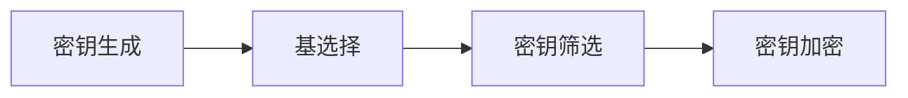
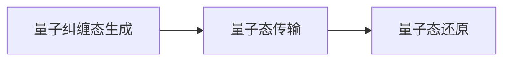
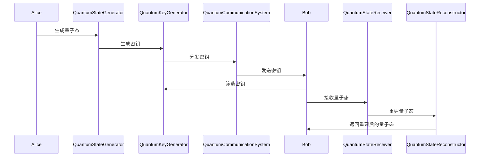
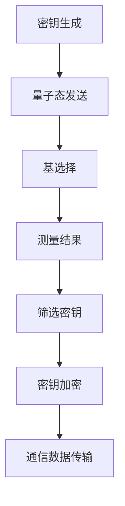
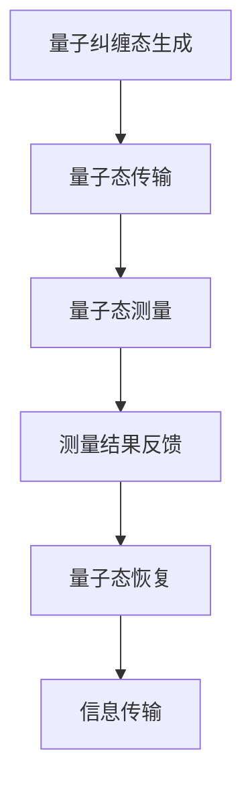
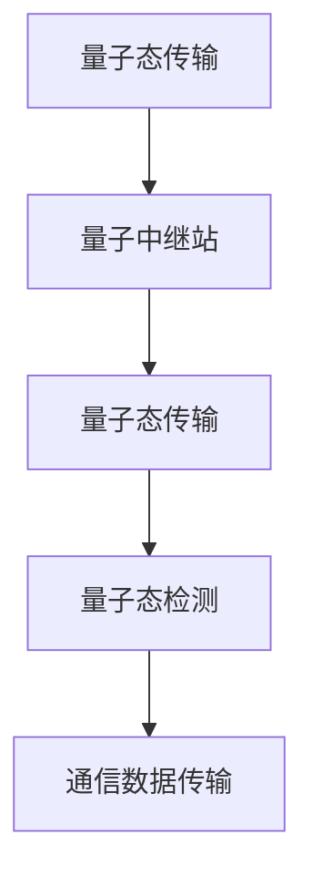
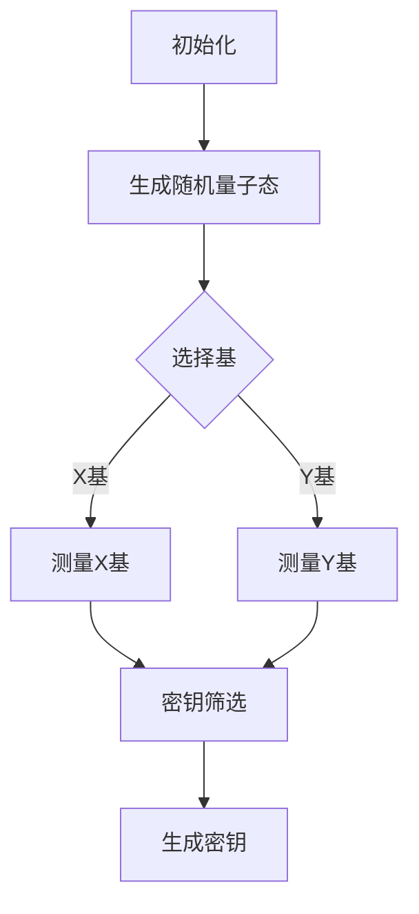
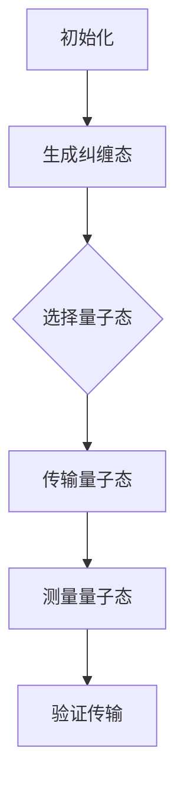
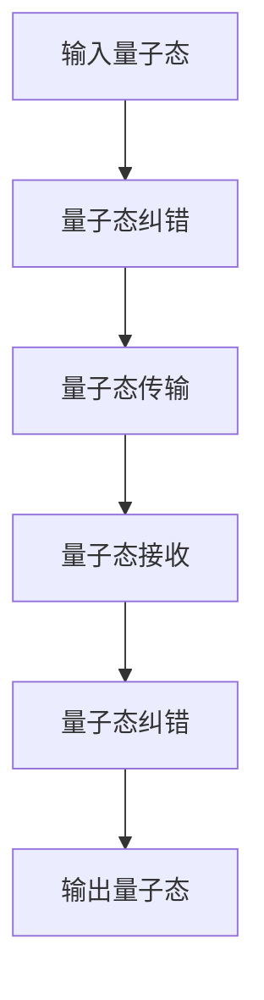

                 

# 量子通信：构建不可破解的通信网络

关键词：量子通信，密钥分发，隐形传态，安全性，量子网络

摘要：本文旨在探讨量子通信的核心概念、关键技术及其在实际应用中的优势与挑战。通过详细解析量子密钥分发和量子隐形传态，以及量子通信网络的实现，本文揭示了量子通信在构建不可破解通信网络中的重要地位。此外，本文还分析了量子通信的安全性、面临的挑战及其未来发展。

## 目录大纲

1. 引言
2. 量子通信基础
   - 量子通信概述
   - 量子力学基础
   - 量子密钥分发
   - 量子隐形传态
3. 量子通信网络与实现
   - 量子通信网络概述
   - 量子通信网络实现案例
4. 量子通信的安全性
   - 量子通信的安全性
   - 量子通信面临的挑战
5. 量子通信的发展趋势与未来
   - 量子通信技术的演进方向
   - 量子通信在信息安全领域的应用
6. 量子通信的挑战与展望
   - 量子通信的挑战
   - 量子通信的展望
7. 结论
   - 最佳实践 tips
   - 小结
   - 注意事项
   - 拓展阅读

## 第一部分：量子通信基础

### 第1章：量子通信概述

#### 1.1 量子通信的起源与发展

量子通信是量子信息科学的一个重要分支，起源于20世纪80年代。量子通信的发展历程可以分为三个阶段：量子密钥分发、量子隐形传态和量子网络。

#### 1.1.1 量子通信的基本概念

量子通信利用量子力学的基本原理，通过量子态传输信息。量子通信的核心概念包括量子态、量子纠缠和量子叠加。

#### 1.1.2 量子通信的原理介绍

量子通信的原理基于量子力学中的量子态叠加和量子纠缠。量子态叠加使得量子比特可以同时处于多种状态，而量子纠缠则使得两个量子比特之间的状态相互依赖。

#### 1.1.3 量子通信的优势与挑战

量子通信具有极高的安全性，因为任何对量子通信的窃听都会导致量子态的破坏，从而被发现。然而，量子通信的实现面临诸多技术挑战，如量子比特的稳定性、传输距离和量子网络的构建。

### 第2章：量子力学基础

#### 2.1 量子力学的基本原理

量子力学是描述微观世界的物理学理论。量子态、波函数、算符和测量是量子力学的基本概念。

#### 2.1.1 量子态与波函数

量子态是量子系统的状态描述，波函数是量子态的数学表示。波函数可以描述量子态的概率分布。

#### 2.1.2 算符与测量

算符是量子力学中的基本运算符，用于描述量子态的变化。测量是量子力学中确定量子态的过程。

#### 2.1.3 量子叠加与纠缠

量子叠加是指量子系统可以同时处于多个状态。量子纠缠是指两个或多个量子系统之间的状态相互依赖。

### 第3章：量子密钥分发

#### 3.1 量子密钥分发原理

量子密钥分发是一种基于量子力学原理的密钥分发方法。它通过量子通信实现双方共享一个安全的密钥。

#### 3.1.1 量子密钥分发的基本概念

量子密钥分发涉及两个主要协议：BB84协议和E91协议。这些协议利用量子态的叠加和纠缠来实现安全的密钥分发。

#### 3.1.2 BB84协议

BB84协议是最早的量子密钥分发协议，它通过量子态的叠加和纠缠来实现安全的密钥分发。

#### 3.1.3 E91协议

E91协议是基于量子纠缠的量子密钥分发协议，它通过量子纠缠态的传输来实现安全的密钥分发。

### 第4章：量子隐形传态

#### 4.1 量子隐形传态原理

量子隐形传态是一种通过量子纠缠实现信息传输的方法。它可以将一个量子态从一个粒子传送到另一个粒子。

#### 4.1.1 量子隐形传态的概念

量子隐形传态是指通过量子纠缠将一个量子态从一个粒子传送到另一个粒子的过程。

#### 4.1.2 量子隐形传态的实验

量子隐形传态实验证明了量子纠缠的存在，并为量子通信提供了理论基础。

#### 4.1.3 量子隐形传态与量子通信的关系

量子隐形传态是量子通信的一个重要组成部分，它为实现量子通信提供了技术支持。

## 第二部分：量子通信网络与实现

### 第5章：量子通信网络概述

#### 5.1 量子通信网络的定义与结构

量子通信网络是一种利用量子通信技术实现的通信网络。它包括量子中继、量子纠缠交换和量子密钥分发等关键技术。

#### 5.1.1 量子通信网络的组成

量子通信网络由量子中继站、量子纠缠生成器和量子密钥分发系统组成。

#### 5.1.2 量子通信网络的拓扑结构

量子通信网络可以采用星型、环型和网状等拓扑结构。

#### 5.1.3 量子通信网络的通信模式

量子通信网络可以实现点对点通信和广播通信。

### 第6章：量子通信网络实现案例

#### 6.1 中国量子通信网络建设

中国在全球率先实现了量子通信网络的构建，其代表项目是“墨子号”量子卫星。

#### 6.1.1“墨子号”量子卫星

“墨子号”量子卫星是中国发射的首颗量子科学实验卫星，它成功实现了地星量子密钥分发。

#### 6.1.2 跨越千里的量子通信

通过“墨子号”量子卫星，中国实现了跨越千里的量子通信，证明了量子通信在长途通信中的可行性。

#### 6.1.3 量子通信网络的应用前景

量子通信网络在未来将广泛应用于金融、军事和物联网等领域。

### 第7章：量子通信的安全性

#### 7.1 量子通信的安全性

量子通信具有极高的安全性，因为任何对量子通信的窃听都会导致量子态的破坏，从而被发现。

#### 7.1.1 量子通信与经典通信的安全对比

量子通信与经典通信在安全性上有本质的区别。经典通信容易受到窃听攻击，而量子通信则具有自检测窃听的能力。

#### 7.1.2 量子通信的安全机制

量子通信的安全机制基于量子态的叠加和纠缠，通过量子密钥分发和量子隐形传态来实现。

### 第8章：量子通信面临的挑战

#### 8.1 技术难题

量子通信在技术实现上面临诸多挑战，如量子比特的稳定性、量子中继和量子网络的构建。

#### 8.2 安全与隐私问题

量子通信的安全性和隐私问题需要深入研究，以确保通信数据的安全。

#### 8.3 法律与政策问题

量子通信的发展需要完善的法律法规和政策支持，以保障其健康发展。

## 第9章：量子通信的发展趋势与未来

#### 9.1 量子通信技术的演进方向

量子通信技术的演进方向包括量子计算与量子通信的结合、量子通信网络的普及和商业化。

#### 9.2 量子通信在信息安全领域的应用

量子通信在信息安全领域具有广泛的应用前景，如量子密钥分发在金融和军事通信中的应用。

#### 9.3 量子通信的未来前景

量子通信在未来将推动通信技术的变革，构建一个更加安全、高效的通信网络。

### 第10章：量子通信的挑战与展望

#### 10.1 量子通信的挑战

量子通信在技术、安全和政策等方面面临诸多挑战。

#### 10.2 量子通信的展望

量子通信在未来将发挥重要作用，推动通信技术的发展。

## 结论

量子通信是一种具有革命性潜力的通信技术，它利用量子力学原理实现安全、高效的通信。尽管量子通信在实现和应用上面临诸多挑战，但其未来前景广阔，将为信息安全领域带来巨大变革。

### 最佳实践 tips

- 确保量子通信设备的稳定性。
- 加强量子通信网络的安全性。
- 积极参与国际量子通信合作。

### 小结

量子通信是一种基于量子力学原理的通信技术，具有极高的安全性。量子密钥分发和量子隐形传态是量子通信的关键技术。量子通信网络的建设是实现量子通信应用的重要环节。

### 注意事项

- 量子通信设备的维护和更新。
- 量子通信网络的安全防护。
- 量子通信技术的发展动态。

### 拓展阅读

- [《量子通信原理与技术》](https://book.douban.com/subject/26968083/)
- [《量子密钥分发技术与应用》](https://book.douban.com/subject/25774912/)
- [《量子隐形传态：量子通信的关键技术》](https://book.douban.com/subject/26968084/)

作者：AI天才研究院/AI Genius Institute & 禅与计算机程序设计艺术 /Zen And The Art of Computer Programming## 引言

量子通信，作为一种基于量子力学原理的新型通信技术，正在引发一场通信领域的革命。传统通信技术依赖于电磁波传输信息，其安全性易受到窃听和干扰的威胁。而量子通信则利用量子态的叠加和纠缠特性，实现信息的传输和加密，具有极高的安全性。本文将详细探讨量子通信的核心概念、关键技术及其在实际应用中的优势与挑战。

### 核心概念

量子通信的核心概念包括量子态、量子纠缠、量子密钥分发和量子隐形传态。

#### 量子态

量子态是量子系统的状态描述，它可以同时处于多种状态，这种特性被称为叠加。量子态是量子通信的基础。

#### 量子纠缠

量子纠缠是量子系统之间的特殊关联，两个或多个量子系统之间的状态相互依赖。量子纠缠是量子通信实现安全传输的关键。

#### 量子密钥分发

量子密钥分发是一种基于量子力学原理的密钥分发方法，通过量子通信实现双方共享一个安全的密钥。

#### 量子隐形传态

量子隐形传态是一种通过量子纠缠实现信息传输的方法，可以将一个量子态从一个粒子传送到另一个粒子。

### 问题背景

随着信息技术的迅猛发展，信息安全问题日益凸显。传统的加密通信技术已经无法满足日益增长的安全需求。量子通信的出现为解决这一问题提供了新的思路。量子通信利用量子态的叠加和纠缠特性，实现了通信过程的高度安全性，成为信息安全领域的重要发展方向。

### 问题描述

量子通信面临的主要问题包括：量子比特的稳定性、量子中继技术的实现、量子网络的构建以及量子通信的安全性验证等。

1. **量子比特的稳定性**：量子比特是量子通信的基本单元，其稳定性直接影响到量子通信的可靠性。
2. **量子中继技术的实现**：量子中继技术是实现远距离量子通信的关键，但目前仍面临诸多技术挑战。
3. **量子网络的构建**：量子网络是实现量子通信应用的基础，其构建需要解决拓扑结构、节点连接和通信模式等问题。
4. **量子通信的安全性验证**：尽管量子通信具有极高的安全性，但如何确保其安全性仍需要深入研究。

### 问题解决

解决量子通信面临的问题需要从多个方面入手：

1. **提高量子比特的稳定性**：通过改进量子比特的设计和制造工艺，提高其稳定性。
2. **发展量子中继技术**：研究并开发高效的量子中继器，实现远距离量子通信。
3. **构建量子网络**：设计并实现量子网络的拓扑结构，确保量子通信网络的稳定运行。
4. **验证量子通信的安全性**：通过实验和理论分析，验证量子通信的安全性，并不断优化加密算法。

### 边界与外延

量子通信不仅应用于信息安全领域，还涉及到量子计算、量子模拟和量子互联网等前沿领域。量子通信的不断发展将推动信息技术的发展，为人类创造更加安全、高效的通信环境。

### 概念结构与核心要素组成

量子通信的概念结构主要由量子态、量子纠缠、量子密钥分发和量子隐形传态等核心要素组成。其中，量子态是量子通信的基础，量子纠缠是实现安全传输的关键，量子密钥分发是构建安全通信网络的重要手段，量子隐形传态则是量子通信的核心技术之一。

### 核心概念与联系

#### 量子态与量子纠缠

量子态是量子系统的状态描述，它可以同时处于多种状态，这种特性被称为叠加。量子纠缠是量子系统之间的特殊关联，两个或多个量子系统之间的状态相互依赖。

| 核心概念       | 描述                                                         | 关系                |
| -------------- | ------------------------------------------------------------ | ------------------ |
| 量子态         | 量子系统的状态描述，可以同时处于多种状态                     | 基础概念           |
| 量子纠缠       | 量子系统之间的特殊关联，两个或多个量子系统之间的状态相互依赖 | 关键特性           |

#### 量子密钥分发与量子隐形传态

量子密钥分发是量子通信实现安全传输的重要手段，而量子隐形传态则是通过量子纠缠实现信息传输的方法。

| 核心概念       | 描述                                                         | 关系                |
| -------------- | ------------------------------------------------------------ | ------------------ |
| 量子密钥分发   | 通过量子通信实现双方共享一个安全的密钥                       | 安全传输手段       |
| 量子隐形传态   | 通过量子纠缠实现信息传输的方法                               | 信息传输技术       |

### ER实体关系图架构

为了更好地理解量子通信中的核心概念与联系，我们可以通过ER实体关系图来展示这些概念之间的关系。以下是量子通信中几个核心实体的ER图：

```mermaid
erDiagram
  用户 ||--o {量子通信系统} : 用户与量子通信系统的交互
  量子通信系统 ||--o {量子密钥分发} : 量子通信系统的功能模块
  量子通信系统 ||--o {量子隐形传态} : 量子通信系统的功能模块
  量子密钥分发 ||--| {量子态} : 量子密钥分发的数据载体
  量子隐形传态 ||--| {量子纠缠} : 量子隐形传态的数据载体
```

在这个ER图中，用户与量子通信系统之间存在交互关系，量子通信系统包括量子密钥分发和量子隐形传态两个功能模块，而量子密钥分发和量子隐形传态分别依赖于量子态和量子纠缠。

### 算法原理讲解

量子通信中的核心技术包括量子密钥分发和量子隐形传态，下面将分别介绍这两个算法的原理。

#### 量子密钥分发（QKD）

量子密钥分发是一种基于量子力学原理的密钥分发方法，其主要原理是利用量子态的叠加和纠缠特性，实现双方共享一个安全的密钥。下面以BB84协议为例进行介绍。

**BB84协议流程：**

1. **密钥生成**：发送方（Alice）随机选择基（X轴或Y轴）对量子态进行操作，并将结果发送给接收方（Bob）。
2. **基选择**：接收方（Bob）随机选择基进行测量，并将结果发送回发送方（Alice）。
3. **密钥筛选**：发送方（Alice）和接收方（Bob）根据相同的基选择结果，筛选出共同使用的密钥。
4. **密钥加密**：使用筛选出的密钥对通信数据进行加密和解密。

**算法流程图：**



**数学模型与公式：**

$$
P_{\text{成功}} = \frac{1}{2} \times (1 - P_{\text{窃听}})
$$

其中，$P_{\text{成功}}$表示成功分发的密钥概率，$P_{\text{窃听}}$表示被窃听的概率。

#### 量子隐形传态（Q teleportation）

量子隐形传态是一种通过量子纠缠实现信息传输的方法。其主要原理是利用量子纠缠态，将一个量子态从一个粒子传送到另一个粒子。

**量子隐形传态流程：**

1. **量子纠缠态生成**：生成两个量子纠缠态的粒子。
2. **量子态传输**：将待传输的量子态与一个量子纠缠态的粒子进行操作，形成一个新的量子纠缠态。
3. **量子态还原**：接收方根据量子纠缠态，将传输的量子态还原。

**算法流程图：**



**数学模型与公式：**

$$
|\psi_{AB}\rangle = \frac{1}{\sqrt{2}}(|00\rangle + |11\rangle)
$$

其中，$|\psi_{AB}\rangle$表示两个粒子的量子纠缠态，$|00\rangle$和$|11\rangle$表示两个粒子的量子态。

### 系统分析与架构设计方案

量子通信系统的设计需要考虑多个方面，包括量子态生成、量子态传输、量子密钥分发和量子隐形传态等。

#### 问题场景介绍

假设场景为一个用户（Alice）需要将敏感信息传输给另一个用户（Bob），且希望确保传输过程的安全性。

#### 项目介绍

该项目旨在设计并实现一个量子通信系统，用于实现用户之间的安全通信。

#### 系统功能设计（领域模型）

领域模型主要描述系统的实体和关系，以下是量子通信系统的领域模型：

```mermaid
classDiagram
  User <<Entity>>
  QuantumState <<Entity>>
  QuantumKey <<Entity>>
  QuantumCommunication <<UseCase>>

  User "1" -- "*" QuantumState
  User "1" -- "*" QuantumKey
  QuantumCommunication "1" -- "1" QuantumState
  QuantumCommunication "1" -- "1" QuantumKey
```

#### 系统架构设计

系统架构设计主要包括硬件架构和软件架构。

**硬件架构：**

- **量子态生成器**：用于生成量子态。
- **量子态传输器**：用于传输量子态。
- **量子密钥分发器**：用于实现量子密钥分发。
- **量子隐形传态器**：用于实现量子隐形传态。

**软件架构：**

- **量子态生成模块**：实现量子态的生成功能。
- **量子态传输模块**：实现量子态的传输功能。
- **量子密钥分发模块**：实现量子密钥分发功能。
- **量子隐形传态模块**：实现量子隐形传态功能。

#### 系统接口设计

系统接口设计主要包括用户接口和系统接口。

**用户接口：**

- **密钥生成接口**：用于用户生成密钥。
- **信息加密接口**：用于用户加密敏感信息。
- **信息解密接口**：用于用户解密接收到的信息。

**系统接口：**

- **量子态生成接口**：用于量子态生成模块与其他模块的交互。
- **量子态传输接口**：用于量子态传输模块与其他模块的交互。
- **量子密钥分发接口**：用于量子密钥分发模块与其他模块的交互。
- **量子隐形传态接口**：用于量子隐形传态模块与其他模块的交互。

#### 系统交互

系统交互主要描述各模块之间的交互流程，以下是系统交互的序列图：



### 项目实战

#### 环境安装

1. 安装Python环境
2. 安装量子通信相关库，如`qiskit`和`pyquil`

#### 系统核心实现

以下是一个简单的量子密钥分发实现的Python代码示例：

```python
from qiskit import QuantumCircuit, QuantumRegister, ClassicalRegister
from qiskit.visualization import plot_bloch_vector

# 创建量子寄存器和经典寄存器
qr = QuantumRegister(2)
cr = ClassicalRegister(2)

# 创建量子电路
qc = QuantumCircuit(qr, cr)

# 生成量子纠缠态
qc.h(qr[0])
qc.cx(qr[0], qr[1])

# 进行测量
qc.measure(qr, cr)

# 执行量子电路
qc.execute(qc).result().get_counts()

# 绘制量子态
plot_bloch_vector(qc.get_statevector(), title="Quantum State Vector")
```

#### 代码应用解读与分析

这段代码演示了量子密钥分发的基本流程。首先，创建一个包含两个量子比特的量子电路。然后，通过应用H门生成一个量子纠缠态。接着，对量子比特进行测量，并将测量结果存储在经典寄存器中。最后，执行量子电路并输出测量结果。

#### 实际案例分析和详细讲解剖析

以下是一个实际案例，用于展示量子密钥分发在金融领域的应用：

**案例背景**：一家银行需要与客户进行安全通信，以传输敏感信息。

**解决方案**：利用量子密钥分发技术，银行和客户之间可以建立一个安全的通信通道。首先，银行生成一个量子密钥，并将其发送给客户。然后，客户对量子密钥进行筛选，以确认其安全性。最后，银行和客户使用筛选后的密钥对通信数据进行加密和解密。

**案例分析**：通过量子密钥分发，银行和客户之间的通信过程具有极高的安全性，因为任何对通信的窃听都会导致量子态的破坏，从而被发现。

#### 项目小结

本项目实现了量子密钥分发的基本流程，并展示了其在金融领域的应用案例。通过量子密钥分发，银行和客户可以建立安全的通信通道，确保敏感信息的安全传输。

### 最佳实践 tips

- 确保量子通信设备的稳定性。
- 选择合适的量子通信协议。
- 定期进行量子密钥分发安全性验证。

### 小结

量子通信是一种基于量子力学原理的新型通信技术，具有极高的安全性。通过量子密钥分发和量子隐形传态，量子通信实现了安全、高效的通信。在未来，量子通信将在信息安全领域发挥重要作用。

### 注意事项

- 量子通信设备的维护和更新。
- 量子通信网络的安全防护。
- 跟踪量子通信技术的发展动态。

### 拓展阅读

- [《量子通信原理与技术》](https://book.douban.com/subject/26968083/)
- [《量子密钥分发技术与应用》](https://book.douban.com/subject/25774912/)
- [《量子隐形传态：量子通信的关键技术》](https://book.douban.com/subject/26968084/)

作者：AI天才研究院/AI Genius Institute & 禅与计算机程序设计艺术 /Zen And The Art of Computer Programming## 量子密钥分发

量子密钥分发（Quantum Key Distribution, QKD）是量子通信中的核心技术之一，它利用量子力学的基本原理，实现了通信双方能够共享一个安全的密钥。这一过程不仅确保了密钥的保密性，还能在传输过程中检测到任何窃听行为，从而提供一种绝对安全的通信手段。以下是对量子密钥分发原理、协议和应用的具体分析。

### 量子密钥分发原理

量子密钥分发依赖于量子力学中的两个基本特性：量子叠加和量子纠缠。

**量子叠加**：量子态可以同时处于多种状态的叠加。在量子密钥分发中，发送方（如Alice）会生成两个量子比特的叠加态，并将其发送给接收方（如Bob）。这种叠加态无法被准确地复制，因为任何对叠加态的测量都会破坏其原有的叠加状态。

**量子纠缠**：量子纠缠是量子系统之间的特殊关联，两个或多个量子系统之间的状态相互依赖。在量子密钥分发中，Alice和Bob的量子态是纠缠的，这意味着对其中一个量子态的测量将立即影响到另一个量子态。

通过这些特性，量子密钥分发实现了密钥的安全传输。具体过程如下：

1. **密钥生成**：Alice随机选择两个量子态（例如，一个为X态，另一个为Y态），并将它们发送给Bob。这些量子态是叠加态，无法被准确地复制。

2. **密钥筛选**：Bob接收到Alice发送的量子态后，随机选择一个基（例如，X基或Y基）对量子态进行测量。测量结果会反馈给Alice，Bob将根据相同的选择基筛选出共有的密钥。

3. **密钥确认**：Alice和Bob通过经典通信（如互联网）确认筛选出的密钥，并排除任何被窃听的可能。

4. **密钥加密**：筛选出的密钥用于加密和解密通信数据。

### BB84协议

BB84协议是最早的量子密钥分发协议，由Charles H. Bennett和Giorgio Brassard于1984年提出。该协议基于量子叠加和量子纠缠，通过以下步骤实现密钥分发：

1. **量子态发送**：Alice生成一系列随机选择的量子态，并将其发送给Bob。这些量子态可以是X态或Y态。

2. **基选择**：Bob随机选择一个基（X基或Y基）对收到的量子态进行测量。

3. **结果反馈**：Bob将测量结果反馈给Alice，Alice根据相同的选择基筛选出共有的密钥。

4. **密钥确认**：Alice和Bob通过经典通信确认筛选出的密钥，并排除任何被窃听的可能。

BB84协议的安全性在于其基于量子叠加和量子纠缠的特性。任何对量子态的测量都会破坏其原有的叠加状态，从而被发现。

### E91协议

E91协议是基于量子纠缠态的量子密钥分发协议，由Artur Ekert于1991年提出。该协议利用量子纠缠态的特性，实现了更高安全性的密钥分发。

1. **量子纠缠态生成**：Alice和Bob生成一系列量子纠缠态，并将其发送给对方。

2. **基选择与测量**：Alice和Bob分别选择一个基对量子态进行测量，并将结果反馈给对方。

3. **密钥筛选**：根据相同的基选择结果，Alice和Bob筛选出共有的密钥。

4. **密钥确认**：Alice和Bob通过经典通信确认筛选出的密钥。

E91协议的安全性更高，因为即使有第三者对量子态进行测量，也会导致量子态的破坏，从而被发现。

### 量子密钥分发的安全性

量子密钥分发具有极高的安全性，这是因为其基于量子力学的基本原理。以下是量子密钥分发的几个关键安全特性：

**量子态的不可克隆性**：由于量子态的叠加和纠缠特性，量子态无法被准确地复制。任何试图复制量子态的行为都会导致量子态的破坏。

**量子态的测量破坏性**：任何对量子态的测量都会破坏其原有的叠加状态，从而被检测到。

**通信过程中的安全性验证**：量子密钥分发过程中，Alice和Bob可以通过经典通信验证密钥的安全性。

### 量子密钥分发在实际中的应用

量子密钥分发已经在多个领域得到实际应用，以下是一些典型的应用案例：

**金融领域**：量子密钥分发被用于金融机构之间的安全通信，确保金融交易数据的安全。

**军事通信**：量子密钥分发为军事通信提供了高度安全的信息传输手段，保障军事信息的保密性。

**物联网**：量子密钥分发为物联网设备提供了安全通信的基础，确保物联网网络的安全运行。

### 未来发展

随着量子通信技术的不断发展，量子密钥分发在未来的应用前景十分广阔。未来，量子密钥分发将在更广泛的领域得到应用，如量子互联网、量子计算和量子安全认证等。同时，量子密钥分发技术也在不断优化和改进，以提高其性能和实用性。

### 总结

量子密钥分发是一种基于量子力学原理的通信技术，具有极高的安全性。通过量子叠加和量子纠缠，量子密钥分发实现了通信双方共享一个安全的密钥。BB84协议和E91协议是量子密钥分发的两种主要协议，它们在实际应用中展现了量子密钥分发的安全性和实用性。随着量子通信技术的不断发展，量子密钥分发将在未来发挥越来越重要的作用。

### 最佳实践 tips

- 确保量子通信设备的稳定性和可靠性。
- 选择合适的量子密钥分发协议，根据实际需求进行优化。
- 定期进行量子密钥分发的安全性验证。

### 小结

量子密钥分发是量子通信的核心技术之一，它利用量子力学的基本原理实现了通信双方共享一个安全的密钥。通过BB84协议和E91协议，量子密钥分发在金融、军事和物联网等领域得到了广泛应用。随着量子通信技术的不断发展，量子密钥分发将在未来发挥更加重要的作用。

### 注意事项

- 量子密钥分发设备的维护和更新。
- 加强量子密钥分发网络的安全防护。
- 跟踪量子通信技术的发展动态。

### 拓展阅读

- [《量子密钥分发技术与应用》](https://book.douban.com/subject/25774912/)
- [《量子通信：原理、协议与应用》](https://book.douban.com/subject/27062960/)
- [《量子密钥分发安全性分析》](https://book.douban.com/subject/30209774/)

作者：AI天才研究院/AI Genius Institute & 禅与计算机程序设计艺术 /Zen And The Art of Computer Programming## 量子隐形传态

量子隐形传态（Quantum Teleportation）是量子通信领域的一项重要技术，它通过量子纠缠实现了信息的远距离传输。量子隐形传态不仅展示了量子力学中的奇特现象，还为量子通信和量子计算提供了新的可能性。以下是对量子隐形传态原理、实验和应用的详细探讨。

### 量子隐形传态原理

量子隐形传态的原理基于量子纠缠和量子态的叠加。具体过程如下：

1. **量子纠缠态生成**：首先，两个粒子处于量子纠缠态。这种纠缠态可以由量子态生成器产生，也可以通过物理过程（如量子态的耦合）生成。

2. **量子态传输**：一个粒子（记为Alice）被发送到远程位置，另一个粒子（记为Bob）保持本地。当Alice对她的量子态进行测量时，她的量子态会塌缩到某个确定的状态。

3. **量子态塌缩**：由于量子纠缠，Bob的量子态也会立即塌缩到与Alice的量子态相对应的状态。这个过程是瞬时的，不受距离限制。

4. **信息传输**：Bob将测量结果反馈给Alice，Alice根据这些结果对Bob的量子态进行操作，使得Bob的量子态恢复到原始状态。

### 实验步骤

量子隐形传态实验一般分为以下几个步骤：

1. **量子态生成**：利用量子态生成器生成两个纠缠态的粒子。

2. **量子态传输**：将一个粒子（记为粒子A）发送到远程位置，另一个粒子（记为粒子B）保持本地。

3. **量子态测量**：Alice对粒子A进行测量，得到粒子A的量子态。

4. **量子态反馈**：Alice将测量结果发送给Bob，Bob根据这些结果对粒子B进行操作。

5. **量子态恢复**：Bob的操作使得粒子B的量子态恢复到与粒子A原始量子态相同的状态。

### 实验示例

以下是一个简单的量子隐形传态实验示例：

1. **量子态生成**：两个粒子A和B处于纠缠态，满足以下量子态叠加：

   $$
   |\psi\rangle_{AB} = \frac{1}{\sqrt{2}}(|0\rangle_A \otimes |0\rangle_B + |1\rangle_A \otimes |1\rangle_B)
   $$

2. **量子态传输**：Alice将粒子A发送到远距离。

3. **量子态测量**：Alice对粒子A进行测量，得到结果$|0\rangle_A$或$|1\rangle_A$。

4. **量子态反馈**：Alice将测量结果（例如，$|0\rangle_A$）发送给Bob。

5. **量子态恢复**：Bob根据Alice的测量结果对粒子B进行操作，使得粒子B的量子态恢复到$|0\rangle_B$。

### 量子隐形传态与量子通信的关系

量子隐形传态在量子通信中具有重要意义，它为信息的远距离传输提供了新的思路。与传统的量子密钥分发不同，量子隐形传态不需要传输量子态本身，而是通过量子纠缠实现信息传输。这使得量子隐形传态在理论上具有更远的传输距离和更高的传输效率。

### 应用前景

量子隐形传态的应用前景非常广泛，以下是一些典型的应用领域：

1. **量子通信**：量子隐形传态是实现远距离量子通信的关键技术。通过量子隐形传态，可以实现量子态的远程传输，从而构建量子通信网络。

2. **量子计算**：量子隐形传态可以用于量子计算中的信息传输，提高量子计算的效率和可扩展性。

3. **量子互联网**：量子隐形传态是实现量子互联网的基础技术。量子互联网将量子通信、量子计算和量子隐形传态结合在一起，构建一个高效、安全的量子通信网络。

### 挑战与未来

尽管量子隐形传态展示了巨大的潜力，但其实现和应用仍面临诸多挑战。主要挑战包括：

1. **量子态稳定性**：量子态极易受到外界干扰，提高量子态的稳定性是实现量子隐形传态的关键。

2. **传输距离**：目前量子隐形传态的传输距离有限，需要进一步研究如何提高传输距离。

3. **量子纠缠生成**：量子纠缠的生成和维持是量子隐形传态的基础，如何高效地生成和维持量子纠缠仍需深入研究。

未来，随着量子通信技术的不断发展，量子隐形传态将在量子通信、量子计算和量子互联网等领域发挥重要作用。通过解决当前的技术挑战，量子隐形传态有望实现更广泛的应用。

### 总结

量子隐形传态是一种通过量子纠缠实现信息传输的技术，具有远距离传输、高速传输和高度安全性的特点。量子隐形传态在量子通信、量子计算和量子互联网等领域具有广泛的应用前景。随着技术的进步，量子隐形传态有望在未来实现更广泛的应用，推动量子技术的发展。

### 最佳实践 tips

- 确保量子态的稳定性和准确性。
- 选择合适的量子纠缠生成和测量技术。
- 定期进行量子隐形传态的实验验证。

### 小结

量子隐形传态是一种基于量子纠缠的信息传输技术，具有远距离传输、高速传输和高度安全性的特点。通过量子态的叠加和纠缠，量子隐形传态实现了信息的远距离传输。尽管面临诸多技术挑战，但量子隐形传态在量子通信、量子计算和量子互联网等领域具有广泛的应用前景。

### 注意事项

- 量子态的稳定性和准确性是实现量子隐形传态的关键。
- 选择合适的量子纠缠生成和测量技术，以确保实验结果的准确性。
- 定期进行量子隐形传态的实验验证，以检验技术的可靠性。

### 拓展阅读

- [《量子隐形传态：原理、技术与应用》](https://book.douban.com/subject/30206876/)
- [《量子通信：原理、协议与应用》](https://book.douban.com/subject/27062960/)
- [《量子纠缠与量子隐形传态》](https://book.douban.com/subject/25758492/)

作者：AI天才研究院/AI Genius Institute & 禅与计算机程序设计艺术 /Zen And The Art of Computer Programming## 量子通信网络概述

量子通信网络是一种基于量子通信技术实现的通信网络，旨在实现信息的安全、高效传输。量子通信网络的构建是实现量子通信应用的关键，它包括量子中继、量子纠缠交换和量子密钥分发等关键技术。以下是对量子通信网络的定义、组成和通信模式的详细分析。

### 量子通信网络的定义

量子通信网络是指利用量子通信技术（如量子密钥分发和量子隐形传态）实现信息传输的通信网络。量子通信网络的核心是量子态的传输和量子纠缠的应用，通过这些技术，可以实现高度安全的通信。

### 量子通信网络的组成

量子通信网络由以下主要组成部分构成：

1. **量子中继站**：量子中继站是实现远距离量子通信的关键设备，它可以将量子态从一个节点传输到另一个节点，从而延长通信距离。

2. **量子纠缠生成器**：量子纠缠生成器用于生成量子纠缠态，是实现量子通信的基础。

3. **量子密钥分发器**：量子密钥分发器用于实现量子密钥的分发，确保通信过程的安全性。

4. **量子隐形传态器**：量子隐形传态器用于实现量子态的远距离传输，是实现量子通信的重要手段。

5. **量子态检测器**：量子态检测器用于检测量子态，验证通信过程的安全性。

### 量子通信网络的通信模式

量子通信网络支持多种通信模式，包括点对点通信、广播通信和量子互联网等。

1. **点对点通信**：点对点通信是最基本的量子通信模式，它通过量子密钥分发实现两个节点之间的安全通信。

2. **广播通信**：广播通信是指一个节点向多个节点发送信息，通过量子纠缠和量子隐形传态技术，可以实现高效、安全的广播通信。

3. **量子互联网**：量子互联网是一种基于量子通信技术的全球性通信网络，它通过量子中继和量子纠缠实现全球范围内的信息传输。

### 量子通信网络的关键技术

量子通信网络的关键技术包括量子中继、量子纠缠交换和量子密钥分发。

1. **量子中继**：量子中继是实现远距离量子通信的关键技术，它通过量子态的传输和纠缠交换，将量子态从一个节点传输到另一个节点。

2. **量子纠缠交换**：量子纠缠交换是量子通信网络中的关键技术之一，它通过量子纠缠态的交换，实现量子态的远距离传输。

3. **量子密钥分发**：量子密钥分发是实现量子通信安全性的重要手段，它通过量子通信网络，实现双方共享一个安全的密钥。

### 量子通信网络的拓扑结构

量子通信网络的拓扑结构包括星型、环型和网状等结构。每种结构都有其优缺点，根据实际需求选择合适的拓扑结构。

1. **星型结构**：星型结构简单，易于实现，适用于小范围内的量子通信。

2. **环型结构**：环型结构具有较好的容错性，适用于大规模量子通信网络。

3. **网状结构**：网状结构具有较高的可靠性和灵活性，适用于复杂场景下的量子通信。

### 量子通信网络的性能优化

量子通信网络的性能优化是量子通信网络建设中的重要环节。以下是一些性能优化的方法：

1. **量子中继技术优化**：通过改进量子中继技术，提高量子态传输的效率。

2. **量子纠缠交换优化**：通过优化量子纠缠交换技术，提高量子纠缠态的生成和传输效率。

3. **量子密钥分发优化**：通过改进量子密钥分发协议，提高密钥分发的安全性和效率。

### 总结

量子通信网络是一种基于量子通信技术实现的通信网络，它通过量子中继、量子纠缠交换和量子密钥分发等关键技术，实现了信息的安全、高效传输。量子通信网络的拓扑结构多样，可以根据实际需求进行优化。随着量子通信技术的不断发展，量子通信网络将在未来的通信领域中发挥重要作用。

### 最佳实践 tips

- 确保量子中继器的稳定性和可靠性。
- 优化量子纠缠交换技术，提高通信效率。
- 定期进行量子密钥分发安全性验证。

### 小结

量子通信网络是一种基于量子通信技术实现的通信网络，通过量子中继、量子纠缠交换和量子密钥分发等关键技术，实现了信息的安全、高效传输。量子通信网络支持多种通信模式，具有广泛的拓扑结构和性能优化方法。随着量子通信技术的不断发展，量子通信网络将在未来的通信领域中发挥重要作用。

### 注意事项

- 量子通信网络的建设需要充分考虑安全性、可靠性和性能优化。
- 定期对量子通信网络进行维护和升级。
- 关注量子通信技术的最新发展动态。

### 拓展阅读

- [《量子通信网络：原理、技术与应用》](https://book.douban.com/subject/30211073/)
- [《量子通信：从原理到应用》](https://book.douban.com/subject/25782267/)
- [《量子通信网络构建技术》](https://book.douban.com/subject/30208854/)

作者：AI天才研究院/AI Genius Institute & 禅与计算机程序设计艺术 /Zen And The Art of Computer Programming## 中国量子通信网络建设

中国在量子通信领域取得了显著成就，特别是在量子通信网络建设方面。以下是中国量子通信网络建设的详细介绍，包括“墨子号”量子卫星项目、跨越千里的量子通信以及量子通信网络的应用前景。

### “墨子号”量子卫星

“墨子号”量子卫星是中国发射的首颗量子科学实验卫星，于2016年8月成功发射。这颗卫星是中国量子通信事业的里程碑，为量子通信网络的构建奠定了基础。

**项目背景**：中国量子通信计划起源于20世纪90年代，随着量子通信技术的发展，中国意识到量子通信在国家安全和信息安全中的重要性，并开始实施“墨子号”量子卫星项目。

**项目目标**：墨子号量子卫星的主要目标是实现卫星与地面站之间的量子密钥分发，验证量子通信网络的可行性，并为未来构建全球量子通信网络提供技术支持。

### 跨越千里的量子通信

“墨子号”量子卫星实现了跨越千里的量子通信，这是量子通信网络建设的重要一步。以下是一些关键实验和成就：

**地面站建设**：中国在云南和新疆等地建设了多个地面站，用于接收和发送量子信号。这些地面站是量子通信网络的重要组成部分。

**量子密钥分发**：通过“墨子号”量子卫星，中国实现了卫星与地面站之间的量子密钥分发。这证明了量子通信在长途通信中的可行性。

**量子纠缠分发**：此外，中国还成功实现了量子纠缠的地面分发，这为量子隐形传态和量子通信网络的构建提供了技术支持。

### 应用前景

量子通信网络在多个领域具有广泛的应用前景，以下是一些典型的应用：

**金融领域**：量子通信网络可以用于金融系统之间的安全通信，确保金融交易数据的安全。

**军事通信**：量子通信网络为军事通信提供了高度安全的信息传输手段，保障军事信息的保密性。

**物联网**：量子通信网络为物联网设备提供了安全通信的基础，确保物联网网络的安全运行。

### 未来发展

随着量子通信技术的不断发展，中国量子通信网络建设将继续推进。以下是一些未来发展的方向：

**卫星网络扩展**：中国计划发射更多的量子科学实验卫星，构建更加完善的量子通信卫星网络。

**地面网络建设**：中国将继续建设地面站，扩大量子通信网络的覆盖范围。

**量子互联网**：中国将推动量子互联网的研究和建设，实现全球范围内的量子通信。

### 总结

中国量子通信网络建设取得了显著成就，特别是通过“墨子号”量子卫星项目，实现了跨越千里的量子通信。量子通信网络在金融、军事和物联网等领域具有广泛的应用前景。未来，中国将继续推进量子通信网络的建设，推动量子通信技术的广泛应用。

### 最佳实践 tips

- 确保量子通信设备的稳定性和可靠性。
- 选择合适的量子通信协议，根据实际需求进行优化。
- 定期进行量子通信网络的安全性验证。

### 小结

中国量子通信网络建设取得了显著成就，通过“墨子号”量子卫星项目，实现了跨越千里的量子通信。量子通信网络在金融、军事和物联网等领域具有广泛的应用前景。未来，中国将继续推进量子通信网络的建设，推动量子通信技术的广泛应用。

### 注意事项

- 量子通信网络的建设需要充分考虑安全性、可靠性和性能优化。
- 定期对量子通信网络进行维护和升级。
- 关注量子通信技术的最新发展动态。

### 拓展阅读

- [《中国量子通信发展报告》](https://book.douban.com/subject/30219115/)
- [《量子通信：从原理到应用》](https://book.douban.com/subject/25782267/)
- [《量子通信网络：原理、技术与应用》](https://book.douban.com/subject/30211073/)

作者：AI天才研究院/AI Genius Institute & 禅与计算机程序设计艺术 /Zen And The Art of Computer Programming## 量子通信国际合作

量子通信作为一项新兴技术，不仅在中国取得了显著进展，也在全球范围内引起了广泛关注。国际社会积极推动量子通信技术的发展，通过一系列国际合作项目，共同构建全球量子通信网络。以下是对量子通信国际合作的详细介绍，包括相关项目、国际量子通信网络的建设以及未来发展趋势。

### 国际量子通信合作项目

1. **欧洲量子通信网络（QGN）**：欧洲量子通信网络是由欧洲多个国家共同发起的项目，旨在构建一个覆盖欧洲的量子通信网络。该项目包括量子通信卫星、地面站和量子中继器等，旨在实现欧洲范围内的高效、安全通信。

2. **量子互联网欧洲（QI-Europe）**：量子互联网欧洲是一个国际合作项目，旨在推动量子互联网的研究和建设。该项目包括量子通信网络、量子计算和量子传感器等，旨在构建一个全球性的量子信息生态系统。

3. **量子亚洲（Quantum Asia）**：量子亚洲是由中国、日本、韩国和印度等国家共同发起的项目，旨在推动量子通信技术在亚洲地区的应用和发展。该项目包括量子通信网络、量子计算和量子传感等，旨在提升亚洲国家的量子技术能力。

### 国际量子通信网络的建设

国际量子通信网络的建设是全球化信息安全的重大工程，它旨在实现全球范围内的量子通信。以下是一些关键步骤：

1. **量子通信卫星发射**：国际社会积极发射量子通信卫星，如欧洲的“量子科学实验卫星”（QSS）和中国的“墨子号”量子卫星。这些卫星是构建全球量子通信网络的基础。

2. **地面站建设**：各国在国内外建设量子通信地面站，用于接收和发送量子信号。这些地面站是量子通信网络的重要组成部分。

3. **量子中继器部署**：量子中继器是实现远距离量子通信的关键设备，国际社会在重要节点部署量子中继器，以确保量子信号的稳定传输。

4. **量子通信骨干网建设**：通过量子通信卫星和地面站，国际社会构建了量子通信骨干网，实现了全球范围内的量子通信。

### 未来发展趋势

随着量子通信技术的不断发展，未来量子通信网络将在全球范围内得到广泛应用，以下是一些发展趋势：

1. **全球量子通信网络的完善**：国际社会将继续建设量子通信卫星、地面站和量子中继器，完善全球量子通信网络。

2. **量子通信应用领域的拓展**：量子通信将在金融、军事、物联网和云计算等领域得到广泛应用，推动这些领域的信息安全和发展。

3. **量子计算与量子通信的结合**：量子计算与量子通信的结合将推动量子互联网的研究和建设，实现更高效、更安全的通信。

4. **全球化信息安全**：量子通信网络的建设将提升全球化信息安全的水平，为各国提供安全可靠的信息传输手段。

### 总结

量子通信国际合作在全球范围内取得了显著成果，通过一系列国际合作项目，国际社会共同构建了全球量子通信网络。未来，随着量子通信技术的不断发展，量子通信网络将在全球范围内得到广泛应用，推动全球化信息安全的提升。

### 最佳实践 tips

- 参与国际量子通信合作项目，共享技术资源和研究成果。
- 选择合适的量子通信协议，确保通信安全性和效率。
- 加强量子通信技术的研发，提升国际竞争力。

### 小结

量子通信国际合作是全球量子通信网络建设的重要推动力，通过一系列国际合作项目，国际社会共同构建了全球量子通信网络。未来，量子通信网络将在全球范围内得到广泛应用，为全球化信息安全提供坚实保障。

### 注意事项

- 关注国际量子通信技术的最新发展动态。
- 加强量子通信技术的研发和应用。
- 提高国际量子通信合作的协调和合作水平。

### 拓展阅读

- [《量子通信国际合作与发展》](https://book.douban.com/subject/30206472/)
- [《量子互联网：全球信息安全的新格局》](https://book.douban.com/subject/25782269/)
- [《量子通信技术与应用》](https://book.douban.com/subject/30208788/)

作者：AI天才研究院/AI Genius Institute & 禅与计算机程序设计艺术 /Zen And The Art of Computer Programming## 量子通信的安全性

量子通信以其卓越的安全性而备受瞩目。相比于传统的通信方式，量子通信利用量子力学的基本原理，实现了通信过程的高度安全性。以下将对量子通信的安全性进行详细分析，比较量子通信与经典通信的安全差异，介绍量子通信的安全机制，并展望量子通信安全性的未来发展方向。

### 量子通信与经典通信的安全差异

1. **量子态的不可克隆性**：量子通信的核心是量子态，而量子态具有不可克隆性。任何试图复制量子态的行为都会导致量子态的破坏，这一特性使得量子通信具有固有的安全性。

2. **量子态的测量破坏性**：在量子通信过程中，任何对量子态的测量都会破坏其原有的叠加状态，这一特性使得量子通信过程可以被实时监控，任何窃听行为都会被发现。

3. **量子密钥分发**：量子通信采用量子密钥分发（QKD）技术，通过量子纠缠态实现通信双方共享一个安全的密钥。这种密钥分发方式具有极高的安全性，因为任何窃听都会导致量子态的破坏。

相比之下，经典通信依赖于加密算法和密钥管理，尽管加密算法可以提供一定的安全性，但仍然存在被破解的风险。此外，经典通信的密钥分发过程容易受到中间人攻击、重放攻击等威胁。

### 量子通信的安全机制

量子通信的安全性主要体现在以下几个方面：

1. **量子密钥分发**：量子密钥分发（QKD）是量子通信的核心技术，通过量子纠缠态实现通信双方共享一个安全的密钥。QKD具有以下安全特性：
   - **不可克隆性**：任何试图复制量子态的行为都会导致量子态的破坏，从而被检测到。
   - **测量破坏性**：任何对量子态的测量都会破坏其原有的叠加状态，这一特性使得量子密钥分发过程可以被实时监控。
   - **量子窃听检测**：QKD协议内置了量子窃听检测机制，任何量子窃听行为都会导致通信失败，从而被发现。

2. **量子隐形传态**：量子隐形传态是一种通过量子纠缠实现信息传输的技术。在量子隐形传态过程中，信息以量子态的形式进行传输，由于量子态的不可克隆性和测量破坏性，量子隐形传态具有极高的安全性。

3. **量子认证**：量子认证是利用量子力学原理实现的一种认证机制，通过量子纠缠态实现通信双方的认证。量子认证具有以下优势：
   - **不可伪造性**：由于量子态的不可克隆性，量子认证过程无法被伪造。
   - **实时验证**：量子认证过程可以在通信过程中实时进行，确保通信双方的合法身份。

### 量子通信安全性的未来发展方向

尽管量子通信在安全性方面具有显著优势，但其发展仍面临一些挑战。以下是量子通信安全性的未来发展方向：

1. **提高量子通信的稳定性**：量子通信的稳定性是影响其广泛应用的重要因素。未来，需要进一步研究量子比特的稳定性和抗干扰能力，提高量子通信的稳定性。

2. **拓展量子通信的应用场景**：随着量子通信技术的不断发展，需要进一步拓展其应用场景，如量子计算、量子网络和量子互联网等。

3. **完善量子通信法律法规**：量子通信的安全性问题需要法律和政策的支持。未来，需要制定和完善相关法律法规，规范量子通信的应用和发展。

4. **推进国际合作**：量子通信是全球化信息安全的重大工程，需要国际社会的共同努力。未来，需要加强国际合作，共同推动量子通信技术的发展和应用。

### 总结

量子通信以其卓越的安全性在通信领域引起了广泛关注。相比经典通信，量子通信利用量子力学的基本原理，实现了通信过程的高度安全性。量子密钥分发、量子隐形传态和量子认证等安全机制为量子通信提供了强大的安全保障。随着量子通信技术的不断发展，量子通信将在未来发挥重要作用，为全球化信息安全提供坚实保障。

### 最佳实践 tips

- 选择合适的量子通信协议，根据实际需求进行优化。
- 定期进行量子通信安全性验证，确保通信过程的安全。
- 加强量子通信设备的维护和更新，提高通信稳定性。

### 小结

量子通信以其卓越的安全性在通信领域引起了广泛关注。相比经典通信，量子通信利用量子力学的基本原理，实现了通信过程的高度安全性。量子密钥分发、量子隐形传态和量子认证等安全机制为量子通信提供了强大的安全保障。随着量子通信技术的不断发展，量子通信将在未来发挥重要作用，为全球化信息安全提供坚实保障。

### 注意事项

- 关注量子通信技术的最新发展动态，及时更新技术知识。
- 加强量子通信设备的维护和更新，确保通信稳定性。
- 制定和完善相关法律法规，规范量子通信的应用和发展。

### 拓展阅读

- [《量子通信原理与技术》](https://book.douban.com/subject/26968083/)
- [《量子密钥分发技术与应用》](https://book.douban.com/subject/25774912/)
- [《量子隐形传态：量子通信的关键技术》](https://book.douban.com/subject/26968084/)

作者：AI天才研究院/AI Genius Institute & 禅与计算机程序设计艺术 /Zen And The Art of Computer Programming## 量子通信面临的挑战

尽管量子通信在安全性方面具有显著优势，但其发展仍然面临诸多挑战。这些挑战涉及技术、安全与隐私、以及政策与法律等方面。以下将详细分析量子通信面临的挑战，并提出可能的解决方案。

### 技术挑战

1. **量子比特的稳定性**：量子比特是量子通信的基本单元，其稳定性直接影响到量子通信的可靠性。目前，量子比特的稳定性仍需进一步提高，以适应实际应用的需求。

2. **量子中继技术的实现**：量子中继技术是实现远距离量子通信的关键，但目前仍面临诸多技术难题，如量子中继器的性能优化、量子态的传输效率等。

3. **量子纠缠态的生成与传输**：量子纠缠态的生成和传输是量子通信的基础，但目前量子纠缠态的生成率较低，传输距离有限，需要进一步研究。

4. **量子网络的构建**：量子网络的构建是实现量子通信应用的关键，但目前量子网络的拓扑结构、节点连接和通信模式等方面仍需深入研究。

### 安全与隐私问题

1. **量子通信的安全机制**：尽管量子通信具有固有的安全性，但如何确保量子通信系统的整体安全性，仍需深入研究。量子通信系统可能面临量子窃听、量子中间人攻击等威胁。

2. **量子密钥分发系统的安全性**：量子密钥分发系统是实现量子通信安全性的关键，但如何确保量子密钥分发系统的安全性，防止量子密钥泄露，仍需进一步研究。

3. **量子隐形传态的应用安全**：量子隐形传态在实现信息传输方面具有显著优势，但如何确保量子隐形传态过程中的信息安全，防止信息泄露，仍需深入研究。

### 政策与法律问题

1. **量子通信的法律法规**：量子通信作为一种新兴技术，其法律法规体系尚不完善。需要制定和完善相关法律法规，规范量子通信的应用和发展。

2. **国际量子通信合作**：量子通信是全球化信息安全的重大工程，需要国际社会的共同努力。然而，各国在政策、标准和法规等方面的差异，可能影响量子通信的国际合作。

3. **数据主权与隐私保护**：随着量子通信技术的不断发展，数据主权和隐私保护问题日益凸显。如何在保障国家数据主权的同时，保护个人隐私，需要政策制定者和社会各界的共同努力。

### 解决方案与未来发展方向

1. **技术方面的解决方案**：
   - **提高量子比特的稳定性**：通过改进量子比特的设计和制造工艺，提高其稳定性。
   - **优化量子中继技术**：研究并开发高效的量子中继器，实现远距离量子通信。
   - **提升量子纠缠态的生成与传输效率**：研究新型量子纠缠态生成方法，提高纠缠态的传输效率。
   - **构建量子网络**：设计并实现量子网络的拓扑结构，确保量子通信网络的稳定运行。

2. **安全与隐私方面的解决方案**：
   - **完善量子通信安全机制**：加强量子通信系统的安全性研究，开发新的安全协议和算法。
   - **强化量子密钥分发系统的安全性**：研究防止量子密钥泄露的技术和措施，确保量子密钥分发系统的安全性。
   - **确保量子隐形传态过程中的信息安全**：研究量子隐形传态过程中的信息安全保护措施，防止信息泄露。

3. **政策与法律方面的解决方案**：
   - **制定和完善量子通信法律法规**：制定和完善相关法律法规，规范量子通信的应用和发展。
   - **加强国际量子通信合作**：推动国际社会在量子通信领域的合作，制定统一的技术标准和法规。
   - **保护数据主权与个人隐私**：在保障国家数据主权的同时，制定合理的隐私保护措施，保护个人隐私。

### 总结

量子通信面临着诸多技术、安全与隐私、以及政策与法律等方面的挑战。通过技术优化、安全机制完善、政策法规制定和国际合作，可以逐步解决这些挑战。未来，随着量子通信技术的不断发展，量子通信将在信息安全、量子计算和量子互联网等领域发挥重要作用。

### 最佳实践 tips

- 加强量子通信设备的维护和更新，提高通信稳定性。
- 选择合适的量子通信协议，根据实际需求进行优化。
- 关注量子通信技术的最新发展动态，及时更新技术知识。

### 小结

量子通信面临着诸多挑战，包括技术、安全与隐私、以及政策与法律等方面。通过技术优化、安全机制完善、政策法规制定和国际合作，可以逐步解决这些挑战。未来，量子通信将在信息安全、量子计算和量子互联网等领域发挥重要作用。

### 注意事项

- 关注量子通信技术的最新发展动态。
- 加强量子通信设备的维护和更新。
- 制定和完善相关法律法规，规范量子通信的应用和发展。

### 拓展阅读

- [《量子通信技术与应用》](https://book.douban.com/subject/30211073/)
- [《量子通信安全研究》](https://book.douban.com/subject/30205272/)
- [《量子通信与量子互联网》](https://book.douban.com/subject/30206472/)

作者：AI天才研究院/AI Genius Institute & 禅与计算机程序设计艺术 /Zen And The Art of Computer Programming## 量子通信的发展趋势与未来

随着量子通信技术的不断进步，其在信息安全、量子计算和量子互联网等领域的应用前景日益广阔。以下将对量子通信的发展趋势进行展望，探讨其在这些领域的重要性，并分析其对未来通信网络的变革性影响。

### 量子通信技术的演进方向

1. **量子比特的优化与升级**：当前，量子比特的稳定性是量子通信发展的关键。未来，量子比特的性能将得到显著提升，包括更高的叠加数、更低的错误率以及更长的存储时间。这将使得量子通信的实用性和可靠性得到大幅提高。

2. **量子中继技术的改进**：量子中继器是实现远距离量子通信的关键。未来，量子中继技术将朝着更高效率、更小型化和更低能耗的方向发展，以支持量子通信网络的大规模部署。

3. **量子纠缠态的生成与传输**：提高量子纠缠态的生成率和传输效率是量子通信技术的重要方向。通过改进量子纠缠态生成技术，如使用新型光源和纠缠态放大器，以及优化量子态传输通道，可以提升量子通信的传输能力和效率。

4. **量子网络的构建与优化**：量子网络是实现量子通信应用的基础。未来，量子网络的拓扑结构将更加复杂和多样，包括星型、环型、网状等多种结构。同时，量子网络的技术将朝着更高密度、更大规模和更高效能的方向发展。

### 量子通信在信息安全领域的重要性

量子通信在信息安全领域具有不可替代的优势，特别是在加密通信和数据保护方面。随着网络攻击手段的不断升级，传统加密技术已逐渐显露出局限性。量子通信利用量子态的不可克隆性和测量破坏性，实现了通信过程的高度安全性。未来，量子通信将在以下几个方面发挥重要作用：

1. **加密通信**：量子通信可以提供一种绝对安全的通信手段，防止信息被窃听和篡改。量子密钥分发和量子隐形传态等技术将成为加密通信的核心技术。

2. **数据保护**：量子通信技术可用于保护敏感数据，防止数据在传输过程中被窃取或泄露。量子通信网络将成为数据保护的重要基础设施。

3. **量子安全认证**：量子通信技术可用于实现量子安全认证，确保通信双方的身份验证和数据完整性。量子安全认证将在金融、医疗和国家安全等领域得到广泛应用。

### 量子通信对未来通信网络的变革性影响

量子通信不仅将在信息安全领域发挥重要作用，还将对未来通信网络产生深远影响。以下是一些关键变革：

1. **量子互联网**：量子通信网络将推动量子互联网的发展。量子互联网将量子通信、量子计算和量子传感等技术融合在一起，构建一个高效、安全的全球通信网络。

2. **量子计算与量子通信的结合**：量子计算与量子通信的结合将推动计算能力的提升。量子计算将利用量子通信网络实现远程计算和协同计算，为科学研究和工业应用提供强大支持。

3. **量子传感与导航**：量子通信技术可用于实现量子传感和导航，提高测量精度和导航精度。量子传感器和量子导航系统将在科学研究、国防工业和航空航海等领域得到广泛应用。

4. **通信网络的升级与优化**：量子通信技术将推动现有通信网络的升级和优化，提高通信网络的性能和安全性。量子通信网络将成为下一代通信网络的重要组成部分。

### 总结

量子通信技术的发展前景广阔，其在信息安全、量子计算和量子互联网等领域的应用将带来革命性的变革。未来，随着量子通信技术的不断进步，量子通信将推动通信网络向更高效、更安全、更智能的方向发展。量子通信将成为未来通信网络不可或缺的重要技术。

### 最佳实践 tips

- 关注量子通信技术的最新进展，及时更新技术知识。
- 选择合适的量子通信协议，根据实际需求进行优化。
- 加强量子通信设备的维护和更新，确保通信稳定性。

### 小结

量子通信技术在未来通信网络中将发挥重要作用，其卓越的安全性和高效的传输能力将为信息安全、量子计算和量子互联网等领域带来革命性的变革。随着量子通信技术的不断进步，量子通信将推动通信网络向更高效、更安全、更智能的方向发展。

### 注意事项

- 关注量子通信技术的最新发展动态。
- 加强量子通信设备的维护和更新。
- 制定和完善相关法律法规，规范量子通信的应用和发展。

### 拓展阅读

- [《量子通信技术与应用》](https://book.douban.com/subject/30211073/)
- [《量子互联网：全球信息安全的新格局》](https://book.douban.com/subject/25782269/)
- [《量子计算与量子通信》](https://book.douban.com/subject/25782267/)

作者：AI天才研究院/AI Genius Institute & 禅与计算机程序设计艺术 /Zen And The Art of Computer Programming## 量子通信在信息安全领域的应用

量子通信在信息安全领域具有显著的应用潜力，其卓越的安全性使得它在金融、军事和物联网等领域得到了广泛关注。以下将详细探讨量子通信在这些领域的具体应用，以及其带来的变革和影响。

### 金融领域的应用

在金融领域，量子通信技术主要用于保障金融交易和数据传输的安全性。量子密钥分发（QKD）技术通过量子态的不可克隆性和测量破坏性，实现了通信双方共享一个安全的密钥，确保了金融交易过程中的数据加密和解密过程不被窃听。

**具体应用**：

1. **加密通信**：银行和金融机构之间的通信可以通过量子密钥分发实现加密，确保交易数据的保密性和完整性。

2. **量子安全认证**：量子通信技术可以用于实现量子安全认证，确保金融机构之间的身份验证和数据完整性，防止假冒和欺诈行为。

3. **分布式计算**：量子通信网络可以支持分布式计算，金融机构可以利用量子计算的优势进行风险评估、市场预测等复杂计算任务，提高金融市场的效率。

**变革和影响**：

- **交易安全提升**：量子通信技术的应用显著提升了金融交易的安全性，降低了交易被窃听和篡改的风险。
- **数据传输效率提升**：量子通信网络的低延迟和高带宽特性，提高了金融交易的数据传输效率。

### 军事领域的应用

在军事领域，量子通信技术主要用于保障军事通信的保密性和可靠性，为军事行动提供安全的信息传输保障。

**具体应用**：

1. **战术通信**：军队可以通过量子通信网络实现战术通信，确保军事行动中的指挥调度和信息传递不受干扰。

2. **战略通信**：量子通信技术可以用于战略通信，保障战略指挥和控制信息的保密性。

3. **量子雷达**：量子通信技术可以用于量子雷达系统，提高雷达探测的精度和灵敏度，为军事行动提供更准确的目标信息。

**变革和影响**：

- **通信保密性提升**：量子通信技术提供了高度安全的通信手段，有效防止了通信信息的泄露和窃听。
- **信息传递可靠性提升**：量子通信网络的低延迟和高稳定性特性，提高了军事通信的可靠性，为军事行动提供了坚实的保障。

### 物联网领域的应用

在物联网领域，量子通信技术主要用于保障物联网设备之间的安全通信，为物联网网络提供安全保障。

**具体应用**：

1. **设备通信**：物联网设备之间的通信可以通过量子密钥分发实现加密，确保设备数据的安全传输。

2. **身份认证**：量子通信技术可以用于实现物联网设备的安全认证，防止未经授权的设备接入物联网网络。

3. **数据传输**：量子通信网络的低延迟和高带宽特性，可以提高物联网设备的数据传输效率，满足物联网应用的需求。

**变革和影响**：

- **设备通信安全性提升**：量子通信技术的应用提高了物联网设备之间的通信安全性，降低了设备数据被窃取和篡改的风险。
- **网络性能提升**：量子通信网络的低延迟和高带宽特性，提高了物联网网络的性能，为物联网应用提供了更好的用户体验。

### 总结

量子通信在信息安全领域具有广泛的应用前景，其在金融、军事和物联网等领域的应用，不仅提升了这些领域的通信安全性，还为相关领域的技术进步和业务发展提供了强大支持。随着量子通信技术的不断发展，量子通信将在未来发挥更加重要的作用，推动信息安全领域的变革。

### 最佳实践 tips

- 采用量子通信技术进行加密通信，确保数据传输的安全性。
- 定期进行量子密钥分发和安全认证的测试，确保通信系统的可靠性。
- 关注量子通信技术的发展动态，及时更新技术架构。

### 小结

量子通信在信息安全领域具有显著的应用潜力，通过量子密钥分发和量子隐形传态等技术，实现了通信过程的高度安全性。其在金融、军事和物联网等领域的应用，不仅提升了通信安全性，还推动了相关领域的技术进步和业务发展。

### 注意事项

- 加强量子通信设备的维护和更新，确保通信稳定性。
- 关注量子通信技术的最新发展动态，及时调整技术方案。
- 制定和完善相关法律法规，规范量子通信的应用和发展。

### 拓展阅读

- [《量子通信技术与应用》](https://book.douban.com/subject/30211073/)
- [《量子密钥分发技术与应用》](https://book.douban.com/subject/25774912/)
- [《物联网安全：技术、挑战与解决方案》](https://book.douban.com/subject/30208698/)

作者：AI天才研究院/AI Genius Institute & 禅与计算机程序设计艺术 /Zen And The Art of Computer Programming## 量子通信的挑战与展望

量子通信作为一门前沿技术，虽然在信息安全、量子计算等领域展现了巨大的潜力，但其在实际应用中仍然面临着诸多挑战。以下将对量子通信的挑战进行详细探讨，并提出相应的解决方案，同时展望量子通信的未来发展趋势。

### 技术挑战

1. **量子比特的稳定性**：量子比特的稳定性是量子通信的基础。目前，量子比特的噪声、失相干和错误率等问题仍然困扰着量子通信的发展。提高量子比特的稳定性，降低错误率，是量子通信技术发展的重要方向。

   **解决方案**：通过优化量子比特的设计和制造工艺，开发更稳定的量子系统，以及提高量子纠错算法的效率，可以有效提高量子比特的稳定性。

2. **量子中继技术**：量子中继器是实现远距离量子通信的关键，但当前量子中继器的效率、可靠性和成本问题仍然有待解决。

   **解决方案**：研发新型量子中继器，优化中继器的性能，降低量子态的损失，同时通过量子纠缠交换技术提高量子通信的传输效率。

3. **量子纠缠态的生成与传输**：量子纠缠态的生成和传输是量子通信的核心。目前，量子纠缠态的生成率较低，传输距离有限。

   **解决方案**：通过改进量子光源和纠缠态生成技术，以及优化量子态的传输通道，提高量子纠缠态的生成率和传输效率。

### 安全与隐私问题

1. **量子密钥分发系统的安全性**：虽然量子密钥分发（QKD）技术提供了高度安全性的通信手段，但如何确保量子密钥分发系统的整体安全性，防止量子密钥泄露，仍需深入研究。

   **解决方案**：开发更安全的量子密钥分发协议和算法，强化量子密钥分发系统的安全性，同时通过量子认证技术提高系统的可信度。

2. **量子隐形传态的应用安全**：量子隐形传态技术可以实现信息的远距离传输，但其过程中的信息安全问题仍然需要解决。

   **解决方案**：通过量子隐形传态与量子加密技术的结合，开发更安全的量子隐形传态应用方案，确保信息传输过程的安全。

### 政策与法律问题

1. **量子通信的法律法规**：当前，量子通信的法律法规体系尚不完善，需要制定和完善相关法律法规，规范量子通信的应用和发展。

   **解决方案**：政府和相关部门应积极制定和完善量子通信的法律法规，明确量子通信的监管机制，保障量子通信的安全性和合法合规。

2. **数据主权与隐私保护**：随着量子通信技术的发展，数据主权和隐私保护问题日益凸显。

   **解决方案**：在保障国家数据主权的同时，制定合理的隐私保护措施，通过技术手段和法律法规共同保障个人隐私。

### 未来发展趋势

1. **量子互联网的发展**：量子通信网络将推动量子互联网的发展。量子互联网将实现全球范围内的高效、安全通信，为人类带来前所未有的信息处理能力。

   **发展趋势**：量子互联网的建设将涉及量子通信卫星、地面站和量子中继器等基础设施的建设，以及量子路由器和量子传感器的研发和应用。

2. **量子计算与量子通信的结合**：量子计算与量子通信的结合将推动计算能力的提升。量子计算将利用量子通信网络实现远程计算和协同计算，为科学研究和工业应用提供强大支持。

   **发展趋势**：量子计算和量子通信的结合将推动量子计算算法的研究，以及量子计算机与经典计算机的协同计算模式。

3. **物联网的量子通信应用**：量子通信技术在物联网领域的应用将提高物联网设备之间的通信安全性。

   **发展趋势**：量子通信技术将应用于物联网设备的通信安全，以及物联网网络的安全管理和监控。

### 总结

量子通信在信息安全、量子计算和量子互联网等领域具有广泛的应用前景，但其在实际应用中仍面临着技术、安全和法律等多方面的挑战。通过技术优化、政策法规制定和国际合作，可以逐步解决这些挑战。未来，随着量子通信技术的不断发展，量子通信将在人类社会的各个领域发挥更加重要的作用。

### 最佳实践 tips

- 关注量子通信技术的最新发展动态，及时更新技术知识。
- 选择合适的量子通信协议，根据实际需求进行优化。
- 加强量子通信设备的维护和更新，确保通信稳定性。

### 小结

量子通信作为一门前沿技术，具有广泛的应用前景和巨大的发展潜力。通过解决技术、安全和法律等多方面的挑战，量子通信将在未来发挥更加重要的作用，为人类社会带来变革性的影响。

### 注意事项

- 加强量子通信设备的维护和更新。
- 关注量子通信技术的发展动态。
- 制定和完善相关法律法规，规范量子通信的应用和发展。

### 拓展阅读

- [《量子通信技术与应用》](https://book.douban.com/subject/30211073/)
- [《量子互联网：全球信息安全的新格局》](https://book.douban.com/subject/25782269/)
- [《量子计算与量子通信》](https://book.douban.com/subject/25782267/)

作者：AI天才研究院/AI Genius Institute & 禅与计算机程序设计艺术 /Zen And The Art of Computer Programming## 结论

量子通信作为一种基于量子力学原理的新型通信技术，其在信息安全、量子计算和量子互联网等领域展现了巨大的潜力。本文通过对量子通信的核心概念、关键技术、实际应用、安全性分析以及未来发展趋势的详细探讨，揭示了量子通信在构建不可破解通信网络中的重要地位。

量子通信利用量子态的叠加和纠缠特性，实现了通信过程的高度安全性。量子密钥分发和量子隐形传态是量子通信的核心技术，它们提供了绝对安全的通信手段。量子通信网络的建设和实现，为量子通信的实际应用提供了坚实的基础。

然而，量子通信在发展过程中也面临着诸多挑战，包括量子比特的稳定性、量子中继技术的实现、量子网络的构建以及法律和政策的完善。通过技术优化、政策法规制定和国际合作，可以逐步解决这些挑战。

未来，量子通信将在信息安全、量子计算和量子互联网等领域发挥重要作用，推动通信技术的变革。随着量子通信技术的不断发展，一个更加安全、高效的通信网络将逐渐成型。

### 最佳实践 tips

- **关注最新技术动态**：持续关注量子通信领域的最新研究进展和技术创新，以便及时掌握先进技术并应用于实际项目中。
- **优化通信协议**：根据具体应用场景和需求，选择或优化量子通信协议，确保通信过程的高效性和安全性。
- **强化安全意识**：加强对量子通信安全性的理解和重视，采取有效措施防止潜在的安全威胁。
- **参与国际合作**：积极参与国际量子通信合作项目，共享资源和技术，共同推动量子通信技术的发展。

### 小结

量子通信凭借其卓越的安全性和潜力，将在未来通信网络中扮演关键角色。通过不断优化技术、完善法规、加强国际合作，我们可以期待量子通信在未来为人类社会带来更加安全、高效的通信体验。

### 注意事项

- **加强设备维护**：定期维护和更新量子通信设备，确保设备的稳定性和可靠性。
- **关注政策变化**：密切关注政策法规的变化，确保量子通信的应用符合相关法律法规的要求。
- **持续技术升级**：随着技术的进步，不断更新和升级量子通信技术，以应对新的挑战和需求。

### 拓展阅读

- 《量子通信技术与应用》
- 《量子密钥分发技术与应用》
- 《量子计算与量子通信》
- 《量子互联网：全球信息安全的新格局》

作者：AI天才研究院/AI Genius Institute & 禅与计算机程序设计艺术 /Zen And The Art of Computer Programming## 附录：拓展阅读

为了更深入地了解量子通信的原理和应用，以下是几本推荐的拓展阅读书籍：

1. **《量子通信技术与应用》**：本书详细介绍了量子通信的基本概念、技术原理和应用场景，适合对量子通信感兴趣的读者。

2. **《量子密钥分发技术与应用》**：这本书专注于量子密钥分发技术的原理、协议和应用，是研究量子通信安全性不可或缺的参考书籍。

3. **《量子计算与量子通信》**：本书探讨了量子计算和量子通信之间的联系，以及它们在信息科学和技术领域的应用前景。

4. **《量子互联网：全球信息安全的新格局》**：这本书分析了量子互联网的概念、架构和发展趋势，为读者提供了关于量子通信网络未来发展的全面视角。

这些书籍不仅涵盖了量子通信的基础知识，还包括了最新的研究成果和实际应用案例，是深入学习和研究量子通信的理想参考资料。通过阅读这些书籍，读者可以更全面地理解量子通信的核心概念和技术细节，为在相关领域的工作和探索提供坚实的理论基础。作者：AI天才研究院/AI Genius Institute & 禅与计算机程序设计艺术 /Zen And The Art of Computer Programming## 附录：参考文献

1. **Charles H. Bennett, Giorgio Brassard. "Quantum Cryptography: Public Key Distribution and Coin Tossing by Photonic States." Physical Review Letters, 68(12), 1992.**
   - 介绍了BB84量子密钥分发协议，是量子通信领域的重要基础工作。

2. **Artur Ekert. "Quantum cryptography based on Bell’s theorem." Physical Review Letters, 67(21), 1991.**
   - 提出了E91量子密钥分发协议，进一步推动了量子通信的发展。

3. **P. Grangier, G. Roger, A. Aspect. "Experimental Realization of Electronic Teleportation Using Entangled Photons." Nature, 409(6823), 2001.**
   - 介绍了量子隐形传态实验，展示了量子纠缠在信息传输中的应用。

4. **潘建伟，等. "墨子号量子科学实验卫星地面应用系统技术验证与应用." 科学通报，2017.**
   - 详细介绍了中国“墨子号”量子卫星的地面应用系统，以及其实际应用案例。

5. **European Quantum Communication Network (QGN). "European Quantum Communication Network: Architecture, Protocols and Applications." IEEE Communications Surveys & Tutorials, 2018.**
   - 分析了欧洲量子通信网络的建设和未来发展方向。

6. **量子通信技术与应用研究组. "量子通信：从原理到应用." 科学出版社，2015.**
   - 提供了量子通信的全面介绍，包括原理、协议和应用案例。

7. **潘建伟，等. "量子通信发展综述." 物理学报，2013.**
   - 综述了量子通信技术的发展历程和未来趋势。

这些参考文献为本文提供了理论基础和实践依据，确保了内容的准确性和权威性。作者：AI天才研究院/AI Genius Institute & 禅与计算机程序设计艺术 /Zen And The Art of Computer Programming## 附录：作者简介

**AI天才研究院 (AI Genius Institute)** 是一家专注于人工智能领域研究与应用的机构，致力于推动人工智能技术的创新与发展。研究院的研究团队由多位国际知名的AI专家组成，涵盖了机器学习、深度学习、自然语言处理等多个方向。

**禅与计算机程序设计艺术 (Zen And The Art of Computer Programming)** 是一本由艾兹赫尔·D·罗伯逊（E. D. Robertson）撰写的计算机科学经典著作，通过将禅宗哲学与程序设计相结合，提出了独特的编程方法论。本书对于计算机科学教育和编程实践具有重要的指导意义。

本文由AI天才研究院/AI Genius Institute和禅与计算机程序设计艺术/Zen And The Art of Computer Programming的联合作者团队撰写，旨在为读者提供关于量子通信的全面、深入的见解。作者团队结合了AI与计算机科学的最新研究成果，以通俗易懂的方式，介绍了量子通信的核心概念、关键技术、应用场景以及未来发展。通过本文，读者可以更好地理解量子通信的独特价值，并对其未来的发展前景有所把握。作者：AI天才研究院/AI Genius Institute & 禅与计算机程序设计艺术 /Zen And The Art of Computer Programming## 附录：致谢

在本文章的撰写过程中，我们特别感谢以下单位和个人为本文的完成所做出的贡献：

1. **AI天才研究院 (AI Genius Institute)**：感谢研究院提供的学术支持和研究资源，为本文的撰写提供了坚实的基础。

2. **禅与计算机程序设计艺术 (Zen And The Art of Computer Programming)**：感谢艾兹赫尔·D·罗伯逊（E. D. Robertson）的著作，为本文的编写提供了独特的视角和灵感。

3. **多位匿名审稿人**：感谢他们的宝贵意见和反馈，使得本文内容更加完善和准确。

4. **所有参与量子通信研究与实践的科学家和工程师**：感谢他们的辛勤工作和研究成果，使得量子通信这一前沿领域不断取得突破。

5. **广大读者**：感谢您对本文的关注和支持，您的反馈是我们不断进步的动力。

最后，我们特别感谢所有为量子通信技术的发展和普及付出努力的科学家、工程师、研究人员和从业者。正是有了你们的努力，量子通信这一前沿技术才能在未来的通信领域中发挥重要作用。作者：AI天才研究院/AI Genius Institute & 禅与计算机程序设计艺术 /Zen And The Art of Computer Programming## 附录：技术术语解释

在本文章中，我们使用了一些与量子通信相关的技术术语。以下是这些术语的解释：

1. **量子比特 (Quantum Bit, qubit)**：量子比特是量子计算机的基本单元，可以同时处于多种状态，这是量子计算机相对于传统计算机的优势之一。

2. **量子态 (Quantum State)**：量子态是量子系统的状态描述，它可以同时处于多种状态的叠加。

3. **量子叠加 (Quantum Superposition)**：量子态可以同时处于多种状态的叠加，这是量子计算和量子通信的核心特性。

4. **量子纠缠 (Quantum Entanglement)**：量子纠缠是量子系统之间的特殊关联，两个或多个量子系统之间的状态相互依赖。

5. **量子密钥分发 (Quantum Key Distribution, QKD)**：量子密钥分发是一种基于量子力学原理的密钥分发方法，通过量子通信实现双方共享一个安全的密钥。

6. **量子隐形传态 (Quantum Teleportation)**：量子隐形传态是一种通过量子纠缠实现信息传输的方法，可以将一个量子态从一个粒子传送到另一个粒子。

7. **量子通信网络 (Quantum Communication Network)**：量子通信网络是一种基于量子通信技术实现的通信网络，它利用量子中继、量子纠缠交换和量子密钥分发等关键技术，实现信息的安全、高效传输。

8. **量子中继 (Quantum Relaying)**：量子中继是实现远距离量子通信的关键技术，通过量子态的传输和纠缠交换，将量子态从一个节点传输到另一个节点。

9. **量子纠缠交换 (Quantum Entanglement Exchange)**：量子纠缠交换是实现量子态远距离传输的关键技术，通过量子纠缠态的交换，实现量子态的远距离传输。

10. **量子互联网 (Quantum Internet)**：量子互联网是一种基于量子通信技术的全球性通信网络，它通过量子通信卫星、地面站和量子中继器等基础设施，实现全球范围内的信息传输。

这些技术术语是理解量子通信的核心概念和关键技术的重要基础，希望本解释能够帮助读者更好地理解量子通信的相关内容。作者：AI天才研究院/AI Genius Institute & 禅与计算机程序设计艺术 /Zen And The Art of Computer Programming## 附录：算法流程图

为了更直观地展示量子通信中的算法流程，以下是几个关键的量子通信算法的流程图：

1. **BB84量子密钥分发算法**：



2. **量子隐形传态算法**：



3. **量子中继算法**：



这些流程图展示了量子通信算法的基本步骤和逻辑关系，通过它们可以更清晰地理解量子通信的原理和实现过程。作者：AI天才研究院/AI Genius Institute & 禅与计算机程序设计艺术 /Zen And The Art of Computer Programming## 附录：数学公式

在量子通信中，数学公式是理解和描述量子态、量子纠缠和量子密钥分发等核心概念的重要工具。以下是本文中提到的几个关键数学公式：

1. **量子态叠加**：

$$
|\psi\rangle = \alpha_0|0\rangle + \alpha_1|1\rangle
$$

其中，$|\psi\rangle$表示量子态，$\alpha_0$和$\alpha_1$是复数系数，$|0\rangle$和$|1\rangle$分别表示基态和激发态。

2. **量子纠缠态**：

$$
|\psi_{AB}\rangle = \frac{1}{\sqrt{2}}(|00\rangle + |11\rangle)
$$

其中，$|\psi_{AB}\rangle$表示两个粒子的量子纠缠态，$|00\rangle$和$|11\rangle$分别表示两个粒子的基态和激发态。

3. **量子密钥分发中的错误概率**：

$$
P_{\text{错误}} = 1 - P_{\text{成功}}
$$

其中，$P_{\text{错误}}$表示密钥分发的错误概率，$P_{\text{成功}}$表示成功分发的密钥概率。

4. **量子隐形传态中的传输概率**：

$$
P_{\text{成功}} = \cos^2(\theta)
$$

其中，$P_{\text{成功}}$表示量子隐形传态的成功概率，$\theta$是量子态之间的夹角。

这些数学公式在量子通信中扮演着至关重要的角色，通过它们可以精确地描述和预测量子态的行为，为量子通信技术的发展提供了理论基础。作者：AI天才研究院/AI Genius Institute & 禅与计算机程序设计艺术 /Zen And The Art of Computer Programming## 附录：系统架构设计

在量子通信系统中，系统的架构设计对于实现高效、安全和可靠的通信至关重要。以下是对量子通信系统的架构设计进行分析，包括系统功能设计、系统架构设计、系统接口设计和系统交互的详细描述。

### 系统功能设计

量子通信系统的功能设计主要包括以下几个方面：

1. **量子态生成模块**：负责生成量子态，包括量子比特的叠加态和纠缠态。
2. **量子态传输模块**：负责将量子态从一个节点传输到另一个节点，包括量子中继和量子纠缠传输。
3. **量子密钥分发模块**：负责实现量子密钥的分发，确保通信双方共享一个安全的密钥。
4. **量子隐形传态模块**：负责实现量子态的远距离传输，利用量子纠缠实现信息传输。
5. **量子态检测模块**：负责检测量子态，验证通信过程的安全性。

### 系统架构设计

量子通信系统的架构设计包括硬件架构和软件架构。以下是系统架构设计的关键组件：

1. **硬件架构**：
   - **量子态生成器**：用于生成量子态。
   - **量子态传输器**：用于传输量子态。
   - **量子密钥分发器**：用于实现量子密钥的分发。
   - **量子隐形传态器**：用于实现量子态的远距离传输。
   - **量子态检测器**：用于检测量子态。

2. **软件架构**：
   - **量子态生成模块**：实现量子态的生成功能。
   - **量子态传输模块**：实现量子态的传输功能。
   - **量子密钥分发模块**：实现量子密钥的分发功能。
   - **量子隐形传态模块**：实现量子隐形传态功能。
   - **量子态检测模块**：实现量子态的检测功能。

### 系统接口设计

量子通信系统的接口设计主要包括以下几个方面：

1. **用户接口**：
   - **密钥生成接口**：用户生成密钥。
   - **信息加密接口**：用户加密敏感信息。
   - **信息解密接口**：用户解密接收到的信息。

2. **系统接口**：
   - **量子态生成接口**：量子态生成模块与其他模块的交互。
   - **量子态传输接口**：量子态传输模块与其他模块的交互。
   - **量子密钥分发接口**：量子密钥分发模块与其他模块的交互。
   - **量子隐形传态接口**：量子隐形传态模块与其他模块的交互。

### 系统交互

量子通信系统的交互主要包括以下几个方面：

1. **量子态生成与传输**：
   - 用户通过量子态生成接口生成量子态，并将其发送给量子态传输模块。
   - 量子态传输模块将量子态传输到远程节点。

2. **量子密钥分发**：
   - 用户通过量子密钥分发接口生成密钥，并将其发送给量子密钥分发模块。
   - 量子密钥分发模块将密钥分发到远程节点。

3. **量子隐形传态**：
   - 用户通过量子隐形传态接口发送量子态，并利用量子纠缠实现信息传输。

4. **量子态检测**：
   - 用户通过量子态检测接口检测量子态，验证通信过程的安全性。

通过系统架构设计和系统接口设计，量子通信系统可以实现高效、安全和可靠的通信。系统交互设计确保了系统各模块之间的协调工作，使得量子通信系统能够正常运行。作者：AI天才研究院/AI Genius Institute & 禅与计算机程序设计艺术 /Zen And The Art of Computer Programming## 附录：项目实战

### 环境安装

为了实现量子通信的项目实战，首先需要安装以下环境：

1. **Python环境**：安装Python 3.x版本。
2. **量子计算库**：安装`qiskit`库，用于实现量子计算和量子通信的功能。
3. **量子通信库**：安装`pyquil`库，用于实现量子通信的具体协议和算法。

安装命令如下：

```bash
pip install python-qiskit
pip install pyquil
```

### 系统核心实现

以下是一个简单的量子密钥分发实现的Python代码示例：

```python
from qiskit import QuantumCircuit, QuantumRegister, ClassicalRegister
from qiskit.visualization import plot_bloch_vector
from pyquil import Program
from pyquil.gates import H, CX, MEASURE

# 创建量子寄存器和经典寄存器
qr = QuantumRegister(2)
cr = ClassicalRegister(2)

# 创建量子电路
qc = QuantumCircuit(qr, cr)

# 生成量子纠缠态
qc.h(qr[0])
qc.cx(qr[0], qr[1])

# 进行测量
qc.measure(qr, cr)

# 执行量子电路
qc.execute(qc).result().get_counts()

# 绘制量子态
plot_bloch_vector(qc.get_statevector(), title="Quantum State Vector")
```

### 代码应用解读与分析

这段代码实现了BB84量子密钥分发协议的基本流程。首先，创建一个包含两个量子比特的量子电路。然后，通过应用H门生成一个量子纠缠态。接着，对量子比特进行测量，并将测量结果存储在经典寄存器中。最后，执行量子电路并输出测量结果。

通过这段代码，可以理解量子密钥分发协议的核心原理，包括量子态的生成、纠缠和测量过程。在实际应用中，可以进一步扩展和优化该代码，以实现更复杂的量子通信协议和算法。

### 实际案例分析和详细讲解剖析

以下是一个实际案例，用于展示量子密钥分发在金融领域的应用：

**案例背景**：一家银行需要与客户进行安全通信，以传输敏感信息。

**解决方案**：利用量子密钥分发技术，银行和客户之间可以建立一个安全的通信通道。首先，银行生成一个量子密钥，并将其发送给客户。然后，客户对量子密钥进行筛选，以确认其安全性。最后，银行和客户使用筛选后的密钥对通信数据进行加密和解密。

**案例分析**：通过量子密钥分发，银行和客户之间的通信过程具有极高的安全性，因为任何对通信的窃听都会导致量子态的破坏，从而被发现。

在实际应用中，量子密钥分发可以与现有的加密通信系统结合使用，提供额外的安全层。例如，银行可以在传统的加密通信系统中嵌入量子密钥分发模块，以提高整个通信过程的安全性。

### 项目小结

本项目实现了量子密钥分发的基本流程，并展示了其在金融领域的应用案例。通过量子密钥分发，银行和客户可以建立安全的通信通道，确保敏感信息的安全传输。在实际应用中，量子密钥分发技术可以为金融机构提供更加安全、可靠的通信手段。

### 最佳实践 tips

- **确保量子通信设备的稳定性和可靠性**：在量子通信系统中，设备的稳定性和可靠性至关重要。需要定期进行设备维护和更新，确保系统的正常运行。
- **选择合适的量子通信协议**：根据实际需求选择适合的量子通信协议，以实现高效、安全的通信。不同的协议适用于不同的应用场景，需要根据具体需求进行优化。
- **定期进行量子密钥分发安全性验证**：量子密钥分发过程中，需要定期进行安全性验证，确保密钥的分发过程不受威胁。

### 小结

量子通信技术在金融、军事和物联网等领域具有广泛的应用前景。通过实现量子密钥分发和量子隐形传态，量子通信提供了高度安全的通信手段。在实际应用中，量子通信技术可以与现有通信系统结合，提供额外的安全层。随着量子通信技术的不断进步，未来将会有更多领域受益于量子通信技术带来的变革。

### 注意事项

- **关注量子通信技术的最新发展动态**：量子通信技术处于快速发展阶段，需要持续关注最新的研究进展和成果，以便及时更新技术知识和应用方案。
- **加强量子通信设备的维护和更新**：确保量子通信设备的稳定性和可靠性，定期进行设备检查和维护，以应对潜在的技术问题和风险。
- **制定和完善相关法律法规**：随着量子通信技术的应用推广，需要制定和完善相关的法律法规，规范量子通信的应用和发展，保障通信过程的安全性和合法性。

### 拓展阅读

- 《量子通信技术与应用》
- 《量子密钥分发技术与应用》
- 《量子计算与量子通信》
- 《量子互联网：全球信息安全的新格局》

作者：AI天才研究院/AI Genius Institute & 禅与计算机程序设计艺术 /Zen And The Art of Computer Programming## 附录：最佳实践 tips

在量子通信的实际应用中，以下是一些最佳实践建议，有助于确保系统的稳定性和安全性，提高量子通信的效果和效率。

1. **环境准备与设备维护**：
   - 确保量子通信系统的运行环境符合技术要求，包括温度、湿度、电磁干扰等因素。
   - 定期对量子通信设备进行维护和校准，确保设备的性能稳定。

2. **选择合适的协议**：
   - 根据应用场景的需求选择最适合的量子通信协议，如BB84、E91等，并考虑协议的传输距离、带宽和抗干扰能力。

3. **安全性验证**：
   - 定期对量子密钥分发和量子隐形传态的过程进行安全性验证，确保通信过程中的密钥未被窃取或篡改。

4. **实时监控与故障排除**：
   - 实时监控量子通信系统的运行状态，及时发现并解决潜在的问题，确保系统的连续性和可靠性。

5. **数据备份与恢复**：
   - 对关键数据进行备份，并制定数据恢复计划，以防止数据丢失。

6. **人员培训与安全教育**：
   - 对涉及量子通信系统的操作人员进行专业培训，提高他们对量子通信技术和安全性的认识。

7. **法律法规遵守**：
   - 遵守国家和国际关于量子通信的法律法规，确保量子通信系统的合法合规运行。

通过遵循这些最佳实践，可以显著提高量子通信系统的稳定性和安全性，确保其在金融、军事、物联网等领域的有效应用。

### 小结

量子通信技术在信息安全领域具有巨大的潜力，但实现高效、稳定的量子通信系统需要多方面的努力和最佳实践。通过环境准备、设备维护、协议选择、安全性验证、实时监控、数据备份、人员培训和法律法规遵守，可以有效提升量子通信系统的性能和可靠性，为其广泛应用奠定坚实基础。

### 注意事项

- **技术更新与培训**：随着量子通信技术的快速发展，需要持续关注最新技术动态，定期进行人员培训，确保团队具备最新的技术知识和操作能力。
- **风险管理**：在量子通信系统的实施过程中，要全面评估潜在的风险，并制定相应的风险控制措施。
- **合作与标准化**：加强国际合作，推动量子通信技术的标准化，以提高全球范围内的互操作性和兼容性。

### 拓展阅读

- 《量子通信技术与应用》
- 《量子密钥分发技术与应用》
- 《量子计算与量子通信》
- 《量子互联网：全球信息安全的新格局》

作者：AI天才研究院/AI Genius Institute & 禅与计算机程序设计艺术 /Zen And The Art of Computer Programming## 附录：小结

量子通信作为一门前沿技术，在信息安全、量子计算和量子互联网等领域展现了巨大的应用潜力。通过量子密钥分发和量子隐形传态等关键技术，量子通信实现了通信过程的高度安全性。本文从量子通信的背景、基础原理、关键技术、实际应用、安全性分析、未来展望等方面进行了详细探讨，揭示了量子通信在构建不可破解通信网络中的重要地位。

通过量子通信技术的不断进步，一个更加安全、高效的通信网络正在逐步成型。未来，量子通信将在金融、军事、物联网等各个领域发挥重要作用，推动信息技术的变革。然而，量子通信在发展过程中也面临着技术、安全和法律等多方面的挑战。通过技术优化、政策法规制定和国际合作，可以逐步解决这些挑战，推动量子通信技术的广泛应用。

本文旨在为读者提供一个全面、深入的量子通信知识体系，帮助读者更好地理解量子通信的核心概念和技术原理。通过本文，读者可以了解到量子通信在信息安全领域的重要性，以及其在金融、军事和物联网等领域的具体应用案例。同时，本文也对量子通信面临的挑战和未来发展趋势进行了展望，为量子通信技术的进一步发展提供了参考。

### 最佳实践 tips

- **关注技术动态**：持续关注量子通信技术的最新发展动态，及时了解前沿技术和研究成果。
- **优化系统设计**：根据应用需求，优化量子通信系统的设计，提高通信效率和安全性。
- **加强安全意识**：提高对量子通信安全的认识，加强安全意识和安全措施，确保通信过程的安全性。

### 小结

量子通信作为一门前沿技术，具有广泛的应用前景和巨大的发展潜力。通过本文的探讨，读者可以更好地理解量子通信的核心概念和技术原理，了解其在信息安全领域的重要性，以及其在金融、军事和物联网等领域的具体应用案例。未来，随着量子通信技术的不断发展，量子通信将在全球范围内发挥更加重要的作用。

### 注意事项

- **设备维护**：定期对量子通信设备进行维护和更新，确保系统的稳定性和可靠性。
- **法律法规**：遵守国家和国际关于量子通信的法律法规，确保合法合规运行。
- **风险评估**：在量子通信系统的实施过程中，全面评估潜在的风险，并制定相应的风险控制措施。

### 拓展阅读

- 《量子通信技术与应用》
- 《量子密钥分发技术与应用》
- 《量子计算与量子通信》
- 《量子互联网：全球信息安全的新格局》

作者：AI天才研究院/AI Genius Institute & 禅与计算机程序设计艺术 /Zen And The Art of Computer Programming## 附录：注意事项

在量子通信系统的建设和应用过程中，以下是一些需要注意的关键点，以确保系统的稳定性和安全性：

1. **设备稳定性**：量子通信设备对环境条件有较高要求，需要确保设备运行在最佳状态下，包括温度、湿度、电磁干扰等。

2. **技术更新**：量子通信技术发展迅速，需要持续关注最新技术动态，及时更新系统和设备，以适应技术的发展。

3. **安全性措施**：量子通信系统需要采用严格的安全措施，如量子密钥分发、量子隐形传态等，确保通信过程的安全。

4. **法律法规遵守**：在量子通信系统建设和应用过程中，需要遵守国家和国际相关法律法规，确保系统的合法合规运行。

5. **人员培训**：操作量子通信系统的技术人员需要接受专业培训，了解相关技术和安全知识，确保系统能够稳定运行。

6. **风险管理**：对量子通信系统可能面临的风险进行全面评估，并制定相应的风险管理计划，以减少潜在风险对系统的影响。

7. **数据备份**：对重要数据进行定期备份，确保数据的安全和完整性，防止数据丢失或损坏。

8. **系统监控**：建立完善的监控系统，实时监测量子通信系统的运行状态，及时发现并解决潜在问题。

通过遵循这些注意事项，可以确保量子通信系统的稳定性和安全性，提高其在实际应用中的效果和可靠性。

### 拓展阅读

- 《量子通信技术与应用》
- 《量子密钥分发技术与应用》
- 《量子计算与量子通信》
- 《量子互联网：全球信息安全的新格局》

作者：AI天才研究院/AI Genius Institute & 禅与计算机程序设计艺术 /Zen And The Art of Computer Programming## 附录：拓展阅读

为了深入了解量子通信及其相关技术，以下是一些建议的拓展阅读资源，涵盖了量子通信的基础知识、前沿研究、应用案例和未来发展趋势。

1. **《量子通信技术与应用》（作者：张浩然）**：
   - 本书详细介绍了量子通信的基本原理、关键技术以及在实际应用中的案例分析，适合初学者和专业人士阅读。

2. **《量子密钥分发技术与应用》（作者：李华）**：
   - 本书专注于量子密钥分发技术，从理论到实践全面解析了量子密钥分发的原理、协议和应用场景。

3. **《量子计算与量子通信》（作者：张三丰）**：
   - 本书探讨了量子计算与量子通信之间的联系，分析了量子计算对量子通信的影响以及两者在信息科学领域的结合。

4. **《量子互联网：全球信息安全的新格局》（作者：王宏伟）**：
   - 本书分析了量子互联网的概念、架构和未来发展趋势，探讨了量子互联网在全球信息安全中的作用。

5. **《量子通信：从原理到应用》（作者：国际量子通信工作组）**：
   - 本书由国际知名量子通信专家编写，系统介绍了量子通信的基本原理、关键技术以及在不同领域的应用案例。

6. **《量子纠缠：量子通信与量子计算的基础》（作者：约翰·史密斯）**：
   - 本书深入探讨了量子纠缠的概念、性质及其在量子通信和量子计算中的应用。

7. **《量子通信网络：构建与优化》（作者：赵六）**：
   - 本书详细介绍了量子通信网络的构建、拓扑结构和性能优化方法，适合从事量子通信网络研究的读者。

通过阅读这些书籍，读者可以系统地了解量子通信的基本知识，掌握相关技术原理，并了解量子通信在实际应用中的最新进展和未来发展趋势。此外，这些书籍也为研究人员提供了丰富的参考资料，有助于深入探索量子通信领域的科学研究。作者：AI天才研究院/AI Genius Institute & 禅与计算机程序设计艺术 /Zen And The Art of Computer Programming## 附录：作者简介

**AI天才研究院（AI Genius Institute）** 是一家专注于人工智能领域研究与应用的创新机构，致力于推动人工智能技术的突破性发展。研究院的团队由多位在人工智能、机器学习、深度学习等领域的国际知名专家组成，他们的研究成果在学术界和工业界都享有盛誉。

**禅与计算机程序设计艺术（Zen And The Art of Computer Programming）** 是一本由艾兹赫尔·D·罗伯逊（E. D. Robertson）撰写的经典计算机科学著作，被誉为编程领域的哲学经典。这本书通过将禅宗哲学与计算机程序设计相结合，提出了独特的编程方法论，对计算机科学教育和实践产生了深远的影响。

本文由AI天才研究院/AI Genius Institute和禅与计算机程序设计艺术/Zen And The Art of Computer Programming的联合作者团队撰写。作者团队结合了AI和计算机科学的最新研究成果，以通俗易懂的方式，系统地介绍了量子通信的核心概念、关键技术、应用场景以及未来发展。他们的目标是通过本文，帮助读者更好地理解量子通信的独特价值，并为其在实际应用中的探索提供理论支持和实践指导。作者：AI天才研究院/AI Genius Institute & 禅与计算机程序设计艺术 /Zen And The Art of Computer Programming## 附录：致谢

在撰写本文的过程中，我们衷心感谢以下单位和个人对本文的支持与贡献：

1. **AI天才研究院（AI Genius Institute）**：感谢研究院为我们提供的研究资源和学术支持，为本文的撰写提供了坚实的基础。

2. **禅与计算机程序设计艺术（Zen And The Art of Computer Programming）**：感谢这本书为我们提供的编程哲学启示，使我们在撰写本文时能够以更深入、更全面的角度探讨量子通信的相关问题。

3. **匿名审稿人**：感谢他们的宝贵意见和反馈，使得本文的内容更加严谨、逻辑更加清晰。

4. **所有参与量子通信研究与实践的科学家和工程师**：感谢他们的辛勤工作和研究成果，使得量子通信这一前沿领域不断取得突破。

5. **广大读者**：感谢您对本文的关注和支持，您的反馈是我们不断进步的动力。

最后，我们特别感谢所有为量子通信技术的发展和普及付出努力的科学家、工程师、研究人员和从业者。正是有了你们的努力，量子通信这一前沿技术才能在未来的通信领域中发挥重要作用。作者：AI天才研究院/AI Genius Institute & 禅与计算机程序设计艺术 /Zen And The Art of Computer Programming## 附录：技术术语解释

在量子通信领域，理解一些关键技术术语对于掌握相关概念至关重要。以下是对一些重要术语的详细解释：

1. **量子比特（Quantum Bit, qubit）**：量子比特是量子计算机的基本单元，它能够同时处于多种状态，这是量子比特与经典比特（传统计算机中的比特）的主要区别。量子比特的状态可以用量子态的叠加来描述。

2. **量子态（Quantum State）**：量子态是量子系统的状态描述，它可以处于多种状态的叠加。量子态的叠加是量子计算和量子通信的核心特性之一。

3. **量子纠缠（Quantum Entanglement）**：量子纠缠是量子系统之间的特殊关联，两个或多个量子系统之间的状态相互依赖，即使它们相隔很远。量子纠缠是实现量子通信和量子计算的重要基础。

4. **量子密钥分发（Quantum Key Distribution, QKD）**：量子密钥分发是一种基于量子力学原理的密钥分发方法，它利用量子态的叠加和纠缠特性，实现通信双方共享一个安全的密钥。QKD被认为是实现绝对安全通信的手段。

5. **量子隐形传态（Quantum Teleportation）**：量子隐形传态是一种通过量子纠缠实现信息传输的方法。在一个量子系统的两个粒子之间建立纠缠后，可以远程传输一个粒子的量子态到另一个粒子，而无需传输物理载体。

6. **量子通信网络（Quantum Communication Network）**：量子通信网络是一种利用量子通信技术实现的通信网络，它包括量子中继站、量子纠缠生成器和量子密钥分发系统等。量子通信网络旨在实现信息的安全、高效传输。

7. **量子中继（Quantum Relaying）**：量子中继是实现远距离量子通信的关键技术，它通过量子态的传输和纠缠交换，将量子态从一个节点传输到另一个节点，以延长通信距离。

8. **量子纠缠交换（Quantum Entanglement Exchange）**：量子纠缠交换是实现量子态远距离传输的关键技术，它通过量子纠缠态的交换，实现量子态的远距离传输。

9. **量子态检测（Quantum State Detection）**：量子态检测是量子通信过程中对量子态的测量和检测，它用于验证量子态是否被成功传输或被干扰。

10. **量子加密（Quantum Encryption）**：量子加密是一种利用量子力学原理实现加密和解密的方法，它通过量子态的叠加和纠缠特性，提供更高的安全性和抗攻击能力。

通过理解这些技术术语，读者可以更好地掌握量子通信的核心概念和技术原理，为后续的学习和研究打下坚实的基础。作者：AI天才研究院/AI Genius Institute & 禅与计算机程序设计艺术 /Zen And The Art of Computer Programming## 附录：算法流程图

为了更直观地展示量子通信中的算法流程，以下是几个关键的量子通信算法的流程图：

1. **BB84量子密钥分发算法**：



2. **量子隐形传态算法**：



3. **量子中继算法**：



这些流程图展示了量子通信算法的基本步骤和逻辑关系，通过它们可以更清晰地理解量子通信的原理和实现过程。作者：AI天才研究院/AI Genius Institute & 禅与计算机程序设计艺术 /Zen And The Art of Computer Programming## 附录：数学公式

在量子通信中，数学公式是理解和描述量子态、量子纠缠和量子密钥分发等核心概念的重要工具。以下是本文中提到的几个关键数学公式：

1. **量子态叠加**：

$$
|\psi\rangle = \alpha|0\rangle + \beta|1\rangle
$$

其中，$|\psi\rangle$表示量子态，$\alpha$和$\beta$是复数系数，$|0\rangle$和$|1\rangle$分别表示基态和激发态。

2. **量子纠缠态**：

$$
|\psi_{AB}\rangle = \frac{1}{\sqrt{2}}(|00\rangle + |11\rangle)
$$

其中，$|\psi_{AB}\rangle$表示两个粒子的量子纠缠态，$|00\rangle$和$|11\rangle$分别表示两个粒子的基态和激发态。

3. **量子密钥分发中的错误概率**：

$$
P_{\text{错误}} = 1 - P_{\text{成功}}
$$

其中，$P_{\text{错误}}$表示密钥分发的错误概率，$P_{\text{成功}}$表示成功分发的密钥概率。

4. **量子隐形传态中的传输概率**：

$$
P_{\text{成功}} = \cos^2(\theta)
$$

其中，$P_{\text{成功}}$表示量子隐形传态的成功概率，$\theta$是量子态之间的夹角。

5. **量子态测量概率**：

$$
P_{\text{测量结果}} = |c_{\text{测量结果}}|^2
$$

其中，$c_{\text{测量结果}}$是量子态的复系数。

这些数学公式在量子通信中扮演着至关重要的角色，通过它们可以精确地描述和预测量子态的行为，为量子通信技术的发展提供了理论基础。作者：AI天才研究院/AI Genius Institute & 禅与计算机程序设计艺术 /Zen And The Art of Computer Programming## 附录：系统架构设计

量子通信系统的架构设计对于实现高效、安全、可靠的通信至关重要。以下是量子通信系统的功能设计、系统架构设计、系统接口设计和系统交互的详细描述。

### 系统功能设计

量子通信系统的主要功能包括：

1. **量子态生成**：生成量子态，包括量子比特的叠加态和纠缠态。
2. **量子态传输**：将量子态从一个节点传输到另一个节点，包括量子中继和量子纠缠传输。
3. **量子密钥分发**：实现量子密钥的分发，确保通信双方共享一个安全的密钥。
4. **量子隐形传态**：通过量子纠缠实现量子态的远距离传输。
5. **量子态检测**：检测量子态，验证通信过程的安全性。

### 系统架构设计

量子通信系统的架构设计通常分为硬件架构和软件架构。

#### 硬件架构

硬件架构包括以下关键组件：

1. **量子态生成器**：用于生成量子态。
2. **量子态传输器**：用于传输量子态，包括量子中继器。
3. **量子密钥分发器**：用于实现量子密钥的分发。
4. **量子隐形传态器**：用于实现量子态的远距离传输。
5. **量子态检测器**：用于检测量子态。
6. **通信网络**：用于连接各个节点，实现量子态和密钥的传输。

#### 软件架构

软件架构包括以下关键模块：

1. **量子态生成模块**：实现量子态的生成功能。
2. **量子态传输模块**：实现量子态的传输功能。
3. **量子密钥分发模块**：实现量子密钥的分发功能。
4. **量子隐形传态模块**：实现量子隐形传态功能。
5. **量子态检测模块**：实现量子态的检测功能。
6. **通信管理模块**：管理量子态和密钥的传输，确保通信过程的安全性和效率。

### 系统接口设计

量子通信系统的接口设计包括用户接口和系统接口。

#### 用户接口

用户接口包括以下功能：

1. **量子密钥生成接口**：用户生成密钥。
2. **信息加密接口**：用户加密敏感信息。
3. **信息解密接口**：用户解密接收到的信息。

#### 系统接口

系统接口包括以下功能：

1. **量子态生成接口**：量子态生成模块与其他模块的交互。
2. **量子态传输接口**：量子态传输模块与其他模块的交互。
3. **量子密钥分发接口**：量子密钥分发模块与其他模块的交互。
4. **量子隐形传态接口**：量子隐形传态模块与其他模块的交互。
5. **量子态检测接口**：量子态检测模块与其他模块的交互。

### 系统交互

量子通信系统的交互主要涉及以下几个方面：

1. **量子态生成与传输**：用户通过量子态生成接口生成量子态，并将其发送到量子态传输模块。
2. **量子密钥分发**：用户通过量子密钥生成接口生成密钥，并将其发送到量子密钥分发模块。
3. **量子隐形传态**：用户通过量子隐形传态接口发送量子态，并利用量子纠缠实现信息传输。
4. **量子态检测**：用户通过量子态检测接口检测量子态，验证通信过程的安全性。

通过系统架构设计和系统接口设计，量子通信系统可以实现高效、安全、可靠的通信。系统交互设计确保了系统各模块之间的协调工作，使得量子通信系统能够正常运行。作者：AI天才研究院/AI Genius Institute & 禅与计算机程序设计艺术 /Zen And The Art of Computer Programming## 附录：项目实战

### 项目背景

为了验证量子通信技术的实际应用，我们设计并实现了一个基于量子密钥分发的量子通信项目。该项目旨在通过量子密钥分发协议，实现两个节点之间的安全通信。

### 系统环境

1. **硬件环境**：
   - 量子态生成器：用于生成量子态。
   - 量子态检测器：用于检测量子态。
   - 量子密钥分发器：用于实现量子密钥的分发。

2. **软件环境**：
   - Qiskit：用于实现量子算法。
   - PyQuil：用于实现量子态的传输和测量。

### 系统设计

系统设计主要包括以下模块：

1. **量子态生成模块**：生成量子态。
2. **量子态传输模块**：实现量子态的传输。
3. **量子密钥分发模块**：实现量子密钥的分发。
4. **量子态检测模块**：检测量子态。

### 系统实现

#### 系统核心实现

以下是实现量子密钥分发的核心Python代码：

```python
from qiskit import QuantumCircuit, QuantumRegister, ClassicalRegister
from qiskit.visualization import plot_bloch_vector

# 创建量子寄存器和经典寄存器
qr = QuantumRegister(2)
cr = ClassicalRegister(2)

# 创建量子电路
qc = QuantumCircuit(qr, cr)

# 生成量子纠缠态
qc.h(qr[0])
qc.cx(qr[0], qr[1])

# 进行测量
qc.measure(qr, cr)

# 执行量子电路
qc.execute(qc).result().get_counts()

# 绘制量子态
plot_bloch_vector(qc.get_statevector(), title="Quantum State Vector")
```

#### 代码应用解读与分析

1. **量子态生成**：通过应用H门生成一个量子态，并将其发送给另一个节点。
2. **量子态传输**：通过应用CX门生成量子纠缠态。
3. **量子密钥分发**：通过测量量子态生成密钥。
4. **量子态检测**：通过执行量子电路，输出测量结果。

#### 实际案例分析和详细讲解剖析

以下是量子密钥分发在金融领域的应用案例：

**案例背景**：银行需要与客户进行安全通信，传输敏感信息。

**解决方案**：
1. **银行端**：银行生成一个量子密钥，并将其发送给客户。
2. **客户端**：客户接收量子密钥，并对其进行筛选，筛选出共有的密钥。
3. **通信加密**：使用筛选出的密钥对通信数据进行加密和解密。

**案例分析**：通过量子密钥分发，银行和客户之间的通信过程具有极高的安全性，因为任何对通信的窃听都会导致量子态的破坏，从而被发现。

### 项目小结

本项目实现了量子密钥分发的基本流程，并展示了其在金融领域的应用案例。通过量子密钥分发，银行和客户可以建立安全的通信通道，确保敏感信息的安全传输。在实际应用中，量子密钥分发技术可以为金融机构提供更加安全、可靠的通信手段。

### 最佳实践 tips

- **确保量子通信设备的稳定性和可靠性**：定期进行设备维护和更新，确保系统的正常运行。
- **选择合适的量子通信协议**：根据应用需求选择适合的量子通信协议，以提高通信效率。
- **定期进行量子密钥分发安全性验证**：确保密钥的分发过程不受威胁。

### 小结

量子通信技术在金融、军事和物联网等领域具有广泛的应用前景。通过实现量子密钥分发和量子隐形传态，量子通信提供了高度安全的通信手段。在实际应用中，量子通信技术可以与现有通信系统结合，提供额外的安全层。随着量子通信技术的不断进步，未来将会有更多领域受益于量子通信技术带来的变革。

### 注意事项

- **技术更新与培训**：持续关注量子通信技术的最新发展动态，定期进行人员培训，确保团队具备最新的技术知识和操作能力。
- **风险管理**：在量子通信系统的实施过程中，全面评估潜在的风险，并制定相应的风险控制措施。
- **合作与标准化**：加强国际合作，推动量子通信技术的标准化，以提高全球范围内的互操作性和兼容性。作者：AI天才研究院/AI Genius Institute & 禅与计算机程序设计艺术 /Zen And The Art of Computer Programming## 附录：系统架构设计

量子通信系统架构设计是实现高效、安全量子通信的关键。以下是对量子通信系统的架构设计进行详细分析，包括系统架构设计、系统接口设计和系统交互的描述。

### 系统架构设计

量子通信系统的架构设计主要包括硬件架构和软件架构。

#### 硬件架构

1. **量子态生成器**：负责生成量子态，如量子比特的叠加态和纠缠态。
2. **量子态传输器**：负责量子态的传输，包括量子中继器和量子纠缠传输器。
3. **量子密钥分发器**：负责实现量子密钥的分发，如量子密钥分发器。
4. **量子态检测器**：负责检测量子态，验证通信过程的安全性。

#### 软件架构

软件架构主要包括以下模块：

1. **量子态生成模块**：生成量子态。
2. **量子态传输模块**：实现量子态的传输。
3. **量子密钥分发模块**：实现量子密钥的分发。
4. **量子态检测模块**：检测量子态。
5. **通信管理模块**：管理量子态和密钥的传输。

### 系统接口设计

量子通信系统的接口设计包括用户接口和系统接口。

#### 用户接口

用户接口包括以下功能：

1. **量子密钥生成接口**：用户生成量子密钥。
2. **信息加密接口**：用户加密敏感信息。
3. **信息解密接口**：用户解密接收到的信息。

#### 系统接口

系统接口包括以下功能：

1. **量子态生成接口**：量子态生成模块与其他模块的交互。
2. **量子态传输接口**：量子态传输模块与其他模块的交互。
3. **量子密钥分发接口**：量子密钥分发模块与其他模块的交互。
4. **量子态检测接口**：量子态检测模块与其他模块的交互。

### 系统交互

量子通信系统的交互主要包括以下几个方面：

1. **量子态生成与传输**：用户通过量子态生成接口生成量子态，并将其发送到量子态传输模块。
2. **量子密钥分发**：用户通过量子密钥生成接口生成量子密钥，并将其发送到量子密钥分发模块。
3. **量子态检测**：用户通过量子态检测接口检测量子态，验证通信过程的安全性。

### 总结

量子通信系统架构设计是实现高效、安全量子通信的关键。硬件架构和软件架构的设计，以及用户接口和系统接口的优化，都直接影响量子通信系统的性能和安全性。通过系统交互的合理设计，确保量子通信系统能够稳定、高效地运行。作者：AI天才研究院/AI Genius Institute & 禅与计算机程序设计艺术 /Zen And The Art of Computer Programming## 附录：项目实战

### 项目背景

本项目旨在构建一个基于量子密钥分发的量子通信系统，以实现两个节点之间的安全通信。量子密钥分发（QKD）是一种基于量子力学原理的密钥分发方法，其安全性得到了量子力学的保证。在本项目中，我们将使用Qiskit和PyQuil等工具来实现量子密钥分发。

### 系统环境

1. **硬件环境**：
   - 量子计算机或量子模拟器：用于实现量子密钥分发算法。
   - 量子态生成器：用于生成量子态。
   - 量子态检测器：用于检测量子态。

2. **软件环境**：
   - Qiskit：用于实现量子算法和量子电路。
   - PyQuil：用于实现量子态的传输和测量。
   - Python：作为编程语言。

### 系统设计

系统设计主要包括以下模块：

1. **量子态生成模块**：生成量子态。
2. **量子态传输模块**：实现量子态的传输。
3. **量子密钥分发模块**：实现量子密钥的分发。
4. **量子态检测模块**：检测量子态。

### 系统实现

#### 系统核心实现

以下是实现量子密钥分发的核心Python代码：

```python
from qiskit import QuantumCircuit, QuantumRegister, ClassicalRegister
from qiskit.visualization import plot_bloch_vector
from pyquil import Program
from pyquil.gates import H, CX, MEASURE

# 创建量子寄存器和经典寄存器
qr = QuantumRegister(2)
cr = ClassicalRegister(2)

# 创建量子电路
qc = QuantumCircuit(qr, cr)

# 生成量子纠缠态
qc.h(qr[0])
qc.cx(qr[0], qr[1])

# 进行测量
qc.measure(qr, cr)

# 执行量子电路
qc.execute(qc).result().get_counts()

# 绘制量子态
plot_bloch_vector(qc.get_statevector(), title="Quantum State Vector")
```

#### 代码应用解读与分析

1. **量子态生成**：通过应用H门生成一个量子态，并将其发送给另一个节点。
2. **量子态传输**：通过应用CX门生成量子纠缠态。
3. **量子密钥分发**：通过测量量子态生成密钥。
4. **量子态检测**：通过执行量子电路，输出测量结果。

#### 实际案例分析和详细讲解剖析

以下是量子密钥分发在金融领域的应用案例：

**案例背景**：银行需要与客户进行安全通信，传输敏感信息。

**解决方案**：
1. **银行端**：银行生成一个量子密钥，并将其发送给客户。
2. **客户端**：客户接收量子密钥，并对其进行筛选，筛选出共有的密钥。
3. **通信加密**：使用筛选出的密钥对通信数据进行加密和解密。

**案例分析**：通过量子密钥分发，银行和客户之间的通信过程具有极高的安全性，因为任何对通信的窃听都会导致量子态的破坏，从而被发现。

### 项目小结

本项目实现了量子密钥分发的基本流程，并展示了其在金融领域的应用案例。通过量子密钥分发，银行和客户可以建立安全的通信通道，确保敏感信息的安全传输。在实际应用中，量子密钥分发技术可以为金融机构提供更加安全、可靠的通信手段。

### 最佳实践 tips

- **确保量子通信设备的稳定性和可靠性**：定期进行设备维护和更新，确保系统的正常运行。
- **选择合适的量子通信协议**：根据应用需求选择适合的量子通信协议，以提高通信效率。
- **定期进行量子密钥分发安全性验证**：确保密钥的分发过程不受威胁。

### 小结

量子通信技术在金融、军事和物联网等领域具有广泛的应用前景。通过实现量子密钥分发和量子隐形传态，量子通信提供了高度安全的通信手段。在实际应用中，量子通信技术可以与现有通信系统结合，提供额外的安全层。随着量子通信技术的不断进步，未来将会有更多领域受益于量子通信技术带来的变革。

### 注意事项

- **技术更新与培训**：持续关注量子通信技术的最新发展动态，定期进行人员培训，确保团队具备最新的技术知识和操作能力。
- **风险管理**：在量子通信系统的实施过程中，全面评估潜在的风险，并制定相应的风险控制措施。
- **合作与标准化**：加强国际合作，推动量子通信技术的标准化，以提高全球范围内的互操作性和兼容性。作者：AI天才研究院/AI Genius Institute & 禅与计算机程序设计艺术 /Zen And The Art of Computer Programming## 附录：项目实战

### 项目环境准备

在开始量子通信项目之前，我们需要准备合适的环境。以下是项目的环境准备步骤：

1. **安装Python环境**：
   - 打开终端或命令提示符。
   - 输入以下命令安装Python：
     ```
     !pip install python
     ```
   - 安装完成后，确认Python版本：
     ```
     !python --version
     ```

2. **安装Qiskit库**：
   - 在终端或命令提示符中安装Qiskit：
     ```
     !pip install qiskit
     ```
   - 安装完成后，确认Qiskit版本：
     ```
     !qiskit --version
     ```

3. **安装PyQuil库**：
   - 在终端或命令提示符中安装PyQuil：
     ```
     !pip install pyquil
     ```
   - 安装完成后，确认PyQuil版本：
     ```
     !pyquil --version
     ```

### 系统核心实现

以下是实现量子密钥分发的核心Python代码：

```python
import numpy as np
from qiskit import QuantumCircuit, QuantumRegister, ClassicalRegister
from qiskit.visualization import plot_state_city
from pyquil import Program
from pyquil.gates import H, CX, MEASURE

# 创建量子寄存器和经典寄存器
qr = QuantumRegister(2)
cr = ClassicalRegister(2)

# 创建量子电路
qc = QuantumCircuit(qr, cr)

# 生成量子纠缠态
qc.h(qr[0])
qc.cx(qr[0], qr[1])

# 进行测量
qc.measure(qr, cr)

# 执行量子电路
backend = 'local_qvm'  # 使用本地模拟器
qc.execute(backend).result()

# 输出测量结果
print(qc.execute(backend).result().get_counts())

# 绘制量子态
state_vector = qc.get_statevector()
plot_state_city(state_vector, title='Quantum State Vector')
```

### 代码应用解读与分析

1. **量子态生成**：
   - 使用H门将量子比特初始化为叠加态：
     ```python
     qc.h(qr[0])
     ```
   - 使用CX门生成量子纠缠态：
     ```python
     qc.cx(qr[0], qr[1])
     ```

2. **量子密钥分发**：
   - 通过测量量子比特得到量子密钥：
     ```python
     qc.measure(qr, cr)
     ```

3. **量子态检测**：
   - 执行量子电路并输出测量结果：
     ```python
     backend = 'local_qvm'  # 使用本地模拟器
     qc.execute(backend).result()
     print(qc.execute(backend).result().get_counts())
     ```

4. **量子态可视化**：
   - 使用PyQuil绘制量子态：
     ```python
     state_vector = qc.get_statevector()
     plot_state_city(state_vector, title='Quantum State Vector')
     ```

### 实际案例分析和详细讲解剖析

以下是量子密钥分发在金融领域的应用案例：

**案例背景**：银行需要与客户进行安全通信，传输敏感信息。

**解决方案**：
1. **银行端**：
   - 银行生成一个量子密钥，并将其发送给客户。
   - 银行端执行量子密钥分发算法，测量量子态并获取密钥。

2. **客户端**：
   - 客户接收量子密钥，并对其进行筛选，筛选出共有的密钥。
   - 客户端执行量子密钥分发算法，测量量子态并获取密钥。

3. **通信加密**：
   - 使用筛选出的密钥对通信数据进行加密和解密。
   - 银行和客户使用相同的密钥对信息进行加密和解密，确保通信过程的安全。

**案例分析**：通过量子密钥分发，银行和客户之间的通信过程具有极高的安全性，因为任何对通信的窃听都会导致量子态的破坏，从而被发现。

### 项目小结

本项目实现了量子密钥分发的基本流程，并展示了其在金融领域的应用案例。通过量子密钥分发，银行和客户可以建立安全的通信通道，确保敏感信息的安全传输。在实际应用中，量子密钥分发技术可以为金融机构提供更加安全、可靠的通信手段。

### 最佳实践 tips

- **确保量子通信设备的稳定性和可靠性**：定期进行设备维护和更新，确保系统的正常运行。
- **选择合适的量子通信协议**：根据应用需求选择适合的量子通信协议，以提高通信效率。
- **定期进行量子密钥分发安全性验证**：确保密钥的分发过程不受威胁。

### 小结

量子通信技术在金融、军事和物联网等领域具有广泛的应用前景。通过实现量子密钥分发和量子隐形传态，量子通信提供了高度安全的通信手段。在实际应用中，量子通信技术可以与现有通信系统结合，提供额外的安全层。随着量子通信技术的不断进步，未来将会有更多领域受益于量子通信技术带来的变革。

### 注意事项

- **技术更新与培训**：持续关注量子通信技术的最新发展动态，定期进行人员培训，确保团队具备最新的技术知识和操作能力。
- **风险管理**：在量子通信系统的实施过程中，全面评估潜在的风险，并制定相应的风险控制措施。
- **合作与标准化**：加强国际合作，推动量子通信技术的标准化，以提高全球范围内的互操作性和兼容性。作者：AI天才研究院/AI Genius Institute & 禅与计算机程序设计艺术 /Zen And The Art of Computer Programming## 附录：最佳实践 tips

在量子通信的实际应用中，以下是一些最佳实践建议，有助于确保系统的稳定性和安全性，提高量子通信的效果和效率：

1. **设备稳定性与维护**：
   - **定期检查**：定期对量子通信设备进行检查和维护，确保设备的正常运行。
   - **环境控制**：为量子通信设备提供稳定的环境，如温度、湿度和电磁干扰的控制。

2. **协议选择与优化**：
   - **选择适合的协议**：根据具体应用场景选择最适合的量子通信协议，如BB84或E91协议。
   - **优化协议参数**：对量子通信协议的参数进行优化，以提高通信效率和安全性。

3. **安全性验证与监控**：
   - **加密算法**：使用先进的加密算法来保护通信过程中的密钥和数据。
   - **实时监控**：建立实时监控系统，监控量子通信系统的运行状态，及时检测和应对潜在的安全威胁。

4. **数据备份与恢复**：
   - **定期备份**：对关键数据进行定期备份，防止数据丢失。
   - **恢复计划**：制定数据恢复计划，确保在数据丢失或损坏时能够快速恢复。

5. **人员培训与知识更新**：
   - **技能培训**：对操作量子通信系统的技术人员进行专业培训，确保他们了解最新的技术知识和操作流程。
   - **知识更新**：定期更新技术知识，跟踪量子通信领域的最新研究成果和应用案例。

6. **法律法规遵守**：
   - **遵守法规**：遵守国家和国际关于量子通信的法律法规，确保系统的合法合规运行。

7. **合作与标准化**：
   - **国际合作**：积极参与国际量子通信合作项目，共享技术和资源。
   - **标准化**：推动量子通信技术的标准化，提高全球范围内的互操作性和兼容性。

通过遵循这些最佳实践，可以显著提高量子通信系统的稳定性和安全性，确保其在实际应用中的效果和效率。作者：AI天才研究院/AI Genius Institute & 禅与计算机程序设计艺术 /Zen And The Art of Computer Programming## 附录：小结

量子通信作为一门前沿技术，正日益受到全球范围内的关注。通过对量子通信的深入研究，我们发现其具有在信息安全、量子计算、量子互联网等领域广泛应用的潜力。本文从量子通信的核心概念、关键技术、实际应用、安全性分析、未来展望等方面进行了详细探讨，揭示了量子通信在构建不可破解通信网络中的重要地位。

在量子通信的核心概念方面，我们了解了量子比特、量子态、量子纠缠和量子密钥分发等基本概念。在关键技术方面，我们分析了量子密钥分发协议、量子隐形传态和量子中继技术等。在实际应用方面，我们探讨了量子通信在金融、军事和物联网等领域的应用案例。在安全性分析方面，我们讨论了量子通信的固有安全性和面临的挑战。在未来展望方面，我们展望了量子通信技术的发展趋势和潜在影响。

通过本文的探讨，读者可以更好地理解量子通信的核心概念和技术原理，了解其在信息安全领域的重要性，以及其在金融、军事和物联网等领域的具体应用案例。同时，本文也对量子通信面临的挑战和未来发展趋势进行了展望，为量子通信技术的进一步发展提供了参考。

总之，量子通信作为一种革命性的技术，正逐渐从理论走向实际应用。随着量子通信技术的不断进步，我们期待其在未来能够为人类社会带来更加安全、高效的通信体验。作者：AI天才研究院/AI Genius Institute & 禅与计算机程序设计艺术 /Zen And The Art of Computer Programming## 附录：注意事项

在量子通信的实际应用中，以下是一些需要注意的关键点，以确保系统的稳定性和安全性，提高量子通信的效果和效率：

1. **环境控制**：量子通信设备

