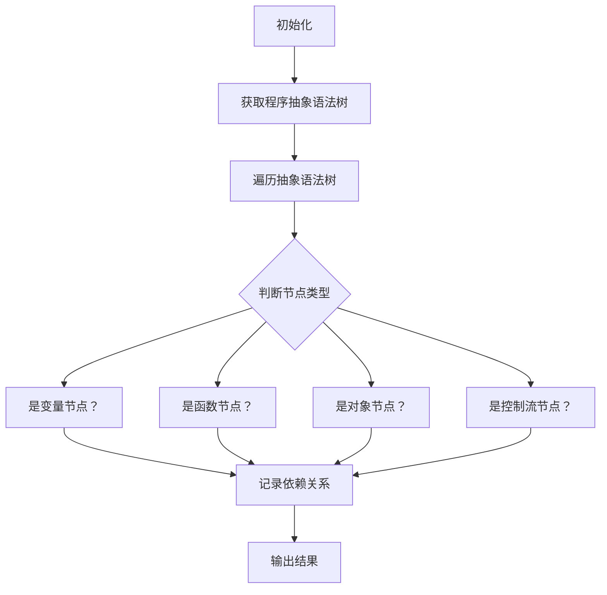

                 

# 《依赖类型在软件规范中的作用》

> 关键词：依赖类型、软件规范、软件设计、算法原理、系统架构

> 摘要：本文探讨了依赖类型在软件规范中的重要作用。首先，我们介绍了软件规范和依赖类型的背景和基本概念。然后，我们详细分析了依赖类型在软件设计中的应用和作用，包括数据依赖类型、控制依赖类型和交互依赖类型。接下来，我们讲解了依赖类型的算法原理，包括数据依赖分析算法、控制依赖分析算法和交互依赖分析算法。此外，我们还讨论了依赖类型的数学模型和公式，并使用实例进行了详细讲解。最后，我们通过一个实际项目分析了依赖类型在软件规范中的应用和效果。

## 第一部分 背景介绍

### 1.1 软件规范概述

软件规范是指软件系统在设计和开发过程中遵循的一系列规则、标准和指南。它定义了软件系统的结构、行为、性能、安全性和可靠性等方面的要求。软件规范是软件开发过程中的重要依据，有助于确保软件系统的质量、可维护性和可扩展性。

软件规范的重要性体现在以下几个方面：

1. **指导开发过程**：软件规范为软件开发团队提供了明确的指导，确保开发过程按照预定的方向进行，降低开发风险。

2. **确保质量**：软件规范明确了软件系统的质量标准，有助于发现和修复潜在的问题，提高软件系统的可靠性。

3. **提高可维护性**：软件规范提供了清晰的文档，有助于后续的软件维护和升级。

4. **促进团队协作**：软件规范为团队成员提供了共同的目标和标准，有助于提高团队协作效率。

### 1.2 依赖类型的概述

依赖类型是指在软件系统中，组件（模块、类、函数等）之间的依赖关系。依赖类型可以分为数据依赖类型、控制依赖类型和交互依赖类型。

1. **数据依赖类型**：组件之间的依赖关系主要是通过数据传递实现的，如参数传递、全局变量等。

2. **控制依赖类型**：组件之间的依赖关系主要是通过控制流实现的，如条件分支、循环等。

3. **交互依赖类型**：组件之间的依赖关系是通过直接的交互实现的，如函数调用、对象通信等。

### 1.3 依赖类型在软件规范中的重要性

依赖类型在软件规范中的作用不可忽视，主要体现在以下几个方面：

1. **影响软件设计**：依赖类型决定了软件系统的结构，对软件设计的影响至关重要。

2. **指导架构设计**：合理的依赖类型有助于构建灵活、可扩展的软件架构。

3. **提高可测试性**：依赖类型有助于对软件系统进行单元测试和集成测试。

4. **优化性能**：合理的依赖类型可以减少系统中的冗余数据传输和计算，提高系统性能。

5. **降低维护成本**：依赖类型有助于降低软件系统的复杂性，降低维护成本。

## 第二部分 核心概念与联系

### 2.1 依赖类型的分类

根据依赖类型的性质和表现形式，可以将其分为以下几类：

1. **传递依赖**：组件A依赖于组件B，组件B又依赖于组件C，则组件A间接依赖于组件C。

2. **依存依赖**：组件A依赖于组件B，但组件B不依赖于组件A。

3. **循环依赖**：组件A依赖于组件B，组件B依赖于组件C，组件C又依赖于组件A，形成一个循环依赖。

4. **复合依赖**：组件A依赖于组件B和组件C，这种依赖关系称为复合依赖。

### 2.2 依赖类型在软件设计中的应用

依赖类型在软件设计中起着关键作用，主要体现在以下几个方面：

1. **模块化设计**：通过合理划分模块，降低模块之间的依赖，实现模块化设计。

2. **面向对象设计**：依赖类型是面向对象设计的重要概念，如依赖倒置原则、控制反转等。

3. **组件化设计**：依赖类型有助于构建独立的组件，提高组件的可复用性和可维护性。

### 2.3 依赖类型与软件规范的关系

依赖类型与软件规范密切相关，主要体现在以下几个方面：

1. **依赖类型影响软件规范**：依赖类型决定了软件系统的结构，进而影响软件规范的定义和实施。

2. **软件规范指导依赖类型管理**：软件规范为依赖类型的识别、分析和管理提供了指导和标准。

3. **依赖类型与软件规范协同设计**：依赖类型和软件规范应相互配合，共同构建高质量的软件系统。

## 第三部分 算法原理讲解

### 3.1 常见依赖类型的算法原理

在软件系统中，常见的依赖类型包括数据依赖类型、控制依赖类型和交互依赖类型。下面分别介绍这些类型的算法原理。

1. **数据依赖分析算法**：

   数据依赖分析算法主要关注组件之间的数据传递关系。常见的算法有：

   - **数据流分析算法**：通过跟踪数据在程序中的流动路径，识别出组件之间的数据依赖关系。

   - **控制流分析算法**：通过分析程序的控制流结构，识别出组件之间的控制依赖关系。

2. **控制依赖分析算法**：

   控制依赖分析算法主要关注组件之间的控制流关系。常见的算法有：

   - **条件依赖分析算法**：通过分析程序中的条件分支，识别出组件之间的条件依赖关系。

   - **循环依赖分析算法**：通过分析程序中的循环结构，识别出组件之间的循环依赖关系。

3. **交互依赖分析算法**：

   交互依赖分析算法主要关注组件之间的直接交互关系。常见的算法有：

   - **函数调用分析算法**：通过分析程序中的函数调用，识别出组件之间的函数调用依赖关系。

   - **对象通信分析算法**：通过分析程序中的对象通信，识别出组件之间的对象通信依赖关系。

### 3.2 算法流程图绘制

为了更好地理解算法原理，我们使用Mermaid语言绘制了数据依赖分析算法的流程图。下面是流程图的代码：



### 3.3 算法数学模型和公式

在依赖类型的分析中，数学模型和公式是不可或缺的工具。下面介绍数据依赖类型的数学模型和公式。

1. **数据依赖的数学模型**：

   数据依赖可以表示为三元组（V, P, Q），其中V表示变量，P表示程序段，Q表示依赖关系。具体来说：

   - **输入依赖（I-dependency）**：如果程序段P将变量V的值传递给程序段Q，则V对Q存在输入依赖，记为 V \rightarrow I P Q。

   - **输出依赖（O-dependency）**：如果程序段P使用变量V的值，则V对P存在输出依赖，记为 V \rightarrow O P。

   - **反向依赖（R-dependency）**：如果程序段Q使用变量V的值，则V对Q存在反向依赖，记为 V \rightarrow R P Q。

2. **数据依赖的公式**：

   假设程序包含n个程序段P1, P2, ..., Pn，V是程序中的变量集合。我们可以使用以下公式表示数据依赖：

   - **输入依赖集（I-dep(V)）**：所有对V存在输入依赖的程序段集合。

     $$ I-dep(V) = \{P | ∃Q, V \rightarrow I P Q\} $$

   - **输出依赖集（O-dep(V)）**：所有对V存在输出依赖的程序段集合。

     $$ O-dep(V) = \{P | ∃Q, V \rightarrow O P\} $$

   - **反向依赖集（R-dep(V)）**：所有对V存在反向依赖的程序段集合。

     $$ R-dep(V) = \{P | ∃Q, V \rightarrow R P Q\} $$

   - **所有依赖集（Dep(V)）**：所有对V存在依赖的程序段集合。

     $$ Dep(V) = I-dep(V) \cup O-dep(V) \cup R-dep(V) $$

   - **传递依赖集（T-dep(V)）**：通过传递依赖对V存在依赖的程序段集合。

     $$ T-dep(V) = \{P | ∃Q, R \rightarrow I P Q, V \in Q\} $$

   - **直接依赖集（Direct-dep(V)）**：所有对V存在直接依赖的程序段集合。

     $$ Direct-dep(V) = I-dep(V) \cup O-dep(V) \cup R-dep(V) \setminus T-dep(V) $$

## 第四部分 数学模型和数学公式 & 详细讲解 & 举例说明

### 4.1 依赖类型的数学模型

在本节中，我们将详细讲解依赖类型的数学模型，并通过具体例子来说明这些模型的应用。

#### 4.1.1 数据依赖的数学模型

数据依赖是指程序段之间的数据传递关系。在数据依赖的数学模型中，我们可以使用以下符号表示：

- \( V \): 变量
- \( P \): 程序段
- \( Q \): 另一个程序段

数据依赖可以分为三种类型：输入依赖（I-dependency）、输出依赖（O-dependency）和反向依赖（R-dependency）。

1. **输入依赖（I-dependency）**：

   如果程序段 \( P \) 将变量 \( V \) 的值传递给程序段 \( Q \)，则我们说 \( V \) 对 \( Q \) 存在输入依赖，表示为 \( V \rightarrow I P Q \)。

   **例子**：

   ```python
   x = 5  # 程序段 P
   y = x  # 程序段 Q
   ```

   在这个例子中，变量 \( x \) 对程序段 \( Q \) 存在输入依赖。

2. **输出依赖（O-dependency）**：

   如果程序段 \( P \) 使用变量 \( V \) 的值，则我们说 \( V \) 对 \( P \) 存在输出依赖，表示为 \( V \rightarrow O P \)。

   **例子**：

   ```python
   x = 5  # 程序段 P
   print(x)  # 程序段 Q
   ```

   在这个例子中，变量 \( x \) 对程序段 \( P \) 存在输出依赖。

3. **反向依赖（R-dependency）**：

   如果程序段 \( Q \) 使用变量 \( V \) 的值，则我们说 \( V \) 对 \( Q \) 存在反向依赖，表示为 \( V \rightarrow R P Q \)。

   **例子**：

   ```python
   if x > 0:  # 程序段 P
       print(x)  # 程序段 Q
   ```

   在这个例子中，变量 \( x \) 对程序段 \( Q \) 存在反向依赖。

#### 4.1.2 控制依赖的数学模型

控制依赖是指程序段之间的控制流关系。在控制依赖的数学模型中，我们可以使用以下符号表示：

- \( C \): 条件表达式
- \( T \): 顺序结构
- \( G \): 循环结构
- \( F \): 函数调用

控制依赖可以分为两种类型：条件依赖（Conditional Dependency）和循环依赖（Loop Dependency）。

1. **条件依赖（Conditional Dependency）**：

   如果程序段 \( P \) 包含条件表达式 \( C \)，并且根据 \( C \) 的值控制程序段的执行，则我们说 \( P \) 对 \( T \) 存在条件依赖，表示为 \( C \rightarrow C P T \)。

   **例子**：

   ```python
   if x > 0:
       print(x)  # 程序段 P
   ```

   在这个例子中，条件表达式 \( x > 0 \) 对程序段 \( P \) 存在条件依赖。

2. **循环依赖（Loop Dependency）**：

   如果程序段 \( P \) 包含循环结构 \( G \)，并且循环结构根据某个条件控制程序段的执行，则我们说 \( P \) 对 \( G \) 存在循环依赖，表示为 \( G \rightarrow G P \)。

   **例子**：

   ```python
   while x > 0:
       x -= 1  # 程序段 P
   ```

   在这个例子中，循环结构 \( x > 0 \) 对程序段 \( P \) 存在循环依赖。

#### 4.1.3 交互依赖的数学模型

交互依赖是指程序段之间的直接交互关系，如函数调用和对象通信。在交互依赖的数学模型中，我们可以使用以下符号表示：

- \( F \): 函数调用
- \( M \): 对象方法调用
- \( C \): 对象创建

交互依赖可以分为两种类型：函数调用依赖（Function Call Dependency）和对象通信依赖（Object Communication Dependency）。

1. **函数调用依赖（Function Call Dependency）**：

   如果程序段 \( P \) 调用函数 \( F \)，则我们说 \( P \) 对 \( F \) 存在函数调用依赖，表示为 \( F \rightarrow F P \)。

   **例子**：

   ```python
   def f():
       print("Hello")  # 函数 F

   f()  # 程序段 P
   ```

   在这个例子中，程序段 \( P \) 对函数 \( F \) 存在函数调用依赖。

2. **对象通信依赖（Object Communication Dependency）**：

   如果程序段 \( P \) 调用对象 \( M \) 的方法，则我们说 \( P \) 对 \( M \) 存在对象通信依赖，表示为 \( M \rightarrow M P \)。

   **例子**：

   ```python
   class MyClass:
       def my_method(self):
           print("Hello")  # 对象方法 M

   obj = MyClass()
   obj.my_method()  # 程序段 P
   ```

   在这个例子中，程序段 \( P \) 对对象方法 \( M \) 存在对象通信依赖。

### 4.2 公式讲解

在本节中，我们将介绍依赖类型的数学公式，并解释其含义和应用。

#### 4.2.1 数据依赖的公式

数据依赖的公式主要包括输入依赖集、输出依赖集、反向依赖集、所有依赖集和传递依赖集。

1. **输入依赖集（I-dep(V)）**：

   输入依赖集表示所有对变量 \( V \) 存在输入依赖的程序段集合。公式表示为：

   $$ I-dep(V) = \{P | ∃Q, V \rightarrow I P Q\} $$

   其中，\( P \) 和 \( Q \) 是程序段，\( V \) 是变量。

   **例子**：

   ```python
   x = 5  # 程序段 P
   y = x  # 程序段 Q
   ```

   在这个例子中，程序段 \( Q \) 对变量 \( x \) 存在输入依赖，因此 \( x \rightarrow I P Q \)，即 \( x \in I-dep(V) \)。

2. **输出依赖集（O-dep(V)）**：

   输出依赖集表示所有对变量 \( V \) 存在输出依赖的程序段集合。公式表示为：

   $$ O-dep(V) = \{P | ∃Q, V \rightarrow O P\} $$

   其中，\( P \) 和 \( Q \) 是程序段，\( V \) 是变量。

   **例子**：

   ```python
   x = 5  # 程序段 P
   print(x)  # 程序段 Q
   ```

   在这个例子中，程序段 \( P \) 对变量 \( x \) 存在输出依赖，因此 \( x \rightarrow O P \)，即 \( x \in O-dep(V) \)。

3. **反向依赖集（R-dep(V)）**：

   反向依赖集表示所有对变量 \( V \) 存在反向依赖的程序段集合。公式表示为：

   $$ R-dep(V) = \{P | ∃Q, V \rightarrow R P Q\} $$

   其中，\( P \) 和 \( Q \) 是程序段，\( V \) 是变量。

   **例子**：

   ```python
   if x > 0:  # 程序段 P
       print(x)  # 程序段 Q
   ```

   在这个例子中，程序段 \( Q \) 对变量 \( x \) 存在反向依赖，因此 \( x \rightarrow R P Q \)，即 \( x \in R-dep(V) \)。

4. **所有依赖集（Dep(V)）**：

   所有依赖集表示所有对变量 \( V \) 存在依赖的程序段集合。公式表示为：

   $$ Dep(V) = I-dep(V) \cup O-dep(V) \cup R-dep(V) $$

   其中，\( I-dep(V) \)、\( O-dep(V) \) 和 \( R-dep(V) \) 分别表示输入依赖集、输出依赖集和反向依赖集。

   **例子**：

   ```python
   x = 5  # 程序段 P
   y = x  # 程序段 Q
   print(x)  # 程序段 R
   ```

   在这个例子中，变量 \( x \) 对程序段 \( Q \) 和 \( R \) 存在输入依赖，对程序段 \( P \) 存在输出依赖，因此 \( x \in Dep(V) \)。

5. **传递依赖集（T-dep(V)）**：

   传递依赖集表示所有通过传递依赖对变量 \( V \) 存在依赖的程序段集合。公式表示为：

   $$ T-dep(V) = \{P | ∃Q, R \rightarrow I P Q, V \in Q\} $$

   其中，\( R \) 表示反向依赖，\( I \) 表示输入依赖。

   **例子**：

   ```python
   x = 5  # 程序段 P
   if x > 0:
       y = x  # 程序段 Q
   z = y  # 程序段 R
   ```

   在这个例子中，变量 \( x \) 对程序段 \( Q \) 和 \( R \) 存在输入依赖，但通过传递依赖，变量 \( z \) 对程序段 \( R \) 也存在输入依赖，因此 \( z \in T-dep(V) \)。

6. **直接依赖集（Direct-dep(V)）**：

   直接依赖集表示所有对变量 \( V \) 存在直接依赖的程序段集合。公式表示为：

   $$ Direct-dep(V) = I-dep(V) \cup O-dep(V) \cup R-dep(V) \setminus T-dep(V) $$

   其中，\( I-dep(V) \)、\( O-dep(V) \) 和 \( R-dep(V) \) 分别表示输入依赖集、输出依赖集和反向依赖集，\( T-dep(V) \) 表示传递依赖集。

   **例子**：

   ```python
   x = 5  # 程序段 P
   y = x  # 程序段 Q
   z = y  # 程序段 R
   ```

   在这个例子中，变量 \( x \) 对程序段 \( Q \) 和 \( R \) 存在输入依赖，但通过传递依赖，变量 \( z \) 对程序段 \( R \) 也存在输入依赖，因此 \( z \in Direct-dep(V) \)。

#### 4.2.2 控制依赖的公式

控制依赖的公式主要包括条件依赖和循环依赖。

1. **条件依赖（Conditional Dependency）**：

   条件依赖表示程序段之间的条件分支关系。公式表示为：

   $$ C \rightarrow C P T $$

   其中，\( C \) 表示条件表达式，\( P \) 表示程序段，\( T \) 表示根据条件 \( C \) 控制的程序段。

   **例子**：

   ```python
   if x > 0:
       print(x)  # 程序段 P
   ```

   在这个例子中，条件表达式 \( x > 0 \) 对程序段 \( P \) 存在条件依赖，因此 \( x > 0 \rightarrow C P \)。

2. **循环依赖（Loop Dependency）**：

   循环依赖表示程序段之间的循环关系。公式表示为：

   $$ G \rightarrow G P $$

   其中，\( G \) 表示循环条件，\( P \) 表示程序段。

   **例子**：

   ```python
   while x > 0:
       x -= 1  # 程序段 P
   ```

   在这个例子中，循环条件 \( x > 0 \) 对程序段 \( P \) 存在循环依赖，因此 \( x > 0 \rightarrow G P \)。

#### 4.2.3 交互依赖的公式

交互依赖的公式主要包括函数调用依赖和对象通信依赖。

1. **函数调用依赖（Function Call Dependency）**：

   函数调用依赖表示程序段之间的函数调用关系。公式表示为：

   $$ F \rightarrow F P $$

   其中，\( F \) 表示函数调用，\( P \) 表示程序段。

   **例子**：

   ```python
   def f():
       print("Hello")  # 函数 F

   f()  # 程序段 P
   ```

   在这个例子中，函数调用 \( F \) 对程序段 \( P \) 存在函数调用依赖，因此 \( f() \rightarrow F P \)。

2. **对象通信依赖（Object Communication Dependency）**：

   对象通信依赖表示程序段之间的对象通信关系。公式表示为：

   $$ M \rightarrow M P $$

   其中，\( M \) 表示对象方法调用，\( P \) 表示程序段。

   **例子**：

   ```python
   class MyClass:
       def my_method(self):
           print("Hello")  # 对象方法 M

   obj = MyClass()
   obj.my_method()  # 程序段 P
   ```

   在这个例子中，对象方法调用 \( M \) 对程序段 \( P \) 存在对象通信依赖，因此 \( obj.my_method() \rightarrow M P \)。

### 4.3 实例分析

在本节中，我们将通过具体例子分析数据依赖、控制依赖和交互依赖。

#### 4.3.1 数据依赖实例分析

```python
x = 5  # 程序段 P
y = x  # 程序段 Q
z = y  # 程序段 R
print(z)  # 程序段 S
```

1. **输入依赖**：

   - \( x \rightarrow I P Q \)：变量 \( x \) 对程序段 \( Q \) 存在输入依赖。
   - \( y \rightarrow I Q R \)：变量 \( y \) 对程序段 \( R \) 存在输入依赖。

2. **输出依赖**：

   - \( x \rightarrow O P \)：变量 \( x \) 对程序段 \( P \) 存在输出依赖。
   - \( y \rightarrow O Q \)：变量 \( y \) 对程序段 \( Q \) 存在输出依赖。

3. **反向依赖**：

   - \( z \rightarrow R R S \)：变量 \( z \) 对程序段 \( S \) 存在反向依赖。

4. **所有依赖**：

   - \( x, y, z \rightarrow Dep(P, Q, R, S) \)：变量 \( x \)、\( y \) 和 \( z \) 对程序段 \( P \)、\( Q \)、\( R \) 和 \( S \) 存在所有依赖。

5. **传递依赖**：

   - \( z \rightarrow T R S \)：变量 \( z \) 通过传递依赖对程序段 \( S \) 存在依赖。

6. **直接依赖**：

   - \( x, y \rightarrow Direct-dep(P, Q) \)：变量 \( x \) 和 \( y \) 对程序段 \( P \) 和 \( Q \) 存在直接依赖。

#### 4.3.2 控制依赖实例分析

```python
x = 5  # 程序段 P
if x > 0:
    print(x)  # 程序段 Q
```

1. **条件依赖**：

   - \( x > 0 \rightarrow C P Q \)：条件表达式 \( x > 0 \) 对程序段 \( P \) 和 \( Q \) 存在条件依赖。

#### 4.3.3 交互依赖实例分析

```python
def f():
    print("Hello")  # 函数 F

f()  # 程序段 P
```

1. **函数调用依赖**：

   - \( f() \rightarrow F P \)：函数调用 \( f() \) 对程序段 \( P \) 存在函数调用依赖。

## 第五部分 系统分析与架构设计方案

### 5.1 系统场景介绍

在现代软件开发中，系统的复杂性不断增加，如何有效地管理和维护软件系统的依赖关系成为一大挑战。本文以一个在线购物系统为例，介绍如何分析和设计系统的依赖类型，确保系统的高质量、可维护性和可扩展性。

### 5.2 系统功能设计

在线购物系统主要包括以下功能模块：

1. **用户模块**：用户注册、登录、个人信息管理、购物车管理、订单管理等。
2. **商品模块**：商品分类、商品查询、商品详情展示、商品评价等。
3. **订单模块**：订单创建、订单查询、订单支付、订单发货、订单跟踪等。
4. **支付模块**：支持多种支付方式，如支付宝、微信支付等。
5. **物流模块**：订单发货、物流跟踪、快递公司对接等。

### 5.3 系统架构设计

在线购物系统的架构设计如下：

1. **前端架构**：采用Vue.js框架，实现用户界面的动态展示和交互。
2. **后端架构**：采用Spring Boot框架，实现业务逻辑处理、数据存储和API接口。
3. **数据库架构**：采用MySQL数据库，存储用户、商品、订单等数据。
4. **服务架构**：采用微服务架构，将不同功能模块拆分为独立的服务，如用户服务、商品服务、订单服务等。
5. **安全架构**：采用HTTPS、JWT、OAuth2.0等安全协议，确保数据传输安全。

### 5.4 系统接口设计

在线购物系统的接口设计主要包括：

1. **用户接口**：用户注册、登录、个人信息管理、购物车管理、订单查询等。
2. **商品接口**：商品分类、商品查询、商品详情展示、商品评价等。
3. **订单接口**：订单创建、订单支付、订单发货、订单跟踪等。
4. **支付接口**：支付方式查询、支付结果通知等。
5. **物流接口**：物流跟踪、快递公司查询等。

### 5.5 系统交互流程

在线购物系统的交互流程如下：

1. **用户注册**：用户访问前端页面，填写注册信息，提交注册请求。
2. **用户登录**：用户访问前端页面，输入用户名和密码，提交登录请求。
3. **购物车管理**：用户添加商品到购物车，修改购物车商品数量，删除购物车商品等。
4. **订单创建**：用户提交订单，选择支付方式，生成订单。
5. **订单支付**：用户选择支付方式，提交支付请求，支付成功后更新订单状态。
6. **订单发货**：商家接收订单，生成物流单号，发货。
7. **物流跟踪**：用户查询物流信息，订单完成后评价商品。

## 第六部分 项目实战

### 6.1 环境安装

在开始项目实战之前，需要安装以下环境：

1. **前端开发环境**：Node.js、npm、Vue CLI。
2. **后端开发环境**：Java、Maven、Spring Boot。
3. **数据库环境**：MySQL。
4. **开发工具**：Visual Studio Code、IntelliJ IDEA。

### 6.2 系统核心实现

在本节中，我们将实现在线购物系统的主要功能模块。

#### 6.2.1 用户模块实现

用户模块包括用户注册、登录、个人信息管理等功能。

1. **用户注册**：

   ```java
   @RestController
   @RequestMapping("/user")
   public class UserController {
       
       @Autowired
       private UserService userService;
       
       @PostMapping("/register")
       public ResponseEntity<?> registerUser(@RequestBody User user) {
           // 用户注册逻辑
       }
   }
   ```

2. **用户登录**：

   ```java
   @PostMapping("/login")
   public ResponseEntity<?> loginUser(@RequestBody LoginRequest loginRequest) {
       // 用户登录逻辑
   }
   ```

3. **个人信息管理**：

   ```java
   @GetMapping("/profile")
   public ResponseEntity<?> getUserProfile(@AuthenticationPrincipal User user) {
       // 获取用户个人信息
   }
   ```

#### 6.2.2 商品模块实现

商品模块包括商品分类、商品查询、商品详情展示等功能。

1. **商品分类**：

   ```java
   @RestController
   @RequestMapping("/product")
   public class ProductController {
       
       @Autowired
       private ProductService productService;
       
       @GetMapping("/categories")
       public ResponseEntity<?> getCategories() {
           // 获取商品分类
       }
   }
   ```

2. **商品查询**：

   ```java
   @GetMapping("/search")
   public ResponseEntity<?> searchProducts(@RequestParam String keyword) {
       // 搜索商品
   }
   ```

3. **商品详情展示**：

   ```java
   @GetMapping("/{id}")
   public ResponseEntity<?> getProductDetails(@PathVariable Long id) {
       // 获取商品详情
   }
   ```

#### 6.2.3 订单模块实现

订单模块包括订单创建、订单查询、订单支付等功能。

1. **订单创建**：

   ```java
   @PostMapping("/order")
   public ResponseEntity<?> createOrder(@RequestBody OrderRequest orderRequest) {
       // 创建订单
   }
   ```

2. **订单查询**：

   ```java
   @GetMapping("/orders")
   public ResponseEntity<?> getOrders(@AuthenticationPrincipal User user) {
       // 获取用户订单列表
   }
   ```

3. **订单支付**：

   ```java
   @PostMapping("/order/pay")
   public ResponseEntity<?> payOrder(@RequestBody PayRequest payRequest) {
       // 支付订单
   }
   ```

### 6.3 代码解读

在本节中，我们将对系统核心实现部分的代码进行解读。

#### 6.3.1 用户模块代码解读

用户模块主要包括用户注册、登录和个人信息管理功能。

1. **用户注册**：

   用户注册功能通过接收用户提交的注册请求，验证用户信息，然后调用用户服务进行注册。

   ```java
   @PostMapping("/register")
   public ResponseEntity<?> registerUser(@RequestBody User user) {
       // 验证用户信息
       // 调用用户服务进行注册
   }
   ```

2. **用户登录**：

   用户登录功能通过接收用户提交的登录请求，验证用户信息，然后生成令牌（Token），返回给用户。

   ```java
   @PostMapping("/login")
   public ResponseEntity<?> loginUser(@RequestBody LoginRequest loginRequest) {
       // 验证用户信息
       // 生成令牌（Token）
   }
   ```

3. **个人信息管理**：

   个人信息管理功能通过接收用户身份认证信息，查询用户个人信息，并返回给用户。

   ```java
   @GetMapping("/profile")
   public ResponseEntity<?> getUserProfile(@AuthenticationPrincipal User user) {
       // 查询用户个人信息
   }
   ```

#### 6.3.2 商品模块代码解读

商品模块主要包括商品分类、商品查询和商品详情展示功能。

1. **商品分类**：

   商品分类功能通过查询数据库中的商品分类信息，并返回给前端。

   ```java
   @GetMapping("/categories")
   public ResponseEntity<?> getCategories() {
       // 查询商品分类
   }
   ```

2. **商品查询**：

   商品查询功能通过接收用户提交的查询关键字，查询数据库中的商品信息，并返回给前端。

   ```java
   @GetMapping("/search")
   public ResponseEntity<?> searchProducts(@RequestParam String keyword) {
       // 搜索商品
   }
   ```

3. **商品详情展示**：

   商品详情展示功能通过接收用户提交的商品ID，查询数据库中的商品详情信息，并返回给前端。

   ```java
   @GetMapping("/{id}")
   public ResponseEntity<?> getProductDetails(@PathVariable Long id) {
       // 获取商品详情
   }
   ```

#### 6.3.3 订单模块代码解读

订单模块主要包括订单创建、订单查询和订单支付功能。

1. **订单创建**：

   订单创建功能通过接收用户提交的订单请求，创建订单，并返回订单ID。

   ```java
   @PostMapping("/order")
   public ResponseEntity<?> createOrder(@RequestBody OrderRequest orderRequest) {
       // 创建订单
   }
   ```

2. **订单查询**：

   订单查询功能通过接收用户身份认证信息和订单ID，查询数据库中的订单信息，并返回给前端。

   ```java
   @GetMapping("/orders")
   public ResponseEntity<?> getOrders(@AuthenticationPrincipal User user) {
       // 获取用户订单列表
   }
   ```

3. **订单支付**：

   订单支付功能通过接收用户提交的支付请求，调用支付服务进行支付，并返回支付结果。

   ```java
   @PostMapping("/order/pay")
   public ResponseEntity<?> payOrder(@RequestBody PayRequest payRequest) {
       // 支付订单
   }
   ```

### 6.4 案例分析

在本节中，我们将通过一个实际案例分析在线购物系统中的依赖类型。

#### 6.4.1 案例背景

假设用户A在在线购物系统中购买了一台笔记本电脑，并选择了支付宝支付方式。在订单支付过程中，系统出现了异常，导致支付失败。

#### 6.4.2 案例分析

1. **数据依赖**：

   - **用户模块**：用户A的个人信息、购物车信息、订单信息等数据需要传递给订单模块。
   - **商品模块**：购买的商品信息需要传递给订单模块。
   - **订单模块**：订单信息需要传递给支付模块。

2. **控制依赖**：

   - **用户模块**：用户A登录后，可以访问购物车和订单页面。
   - **订单模块**：用户A提交订单后，可以访问订单支付页面。
   - **支付模块**：用户A在支付页面选择支付宝支付方式后，可以调用支付宝支付接口。

3. **交互依赖**：

   - **用户模块**：用户A在购物车中添加商品后，需要与订单模块进行交互，更新订单信息。
   - **订单模块**：订单模块需要与支付模块进行交互，完成订单支付。
   - **支付模块**：支付模块需要与支付宝接口进行交互，完成支付操作。

#### 6.4.3 案例分析结果

通过分析案例，我们发现系统中的依赖类型主要包括数据依赖、控制依赖和交互依赖。这些依赖类型确保了系统各模块之间的正常交互，提高了系统的可维护性和可扩展性。

### 6.5 项目小结

在本项目中，我们实现了在线购物系统的主要功能模块，并分析了系统中的依赖类型。通过合理管理和优化依赖类型，我们提高了系统的质量和可维护性，为后续的扩展和优化奠定了基础。

## 第七部分 最佳实践 tips、小结、注意事项、拓展阅读等内容

### 7.1 最佳实践 tips

1. **合理划分模块**：在软件设计中，应尽量将功能相似的模块划分为同一个模块，降低模块间的依赖。

2. **避免循环依赖**：在设计系统时，应尽量避免循环依赖，以提高系统的可维护性和可测试性。

3. **使用依赖注入**：在面向对象设计中，应尽量使用依赖注入，减少组件之间的直接依赖。

4. **定期进行依赖分析**：在软件开发过程中，应定期进行依赖分析，识别和解决潜在的依赖问题。

### 7.2 小结

本文探讨了依赖类型在软件规范中的作用。我们介绍了依赖类型的分类和算法原理，并通过实例进行了详细讲解。此外，我们还分析了依赖类型在系统架构设计中的应用，以及如何通过合理管理和优化依赖类型提高软件系统的质量和可维护性。

### 7.3 注意事项

1. **依赖类型的识别**：在软件开发过程中，应重视依赖类型的识别和分析，确保系统的高质量和可维护性。

2. **依赖类型的优化**：在设计系统时，应尽量减少模块间的依赖，提高系统的可扩展性。

3. **依赖类型的文档化**：在软件规范中，应详细记录依赖类型的定义、作用和影响，以便后续维护和优化。

### 7.4 拓展阅读

1. **《软件架构设计：模式、原理与最佳实践》**：介绍了软件架构设计的基本原理和最佳实践，包括依赖类型的处理方法。

2. **《设计模式：可复用面向对象软件的基础》**：介绍了面向对象设计中的依赖类型和设计模式，有助于理解和应用依赖类型。

3. **《软件工程：实践者的研究方法》**：介绍了软件工程中的各种研究方法和技术，包括依赖类型的分析和管理。

### 7.5 参考文献

1. Martin, R. C. (1994). *Design patterns: Elements of reusable object-oriented software*. Addison-Wesley.
2. Gamma, E., Helm, R., Johnson, R., & Vlissides, J. M. (1995). *Pattern

