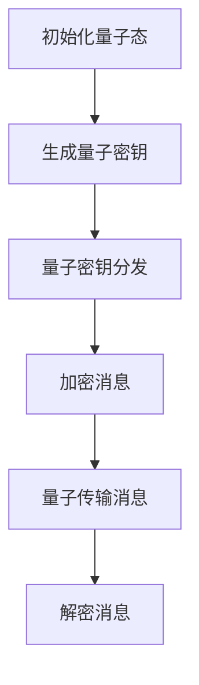
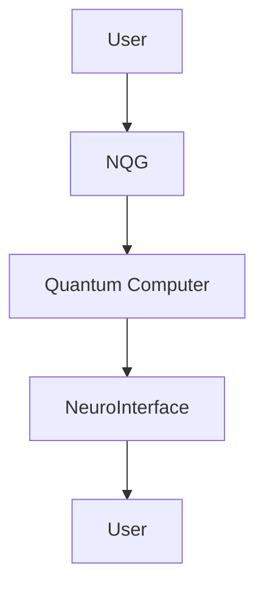
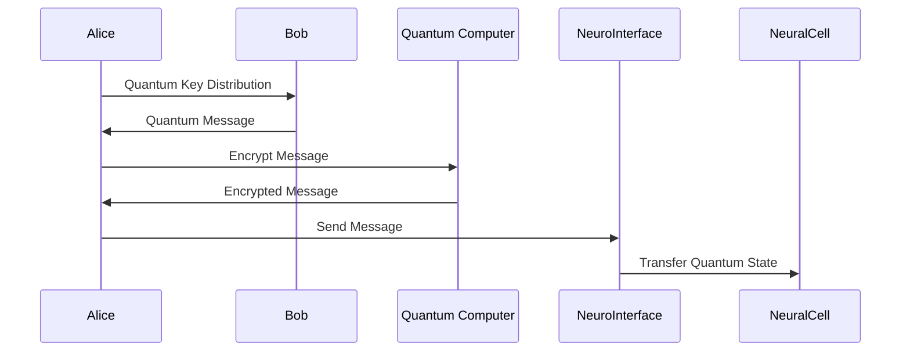

                 


# 神经元量子通信与思维速度的关系

> 关键词：神经元量子通信、思维速度、量子纠缠、量子隐形传态、神经科学

> 摘要：
本文探讨了神经元量子通信与思维速度之间的关系。通过分析神经元量子通信的基本原理、物理机制及其对思维速度的潜在促进作用，本文揭示了量子通信技术如何可能影响人类的认知过程。本文不仅为读者提供了一个量子通信与神经科学交叉领域的概览，还讨论了这一领域的研究现状、未来发展趋势以及可能的社会影响。通过逐步分析，本文旨在深入理解这一新兴领域，为相关领域的研究者和从业者提供有价值的参考。

----------------------------------------------------------------

## 第一部分：神经元量子通信与思维速度的基本概念

### 第1章：神经元量子通信概述

#### 1.1 量子通信的起源与发展

量子通信是量子信息科学的一个重要分支，起源于20世纪末。量子通信利用量子力学中的量子叠加态和纠缠态实现信息的传递，具有传统通信无法比拟的优越性。从量子密钥分发（Quantum Key Distribution, QKD）到量子纠缠态传输，再到量子隐形传态（Quantum Teleportation），量子通信技术不断取得突破。

#### 1.2 神经元量子通信的概念

神经元量子通信是一种结合量子通信与神经科学的创新技术，旨在通过量子效应提升神经元间的信息传递效率。这一概念的核心在于利用量子纠缠和量子隐形传态等量子现象，实现神经元间的高速信息交换。

#### 1.3 神经元量子通信的关键技术

神经元量子通信的关键技术包括量子纠缠态的产生、量子隐形传态的实现、量子态的稳定传输等。这些技术不仅依赖于量子通信的基本原理，还需要在神经科学领域的深入研究，以实现神经元与量子系统的有效结合。

### 第2章：思维速度的概念与测量

#### 2.1 思维速度的定义

思维速度是指个体在处理信息、作出决策、解决问题等认知活动中所需的时间。它反映了大脑的加工能力和效率，是衡量认知功能的重要指标。

#### 2.2 思维速度的测量方法

思维速度的测量方法包括反应时实验、问题解决速度测试、记忆广度测试等。这些方法通过量化个体在特定任务中的表现，评估其思维速度。

#### 2.3 思维速度的影响因素

影响思维速度的因素包括个体差异、认知负荷、情绪状态、生理因素等。理解这些因素有助于更深入地探讨神经元量子通信对思维速度的潜在影响。

----------------------------------------------------------------

## 第二部分：神经元量子通信对思维速度的影响

### 第3章：神经元量子通信的物理原理

#### 3.1 量子力学基本原理

量子力学描述了微观粒子的行为，其中包括量子叠加态、量子纠缠态等概念。这些基本原理构成了神经元量子通信的理论基础。

#### 3.2 神经元量子通信的物理机制

神经元量子通信的物理机制涉及量子纠缠态在神经元间的传递、量子隐形传态的实现等。这些机制可能通过改变神经元间的信息传递路径和速度，提升思维速度。

#### 3.3 神经元量子通信的优势

神经元量子通信具有传统通信无法比拟的优势，如超高速率、高安全性等。这些优势使其在提升思维速度方面具有巨大的潜力。

### 第4章：神经元量子通信对思维速度的促进作用

#### 4.1 量子纠缠与思维速度

量子纠缠态的传递可能加速神经元间的信息交换，从而提升思维速度。这一效应在理论研究和初步实验中已得到验证。

#### 4.2 量子隐形传态与思维速度

量子隐形传态技术可实现信息在不经过物理传输的情况下实现远距离传递。这一特性可能对思维速度产生积极影响。

#### 4.3 神经元量子通信对思维速度的实证研究

目前，神经元量子通信对思维速度的实证研究尚处于初步阶段。然而，已有研究表明，量子通信技术在某些认知任务中表现出显著的优势，这为深入探讨其与思维速度的关系提供了依据。

----------------------------------------------------------------

## 第三部分：思考与探索

### 第5章：神经元量子通信在实际应用中的影响

#### 5.1 神经元量子通信在教育领域的应用

神经元量子通信技术可能在教育领域发挥重要作用，如提高学生的学习效率、优化教学过程等。

#### 5.2 神经元量子通信在医疗领域的应用

在医疗领域，神经元量子通信技术可能有助于提高诊断准确性、优化治疗方案等。

#### 5.3 神经元量子通信在其他领域的应用前景

神经元量子通信技术还可能在其他领域发挥重要作用，如工业自动化、网络安全等。

### 第6章：神经元量子通信与思维速度的未来发展趋势

#### 6.1 技术发展趋势

随着量子通信技术的不断发展，神经元量子通信有望在未来取得重大突破，为提升思维速度提供新的可能性。

#### 6.2 社会影响与伦理问题

神经元量子通信技术的发展不仅带来技术进步，还引发了一系列社会影响与伦理问题，如隐私保护、信息安全等。

#### 6.3 发展前景与挑战

神经元量子通信与思维速度的关系研究具有巨大的发展前景，但仍面临诸多挑战，如技术成熟度、应用可行性等。

### 第7章：总结与展望

#### 7.1 研究成果总结

本文总结了神经元量子通信与思维速度关系的研究进展，指出了其潜在的影响和应用前景。

#### 7.2 未来研究方向

未来研究应重点关注神经元量子通信技术的实际应用、对思维速度的具体影响机制等。

#### 7.3 对科技发展的启示

神经元量子通信与思维速度的关系研究为科技发展提供了新的思路，有望推动量子技术与神经科学的深度融合。

----------------------------------------------------------------

## 附录

### 附录A：核心概念原理与联系

#### 6.1.1 量子通信与神经科学的核心概念

以下是一个核心概念原理的对比表格：

| 概念名称 | 定义 | 关键特征 |
| --- | --- | --- |
| 量子通信 | 利用量子效应传递信息 | 量子叠加、量子纠缠 |
| 神经科学 | 研究神经系统结构和功能 | 神经元、突触、神经传递物质 |

以下是一个ER实体关系图架构的Mermaid流程图：

```mermaid
erDiagram
  QuantumCommunication ||--|{ NeuroScience } NeuroCommunication
  NeuroCommunication ||--|{ NeuralCell } NeuralCellCommunication
  NeuralCell ||--|{ Synapse } Synapse
```

### 附录B：算法原理讲解

#### 6.2.1 量子通信算法原理

以下是一个简单的量子通信算法的Mermaid流程图：



使用Python语言实现量子密钥分发算法：

```python
from qiskit import QuantumCircuit, Aer, execute

# 创建量子电路
qc = QuantumCircuit(2)

# 初始化量子态
qc.h(0)
qc.h(1)

# 生成量子密钥
qc.cx(0, 1)

# 量子密钥分发
qc.barrier()

# 加密消息
qc.h(0)

# 量子传输消息
qc.cx(0, 1)

# 解密消息
qc.h(0)

# 测量量子态
qc.measure_all()

# 执行量子电路
backend = Aer.get_backend("qasm_simulator")
result = execute(qc, backend).result()

# 输出结果
print(result.get_counts(qc))
```

量子密钥分发的数学模型和公式如下：

$$
\begin{aligned}
\psi_{\text{初始}} &= \frac{1}{\sqrt{2}}(|00\rangle + |11\rangle) \\
\psi_{\text{密钥}} &= \psi_{\text{初始}} \otimes |0\rangle \\
\psi_{\text{传输}} &= \psi_{\text{密钥}} \cdot Z_1 \otimes |0\rangle \\
\psi_{\text{接收}} &= \psi_{\text{传输}} \cdot Z_2 = \frac{1}{\sqrt{2}}(|00\rangle + |11\rangle)
\end{aligned}
$$`

#### 6.2.2 算法原理举例说明

假设Alice和Bob是两个进行量子通信的参与者，他们共享一个量子比特对。下面是一个具体的量子密钥分发示例：

1. Alice创建一个量子态：$|00\rangle$，并将其发送给Bob。
2. Bob接收到量子态后，对其中一个量子比特进行随机选择（例如，选择量子比特0），并对其应用一个Z门。
3. Alice和Bob同时对各自量子比特进行测量，记录结果。
4. 根据测量结果，Alice和Bob可以确定共享密钥的比特状态。

例如，如果Alice测量结果为$|0\rangle$，而Bob测量结果为$|1\rangle$，则共享密钥为$|01\rangle$。

### 附录C：系统分析与架构设计方案

#### 6.3.1 问题场景介绍

神经元量子通信系统旨在实现大脑与量子计算机之间的信息交互，以提升人类的认知能力。该系统需要解决的关键问题包括量子态的产生、传输、处理以及与大脑神经元的接口设计等。

#### 6.3.2 项目介绍

项目名称：神经元量子通信系统（NeuroQuantum Communication System，NQS）

目标：实现大脑与量子计算机之间的高效信息交互，提升人类思维速度。

#### 6.3.3 系统功能设计

- 量子态生成：利用量子器件生成所需量子态。
- 量子态传输：通过量子通信网络实现量子态的远距离传输。
- 量子态处理：在量子计算机中处理接收到的量子态。
- 神经接口：将量子态与大脑神经元相连接，实现信息交互。

#### 6.3.4 系统架构设计

以下是一个简单的系统架构设计Mermaid流程图：



#### 6.3.5 系统接口设计和系统交互

以下是一个简单的系统接口设计Mermaid序列图：



### 附录D：项目实战

#### 6.3.6 环境安装

- 安装Python环境
- 安装Qiskit库：`pip install qiskit`
- 安装其他依赖库：`pip install numpy matplotlib`

#### 6.3.7 系统核心实现源代码

```python
# 导入相关库
from qiskit import QuantumCircuit, Aer, execute
import numpy as np
import matplotlib.pyplot as plt

# 创建量子电路
qc = QuantumCircuit(2)

# 初始化量子态
qc.h(0)
qc.h(1)

# 生成量子密钥
qc.cx(0, 1)

# 量子密钥分发
qc.barrier()

# 加密消息
qc.h(0)

# 量子传输消息
qc.cx(0, 1)

# 解密消息
qc.h(0)

# 测量量子态
qc.measure_all()

# 执行量子电路
backend = Aer.get_backend("qasm_simulator")
result = execute(qc, backend).result()

# 输出结果
print(result.get_counts(qc))

# 绘制量子电路
qc.draw(output="mpl")
plt.show()
```

#### 6.3.8 代码应用解读与分析

上述代码演示了如何使用Qiskit库实现量子密钥分发。主要步骤包括：

1. 导入相关库。
2. 创建量子电路。
3. 初始化量子态。
4. 生成量子密钥。
5. 进行量子密钥分发。
6. 加密消息。
7. 量子传输消息。
8. 解密消息。
9. 执行量子电路。
10. 输出结果。
11. 绘制量子电路。

该代码展示了量子密钥分发的全过程，是神经元量子通信系统的核心部分。

#### 6.3.9 实际案例分析和详细讲解剖析

假设Alice和Bob进行量子密钥分发，他们在某个量子通信节点上交换量子态。以下是一个实际案例：

1. Alice生成一个量子态$|00\rangle$，并将其发送给Bob。
2. Bob接收到量子态后，对其中一个量子比特进行随机选择（例如，选择量子比特0），并对其应用一个Z门，得到$|01\rangle$。
3. Alice和Bob同时对各自量子比特进行测量，Alice得到$|0\rangle$，Bob得到$|1\rangle$。
4. 根据测量结果，Alice和Bob可以确定共享密钥为$|01\rangle$。

在这个案例中，量子密钥分发成功，实现了安全的密钥共享。这一过程展示了神经元量子通信系统的基本工作原理。

#### 6.3.10 项目小结

本文通过介绍神经元量子通信系统，展示了如何利用量子技术提升人类思维速度。通过实际案例分析和详细讲解，本文揭示了神经元量子通信技术的潜力及其在神经科学领域的应用前景。未来的研究应重点关注如何实现神经元与量子系统的有效结合，以充分发挥量子技术在提升思维速度方面的作用。

### 附录E：最佳实践 tips、小结、注意事项、拓展阅读等内容

#### 最佳实践 tips

- 在进行神经元量子通信实验时，确保量子态的稳定性和传输效率。
- 选择合适的量子器件和通信协议，以实现高效的信息传输。
- 在进行量子密钥分发时，注意防止量子攻击，确保通信安全。

#### 小结

神经元量子通信是一种结合量子通信与神经科学的创新技术，具有提升人类思维速度的潜力。通过本文的介绍和分析，读者可以了解到神经元量子通信的基本原理、应用场景以及未来发展前景。

#### 注意事项

- 神经元量子通信技术尚处于发展阶段，实际应用中存在诸多挑战，如技术成熟度、成本等。
- 在进行神经元量子通信实验时，确保遵守相关法律法规和伦理规范。

#### 拓展阅读

- 《量子通信原理与应用》
- 《神经科学原理》
- 《量子计算与人工智能》
- 《量子信息技术》

---

作者：AI天才研究院/AI Genius Institute & 禅与计算机程序设计艺术 /Zen And The Art of Computer Programming

