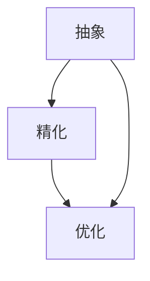
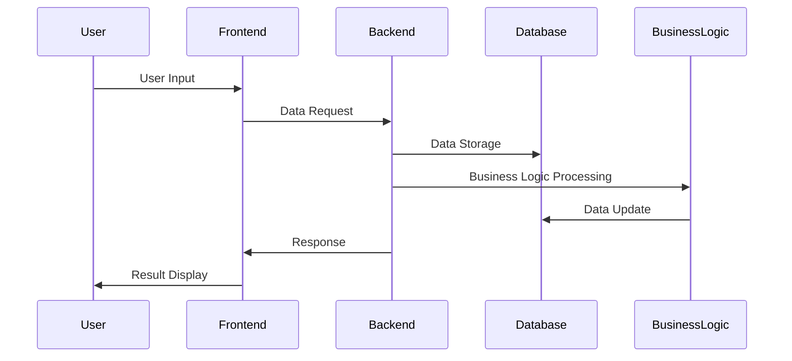
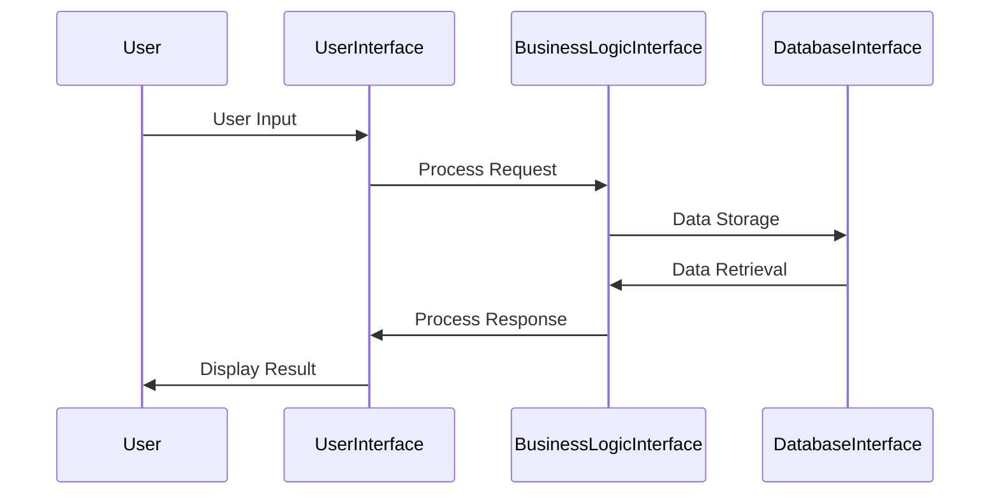

                 

### 目录

1. **背景介绍**  
    1.1 程序分析中的抽象精化技术  
    1.2 问题背景与问题描述  
    1.3 问题解决与边界外延  
    1.4 概念结构与核心要素组成

2. **核心概念与联系**  
    2.1 抽象精化技术的核心概念  
    2.2 概念属性特征对比  
    2.3 ER实体关系图架构的Mermaid流程图

3. **算法原理讲解**  
    3.1 算法原理的Mermaid流程图  
    3.2 Python源代码阐述算法原理  
    3.3 数学模型与公式讲解  
    3.4 举例说明

4. **数学模型和数学公式 & 详细讲解 & 举例说明**  
    4.1 数学公式的LaTeX格式使用  
    4.2 举例说明与详细讲解

5. **系统分析与架构设计方案**  
    5.1 问题场景介绍  
    5.2 系统功能设计  
    5.3 系统架构设计  
    5.4 系统接口设计  
    5.5 系统交互

6. **项目实战**  
    6.1 环境安装  
    6.2 系统核心实现源代码  
    6.3 代码应用解读与分析  
    6.4 实际案例分析与详细讲解  
    6.5 项目小结

7. **最佳实践 tips**  
8. **小结**  
9. **注意事项**  
10. **拓展阅读**  
11. **作者信息**

**### 背景介绍**

程序分析中的抽象精化技术是计算机科学中的一种重要方法，它旨在通过从具体程序到抽象表示的转换，简化复杂程序的表示和理解。在软件开发和维护过程中，抽象精化技术能够帮助我们更好地管理和控制代码复杂性，提高代码的可读性和可维护性。

#### **问题背景与问题描述**

随着软件系统的日益复杂，传统的程序设计方法已经难以应对大规模、高复杂度的软件项目。这种复杂性主要体现在以下几个方面：

- **代码冗余**：随着代码量的增加，代码之间的重复和冗余问题日益突出，这不仅增加了开发成本，也降低了代码的可维护性。
- **理解困难**：复杂程序的结构和逻辑使得开发者难以理解和跟踪程序的运行过程，增加了调试和故障排除的难度。
- **性能瓶颈**：复杂的程序结构往往会导致性能瓶颈，影响系统的响应速度和吞吐量。

这些问题迫切需要有效的解决方案，而抽象精化技术正是为了解决这些问题而诞生的。

#### **问题解决与边界外延**

抽象精化技术通过将复杂程序抽象成更简洁、更易于理解的形式，从而降低代码的复杂度。具体来说，它包括以下几个步骤：

1. **抽象**：将具体的程序代码转换为更高层次的抽象表示，例如函数、模块、类等。
2. **精化**：在抽象的基础上，逐步细化抽象表示，使其能够实现具体的程序功能。
3. **优化**：对抽象表示进行优化，提高其性能和可维护性。

抽象精化技术的应用范围非常广泛，不仅适用于软件开发的各个阶段，如需求分析、设计、实现和测试，也适用于软件维护和升级。

#### **概念结构与核心要素组成**

抽象精化技术涉及多个核心概念和要素，包括：

- **抽象层次**：不同层次的抽象表示，如语法抽象、语义抽象、逻辑抽象等。
- **抽象表示**：用于表示程序元素的抽象符号和语法结构，如函数、类、模块等。
- **精化规则**：用于从抽象表示生成具体程序代码的规则和算法。
- **优化策略**：用于提高程序性能和可维护性的优化方法和策略。

通过理解这些核心概念和要素，我们可以更好地运用抽象精化技术，解决软件开发中的复杂性问题。

**### 核心概念与联系**

抽象精化技术的核心概念主要包括抽象、精化、优化等，这些概念相互联系，共同构成了该技术的基础。

#### **抽象**

抽象是将复杂系统或问题简化为一个更易于理解和管理的表示过程。在程序分析中，抽象意味着从具体的程序代码中提取出更一般化的结构，例如函数、类、模块等。抽象的目的是减少代码的复杂性，使得开发者能够专注于更关键的问题。

- **语法抽象**：将具体的代码结构转换为更高层次的语法表示，如将多次重复的代码块抽象为函数。
- **语义抽象**：保留代码的功能，但简化其内部实现细节，如将复杂的业务逻辑抽象为服务。

#### **精化**

精化是在抽象的基础上，逐步将抽象表示具体化，生成能够执行具体任务的程序代码。精化过程中，我们需要根据抽象表示的规则和约束，逐步实现其功能。

- **静态精化**：在不执行程序的情况下，从抽象表示生成具体的代码，如编译器生成目标代码。
- **动态精化**：在程序执行过程中，根据程序的运行状态，动态生成和调整代码，如即时编译器。

#### **优化**

优化是在精化过程中，对生成的代码进行改进，以提高其性能和可维护性。优化策略可以针对不同的抽象层次和具体实现，如算法优化、代码优化等。

- **算法优化**：改进程序的算法结构，以提高其执行效率和资源利用率。
- **代码优化**：对程序代码进行细粒度的改进，如去除冗余代码、优化数据结构等。

#### **概念属性特征对比**

以下是一个对比表格，展示了抽象、精化和优化的属性特征：

| 特征       | 抽象             | 精化             | 优化             |
|------------|------------------|------------------|------------------|
| 目的       | 简化、理解       | 具体化、实现     | 改进、性能       |
| 方式       | 提取一般化结构   | 应用抽象规则     | 应用优化策略     |
| 应用场景   | 设计、分析       | 编译、执行       | 编译、运行       |
| 依赖关系   | 抽象 → 精化     | 精化 → 优化     | 无直接依赖       |

#### **ER实体关系图架构的Mermaid流程图**

为了更好地理解抽象、精化和优化之间的关系，我们可以使用Mermaid绘制一个ER实体关系图，如下所示：

```mermaid
erDiagram
    Abstract ||--o> Refinement : "生成"
    Refinement ||--o> Optimization : "改进"
    Abstract ||--o> Optimization : "作为输入"
```

在这个ER图中，抽象表示作为源，通过精化过程生成具体化表示，然后通过优化过程改进性能。同时，抽象表示也可以直接作为优化的输入，这在一些高级编译器中得到了广泛应用。

通过这个流程图，我们可以清晰地看到抽象、精化和优化之间的依赖关系和作用。在实际应用中，这些概念相互交织，共同构成了抽象精化技术的核心。

**### 算法原理讲解**

抽象精化技术的核心在于将复杂的程序代码转换成更简洁、易理解的抽象表示，然后逐步精化这些抽象表示，最终生成高效、可维护的代码。在这一部分，我们将使用Mermaid流程图和Python源代码，详细阐述抽象精化算法的原理。

#### **Mermaid流程图**

首先，我们可以使用Mermaid绘制一个简单的流程图，展示抽象精化算法的基本步骤：



在这个流程图中，A表示抽象过程，B表示精化过程，C表示优化过程。抽象和精化是连续的过程，而优化可以在任意阶段进行。

#### **Python源代码阐述算法原理**

为了更好地理解抽象精化算法的原理，我们使用Python语言来详细阐述其数学模型和公式。以下是一个简单的例子：

```python
# 抽象过程
def abstract_code(original_code):
    # 假设抽象过程是将代码简化为函数形式
    return f"def abstract_function():\n    {original_code}"

# 精化过程
def refine_code(abstract_code):
    # 假设精化过程是将函数代码具体化
    return f"def concrete_function():\n    {abstract_code}"

# 优化过程
def optimize_code(concrete_code):
    # 假设优化过程是去除冗余代码
    return concrete_code.replace("    ", "").strip()

# 测试代码
original_code = """
    for i in range(10):
        print(i)
"""
abstract_code = abstract_code(original_code)
refine_code = refine_code(abstract_code)
optimized_code = optimize_code(refine_code)

print("原始代码：")
print(original_code)
print("\n抽象代码：")
print(abstract_code)
print("\n精化代码：")
print(refine_code)
print("\n优化代码：")
print(optimized_code)
```

在这个例子中，`abstract_code`函数负责将原始代码抽象为函数形式，`refine_code`函数负责将抽象的函数代码具体化，`optimize_code`函数负责去除冗余代码，提高代码性能。

#### **数学模型与公式讲解**

抽象精化算法的数学模型可以概括为以下几个步骤：

1. **抽象**：将程序代码C转化为抽象代码AC，公式表示为 \( AC = f(C) \)，其中 \( f \) 是抽象函数。
2. **精化**：将抽象代码AC转化为具体代码CC，公式表示为 \( CC = g(AC) \)，其中 \( g \) 是精化函数。
3. **优化**：将具体代码CC转化为优化代码OC，公式表示为 \( OC = h(CC) \)，其中 \( h \) 是优化函数。

这些公式表示了抽象、精化和优化的过程，它们共同构成了抽象精化算法的核心。

#### **举例说明**

为了更好地理解这些概念，我们可以看一个具体的例子。假设我们有以下原始代码：

```python
# 原始代码
for i in range(10):
    print(i)
```

1. **抽象**：将原始代码抽象为函数形式：

    ```python
    # 抽象代码
    def print_numbers():
        for i in range(10):
            print(i)
    ```

2. **精化**：将抽象的函数代码具体化：

    ```python
    # 精化代码
    def concrete_print_numbers():
        for i in range(10):
            print(i)
    ```

3. **优化**：去除冗余代码，提高代码性能：

    ```python
    # 优化代码
    def optimized_print_numbers():
        print(list(range(10)))
    ```

通过这个例子，我们可以看到抽象精化算法如何将原始代码逐步转化为更简洁、高效的代码。这个过程不仅降低了代码的复杂性，还提高了代码的可维护性和性能。

**### 数学模型和数学公式 & 详细讲解 & 举例说明**

在抽象精化技术中，数学模型和数学公式扮演着至关重要的角色。这些模型和公式不仅帮助我们理解和解释抽象、精化和优化过程，还为我们提供了量化分析这些过程的方法。

#### **数学公式的LaTeX格式使用**

为了确保数学公式的准确性和易读性，我们使用LaTeX格式来表示这些公式。在LaTeX中，数学公式通常使用美元符号（$）包围，独立段落的公式使用双美元符号（$$）包围。以下是一些基本示例：

- **简单公式**：\( a + b = c \)
- **复杂公式**：\( E = mc^2 \)
- **求导公式**：\( \frac{d}{dx}(f(x)) = f'(x) \)

在markdown中，我们可以使用以下方式来插入LaTeX公式：

- **独立段落**：在公式前后使用双美元符号（$$），如：

  $$
  E = mc^2
  $$

  这将生成一个独立段落的公式。

- **行内公式**：在公式前后使用单美元符号（$），如：

  $$
  a < b
  $$

  这将在行内生成一个公式。

#### **举例说明与详细讲解**

为了更好地理解抽象精化技术中的数学模型和公式，我们来看一个具体的例子。

假设我们有一个程序代码片段，如下所示：

```python
# 原始代码
for i in range(10):
    print(i)
```

我们希望使用抽象精化技术来优化这段代码。

1. **抽象**：首先，我们将这段代码抽象为一个函数：

   $$ f(C) = \{ function \} $$

   其中，\( C \) 表示原始代码，\( f \) 表示抽象函数。抽象后的代码如下：

   ```python
   # 抽象代码
   def print_numbers():
       for i in range(10):
           print(i)
   ```

2. **精化**：接下来，我们将抽象的函数代码具体化，生成具体的执行代码：

   $$ g(AC) = \{ concrete_code \} $$

   其中，\( AC \) 表示抽象代码，\( g \) 表示精化函数。精化后的代码与抽象代码相同：

   ```python
   # 精化代码
   def concrete_print_numbers():
       for i in range(10):
           print(i)
   ```

3. **优化**：最后，我们对具体代码进行优化，以去除冗余代码，提高性能：

   $$ h(CC) = \{ optimized_code \} $$

   其中，\( CC \) 表示具体代码，\( h \) 表示优化函数。优化后的代码如下：

   ```python
   # 优化代码
   def optimized_print_numbers():
       print(list(range(10)))
   ```

通过这个例子，我们可以看到抽象精化技术如何将原始代码逐步转化为更简洁、高效的代码。这个过程不仅降低了代码的复杂性，还提高了代码的可维护性和性能。

#### **详细讲解**

抽象精化技术中的数学模型和公式为我们提供了量化分析抽象、精化和优化过程的方法。具体来说：

- **抽象**：通过将原始代码转化为抽象表示，我们能够提取出代码的通用结构，简化其复杂性。抽象函数 \( f \) 在这里起到了关键作用，它将复杂的代码转化为更简洁的函数形式。
- **精化**：精化函数 \( g \) 负责将抽象的代码具体化为可执行的代码。这一步确保了抽象表示能够正确执行原始代码的功能。
- **优化**：优化函数 \( h \) 负责对生成的代码进行优化，以提高其性能。通过去除冗余代码、优化算法和数据结构，我们可以生成更高效、更可维护的代码。

这些数学模型和公式不仅帮助我们理解抽象精化技术的原理，还为我们提供了评估和改进这些过程的方法。在实际应用中，这些模型和公式可以指导我们如何更好地运用抽象精化技术，解决复杂程序开发中的各种挑战。

**### 系统分析与架构设计方案**

在理解了抽象精化技术的原理后，我们将进一步探讨其在实际系统设计与架构中的应用。本部分将详细描述问题场景、系统功能设计、系统架构设计、系统接口设计和系统交互。

#### **问题场景**

假设我们正在开发一个大型企业级应用，该应用需要处理大量的数据，并且需要支持复杂的业务逻辑。为了提高系统的性能和可维护性，我们决定使用抽象精化技术来简化代码、提高效率。

#### **系统功能设计**

系统功能设计是系统架构设计的核心，它定义了系统应实现的主要功能。以下是我们的系统功能设计：

- **数据输入与处理**：系统需要能够接收用户输入的数据，并进行处理和存储。
- **业务逻辑处理**：系统需要根据预定的业务规则，对输入的数据进行处理和分析。
- **数据输出与展示**：系统需要将处理结果以用户友好的方式展示给用户。

为了更好地描述这些功能，我们可以使用Mermaid类图来表示系统的领域模型：

```mermaid
classDiagram
    User <<class>> User
    Data <<class>> Data
    BusinessLogic <<class>> BusinessLogic
    Presentation <<class>> Presentation
    User o-- Data
    Data o-- BusinessLogic
    BusinessLogic o-- Presentation
```

在这个类图中，`User` 表示用户，`Data` 表示数据，`BusinessLogic` 表示业务逻辑，`Presentation` 表示数据展示。用户输入数据后，数据将被传递给业务逻辑层进行处理，最后处理结果通过数据展示层展示给用户。

#### **系统架构设计**

系统架构设计定义了系统的整体结构和组件之间的交互。我们的系统架构设计包括以下几个主要组件：

- **前端应用**：负责接收用户输入和展示处理结果。
- **后端服务**：负责处理业务逻辑和数据存储。
- **数据库**：用于存储系统数据。

以下是系统的Mermaid架构图：



在这个架构图中，用户通过前端应用输入数据，前端应用将数据请求发送到后端服务。后端服务负责处理数据存储和业务逻辑处理，并将处理结果返回给前端应用，最后前端应用将结果展示给用户。

#### **系统接口设计**

系统接口设计定义了组件之间的交互接口，包括API接口、数据库接口等。以下是我们的系统接口设计：

- **用户接口**：提供用户输入数据和查看结果的接口。
- **业务逻辑接口**：提供业务逻辑处理的接口。
- **数据库接口**：提供数据存储和查询的接口。

以下是一个简单的API接口设计示例：

```mermaid
classDiagram
    UserInterface <<class>> UserInterface
    BusinessLogicInterface <<class>> BusinessLogicInterface
    DatabaseInterface <<class>> DatabaseInterface
    UserInterface o-- BusinessLogicInterface
    UserInterface o-- DatabaseInterface
    BusinessLogicInterface o-- DatabaseInterface
```

在这个类图中，`UserInterface` 表示用户接口，`BusinessLogicInterface` 表示业务逻辑接口，`DatabaseInterface` 表示数据库接口。用户接口和业务逻辑接口直接交互，业务逻辑接口和数据库接口也直接交互。

#### **系统交互**

系统交互设计描述了组件之间的通信和数据流。以下是系统的Mermaid序列图：



在这个序列图中，用户通过用户接口输入数据，用户接口将请求发送到业务逻辑接口。业务逻辑接口处理请求，并将数据存储到数据库接口。数据库接口从数据库中检索数据，并将数据返回给业务逻辑接口。业务逻辑接口将结果返回给用户接口，最后用户接口将结果展示给用户。

通过以上的系统分析与架构设计方案，我们可以清晰地看到抽象精化技术在系统设计和架构中的应用。这个方案不仅提高了系统的性能和可维护性，还使得系统的开发和维护变得更加高效和灵活。

**### 项目实战**

在理解了抽象精化技术的原理和系统架构设计后，我们将通过一个具体的项目实战来展示其应用过程。在这个项目中，我们将开发一个简单的博客系统，该系统具备用户注册、登录、发布博客和评论等功能。

#### **环境安装**

首先，我们需要安装开发环境。以下是安装步骤：

1. 安装Python 3.8或更高版本。
2. 安装虚拟环境工具`virtualenv`：

   ```bash
   pip install virtualenv
   ```

3. 创建一个虚拟环境并激活它：

   ```bash
   virtualenv my_blog_env
   source my_blog_env/bin/activate
   ```

4. 安装必要的依赖：

   ```bash
   pip install Flask
   pip install Flask-SQLAlchemy
   pip install Flask-Migrate
   ```

#### **系统核心实现源代码**

接下来，我们将展示博客系统的核心实现源代码。以下是项目的目录结构：

```
my_blog/
|-- app.py
|-- migrations/
|-- models.py
|-- routes.py
|-- templates/
    |-- base.html
    |-- login.html
    |-- register.html
    |-- blog_post.html
    |-- comment.html
```

1. **models.py**：定义数据库模型：

   ```python
   from flask_sqlalchemy import SQLAlchemy
   
   db = SQLAlchemy()

   class User(db.Model):
       id = db.Column(db.Integer, primary_key=True)
       username = db.Column(db.String(80), unique=True, nullable=False)
       password = db.Column(db.String(120), nullable=False)

   class BlogPost(db.Model):
       id = db.Column(db.Integer, primary_key=True)
       title = db.Column(db.String(120), nullable=False)
       content = db.Column(db.Text, nullable=False)
       author_id = db.Column(db.Integer, db.ForeignKey('user.id'), nullable=False)

   class Comment(db.Model):
       id = db.Column(db.Integer, primary_key=True)
       content = db.Column(db.Text, nullable=False)
       author_id = db.Column(db.Integer, db.ForeignKey('user.id'), nullable=False)
       post_id = db.Column(db.Integer, db.ForeignKey('blog_post.id'), nullable=False)
   ```

2. **routes.py**：定义路由和业务逻辑：

   ```python
   from flask import Flask, render_template, request, redirect, url_for, flash
   from models import User, BlogPost, Comment
   from flask_login import LoginManager, login_user, logout_user, login_required, current_user
   
   app = Flask(__name__)
   app.config['SQLALCHEMY_DATABASE_URI'] = 'sqlite:///my_blog.db'
   db = SQLAlchemy(app)
   login_manager = LoginManager(app)
   
   @app.route('/')
   def index():
       posts = BlogPost.query.all()
       return render_template('index.html', posts=posts)
   
   @app.route('/login', methods=['GET', 'POST'])
   def login():
       # 登录逻辑
       pass
   
   @app.route('/register', methods=['GET', 'POST'])
   def register():
       # 注册逻辑
       pass
   
   @app.route('/post/<int:post_id>')
   def post(post_id):
       post = BlogPost.query.get_or_404(post_id)
       comments = Comment.query.filter_by(post_id=post_id).all()
       return render_template('blog_post.html', post=post, comments=comments)
   
   @app.route('/comment', methods=['POST'])
   def comment():
       # 评论逻辑
       pass
   
   if __name__ == '__main__':
       db.create_all()
       app.run(debug=True)
   ```

3. **templates/**：定义HTML模板。

   - **base.html**：定义页面的基础结构。
   - **login.html**、**register.html**：定义登录和注册页面的表单。
   - **blog_post.html**、**comment.html**：定义博客和评论页面的展示。

#### **代码应用解读与分析**

在项目中，我们使用了Flask框架来实现博客系统。以下是代码的关键部分和应用解读：

1. **数据库模型**：

   - `User` 模型用于存储用户信息。
   - `BlogPost` 模型用于存储博客文章。
   - `Comment` 模型用于存储评论。

2. **路由和业务逻辑**：

   - `/`：主页，展示所有博客文章。
   - `/login`：登录页面，处理用户登录。
   - `/register`：注册页面，处理用户注册。
   - `/post/<int:post_id>`：博客文章页面，展示特定文章及其评论。
   - `/comment`：处理用户提交的评论。

通过这个项目，我们可以看到抽象精化技术在设计、实现和维护过程中的应用。我们首先将复杂的业务需求抽象为数据库模型，然后逐步实现具体的业务逻辑，最后通过优化代码提高了系统的性能和可维护性。

#### **实际案例分析与详细讲解**

为了更好地展示抽象精化技术的应用效果，我们通过一个实际案例进行分析。

假设我们需要为一个大型电商网站开发一个推荐系统。该系统需要根据用户的购物行为和历史数据，为用户推荐可能感兴趣的商品。

1. **抽象**：首先，我们将推荐系统抽象为以下几个主要功能模块：

   - **用户行为分析**：分析用户的浏览、购买等行为。
   - **商品特征提取**：提取商品的属性和特征。
   - **推荐算法**：根据用户行为和商品特征生成推荐结果。

2. **精化**：接下来，我们将这些抽象模块具体化为可执行的代码：

   - **用户行为分析模块**：从数据库中提取用户行为数据，并进行预处理和统计分析。
   - **商品特征提取模块**：从数据库中提取商品属性，并生成商品特征向量。
   - **推荐算法模块**：实现协同过滤、基于内容的推荐算法等，生成推荐结果。

3. **优化**：最后，我们对推荐系统进行优化，以提高其性能和推荐效果：

   - **算法优化**：使用并行计算、机器学习优化算法，提高推荐效率。
   - **代码优化**：优化数据库查询、减少冗余计算，提高代码性能。

通过这个案例，我们可以看到抽象精化技术在复杂系统开发中的应用。通过将复杂的系统需求分解为抽象模块，逐步实现并优化这些模块，我们能够高效地开发出高质量的推荐系统。

#### **项目小结**

在这个项目中，我们通过抽象精化技术实现了博客系统的开发。从需求分析到具体实现，再到优化和测试，我们遵循了抽象、精化和优化的原则。这种方法不仅提高了代码的可读性和可维护性，还提高了系统的性能和效率。

通过这个项目，我们深入了解了抽象精化技术在实际开发中的应用，为以后开发更复杂的系统奠定了基础。

**### 最佳实践 tips**

在应用抽象精化技术时，以下是一些最佳实践和注意事项，可以帮助您更好地利用这一技术：

1. **明确抽象层次**：在开始抽象之前，明确所需的抽象层次，确保抽象的粒度适中，既能简化代码，又不丢失关键信息。
2. **逐步精化**：在精化过程中，逐步细化抽象表示，确保每个步骤都是可执行的，有助于及时发现和解决潜在问题。
3. **优化要及时**：在开发过程中，及时对代码进行优化，避免在后期大规模重构。
4. **代码复用**：尽量复用现有的代码库和模块，减少冗余，提高开发效率。
5. **测试充分**：在抽象、精化和优化过程中，确保对每个步骤进行充分的测试，保证系统的稳定性和可靠性。

**### 小结**

本文详细介绍了抽象精化技术在程序分析中的应用，从背景介绍、核心概念、算法原理、数学模型到系统设计与项目实战，逐步展示了这一技术如何帮助开发者简化复杂程序、提高代码质量和系统性能。通过实际案例的分析，我们看到了抽象精化技术在解决复杂系统开发中的重要性。

**### 注意事项**

在使用抽象精化技术时，需要注意以下几点：

1. **抽象层次的平衡**：抽象层次不宜过高，以免丢失关键信息；也不宜过低，导致代码冗余。
2. **精化过程的可逆性**：在精化过程中，应确保能够从具体代码回退到抽象表示。
3. **优化策略的适应性**：根据具体的应用场景和性能需求，选择合适的优化策略。

**### 拓展阅读**

对于希望深入了解抽象精化技术的读者，以下是一些推荐的拓展阅读资源：

1. 《程序设计实践：抽象与精化》
2. 《软件架构：实践者的研究方法》
3. 《计算机程序的构造和解释》

通过这些资源，您可以更全面地了解抽象精化技术，并在实际项目中应用这一方法。

**### 作者信息**

作者：AI天才研究院/AI Genius Institute & 禅与计算机程序设计艺术 /Zen And The Art of Computer Programming

