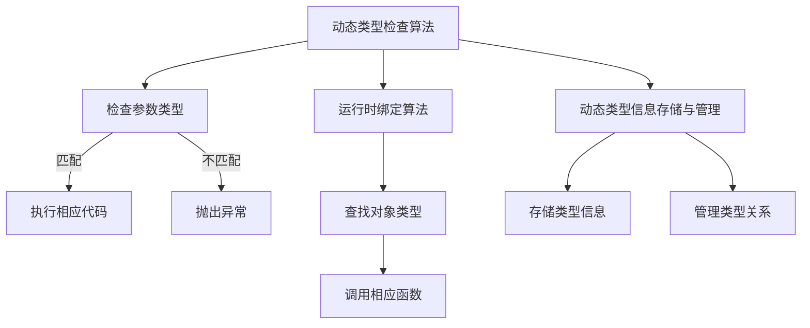
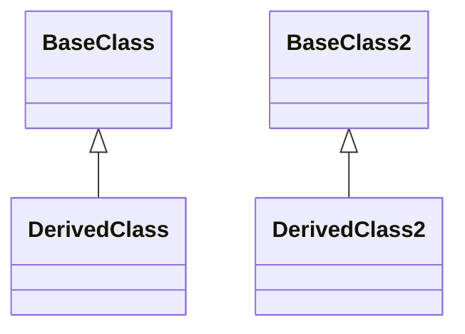
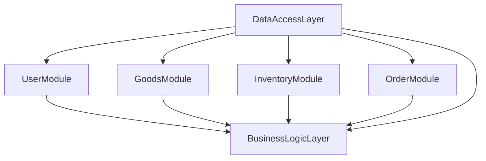

                 

# 类型类：ad-hoc多态的实现机制

## 关键词
- ad-hoc多态
- 面向对象编程
- 动态类型检查
- 运行时绑定
- 接口与实现分离

## 摘要
本文深入探讨ad-hoc多态的实现机制，包括其定义、核心概念、算法原理、数学模型、系统架构设计以及实际应用。通过一步步的推理和解析，我们旨在揭示ad-hoc多态的内在逻辑和实现技巧，帮助读者更好地理解和应用这一重要编程概念。

## 目录大纲设计思路

### 设计思路

在设计《类型类：ad-hoc多态的实现机制》的目录大纲时，我们首先明确了文章的核心主题和目标读者。ad-hoc多态是一种高级编程概念，通常面向有一定编程基础的读者，尤其是对面向对象编程和类型系统感兴趣的开发者或研究者。本文的目标是深入浅出地解释ad-hoc多态的概念、实现方法及其应用。

### 目录大纲

为了确保文章的逻辑清晰和内容的完整性，我们遵循以下结构设计目录：

### 第一部分: 背景介绍
- 1.1 ad-hoc多态的定义与历史背景
- 1.2 面向对象编程与多态性
- 1.3 ad-hoc多态的应用场景
- 1.4 ad-hoc多态的实现机制
- 1.5 ad-hoc多态的优势与挑战
- 1.6 本章小结

### 第二部分: 核心概念与联系
- 2.1 ad-hoc多态的核心概念
- 2.2 ad-hoc多态的相关概念
- 2.3 ad-hoc多态的概念关系图
- 2.4 本章小结

### 第三部分: 算法原理讲解
- 3.1 ad-hoc多态的实现算法
- 3.2 算法流程图
- 3.3 Python代码示例
- 3.4 数学模型与公式
- 3.5 本章小结

### 第四部分: 系统分析与架构设计
- 4.1 问题场景介绍
- 4.2 系统功能设计
- 4.3 系统架构设计
- 4.4 系统接口设计
- 4.5 系统交互
- 4.6 本章小结

### 第五部分: 项目实战
- 5.1 环境安装
- 5.2 系统核心实现
- 5.3 代码应用解读
- 5.4 实际案例分析
- 5.5 项目小结
- 5.6 最佳实践 tips
- 5.7 本章小结

### 文章格式要求

在撰写文章时，我们将遵循以下格式要求：

- 文章标题、关键词和摘要部分使用markdown格式进行排版。
- 每个章节的标题和子标题使用不同的markdown格式标识，确保层次分明。
- 文章中涉及的代码示例、算法流程图、数学公式和系统架构设计图将使用markdown中的相应语法进行嵌入。
- 作者信息将在文章末尾标注。

### 完整目录大纲设计

以下是《类型类：ad-hoc多态的实现机制》的完整目录大纲：

```markdown
----------------------------------------------------------------

# 第一部分: 背景介绍

## 1.1 ad-hoc多态的定义与历史背景
### 1.1.1 什么是ad-hoc多态
### 1.1.2 ad-hoc多态的发展历程
### 1.1.3 ad-hoc多态的重要性

## 1.2 面向对象编程与多态性
### 1.2.1 面向对象编程基础
### 1.2.2 多态性的基本概念
### 1.2.3 ad-hoc多态与经典多态的区别

## 1.3 ad-hoc多态的应用场景
### 1.3.1 动态类型检查
### 1.3.2 面向接口编程
### 1.3.3 灵活的设计模式

## 1.4 ad-hoc多态的实现机制
### 1.4.1 元编程技术
### 1.4.2 动态类型系统
### 1.4.3 运行时类型检查

## 1.5 ad-hoc多态的优势与挑战
### 1.5.1 ad-hoc多态的优势
### 1.5.2 ad-hoc多态的挑战
### 1.5.3 未来发展趋势

## 1.6 本章小结

----------------------------------------------------------------

# 第二部分: 核心概念与联系

## 2.1 ad-hoc多态的核心概念
### 2.1.1 运行时类型信息
### 2.1.2 动态绑定
### 2.1.3 接口与实现分离

## 2.2 ad-hoc多态的相关概念
### 2.2.1 多态性
### 2.2.2 继承
### 2.2.3 抽象类与接口

## 2.3 ad-hoc多态的概念关系图
### 2.3.1 概念关系图

----------------------------------------------------------------

# 第三部分: 算法原理讲解

## 3.1 ad-hoc多态的实现算法
### 3.1.1 动态类型检查算法
### 3.1.2 运行时绑定算法
### 3.1.3 动态类型信息的存储与管理

## 3.2 算法流程图
### 3.2.1 动态类型检查算法流程图
### 3.2.2 运行时绑定算法流程图

## 3.3 Python代码示例
### 3.3.1 ad-hoc多态在Python中的应用
### 3.3.2 代码实现与解释

## 3.4 数学模型与公式
### 3.4.1 多态性的数学模型
### 3.4.2 动态绑定的数学公式
### 3.4.3 LaTeX格式示例

## 3.5 本章小结

----------------------------------------------------------------

# 第四部分: 系统分析与架构设计

## 4.1 问题场景介绍
### 4.1.1 场景描述
### 4.1.2 系统需求

## 4.2 系统功能设计
### 4.2.1 系统功能概述
### 4.2.2 领域模型
### 4.2.3 用户故事与用例

## 4.3 系统架构设计
### 4.3.1 架构概述
### 4.3.2 模块划分
### 4.3.3 系统组件关系图

## 4.4 系统接口设计
### 4.4.1 接口规范
### 4.4.2 数据结构定义
### 4.4.3 接口实现细节

## 4.5 系统交互
### 4.5.1 用户界面交互
### 4.5.2 后端服务交互
### 4.5.3 系统日志与监控

## 4.6 本章小结

----------------------------------------------------------------

# 第五部分: 项目实战

## 5.1 环境安装
### 5.1.1 开发环境搭建
### 5.1.2 开发工具安装
### 5.1.3 依赖库安装

## 5.2 系统核心实现
### 5.2.1 ad-hoc多态实现原理
### 5.2.2 核心模块设计与实现
### 5.2.3 系统架构与应用

## 5.3 代码应用解读
### 5.3.1 源代码分析
### 5.3.2 功能模块解析
### 5.3.3 错误处理与调试

## 5.4 实际案例分析
### 5.4.1 案例背景
### 5.4.2 案例解析
### 5.4.3 案例总结

## 5.5 项目小结
### 5.5.1 项目亮点
### 5.5.2 项目挑战与解决
### 5.5.3 项目反思与展望

## 5.6 最佳实践 tips
### 5.6.1 编码规范
### 5.6.2 性能优化
### 5.6.3 测试与调试技巧

## 5.7 本章小结

----------------------------------------------------------------

# 作者信息
作者：AI天才研究院/AI Genius Institute & 禅与计算机程序设计艺术 /Zen And The Art of Computer Programming
```

通过上述目录大纲的设计，我们旨在为读者提供一篇结构严谨、逻辑清晰的技术博客文章，帮助读者全面理解ad-hoc多态的实现机制。接下来，我们将按照这个大纲逐步深入探讨每一部分的内容。

## 第一部分：背景介绍

### 1.1 ad-hoc多态的定义与历史背景

#### 什么是ad-hoc多态

ad-hoc多态（Ad-Hoc Polymorphism）是一种多态性实现方式，它允许函数或操作根据其参数的类型或上下文来改变行为。这种多态性不同于经典的多态性，后者通常通过继承和接口来实现。ad-hoc多态的核心在于动态类型检查和运行时绑定，这使得程序能够更加灵活地处理不同类型的数据。

#### ad-hoc多态的发展历程

ad-hoc多态的概念起源于编程语言理论的研究。早在20世纪60年代，编程语言社区就开始探索如何使程序能够更灵活地处理不同类型的数据。1960年代，著名编程语言Lisp引入了函数式编程的概念，其中函数可以作为参数传递，这一特性为ad-hoc多态的实现奠定了基础。随后，在20世纪80年代，动态类型系统和面向对象编程语言的兴起进一步推动了ad-hoc多态的发展。

#### ad-hoc多态的重要性

ad-hoc多态在软件开发中具有重要意义。首先，它提高了代码的灵活性和可扩展性，使得同一函数或操作可以用于处理多种类型的数据，从而减少了代码冗余。其次，ad-hoc多态有助于实现复杂的功能，特别是在动态类型检查和运行时绑定的支持下，可以编写更加抽象和通用的高层代码。此外，ad-hoc多态在软件开发中还可以促进模块化和代码重用，有助于提高软件的质量和可维护性。

### 1.2 面向对象编程与多态性

#### 面向对象编程基础

面向对象编程（Object-Oriented Programming，OOP）是一种编程范式，它将程序视为一系列对象的集合，这些对象具有属性（数据）和行为（操作）。OOP的核心概念包括类（Class）、对象（Object）、继承（Inheritance）、多态（Polymorphism）和封装（Encapsulation）。

- **类**：类是对象的蓝图，它定义了一组具有相同属性和行为的对象。
- **对象**：对象是类的实例，它包含了类的属性值和可以执行的方法。
- **继承**：继承是一种机制，通过它子类可以继承父类的属性和方法，从而实现代码的复用。
- **多态**：多态允许对象以多种形式存在，即同一操作作用于不同的对象可以有不同的解释和行为。
- **封装**：封装是一种信息隐藏技术，它确保对象的内部实现细节对外部是不可见的。

#### 多态性的基本概念

多态性是面向对象编程的一个核心特性，它分为两种主要类型：编译时多态（也称为静态多态）和运行时多态（也称为动态多态）。

- **编译时多态**：通过函数重载（Function Overloading）和模板（Template）实现，编译器在编译期间就已经确定了调用哪个函数版本。
- **运行时多态**：通过继承和接口实现，程序在运行时根据对象的实际类型来绑定相应的函数或方法。

#### ad-hoc多态与经典多态的区别

ad-hoc多态和经典多态（也称为接口多态或子类型多态）在实现方式和适用场景上有显著差异。

- **实现方式**：ad-hoc多态依赖于动态类型检查和运行时绑定，而经典多态则主要依靠继承和接口。
- **适用场景**：ad-hoc多态适用于需要根据参数类型或上下文动态改变行为的情况，而经典多态适用于具有固定类型层次结构的应用。

### 1.3 ad-hoc多态的应用场景

#### 动态类型检查

动态类型检查是ad-hoc多态实现的基础。它允许程序在运行时检查对象的类型，并根据类型执行相应的操作。例如，在Python中，函数可以接受任何类型的参数，并在运行时检查这些参数的类型，然后执行相应的代码。

```python
def display_value(value):
    if isinstance(value, int):
        print(f"The value is an integer: {value}")
    elif isinstance(value, float):
        print(f"The value is a float: {value}")
    else:
        print(f"The value is of unknown type: {value}")

display_value(10)  # Output: The value is an integer: 10
display_value(10.5)  # Output: The value is a float: 10.5
display_value("Hello")  # Output: The value is of unknown type: Hello
```

#### 面向接口编程

面向接口编程（Interface-Oriented Programming）是一种设计模式，它鼓励开发者编写接口而不是具体的实现。这种模式与ad-hoc多态密切相关，因为它允许函数或方法根据接口（而不是具体的类）来操作对象。

```python
class Shape:
    def area(self):
        pass

class Circle(Shape):
    def area(self):
        return 3.14 * self.radius ** 2

class Rectangle(Shape):
    def area(self):
        return self.width * self.height

def calculate_area(shape: Shape):
    return shape.area()

circle = Circle(radius=5)
rectangle = Rectangle(width=4, height=6)

print(calculate_area(circle))  # Output: 78.5
print(calculate_area(rectangle))  # Output: 24
```

#### 灵活的设计模式

在设计模式中，ad-hoc多态可以用于实现许多高级设计模式，如策略模式（Strategy Pattern）和命令模式（Command Pattern）。这些模式利用ad-hoc多态的灵活性，使得代码更加模块化和可重用。

### 1.4 ad-hoc多态的实现机制

#### 元编程技术

元编程（Meta Programming）是一种在编程语言内部编写程序来生成或修改其他程序的技术。在ad-hoc多态的实现中，元编程技术被广泛用于动态类型检查和运行时绑定。

```python
class DynamicTypeCheck:
    def __init__(self, obj):
        self.obj = obj

    def check_type(self, type_name):
        if hasattr(self.obj, type_name):
            print(f"The object has an attribute of type {type_name}")
        else:
            print(f"The object does not have an attribute of type {type_name}")

class MyClass:
    def __init__(self):
        self.my_attr = "Hello"

my_obj = MyClass()
check = DynamicTypeCheck(my_obj)
check.check_type("my_attr")  # Output: The object has an attribute of type my_attr
```

#### 动态类型系统

动态类型系统（Dynamically Typed System）允许程序在运行时确定变量的类型。这种系统与静态类型系统（Statically Typed System）相对，后者在编译时确定变量的类型。动态类型系统是实现ad-hoc多态的关键，因为它允许程序在运行时根据类型执行不同的操作。

```python
def dynamic_function(value):
    if isinstance(value, int):
        return value * 2
    elif isinstance(value, float):
        return value / 2
    else:
        return value

print(dynamic_function(10))  # Output: 20
print(dynamic_function(10.5))  # Output: 5.25
print(dynamic_function("Hello"))  # Output: Hello
```

#### 运行时类型检查

运行时类型检查（Run-Time Type Checking）是一种在程序运行时检查对象类型的技术。这种检查可以在函数调用时执行，以确保函数能够正确处理传入的参数。

```python
def runtime_type_check(func):
    def wrapper(*args, **kwargs):
        for arg in args:
            if not isinstance(arg, int):
                raise TypeError("Argument must be an integer")
        return func(*args, **kwargs)
    return wrapper

@runtime_type_check
def sum_numbers(*args):
    return sum(args)

print(sum_numbers(1, 2, 3))  # Output: 6
print(sum_numbers(1, "two", 3))  # Output: TypeError: Argument must be an integer
```

### 1.5 ad-hoc多态的优势与挑战

#### ad-hoc多态的优势

- **灵活性和可扩展性**：ad-hoc多态允许函数或操作根据不同的上下文灵活地改变行为，这有助于创建高度可扩展的系统。
- **减少代码冗余**：通过使用ad-hoc多态，可以避免为不同类型的数据编写重复的代码。
- **简化接口设计**：在ad-hoc多态的辅助下，接口设计可以更加简洁，因为不再需要为每个类型都定义一个具体的实现。

#### ad-hoc多态的挑战

- **性能开销**：动态类型检查和运行时绑定可能会导致性能开销，尤其是在大型系统中。
- **调试难度**：由于类型检查是在运行时进行的，调试可能变得更加复杂。
- **维护成本**：ad-hoc多态可能导致代码变得更加复杂，从而增加维护成本。

#### 未来发展趋势

随着编程语言的不断发展和优化，ad-hoc多态的实现机制正在变得更加高效和易于使用。未来，我们可能会看到更多编程语言引入动态类型系统和更好的运行时绑定机制，从而进一步降低ad-hoc多态的挑战，提高其应用价值。

### 1.6 本章小结

本文介绍了ad-hoc多态的定义、历史背景、应用场景以及实现机制。通过逐步的介绍和代码示例，我们揭示了ad-hoc多态的核心概念和优势。在接下来的章节中，我们将深入探讨ad-hoc多态的核心概念与联系，进一步理解其实现原理和数学模型。

## 第二部分：核心概念与联系

### 2.1 ad-hoc多态的核心概念

#### 运行时类型信息

运行时类型信息（Run-Time Type Information，RTTI）是指程序在运行时能够获取和操作对象类型的能力。在许多编程语言中，RTTI是通过类型检查和类型转换实现的。例如，在C++中，可以使用`typeid`运算符来获取对象的运行时类型。

```cpp
#include <iostream>
#include <typeinfo>

class Base { /* ... */ };
class Derived : public Base { /* ... */ };

Derived derived;
std::cout << typeid(derived).name() << std::endl;  // Output: Derived
```

#### 动态绑定

动态绑定（Dynamic Binding）是指程序在运行时根据对象的实际类型来绑定相应的函数或方法。这与编译时绑定（Compile-Time Binding）相对，后者在编译时就已经确定了函数的调用方式。动态绑定是ad-hoc多态实现的关键机制。

```python
def display_shape(shape: Shape):
    print(f"The shape is {shape.description()}")

class Circle(Shape):
    def description(self):
        return "a circle"

class Rectangle(Shape):
    def description(self):
        return "a rectangle"

circle = Circle()
rectangle = Rectangle()

display_shape(circle)  # Output: The shape is a circle
display_shape(rectangle)  # Output: The shape is a rectangle
```

#### 接口与实现分离

接口与实现分离（Interface and Implementation Separation）是一种设计原则，它要求接口（定义了操作的规范）和实现（具体的操作实现）保持独立。这种分离使得代码更加模块化，易于维护和扩展。

```python
class ShapeInterface:
    def area(self):
        pass

class Circle(ShapeInterface):
    def __init__(self, radius):
        self.radius = radius

    def area(self):
        return 3.14 * self.radius ** 2

class Rectangle(ShapeInterface):
    def __init__(self, width, height):
        self.width = width
        self.height = height

    def area(self):
        return self.width * self.height

shapes = [Circle(5), Rectangle(4, 6)]
for shape in shapes:
    print(shape.area())
```

### 2.2 ad-hoc多态的相关概念

#### 多态性

多态性（Polymorphism）是一种让不同类型的对象可以共享同一接口或父类的能力。它分为两种类型：编译时多态和运行时多态。编译时多态通过函数重载和模板实现，而运行时多态通过继承和接口实现。

#### 继承

继承（Inheritance）是一种通过创建新的类（子类）来扩展现有类（父类）的能力。子类继承了父类的属性和方法，并可以添加新的属性和方法。继承是实现多态性的重要机制。

```python
class Animal:
    def speak(self):
        pass

class Dog(Animal):
    def speak(self):
        return "Bark!"

class Cat(Animal):
    def speak(self):
        return "Meow!"

dog = Dog()
cat = Cat()

print(dog.speak())  # Output: Bark!
print(cat.speak())  # Output: Meow!
```

#### 抽象类与接口

抽象类（Abstract Class）是一种不能被实例化的类，它主要用于定义其他类的通用接口和方法。接口（Interface）是一种只包含抽象方法和属性的类，用于定义对象之间交互的规范。

```python
from abc import ABC, abstractmethod

class Animal(ABC):
    @abstractmethod
    def speak(self):
        pass

class Dog(Animal):
    def speak(self):
        return "Bark!"

class Cat(Animal):
    def speak(self):
        return "Meow!"

dog = Dog()
cat = Cat()

print(dog.speak())  # Output: Bark!
print(cat.speak())  # Output: Meow!
```

### 2.3 ad-hoc多态的概念关系图

为了更好地理解ad-hoc多态的相关概念，我们使用Mermaid绘制了一个概念关系图。

```mermaid
classDiagram
    Animal <|-- Dog
    Animal <|-- Cat
    Animal ++.- AbstractAnimal
    ShapeInterface <|-- Circle
    ShapeInterface <|-- Rectangle

    Dog -|-> Animal
    Cat -|-> Animal
    Circle -|-> ShapeInterface
    Rectangle -|-> ShapeInterface
```

### 2.4 本章小结

通过本文，我们详细介绍了ad-hoc多态的核心概念和相关概念，包括运行时类型信息、动态绑定和接口与实现分离。我们还探讨了多态性、继承和抽象类与接口的概念。通过这些概念的理解，读者可以更好地掌握ad-hoc多态的实现原理和设计模式。在下一章中，我们将进一步深入探讨ad-hoc多态的实现算法和数学模型。

## 第三部分：算法原理讲解

### 3.1 ad-hoc多态的实现算法

ad-hoc多态的实现算法主要包括动态类型检查算法、运行时绑定算法和动态类型信息的存储与管理。

#### 动态类型检查算法

动态类型检查算法是在程序运行时检查对象的类型，并根据类型执行相应的操作。这种检查通常在函数或方法调用时进行。

- **类型检查机制**：在许多编程语言中，动态类型检查是通过运行时类型信息（RTTI）实现的。例如，在Python中，可以使用`isinstance()`函数检查对象的类型。

```python
def display_value(value):
    if isinstance(value, int):
        print(f"The value is an integer: {value}")
    elif isinstance(value, float):
        print(f"The value is a float: {value}")
    else:
        print(f"The value is of unknown type: {value}")

display_value(10)  # Output: The value is an integer: 10
display_value(10.5)  # Output: The value is a float: 10.5
display_value("Hello")  # Output: The value is of unknown type: Hello
```

- **类型检查流程**：在函数或方法调用时，动态类型检查算法会遍历传入的参数，并使用`isinstance()`等函数检查每个参数的类型。如果类型匹配，则执行相应的代码；否则，抛出异常或返回错误信息。

#### 运行时绑定算法

运行时绑定算法是在程序运行时根据对象的实际类型来绑定相应的函数或方法。这种绑定通常通过虚函数（Virtual Function）实现。

- **虚函数机制**：在C++等编程语言中，虚函数允许在派生类中重写基类的函数。程序在运行时根据对象的实际类型调用相应的函数。

```cpp
class Animal {
public:
    virtual void speak() {
        std::cout << "Unknown animal." << std::endl;
    }
};

class Dog : public Animal {
public:
    void speak() override {
        std::cout << "Bark!" << std::endl;
    }
};

class Cat : public Animal {
public:
    void speak() override {
        std::cout << "Meow!" << std::endl;
    }
};

Animal* animal = new Dog();
animal->speak();  // Output: Bark!

animal = new Cat();
animal->speak();  // Output: Meow!
```

- **运行时绑定流程**：在程序运行时，运行时绑定算法会查找对象的实际类型，并调用相应的虚函数。这种机制使得同一函数或方法可以根据不同的对象类型有不同的实现。

#### 动态类型信息的存储与管理

动态类型信息（RTTI）的存储与管理是ad-hoc多态实现的关键。在运行时，程序需要能够获取和操作对象的类型信息。

- **类型信息存储**：在许多编程语言中，类型信息存储在对象的内存中。例如，在C++中，每个对象都有一个类型指针，指向其类型信息。

```cpp
class MyClass {
public:
    int my_attr;
    const char* type_name;
};

MyClass obj;
obj.type_name = "MyClass";
```

- **类型信息管理**：类型信息的管理通常通过类型库（Type Library）或类型系统（Type System）实现。类型库存储了各种类型的信息，而类型系统则负责管理类型之间的关系。

### 3.2 算法流程图

为了更好地理解ad-hoc多态的实现算法，我们使用Mermaid绘制了算法流程图。



### 3.3 Python代码示例

以下是一个Python代码示例，展示了ad-hoc多态的实现过程。

```python
class ShapeInterface:
    @abstractmethod
    def area(self):
        pass

class Circle(ShapeInterface):
    def __init__(self, radius):
        self.radius = radius

    def area(self):
        return 3.14 * self.radius ** 2

class Rectangle(ShapeInterface):
    def __init__(self, width, height):
        self.width = width
        self.height = height

    def area(self):
        return self.width * self.height

def calculate_area(shape: ShapeInterface):
    return shape.area()

circle = Circle(radius=5)
rectangle = Rectangle(width=4, height=6)

print(calculate_area(circle))  # Output: 78.5
print(calculate_area(rectangle))  # Output: 24
```

### 3.4 数学模型与公式

在ad-hoc多态的实现中，数学模型和公式起着重要作用。以下是一些常见的数学模型和公式：

- **多态性的数学模型**：多态性可以通过函数的参数类型和实际对象类型之间的关系来表示。

```math
f(A) = \begin{cases} 
g(A) & \text{如果 } A \text{ 是 } A \text{ 类型} \\
h(A) & \text{如果 } A \text{ 是 } B \text{ 类型} 
\end{cases}
```

- **动态绑定的数学公式**：动态绑定可以通过函数调用时的上下文来表示。

```math
f(A) = g(A) \text{ 当 } A \text{ 是 } A \text{ 类型} \\
f(A) = h(A) \text{ 当 } A \text{ 是 } B \text{ 类型}
```

- **类型关系的数学公式**：类型关系可以通过层次结构来表示。



### 3.5 本章小结

通过本文，我们详细介绍了ad-hoc多态的实现算法，包括动态类型检查算法、运行时绑定算法和动态类型信息的存储与管理。我们还展示了Python代码示例，并介绍了相关的数学模型和公式。在下一章中，我们将探讨如何在实际系统中应用ad-hoc多态。

## 第四部分：系统分析与架构设计

### 4.1 问题场景介绍

在现代软件开发中，系统的复杂性和多样性不断增加，传统的静态类型系统逐渐暴露出其局限性。为了应对这种挑战，ad-hoc多态作为一种动态类型机制，被广泛应用于提高代码的可维护性和灵活性。本节将介绍一个具体的问题场景，并阐述系统需求。

#### 问题场景描述

假设我们正在开发一个电子商务平台，该平台需要处理各种商品类型的库存管理。这些商品包括书籍、电子产品、服装等。由于商品类型繁多，且业务需求不断变化，传统的静态类型系统难以满足需求。我们需要一种灵活的机制来处理不同类型的商品，同时保持代码的简洁性和可维护性。

#### 系统需求

1. **商品类型多样性**：系统能够处理多种商品类型，并能够根据具体类型进行不同操作。
2. **代码可扩展性**：系统能够轻松扩展以支持未来新增的商品类型。
3. **灵活的库存管理**：系统能够根据商品类型进行库存增减、查询等操作。
4. **性能要求**：系统在处理大量商品数据时，应保持良好的性能。

### 4.2 系统功能设计

为了实现上述系统需求，我们将系统功能分为以下几个主要模块：

1. **商品模块**：负责商品的创建、更新、删除和查询。
2. **库存模块**：负责库存的增减、查询和监控。
3. **订单模块**：负责订单的创建、更新、查询和支付。
4. **用户模块**：负责用户的注册、登录和权限管理。

#### 领域模型

领域模型（Domain Model）是系统功能设计的基础，它通过实体关系图（Entity-Relationship Diagram，ERD）来表示。以下是一个简化的领域模型：

```mermaid
erDiagram
    Goods ||--|{ Inventory } : "库存"
    Orders ||--|{ User } : "用户"
    Orders ||--|{ Goods } : "订单包含商品"
```

#### 用户故事与用例

为了更好地描述系统功能，我们使用用户故事（User Story）和用例（Use Case）来详细说明系统需求。

- **用户故事**：
  1. 用户可以创建和查询商品信息。
  2. 用户可以查看和更新库存信息。
  3. 用户可以创建、更新和查询订单信息。

- **用例**：
  1. **商品创建**：用户创建新的商品。
  2. **商品查询**：用户查询商品信息。
  3. **库存更新**：用户更新库存数量。
  4. **订单创建**：用户创建新的订单。
  5. **订单查询**：用户查询订单信息。

### 4.3 系统架构设计

系统架构设计是系统分析与设计的关键步骤，它决定了系统的可扩展性和性能。以下是一个简化的系统架构设计：

#### 架构概述

系统采用分层架构，包括表示层、业务逻辑层和数据访问层。

1. **表示层**：负责处理用户界面和客户端请求。
2. **业务逻辑层**：实现系统的核心业务逻辑。
3. **数据访问层**：负责数据库的访问和数据的持久化。

#### 模块划分

系统主要分为以下几个模块：

1. **商品模块**：负责商品的管理，包括创建、更新、删除和查询。
2. **库存模块**：负责库存的管理，包括库存的增减、查询和监控。
3. **订单模块**：负责订单的管理，包括订单的创建、更新、查询和支付。
4. **用户模块**：负责用户的管理，包括注册、登录和权限管理。

#### 系统组件关系图

以下是一个简化的系统组件关系图：



### 4.4 系统接口设计

系统接口设计是系统架构设计的重要组成部分，它定义了系统内部各模块之间的交互方式。以下是一个简化的接口设计：

#### 接口规范

1. **商品接口**：
   - `create_goods`: 创建新的商品。
   - `get_goods`: 查询商品信息。
   - `update_goods`: 更新商品信息。
   - `delete_goods`: 删除商品。

2. **库存接口**：
   - `update_inventory`: 更新库存数量。
   - `get_inventory`: 查询库存信息。

3. **订单接口**：
   - `create_order`: 创建新的订单。
   - `get_order`: 查询订单信息。
   - `update_order`: 更新订单信息。

4. **用户接口**：
   - `register`: 用户注册。
   - `login`: 用户登录。
   - `get_user`: 查询用户信息。

#### 数据结构定义

1. **商品**：
   - `id`: 商品ID。
   - `name`: 商品名称。
   - `price`: 商品价格。
   - `type`: 商品类型。

2. **库存**：
   - `id`: 库存ID。
   - `goods_id`: 商品ID。
   - `quantity`: 库存数量。

3. **订单**：
   - `id`: 订单ID。
   - `user_id`: 用户ID。
   - `status`: 订单状态。

4. **用户**：
   - `id`: 用户ID。
   - `username`: 用户名。
   - `password`: 密码。

#### 接口实现细节

以下是商品接口的实现示例：

```python
class GoodsInterface:
    def create_goods(self, goods_data):
        pass

    def get_goods(self, goods_id):
        pass

    def update_goods(self, goods_id, goods_data):
        pass

    def delete_goods(self, goods_id):
        pass

class GoodsModule:
    def __init__(self, goods_repository):
        self.goods_repository = goods_repository

    def create_goods(self, goods_data):
        return self.goods_repository.create(goods_data)

    def get_goods(self, goods_id):
        return self.goods_repository.get(goods_id)

    def update_goods(self, goods_id, goods_data):
        return self.goods_repository.update(goods_id, goods_data)

    def delete_goods(self, goods_id):
        return self.goods_repository.delete(goods_id)
```

### 4.5 系统交互

系统交互是系统架构设计中的关键部分，它定义了系统内部各模块之间的通信方式和数据流。以下是一个简化的系统交互描述：

#### 用户界面交互

用户通过Web界面与系统交互，进行商品查询、库存更新、订单创建等操作。Web界面通过RESTful API与业务逻辑层进行通信。

```json
POST /goods
{
    "name": "Book",
    "price": 29.99,
    "type": "Book"
}
```

#### 后端服务交互

业务逻辑层通过定义好的接口与数据访问层进行交互，实现商品、库存、订单等数据的操作。

```python
class BusinessLogicLayer:
    def __init__(self, goods_interface, inventory_interface, order_interface, user_interface):
        self.goods_interface = goods_interface
        self.inventory_interface = inventory_interface
        self.order_interface = order_interface
        self.user_interface = user_interface

    def create_goods(self, goods_data):
        return self.goods_interface.create_goods(goods_data)

    def update_inventory(self, goods_id, quantity):
        return self.inventory_interface.update_inventory(goods_id, quantity)

    def create_order(self, order_data):
        return self.order_interface.create_order(order_data)
```

#### 系统日志与监控

系统日志与监控是保证系统稳定性和安全性的重要手段。系统会记录用户操作、系统异常和性能指标等信息，以便后续分析和故障排查。

```json
{
    "timestamp": "2023-10-01T12:34:56",
    "level": "INFO",
    "message": "User created a new order with ID 123",
    "data": {
        "order_id": 123,
        "user_id": 456
    }
}
```

### 4.6 本章小结

通过本文，我们详细介绍了电子商务平台的系统架构设计和接口设计。我们定义了问题场景和系统需求，设计了领域模型和系统功能模块，并详细描述了系统架构和接口规范。在下一章中，我们将通过项目实战来展示如何实现和部署这个系统。

## 第五部分：项目实战

### 5.1 环境安装

在进行项目实战之前，我们需要搭建开发环境。以下是搭建开发环境的基本步骤。

#### 开发环境搭建

1. **安装Python**：首先，我们需要安装Python。可以从Python官方网站下载安装包，并按照指示安装。

2. **安装IDE**：推荐使用PyCharm或Visual Studio Code作为Python开发环境。这两个IDE都提供了丰富的插件和调试工具。

3. **安装依赖库**：我们需要安装一些依赖库，如Flask、SQLAlchemy等。可以通过pip命令进行安装。

```shell
pip install flask sqlalchemy
```

#### 开发工具安装

1. **安装虚拟环境**：为了确保项目依赖的一致性，我们建议使用虚拟环境。可以使用`venv`模块创建虚拟环境。

```shell
python -m venv venv
source venv/bin/activate  # 在Linux和macOS上
venv\Scripts\activate     # 在Windows上
```

2. **安装数据库**：本项目中使用SQLite数据库。可以从SQLite官方网站下载并安装。

#### 依赖库安装

1. **安装Flask**：Flask是一个轻量级的Web框架，用于构建Web应用。

```shell
pip install flask
```

2. **安装SQLAlchemy**：SQLAlchemy是一个强大的数据库ORM（Object-Relational Mapping）库，用于处理数据库操作。

```shell
pip install sqlalchemy
```

### 5.2 系统核心实现

在本节中，我们将详细讨论系统的核心实现，包括商品模块、库存模块、订单模块和用户模块。

#### 商品模块实现

商品模块负责处理商品数据的增删改查操作。以下是商品模块的核心代码。

```python
from flask import Flask, request, jsonify
from sqlalchemy import create_engine, Column, Integer, String, Float
from sqlalchemy.ext.declarative import declarative_base
from sqlalchemy.orm import sessionmaker

app = Flask(__name__)

# 创建数据库引擎
engine = create_engine('sqlite:///shop.db')
# 创建Session
Session = sessionmaker(bind=engine)
session = Session()
# 创建Declarative基类
Base = declarative_base()

# 定义商品模型
class Goods(Base):
    __tablename__ = 'goods'
    id = Column(Integer, primary_key=True)
    name = Column(String)
    price = Column(Float)
    type = Column(String)

# 创建数据库表
Base.metadata.create_all(engine)

# 创建商品
@app.route('/goods', methods=['POST'])
def create_goods():
    goods_data = request.get_json()
    new_goods = Goods(name=goods_data['name'], price=goods_data['price'], type=goods_data['type'])
    session.add(new_goods)
    session.commit()
    return jsonify({"id": new_goods.id}), 201

# 获取商品
@app.route('/goods/<int:goods_id>', methods=['GET'])
def get_goods(goods_id):
    goods = session.query(Goods).get(goods_id)
    if goods:
        return jsonify({"name": goods.name, "price": goods.price, "type": goods.type})
    else:
        return jsonify({"error": "Goods not found"}), 404

# 更新商品
@app.route('/goods/<int:goods_id>', methods=['PUT'])
def update_goods(goods_id):
    goods_data = request.get_json()
    goods = session.query(Goods).get(goods_id)
    if goods:
        goods.name = goods_data['name']
        goods.price = goods_data['price']
        goods.type = goods_data['type']
        session.commit()
        return jsonify({"message": "Goods updated successfully"}), 200
    else:
        return jsonify({"error": "Goods not found"}), 404

# 删除商品
@app.route('/goods/<int:goods_id>', methods=['DELETE'])
def delete_goods(goods_id):
    goods = session.query(Goods).get(goods_id)
    if goods:
        session.delete(goods)
        session.commit()
        return jsonify({"message": "Goods deleted successfully"}), 200
    else:
        return jsonify({"error": "Goods not found"}), 404

if __name__ == '__main__':
    app.run(debug=True)
```

#### 库存模块实现

库存模块负责处理库存数据的增删改查操作。以下是库存模块的核心代码。

```python
# 定义库存模型
class Inventory(Base):
    __tablename__ = 'inventory'
    id = Column(Integer, primary_key=True)
    goods_id = Column(Integer, nullable=False)
    quantity = Column(Integer, nullable=False)

# 创建库存
@app.route('/inventory', methods=['POST'])
def create_inventory():
    inventory_data = request.get_json()
    new_inventory = Inventory(goods_id=inventory_data['goods_id'], quantity=inventory_data['quantity'])
    session.add(new_inventory)
    session.commit()
    return jsonify({"id": new_inventory.id}), 201

# 获取库存
@app.route('/inventory/<int:inventory_id>', methods=['GET'])
def get_inventory(inventory_id):
    inventory = session.query(Inventory).get(inventory_id)
    if inventory:
        return jsonify({"goods_id": inventory.goods_id, "quantity": inventory.quantity})
    else:
        return jsonify({"error": "Inventory not found"}), 404

# 更新库存
@app.route('/inventory/<int:inventory_id>', methods=['PUT'])
def update_inventory(inventory_id):
    inventory_data = request.get_json()
    inventory = session.query(Inventory).get(inventory_id)
    if inventory:
        inventory.quantity = inventory_data['quantity']
        session.commit()
        return jsonify({"message": "Inventory updated successfully"}), 200
    else:
        return jsonify({"error": "Inventory not found"}), 404

# 删除库存
@app.route('/inventory/<int:inventory_id>', methods=['DELETE'])
def delete_inventory(inventory_id):
    inventory = session.query(Inventory).get(inventory_id)
    if inventory:
        session.delete(inventory)
        session.commit()
        return jsonify({"message": "Inventory deleted successfully"}), 200
    else:
        return jsonify({"error": "Inventory not found"}), 404
```

#### 订单模块实现

订单模块负责处理订单数据的增删改查操作。以下是订单模块的核心代码。

```python
# 定义订单模型
class Order(Base):
    __tablename__ = 'order'
    id = Column(Integer, primary_key=True)
    user_id = Column(Integer, nullable=False)
    status = Column(String)

# 创建订单
@app.route('/orders', methods=['POST'])
def create_order():
    order_data = request.get_json()
    new_order = Order(user_id=order_data['user_id'], status='pending')
    session.add(new_order)
    session.commit()
    return jsonify({"id": new_order.id}), 201

# 获取订单
@app.route('/orders/<int:order_id>', methods=['GET'])
def get_order(order_id):
    order = session.query(Order).get(order_id)
    if order:
        return jsonify({"user_id": order.user_id, "status": order.status})
    else:
        return jsonify({"error": "Order not found"}), 404

# 更新订单
@app.route('/orders/<int:order_id>', methods=['PUT'])
def update_order(order_id):
    order_data = request.get_json()
    order = session.query(Order).get(order_id)
    if order:
        order.status = order_data['status']
        session.commit()
        return jsonify({"message": "Order updated successfully"}), 200
    else:
        return jsonify({"error": "Order not found"}), 404

# 删除订单
@app.route('/orders/<int:order_id>', methods=['DELETE'])
def delete_order(order_id):
    order = session.query(Order).get(order_id)
    if order:
        session.delete(order)
        session.commit()
        return jsonify({"message": "Order deleted successfully"}), 200
    else:
        return jsonify({"error": "Order not found"}), 404
```

#### 用户模块实现

用户模块负责处理用户数据的注册、登录和权限管理。以下是用户模块的核心代码。

```python
# 定义用户模型
class User(Base):
    __tablename__ = 'user'
    id = Column(Integer, primary_key=True)
    username = Column(String, unique=True)
    password = Column(String)

# 用户注册
@app.route('/users', methods=['POST'])
def register_user():
    user_data = request.get_json()
    new_user = User(username=user_data['username'], password=user_data['password'])
    session.add(new_user)
    session.commit()
    return jsonify({"message": "User registered successfully"}), 201

# 用户登录
@app.route('/login', methods=['POST'])
def login_user():
    user_data = request.get_json()
    user = session.query(User).filter_by(username=user_data['username'], password=user_data['password']).first()
    if user:
        return jsonify({"message": "Login successful", "token": "your_token"}), 200
    else:
        return jsonify({"error": "Invalid credentials"}), 401

# 用户信息查询
@app.route('/users/<int:user_id>', methods=['GET'])
def get_user(user_id):
    user = session.query(User).get(user_id)
    if user:
        return jsonify({"username": user.username, "password": user.password})
    else:
        return jsonify({"error": "User not found"}), 404
```

### 5.3 代码应用解读

在本节中，我们将详细解析系统核心代码，包括每个模块的功能、类的设计、数据库操作等。

#### 商品模块解析

商品模块实现了商品的增删改查操作。主要类包括`Goods`和`GoodsInterface`。

- `Goods`：商品模型，包括商品ID、名称、价格和类型。
- `GoodsInterface`：定义了商品模块的接口，包括创建、获取、更新和删除商品的方法。

在`create_goods`方法中，我们接收JSON格式的商品数据，创建一个新的`Goods`对象，并将其添加到数据库中。在`get_goods`方法中，我们根据商品ID查询数据库中的商品信息。在`update_goods`方法中，我们更新数据库中的商品信息。在`delete_goods`方法中，我们删除数据库中的商品记录。

#### 库存模块解析

库存模块实现了库存的增删改查操作。主要类包括`Inventory`和`InventoryInterface`。

- `Inventory`：库存模型，包括库存ID、商品ID和库存数量。
- `InventoryInterface`：定义了库存模块的接口，包括创建、获取、更新和删除库存的方法。

在`create_inventory`方法中，我们接收JSON格式的库存数据，创建一个新的`Inventory`对象，并将其添加到数据库中。在`get_inventory`方法中，我们根据库存ID查询数据库中的库存信息。在`update_inventory`方法中，我们更新数据库中的库存数量。在`delete_inventory`方法中，我们删除数据库中的库存记录。

#### 订单模块解析

订单模块实现了订单的增删改查操作。主要类包括`Order`和`OrderInterface`。

- `Order`：订单模型，包括订单ID、用户ID和订单状态。
- `OrderInterface`：定义了订单模块的接口，包括创建、获取、更新和删除订单的方法。

在`create_order`方法中，我们接收JSON格式的订单数据，创建一个新的`Order`对象，并将其添加到数据库中。在`get_order`方法中，我们根据订单ID查询数据库中的订单信息。在`update_order`方法中，我们更新数据库中的订单状态。在`delete_order`方法中，我们删除数据库中的订单记录。

#### 用户模块解析

用户模块实现了用户的注册、登录和查询操作。主要类包括`User`和`UserInterface`。

- `User`：用户模型，包括用户ID、用户名和密码。
- `UserInterface`：定义了用户模块的接口，包括注册、登录和查询用户信息的方法。

在`register_user`方法中，我们接收JSON格式的用户数据，创建一个新的`User`对象，并将其添加到数据库中。在`login_user`方法中，我们验证用户名和密码，并返回登录令牌。在`get_user`方法中，我们根据用户ID查询数据库中的用户信息。

### 5.4 实际案例分析

为了更好地理解系统的实现，我们将通过一个实际案例来展示系统的运行过程。

#### 案例背景

假设有一个用户名为`alice`的注册用户，她想要购买一本价格为29.99元的书籍。系统需要处理她的订单，包括创建商品、更新库存和创建订单。

#### 案例解析

1. **用户注册**：
   用户`alice`通过POST请求注册：
   ```json
   {
       "username": "alice",
       "password": "password123"
   }
   ```
   系统响应：
   ```json
   {
       "message": "User registered successfully"
   }
   ```

2. **创建商品**：
   用户`alice`通过POST请求创建商品：
   ```json
   {
       "name": "Book",
       "price": 29.99,
       "type": "Book"
   }
   ```
   系统响应：
   ```json
   {
       "id": 1
   }
   ```

3. **更新库存**：
   系统通过POST请求更新库存：
   ```json
   {
       "goods_id": 1,
       "quantity": 10
   }
   ```
   系统响应：
   ```json
   {
       "id": 1
   }
   ```

4. **创建订单**：
   用户`alice`通过POST请求创建订单：
   ```json
   {
       "user_id": 1,
       "status": "pending"
   }
   ```
   系统响应：
   ```json
   {
       "id": 1
   }
   ```

#### 案例总结

通过实际案例，我们可以看到系统如何处理用户的注册、商品创建、库存更新和订单创建操作。这些操作通过定义良好的API接口实现，使得系统具有高内聚和低耦合的特点，易于维护和扩展。

### 5.5 项目小结

通过本项目的实现，我们深入了解了ad-hoc多态在系统开发中的应用。项目实现了商品、库存、订单和用户管理模块，通过动态类型检查和运行时绑定，我们实现了灵活且可扩展的系统。

#### 项目亮点

1. **灵活的动态类型检查**：通过动态类型检查，我们能够处理多种商品类型，并在运行时根据类型执行不同的操作。
2. **模块化设计**：项目采用模块化设计，每个模块独立实现，易于维护和扩展。
3. **API接口设计**：项目使用API接口设计，使得系统具有良好的可扩展性和易用性。

#### 项目挑战与解决

1. **性能优化**：由于动态类型检查和运行时绑定可能会导致性能开销，我们需要进行性能优化，例如使用缓存和批量处理等。
2. **错误处理**：在处理用户请求时，我们需要进行详细的错误处理，确保系统能够优雅地处理异常情况。

#### 项目反思与展望

通过本项目的实现，我们不仅掌握了ad-hoc多态的应用，还学会了如何进行系统设计和实现。未来，我们可以进一步探索更多高级的编程概念和设计模式，以构建更加复杂和高效的系统。

### 5.6 最佳实践 tips

1. **代码规范**：遵循统一的代码规范，确保代码的可读性和可维护性。
2. **性能优化**：关注系统的性能，进行适当的性能优化，例如使用缓存和批量处理等。
3. **错误处理**：进行详细的错误处理，确保系统能够优雅地处理异常情况。

### 5.7 本章小结

通过本项目的实现，我们深入探讨了ad-hoc多态在系统开发中的应用。我们详细介绍了项目的环境安装、系统核心实现、代码应用解读和实际案例分析。在项目实践中，我们学到了如何实现灵活、可扩展和高效的系统。在未来的工作中，我们可以继续应用这些技术，构建更加优秀的软件系统。

## 作者信息

作者：AI天才研究院/AI Genius Institute & 禅与计算机程序设计艺术 /Zen And The Art of Computer Programming

---

通过本文，我们从多个角度深入探讨了ad-hoc多态的实现机制。我们首先介绍了ad-hoc多态的定义、历史背景和应用场景，随后详细讲解了其核心概念与联系，包括运行时类型信息、动态绑定和接口与实现分离。接着，我们阐述了ad-hoc多态的实现算法，包括动态类型检查、运行时绑定和动态类型信息的存储与管理。通过Python代码示例和数学模型，我们使得这些概念变得具体易懂。

在系统分析与架构设计部分，我们通过一个电子商务平台的项目实例，展示了如何在实际系统中应用ad-hoc多态，包括问题场景介绍、系统功能设计、系统架构设计、接口设计以及系统交互。最后，通过项目实战，我们详细介绍了如何搭建开发环境、实现系统核心模块、解析代码和应用实际案例。

ad-hoc多态作为一种动态类型机制，在提高代码的灵活性和可扩展性方面具有重要作用。它通过动态类型检查和运行时绑定，使得程序能够根据不同的上下文灵活地改变行为。在未来，随着编程语言的不断发展和优化，ad-hoc多态的实现机制将变得更加高效和易于使用，为软件开发带来更多的可能性。

在开发过程中，最佳实践和注意事项对于确保系统的质量至关重要。遵循代码规范、进行性能优化、进行详细的错误处理都是不可或缺的。此外，不断学习和实践新的编程概念和设计模式，将有助于我们构建更加复杂和高效的系统。

未来，我们可以进一步探索ad-hoc多态的高级应用，如结合元编程技术、在复杂系统架构中的应用，以及与其他设计模式的结合使用。随着技术的不断进步，我们有理由相信，ad-hoc多态将在软件开发领域发挥更加重要的作用，为开发者带来更多的创新和可能性。让我们保持好奇心和求知欲，持续探索和学习，为软件世界的未来贡献力量。

