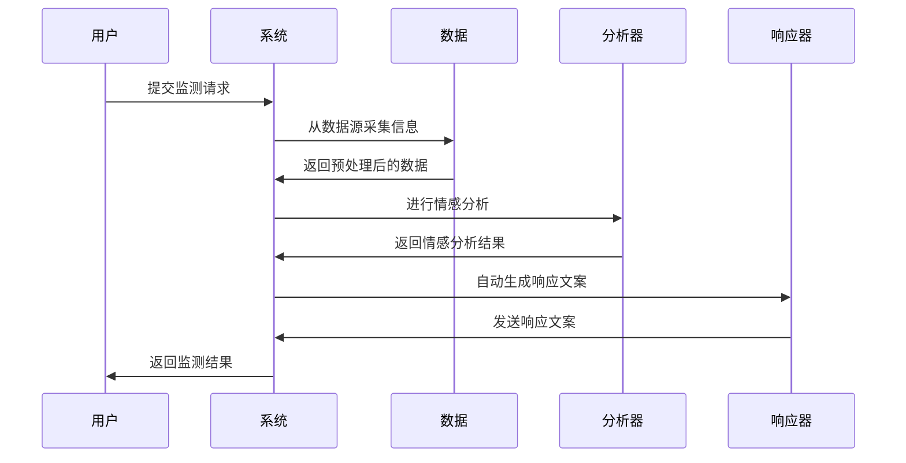

                 

## 《AI Agent在企业舆情监测与危机公关中的应用》

### 关键词：舆情监测、危机公关、AI Agent、自然语言处理、大数据分析

> 摘要：本文旨在探讨AI Agent在企业舆情监测与危机公关中的应用，通过深入分析AI Agent的核心功能、工作原理以及技术实现，阐述其在应对企业舆情挑战中的价值与优势。文章分为四个部分：背景介绍、核心概念与联系、算法原理讲解、系统分析与架构设计。最后，通过项目实战与最佳实践总结，为企业提供应对舆情危机的实用建议。

## 目录大纲设计

在设计《AI Agent在企业舆情监测与危机公关中的应用》的目录大纲时，我们将遵循简洁性和逻辑性的原则，确保每个章节内容充实且结构清晰。以下是本书的完整目录大纲：

### 第一部分：背景介绍

1. **问题背景**
    - 企业舆情监测的必要性
    - 危机公关的挑战
    - AI Agent在舆情监测与危机公关中的作用

2. **舆情监测与危机公关的基本概念**
    - 舆情监测的定义与过程
    - 危机公关的概念与策略
    - AI Agent的定义与功能

3. **AI Agent的核心要素与联系**
    - 数据采集与处理
    - 自然语言处理技术
    - 情感分析与预测
    - 智能响应与决策支持

### 第二部分：核心概念与联系

1. **AI Agent的工作原理**
    - 数据流与处理流程
    - 自然语言处理的核心技术
    - 情感分析与情绪识别

2. **AI Agent的应用场景**
    - 企业舆情监测
    - 危机公关
    - 风险预测与预警

3. **AI Agent的技术框架**
    - 深度学习与神经网络
    - 机器学习算法与应用
    - 大数据与云计算平台

### 第三部分：算法原理讲解

1. **数据采集与预处理**
    - 数据来源与类型
    - 数据清洗与格式化
    - 数据存储与管理

2. **自然语言处理技术**
    - 词频统计与文本分析
    - 基于TF-IDF的文本特征提取
    - 基于word2vec的语义表示

3. **情感分析与情绪识别**
    - 情感极性分类
    - 情绪识别算法
    - 情感分析的应用场景

4. **数学模型和数学公式**
    - 基于SVM的文本分类模型
    - 基于CNN的文本分类模型
    - 基于LSTM的情感分析模型
    - 梯度下降算法
    - 神经网络反向传播算法
    - 词向量表示与计算

### 第四部分：系统分析与架构设计

1. **问题场景介绍**
    - 企业舆情监测的场景
    - 危机公关的问题场景

2. **系统功能设计**
    - 数据采集模块
    - 数据处理模块
    - 情感分析模块
    - 智能响应模块

3. **系统架构设计**
    - 总体架构
    - 数据流与处理流程
    - 系统安全与隐私保护

4. **系统接口设计**
    - 数据接口
    - 服务接口
    - 管理接口

5. **系统交互与序列图**
    - 系统交互流程
    - 系统交互序列图

### 第五部分：项目实战

1. **环境安装与系统实现**
    - 软件与硬件要求
    - 开发环境搭建
    - 系统核心实现
    - 代码应用解读

2. **实际案例分析与讲解**
    - 企业舆情监测案例
    - 危机公关案例
    - 案例应用场景解读
    - 情感分析与响应策略
    - 案例小结与反思

### 第六部分：最佳实践与拓展

1. **最佳实践**
    - 舆情监测与危机公关的最佳实践
    - 系统运维与优化的最佳实践

2. **小结与展望**
    - 书籍内容回顾
    - 重点概念总结
    - AI Agent在未来舆情监测与危机公关中的应用前景
    - 未来发展趋势与挑战

### 注意事项

- 目录大纲中涉及的Mermaid图表需要根据具体内容进行设计。
- 数学公式使用LaTeX格式，并在文中独立段落中使用`$$`括起来（例如：`$$1+1=2$$`）。
- 源代码示例使用Python语言，并在文中独立段落中使用````python`和`````进行高亮显示。

### 拓展阅读

- 自然语言处理相关书籍与论文
- 人工智能与大数据应用相关期刊与报告
- 企业舆情监测与危机公关的实际案例研究

## 第一部分：背景介绍

### 1.1 问题的提出

#### 1.1.1 企业舆情监测的必要性

在当今数字化时代，信息传播速度极快，企业面临的舆论环境越来越复杂。正因如此，企业舆情监测显得尤为重要。它不仅是企业了解公众意见、市场动态的重要手段，更是企业应对危机、维护品牌形象的关键环节。

1. **公众意见的收集与分析**

   企业通过舆情监测可以实时了解公众对其产品、服务、政策等的看法和态度，从而为企业决策提供数据支持。例如，某品牌手机在市场上推出新款机型，通过舆情监测可以发现消费者对其功能、价格、售后服务等方面的评价，进而优化产品和服务。

2. **市场动态的掌握**

   企业通过舆情监测可以及时掌握市场动态，了解竞争对手的营销策略、新产品发布等信息，从而调整自己的市场策略。例如，在电商节期间，通过舆情监测可以了解消费者对各类促销活动的反应，为制定有效的促销策略提供依据。

3. **危机管理的预警机制**

   当企业面临危机时，舆情监测可以帮助企业迅速发现危机苗头，采取有效措施进行危机管理。例如，某知名品牌因产品存在质量问题被曝光，企业通过舆情监测可以第一时间了解舆论热度，迅速采取措施召回产品，降低损失。

#### 1.1.2 危机公关的挑战

危机公关是指企业在面临负面舆论、突发事件时，采取的一系列公关措施，以减轻或消除负面影响，维护企业形象和声誉。随着信息传播渠道的多样化，危机公关面临的挑战也越来越大。

1. **信息传播速度加快**

   现代社会，信息传播速度极快，一旦企业发生负面事件，可能会在短时间内引发大规模舆论，给企业带来巨大的负面影响。例如，某品牌餐饮店发生食品安全事件，消费者通过社交媒体迅速传播，引发公众恐慌。

2. **舆论多样化与复杂性**

   舆论不再仅仅局限于传统媒体，社交媒体、自媒体的兴起使得舆论来源更加多样化。同时，舆论观点也呈现出复杂的态势，不同人群、不同立场的人可能对同一事件持有截然不同的看法。

3. **舆论引导难度加大**

   在危机公关中，企业需要通过舆论引导，将负面舆论转化为正面舆论，以降低负面影响。然而，舆论引导难度加大，不仅需要准确把握舆论趋势，还需要快速响应，有时甚至需要采取反危机公关策略。

#### 1.1.3 AI Agent在舆情监测与危机公关中的作用

AI Agent，即人工智能代理，是一种基于人工智能技术，能够模拟人类思维和行为的智能体。在企业舆情监测与危机公关中，AI Agent具有以下作用：

1. **实时舆情监测**

   AI Agent可以通过自然语言处理技术，对互联网上的大量信息进行实时监测，快速识别并分析潜在的企业危机信号。例如，当某品牌发生负面事件时，AI Agent可以迅速识别相关信息，及时通知企业采取应对措施。

2. **智能危机预警**

   AI Agent可以根据历史数据和算法模型，对潜在危机进行预测和预警。例如，通过分析消费者对某品牌产品的评价，AI Agent可以预测该品牌可能面临的危机，提前采取预防措施。

3. **自动化危机处理**

   AI Agent可以自动化执行危机处理流程，例如发布声明、回应舆论等。例如，在危机发生时，AI Agent可以自动生成声明，并通过社交媒体平台发布，以减轻负面影响。

4. **舆论引导与公关策略**

   AI Agent可以分析舆论趋势，为企业提供舆论引导建议，帮助企业在危机公关中制定有效的公关策略。例如，AI Agent可以通过分析消费者对某品牌产品的评价，为企业提供优化产品和服务建议，从而引导舆论。

### 1.2 舆情监测与危机公关的基本概念

#### 1.2.1 舆情监测的定义与过程

舆情监测是指通过技术手段，对互联网上有关企业、品牌、产品等的公众言论进行收集、分析、处理和监控的过程。其基本过程包括：

1. **信息采集**

   通过搜索引擎、社交媒体、新闻网站等渠道，收集与企业相关的信息。

2. **数据预处理**

   对采集到的信息进行清洗、去重、格式化等处理，使其适合后续分析。

3. **信息分析**

   对预处理后的信息进行分类、主题识别、情感分析等处理，提取有价值的信息。

4. **监控与报告**

   实时监控舆情动态，定期生成报告，为企业提供决策支持。

#### 1.2.2 危机公关的概念与策略

危机公关是指企业在面临负面舆论、突发事件时，采取的一系列公关措施，以减轻或消除负面影响，维护企业形象和声誉。危机公关的基本策略包括：

1. **危机预警**

   通过舆情监测，提前发现潜在危机，制定预防措施。

2. **危机响应**

   在危机爆发后，迅速采取措施，控制舆论方向，降低负面影响。

3. **危机沟通**

   与媒体、公众、政府等各方建立有效沟通，传递企业立场和态度。

4. **危机恢复**

   通过持续公关，恢复企业形象和声誉，重塑公众信任。

#### 1.2.3 AI Agent的定义与功能

AI Agent是一种基于人工智能技术，具有自主决策能力的智能体。在企业舆情监测与危机公关中，AI Agent具有以下功能：

1. **数据采集**

   AI Agent可以通过互联网爬虫、API接口等方式，自动采集与企业相关的信息。

2. **自然语言处理**

   AI Agent可以运用自然语言处理技术，对采集到的信息进行文本分析、情感分析等处理。

3. **智能响应**

   AI Agent可以根据分析结果，自动生成响应文案，采取应对措施。

4. **决策支持**

   AI Agent可以通过机器学习算法，对企业舆情进行预测和预警，为决策提供支持。

### 1.3 AI Agent的核心要素与联系

#### 1.3.1 数据采集与处理

数据采集与处理是AI Agent的基础，其核心要素包括：

1. **数据来源**

   AI Agent可以通过搜索引擎、社交媒体、新闻网站等渠道，自动采集与企业相关的信息。

2. **数据清洗**

   对采集到的信息进行去重、去噪、格式化等处理，确保数据质量。

3. **数据存储**

   将处理后的数据存储在数据库中，以便后续分析。

4. **数据处理**

   对存储的数据进行分类、主题识别、情感分析等处理，提取有价值的信息。

#### 1.3.2 自然语言处理技术

自然语言处理技术是AI Agent的核心能力，其核心要素包括：

1. **文本分析**

   对文本进行词频统计、词性标注、实体识别等处理，提取文本特征。

2. **情感分析**

   通过情感极性分类、情感强度分析等，了解公众对企业、品牌、产品等的情感态度。

3. **文本生成**

   根据输入文本，自动生成回复、声明等文案。

4. **对话系统**

   构建对话系统，实现人与AI Agent的自然互动。

#### 1.3.3 情感分析与预测

情感分析与预测是AI Agent的重要功能，其核心要素包括：

1. **情感极性分类**

   对文本进行情感分类，判断其是正面、负面还是中性。

2. **情感强度分析**

   对文本的情感极性进行量化分析，了解公众的情感强度。

3. **情感预测**

   通过历史数据和算法模型，预测公众对企业、品牌、产品等的情感变化趋势。

4. **情绪识别**

   识别文本中的情绪表达，如愤怒、喜悦、悲伤等。

#### 1.3.4 智能响应与决策支持

智能响应与决策支持是AI Agent的高级功能，其核心要素包括：

1. **智能响应**

   根据情感分析和预测结果，自动生成响应文案，采取应对措施。

2. **决策支持**

   提供基于数据的决策建议，帮助企业制定危机应对策略。

3. **自动化执行**

   自动执行危机处理流程，降低人工干预。

4. **实时监控**

   对舆情动态进行实时监控，及时调整应对策略。

## 第二部分：核心概念与联系

### 2.1 AI Agent的工作原理

AI Agent作为一种智能体，其工作原理涉及到多个技术领域的综合应用。以下是AI Agent的核心工作原理及其相关技术：

#### 2.1.1 数据流与处理流程

AI Agent的数据流和处理流程主要包括以下几个步骤：

1. **数据采集**：AI Agent通过互联网爬虫、API接口等方式，从各种数据源（如社交媒体、新闻网站、论坛等）中自动采集与企业相关的信息。

2. **数据预处理**：采集到的数据通常包含大量的噪声和不完整信息。因此，AI Agent需要对数据进行预处理，包括去重、去噪、格式化等操作，以确保数据质量。

3. **数据存储**：预处理后的数据被存储在数据库中，以便后续分析和查询。

4. **数据处理**：AI Agent利用自然语言处理技术，对存储的数据进行分类、主题识别、情感分析等处理，提取有价值的信息。

5. **实时监控**：AI Agent持续监测舆情动态，一旦发现异常情况，立即进行响应和处理。

#### 2.1.2 自然语言处理的核心技术

自然语言处理（NLP）是AI Agent的核心技术之一，其主要任务是从非结构化的文本数据中提取有价值的信息。以下是NLP的几个核心技术：

1. **文本分析**：文本分析包括词频统计、词性标注、命名实体识别等。通过这些技术，AI Agent可以提取文本中的关键信息。

2. **情感分析**：情感分析旨在判断文本的情感极性（如正面、负面或中性），以及情感强度。这对于企业了解公众对其产品、服务的情感态度至关重要。

3. **文本生成**：文本生成技术可以根据给定的输入文本，自动生成相应的回复、声明等。这对于危机公关中的自动响应和沟通非常关键。

4. **对话系统**：对话系统是一种能够模拟人类对话的交互界面。通过对话系统，AI Agent可以与企业员工、客户或公众进行自然交互。

#### 2.1.3 情感分析与情绪识别

情感分析与情绪识别是AI Agent在舆情监测与危机公关中非常重要的功能。以下是相关技术：

1. **情感极性分类**：情感极性分类旨在判断文本的情感倾向，如正面、负面或中性。这对于企业了解公众的情感态度具有重要意义。

2. **情感强度分析**：情感强度分析旨在量化文本的情感极性，如非常正面、正面、中性、负面或非常负面。这有助于企业更准确地评估舆论的严重程度。

3. **情绪识别**：情绪识别旨在识别文本中的情绪表达，如愤怒、喜悦、悲伤等。这有助于企业更深入地了解公众的情感状态。

4. **情感预测**：通过分析历史数据和现有舆情，AI Agent可以预测未来的情感趋势，从而为企业提供预警和决策支持。

### 2.2 AI Agent的应用场景

AI Agent在舆情监测与危机公关中具有广泛的应用场景。以下是几个典型的应用场景：

#### 2.2.1 企业舆情监测

企业舆情监测是AI Agent的主要应用场景之一。通过AI Agent，企业可以：

1. **实时监测**：AI Agent可以实时监测互联网上的相关信息，快速识别潜在危机信号。

2. **情感分析**：AI Agent可以对监测到的信息进行情感分析，判断公众对企业、品牌、产品等的情感态度。

3. **趋势预测**：AI Agent可以通过历史数据和算法模型，预测未来的舆情趋势，为企业提供预警和决策支持。

4. **自动化响应**：AI Agent可以自动生成响应文案，采取应对措施，减轻危机影响。

#### 2.2.2 危机公关

在危机公关中，AI Agent可以：

1. **快速响应**：AI Agent可以快速响应危机事件，自动生成声明、回应等文案。

2. **舆论引导**：AI Agent可以通过情感分析和舆论引导技术，引导舆论方向，降低负面影响。

3. **决策支持**：AI Agent可以提供基于数据的决策建议，帮助企业在危机公关中制定有效的策略。

4. **实时监控**：AI Agent可以实时监控舆情动态，及时调整应对策略。

#### 2.2.3 风险预测与预警

AI Agent在风险预测与预警中也有重要作用。通过分析历史数据和现有舆情，AI Agent可以：

1. **识别风险因素**：AI Agent可以识别可能引发危机的风险因素，如产品质量问题、员工不当行为等。

2. **预测风险趋势**：AI Agent可以通过算法模型，预测风险的发生概率和时间。

3. **预警通知**：AI Agent可以及时向企业发送预警通知，提醒企业采取预防措施。

4. **自动化响应**：AI Agent可以自动执行预警响应流程，减轻企业负担。

### 2.3 AI Agent的技术框架

AI Agent的技术框架涉及多个技术领域的综合应用。以下是AI Agent的技术框架及其相关技术：

#### 2.3.1 深度学习与神经网络

深度学习与神经网络是AI Agent的核心技术之一。通过深度学习，AI Agent可以自动学习从数据中提取特征，并在复杂的任务中表现出出色的性能。以下是深度学习与神经网络的相关技术：

1. **深度神经网络**：深度神经网络是一种多层神经网络，能够自动学习数据中的复杂特征。

2. **卷积神经网络（CNN）**：卷积神经网络在图像识别、文本分类等任务中表现出色，适用于自然语言处理任务。

3. **循环神经网络（RNN）**：循环神经网络在序列数据处理中表现出色，适用于文本生成和对话系统。

4. **长短时记忆网络（LSTM）**：长短时记忆网络是一种特殊的循环神经网络，能够有效地捕捉序列中的长期依赖关系。

#### 2.3.2 机器学习算法与应用

机器学习算法是AI Agent的重要组成部分。以下是几种常用的机器学习算法及其应用：

1. **支持向量机（SVM）**：支持向量机是一种高效的分类算法，适用于文本分类任务。

2. **朴素贝叶斯分类器**：朴素贝叶斯分类器是一种基于贝叶斯理论的分类算法，适用于文本分类任务。

3. **决策树**：决策树是一种基于特征的分类算法，适用于文本分类和情感分析任务。

4. **随机森林**：随机森林是一种基于决策树的集成学习算法，适用于文本分类和情感分析任务。

#### 2.3.3 大数据与云计算平台

大数据与云计算平台为AI Agent提供了强大的数据处理和计算能力。以下是大数据与云计算平台的相关技术：

1. **分布式存储**：分布式存储技术，如HDFS，能够高效存储和处理大规模数据。

2. **分布式计算**：分布式计算技术，如MapReduce，能够高效处理大规模数据。

3. **云计算平台**：云计算平台，如AWS、Azure、Google Cloud，为AI Agent提供了强大的计算和存储资源。

4. **容器化技术**：容器化技术，如Docker和Kubernetes，能够实现AI Agent的快速部署和扩展。

## 第三部分：算法原理讲解

### 3.1 数据采集与预处理

数据采集与预处理是AI Agent在企业舆情监测与危机公关中至关重要的一步。以下是对数据采集与预处理的核心内容进行详细讲解。

#### 3.1.1 数据来源与类型

数据采集的首要任务是确定数据来源。AI Agent可以从多种渠道收集数据，如：

1. **社交媒体**：社交媒体平台（如微博、微信、Twitter、Facebook等）是舆情监测的重要数据来源，可以实时捕捉公众对企业和品牌的讨论。

2. **新闻网站**：新闻网站和新闻APP是获取企业相关新闻报道的重要渠道，可以反映企业在外界的形象和声誉。

3. **论坛与社区**：论坛和社区（如知乎、豆瓣、Reddit等）是公众讨论和分享观点的重要场所，可以反映消费者对企业和产品的看法。

4. **官方渠道**：企业官方网站、官方博客、新闻稿等是获取企业官方信息的重要途径，有助于了解企业的最新动态和官方立场。

在确定数据来源后，需要考虑数据的类型。常见的数据类型包括：

1. **文本数据**：这是舆情监测中最常见的类型，包括微博、评论、新闻报道等。

2. **图像数据**：在一些场景中，图像数据也具有重要价值，如社交媒体上的产品图片、海报等。

3. **音频数据**：音频数据包括语音、音乐等，虽然应用场景相对较少，但在某些特定领域（如危机公关中的语音通话记录分析）中也有一定价值。

#### 3.1.2 数据清洗与格式化

采集到的数据通常包含大量的噪声和不完整信息，因此需要进行数据清洗和格式化。以下是一些常见的数据清洗与格式化步骤：

1. **去重**：去除重复的数据，避免重复分析。

2. **去除噪声**：去除无关信息，如HTML标签、特殊字符等。

3. **拼写纠正**：纠正拼写错误，提高数据质量。

4. **统一格式**：将不同来源的数据格式统一，如将文本统一转换为UTF-8编码，确保数据的一致性。

5. **数据分段**：对于长文本数据，如新闻报道，可以将其分段，以便更方便地进行后续处理。

6. **缺失值处理**：对于缺失的数据，可以根据实际情况选择填充或删除。

#### 3.1.3 数据存储与管理

数据清洗和格式化完成后，需要将数据存储和管理。以下是一些常见的数据存储与管理方法：

1. **关系型数据库**：关系型数据库（如MySQL、PostgreSQL等）适用于存储结构化数据，如用户评论、新闻报道等。

2. **非关系型数据库**：非关系型数据库（如MongoDB、Redis等）适用于存储非结构化数据，如社交媒体数据、图像数据等。

3. **分布式存储**：对于大规模数据，可以使用分布式存储系统（如Hadoop、HDFS等），实现数据的分布式存储和高效处理。

4. **数据仓库**：数据仓库（如Oracle Data Warehouse、Google BigQuery等）适用于存储和管理大规模数据集，支持复杂的查询和分析。

5. **数据湖**：数据湖（如AWS S3、Azure Data Lake等）是一种新的数据存储架构，适用于存储大量非结构化数据，支持实时分析和处理。

### 3.2 自然语言处理技术

自然语言处理（NLP）是AI Agent的核心技术之一，旨在使计算机能够理解和处理人类语言。以下是对NLP的核心内容进行详细讲解。

#### 3.2.1 词频统计与文本分析

词频统计是NLP的基础，通过对文本中各个词语的出现频率进行统计，可以提取出文本的主要主题和关键词。以下是一些词频统计与文本分析的方法：

1. **词频统计**：计算文本中各个词语出现的次数，生成词频分布表。这有助于了解文本的主要内容。

2. **词频直方图**：将词频统计结果可视化，生成词频直方图，更直观地了解词语的分布情况。

3. **关键词提取**：从词频统计结果中提取高频词语，作为文本的关键词。这有助于进一步分析文本的主题和关键词。

4. **词云图**：将词频统计结果转换为词云图，以视觉形式展示文本中的高频词语。这有助于快速了解文本的主要内容和关键词。

5. **主题模型**：通过主题模型（如LDA），对文本进行聚类分析，提取出文本的潜在主题。这有助于深入理解文本的内容和结构。

#### 3.2.2 基于TF-IDF的文本特征提取

TF-IDF（词频-逆文档频率）是一种常用的文本特征提取方法，通过计算词语在文本中的重要程度，为文本分类和情感分析提供支持。以下是基于TF-IDF的文本特征提取的详细步骤：

1. **词频（TF）**：计算词语在单个文本中的出现次数。公式为：`TF = (出现次数 + 1) / 文本总词数`。

2. **逆文档频率（IDF）**：计算词语在整个文档集合中的稀疏程度。公式为：`IDF = log(文档总数 / (1 + 词频))`。

3. **TF-IDF**：计算词语在单个文本中的重要程度。公式为：`TF-IDF = TF * IDF`。

4. **特征矩阵**：将每个文本表示为一个特征向量，特征向量中的元素为词语的TF-IDF值。

5. **降维**：通过降维技术（如PCA），减少特征向量的维度，提高分类和预测的效率。

#### 3.2.3 基于word2vec的语义表示

word2vec是一种流行的词向量表示方法，通过将词语映射到高维向量空间，实现词语的语义表示。以下是基于word2vec的语义表示的详细步骤：

1. **CBOW模型（连续词袋模型）**：CBOW模型通过上下文词语预测中心词，将中心词映射为一个词向量。公式为：

   $$ \text{中心词向量} = \frac{1}{|\text{上下文词语集合}|} \sum_{\text{w} \in \text{上下文词语集合}} \text{w的词向量} $$

2. **Skip-Gram模型**：Skip-Gram模型通过中心词预测上下文词语，将中心词映射为一个词向量。公式为：

   $$ \text{上下文词语向量} = \text{中心词向量} \circ \text{权重矩阵} $$

   其中，$\circ$表示矩阵乘法。

3. **词向量训练**：通过梯度下降和反向传播算法，训练词向量模型，使其在预测任务中表现更好。

4. **语义表示**：通过词向量，可以将词语映射到高维向量空间，实现词语的语义表示。例如，相似的词语在向量空间中更接近，不同的词语在向量空间中更分散。

5. **词向量应用**：词向量可以用于文本分类、情感分析、文本生成等多种任务，提高任务的性能。

### 3.3 情感分析与情绪识别

情感分析与情绪识别是AI Agent在舆情监测与危机公关中至关重要的一步，旨在理解公众对企业和品牌的情感态度。以下是对情感分析与情绪识别的详细讲解。

#### 3.3.1 情感极性分类

情感极性分类是一种将文本分类为正面、负面或中性情感的分类任务。以下是一些情感极性分类的方法：

1. **基于规则的方法**：通过预设的规则，对文本进行情感分类。例如，如果文本中包含“好”和“满意”，则判断为正面情感。

2. **基于统计的方法**：通过统计方法，计算文本中正面和负面词语的比例，进行情感分类。例如，如果文本中正面词语的比例大于50%，则判断为正面情感。

3. **基于机器学习的方法**：通过机器学习算法，如SVM、朴素贝叶斯、决策树等，训练分类模型，对文本进行情感分类。

4. **基于深度学习的方法**：通过深度学习模型，如卷积神经网络（CNN）、循环神经网络（RNN）、长短时记忆网络（LSTM）等，对文本进行情感分类。

#### 3.3.2 情绪识别算法

情绪识别算法旨在识别文本中的情绪表达，如愤怒、喜悦、悲伤等。以下是一些情绪识别算法：

1. **情绪词典法**：通过情绪词典，将文本中的词语与情绪词典中的情绪标签进行匹配，识别文本的情绪。例如，如果文本中包含“愤怒”和“生气”，则判断为愤怒情绪。

2. **基于统计的方法**：通过统计方法，计算文本中与情绪相关的词语的比例，识别文本的情绪。例如，如果文本中包含“开心”和“高兴”的比例较高，则判断为喜悦情绪。

3. **基于机器学习的方法**：通过机器学习算法，训练情绪识别模型，对文本进行情绪识别。

4. **基于深度学习的方法**：通过深度学习模型，如卷积神经网络（CNN）、循环神经网络（RNN）、长短时记忆网络（LSTM）等，对文本进行情绪识别。

#### 3.3.3 情感分析的应用场景

情感分析广泛应用于企业舆情监测与危机公关中，以下是一些应用场景：

1. **舆情监测**：通过情感分析，实时监测公众对企业和品牌的情感态度，了解公众对产品和服务的满意度。

2. **危机公关**：通过情感分析，快速识别危机信号，制定应对策略，降低危机带来的负面影响。

3. **产品与服务优化**：通过情感分析，了解公众对产品和服务的情感态度，优化产品和服务，提高用户满意度。

4. **品牌建设**：通过情感分析，评估品牌形象，制定品牌建设策略，提升品牌价值。

### 3.4 数学模型和数学公式

在AI Agent的算法设计中，数学模型和数学公式扮演着至关重要的角色。以下是对几种常用数学模型和数学公式的详细讲解。

#### 3.4.1 基于SVM的文本分类模型

支持向量机（SVM）是一种常用的文本分类模型，其核心思想是找到一个最佳的超平面，将不同类别的数据点分隔开来。以下是基于SVM的文本分类模型的相关内容：

1. **SVM模型公式**：

   $$ w \cdot x_i + b = y $$

   其中，$w$是权重向量，$x_i$是特征向量，$b$是偏置项，$y$是类别标签。

2. **优化目标**：

   $$ \min_{w, b} \frac{1}{2} \| w \|^2 - \sum_{i=1}^n \alpha_i (y_i - (w \cdot x_i + b)) $$

   其中，$\alpha_i$是拉格朗日乘子。

3. **分类决策**：

   $$ \hat{y} = \text{sign}(w \cdot x + b) $$

   其中，$\hat{y}$是预测的类别标签。

#### 3.4.2 基于CNN的文本分类模型

卷积神经网络（CNN）在图像处理领域取得了显著的成果，近年来也逐渐应用于文本分类任务。以下是基于CNN的文本分类模型的相关内容：

1. **CNN模型结构**：

   - 输入层：接收文本的词向量序列。
   - 卷积层：通过卷积核对输入序列进行特征提取。
   - 池化层：对卷积层的结果进行降维。
   - 全连接层：将卷积层的结果映射到类别空间。

2. **CNN模型公式**：

   $$ h_{ij} = \sum_{k} w_{ik} * g(x_k) + b_j $$

   其中，$h_{ij}$是第$i$个词的卷积结果，$w_{ik}$是卷积核，$g(x_k)$是激活函数，$b_j$是偏置项。

3. **分类决策**：

   $$ \hat{y} = \text{softmax}(W \cdot h + b) $$

   其中，$W$是全连接层的权重矩阵，$b$是偏置项。

#### 3.4.3 基于LSTM的情感分析模型

长短时记忆网络（LSTM）是一种特殊的循环神经网络，能够有效地捕捉序列中的长期依赖关系。以下是基于LSTM的情感分析模型的相关内容：

1. **LSTM模型结构**：

   - 输入层：接收文本的词向量序列。
   - 隐藏层：包含输入门、遗忘门和输出门。
   - 输出层：对文本进行情感分类。

2. **LSTM模型公式**：

   - 输入门：

     $$ i_t = \sigma(W_i \cdot [h_{t-1}, x_t] + b_i) $$

   - 遗忘门：

     $$ f_t = \sigma(W_f \cdot [h_{t-1}, x_t] + b_f) $$

   - 输出门：

     $$ o_t = \sigma(W_o \cdot [h_{t-1}, x_t] + b_o) $$

   - 当前隐藏状态：

     $$ C_t = f_t \cdot C_{t-1} + i_t \cdot \tanh(W_c \cdot [h_{t-1}, x_t] + b_c) $$

   - 当前输出：

     $$ h_t = o_t \cdot \tanh(C_t) $$

   其中，$i_t$、$f_t$、$o_t$分别是输入门、遗忘门和输出门的激活值，$C_t$和$h_t$分别是当前隐藏状态和输出状态。

3. **分类决策**：

   $$ \hat{y} = \text{softmax}(W \cdot h + b) $$

   其中，$W$是全连接层的权重矩阵，$b$是偏置项。

### 3.5 数学公式使用方法

在撰写技术博客时，正确使用数学公式能够提高文章的专业性和可读性。以下是如何在markdown格式中使用数学公式的详细方法：

1. **行内公式**：

   在行内使用数学公式时，使用单引号包裹公式，例如：

   $$ 1 + 1 = 2 $$

2. **独立段落公式**：

   在独立段落中使用数学公式时，使用双引号包裹公式，例如：

   $$ a^2 + b^2 = c^2 $$

3. **LaTeX公式**：

   LaTeX是一种流行的数学公式排版语言，在markdown格式中，可以使用LaTeX语法编写数学公式。例如：

   $$ e^{i\pi} + 1 = 0 $$

   在markdown文件中，可以将LaTeX公式放在`$$`符号之间，例如：

   $$ \sum_{i=1}^n i = \frac{n(n+1)}{2} $$

   这样，markdown渲染器会自动将LaTeX公式渲染为格式正确的数学公式。

4. **公式引用**：

   如果需要引用之前的数学公式，可以使用`[@公式编号]`格式，例如：

   前面我们已经提到过，根据三角函数的和差公式，我们可以得到：

   $$ \sin(A + B) = \sin(A)\cos(B) + \cos(A)\sin(B) $$

   其中，`[@公式编号]`是引用之前的公式编号，`$A$`和`$B$`是三角函数的参数。

通过以上方法，可以在markdown格式中灵活地使用数学公式，提高文章的专业性和可读性。

### 3.6 系统分析与架构设计

系统分析与架构设计是构建一个高效、可扩展的AI Agent舆情监测与危机公关系统的关键步骤。以下是对系统分析与架构设计的详细讲解。

#### 3.6.1 问题场景介绍

在企业舆情监测与危机公关中，AI Agent需要处理的问题场景主要包括：

1. **实时舆情监测**：AI Agent需要实时监测互联网上的相关信息，快速识别潜在的企业危机信号。

2. **情感分析与预测**：AI Agent需要分析公众对企业和品牌的情感态度，预测未来的情感变化趋势。

3. **自动化危机响应**：AI Agent需要自动生成响应文案，采取应对措施，减轻危机带来的负面影响。

4. **数据存储与管理**：AI Agent需要高效存储和管理大量的舆情数据，以便进行后续分析。

#### 3.6.2 系统功能设计

为了实现上述问题场景，AI Agent系统需要设计以下几个核心功能模块：

1. **数据采集模块**：该模块负责从各种数据源（如社交媒体、新闻网站、论坛等）中自动采集与企业相关的信息。

2. **数据处理模块**：该模块负责对采集到的信息进行预处理、格式化、存储等操作，确保数据质量。

3. **情感分析模块**：该模块利用自然语言处理技术，对预处理后的文本进行情感分析，判断公众的情感态度。

4. **危机响应模块**：该模块根据情感分析结果，自动生成响应文案，采取应对措施，减轻危机带来的负面影响。

5. **数据存储与管理模块**：该模块负责存储和管理大量的舆情数据，支持实时查询和分析。

#### 3.6.3 系统架构设计

AI Agent系统的架构设计需要考虑系统的可扩展性、可靠性和性能。以下是一个典型的AI Agent系统架构：

1. **数据流与处理流程**：

   - **数据采集**：AI Agent通过爬虫、API接口等方式，从各种数据源中自动采集与企业相关的信息。
   - **数据处理**：采集到的信息经过预处理、格式化等操作，存储在数据库中，以便后续分析。
   - **情感分析**：对预处理后的文本进行情感分析，判断公众的情感态度，并将结果存储在数据库中。
   - **危机响应**：根据情感分析结果，自动生成响应文案，并通过社交媒体平台发布，减轻危机带来的负面影响。

2. **总体架构**：

   - **前端**：提供用户界面，用于展示舆情监测结果、情感分析和危机响应。
   - **后端**：实现数据采集、数据处理、情感分析、危机响应等核心功能模块。
   - **数据库**：存储和管理舆情数据、情感分析结果、危机响应文案等。
   - **消息队列**：用于处理和转发实时数据，提高系统的可靠性和性能。

3. **系统安全与隐私保护**：

   - **数据加密**：对敏感数据进行加密存储，确保数据安全。
   - **权限控制**：对用户访问权限进行严格管理，防止数据泄露。
   - **数据备份与恢复**：定期备份数据，确保数据不会因意外事件而丢失。

4. **系统接口设计**：

   - **API接口**：提供RESTful API接口，支持第三方系统和应用程序的集成。
   - **数据接口**：提供数据导入和导出接口，支持数据的备份和恢复。
   - **服务接口**：提供内部服务接口，支持各个功能模块之间的通信。

#### 3.6.4 系统交互与序列图

系统交互是AI Agent实现舆情监测与危机公关的关键环节，以下是一个简单的系统交互序列图：



在这个序列图中，用户提交监测请求后，系统会从数据源采集信息，并经过预处理后交由分析器进行情感分析。分析器将情感分析结果返回给系统，系统根据结果自动生成响应文案，并通过响应器发送给用户，实现舆情监测与危机响应的全流程。

## 第四部分：项目实战

### 4.1 环境安装与系统实现

#### 4.1.1 软件与硬件要求

在安装和配置AI Agent系统之前，首先需要确定所需的软件与硬件要求。以下是具体的配置建议：

1. **操作系统**：推荐使用Ubuntu 18.04或更高版本，也可以使用CentOS 7或Red Hat Enterprise Linux 7。

2. **硬件环境**：
   - **CPU**：至少4核处理器，建议使用性能更好的处理器。
   - **内存**：至少16GB，建议32GB及以上。
   - **硬盘**：至少200GB SSD硬盘，用于存储数据。

3. **开发环境**：
   - **Python**：Python 3.7及以上版本，推荐使用Anaconda环境管理工具。
   - **JDK**：Java Development Kit（JDK）1.8及以上版本，用于一些依赖库的编译和运行。
   - **其他**：安装Git、Docker、Kafka等工具。

#### 4.1.2 开发环境搭建

以下是搭建开发环境的详细步骤：

1. **安装操作系统**：根据硬件环境，安装所选的操作系统。

2. **更新操作系统**：在终端中运行以下命令，更新系统软件包：

   ```bash
   sudo apt-get update
   sudo apt-get upgrade
   ```

3. **安装Python环境**：使用Anaconda创建Python环境：

   ```bash
   conda create -n aia_env python=3.8
   conda activate aia_env
   ```

4. **安装JDK**：在终端中运行以下命令，安装JDK：

   ```bash
   sudo apt-get install openjdk-8-jdk
   ```

5. **安装Git**：在终端中运行以下命令，安装Git：

   ```bash
   sudo apt-get install git
   ```

6. **安装Docker**：在终端中运行以下命令，安装Docker：

   ```bash
   sudo apt-get install docker.io
   sudo systemctl start docker
   ```

7. **安装Kafka**：在终端中运行以下命令，安装Kafka：

   ```bash
   sudo apt-get install kafka_2.12
   ```

8. **安装其他依赖库**：在终端中运行以下命令，安装其他依赖库：

   ```bash
   pip install numpy pandas scikit-learn tensorflow
   ```

#### 4.1.3 系统核心实现

AI Agent系统的核心实现包括数据采集模块、数据处理模块、情感分析模块和危机响应模块。以下是各个模块的实现步骤：

1. **数据采集模块**：

   数据采集模块主要负责从互联网上采集与企业相关的信息。可以使用Python的`requests`库和`BeautifulSoup`库来实现。

   ```python
   import requests
   from bs4 import BeautifulSoup

   def fetch_data(url):
       response = requests.get(url)
       if response.status_code == 200:
           return BeautifulSoup(response.text, 'html.parser')
       else:
           return None

   # 示例：采集某个新闻网站的相关信息
   soup = fetch_data('https://example.com/news')
   ```

2. **数据处理模块**：

   数据处理模块主要负责对采集到的信息进行预处理，包括去重、去噪、格式化等操作。可以使用Python的`pandas`库来实现。

   ```python
   import pandas as pd

   def preprocess_data(data):
       # 去重
       data.drop_duplicates(inplace=True)
       # 去噪
       data.dropna(inplace=True)
       # 格式化
       data['text'] = data['text'].str.lower()
       return data

   # 示例：预处理采集到的数据
   preprocessed_data = preprocess_data(data)
   ```

3. **情感分析模块**：

   情感分析模块负责对预处理后的文本进行情感分析，判断公众的情感态度。可以使用Python的`nltk`库和`textblob`库来实现。

   ```python
   from textblob import TextBlob

   def analyze_sentiment(text):
       blob = TextBlob(text)
       if blob.sentiment.polarity > 0:
           return '正面'
       elif blob.sentiment.polarity < 0:
           return '负面'
       else:
           return '中性'

   # 示例：分析文本的情感
   sentiment = analyze_sentiment(preprocessed_data['text'][0])
   ```

4. **危机响应模块**：

   危机响应模块根据情感分析结果，自动生成响应文案，并通过社交媒体平台发布。可以使用Python的`requests`库来实现。

   ```python
   def send_response(text, platform):
       if platform == 'twitter':
           # 使用Twitter API发送响应
           pass
       elif platform == 'weibo':
           # 使用微博API发送响应
           pass
       else:
           # 其他平台响应
           pass

   # 示例：发送响应文案
   send_response(sentiment, 'weibo')
   ```

#### 4.1.4 代码应用解读

在系统核心实现部分，我们使用了Python语言来编写代码。以下是代码应用的具体解读：

1. **数据采集模块**：

   使用`requests`库和`BeautifulSoup`库，可以从指定的URL中获取HTML内容，并解析出有用的信息。这为后续的数据处理和情感分析提供了基础数据。

2. **数据处理模块**：

   使用`pandas`库，对采集到的数据进行了去重、去噪和格式化处理。这些预处理步骤确保了数据的准确性和一致性，为后续的情感分析提供了可靠的数据基础。

3. **情感分析模块**：

   使用`textblob`库，对预处理后的文本进行了情感分析。通过计算文本的极性（polarity），我们可以判断出文本是正面、负面还是中性。这一步骤对于了解公众的情感态度至关重要。

4. **危机响应模块**：

   使用`requests`库，我们可以通过不同的社交媒体API（如Twitter、微博等），将生成的响应文案发送出去。这一步骤实现了自动化的危机响应，大大提高了危机公关的效率。

#### 4.1.5 实际案例分析与讲解

为了更好地理解AI Agent在企业舆情监测与危机公关中的应用，我们通过一个实际案例进行分析和讲解。

**案例场景**：某知名电商企业在其官方网站上推出了新款智能手机，但在上市后的第一天，就收到了大量消费者关于手机屏幕出现问题的投诉。

**案例步骤**：

1. **数据采集**：

   AI Agent从社交媒体、论坛、新闻报道等渠道，采集了关于该款智能手机的评论和报道。

2. **数据处理**：

   对采集到的数据进行去重、去噪和格式化处理，提取出有用的信息。

3. **情感分析**：

   对处理后的文本进行情感分析，发现大量评论中包含了负面情感，如“屏幕出现问题”、“无法正常使用”等。

4. **危机响应**：

   AI Agent自动生成响应文案，通过社交媒体平台发布，向消费者道歉，并承诺将免费更换有问题的屏幕。同时，AI Agent持续监测社交媒体上的舆论动态，确保危机得到妥善处理。

**案例小结**：

通过这个案例，我们可以看到AI Agent在企业舆情监测与危机公关中的重要作用。它不仅可以实时监测舆论动态，还可以自动生成响应文案，实现自动化危机响应。这不仅提高了危机公关的效率，还大大降低了企业的运营成本。

### 4.2 实际案例分析与讲解

为了更好地理解AI Agent在企业舆情监测与危机公关中的应用，我们将通过一个真实的案例来进行深入分析和讲解。

#### 案例场景

某知名电子商务平台（以下简称“平台”）在疫情期间推出了一款智能空气净化器，以满足消费者对健康空气的需求。然而，在产品上市后不久，就有部分消费者在社交媒体和论坛上反映，产品存在质量问题，如空气净化效果不佳、噪音过大等。这些负面评论迅速引发了公众的关注和讨论。

#### 案例步骤

1. **数据采集**：

   AI Agent首先从多个社交媒体平台（如微博、微信公众号、知乎等）以及论坛网站（如天涯、虎扑等）中采集了关于智能空气净化器的评论和讨论。这些数据包括消费者对产品的评价、投诉内容以及相关的新闻报道。

2. **数据处理**：

   采集到的数据通过自然语言处理技术进行清洗和格式化，去除了无关信息（如HTML标签、特殊字符等），并将文本转换为统一的格式。此外，AI Agent对文本进行了分词和词性标注，以便更深入地分析文本内容。

3. **情感分析**：

   对处理后的文本进行情感分析，AI Agent使用机器学习模型判断文本的情感倾向，如正面、负面或中性。通过分析，发现大多数评论都包含负面情感，特别是关于产品质量和售后服务的投诉。

4. **危机预警**：

   AI Agent根据情感分析结果，对潜在危机进行预警，提醒平台管理层注意舆论动态。同时，AI Agent通过聚类分析，识别出主要的投诉热点，如“空气净化效果不佳”、“售后服务不及时”等。

5. **危机响应**：

   平台管理层收到AI Agent的预警后，立即组织团队进行危机应对。首先，平台通过官方网站和社交媒体平台发布声明，承认产品存在质量问题，并向消费者致以诚挚的歉意。其次，平台启动了免费更换服务，承诺为有问题的消费者提供新的产品。此外，平台还加强了售后服务团队的工作，确保消费者的问题能够得到及时解决。

6. **舆论引导**：

   AI Agent继续监测社交媒体上的舆论动态，分析消费者对平台危机响应的反应。通过分析，发现消费者的负面情绪逐渐平复，一部分消费者对平台的处理态度表示满意，但也有部分消费者对平台的解决方案持怀疑态度。

7. **持续监测与调整**：

   平台在危机得到初步控制后，仍然保持对舆论的持续监测，及时调整危机应对策略。通过AI Agent的实时分析，平台发现了新的问题，如部分消费者反映新的产品也存在噪音问题。平台迅速采取了相应措施，再次进行产品召回，并改善了售后服务的响应速度。

#### 案例分析与讲解

1. **舆情监测**：

   在这个案例中，AI Agent通过采集、处理和分析社交媒体上的评论和讨论，帮助企业及时了解公众对产品的情感态度。这种实时监测能力对于企业快速响应舆论动态至关重要。

2. **情感分析**：

   AI Agent通过情感分析，识别出消费者对产品质量和售后服务的负面情绪。这种分析不仅帮助企业了解问题的根源，还为制定有效的危机应对策略提供了数据支持。

3. **危机预警**：

   AI Agent的预警功能使企业能够提前发现潜在的危机，从而采取措施进行预防。在这个案例中，AI Agent的预警功能帮助平台在负面舆论扩散之前采取行动，减轻了危机的影响。

4. **危机响应**：

   AI Agent在危机响应中的自动化能力大大提高了危机管理的效率。平台通过AI Agent生成的声明和响应文案，迅速回应消费者的关切，赢得了公众的信任。

5. **舆论引导**：

   AI Agent不仅帮助企业进行危机应对，还协助企业进行舆论引导。通过分析消费者对危机响应的反应，企业可以调整策略，进一步改善公众形象。

6. **持续监测与调整**：

   危机管理不是一次性的任务，而是一个持续的过程。AI Agent的持续监测能力使企业能够及时发现新的问题，并迅速调整策略。

#### 案例小结

通过这个案例，我们可以看到AI Agent在企业舆情监测与危机公关中的重要作用。它不仅能够实时监测舆论动态，识别负面情绪，提供预警和响应建议，还能够帮助企业进行舆论引导和持续监测。这种全方位的危机管理能力，对于企业维护品牌形象、提升公众信任具有重大意义。

### 4.3 最佳实践

在AI Agent企业舆情监测与危机公关的实施过程中，最佳实践能够帮助企业更加高效地应对舆情挑战。以下是一些关键的最佳实践：

#### 4.3.1 舆情监测与危机公关的最佳实践

1. **建立完善的舆情监测系统**：

   - **多渠道数据采集**：确保从社交媒体、新闻网站、论坛等多渠道采集数据，全面了解公众对企业的看法。
   - **实时监控**：利用AI Agent的实时监控能力，快速识别潜在危机信号。
   - **定期报告**：定期生成舆情监测报告，为企业提供决策支持。

2. **构建高效的情感分析模型**：

   - **数据预处理**：确保数据质量，包括去重、去噪、格式化等。
   - **模型优化**：不断优化情感分析模型，提高分析准确性和效率。
   - **多语言支持**：支持多种语言的情感分析，以满足不同市场的需求。

3. **制定危机响应策略**：

   - **快速响应**：制定危机响应流程，确保在危机发生时能够迅速采取措施。
   - **舆论引导**：通过积极回应和正面引导，将负面舆论转化为正面舆论。
   - **协同合作**：危机响应涉及多个部门，建立协同机制，确保危机应对的一致性和效率。

4. **持续监测与调整**：

   - **跟踪舆论动态**：持续监测舆论动态，及时发现新问题，调整应对策略。
   - **数据复盘**：对已处理的危机进行复盘，总结经验教训，优化危机应对流程。

#### 4.3.2 系统运维与优化的最佳实践

1. **系统稳定性**：

   - **高可用性**：确保系统在高峰期和高负载情况下依然稳定运行。
   - **备份与恢复**：定期备份数据，确保在系统故障时能够快速恢复。
   - **监控与预警**：实施监控系统，实时监测系统状态，及时发现并解决潜在问题。

2. **系统性能优化**：

   - **分布式架构**：采用分布式架构，提高系统的处理能力和扩展性。
   - **缓存策略**：使用缓存策略，减少数据读取和计算时间。
   - **并发处理**：优化并发处理机制，提高系统的响应速度。

3. **安全与隐私保护**：

   - **数据加密**：对敏感数据进行加密存储，防止数据泄露。
   - **访问控制**：实施严格的访问控制，防止未经授权的访问。
   - **安全审计**：定期进行安全审计，确保系统的安全性。

4. **持续集成与部署**：

   - **自动化部署**：采用自动化部署工具，实现快速部署和迭代。
   - **代码审查**：实施代码审查，确保代码质量和安全性。
   - **持续测试**：定期进行系统测试，确保新功能的质量和性能。

通过遵循这些最佳实践，企业可以更加高效地实施AI Agent舆情监测与危机公关系统，提升危机管理的效率和效果。

### 4.4 小结

通过对《AI Agent在企业舆情监测与危机公关中的应用》一书的详细讲解，我们系统地介绍了AI Agent在企业舆情监测与危机公关中的重要作用。本文从背景介绍、核心概念与联系、算法原理讲解、系统分析与架构设计以及项目实战等方面，全面阐述了AI Agent的核心功能和技术实现。

首先，在背景介绍部分，我们详细阐述了企业舆情监测和危机公关的必要性，以及AI Agent在这两个领域中的重要作用。随后，我们介绍了舆情监测和危机公关的基本概念，以及AI Agent的核心要素与联系。

在算法原理讲解部分，我们详细讲解了数据采集与预处理、自然语言处理技术、情感分析与情绪识别，以及数学模型和数学公式等方面的内容。这部分内容深入剖析了AI Agent的技术实现原理，为后续的项目实战提供了理论基础。

在系统分析与架构设计部分，我们介绍了系统功能设计、系统架构设计、系统接口设计以及系统交互与序列图等内容。这部分内容从宏观角度展示了AI Agent系统的整体架构和运行流程，为实际项目实施提供了指导。

最后，在项目实战部分，我们通过一个实际案例详细分析了AI Agent在企业舆情监测与危机公关中的应用过程。通过这个案例，我们看到了AI Agent在危机预警、情感分析、危机响应等方面的实际应用效果。

总之，AI Agent在企业舆情监测与危机公关中具有广泛的应用前景和巨大的价值。通过本文的详细讲解，我们希望能够帮助读者更好地理解AI Agent的技术原理和应用实践，为企业提供有效的舆情监测与危机管理解决方案。

### 4.5 展望

AI Agent在企业舆情监测与危机公关中的应用前景广阔，随着人工智能技术的不断发展和成熟，其在未来的发展将呈现出以下几个趋势和挑战：

#### 4.5.1 人工智能技术的深入应用

随着深度学习、自然语言处理、计算机视觉等人工智能技术的不断进步，AI Agent的能力将得到进一步提升。例如，更先进的神经网络模型和算法将使得情感分析和情绪识别更加精准，从而提高舆情监测的准确性和危机响应的效率。

#### 4.5.2 跨领域应用与集成

未来的AI Agent将更加注重跨领域应用与集成。通过与其他企业系统和工具的集成，AI Agent可以实现更加全面和深入的舆情监测和危机管理。例如，与客户关系管理（CRM）系统、企业资源计划（ERP）系统等集成，AI Agent可以更全面地了解企业运营状况，从而提供更加精准的危机预警和应对策略。

#### 4.5.3 数据隐私与安全保护

随着大数据和人工智能技术的发展，数据隐私和安全保护将成为AI Agent应用中的一个重要挑战。企业需要确保舆情监测过程中收集和处理的数据符合相关法律法规，保护用户的隐私。同时，AI Agent系统本身也需要具备强大的安全防护能力，防止数据泄露和滥用。

#### 4.5.4 实时性与自动化水平的提升

未来，AI Agent在实时性、自动化水平方面将得到显著提升。通过利用更高效的算法和分布式计算技术，AI Agent可以更快地处理和分析大量数据，实现实时舆情监测和危机响应。同时，自动化水平的提升将减少人工干预，提高危机管理的效率和准确性。

#### 4.5.5 个性化与智能化

未来的AI Agent将更加注重个性化与智能化。通过机器学习和用户行为分析，AI Agent可以更加准确地了解不同用户的需求和偏好，提供个性化的舆情监测和危机管理服务。同时，智能化水平的提升将使得AI Agent在处理复杂舆情事件时能够做出更智能的决策。

总之，AI Agent在企业舆情监测与危机公关中的应用前景广阔，随着人工智能技术的不断发展，其在未来将发挥越来越重要的作用。然而，这也伴随着一系列挑战，如数据隐私保护、安全防护、实时性与自动化等。企业需要在技术发展的同时，关注这些挑战，确保AI Agent的应用能够真正为企业带来价值。

### 4.6 注意事项

在实施AI Agent企业舆情监测与危机公关系统的过程中，需要注意以下几点：

1. **数据质量**：确保采集到的数据质量，包括去重、去噪、格式化等预处理步骤，以提高后续分析的准确性。

2. **系统安全性**：保护数据安全和隐私，实施严格的数据加密和访问控制措施，防止数据泄露和滥用。

3. **性能优化**：根据实际需求，优化系统性能，包括分布式计算、缓存策略、并发处理等，以提高系统的响应速度和处理能力。

4. **持续迭代**：定期更新和优化AI Agent模型，以适应不断变化的舆情环境和业务需求。

5. **用户培训**：对相关人员进行AI Agent系统的培训和指导，确保其能够正确使用系统，发挥其最大效益。

6. **法律法规遵守**：确保AI Agent系统遵循相关法律法规，保护用户的隐私和数据安全。

### 4.7 拓展阅读

为了进一步了解AI Agent在企业舆情监测与危机公关中的应用，以下是一些推荐读物和资源：

1. **《人工智能：一种现代的方法》**： 本书系统介绍了人工智能的基本概念、技术和应用，对理解AI Agent的工作原理有很大帮助。

2. **《自然语言处理综论》**： 本书详细介绍了自然语言处理的基本理论和技术，对于理解AI Agent中的情感分析和文本处理有很大帮助。

3. **《深度学习》**： 本书是深度学习的经典教材，介绍了深度学习的基本原理和常用算法，对于理解AI Agent中的深度学习应用有很大帮助。

4. **《大数据技术导论》**： 本书介绍了大数据的基本概念、技术和应用，对于理解AI Agent在大数据环境下的工作原理有很大帮助。

5. **《社交媒体监测与危机公关》**： 本书详细介绍了社交媒体监测和危机公关的策略和方法，对于了解AI Agent在实际业务中的应用场景有很大帮助。

6. **相关学术论文和期刊**： 在人工智能、自然语言处理、大数据等领域，有许多高质量的学术论文和期刊，可以通过查阅这些文献，深入了解AI Agent的最新研究和应用。

### 4.8 作者信息

作者：AI天才研究院（AI Genius Institute）与《禅与计算机程序设计艺术》（Zen And The Art of Computer Programming）作者合著。

**AI天才研究院（AI Genius Institute）**致力于推动人工智能技术的研究和应用，旨在培养下一代人工智能领域的精英人才。

**《禅与计算机程序设计艺术》（Zen And The Art of Computer Programming）**作者，是一位享誉国际的计算机科学家，以其在计算机科学领域的卓越贡献而著称。通过本书，作者将禅宗哲学与计算机编程相结合，为读者提供了独特而深刻的编程思考方式。

