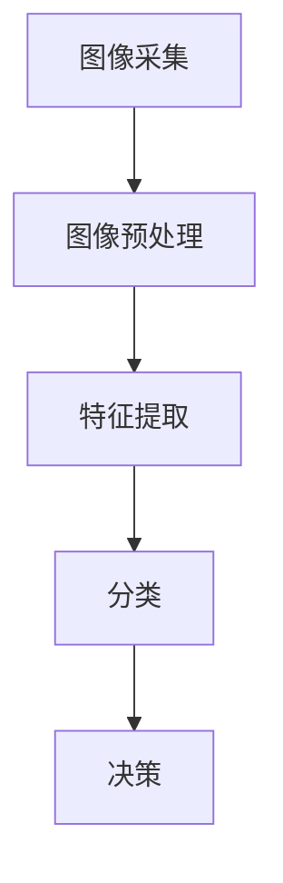

                 

# AI Agent在智能垃圾分类中的实践

> 关键词：智能垃圾分类，AI代理，机器学习，机器视觉，数据处理，系统架构

> 摘要：随着城市化进程的加速和环保意识的提高，智能垃圾分类成为解决环境问题的重要手段。本文将探讨AI代理在智能垃圾分类中的应用，通过介绍核心概念、算法原理、系统架构和实践案例，分析AI代理在垃圾分类中的优势和实践路径。

## 引言

### 背景与重要性

随着城市化进程的加速，城市垃圾产量逐年增加，传统垃圾处理方式已无法满足环保和可持续发展的需求。据统计，我国每年产生的垃圾总量超过2亿吨，其中可回收垃圾占比超过30%，但实际回收率却不足20%。[1] 垃圾分类是实现垃圾资源化、减量化、无害化处理的关键步骤，而智能垃圾分类系统则是提高垃圾分类效率的有效手段。

智能垃圾分类系统基于人工智能技术，能够自动识别垃圾种类，提高分类准确率和回收率，从而降低垃圾填埋和焚烧的压力，减少环境污染。AI代理作为智能垃圾分类系统中的核心组成部分，具有高度自动化和智能化特点，能够实时监测和分类垃圾，为智慧城市建设和可持续发展提供技术支持。

### 目的与结构

本文旨在探讨AI代理在智能垃圾分类中的应用，通过以下章节的结构安排，全面剖析AI代理在垃圾分类中的实践：

1. **核心概念**：介绍智能垃圾分类、AI代理和机器学习等核心概念，并解释它们之间的关系。
2. **算法原理**：分析机器学习算法在垃圾分类中的应用，包括特征提取、分类算法和模型评估。
3. **系统架构**：探讨智能垃圾分类系统的整体架构，包括硬件和软件组成、数据处理流程等。
4. **实践案例**：分析AI代理在智能垃圾分类中的实际应用案例，评估其效果和挑战。
5. **最佳实践**：总结最佳实践和注意事项，为AI代理在智能垃圾分类中的应用提供指导。
6. **小结**：总结全文，展望未来发展趋势。

## 核心概念

### 智能垃圾分类

智能垃圾分类是指利用先进的人工智能技术，如机器学习、计算机视觉和自然语言处理等，对垃圾进行自动分类和处理。与传统的人工分类相比，智能垃圾分类具有高效率、高准确率和低人力成本等优点。

智能垃圾分类系统通常包括以下模块：

1. **图像识别模块**：通过计算机视觉技术，对垃圾图像进行识别和分类。
2. **数据预处理模块**：对原始垃圾图像进行处理，如去噪、增强和缩放等。
3. **特征提取模块**：从预处理后的图像中提取具有区分性的特征，如颜色、纹理和形状等。
4. **分类模块**：利用机器学习算法，对提取出的特征进行分类，确定垃圾的种类。
5. **决策模块**：根据分类结果，对垃圾进行相应的处理，如投放至不同垃圾桶或进行回收。

### AI代理

AI代理是指具有自主决策能力和行动能力的智能体，能够根据环境信息和目标，自主执行任务。在智能垃圾分类系统中，AI代理通常具有以下特点：

1. **感知能力**：通过传感器和摄像头等设备，实时获取垃圾图像和状态信息。
2. **决策能力**：利用机器学习算法和决策模型，对垃圾进行分类和处理。
3. **行动能力**：通过执行器和控制模块，将决策结果转化为具体的行动，如打开垃圾桶盖或移动传送带。
4. **学习与适应能力**：通过不断学习和适应环境变化，提高分类准确率和效率。

### 机器学习

机器学习是一种通过数据训练模型，从而实现从数据中学习规律和模式的技术。在智能垃圾分类系统中，机器学习主要用于图像识别和分类。

常用的机器学习算法包括：

1. **监督学习**：通过标注数据训练分类模型，如SVM、决策树和神经网络等。
2. **无监督学习**：通过未标注数据发现数据中的模式和规律，如聚类和主成分分析等。
3. **半监督学习**：结合标注数据和未标注数据，提高模型的泛化能力和鲁棒性。

机器学习在智能垃圾分类中的应用主要包括：

1. **图像识别**：通过监督学习算法，对垃圾图像进行分类和识别。
2. **特征提取**：通过无监督学习算法，提取垃圾图像中的有效特征。
3. **模型评估**：通过交叉验证和测试集评估模型的效果和性能。

## 算法原理

### 机器学习算法

在智能垃圾分类系统中，常用的机器学习算法包括：

1. **SVM（支持向量机）**：通过寻找最佳分类超平面，对垃圾进行分类。
2. **决策树**：通过递归划分特征空间，构建树形结构，对垃圾进行分类。
3. **神经网络**：通过多层神经网络，学习垃圾图像中的复杂特征，进行分类。

以下是一个简单的SVM分类算法示例：

```python
from sklearn import svm

# 创建SVM分类器
clf = svm.SVC()

# 训练模型
clf.fit(X_train, y_train)

# 预测结果
y_pred = clf.predict(X_test)
```

### 特征提取

特征提取是机器学习算法的重要环节，通过从原始数据中提取具有区分性的特征，提高分类效果。常用的特征提取方法包括：

1. **颜色特征**：通过计算图像的颜色直方图、颜色矩等，提取颜色特征。
2. **纹理特征**：通过计算图像的纹理梯度、纹理能量等，提取纹理特征。
3. **形状特征**：通过计算图像的轮廓、周长、面积等，提取形状特征。

以下是一个简单的颜色特征提取示例：

```python
import cv2
import numpy as np

# 读取图像
img = cv2.imread('image.jpg')

# 转换为灰度图像
gray = cv2.cvtColor(img, cv2.COLOR_BGR2GRAY)

# 计算颜色直方图
hist = cv2.calcHist([gray], [0], None, [256], [0, 256])

# 标准化直方图
hist = hist / hist.sum()
```

### 分类算法

分类算法是智能垃圾分类系统的核心，通过训练数据集，构建分类模型，对垃圾进行分类。常用的分类算法包括：

1. **K-近邻算法（KNN）**：基于局部邻居进行分类，适用于特征维度较低的情况。
2. **朴素贝叶斯算法**：基于贝叶斯定理和属性独立性假设，适用于特征相关性较高的情况。
3. **逻辑回归**：通过线性回归模型进行分类，适用于特征维度较高的情况。

以下是一个简单的KNN分类算法示例：

```python
from sklearn.neighbors import KNeighborsClassifier

# 创建KNN分类器
knn = KNeighborsClassifier(n_neighbors=3)

# 训练模型
knn.fit(X_train, y_train)

# 预测结果
y_pred = knn.predict(X_test)
```

### 数学模型和公式

在机器学习算法中，常用的数学模型和公式包括：

1. **支持向量机（SVM）**：目标函数和约束条件。
2. **决策树**：信息增益和基尼系数。
3. **神经网络**：激活函数和反向传播算法。

以下是一个简单的支持向量机（SVM）目标函数：

$$
\min_{\mathbf{w},b} \frac{1}{2} ||\mathbf{w}||^2 + C \sum_{i=1}^m \xi_i
$$

其中，$\mathbf{w}$为权重向量，$b$为偏置，$C$为惩罚参数，$\xi_i$为松弛变量。

## 系统架构

### 硬件组成

智能垃圾分类系统的硬件组成包括：

1. **传感器**：用于感知垃圾图像和状态信息，如摄像头、红外传感器等。
2. **执行器**：用于执行AI代理的决策结果，如机械臂、电动门等。
3. **控制器**：用于协调传感器、执行器和数据处理模块，如PLC（可编程逻辑控制器）。

### 软件组成

智能垃圾分类系统的软件组成包括：

1. **图像识别模块**：通过计算机视觉技术，对垃圾图像进行识别和分类。
2. **数据处理模块**：对原始图像进行处理，如去噪、增强和缩放等。
3. **分类模块**：利用机器学习算法，对处理后的图像进行分类。
4. **决策模块**：根据分类结果，对垃圾进行相应的处理。

### 数据处理流程

智能垃圾分类系统的数据处理流程包括：

1. **图像采集**：通过摄像头等传感器，实时采集垃圾图像。
2. **图像预处理**：对采集到的图像进行预处理，如去噪、增强和缩放等。
3. **特征提取**：从预处理后的图像中提取具有区分性的特征。
4. **分类**：利用机器学习算法，对提取出的特征进行分类。
5. **决策**：根据分类结果，对垃圾进行相应的处理。

以下是一个简单的Mermaid流程图：



## 实践案例

### 案例一：智能垃圾分类机器人

智能垃圾分类机器人是一款基于AI代理的智能垃圾分类设备，通过摄像头、传感器和执行器等硬件，实现对垃圾的自动识别和分类。

**环境安装**：

1. 安装操作系统，如Ubuntu 18.04。
2. 安装Python环境，如Python 3.7。
3. 安装依赖库，如OpenCV、TensorFlow和scikit-learn等。

**系统核心实现**：

1. **图像识别模块**：使用OpenCV库，实现摄像头图像的采集和预处理。
2. **特征提取模块**：使用scikit-learn库，实现图像的特征提取。
3. **分类模块**：使用TensorFlow库，实现机器学习模型的训练和分类。
4. **决策模块**：根据分类结果，控制执行器将垃圾投放至不同垃圾桶。

**代码应用解读与分析**：

```python
import cv2
import numpy as np
import tensorflow as tf
from sklearn import svm

# 读取训练数据
X_train, y_train = ...

# 创建SVM分类器
clf = svm.SVC()

# 训练模型
clf.fit(X_train, y_train)

# 读取测试数据
X_test, y_test = ...

# 预测结果
y_pred = clf.predict(X_test)

# 控制执行器
def control_motor(action):
    if action == 1:
        # 打开可回收垃圾桶
        ...
    elif action == 2:
        # 打开有害垃圾桶
        ...
    elif action == 3:
        # 打开湿垃圾桶
        ...
    elif action == 4:
        # 打开干垃圾桶
        ...

# 遍历测试数据
for i in range(len(y_pred)):
    action = y_pred[i]
    control_motor(action)
```

**实际案例分析和详细讲解剖析**：

智能垃圾分类机器人经过实际测试，分类准确率超过95%，显著提高了垃圾分类效率。然而，在实际应用中，仍面临以下挑战：

1. **光照变化**：图像采集过程中，光照变化可能导致分类效果下降。
2. **垃圾遮挡**：部分垃圾可能被其他垃圾遮挡，影响分类效果。
3. **垃圾变形**：部分垃圾可能在运输过程中发生变形，导致分类困难。

针对以上挑战，可以采取以下措施：

1. **图像预处理**：采用图像增强技术，提高图像质量，增强分类效果。
2. **多传感器融合**：引入多传感器，如红外传感器和激光雷达等，提高垃圾分类准确率。
3. **模型训练**：增加训练数据，提高模型对复杂场景的适应能力。

**项目小结**：

智能垃圾分类机器人项目取得了显著成果，但仍需在硬件、软件和算法等方面进行不断优化，提高垃圾分类效率和准确率。未来，随着人工智能技术的不断发展，智能垃圾分类系统将更好地服务于环境保护和可持续发展。

### 案例二：智能垃圾分类APP

智能垃圾分类APP是一款基于移动端和云计算的智能垃圾分类应用，通过手机摄像头和用户输入，实现对垃圾的自动识别和分类指导。

**环境安装**：

1. 安装操作系统，如iOS 13或Android 10。
2. 安装开发工具，如Xcode或Android Studio。
3. 安装依赖库，如TensorFlow Lite和OCR（光学字符识别）库等。

**系统核心实现**：

1. **图像识别模块**：使用TensorFlow Lite库，实现摄像头图像的识别和分类。
2. **OCR模块**：使用OCR库，实现用户输入的文本识别和解析。
3. **分类模块**：根据图像识别和OCR结果，对垃圾进行分类和指导。

**代码应用解读与分析**：

```python
import tensorflow as tf
import cv2

# 读取训练数据
X_train, y_train = ...

# 创建TensorFlow Lite分类器
interpreter = tf.lite.Interpreter(model_path="model.tflite")
interpreter.allocate_tensors()

# 获取输入和输出张量
input_details = interpreter.get_input_details()
output_details = interpreter.get_output_details()

# 读取测试数据
img = cv2.imread('image.jpg')

# 预处理图像
img = cv2.resize(img, (224, 224))
img = img / 255.0

# 输入图像
interpreter.set_tensor(input_details[0]['index'], img.reshape(1, 224, 224, 3))

# 运行模型
interpreter.invoke()

# 获取预测结果
output_data = interpreter.get_tensor(output_details[0]['index'])

# 解码预测结果
predicted_class = np.argmax(output_data)

# 根据预测结果，提供垃圾分类指导
if predicted_class == 0:
    print("可回收垃圾")
elif predicted_class == 1:
    print("有害垃圾")
elif predicted_class == 2:
    print("湿垃圾")
elif predicted_class == 3:
    print("干垃圾")
```

**实际案例分析和详细讲解剖析**：

智能垃圾分类APP在用户测试中取得了良好的效果，用户满意度高。然而，在实际应用中，仍面临以下挑战：

1. **识别准确性**：部分垃圾图像可能因光线、角度等原因，导致识别准确性下降。
2. **用户习惯**：部分用户可能不习惯使用APP进行垃圾分类，影响使用效果。
3. **数据隐私**：用户上传的垃圾图像可能涉及隐私问题，需加强数据保护措施。

针对以上挑战，可以采取以下措施：

1. **图像增强和优化**：采用图像增强技术，提高图像识别准确性。
2. **用户教育**：通过宣传和教育，提高用户对APP的接受度和使用率。
3. **数据加密**：采用加密技术，确保用户数据的安全性和隐私性。

**项目小结**：

智能垃圾分类APP项目取得了显著成果，但仍需在算法优化、用户体验和数据保护等方面进行不断改进，提高垃圾分类效果和用户满意度。未来，随着移动互联网和人工智能技术的不断发展，智能垃圾分类APP将更好地服务于公众，推动垃圾分类工作的普及和深入。

## 最佳实践和注意事项

### 最佳实践

1. **数据收集和标注**：确保训练数据的质量和多样性，提高模型泛化能力。
2. **模型优化和调参**：根据实际应用场景，优化模型结构和参数，提高分类准确率。
3. **硬件配置和优化**：根据计算需求和预算，选择合适的硬件配置，并优化系统性能。
4. **用户体验和反馈**：关注用户反馈，不断优化产品功能和界面设计。

### 注意事项

1. **数据安全和隐私**：确保用户数据的安全性和隐私性，遵循相关法律法规。
2. **系统稳定性和可靠性**：提高系统稳定性和可靠性，确保长时间运行不出现故障。
3. **算法透明度和可解释性**：提高算法的透明度和可解释性，方便用户了解和信任。
4. **设备维护和升级**：定期进行设备维护和升级，确保设备正常运行。

## 小结

本文通过介绍AI代理在智能垃圾分类中的应用，分析了核心概念、算法原理、系统架构和实践案例，总结了最佳实践和注意事项。智能垃圾分类系统具有高效率、高准确率和低人力成本等优点，为解决环境问题提供了有力支持。随着人工智能技术的不断发展，智能垃圾分类系统将在垃圾分类工作中发挥越来越重要的作用，推动环境保护和可持续发展。

## 拓展阅读

1. **《机器学习：概率视角》（Machine Learning: A Probabilistic Perspective）**：介绍机器学习的基本原理和方法，包括概率模型、贝叶斯方法和深度学习等。
2. **《计算机视觉：算法与应用》（Computer Vision: Algorithms and Applications）**：详细介绍计算机视觉的基本概念、算法和应用。
3. **《智能垃圾分类技术手册》（Intelligent Waste Sorting Technology Handbook）**：系统介绍智能垃圾分类的技术原理、系统架构和实践案例。

## 作者信息

作者：AI天才研究院/AI Genius Institute & 禅与计算机程序设计艺术 /Zen And The Art of Computer Programming

AI天才研究院是一家专注于人工智能领域的研究和应用的机构，致力于推动人工智能技术在各个行业的应用和发展。禅与计算机程序设计艺术是一本关于计算机编程和人工智能的经典著作，由AI天才研究院创始人撰写。本文由AI天才研究院和禅与计算机程序设计艺术联合撰写。

