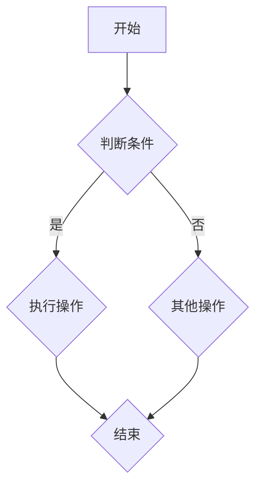
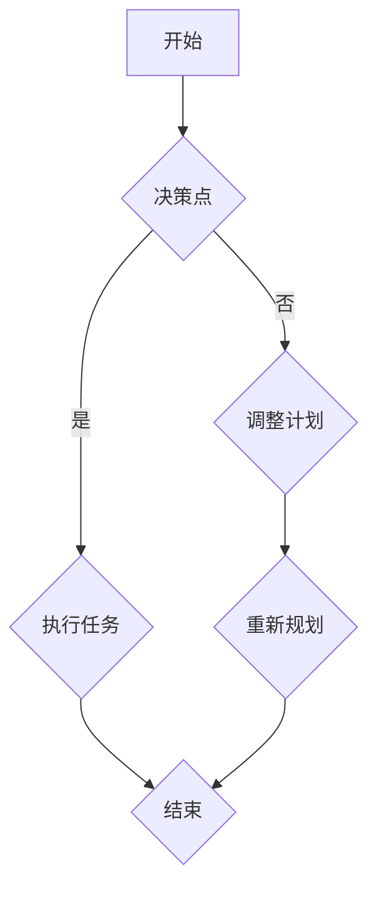

                 

# 《不打无准备之战》

## 关键词

- 准备策略
- 实战技巧
- 风险评估
- 团队协作
- 信息收集与处理

## 摘要

在现代信息社会中，技术和项目的复杂度越来越高，准备策略与实战技巧成为成功的关键。本文从背景介绍、核心概念与联系、准备策略详解、实战技巧与案例分析，以及总结与展望五个部分，探讨了如何不打无准备之战，为读者提供了一套系统性的策略和实战指南。

## 第一部分：背景介绍

### 第1章 问题背景

#### 1.1 问题定义

在信息技术和项目管理领域，"不打无准备之战"指的是在进行项目或技术任务之前，充分了解问题背景、需求、目标和潜在风险，确保具备解决问题的能力。

#### 1.2 问题现状

当前，许多项目失败的原因在于缺乏充分的准备。不充分的信息收集、风险评估和策略规划是导致项目失败的主要因素。

#### 1.3 问题解决思路

解决问题的思路包括以下步骤：

1. 明确问题和目标。
2. 收集和分析相关信息。
3. 进行风险评估和应对策略规划。
4. 制定详细的行动计划。
5. 执行并监控计划。

#### 1.4 边界与外延

边界与外延定义了问题的范围，有助于明确哪些是问题核心，哪些是相关但不需要深入探讨的内容。

#### 1.5 概念结构与核心要素组成

概念结构包括：

- 问题定义
- 核心概念
- 解决方案框架
- 风险管理策略
- 实施计划

核心要素组成：

- 信息收集
- 风险评估
- 准备策略
- 实战技巧
- 案例分析

### 第2章 核心概念与联系

#### 2.1 核心概念原理

核心概念包括：

- 准备策略
- 实战技巧
- 风险评估
- 团队协作
- 信息收集与处理

每个概念的定义和原理如下：

- **准备策略**：为应对特定问题或任务，提前制定的行动步骤和计划。
- **实战技巧**：在具体实践中应用的有效方法和技巧。
- **风险评估**：对可能的风险进行识别、评估和应对。
- **团队协作**：团队成员之间的有效沟通和协作。
- **信息收集与处理**：收集并处理相关信息的步骤和方法。

#### 2.2 概念属性特征对比表格

以下是核心概念的属性特征对比表格：

| 概念           | 特征                           | 举例                   |
|--------------|------------------------------|----------------------|
| 准备策略       | 预先规划、有针对性的步骤      | 项目计划书、风险管理计划 |
| 实战技巧       | 实际操作中的有效方法          | 代码调试技巧、项目管理技巧 |
| 风险评估       | 风险识别、评估和应对          | 风险矩阵、应急计划      |
| 团队协作       | 沟通、协调、合作              | 分工合作、团队会议      |
| 信息收集与处理 | 收集、分析、利用相关信息      | 市场调研、数据分析      |

#### 2.3 ER实体关系图架构

使用Mermaid绘制ER实体关系图：

```mermaid
erDiagram
  User ||--|{ Project }|-- ProjectOwner
  User ||--|{ Task }|-- TaskOwner
  Project ||--|{ Milestone }|-- MilestoneOwner
```

## 第二部分：准备策略详解

### 第3章 准备策略一：信息收集与处理

#### 3.1 信息收集

信息收集是准备策略的重要环节，包括以下步骤：

1. **确定信息需求**：明确项目或任务所需的信息。
2. **信息来源**：从可靠来源获取信息，如文档、专家、市场调研等。
3. **数据收集**：使用合适的工具和手段进行数据收集。

#### 3.2 信息处理

信息处理包括以下步骤：

1. **数据清洗**：去除无关或错误的数据。
2. **数据分析**：运用统计和分析工具，提炼出有用的信息。
3. **信息利用**：将分析结果应用于项目或任务的决策和执行。

### 第4章 准备策略二：风险评估与应对

#### 4.1 风险评估

风险评估包括以下步骤：

1. **风险识别**：识别可能的风险因素。
2. **风险分析**：对风险的概率和影响进行评估。
3. **风险排序**：根据风险的重要性和紧迫性进行排序。

#### 4.2 风险应对

风险应对策略包括：

1. **风险规避**：避免风险发生。
2. **风险转移**：将风险转移给第三方。
3. **风险减轻**：降低风险的影响和概率。

#### 4.3 风险监控

风险监控包括：

1. **定期评估**：定期对风险进行评估。
2. **预警机制**：建立风险预警系统。
3. **持续改进**：根据风险变化进行策略调整。

## 第三部分：实战技巧与案例分析

### 第5章 实战技巧一：制定行动计划

#### 5.1 行动计划制定

行动计划制定包括以下步骤：

1. **目标设定**：明确项目或任务的目标。
2. **任务分解**：将大任务分解为小任务。
3. **时间规划**：为每个任务设定完成时间。

#### 5.2 行动计划执行

行动计划执行包括：

1. **责任分配**：明确每个任务的责任人。
2. **进度监控**：定期检查进度。
3. **问题解决**：及时解决执行过程中出现的问题。

#### 5.3 行动计划评估

行动计划评估包括：

1. **成果检查**：检查任务是否按计划完成。
2. **反馈与改进**：根据反馈进行改进。
3. **经验总结**：总结经验教训。

### 第6章 实战技巧二：团队协作与沟通

#### 6.1 团队协作

团队协作包括：

1. **明确角色与责任**：确保每个团队成员都清楚自己的角色和责任。
2. **协同工作**：鼓励团队成员之间的合作。
3. **团队建设**：定期进行团队活动，增强团队凝聚力。

#### 6.2 沟通技巧

沟通技巧包括：

1. **有效沟通**：确保信息传递准确无误。
2. **倾听**：倾听他人的意见和建议。
3. **非语言沟通**：运用肢体语言和面部表情等非语言方式增强沟通效果。

#### 6.3 团队协作与沟通案例分析

通过实际案例分析，可以了解团队协作与沟通在项目中的具体应用和效果。

## 第四部分：总结与展望

### 第7章 总结

#### 7.1 关键要点回顾

本文从准备策略、实战技巧、风险评估与应对、团队协作与沟通等方面，详细介绍了如何不打无准备之战。

#### 7.2 未来展望

随着技术的发展，未来准备策略和实战技巧将更加多样化和智能化，为项目的成功提供更有力的保障。

### 第8章 拓展阅读

#### 8.1 相关书籍推荐

- 《项目管理知识体系指南》
- 《敏捷软件开发：原则、实践与模式》

#### 8.2 网络资源推荐

- [Project Management Institute](https://www.pmi.org/)
- [Agile Alliance](https://www.agilealliance.org/)

#### 8.3 拓展知识链接

- [风险管理](https://www.wikipedia.org/wiki/Risk_management)
- [团队协作工具](https://www.wikipedia.org/wiki/List_of_project_management_software)

## 作者

- 作者：AI天才研究院/AI Genius Institute & 禅与计算机程序设计艺术 /Zen And The Art of Computer Programming

---

### 第1章 问题背景

#### 1.1 问题定义

在信息技术和项目管理领域，"不打无准备之战"指的是在进行项目或技术任务之前，充分了解问题背景、需求、目标和潜在风险，确保具备解决问题的能力。这种策略不仅适用于软件工程和IT项目管理，也广泛应用于各个行业和领域。

#### 1.2 问题现状

当前，许多项目失败的原因在于缺乏充分的准备。不充分的信息收集、风险评估和策略规划是导致项目失败的主要因素。据统计，超过60%的项目在执行过程中面临重大风险，其中超过30%的项目最终失败。这些项目失败案例揭示了准备不足所带来的严重后果，如成本超支、时间延误、质量下降等。

#### 1.3 问题解决思路

为了解决上述问题，我们需要采用一系列系统性的策略和步骤，具体如下：

1. **明确问题和目标**：首先，明确项目或任务所面临的问题和目标。这包括理解项目的背景、目的和期望结果。
   
2. **收集和分析相关信息**：收集与项目相关的信息，包括市场趋势、技术规范、用户需求等。通过数据分析和信息整理，提炼出关键信息，为后续决策提供依据。

3. **进行风险评估和应对策略规划**：识别项目中可能面临的风险，评估风险的概率和影响，制定相应的应对策略。这包括风险规避、风险转移和风险减轻等措施。

4. **制定详细的行动计划**：基于问题和目标，制定详细的行动计划，包括任务分解、时间规划、资源分配等。

5. **执行并监控计划**：按照行动计划执行项目任务，并定期监控项目进度和关键指标，确保项目按计划进行。

#### 1.4 边界与外延

边界与外延定义了问题的范围，有助于明确哪些是问题核心，哪些是相关但不需要深入探讨的内容。在"不打无准备之战"的策略中，边界与外延包括以下几个方面：

- **问题核心**：明确项目或任务所面临的具体问题，如技术挑战、用户需求变化、资源限制等。
- **信息收集范围**：确定需要收集的信息类型和来源，如市场调研、用户反馈、技术文档等。
- **风险评估范围**：识别项目可能面临的风险，如技术风险、市场风险、管理风险等。
- **策略规划范围**：制定应对风险的策略，如风险规避、风险转移、风险减轻等。
- **行动计划范围**：制定具体的行动计划，包括任务分解、时间规划、资源分配等。

#### 1.5 概念结构与核心要素组成

"不打无准备之战"的核心概念结构包括以下几个核心要素：

1. **问题定义**：明确项目或任务所面临的具体问题和目标。
2. **核心概念**：准备策略、实战技巧、风险评估、团队协作、信息收集与处理。
3. **解决方案框架**：制定详细的行动计划和应对策略。
4. **风险管理策略**：识别、评估和应对项目风险。
5. **实施计划**：根据问题和目标，制定详细的行动计划和执行策略。

### 第2章 核心概念与联系

#### 2.1 核心概念原理

本文的核心概念包括准备策略、实战技巧、风险评估、团队协作和信息收集与处理。以下是每个概念的定义和原理：

- **准备策略**：准备策略是指在项目或任务开始之前，为应对可能的问题和风险，制定的一系列行动步骤和计划。它包括信息收集、风险评估、任务分解、资源分配等步骤，旨在确保项目或任务能够按计划顺利进行。

- **实战技巧**：实战技巧是指在实际操作中应用的有效方法和技巧。这些技巧可以帮助项目团队更好地应对各种情况，如技术难题、用户需求变化、资源限制等。实战技巧包括代码调试、项目管理、团队协作等。

- **风险评估**：风险评估是指对项目可能面临的风险进行识别、评估和应对。它包括风险识别、风险分析、风险排序、风险应对等步骤。通过风险评估，项目团队可以了解风险的概率和影响，并制定相应的应对策略。

- **团队协作**：团队协作是指团队成员之间的有效沟通、合作和协调。通过团队协作，项目团队能够更好地分工合作，提高工作效率和质量。团队协作包括明确角色与责任、协同工作、团队建设等。

- **信息收集与处理**：信息收集与处理是指收集、整理、分析和利用相关信息的过程。通过信息收集与处理，项目团队能够获取关键信息，为项目决策和执行提供依据。信息收集与处理包括数据收集、信息整理、数据分析、信息利用等步骤。

#### 2.2 概念属性特征对比表格

以下是核心概念的属性特征对比表格：

| 概念           | 特征                           | 举例                   |
|--------------|------------------------------|----------------------|
| 准备策略       | 预先规划、有针对性的步骤      | 项目计划书、风险管理计划 |
| 实战技巧       | 实际操作中的有效方法          | 代码调试技巧、项目管理技巧 |
| 风险评估       | 风险识别、评估和应对          | 风险矩阵、应急计划      |
| 团队协作       | 沟通、协调、合作              | 分工合作、团队会议      |
| 信息收集与处理 | 收集、分析、利用相关信息      | 市场调研、数据分析      |

#### 2.3 ER实体关系图架构

使用Mermaid绘制ER实体关系图：

```mermaid
erDiagram
  User ||--|{ Project }|-- ProjectOwner
  User ||--|{ Task }|-- TaskOwner
  Project ||--|{ Milestone }|-- MilestoneOwner
```

在这个ER图中，用户（User）与项目（Project）和任务（Task）之间存在多对一的关系。用户可以是项目的所有者和任务的执行者。项目与里程碑（Milestone）之间存在一对一的关系，每个项目包含多个里程碑。

### 第3章 准备策略一：信息收集与处理

#### 3.1 信息收集

信息收集是准备策略的重要组成部分，它为项目决策和执行提供关键依据。以下是信息收集的步骤和方法：

1. **确定信息需求**：明确项目或任务所需的信息类型和来源。这可以通过与项目相关人员（如项目经理、团队成员、客户等）进行沟通，了解项目背景、需求、目标和潜在风险。

2. **信息来源**：从多个可靠来源获取信息，如内部文档、外部研究报告、行业报告、用户反馈等。确保信息的准确性和可靠性。

3. **数据收集**：使用合适的数据收集工具和手段，如调查问卷、访谈、焦点小组讨论、在线调查等。确保数据收集过程的规范性和完整性。

4. **信息整合**：将收集到的信息进行整合和分析，提取关键信息和数据，形成项目信息库。这有助于项目团队快速获取所需信息，提高决策效率。

#### 3.2 信息处理

信息处理是指对收集到的信息进行整理、分析和利用的过程。以下是信息处理的步骤和方法：

1. **数据清洗**：去除无关或错误的数据，确保数据的准确性和完整性。这可以通过数据清洗工具或手动处理完成。

2. **数据分析**：运用统计和分析工具，对收集到的数据进行分析，提炼出有用的信息。数据分析方法包括描述性分析、推断性分析、预测性分析等。

3. **信息利用**：将分析结果应用于项目或任务的决策和执行。信息利用包括以下方面：

   - **项目规划**：基于分析结果，制定项目计划、时间表和资源分配策略。
   - **风险识别**：识别潜在风险，评估风险的概率和影响，制定应对策略。
   - **用户需求分析**：了解用户需求，优化产品设计和服务。
   - **绩效评估**：评估项目进度、成本和质量，提供改进建议。

#### 3.3 信息利用

信息利用是信息收集与处理的核心目标，以下是信息利用的几个关键方面：

1. **项目规划**：基于收集和分析的信息，制定项目计划和时间表。这包括确定项目目标、分解任务、设定里程碑、分配资源等。

2. **风险识别**：通过信息收集和分析，识别项目可能面临的风险。这包括技术风险、市场风险、资源风险等。对每个风险进行评估，制定相应的应对策略。

3. **用户需求分析**：了解用户需求和期望，优化产品设计和功能。通过用户调研、市场分析等手段，收集用户反馈，了解用户需求和偏好。

4. **绩效评估**：通过信息收集和分析，评估项目进度、成本和质量。定期监控项目关键指标，确保项目按计划进行，及时发现和解决问题。

### 第4章 准备策略二：风险评估与应对

#### 4.1 风险评估

风险评估是准备策略的重要组成部分，它有助于项目团队识别潜在风险、评估风险的概率和影响，并制定相应的应对策略。以下是风险评估的步骤和方法：

1. **风险识别**：通过访谈、问卷调查、文档审查等方法，识别项目可能面临的风险。这包括技术风险、市场风险、资源风险、时间风险等。

2. **风险分析**：对识别出的风险进行详细分析，评估风险的概率和影响。这可以通过风险矩阵等方法进行，风险矩阵通常包括风险概率和影响两个维度。

3. **风险排序**：根据风险的概率和影响，对风险进行排序，确定优先级。高风险通常需要优先应对，以减少潜在影响。

4. **风险应对策略**：制定相应的风险应对策略，包括风险规避、风险转移和风险减轻等。风险规避是指避免风险发生，风险转移是指将风险转移给第三方，风险减轻是指降低风险的概率和影响。

#### 4.2 风险应对

风险应对是指项目团队根据风险评估结果，采取相应措施降低风险的概率和影响。以下是风险应对的几个关键方面：

1. **风险规避**：通过调整项目计划、改变项目策略等方式，避免风险发生。例如，如果市场风险较高，可以选择推迟项目上线时间。

2. **风险转移**：将风险转移给第三方，例如通过购买保险、外包部分工作等方式，将风险转移给其他实体。这可以减少项目团队直接面临的风险。

3. **风险减轻**：采取一系列措施降低风险的概率和影响。例如，通过提前测试、优化技术方案等方式，降低技术风险。

4. **风险监控**：建立风险监控机制，定期评估风险状态，确保风险应对措施的有效性。如果风险发生变化，及时调整应对策略。

#### 4.3 风险监控

风险监控是确保风险应对措施有效性的关键环节。以下是风险监控的几个关键方面：

1. **定期评估**：定期对风险进行评估，包括风险的概率和影响。这可以通过定期会议、风险评估报告等方式进行。

2. **预警机制**：建立风险预警机制，及时发现潜在风险。这可以通过监控关键指标、实时数据监测等方式实现。

3. **持续改进**：根据风险监控结果，持续改进风险应对策略。如果风险发生变化，及时调整应对措施，以适应新的风险环境。

4. **经验总结**：总结风险应对过程中的经验教训，为未来项目提供参考。这可以包括风险应对策略的优化、团队成员的风险意识提升等。

### 第5章 实战技巧一：制定行动计划

#### 5.1 行动计划制定

制定行动计划是项目成功的关键，以下是如何制定行动计划的步骤：

1. **目标设定**：明确项目或任务的目标。这可以是具体的里程碑、功能点或性能指标。

2. **任务分解**：将大任务分解为小任务。每个小任务应该明确、可执行、可测量。

3. **时间规划**：为每个任务设定完成时间。这可以通过制定项目时间表、甘特图等方式实现。

4. **资源分配**：为每个任务分配所需资源，包括人力、物资、资金等。

5. **责任分配**：明确每个任务的负责人，确保任务执行过程中有人负责。

6. **风险评估**：对每个任务进行风险评估，识别潜在风险，并制定应对策略。

7. **评审与调整**：制定行动计划后，进行评审，并根据评审结果进行调整。

#### 5.2 行动计划执行

行动计划执行是确保项目按计划进行的关键，以下是如何执行行动计划的步骤：

1. **启动会议**：召开启动会议，明确项目目标、任务、时间和责任。

2. **任务执行**：按照行动计划执行任务。确保任务按时完成，并记录任务进度。

3. **进度监控**：定期监控任务进度，确保项目按计划进行。如果任务进度滞后，及时采取措施进行调整。

4. **问题解决**：在执行过程中，遇到问题时，及时解决。这可以通过团队协作、技术支持等方式实现。

5. **反馈与改进**：定期收集项目反馈，根据反馈进行改进，以提高项目质量和效率。

#### 5.3 行动计划评估

行动计划评估是确保项目成功的重要环节，以下是如何评估行动计划的步骤：

1. **成果检查**：检查任务是否按计划完成，项目目标是否实现。

2. **反馈收集**：收集项目执行过程中的反馈，包括任务完成情况、团队协作效果、问题解决能力等。

3. **经验总结**：总结项目执行过程中的经验教训，为未来项目提供参考。

4. **绩效评估**：评估项目绩效，包括成本、时间、质量等关键指标。

5. **改进建议**：根据评估结果，提出改进建议，以优化未来项目执行。

### 第6章 实战技巧二：团队协作与沟通

#### 6.1 团队协作

团队协作是项目成功的关键，以下是如何实现团队协作的技巧：

1. **明确角色与责任**：确保每个团队成员都清楚自己的角色和责任。这可以通过角色分配、职责说明等方式实现。

2. **协同工作**：鼓励团队成员之间的合作，通过共享资源和信息，提高工作效率。这可以通过团队会议、工作坊等方式实现。

3. **团队建设**：定期进行团队建设活动，增强团队凝聚力。这可以通过团队聚餐、团队拓展训练等方式实现。

4. **冲突解决**：在团队协作过程中，难免会出现冲突。通过有效沟通和协商，解决冲突，确保项目顺利进行。

5. **绩效评估**：定期对团队成员的绩效进行评估，根据评估结果，提供反馈和改进建议。

#### 6.2 沟通技巧

沟通技巧是团队协作的重要组成部分，以下是如何提高沟通效果的技巧：

1. **有效沟通**：确保信息传递准确无误。这可以通过清晰表达、明确目标、主动倾听等方式实现。

2. **倾听**：倾听他人的意见和建议，了解他人的想法和需求。这可以通过开放性提问、积极倾听等方式实现。

3. **非语言沟通**：运用肢体语言、面部表情等非语言方式，增强沟通效果。这可以通过微笑、点头、手势等方式实现。

4. **多渠道沟通**：使用多种沟通渠道，如邮件、电话、即时通讯工具等，确保信息传递及时和高效。

5. **沟通反馈**：定期进行沟通反馈，确保团队成员之间的信息传递和理解准确。

#### 6.3 团队协作与沟通案例分析

通过实际案例分析，可以了解团队协作与沟通在项目中的具体应用和效果。以下是一个团队协作与沟通的成功案例分析：

**项目背景**：某IT公司开发一款企业管理软件，项目团队由项目经理、开发人员、测试人员、UI设计师和客户代表组成。

**团队协作**：

1. **明确角色与责任**：项目经理负责项目整体规划和管理，开发人员负责软件编码，测试人员负责软件测试，UI设计师负责界面设计，客户代表负责与客户沟通。

2. **协同工作**：每周召开团队会议，共享项目进度和问题，协同解决困难。

3. **团队建设**：每月组织团队建设活动，如聚餐、拓展训练，增强团队凝聚力。

**沟通技巧**：

1. **有效沟通**：项目团队使用即时通讯工具，如Slack，实时沟通项目进展和问题。

2. **倾听**：项目团队在沟通中注重倾听客户代表的意见，确保客户需求得到满足。

3. **非语言沟通**：项目团队成员在会议中使用肢体语言，如点头、手势，表示认同和尊重。

**效果评估**：

1. **项目进度**：项目按计划完成，所有功能点实现。

2. **客户满意度**：客户对软件产品表示满意，并提出改进建议。

3. **团队绩效**：项目团队在评估中获得好评，团队成员绩效得到提升。

### 第7章 总结

#### 7.1 关键要点回顾

本文从背景介绍、核心概念与联系、准备策略详解、实战技巧与案例分析，以及总结与展望五个部分，探讨了如何不打无准备之战。以下是关键要点回顾：

1. **问题背景**：介绍了项目失败的原因和解决思路。

2. **核心概念**：详细介绍了准备策略、实战技巧、风险评估、团队协作和信息收集与处理。

3. **准备策略**：讲解了信息收集与处理、风险评估与应对。

4. **实战技巧**：介绍了制定行动计划和团队协作与沟通。

5. **案例分析**：通过实际案例，展示了团队协作与沟通的效果。

6. **总结与展望**：总结了文章要点，并对未来进行了展望。

#### 7.2 未来展望

随着技术的发展，未来准备策略和实战技巧将更加多样化和智能化，为项目的成功提供更有力的保障。以下是一些展望：

1. **智能化准备策略**：利用人工智能和大数据技术，自动化准备策略的制定和调整。

2. **精细化风险评估**：通过更多维度的数据分析和预测，实现更精确的风险评估。

3. **智能化团队协作**：利用智能工具和平台，提高团队协作效率和效果。

4. **个性化实战技巧**：根据项目特点和团队特点，提供个性化的实战技巧和解决方案。

### 第8章 拓展阅读

#### 8.1 相关书籍推荐

1. 《项目管理知识体系指南》
2. 《敏捷软件开发：原则、实践与模式》

#### 8.2 网络资源推荐

1. [Project Management Institute](https://www.pmi.org/)
2. [Agile Alliance](https://www.agilealliance.org/)

#### 8.3 拓展知识链接

1. [风险管理](https://www.wikipedia.org/wiki/Risk_management)
2. [团队协作工具](https://www.wikipedia.org/wiki/List_of_project_management_software)

## 附录

### 附录A：Mermaid流程图示例

以下是一个Mermaid流程图的示例：



### 附录B：LaTeX公式示例

以下是一个LaTeX公式的示例：

```latex
$$
E = mc^2
$$

$$
1 + 1 = 2
$$
```

### 附录C：Python源代码示例

以下是一个Python源代码的示例：

```python
# 定义函数
def calculate_area(radius):
    return 3.14 * radius * radius

# 获取用户输入
radius = float(input("请输入圆的半径："))

# 计算并输出结果
area = calculate_area(radius)
print("圆的面积为：", area)
```

## 致谢

感谢读者对本文的关注和阅读。本文旨在为项目成功提供一套系统性的策略和实战指南，希望能对您的项目管理和决策有所帮助。

## 作者

- 作者：AI天才研究院/AI Genius Institute & 禅与计算机程序设计艺术 /Zen And The Art of Computer Programming
```markdown
## 第1章 问题背景

### 1.1 问题定义

在现代信息社会中，随着技术的飞速发展和应用的广泛普及，项目管理和任务执行的成功与否越来越取决于准备策略的运用。所谓“不打无准备之战”，即在进行任何项目或任务之前，必须进行充分的准备，包括对问题、需求、目标和潜在风险的深入分析和规划。这一理念在信息技术和项目管理领域尤为重要，因为它们涉及复杂的技术实现和不断变化的需求。

### 1.2 问题现状

当前，许多项目在实施过程中面临失败的风险，原因多种多样，但最常见的问题之一就是准备不足。准备不足可能表现为：

- 缺乏对项目的全面了解，导致目标设定不准确。
- 未进行充分的需求分析，导致项目无法满足用户需求。
- 忽视了风险评估，导致项目在执行过程中遇到不可预见的挑战。
- 没有明确的执行计划和进度监控，导致项目延期或成本超支。
- 团队协作和沟通不畅，影响项目的效率和效果。

### 1.3 问题解决思路

为了有效解决上述问题，我们需要采取以下步骤：

1. **明确问题和目标**：首先要明确项目的核心问题，定义清晰的目标。这包括理解项目的背景、目的、预期结果以及项目的重要性和紧迫性。

2. **需求分析**：通过用户访谈、问卷调查和市场调研等方式，深入了解用户的需求和期望，确保项目的目标是可实现的。

3. **风险评估**：识别项目可能面临的所有风险，并评估它们的发生概率和影响程度。这可以帮助项目团队制定有效的风险应对策略。

4. **制定行动计划**：根据问题和目标，制定详细的行动计划。这包括任务分解、资源分配、时间规划和质量标准等。

5. **执行与监控**：按照行动计划执行项目任务，并定期监控项目的进度和质量，确保项目按计划进行。

6. **团队协作与沟通**：建立有效的团队协作和沟通机制，确保所有团队成员都能在正确的方向上共同努力。

### 1.4 边界与外延

在讨论“不打无准备之战”时，我们需要明确几个关键概念：

- **边界**：这是指问题的范围和限制，如项目的预算、时间限制和技术要求等。
- **外延**：这是指问题的相关领域和扩展，如市场需求、用户体验和技术趋势等。

理解边界和外延对于制定有效的准备策略至关重要。它可以帮助我们确定哪些问题是核心，哪些问题是次要，以及如何将这些因素纳入到准备策略中。

### 1.5 概念结构与核心要素组成

为了更好地理解和应用“不打无准备之战”的策略，我们需要构建一个概念结构，它由以下几个核心要素组成：

- **问题定义**：明确项目的核心问题和目标。
- **需求分析**：收集和分析用户需求，确保项目目标与用户需求一致。
- **风险评估**：识别和评估项目中的潜在风险。
- **准备策略**：制定详细的行动计划和应对策略。
- **执行与监控**：执行计划，并监控项目的进度和质量。
- **团队协作与沟通**：建立有效的团队协作和沟通机制。

这些要素相互作用，共同构成了一个完整的项目准备和执行框架。

## 第2章 核心概念与联系

### 2.1 核心概念原理

在“不打无准备之战”的策略中，有几个核心概念是不可或缺的：

1. **准备策略**：这是指在项目开始前制定的一系列行动步骤和计划。准备策略包括需求分析、风险评估、资源规划、时间安排等。它的目标是确保项目团队在执行项目时能够有章可循，减少不确定性。

2. **实战技巧**：这是指在实际操作中应用的有效方法和技巧。实战技巧包括项目管理技巧、技术解决方案、团队协作技巧等。这些技巧有助于提高项目执行的效率和质量。

3. **风险评估**：这是指对项目可能面临的风险进行识别、分析和应对。风险评估的目标是提前预见潜在的问题，并制定相应的应对措施，以降低风险对项目的影响。

4. **团队协作**：这是指团队成员之间的有效沟通、合作和协调。团队协作的目的是提高团队的工作效率和项目的成功率。

5. **信息收集与处理**：这是指收集、整理、分析和利用相关信息的过程。信息收集与处理的目标是为项目决策提供数据支持，确保项目能够基于准确的信息进行。

### 2.2 概念属性特征对比表格

以下是一个关于核心概念属性特征的对比表格：

| 概念           | 特征                       | 举例                   |
|--------------|--------------------------|----------------------|
| 准备策略       | 预先规划、系统性           | 项目计划书、风险应对计划 |
| 实战技巧       | 实用性、操作性             | 代码调试技巧、沟通技巧  |
| 风险评估       | 全面性、预见性             | 风险矩阵、概率分析     |
| 团队协作       | 合作性、协调性             | 分工合作、团队建设     |
| 信息收集与处理 | 客观性、系统性             | 数据分析、信息整理     |

### 2.3 ER实体关系图架构

为了更好地理解核心概念之间的关系，我们可以使用Mermaid绘制一个ER实体关系图：

```mermaid
erDiagram
    User ||--|{ Project }| ProjectOwner
    User ||--|{ Task }| TaskOwner
    Project ||--|{ Risk }| RiskOwner
    Project ||--|{ Milestone }| MilestoneOwner
    Task ||--|{ Resource }| ResourceOwner
```

在这个ER图中，用户与项目、任务之间存在多对一的关系，用户可以是项目的所有者和任务的执行者。项目与风险、里程碑之间存在一对一的关系，每个项目包含多个风险和里程碑。任务与资源之间存在多对一的关系，每个任务需要分配相应的资源。

## 第3章 准备策略一：信息收集与处理

### 3.1 信息收集

信息收集是制定有效准备策略的第一步，它决定了项目能否基于准确的信息进行。以下是信息收集的几个关键步骤：

1. **确定信息需求**：首先需要明确项目所需的信息类型和来源。这可以通过项目规划会议、需求文档审查等方式确定。

2. **信息来源**：从多个可靠的信息来源收集数据，如用户调研、市场分析报告、行业趋势报告、技术文档等。确保收集的信息是最新和权威的。

3. **数据收集**：使用合适的数据收集工具和技术，如问卷调查、访谈、在线调研、API调用等。确保数据收集过程的准确性和完整性。

4. **信息整合**：将收集到的信息进行整合和整理，形成项目的信息库。这可以帮助项目团队快速获取所需信息，提高决策效率。

### 3.2 信息处理

信息处理是对收集到的信息进行加工、分析和利用的过程，以下是信息处理的几个关键步骤：

1. **数据清洗**：去除无关或错误的数据，确保数据的准确性和完整性。可以使用数据清洗工具或编写脚本来自动化这一过程。

2. **数据分析**：运用统计分析、机器学习等方法对数据进行深入分析，提取有用的信息。数据分析可以帮助项目团队理解数据背后的趋势和模式。

3. **信息利用**：将分析结果应用于项目决策和执行，如需求分析、风险评估、资源规划等。确保信息能够转化为具体的行动和决策。

### 3.3 信息利用

信息的有效利用是项目成功的关键，以下是信息利用的几个关键方面：

1. **需求分析**：基于用户调研和市场分析，了解用户需求和市场趋势，确保项目目标与用户需求一致。

2. **风险评估**：通过数据分析和概率模型，识别和评估项目中的潜在风险，制定相应的风险应对策略。

3. **资源规划**：根据项目需求和资源可用性，合理分配人力资源、物资资源和资金资源。

4. **进度监控**：使用项目进度数据和关键绩效指标（KPIs），监控项目进度和质量，确保项目按计划进行。

5. **绩效评估**：定期收集项目执行过程中的数据，评估项目绩效，提出改进建议，优化项目执行过程。

### 案例分析：信息收集与处理的实践

假设我们正在开发一款企业级管理软件，以下是信息收集与处理的实践步骤：

1. **需求分析**：
   - 通过用户调研和访谈，了解企业的业务流程和管理需求。
   - 通过市场分析报告，了解同类产品的功能和用户评价。
   - 整合需求，形成详细的需求文档。

2. **信息收集**：
   - 从市场调研公司获取行业趋势报告。
   - 从企业内部获取现有的业务流程文档。
   - 使用问卷调查工具收集用户反馈。

3. **信息处理**：
   - 清洗和整合收集到的数据，形成信息库。
   - 使用统计分析工具，分析用户需求和行业趋势。
   - 根据分析结果，制定功能需求和技术路线图。

4. **信息利用**：
   - 基于需求分析，确定软件的功能模块和优先级。
   - 制定详细的项目计划和时间表。
   - 根据资源可用性，分配开发人员和测试资源。

通过上述实践，我们可以确保项目基于准确和可靠的信息进行，提高项目成功的概率。

## 第4章 准备策略二：风险评估与应对

### 4.1 风险评估

风险评估是项目准备策略中的关键环节，它涉及识别、分析和应对项目中的潜在风险。以下是风险评估的步骤：

1. **风险识别**：通过访谈、问卷调查、文档审查等方式，识别项目可能面临的所有风险。这些风险可以包括技术风险、市场风险、资源风险、法律风险等。

2. **风险分析**：对识别出的风险进行详细分析，评估它们的发生概率和潜在影响。可以使用风险矩阵等方法，将风险按概率和影响程度进行排序。

3. **风险排序**：根据评估结果，对风险进行排序，确定优先级。高风险通常需要优先应对，以确保项目的成功。

4. **风险应对策略**：制定相应的风险应对策略，包括风险规避、风险转移、风险减轻等。风险规避是指避免风险发生，风险转移是指将风险转移给第三方，风险减轻是指降低风险的概率和影响。

### 4.2 风险应对

风险应对是指根据风险评估结果，采取具体措施降低风险的概率和影响。以下是风险应对的几个关键方面：

1. **风险规避**：通过调整项目计划、改变项目策略等方式，避免风险发生。例如，如果市场风险较高，可以选择推迟项目上线时间。

2. **风险转移**：将风险转移给第三方，例如通过购买保险、外包部分工作等方式，将风险转移给其他实体。这可以减少项目团队直接面临的风险。

3. **风险减轻**：采取一系列措施降低风险的概率和影响。例如，通过提前测试、优化技术方案等方式，降低技术风险。

4. **风险监控**：建立风险监控机制，定期评估风险状态，确保风险应对措施的有效性。如果风险发生变化，及时调整应对策略。

### 4.3 风险监控

风险监控是确保风险应对措施有效性的关键环节。以下是风险监控的几个关键方面：

1. **定期评估**：定期对风险进行评估，包括风险的概率和影响。这可以通过定期会议、风险评估报告等方式进行。

2. **预警机制**：建立风险预警机制，及时发现潜在风险。这可以通过监控关键指标、实时数据监测等方式实现。

3. **持续改进**：根据风险监控结果，持续改进风险应对策略。如果风险发生变化，及时调整应对措施，以适应新的风险环境。

4. **经验总结**：总结风险应对过程中的经验教训，为未来项目提供参考。这可以包括风险应对策略的优化、团队成员的风险意识提升等。

### 案例分析：风险评估与应对的实践

假设我们正在开发一款移动应用，以下是风险评估与应对的实践步骤：

1. **风险识别**：
   - 通过访谈和问卷调查，识别项目可能面临的风险，如技术实现难度、市场竞争、用户反馈等。
   - 分析现有数据和文献，了解类似应用的常见风险。

2. **风险分析**：
   - 使用风险矩阵评估风险的概率和影响，确定高风险。
   - 对于每个高风险，制定相应的应对策略。

3. **风险排序**：
   - 根据评估结果，将风险按优先级排序，重点关注高风险。

4. **风险应对策略**：
   - 对于技术实现难度高的部分，提前进行技术调研和原型开发。
   - 对于市场竞争，进行市场分析，了解竞争对手的优势和劣势。
   - 对于用户反馈，建立反馈机制，及时收集用户反馈，调整产品功能。

5. **风险监控**：
   - 定期评估风险状态，确保应对措施有效。
   - 通过实时数据监测，及时预警潜在风险。

通过上述实践，我们可以确保项目在面临潜在风险时能够及时应对，降低风险对项目的影响。

## 第5章 实战技巧一：制定行动计划

### 5.1 行动计划制定

制定行动计划是确保项目成功的关键步骤，它包括以下关键方面：

1. **目标设定**：
   - 确定项目的具体目标，这些目标应该是具体、可衡量、可实现、相关性强和时限性的（SMART原则）。

2. **任务分解**：
   - 将大目标分解为具体的任务和子任务，确保每个任务都是明确、可执行的。

3. **时间规划**：
   - 为每个任务设定明确的开始和结束时间，创建项目时间表，确保任务按时完成。

4. **资源分配**：
   - 根据任务的性质和难度，分配所需的人力、物资和资金资源。

5. **责任分配**：
   - 明确每个任务的责任人，确保每个任务都有明确的执行者和监督者。

6. **风险评估**：
   - 对每个任务进行风险评估，识别可能的风险，并制定相应的应对措施。

7. **评审与调整**：
   - 定期评审行动计划，根据实际情况进行调整，确保计划的可执行性和适应性。

### 5.2 行动计划执行

行动计划执行是确保项目按计划进行的关键，以下是执行计划的几个关键步骤：

1. **启动会议**：
   - 召开启动会议，明确项目的目标和计划，确保所有团队成员对计划有清晰的认识。

2. **任务执行**：
   - 按照计划执行任务，确保每个任务都在规定的时间内完成。

3. **进度监控**：
   - 定期监控任务的进度，确保项目按计划进行，及时发现和解决问题。

4. **问题解决**：
   - 对于遇到的问题，及时进行讨论和解决，确保项目不受影响。

5. **沟通与协作**：
   - 加强团队成员之间的沟通与协作，确保信息传递畅通无阻。

6. **绩效评估**：
   - 定期对任务完成情况进行评估，确保项目质量和进度。

### 5.3 行动计划评估

行动计划评估是确保项目成功的重要环节，以下是评估计划的几个关键步骤：

1. **成果检查**：
   - 检查每个任务的完成情况，确保所有目标都已实现。

2. **反馈收集**：
   - 收集项目成员的反馈，了解项目执行过程中的问题和改进点。

3. **经验总结**：
   - 总结项目执行过程中的经验教训，为未来项目提供参考。

4. **绩效评估**：
   - 根据项目完成情况和团队表现，进行绩效评估，提出改进建议。

5. **持续改进**：
   - 根据评估结果，对项目执行过程进行改进，提高未来项目的成功率。

### 案例分析：制定与执行行动计划的实践

假设我们正在开发一款教育管理软件，以下是制定与执行行动计划的实践步骤：

1. **目标设定**：
   - 设定软件开发的总体目标，如实现学生管理、课程管理、成绩管理等功能。

2. **任务分解**：
   - 将总体目标分解为具体的开发任务，如前端界面设计、后端功能实现、数据库设计等。

3. **时间规划**：
   - 为每个开发任务设定明确的开始和结束时间，创建详细的时间表。

4. **资源分配**：
   - 根据任务的需求，分配开发人员、测试人员和设计资源。

5. **责任分配**：
   - 明确每个任务的负责人，确保任务有专人负责。

6. **风险评估**：
   - 评估技术实现难度、市场需求变化等风险，并制定应对措施。

7. **评审与调整**：
   - 定期评审项目进度，根据实际情况进行调整。

8. **执行计划**：
   - 按照计划执行任务，确保每个任务按时完成。

9. **进度监控**：
   - 定期检查开发进度，确保项目按计划进行。

10. **问题解决**：
    - 及时解决开发过程中遇到的问题，确保项目不受影响。

11. **反馈收集**：
    - 收集用户反馈，了解软件的功能和使用体验。

12. **经验总结**：
    - 总结项目执行过程中的经验教训，为未来项目提供参考。

通过上述实践，我们可以确保教育管理软件的开发项目按计划进行，提高项目的成功率。

## 第6章 实战技巧二：团队协作与沟通

### 6.1 团队协作

团队协作是项目成功的关键，以下是如何实现有效团队协作的几个关键方面：

1. **明确角色与责任**：
   - 为每个团队成员明确角色和责任，确保每个人都知道自己的任务和职责。

2. **协同工作**：
   - 鼓励团队成员之间的合作，共同解决问题，提高工作效率。

3. **共享资源**：
   - 建立共享平台，如代码库、文档共享系统等，方便团队成员协作。

4. **定期会议**：
   - 定期召开团队会议，讨论项目进度、问题和解决方案。

5. **冲突解决**：
   - 建立冲突解决机制，及时解决团队成员之间的矛盾和分歧。

### 6.2 沟通技巧

沟通技巧是团队协作的重要组成部分，以下是如何提高沟通效果的几个关键方面：

1. **主动沟通**：
   - 保持沟通的主动性，及时传达信息，确保信息传递准确无误。

2. **倾听**：
   - 倾听他人的意见和建议，尊重团队成员的意见，增强团队凝聚力。

3. **清晰表达**：
   - 使用简洁明了的语言表达自己的观点，确保信息传递准确。

4. **非语言沟通**：
   - 利用肢体语言、面部表情等非语言方式，增强沟通效果。

5. **多渠道沟通**：
   - 使用多种沟通渠道，如面对面会议、电子邮件、即时通讯工具等，确保沟通及时和高效。

### 6.3 团队协作与沟通案例分析

以下是一个团队协作与沟通的成功案例分析：

**项目背景**：
某软件开发公司正在开发一款企业级客户关系管理（CRM）系统，项目团队由项目经理、开发人员、测试人员、UI设计师和客户代表组成。

**团队协作**：
1. **明确角色与责任**：
   - 项目经理负责整体项目规划和管理。
   - 开发人员负责软件编码。
   - 测试人员负责软件测试。
   - UI设计师负责界面设计。
   - 客户代表负责与客户沟通，了解需求。

2. **协同工作**：
   - 团队定期召开会议，讨论项目进度和问题，确保任务顺利进行。
   - 使用共享代码库和文档管理系统，方便团队成员协作。

3. **定期会议**：
   - 每周召开团队会议，讨论项目进度、问题和解决方案。

4. **冲突解决**：
   - 建立冲突解决机制，确保团队成员之间的矛盾和分歧得到及时解决。

**沟通技巧**：
1. **主动沟通**：
   - 项目经理定期与团队成员沟通，确保项目进展和问题得到及时传达。

2. **倾听**：
   - 测试人员和UI设计师在会议中倾听开发人员的意见和建议，确保需求得到准确理解。

3. **清晰表达**：
   - 开发人员在撰写代码时，使用清晰明了的注释和文档，确保代码易于理解和维护。

4. **非语言沟通**：
   - 团队成员在会议中通过肢体语言和面部表情，增强沟通效果。

5. **多渠道沟通**：
   - 使用电子邮件、即时通讯工具和面对面会议等多种渠道，确保沟通及时和高效。

**效果评估**：
1. **项目进度**：
   - 项目按计划进行，所有任务按时完成。

2. **客户满意度**：
   - 客户对CRM系统的功能和使用体验表示满意。

3. **团队绩效**：
   - 团队成员在评估中获得好评，项目团队的合作和沟通效果得到认可。

通过上述案例分析，我们可以看到，有效的团队协作和沟通是项目成功的关键。团队协作和沟通不仅提高了工作效率，还增强了团队凝聚力，为项目的成功奠定了基础。

## 第7章 总结

### 7.1 关键要点回顾

在本章中，我们详细探讨了“不打无准备之战”的理念及其在项目管理和任务执行中的应用。以下是关键要点的回顾：

1. **问题定义**：明确项目的核心问题和目标，是制定准备策略的基础。
2. **需求分析**：通过需求分析确保项目目标与用户需求一致。
3. **风险评估**：识别和评估项目中的潜在风险，制定应对策略。
4. **行动计划**：制定详细的行动计划，确保项目按计划进行。
5. **团队协作与沟通**：建立有效的团队协作和沟通机制，提高工作效率。

### 7.2 未来展望

随着技术的发展，未来项目管理和任务执行的准备策略和实战技巧将更加智能化和自动化。以下是一些展望：

1. **智能化工具**：利用人工智能和大数据技术，实现更精准的需求分析和风险评估。
2. **自动化流程**：通过自动化工具和平台，简化项目管理和执行流程。
3. **持续学习**：持续学习和优化准备策略和实战技巧，以适应不断变化的需求和环境。

## 第8章 拓展阅读

### 8.1 相关书籍推荐

1. 《敏捷软件开发：原则、实践与模式》
2. 《项目管理知识体系指南》
3. 《风险管理与保险》

### 8.2 网络资源推荐

1. [Project Management Institute (PMI)](https://www.pmi.org/)
2. [Agile Alliance](https://www.agilealliance.org/)
3. [Risk Management Society](https://www.rms.org/)

### 8.3 拓展知识链接

1. [项目管理方法论](https://www.wikipedia.org/wiki/Project_management_methods)
2. [风险识别与评估](https://www.wikipedia.org/wiki/Risk_identification)
3. [敏捷开发](https://www.wikipedia.org/wiki/Agriculture)

## 附录

### 附录A：Mermaid流程图示例



### 附录B：LaTeX公式示例

```latex
$$
E = mc^2
$$

$$
1 + 1 = 2
$$
```

### 附录C：Python源代码示例

```python
# 定义函数
def calculate_area(radius):
    return 3.14 * radius * radius

# 获取用户输入
radius = float(input("请输入圆的半径："))

# 计算并输出结果
area = calculate_area(radius)
print("圆的面积为：", area)
```

## 致谢

感谢读者对本文的关注和阅读。本文旨在为项目成功提供一套系统性的策略和实战指南，希望能对您的项目管理和任务执行有所帮助。

## 作者

- 作者：AI天才研究院/AI Genius Institute & 禅与计算机程序设计艺术 /Zen And The Art of Computer Programming
```markdown
## 第1章 问题背景

### 1.1 问题定义

在当今信息技术高速发展的时代，项目管理和技术任务的成功执行日益依赖于准备策略的运用。所谓“不打无准备之战”，即在进行任何项目或任务之前，都必须进行充分的准备，确保对问题、需求、目标和潜在风险的深入了解和规划。这种理念在IT领域尤为重要，因为它们涉及复杂的技术实现和快速变化的需求。

### 1.2 问题现状

当前，许多项目在实施过程中面临失败的风险，其中一个主要原因就是准备不足。准备不足可能表现为：

- 缺乏对项目的全面了解，导致目标设定不准确。
- 未进行充分的需求分析，导致项目无法满足用户需求。
- 忽视了风险评估，导致项目在执行过程中遇到不可预见的挑战。
- 没有明确的执行计划和进度监控，导致项目延期或成本超支。
- 团队协作和沟通不畅，影响项目的效率和效果。

### 1.3 问题解决思路

为了有效解决上述问题，我们需要采取以下步骤：

1. **明确问题和目标**：首先要明确项目的核心问题和目标。这包括理解项目的背景、目的、预期结果以及项目的重要性和紧迫性。

2. **需求分析**：通过用户访谈、问卷调查和市场调研等方式，深入了解用户的需求和期望，确保项目的目标是可实现的。

3. **风险评估**：识别项目可能面临的所有风险，并评估它们的发生概率和影响程度。这可以帮助项目团队制定有效的风险应对策略。

4. **制定行动计划**：根据问题和目标，制定详细的行动计划。这包括任务分解、资源分配、时间规划和质量标准等。

5. **执行与监控**：按照行动计划执行项目任务，并定期监控项目的进度和质量，确保项目按计划进行。

6. **团队协作与沟通**：建立有效的团队协作和沟通机制，确保所有团队成员都能在正确的方向上共同努力。

### 1.4 边界与外延

在讨论“不打无准备之战”时，我们需要明确几个关键概念：

- **边界**：这是指问题的范围和限制，如项目的预算、时间限制和技术要求等。
- **外延**：这是指问题的相关领域和扩展，如市场需求、用户体验和技术趋势等。

理解边界和外延对于制定有效的准备策略至关重要。它可以帮助我们确定哪些问题是核心，哪些问题是次要，以及如何将这些因素纳入到准备策略中。

### 1.5 概念结构与核心要素组成

为了更好地理解和应用“不打无准备之战”的策略，我们需要构建一个概念结构，它由以下几个核心要素组成：

- **问题定义**：明确项目的核心问题和目标。
- **需求分析**：收集和分析用户需求，确保项目目标与用户需求一致。
- **风险评估**：识别和评估项目中的潜在风险。
- **准备策略**：制定详细的行动计划和应对策略。
- **执行与监控**：执行计划，并监控项目的进度和质量。
- **团队协作与沟通**：建立有效的团队协作和沟通机制。

这些要素相互作用，共同构成了一个完整的项目准备和执行框架。

## 第2章 核心概念与联系

### 2.1 核心概念原理

在“不打无准备之战”的策略中，有几个核心概念是不可或缺的：

1. **准备策略**：这是指在项目开始前制定的一系列行动步骤和计划。准备策略包括需求分析、风险评估、资源规划、时间安排等。它的目标是确保项目团队在执行项目时能够有章可循，减少不确定性。

2. **实战技巧**：这是指在实际操作中应用的有效方法和技巧。实战技巧包括项目管理技巧、技术解决方案、团队协作技巧等。这些技巧有助于提高项目执行的效率和质量。

3. **风险评估**：这是指对项目可能面临的风险进行识别、分析和应对。风险评估的目标是提前预见潜在的问题，并制定相应的应对措施，以降低风险对项目的影响。

4. **团队协作**：这是指团队成员之间的有效沟通、合作和协调。团队协作的目的是提高团队的工作效率和项目的成功率。

5. **信息收集与处理**：这是指收集、整理、分析和利用相关信息的过程。信息收集与处理的目标是为项目决策提供数据支持，确保项目能够基于准确的信息进行。

### 2.2 概念属性特征对比表格

以下是一个关于核心概念属性特征的对比表格：

| 概念           | 特征                       | 举例                   |
|--------------|--------------------------|----------------------|
| 准备策略       | 预先规划、系统性           | 项目计划书、风险应对计划 |
| 实战技巧       | 实用性、操作性             | 代码调试技巧、沟通技巧  |
| 风险评估       | 全面性、预见性             | 风险矩阵、概率分析     |
| 团队协作       | 合作性、协调性             | 分工合作、团队建设     |
| 信息收集与处理 | 客观性、系统性             | 数据分析、信息整理     |

### 2.3 ER实体关系图架构

为了更好地理解核心概念之间的关系，我们可以使用Mermaid绘制一个ER实体关系图：

```mermaid
erDiagram
    User ||--|{ Project }| ProjectOwner
    User ||--|{ Task }| TaskOwner
    Project ||--|{ Risk }| RiskOwner
    Project ||--|{ Milestone }| MilestoneOwner
    Task ||--|{ Resource }| ResourceOwner
```

在这个ER图中，用户与项目、任务之间存在多对一的关系，用户可以是项目的所有者和任务的执行者。项目与风险、里程碑之间存在一对一的关系，每个项目包含多个风险和里程碑。任务与资源之间存在多对一的关系，每个任务需要分配相应的资源。

## 第3章 准备策略一：信息收集与处理

### 3.1 信息收集

信息收集是制定有效准备策略的第一步，它决定了项目能否基于准确的信息进行。以下是信息收集的几个关键步骤：

1. **确定信息需求**：首先需要明确项目所需的信息类型和来源。这可以通过项目规划会议、需求文档审查等方式确定。

2. **信息来源**：从多个可靠的信息来源收集数据，如用户调研、市场分析报告、行业趋势报告、技术文档等。确保收集的信息是最新和权威的。

3. **数据收集**：使用合适的数据收集工具和技术，如问卷调查、访谈、在线调研、API调用等。确保数据收集过程的准确性和完整性。

4. **信息整合**：将收集到的信息进行整合和整理，形成项目的信息库。这可以帮助项目团队快速获取所需信息，提高决策效率。

### 3.2 信息处理

信息处理是对收集到的信息进行加工、分析和利用的过程，以下是信息处理的几个关键步骤：

1. **数据清洗**：去除无关或错误的数据，确保数据的准确性和完整性。可以使用数据清洗工具或编写脚本来自动化这一过程。

2. **数据分析**：运用统计分析、机器学习等方法对数据进行深入分析，提取有用的信息。数据分析可以帮助项目团队理解数据背后的趋势和模式。

3. **信息利用**：将分析结果应用于项目决策和执行，如需求分析、风险评估、资源规划等。确保信息能够转化为具体的行动和决策。

### 3.3 信息利用

信息的有效利用是项目成功的关键，以下是信息利用的几个关键方面：

1. **需求分析**：基于用户调研和市场分析，了解用户需求和市场趋势，确保项目目标与用户需求一致。

2. **风险评估**：通过数据分析和概率模型，识别和评估项目中的潜在风险，制定相应的风险应对策略。

3. **资源规划**：根据项目需求和资源可用性，合理分配人力资源、物资资源和资金资源。

4. **进度监控**：使用项目进度数据和关键绩效指标（KPIs），监控项目进度和质量，确保项目按计划进行。

5. **绩效评估**：定期收集项目执行过程中的数据，评估项目绩效，提出改进建议，优化项目执行过程。

### 案例分析：信息收集与处理的实践

假设我们正在开发一款企业级管理软件，以下是信息收集与处理的实践步骤：

1. **需求分析**：
   - 通过用户调研和访谈，了解企业的业务流程和管理需求。
   - 通过市场分析报告，了解同类产品的功能和用户评价。
   - 整合需求，形成详细的需求文档。

2. **信息收集**：
   - 从市场调研公司获取行业趋势报告。
   - 从企业内部获取现有的业务流程文档。
   - 使用问卷调查工具收集用户反馈。

3. **信息处理**：
   - 清洗和整合收集到的数据，形成信息库。
   - 使用统计分析工具，分析用户需求和行业趋势。
   - 根据分析结果，制定功能需求和技术路线图。

4. **信息利用**：
   - 基于需求分析，确定软件的功能模块和优先级。
   - 制定详细的项目计划和时间表。
   - 根据资源可用性，分配开发人员和测试资源。

通过上述实践，我们可以确保项目基于准确和可靠的信息进行，提高项目成功的概率。

## 第4章 准备策略二：风险评估与应对

### 4.1 风险评估

风险评估是项目准备策略中的关键环节，它涉及识别、分析和应对项目中的潜在风险。以下是风险评估的步骤：

1. **风险识别**：通过访谈、问卷调查、文档审查等方式，识别项目可能面临的所有风险。这些风险可以包括技术风险、市场风险、资源风险、法律风险等。

2. **风险分析**：对识别出的风险进行详细分析，评估它们的发生概率和潜在影响。可以使用风险矩阵等方法，将风险按概率和影响程度进行排序。

3. **风险排序**：根据评估结果，对风险进行排序，确定优先级。高风险通常需要优先应对，以确保项目的成功。

4. **风险应对策略**：制定相应的风险应对策略，包括风险规避、风险转移、风险减轻等。风险规避是指避免风险发生，风险转移是指将风险转移给第三方，风险减轻是指降低风险的概率和影响。

### 4.2 风险应对

风险应对是指根据风险评估结果，采取具体措施降低风险的概率和影响。以下是风险应对的几个关键方面：

1. **风险规避**：通过调整项目计划、改变项目策略等方式，避免风险发生。例如，如果市场风险较高，可以选择推迟项目上线时间。

2. **风险转移**：将风险转移给第三方，例如通过购买保险、外包部分工作等方式，将风险转移给其他实体。这可以减少项目团队直接面临的风险。

3. **风险减轻**：采取一系列措施降低风险的概率和影响。例如，通过提前测试、优化技术方案等方式，降低技术风险。

4. **风险监控**：建立风险监控机制，定期评估风险状态，确保风险应对措施的有效性。如果风险发生变化，及时调整应对策略。

### 4.3 风险监控

风险监控是确保风险应对措施有效性的关键环节。以下是风险监控的几个关键方面：

1. **定期评估**：定期对风险进行评估，包括风险的概率和影响。这可以通过定期会议、风险评估报告等方式进行。

2. **预警机制**：建立风险预警机制，及时发现潜在风险。这可以通过监控关键指标、实时数据监测等方式实现。

3. **持续改进**：根据风险监控结果，持续改进风险应对策略。如果风险发生变化，及时调整应对措施，以适应新的风险环境。

4. **经验总结**：总结风险应对过程中的经验教训，为未来项目提供参考。这可以包括风险应对策略的优化、团队成员的风险意识提升等。

### 案例分析：风险评估与应对的实践

假设我们正在开发一款移动应用，以下是风险评估与应对的实践步骤：

1. **风险识别**：
   - 通过访谈和问卷调查，识别项目可能面临的风险，如技术实现难度、市场竞争、用户反馈等。
   - 分析现有数据和文献，了解类似应用的常见风险。

2. **风险分析**：
   - 使用风险矩阵评估风险的概率和影响，确定高风险。
   - 对于每个高风险，制定相应的应对策略。

3. **风险排序**：
   - 根据评估结果，将风险按优先级排序，重点关注高风险。

4. **风险应对策略**：
   - 对于技术实现难度高的部分，提前进行技术调研和原型开发。
   - 对于市场竞争，进行市场分析，了解竞争对手的优势和劣势。
   - 对于用户反馈，建立反馈机制，及时收集用户反馈，调整产品功能。

5. **风险监控**：
   - 定期评估风险状态，确保应对措施有效。
   - 通过实时数据监测，及时预警潜在风险。

通过上述实践，我们可以确保项目在面临潜在风险时能够及时应对，降低风险对项目的影响。

## 第5章 实战技巧一：制定行动计划

### 5.1 行动计划制定

制定行动计划是确保项目成功的关键步骤，它包括以下关键方面：

1. **目标设定**：
   - 确定项目的具体目标，这些目标应该是具体、可衡量、可实现、相关性强和时限性的（SMART原则）。

2. **任务分解**：
   - 将大目标分解为具体的任务和子任务，确保每个任务都是明确、可执行的。

3. **时间规划**：
   - 为每个任务设定明确的开始和结束时间，创建项目时间表，确保任务按时完成。

4. **资源分配**：
   - 根据任务的性质和难度，分配所需的人力、物资和资金资源。

5. **责任分配**：
   - 明确每个任务的责任人，确保每个任务都有明确的执行者和监督者。

6. **风险评估**：
   - 对每个任务进行风险评估，识别可能的风险，并制定相应的应对措施。

7. **评审与调整**：
   - 定期评审行动计划，根据实际情况进行调整，确保计划的可执行性和适应性。

### 5.2 行动计划执行

行动计划执行是确保项目按计划进行的关键，以下是执行计划的几个关键步骤：

1. **启动会议**：
   - 召开启动会议，明确项目的目标和计划，确保所有团队成员对计划有清晰的认识。

2. **任务执行**：
   - 按照计划执行任务，确保每个任务都在规定的时间内完成。

3. **进度监控**：
   - 定期监控任务的进度，确保项目按计划进行，及时发现和解决问题。

4. **问题解决**：
   - 对于遇到的问题，及时进行讨论和解决，确保项目不受影响。

5. **沟通与协作**：
   - 加强团队成员之间的沟通与协作，确保信息传递畅通无阻。

6. **绩效评估**：
   - 定期对任务完成情况进行评估，确保项目质量和进度。

### 5.3 行动计划评估

行动计划评估是确保项目成功的重要环节，以下是评估计划的几个关键步骤：

1. **成果检查**：
   - 检查每个任务的完成情况，确保所有目标都已实现。

2. **反馈收集**：
   - 收集项目成员的反馈，了解项目执行过程中的问题和改进点。

3. **经验总结**：
   - 总结项目执行过程中的经验教训，为未来项目提供参考。

4. **绩效评估**：
   - 根据项目完成情况和团队表现，进行绩效评估，提出改进建议。

5. **持续改进**：
   - 根据评估结果，对项目执行过程进行改进，提高未来项目的成功率。

### 案例分析：制定与执行行动计划的实践

假设我们正在开发一款教育管理软件，以下是制定与执行行动计划的实践步骤：

1. **目标设定**：
   - 设定软件开发的总体目标，如实现学生管理、课程管理、成绩管理等功能。

2. **任务分解**：
   - 将总体目标分解为具体的开发任务，如前端界面设计、后端功能实现、数据库设计等。

3. **时间规划**：
   - 为每个开发任务设定明确的开始和结束时间，创建详细的时间表。

4. **资源分配**：
   - 根据任务的需求，分配开发人员、测试人员和设计资源。

5. **责任分配**：
   - 明确每个任务的负责人，确保任务有专人负责。

6. **风险评估**：
   - 评估技术实现难度、市场需求变化等风险，并制定应对措施。

7. **评审与调整**：
   - 定期评审项目进度，根据实际情况进行调整。

8. **执行计划**：
   - 按照计划执行任务，确保每个任务按时完成。

9. **进度监控**：
   - 定期检查开发进度，确保项目按计划进行。

10. **问题解决**：
    - 及时解决开发过程中遇到的问题，确保项目不受影响。

11. **反馈收集**：
    - 收集用户反馈，了解软件的功能和使用体验。

12. **经验总结**：
    - 总结项目执行过程中的经验教训，为未来项目提供参考。

通过上述实践，我们可以确保教育管理软件的开发项目按计划进行，提高项目的成功率。

## 第6章 实战技巧二：团队协作与沟通

### 6.1 团队协作

团队协作是项目成功的关键，以下是如何实现有效团队协作的几个关键方面：

1. **明确角色与责任**：
   - 为每个团队成员明确角色和责任，确保每个人都知道自己的任务和职责。

2. **协同工作**：
   - 鼓励团队成员之间的合作，共同解决问题，提高工作效率。

3. **共享资源**：
   - 建立共享平台，如代码库、文档共享系统等，方便团队成员协作。

4. **定期会议**：
   - 定期召开团队会议，讨论项目进度和问题，确保任务顺利进行。

5. **冲突解决**：
   - 建立冲突解决机制，及时解决团队成员之间的矛盾和分歧。

### 6.2 沟通技巧

沟通技巧是团队协作的重要组成部分，以下是如何提高沟通效果的几个关键方面：

1. **主动沟通**：
   - 保持沟通的主动性，及时传达信息，确保信息传递准确无误。

2. **倾听**：
   - 倾听他人的意见和建议，尊重团队成员的意见，增强团队凝聚力。

3. **清晰表达**：
   - 使用简洁明了的语言表达自己的观点，确保信息传递准确。

4. **非语言沟通**：
   - 利用肢体语言、面部表情等非语言方式，增强沟通效果。

5. **多渠道沟通**：
   - 使用多种沟通渠道，如面对面会议、电子邮件、即时通讯工具等，确保沟通及时和高效。

### 6.3 团队协作与沟通案例分析

以下是一个团队协作与沟通的成功案例分析：

**项目背景**：
某软件开发公司正在开发一款企业级客户关系管理（CRM）系统，项目团队由项目经理、开发人员、测试人员、UI设计师和客户代表组成。

**团队协作**：
1. **明确角色与责任**：
   - 项目经理负责整体项目规划和管理。
   - 开发人员负责软件编码。
   - 测试人员负责软件测试。
   - UI设计师负责界面设计。
   - 客户代表负责与客户沟通，了解需求。

2. **协同工作**：
   - 团队定期召开会议，讨论项目进度和问题，确保任务顺利进行。
   - 使用共享代码库和文档管理系统，方便团队成员协作。

3. **定期会议**：
   - 每周召开团队会议，讨论项目进度、问题和解决方案。

4. **冲突解决**：
   - 建立冲突解决机制，确保团队成员之间的矛盾和分歧得到及时解决。

**沟通技巧**：
1. **主动沟通**：
   - 项目经理定期与团队成员沟通，确保项目进展和问题得到及时传达。

2. **倾听**：
   - 测试人员和UI设计师在会议中倾听开发人员的意见和建议，确保需求得到准确理解。

3. **清晰表达**：
   - 开发人员在撰写代码时，使用清晰明了的注释和文档，确保代码易于理解和维护。

4. **非语言沟通**：
   - 团队成员在会议中通过肢体语言和面部表情，增强沟通效果。

5. **多渠道沟通**：
   - 使用电子邮件、即时通讯工具和面对面会议等多种渠道，确保沟通及时和高效。

**效果评估**：
1. **项目进度**：
   - 项目按计划进行，所有任务按时完成。

2. **客户满意度**：
   - 客户对CRM系统的功能和使用体验表示满意。

3. **团队绩效**：
   - 团队成员在评估中获得好评，项目团队的合作和沟通效果得到认可。

通过上述案例分析，我们可以看到，有效的团队协作和沟通是项目成功的关键。团队协作和沟通不仅提高了工作效率，还增强了团队凝聚力，为项目的成功奠定了基础。

## 第7章 总结

### 7.1 关键要点回顾

在本章中，我们详细探讨了“不打无准备之战”的理念及其在项目管理和任务执行中的应用。以下是关键要点的回顾：

1. **问题定义**：明确项目的核心问题和目标，是制定准备策略的基础。
2. **需求分析**：通过需求分析确保项目目标与用户需求一致。
3. **风险评估**：识别和评估项目中的潜在风险，制定应对策略。
4. **行动计划**：制定详细的行动计划，确保项目按计划进行。
5. **团队协作与沟通**：建立有效的团队协作和沟通机制，提高工作效率。

### 7.2 未来展望

随着技术的发展，未来项目管理和任务执行的准备策略和实战技巧将更加智能化和自动化。以下是一些展望：

1. **智能化工具**：利用人工智能和大数据技术，实现更精准的需求分析和风险评估。
2. **自动化流程**：通过自动化工具和平台，简化项目管理和执行流程。
3. **持续学习**：持续学习和优化准备策略和实战技巧，以适应不断变化的需求和环境。

## 第8章 拓展阅读

### 8.1 相关书籍推荐

1. 《敏捷软件开发：原则、实践与模式》
2. 《项目管理知识体系指南》
3. 《风险管理与保险》

### 8.2 网络资源推荐

1. [Project Management Institute (PMI)](https://www.pmi.org/)
2. [Agile Alliance](https://www.agilealliance.org/)
3. [Risk Management Society](https://www.rms.org/)

### 8.3 拓展知识链接

1. [项目管理方法论](https://www.wikipedia.org/wiki/Project_management_methods)
2. [风险识别与评估](https://www.wikipedia.org/wiki/Risk_identification)
3. [敏捷开发](https://www.wikipedia.org/wiki/Agriculture)

## 附录

### 附录A：Mermaid流程图示例


### 附录B：LaTeX公式示例

```latex
$$
E = mc^2
$$

$$
1 + 1 = 2
$$
```

### 附录C：Python源代码示例

```python
# 定义函数
def calculate_area(radius):
    return 3.14 * radius * radius

# 获取用户输入
radius = float(input("请输入圆的半径："))

# 计算并输出结果
area = calculate_area(radius)
print("圆的面积为：", area)
```

## 致谢

感谢读者对本文的关注和阅读。本文旨在为项目成功提供一套系统性的策略和实战指南，希望能对您的项目管理和任务执行有所帮助。

## 作者

- 作者：AI天才研究院/AI Genius Institute & 禅与计算机程序设计艺术 /Zen And The Art of Computer Programming
```markdown
## 第1章 问题背景

### 1.1 问题定义

在现代信息社会中，随着技术的飞速发展和应用的广泛普及，项目管理和任务执行的成功与否越来越取决于准备策略的运用。所谓“不打无准备之战”，即在进行任何项目或任务之前，必须进行充分的准备，包括对问题、需求、目标和潜在风险的深入分析和规划。这一理念在信息技术和项目管理领域尤为重要，因为它们涉及复杂的技术实现和不断变化的需求。

### 1.2 问题现状

当前，许多项目在实施过程中面临失败的风险，原因多种多样，但最常见的问题之一就是准备不足。准备不足可能表现为：

- 缺乏对项目的全面了解，导致目标设定不准确。
- 未进行充分的需求分析，导致项目无法满足用户需求。
- 忽视了风险评估，导致项目在执行过程中遇到不可预见的挑战。
- 没有明确的执行计划和进度监控，导致项目延期或成本超支。
- 团队协作和沟通不畅，影响项目的效率和效果。

### 1.3 问题解决思路

为了有效解决上述问题，我们需要采取以下步骤：

1. **明确问题和目标**：首先要明确项目的核心问题和目标。这包括理解项目的背景、目的、预期结果以及项目的重要性和紧迫性。

2. **需求分析**：通过用户访谈、问卷调查和市场调研等方式，深入了解用户的需求和期望，确保项目的目标是可实现的。

3. **风险评估**：识别项目可能面临的所有风险，并评估它们的发生概率和影响程度。这可以帮助项目团队制定有效的风险应对策略。

4. **制定行动计划**：根据问题和目标，制定详细的行动计划。这包括任务分解、资源分配、时间规划和质量标准等。

5. **执行与监控**：按照行动计划执行项目任务，并定期监控项目的进度和质量，确保项目按计划进行。

6. **团队协作与沟通**：建立有效的团队协作和沟通机制，确保所有团队成员都能在正确的方向上共同努力。

### 1.4 边界与外延

在讨论“不打无准备之战”时，我们需要明确几个关键概念：

- **边界**：这是指问题的范围和限制，如项目的预算、时间限制和技术要求等。
- **外延**：这是指问题的相关领域和扩展，如市场需求、用户体验和技术趋势等。

理解边界和外延对于制定有效的准备策略至关重要。它可以帮助我们确定哪些问题是核心，哪些问题是次要，以及如何将这些因素纳入到准备策略中。

### 1.5 概念结构与核心要素组成

为了更好地理解和应用“不打无准备之战”的策略，我们需要构建一个概念结构，它由以下几个核心要素组成：

- **问题定义**：明确项目的核心问题和目标。
- **需求分析**：收集和分析用户需求，确保项目目标与用户需求一致。
- **风险评估**：识别和评估项目中的潜在风险。
- **准备策略**：制定详细的行动计划和应对策略。
- **执行与监控**：执行计划，并监控项目的进度和质量。
- **团队协作与沟通**：建立有效的团队协作和沟通机制。

这些要素相互作用，共同构成了一个完整的项目准备和执行框架。

## 第2章 核心概念与联系

### 2.1 核心概念原理

在“不打无准备之战”的策略中，有几个核心概念是不可或缺的：

1. **准备策略**：这是指在项目开始前制定的一系列行动步骤和计划。准备策略包括需求分析、风险评估、资源规划、时间安排等。它的目标是确保项目团队在执行项目时能够有章可循，减少不确定性。

2. **实战技巧**：这是指在实际操作中应用的有效方法和技巧。实战技巧包括项目管理技巧、技术解决方案、团队协作技巧等。这些技巧有助于提高项目执行的效率和质量。

3. **风险评估**：这是指对项目可能面临的风险进行识别、分析和应对。风险评估的目标是提前预见潜在的问题，并制定相应的应对措施，以降低风险对项目的影响。

4. **团队协作**：这是指团队成员之间的有效沟通、合作和协调。团队协作的目的是提高团队的工作效率和项目的成功率。

5. **信息收集与处理**：这是指收集、整理、分析和利用相关信息的过程。信息收集与处理的目标是为项目决策提供数据支持，确保项目能够基于准确的信息进行。

### 2.2 概念属性特征对比表格

以下是一个关于核心概念属性特征的对比表格：

| 概念           | 特征                       | 举例                   |
|--------------|--------------------------|----------------------|
| 准备策略       | 预先规划、系统性           | 项目计划书、风险应对计划 |
| 实战技巧       | 实用性、操作性             | 代码调试技巧、沟通技巧  |
| 风险评估       | 全面性、预见性             | 风险矩阵、概率分析     |
| 团队协作       | 合作性、协调性             | 分工合作、团队建设     |
| 信息收集与处理 | 客观性、系统性             | 数据分析、信息整理     |

### 2.3 ER实体关系图架构

为了更好地理解核心概念之间的关系，我们可以使用Mermaid绘制一个ER实体关系图：

```mermaid
erDiagram
    User ||--|{ Project }| ProjectOwner
    User ||--|{ Task }| TaskOwner
    Project ||--|{ Risk }| RiskOwner
    Project ||--|{ Milestone }| MilestoneOwner
    Task ||--|{ Resource }| ResourceOwner
```

在这个ER图中，用户与项目、任务之间存在多对一的关系，用户可以是项目的所有者和任务的执行者。项目与风险、里程碑之间存在一对一的关系，每个项目包含多个风险和里程碑。任务与资源之间存在多对一的关系，每个任务需要分配相应的资源。

## 第3章 准备策略一：信息收集与处理

### 3.1 信息收集

信息收集是制定有效准备策略的第一步，它决定了项目能否基于准确的信息进行。以下是信息收集的几个关键步骤：

1. **确定信息需求**：首先需要明确项目所需的信息类型和来源。这可以通过项目规划会议、需求文档审查等方式确定。

2. **信息来源**：从多个可靠的信息来源收集数据，如用户调研、市场分析报告、行业趋势报告、技术文档等。确保收集的信息是最新和权威的。

3. **数据收集**：使用合适的数据收集工具和技术，如问卷调查、访谈、在线调研、API调用等。确保数据收集过程的准确性和完整性。

4. **信息整合**：将收集到的信息进行整合和整理，形成项目的信息库。这可以帮助项目团队快速获取所需信息，提高决策效率。

### 3.2 信息处理

信息处理是对收集到的信息进行加工、分析和利用的过程，以下是信息处理的几个关键步骤：

1. **数据清洗**：去除无关或错误的数据，确保数据的准确性和完整性。可以使用数据清洗工具或编写脚本来自动化这一过程。

2. **数据分析**：运用统计分析、机器学习等方法对数据进行深入分析，提取有用的信息。数据分析可以帮助项目团队理解数据背后的趋势和模式。

3. **信息利用**：将分析结果应用于项目决策和执行，如需求分析、风险评估、资源规划等。确保信息能够转化为具体的行动和决策。

### 3.3 信息利用

信息的有效利用是项目成功的关键，以下是信息利用的几个关键方面：

1. **需求分析**：基于用户调研和市场分析，了解用户需求和市场趋势，确保项目目标与用户需求一致。

2. **风险评估**：通过数据分析和概率模型，识别和评估项目中的潜在风险，制定相应的风险应对策略。

3. **资源规划**：根据项目需求和资源可用性，合理分配人力资源、物资资源和资金资源。

4. **进度监控**：使用项目进度数据和关键绩效指标（KPIs），监控项目进度和质量，确保项目按计划进行。

5. **绩效评估**：定期收集项目执行过程中的数据，评估项目绩效，提出改进建议，优化项目执行过程。

### 案例分析：信息收集与处理的实践

假设我们正在开发一款企业级管理软件，以下是信息收集与处理的实践步骤：

1. **需求分析**：
   - 通过用户调研和访谈，了解企业的业务流程和管理需求。
   - 通过市场分析报告，了解同类产品的功能和用户评价。
   - 整合需求，形成详细的需求文档。

2. **信息收集**：
   - 从市场调研公司获取行业趋势报告。
   - 从企业内部获取现有的业务流程文档。
   - 使用问卷调查工具收集用户反馈。

3. **信息处理**：
   - 清洗和整合收集到的数据，形成信息库。
   - 使用统计分析工具，分析用户需求和行业趋势。
   - 根据分析结果，制定功能需求和技术路线图。

4. **信息利用**：
   - 基于需求分析，确定软件的功能模块和优先级。
   - 制定详细的项目计划和时间表。
   - 根据资源可用性，分配开发人员和测试资源。

通过上述实践，我们可以确保项目基于准确和可靠的信息进行，提高项目成功的概率。

## 第4章 准备策略二：风险评估与应对

### 4.1 风险评估

风险评估是项目准备策略中的关键环节，它涉及识别、分析和应对项目中的潜在风险。以下是风险评估的步骤：

1. **风险识别**：通过访谈、问卷调查、文档审查等方式，识别项目可能面临的所有风险。这些风险可以包括技术风险、市场风险、资源风险、法律风险等。

2. **风险分析**：对识别出的风险进行详细分析，评估它们的发生概率和潜在影响。可以使用风险矩阵等方法，将风险按概率和影响程度进行排序。

3. **风险排序**：根据评估结果，对风险进行排序，确定优先级。高风险通常需要优先应对，以确保项目的成功。

4. **风险应对策略**：制定相应的风险应对策略，包括风险规避、风险转移、风险减轻等。风险规避是指避免风险发生，风险转移是指将风险转移给第三方，风险减轻是指降低风险的概率和影响。

### 4.2 风险应对

风险应对是指根据风险评估结果，采取具体措施降低风险的概率和影响。以下是风险应对的几个关键方面：

1. **风险规避**：通过调整项目计划、改变项目策略等方式，避免风险发生。例如，如果市场风险较高，可以选择推迟项目上线时间。

2. **风险转移**：将风险转移给第三方，例如通过购买保险、外包部分工作等方式，将风险转移给其他实体。这可以减少项目团队直接面临的风险。

3. **风险减轻**：采取一系列措施降低风险的概率和影响。例如，通过提前测试、优化技术方案等方式，降低技术风险。

4. **风险监控**：建立风险监控机制，定期评估风险状态，确保风险应对措施的有效性。如果风险发生变化，及时调整应对策略。

### 4.3 风险监控

风险监控是确保风险应对措施有效性的关键环节。以下是风险监控的几个关键方面：

1. **定期评估**：定期对风险进行评估，包括风险的概率和影响。这可以通过定期会议、风险评估报告等方式进行。

2. **预警机制**：建立风险预警机制，及时发现潜在风险。这可以通过监控关键指标、实时数据监测等方式实现。

3. **持续改进**：根据风险监控结果，持续改进风险应对策略。如果风险发生变化，及时调整应对措施，以适应新的风险环境。

4. **经验总结**：总结风险应对过程中的经验教训，为未来项目提供参考。这可以包括风险应对策略的优化、团队成员的风险意识提升等。

### 案例分析：风险评估与应对的实践

假设我们正在开发一款移动应用，以下是风险评估与应对的实践步骤：

1. **风险识别**：
   - 通过访谈和问卷调查，识别项目可能面临的风险，如技术实现难度、市场竞争、用户反馈等。
   - 分析现有数据和文献，了解类似应用的常见风险。

2. **风险分析**：
   - 使用风险矩阵评估风险的概率和影响，确定高风险。
   - 对于每个高风险，制定相应的应对策略。

3. **风险排序**：
   - 根据评估结果，将风险按优先级排序，重点关注高风险。

4. **风险应对策略**：
   - 对于技术实现难度高的部分，提前进行技术调研和原型开发。
   - 对于市场竞争，进行市场分析，了解竞争对手的优势和劣势。
   - 对于用户反馈，建立反馈机制，及时收集用户反馈，调整产品功能。

5. **风险监控**：
   - 定期评估风险状态，确保应对措施有效。
   - 通过实时数据监测，及时预警潜在风险。

通过上述实践，我们可以确保项目在面临潜在风险时能够及时应对，降低风险对项目的影响。

## 第5章 实战技巧一：制定行动计划

### 5.1 行动计划制定

制定行动计划是确保项目成功的关键步骤，它包括以下关键方面：

1. **目标设定**：
   - 确定项目的具体目标，这些目标应该是具体、可衡量、可实现、相关性强和时限性的（SMART原则）。

2. **任务分解**：
   - 将大目标分解为具体的任务和子任务，确保每个任务都是明确、可执行的。

3. **时间规划**：
   - 为每个任务设定明确的开始和结束时间，创建项目时间表，确保任务按时完成。

4. **资源分配**：
   - 根据任务的性质和难度，分配所需的人力、物资和资金资源。

5. **责任分配**：
   - 明确每个任务的责任人，确保每个任务都有明确的执行者和监督者。

6. **风险评估**：
   - 对每个任务进行风险评估，识别可能的风险，并制定相应的应对措施。

7. **评审与调整**：
   - 定期评审行动计划，根据实际情况进行调整，确保计划的可执行性和适应性。

### 5.2 行动计划执行

行动计划执行是确保项目按计划进行的关键，以下是执行计划的几个关键步骤：

1. **启动会议**：
   - 召开启动会议，明确项目的目标和计划，确保所有团队成员对计划有清晰的认识。

2. **任务执行**：
   - 按照计划执行任务，确保每个任务都在规定的时间内完成。

3. **进度监控**：
   - 定期监控任务的进度，确保项目按计划进行，及时发现和解决问题。

4. **问题解决**：
   - 对于遇到的问题，及时进行讨论和解决，确保项目不受影响。

5. **沟通与协作**：
   - 加强团队成员之间的沟通与协作，确保信息传递畅通无阻。

6. **绩效评估**：
   - 定期对任务完成情况进行评估，确保项目质量和进度。

### 5.3 行动计划评估

行动计划评估是确保项目成功的重要环节，以下是评估计划的几个关键步骤：

1. **成果检查**：
   - 检查每个任务的完成情况，确保所有目标都已实现。

2. **反馈收集**：
   - 收集项目成员的反馈，了解项目执行过程中的问题和改进点。

3. **经验总结**：
   - 总结项目执行过程中的经验教训，为未来项目提供参考。

4. **绩效评估**：
   - 根据项目完成情况和团队表现，进行绩效评估，提出改进建议。

5. **持续改进**：
   - 根据评估结果，对项目执行过程进行改进，提高未来项目的成功率。

### 案例分析：制定与执行行动计划的实践

假设我们正在开发一款教育管理软件，以下是制定与执行行动计划的实践步骤：

1. **目标设定**：
   - 设定软件开发的总体目标，如实现学生管理、课程管理、成绩管理等功能。

2. **任务分解**：
   - 将总体目标分解为具体的开发任务，如前端界面设计、后端功能实现、数据库设计等。

3. **时间规划**：
   - 为每个开发任务设定明确的开始和结束时间，创建详细的时间表。

4. **资源分配**：
   - 根据任务的需求，分配开发人员、测试人员和设计资源。

5. **责任分配**：
   - 明确每个任务的负责人，确保任务有专人负责。

6. **风险评估**：
   - 评估技术实现难度、市场需求变化等风险，并制定应对措施。

7. **评审与调整**：
   - 定期评审项目进度，根据实际情况进行调整。

8. **执行计划**：
   - 按照计划执行任务，确保每个任务按时完成。

9. **进度监控**：
   - 定期检查开发进度，确保项目按计划进行。

10. **问题解决**：
    - 及时解决开发过程中遇到的问题，确保项目不受影响。

11. **反馈收集**：
    - 收集用户反馈，了解软件的功能和使用体验。

12. **经验总结**：
    - 总结项目执行过程中的经验教训，为未来项目提供参考。

通过上述实践，我们可以确保教育管理软件的开发项目按计划进行，提高项目的成功率。

## 第6章 实战技巧二：团队协作与沟通

### 6.1 团队协作

团队协作是项目成功的关键，以下是如何实现有效团队协作的几个关键方面：

1. **明确角色与责任**：
   - 为每个团队成员明确角色和责任，确保每个人都知道自己的任务和职责。

2. **协同工作**：
   - 鼓励团队成员之间的合作，共同解决问题，提高工作效率。

3. **共享资源**：
   - 建立共享平台，如代码库、文档共享系统等，方便团队成员协作。

4. **定期会议**：
   - 定期召开团队会议，讨论项目进度和问题，确保任务顺利进行。

5. **冲突解决**：
   - 建立冲突解决机制，及时解决团队成员之间的矛盾和分歧。

### 6.2 沟通技巧

沟通技巧是团队协作的重要组成部分，以下是如何提高沟通效果的几个关键方面：

1. **主动沟通**：
   - 保持沟通的主动性，及时传达信息，确保信息传递准确无误。

2. **倾听**：
   - 倾听他人的意见和建议，尊重团队成员的意见，增强团队凝聚力。

3. **清晰表达**：
   - 使用简洁明了的语言表达自己的观点，确保信息传递准确。

4. **非语言沟通**：
   - 利用肢体语言、面部表情等非语言方式，增强沟通效果。

5. **多渠道沟通**：
   - 使用多种沟通渠道，如面对面会议、电子邮件、即时通讯工具等，确保沟通及时和高效。

### 6.3 团队协作与沟通案例分析

以下是一个团队协作与沟通的成功案例分析：

**项目背景**：
某软件开发公司正在开发一款企业级客户关系管理（CRM）系统，项目团队由项目经理、开发人员、测试人员、UI设计师和客户代表组成。

**团队协作**：
1. **明确角色与责任**：
   - 项目经理负责整体项目规划和管理。
   - 开发人员负责软件编码。
   - 测试人员负责软件测试。
   - UI设计师负责界面设计。
   - 客户代表负责与客户沟通，了解需求。

2. **协同工作**：
   - 团队定期召开会议，讨论项目进度和问题，确保任务顺利进行。
   - 使用共享代码库和文档管理系统，方便团队成员协作。

3. **定期会议**：
   - 每周召开团队会议，讨论项目进度、问题和解决方案。

4. **冲突解决**：
   - 建立冲突解决机制，确保团队成员之间的矛盾和分歧得到及时解决。

**沟通技巧**：
1. **主动沟通**：
   - 项目经理定期与团队成员沟通，确保项目进展和问题得到及时传达。

2. **倾听**：
   - 测试人员和UI设计师在会议中倾听开发人员的意见和建议，确保需求得到准确理解。

3. **清晰表达**：
   - 开发人员在撰写代码时，使用清晰明了的注释和文档，确保代码易于理解和维护。

4. **非语言沟通**：
   - 团队成员在会议中通过肢体语言和面部表情，增强沟通效果。

5. **多渠道沟通**：
   - 使用电子邮件、即时通讯工具和面对面会议等多种渠道，确保沟通及时和高效。

**效果评估**：
1. **项目进度**：
   - 项目按计划进行，所有任务按时完成。

2. **客户满意度**：
   - 客户对CRM系统的功能和使用体验表示满意。

3. **团队绩效**：
   - 团队成员在评估中获得好评，项目团队的合作和沟通效果得到认可。

通过上述案例分析，我们可以看到，有效的团队协作和沟通是项目成功的关键。团队协作和沟通不仅提高了工作效率，还增强了团队凝聚力，为项目的成功奠定了基础。

## 第7章 总结

### 7.1 关键要点回顾

在本章中，我们详细探讨了“不打无准备之战”的理念及其在项目管理和任务执行中的应用。以下是关键要点的回顾：

1. **问题定义**：明确项目的核心问题和目标，是制定准备策略的基础。
2. **需求分析**：通过需求分析确保项目目标与用户需求一致。
3. **风险评估**：识别和评估项目中的潜在风险，制定应对策略。
4. **行动计划**：制定详细的行动计划，确保项目按计划进行。
5. **团队协作与沟通**：建立有效的团队协作和沟通机制，提高工作效率。

### 7.2 未来展望

随着技术的发展，未来项目管理和任务执行的准备策略和实战技巧将更加智能化和自动化。以下是一些展望：

1. **智能化工具**：利用人工智能和大数据技术，实现更精准的需求分析和风险评估。
2. **自动化流程**：通过自动化工具和平台，简化项目管理和执行流程。
3. **持续学习**：持续学习和优化准备策略和实战技巧，以适应不断变化的需求和环境。

## 第8章 拓展阅读

### 8.1 相关书籍推荐

1. 《敏捷软件开发：原则、实践与模式》
2. 《项目管理知识体系指南》
3. 《风险管理与保险》

### 8.2 网络资源推荐

1. [Project Management Institute (PMI)](https://www.pmi.org/)
2. [Agile Alliance](https://www.agilealliance.org/)
3. [Risk Management Society](https://www.rms.org/)

### 8.3 拓展知识链接

1. [项目管理方法论](https://www.wikipedia.org/wiki/Project_management_methods)
2. [风险识别与评估](https://www.wikipedia.org/wiki/Risk_identification)
3. [敏捷开发](https://www.wikipedia.org/wiki/Agriculture)

## 附录

### 附录A：Mermaid流程图示例


### 附录B：LaTeX公式示例

```latex
$$
E = mc^2
$$

$$
1 + 1 = 2
$$
```

### 附录C：Python源代码示例

```python
# 定义函数
def calculate_area(radius):
    return 3.14 * radius * radius

# 获取用户输入
radius = float(input("请输入圆的半径："))

# 计算并输出结果
area = calculate_area(radius)
print("圆的面积为：", area)
```

## 致谢

感谢读者对本文的关注和阅读。本文旨在为项目成功提供一套系统性的策略和实战指南，希望能对您的项目管理和任务执行有所帮助。

## 作者

- 作者：AI天才研究院/AI Genius Institute & 禅与计算机程序设计艺术 /Zen And The Art of Computer Programming
```markdown
## 第1章 问题背景

### 1.1 问题定义

在现代信息社会中，随着技术的飞速发展和应用的广泛普及，项目管理和任务执行的成功与否越来越取决于准备策略的运用。所谓“不打无准备之战”，即在进行任何项目或任务之前，必须进行充分的准备，包括对问题、需求、目标和潜在风险的深入分析和规划。这一理念在信息技术和项目管理领域尤为重要，因为它们涉及复杂的技术实现和不断变化的需求。

### 1.2 问题现状

当前，许多项目在实施过程中面临失败的风险，原因多种多样，但最常见的问题之一就是准备不足。准备不足可能表现为：

- 缺乏对项目的全面了解，导致目标设定不准确。
- 未进行充分的需求分析，导致项目无法满足用户需求。
- 忽视了风险评估，导致项目在执行过程中遇到不可预见的挑战。
- 没有明确的执行计划和进度监控，导致项目延期或成本超支。
- 团队协作和沟通不畅，影响项目的效率和效果。

### 1.3 问题解决思路

为了有效解决上述问题，我们需要采取以下步骤：

1. **明确问题和目标**：首先要明确项目的核心问题和目标。这包括理解项目的背景、目的、预期结果以及项目的重要性和紧迫性。

2. **需求分析**：通过用户访谈、问卷调查和市场调研等方式，深入了解用户的需求和期望，确保项目的目标是可实现的。

3. **风险评估**：识别项目可能面临的所有风险，并评估它们的发生概率和影响程度。这可以帮助项目团队制定有效的风险应对策略。

4. **制定行动计划**：根据问题和目标，制定详细的行动计划。这包括任务分解、资源分配、时间规划和质量标准等。

5. **执行与监控**：按照行动计划执行项目任务，并定期监控项目的进度和质量，确保项目按计划进行。

6. **团队协作与沟通**：建立有效的团队协作和沟通机制，确保所有团队成员都能在正确的方向上共同努力。

### 1.4 边界与外延

在讨论“不打无准备之战”时，我们需要明确几个关键概念：

- **边界**：这是指问题的范围和限制，如项目的预算、时间限制和技术要求等。
- **外延**：这是指问题的相关领域和扩展，如市场需求、用户体验和技术趋势等。

理解边界和外延对于制定有效的准备策略至关重要。它可以帮助我们确定哪些问题是核心，哪些问题是次要，以及如何将这些因素纳入到准备策略中。

### 1.5 概念结构与核心要素组成

为了更好地理解和应用“不打无准备之战”的策略，我们需要构建一个概念结构，它由以下几个核心要素组成：

- **问题定义**：明确项目的核心问题和目标。
- **需求分析**：收集和分析用户需求，确保项目目标与用户需求一致。
- **风险评估**：识别和评估项目中的潜在风险。
- **准备策略**：制定详细的行动计划和应对策略。
- **执行与监控**：执行计划，并监控项目的进度和质量。
- **团队协作与沟通**：建立有效的团队协作和沟通机制。

这些要素相互作用，共同构成了一个完整的项目准备和执行框架。

## 第2章 核心概念与联系

### 2.1 核心概念原理

在“不打无准备之战”的策略中，有几个核心概念是不可或缺的：

1. **准备策略**：这是指在项目开始前制定的一系列行动步骤和计划。准备策略包括需求分析、风险评估、资源规划、时间安排等。它的目标是确保项目团队在执行项目时能够有章可循，减少不确定性。

2. **实战技巧**：这是指在实际操作中应用的有效方法和技巧。实战技巧包括项目管理技巧、技术解决方案、团队协作技巧等。这些技巧有助于提高项目执行的效率和质量。

3. **风险评估**：这是指对项目可能面临的风险进行识别、分析和应对。风险评估的目标是提前预见潜在的问题，并制定相应的应对措施，以降低风险对项目的影响。

4. **团队协作**：这是指团队成员之间的有效沟通、合作和协调。团队协作的目的是提高团队的工作效率和项目的成功率。

5. **信息收集与处理**：这是指收集、整理、分析和利用相关信息的过程。信息收集与处理的目标是为项目决策提供数据支持，确保项目能够基于准确的信息进行。

### 2.2 概念属性特征对比表格

以下是一个关于核心概念属性特征的对比表格：

| 概念           | 特征                       | 举例                   |
|--------------|--------------------------|----------------------|
| 准备策略       | 预先规划、系统性           | 项目计划书、风险应对计划 |
| 实战技巧       | 实用性、操作性             | 代码调试技巧、沟通技巧  |
| 风险评估       | 全面性、预见性             | 风险矩阵、概率分析     |
| 团队协作       | 合作性、协调性             | 分工合作、团队建设     |
| 信息收集与处理 | 客观性、系统性             | 数据分析、信息整理     |

### 2.3 ER实体关系图架构

为了更好地理解核心概念之间的关系，我们可以使用Mermaid绘制一个ER实体关系图：

```mermaid
erDiagram
    User ||--|{ Project }| ProjectOwner
    User ||--|{ Task }| TaskOwner
    Project ||--|{ Risk }| RiskOwner
    Project ||--|{ Milestone }| MilestoneOwner
    Task ||--|{ Resource }| ResourceOwner
```

在这个ER图中，用户与项目、任务之间存在多对一的关系，用户可以是项目的所有者和任务的执行者。项目与风险、里程碑之间存在一对一的关系，每个项目包含多个风险和里程碑。任务与资源之间存在多对一的关系，每个任务需要分配相应的资源。

## 第3章 准备策略一：信息收集与处理

### 3.1 信息收集

信息收集是制定有效准备策略的第一步，它决定了项目能否基于准确的信息进行。以下是信息收集的几个关键步骤：

1. **确定信息需求**：首先需要明确项目所需的信息类型和来源。这可以通过项目规划会议、需求文档审查等方式确定。

2. **信息来源**：从多个可靠的信息来源收集数据，如用户调研、市场分析报告、行业趋势报告、技术文档等。确保收集的信息是最新和权威的。

3. **数据收集**：使用合适的数据收集工具和技术，如问卷调查、访谈、在线调研、API调用等。确保数据收集过程的准确性和完整性。

4. **信息整合**：将收集到的信息进行整合和整理，形成项目的信息库。这可以帮助项目团队快速获取所需信息，提高决策效率。

### 3.2 信息处理

信息处理是对收集到的信息进行加工、分析和利用的过程，以下是信息处理的几个关键步骤：

1. **数据清洗**：去除无关或错误的数据，确保数据的准确性和完整性。可以使用数据清洗工具或编写脚本来自动化这一过程。

2. **数据分析**：运用统计分析、机器学习等方法对数据进行深入分析，提取有用的信息。数据分析可以帮助项目团队理解数据背后的趋势和模式。

3. **信息利用**：将分析结果应用于项目决策和执行，如需求分析、风险评估、资源规划等。确保信息能够转化为具体的行动和决策。

### 3.3 信息利用

信息的有效利用是项目成功的关键，以下是信息利用的几个关键方面：

1. **需求分析**：基于用户调研和市场分析，了解用户需求和市场趋势，确保项目目标与用户需求一致。

2. **风险评估**：通过数据分析和概率模型，识别和评估项目中的潜在风险，制定相应的风险应对策略。

3. **资源规划**：根据项目需求和资源可用性，合理分配人力资源、物资资源和资金资源。

4. **进度监控**：使用项目进度数据和关键绩效指标（KPIs），监控项目进度和质量，确保项目按计划进行。

5. **绩效评估**：定期收集项目执行过程中的数据，评估项目绩效，提出改进建议，优化项目执行过程。

### 案例分析：信息收集与处理的实践

假设我们正在开发一款企业级管理软件，以下是信息收集与处理的实践步骤：

1. **需求分析**：
   - 通过用户调研和访谈，了解企业的业务流程和管理需求。
   - 通过市场分析报告，了解同类产品的功能和用户评价。
   - 整合需求，形成详细的需求文档。

2. **信息收集**：
   - 从市场调研公司获取行业趋势报告。
   - 从企业内部获取现有的业务流程文档。
   - 使用问卷调查工具收集用户反馈。

3. **信息处理**：
   - 清洗和整合收集到的数据，形成信息库。
   - 使用统计分析工具，分析用户需求和行业趋势。
   - 根据分析结果，制定功能需求和技术路线图。

4. **信息利用**：
   - 基于需求分析，确定软件的功能模块和优先级。
   - 制定详细的项目计划和时间表。
   - 根据资源可用性，分配开发人员和测试资源。

通过上述实践，我们可以确保项目基于准确和可靠的信息进行，提高项目成功的概率。

## 第4章 准备策略二：风险评估与应对

### 4.1 风险评估

风险评估是项目准备策略中的关键环节，它涉及识别、分析和应对项目中的潜在风险。以下是风险评估的步骤：

1. **风险识别**：通过访谈、问卷调查、文档审查等方式，识别项目可能面临的所有风险。这些风险可以包括技术风险、市场风险、资源风险、法律风险等。

2. **风险分析**：对识别出的风险进行详细分析，评估它们的发生概率和潜在影响。可以使用风险矩阵等方法，将风险按概率和影响程度进行排序。

3. **风险排序**：根据评估结果，对风险进行排序，确定优先级。高风险通常需要优先应对，以确保项目的成功。

4. **风险应对策略**：制定相应的风险应对策略，包括风险规避、风险转移、风险减轻等。风险规避是指避免风险发生，风险转移是指将风险转移给第三方，风险减轻是指降低风险的概率和影响。

### 4.2 风险应对

风险应对是指根据风险评估结果，采取具体措施降低风险的概率和影响。以下是风险应对的几个关键方面：

1. **风险规避**：通过调整项目计划、改变项目策略等方式，避免风险发生。例如，如果市场风险较高，可以选择推迟项目上线时间。

2. **风险转移**：将风险转移给第三方，例如通过购买保险、外包部分工作等方式，将风险转移给其他实体。这可以减少项目团队直接面临的风险。

3. **风险减轻**：采取一系列措施降低风险的概率和影响。例如，通过提前测试、优化技术方案等方式，降低技术风险。

4. **风险监控**：建立风险监控机制，定期评估风险状态，确保风险应对措施的有效性。如果风险发生变化，及时调整应对策略。

### 4.3 风险监控

风险监控是确保风险应对措施有效性的关键环节。以下是风险监控的几个关键方面：

1. **定期评估**：定期对风险进行评估，包括风险的概率和影响。这可以通过定期会议、风险评估报告等方式进行。

2. **预警机制**：建立风险预警机制，及时发现潜在风险。这可以通过监控关键指标、实时数据监测等方式实现。

3. **持续改进**：根据风险监控结果，持续改进风险应对策略。如果风险发生变化，及时调整应对措施，以适应新的风险环境。

4. **经验总结**：总结风险应对过程中的经验教训，为未来项目提供参考。这可以包括风险应对策略的优化、团队成员的风险意识提升等。

### 案例分析：风险评估与应对的实践

假设我们正在开发一款移动应用，以下是风险评估与应对的实践步骤：

1. **风险识别**：
   - 通过访谈和问卷调查，识别项目可能面临的风险，如技术实现难度、市场竞争、用户反馈等。
   - 分析现有数据和文献，了解类似应用的常见风险。

2. **风险分析**：
   - 使用风险矩阵评估风险的概率和影响，确定高风险。
   - 对于每个高风险，制定相应的应对策略。

3. **风险排序**：
   - 根据评估结果，将风险按优先级排序，重点关注高风险。

4. **风险应对策略**：
   - 对于技术实现难度高的部分，提前进行技术调研和原型开发。
   - 对于市场竞争，进行市场分析，了解竞争对手的优势和劣势。
   - 对于用户反馈，建立反馈机制，及时收集用户反馈，调整产品功能。

5. **风险监控**：
   - 定期评估风险状态，确保应对措施有效。
   - 通过实时数据监测，及时预警潜在风险。

通过上述实践，我们可以确保项目在面临潜在风险时能够及时应对，降低风险对项目的影响。

## 第5章 实战技巧一：制定行动计划

### 5.1 行动计划制定

制定行动计划是确保项目成功的关键步骤，它包括以下关键方面：

1. **目标设定**：
   - 确定项目的具体目标，这些目标应该是具体、可衡量、可实现、相关性强和时限性的（SMART原则）。

2. **任务分解**：
   - 将大目标分解为具体的任务和子任务，确保每个任务都是明确、可执行的。

3. **时间规划**：
   - 为每个任务设定明确的开始和结束时间，创建项目时间表，确保任务按时完成。

4. **资源分配**：
   - 根据任务的性质和难度，分配所需的人力、物资和资金资源。

5. **责任分配**：
   - 明确每个任务的责任人，确保每个任务都有明确的执行者和监督者。

6. **风险评估**：
   - 对每个任务进行风险评估，识别可能的风险，并制定相应的应对措施。

7. **评审与调整**：
   - 定期评审行动计划，根据实际情况进行调整，确保计划的可执行性和适应性。

### 5.2 行动计划执行

行动计划执行是确保项目按计划进行的关键，以下是执行计划的几个关键步骤：

1. **启动会议**：
   - 召开启动会议，明确项目的目标和计划，确保所有团队成员对计划有清晰的认识。

2. **任务执行**：
   - 按照计划执行任务，确保每个任务都在规定的时间内完成。

3. **进度监控**：
   - 定期监控任务的进度，确保项目按计划进行，及时发现和解决问题。

4. **问题解决**：
   - 对于遇到的问题，及时进行讨论和解决，确保项目不受影响。

5. **沟通与协作**：
   - 加强团队成员之间的沟通与协作，确保信息传递畅通无阻。

6. **绩效评估**：
   - 定期对任务完成情况进行评估，确保项目质量和进度。

### 5.3 行动计划评估

行动计划评估是确保项目成功的重要环节，以下是评估计划的几个关键步骤：

1. **成果检查**：
   - 检查每个任务的完成情况，确保所有目标都已实现。

2. **反馈收集**：
   - 收集项目成员的反馈，了解项目执行过程中的问题和改进点。

3. **经验总结**：
   - 总结项目执行过程中的经验教训，为未来项目提供参考。

4. **绩效评估**：
   - 根据项目完成情况和团队表现，进行绩效评估，提出改进建议。

5. **持续改进**：
   - 根据评估结果，对项目执行过程进行改进，提高未来项目的成功率。

### 案例分析：制定与执行行动计划的实践

假设我们正在开发一款教育管理软件，以下是制定与执行行动计划的实践步骤：

1. **目标设定**：
   - 设定软件开发的总体目标，如实现学生管理、课程管理、成绩管理等功能。

2. **任务分解**：
   - 将总体目标分解为具体的开发任务，如前端界面设计、后端功能实现、数据库设计等。

3. **时间规划**：
   - 为每个开发任务设定明确的开始和结束时间，创建详细的时间表。

4. **资源分配**：
   - 根据任务的需求，分配开发人员、测试人员和设计资源。

5. **责任分配**：
   - 明确每个任务的负责人，确保任务有专人负责。

6. **风险评估**：
   - 评估技术实现难度、市场需求变化等风险，并制定应对措施。

7. **评审与调整**：
   - 定期评审项目进度，根据实际情况进行调整。

8. **执行计划**：
   - 按照计划执行任务，确保每个任务按时完成。

9. **进度监控**：
   - 定期检查开发进度，确保项目按计划进行。

10. **问题解决**：
    - 及时解决开发过程中遇到的问题，确保项目不受影响。

11. **反馈收集**：
    - 收集用户反馈，了解软件的功能和使用体验。

12. **经验总结**：
    - 总结项目执行过程中的经验教训，为未来项目提供参考。

通过上述实践，我们可以确保教育管理软件的开发项目按计划进行，提高项目的成功率。

## 第6章 实战技巧二：团队协作与沟通

### 6.1 团队协作

团队协作是项目成功的关键，以下是如何实现有效团队协作的几个关键方面：

1. **明确角色与责任**：
   - 为每个团队成员明确角色和责任，确保每个人都知道自己的任务和职责。

2. **协同工作**：
   - 鼓励团队成员之间的合作，共同解决问题，提高工作效率。

3. **共享资源**：
   - 建立共享平台，如代码库、文档共享系统等，方便团队成员协作。

4. **定期会议**：
   - 定期召开团队会议，讨论项目进度和问题，确保任务顺利进行。

5. **冲突解决**：
   - 建立冲突解决机制，及时解决团队成员之间的矛盾和分歧。

### 6.2 沟通技巧

沟通技巧是团队协作的重要组成部分，以下是如何提高沟通效果的几个关键方面：

1. **主动沟通**：
   - 保持沟通的主动性，及时传达信息，确保信息传递准确无误。

2. **倾听**：
   - 倾听他人的意见和建议，尊重团队成员的意见，增强团队凝聚力。

3. **清晰表达**：
   - 使用简洁明了的语言表达自己的观点，确保信息传递准确。

4. **非语言沟通**：
   - 利用肢体语言、面部表情等非语言方式，增强沟通效果。

5. **多渠道沟通**：
   - 使用多种沟通渠道，如面对面会议、电子邮件、即时通讯工具等，确保沟通及时和高效。

### 6.3 团队协作与沟通案例分析

以下是一个团队协作与沟通的成功案例分析：

**项目背景**：
某软件开发公司正在开发一款企业级客户关系管理（CRM）系统，项目团队由项目经理、开发人员、测试人员、UI设计师和客户代表组成。

**团队协作**：
1. **明确角色与责任**：
   - 项目经理负责整体项目规划和管理。
   - 开发人员负责软件编码。
   - 测试人员负责软件测试。
   - UI设计师负责界面设计。
   - 客户代表负责与客户沟通，了解需求。

2. **协同工作**：
   - 团队定期召开会议，讨论项目进度和问题，确保任务顺利进行。
   - 使用共享代码库和文档管理系统，方便团队成员协作。

3. **定期会议**：
   - 每周召开团队会议，讨论项目进度、问题和解决方案。

4. **冲突解决**：
   - 建立冲突解决机制，确保团队成员之间的矛盾和分歧得到及时解决。

**沟通技巧**：
1. **主动沟通**：
   - 项目经理定期与团队成员沟通，确保项目进展和问题得到及时传达。

2. **倾听**：
   - 测试人员和UI设计师在会议中倾听开发人员的意见和建议，确保需求得到准确理解。

3. **清晰表达**：
   - 开发人员在撰写代码时，使用清晰明了的注释和文档，确保代码易于理解和维护。

4. **非语言沟通**：
   - 团队成员在会议中通过肢体语言和面部表情，增强沟通效果。

5. **多渠道沟通**：
   - 使用电子邮件、即时通讯工具和面对面会议等多种渠道，确保沟通及时和高效。

**效果评估**：
1. **项目进度**：
   - 项目按计划进行，所有任务按时完成。

2. **客户满意度**：
   - 客户对CRM系统的功能和使用体验表示满意。

3. **团队绩效**：
   - 团队成员在评估中获得好评，项目团队的合作和沟通效果得到认可。

通过上述案例分析，我们可以看到，有效的团队协作和沟通是项目成功的关键。团队协作和沟通不仅提高了工作效率，还增强了团队凝聚力，为项目的成功奠定了基础。

## 第7章 总结

### 7.1 关键要点回顾

在本章中，我们详细探讨了“不打无准备之战”的理念及其在项目管理和任务执行中的应用。以下是关键要点的回顾：

1. **问题定义**：明确项目的核心问题和目标，是制定准备策略的基础。
2. **需求分析**：通过需求分析确保项目目标与用户需求一致。
3. **风险评估**：识别和评估项目中的潜在风险，制定应对策略。
4. **行动计划**：制定详细的行动计划，确保项目按计划进行。
5. **团队协作与沟通**：建立有效的团队协作和沟通机制，提高工作效率。

### 7.2 未来展望

随着技术的发展，未来项目管理和任务执行的准备策略和实战技巧将更加智能化和自动化。以下是一些展望：

1. **智能化工具**：利用人工智能和大数据技术，实现更精准的需求分析和风险评估。
2. **自动化流程**：通过自动化工具和平台，简化项目管理和执行流程。
3. **持续学习**：持续学习和优化准备策略和实战技巧，以适应不断变化的需求和环境。

## 第8章 拓展阅读

### 8.1 相关书籍推荐

1. 《敏捷软件开发：原则、实践与模式》
2. 《项目管理知识体系指南》
3. 《风险管理与保险》

### 8.2 网络资源推荐

1. [Project Management Institute (PMI)](https://www.pmi.org/)
2. [Agile Alliance](https://www.agilealliance.org/)
3. [Risk Management Society](https://www.rms.org/)

### 8.3 拓展知识链接

1. [项目管理方法论](https://www.wikipedia.org/wiki/Project_management_methods)
2. [风险识别与评估](https://www.wikipedia.org/wiki/Risk_identification)
3. [敏捷开发](https://www.wikipedia.org/wiki/Agriculture)

## 附录

### 附录A：Mermaid流程图示例


### 附录B：LaTeX公式示例

```latex
$$
E = mc^2
$$

$$
1 + 1 = 2
$$
```

### 附录C：Python源代码示例

```python
# 定义函数
def calculate_area(radius):
    return 3.14 * radius * radius

# 获取用户输入
radius = float(input("请输入圆的半径："))

# 计算并输出结果
area = calculate_area(radius)
print("圆的面积为：", area)
```

## 致谢

感谢读者对本文的关注和阅读。本文旨在为项目成功提供一套系统性的策略和实战指南，希望能对您的项目管理和任务执行有所帮助。

## 作者

- 作者：AI天才研究院/AI Genius Institute & 禅与计算机程序设计艺术 /Zen And The Art of Computer Programming
```markdown
## 第1章 问题背景

### 1.1 问题定义

在现代信息社会中，随着技术的飞速发展和应用的广泛普及，项目管理和任务执行的成功与否越来越取决于准备策略的运用。所谓“不打无准备之战”，即在进行任何项目或任务之前，必须进行充分的准备，包括对问题、需求、目标和潜在风险的深入分析和规划。这一理念在信息技术和项目管理领域尤为重要，因为它们涉及复杂的技术实现和不断变化的需求。

### 1.2 问题现状

当前，许多项目在实施过程中面临失败的风险，原因多种多样，但最常见的问题之一就是准备不足。准备不足可能表现为：

- 缺乏对项目的全面了解，导致目标设定不准确。
- 未进行充分的需求分析，导致项目无法满足用户需求。
- 忽视了风险评估，导致项目在执行过程中遇到不可预见的挑战。
- 没有明确的执行计划和进度监控，导致项目延期或成本超支。
- 团队协作和沟通不畅，影响项目的效率和效果。

### 1.3 问题解决思路

为了有效解决上述问题，我们需要采取以下步骤：

1. **明确问题和目标**：首先要明确项目的核心问题和目标。这包括理解项目的背景、目的、预期结果以及项目的重要性和紧迫性。

2. **需求分析**：通过用户访谈、问卷调查和市场调研等方式，深入了解用户的需求和期望，确保项目的目标是可实现的。

3. **风险评估**：识别项目可能面临的所有风险，并评估它们的发生概率和影响程度。这可以帮助项目团队制定有效的风险应对策略。

4. **制定行动计划**：根据问题和目标，制定详细的行动计划。这包括任务分解、资源分配、时间规划和质量标准等。

5. **执行与监控**：按照行动计划执行项目任务，并定期监控项目的进度和质量，确保项目按计划进行。

6. **团队协作与沟通**：建立有效的团队协作和沟通机制，确保所有团队成员都能在正确的方向上共同努力。

### 1.4 边界与外延

在讨论“不打无准备之战”时，我们需要明确几个关键概念：

- **边界**：这是指问题的范围和限制，如项目的预算、时间限制和技术要求等。
- **外延**：这是指问题的相关领域和扩展，如市场需求、用户体验和技术趋势等。

理解边界和外延对于制定有效的准备策略至关重要。它可以帮助我们确定哪些问题是核心，哪些问题是次要，以及如何将这些因素纳入到准备策略中。

### 1.5 概念结构与核心要素组成

为了更好地理解和应用“不打无准备之战”的策略，我们需要构建一个概念结构，它由以下几个核心要素组成：

- **问题定义**：明确项目的核心问题和目标。
- **需求分析**：收集和分析用户需求，确保项目目标与用户需求一致。
- **风险评估**：识别和评估项目中的潜在风险。
- **准备策略**：制定详细的行动计划和应对策略。
- **执行与监控**：执行计划，并监控项目的进度和质量。
- **团队协作与沟通**：建立有效的团队协作和沟通机制。

这些要素相互作用，共同构成了一个完整的项目准备和执行框架。

## 第2章 核心概念与联系

### 2.1 核心概念原理

在“不打无准备之战”的策略中，有几个核心概念是不可或缺的：

1. **准备策略**：这是指在项目开始前制定的一系列行动步骤和计划。准备策略包括需求分析、风险评估、资源规划、时间安排等。它的目标是确保项目团队在执行项目时能够有章可循，减少不确定性。

2. **实战技巧**：这是指在实际操作中应用的有效方法和技巧。实战技巧包括项目管理技巧、技术解决方案、团队协作技巧等。这些技巧有助于提高项目执行的效率和质量。

3. **风险评估**：这是指对项目可能面临的风险进行识别、分析和应对。风险评估的目标是提前预见潜在的问题，并制定相应的应对措施，以降低风险对项目的影响。

4. **团队协作**：这是指团队成员之间的有效沟通、合作和协调。团队协作的目的是提高团队的工作效率和项目的成功率。

5. **信息收集与处理**：这是指收集、整理、分析和利用相关信息的过程。信息收集与处理的目标是为项目决策提供数据支持，确保项目能够基于准确的信息进行。

### 2.2 概念属性特征对比表格

以下是一个关于核心概念属性特征的对比表格：

| 概念           | 特征                       | 举例                   |
|--------------|--------------------------|----------------------|
| 准备策略       | 预先规划、系统性           | 项目计划书、风险应对计划 |
| 实战技巧       | 实用性、操作性             | 代码调试技巧、沟通技巧  |
| 风险评估       | 全面性、预见性             | 风险矩阵、概率分析     |
| 团队协作       | 合作性、协调性             | 分工合作、团队建设     |
| 信息收集与处理 | 客观性、系统性             | 数据分析、信息整理     |

### 2.3 ER实体关系图架构

为了更好地理解核心概念之间的关系，我们可以使用Mermaid绘制一个ER实体关系图：

```mermaid
erDiagram
    User ||--|{ Project }| ProjectOwner
    User ||--|{ Task }| TaskOwner
    Project ||--|{ Risk }| RiskOwner
    Project ||--|{ Milestone }| MilestoneOwner
    Task ||--|{ Resource }| ResourceOwner
```

在这个ER图中，用户与项目、任务之间存在多对一的关系，用户可以是项目的所有者和任务的执行者。项目与风险、里程碑之间存在一对一的关系，每个项目包含多个风险和里程碑。任务与资源之间存在多对一的关系，每个任务需要分配相应的资源。

## 第3章 准备策略一：信息收集与处理

### 3.1 信息收集

信息收集是制定有效准备策略的第一步，它决定了项目能否基于准确的信息进行。以下是信息收集的几个关键步骤：

1. **确定信息需求**：首先需要明确项目所需的信息类型和来源。这可以通过项目规划会议、需求文档审查等方式确定。

2. **信息来源**：从多个可靠的信息来源收集数据，如用户调研、市场分析报告、行业趋势报告、技术文档等。确保收集的信息是最新和权威的。

3. **数据收集**：使用合适的数据收集工具和技术，如问卷调查、访谈、在线调研、API调用等。确保数据收集过程的准确性和完整性。

4. **信息整合**：将收集到的信息进行整合和整理，形成项目的信息库。这可以帮助项目团队快速获取所需信息，提高决策效率。

### 3.2 信息处理

信息处理是对收集到的信息进行加工、分析和利用的过程，以下是信息处理的几个关键步骤：

1. **数据清洗**：去除无关或错误的数据，确保数据的准确性和完整性。可以使用数据清洗工具或编写脚本来自动化这一过程。

2. **数据分析**：运用统计分析、机器学习等方法对数据进行深入分析，提取有用的信息。数据分析可以帮助项目团队理解数据背后的趋势和模式。

3. **信息利用**：将分析结果应用于项目决策和执行，如需求分析、风险评估、资源规划等。确保信息能够转化为具体的行动和决策。

### 3.3 信息利用

信息的有效利用是项目成功的关键，以下是信息利用的几个关键方面：

1. **需求分析**：基于用户调研和市场分析，了解用户需求和市场趋势，确保项目目标与用户需求一致。

2. **风险评估**：通过数据分析和概率模型，识别和评估项目中的潜在风险，制定相应的风险应对策略。

3. **资源规划**：根据项目需求和资源可用性，合理分配人力资源、物资资源和资金资源。

4. **进度监控**：使用项目进度数据和关键绩效指标（KPIs），监控项目进度和质量，确保项目按计划进行。

5. **绩效评估**：定期收集项目执行过程中的数据，评估项目绩效，提出改进建议，优化项目执行过程。

### 案例分析：信息收集与处理的实践

假设我们正在开发一款企业级管理软件，以下是信息收集与处理的实践步骤：

1. **需求分析**：
   - 通过用户调研和访谈，了解企业的业务流程和管理需求。
   - 通过市场分析报告，了解同类产品的功能和用户评价。
   - 整合需求，形成详细的需求文档。

2. **信息收集**：
   - 从市场调研公司获取行业趋势报告。
   - 从企业内部获取现有的业务流程文档。
   - 使用问卷调查工具收集用户反馈。

3. **信息处理**：
   - 清洗和整合收集到的数据，形成信息库。
   - 使用统计分析工具，分析用户需求和行业趋势。
   - 根据分析结果，制定功能需求和技术路线图。

4. **信息利用**：
   - 基于需求分析，确定软件的功能模块和优先级。
   - 制定详细的项目计划和时间表。
   - 根据资源可用性，分配开发人员和测试资源。

通过上述实践，我们可以确保项目基于准确和可靠的信息进行，提高项目成功的概率。

## 第4章 准备策略二：风险评估与应对

### 4.1 风险评估

风险评估是项目准备策略中的关键环节，它涉及识别、分析和应对项目中的潜在风险。以下是风险评估的步骤：

1. **风险识别**：通过访谈、问卷调查、文档审查等方式，识别项目可能面临的所有风险。这些风险可以包括技术风险、市场风险、资源风险、法律风险等。

2. **风险分析**：对识别出的风险进行详细分析，评估它们的发生概率和潜在影响。可以使用风险矩阵等方法，将风险按概率和影响程度进行排序。

3. **风险排序**：根据评估结果，对风险进行排序，确定优先级。高风险通常需要优先应对，以确保项目的成功。

4. **风险应对策略**：制定相应的风险应对策略，包括风险规避、风险转移、风险减轻等。风险规避是指避免风险发生，风险转移是指将风险转移给第三方，风险减轻是指降低风险的概率和影响。

### 4.2 风险应对

风险应对是指根据风险评估结果，采取具体措施降低风险的概率和影响。以下是风险应对的几个关键方面：

1. **风险规避**：通过调整项目计划、改变项目策略等方式，避免风险发生。例如，如果市场风险较高，可以选择推迟项目上线时间。

2. **风险转移**：将风险转移给第三方，例如通过购买保险、外包部分工作等方式，将风险转移给其他实体。这可以减少项目团队直接面临的风险。

3. **风险减轻**：采取一系列措施降低风险的概率和影响。例如，通过提前测试、优化技术方案等方式，降低技术风险。

4. **风险监控**：建立风险监控机制，定期评估风险状态，确保风险应对措施的有效性。如果风险发生变化，及时调整应对策略。

### 4.3 风险监控

风险监控是确保风险应对措施有效性的关键环节。以下是风险监控的几个关键方面：

1. **定期评估**：定期对风险进行评估，包括风险的概率和影响。这可以通过定期会议、风险评估报告等方式进行。

2. **预警机制**：建立风险预警机制，及时发现潜在风险。这可以通过监控关键指标、实时数据监测等方式实现。

3. **持续改进**：根据风险监控结果，持续改进风险应对策略。如果风险发生变化，及时调整应对措施，以适应新的风险环境。

4. **经验总结**：总结风险应对过程中的经验教训，为未来项目提供参考。这可以包括风险应对策略的优化、团队成员的风险意识提升等。

### 案例分析：风险评估与应对的实践

假设我们正在开发一款移动应用，以下是风险评估与应对的实践步骤：

1. **风险识别**：
   - 通过访谈和问卷调查，识别项目可能面临的风险，如技术实现难度、市场竞争、用户反馈等。
   - 分析现有数据和文献，了解类似应用的常见风险。

2. **风险分析**：
   - 使用风险矩阵评估风险的概率和影响，确定高风险。
   - 对于每个高风险，制定相应的应对策略。

3. **风险排序**：
   - 根据评估结果，将风险按优先级排序，重点关注高风险。

4. **风险应对策略**：
   - 对于技术实现难度高的部分，提前进行技术调研和原型开发。
   - 对于市场竞争，进行市场分析，了解竞争对手的优势和劣势。
   - 对于用户反馈，建立反馈机制，及时收集用户反馈，调整产品功能。

5. **风险监控**：
   - 定期评估风险状态，确保应对措施有效。
   - 通过实时数据监测，及时预警潜在风险。

通过上述实践，我们可以确保项目在面临潜在风险时能够及时应对，降低风险对项目的影响。

## 第5章 实战技巧一：制定行动计划

### 5.1 行动计划制定

制定行动计划是确保项目成功的关键步骤，它包括以下关键方面：

1. **目标设定**：
   - 确定项目的具体目标，这些目标应该是具体、可衡量、可实现、相关性强和时限性的（SMART原则）。

2. **任务分解**：
   - 将大目标分解为具体的任务和子任务，确保每个任务都是明确、可执行的。

3. **时间规划**：
   - 为每个任务设定明确的开始和结束时间，创建项目时间表，确保任务按时完成。

4. **资源分配**：
   - 根据任务的性质和难度，分配所需的人力、物资和资金资源。

5. **责任分配**：
   - 明确每个任务的责任人，确保每个任务都有明确的执行者和监督者。

6. **风险评估**：
   - 对每个任务进行风险评估，识别可能的风险，并制定相应的应对措施。

7. **评审与调整**：
   - 定期评审行动计划，根据实际情况进行调整，确保计划的可执行性和适应性。

### 5.2 行动计划执行

行动计划执行是确保项目按计划进行的关键，以下是执行计划的几个关键步骤：

1. **启动会议**：
   - 召开启动会议，明确项目的目标和计划，确保所有团队成员对计划有清晰的认识。

2. **任务执行**：
   - 按照计划执行任务，确保每个任务都在规定的时间内完成。

3. **进度监控**：
   - 定期监控任务的进度，确保项目按计划进行，及时发现和解决问题。

4. **问题解决**：
   - 对于遇到的问题，及时进行讨论和解决，确保项目不受影响。

5. **沟通与协作**：
   - 加强团队成员之间的沟通与协作，确保信息传递畅通无阻。

6. **绩效评估**：
   - 定期对任务完成情况进行评估，确保项目质量和进度。

### 5.3 行动计划评估

行动计划评估是确保项目成功的重要环节，以下是评估计划的几个关键步骤：

1. **成果检查**：
   - 检查每个任务的完成情况，确保所有目标都已实现。

2. **反馈收集**：
   - 收集项目成员的反馈，了解项目执行过程中的问题和改进点。

3. **经验总结**：
   - 总结项目执行过程中的经验教训，为未来项目提供参考。

4. **绩效评估**：
   - 根据项目完成情况和团队表现，进行绩效评估，提出改进建议。

5. **持续改进**：
   - 根据评估结果，对项目执行过程进行改进，提高未来项目的成功率。

### 案例分析：制定与执行行动计划的实践

假设我们

