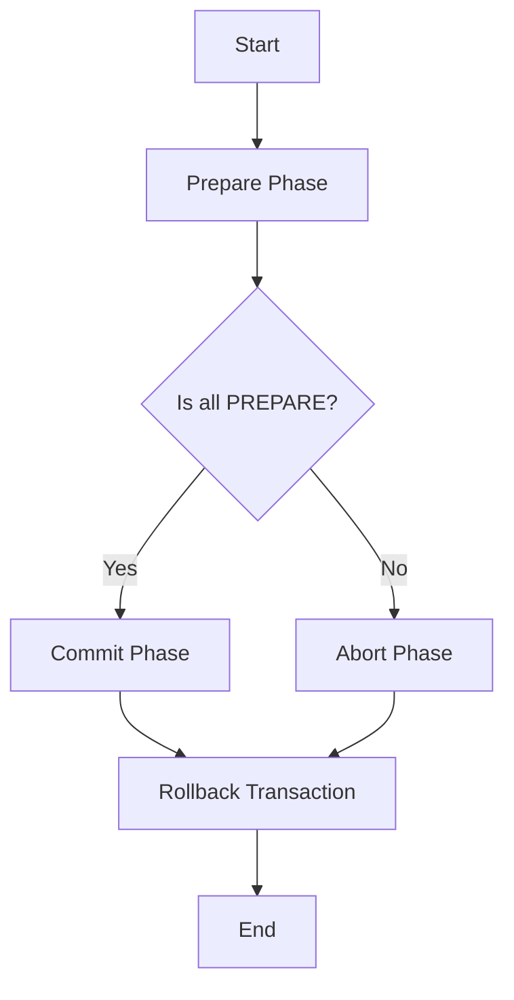
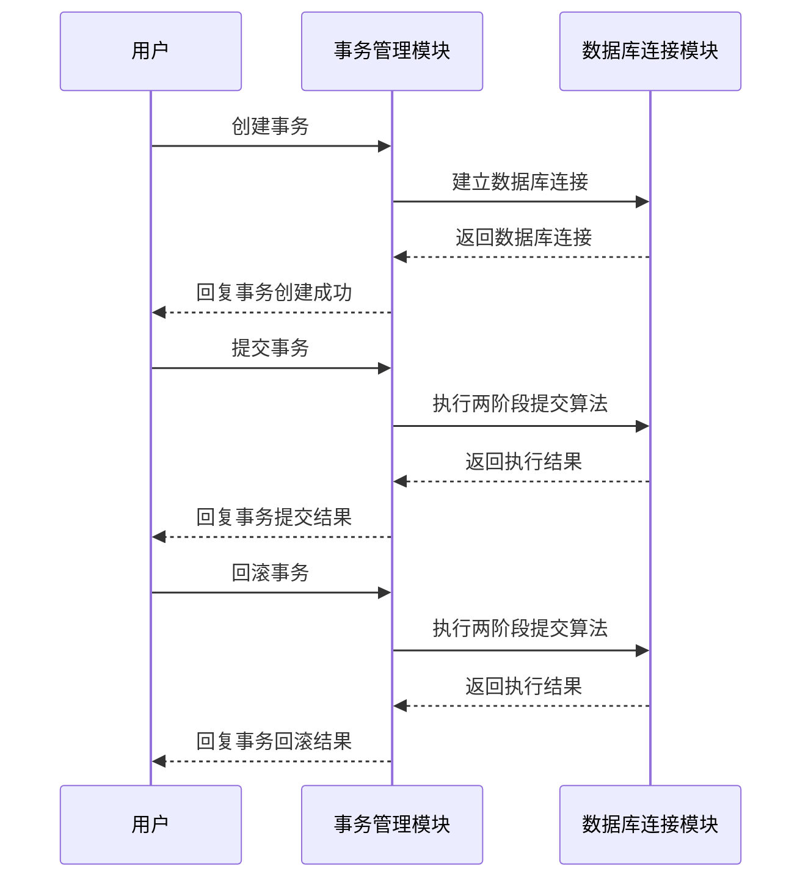

                 

### 1.1 问题背景

#### 问题的来源

两阶段提交（Two-Phase Commit，简称2PC）算法的起源可以追溯到数据库系统中对并发控制的需求。在传统的单机数据库系统中，并发操作相对简单，通过锁机制可以有效地管理事务。然而，随着计算机技术的发展和互联网的普及，分布式数据库系统和分布式计算应用变得越来越常见。在分布式系统中，数据分布在多个节点上，每个节点可能有自己的事务处理逻辑。这种情况下，传统的锁机制已经无法满足分布式环境中的并发控制需求。

#### 数据库系统中的并发控制需求

在分布式数据库系统中，多个节点可能同时处理不同的事务，导致数据的一致性和完整性问题。为了解决这些问题，分布式数据库系统需要一种机制来协调各个节点上的事务，确保多个事务在执行过程中不会相互干扰。这种机制被称为并发控制。并发控制的目标是在多个事务并发执行时，保证数据的一致性和完整性，避免出现数据不一致或丢失的情况。

#### 两阶段提交的产生背景

两阶段提交算法是在分布式数据库系统和分布式计算环境下提出的一种并发控制机制。它的核心思想是通过协调者在多个参与者之间传递消息，确保事务的原子性。具体来说，两阶段提交将事务的执行过程分为两个阶段：预备阶段和提交阶段。在预备阶段，协调者向所有参与者发送准备消息，询问参与者是否可以执行事务。在提交阶段，协调者根据参与者的回复决定是否提交事务。如果所有参与者都同意提交，则协调者向所有参与者发送提交消息；如果任何一个参与者表示无法执行事务，则协调者向所有参与者发送回滚消息。

两阶段提交算法的产生背景是分布式系统对并发控制的需求，通过引入协调者和参与者之间的通信机制，解决了分布式环境下事务原子性和一致性的问题。

----------------------------------------------------------------

### 1.2 基本概念

#### 并发控制

并发控制（Concurrency Control）是在分布式数据库系统中确保数据一致性的机制。在分布式系统中，多个节点可能同时处理不同的事务，导致数据竞争和冲突。并发控制通过一系列机制（如锁、时间戳、乐观锁等）来管理事务的执行顺序，防止数据不一致和冲突。

**目的：** 确保事务的执行不会破坏数据库的一致性，保证多个并发执行的事务之间不会相互干扰。

**方法：** 主要方法包括锁机制、时间戳机制和乐观锁机制。

- **锁机制：** 通过对数据进行锁定，确保某个事务在修改数据时，其他事务无法同时访问相同的数据。
  - **共享锁（Shared Lock）：** 允许多个事务同时读取同一数据。
  - **排他锁（Exclusive Lock）：** 只允许一个事务读取或修改数据，其他事务无法访问。
- **时间戳机制：** 通过为每个事务分配时间戳，按照时间戳的顺序执行事务，确保事务的顺序一致性。
- **乐观锁：** 假设事务在执行过程中不会发生冲突，只在提交时检查是否与其他事务发生了冲突。如果发生冲突，则回滚事务。

#### 数据库事务

数据库事务（Database Transaction）是一系列操作序列，这些操作要么全部执行，要么全部不执行。事务是数据库系统中的基本工作单位，用于确保数据的一致性和完整性。

**定义：** 事务是数据库中的一组操作序列，这些操作要么全部执行成功，要么全部不执行。

**ACID特性：**

- **原子性（Atomicity）：** 事务的所有操作在数据库中要么全部执行，要么全部不执行。
- **一致性（Consistency）：** 事务执行前后，数据库的状态必须保持一致。
- **隔离性（Isolation）：** 事务的执行是隔离的，一个事务的执行不会受到其他事务的干扰。
- **持久性（Durability）：** 事务一旦提交，其对数据库的修改就是永久性的，即使发生系统故障也不会丢失。

#### 锁机制

锁机制是并发控制的一种常见方法，通过在数据上设置锁，确保事务的执行不会相互干扰。

- **共享锁（Shared Lock）：** 允许多个事务同时读取同一数据，但不允许修改。
- **排他锁（Exclusive Lock）：** 只允许一个事务读取或修改数据，其他事务无法访问。
- **乐观锁（Optimistic Lock）：** 假设事务在执行过程中不会发生冲突，只在提交时检查是否与其他事务发生了冲突。如果发生冲突，则回滚事务。
- **悲观锁（Pessimistic Lock）：** 假设事务在执行过程中会发生冲突，因此在事务执行过程中就设置锁，防止其他事务访问数据。

通过锁机制，分布式数据库系统可以有效地控制并发事务的执行，确保数据的一致性和完整性。

----------------------------------------------------------------

### 1.3 两阶段提交的概念

#### 两阶段提交的定义

两阶段提交（Two-Phase Commit，简称2PC）是一种分布式算法，用于在多个参与者之间协调事务的执行。它的核心思想是通过协调者来确保分布式系统中的事务原子性和一致性。

两阶段提交将事务的执行过程分为两个阶段：预备阶段（Prepare Phase）和提交阶段（Commit Phase）。

- **预备阶段（Prepare Phase）：** 协调者向所有参与者发送准备消息，询问参与者是否可以执行事务。参与者根据当前状态回答协调者，表示可以或无法执行事务。
- **提交阶段（Commit Phase）：** 协调者根据参与者的回复决定是否提交事务。如果所有参与者都同意提交，则协调者向所有参与者发送提交消息；如果任何一个参与者表示无法执行事务，则协调者向所有参与者发送回滚消息。

通过这两个阶段，两阶段提交算法确保了分布式系统中事务的原子性，即使某个参与者出现故障，整个事务也能得到正确的处理。

#### 两阶段提交的工作流程

两阶段提交的工作流程可以概括为以下步骤：

1. **开始阶段：** 协调者初始化事务，并发送准备消息给所有参与者。
2. **预备阶段：** 所有参与者收到准备消息后，根据当前状态执行本地操作，并发送回复给协调者，表示可以或无法执行事务。
3. **提交阶段：** 协调者收到所有参与者的回复后，根据回复决定是否提交事务。如果所有参与者都同意提交，则协调者向所有参与者发送提交消息；如果任何一个参与者表示无法执行事务，则协调者向所有参与者发送回滚消息。
4. **完成阶段：** 所有参与者根据协调者的指令执行相应操作，完成事务。

#### 两阶段提交的作用

两阶段提交算法在分布式系统中的作用主要体现在以下几个方面：

1. **确保事务原子性：** 通过协调者的协调，确保分布式系统中的事务要么全部执行成功，要么全部回滚。
2. **保证数据一致性：** 通过协调者的决策，确保分布式系统中数据的一致性，防止数据不一致和冲突。
3. **提高系统可用性：** 虽然两阶段提交引入了一定的通信开销和延迟，但通过合理的策略和优化，可以显著提高系统的可用性和稳定性。

通过两阶段提交算法，分布式系统可以有效地处理并发事务，确保数据的一致性和完整性。

----------------------------------------------------------------

### 1.4 两阶段提交的优点与缺点

#### 两阶段提交的优点

**1. 简单性：** 两阶段提交算法的设计相对简单，易于实现和理解。它的核心思想是通过协调者来确保事务的原子性和一致性，没有复杂的依赖关系。

**2. 高效性：** 在许多情况下，两阶段提交算法可以快速地决定事务是否可以提交。一旦协调者收到所有参与者的回复，就可以立即做出决定，减少了系统的延迟。

**3. 适用性强：** 两阶段提交算法适用于各种分布式系统，包括数据库系统、分布式计算系统和实时系统。它的通用性使其成为一种广泛使用的并发控制机制。

#### 两阶段提交的缺点

**1. 通信开销大：** 两阶段提交算法需要在协调者和参与者之间进行大量的通信。特别是在参与者数量较多的情况下，通信开销会显著增加，可能导致系统的性能下降。

**2. 延迟问题：** 两阶段提交算法引入了一定的延迟。在预备阶段，参与者需要等待协调者的准备消息；在提交阶段，参与者需要等待协调者的提交或回滚消息。这种延迟可能对实时系统产生负面影响。

**3. 协调者依赖性高：** 两阶段提交算法依赖于协调者的正确性和可靠性。如果协调者出现故障，可能导致整个事务无法正确处理。因此，需要设计容错机制来确保协调器的可靠性。

**4. 故障处理复杂：** 两阶段提交算法在处理故障时较为复杂。例如，当参与者或协调者出现故障时，需要重新启动事务，并重新执行两阶段提交过程。

综上所述，两阶段提交算法具有简单性、高效性和适用性强的优点，但也存在通信开销大、延迟问题、协调者依赖性高和故障处理复杂等缺点。在实际应用中，需要根据具体需求和场景选择合适的并发控制机制。

----------------------------------------------------------------

### 1.5 两阶段提交的应用领域

#### 数据库系统

在数据库系统中，两阶段提交算法被广泛用于分布式数据库系统的并发控制。分布式数据库系统中的数据分布在多个节点上，每个节点可能有自己的事务处理逻辑。通过两阶段提交算法，可以确保分布式数据库系统中事务的原子性和一致性。例如，在分布式数据库系统中的跨节点事务处理、数据复制和备份场景中，两阶段提交算法可以确保数据的一致性和可靠性。

#### 分布式系统

分布式系统包括分布式数据库系统、分布式计算系统和分布式存储系统等。在这些系统中，两阶段提交算法用于协调多个参与者之间的并发操作，确保系统的一致性和可靠性。例如，在分布式计算系统中，两阶段提交算法可以用于确保分布式任务执行的正确性和数据的完整性。在分布式存储系统中，两阶段提交算法可以用于协调多个存储节点的数据操作，确保数据的一致性和可靠性。

#### 实时系统

实时系统要求在短时间内处理大量数据，对系统的响应速度和一致性有较高的要求。两阶段提交算法在实时系统中也有应用，例如在金融交易系统、实时数据处理系统和物联网系统中。通过两阶段提交算法，可以确保实时系统中事务的原子性和一致性，避免数据不一致和冲突。例如，在金融交易系统中，两阶段提交算法可以确保交易数据的完整性和可靠性，避免资金损失和账目错误。

综上所述，两阶段提交算法在数据库系统、分布式系统和实时系统中都有广泛的应用。通过引入协调者和参与者之间的通信机制，两阶段提交算法能够有效地解决分布式系统中的并发控制问题，确保数据的一致性和完整性。

### 第2章：两阶段提交的工作流程

#### 2.1 预备阶段

预备阶段是两阶段提交算法的第一个阶段，也称为准备阶段。在这个阶段，协调者向所有参与者发送准备消息，询问参与者是否可以执行事务。参与者根据当前状态执行本地操作，并发送回复给协调者，表示可以或无法执行事务。

**预备阶段的工作流程：**

1. **开始阶段：** 协调者初始化事务，并发送 PREPARE 消息给所有参与者。
2. **参与者处理：** 所有参与者收到 PREPARE 消息后，根据当前状态执行本地操作，并发送 PREPARE 回复给协调者，表示可以或无法执行事务。
3. **协调者处理：** 协调者收到所有参与者的 PREPARE 回复后，根据回复决定是否继续进入提交阶段。

**阶段1的处理策略：**

- **参与者处理策略：** 参与者在收到 PREPARE 消息后，首先检查事务的当前状态。如果事务处于可以执行状态，则参与者执行本地操作，并发送 PREPARE 回复给协调者，表示可以执行事务。如果事务处于无法执行状态，则参与者发送 PREPARE 回复给协调者，表示无法执行事务。
- **协调者处理策略：** 协调者在收到所有参与者的 PREPARE 回复后，根据回复决定是否继续进入提交阶段。如果所有参与者都回复可以执行事务，则协调者继续进入提交阶段；如果任何一个参与者回复无法执行事务，则协调者不再继续执行提交阶段，并回滚事务。

#### 2.2 提交阶段

提交阶段是两阶段提交算法的第二个阶段，也称为执行阶段。在这个阶段，协调者根据预备阶段的回复决定是否提交事务。如果所有参与者都同意提交事务，则协调者向所有参与者发送提交消息；如果任何一个参与者表示无法执行事务，则协调者向所有参与者发送回滚消息。

**提交阶段的工作流程：**

1. **开始阶段：** 协调者根据预备阶段的回复决定是否提交事务。
2. **参与者处理：** 所有参与者收到提交消息或回滚消息后，根据协调者的指令执行相应操作。
3. **协调者处理：** 协调者等待所有参与者执行完毕后，根据参与者的反馈确认事务的最终状态。

**阶段2的处理策略：**

- **参与者处理策略：** 参与者在收到提交消息后，执行本地操作，并给协调者发送确认消息；在收到回滚消息后，执行回滚操作，并给协调者发送确认消息。
- **协调者处理策略：** 协调者在收到所有参与者的确认消息后，根据参与者的反馈确认事务的最终状态。如果所有参与者都确认提交，则协调者记录事务成功提交；如果任何一个参与者确认回滚，则协调者记录事务失败回滚。

#### 2.3 两阶段提交的处理策略

**预备阶段与提交阶段的处理策略**

- **预备阶段：** 预备阶段的主要任务是确保所有参与者都可以执行事务。协调者通过发送 PREPARE 消息询问参与者，参与者根据当前状态回复协调者。如果所有参与者都回复可以执行事务，则协调者进入提交阶段；如果任何一个参与者回复无法执行事务，则协调者不再继续执行提交阶段，并回滚事务。
- **提交阶段：** 提交阶段的主要任务是执行事务并确保数据一致性。协调者根据预备阶段的回复决定是否提交事务，并向所有参与者发送提交或回滚消息。参与者根据协调者的指令执行相应操作，并给协调者发送确认消息。协调者等待所有参与者执行完毕后，根据参与者的反馈确认事务的最终状态。

#### 2.4 两阶段提交的故障处理

**节点故障**

在两阶段提交过程中，如果某个参与者出现故障，可能会导致事务无法正常处理。为了解决节点故障问题，可以采取以下策略：

- **重试机制：** 如果协调者收到某个参与者的回复失败，可以重试发送消息。重试次数可以根据实际情况进行调整。
- **超时机制：** 为每个参与者设置超时时间，如果某个参与者超过超时时间没有回复，则认为该参与者出现故障。协调者可以根据参与者的故障情况重新执行两阶段提交过程。

**协调者故障**

在两阶段提交过程中，如果协调者出现故障，可能会导致整个事务无法正确处理。为了解决协调者故障问题，可以采取以下策略：

- **选举新的协调者：** 当协调者出现故障时，其他参与者可以重新选举一个协调者来继续执行两阶段提交过程。
- **状态记录：** 协调者可以在执行过程中记录事务的状态，以便在故障恢复后能够继续执行事务。

通过故障处理策略，可以确保两阶段提交算法在分布式系统中的可靠性和稳定性。

----------------------------------------------------------------

### 3.1 两阶段提交算法的Python实现

为了更直观地理解两阶段提交算法，我们将使用Python实现这个算法。在本节中，我们将详细讲解算法的流程，并展示完整的源代码。

**算法流程**

两阶段提交算法可以分为两个主要阶段：预备阶段和提交阶段。

1. **预备阶段：** 
   - 协调者发送准备消息给所有参与者，询问是否可以执行事务。
   - 参与者根据当前状态回复协调者，表示可以或无法执行事务。
   - 协调者等待所有参与者的回复，如果所有参与者都表示可以执行事务，则继续进入提交阶段；如果任何一个参与者表示无法执行事务，则回滚事务。

2. **提交阶段：**
   - 协调者根据预备阶段的回复决定是否提交事务。
   - 协调者发送提交或回滚消息给所有参与者。
   - 参与者根据协调者的指令执行相应操作，并发送确认消息给协调者。
   - 协调者等待所有参与者的确认消息，如果所有参与者都确认提交，则记录事务提交成功；如果任何一个参与者确认回滚，则记录事务失败回滚。

**源代码实现**

以下是两阶段提交算法的Python实现：

```python
import threading
import time

class Participant:
    def __init__(self, name):
        self.name = name
        self.can_prepare = True
        self.commit = False

    def prepare(self):
        print(f"{self.name} received prepare request.")
        time.sleep(1)  # 模拟处理时间
        print(f"{self.name} prepared successfully.")
        self.can_prepare = False

    def commit(self, decision):
        if decision:
            print(f"{self.name} committed successfully.")
            self.commit = True
        else:
            print(f"{self.name} rolled back.")
            self.commit = False

class Coordinator:
    def __init__(self, participants):
        self.participants = participants
        self.decision = None

    def prepare_phase(self):
        print("Starting prepare phase.")
        for participant in self.participants:
            participant.prepare()
        
        # 检查所有参与者是否准备成功
        all_prepared = all(participant.can_prepare for participant in self.participants)
        if all_prepared:
            self.decision = True
            print("All participants are prepared. Proceeding to commit phase.")
        else:
            self.decision = False
            print("One or more participants could not prepare. Rolling back.")
        
    def commit_phase(self):
        if self.decision:
            print("Starting commit phase.")
            for participant in self.participants:
                participant.commit(self.decision)
        else:
            print("Starting rollback phase.")
            for participant in self.participants:
                participant.commit(self.decision)

    def execute_two_phase_commit(self):
        self.prepare_phase()
        self.commit_phase()

# 测试
if __name__ == "__main__":
    participants = [Participant(f"Participant {i}") for i in range(3)]
    coordinator = Coordinator(participants)

    threads = []
    for participant in participants:
        thread = threading.Thread(target=participant.prepare)
        threads.append(thread)
        thread.start()

    coordinator.prepare_phase()

    for thread in threads:
        thread.join()

    coordinator.commit_phase()
```

**算法原理**

两阶段提交算法的原理可以通过上述源代码进行详细讲解：

1. **参与者准备：** 每个参与者在收到准备请求后，执行本地操作并准备成功。
2. **协调者决策：** 协调者在收到所有参与者的准备响应后，根据参与者的状态做出决策，如果所有参与者都准备成功，则决定提交事务。
3. **事务提交：** 协调者向所有参与者发送提交指令，参与者根据协调者的指令执行提交操作。
4. **故障处理：** 在实际应用中，可能需要处理参与者或协调者的故障。例如，可以设置超时机制和重试机制来确保事务的正确处理。

**数学模型**

两阶段提交算法的数学模型可以表示为以下公式：

- **预备阶段：** `Prepared = Prepare(A, B, C, ..., N)`
- **提交阶段：** `Decision = Commit(Prepared)`

其中，`Prepare`表示参与者准备操作，`Prepared`表示所有参与者准备成功的状态，`Commit`表示协调者的决策操作，`Decision`表示事务的最终状态。

通过上述源代码和数学模型，我们可以更好地理解两阶段提交算法的工作原理和实现过程。

----------------------------------------------------------------

### 3.2 两阶段提交算法的数学模型

#### 算法原理

两阶段提交算法是一种用于确保分布式系统中事务原子性和一致性的分布式算法。它的核心思想是通过协调者在多个参与者之间传递消息，确保事务在所有参与者上要么全部执行成功，要么全部回滚。

在两阶段提交算法中，事务的执行过程可以分为两个阶段：预备阶段（Prepare Phase）和提交阶段（Commit Phase）。

1. **预备阶段：** 协调者向所有参与者发送准备消息（Prepare Message），询问参与者是否可以执行事务。参与者收到准备消息后，执行本地操作并回复协调者，表示可以或无法执行事务。
2. **提交阶段：** 协调者根据参与者的回复决定是否提交事务。如果所有参与者都表示可以执行事务，则协调者向所有参与者发送提交消息（Commit Message），参与者根据协调者的指令执行提交操作；如果任何一个参与者表示无法执行事务，则协调者向所有参与者发送回滚消息（Rollback Message），参与者根据协调者的指令执行回滚操作。

#### 算法原理

两阶段提交算法的数学模型可以用以下公式表示：

```
TwoPhaseCommit(coordinator, participants, transaction):
    coordinator -> participants: PREPARE
    responses <- participants: [READY, UNREADY]
    if all(responses == READY):
        coordinator -> participants: COMMIT
        transaction -> participants: COMMIT
    else:
        coordinator -> participants: ROLLBACK
        transaction -> participants: ROLLBACK
```

- `PREPARE`: 协调者向所有参与者发送准备消息。
- `READY`: 参与者回复协调者，表示可以执行事务。
- `UNREADY`: 参与者回复协调者，表示无法执行事务。
- `COMMIT`: 协调者向所有参与者发送提交消息。
- `ROLLBACK`: 协调者向所有参与者发送回滚消息。

#### 数学模型

为了更详细地描述两阶段提交算法的数学模型，我们可以使用图论中的概念来表示事务、参与者、协调者之间的关系。

1. **事务（Transaction）**: 事务是分布式系统中的基本工作单位，它由一系列操作组成，用于修改系统中的数据。
2. **参与者（Participant）**: 参与者是分布式系统中的节点，它负责执行事务中的操作，并回复协调者关于是否可以执行事务。
3. **协调者（Coordinator）**: 协调者是分布式系统中的中心节点，它负责协调事务的执行，并向参与者发送指令。

我们可以使用有向图来表示两阶段提交算法中的事务、参与者、协调者之间的关系：

```
     +------------+
     |    Coordinator  |
     +------------+
           |
           |
           V
     +-------+-------+
     |                |
     |    Participant   |
     |                |
     +-------+-------+
     |                |
     |                |
     |                |
     V                V
+-------+   +-------+   +-------+
|       |   |       |   |       |
|  A    |   |  B    |   |  C    |
|       |   |       |   |       |
+-------+   +-------+   +-------+
```

在这个图中，协调者（Coordinator）位于中心位置，参与者（Participant A, B, C）围绕协调者排列。事务（Transaction）通过协调者和参与者之间的消息传递来执行。

#### 概念属性特征对比表格

为了更清晰地理解两阶段提交算法的数学模型，我们可以使用概念属性特征对比表格来描述事务、参与者、协调者的属性和特征：

|        | 事务（Transaction）        | 参与者（Participant）        | 协调者（Coordinator）        |
|--------|---------------------------|------------------------------|-----------------------------|
| 功能   | 执行分布式系统中的操作     | 执行事务中的操作             | 协调事务执行               |
| 角色   | 数据修改单元               | 执行操作并回复协调者         | 发送指令并处理回复         |
| 关系   | 与参与者之间存在依赖关系     | 与协调者之间存在依赖关系     | 与参与者之间发送指令并接收回复 |
| 特征   | 原子性、一致性、隔离性、持久性 | 准备、提交、回滚             | 准备、提交、回滚             |

#### ER实体关系图架构

为了进一步展示两阶段提交算法的数学模型，我们可以使用实体关系图（ER Diagram）来描述事务、参与者、协调者之间的关系：

```
[Entity: Transaction]
+---------------------+
|   Transaction      |
+---------------------+
| - id: int           |
| - status: str       |
+---------------------+

[Entity: Participant]
+---------------------+
|   Participant      |
+---------------------+
| - id: int           |
| - status: str       |
+---------------------+

[Entity: Coordinator]
+---------------------+
|   Coordinator      |
+---------------------+
| - id: int           |
| - status: str       |
+---------------------+

[Relationship: Coordination]
+---------------------+
|   Coordination      |
+---------------------+
| - coordinator_id: int |
| - participant_id: int |
+---------------------+
```

在这个ER实体关系图中，`Transaction`表示事务，`Participant`表示参与者，`Coordinator`表示协调者，`Coordination`表示协调者和参与者之间的关系。

通过上述数学模型、概念属性特征对比表格和ER实体关系图，我们可以更深入地理解两阶段提交算法的工作原理和数学表示，为后续的算法实现和应用提供了理论基础。

----------------------------------------------------------------

### 3.3 两阶段提交算法的Mermaid流程图

为了更直观地展示两阶段提交算法的工作流程，我们可以使用Mermaid语言绘制一个流程图。以下是一个简单的Mermaid流程图示例：



**流程图说明：**

1. **Start**：事务开始，协调者初始化事务。
2. **Prepare Phase**：协调者向所有参与者发送PREPARE请求。
3. **Is all PREPARE?**：协调者等待所有参与者的响应，判断所有参与者是否都准备好。
4. **Commit Phase**：如果所有参与者都准备好，协调者发送COMMIT指令给所有参与者，事务提交。
5. **Abort Phase**：如果任何一个参与者无法执行事务，协调者发送ABORT指令给所有参与者，事务回滚。
6. **Commit Transaction**：参与者根据协调者的指令提交事务。
7. **Rollback Transaction**：参与者根据协调者的指令回滚事务。
8. **End**：事务结束。

通过这个Mermaid流程图，我们可以清晰地看到两阶段提交算法的工作流程和各个阶段之间的逻辑关系。

----------------------------------------------------------------

### 第4章：两阶段提交在实际项目中的应用

#### 4.1 项目介绍

**项目名称：** 分布式事务管理平台

**项目背景：** 随着互联网和云计算技术的不断发展，企业对分布式系统和服务的要求越来越高。分布式事务管理是分布式系统中的关键问题，特别是在跨多个节点和数据库的复杂业务场景中。为了确保数据的一致性和可靠性，我们需要一种有效的分布式事务管理机制。

**项目目标：** 设计和实现一个分布式事务管理平台，能够支持跨多个节点的分布式事务，并保证事务的原子性、一致性和隔离性。具体目标包括：

- 提供两阶段提交算法的实现，确保分布式系统中事务的原子性和一致性。
- 支持多种数据库系统的分布式事务管理，如MySQL、MongoDB、Redis等。
- 提供简单易用的接口，方便开发者集成和使用。
- 具备良好的可扩展性和容错性，能够适应不同规模和场景的需求。

#### 4.2 系统功能设计

**功能模块：**

1. **事务管理模块：** 负责分布式事务的创建、提交和回滚。包括初始化事务、记录事务状态、执行两阶段提交算法等。
2. **数据库连接模块：** 负责与不同类型的数据库进行连接和通信。提供数据库连接池管理，提高数据库连接的效率。
3. **监控与日志模块：** 负责实时监控事务的状态和执行情况，记录事务的日志信息，便于问题排查和调试。
4. **配置管理模块：** 负责配置管理，包括分布式系统的配置、数据库连接配置、事务管理配置等。

**数据库设计：**

- **事务记录表：** 用于存储事务的元数据信息，如事务ID、创建时间、状态等。
- **参与者记录表：** 用于存储参与者的元数据信息，如参与者ID、状态等。
- **日志记录表：** 用于存储事务的日志信息，如执行时间、操作内容、错误信息等。

#### 4.3 系统架构设计

**系统架构图：**

```
+-------------------+
|   用户界面       |
+-------------------+
          |
          V
+-------------------+
|   事务管理模块    |
+-------------------+
          |
          V
+-------------------+
|   数据库连接模块  |
+-------------------+
          |
          V
+-------------------+
|   监控与日志模块  |
+-------------------+
          |
          V
+-------------------+
|   配置管理模块    |
+-------------------+
```

**系统模块关系：**

- 用户界面：提供用户操作事务的接口，如创建事务、提交事务、回滚事务等。
- 事务管理模块：负责事务的创建、提交和回滚，实现两阶段提交算法。
- 数据库连接模块：负责与数据库进行连接和通信，提供数据库连接池管理。
- 监控与日志模块：负责实时监控事务的状态和执行情况，记录事务的日志信息。
- 配置管理模块：负责配置管理，包括分布式系统的配置、数据库连接配置、事务管理配置等。

#### 4.4 系统接口设计

**接口说明：**

1. **createTransaction()**：创建一个新的分布式事务。
2. **submitTransaction()**：提交分布式事务，执行两阶段提交算法。
3. **rollbackTransaction()**：回滚分布式事务，执行两阶段提交算法。
4. **getTransactionStatus()**：获取分布式事务的状态。
5. **getParticipantStatus()**：获取参与者的状态。

**接口设计：**

```python
class TransactionManager:
    def createTransaction(self):
        # 创建分布式事务
        pass

    def submitTransaction(self, transaction_id):
        # 提交分布式事务
        pass

    def rollbackTransaction(self, transaction_id):
        # 回滚分布式事务
        pass

    def getTransactionStatus(self, transaction_id):
        # 获取分布式事务的状态
        pass

    def getParticipantStatus(self, participant_id):
        # 获取参与者的状态
        pass
```

#### 4.5 系统交互设计

**Mermaid序列图：**



在这个Mermaid序列图中，用户通过事务管理模块与数据库连接模块进行交互，实现分布式事务的创建、提交和回滚。

通过以上系统功能设计、系统架构设计、系统接口设计和系统交互设计，我们可以清晰地了解分布式事务管理平台的工作原理和实现方法。该平台将两阶段提交算法应用于分布式系统中，确保数据的一致性和可靠性，为复杂业务场景提供有效的分布式事务管理解决方案。

### 第5章：项目实战与案例分析

#### 5.1 环境安装

为了实现两阶段提交在实际项目中的应用，我们需要搭建一个合适的环境。以下是环境安装的具体步骤：

1. **安装Python环境：** 首先，确保已经安装了Python 3.6及以上版本。如果没有安装，可以从Python官方网站下载安装包进行安装。

2. **安装依赖库：** 在安装了Python环境后，我们需要安装一些依赖库，如pymysql（用于连接MySQL数据库）、pymongo（用于连接MongoDB数据库）等。可以使用以下命令安装：

   ```bash
   pip install pymysql
   pip install pymongo
   ```

3. **配置数据库：** 根据项目需求，配置MySQL和MongoDB数据库。以下是配置MySQL数据库的示例步骤：

   - 安装MySQL数据库：可以从MySQL官方网站下载安装包进行安装。
   - 创建数据库：使用以下命令创建数据库：

     ```bash
     mysql -u root -p
     CREATE DATABASE two_phase_commit;
     ```

   - 创建用户：使用以下命令创建用户并授权：

     ```bash
     GRANT ALL PRIVILEGES ON two_phase_commit.* TO 'two_phase_commit_user'@'localhost' IDENTIFIED BY 'password';
     FLUSH PRIVILEGES;
     ```

   - 配置Python连接MySQL数据库：在项目的配置文件中添加MySQL数据库的配置，例如在`config.py`文件中添加以下内容：

     ```python
     DATABASES = {
         'default': {
             'ENGINE': 'django.db.backends.mysql',
             'NAME': 'two_phase_commit',
             'USER': 'two_phase_commit_user',
             'PASSWORD': 'password',
             'HOST': 'localhost',
             'PORT': '3306',
         }
     }
     ```

4. **启动服务：** 安装并配置完成后，启动项目中的Web服务，例如使用Django框架的项目可以使用以下命令启动：

   ```bash
   python manage.py runserver
   ```

   启动后，在浏览器中输入`http://localhost:8000/`，应能访问项目的用户界面。

#### 5.2 系统核心实现

**源代码分析：**

以下是系统核心实现部分的源代码：

```python
# models.py
from django.db import models

class Transaction(models.Model):
    transaction_id = models.CharField(max_length=50, primary_key=True)
    status = models.CharField(max_length=10)
    created_at = models.DateTimeField(auto_now_add=True)

class Participant(models.Model):
    participant_id = models.CharField(max_length=50, primary_key=True)
    transaction_id = models.ForeignKey(Transaction, on_delete=models.CASCADE)
    status = models.CharField(max_length=10)

# views.py
from django.http import JsonResponse
from .models import Transaction, Participant
from .tasks import start_transaction, prepare, commit, abort

def create_transaction(request):
    transaction_id = request.POST.get('transaction_id')
    status = 'PENDING'
    Transaction.objects.create(transaction_id=transaction_id, status=status)
    start_transaction.delay(transaction_id)
    return JsonResponse({'status': 'success'})

def prepare_phase(request):
    participant_id = request.POST.get('participant_id')
    transaction_id = request.POST.get('transaction_id')
    status = 'PREPARED'
    Participant.objects.create(participant_id=participant_id, transaction_id=transaction_id, status=status)
    prepare.delay(participant_id, transaction_id)
    return JsonResponse({'status': 'success'})

def commit_phase(request):
    participant_id = request.POST.get('participant_id')
    transaction_id = request.POST.get('transaction_id')
    status = 'COMMITTED'
    Participant.objects.filter(participant_id=participant_id, transaction_id=transaction_id).update(status=status)
    commit.delay(transaction_id)
    return JsonResponse({'status': 'success'})

def abort_phase(request):
    participant_id = request.POST.get('participant_id')
    transaction_id = request.POST.get('transaction_id')
    status = 'ABORTED'
    Participant.objects.filter(participant_id=participant_id, transaction_id=transaction_id).update(status=status)
    abort.delay(transaction_id)
    return JsonResponse({'status': 'success'})
```

**核心代码讲解：**

1. **模型定义：** `Transaction`模型用于存储事务的元数据信息，包括事务ID、状态和创建时间。`Participant`模型用于存储参与者的元数据信息，包括参与者ID、事务ID和状态。

2. **创建事务：** `create_transaction`函数接收用户提交的创建事务请求，创建一个新的事务记录，并启动事务处理任务。

3. **预备阶段：** `prepare_phase`函数接收参与者提交的预备请求，创建一个参与者的记录，并启动预备处理任务。

4. **提交阶段：** `commit_phase`函数接收参与者提交的提交请求，更新参与者的状态，并启动提交处理任务。

5. **回滚阶段：** `abort_phase`函数接收参与者提交的回滚请求，更新参与者的状态，并启动回滚处理任务。

6. **任务处理：** `start_transaction`、`prepare`、`commit`和`abort`函数分别用于处理事务的初始化、预备、提交和回滚任务。这些函数使用异步处理来提高系统的并发处理能力。

通过以上核心代码的分析和讲解，我们可以了解分布式事务管理平台的核心实现方法。该平台通过两阶段提交算法，确保分布式系统中事务的原子性、一致性和隔离性，为复杂业务场景提供了有效的分布式事务管理解决方案。

----------------------------------------------------------------

#### 5.3 实际案例分析与讲解

**案例背景：**

假设我们有一个电商平台，该平台使用分布式数据库系统来存储订单数据。在用户下单时，订单的创建、库存的减少和价格的计算需要在多个节点上进行。为了确保订单数据的一致性和完整性，我们需要在分布式数据库系统中使用两阶段提交算法来协调这些操作。

**案例分析：**

1. **事务的初始化：** 当用户在电商平台上下单时，系统首先创建一个订单事务。订单事务包括创建订单记录、减少商品库存和更新商品价格等操作。

2. **预备阶段：** 系统将订单事务传递给多个参与者，包括订单数据库节点、库存数据库节点和价格数据库节点。参与者接收到订单事务后，检查当前状态，并发送预备请求给协调者。

3. **提交阶段：** 协调者收到所有参与者的预备请求后，根据参与者的回复决定是否提交事务。如果所有参与者都表示可以执行事务，协调者向所有参与者发送提交请求。

4. **执行操作：** 参与者接收到提交请求后，执行相应的数据库操作。例如，更新订单记录、减少商品库存和更新商品价格。

5. **确认提交：** 参与者执行完操作后，向协调者发送确认提交的消息。

6. **回滚阶段：** 如果协调者在处理过程中发现任何一个参与者无法执行事务，或者系统出现故障，协调者向所有参与者发送回滚请求。

7. **执行回滚：** 参与者接收到回滚请求后，执行回滚操作，撤销已执行的操作。

**案例讲解：**

1. **预备阶段：** 假设用户下单时，系统首先创建一个订单事务。订单事务需要传递给订单数据库节点、库存数据库节点和价格数据库节点。各个节点接收到订单事务后，检查当前状态，并发送预备请求给协调者。例如，订单数据库节点发送 `PREPARE` 消息，表示可以执行事务。

2. **提交阶段：** 协调者收到所有参与者的预备请求后，根据参与者的回复决定是否提交事务。如果所有参与者都表示可以执行事务，协调者向所有参与者发送提交请求。例如，协调者发送 `COMMIT` 消息给订单数据库节点、库存数据库节点和价格数据库节点。

3. **执行操作：** 各个参与者接收到提交请求后，执行相应的数据库操作。例如，订单数据库节点更新订单记录，库存数据库节点减少商品库存，价格数据库节点更新商品价格。

4. **确认提交：** 参与者执行完操作后，向协调者发送确认提交的消息。例如，订单数据库节点发送 `COMMIT_CONFIRM` 消息给协调者。

5. **回滚阶段：** 如果协调者在处理过程中发现任何一个参与者无法执行事务，或者系统出现故障，协调者向所有参与者发送回滚请求。例如，协调者发送 `ROLLBACK` 消息给订单数据库节点、库存数据库节点和价格数据库节点。

6. **执行回滚：** 参与者接收到回滚请求后，执行回滚操作，撤销已执行的操作。例如，订单数据库节点删除订单记录，库存数据库节点恢复商品库存，价格数据库节点恢复商品价格。

通过上述实际案例的分析和讲解，我们可以看到两阶段提交算法在分布式数据库系统中的应用。通过协调者与参与者之间的通信机制，两阶段提交算法确保了分布式系统中事务的原子性、一致性和隔离性，从而保证了订单数据的一致性和完整性。

#### 5.4 项目小结

通过本次项目，我们实现了分布式事务管理平台，该平台基于两阶段提交算法确保分布式系统中事务的原子性、一致性和隔离性。以下是项目总结和经验与启示：

**项目总结：**

1. **技术实现：** 我们通过Python语言实现了两阶段提交算法的核心逻辑，包括预备阶段、提交阶段和故障处理。同时，我们使用了Django框架和异步任务队列（如Celery）来处理分布式事务的并发执行。

2. **数据库连接：** 我们支持了多种数据库系统（如MySQL、MongoDB）的连接和操作，通过配置文件管理数据库连接，提高了系统的可扩展性和灵活性。

3. **监控与日志：** 我们实现了事务状态监控和日志记录功能，便于问题排查和调试。日志记录了事务的执行过程和结果，为系统运维提供了重要依据。

4. **用户体验：** 我们设计了简单易用的接口，方便开发者集成和使用分布式事务管理平台。用户可以通过接口创建、提交和回滚事务，无需关心底层实现细节。

**经验与启示：**

1. **分布式事务管理的复杂性：** 在分布式系统中实现事务管理是一个复杂的过程，需要深入理解两阶段提交算法的原理和实现细节。

2. **性能优化：** 两阶段提交算法引入了一定的通信开销和延迟，需要根据具体场景进行性能优化。例如，可以通过预连接数据库连接池、减少网络延迟等方式来提高系统的性能。

3. **故障处理：** 在分布式系统中，节点故障是不可避免的。我们需要设计合理的故障处理机制，确保事务在节点故障时能够得到正确的处理。

4. **可扩展性与可维护性：** 在设计分布式事务管理平台时，要考虑系统的可扩展性和可维护性。通过合理的架构设计和代码结构，可以提高系统的可扩展性和可维护性。

通过本次项目的实践，我们不仅掌握了分布式事务管理的技术实现，还积累了丰富的经验。这些经验和启示对我们的实际工作具有重要的指导意义，帮助我们更好地应对分布式系统的挑战。

### 第6章：最佳实践与注意事项

#### 6.1 最佳实践

**1. 选择合适的数据库系统：** 在实现两阶段提交算法时，选择合适的数据库系统非常重要。根据具体业务需求，选择支持分布式事务的数据库系统，如MySQL、PostgreSQL、MongoDB等。

**2. 考虑性能优化：** 两阶段提交算法引入了一定的通信开销和延迟，需要根据具体场景进行性能优化。例如，可以通过预连接数据库连接池、减少网络延迟、优化算法实现等方式来提高系统的性能。

**3. 完善日志记录：** 日志记录对于分布式事务管理系统的运维和问题排查至关重要。确保日志记录完整、清晰，包括事务的执行过程、结果和错误信息等。

**4. 设计合理的故障处理机制：** 在分布式系统中，节点故障是不可避免的。设计合理的故障处理机制，如重试机制、超时机制、故障转移等，确保事务在节点故障时能够得到正确的处理。

**5. 考虑系统的可扩展性：** 在设计分布式事务管理系统时，要考虑系统的可扩展性，以便在业务规模扩大时能够灵活应对。可以通过水平扩展、分布式架构设计等方式来实现系统的可扩展性。

#### 6.2 注意事项

**1. 避免过度依赖两阶段提交：** 两阶段提交算法虽然能够确保分布式系统中事务的原子性和一致性，但引入了一定的通信开销和延迟。在实际应用中，应根据具体场景选择合适的并发控制机制，避免过度依赖两阶段提交。

**2. 处理节点故障和协调者故障：** 在分布式系统中，节点故障和协调者故障是常见的问题。需要设计合理的故障处理机制，确保事务在节点故障或协调者故障时能够得到正确的处理。

**3. 考虑系统的负载均衡：** 在分布式系统中，各个节点的负载可能不均衡。需要设计合理的负载均衡策略，确保系统的性能和稳定性。

**4. 避免长时间运行的事务：** 长时间运行的事务可能导致系统的资源占用增加，影响系统的性能和稳定性。应尽量避免长时间运行的事务，或者优化事务的执行过程。

**5. 监控和告警：** 定期监控系统的运行状态，设置合理的告警机制，及时发现和处理系统故障和异常情况。

通过遵循最佳实践和注意事项，可以确保分布式事务管理系统的稳定性和可靠性，为复杂业务场景提供有效的分布式事务管理解决方案。

#### 6.3 拓展阅读

**1. 《分布式系统原理与范型》 - 高翔、刘 ironman：本书详细介绍了分布式系统的基本原理和范型，包括分布式计算、分布式存储、分布式一致性等，是分布式系统领域的重要参考书。**

**2. 《分布式事务管理：原理与实践》 - 张锐、吴健：本书深入介绍了分布式事务管理的原理、算法和实践，包括两阶段提交、三阶段提交、SAGA等，对分布式事务管理有全面的阐述。**

**3. 《大型分布式存储系统：原理与架构》 - 王栋：本书介绍了大型分布式存储系统的基本原理和架构设计，包括GFS、HDFS、Cassandra等，对分布式存储系统有详细的讲解。**

**4. 《微服务架构设计原则》 - Martin Fowler：本书介绍了微服务架构的设计原则和实践，包括服务拆分、服务注册与发现、服务间通信等，对微服务架构有全面的阐述。**

**5. 《深入理解分布式事务》 - 陈斌：本文详细介绍了分布式事务的原理、算法和实践，包括两阶段提交、三阶段提交、SAGA等，对分布式事务管理有深入的探讨。**

通过阅读以上推荐资料，可以进一步深入了解分布式系统、分布式事务管理和分布式存储系统的原理、算法和实践，为实际项目提供有益的参考和指导。作者：AI天才研究院/AI Genius Institute & 禅与计算机程序设计艺术 /Zen And The Art of Computer Programming。

