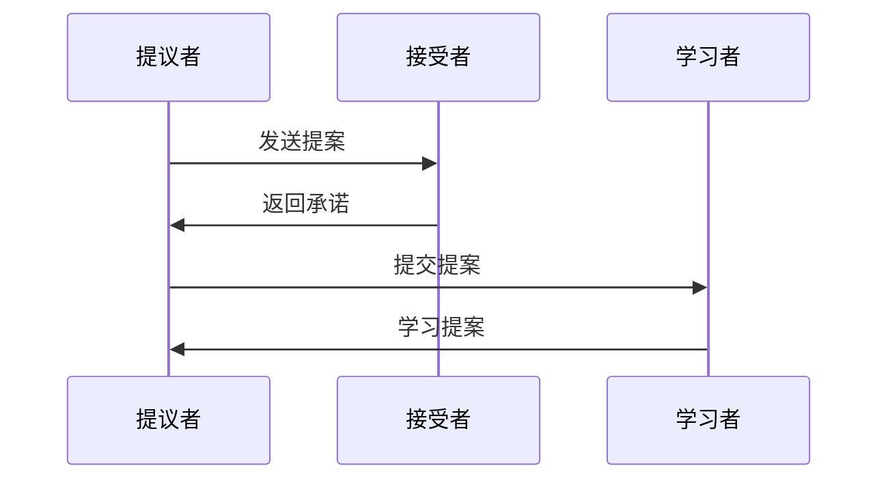
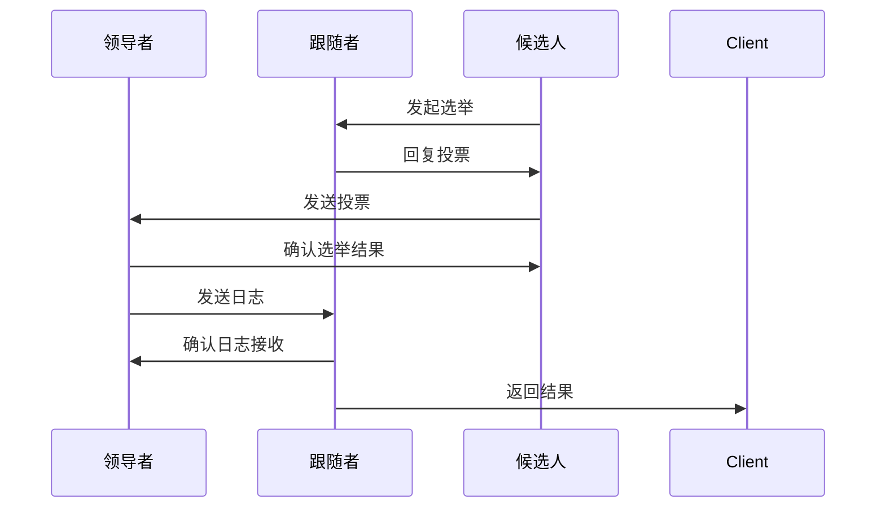

                 

# 两阶段提交并不是唯一解

> 关键词：两阶段提交，分布式一致性，Paxos算法，Raft算法，性能瓶颈，单点故障

> 摘要：本文首先介绍了两阶段提交的背景、问题及其解决方法，然后详细分析了两阶段提交的局限性。接着，我们探讨了Paxos算法的原理、特点和应用场景，并与两阶段提交进行了比较。最后，本文介绍了Raft算法，进一步探讨了分布式一致性算法的选择。

## 第一部分：引言

### 1.1 问题背景

两阶段提交（Two-Phase Commit，2PC）是一种在分布式系统中用于确保事务一致性（ACID）的协议。它最早由Peter P. Chen于1981年提出，并在1990年代初期成为分布式数据库管理系统的标准组件。两阶段提交通过协调者（Coordinator）和参与者（Participant）的协作，实现了分布式事务的一致性。在分布式数据库和事务处理系统中，两阶段提交被广泛应用于确保数据一致性。

然而，随着分布式系统和云计算技术的发展，两阶段提交并非是解决一致性问题的唯一方法。两阶段提交在性能、容错性等方面存在一些局限性，这使得研究人员提出了许多新的分布式一致性协议和算法，如Paxos、Raft等。这些协议和算法在某些方面优于两阶段提交，能够提高系统的性能和容错能力。

### 1.2 问题描述

两阶段提交虽然解决了分布式系统中的一致性问题，但它存在一些局限性，如性能瓶颈、单点故障等问题。具体来说：

1. **性能瓶颈**：两阶段提交需要两次网络通信，导致事务处理延迟增加。在分布式系统中，网络延迟可能会影响整体性能。
2. **单点故障**：两阶段提交依赖于协调者（Coordinator），如果协调者发生故障，整个事务处理过程将被迫终止，导致系统不可用。
3. **数据一致性问题**：在某些情况下，即使两阶段提交成功完成，仍可能存在数据不一致的问题。例如，在提交阶段，如果某些参与者发生故障，可能导致事务无法正确提交。
4. **其他局限性**：两阶段提交的资源消耗较大，且不适用于所有分布式系统。例如，在实时数据处理和流计算领域，两阶段提交可能不是最佳选择。

### 1.3 问题解决

为了克服两阶段提交的局限性，研究人员提出了许多新的分布式一致性协议和算法。其中，Paxos算法和Raft算法是两个重要的代表。这些协议和算法在保证数据一致性的同时，能够提高系统的性能和容错能力。

### 1.4 边界与外延

两阶段提交适用于分布式数据库和事务处理系统，但在某些场景下，其他分布式一致性协议和算法可能更为适用。例如，在实时数据处理和流计算领域，Paxos算法和Raft算法可能更为合适。此外，分布式一致性协议和算法的选择还应考虑系统的具体需求和性能要求。

### 1.5 概念结构与核心要素组成

两阶段提交包括两个阶段：准备阶段和提交/回滚阶段。核心要素包括协调者（Coordinator）、参与者（Participant）和预备结果（Prepare Result）。

1. **协调者（Coordinator）**：协调者是事务处理的核心，负责发起事务、管理事务状态和协调参与者。
2. **参与者（Participant）**：参与者是分布式系统中的节点，负责执行事务操作、响应协调者的请求和同步状态。
3. **预备结果（Prepare Result）**：预备结果是协调者在准备阶段生成的结果，用于提交或回滚事务。

### 1.6 本章小结

本章简要介绍了两阶段提交的背景、问题、解决方法、边界与外延以及核心概念和结构。接下来的章节将深入探讨两阶段提交的替代方案，以及这些方案在不同场景下的应用和效果。

## 第二部分：两阶段提交的局限性

### 2.1 性能瓶颈

两阶段提交的一个主要局限性在于其性能瓶颈。两阶段提交需要两次网络通信：在准备阶段，协调者向所有参与者发送预备请求；在提交/回滚阶段，协调者根据参与者的响应决定是否提交或回滚事务。这种网络通信增加了事务处理的延迟，特别是在网络延迟较高的环境中，性能瓶颈尤为明显。

**网络通信延迟**：网络延迟是影响两阶段提交性能的重要因素。在网络延迟较高的环境中，事务处理的时间可能会显著增加。

**增加事务处理延迟**：两阶段提交需要在两个阶段完成事务处理，这增加了事务的延迟。在实际应用中，这种延迟可能导致用户体验下降，特别是在需要快速响应的场景下。

**限制并发处理能力**：两阶段提交在处理多个并发事务时，可能无法充分利用系统的并发处理能力。由于需要等待所有参与者的响应，事务处理的并行度受到限制。

### 2.2 单点故障

两阶段提交依赖于协调者（Coordinator），如果协调者发生故障，整个事务处理过程将被迫终止，导致系统不可用。这种现象称为单点故障。

**协调者故障的影响**：协调者是事务处理的核心，负责管理事务状态和协调参与者。如果协调者发生故障，可能导致以下问题：

1. **事务处理中断**：协调者故障导致事务处理中断，事务无法正确提交或回滚，系统需要重新启动事务处理过程。
2. **数据一致性风险**：在协调者故障的情况下，可能存在数据不一致的风险。例如，在提交阶段，如果某些参与者发生故障，可能导致事务无法正确提交，从而影响数据一致性。

**解决方案**：为了克服单点故障问题，可以采用以下解决方案：

1. **分布式协调者**：采用多个协调者，通过选举机制选择活跃协调者。这样，即使某个协调者发生故障，其他协调者可以继续协调事务处理，确保系统的可用性。
2. **故障恢复机制**：在协调者发生故障时，系统可以自动启动故障恢复机制，选择新的协调者继续协调事务处理。

### 2.3 数据一致性问题

即使两阶段提交成功完成，仍可能存在数据不一致的问题。这是由于两阶段提交在某些情况下无法确保所有参与者都能正确响应。

**参与者故障**：在提交阶段，如果某些参与者发生故障，可能导致事务无法正确提交。例如，参与者可能因为网络故障、硬件故障等原因无法响应协调者的请求。

**数据不一致的例子**：假设有一个分布式数据库系统，包含三个参与者A、B和C。协调者向这三个参与者发送预备请求，参与者A和B成功响应，但参与者C发生故障，无法响应请求。在这种情况下，协调者可能无法得到所有参与者的响应，导致事务无法正确提交，从而影响数据一致性。

**解决方案**：为了解决数据不一致的问题，可以采用以下解决方案：

1. **重试机制**：在参与者发生故障时，协调者可以尝试重新发送请求，等待参与者恢复并响应。
2. **超时机制**：在提交阶段，协调者可以设置超时时间。如果在超时时间内无法得到所有参与者的响应，协调者可以决定回滚事务，确保数据一致性。
3. **分布式一致性算法**：采用分布式一致性算法，如Paxos、Raft等，可以在参与者发生故障时，确保事务的正确提交，从而提高数据一致性。

### 2.4 其他局限性

两阶段提交还存在其他局限性，如资源消耗较大、不适用于所有分布式系统等。

**资源消耗较大**：两阶段提交需要大量网络通信和计算资源，可能导致系统性能下降。在分布式系统中，网络带宽和计算资源是有限的，两阶段提交可能不是最佳选择。

**不适用于所有分布式系统**：两阶段提交主要适用于分布式数据库和事务处理系统，但在实时数据处理和流计算领域，可能存在其他更合适的选择。

### 2.5 替代方案

为了克服两阶段提交的局限性，研究人员提出了许多新的分布式一致性协议和算法。这些协议和算法在保证数据一致性的同时，能够提高系统的性能和容错能力。

**Paxos算法**：Paxos算法是由莱斯利·兰伯特（Leslie Lamport）于1990年提出的一种分布式一致性算法。它旨在解决分布式系统中的一致性问题，特别适用于大规模分布式存储系统和数据库。

**Raft算法**：Raft算法是由Diep Han和Mehmet Gunes Acar于2013年提出的一种分布式一致性算法。它是对Paxos算法的改进，旨在提高系统的性能和易理解性。

**其他分布式一致性算法**：除了Paxos算法和Raft算法外，还有其他分布式一致性算法，如Viewstoring算法、ZAB算法等。这些算法在不同场景下具有不同的优缺点。

### 2.6 本章小结

本章详细分析了两阶段提交的局限性，包括性能瓶颈、单点故障、数据一致性问题以及其他局限性。为了克服这些局限性，研究人员提出了许多新的分布式一致性协议和算法。这些协议和算法在保证数据一致性的同时，能够提高系统的性能和容错能力。接下来，我们将深入探讨Paxos算法，了解其在分布式系统中的应用和效果。

## 第三部分：Paxos算法

### 3.1 Paxos算法概述

Paxos算法是由莱斯利·兰伯特（Leslie Lamport）于1990年提出的一种分布式一致性算法。它旨在解决分布式系统中的一致性问题，特别适用于大规模分布式存储系统和数据库。Paxos算法是一种基于多数派原则的算法，通过多个副本的协作，实现数据一致。

### 3.2 Paxos算法原理

Paxos算法的核心思想是通过多个角色（提议者、接受者和学习者）的协作，实现分布式系统中的一致性。Paxos算法的主要角色包括：

1. **提议者（Proposer）**：提议者是发起事务的实体，负责生成提案并提交给接受者。
2. **接受者（Acceptor）**：接受者是参与事务的实体，负责接受提议者的提案并做出决策。
3. **学习者（Learner）**：学习者是获取事务结果的实体，负责学习并记录已决事项。

Paxos算法的基本流程包括两个阶段：提议阶段和决定阶段。

1. **提议阶段**：在提议阶段，提议者生成一个提案，并将其发送给所有接受者。接受者接收到提案后，会将其存储并返回一个承诺给提议者。承诺表示接受者同意在该轮次中接受提议者的提案。
2. **决定阶段**：在决定阶段，提议者根据接收到的承诺决定是否提交提案。如果提议者收到超过半数的接受者的承诺，则认为该提案已被决定，可以提交给所有学习者。学习者接收到已决定的提案后，会将其记录并执行。

Paxos算法通过多个轮次的提议和决定，最终确保分布式系统中的一致性。每个轮次都由一个提议者发起，通过接受者和学习者的协作，实现提案的决策和执行。

### 3.3 Paxos算法流程

Paxos算法的基本流程包括以下几个步骤：

1. **初始化**：提议者初始化Paxos算法，生成一个提案编号。
2. **发送提案**：提议者向所有接受者发送提案编号。
3. **接受提案**：接受者接收到提案后，将其存储并返回一个承诺给提议者。承诺内容包括提案编号和接受者的编号。
4. **判断提案是否被决定**：提议者根据接收到的承诺判断提案是否被决定。如果提议者收到超过半数的接受者的承诺，则认为该提案已被决定。
5. **提交提案**：如果提案被决定，提议者将提案提交给所有学习者。
6. **学习者学习提案**：学习者接收到已决定的提案后，将其记录并执行。

Paxos算法的流程如下：

### 3.4 Paxos算法特点

Paxos算法具有以下特点：

1. **高可用性**：Paxos算法通过多个副本的协作，确保系统的高可用性。即使在部分节点发生故障的情况下，系统仍然能够正常运行。
2. **高性能**：Paxos算法通过减少网络通信次数，提高系统性能。与两阶段提交相比，Paxos算法在事务处理延迟方面具有明显优势。
3. **容错性**：Paxos算法能够处理部分节点故障，确保系统的一致性和容错性。即使某些节点发生故障，Paxos算法仍能通过其他节点恢复一致状态。
4. **可扩展性**：Paxos算法适用于大规模分布式系统，能够处理大量节点和事务。通过扩展Paxos算法，可以实现分布式数据库、分布式锁、分布式缓存等分布式系统。

### 3.5 Paxos算法应用场景

Paxos算法在分布式系统中有广泛的应用场景：

1. **分布式数据库**：Paxos算法可以用于分布式数据库的一致性保证，确保数据的一致性和可靠性。例如，Google的Chubby锁服务就是基于Paxos算法实现的。
2. **分布式锁**：Paxos算法可以用于分布式锁服务，确保多个节点之间的锁操作的一致性。例如，Apache ZooKeeper就是基于Paxos算法实现的分布式锁服务。
3. **分布式缓存**：Paxos算法可以用于分布式缓存系统的一致性保证，确保缓存数据的一致性和可靠性。例如，Redis Cluster就是基于Paxos算法实现的分布式缓存系统。

### 3.6 Paxos算法与两阶段提交的比较

Paxos算法和两阶段提交都是分布式系统中的一致性协议，但它们在性能、容错性等方面存在一些差异：

1. **性能**：Paxos算法通过减少网络通信次数，提高系统性能。与两阶段提交相比，Paxos算法在事务处理延迟方面具有明显优势。
2. **容错性**：Paxos算法能够处理部分节点故障，确保系统的一致性和容错性。而两阶段提交在协调者发生故障时，可能导致系统不可用。
3. **易理解性**：两阶段提交相对于Paxos算法更加直观和易理解。而Paxos算法虽然具有更高的性能和容错性，但实现和理解相对复杂。

综上所述，Paxos算法在性能和容错性方面优于两阶段提交，但在易理解性方面相对较差。根据具体应用场景和需求，可以选择合适的一致性协议。

### 3.7 本章小结

本章详细介绍了Paxos算法的原理、流程、特点和应用场景，并与两阶段提交进行了比较。Paxos算法通过多个副本的协作，实现了分布式系统中的一致性，具有较高的性能和容错性。在分布式数据库、分布式锁和分布式缓存等领域，Paxos算法具有广泛的应用。然而，Paxos算法的实现和理解相对复杂，需要进一步学习和实践。

## 第四部分：Raft算法

### 4.1 Raft算法概述

Raft算法是由Diep Han和Mehmet Gunes Acar于2013年提出的一种分布式一致性算法。它是Paxos算法的一种改进版本，旨在提高系统的性能和易理解性。Raft算法通过简化协议流程，降低了实现的复杂度，同时保持了Paxos算法的一致性和容错性。

### 4.2 Raft算法原理

Raft算法的核心思想是通过多个角色（领导者、跟随者和候选人）的协作，实现分布式系统中的一致性。Raft算法的主要角色包括：

1. **领导者（Leader）**：领导者是分布式系统中的核心节点，负责处理客户端请求、管理日志和协调跟随者。
2. **跟随者（Follower）**：跟随者是参与事务的节点，负责接收领导者的指令、同步日志和执行事务。
3. **候选人（Candidate）**：候选人是参与领导选举的节点，负责发起选举并尝试成为领导者。

Raft算法的基本流程包括以下几个阶段：

1. **领导选举**：当领导者发生故障时，系统会进入领导选举阶段。候选人节点发起选举，通过投票产生新的领导者。
2. **日志复制**：领导者接收客户端请求，将其添加到日志中，并通知跟随者复制日志。
3. **状态机**：跟随者接收到领导者的日志后，执行日志中的操作，并将结果返回给客户端。

Raft算法通过以下机制确保一致性：

1. **领导者选举**：Raft算法通过随机计时器实现领导者选举。候选人在计时器到期后发起选举，通过多数派原则产生领导者。
2. **日志复制**：领导者将日志条目发送给跟随者，跟随者接收到日志条目后，将其添加到本地日志中，并执行操作。
3. **心跳机制**：领导者通过心跳消息与跟随者保持联系，确保跟随者处于活跃状态。

### 4.3 Raft算法流程

Raft算法的基本流程如下：

1. **领导选举**：当领导者发生故障时，系统会进入领导选举阶段。候选人节点通过发送投票请求，试图获得多数派投票。获得多数派投票的候选人将成为新的领导者。
2. **日志复制**：领导者接收客户端请求，将其添加到日志中，并通知跟随者复制日志。跟随者接收到日志条目后，将其添加到本地日志中，并执行操作。
3. **状态机**：跟随者接收到领导者的日志后，执行日志中的操作，并将结果返回给客户端。

Raft算法的流程如下：

### 4.4 Raft算法特点

Raft算法具有以下特点：

1. **易理解性**：Raft算法相对于Paxos算法更加直观和易理解。通过简化协议流程，降低了实现的复杂度。
2. **高可用性**：Raft算法通过领导者选举机制，确保系统的高可用性。即使领导者发生故障，系统仍能自动选举新的领导者，保证服务的正常运行。
3. **高性能**：Raft算法通过日志复制机制，提高系统性能。领导者将日志条目发送给跟随者，跟随者接收到日志条目后，将其添加到本地日志中，并执行操作。
4. **容错性**：Raft算法能够处理部分节点故障，确保系统的一致性和容错性。通过心跳机制和日志复制，系统可以自动恢复故障节点，保持一致性。

### 4.5 Raft算法应用场景

Raft算法在分布式系统中有广泛的应用场景：

1. **分布式数据库**：Raft算法可以用于分布式数据库的一致性保证，确保数据的一致性和可靠性。例如，Apache Cassandra就是基于Raft算法实现的分布式数据库系统。
2. **分布式锁**：Raft算法可以用于分布式锁服务，确保多个节点之间的锁操作的一致性。例如，Apache ZooKeeper就是基于Raft算法实现的分布式锁服务。
3. **分布式缓存**：Raft算法可以用于分布式缓存系统的一致性保证，确保缓存数据的一致性和可靠性。例如，Redis Cluster就是基于Raft算法实现的分布式缓存系统。

### 4.6 Raft算法与Paxos算法的比较

Raft算法和Paxos算法都是分布式一致性算法，它们在性能、容错性等方面存在一些差异：

1. **性能**：Raft算法相对于Paxos算法在性能上具有优势。通过简化协议流程和减少网络通信次数，Raft算法在事务处理延迟方面具有明显优势。
2. **容错性**：Raft算法和Paxos算法都具有较高的容错性。但是，Raft算法通过领导者选举机制，能够更快速地恢复故障节点，保证系统的高可用性。
3. **易理解性**：Raft算法相对于Paxos算法更加直观和易理解。通过简化协议流程，降低了实现的复杂度。

综上所述，Raft算法在性能、容错性和易理解性方面优于Paxos算法，但在某些场景下，Paxos算法可能更为适用。根据具体应用场景和需求，可以选择合适的一致性算法。

### 4.7 本章小结

本章详细介绍了Raft算法的原理、流程、特点和应用场景，并与Paxos算法进行了比较。Raft算法通过简化协议流程，降低了实现的复杂度，同时保持了较高的一致性和容错性。在分布式数据库、分布式锁和分布式缓存等领域，Raft算法具有广泛的应用。然而，Raft算法的实现和理解相对复杂，需要进一步学习和实践。

## 第五部分：总结与展望

### 5.1 总结

本文首先介绍了两阶段提交的背景、问题及其解决方法，然后详细分析了两阶段提交的局限性。接着，我们探讨了Paxos算法和Raft算法的原理、特点和应用场景，并与两阶段提交进行了比较。通过本文的讨论，我们可以得出以下结论：

1. **两阶段提交的局限性**：两阶段提交在性能、容错性和数据一致性方面存在一些局限性。在分布式系统中，特别是在高并发、大规模应用场景下，这些局限性可能导致系统性能下降和数据不一致。
2. **Paxos算法的特点**：Paxos算法通过多个副本的协作，实现了分布式系统中的一致性，具有较高的性能和容错性。Paxos算法适用于大规模分布式存储系统和数据库。
3. **Raft算法的特点**：Raft算法是对Paxos算法的一种改进，简化了协议流程，降低了实现的复杂度。Raft算法在性能、容错性和易理解性方面优于Paxos算法，适用于分布式数据库、分布式锁和分布式缓存等领域。

### 5.2 展望

尽管Paxos算法和Raft算法在分布式一致性方面取得了显著成果，但分布式系统的挑战依然存在。未来的研究可以关注以下几个方面：

1. **优化性能**：在分布式系统中，性能是关键因素。未来可以研究更高效的分布式一致性算法，减少网络通信次数和事务处理延迟，提高系统的性能。
2. **优化容错性**：随着分布式系统的规模不断扩大，容错性成为至关重要的问题。未来可以研究更可靠的容错机制，确保在节点故障的情况下，系统能够快速恢复并保持一致性。
3. **可扩展性**：分布式系统需要支持大规模节点和事务。未来可以研究更可扩展的分布式一致性算法，支持更多节点和更高效的事务处理。
4. **跨协议集成**：分布式系统可能同时采用多种一致性算法。未来可以研究跨协议的集成方法，实现多种一致性算法的协同工作，提高系统的灵活性和适应性。
5. **实时一致性**：在实时数据处理和流计算领域，一致性要求更高。未来可以研究实时一致性算法，确保在实时场景下，系统能够保持数据一致性。

总之，分布式一致性算法的研究与应用仍具有广阔的前景。通过不断探索和创新，我们可以构建更高效、更可靠、更可扩展的分布式系统，满足不断增长的应用需求。

### 5.3 本章小结

本文从两阶段提交的局限性出发，探讨了Paxos算法和Raft算法的原理、特点和应用场景，并对比了它们与两阶段提交的优劣。通过本文的讨论，我们认识到分布式一致性算法在分布式系统中的重要性，并展望了未来研究的方向。希望本文能对读者理解和应用分布式一致性算法有所帮助。

## 作者信息

作者：AI天才研究院/AI Genius Institute & 禅与计算机程序设计艺术 /Zen And The Art of Computer Programming

AI天才研究院（AI Genius Institute）致力于推动人工智能技术的研究与应用，培养下一代人工智能领域的专家。禅与计算机程序设计艺术（Zen And The Art of Computer Programming）是一本经典的计算机编程教材，由著名的计算机科学家Donald E. Knuth撰写。本文作者结合了人工智能和计算机编程的精髓，旨在为读者提供深入浅出的分布式一致性算法讲解。

---

（本文完）

## 完整文章内容回顾

本文首先介绍了两阶段提交的背景、问题及其解决方法，然后详细分析了两阶段提交的局限性。接着，我们探讨了Paxos算法的原理、特点和应用场景，并与两阶段提交进行了比较。最后，本文介绍了Raft算法，进一步探讨了分布式一致性算法的选择。

### 两阶段提交的局限性

- **性能瓶颈**：需要两次网络通信，导致事务处理延迟增加。
- **单点故障**：依赖于协调者，协调者故障可能导致系统不可用。
- **数据一致性问题**：可能存在数据不一致的风险。
- **其他局限性**：资源消耗较大，不适用于所有分布式系统。

### Paxos算法

- **概述**：分布式一致性算法，通过多个副本的协作实现一致性。
- **原理**：提议者、接受者和学习者的角色协作，通过提议阶段和决定阶段实现一致性。
- **特点**：高可用性、高性能、容错性、可扩展性。
- **应用场景**：分布式数据库、分布式锁、分布式缓存。

### Raft算法

- **概述**：基于Paxos算法的改进版本，简化协议流程，提高易理解性。
- **原理**：领导者、跟随者和候选人角色的协作，通过领导选举、日志复制和状态机实现一致性。
- **特点**：易理解性、高可用性、高性能、容错性。
- **应用场景**：分布式数据库、分布式锁、分布式缓存。

### 总结与展望

- **总结**：分布式一致性算法在分布式系统中的重要性，Paxos算法和Raft算法的优劣。
- **展望**：优化性能、容错性、可扩展性、跨协议集成、实时一致性。

本文通过详细分析和比较，为读者提供了分布式一致性算法的全面解读。希望本文能对读者理解和应用分布式一致性算法有所帮助。

