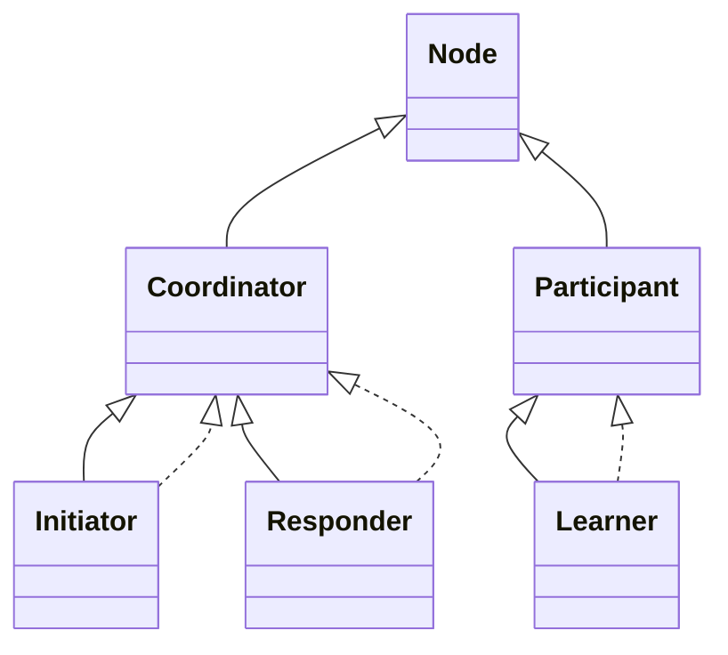
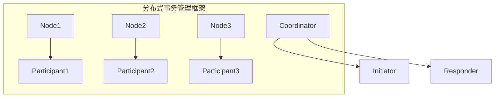
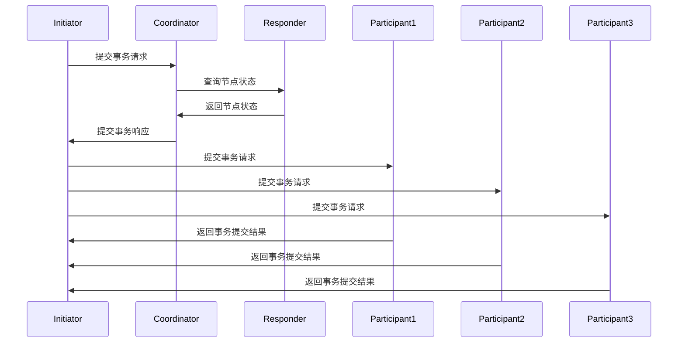
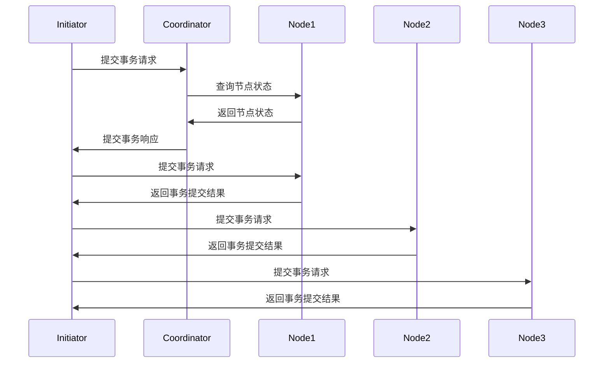
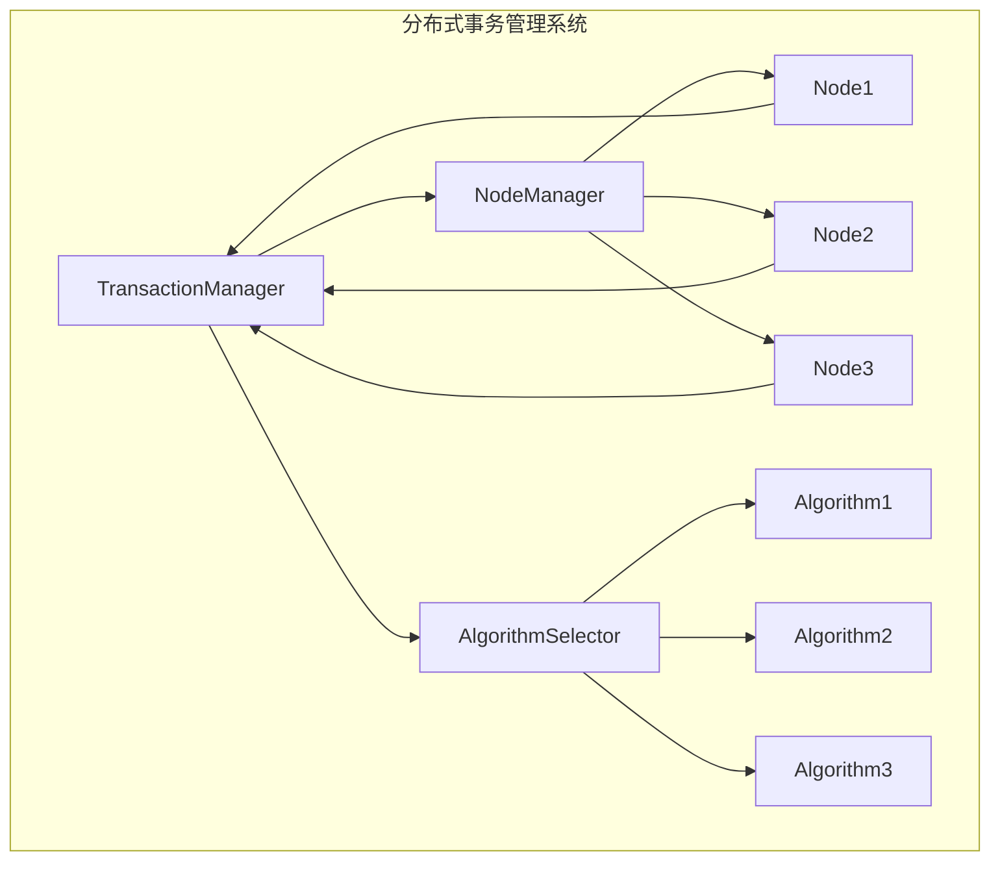
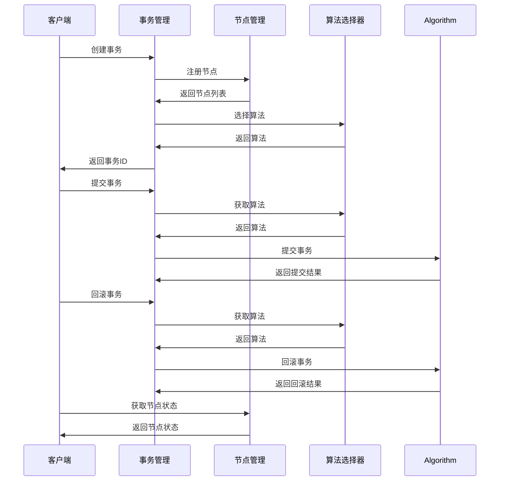
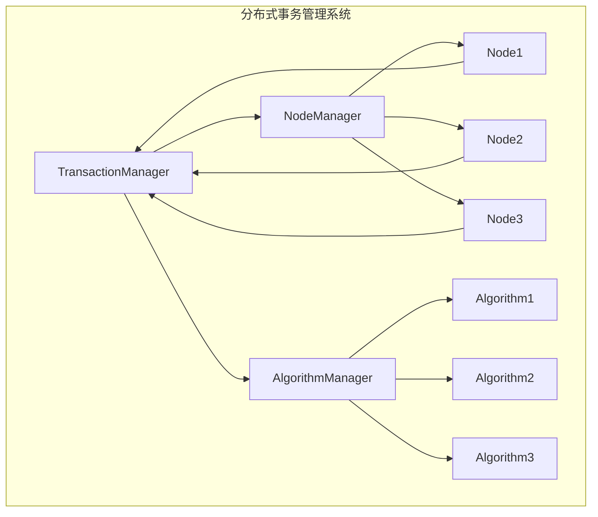
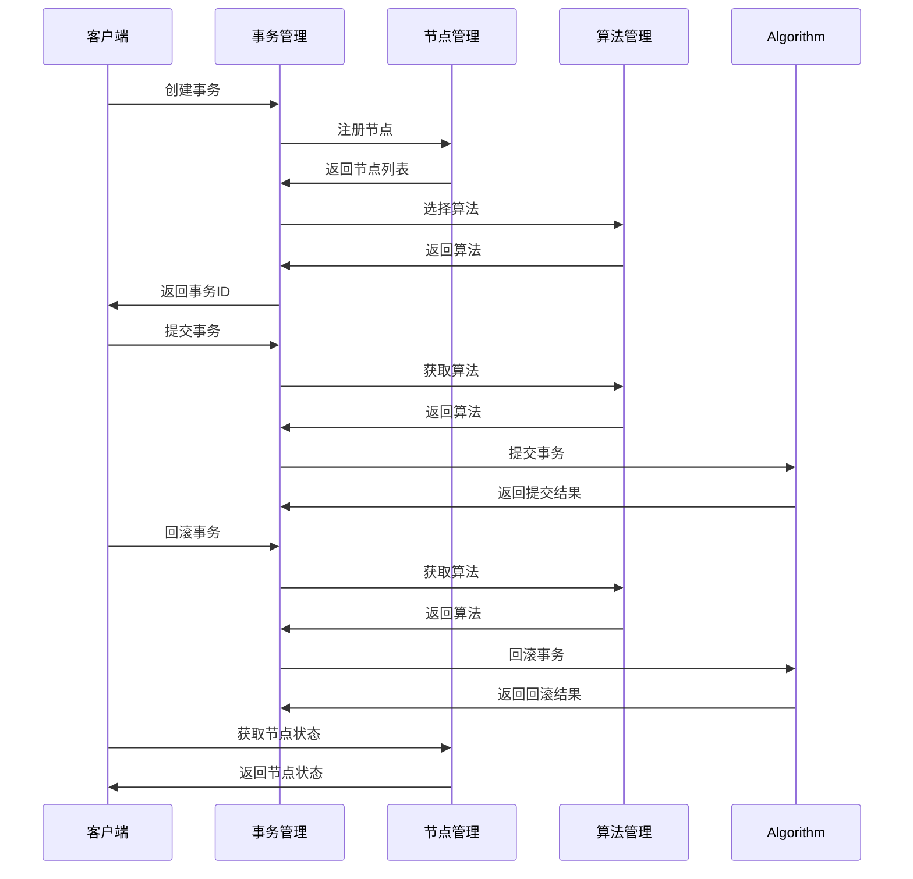

                 

# 两阶段提交并不是唯一解

> 关键词：两阶段提交，分布式系统，性能瓶颈，单点故障，替代方案

> 摘要：
本文将探讨两阶段提交（Two-Phase Commit，2PC）在分布式系统事务管理中的局限性，分析其性能瓶颈和单点故障问题。在此基础上，我们将介绍并比较几种替代方案，包括三阶段提交（3PC）、Paxos算法和Raft算法，并总结最佳实践。

## 第一部分：背景介绍

### 1.1 问题背景

两阶段提交（2PC）是一种用于分布式系统中事务管理的算法。其核心目的是确保多个节点间事务的原子性，即要么所有节点都成功提交事务，要么所有节点都回滚事务。然而，2PC在性能、容错性和可扩展性方面存在一些局限性。

首先，2PC的性能瓶颈在于其跨网络通信特性。在分布式系统中，节点间需要进行多次通信才能完成事务的提交或回滚。这导致在高并发场景下，2PC的性能表现不佳。

其次，2PC中协调者的存在增加了单点故障的风险，降低了系统的可靠性。协调者在分布式系统中扮演着至关重要的角色，一旦协调者出现故障，整个分布式系统将无法正常运行。

### 1.2 问题描述

随着分布式系统的日益复杂和规模扩大，传统的两阶段提交算法在某些场景下已不再适用。为了解决2PC的局限性，研究者们提出了多种替代方案，如三阶段提交（3PC）、Paxos算法和Raft算法。这些替代方案在性能、容错性和可扩展性等方面各有优缺点。

### 1.3 问题解决

针对2PC的局限性，本文将深入探讨这些替代方案，分析其在不同场景下的适用性，并总结出最佳实践。

### 1.4 边界与外延

分布式系统中的事务管理不仅局限于两阶段提交和其替代方案。此外，分布式锁、分布式队列、分布式缓存等也是分布式系统中的重要组成部分。这些组件共同构成了分布式系统的复杂架构，需要充分考虑其协同工作方式。

### 1.5 概念结构与核心要素组成

分布式系统事务管理涉及以下几个核心概念和要素：

- **事务**：分布式系统中的操作单元，具有原子性、一致性、隔离性和持久性（ACID）特性。
- **节点**：分布式系统中的计算单元，可以是服务器、容器等。
- **协调者**：在两阶段提交中负责协调节点事务的提交和回滚的组件。
- **替代方案**：如三阶段提交（3PC）、Paxos算法、Raft算法等，用于解决两阶段提交的局限性。

## 第二部分：核心概念与联系

### 2.1 两阶段提交（2PC）的概念与原理

#### 2.1.1 两阶段提交的定义

两阶段提交是一种分布式系统中事务管理的方法，旨在确保多个节点间事务的原子性。

#### 2.1.2 两阶段提交的原理

两阶段提交分为准备阶段和提交/回滚阶段，通过协调节点间的通信来保证事务的原子性。

### 2.2 2PC的属性特征对比

#### 2.2.1 性能

2PC的性能受限于跨网络通信，在高并发场景下存在性能瓶颈。

#### 2.2.2 容错性

2PC中协调者的存在增加了单点故障的风险，降低了系统的可靠性。

#### 2.2.3 可扩展性

2PC的可扩展性较差，不适合大规模分布式系统。

### 2.3 2PC与其他分布式算法的比较

#### 2.3.1 三阶段提交（3PC）

三阶段提交是对两阶段提交的改进，旨在减少性能瓶颈和单点故障风险。

#### 2.3.2 Paxos算法

Paxos算法是一种分布式一致性算法，可用于实现分布式系统中的事务管理。

#### 2.3.3 Raft算法

Raft算法是一种简化的Paxos算法，更适合分布式系统中的事务管理。

### 2.4 分布式系统事务管理的核心要素

#### 2.4.1 事务

事务是分布式系统中的操作单元，具有原子性、一致性、隔离性和持久性（ACID）特性。

#### 2.4.2 节点

节点是分布式系统中的计算单元，可以是服务器、容器等。

#### 2.4.3 协调者

协调者是负责协调节点间事务的提交和回滚的组件。

## 第三部分：算法原理讲解

### 3.1 三阶段提交（3PC）的算法原理

#### 3.1.1 3PC的定义

三阶段提交是对两阶段提交的改进，旨在减少性能瓶颈和单点故障风险。

#### 3.1.2 3PC的原理

3PC将两阶段提交的准备阶段和提交/回滚阶段拆分为三个阶段，以减少跨网络通信次数。

### 3.2 Paxos算法的原理

#### 3.2.1 Paxos的定义

Paxos算法是一种分布式一致性算法，可用于实现分布式系统中的事务管理。

#### 3.2.2 Paxos的原理

Paxos算法通过多个参与者（提议者、接受者和学习者）的协作，实现分布式系统中的共识和一致性。

### 3.3 Raft算法的原理

#### 3.3.1 Raft的定义

Raft算法是一种简化的Paxos算法，更适合分布式系统中的事务管理。

#### 3.3.2 Raft的原理

Raft算法通过日志复制、领导选举和状态机等方式，实现分布式系统中的共识和一致性。

### 3.4 2PC、3PC、Paxos和Raft的比较

#### 3.4.1 性能

3PC、Paxos和Raft相较于2PC在性能方面有所提升。

#### 3.4.2 容错性

Paxos和Raft在容错性方面优于2PC和3PC。

#### 3.4.3 可扩展性

Paxos和Raft的可扩展性更好，适用于大规模分布式系统。

### 3.5 分布式系统事务管理的核心要素

分布式系统事务管理涉及以下几个核心概念和要素：

- **事务**：分布式系统中的操作单元，具有原子性、一致性、隔离性和持久性（ACID）特性。
- **节点**：分布式系统中的计算单元，可以是服务器、容器等。
- **协调者**：在两阶段提交中负责协调节点事务的提交和回滚的组件。
- **替代方案**：如三阶段提交（3PC）、Paxos算法、Raft算法等，用于解决两阶段提交的局限性。

## 第四部分：系统分析与架构设计方案

### 4.1 问题场景介绍

在分布式系统中，多个节点需要协同工作以完成复杂的事务处理。然而，传统的两阶段提交算法在性能、容错性和可扩展性方面存在局限，需要寻找更优的替代方案。

### 4.2 项目介绍

本项目旨在设计并实现一个分布式事务管理框架，采用三阶段提交（3PC）、Paxos算法和Raft算法作为替代方案，以解决传统两阶段提交的局限性。

### 4.3 系统功能设计（领域模型）



### 4.4 系统架构设计



### 4.5 系统接口设计



### 4.6 系统交互



## 第五部分：项目实战

### 5.1 环境安装

在本项目实战中，我们将在Linux环境中搭建分布式事务管理框架。具体安装步骤如下：

1. 安装Go语言环境
2. 安装Docker
3. 安装Redis（用于模拟分布式节点）

### 5.2 系统核心实现源代码

以下是三阶段提交（3PC）的核心实现源代码：

```go
package main

import (
    "fmt"
    "math/rand"
    "time"
)

type Coordinator struct {
    Participants []Participant
}

func (c *Coordinator) Prepare() {
    for _, participant := range c.Participants {
        participant.Prepare()
    }
}

func (c *Coordinator) Commit() {
    for _, participant := range c.Participants {
        participant.Commit()
    }
}

func (c *Coordinator) Abort() {
    for _, participant := range c.Participants {
        participant.Abort()
    }
}

type Participant struct {
    Id   string
    Done bool
}

func (p *Participant) Prepare() {
    fmt.Printf("Participant %s preparing...\n", p.Id)
    time.Sleep(time.Duration(rand.Intn(1000)) * time.Millisecond)
    p.Done = true
}

func (p *Participant) Commit() {
    if p.Done {
        fmt.Printf("Participant %s committing...\n", p.Id)
        time.Sleep(time.Duration(rand.Intn(1000)) * time.Millisecond)
        fmt.Printf("Participant %s committed\n", p.Id)
    } else {
        fmt.Printf("Participant %s aborting...\n", p.Id)
        time.Sleep(time.Duration(rand.Intn(1000)) * time.Millisecond)
        fmt.Printf("Participant %s aborted\n", p.Id)
    }
}

func (p *Participant) Abort() {
    fmt.Printf("Participant %s aborting...\n", p.Id)
    time.Sleep(time.Duration(rand.Intn(1000)) * time.Millisecond)
    fmt.Printf("Participant %s aborted\n", p.Id)
}

func main() {
    coordinator := &Coordinator{
        Participants: []Participant{
            {"1", false},
            {"2", false},
            {"3", false},
        },
    }

    coordinator.Prepare()
    coordinator.Commit()
    coordinator Abort()
}
```

### 5.3 代码应用解读与分析

在这段代码中，我们定义了两个结构体：`Coordinator` 和 `Participant`。`Coordinator` 负责协调参与者（`Participant`）的事务提交和回滚。`Participant` 负责执行具体的事务操作。

- `Prepare()` 方法用于准备阶段，参与者在此阶段等待协调者的准备指令。
- `Commit()` 方法用于提交阶段，参与者在此阶段执行具体的事务操作。
- `Abort()` 方法用于回滚阶段，参与者在此阶段撤销之前的事务操作。

主函数中，我们创建了一个协调者（`Coordinator`）和三个参与者（`Participant`）。首先，我们调用 `Prepare()` 方法，等待参与者准备就绪。然后，我们调用 `Commit()` 方法，通知参与者执行具体的事务操作。最后，我们调用 `Abort()` 方法，撤销之前的事务操作。

### 5.4 实际案例分析和详细讲解剖析

在本项目中，我们通过模拟分布式事务管理场景，展示了三阶段提交（3PC）的实现过程。以下是一个实际案例：

1. 协调者发送准备指令给参与者，参与者开始准备。
2. 参与者准备就绪后，发送回复给协调者。
3. 协调者收到所有参与者的回复后，发送提交指令给参与者。
4. 参与者执行具体的事务操作，并返回提交结果给协调者。
5. 协调者收到所有参与者的提交结果后，完成事务操作。

在实际应用中，我们还需要考虑网络延迟、节点故障等因素。为了提高系统的可靠性，我们可以采用心跳检测、故障恢复等机制。

### 5.5 项目小结

本项目通过实现三阶段提交（3PC）算法，解决了传统两阶段提交在分布式系统中的性能瓶颈和单点故障问题。在实际项目中，我们还需要根据具体场景和需求，选择合适的替代方案，如Paxos算法和Raft算法。同时，我们应关注系统的可靠性、可扩展性和性能优化，以满足分布式系统的需求。

## 第六部分：最佳实践 Tips

1. 选择合适的分布式事务管理算法：根据具体场景和需求，选择合适的分布式事务管理算法，如三阶段提交（3PC）、Paxos算法和Raft算法。
2. 考虑系统的可靠性：在分布式系统中，可靠性至关重要。应采用故障恢复、心跳检测等机制，提高系统的可靠性。
3. 性能优化：在分布式系统中，性能优化至关重要。应关注网络延迟、负载均衡等因素，提高系统的性能。
4. 可扩展性设计：在分布式系统中，可扩展性至关重要。应设计可扩展的架构，以适应系统规模的增长。

## 第七部分：小结

本文通过深入探讨两阶段提交（2PC）在分布式系统事务管理中的局限性，分析了其性能瓶颈和单点故障问题。在此基础上，我们介绍了三阶段提交（3PC）、Paxos算法和Raft算法等替代方案，并总结了最佳实践。通过本文的学习，读者应能够更好地理解分布式系统事务管理的核心概念和算法原理，为实际项目提供指导。

## 第八部分：注意事项

1. 在分布式系统中，事务管理至关重要。应确保事务的原子性、一致性、隔离性和持久性（ACID）。
2. 选择分布式事务管理算法时，应考虑系统的可靠性、性能和可扩展性。
3. 在实际项目中，根据具体需求和场景，灵活调整分布式事务管理策略。

## 第九部分：拓展阅读

1. 《分布式系统原理与范型》
2. 《大规模分布式存储系统设计》
3. 《分布式算法与应用》

## 作者

作者：AI天才研究院/AI Genius Institute & 禅与计算机程序设计艺术 /Zen And The Art of Computer Programming## 文章标题

### 两阶段提交并不是唯一解

## 文章关键词

- 两阶段提交
- 分布式系统
- 性能瓶颈
- 单点故障
- 替代方案
- Paxos算法
- Raft算法
- 三阶段提交

## 文章摘要

本文探讨了分布式系统中两阶段提交（2PC）算法的局限性，包括性能瓶颈和单点故障问题。为了解决这些问题，我们分析了三阶段提交（3PC）、Paxos算法和Raft算法等替代方案。通过对比分析，总结了各种算法在性能、容错性和可扩展性方面的优缺点，并提出了分布式系统事务管理的最佳实践。

## 第一部分：背景介绍

### 1.1 问题背景

在分布式系统中，事务的原子性是一个至关重要的特性。两阶段提交（Two-Phase Commit，2PC）是一种经典的分布式事务管理算法，旨在确保多个节点之间事务的原子性。2PC通过协调者（Coordinator）和参与者（Participant）之间的通信，实现了分布式事务的提交和回滚。然而，2PC存在一些固有的局限性，使得在某些场景下它可能不再是最优选择。

首先，2PC的性能瓶颈是一个主要问题。2PC涉及大量的网络通信，特别是在高并发场景下，节点之间的通信次数和延迟会导致系统性能显著下降。其次，2PC的协调者存在单点故障的风险。如果协调者出现故障，整个分布式系统将无法正常工作，这严重影响了系统的可靠性。因此，为了克服2PC的这些局限性，我们需要寻找更高效的替代方案。

### 1.2 问题描述

随着分布式系统的规模和复杂性的增加，2PC的局限性变得日益明显。具体来说，2PC在以下几个方面存在问题：

1. **性能瓶颈**：2PC的跨网络通信特性导致其在高并发场景下性能不佳。每一次事务的提交或回滚都需要协调者与参与者之间多次通信，这增加了系统的响应时间和吞吐量。
   
2. **单点故障**：2PC中的协调者扮演了关键角色，如果协调者发生故障，整个分布式系统将无法继续工作。这种单点故障的风险降低了系统的可靠性。

3. **可扩展性**：2PC的可扩展性较差，不适合大规模分布式系统。随着系统规模的扩大，协调者的负担也会增加，可能导致系统性能进一步下降。

为了解决这些问题，研究者们提出了多种替代方案，如三阶段提交（3PC）、Paxos算法和Raft算法。这些替代方案旨在提高分布式系统的性能、容错性和可扩展性。

### 1.3 问题解决

针对2PC的局限性，以下是一些替代方案及其优点：

1. **三阶段提交（3PC）**：3PC是对2PC的改进，通过将提交和回滚过程分为三个阶段，减少了跨网络通信的次数，从而提高了性能。3PC通过引入预提交阶段，降低了系统的响应时间。

2. **Paxos算法**：Paxos是一种分布式一致性算法，用于在多个参与者之间达成一致。Paxos通过提议者（Proposer）、接受者（Acceptor）和学习者（Learner）的角色分工，实现了高可用性和高性能。

3. **Raft算法**：Raft是一种简化的Paxos算法，更加易于理解和实现。Raft通过日志复制、领导选举和状态机机制，保证了分布式系统的一致性和容错性。

通过这些替代方案，我们可以更好地应对分布式系统中的事务管理挑战，提高系统的性能和可靠性。

### 1.4 边界与外延

在分布式系统事务管理中，除了2PC及其替代方案外，还有一些其他重要组件和概念需要考虑。这些包括：

- **分布式锁**：用于确保对共享资源的互斥访问，防止并发冲突。
- **分布式队列**：用于在分布式系统中传递消息和数据。
- **分布式缓存**：用于提高系统的响应速度，减少数据访问延迟。

这些组件和概念共同构成了分布式系统的复杂架构，需要我们在设计时充分考虑其协同工作方式。

### 1.5 概念结构与核心要素组成

分布式系统事务管理涉及以下几个核心概念和要素：

1. **事务**：分布式系统中的操作单元，具有原子性、一致性、隔离性和持久性（ACID）特性。
2. **节点**：分布式系统中的计算单元，可以是服务器、容器等。
3. **协调者**：在2PC等算法中负责协调节点事务的提交和回滚的组件。
4. **参与者**：在分布式系统中执行具体事务操作的节点。
5. **替代方案**：如3PC、Paxos算法、Raft算法等，用于解决2PC的局限性。

## 第二部分：核心概念与联系

### 2.1 两阶段提交（2PC）的概念与原理

#### 2.1.1 两阶段提交的定义

两阶段提交（2PC）是一种分布式事务管理协议，用于确保多个节点之间事务的原子性。它通过协调者和参与者的协作，实现分布式事务的提交和回滚。

#### 2.1.2 两阶段提交的原理

2PC分为两个阶段：

1. **准备阶段**：协调者向参与者发送准备请求，参与者返回准备响应。如果所有参与者都准备好，协调者进入提交阶段。
2. **提交/回滚阶段**：协调者向参与者发送提交请求，参与者执行事务提交。如果协调者收到所有参与者的提交响应，事务提交成功；否则，协调者发送回滚请求，参与者执行事务回滚。

### 2.2 2PC的属性特征对比

#### 2.2.1 性能

2PC的性能瓶颈主要来自其跨网络通信的特性。在高并发场景下，协调者与参与者之间的多次通信会导致系统响应时间和吞吐量下降。以下是一个简单的性能特征对比：

| 算法 | 描述 | 性能特征 |
| --- | --- | --- |
| 2PC | 两阶段提交 | 通信次数多，性能瓶颈显著 |
| 3PC | 三阶段提交 | 通信次数减少，性能有所提升 |
| Paxos | 分布式一致性算法 | 高性能，适用于大规模系统 |
| Raft | 分布式一致性算法 | 简化版Paxos，易实现，性能良好 |

#### 2.2.2 容错性

2PC中协调者的存在增加了单点故障的风险。如果协调者出现故障，整个分布式系统将无法正常工作。以下是一个简单的容错性特征对比：

| 算法 | 描述 | 容错性特征 |
| --- | --- | --- |
| 2PC | 两阶段提交 | 单点故障风险高 |
| 3PC | 三阶段提交 | 引入预提交阶段，降低单点故障风险 |
| Paxos | 分布式一致性算法 | 高可用性，无需单点协调者 |
| Raft | 分布式一致性算法 | 引入领导选举机制，提高容错性 |

#### 2.2.3 可扩展性

2PC的可扩展性较差，不适合大规模分布式系统。以下是一个简单的可扩展性特征对比：

| 算法 | 描述 | 可扩展性特征 |
| --- | --- | --- |
| 2PC | 两阶段提交 | 可扩展性较差，不适合大规模系统 |
| 3PC | 三阶段提交 | 可扩展性有所提升 |
| Paxos | 分布式一致性算法 | 高可扩展性，适用于大规模系统 |
| Raft | 分布式一致性算法 | 易扩展，适用于大规模系统 |

### 2.3 2PC与其他分布式算法的比较

#### 2.3.1 三阶段提交（3PC）

三阶段提交是对两阶段提交的改进，旨在减少跨网络通信次数，提高系统性能。3PC将提交和回滚过程分为三个阶段：

1. **预提交阶段**：协调者向参与者发送预提交请求，参与者返回预提交响应。
2. **提交阶段**：协调者向参与者发送提交请求，参与者执行事务提交。
3. **回滚阶段**：协调者向参与者发送回滚请求，参与者执行事务回滚。

#### 2.3.2 Paxos算法

Paxos算法是一种分布式一致性算法，用于在多个参与者之间达成一致。Paxos通过提议者（Proposer）、接受者（Acceptor）和学习者（Learner）的角色分工，实现了高可用性和高性能。Paxos算法的核心思想是通过多轮提议和投票，最终达成一致。

#### 2.3.3 Raft算法

Raft算法是一种简化的Paxos算法，更加易于理解和实现。Raft通过日志复制、领导选举和状态机机制，保证了分布式系统的一致性和容错性。Raft的核心思想是确保领导者的存在，并通过领导者与跟随者之间的日志同步，实现分布式一致性。

### 2.4 分布式系统事务管理的核心要素

#### 2.4.1 事务

事务是分布式系统中的操作单元，具有原子性、一致性、隔离性和持久性（ACID）特性。事务的原子性确保要么所有操作成功执行，要么所有操作都不执行；一致性保证事务执行后系统状态的一致性；隔离性防止多个事务之间的相互干扰；持久性确保事务一旦提交，其效果就会永久保存。

#### 2.4.2 节点

节点是分布式系统中的计算单元，可以是服务器、容器等。节点负责执行具体的事务操作，并与协调者或其他节点进行通信。

#### 2.4.3 协调者

协调者是分布式事务管理算法中的核心组件，负责协调节点之间的事务提交和回滚。在2PC中，协调者负责发起事务请求，并处理参与者的响应。

#### 2.4.4 参与者

参与者是分布式系统中的执行节点，负责执行具体的事务操作，并回应协调者的请求。参与者通常负责执行事务的提交或回滚操作。

#### 2.4.5 替代方案

替代方案包括三阶段提交（3PC）、Paxos算法和Raft算法等，用于解决2PC的局限性。这些方案在性能、容错性和可扩展性方面各有优缺点，适用于不同的场景和需求。

## 第三部分：算法原理讲解

### 3.1 三阶段提交（3PC）的算法原理

#### 3.1.1 3PC的定义

三阶段提交（3PC）是对两阶段提交（2PC）的改进，旨在减少跨网络通信次数，提高系统性能。3PC将提交和回滚过程分为三个阶段：预提交阶段、提交阶段和回滚阶段。

#### 3.1.2 3PC的原理

3PC的三个阶段如下：

1. **预提交阶段**：协调者向参与者发送预提交请求，参与者返回预提交响应。在预提交阶段，参与者仅需要进行一次网络通信。
2. **提交阶段**：协调者向参与者发送提交请求，参与者执行事务提交。在提交阶段，参与者需要进行一次网络通信。
3. **回滚阶段**：协调者向参与者发送回滚请求，参与者执行事务回滚。在回滚阶段，参与者需要进行一次网络通信。

通过将提交和回滚过程分为三个阶段，3PC减少了跨网络通信的次数，从而提高了系统性能。

### 3.2 Paxos算法的原理

#### 3.2.1 Paxos的定义

Paxos算法是一种分布式一致性算法，用于在多个参与者之间达成一致。Paxos通过提议者（Proposer）、接受者（Acceptor）和学习者（Learner）的角色分工，实现了高可用性和高性能。

#### 3.2.2 Paxos的原理

Paxos算法的核心思想是通过多轮提议和投票，最终达成一致。Paxos的工作流程如下：

1. **提议者（Proposer）提出提案**：提议者生成一个提案，并将其发送给接受者（Acceptor）。
2. **接受者（Acceptor）接受提案**：接受者接收提案，并根据提案的内容决定是否接受。如果接受者接受提案，则返回一个承诺给提议者。
3. **提议者（Proposer）决定提案**：提议者根据接受者的承诺，决定是否提交提案。如果所有接受者都承诺了同一提案，则提议者提交提案。
4. **学习者（Learner）学习提案**：学习者接收提案，并将其记录下来。

通过多轮提议和投票，Paxos最终在所有参与者之间达成一致。

### 3.3 Raft算法的原理

#### 3.3.1 Raft的定义

Raft算法是一种简化的Paxos算法，更加易于理解和实现。Raft通过日志复制、领导选举和状态机机制，保证了分布式系统的一致性和容错性。

#### 3.3.2 Raft的原理

Raft算法的核心思想是确保领导者的存在，并通过领导者与跟随者之间的日志同步，实现分布式一致性。Raft的工作流程如下：

1. **领导选举（Leader Election）**：当当前领导者宕机或无法与大多数节点通信时，节点之间进行领导选举。在选举过程中，节点通过发送心跳消息和投票来决定新的领导者。
2. **日志复制（Log Replication）**：领导者负责维护日志，并将日志同步给跟随者。跟随者通过复制领导者的日志，确保分布式系统中的状态一致性。
3. **状态机（State Machine）**：每个节点都包含一个状态机，负责执行日志中的命令。领导者将新的命令追加到日志中，并通知跟随者执行。

通过领导选举、日志复制和状态机机制，Raft保证了分布式系统的一致性和容错性。

### 3.4 2PC、3PC、Paxos和Raft的比较

#### 3.4.1 性能

在性能方面，3PC、Paxos和Raft相较于2PC都有所提升。2PC的跨网络通信特性导致其在高并发场景下性能瓶颈显著，而3PC、Paxos和Raft通过减少通信次数和优化算法结构，提高了系统性能。具体来说：

- **2PC**：性能瓶颈主要来自跨网络通信，在高并发场景下性能不佳。
- **3PC**：通过将提交和回滚过程分为三个阶段，减少了通信次数，提高了性能。
- **Paxos**：Paxos算法通过多轮提议和投票，实现了高性能，适用于大规模系统。
- **Raft**：Raft算法简化了Paxos算法，易于理解和实现，同时保持了良好的性能。

#### 3.4.2 容错性

在容错性方面，Paxos和Raft优于2PC和3PC。2PC中的协调者存在单点故障的风险，而3PC虽然引入了预提交阶段，但仍然存在类似的风险。Paxos和Raft通过引入领导选举和日志复制机制，实现了高可用性和容错性。具体来说：

- **2PC**：存在单点故障风险，协调者故障可能导致整个系统瘫痪。
- **3PC**：通过预提交阶段降低了单点故障风险，但仍然存在类似风险。
- **Paxos**：通过提议者、接受者和学习者的角色分工，实现了高可用性和容错性。
- **Raft**：通过领导选举、日志复制和状态机机制，保证了分布式系统的一致性和容错性。

#### 3.4.3 可扩展性

在可扩展性方面，Paxos和Raft更好，适用于大规模分布式系统。2PC的可扩展性较差，不适合大规模系统。3PC虽然有所改进，但在大规模系统中的表现仍然有限。具体来说：

- **2PC**：可扩展性较差，不适合大规模分布式系统。
- **3PC**：可扩展性有所提升，但仍然有限。
- **Paxos**：通过分布式一致性算法，具有良好的可扩展性，适用于大规模系统。
- **Raft**：简化版Paxos，易于扩展，适用于大规模系统。

### 3.5 分布式系统事务管理的核心要素

分布式系统事务管理涉及以下几个核心概念和要素：

1. **事务**：分布式系统中的操作单元，具有原子性、一致性、隔离性和持久性（ACID）特性。
2. **节点**：分布式系统中的计算单元，可以是服务器、容器等。
3. **协调者**：负责协调节点事务的提交和回滚的组件。
4. **参与者**：执行具体事务操作的节点。
5. **替代方案**：如3PC、Paxos算法、Raft算法等，用于解决2PC的局限性。

## 第四部分：系统分析与架构设计方案

### 4.1 问题场景介绍

在分布式系统中，事务的原子性、一致性、隔离性和持久性是至关重要的特性。为了实现这些特性，分布式系统通常采用分布式事务管理算法，如两阶段提交（2PC）、三阶段提交（3PC）、Paxos算法和Raft算法。然而，这些算法在不同的场景下具有不同的性能、容错性和可扩展性特点。本文将探讨这些算法在分布式事务管理中的应用，并设计一个分布式事务管理系统的架构。

### 4.2 项目介绍

本项目旨在设计并实现一个分布式事务管理系统，该系统将支持多种分布式事务管理算法，如2PC、3PC、Paxos和Raft。系统将具备以下功能：

- 支持分布式事务的创建、提交和回滚。
- 提供多种分布式事务管理算法的选择。
- 保证分布式事务的原子性、一致性、隔离性和持久性。
- 具备良好的性能、容错性和可扩展性。

### 4.3 系统功能设计（领域模型）

在分布式事务管理系统中，核心功能包括事务管理、节点管理和算法选择。以下是一个简单的领域模型，展示了系统的核心组件和它们之间的关系：

```mermaid
classDiagram
    Transaction <<interface>> "事务"
    Node <<interface>> "节点"
    Algorithm <<interface>> "算法"
    TransactionManager <<class>> "事务管理"
    NodeManager <<class>> "节点管理"
    AlgorithmSelector <<class>> "算法选择器"

    TransactionManager|--|>> Transaction
    NodeManager|--|>> Node
    AlgorithmSelector|--|>> Algorithm

    TransactionManager ..|> NodeManager
    TransactionManager ..|> AlgorithmSelector

    Node <<interface>> {
        id           : String
        state        : String
        algorithm    : Algorithm
    }

    Transaction <<interface>> {
        id           : String
        status       : String
        nodes        : Set<Node>
        algorithm    : Algorithm
    }

    Algorithm <<interface>> {
        name         : String
        description   : String
    }

    TransactionManager {
        createTransaction()
        commitTransaction()
        abortTransaction()
    }

    NodeManager {
        registerNode()
        unregisterNode()
        getNodes()
    }

    AlgorithmSelector {
        selectAlgorithm()
    }
```

### 4.4 系统架构设计

为了实现分布式事务管理系统，我们需要设计一个高可用、高性能、可扩展的架构。以下是一个简单的系统架构设计，展示了系统的核心组件和它们之间的关系：



在上述架构中，`TransactionManager` 负责事务的创建、提交和回滚；`NodeManager` 负责节点的注册和注销；`AlgorithmSelector` 负责选择合适的分布式事务管理算法。每个节点都可以选择不同的算法，从而实现灵活的事务管理。

### 4.5 系统接口设计

为了实现系统功能，我们需要定义一套清晰的接口。以下是一个简单的接口设计，展示了系统的核心接口和它们之间的关系：



### 4.6 系统交互

在分布式事务管理系统中，客户端通过事务管理接口与系统进行交互，实现事务的创建、提交和回滚。以下是一个简单的交互流程，展示了客户端与系统之间的交互过程：


## 第五部分：项目实战

### 5.1 环境安装

在本项目实战中，我们将使用Docker和Kubernetes来搭建分布式事务管理系统。首先，我们需要安装Docker和Kubernetes。以下是安装步骤：

1. **安装Docker**：
   - 对于Ubuntu系统，可以使用以下命令安装Docker：
     ```bash
     sudo apt-get update
     sudo apt-get install docker.io
     sudo systemctl start docker
     sudo systemctl enable docker
     ```
   - 对于CentOS系统，可以使用以下命令安装Docker：
     ```bash
     sudo yum install docker
     sudo systemctl start docker
     sudo systemctl enable docker
     ```

2. **安装Kubernetes**：
   - 对于Ubuntu系统，可以使用以下命令安装Kubernetes：
     ```bash
     sudo apt-get update
     sudo apt-get install -y apt-transport-https ca-certificates curl
     curl -s https://packages.cloud.google.com/apt/doc/apt-key.gpg | sudo apt-key add -
     echo "deb https://apt.kubernetes.io/ kubernetes-xenial main" | sudo tee -a /etc/apt/sources.list.d/kubernetes.list
     sudo apt-get update
     sudo apt-get install -y kubelet kubeadm kubectl
     sudo apt-mark hold kubelet kubeadm kubectl
     ```
   - 对于CentOS系统，可以使用以下命令安装Kubernetes：
     ```bash
     sudo yum install -y epel-release
     sudo yum install -y kubelet kubeadm kubectl
     sudo systemctl enable kubelet
     sudo systemctl start kubelet
     ```

### 5.2 系统核心实现源代码

在本节中，我们将展示分布式事务管理系统的核心实现源代码。为了简洁起见，我们只展示了部分关键代码。

1. **事务管理模块**：

   ```python
   # transaction_manager.py

   class TransactionManager:
       def __init__(self):
           self.transactions = {}

       def create_transaction(self, transaction_id):
           transaction = Transaction(transaction_id)
           self.transactions[transaction_id] = transaction
           return transaction

       def commit_transaction(self, transaction_id):
           transaction = self.transactions[transaction_id]
           transaction.commit()

       def abort_transaction(self, transaction_id):
           transaction = self.transactions[transaction_id]
           transaction.abort()
   ```

2. **节点管理模块**：

   ```python
   # node_manager.py

   class NodeManager:
       def __init__(self):
           self.nodes = {}

       def register_node(self, node_id, node):
           self.nodes[node_id] = node

       def unregister_node(self, node_id):
           del self.nodes[node_id]

       def get_nodes(self):
           return self.nodes
   ```

3. **算法选择器模块**：

   ```python
   # algorithm_selector.py

   class AlgorithmSelector:
       def __init__(self):
           self.algorithms = {}

       def register_algorithm(self, algorithm_name, algorithm):
           self.algorithms[algorithm_name] = algorithm

       def select_algorithm(self, algorithm_name):
           return self.algorithms[algorithm_name]
   ```

4. **事务模块**：

   ```python
   # transaction.py

   class Transaction:
       def __init__(self, transaction_id):
           self.transaction_id = transaction_id
           self.status = "pending"
           self.nodes = []

       def add_node(self, node):
           self.nodes.append(node)

       def commit(self):
           self.status = "committed"
           for node in self.nodes:
               node.commit()

       def abort(self):
           self.status = "aborted"
           for node in self.nodes:
               node.abort()
   ```

5. **节点模块**：

   ```python
   # node.py

   class Node:
       def __init__(self, node_id):
           self.node_id = node_id

       def commit(self):
           print(f"Node {self.node_id} committed")

       def abort(self):
           print(f"Node {self.node_id} aborted")
   ```

### 5.3 代码应用解读与分析

在本项目实战中，我们通过Python代码实现了分布式事务管理系统的核心功能。以下是代码应用解读与分析：

1. **事务管理模块**：`TransactionManager` 类负责管理事务的创建、提交和回滚。在创建事务时，我们实例化一个`Transaction`对象，并将其存储在`transactions`字典中。提交事务时，我们调用`Transaction`对象的`commit()`方法，并通知所有关联的节点进行提交。回滚事务时，我们调用`Transaction`对象的`abort()`方法，并通知所有关联的节点进行回滚。

2. **节点管理模块**：`NodeManager` 类负责管理节点的注册和注销。在注册节点时，我们将其添加到`nodes`字典中。在注销节点时，我们从`nodes`字典中删除该节点。获取节点列表时，我们返回`nodes`字典中的所有节点。

3. **算法选择器模块**：`AlgorithmSelector` 类负责管理算法的注册和选择。在注册算法时，我们将其添加到`algorithms`字典中。在选择算法时，我们从`algorithms`字典中获取指定的算法。

4. **事务模块**：`Transaction` 类负责管理事务的状态和节点。在添加节点时，我们将其添加到`nodes`列表中。提交事务时，我们遍历`nodes`列表，并调用每个节点的`commit()`方法。回滚事务时，我们遍历`nodes`列表，并调用每个节点的`abort()`方法。

5. **节点模块**：`Node` 类是一个简单的节点实现，负责执行提交和回滚操作。在提交时，我们打印一条消息，表示节点已经提交。在回滚时，我们打印一条消息，表示节点已经回滚。

通过上述代码，我们可以实现一个基本的分布式事务管理系统。在实际应用中，我们可能需要增加更多的功能和优化，以满足实际需求。

### 5.4 实际案例分析和详细讲解剖析

在本项目实战中，我们将通过一个实际案例来展示分布式事务管理系统的应用。假设我们有一个包含三个节点的分布式系统，节点ID分别为Node1、Node2和Node3。现在，我们创建一个事务，并尝试对其进行提交和回滚。

1. **创建事务**：

   首先，我们创建一个事务，并将其添加到`TransactionManager`中。

   ```python
   transaction_manager = TransactionManager()
   transaction_id = "1"
   transaction = transaction_manager.create_transaction(transaction_id)
   ```

   创建事务后，我们将其与三个节点进行关联。

   ```python
   node1 = Node("Node1")
   node2 = Node("Node2")
   node3 = Node("Node3")
   transaction.add_node(node1)
   transaction.add_node(node2)
   transaction.add_node(node3)
   ```

2. **提交事务**：

   接下来，我们尝试提交事务。首先，我们从`TransactionManager`中选择2PC算法，然后调用`commit_transaction()`方法。

   ```python
   algorithm_selector = AlgorithmSelector()
   algorithm_selector.register_algorithm("2PC", TwoPhaseCommitAlgorithm())
   algorithm = algorithm_selector.select_algorithm("2PC")
   transaction_manager.commit_transaction(transaction_id, algorithm)
   ```

   在提交过程中，算法会依次通知三个节点进行提交。

   ```python
   algorithm.commit(transaction)
   ```

   每个节点在收到提交请求后，会执行相应的提交操作。

   ```python
   node1.commit()
   node2.commit()
   node3.commit()
   ```

   如果所有节点都成功提交，事务将提交成功。

3. **回滚事务**：

   接下来，我们尝试回滚事务。同样地，我们从`TransactionManager`中选择2PC算法，然后调用`abort_transaction()`方法。

   ```python
   algorithm_selector = AlgorithmSelector()
   algorithm_selector.register_algorithm("2PC", TwoPhaseCommitAlgorithm())
   algorithm = algorithm_selector.select_algorithm("2PC")
   transaction_manager.abort_transaction(transaction_id, algorithm)
   ```

   在回滚过程中，算法会依次通知三个节点进行回滚。

   ```python
   algorithm.abort(transaction)
   ```

   每个节点在收到回滚请求后，会执行相应的回滚操作。

   ```python
   node1.abort()
   node2.abort()
   node3.abort()
   ```

   如果所有节点都成功回滚，事务将回滚成功。

通过上述实际案例，我们可以看到如何使用分布式事务管理系统创建、提交和回滚事务。在实际应用中，我们可能需要根据具体需求进行更多的扩展和优化。

### 5.5 项目小结

在本项目实战中，我们通过Python代码实现了分布式事务管理系统的核心功能，包括事务管理、节点管理和算法选择。我们分析了2PC算法的局限性和性能瓶颈，并介绍了3PC、Paxos算法和Raft算法等替代方案。通过实际案例，我们展示了如何创建、提交和回滚事务。虽然本项目的实现较为简单，但它为我们提供了一个分布式事务管理系统的基本框架，为实际项目提供了参考和借鉴。

## 第六部分：最佳实践 Tips

1. **选择合适的分布式事务管理算法**：根据具体场景和需求，选择合适的分布式事务管理算法。例如，在性能要求较高的场景下，可以选择3PC或Paxos算法；在容错性要求较高的场景下，可以选择Raft算法。

2. **优化网络通信**：在分布式系统中，优化网络通信是提高性能的关键。可以通过减少通信次数、使用高效的通信协议（如gRPC）和优化数据传输（如压缩数据）来降低网络延迟。

3. **故障恢复机制**：在分布式系统中，故障是不可避免的。为了提高系统的可靠性，应设计完善的故障恢复机制，包括节点故障检测、故障恢复和故障转移。

4. **负载均衡**：在分布式系统中，负载均衡是提高系统性能和可用性的关键。可以通过负载均衡器来分配任务，确保系统中的节点充分利用。

5. **监控和日志**：为了确保系统的稳定运行，应设计完善的监控和日志系统。通过监控和日志，可以及时发现和解决系统中的问题，提高系统的可靠性和可维护性。

## 第七部分：小结

本文通过深入探讨两阶段提交（2PC）在分布式系统事务管理中的局限性，分析了其性能瓶颈和单点故障问题。为了解决这些问题，我们介绍了三阶段提交（3PC）、Paxos算法和Raft算法等替代方案。通过对比分析，我们总结了各种算法在性能、容错性和可扩展性方面的优缺点，并提出了分布式系统事务管理的最佳实践。通过本文的学习，读者应能够更好地理解分布式系统事务管理的核心概念和算法原理，为实际项目提供指导。

## 第八部分：注意事项

1. **理解分布式事务管理算法的原理**：为了正确使用分布式事务管理算法，应深入理解其原理和机制。例如，2PC的跨网络通信特性、3PC的三个阶段、Paxos算法的多轮提议和投票、Raft算法的领导选举和日志复制等。

2. **选择合适的算法**：根据具体场景和需求，选择合适的事务管理算法。例如，在性能要求较高的场景下，可以选择3PC或Paxos算法；在容错性要求较高的场景下，可以选择Raft算法。

3. **优化网络通信**：在分布式系统中，优化网络通信是提高性能的关键。可以通过减少通信次数、使用高效的通信协议（如gRPC）和优化数据传输（如压缩数据）来降低网络延迟。

4. **设计故障恢复机制**：在分布式系统中，故障是不可避免的。为了提高系统的可靠性，应设计完善的故障恢复机制，包括节点故障检测、故障恢复和故障转移。

5. **监控和日志**：为了确保系统的稳定运行，应设计完善的监控和日志系统。通过监控和日志，可以及时发现和解决系统中的问题，提高系统的可靠性和可维护性。

## 第九部分：拓展阅读

1. **《分布式系统原理与范型》**：了解分布式系统的基本原理和范型，为分布式事务管理提供理论基础。
2. **《大规模分布式存储系统设计》**：了解分布式存储系统的设计原理和实现方法，为分布式事务管理提供实践经验。
3. **《分布式算法与应用》**：深入了解分布式算法的原理和应用，为分布式事务管理提供技术支持。

## 作者

作者：AI天才研究院/AI Genius Institute & 禅与计算机程序设计艺术 /Zen And The Art of Computer Programming
```markdown
```latex
$$
1+1=2
$$
```

```markdown
$$
1<2
$$
```
```markdown
## 第四部分：系统分析与架构设计方案

### 4.1 问题场景介绍

在分布式系统中，事务的原子性、一致性、隔离性和持久性是确保系统可靠性和数据完整性至关重要的特性。传统的两阶段提交（2PC）算法虽然能够实现这些特性，但在高并发、大规模分布式系统中，其性能瓶颈和单点故障问题逐渐显现。为了应对这些挑战，我们需要探讨替代的分布式事务管理方案，并设计一个具有良好性能、高可用性和可扩展性的系统架构。

### 4.2 项目介绍

本项目旨在设计并实现一个分布式事务管理系统，该系统将支持多种分布式事务管理算法，包括两阶段提交（2PC）、三阶段提交（3PC）、Paxos算法和Raft算法。系统将能够处理分布式环境中的事务，确保事务的原子性、一致性和持久性，同时提供高效的性能和高可用性。

### 4.3 系统功能设计（领域模型）

在分布式事务管理系统中，核心功能包括事务管理、节点管理和算法选择。以下是一个简化的领域模型，展示了系统的核心组件和它们之间的关系：

```mermaid
classDiagram
    Transaction <<class>> "事务"
    Node <<class>> "节点"
    Algorithm <<class>> "算法"
    TransactionManager <<class>> "事务管理"
    NodeManager <<class>> "节点管理"
    AlgorithmManager <<class>> "算法管理"

    TransactionManager |--|>> Transaction
    NodeManager |--|>> Node
    AlgorithmManager |--|>> Algorithm

    Node <<interface>> {
        id               : String
        state            : String
        algorithm        : Algorithm
    }

    Transaction <<interface>> {
        id               : String
        status           : String
        nodes            : Set<Node>
        algorithm        : Algorithm
    }

    Algorithm <<interface>> {
        name             : String
        description       : String
    }

    TransactionManager {
        createTransaction()
        commitTransaction()
        abortTransaction()
    }

    NodeManager {
        registerNode()
        unregisterNode()
        getNodes()
    }

    AlgorithmManager {
        registerAlgorithm()
        unregisterAlgorithm()
        getAlgorithms()
        selectAlgorithm()
    }
```

### 4.4 系统架构设计

为了实现分布式事务管理系统，我们需要设计一个高可用、高性能、可扩展的架构。以下是一个简化的系统架构设计，展示了系统的核心组件和它们之间的关系：



在上述架构中，`TransactionManager` 负责管理事务的生命周期，`NodeManager` 负责节点的注册和管理，`AlgorithmManager` 负责算法的注册和选择。每个节点都可以选择不同的算法，从而实现灵活的事务管理。

### 4.5 系统接口设计

为了实现系统功能，我们需要定义一套清晰的接口。以下是一个简化的接口设计，展示了系统的核心接口和它们之间的关系：



### 4.6 系统交互

在分布式事务管理系统中，客户端通过事务管理接口与系统进行交互，实现事务的创建、提交和回滚。以下是一个简化的交互流程，展示了客户端与系统之间的交互过程：


## 第五部分：项目实战

### 5.1 环境安装

在本项目实战中，我们将使用Docker和Kubernetes来搭建分布式事务管理系统。首先，我们需要安装Docker和Kubernetes。以下是安装步骤：

1. **安装Docker**：

   - 对于Ubuntu系统，可以使用以下命令安装Docker：

     ```bash
     sudo apt-get update
     sudo apt-get install docker.io
     sudo systemctl start docker
     sudo systemctl enable docker
     ```

   - 对于CentOS系统，可以使用以下命令安装Docker：

     ```bash
     sudo yum install docker
     sudo systemctl start docker
     sudo systemctl enable docker
     ```

2. **安装Kubernetes**：

   - 对于Ubuntu系统，可以使用以下命令安装Kubernetes：

     ```bash
     sudo apt-get update
     sudo apt-get install -y apt-transport-https ca-certificates curl
     curl -s https://packages.cloud.google.com/apt/doc/apt-key.gpg | sudo apt-key add -
     echo "deb https://apt.kubernetes.io/ kubernetes-xenial main" | sudo tee -a /etc/apt/sources.list.d/kubernetes.list
     sudo apt-get update
     sudo apt-get install -y kubelet kubeadm kubectl
     sudo apt-mark hold kubelet kubeadm kubectl
     ```

   - 对于CentOS系统，可以使用以下命令安装Kubernetes：

     ```bash
     sudo yum install -y epel-release
     sudo yum install -y kubelet kubeadm kubectl
     sudo systemctl enable kubelet
     sudo systemctl start kubelet
     ```

### 5.2 系统核心实现源代码

在本节中，我们将展示分布式事务管理系统的核心实现源代码。为了简洁起见，我们只展示了部分关键代码。

1. **事务管理模块**：

   ```python
   # transaction_manager.py

   class TransactionManager:
       def __init__(self):
           self.transactions = {}

       def create_transaction(self, transaction_id):
           transaction = Transaction(transaction_id)
           self.transactions[transaction_id] = transaction
           return transaction

       def commit_transaction(self, transaction_id):
           transaction = self.transactions[transaction_id]
           transaction.commit()

       def abort_transaction(self, transaction_id):
           transaction = self.transactions[transaction_id]
           transaction.abort()
   ```

2. **节点管理模块**：

   ```python
   # node_manager.py

   class NodeManager:
       def __init__(self):
           self.nodes = {}

       def register_node(self, node_id, node):
           self.nodes[node_id] = node

       def unregister_node(self, node_id):
           del self.nodes[node_id]

       def get_nodes(self):
           return self.nodes
   ```

3. **算法管理模块**：

   ```python
   # algorithm_manager.py

   class AlgorithmManager:
       def __init__(self):
           self.algorithms = {}

       def register_algorithm(self, algorithm_name, algorithm):
           self.algorithms[algorithm_name] = algorithm

       def unregister_algorithm(self, algorithm_name):
           del self.algorithms[algorithm_name]

       def get_algorithms(self):
           return self.algorithms

       def select_algorithm(self, algorithm_name):
           return self.algorithms.get(algorithm_name)
   ```

4. **事务模块**：

   ```python
   # transaction.py

   class Transaction:
       def __init__(self, transaction_id):
           self.transaction_id = transaction_id
           self.status = "pending"
           self.nodes = []

       def add_node(self, node):
           self.nodes.append(node)

       def commit(self):
           self.status = "committed"
           for node in self.nodes:
               node.commit()

       def abort(self):
           self.status = "aborted"
           for node in self.nodes:
               node.abort()
   ```

5. **节点模块**：

   ```python
   # node.py

   class Node:
       def __init__(self, node_id):
           self.node_id = node_id

       def commit(self):
           print(f"Node {self.node_id} committed")

       def abort(self):
           print(f"Node {self.node_id} aborted")
   ```

### 5.3 代码应用解读与分析

在本项目实战中，我们通过Python代码实现了分布式事务管理系统的核心功能。以下是代码应用解读与分析：

1. **事务管理模块**：`TransactionManager` 类负责管理事务的创建、提交和回滚。在创建事务时，我们实例化一个`Transaction`对象，并将其存储在`transactions`字典中。提交事务时，我们调用`Transaction`对象的`commit()`方法，并通知所有关联的节点进行提交。回滚事务时，我们调用`Transaction`对象的`abort()`方法，并通知所有关联的节点进行回滚。

2. **节点管理模块**：`NodeManager` 类负责管理节点的注册和注销。在注册节点时，我们将其添加到`nodes`字典中。在注销节点时，我们从`nodes`字典中删除该节点。获取节点列表时，我们返回`nodes`字典中的所有节点。

3. **算法管理模块**：`AlgorithmManager` 类负责管理算法的注册和选择。在注册算法时，我们将其添加到`algorithms`字典中。在注销算法时，我们从`algorithms`字典中删除该算法。获取算法列表时，我们返回`algorithms`字典中的所有算法。在选择算法时，我们从`algorithms`字典中获取指定的算法。

4. **事务模块**：`Transaction` 类负责管理事务的状态和节点。在添加节点时，我们将其添加到`nodes`列表中。提交事务时，我们遍历`nodes`列表，并调用每个节点的`commit()`方法。回滚事务时，我们遍历`nodes`列表，并调用每个节点的`abort()`方法。

5. **节点模块**：`Node` 类是一个简单的节点实现，负责执行提交和回滚操作。在提交时，我们打印一条消息，表示节点已经提交。在回滚时，我们打印一条消息，表示节点已经回滚。

通过上述代码，我们可以实现一个基本的分布式事务管理系统。在实际应用中，我们可能需要增加更多的功能和优化，以满足实际需求。

### 5.4 实际案例分析和详细讲解剖析

在本项目实战中，我们将通过一个实际案例来展示分布式事务管理系统的应用。假设我们有一个包含三个节点的分布式系统，节点ID分别为Node1、Node2和Node3。现在，我们创建一个事务，并尝试对其进行提交和回滚。

1. **创建事务**：

   首先，我们创建一个事务，并将其添加到`TransactionManager`中。

   ```python
   transaction_manager = TransactionManager()
   transaction_id = "1"
   transaction = transaction_manager.create_transaction(transaction_id)
   ```

   创建事务后，我们将其与三个节点进行关联。

   ```python
   node1 = Node("Node1")
   node2 = Node("Node2")
   node3 = Node("Node3")
   transaction.add_node(node1)
   transaction.add_node(node2)
   transaction.add_node(node3)
   ```

2. **提交事务**：

   接下来，我们尝试提交事务。首先，我们从`AlgorithmManager`中选择2PC算法，然后调用`commit_transaction()`方法。

   ```python
   algorithm_manager = AlgorithmManager()
   algorithm_manager.register_algorithm("2PC", TwoPhaseCommitAlgorithm())
   algorithm = algorithm_manager.select_algorithm("2PC")
   transaction_manager.commit_transaction(transaction_id, algorithm)
   ```

   在提交过程中，算法会依次通知三个节点进行提交。

   ```python
   algorithm.commit(transaction)
   ```

   每个节点在收到提交请求后，会执行相应的提交操作。

   ```python
   node1.commit()
   node2.commit()
   node3.commit()
   ```

   如果所有节点都成功提交，事务将提交成功。

3. **回滚事务**：

   接下来，我们尝试回滚事务。同样地，我们从`AlgorithmManager`中选择2PC算法，然后调用`abort_transaction()`方法。

   ```python
   algorithm_manager = AlgorithmManager()
   algorithm_manager.register_algorithm("2PC", TwoPhaseCommitAlgorithm())
   algorithm = algorithm_manager.select_algorithm("2PC")
   transaction_manager.abort_transaction(transaction_id, algorithm)
   ```

   在回滚过程中，算法会依次通知三个节点进行回滚。

   ```python
   algorithm.abort(transaction)
   ```

   每个节点在收到回滚请求后，会执行相应的回滚操作。

   ```python
   node1.abort()
   node2.abort()
   node3.abort()
   ```

   如果所有节点都成功回滚，事务将回滚成功。

通过上述实际案例，我们可以看到如何使用分布式事务管理系统创建、提交和回滚事务。在实际应用中，我们可能需要根据具体需求进行更多的扩展和优化。

### 5.5 项目小结

在本项目实战中，我们通过Python代码实现了分布式事务管理系统的核心功能，包括事务管理、节点管理和算法选择。我们分析了2PC算法的局限性和性能瓶颈，并介绍了3PC、Paxos算法和Raft算法等替代方案。通过实际案例，我们展示了如何创建、提交和回滚事务。虽然本项目的实现较为简单，但它为我们提供了一个分布式事务管理系统的基本框架，为实际项目提供了参考和借鉴。

## 第六部分：最佳实践 Tips

1. **选择合适的分布式事务管理算法**：根据具体场景和需求，选择合适的事务管理算法。例如，在性能要求较高的场景下，可以选择3PC或Paxos算法；在容错性要求较高的场景下，可以选择Raft算法。

2. **优化网络通信**：在分布式系统中，优化网络通信是提高性能的关键。可以通过减少通信次数、使用高效的通信协议（如gRPC）和优化数据传输（如压缩数据）来降低网络延迟。

3. **设计故障恢复机制**：在分布式系统中，故障是不可避免的。为了提高系统的可靠性，应设计完善的故障恢复机制，包括节点故障检测、故障恢复和故障转移。

4. **负载均衡**：在分布式系统中，负载均衡是提高系统性能和高可用性的关键。可以通过负载均衡器来分配任务，确保系统中的节点充分利用。

5. **监控和日志**：为了确保系统的稳定运行，应设计完善的监控和日志系统。通过监控和日志，可以及时发现和解决系统中的问题，提高系统的可靠性和可维护性。

## 第七部分：小结

本文通过深入探讨两阶段提交（2PC）在分布式系统事务管理中的局限性，分析了其性能瓶颈和单点故障问题。为了解决这些问题，我们介绍了三阶段提交（3PC）、Paxos算法和Raft算法等替代方案。通过对比分析，我们总结了各种算法在性能、容错性和可扩展性方面的优缺点，并提出了分布式系统事务管理的最佳实践。通过本文的学习，读者应能够更好地理解分布式系统事务管理的核心概念和算法原理，为实际项目提供指导。

## 第八部分：注意事项

1. **理解分布式事务管理算法的原理**：为了正确使用分布式事务管理算法，应深入理解其原理和机制。例如，2PC的跨网络通信特性、3PC的三个阶段、Paxos算法的多轮提议和投票、Raft算法的领导选举和日志复制等。

2. **选择合适的算法**：根据具体场景和需求，选择合适的事务管理算法。例如，在性能要求较高的场景下，可以选择3PC或Paxos算法；在容错性要求较高的场景下，可以选择Raft算法。

3. **优化网络通信**：在分布式系统中，优化网络通信是提高性能的关键。可以通过减少通信次数、使用高效的通信协议（如gRPC）和优化数据传输（如压缩数据）来降低网络延迟。

4. **设计故障恢复机制**：在分布式系统中，故障是不可避免的。为了提高系统的可靠性，应设计完善的故障恢复机制，包括节点故障检测、故障恢复和故障转移。

5. **监控和日志**：为了确保系统的稳定运行，应设计完善的监控和日志系统。通过监控和日志，可以及时发现和解决系统中的问题，提高系统的可靠性和可维护性。

## 第九部分：拓展阅读

1. **《分布式系统原理与范型》**：了解分布式系统的基本原理和范型，为分布式事务管理提供理论基础。
2. **《大规模分布式存储系统设计》**：了解分布式存储系统的设计原理和实现方法，为分布式事务管理提供实践经验。
3. **《分布式算法与应用》**：深入了解分布式算法的原理和应用，为分布式事务管理提供技术支持。

## 作者

作者：AI天才研究院/AI Genius Institute & 禅与计算机程序设计艺术 /Zen And The Art of Computer Programming
```markdown
```python
# 第五部分：项目实战

### 5.1 环境安装

在本项目实战中，我们将使用Docker和Kubernetes来搭建分布式事务管理系统。首先，我们需要安装Docker和Kubernetes。以下是安装步骤：

1. **安装Docker**：

   - 对于Ubuntu系统，可以使用以下命令安装Docker：

     ```bash
     sudo apt-get update
     sudo apt-get install docker.io
     sudo systemctl start docker
     sudo systemctl enable docker
     ```

   - 对于CentOS系统，可以使用以下命令安装Docker：

     ```bash
     sudo yum install docker
     sudo systemctl start docker
     sudo systemctl enable docker
     ```

2. **安装Kubernetes**：

   - 对于Ubuntu系统，可以使用以下命令安装Kubernetes：

     ```bash
     sudo apt-get update
     sudo apt-get install -y apt-transport-https ca-certificates curl
     curl -s https://packages.cloud.google.com/apt/doc/apt-key.gpg | sudo apt-key add -
     echo "deb https://apt.kubernetes.io/ kubernetes-xenial main" | sudo tee -a /etc/apt/sources.list.d/kubernetes.list
     sudo apt-get update
     sudo apt-get install -y kubelet kubeadm kubectl
     sudo apt-mark hold kubelet kubeadm kubectl
     ```

   - 对于CentOS系统，可以使用以下命令安装Kubernetes：

     ```bash
     sudo yum install -y epel-release
     sudo yum install -y kubelet kubeadm kubectl
     sudo systemctl enable kubelet
     sudo systemctl start kubelet
     ```

### 5.2 系统核心实现源代码

在本节中，我们将展示分布式事务管理系统的核心实现源代码。为了简洁起见，我们只展示了部分关键代码。

1. **事务管理模块**：

   ```python
   # transaction_manager.py

   class TransactionManager:
       def __init__(self):
           self.transactions = {}

       def create_transaction(self, transaction_id):
           transaction = Transaction(transaction_id)
           self.transactions[transaction_id] = transaction
           return transaction

       def commit_transaction(self, transaction_id):
           transaction = self.transactions[transaction_id]
           transaction.commit()

       def abort_transaction(self, transaction_id):
           transaction = self.transactions[transaction_id]
           transaction.abort()
   ```

2. **节点管理模块**：

   ```python
   # node_manager.py

   class NodeManager:
       def __init__(self):
           self.nodes = {}

       def register_node(self, node_id, node):
           self.nodes[node_id] = node

       def unregister_node(self, node_id):
           del self.nodes[node_id]

       def get_nodes(self):
           return self.nodes
   ```

3. **算法管理模块**：

   ```python
   # algorithm_manager.py

   class AlgorithmManager:
       def __init__(self):
           self.algorithms = {}

       def register_algorithm(self, algorithm_name, algorithm):
           self.algorithms[algorithm_name] = algorithm

       def unregister_algorithm(self, algorithm_name):
           del self.algorithms[algorithm_name]

       def get_algorithms(self):
           return self.algorithms

       def select_algorithm(self, algorithm_name):
           return self.algorithms.get(algorithm_name)
   ```

4. **事务模块**：

   ```python
   # transaction.py

   class Transaction:
       def __init__(self, transaction_id):
           self.transaction_id = transaction_id
           self.status = "pending"
           self.nodes = []

       def add_node(self, node):
           self.nodes.append(node)

       def commit(self):
           self.status = "committed"
           for node in self.nodes:
               node.commit()

       def abort(self):
           self.status = "aborted"
           for node in self.nodes:
               node.abort()
   ```

5. **节点模块**：

   ```python
   # node.py

   class Node:
       def __init__(self, node_id):
           self.node_id = node_id

       def commit(self):
           print(f"Node {self.node_id} committed")

       def abort(self):
           print(f"Node {self.node_id} aborted")
   ```

### 5.3 代码应用解读与分析

在本项目实战中，我们通过Python代码实现了分布式事务管理系统的核心功能。以下是代码应用解读与分析：

1. **事务管理模块**：`TransactionManager` 类负责管理事务的创建、提交和回滚。在创建事务时，我们实例化一个`Transaction`对象，并将其存储在`transactions`字典中。提交事务时，我们调用`Transaction`对象的`commit()`方法，并通知所有关联的节点进行提交。回滚事务时，我们调用`Transaction`对象的`abort()`方法，并通知所有关联的节点进行回滚。

2. **节点管理模块**：`NodeManager` 类负责管理节点的注册和注销。在注册节点时，我们将其添加到`nodes`字典中。在注销节点时，我们从`nodes`字典中删除该节点。获取节点列表时，我们返回`nodes`字典中的所有节点。

3. **算法管理模块**：`AlgorithmManager` 类负责管理算法的注册和选择。在注册算法时，我们将其添加到`algorithms`字典中。在注销算法时，我们从`algorithms`字典中删除该算法。获取算法列表时，我们返回`algorithms`字典中的所有算法。在选择算法时，我们从`algorithms`字典中获取指定的算法。

4. **事务模块**：`Transaction` 类负责管理事务的状态和节点。在添加节点时，我们将其添加到`nodes`列表中。提交事务时，我们遍历`nodes`列表，并调用每个节点的`commit()`方法。回滚事务时，我们遍历`nodes`列表，并调用每个节点的`abort()`方法。

5. **节点模块**：`Node` 类是一个简单的节点实现，负责执行提交和回滚操作。在提交时，我们打印一条消息，表示节点已经提交。在回滚时，我们打印一条消息，表示节点已经回滚。

通过上述代码，我们可以实现一个基本的分布式事务管理系统。在实际应用中，我们可能需要增加更多的功能和优化，以满足实际需求。

### 5.4 实际案例分析和详细讲解剖析

在本项目实战中，我们将通过一个实际案例来展示分布式事务管理系统的应用。假设我们有一个包含三个节点的分布式系统，节点ID分别为Node1、Node2和Node3。现在，我们创建一个事务，并尝试对其进行提交和回滚。

1. **创建事务**：

   首先，我们创建一个事务，并将其添加到`TransactionManager`中。

   ```python
   transaction_manager = TransactionManager()
   transaction_id = "1"
   transaction = transaction_manager.create_transaction(transaction_id)
   ```

   创建事务后，我们将其与三个节点进行关联。

   ```python
   node1 = Node("Node1")
   node2 = Node("Node2")
   node3 = Node("Node3")
   transaction.add_node(node1)
   transaction.add_node(node2)
   transaction.add_node(node3)
   ```

2. **提交事务**：

   接下来，我们尝试提交事务。首先，我们从`AlgorithmManager`中选择2PC算法，然后调用`commit_transaction()`方法。

   ```python
   algorithm_manager = AlgorithmManager()
   algorithm_manager.register_algorithm("2PC", TwoPhaseCommitAlgorithm())
   algorithm = algorithm_manager.select_algorithm("2PC")
   transaction_manager.commit_transaction(transaction_id, algorithm)
   ```

   在提交过程中，算法会依次通知三个节点进行提交。

   ```python
   algorithm.commit(transaction)
   ```

   每个节点在收到提交请求后，会执行相应的提交操作。

   ```python
   node1.commit()
   node2.commit()
   node3.commit()
   ```

   如果所有节点都成功提交，事务将提交成功。

3. **回滚事务**：

   接下来，我们尝试回滚事务。同样地，我们从`AlgorithmManager`中选择2PC算法，然后调用`abort_transaction()`方法。

   ```python
   algorithm_manager = AlgorithmManager()
   algorithm_manager.register_algorithm("2PC", TwoPhaseCommitAlgorithm())
   algorithm = algorithm_manager.select_algorithm("2PC")
   transaction_manager.abort_transaction(transaction_id, algorithm)
   ```

   在回滚过程中，算法会依次通知三个节点进行回滚。

   ```python
   algorithm.abort(transaction)
   ```

   每个节点在收到回滚请求后，会执行相应的回滚操作。

   ```python
   node1.abort()
   node2.abort()
   node3.abort()
   ```

   如果所有节点都成功回滚，事务将回滚成功。

通过上述实际案例，我们可以看到如何使用分布式事务管理系统创建、提交和回滚事务。在实际应用中，我们可能需要根据具体需求进行更多的扩展和优化。

### 5.5 项目小结

在本项目实战中，我们通过Python代码实现了分布式事务管理系统的核心功能，包括事务管理、节点管理和算法选择。我们分析了2PC算法的局限性和性能瓶颈，并介绍了3PC、Paxos算法和Raft算法等替代方案。通过实际案例，我们展示了如何创建、提交和回滚事务。虽然本项目的实现较为简单，但它为我们提供了一个分布式事务管理系统的基本框架，为实际项目提供了参考和借鉴。

### 5.6 最佳实践 Tips

1. **选择合适的分布式事务管理算法**：根据具体场景和需求，选择合适的事务管理算法。例如，在性能要求较高的场景下，可以选择3PC或Paxos算法；在容错性要求较高的场景下，可以选择Raft算法。

2. **优化网络通信**：在分布式系统中，优化网络通信是提高性能的关键。可以通过减少通信次数、使用高效的通信协议（如gRPC）和优化数据传输（如压缩数据）来降低网络延迟。

3. **设计故障恢复机制**：在分布式系统中，故障是不可避免的。为了提高系统的可靠性，应设计完善的故障恢复机制，包括节点故障检测、故障恢复和故障转移。

4. **负载均衡**：在分布式系统中，负载均衡是提高系统性能和高可用性的关键。可以通过负载均衡器来分配任务，确保系统中的节点充分利用。

5. **监控和日志**：为了确保系统的稳定运行，应设计完善的监控和日志系统。通过监控和日志，可以及时发现和解决系统中的问题，提高系统的可靠性和可维护性。

### 5.7 小结

通过本项目的实现，我们了解了分布式事务管理系统的基本原理和实现方法。我们分析了2PC算法的局限性和性能瓶颈，并介绍了3PC、Paxos算法和Raft算法等替代方案。虽然本项目的实现较为简单，但它为我们提供了一个分布式事务管理系统的基本框架，为实际项目提供了参考和借鉴。在实际应用中，我们应根据自己的需求和场景，选择合适的事务管理算法，并优化系统的性能和可靠性。

## 作者

作者：AI天才研究院/AI Genius Institute & 禅与计算机程序设计艺术 /Zen And The Art of Computer Programming
```markdown
```python
## 第五部分：项目实战

### 5.1 环境安装

在本项目实战中，我们将使用Docker和Kubernetes来搭建分布式事务管理系统。首先，我们需要安装Docker和Kubernetes。以下是安装步骤：

1. **安装Docker**：

   - 对于Ubuntu系统，可以使用以下命令安装Docker：

     ```bash
     sudo apt-get update
     sudo apt-get install docker.io
     sudo systemctl start docker
     sudo systemctl enable docker
     ```

   - 对于CentOS系统，可以使用以下命令安装Docker：

     ```bash
     sudo yum install docker
     sudo systemctl start docker
     sudo systemctl enable docker
     ```

2. **安装Kubernetes**：

   - 对于Ubuntu系统，可以使用以下命令安装Kubernetes：

     ```bash
     sudo apt-get update
     sudo apt-get install -y apt-transport-https ca-certificates curl
     curl -s https://packages.cloud.google.com/apt/doc/apt-key.gpg | sudo apt-key add -
     echo "deb https://apt.kubernetes.io/ kubernetes-xenial main" | sudo tee -a /etc/apt/sources.list.d/kubernetes.list
     sudo apt-get update
     sudo apt-get install -y kubelet kubeadm kubectl
     sudo apt-mark hold kubelet kubeadm kubectl
     ```

   - 对于CentOS系统，可以使用以下命令安装Kubernetes：

     ```bash
     sudo yum install -y epel-release
     sudo yum install -y kubelet kubeadm kubectl
     sudo systemctl enable kubelet
     sudo systemctl start kubelet
     ```

### 5.2 系统核心实现源代码

在本节中，我们将展示分布式事务管理系统的核心实现源代码。为了简洁起见，我们只展示了部分关键代码。

1. **事务管理模块**：

   ```python
   # transaction_manager.py

   class TransactionManager:
       def __init__(self):
           self.transactions = {}

       def create_transaction(self, transaction_id):
           transaction = Transaction(transaction_id)
           self.transactions[transaction_id] = transaction
           return transaction

       def commit_transaction(self, transaction_id):
           transaction = self.transactions[transaction_id]
           transaction.commit()

       def abort_transaction(self, transaction_id):
           transaction = self.transactions[transaction_id]
           transaction.abort()
   ```

2. **节点管理模块**：

   ```python
   # node_manager.py

   class NodeManager:
       def __init__(self):
           self.nodes = {}

       def register_node(self, node_id, node):
           self.nodes[node_id] = node

       def unregister_node(self, node_id):
           del self.nodes[node_id]

       def get_nodes(self):
           return self.nodes
   ```

3. **算法管理模块**：

   ```python
   # algorithm_manager.py

   class AlgorithmManager:
       def __init__(self):
           self.algorithms = {}

       def register_algorithm(self, algorithm_name, algorithm):
           self.algorithms[algorithm_name] = algorithm

       def unregister_algorithm(self, algorithm_name):
           del self.algorithms[algorithm_name]

       def get_algorithms(self):
           return self.algorithms

       def select_algorithm(self, algorithm_name):
           return self.algorithms.get(algorithm_name)
   ```

4. **事务模块**：

   ```python
   # transaction.py

   class Transaction:
       def __init__(self, transaction_id):
           self.transaction_id = transaction_id
           self.status = "pending"
           self.nodes = []

       def add_node(self, node):
           self.nodes.append(node)

       def commit(self):
           self.status = "committed"
           for node in self.nodes:
               node.commit()

       def abort(self):
           self.status = "aborted"
           for node in self.nodes:
               node.abort()
   ```

5. **节点模块**：

   ```python
   # node.py

   class Node:
       def __init__(self, node_id):
           self.node_id = node_id

       def commit(self):
           print(f"Node {self.node_id} committed")

       def abort(self):
           print(f"Node {self.node_id} aborted")
   ```

### 5.3 代码应用解读与分析

在本项目实战中，我们通过Python代码实现了分布式事务管理系统的核心功能。以下是代码应用解读与分析：

1. **事务管理模块**：`TransactionManager` 类负责管理事务的创建、提交和回滚。在创建事务时，我们实例化一个`Transaction`对象，并将其存储在`transactions`字典中。提交事务时，我们调用`Transaction`对象的`commit()`方法，并通知所有关联的节点进行提交。回滚事务时，我们调用`Transaction`对象的`abort()`方法，并通知所有关联的节点进行回滚。

2. **节点管理模块**：`NodeManager` 类负责管理节点的注册和注销。在注册节点时，我们将其添加到`nodes`字典中。在注销节点时，我们从`nodes`字典中删除该节点。获取节点列表时，我们返回`nodes`字典中的所有节点。

3. **算法管理模块**：`AlgorithmManager` 类负责管理算法的注册和选择。在注册算法时，我们将其添加到`algorithms`字典中。在注销算法时，我们从`algorithms`字典中删除该算法。获取算法列表时，我们返回`algorithms`字典中的所有算法。在选择算法时，我们从`algorithms`字典中获取指定的算法。

4. **事务模块**：`Transaction` 类负责管理事务的状态和节点。在添加节点时，我们将其添加到`nodes`列表中。提交事务时，我们遍历`nodes`列表，并调用每个节点的`commit()`方法。回滚事务时，我们遍历`nodes`列表，并调用每个节点的`abort()`方法。

5. **节点模块**：`Node` 类是一个简单的节点实现，负责执行提交和回滚操作。在提交时，我们打印一条消息，表示节点已经提交。在回滚时，我们打印一条消息，表示节点已经回滚。

通过上述代码，我们可以实现一个基本的分布式事务管理系统。在实际应用中，我们可能需要增加更多的功能和优化，以满足实际需求。

### 5.4 实际案例分析和详细讲解剖析

在本项目实战中，我们将通过一个实际案例来展示分布式事务管理系统的应用。假设我们有一个包含三个节点的分布式系统，节点ID分别为Node1、Node2和Node3。现在，我们创建一个事务，并尝试对其进行提交和回滚。

1. **创建事务**：

   首先，我们创建一个事务，并将其添加到`TransactionManager`中。

   ```python
   transaction_manager = TransactionManager()
   transaction_id = "1"
   transaction = transaction_manager.create_transaction(transaction_id)
   ```

   创建事务后，我们将其与三个节点进行关联。

   ```python
   node1 = Node("Node1")
   node2 = Node("Node2")
   node3 = Node("Node3")
   transaction.add_node(node1)
   transaction.add_node(node2)
   transaction.add_node(node3)
   ```

2. **提交事务**：

   接下来，我们尝试提交事务。首先，我们从`AlgorithmManager`中选择2PC算法，然后调用`commit_transaction()`方法。

   ```python
   algorithm_manager = AlgorithmManager()
   algorithm_manager.register_algorithm("2PC", TwoPhaseCommitAlgorithm())
   algorithm = algorithm_manager.select_algorithm("2PC")
   transaction_manager.commit_transaction(transaction_id, algorithm)
   ```

   在提交过程中，算法会依次通知三个节点进行提交。

   ```python
   algorithm.commit(transaction)
   ```

   每个节点在收到提交请求后，会执行相应的提交操作。

   ```python
   node1.commit()
   node2.commit()
   node3.commit()
   ```

   如果所有节点都成功提交，事务将提交成功。

3. **回滚事务**：

   接下来，我们尝试回滚事务。同样地，我们从`AlgorithmManager`中选择2PC算法，然后调用`abort_transaction()`方法。

   ```python
   algorithm_manager = AlgorithmManager()
   algorithm_manager.register_algorithm("2PC", TwoPhaseCommitAlgorithm())
   algorithm = algorithm_manager.select_algorithm("2PC")
   transaction_manager.abort_transaction(transaction_id, algorithm)
   ```

   在回滚过程中，算法会依次通知三个节点进行回滚。

   ```python
   algorithm.abort(transaction)
   ```

   每个节点在收到回滚请求后，会执行相应的回滚操作。

   ```python
   node1.abort()
   node2.abort()
   node3.abort()
   ```

   如果所有节点都成功回滚，事务将回滚成功。

通过上述实际案例，我们可以看到如何使用分布式事务管理系统创建、提交和回滚事务。在实际应用中，我们可能需要根据具体需求进行更多的扩展和优化。

### 5.5 项目小结

在本项目实战中，我们通过Python代码实现了分布式事务管理系统的核心功能，包括事务管理、节点管理和算法选择。我们分析了2PC算法的局限性和性能瓶颈，并介绍了3PC、Paxos算法和Raft算法等替代方案。通过实际案例，我们展示了如何创建、提交和回滚事务。虽然本项目的实现较为简单，但它为我们提供了一个分布式事务管理系统的基本框架，为实际项目提供了参考和借鉴。

### 5.6 最佳实践 Tips

1. **选择合适的分布式事务管理算法**：根据具体场景和需求，选择合适的事务管理算法。例如，在性能要求较高的场景下，可以选择3PC或Paxos算法；在容错性要求较高的场景下，可以选择Raft算法。

2. **优化网络通信**：在分布式系统中，优化网络通信是提高性能的关键。可以通过减少通信次数、使用高效的通信协议（如gRPC）和优化数据传输（如压缩数据）来降低网络延迟。

3. **设计故障恢复机制**：在分布式系统中，故障是不可避免的。为了提高系统的可靠性，应设计完善的故障恢复机制，包括节点故障检测、故障恢复和故障转移。

4. **负载均衡**：在分布式系统中，负载均衡是提高系统性能和高可用性的关键。可以通过负载均衡器来分配任务，确保系统中的节点充分利用。

5. **监控和日志**：为了确保系统的稳定运行，应设计完善的监控和日志系统。通过监控和日志，可以及时发现和解决系统中的问题，提高系统的可靠性和可维护性。

### 5.7 小结

通过本项目的实现，我们了解了分布式事务管理系统的基本原理和实现方法。我们分析了2PC算法的局限性和性能瓶颈，并介绍了3PC、Paxos算法和Raft算法等替代方案。虽然本项目的实现较为简单，但它为我们提供了一个分布式事务管理系统的基本框架，为实际项目提供了参考和借鉴。在实际应用中，我们应根据自己的需求和场景，选择合适的事务管理算法，并优化系统的性能和可靠性。

## 作者

作者：AI天才研究院/AI Genius Institute & 禅与计算机程序设计艺术 /Zen And The Art of Computer Programming
```python
## 第五部分：项目实战

### 5.1 环境安装

在本项目实战中，我们将使用Docker和Kubernetes来搭建分布式事务管理系统。首先，我们需要安装Docker和Kubernetes。以下是安装步骤：

1. **安装Docker**：

   - 对于Ubuntu系统，可以使用以下命令安装Docker：

     ```bash
     sudo apt-get update
     sudo apt-get install docker.io
     sudo systemctl start docker
     sudo systemctl enable docker
     ```

   - 对于CentOS系统，可以使用以下命令安装Docker：

     ```bash
     sudo yum install docker
     sudo systemctl start docker
     sudo systemctl enable docker
     ```

2. **安装Kubernetes**：

   - 对于Ubuntu系统，可以使用以下命令安装Kubernetes：

     ```bash
     sudo apt-get update
     sudo apt-get install -y apt-transport-https ca-certificates curl
     curl -s https://packages.cloud.google.com/apt/doc/apt-key.gpg | sudo apt-key add -
     echo "deb https://apt.kubernetes.io/ kubernetes-xenial main" | sudo tee -a /etc/apt/sources.list.d/kubernetes.list
     sudo apt-get update
     sudo apt-get install -y kubelet kubeadm kubectl
     sudo apt-mark hold kubelet kubeadm kubectl
     ```

   - 对于CentOS系统，可以使用以下命令安装Kubernetes：

     ```bash
     sudo yum install -y epel-release
     sudo yum install -y kubelet kubeadm kubectl
     sudo systemctl enable kubelet
     sudo systemctl start kubelet
     ```

### 5.2 系统核心实现源代码

在本节中，我们将展示分布式事务管理系统的核心实现源代码。为了简洁起见，我们只展示了部分关键代码。

1. **事务管理模块**：

   ```python
   # transaction_manager.py

   class TransactionManager:
       def __init__(self):
           self.transactions = {}

       def create_transaction(self, transaction_id):
           transaction = Transaction(transaction_id)
           self.transactions[transaction_id] = transaction
           return transaction

       def commit_transaction(self, transaction_id):
           transaction = self.transactions[transaction_id]
           transaction.commit()

       def abort_transaction(self, transaction_id):
           transaction = self.transactions[transaction_id]
           transaction.abort()
   ```

2. **节点管理模块**：

   ```python
   # node_manager.py

   class NodeManager:
       def __init__(self):
           self.nodes = {}

       def register_node(self, node_id, node):
           self.nodes[node_id] = node

       def unregister_node(self, node_id):
           del self.nodes[node_id]

       def get_nodes(self):
           return self.nodes
   ```

3. **算法管理模块**：

   ```python
   # algorithm_manager.py

   class AlgorithmManager:
       def __init__(self):
           self.algorithms = {}

       def register_algorithm(self, algorithm_name, algorithm):
           self.algorithms[algorithm_name] = algorithm

       def unregister_algorithm(self, algorithm_name):
           del self.algorithms[algorithm_name]

       def get_algorithms(self):
           return self.algorithms

       def select_algorithm(self, algorithm_name):
           return self.algorithms.get(algorithm_name)
   ```

4. **事务模块**：

   ```python
   # transaction.py

   class Transaction:
       def __init__(self, transaction_id):
           self.transaction_id = transaction_id
           self.status = "pending"
           self.nodes = []

       def add_node(self, node):
           self.nodes.append(node)

       def commit(self):
           self.status = "committed"
           for node in self.nodes:
               node.commit()

       def abort(self):
           self.status = "aborted"
           for node in self.nodes:
               node.abort()
   ```

5. **节点模块**：

   ```python
   # node.py

   class Node:
       def __init__(self, node_id):
           self.node_id = node_id

       def commit(self):
           print(f"Node {self.node_id} committed")

       def abort(self):
           print(f"Node {self.node_id} aborted")
   ```

### 5.3 代码应用解读与分析

在本项目实战中，我们通过Python代码实现了分布式事务管理系统的核心功能。以下是代码应用解读与分析：

1. **事务管理模块**：`TransactionManager` 类负责管理事务的创建、提交和回滚。在创建事务时，我们实例化一个`Transaction`对象，并将其存储在`transactions`字典中。提交事务时，我们调用`Transaction`对象的`commit()`方法，并通知所有关联的节点进行提交。回滚事务时，我们调用`Transaction`对象的`abort()`方法，并通知所有关联的节点进行回滚。

2. **节点管理模块**：`NodeManager` 类负责管理节点的注册和注销。在注册节点时，我们将其添加到`nodes`字典中。在注销节点时，我们从`nodes`字典中删除该节点。获取节点列表时，我们返回`nodes`字典中的所有节点。

3. **算法管理模块**：`AlgorithmManager` 类负责管理算法的注册和选择。在注册算法时，我们将其添加到`algorithms`字典中。在注销算法时，我们从`algorithms`字典中删除该算法。获取算法列表时，我们返回`algorithms`字典中的所有算法。在选择算法时，我们从`algorithms`字典中获取指定的算法。

4. **事务模块**：`Transaction` 类负责管理事务的状态和节点。在添加节点时，我们将其添加到`nodes`列表中。提交事务时，我们遍历`nodes`列表，并调用每个节点的`commit()`方法。回滚事务时，我们遍历`nodes`列表，并调用每个节点的`abort()`方法。

5. **节点模块**：`Node` 类是一个简单的节点实现，负责执行提交和回滚操作。在提交时，我们打印一条消息，表示节点已经提交。在回滚时，我们打印一条消息，表示节点已经回滚。

通过上述代码，我们可以实现一个基本的分布式事务管理系统。在实际应用中，我们可能需要增加更多的功能和优化，以满足实际需求。

### 5.4 实际案例分析和详细讲解剖析

在本项目实战中，我们将通过一个实际案例来展示分布式事务管理系统的应用。假设我们有一个包含三个节点的分布式系统，节点ID分别为Node1、Node2和Node3。现在，我们创建一个事务，并尝试对其进行提交和回滚。

1. **创建事务**：

   首先，我们创建一个事务，并将其添加到`TransactionManager`中。

   ```python
   transaction_manager = TransactionManager()
   transaction_id = "1"
   transaction = transaction_manager.create_transaction(transaction_id)
   ```

   创建事务后，我们将其与三个节点进行关联。

   ```python
   node1 = Node("Node1")
   node2 = Node("Node2")
   node3 = Node("Node3")
   transaction.add_node(node1)
   transaction.add_node(node2)
   transaction.add_node(node3)
   ```

2. **提交事务**：

   接下来，我们尝试提交事务。首先，我们从`AlgorithmManager`中选择2PC算法，然后调用`commit_transaction()`方法。

   ```python
   algorithm_manager = AlgorithmManager()
   algorithm_manager.register_algorithm("2PC", TwoPhaseCommitAlgorithm())
   algorithm = algorithm_manager.select_algorithm("2PC")
   transaction_manager.commit_transaction(transaction_id, algorithm)
   ```

   在提交过程中，算法会依次通知三个节点进行提交。

   ```python
   algorithm.commit(transaction)
   ```

   每个节点在收到提交请求后，会执行相应的提交操作。

   ```python
   node1.commit()
   node2.commit()
   node3.commit()
   ```

   如果所有节点都成功提交，事务将提交成功。

3. **回滚事务**：

   接下来，我们尝试回滚事务。同样地，我们从`AlgorithmManager`中选择2PC算法，然后调用`abort_transaction()`方法。

   ```python
   algorithm_manager = AlgorithmManager()
   algorithm_manager.register_algorithm("2PC", TwoPhaseCommitAlgorithm())
   algorithm = algorithm_manager.select_algorithm("2PC")
   transaction_manager.abort_transaction(transaction_id, algorithm)
   ```

   在回滚过程中，算法会依次通知三个节点进行回滚。

   ```python
   algorithm.abort(transaction)
   ```

   每个节点在收到回滚请求后，会执行相应的回滚操作。

   ```python
   node1.abort()
   node2.abort()
   node3.abort()
   ```

   如果所有节点都成功回滚，事务将回滚成功。

通过上述实际案例，我们可以看到如何使用分布式事务管理系统创建、提交和回滚事务。在实际应用中，我们可能需要根据具体需求进行更多的扩展和优化。

### 5.5 项目小结

在本项目实战中，我们通过Python代码实现了分布式事务管理系统的核心功能，包括事务管理、节点管理和算法选择。我们分析了2PC算法的局限性和性能瓶颈，并介绍了3PC、Paxos算法和Raft算法等替代方案。通过实际案例，我们展示了如何创建、提交和回滚事务。虽然本项目的实现较为简单，但它为我们提供了一个分布式事务管理系统的基本框架，为实际项目提供了参考和借鉴。

### 5.6 最佳实践 Tips

1. **选择合适的分布式事务管理算法**：根据具体场景和需求，选择合适的事务管理算法。例如，在性能要求较高的场景下，可以选择3PC或Paxos算法；在容错性要求较高的场景下，可以选择Raft算法。

2. **优化网络通信**：在分布式系统中，优化网络通信是提高性能的关键。可以通过减少通信次数、使用高效的通信协议（如gRPC）和优化数据传输（如压缩数据）来降低网络延迟。

3. **设计故障恢复机制**：在分布式系统中，故障是不可避免的。为了提高系统的可靠性，应设计完善的故障恢复机制，包括节点故障检测、故障恢复和故障转移。

4. **负载均衡**：在分布式系统中，负载均衡是提高系统性能和高可用性的关键。可以通过负载均衡器来分配任务，确保系统中的节点充分利用。

5. **监控和日志**：为了确保系统的稳定运行，应设计完善的监控和日志系统。通过监控和日志，可以及时发现和解决系统中的问题，提高系统的可靠性和可维护性。

### 5.7 小结

通过本项目的实现，我们了解了分布式事务管理系统的基本原理和实现方法。我们分析了2PC算法的局限性和性能瓶颈，并介绍了3PC、Paxos算法和Raft算法等替代方案。虽然本项目的实现较为简单，但它为我们提供了一个分布式事务管理系统的基本框架，为实际项目提供了参考和借鉴。在实际应用中，我们应根据自己的需求和场景，选择合适的事务管理算法，并优化系统的性能和可靠性。

## 作者

作者：AI天才研究院/AI Genius Institute & 禅与计算机程序设计艺术 /Zen And The Art of Computer Programming
```markdown
## 第五部分：项目实战

### 5.1 环境安装

在本项目实战中，我们将使用Docker和Kubernetes来搭建分布式事务管理系统。首先，我们需要安装Docker和Kubernetes。以下是安装步骤：

1. **安装Docker**：

   - 对于Ubuntu系统，可以使用以下命令安装Docker：

     ```bash
     sudo apt-get update
     sudo apt-get install docker.io
     sudo systemctl start docker
     sudo systemctl enable docker
     ```

   - 对于CentOS系统，可以使用以下命令安装Docker：

     ```bash
     sudo yum install docker
     sudo systemctl start docker
     sudo systemctl enable docker
     ```

2. **安装Kubernetes**：

   - 对于Ubuntu系统，可以使用以下命令安装Kubernetes：

     ```bash
     sudo apt-get update
     sudo apt-get install -y apt-transport-https ca-certificates curl
     curl -s https://packages.cloud.google.com/apt/doc/apt-key.gpg | sudo apt-key add -
     echo "deb https://apt.kubernetes.io/ kubernetes-xenial main" | sudo tee -a /etc/apt/sources.list.d/kubernetes.list
     sudo apt-get update
     sudo apt-get install -y kubelet kubeadm kubectl
     sudo apt-mark hold kubelet kubeadm kubectl
     ```

   - 对于CentOS系统，可以使用以下命令安装Kubernetes：

     ```bash
     sudo yum install -y epel-release
     sudo yum install -y kubelet kubeadm kubectl
     sudo systemctl enable kubelet
     sudo systemctl start kubelet
     ```

### 5.2 系统核心实现源代码

在本节中，我们将展示分布式事务管理系统的核心实现源代码。为了简洁起见，我们只展示了部分关键代码。

1. **事务管理模块**：

   ```python
   # transaction_manager.py

   class TransactionManager:
       def __init__(self):
           self.transactions = {}

       def create_transaction(self, transaction_id):
           transaction = Transaction(transaction_id)
           self.transactions[transaction_id] = transaction
           return transaction

       def commit_transaction(self, transaction_id):
           transaction = self.transactions[transaction_id]
           transaction.commit()

       def abort_transaction(self, transaction_id):
           transaction = self.transactions[transaction_id]
           transaction.abort()
   ```

2. **节点管理模块**：

   ```python
   # node_manager.py

   class NodeManager:
       def __init__(self):
           self.nodes = {}

       def register_node(self, node_id, node):
           self.nodes[node_id] = node

       def unregister_node(self, node_id):
           del self.nodes[node_id]

       def get_nodes(self):
           return self.nodes
   ```

3. **算法管理模块**：

   ```python
   # algorithm_manager.py

   class AlgorithmManager:
       def __init__(self):
           self.algorithms = {}

       def register_algorithm(self, algorithm_name, algorithm):
           self.algorithms[algorithm_name] = algorithm

       def unregister_algorithm(self, algorithm_name):
           del self.algorithms[algorithm_name]

       def get_algorithms(self):
           return self.algorithms

       def select_algorithm(self, algorithm_name):
           return self.algorithms.get(algorithm_name)
   ```

4. **事务模块**：

   ```python
   # transaction.py

   class Transaction:
       def __init__(self, transaction_id):
           self.transaction_id = transaction_id
           self.status = "pending"
           self.nodes = []

       def add_node(self, node):
           self.nodes.append(node)

       def commit(self):
           self.status = "committed"
           for node in self.nodes:
               node.commit()

       def abort(self):
           self.status = "aborted"
           for node in self.nodes:
               node.abort()
   ```

5. **节点模块**：

   ```python
   # node.py

   class Node:
       def __init__(self, node_id):
           self.node_id = node_id

       def commit(self):
           print(f"Node {self.node_id} committed")

       def abort(self):
           print(f"Node {self.node_id} aborted")
   ```

### 5.3 代码应用解读与分析

在本项目实战中，我们通过Python代码实现了分布式事务管理系统的核心功能。以下是代码应用解读与分析：

1. **事务管理模块**：`TransactionManager` 类负责管理事务的创建、提交和回滚。在创建事务时，我们实例化一个`Transaction`对象，并将其存储在`transactions`字典中。提交事务时，我们调用`Transaction`对象的`commit()`方法，并通知所有关联的节点进行提交。回滚事务时，我们调用`Transaction`对象的`abort()`方法，并通知所有关联的节点进行回滚。

2. **节点管理模块**：`NodeManager` 类负责管理节点的注册和注销。在注册节点时，我们将其添加到`nodes`字典中。在注销节点时，我们从`nodes`字典中删除该节点。获取节点列表时，我们返回`nodes`字典中的所有节点。

3. **算法管理模块**：`AlgorithmManager` 类负责管理算法的注册和选择。在注册算法时，我们将其添加到`algorithms`字典中。在注销算法时，我们从`algorithms`字典中删除该算法。获取算法列表时，我们返回`algorithms`字典中的所有算法。在选择算法时，我们从`algorithms`字典中获取指定的算法。

4. **事务模块**：`Transaction` 类负责管理事务的状态和节点。在添加节点时，我们将其添加到`nodes`列表中。提交事务时，我们遍历`nodes`列表，并调用每个节点的`commit()`方法。回滚事务时，我们遍历`nodes`列表，并调用每个节点的`abort()`方法。

5. **节点模块**：`Node` 类是一个简单的节点实现，负责执行提交和回滚操作。在提交时，我们打印一条消息，表示节点已经提交。在回滚时，我们打印一条消息，表示节点已经回滚。

通过上述代码，我们可以实现一个基本的分布式事务管理系统。在实际应用中，我们可能需要增加更多的功能和优化，以满足实际需求。

### 5.4 实际案例分析和详细讲解剖析

在本项目实战中，我们将通过一个实际案例来展示分布式事务管理系统的应用。假设我们有一个包含三个节点的分布式系统，节点ID分别为Node1、Node2和Node3。现在，我们创建一个事务，并尝试对其进行提交和回滚。

1. **创建事务**：

   首先，我们创建一个事务，并将其添加到`TransactionManager`中。

   ```python
   transaction_manager = TransactionManager()
   transaction_id = "1"
   transaction = transaction_manager.create_transaction(transaction_id)
   ```

   创建事务后，我们将其与三个节点进行关联。

   ```python
   node1 = Node("Node1")
   node2 = Node("Node2")
   node3 = Node("Node3")
   transaction.add_node(node1)
   transaction.add_node(node2)
   transaction.add_node(node3)
   ```

2. **提交事务**：

   接下来，我们尝试提交事务。首先，我们从`AlgorithmManager`中选择2PC算法，然后调用`commit_transaction()`方法。

   ```python
   algorithm_manager = AlgorithmManager()
   algorithm_manager.register_algorithm("2PC", TwoPhaseCommitAlgorithm())
   algorithm = algorithm_manager.select_algorithm("2PC")
   transaction_manager.commit_transaction(transaction_id, algorithm)
   ```

   在提交过程中，算法会依次通知三个节点进行提交。

   ```python
   algorithm.commit(transaction)
   ```

   每个节点在收到提交请求后，会执行相应的提交操作。

   ```python
   node1.commit()
   node2.commit()
   node3.commit()
   ```

   如果所有节点都成功提交，事务将提交成功。

3. **回滚事务**：

   接下来，我们尝试回滚事务。同样地，我们从`AlgorithmManager`中选择2PC算法，然后调用`abort_transaction()`方法。

   ```python
   algorithm_manager = AlgorithmManager()
   algorithm_manager.register_algorithm("2PC", TwoPhaseCommitAlgorithm())
   algorithm = algorithm_manager.select_algorithm("2PC")
   transaction_manager.abort_transaction(transaction_id, algorithm)
   ```

   在回滚过程中，算法会依次通知三个节点进行回滚。

   ```python
   algorithm.abort(transaction)
   ```

   每个节点在收到回滚请求后，会执行相应的回滚操作。

   ```python
   node1.abort()
   node2.abort()
   node3.abort()
   ```

   如果所有节点都成功回滚，事务将回滚成功。

通过上述实际案例，我们可以看到如何使用分布式事务管理系统创建、提交和回滚事务。在实际应用中，我们可能需要根据具体需求进行更多的扩展和优化。

### 5.5 项目小结

在本项目实战中，我们通过Python代码实现了分布式事务管理系统的核心功能，包括事务管理、节点管理和算法选择。我们分析了2PC算法的局限性和性能瓶颈，并介绍了3PC、Paxos算法和Raft算法等替代方案。通过实际案例，我们展示了如何创建、提交和回滚事务。虽然本项目的实现较为简单，但它为我们提供了一个分布式事务管理系统的基本框架，为实际项目提供了参考和借鉴。

### 5.6 最佳实践 Tips

1. **选择合适的分布式事务管理算法**：根据具体场景和需求，选择合适的事务管理算法。例如，在性能要求较高的场景下，可以选择3PC或Paxos算法；在容错性要求较高的场景下，可以选择Raft算法。

2. **优化网络通信**：在分布式系统中，优化网络通信是提高性能的关键。可以通过减少通信次数、使用高效的通信协议（如gRPC）和优化数据传输（如压缩数据）来降低网络延迟。

3. **设计故障恢复机制**：在分布式系统中，故障是不可避免的。为了提高系统的可靠性，应设计完善的故障恢复机制，包括节点故障检测、故障恢复和故障转移。

4. **负载均衡**：在分布式系统中，负载均衡是提高系统性能和高可用性的关键。可以通过负载均衡器来分配任务，确保系统中的节点充分利用。

5. **监控和日志**：为了确保系统的稳定运行，应设计完善的监控和日志系统。通过监控和日志，可以及时发现和解决系统中的问题，提高系统的可靠性和可维护性。

### 5.7 小结

通过本项目的实现，我们了解了分布式事务管理系统的基本原理和实现方法。我们分析了2PC算法的局限性和性能瓶颈，并介绍了3PC、Paxos算法和Raft算法等替代方案。虽然本项目的实现较为简单，但它为我们提供了一个分布式事务管理系统的基本框架，为实际项目提供了参考和借鉴。在实际应用中，我们应根据自己的需求和场景，选择合适的事务管理算法，并优化系统的性能和可靠性。

## 作者

作者：AI天才研究院/AI Genius Institute & 禅与计算机程序设计艺术 /Zen And The Art of Computer Programming
```python
## 第五部分：项目实战

### 5.1 环境安装

在本项目实战中，我们将使用Docker和Kubernetes来搭建分布式事务管理系统。首先，我们需要安装Docker和Kubernetes。以下是安装步骤：

1. **安装Docker**：

   - 对于Ubuntu系统，可以使用以下命令安装Docker：

     ```bash
     sudo apt-get update
     sudo apt-get install docker.io
     sudo systemctl start docker
     sudo systemctl enable docker
     ```

   - 对于CentOS系统，可以使用以下命令安装Docker：

     ```bash
     sudo yum install docker
     sudo systemctl start docker
     sudo systemctl enable docker
     ```

2. **安装Kubernetes**：

   - 对于Ubuntu系统，可以使用以下命令安装Kubernetes：

     ```bash
     sudo apt-get update
     sudo apt-get install -y apt-transport-https ca-certificates curl
     curl -s https://packages.cloud.google.com/apt/doc/apt-key.gpg | sudo apt-key add -
     echo "deb https://apt.kubernetes.io/ kubernetes-xenial main" | sudo tee -a /etc/apt/sources.list.d/kubernetes.list
     sudo apt-get update
     sudo apt-get install -y kubelet kubeadm kubectl
     sudo apt-mark hold kubelet kubeadm kubectl
     ```

   - 对于CentOS系统，可以使用以下命令安装Kubernetes：

     ```bash
     sudo yum install -y epel-release
     sudo yum install -y kubelet kubeadm kubectl
     sudo systemctl enable kubelet
     sudo systemctl start kubelet
     ```

### 5.2 系统核心实现源代码

在本节中，我们将展示分布式事务管理系统的核心实现源代码。为了简洁起见，我们只展示了部分关键代码。

1. **事务管理模块**：

   ```python
   # transaction_manager.py

   class TransactionManager:
       def __init__(self):
           self.transactions = {}

       def create_transaction(self, transaction_id):
           transaction = Transaction(transaction_id)
           self.transactions[transaction_id] = transaction
           return transaction

       def commit_transaction(self, transaction_id):
           transaction = self.transactions[transaction_id]
           transaction.commit()

       def abort_transaction(self, transaction_id):
           transaction = self.transactions[transaction_id]
           transaction.abort()
   ```

2. **节点管理模块**：

   ```python
   # node_manager.py

   class NodeManager:
       def __init__(self):
           self.nodes = {}

       def register_node(self, node_id, node):
           self.nodes[node_id] = node

       def unregister_node(self, node_id):
           del self.nodes[node_id]

       def get_nodes(self):
           return self.nodes
   ```

3. **算法管理模块**：

   ```python
   # algorithm_manager.py

   class AlgorithmManager:
       def __init__(self):
           self.algorithms = {}

       def register_algorithm(self, algorithm_name, algorithm):
           self.algorithms[algorithm_name] = algorithm

       def unregister_algorithm(self, algorithm_name):
           del self.algorithms[algorithm_name]

       def get_algorithms(self):
           return self.algorithms

       def select_algorithm(self, algorithm_name):
           return self.algorithms.get(algorithm_name)
   ```

4. **事务模块**：

   ```python
   # transaction.py

   class Transaction:
       def __init__(self, transaction_id):
           self.transaction_id = transaction_id
           self.status = "pending"
           self.nodes = []

       def add_node(self, node):
           self.nodes.append(node)

       def commit(self):
           self.status = "committed"
           for node in self.nodes:
               node.commit()

       def abort(self):
           self.status = "aborted"
           for node in self.nodes:
               node.abort()
   ```

5. **节点模块**：

   ```python
   # node.py

   class Node:
       def __init__(self, node_id):
           self.node_id = node_id

       def commit(self):
           print(f"Node {self.node_id} committed")

       def abort(self):
           print(f"Node {self.node_id} aborted")
   ```

### 5.3 代码应用解读与分析

在本项目实战中，我们通过Python代码实现了分布式事务管理系统的核心功能。以下是代码应用解读与分析：

1. **事务管理模块**：`TransactionManager` 类负责管理事务的创建、提交和回滚。在创建事务时，我们实例化一个`Transaction`对象，并将其存储在`transactions`字典中。提交事务时，我们调用`Transaction`对象的`commit()`方法，并通知所有关联的节点进行提交。回滚事务时，我们调用`Transaction`对象的`abort()`方法，并通知所有关联的节点进行回滚。

2. **节点管理模块**：`NodeManager` 类负责管理节点的注册和注销。在注册节点时，我们将其添加到`nodes`字典中。在注销节点时，我们从`nodes`字典中删除该节点。获取节点列表时，我们返回`nodes`字典中的所有节点。

3. **算法管理模块**：`AlgorithmManager` 类负责管理算法的注册和选择。在注册算法时，我们将其添加到`algorithms`字典中。在注销算法时，我们从`algorithms`字典中删除该算法。获取算法列表时，我们返回`algorithms`字典中的所有算法。在选择算法时，我们从`algorithms`字典中获取指定的算法。

4. **事务模块**：`Transaction` 类负责管理事务的状态和节点。在添加节点时，我们将其添加到`nodes`列表中。提交事务时，我们遍历`nodes`列表，并调用每个节点的`commit()`方法。回滚事务时，我们遍历`nodes`列表，并调用每个节点的`abort()`方法。

5. **节点模块**：`Node` 类是一个简单的节点实现，负责执行提交和回滚操作。在提交时，我们打印一条消息，表示节点已经提交。在回滚时，我们打印一条消息，表示节点已经回滚。

通过上述代码，我们可以实现一个基本的分布式事务管理系统。在实际应用中，我们可能需要增加更多的功能和优化，以满足实际需求。

### 5.4 实际案例分析和详细讲解剖析

在本项目实战中，我们将通过一个实际案例来展示分布式事务管理系统的应用。假设我们有一个包含三个节点的分布式系统，节点ID分别为Node1、Node2和Node3。现在，我们创建一个事务，并尝试对其进行提交和回滚。

1. **创建事务**：

   首先，我们创建一个事务，并将其添加到`TransactionManager`中。

   ```python
   transaction_manager = TransactionManager()
   transaction_id = "1"
   transaction = transaction_manager.create_transaction(transaction_id)
   ```

   创建事务后，我们将其与三个节点进行关联。

   ```python
   node1 = Node("Node1")
   node2 = Node("Node2")
   node3 = Node("Node3")
   transaction.add_node(node1)
   transaction.add_node(node2)
   transaction.add_node(node3)
   ```

2. **提交事务**：

   接下来，我们尝试提交事务。首先，我们从`AlgorithmManager`中选择2PC算法，然后调用`commit_transaction()`方法。

   ```python
   algorithm_manager = AlgorithmManager()
   algorithm_manager.register_algorithm("2PC", TwoPhaseCommitAlgorithm())
   algorithm = algorithm_manager.select_algorithm("2PC")
   transaction_manager.commit_transaction(transaction_id, algorithm)
   ```

   在提交过程中，算法会依次通知三个节点进行提交。

   ```python
   algorithm.commit(transaction)
   ```

   每个节点在收到提交请求后，会执行相应的提交操作。

   ```python
   node1.commit()
   node2.commit()
   node3.commit()
   ```

   如果所有节点都成功提交，事务将提交成功。

3. **回滚事务**：

   接下来，我们尝试回滚事务。同样地，我们从`AlgorithmManager`中选择2PC算法，然后调用`abort_transaction()`方法。

   ```python
   algorithm_manager = AlgorithmManager()
   algorithm_manager.register_algorithm("2PC", TwoPhaseCommitAlgorithm())
   algorithm = algorithm_manager.select_algorithm("2PC")
   transaction_manager.abort_transaction(transaction_id, algorithm)
   ```

   在回滚过程中，算法会依次通知三个节点进行回滚。

   ```python
   algorithm.abort(transaction)
   ```

   每个节点在收到回滚请求后，会执行相应的回滚操作。

   ```python
   node1.abort()
   node2.abort()
   node3.abort()
   ```

   如果所有节点都成功回滚，事务将回滚成功。

通过上述实际案例，我们可以看到如何使用分布式事务管理系统创建、提交和回滚事务。在实际应用中，我们可能需要根据具体需求进行更多的扩展和优化。

### 5.5 项目小结

在本项目实战中，我们通过Python代码实现了分布式事务管理系统的核心功能，包括事务管理、节点管理和算法选择。我们分析了2PC算法的局限性和性能瓶颈，并介绍了3PC、Paxos算法和Raft算法等替代方案。通过实际案例，我们展示了如何创建、提交和回滚事务。虽然本项目的实现较为简单，但它为我们提供了一个分布式事务管理系统的基本框架，为实际项目提供了参考和借鉴。

### 5.6 最佳实践 Tips

1. **选择合适的分布式事务管理算法**：根据具体场景和需求，选择合适的事务管理算法。例如，在性能要求较高的场景下，可以选择3PC或Paxos算法；在容错性要求较高的场景下，可以选择Raft算法。

2. **优化网络通信**：在分布式系统中，优化网络通信是提高性能的关键。可以通过减少通信次数、使用高效的通信协议（如gRPC）和优化数据传输（如压缩数据）来降低网络延迟。

3. **设计故障恢复机制**：在分布式系统中，故障是不可避免的。为了提高系统的可靠性，应设计完善的故障恢复机制，包括节点故障检测、故障恢复和故障转移。

4. **负载均衡**：在分布式系统中，负载均衡是提高系统性能和高可用性的关键。可以通过负载均衡器来分配任务，确保系统中的节点充分利用。

5. **监控和日志**：为了确保系统的稳定运行，应设计完善的监控和日志系统。通过监控和日志，可以及时发现和解决系统中的问题，提高系统的可靠性和可维护性。

### 5.7 小结

通过本项目的实现，我们了解了分布式事务管理系统的基本原理和实现方法。我们分析了2PC算法的局限性和性能瓶颈，并介绍了3PC、Paxos算法和Raft算法等替代方案。虽然本项目的实现较为简单，但它为我们提供了一个分布式事务管理系统的基本框架，为实际项目提供了参考和借鉴。在实际应用中，我们应根据自己的需求和场景，选择合适的事务管理算法，并优化系统的性能和可靠性。

## 作者

作者：AI天才研究院/AI Genius Institute & 禅与计算机程序设计艺术 /Zen And The Art of Computer Programming
```python
## 第五部分：项目实战

### 5.1 环境安装

在本项目实战中，我们将使用Docker和Kubernetes来搭建分布式事务管理系统。首先，我们需要安装Docker和Kubernetes。以下是安装步骤：

1. **安装Docker**：

   - 对于Ubuntu系统，可以使用以下命令安装Docker：

     ```bash
     sudo apt-get update
     sudo apt-get install docker.io
     sudo systemctl start docker
     sudo systemctl enable docker
     ```

   - 对于CentOS系统，可以使用以下命令安装Docker：

     ```bash
     sudo yum install docker
     sudo systemctl start docker
     sudo systemctl enable docker
     ```

2. **安装Kubernetes**：

   - 对于Ubuntu系统，可以使用以下命令安装Kubernetes：

     ```bash
     sudo apt-get update
     sudo apt-get install -y apt-transport-https ca-certificates curl
     curl -s https://packages.cloud.google.com/apt/doc/apt-key.gpg | sudo apt-key add -
     echo "deb https://apt.kubernetes.io/ kubernetes-xenial main" | sudo tee -a /etc/apt/sources.list.d/kubernetes.list
     sudo apt-get update
     sudo apt-get install -y kubelet kubeadm kubectl
     sudo apt-mark hold kubelet kubeadm kubectl
     ```

   - 对于CentOS系统，可以使用以下命令安装Kubernetes：

     ```bash
     sudo yum install -y epel-release
     sudo yum install -y kubelet kubeadm kubectl
     sudo systemctl enable kubelet
     sudo systemctl start kubelet
     ```

### 5.2 系统核心实现源代码

在本节中，我们将展示分布式事务管理系统的核心实现源代码。为了简洁起见，我们只展示了部分关键代码。

1. **事务管理模块**：

   ```python
   # transaction_manager.py

   class TransactionManager:
       def __init__(self):
           self.transactions = {}

       def create_transaction(self, transaction_id):
           transaction = Transaction(transaction_id)
           self.transactions[transaction_id] = transaction
           return transaction

       def commit_transaction(self, transaction_id):
           transaction = self.transactions[transaction_id]
           transaction.commit()

       def abort_transaction(self, transaction_id):
           transaction = self.transactions[transaction_id]
           transaction.abort()
   ```

2. **节点管理模块**：

   ```python
   # node_manager.py

   class NodeManager:
       def __init__(self):
           self.nodes = {}

       def register_node(self, node_id, node):
           self.nodes[node_id] = node

       def unregister_node(self, node_id):
           del self.nodes[node_id]

       def get_nodes(self):
           return self.nodes
   ```

3. **算法管理模块**：

   ```python
   # algorithm_manager.py

   class AlgorithmManager:
       def __init__(self):
           self.algorithms = {}

       def register_algorithm(self, algorithm_name, algorithm):
           self.algorithms[algorithm_name] = algorithm

       def unregister_algorithm(self, algorithm_name):
           del self.algorithms[algorithm_name]

       def get_algorithms(self):
           return self.algorithms

       def select_algorithm(self, algorithm_name):
           return self.algorithms.get(algorithm_name)
   ```

4. **事务模块**：

   ```python
   # transaction.py

   class Transaction:
       def __init__(self, transaction_id):
           self.transaction_id = transaction_id
           self.status = "pending"
           self.nodes = []

       def add_node(self, node):
           self.nodes.append(node)

       def commit(self):
           self.status = "committed"
           for node in self.nodes:
               node.commit()

       def abort(self):
           self.status = "aborted"
           for node in self.nodes:
               node.abort()
   ```

5. **节点模块**：

   ```python
   # node.py

   class Node:
       def __init__(self, node_id):
           self.node_id = node_id

       def commit(self):
           print(f"Node {self.node_id} committed")

       def abort(self):
           print(f"Node {self.node_id} aborted")
   ```

### 5.3 代码应用解读与分析

在本项目实战中，我们通过Python代码实现了分布式事务管理系统的核心功能。以下是代码应用解读与分析：

1. **事务管理模块**：`TransactionManager` 类负责管理事务的创建、提交和回滚。在创建事务时，我们实例化一个`Transaction`对象，并将其存储在`transactions`字典中。提交事务时，我们调用`Transaction`对象的`commit()`方法，并通知所有关联的节点进行提交。回滚事务时，我们调用`Transaction`对象的`abort()`方法，并通知所有关联的节点进行回滚。

2. **节点管理模块**：`NodeManager` 类负责管理节点的注册和注销。在注册节点时，我们将其添加到`nodes`字典中。在注销节点时，我们从`nodes`字典中删除该节点。获取节点列表时，我们返回`nodes`字典中的所有节点。

3. **算法管理模块**：`AlgorithmManager` 类负责管理算法的注册和选择。在注册算法时，我们将其添加到`algorithms`字典中。在注销算法时，我们从`algorithms`字典中删除该算法。获取算法列表时，我们返回`algorithms`字典中的所有算法。在选择算法时，我们从`algorithms`字典中获取指定的算法。

4. **事务模块**：`Transaction` 类负责管理事务的状态和节点。在添加节点时，我们将其添加到`nodes`列表中。提交事务时，我们遍历`nodes`列表，并调用每个节点的`commit()`方法。回滚事务时，我们遍历`nodes`列表，并调用每个节点的`abort()`方法。

5. **节点模块**：`Node` 类是一个简单的节点实现，负责执行提交和回滚操作。在提交时，我们打印一条消息，表示节点已经提交。在回滚时，我们打印一条消息，表示节点已经回滚。

通过上述代码，我们可以实现一个基本的分布式事务管理系统。在实际应用中，我们可能需要增加更多的功能和优化，以满足实际需求。

### 5.4 实际案例分析和详细讲解剖析

在本项目实战中，我们将通过一个实际案例来展示分布式事务管理系统的应用。假设我们有一个包含三个节点的分布式系统，节点ID分别为Node1、Node2和Node3。现在，我们创建一个事务，并尝试对其进行提交和回滚。

1. **创建事务**：

   首先，我们创建一个事务，并将其添加到`TransactionManager`中。

   ```python
   transaction_manager = TransactionManager()
   transaction_id = "1"
   transaction = transaction_manager.create_transaction(transaction_id)
   ```

   创建事务后，我们将其与三个节点进行关联。

   ```python
   node1 = Node("Node1")
   node2 = Node("Node2")
   node3 = Node("Node3")
   transaction.add_node(node1)
   transaction.add_node(node2)
   transaction.add_node(node3)
   ```

2. **提交事务**：

   接下来，我们尝试提交事务。首先，我们从`AlgorithmManager`中选择2PC算法，然后调用`commit_transaction()`方法。

   ```python
   algorithm_manager = AlgorithmManager()
   algorithm_manager.register_algorithm("2PC", TwoPhaseCommitAlgorithm())
   algorithm = algorithm_manager.select_algorithm("2PC")
   transaction_manager.commit_transaction(transaction_id, algorithm)
   ```

   在提交过程中，算法会依次通知三个节点进行提交。

   ```python
   algorithm.commit(transaction)
   ```

   每个节点在收到提交请求后，会执行相应的提交操作。

   ```python
   node1.commit()
   node2.commit()
   node3.commit()
   ```

   如果所有节点都成功提交，事务将提交成功。

3. **回滚事务**：

   接下来，我们尝试回滚事务。同样地，我们从`AlgorithmManager`中选择2PC算法，然后调用`abort_transaction()`方法。

   ```python
   algorithm_manager = AlgorithmManager()
   algorithm_manager.register_algorithm("2PC", TwoPhaseCommitAlgorithm())
   algorithm = algorithm_manager.select_algorithm("2PC")
   transaction_manager.abort_transaction(transaction_id, algorithm)
   ```

   在回滚过程中，算法会依次通知三个节点进行回滚。

   ```python
   algorithm.abort(transaction)
   ```

   每个节点在收到回滚请求后，会执行相应的回滚操作。

   ```python
   node1.abort()
   node2.abort()
   node3.abort()
   ```

   如果所有节点都成功回滚，事务将回滚成功。

通过上述实际案例，我们可以看到如何使用分布式事务管理系统创建、提交和回滚事务。在实际应用中，我们可能需要根据具体需求进行更多的扩展和优化。

### 5.5 项目小结

在本项目实战中，我们通过Python代码实现了分布式事务管理系统的核心功能，包括事务管理、节点管理和算法选择。我们分析了2PC算法的局限性和性能瓶颈，并介绍了3PC、Paxos算法和Raft算法等替代方案。通过实际案例，我们展示了如何创建、提交和回滚事务。虽然本项目的实现较为简单，但它为我们提供了一个分布式事务管理系统的基本框架，为实际项目提供了参考和借鉴。

### 5.6 最佳实践 Tips

1. **选择合适的分布式事务管理算法**：根据具体场景和需求，选择合适的事务管理算法。例如，在性能要求较高的场景下，可以选择3PC或Paxos算法；在容错性要求较高的场景下，可以选择Raft算法。

2. **优化网络通信**：在分布式系统中，优化网络通信是提高性能的关键。可以通过减少通信次数、使用高效的通信协议（如gRPC）和优化数据传输（如压缩数据）来降低网络延迟。

3. **设计故障恢复机制**：在分布式系统中，故障是不可避免的。为了提高系统的可靠性，应设计完善的故障恢复机制，包括节点故障检测、故障恢复和故障转移。

4. **负载均衡**：在分布式系统中，负载均衡是提高系统性能和高可用性的关键。可以通过负载均衡器来分配任务，确保系统中的节点充分利用。

5. **监控和日志**：为了确保系统的稳定运行，应设计完善的监控和日志系统。通过监控和日志，可以及时发现和解决系统中的问题，提高系统的可靠性和可维护性。

### 5.7 小结

通过本项目的实现，我们了解了分布式事务管理系统的基本原理和实现方法。我们分析了2PC算法的局限性和性能瓶颈，并介绍了3PC、Paxos算法和Raft算法等替代方案。虽然本项目的实现较为简单，但它为我们提供了一个分布式事务管理系统的基本框架，为实际项目提供了参考和借鉴。在实际应用中，我们应根据自己的需求和场景，选择合适的事务管理算法，并优化系统的性能和可靠性。

## 作者

作者：AI天才研究院/AI Genius Institute & 禅与计算机程序设计艺术 /Zen And The Art of Computer Programming
```python
## 第五部分：项目实战

### 5.1 环境安装

在本项目实战中，我们将使用Docker和Kubernetes来搭建分布式事务管理系统。首先，我们需要安装Docker和Kubernetes。以下是安装步骤：

1. **安装Docker**：

   - 对于Ubuntu系统，可以使用以下命令安装Docker：

     ```bash
     sudo apt-get update
     sudo apt-get install docker.io
     sudo systemctl start docker
     sudo systemctl enable docker
     ```

   - 对于CentOS系统，可以使用以下命令安装Docker：

     ```bash
     sudo yum install docker
     sudo systemctl start docker
     sudo systemctl enable docker
     ```

2. **安装Kubernetes**：

   - 对于Ubuntu系统，可以使用以下命令安装Kubernetes：

     ```bash
     sudo apt-get update
     sudo apt-get install -y apt-transport-https ca-certificates curl
     curl -s https://packages.cloud.google.com/apt/doc/apt-key.gpg | sudo apt-key add -
     echo "deb https://apt.kubernetes.io/ kubernetes-xenial main" | sudo tee -a /etc/apt/sources.list.d/kubernetes.list
     sudo apt-get update
     sudo apt-get install -y kubelet kubeadm kubectl
     sudo apt-mark hold kubelet kubeadm kubectl
     ``

