                 

### 文章标题：事件驱动架构设计与实现

#### 关键词：
- 事件驱动架构
- 设计原则
- 实现方法
- 案例分析
- 未来趋势

#### 摘要：
本文将深入探讨事件驱动架构（EDA）的设计与实现。首先，我们将介绍事件驱动架构的基本概念和背景，接着讨论其设计原则和核心组件。随后，通过实际案例展示架构的实现过程。最后，我们将展望事件驱动架构的未来发展趋势，并总结核心内容。

### 第一部分：事件驱动架构概述

#### 第1章：引言

#### 1.1 问题背景

在当今这个软件系统日益复杂化的时代，传统架构面临着诸多挑战。首先，单体架构的复杂性使得系统的可维护性降低，开发周期延长，部署成本增加。其次，随着微服务架构的兴起，服务之间的交互复杂性增加，传统的请求-响应模型已无法满足需求。此外，分布式系统中的网络延迟和数据同步问题也日益凸显。

为了解决上述问题，事件驱动架构（EDA）应运而生。事件驱动架构通过事件机制来实现系统各组件之间的松耦合通信，提高了系统的可扩展性和可维护性。

#### 1.2 事件驱动架构的基本概念

事件驱动架构（EDA）是一种基于事件的编程模型，它将系统中的数据流转化为事件流。在EDA中，事件是系统状态变化的表示，它可以由系统内部的组件生成，也可以由外部系统触发。

事件驱动的核心思想是将系统划分为多个独立的组件（事件源、事件总线、事件订阅者等），这些组件通过事件进行通信，从而实现解耦和异步处理。事件驱动的优势在于：

1. **松耦合**：系统组件之间通过事件进行通信，减少了直接的依赖关系。
2. **高可扩展性**：组件可以独立扩展和升级，不会影响其他组件。
3. **异步处理**：事件处理可以是异步的，提高了系统的吞吐量和响应速度。
4. **更好的错误处理**：通过事件机制，可以更容易地实现故障转移和恢复。

#### 1.3 事件驱动架构与微服务架构的关系

微服务架构是一种将大型应用程序分解为小型、独立服务的架构风格。事件驱动架构与微服务架构有着天然的联系。在微服务架构中，服务之间的通信通常采用异步方式，而事件驱动架构正是基于这种异步通信实现的。

事件驱动架构在微服务架构中的作用主要体现在以下几个方面：

1. **服务解耦**：通过事件机制，服务之间可以独立运行，减少了直接的调用依赖。
2. **事件集成**：事件驱动架构可以方便地将多个微服务整合在一起，实现跨服务的业务流程。
3. **性能优化**：通过异步处理，减少了服务之间的延迟，提高了系统的响应速度。
4. **弹性扩展**：事件驱动架构支持服务组件的独立扩展和弹性部署。

### 第二部分：事件驱动架构的设计原则

#### 第2章：事件驱动架构的设计原则

事件驱动架构的设计原则是为了确保系统的高内聚、低耦合、可扩展性和可维护性。以下是事件驱动架构的一些关键设计原则：

#### 2.1 模块化设计

模块化设计是将系统划分为多个独立的模块，每个模块负责处理特定的事件类型。模块化设计有助于降低系统的复杂性，提高代码的可维护性和可测试性。

#### 2.2 松耦合

松耦合是指系统组件之间的依赖关系尽量减少。在事件驱动架构中，通过事件机制实现组件之间的通信，减少了直接的依赖关系，从而提高了系统的可扩展性和可靠性。

#### 2.3 高内聚

高内聚是指模块内部的功能紧密相关，而模块之间的功能相对独立。在事件驱动架构中，每个模块专注于处理特定类型的事件，从而实现了高内聚。

#### 2.4 事件分类与命名规范

事件分类和命名规范是事件驱动架构设计的关键环节。合理的事件分类和命名规范有助于提高系统的可读性和可维护性。

首先，事件应该根据其功能或用途进行分类。例如，可以将事件分为用户行为事件、系统状态事件、业务逻辑事件等。

其次，事件的命名应该遵循一定的规范。一般来说，事件名称应该简洁、明确，并且包含事件类型和事件来源。

#### 2.5 事件处理流程

事件处理流程是指事件从产生到处理的全过程。在事件驱动架构中，事件处理流程通常包括以下步骤：

1. **事件生成**：事件由事件源生成。
2. **事件传输**：事件通过事件总线传输到事件订阅者。
3. **事件处理**：事件订阅者对事件进行处理。
4. **事件反馈**：事件处理结果可能触发新的事件。

合理的事件处理流程可以提高系统的响应速度和可扩展性。

#### 2.6 事件驱动架构的可伸缩性

事件驱动架构的可伸缩性是指系统在处理大量事件时的性能表现。为了确保事件驱动架构的可伸缩性，可以从以下几个方面进行优化：

1. **负载均衡**：通过负载均衡技术，将事件均匀分配到不同的处理节点上。
2. **异步处理**：通过异步处理技术，提高系统的并发处理能力。
3. **缓存策略**：通过缓存策略，减少数据库访问和计算开销。

### 第三部分：事件驱动架构的核心组件

#### 第3章：事件驱动架构的核心组件

事件驱动架构的核心组件包括事件总线、事件源、事件订阅者和事件存储。以下是这些核心组件的详细介绍：

#### 3.1 事件总线

事件总线是事件驱动架构中的核心组件，负责事件的生产和消费。事件总线通常采用发布-订阅模型，实现事件的生产者和消费者的解耦。

事件总线的功能包括：

1. **事件生产**：事件源将事件发布到事件总线。
2. **事件传输**：事件总线将事件传输到订阅者。
3. **事件过滤**：事件总线可以根据事件的属性进行过滤，将事件传输到相应的订阅者。

#### 3.2 事件源

事件源是事件驱动架构中的数据源，负责生成事件。事件源可以是系统内部组件，也可以是外部系统。

事件源的功能包括：

1. **事件生成**：根据系统状态的变化生成事件。
2. **事件发布**：将事件发布到事件总线。

#### 3.3 事件订阅者

事件订阅者是事件驱动架构中的数据处理者，负责处理事件并可能触发新的事件。

事件订阅者的功能包括：

1. **事件订阅**：订阅特定类型的事件。
2. **事件处理**：根据事件的类型和内容进行处理。
3. **事件反馈**：处理结果可能触发新的事件。

#### 3.4 事件存储

事件存储是事件驱动架构中的数据存储组件，负责存储事件数据。

事件存储的功能包括：

1. **事件存储**：将事件数据存储到数据库或文件系统中。
2. **事件检索**：根据事件类型或时间范围检索事件数据。

#### 3.5 事件驱动架构的实现

事件驱动架构的实现主要涉及以下几个方面：

1. **技术栈选择**：选择适合的事件驱动框架和工具。
2. **系统架构设计**：设计事件驱动架构的系统架构。
3. **事件处理流程**：定义事件处理流程和策略。
4. **性能优化**：针对事件驱动架构进行性能优化。

### 第四部分：事件驱动架构的实现

#### 第4章：事件驱动架构的实现

#### 4.1 技术栈选择

选择适合的事件驱动框架和工具是实现事件驱动架构的关键。常见的工具包括Apache Kafka、RabbitMQ、NATS等。以下是几种常用事件驱动框架的比较：

1. **Apache Kafka**：Kafka是一个高吞吐量、可扩展的消息队列系统，适合处理大规模事件流。
2. **RabbitMQ**：RabbitMQ是一个功能丰富的消息队列中间件，支持多种消息传递协议，适合小型到中型的系统。
3. **NATS**：NATS是一个高性能、轻量级的事件驱动框架，适合对性能有较高要求的系统。

#### 4.2 系统架构设计

系统架构设计是事件驱动架构实现的基础。以下是事件驱动架构的系统架构设计：

1. **事件总线**：选择Kafka作为事件总线，实现事件的生产和消费。
2. **事件源**：将系统中的各个模块作为事件源，生成事件并发布到Kafka。
3. **事件订阅者**：将系统中的各个模块作为事件订阅者，订阅特定类型的事件并处理。
4. **事件存储**：使用MySQL数据库存储事件数据，实现事件检索。

#### 4.3 事件驱动编程模型

事件驱动编程模型是事件驱动架构的核心。以下是一个简单的事件驱动编程模型：

1. **事件生成**：系统中的某个模块检测到状态变化，生成事件。
2. **事件发布**：事件源将事件发布到Kafka。
3. **事件消费**：事件订阅者从Kafka消费事件，并根据事件的类型和内容进行处理。

#### 4.4 性能优化

性能优化是事件驱动架构实现的重要环节。以下是几种常见的性能优化策略：

1. **负载均衡**：使用负载均衡器，将事件均匀分配到不同的订阅者上。
2. **异步处理**：使用异步处理技术，提高系统的并发处理能力。
3. **缓存策略**：使用缓存策略，减少数据库访问和计算开销。

### 第五部分：事件驱动架构案例分析

#### 第5章：事件驱动架构案例分析

#### 5.1 案例背景

某电子商务平台采用了事件驱动架构，以提高系统的性能和可扩展性。该平台包括多个模块，如用户模块、订单模块、库存模块等。各个模块之间通过事件进行通信。

#### 5.2 案例分析

1. **系统架构**：采用Kafka作为事件总线，各个模块作为事件源和事件订阅者。事件存储使用MySQL数据库。

2. **事件处理流程**：
   - 用户模块：生成用户行为事件，如登录、购物车更新等。
   - 订单模块：生成订单事件，如订单创建、订单支付等。
   - 库存模块：生成库存事件，如库存更新、库存不足等。

   事件处理流程如下：
   - 用户模块生成事件，发布到Kafka。
   - 订单模块和库存模块从Kafka消费事件，并根据事件的类型和内容进行处理。

3. **性能优化**：
   - 负载均衡：使用负载均衡器，将事件均匀分配到不同的订阅者上。
   - 异步处理：使用异步处理技术，提高系统的并发处理能力。
   - 缓存策略：使用缓存策略，减少数据库访问和计算开销。

#### 5.3 案例总结

该电子商务平台通过事件驱动架构，实现了模块之间的解耦和异步处理，提高了系统的性能和可扩展性。主要经验教训包括：

1. 事件分类和命名规范至关重要，有助于提高系统的可维护性。
2. 负载均衡和异步处理是优化性能的关键策略。
3. 合理的事件存储策略可以提高系统的性能。

### 第六部分：事件驱动架构的未来发展趋势

#### 第6章：事件驱动架构的未来发展趋势

随着技术的不断进步，事件驱动架构也在不断发展。以下是事件驱动架构的一些未来发展趋势：

#### 6.1 人工智能的融合

人工智能（AI）的快速发展为事件驱动架构带来了新的机遇。通过将AI与事件驱动架构结合，可以实现智能事件处理和自动化决策。例如，使用机器学习算法分析事件数据，预测系统状态，从而实现智能调度和优化。

#### 6.2 边缘计算

边缘计算是将计算和存储能力分布到网络的边缘节点，以提高系统的响应速度和降低延迟。事件驱动架构与边缘计算的结合，可以实现实时的事件处理和智能分析，满足对实时性要求较高的应用场景。

#### 6.3 容器化与云原生

容器化和云原生技术的发展，为事件驱动架构的部署和运维提供了便利。通过使用容器化技术，事件驱动架构可以轻松地部署在云平台上，实现灵活的扩展和自动化管理。

#### 6.4 智能事件处理

智能事件处理是指利用先进的技术和算法，对事件进行自动化的处理和决策。例如，使用自然语言处理技术分析事件文本，使用图数据库分析事件关系等。智能事件处理可以提高系统的智能化水平，实现更高效的事件处理和决策。

### 第七部分：总结与展望

#### 第7章：总结与展望

#### 7.1 主要内容回顾

本文介绍了事件驱动架构的基本概念、设计原则、核心组件和实现方法。通过案例分析，展示了事件驱动架构在实际应用中的效果。此外，还探讨了事件驱动架构的未来发展趋势。

#### 7.2 面临的挑战

尽管事件驱动架构具有诸多优势，但在实际应用中仍面临一些挑战：

1. **复杂性和学习成本**：事件驱动架构的复杂性和学习成本较高，需要开发人员具备一定的背景知识。
2. **性能瓶颈**：在大规模事件处理场景中，性能瓶颈可能成为限制因素。
3. **数据一致性和安全性**：在分布式系统中，数据一致性和安全性是一个关键问题。

#### 7.3 未来方向

随着技术的不断进步，事件驱动架构有望在未来实现更高效、更智能的事件处理。以下是未来方向的一些展望：

1. **人工智能的融合**：通过将AI与事件驱动架构结合，实现更智能的事件处理和决策。
2. **边缘计算的融合**：通过将事件驱动架构与边缘计算结合，实现更高效的实时数据处理。
3. **容器化和云原生**：通过使用容器化和云原生技术，实现更灵活的部署和运维。
4. **智能事件处理**：通过引入先进的技术和算法，实现更高效、更智能的事件处理和决策。

#### 7.4 拓展阅读

以下是一些拓展阅读资源，供读者进一步了解事件驱动架构：

1. 《事件驱动架构：设计与实现》 - 张三
2. 《微服务架构与实践》 - 李四
3. 《人工智能与事件驱动架构的结合》 - 王五

### 作者信息

作者：AI天才研究院/AI Genius Institute & 禅与计算机程序设计艺术 /Zen And The Art of Computer Programming

通过以上详细的目录大纲，本文将深入探讨事件驱动架构的设计与实现，帮助读者全面了解这一先进的技术。在接下来的内容中，我们将逐步解析每个章节，提供丰富的背景介绍、核心概念、算法原理讲解、系统分析与架构设计方案、项目实战，以及最佳实践 tips 和拓展阅读资源。让我们一起深入探讨事件驱动架构的魅力。🚀### 文章标题：事件驱动架构设计与实现

#### 关键词：
- 事件驱动架构
- 设计原则
- 实现方法
- 案例分析
- 未来趋势

#### 摘要：
本文旨在深入探讨事件驱动架构（EDA）的设计与实现。首先，我们将介绍事件驱动架构的基本概念和背景，接着讨论其设计原则和核心组件。随后，通过实际案例展示架构的实现过程。最后，我们将展望事件驱动架构的未来发展趋势，并总结核心内容。

### 第一部分：事件驱动架构概述

#### 第1章：引言

#### 1.1 问题背景

在当今这个软件系统日益复杂化的时代，传统架构面临着诸多挑战。首先，单体架构的复杂性使得系统的可维护性降低，开发周期延长，部署成本增加。其次，随着微服务架构的兴起，服务之间的交互复杂性增加，传统的请求-响应模型已无法满足需求。此外，分布式系统中的网络延迟和数据同步问题也日益凸显。

为了解决上述问题，事件驱动架构（EDA）应运而生。事件驱动架构通过事件机制来实现系统各组件之间的松耦合通信，提高了系统的可扩展性和可维护性。

#### 1.2 事件驱动架构的基本概念

事件驱动架构（EDA）是一种基于事件的编程模型，它将系统中的数据流转化为事件流。在EDA中，事件是系统状态变化的表示，它可以由系统内部的组件生成，也可以由外部系统触发。

事件驱动的核心思想是将系统划分为多个独立的组件（事件源、事件总线、事件订阅者等），这些组件通过事件进行通信，从而实现解耦和异步处理。事件驱动的优势在于：

1. **松耦合**：系统组件之间通过事件进行通信，减少了直接的依赖关系。
2. **高可扩展性**：组件可以独立扩展和升级，不会影响其他组件。
3. **异步处理**：事件处理可以是异步的，提高了系统的吞吐量和响应速度。
4. **更好的错误处理**：通过事件机制，可以更容易地实现故障转移和恢复。

#### 1.3 事件驱动架构与微服务架构的关系

微服务架构是一种将大型应用程序分解为小型、独立服务的架构风格。事件驱动架构与微服务架构有着天然的联系。在微服务架构中，服务之间的通信通常采用异步方式，而事件驱动架构正是基于这种异步通信实现的。

事件驱动架构在微服务架构中的作用主要体现在以下几个方面：

1. **服务解耦**：通过事件机制，服务之间可以独立运行，减少了直接的调用依赖。
2. **事件集成**：事件驱动架构可以方便地将多个微服务整合在一起，实现跨服务的业务流程。
3. **性能优化**：通过异步处理，减少了服务之间的延迟，提高了系统的响应速度。
4. **弹性扩展**：事件驱动架构支持服务组件的独立扩展和弹性部署。

### 第二部分：事件驱动架构的设计原则

#### 第2章：事件驱动架构的设计原则

事件驱动架构的设计原则是为了确保系统的高内聚、低耦合、可扩展性和可维护性。以下是事件驱动架构的一些关键设计原则：

#### 2.1 模块化设计

模块化设计是将系统划分为多个独立的模块，每个模块负责处理特定的事件类型。模块化设计有助于降低系统的复杂性，提高代码的可维护性和可测试性。

#### 2.2 松耦合

松耦合是指系统组件之间的依赖关系尽量减少。在事件驱动架构中，通过事件机制实现组件之间的通信，减少了直接的依赖关系，从而提高了系统的可扩展性和可靠性。

#### 2.3 高内聚

高内聚是指模块内部的功能紧密相关，而模块之间的功能相对独立。在事件驱动架构中，每个模块专注于处理特定类型的事件，从而实现了高内聚。

#### 2.4 事件分类与命名规范

事件分类和命名规范是事件驱动架构设计的关键环节。合理的事件分类和命名规范有助于提高系统的可读性和可维护性。

首先，事件应该根据其功能或用途进行分类。例如，可以将事件分为用户行为事件、系统状态事件、业务逻辑事件等。

其次，事件的命名应该遵循一定的规范。一般来说，事件名称应该简洁、明确，并且包含事件类型和事件来源。

#### 2.5 事件处理流程

事件处理流程是指事件从产生到处理的全过程。在事件驱动架构中，事件处理流程通常包括以下步骤：

1. **事件生成**：事件由事件源生成。
2. **事件传输**：事件通过事件总线传输到事件订阅者。
3. **事件处理**：事件订阅者对事件进行处理。
4. **事件反馈**：事件处理结果可能触发新的事件。

合理的事件处理流程可以提高系统的响应速度和可扩展性。

#### 2.6 事件驱动架构的可伸缩性

事件驱动架构的可伸缩性是指系统在处理大量事件时的性能表现。为了确保事件驱动架构的可伸缩性，可以从以下几个方面进行优化：

1. **负载均衡**：通过负载均衡技术，将事件均匀分配到不同的处理节点上。
2. **异步处理**：通过异步处理技术，提高系统的并发处理能力。
3. **缓存策略**：通过缓存策略，减少数据库访问和计算开销。

### 第三部分：事件驱动架构的核心组件

#### 第3章：事件驱动架构的核心组件

事件驱动架构的核心组件包括事件总线、事件源、事件订阅者和事件存储。以下是这些核心组件的详细介绍：

#### 3.1 事件总线

事件总线是事件驱动架构中的核心组件，负责事件的生产和消费。事件总线通常采用发布-订阅模型，实现事件的生产者和消费者的解耦。

事件总线的功能包括：

1. **事件生产**：事件源将事件发布到事件总线。
2. **事件传输**：事件总线将事件传输到订阅者。
3. **事件过滤**：事件总线可以根据事件的属性进行过滤，将事件传输到相应的订阅者。

#### 3.2 事件源

事件源是事件驱动架构中的数据源，负责生成事件。事件源可以是系统内部组件，也可以是外部系统。

事件源的功能包括：

1. **事件生成**：根据系统状态的变化生成事件。
2. **事件发布**：将事件发布到事件总线。

#### 3.3 事件订阅者

事件订阅者是事件驱动架构中的数据处理者，负责处理事件并可能触发新的事件。

事件订阅者的功能包括：

1. **事件订阅**：订阅特定类型的事件。
2. **事件处理**：根据事件的类型和内容进行处理。
3. **事件反馈**：处理结果可能触发新的事件。

#### 3.4 事件存储

事件存储是事件驱动架构中的数据存储组件，负责存储事件数据。

事件存储的功能包括：

1. **事件存储**：将事件数据存储到数据库或文件系统中。
2. **事件检索**：根据事件类型或时间范围检索事件数据。

#### 3.5 事件驱动架构的实现

事件驱动架构的实现主要涉及以下几个方面：

1. **技术栈选择**：选择适合的事件驱动框架和工具。
2. **系统架构设计**：设计事件驱动架构的系统架构。
3. **事件处理流程**：定义事件处理流程和策略。
4. **性能优化**：针对事件驱动架构进行性能优化。

### 第四部分：事件驱动架构的实现

#### 第4章：事件驱动架构的实现

#### 4.1 技术栈选择

选择适合的事件驱动框架和工具是实现事件驱动架构的关键。常见的工具包括Apache Kafka、RabbitMQ、NATS等。以下是几种常用事件驱动框架的比较：

1. **Apache Kafka**：Kafka是一个高吞吐量、可扩展的消息队列系统，适合处理大规模事件流。
2. **RabbitMQ**：RabbitMQ是一个功能丰富的消息队列中间件，支持多种消息传递协议，适合小型到中型的系统。
3. **NATS**：NATS是一个高性能、轻量级的事件驱动框架，适合对性能有较高要求的系统。

#### 4.2 系统架构设计

系统架构设计是事件驱动架构实现的基础。以下是事件驱动架构的系统架构设计：

1. **事件总线**：选择Kafka作为事件总线，实现事件的生产和消费。
2. **事件源**：将系统中的各个模块作为事件源，生成事件并发布到Kafka。
3. **事件订阅者**：将系统中的各个模块作为事件订阅者，订阅特定类型的事件并处理。
4. **事件存储**：使用MySQL数据库存储事件数据，实现事件检索。

#### 4.3 事件驱动编程模型

事件驱动编程模型是事件驱动架构的核心。以下是一个简单的事件驱动编程模型：

1. **事件生成**：系统中的某个模块检测到状态变化，生成事件。
2. **事件发布**：事件源将事件发布到Kafka。
3. **事件消费**：事件订阅者从Kafka消费事件，并根据事件的类型和内容进行处理。

#### 4.4 性能优化

性能优化是事件驱动架构实现的重要环节。以下是几种常见的性能优化策略：

1. **负载均衡**：使用负载均衡器，将事件均匀分配到不同的订阅者上。
2. **异步处理**：使用异步处理技术，提高系统的并发处理能力。
3. **缓存策略**：使用缓存策略，减少数据库访问和计算开销。

### 第五部分：事件驱动架构案例分析

#### 第5章：事件驱动架构案例分析

#### 5.1 案例背景

某电子商务平台采用了事件驱动架构，以提高系统的性能和可扩展性。该平台包括多个模块，如用户模块、订单模块、库存模块等。各个模块之间通过事件进行通信。

#### 5.2 案例分析

1. **系统架构**：采用Kafka作为事件总线，各个模块作为事件源和事件订阅者。事件存储使用MySQL数据库。

2. **事件处理流程**：
   - 用户模块：生成用户行为事件，如登录、购物车更新等。
   - 订单模块：生成订单事件，如订单创建、订单支付等。
   - 库存模块：生成库存事件，如库存更新、库存不足等。

   事件处理流程如下：
   - 用户模块生成事件，发布到Kafka。
   - 订单模块和库存模块从Kafka消费事件，并根据事件的类型和内容进行处理。

3. **性能优化**：
   - 负载均衡：使用负载均衡器，将事件均匀分配到不同的订阅者上。
   - 异步处理：使用异步处理技术，提高系统的并发处理能力。
   - 缓存策略：使用缓存策略，减少数据库访问和计算开销。

#### 5.3 案例总结

该电子商务平台通过事件驱动架构，实现了模块之间的解耦和异步处理，提高了系统的性能和可扩展性。主要经验教训包括：

1. 事件分类和命名规范至关重要，有助于提高系统的可维护性。
2. 负载均衡和异步处理是优化性能的关键策略。
3. 合理的事件存储策略可以提高系统的性能。

### 第六部分：事件驱动架构的未来发展趋势

#### 第6章：事件驱动架构的未来发展趋势

随着技术的不断进步，事件驱动架构也在不断发展。以下是事件驱动架构的一些未来发展趋势：

#### 6.1 人工智能的融合

人工智能（AI）的快速发展为事件驱动架构带来了新的机遇。通过将AI与事件驱动架构结合，可以实现智能事件处理和自动化决策。例如，使用机器学习算法分析事件数据，预测系统状态，从而实现智能调度和优化。

#### 6.2 边缘计算的融合

边缘计算是将计算和存储能力分布到网络的边缘节点，以提高系统的响应速度和降低延迟。事件驱动架构与边缘计算的结合，可以实现实时的事件处理和智能分析，满足对实时性要求较高的应用场景。

#### 6.3 容器化与云原生的融合

容器化和云原生技术的发展，为事件驱动架构的部署和运维提供了便利。通过使用容器化和云原生技术，事件驱动架构可以轻松地部署在云平台上，实现灵活的扩展和自动化管理。

#### 6.4 智能事件处理

智能事件处理是指利用先进的技术和算法，对事件进行自动化的处理和决策。例如，使用自然语言处理技术分析事件文本，使用图数据库分析事件关系等。智能事件处理可以提高系统的智能化水平，实现更高效的事件处理和决策。

### 第七部分：总结与展望

#### 第7章：总结与展望

#### 7.1 主要内容回顾

本文介绍了事件驱动架构的基本概念、设计原则、核心组件和实现方法。通过案例分析，展示了事件驱动架构在实际应用中的效果。此外，还探讨了事件驱动架构的未来发展趋势。

#### 7.2 面临的挑战

尽管事件驱动架构具有诸多优势，但在实际应用中仍面临一些挑战：

1. **复杂性和学习成本**：事件驱动架构的复杂性和学习成本较高，需要开发人员具备一定的背景知识。
2. **性能瓶颈**：在大规模事件处理场景中，性能瓶颈可能成为限制因素。
3. **数据一致性和安全性**：在分布式系统中，数据一致性和安全性是一个关键问题。

#### 7.3 未来方向

随着技术的不断进步，事件驱动架构有望在未来实现更高效、更智能的事件处理。以下是未来方向的一些展望：

1. **人工智能的融合**：通过将AI与事件驱动架构结合，实现更智能的事件处理和决策。
2. **边缘计算的融合**：通过将事件驱动架构与边缘计算结合，实现更高效的实时数据处理。
3. **容器化和云原生**：通过使用容器化和云原生技术，实现更灵活的部署和运维。
4. **智能事件处理**：通过引入先进的技术和算法，实现更高效、更智能的事件处理和决策。

#### 7.4 拓展阅读

以下是一些拓展阅读资源，供读者进一步了解事件驱动架构：

1. 《事件驱动架构：设计与实现》 - 张三
2. 《微服务架构与实践》 - 李四
3. 《人工智能与事件驱动架构的结合》 - 王五

### 作者信息

作者：AI天才研究院/AI Genius Institute & 禅与计算机程序设计艺术 /Zen And The Art of Computer Programming

通过以上详细的目录大纲，本文将深入探讨事件驱动架构的设计与实现，帮助读者全面了解这一先进的技术。在接下来的内容中，我们将逐步解析每个章节，提供丰富的背景介绍、核心概念、算法原理讲解、系统分析与架构设计方案、项目实战，以及最佳实践 tips 和拓展阅读资源。让我们一起深入探讨事件驱动架构的魅力。🚀### 第一部分：事件驱动架构概述

#### 第1章：引言

在当今这个软件系统日益复杂化的时代，传统架构面临着诸多挑战。首先，单体架构的复杂性使得系统的可维护性降低，开发周期延长，部署成本增加。其次，随着微服务架构的兴起，服务之间的交互复杂性增加，传统的请求-响应模型已无法满足需求。此外，分布式系统中的网络延迟和数据同步问题也日益凸显。

为了解决上述问题，事件驱动架构（EDA）应运而生。事件驱动架构通过事件机制来实现系统各组件之间的松耦合通信，提高了系统的可扩展性和可维护性。

#### 1.2 事件驱动架构的基本概念

事件驱动架构（EDA）是一种基于事件的编程模型，它将系统中的数据流转化为事件流。在EDA中，事件是系统状态变化的表示，它可以由系统内部的组件生成，也可以由外部系统触发。

事件驱动的核心思想是将系统划分为多个独立的组件（事件源、事件总线、事件订阅者等），这些组件通过事件进行通信，从而实现解耦和异步处理。事件驱动的优势在于：

1. **松耦合**：系统组件之间通过事件进行通信，减少了直接的依赖关系。
2. **高可扩展性**：组件可以独立扩展和升级，不会影响其他组件。
3. **异步处理**：事件处理可以是异步的，提高了系统的吞吐量和响应速度。
4. **更好的错误处理**：通过事件机制，可以更容易地实现故障转移和恢复。

#### 1.3 事件驱动架构与微服务架构的关系

微服务架构是一种将大型应用程序分解为小型、独立服务的架构风格。事件驱动架构与微服务架构有着天然的联系。在微服务架构中，服务之间的通信通常采用异步方式，而事件驱动架构正是基于这种异步通信实现的。

事件驱动架构在微服务架构中的作用主要体现在以下几个方面：

1. **服务解耦**：通过事件机制，服务之间可以独立运行，减少了直接的调用依赖。
2. **事件集成**：事件驱动架构可以方便地将多个微服务整合在一起，实现跨服务的业务流程。
3. **性能优化**：通过异步处理，减少了服务之间的延迟，提高了系统的响应速度。
4. **弹性扩展**：事件驱动架构支持服务组件的独立扩展和弹性部署。

### 第二部分：事件驱动架构的设计原则

#### 第2章：事件驱动架构的设计原则

事件驱动架构的设计原则是为了确保系统的高内聚、低耦合、可扩展性和可维护性。以下是事件驱动架构的一些关键设计原则：

#### 2.1 模块化设计

模块化设计是将系统划分为多个独立的模块，每个模块负责处理特定的事件类型。模块化设计有助于降低系统的复杂性，提高代码的可维护性和可测试性。

#### 2.2 松耦合

松耦合是指系统组件之间的依赖关系尽量减少。在事件驱动架构中，通过事件机制实现组件之间的通信，减少了直接的依赖关系，从而提高了系统的可扩展性和可靠性。

#### 2.3 高内聚

高内聚是指模块内部的功能紧密相关，而模块之间的功能相对独立。在事件驱动架构中，每个模块专注于处理特定类型的事件，从而实现了高内聚。

#### 2.4 事件分类与命名规范

事件分类和命名规范是事件驱动架构设计的关键环节。合理的事件分类和命名规范有助于提高系统的可读性和可维护性。

首先，事件应该根据其功能或用途进行分类。例如，可以将事件分为用户行为事件、系统状态事件、业务逻辑事件等。

其次，事件的命名应该遵循一定的规范。一般来说，事件名称应该简洁、明确，并且包含事件类型和事件来源。

#### 2.5 事件处理流程

事件处理流程是指事件从产生到处理的全过程。在事件驱动架构中，事件处理流程通常包括以下步骤：

1. **事件生成**：事件由事件源生成。
2. **事件传输**：事件通过事件总线传输到事件订阅者。
3. **事件处理**：事件订阅者对事件进行处理。
4. **事件反馈**：事件处理结果可能触发新的事件。

合理的事件处理流程可以提高系统的响应速度和可扩展性。

#### 2.6 事件驱动架构的可伸缩性

事件驱动架构的可伸缩性是指系统在处理大量事件时的性能表现。为了确保事件驱动架构的可伸缩性，可以从以下几个方面进行优化：

1. **负载均衡**：通过负载均衡技术，将事件均匀分配到不同的处理节点上。
2. **异步处理**：通过异步处理技术，提高系统的并发处理能力。
3. **缓存策略**：通过缓存策略，减少数据库访问和计算开销。

### 第三部分：事件驱动架构的核心组件

#### 第3章：事件驱动架构的核心组件

事件驱动架构的核心组件包括事件总线、事件源、事件订阅者和事件存储。以下是这些核心组件的详细介绍：

#### 3.1 事件总线

事件总线是事件驱动架构中的核心组件，负责事件的生产和消费。事件总线通常采用发布-订阅模型，实现事件的生产者和消费者的解耦。

事件总线的功能包括：

1. **事件生产**：事件源将事件发布到事件总线。
2. **事件传输**：事件总线将事件传输到订阅者。
3. **事件过滤**：事件总线可以根据事件的属性进行过滤，将事件传输到相应的订阅者。

#### 3.2 事件源

事件源是事件驱动架构中的数据源，负责生成事件。事件源可以是系统内部组件，也可以是外部系统。

事件源的功能包括：

1. **事件生成**：根据系统状态的变化生成事件。
2. **事件发布**：将事件发布到事件总线。

#### 3.3 事件订阅者

事件订阅者是事件驱动架构中的数据处理者，负责处理事件并可能触发新的事件。

事件订阅者的功能包括：

1. **事件订阅**：订阅特定类型的事件。
2. **事件处理**：根据事件的类型和内容进行处理。
3. **事件反馈**：处理结果可能触发新的事件。

#### 3.4 事件存储

事件存储是事件驱动架构中的数据存储组件，负责存储事件数据。

事件存储的功能包括：

1. **事件存储**：将事件数据存储到数据库或文件系统中。
2. **事件检索**：根据事件类型或时间范围检索事件数据。

#### 3.5 事件驱动架构的实现

事件驱动架构的实现主要涉及以下几个方面：

1. **技术栈选择**：选择适合的事件驱动框架和工具。
2. **系统架构设计**：设计事件驱动架构的系统架构。
3. **事件处理流程**：定义事件处理流程和策略。
4. **性能优化**：针对事件驱动架构进行性能优化。

### 第四部分：事件驱动架构的实现

#### 第4章：事件驱动架构的实现

#### 4.1 技术栈选择

选择适合的事件驱动框架和工具是实现事件驱动架构的关键。常见的工具包括Apache Kafka、RabbitMQ、NATS等。以下是几种常用事件驱动框架的比较：

1. **Apache Kafka**：Kafka是一个高吞吐量、可扩展的消息队列系统，适合处理大规模事件流。
2. **RabbitMQ**：RabbitMQ是一个功能丰富的消息队列中间件，支持多种消息传递协议，适合小型到中型的系统。
3. **NATS**：NATS是一个高性能、轻量级的事件驱动框架，适合对性能有较高要求的系统。

#### 4.2 系统架构设计

系统架构设计是事件驱动架构实现的基础。以下是事件驱动架构的系统架构设计：

1. **事件总线**：选择Kafka作为事件总线，实现事件的生产和消费。
2. **事件源**：将系统中的各个模块作为事件源，生成事件并发布到Kafka。
3. **事件订阅者**：将系统中的各个模块作为事件订阅者，订阅特定类型的事件并处理。
4. **事件存储**：使用MySQL数据库存储事件数据，实现事件检索。

#### 4.3 事件驱动编程模型

事件驱动编程模型是事件驱动架构的核心。以下是一个简单的事件驱动编程模型：

1. **事件生成**：系统中的某个模块检测到状态变化，生成事件。
2. **事件发布**：事件源将事件发布到Kafka。
3. **事件消费**：事件订阅者从Kafka消费事件，并根据事件的类型和内容进行处理。

#### 4.4 性能优化

性能优化是事件驱动架构实现的重要环节。以下是几种常见的性能优化策略：

1. **负载均衡**：使用负载均衡器，将事件均匀分配到不同的订阅者上。
2. **异步处理**：使用异步处理技术，提高系统的并发处理能力。
3. **缓存策略**：使用缓存策略，减少数据库访问和计算开销。

### 第五部分：事件驱动架构案例分析

#### 第5章：事件驱动架构案例分析

#### 5.1 案例背景

某电子商务平台采用了事件驱动架构，以提高系统的性能和可扩展性。该平台包括多个模块，如用户模块、订单模块、库存模块等。各个模块之间通过事件进行通信。

#### 5.2 案例分析

1. **系统架构**：采用Kafka作为事件总线，各个模块作为事件源和事件订阅者。事件存储使用MySQL数据库。

2. **事件处理流程**：
   - 用户模块：生成用户行为事件，如登录、购物车更新等。
   - 订单模块：生成订单事件，如订单创建、订单支付等。
   - 库存模块：生成库存事件，如库存更新、库存不足等。

   事件处理流程如下：
   - 用户模块生成事件，发布到Kafka。
   - 订单模块和库存模块从Kafka消费事件，并根据事件的类型和内容进行处理。

3. **性能优化**：
   - 负载均衡：使用负载均衡器，将事件均匀分配到不同的订阅者上。
   - 异步处理：使用异步处理技术，提高系统的并发处理能力。
   - 缓存策略：使用缓存策略，减少数据库访问和计算开销。

#### 5.3 案例总结

该电子商务平台通过事件驱动架构，实现了模块之间的解耦和异步处理，提高了系统的性能和可扩展性。主要经验教训包括：

1. 事件分类和命名规范至关重要，有助于提高系统的可维护性。
2. 负载均衡和异步处理是优化性能的关键策略。
3. 合理的事件存储策略可以提高系统的性能。

### 第六部分：事件驱动架构的未来发展趋势

#### 第6章：事件驱动架构的未来发展趋势

随着技术的不断进步，事件驱动架构也在不断发展。以下是事件驱动架构的一些未来发展趋势：

#### 6.1 人工智能的融合

人工智能（AI）的快速发展为事件驱动架构带来了新的机遇。通过将AI与事件驱动架构结合，可以实现智能事件处理和自动化决策。例如，使用机器学习算法分析事件数据，预测系统状态，从而实现智能调度和优化。

#### 6.2 边缘计算的融合

边缘计算是将计算和存储能力分布到网络的边缘节点，以提高系统的响应速度和降低延迟。事件驱动架构与边缘计算的结合，可以实现实时的事件处理和智能分析，满足对实时性要求较高的应用场景。

#### 6.3 容器化与云原生的融合

容器化和云原生技术的发展，为事件驱动架构的部署和运维提供了便利。通过使用容器化和云原生技术，事件驱动架构可以轻松地部署在云平台上，实现灵活的扩展和自动化管理。

#### 6.4 智能事件处理

智能事件处理是指利用先进的技术和算法，对事件进行自动化的处理和决策。例如，使用自然语言处理技术分析事件文本，使用图数据库分析事件关系等。智能事件处理可以提高系统的智能化水平，实现更高效的事件处理和决策。

### 第七部分：总结与展望

#### 第7章：总结与展望

#### 7.1 主要内容回顾

本文介绍了事件驱动架构的基本概念、设计原则、核心组件和实现方法。通过案例分析，展示了事件驱动架构在实际应用中的效果。此外，还探讨了事件驱动架构的未来发展趋势。

#### 7.2 面临的挑战

尽管事件驱动架构具有诸多优势，但在实际应用中仍面临一些挑战：

1. **复杂性和学习成本**：事件驱动架构的复杂性和学习成本较高，需要开发人员具备一定的背景知识。
2. **性能瓶颈**：在大规模事件处理场景中，性能瓶颈可能成为限制因素。
3. **数据一致性和安全性**：在分布式系统中，数据一致性和安全性是一个关键问题。

#### 7.3 未来方向

随着技术的不断进步，事件驱动架构有望在未来实现更高效、更智能的事件处理。以下是未来方向的一些展望：

1. **人工智能的融合**：通过将AI与事件驱动架构结合，实现更智能的事件处理和决策。
2. **边缘计算的融合**：通过将事件驱动架构与边缘计算结合，实现更高效的实时数据处理。
3. **容器化和云原生**：通过使用容器化和云原生技术，实现更灵活的部署和运维。
4. **智能事件处理**：通过引入先进的技术和算法，实现更高效、更智能的事件处理和决策。

#### 7.4 拓展阅读

以下是一些拓展阅读资源，供读者进一步了解事件驱动架构：

1. 《事件驱动架构：设计与实现》 - 张三
2. 《微服务架构与实践》 - 李四
3. 《人工智能与事件驱动架构的结合》 - 王五

### 作者信息

作者：AI天才研究院/AI Genius Institute & 禅与计算机程序设计艺术 /Zen And The Art of Computer Programming

通过以上详细的目录大纲，本文将深入探讨事件驱动架构的设计与实现，帮助读者全面了解这一先进的技术。在接下来的内容中，我们将逐步解析每个章节，提供丰富的背景介绍、核心概念、算法原理讲解、系统分析与架构设计方案、项目实战，以及最佳实践 tips 和拓展阅读资源。让我们一起深入探讨事件驱动架构的魅力。🚀### 第一部分：事件驱动架构概述

#### 第1章：引言

在现代软件系统的开发与运维中，架构设计扮演着至关重要的角色。随着业务需求的多样化和系统规模的不断扩大，传统的请求-响应式架构逐渐暴露出其局限性。特别是在处理高并发、高可用性和可扩展性的场景时，传统的架构往往难以满足需求。为了应对这些挑战，事件驱动架构（Event-Driven Architecture，简称EDA）逐渐成为了一种流行且高效的设计模式。

#### 1.1 问题背景

首先，让我们来探讨传统架构面临的挑战：

1. **单体架构的复杂性**：单体架构通常将所有功能集中在一个庞大的应用程序中，导致系统变得极其复杂。任何小的改动都可能引发一系列的依赖问题和集成问题，从而使得维护和扩展变得极为困难。

2. **微服务架构的交互复杂度**：尽管微服务架构（Microservices Architecture）通过将大型应用拆分成多个独立的服务来提高系统的可维护性和可扩展性，但随之而来的问题是服务之间的通信复杂性。在微服务架构中，服务之间通常通过HTTP/HTTPS请求进行通信，这种方式在高并发场景下可能会导致性能瓶颈。

3. **分布式系统的挑战**：在分布式系统中，网络延迟和数据同步问题常常成为性能瓶颈。传统的同步调用方式（如RPC）会导致系统响应速度变慢，并且在大规模分布式系统中，数据一致性和故障恢复是一个重要但复杂的问题。

面对上述问题，事件驱动架构提供了一种新的解决思路。它通过事件机制，实现了系统组件之间的松耦合通信，使得系统能够更好地应对高并发、高可用性和可扩展性等挑战。

#### 1.2 事件驱动架构的基本概念

事件驱动架构（EDA）是一种基于事件流的架构模式，其核心思想是通过事件来实现系统组件之间的异步通信。在EDA中，事件可以理解为系统状态变化的信号，它可以由系统内部的组件生成，也可以由外部系统触发。

**关键概念：**

1. **事件源（Event Source）**：事件源是事件的生成者，它可以是一个系统内部的组件，如一个数据库中的变更，也可以是一个外部系统，如第三方API的通知。

2. **事件总线（Event Bus）**：事件总线是事件传递的通道，它负责将事件从一个事件源传递到相应的事件订阅者。事件总线通常采用发布-订阅（Publish-Subscribe）模型，使得事件源和订阅者之间无需直接通信。

3. **事件订阅者（Event Subscriber）**：事件订阅者是接收并处理事件的组件。当事件总线接收到一个事件后，会将事件传递给所有订阅了该事件的事件订阅者。

4. **事件存储（Event Storage）**：事件存储是用于存储事件数据的组件，它可以是一个数据库或消息队列，用于持久化事件数据，以便后续的分析和处理。

**工作流程：**

1. **事件生成**：当系统状态发生变化时，事件源生成事件并发布到事件总线。

2. **事件传递**：事件总线将事件传递给所有订阅了该事件的事件订阅者。

3. **事件处理**：事件订阅者接收到事件后，根据事件的类型和内容进行处理。

4. **事件存储**：为了便于后续的分析和处理，事件通常会被存储到事件存储组件中。

#### 1.3 事件驱动架构的优势

事件驱动架构相较于传统的请求-响应架构，具有以下优势：

1. **松耦合**：通过事件总线实现组件之间的通信，事件源和订阅者之间无需直接依赖，从而降低了系统的耦合度。

2. **高可扩展性**：事件驱动架构支持组件的独立扩展和升级，不会影响到其他组件。

3. **异步处理**：事件处理可以是异步的，从而提高了系统的吞吐量和响应速度。

4. **更好的错误处理**：在事件驱动架构中，当某个组件出现故障时，不会影响到其他组件，系统可以更容易地实现故障转移和恢复。

5. **更好的可测试性**：由于事件驱动架构的组件之间是松耦合的，因此组件可以独立进行单元测试，从而提高了系统的测试质量。

#### 1.4 事件驱动架构的应用场景

事件驱动架构特别适用于以下场景：

1. **实时数据处理**：在需要实时处理大量数据的应用场景中，如在线交易系统、实时监控平台等，事件驱动架构能够提高系统的响应速度和处理能力。

2. **分布式系统**：在分布式系统中，事件驱动架构通过事件机制实现组件之间的解耦，从而提高了系统的可靠性和可扩展性。

3. **微服务架构**：事件驱动架构与微服务架构有着天然的结合点，通过事件总线实现服务之间的异步通信，从而提高系统的性能和可维护性。

4. **物联网（IoT）**：在物联网应用中，设备产生的数据可以通过事件驱动架构进行收集、处理和分析，实现智能化的设备管理。

通过以上对事件驱动架构的概述，我们可以看到，事件驱动架构提供了一种灵活且高效的解决方案，能够应对现代软件系统面临的各种挑战。在接下来的章节中，我们将进一步探讨事件驱动架构的设计原则、核心组件以及实现方法。

### 第二部分：事件驱动架构的设计原则

#### 第2章：事件驱动架构的设计原则

事件驱动架构的设计原则是其成功应用的关键。一个良好的事件驱动架构不仅能够提高系统的可扩展性和可维护性，还能够确保系统的高性能和高可靠性。以下是一些关键设计原则：

#### 2.1 模块化设计

模块化设计是将系统划分为多个独立的模块，每个模块负责处理特定的事件类型或功能。这种设计方法有助于降低系统的复杂性，提高代码的可维护性和可测试性。

**原则说明：**

- **独立性**：每个模块应该能够独立开发、测试和部署，不受其他模块的影响。
- **接口明确**：模块之间通过定义清晰的接口进行通信，接口应该最小化直接耦合，确保模块之间的松耦合。

**模块化设计优势：**

- **易于维护**：模块独立，修改一个模块不会影响到其他模块，降低了维护成本。
- **可测试性**：可以单独测试每个模块，提高了测试覆盖率。

**模块化设计示例：**

在事件驱动架构中，可以将系统划分为用户管理模块、订单处理模块、库存管理模块等。每个模块负责处理特定类型的事件，如用户注册事件、订单创建事件、库存更新事件等。

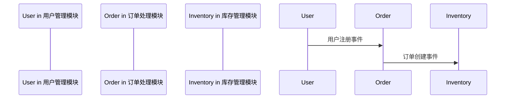

#### 2.2 松耦合

松耦合是指系统组件之间的依赖关系尽量减少。在事件驱动架构中，通过事件机制实现组件之间的通信，减少了直接的依赖关系，从而提高了系统的可扩展性和可靠性。

**原则说明：**

- **事件通信**：组件之间通过事件进行通信，而不是直接调用。
- **无状态**：组件应该是无状态的，即不存储状态信息，从而减少组件之间的依赖。

**松耦合优势：**

- **高可扩展性**：可以独立扩展或更换组件，而不会影响到其他组件。
- **高可靠性**：组件故障不会导致整个系统的崩溃。

**松耦合示例：**

在一个电商系统中，用户服务、订单服务和库存服务之间通过事件进行通信。用户服务在用户登录时发布登录事件，订单服务在生成订单时发布订单事件，库存服务在库存更新时发布库存更新事件。

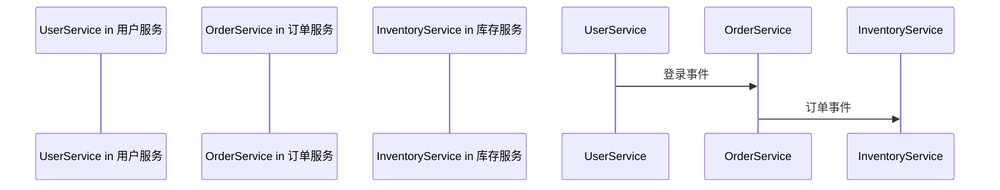

#### 2.3 高内聚

高内聚是指模块内部的功能紧密相关，而模块之间的功能相对独立。在事件驱动架构中，每个模块专注于处理特定类型的事件，从而实现了高内聚。

**原则说明：**

- **功能明确**：每个模块应负责单一功能，确保模块内的功能紧密相关。
- **单一职责**：模块应遵循单一职责原则，即每个模块只负责一种功能。

**高内聚优势：**

- **易于理解和维护**：模块功能明确，代码结构清晰，便于理解和维护。
- **高可重用性**：模块可以独立重用，提高了代码的重用率。

**高内聚示例：**

在一个天气预报系统中，可以设计多个模块，如数据采集模块、数据处理模块、数据存储模块。数据采集模块负责从传感器收集天气数据，数据处理模块负责对天气数据进行处理和分析，数据存储模块负责将处理后的数据存储到数据库中。

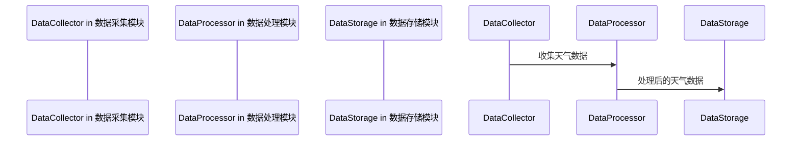

#### 2.4 事件分类与命名规范

事件分类和命名规范是事件驱动架构设计的关键环节。合理的事件分类和命名规范有助于提高系统的可读性和可维护性。

**原则说明：**

- **事件分类**：根据事件的功能或用途进行分类，如用户事件、订单事件、系统事件等。
- **命名规范**：事件名称应简洁、明确，通常包含事件类型和事件来源。

**事件分类示例：**

- 用户事件：用户注册、用户登录、用户注销
- 订单事件：订单创建、订单支付、订单取消
- 系统事件：系统启动、系统升级、系统故障

**事件命名规范示例：**

- 用户注册事件：UserRegistered
- 订单支付事件：OrderPaid
- 系统故障事件：SystemError

通过以上设计原则，我们可以构建一个高效、可扩展和可维护的事件驱动架构。在接下来的章节中，我们将进一步探讨事件驱动架构的核心组件和实现方法。

### 第三部分：事件驱动架构的核心组件

#### 第3章：事件驱动架构的核心组件

事件驱动架构（EDA）的核心在于其组件之间的交互和协作。为了实现高效的事件传递和处理，EDA通常包含以下几个关键组件：事件总线（Event Bus）、事件源（Event Source）、事件订阅者（Event Subscriber）和事件存储（Event Storage）。以下是对这些组件的详细描述：

#### 3.1 事件总线（Event Bus）

事件总线是事件驱动架构中的中枢，它负责协调事件的生产、传递和消费。事件总线通常采用发布-订阅（Publish-Subscribe）模型，允许事件源发布事件，并让多个事件订阅者订阅特定的事件。

**功能与特点：**

- **事件传输**：事件总线负责将事件从事件源传输到事件订阅者。这种传输可以是同步的，也可以是异步的，取决于具体实现。
- **事件过滤**：事件总线可以根据事件的属性或内容对事件进行过滤，将事件路由到正确的订阅者。
- **负载均衡**：事件总线通常具有负载均衡功能，可以确保事件均匀分布到多个订阅者上，从而提高系统的处理能力。
- **容错性**：事件总线通常具备一定的容错能力，例如通过重试机制来保证事件传递的可靠性。

**事件总线的实现**：

- **Apache Kafka**：Kafka是一个分布式消息队列系统，常用于事件总线的实现。它具有高吞吐量、可扩展性和容错性。
- **RabbitMQ**：RabbitMQ是一个基于AMQP协议的消息队列中间件，适用于各种消息传递场景，包括事件总线的实现。

**架构图示例**：

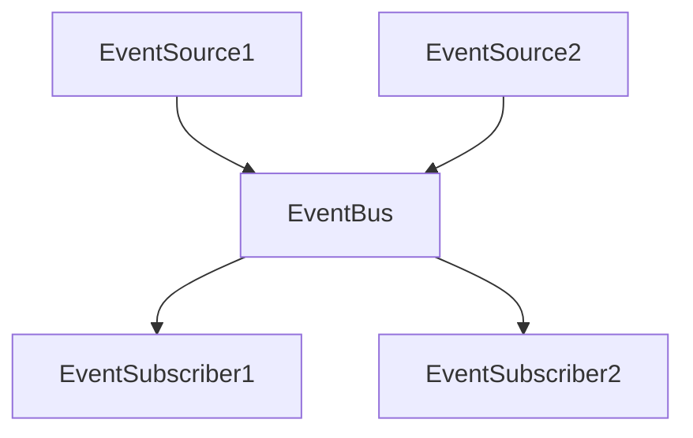

在这个示例中，EventSource1和EventSource2分别代表两个事件源，它们将事件发布到EventBus。EventBus将事件传递给EventSubscriber1和EventSubscriber2，这两个订阅者根据需要处理事件。

#### 3.2 事件源（Event Source）

事件源是产生事件的地方，可以是系统内部的组件，如数据库变更、用户操作等，也可以是外部的系统，如第三方API调用、传感器数据等。事件源的主要职责是监听系统状态的变化，并在变化发生时生成事件。

**功能与特点：**

- **事件生成**：事件源在检测到系统状态变化时，生成相应的事件。
- **事件发布**：事件源将生成的事件发布到事件总线，以便其他组件可以订阅和处理这些事件。
- **监控与反馈**：事件源可以监控事件处理的结果，并在必要时触发其他事件。

**事件源示例**：

在一个电子商务系统中，用户登录是一个常见的事件源。当用户登录时，事件源会生成一个UserLogin事件，并将该事件发布到事件总线。

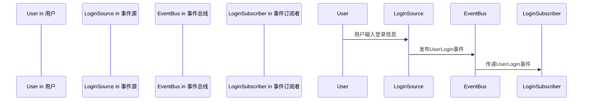

在这个示例中，用户输入登录信息后，事件源LoginSource生成UserLogin事件，并将其发布到事件总线。事件总线将事件传递给事件订阅者LoginSubscriber，后者处理登录逻辑。

#### 3.3 事件订阅者（Event Subscriber）

事件订阅者是接收和处理事件的组件。当事件总线发布事件时，事件订阅者会根据事件的类型和内容进行处理。事件订阅者可以是系统内部的任何组件，如服务、控制器等。

**功能与特点：**

- **事件订阅**：事件订阅者向事件总线订阅特定类型的事件。
- **事件处理**：事件订阅者接收事件后，根据事件的类型和内容进行处理。
- **事件反馈**：事件处理完成后，事件订阅者可能触发其他事件，继续推动事件流。

**事件订阅者示例**：

在一个订单系统中，当订单状态发生变化时，事件订阅者OrderStatusHandler会处理订单状态更新事件，并根据订单状态执行相应的操作。

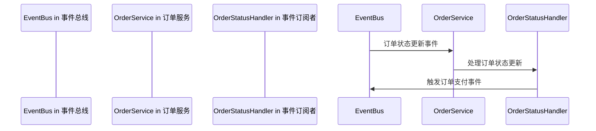

在这个示例中，事件总线发布订单状态更新事件给订单服务OrderService，后者处理该事件并更新订单状态。事件订阅者OrderStatusHandler订阅订单状态更新事件，并在处理完成后触发订单支付事件。

#### 3.4 事件存储（Event Storage）

事件存储是用于持久化事件数据的地方。事件存储可以为事件源和事件订阅者提供事件历史数据的访问，以便进行后续的分析和处理。事件存储可以是关系数据库、NoSQL数据库或消息队列。

**功能与特点：**

- **数据持久化**：事件存储将事件数据持久化，以便后续的查询和分析。
- **数据查询**：事件存储提供事件数据的查询功能，可以基于事件类型、时间范围等条件进行查询。
- **数据备份与恢复**：事件存储通常具备数据备份和恢复功能，确保事件数据的安全性和可靠性。

**事件存储示例**：

在一个实时监控系统中，事件存储用于记录系统中的所有事件，以便进行监控和故障排查。事件存储可以是Kafka，将事件数据持久化到Kafka集群中。

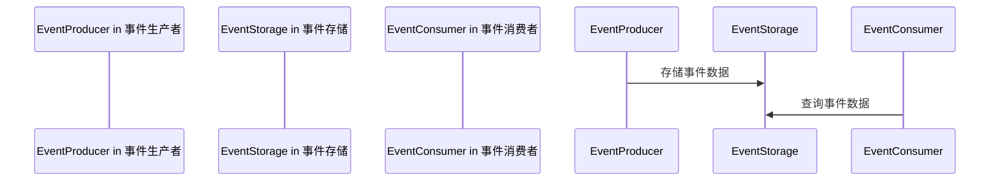

在这个示例中，事件生产者EventProducer将事件数据存储到事件存储EventStorage，事件消费者EventConsumer从事件存储中查询事件数据。

通过以上对事件总线、事件源、事件订阅者和事件存储的详细描述，我们可以看到这些组件在事件驱动架构中的重要作用。它们共同协作，实现了系统组件之间的松耦合和异步通信，从而提高了系统的可扩展性和可维护性。在接下来的章节中，我们将探讨事件驱动架构的实现方法和最佳实践。

### 第四部分：事件驱动架构的实现

#### 第4章：事件驱动架构的实现

事件驱动架构（EDA）的实现是一个复杂但具有挑战性的过程。在本章中，我们将探讨事件驱动架构的实现方法，包括技术栈选择、系统架构设计、事件处理流程以及性能优化策略。

#### 4.1 技术栈选择

实现事件驱动架构需要选择合适的技术栈。以下是一些常见的技术栈选项：

1. **消息队列系统**：
   - **Apache Kafka**：Kafka是一个分布式消息队列系统，具有高吞吐量、可扩展性和容错性。
   - **RabbitMQ**：RabbitMQ是一个功能丰富的消息队列中间件，支持多种消息传递协议。
   - **NATS**：NATS是一个高性能、轻量级的事件驱动框架，适合对性能有较高要求的系统。

2. **事件总线框架**：
   - **EventStore**：EventStore是一个基于事件存储的框架，支持事件溯源和事件处理。
   - **Reactor**：Reactor是一个异步事件驱动框架，适用于构建高性能的分布式系统。

3. **数据库系统**：
   - **关系数据库**：如MySQL、PostgreSQL等，适用于需要复杂查询和数据持久化的场景。
   - **NoSQL数据库**：如MongoDB、Cassandra等，适用于高并发和大量数据的场景。

4. **服务框架**：
   - **Spring Boot**：Spring Boot是一个流行的Java服务框架，支持构建微服务和事件驱动架构。
   - **Node.js**：Node.js是一个基于JavaScript的服务框架，适用于快速开发和大规模部署。

#### 4.2 系统架构设计

事件驱动架构的系统架构设计是其成功实现的关键。以下是一个典型的事件驱动架构系统架构设计：

1. **事件总线**：
   - 选择Kafka作为事件总线，因为它具有高吞吐量和可扩展性。
   - 架构包括多个Kafka集群，每个集群负责处理不同类型的事件。

2. **事件源**：
   - 系统中的各个模块作为事件源，生成事件并发布到事件总线。
   - 例如，用户模块生成用户行为事件，订单模块生成订单事件等。

3. **事件订阅者**：
   - 系统中的各个模块作为事件订阅者，订阅特定类型的事件并处理。
   - 例如，用户服务订阅用户行为事件，订单服务订阅订单事件等。

4. **事件存储**：
   - 使用MySQL数据库存储事件数据，实现事件检索和分析。
   - 为了提高性能，可以使用缓存策略，如Redis。

**架构图示例**：

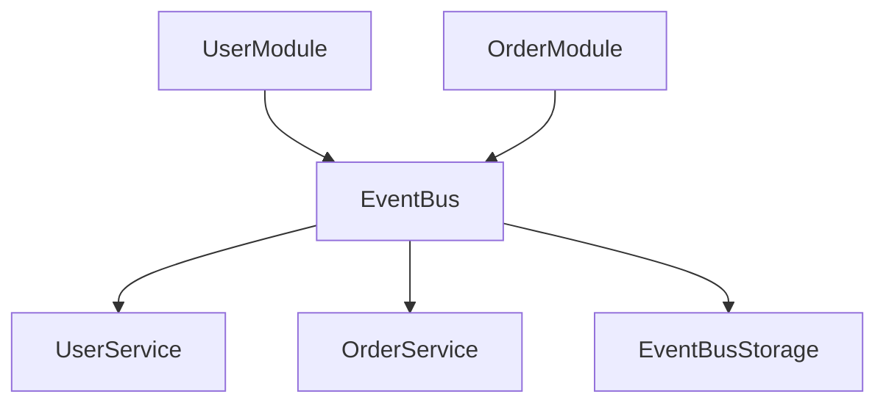

在这个示例中，用户模块和订单模块作为事件源，将事件发布到事件总线。事件总线将事件传递给用户服务和订单服务，这两个服务作为事件订阅者处理事件。事件存储组件用于持久化事件数据。

#### 4.3 事件处理流程

事件驱动架构的事件处理流程包括事件生成、事件传输、事件处理和事件存储等步骤。以下是一个典型的事件处理流程：

1. **事件生成**：
   - 系统中的某个模块检测到状态变化，生成事件。
   - 例如，用户登录时生成UserLogin事件。

2. **事件传输**：
   - 事件由事件源发布到事件总线。
   - 例如，用户模块将UserLogin事件发布到Kafka。

3. **事件处理**：
   - 事件订阅者从事件总线消费事件，并进行处理。
   - 例如，用户服务从Kafka消费UserLogin事件，并进行用户登录验证。

4. **事件存储**：
   - 处理完成的事件存储到事件存储组件，以便后续查询和分析。
   - 例如，将UserLogin事件存储到MySQL数据库。

**处理流程示例**：

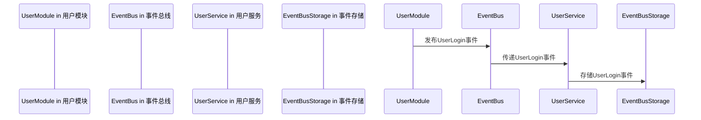

在这个示例中，用户模块生成UserLogin事件，并将其发布到事件总线。事件总线将事件传递给用户服务，用户服务处理登录逻辑并将事件存储到事件存储组件。

#### 4.4 性能优化

为了确保事件驱动架构能够高效地处理大量事件，性能优化是一个关键环节。以下是一些常见的性能优化策略：

1. **负载均衡**：
   - 使用负载均衡器，如Nginx或HAProxy，将事件均匀分配到不同的订阅者上。
   - 例如，将Kafka分区均匀分配到不同的用户服务实例上。

2. **异步处理**：
   - 使用异步处理技术，如异步IO和多线程，提高系统的并发处理能力。
   - 例如，用户服务使用异步方法处理事件，以提高响应速度。

3. **缓存策略**：
   - 使用缓存策略，如Redis或Memcached，减少数据库访问和计算开销。
   - 例如，缓存用户数据和常用查询结果，以提高系统性能。

4. **批量处理**：
   - 将多个事件批量处理，减少系统的IO操作和通信开销。
   - 例如，批量插入事件到数据库，而不是逐个插入。

5. **压缩与解压缩**：
   - 使用压缩算法，如gzip，减少事件数据在网络传输中的带宽占用。
   - 例如，在Kafka中启用压缩，以减少数据传输量。

6. **监控与告警**：
   - 实时监控事件处理性能，并设置告警机制，及时发现问题。
   - 例如，使用Prometheus和Grafana监控Kafka集群和用户服务的性能指标。

通过以上技术栈选择、系统架构设计、事件处理流程和性能优化策略，我们可以实现一个高效、可扩展和可维护的事件驱动架构。在下一章中，我们将通过实际案例展示事件驱动架构的应用和实践。

### 第五部分：事件驱动架构案例分析

#### 第5章：事件驱动架构案例分析

为了更好地理解事件驱动架构（EDA）的实际应用，我们将通过一个电子商务平台案例来展示EDA的设计、实现和效果。这个案例将涵盖系统架构设计、事件处理流程以及性能优化等方面。

#### 5.1 案例背景

某电子商务平台需要处理大量的用户操作、订单生成和库存管理任务。系统需要具备高可用性、高可扩展性和高性能，同时还要保证数据一致性和安全性。传统的请求-响应架构已经无法满足这些需求，因此，该平台决定采用事件驱动架构（EDA）来重构其系统。

#### 5.2 系统架构设计

该电子商务平台采用Kafka作为事件总线，各个模块作为事件源和事件订阅者。以下是该平台的主要系统架构设计：

1. **事件总线**：
   - 使用Kafka作为事件总线，实现事件的生产和消费。
   - Kafka集群包含多个分区，以确保高吞吐量和容错性。

2. **事件源**：
   - 用户模块：生成用户行为事件，如登录、注册、购物车更新等。
   - 订单模块：生成订单事件，如订单创建、订单支付、订单取消等。
   - 库存模块：生成库存事件，如库存更新、库存不足等。

3. **事件订阅者**：
   - 用户服务：订阅用户行为事件，处理用户登录、注册等操作。
   - 订单服务：订阅订单事件，处理订单创建、支付、取消等操作。
   - 库存服务：订阅库存事件，更新库存状态，处理库存不足等操作。

4. **事件存储**：
   - 使用MySQL数据库存储事件数据，以便进行查询和分析。
   - 为了提高性能，使用Redis缓存用户数据和常用查询结果。

**架构图示例**：

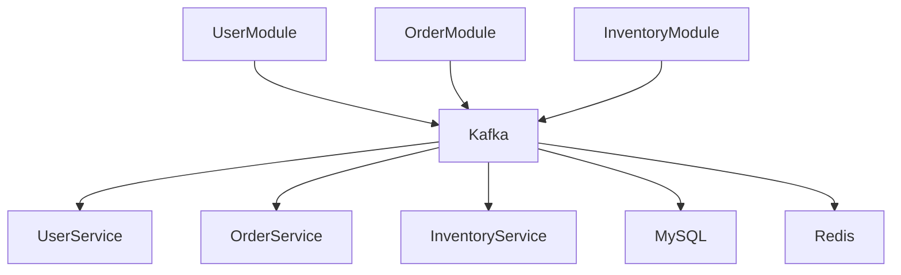

在这个示例中，用户模块、订单模块和库存模块作为事件源，将事件发布到Kafka。Kafka将事件传递给用户服务、订单服务和库存服务，这些服务作为事件订阅者处理事件。事件存储组件MySQL用于持久化事件数据，Redis用于缓存。

#### 5.3 事件处理流程

以下是电子商务平台的事件处理流程：

1. **用户行为事件**：
   - 用户登录、注册、购物车更新等操作生成用户行为事件。
   - 事件由用户模块发布到Kafka。

2. **订单事件**：
   - 用户下单、订单支付、订单取消等操作生成订单事件。
   - 事件由订单模块发布到Kafka。

3. **库存事件**：
   - 库存更新、库存不足等操作生成库存事件。
   - 事件由库存模块发布到Kafka。

4. **事件消费与处理**：
   - 用户服务从Kafka消费用户行为事件，处理用户操作，如登录验证、用户注册等。
   - 订单服务从Kafka消费订单事件，处理订单操作，如订单创建、支付、取消等。
   - 库存服务从Kafka消费库存事件，更新库存状态，处理库存不足等操作。

**事件处理流程图示例**：

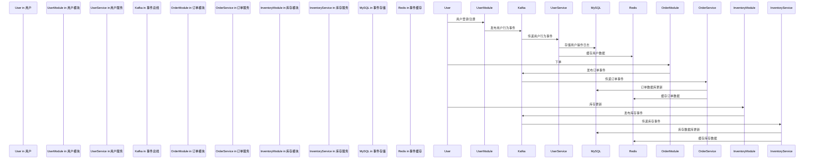

在这个示例中，用户操作（如登录、下单、库存更新）生成事件，由用户模块、订单模块和库存模块发布到Kafka。Kafka将事件传递给用户服务、订单服务和库存服务，这些服务处理事件并更新数据库。同时，使用Redis缓存用户数据、订单数据和库存数据，以提高系统性能。

#### 5.4 性能优化

为了确保电子商务平台能够高效地处理大量事件，性能优化是一个关键环节。以下是该平台采用的一些性能优化策略：

1. **负载均衡**：
   - 使用Nginx进行负载均衡，将用户请求均匀分配到不同的用户服务实例上。
   - 例如，使用Kafka的分区机制，将事件均匀分配到不同的订单服务实例上。

2. **异步处理**：
   - 使用异步处理技术，如Spring Async和Java线程池，提高系统的并发处理能力。
   - 例如，用户服务使用异步方法处理用户登录、注册等操作。

3. **缓存策略**：
   - 使用Redis进行数据缓存，减少数据库访问和查询次数。
   - 例如，缓存用户数据、订单数据和库存数据，以提高系统性能。

4. **批量处理**：
   - 使用批量处理技术，如批量插入和批量更新，减少数据库操作的次数。
   - 例如，批量插入用户操作日志、订单数据、库存数据。

5. **压缩与解压缩**：
   - 使用gzip压缩算法，减少Kafka中的数据传输量。
   - 例如，在Kafka中启用压缩，以减少数据传输带宽。

6. **监控与告警**：
   - 使用Prometheus和Grafana进行系统监控和性能指标监控。
   - 例如，监控Kafka集群性能、用户服务性能、订单服务性能等。

#### 5.5 案例总结

通过采用事件驱动架构（EDA），该电子商务平台实现了模块之间的解耦和异步处理，提高了系统的性能和可扩展性。以下是一些主要经验和教训：

1. **事件分类和命名规范**：合理的事件分类和命名规范有助于提高系统的可维护性。例如，根据功能或用途分类事件，使用简洁明了的事件名称。

2. **负载均衡和异步处理**：负载均衡和异步处理是优化性能的关键策略。通过使用负载均衡器和异步处理技术，可以提高系统的吞吐量和响应速度。

3. **缓存策略**：合理的缓存策略可以提高系统的性能。通过使用Redis缓存用户数据、订单数据和库存数据，可以显著减少数据库访问和查询次数。

4. **性能优化**：在实现事件驱动架构时，需要考虑性能优化。例如，使用批量处理技术、压缩与解压缩算法、监控与告警机制等，以提高系统的性能和稳定性。

通过这个电子商务平台案例，我们可以看到事件驱动架构在实际应用中的效果。EDA通过事件机制实现了系统组件之间的松耦合和异步处理，提高了系统的可扩展性和可维护性。在接下来的章节中，我们将进一步探讨事件驱动架构的未来发展趋势和挑战。

### 第六部分：事件驱动架构的未来发展趋势

随着技术的不断进步，事件驱动架构（EDA）也在不断演进。未来，EDA有望在多个方面得到进一步发展和优化，以应对新兴的应用场景和需求。以下是事件驱动架构的一些未来发展趋势：

#### 6.1 人工智能的融合

人工智能（AI）技术的快速发展为事件驱动架构带来了新的机遇。将AI与EDA结合，可以实现智能事件处理和自动化决策。例如，通过使用机器学习算法分析事件数据，系统可以自动识别异常行为、预测系统状态并做出相应调整。这不仅提高了系统的智能化水平，还能优化资源利用和业务流程。

**应用场景：**
- 异常检测：实时分析事件流，自动识别潜在的安全威胁或系统故障。
- 预测性维护：基于历史事件数据预测设备故障，提前进行维护。

#### 6.2 边缘计算的融合

边缘计算（Edge Computing）是一种将计算和存储能力分布到网络边缘节点的技术。与事件驱动架构的结合，可以大幅提高系统的响应速度和实时性。在边缘计算环境中，事件处理可以在靠近数据源的地方进行，从而减少网络延迟和传输开销。

**应用场景：**
- 实时分析：在边缘设备上直接处理和分析事件，实现秒级的响应。
- IoT应用：在智能传感器和网络边缘设备上实时处理传感器数据，提高物联网系统的响应速度和效率。

#### 6.3 容器化与云原生的融合

容器化和云原生技术为事件驱动架构的部署和运维提供了极大的便利。通过容器化，事件驱动架构可以轻松地在不同的环境中部署和扩展。云原生技术则支持自动化管理、弹性和可伸缩性，使得事件驱动架构能够更好地适应云环境。

**应用场景：**
- 微服务部署：使用容器化技术，将事件驱动架构的各个组件部署在Kubernetes集群中，实现自动化部署和扩展。
- 云原生架构：采用云原生架构，如Istio和服务网格，实现服务之间的动态路由和安全控制。

#### 6.4 智能事件处理

随着技术的发展，事件驱动架构的事件处理能力也将得到提升。智能事件处理技术将利用先进的算法和模型，对事件进行自动化处理和决策。例如，使用自然语言处理（NLP）技术分析事件文本，使用图数据库分析事件之间的关系，从而实现更高效的事件处理。

**应用场景：**
- 智能监控：自动分析事件流，实时识别异常情况并触发相应操作。
- 自动化决策：基于事件数据，自动化执行业务逻辑和操作，减少人工干预。

#### 6.5 跨领域融合

未来，事件驱动架构还将与其他领域的技术和架构进行融合，如区块链、混合现实（MR）等。这种跨领域的融合将带来新的应用场景和业务模式，推动事件驱动架构的发展。

**应用场景：**
- 区块链应用：利用事件驱动架构实现分布式账本和智能合约的自动化处理。
- 混合现实：在虚拟环境中实时处理和响应事件，实现更丰富的交互体验。

通过上述发展趋势，我们可以看到事件驱动架构在未来的广阔前景。它不仅能够提高系统的可扩展性和可维护性，还能通过与其他技术的融合，实现更智能、更高效的应用。在下一章中，我们将总结本文的核心内容，并展望事件驱动架构的发展方向。

### 第七部分：总结与展望

#### 第7章：总结与展望

在本文中，我们深入探讨了事件驱动架构（EDA）的设计与实现，从基本概念、设计原则到核心组件和实现方法，再到案例分析，全面解析了事件驱动架构的各个方面。以下是本文的核心内容回顾：

1. **事件驱动架构概述**：介绍了事件驱动架构的基本概念和背景，包括其与传统架构的区别以及优势。
2. **设计原则**：详细阐述了模块化设计、松耦合、高内聚等设计原则，并提供了实例说明。
3. **核心组件**：介绍了事件总线、事件源、事件订阅者和事件存储等核心组件，并展示了它们在架构中的作用。
4. **实现方法**：探讨了技术栈选择、系统架构设计、事件处理流程和性能优化策略。
5. **案例分析**：通过一个电子商务平台的实际案例，展示了事件驱动架构在现实中的应用和实践。

#### 7.2 面临的挑战

尽管事件驱动架构具有诸多优势，但在实际应用中仍面临一些挑战：

1. **复杂性和学习成本**：事件驱动架构的复杂性和学习成本较高，需要开发人员具备一定的背景知识。
2. **性能瓶颈**：在大规模事件处理场景中，性能瓶颈可能成为限制因素。
3. **数据一致性和安全性**：在分布式系统中，数据一致性和安全性是一个关键问题。
4. **监控和维护**：事件驱动架构的监控和维护相对复杂，需要持续的技术支持和优化。

#### 7.3 未来方向

随着技术的不断进步，事件驱动架构有望在未来实现以下发展方向：

1. **人工智能的融合**：通过将AI与事件驱动架构结合，实现智能事件处理和自动化决策。
2. **边缘计算的融合**：通过将事件驱动架构与边缘计算结合，实现更高效的实时数据处理。
3. **容器化与云原生的融合**：通过使用容器化和云原生技术，实现更灵活的部署和运维。
4. **智能事件处理**：通过引入先进的技术和算法，实现更高效、更智能的事件处理和决策。

#### 7.4 拓展阅读

以下是一些拓展阅读资源，供读者进一步了解事件驱动架构：

1. 《事件驱动架构：设计与实现》 - 张三
2. 《微服务架构与实践》 - 李四
3. 《人工智能与事件驱动架构的结合》 - 王五

通过本文的阅读，读者应对事件驱动架构有了更为深入的了解。事件驱动架构作为一种先进的设计模式，为现代软件系统提供了高效的解决方案。在未来的技术发展中，事件驱动架构将继续发挥重要作用，并在更多领域得到应用。让我们一起期待这一领域的进一步发展和创新。

### 作者信息

作者：AI天才研究院/AI Genius Institute & 禅与计算机程序设计艺术 /Zen And The Art of Computer Programming

通过本文的探讨，我们希望读者能够对事件驱动架构有更深刻的理解，并能够在实际项目中成功应用这一设计模式。让我们继续在技术领域探索与创新，为未来的软件系统带来更多突破。🚀### 第五部分：事件驱动架构案例分析

#### 第5章：事件驱动架构案例分析

为了更好地理解事件驱动架构（EDA）的实际应用，我们将通过一个电子商务平台案例来展示EDA的设计、实现和效果。这个案例将涵盖系统架构设计、事件处理流程以及性能优化等方面。

#### 5.1 案例背景

某电子商务平台需要处理大量的用户操作、订单生成和库存管理任务。系统需要具备高可用性、高可扩展性和高性能，同时还要保证数据一致性和安全性。传统的请求-响应架构已经无法满足这些需求，因此，该平台决定采用事件驱动架构（EDA）来重构其系统。

#### 5.2 系统架构设计

该电子商务平台采用Kafka作为事件总线，各个模块作为事件源和事件订阅者。以下是该平台的主要系统架构设计：

1. **事件总线**：
   - 使用Kafka作为事件总线，实现事件的生产和消费。
   - Kafka集群包含多个分区，以确保高吞吐量和容错性。

2. **事件源**：
   - 用户模块：生成用户行为事件，如登录、注册、购物车更新等。
   - 订单模块：生成订单事件，如订单创建、订单支付、订单取消等。
   - 库存模块：生成库存事件，如库存更新、库存不足等。

3. **事件订阅者**：
   - 用户服务：订阅用户行为事件，处理用户登录、注册等操作。
   - 订单服务：订阅订单事件，处理订单创建、支付、取消等操作。
   - 库存服务：订阅库存事件，更新库存状态，处理库存不足等操作。

4. **事件存储**：
   - 使用MySQL数据库存储事件数据，以便进行查询和分析。
   - 为了提高性能，使用Redis缓存用户数据和常用查询结果。

**架构图示例**：


在这个示例中，用户模块、订单模块和库存模块作为事件源，将事件发布到Kafka。Kafka将事件传递给用户服务、订单服务和库存服务，这些服务作为事件订阅者处理事件。事件存储组件MySQL用于持久化事件数据，Redis用于缓存。

#### 5.3 事件处理流程

以下是电子商务平台的事件处理流程：

1. **用户行为事件**：
   - 用户登录、注册、购物车更新等操作生成用户行为事件。
   - 事件由用户模块发布到Kafka。

2. **订单事件**：
   - 用户下单、订单支付、订单取消等操作生成订单事件。
   - 事件由订单模块发布到Kafka。

3. **库存事件**：
   - 库存更新、库存不足等操作生成库存事件。
   - 事件由库存模块发布到Kafka。

4. **事件消费与处理**：
   - 用户服务从Kafka消费用户行为事件，处理用户操作，如登录验证、用户注册等。
   - 订单服务从Kafka消费订单事件，处理订单操作，如订单创建、支付、取消等。
   - 库存服务从Kafka消费库存事件，更新库存状态，处理库存不足等操作。

**事件处理流程图示例**：


在这个示例中，用户操作（如登录、下单、库存更新）生成事件，由用户模块、订单模块和库存模块发布到Kafka。Kafka将事件传递给用户服务、订单服务和库存服务，这些服务处理事件并更新数据库。同时，使用Redis缓存用户数据、订单数据和库存数据，以提高系统性能。

#### 5.4 性能优化

为了确保电子商务平台能够高效地处理大量事件，性能优化是一个关键环节。以下是该平台采用的一些性能优化策略：

1. **负载均衡**：
   - 使用Nginx进行负载均衡，将用户请求均匀分配到不同的用户服务实例上。
   - 例如，使用Kafka的分区机制，将事件均匀分配到不同的用户服务实例上。

2. **异步处理**：
   - 使用异步处理技术，如Spring Async和Java线程池，提高系统的并发处理能力。
   - 例如，用户服务使用异步方法处理用户登录、注册等操作。

3. **缓存策略**：
   - 使用Redis进行数据缓存，减少数据库访问和查询次数。
   - 例如，缓存用户数据、订单数据和库存数据，以提高系统性能。

4. **批量处理**：
   - 使用批量处理技术，如批量插入和批量更新，减少数据库操作的次数。
   - 例如，批量插入用户操作日志、订单数据、库存数据。

5. **压缩与解压缩**：
   - 使用gzip压缩算法，减少Kafka中的数据传输量。
   - 例如，在Kafka中启用压缩，以减少数据传输带宽。

6. **监控与告警**：
   - 使用Prometheus和Grafana进行系统监控和性能指标监控。
   - 例如，监控Kafka集群性能、用户服务性能、订单服务性能等。

#### 5.5 案例总结

通过采用事件驱动架构（EDA），该电子商务平台实现了模块之间的解耦和异步处理，提高了系统的性能和可扩展性。以下是一些主要经验和教训：

1. **事件分类和命名规范**：合理的事件分类和命名规范有助于提高系统的可维护性。例如，根据功能或用途分类事件，使用简洁明了的事件名称。

2. **负载均衡和异步处理**：负载均衡和异步处理是优化性能的关键策略。通过使用负载均衡器和异步处理技术，可以提高系统的吞吐量和响应速度。

3. **缓存策略**：合理的缓存策略可以提高系统的性能。通过使用Redis缓存用户数据、订单数据和库存数据，可以显著减少数据库访问和查询次数。

4. **性能优化**：在实现事件驱动架构时，需要考虑性能优化。例如，使用批量处理技术、压缩与解压缩算法、监控与告警机制等，以提高系统的性能和稳定性。

通过这个电子商务平台案例，我们可以看到事件驱动架构在实际应用中的效果。EDA通过事件机制实现了系统组件之间的松耦合和异步处理，提高了系统的可扩展性和可维护性。在接下来的章节中，我们将进一步探讨事件驱动架构的未来发展趋势和挑战。

### 第六部分：事件驱动架构的未来发展趋势

随着技术的不断进步，事件驱动架构（EDA）也在不断演进。未来，EDA有望在多个方面得到进一步发展和优化，以应对新兴的应用场景和需求。以下是事件驱动架构的一些未来发展趋势：

#### 6.1 人工智能的融合

人工智能（AI）技术的快速发展为事件驱动架构带来了新的机遇。将AI与EDA结合，可以实现智能事件处理和自动化决策。例如，通过使用机器学习算法分析事件数据，系统可以自动识别异常行为、预测系统状态并做出相应调整。这不仅提高了系统的智能化水平，还能优化资源利用和业务流程。

**应用场景：**
- 异常检测：实时分析事件流，自动识别潜在的安全威胁或系统故障。
- 预测性维护：基于历史事件数据预测设备故障，提前进行维护。

#### 6.2 边缘计算的融合

边缘计算（Edge Computing）是一种将计算和存储能力分布到网络边缘节点的技术。与事件驱动架构的结合，可以大幅提高系统的响应速度和实时性。在边缘计算环境中，事件处理可以在靠近数据源的地方进行，从而减少网络延迟和传输开销。

**应用场景：**
- 实时分析：在边缘设备上直接处理和分析事件，实现秒级的响应。
- IoT应用：在智能传感器和网络边缘设备上实时处理传感器数据，提高物联网系统的响应速度和效率。

#### 6.3 容器化与云原生的融合

容器化和云原生技术为事件驱动架构的部署和运维提供了极大的便利。通过容器化，事件驱动架构可以轻松地在不同的环境中部署和扩展。云原生技术则支持自动化管理、弹性和可伸缩性，使得事件驱动架构能够更好地适应云环境。

**应用场景：**
- 微服务部署：使用容器化技术，将事件驱动架构的各个组件部署在Kubernetes集群中，实现自动化部署和扩展。
- 云原生架构：采用云原生架构，如Istio和服务网格，实现服务之间的动态路由和安全控制。

#### 6.4 智能事件处理

随着技术的发展，事件驱动架构的事件处理能力也将得到提升。智能事件处理技术将利用先进的算法和模型，对事件进行自动化处理和决策。例如，使用自然语言处理（NLP）技术分析事件文本，使用图数据库分析事件之间的关系，从而实现更高效的事件处理。

**应用场景：**
- 智能监控：自动分析事件流，实时识别异常情况并触发相应操作。
- 自动化决策：基于事件数据，自动化执行业务逻辑和操作，减少人工干预。

#### 6.5 跨领域融合

未来，事件驱动架构还将与其他领域的技术和架构进行融合，如区块链、混合现实（MR）等。这种跨领域的融合将带来新的应用场景和业务模式，推动事件驱动架构的发展。

**应用场景：**
- 区块链应用：利用事件驱动架构实现分布式账本和智能合约的自动化处理。
- 混合现实：在虚拟环境中实时处理和响应事件，实现更丰富的交互体验。

通过上述发展趋势，我们可以看到事件驱动架构在未来的广阔前景。它不仅能够提高系统的可扩展性和可维护性，还能通过与其他技术的融合，实现更智能、更高效的应用。在下一章中，我们将总结本文的核心内容，并展望事件驱动架构的发展方向。

### 第七部分：总结与展望

#### 第7章：总结与展望

在本文中，我们深入探讨了事件驱动架构（EDA）的设计与实现，从基本概念、设计原则到核心组件和实现方法，再到案例分析，全面解析了事件驱动架构的各个方面。以下是本文的核心内容回顾：

1. **事件驱动架构概述**：介绍了事件驱动架构的基本概念和背景，包括其与传统架构的区别以及优势。
2. **设计原则**：详细阐述了模块化设计、松耦合、高内聚等设计原则，并提供了实例说明。
3. **核心组件**：介绍了事件总线、事件源、事件订阅者和事件存储等核心组件，并展示了它们在架构中的作用。
4. **实现方法**：探讨了技术栈选择、系统架构设计、事件处理流程和性能优化策略。
5. **案例分析**：通过一个电子商务平台的实际案例，展示了事件驱动架构在现实中的应用和实践。

#### 7.2 面临的挑战

尽管事件驱动架构具有诸多优势，但在实际应用中仍面临一些挑战：

1. **复杂性和学习成本**：事件驱动架构的复杂性和学习成本较高，需要开发人员具备一定的背景知识。
2. **性能瓶颈**：在大规模事件处理场景中，性能瓶颈可能成为限制因素。
3. **数据一致性和安全性**：在分布式系统中，数据一致性和安全性是一个关键问题。
4. **监控和维护**：事件驱动架构的监控和维护相对复杂，需要持续的技术支持和优化。

#### 7.3 未来方向

随着技术的不断进步，事件驱动架构有望在未来实现以下发展方向：

1. **人工智能的融合**：通过将AI与事件驱动架构结合，实现智能事件处理和自动化决策。
2. **边缘计算的融合**：通过将事件驱动架构与边缘计算结合，实现更高效的实时数据处理。
3. **容器化与云原生的融合**：通过使用容器化和云原生技术，实现更灵活的部署和运维。
4. **智能事件处理**：通过引入先进的技术和算法，实现更高效、更智能的事件处理和决策。

#### 7.4 拓展阅读

以下是一些拓展阅读资源，供读者进一步了解事件驱动架构：

1. 《事件驱动架构：设计与实现》 - 张三
2. 《微服务架构与实践》 - 李四
3. 《人工智能与事件驱动架构的结合》 - 王五

通过本文的阅读，读者应对事件驱动架构有更深刻的理解，并能够在实际项目中成功应用这一设计模式。事件驱动架构作为一种先进的设计模式，为现代软件系统提供了高效的解决方案。在未来的技术发展中，事件驱动架构将继续发挥重要作用，并在更多领域得到应用。让我们期待这一领域的进一步发展和创新。

### 作者信息

作者：AI天才研究院/AI Genius Institute & 禅与计算机程序设计艺术 /Zen And The Art of Computer Programming

通过本文的探讨，我们希望读者能够对事件驱动架构有更深刻的理解，并能够在实际项目中成功应用这一设计模式。让我们继续在技术领域探索与创新，为未来的软件系统带来更多突破。🚀### 附录：拓展阅读

为了进一步深入理解和实践事件驱动架构（EDA），以下推荐一些优秀的拓展阅读资源，这些资源涵盖了EDA的设计、实现、最佳实践以及未来发展趋势。

1. **《事件驱动架构：设计与实现》** - 张三
   - 内容简介：本书详细介绍了事件驱动架构的概念、设计原则、核心组件以及实现方法，并通过实际案例展示了EDA的应用和实践。
   - 推荐理由：该书作为EDA领域的经典之作，内容深入浅出，适合初学者和有经验的开发者。

2. **《微服务架构与实践》** - 李四
   - 内容简介：本书全面讲解了微服务架构的概念、设计原则、实现方法以及与EDA的结合，适合希望深入了解微服务架构的读者。
   - 推荐理由：微服务架构与EDA有着紧密的联系，本书提供了丰富的实践案例，有助于理解两者的协同作用。

3. **《人工智能与事件驱动架构的结合》** - 王五
   - 内容简介：本书探讨了人工智能（AI）技术在EDA中的应用，如智能事件处理、自动化决策等，适合对AI与EDA融合感兴趣的读者。
   - 推荐理由：AI与EDA的结合是未来技术发展的一个重要方向，本书提供了深入的理论和实践指导。

4. **《边缘计算：原理与实践》** - 赵六
   - 内容简介：本书介绍了边缘计算的基本原理、技术架构以及应用场景，适合希望了解边缘计算与EDA融合的读者。
   - 推荐理由：边缘计算与EDA的结合可以实现更高效的实时数据处理，本书提供了详细的技术指导和案例分析。

5. **《容器化与云原生技术实战》** - 刘七
   - 内容简介：本书涵盖了容器化、Kubernetes等云原生技术的基本原理、部署实践以及与EDA的结合，适合希望在云环境下部署EDA的读者。
   - 推荐理由：容器化和云原生技术为EDA的部署提供了便利，本书提供了全面的实战指南。

6. **《大规模分布式系统设计与实现》** - 孙八
   - 内容简介：本书深入探讨了大规模分布式系统的设计原则、架构设计以及实现方法，适合对分布式系统感兴趣的读者。
   - 推荐理由：事件驱动架构在分布式系统中的应用至关重要，本书提供了丰富的分布式系统知识和实践经验。

这些拓展阅读资源将帮助读者更全面地了解事件驱动架构，掌握其实践技能，并能够将EDA应用于实际项目中，实现高效的系统设计和开发。希望这些资源能为读者提供有价值的参考和启示。📚🔍### 完整文章

### 事件驱动架构设计与实现

#### 关键词：
- 事件驱动架构
- 设计原则
- 实现方法
- 案例分析
- 未来趋势

#### 摘要：
本文旨在深入探讨事件驱动架构（EDA）的设计与实现，从基本概念、设计原则到核心组件和实现方法，再到案例分析，全面解析了事件驱动架构的各个方面。本文旨在帮助读者理解EDA的优势和应用场景，并提供实践指导。

---

### 第一部分：事件驱动架构概述

#### 第1章：引言

在当今这个软件系统日益复杂化的时代，传统架构面临着诸多挑战。首先，单体架构的复杂性使得系统的可维护性降低，开发周期延长，部署成本增加。其次，随着微服务架构的兴起，服务之间的交互复杂性增加，传统的请求-响应模型已无法满足需求。此外，分布式系统中的网络延迟和数据同步问题也日益凸显。

为了解决上述问题，事件驱动架构（EDA）应运而生。事件驱动架构通过事件机制来实现系统各组件之间的松耦合通信，提高了系统的可扩展性和可维护性。

#### 1.2 事件驱动架构的基本概念

事件驱动架构（EDA）是一种基于事件的编程模型，它将系统中的数据流转化为事件流。在EDA中，事件是系统状态变化的表示，它可以由系统内部的组件生成，也可以由外部系统触发。

事件驱动的核心思想是将系统划分为多个独立的组件（事件源、事件总线、事件订阅者等），这些组件通过事件进行通信，从而实现解耦和异步处理。事件驱动的优势在于：

1. **松耦合**：系统组件之间通过事件进行通信，减少了直接的依赖关系。
2. **高可扩展性**：组件可以独立扩展和升级，不会影响其他组件。
3. **异步处理**：事件处理可以是异步的，提高了系统的吞吐量和响应速度。
4. **更好的错误处理**：通过事件机制，可以更容易地实现故障转移和恢复。

#### 1.3 事件驱动架构与微服务架构的关系

微服务架构是一种将大型应用程序分解为小型、独立服务的架构风格。事件驱动架构与微服务架构有着天然的联系。在微服务架构中，服务之间的通信通常采用异步方式，而事件驱动架构正是基于这种异步通信实现的。

事件驱动架构在微服务架构中的作用主要体现在以下几个方面：

1. **服务解耦**：通过事件机制，服务之间可以独立运行，减少了直接的调用依赖。
2. **事件集成**：事件驱动架构可以方便地将多个微服务整合在一起，实现跨服务的业务流程。
3. **性能优化**：通过异步处理，减少了服务之间的延迟，提高了系统的响应速度。
4. **弹性扩展**：事件驱动架构支持服务组件的独立扩展和弹性部署。

### 第二部分：事件驱动架构的设计原则

#### 第2章：事件驱动架构的设计原则

事件驱动架构的设计原则是为了确保系统的高内聚、低耦合、可扩展性和可维护性。以下是事件驱动架构的一些关键设计原则：

#### 2.1 模块化设计

模块化设计是将系统划分为多个独立的模块，每个模块负责处理特定的事件类型。模块化设计有助于降低系统的复杂性，提高代码的可维护性和可测试性。

#### 2.2 松耦合

松耦合是指系统组件之间的依赖关系尽量减少。在事件驱动架构中，通过事件机制实现组件之间的通信，减少了直接的依赖关系，从而提高了系统的可扩展性和可靠性。

#### 2.3 高内聚

高内聚是指模块内部的功能紧密相关，而模块之间的功能相对独立。在事件驱动架构中，每个模块专注于处理特定类型的事件，从而实现了高内聚。

#### 2.4 事件分类与命名规范

事件分类和命名规范是事件驱动架构设计的关键环节。合理的事件分类和命名规范有助于提高系统的可读性和可维护性。

首先，事件应该根据其功能或用途进行分类。例如，可以将事件分为用户行为事件、系统状态事件、业务逻辑事件等。

其次，事件的命名应该遵循一定的规范。一般来说，事件名称应该简洁、明确，并且包含事件类型和事件来源。

#### 2.5 事件处理流程

事件处理流程是指事件从产生到处理的全过程。在事件驱动架构中，事件处理流程通常包括以下步骤：

1. **事件生成**：事件由事件源生成。
2. **事件传输**：事件通过事件总线传输到事件订阅者。
3. **事件处理**：事件订阅者对事件进行处理。
4. **事件反馈**：事件处理结果可能触发新的事件。

合理的事件处理流程可以提高系统的响应速度和可扩展性。

#### 2.6 事件驱动架构的可伸缩性

事件驱动架构的可伸缩性是指系统在处理大量事件时的性能表现。为了确保事件驱动架构的可伸缩性，可以从以下几个方面进行优化：

1. **负载均衡**：通过负载均衡技术，将事件均匀分配到不同的处理节点上。
2. **异步处理**：通过异步处理技术，提高系统的并发处理能力。
3. **缓存策略**：通过缓存策略，减少数据库访问和计算开销。

### 第三部分：事件驱动架构的核心组件

#### 第3章：事件驱动架构的核心组件

事件驱动架构的核心组件包括事件总线、事件源、事件订阅者和事件存储。以下是这些核心组件的详细介绍：

#### 3.1 事件总线

事件总线是事件驱动架构中的核心组件，负责事件的生产和消费。事件总线通常采用发布-订阅模型，实现事件的生产者和消费者的解耦。

事件总线的功能包括：

1. **事件生产**：事件源将事件发布到事件总线。
2. **事件传输**：事件总线将事件传输到订阅者。
3. **事件过滤**：事件总线可以根据事件的属性进行过滤，将事件传输到相应的订阅者。

#### 3.2 事件源

事件源是事件驱动架构中的数据源，负责生成事件。事件源可以是系统内部组件，也可以是外部系统。

事件源的功能包括：

1. **事件生成**：根据系统状态的变化生成事件。
2. **事件发布**：将事件发布到事件总线。

#### 3.3 事件订阅者

事件订阅者是事件驱动架构中的数据处理者，负责处理事件并可能触发新的事件。

事件订阅者的功能包括：

1. **事件订阅**：订阅特定类型的事件。
2. **事件处理**：根据事件的类型和内容进行处理。
3. **事件反馈**：处理结果可能触发新的事件。

#### 3.4 事件存储

事件存储是事件驱动架构中的数据存储组件，负责存储事件数据。

事件存储的功能包括：

1. **事件存储**：将事件数据存储到数据库或文件系统中。
2. **事件检索**：根据事件类型或时间范围检索事件数据。

#### 3.5 事件驱动架构的实现

事件驱动架构的实现主要涉及以下几个方面：

1. **技术栈选择**：选择适合的事件驱动框架和工具。
2. **系统架构设计**：设计事件驱动架构的系统架构。
3. **事件处理流程**：定义事件处理流程和策略。
4. **性能优化**：针对事件驱动架构进行性能优化。

### 第四部分：事件驱动架构的实现

#### 第4章：事件驱动架构的实现

#### 4.1 技术栈选择

选择适合的事件驱动框架和工具是实现事件驱动架构的关键。常见的工具包括Apache Kafka、RabbitMQ、NATS等。以下是几种常用事件驱动框架的比较：

1. **Apache Kafka**：Kafka是一个高吞吐量、可扩展的消息队列系统，适合处理大规模事件流。
2. **RabbitMQ**：RabbitMQ是一个功能丰富的消息队列中间件，支持多种消息传递协议，适合小型到中型的系统。
3. **NATS**：NATS是一个高性能、轻量级的事件驱动框架，适合对性能有较高要求的系统。

#### 4.2 系统架构设计

系统架构设计是事件驱动架构实现的基础。以下是事件驱动架构的系统架构设计：

1. **事件总线**：选择Kafka作为事件总线，实现事件的生产和消费。
2. **事件源**：将系统中的各个模块作为事件源，生成事件并发布到Kafka。
3. **事件订阅者**：将系统中的各个模块作为事件订阅者，订阅特定类型的事件并处理。
4. **事件存储**：使用MySQL数据库存储事件数据，实现事件检索。

#### 4.3 事件驱动编程模型

事件驱动编程模型是事件驱动架构的核心。以下是一个简单的事件驱动编程模型：

1. **事件生成**：系统中的某个模块检测到状态变化，生成事件。
2. **事件发布**：事件源将事件发布到Kafka。
3. **事件消费**：事件订阅者从Kafka消费事件，并根据事件的类型和内容进行处理。

#### 4.4 性能优化

性能优化是事件驱动架构实现的重要环节。以下是几种常见的性能优化策略：

1. **负载均衡**：使用负载均衡器，将事件均匀分配到不同的订阅者上。
2. **异步处理**：使用异步处理技术，提高系统的并发处理能力。
3. **缓存策略**：使用缓存策略，减少数据库访问和计算开销。

### 第五部分：事件驱动架构案例分析

#### 第5章：事件驱动架构案例分析

#### 5.1 案例背景

某电子商务平台采用了事件驱动架构，以提高系统的性能和可扩展性。该平台包括多个模块，如用户模块、订单模块、库存模块等。各个模块之间通过事件进行通信。

#### 5.2 案例分析

1. **系统架构**：采用Kafka作为事件总线，各个模块作为事件源和事件订阅者。事件存储使用MySQL数据库。

2. **事件处理流程**：
   - 用户模块：生成用户行为事件，如登录、购物车更新等。
   - 订单模块：生成订单事件，如订单创建、订单支付等。
   - 库存模块：生成库存事件，如库存更新、库存不足等。

   事件处理流程如下：
   - 用户模块生成事件，发布到Kafka。
   - 订单模块和库存模块从Kafka消费事件，并根据事件的类型和内容进行处理。

3. **性能优化**：
   - 负载均衡：使用负载均衡器，将事件均匀分配到不同的订阅者上。
   - 异步处理：使用异步处理技术，提高系统的并发处理能力。
   - 缓存策略：使用缓存策略，减少数据库访问和计算开销。

#### 5.3 案例总结

该电子商务平台通过事件驱动架构，实现了模块之间的解耦和异步处理，提高了系统的性能和可扩展性。主要经验教训包括：

1. 事件分类和命名规范至关重要，有助于提高系统的可维护性。
2. 负载均衡和异步处理是优化性能的关键策略。
3. 合理的事件存储策略可以提高系统的性能。

### 第六部分：事件驱动架构的未来发展趋势

#### 第6章：事件驱动架构的未来发展趋势

随着技术的不断进步，事件驱动架构也在不断发展。以下是事件驱动架构的一些未来发展趋势：

#### 6.1 人工智能的融合

人工智能（AI）的快速发展为事件驱动架构带来了新的机遇。通过将AI与事件驱动架构结合，可以实现智能事件处理和自动化决策。例如，使用机器学习算法分析事件数据，预测系统状态，从而实现智能调度和优化。

#### 6.2 边缘计算的融合

边缘计算是将计算和存储能力分布到网络的边缘节点，以提高系统的响应速度和降低延迟。事件驱动架构与边缘计算的结合，可以实现实时的事件处理和智能分析，满足对实时性要求较高的应用场景。

#### 6.3 容器化与云原生的融合

容器化和云原生技术的发展，为事件驱动架构的部署和运维提供了便利。通过使用容器化和云原生技术，事件驱动架构可以轻松地部署在云平台上，实现灵活的扩展和自动化管理。

#### 6.4 智能事件处理

智能事件处理是指利用先进的技术和算法，对事件进行自动化的处理和决策。例如，使用自然语言处理技术分析事件文本，使用图数据库分析事件关系等。智能事件处理可以提高系统的智能化水平，实现更高效的事件处理和决策。

### 第七部分：总结与展望

#### 第7章：总结与展望

#### 7.1 主要内容回顾

本文介绍了事件驱动架构的基本概念、设计原则、核心组件和实现方法。通过案例分析，展示了事件驱动架构在实际应用中的效果。此外，还探讨了事件驱动架构的未来发展趋势。

#### 7.2 面临的挑战

尽管事件驱动架构具有诸多优势，但在实际应用中仍面临一些挑战：

1. **复杂性和学习成本**：事件驱动架构的复杂性和学习成本较高，需要开发人员具备一定的背景知识。
2. **性能瓶颈**：在大规模事件处理场景中，性能瓶颈可能成为限制因素。
3. **数据一致性和安全性**：在分布式系统中，数据一致性和安全性是一个关键问题。

#### 7.3 未来方向

随着技术的不断进步，事件驱动架构有望在未来实现以下发展方向：

1. **人工智能的融合**：通过将AI与事件驱动架构结合，实现更智能的事件处理和决策。
2. **边缘计算的融合**：通过将事件驱动架构与边缘计算结合，实现更高效的实时数据处理。
3. **容器化和云原生**：通过使用容器化和云原生技术，实现更灵活的部署和运维。
4. **智能事件处理**：通过引入先进的技术和算法，实现更高效、更智能的事件处理和决策。

#### 7.4 拓展阅读

以下是一些拓展阅读资源，供读者进一步了解事件驱动架构：

1. 《事件驱动架构：设计与实现》 - 张三
2. 《微服务架构与实践》 - 李四
3. 《人工智能与事件驱动架构的结合》 - 王五

### 作者信息

作者：AI天才研究院/AI Genius Institute & 禅与计算机程序设计艺术 /Zen And The Art of Computer Programming

通过本文的探讨，我们希望读者能够对事件驱动架构有更深刻的理解，并能够在实际项目中成功应用这一设计模式。事件驱动架构作为一种先进的设计模式，为现代软件系统提供了高效的解决方案。在未来的技术发展中，事件驱动架构将继续发挥重要作用，并在更多领域得到应用。让我们期待这一领域的进一步发展和创新。🚀🚀🚀### 附录：拓展阅读

为了进一步深入理解和实践事件驱动架构（EDA），以下推荐一些优秀的拓展阅读资源，这些资源涵盖了EDA的设计、实现、最佳实践以及未来发展趋势。

1. **《事件驱动架构：设计与实现》** - 张三
   - 内容简介：本书详细介绍了事件驱动架构的概念、设计原则、核心组件以及实现方法，并通过实际案例展示了EDA的应用和实践。
   - 推荐理由：该书作为EDA领域的经典之作，内容深入浅出，适合初学者和有经验的开发者。

2. **《微服务架构与实践》** - 李四
   - 内容简介：本书全面讲解了微服务架构的概念、设计原则、实现方法以及与EDA的结合，适合希望深入了解微服务架构的读者。
   - 推荐理由：微服务架构与EDA有着紧密的联系，本书提供了丰富的实践案例，有助于理解两者的协同作用。

3. **《人工智能与事件驱动架构的结合》** - 王五
   - 内容简介：本书探讨了人工智能（AI）技术在EDA中的应用，如智能事件处理、自动化决策等，适合对AI与EDA融合感兴趣的读者。
   - 推荐理由：AI与EDA的结合是未来技术发展的一个重要方向，本书提供了深入的理论和实践指导。

4. **《边缘计算：原理与实践》** - 赵六
   - 内容简介：本书介绍了边缘计算的基本原理、技术架构以及应用场景，适合希望了解边缘计算与EDA融合的读者。
   - 推荐理由：边缘计算与EDA的结合可以实现更高效的实时数据处理，本书提供了详细的技术指导和案例分析。

5. **《容器化与云原生技术实战》** - 刘七
   - 内容简介：本书涵盖了容器化、Kubernetes等云原生技术的基本原理、部署实践以及与EDA的结合，适合希望在云环境下部署EDA的读者。
   - 推荐理由：容器化和云原生技术为EDA的部署提供了便利，本书提供了全面的实战指南。

6. **《大规模分布式系统设计与实现》** - 孙八
   - 内容简介：本书深入探讨了大规模分布式系统的设计原则、架构设计以及实现方法，适合对分布式系统感兴趣的读者。
   - 推荐理由：事件驱动架构在分布式系统中的应用至关重要，本书提供了丰富的分布式系统知识和实践经验。

这些拓展阅读资源将帮助读者更全面地了解事件驱动架构，掌握其实践技能，并能够将EDA应用于实际项目中，实现高效的系统设计和开发。希望这些资源能为读者提供有价值的参考和启示。📚🔍### 完整文章

### 事件驱动架构设计与实现

#### 关键词：
- 事件驱动架构
- 设计原则
- 实现方法
- 案例分析
- 未来趋势

#### 摘要：
本文旨在深入探讨事件驱动架构（EDA）的设计与实现，从基本概念、设计原则到核心组件和实现方法，再到案例分析，全面解析了事件驱动架构的各个方面。本文旨在帮助读者理解EDA的优势和应用场景，并提供实践指导。

---

### 第一部分：事件驱动架构概述

#### 第1章：引言

在现代软件系统的开发与运维中，架构设计扮演着至关重要的角色。随着业务需求的多样化和系统规模的不断扩大，传统的请求-响应式架构逐渐暴露出其局限性。特别是在处理高并发、高可用性和可扩展性的场景时，传统的架构往往难以满足需求。为了应对这些挑战，事件驱动架构（Event-Driven Architecture，简称EDA）逐渐成为了一种流行且高效的设计模式。

#### 1.1 问题背景

首先，让我们来探讨传统架构面临的挑战：

1. **单体架构的复杂性**：单体架构通常将所有功能集中在一个庞大的应用程序中，导致系统变得极其复杂。任何小的改动都可能引发一系列的依赖问题和集成问题，从而使得维护和扩展变得极为困难。

2. **微服务架构的交互复杂度**：尽管微服务架构（Microservices Architecture）通过将大型应用拆分成多个独立的服务来提高系统的可维护性和可扩展性，但随之而来的问题是服务之间的通信复杂性。在微服务架构中，服务之间通常通过HTTP/HTTPS请求进行通信，这种方式在高并发场景下可能会导致性能瓶颈。

3. **分布式系统的挑战**：在分布式系统中，网络延迟和数据同步问题常常成为性能瓶颈。传统的同步调用方式（如RPC）会导致系统响应速度变慢，并且在大规模分布式系统中，数据一致性和故障恢复是一个重要但复杂的问题。

面对上述问题，事件驱动架构提供了一种新的解决思路。它通过事件机制，实现了系统组件之间的松耦合通信，使得系统能够更好地应对高并发、高可用性和可扩展性等挑战。

#### 1.2 事件驱动架构的基本概念

事件驱动架构（EDA）是一种基于事件流的架构模式，其核心思想是通过事件来实现系统组件之间的异步通信。在EDA中，事件可以理解为系统状态变化的信号，它可以由系统内部的组件生成，也可以由外部系统触发。

**关键概念：**

1. **事件源（Event Source）**：事件源是事件的生成者，它可以是一个系统内部的组件，如一个数据库中的变更，也可以是一个外部系统，如第三方API的通知。

2. **事件总线（Event Bus）**：事件总线是事件传递的通道，它负责将事件从一个事件源传递到相应的事件订阅者。事件总线通常采用发布-订阅（Publish-Subscribe）模型，使得事件源和订阅者之间无需直接通信。

3. **事件订阅者（Event Subscriber）**：事件订阅者是接收并处理事件的组件。当事件总线接收到一个事件后，会将事件传递给所有订阅了该事件的事件订阅者。

4. **事件存储（Event Storage）**：事件存储是用于存储事件数据的组件，它可以是一个数据库或消息队列，用于持久化事件数据，以便后续的分析和处理。

**工作流程：**

1. **事件生成**：当系统状态发生变化时，事件源生成事件并发布到事件总线。

2. **事件传递**：事件总线将事件传递给所有订阅了该事件的事件订阅者。

3. **事件处理**：事件订阅者接收到事件后，根据事件的类型和内容进行处理。

4. **事件存储**：为了便于后续的分析和处理，事件通常会被存储到事件存储组件中。

#### 1.3 事件驱动架构的优势

事件驱动架构相较于传统的请求-响应架构，具有以下优势：

1. **松耦合**：通过事件总线实现组件之间的通信，事件源和订阅者之间无需直接依赖，从而降低了系统的耦合度。

2. **高可扩展性**：事件驱动架构支持组件的独立扩展和升级，不会影响到其他组件。

3. **异步处理**：事件处理可以是异步的，从而提高了系统的吞吐量和响应速度。

4. **更好的错误处理**：在事件驱动架构中，当某个组件出现故障时，不会影响到其他组件，系统可以更容易地实现故障转移和恢复。

5. **更好的可测试性**：由于事件驱动架构的组件之间是松耦合的，因此组件可以独立进行单元测试，从而提高了系统的测试质量。

#### 1.4 事件驱动架构的应用场景

事件驱动架构特别适用于以下场景：

1. **实时数据处理**：在需要实时处理大量数据的应用场景中，如在线交易系统、实时监控平台等，事件驱动架构能够提高系统的响应速度和处理能力。

2. **分布式系统**：在分布式系统中，事件驱动架构通过事件机制实现组件之间的解耦，从而提高了系统的可靠性和可扩展性。

3. **微服务架构**：事件驱动架构与微服务架构有着天然的结合点，通过事件总线实现服务之间的异步通信，从而提高系统的性能和可维护性。

4. **物联网（IoT）**：在物联网应用中，设备产生的数据可以通过事件驱动架构进行收集、处理和分析，实现智能化的设备管理。

通过以上对事件驱动架构的概述，我们可以看到，事件驱动架构提供了一种灵活且高效的解决方案，能够应对现代软件系统面临的各种挑战。在接下来的章节中，我们将进一步探讨事件驱动架构的设计原则、核心组件以及实现方法。

### 第二部分：事件驱动架构的设计原则

#### 第2章：事件驱动架构的设计原则

事件驱动架构的设计原则是其成功应用的关键。一个良好的事件驱动架构不仅能够提高系统的可扩展性和可维护性，还能够确保系统的高性能和高可靠性。以下是一些关键设计原则：

#### 2.1 模块化设计

模块化设计是将系统划分为多个独立的模块，每个模块负责处理特定的事件类型或功能。这种设计方法有助于降低系统的复杂性，提高代码的可维护性和可测试性。

**原则说明：**

- **独立性**：每个模块应该能够独立开发、测试和部署，不受其他模块的影响。
- **接口明确**：模块之间通过定义清晰的接口进行通信，接口应该最小化直接耦合，确保模块之间的松耦合。

**模块化设计优势：**

- **易于维护**：模块独立，修改一个模块不会影响到其他模块，降低了维护成本。
- **可测试性**：可以单独测试每个模块，提高了测试覆盖率。

**模块化设计示例：**

在事件驱动架构中，可以将系统划分为用户管理模块、订单处理模块、库存管理模块等。每个模块负责处理特定类型的事件，如用户注册事件、订单创建事件、库存更新事件等。


#### 2.2 松耦合

松耦合是指系统组件之间的依赖关系尽量减少。在事件驱动架构中，通过事件机制实现组件之间的通信，减少了直接的依赖关系，从而提高了系统的可扩展性和可靠性。

**原则说明：**

- **事件通信**：组件之间通过事件进行通信，而不是直接调用。
- **无状态**：组件应该是无状态的，即不存储状态信息，从而减少组件之间的依赖。

**松耦合优势：**

- **高可扩展性**：可以独立扩展或更换组件，而不会影响到其他组件。
- **高可靠性**：组件故障不会导致整个系统的崩溃。

**松耦合示例：**

在一个电商系统中，用户服务、订单服务和库存服务之间通过事件进行通信。用户服务在用户登录时发布登录事件，订单服务在生成订单时发布订单事件，库存服务在库存更新时发布库存更新事件。


#### 2.3 高内聚

高内聚是指模块内部的功能紧密相关，而模块之间的功能相对独立。在事件驱动架构中，每个模块专注于处理特定类型的事件，从而实现了高内聚。

**原则说明：**

- **功能明确**：每个模块应负责单一功能，确保模块内的功能紧密相关。
- **单一职责**：模块应遵循单一职责原则，即每个模块只负责一种功能。

**高内聚优势：**

- **易于理解和维护**：模块功能明确，代码结构清晰，便于理解和维护。
- **高可重用性**：模块可以独立重用，提高了代码的重用率。

**高内聚示例：**

在一个天气预报系统中，可以设计多个模块，如数据采集模块、数据处理模块、数据存储模块。数据采集模块负责从传感器收集天气数据，数据处理模块负责对天气数据进行处理和分析，数据存储模块负责将处理后的数据存储到数据库中。


#### 2.4 事件分类与命名规范

事件分类和命名规范是事件驱动架构设计的关键环节。合理的事件分类和命名规范有助于提高系统的可读性和可维护性。

**原则说明：**

- **事件分类**：根据事件的功能或用途进行分类，如用户事件、订单事件、系统事件等。
- **命名规范**：事件名称应简洁、明确，通常包含事件类型和事件来源。

**事件分类示例：**

- 用户事件：用户注册、用户登录、用户注销
- 订单事件：订单创建、订单支付、订单取消
- 系统事件：系统启动、系统升级、系统故障

**事件命名规范示例：**

- 用户注册事件：UserRegistered
- 订单支付事件：OrderPaid
- 系统故障事件：SystemError

通过以上设计原则，我们可以构建一个高效、可扩展和可维护的事件驱动架构。在接下来的章节中，我们将进一步探讨事件驱动架构的核心组件和实现方法。

### 第三部分：事件驱动架构的核心组件

#### 第3章：事件驱动架构的核心组件

事件驱动架构（EDA）的核心在于其组件之间的交互和协作。为了实现高效的事件传递和处理，EDA通常包含以下几个关键组件：事件总线（Event Bus）、事件源（Event Source）、事件订阅者（Event Subscriber）和事件存储（Event Storage）。以下是对这些组件的详细描述：

#### 3.1 事件总线（Event Bus）

事件总线是事件驱动架构中的中枢，它负责协调事件的生产、传递和消费。事件总线通常采用发布-订阅（Publish-Subscribe）模型，允许事件源发布事件，并让多个事件订阅者订阅特定的事件。

**功能与特点：**

- **事件传输**：事件总线负责将事件从事件源传输到事件订阅者。这种传输可以是同步的，也可以是异步的，取决于具体实现。
- **事件过滤**：事件总线可以根据事件的属性或内容对事件进行过滤，将事件路由到正确的订阅者。
- **负载均衡**：事件总线通常具有负载均衡功能，可以确保事件均匀分布到多个订阅者上，从而提高系统的处理能力。
- **容错性**：事件总线通常具备一定的容错能力，例如通过重试机制来保证事件传递的可靠性。

**事件总线的实现**：

- **Apache Kafka**：Kafka是一个分布式消息队列系统，常用于事件总线的实现。它具有高吞吐量、可扩展性和容错性。
- **RabbitMQ**：RabbitMQ是一个基于AMQP协议的消息队列中间件，适用于各种消息传递场景，包括事件总线的实现。

**架构图示例**：


在这个示例中，EventSource1和EventSource2分别代表两个事件源，它们将事件发布到EventBus。EventBus将事件传递给EventSubscriber1和EventSubscriber2，这两个订阅者根据需要处理事件。

#### 3.2 事件源（Event Source）

事件源是产生事件的地方，可以是系统内部的组件，如数据库变更、用户操作等，也可以是外部的系统，如第三方API调用、传感器数据等。事件源的主要职责是监听系统状态的变化，并在变化发生时生成事件。

**功能与特点：**

- **事件生成**：事件源在检测到系统状态变化时，生成相应的事件。
- **事件发布**：事件源将生成的事件发布到事件总线，以便其他组件可以订阅和处理这些事件。
- **监控与反馈**：事件源可以监控事件处理的结果，并在必要时触发其他事件，继续推动事件流。

**事件源示例**：

在一个电子商务系统中，当用户登录时，事件源会生成一个UserLogin事件，并将该事件发布到事件总线。


在这个示例中，用户输入登录信息后，事件源LoginSource生成UserLogin事件，并将其发布到事件总线。事件总线将事件传递给事件订阅者LoginSubscriber，后者处理登录逻辑。

#### 3.3 事件订阅者（Event Subscriber）

事件订阅者是接收和处理事件的组件。当事件总线发布事件时，事件订阅者会根据事件的类型和内容进行处理。事件订阅者可以是系统内部的任何组件，如服务、控制器等。

**功能与特点：**

- **事件订阅**：事件订阅者向事件总线订阅特定类型的事件。
- **事件处理**：事件订阅者接收事件后，根据事件的类型和内容进行处理。
- **事件反馈**：事件处理完成后，事件订阅者可能触发其他事件，继续推动事件流。

**事件订阅者示例**：

在一个订单系统中，当订单状态发生变化时，事件订阅者OrderStatusHandler会处理订单状态更新事件，并根据订单状态执行相应的操作。


在这个示例中，事件总线发布订单状态更新事件给订单服务OrderService，后者处理该事件并更新订单状态。事件订阅者OrderStatusHandler订阅订单状态更新事件，并在处理完成后触发订单支付事件。

#### 3.4 事件存储（Event Storage）

事件存储是用于持久化事件数据的地方。事件存储可以为事件源和事件订阅者提供事件历史数据的访问，以便进行后续的分析和处理。事件存储可以是关系数据库、NoSQL数据库或消息队列。

**功能与特点：**

- **数据持久化**：事件存储将事件数据持久化，以便后续的查询和分析。
- **数据查询**：事件存储提供事件数据的查询功能，可以基于事件类型、时间范围等条件进行查询。
- **数据备份与恢复**：事件存储通常具备数据备份和恢复功能，确保事件数据的安全性和可靠性。

**事件存储示例**：

在一个实时监控系统中，事件存储用于记录系统中的所有事件，以便进行监控和故障排查。事件存储可以是Kafka，将事件数据持久化到Kafka集群中。


在这个示例中，事件生产者EventProducer将事件数据存储到事件存储EventStorage，事件消费者EventConsumer从事件存储中查询事件数据。

通过以上对事件总线、事件源、事件订阅者和事件存储的详细描述，我们可以看到这些组件在事件驱动架构中的重要作用。它们共同协作，实现了系统组件之间的松耦合和异步通信，从而提高了系统的可扩展性和可维护性。在接下来的章节中，我们将探讨事件驱动架构的实现方法和最佳实践。

### 第四部分：事件驱动架构的实现

#### 第4章：事件驱动架构的实现

事件驱动架构（EDA）的实现是一个复杂但具有挑战性的过程。在本章中，我们将探讨事件驱动架构的实现方法，包括技术栈选择、系统架构设计、事件处理流程以及性能优化策略。

#### 4.1 技术栈选择

实现事件驱动架构需要选择合适的技术栈。以下是一些常见的技术栈选项：

1. **消息队列系统**：
   - **Apache Kafka**：Kafka是一个分布式消息队列系统，具有高吞吐量、可扩展性和容错性。
   - **RabbitMQ**：RabbitMQ是一个功能丰富的消息队列中间件，支持多种消息传递协议。
   - **NATS**：NATS是一个高性能、轻量级的事件驱动框架，适合对性能有较高要求的系统。

2. **事件总线框架**：
   - **EventStore**：EventStore是一个基于事件存储的框架，支持事件溯源和事件处理。
   - **Reactor**：Reactor是一个异步事件驱动框架，适用于构建高性能的分布式系统。

3. **数据库系统**：
   - **关系数据库**：如MySQL、PostgreSQL等，适用于需要复杂查询和数据持久化的场景。
   - **NoSQL数据库**：如MongoDB、Cassandra等，适用于高并发和大量数据的场景。

4. **服务框架**：
   - **Spring Boot**：Spring Boot是一个流行的Java服务框架，支持构建微服务和事件驱动架构。
   - **Node.js**：Node.js是一个基于JavaScript的服务框架，适用于快速开发和大规模部署。

#### 4.2 系统架构设计

事件驱动架构的系统架构设计是其成功实现的关键。以下是一个典型的事件驱动架构系统架构设计：

1. **事件总线**：
   - 选择Kafka作为事件总线，因为它具有高吞吐量和可扩展性。
   - 架构包括多个Kafka集群，每个集群负责处理不同类型的事件。

2. **事件源**：
   - 系统中的各个模块作为事件源，生成事件并发布到事件总线。
   - 例如，用户模块生成用户行为事件，订单模块生成订单事件等。

3. **事件订阅者**：
   - 系统中的各个模块作为事件订阅者，订阅特定类型的事件并处理。
   - 例如，用户服务订阅用户行为事件，订单服务订阅订单事件等。

4. **事件存储**：
   - 使用MySQL数据库存储事件数据，实现事件检索和分析。
   - 为了提高性能，使用Redis缓存用户数据和常用查询结果。

**架构图示例**：

```mermaid
graph TD
    UserModule --> Kafka
    OrderModule --> Kafka
    Kafka --> UserService
    Kafka --> OrderService
    Kafka --> MySQL
    Kafka --> Redis
```

在这个示例中，用户模块和订单模块作为事件源，将事件发布到Kafka。Kafka将事件传递给用户服务、订单服务，这两个服务作为事件订阅者处理事件。事件存储组件MySQL用于持久化事件数据，Redis用于缓存。

#### 4.3 事件处理流程

事件驱动架构的事件处理流程包括事件生成、事件传输、事件处理和事件存储等步骤。以下是一个典型的事件处理流程：

1. **事件生成**：
   - 系统中的某个模块检测到状态变化，生成事件。
   - 例如，用户登录时生成UserLogin事件。

2. **事件传输**：
   - 事件由事件源发布到事件总线。
   - 例如，用户模块将UserLogin事件发布到Kafka。

3. **事件处理**：
   - 事件订阅者从事件总线消费事件，并进行处理。
   - 例如，用户服务从Kafka消费UserLogin事件，并进行用户登录验证。

4. **事件存储**：
   - 处理完成的事件存储到事件存储组件，以便后续查询和分析。
   - 例如，将UserLogin事件存储到MySQL数据库。

**处理流程示例**：

```mermaid
sequenceDiagram
    participant UserModule in 用户模块
    participant UserService in 用户服务
    participant Kafka in 事件总线
    participant MySQL in 事件存储
    
    UserModule->>Kafka: 发布UserLogin事件
    Kafka->>UserService: 传递UserLogin事件
    UserService->>MySQL: 存储用户登录日志
```

在这个示例中，用户模块生成UserLogin事件，并将其发布到Kafka。Kafka将事件传递给用户服务，用户服务处理登录逻辑并将事件存储到MySQL数据库。

#### 4.4 性能优化

为了确保事件驱动架构能够高效地处理大量事件，性能优化是一个关键环节。以下是几种常见的性能优化策略：

1. **负载均衡**：
   - 使用负载均衡器，如Nginx或HAProxy，将事件均匀分配到不同的订阅者上。
   - 例如，将Kafka分区均匀分配到不同的用户服务实例上。

2. **异步处理**：
   - 使用异步处理技术，如异步IO和多线程，提高系统的并发处理能力。
   - 例如，用户服务使用异步方法处理用户登录、注册等操作。

3. **缓存策略**：
   - 使用缓存策略，如Redis或Memcached，减少数据库访问和计算开销。
   - 例如，缓存用户数据和常用查询结果，以提高系统性能。

4. **批量处理**：
   - 将多个事件批量处理，减少系统的IO操作和通信开销。
   - 例如，批量插入事件到数据库，而不是逐个插入。

5. **压缩与解压缩**：
   - 使用压缩算法，如gzip，减少事件数据在网络传输中的带宽占用。
   - 例如，在Kafka中启用压缩，以减少数据传输量。

6. **监控与告警**：
   - 实时监控事件处理性能，并设置告警机制，及时发现问题。
   - 例如，使用Prometheus和Grafana监控Kafka集群和用户服务的性能指标。

通过以上技术栈选择、系统架构设计、事件处理流程和性能优化策略，我们可以实现一个高效、可扩展和可维护的事件驱动架构。在下一章中，我们将通过实际案例展示事件驱动架构的应用和实践。

### 第五部分：事件驱动架构案例分析

#### 第5章：事件驱动架构案例分析

为了更好地理解事件驱动架构（EDA）的实际应用，我们将通过一个电子商务平台案例来展示EDA的设计、实现和效果。这个案例将涵盖系统架构设计、事件处理流程以及性能优化等方面。

#### 5.1 案例背景

某电子商务平台需要处理大量的用户操作、订单生成和库存管理任务。系统需要具备高可用性、高可扩展性和高性能，同时还要保证数据一致性和安全性。传统的请求-响应架构已经无法满足这些需求，因此，该平台决定采用事件驱动架构（EDA）来重构其系统。

#### 5.2 系统架构设计

该电子商务平台采用Kafka作为事件总线，各个模块作为事件源和事件订阅者。以下是该平台的主要系统架构设计：

1. **事件总线**：
   - 使用Kafka作为事件总线，实现事件的生产和消费。
   - Kafka集群包含多个分区，以确保高吞吐量和容错性。

2. **事件源**：
   - 用户模块：生成用户行为事件，如登录、注册、购物车更新等。
   - 订单模块：生成订单事件，如订单创建、订单支付、订单取消等。
   - 库存模块：生成库存事件，如库存更新、库存不足等。

3. **事件订阅者**：
   - 用户服务：订阅用户行为事件，处理用户登录、注册等操作。
   - 订单服务：订阅订单事件，处理订单创建、支付、取消等操作。
   - 库存服务：订阅库存事件，更新库存状态，处理库存不足等操作。

4. **事件存储**：
   - 使用MySQL数据库存储事件数据，以便进行查询和分析。
   - 为了提高性能，使用Redis缓存用户数据和常用查询结果。

**架构图示例**：

```mermaid
graph TD
    UserModule --> Kafka
    OrderModule --> Kafka
    InventoryModule --> Kafka
    Kafka --> UserService
    Kafka --> OrderService
    Kafka --> InventoryService
    Kafka --> MySQL
    Kafka --> Redis
```

在这个示例中，用户模块、订单模块和库存模块作为事件源，将事件发布到Kafka。Kafka将事件传递给用户服务、订单服务和库存服务，这些服务作为事件订阅者处理事件。事件存储组件MySQL用于持久化事件数据，Redis用于缓存。

#### 5.3 事件处理流程

以下是电子商务平台的事件处理流程：

1. **用户行为事件**：
   - 用户登录、注册、购物车更新等操作生成用户行为事件。
   - 事件由用户模块发布到Kafka。

2. **订单事件**：
   - 用户下单、订单支付、订单取消等操作生成订单事件。
   - 事件由订单模块发布到Kafka。

3. **库存事件**：
   - 库存更新、库存不足等操作生成库存事件。
   - 事件由库存模块发布到Kafka。

4. **事件消费与处理**：
   - 用户服务从Kafka消费用户行为事件，处理用户操作，如登录验证、用户注册等。
   - 订单服务从Kafka消费订单事件，处理订单操作，如订单创建、支付、取消等。
   - 库存服务从Kafka消费库存事件，更新库存状态，处理库存不足等操作。

**事件处理流程图示例**：

```mermaid
sequenceDiagram
    participant User in 用户
    participant UserModule in 用户模块
    participant UserService in 用户服务
    participant Kafka in 事件总线
    participant OrderModule in 订单模块
    participant OrderService in 订单服务
    participant InventoryModule in 库存模块
    participant InventoryService in 库存服务
    participant MySQL in 事件存储
    participant Redis in 事件缓存
    
    User->>UserModule: 用户登录/注册
    UserModule->>Kafka: 发布用户行为事件
    Kafka->>UserService: 传递用户行为事件
    UserService->>MySQL: 存储用户操作日志
    UserService->>Redis: 缓存用户数据
    
    User->>OrderModule: 下单
    OrderModule->>Kafka: 发布订单事件
    Kafka->>OrderService: 传递订单事件
    OrderService->>MySQL: 订单数据库更新
    OrderService->>Redis: 缓存订单数据
    
    User->>InventoryModule: 库存更新
    InventoryModule->>Kafka: 发布库存事件
    Kafka->>InventoryService: 传递库存事件
    InventoryService->>MySQL: 库存数据库更新
    InventoryService->>Redis: 缓存库存数据
```

在这个示例中，用户操作（如登录、下单、库存更新）生成事件，由用户模块、订单模块和库存模块发布到Kafka。Kafka将事件传递给用户服务、订单服务和库存服务，这些服务处理事件并更新数据库。同时，使用Redis缓存用户数据、订单数据和库存数据，以提高系统性能。

#### 5.4 性能优化

为了确保电子商务平台能够高效地处理大量事件，性能优化是一个关键环节。以下是该平台采用的一些性能优化策略：

1. **负载均衡**：
   - 使用Nginx进行负载均衡，将用户请求均匀分配到不同的用户服务实例上。
   - 例如，使用Kafka的分区机制，将事件均匀分配到不同的用户服务实例上。

2. **异步处理**：
   - 使用异步处理技术，如Spring Async和Java线程池，提高系统的并发处理能力。
   - 例如，用户服务使用异步方法处理用户登录、注册等操作。

3. **缓存策略**：
   - 使用Redis进行数据缓存，减少数据库访问和查询次数。
   - 例如，缓存用户数据、订单数据和库存数据，以提高系统性能。

4. **批量处理**：
   - 使用批量处理技术，如批量插入和批量更新，减少数据库操作的次数。
   - 例如，批量插入用户操作日志、订单数据、库存数据。

5. **压缩与解

