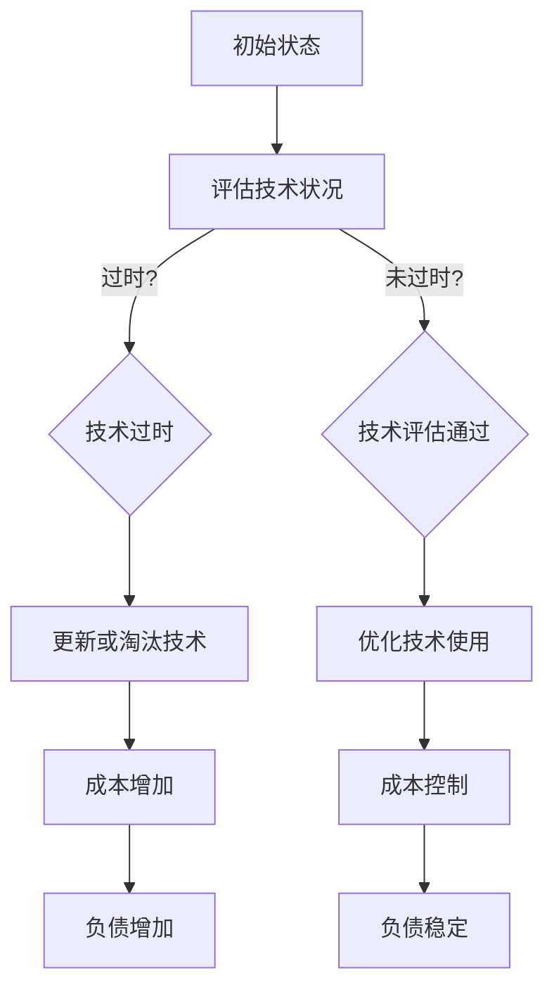
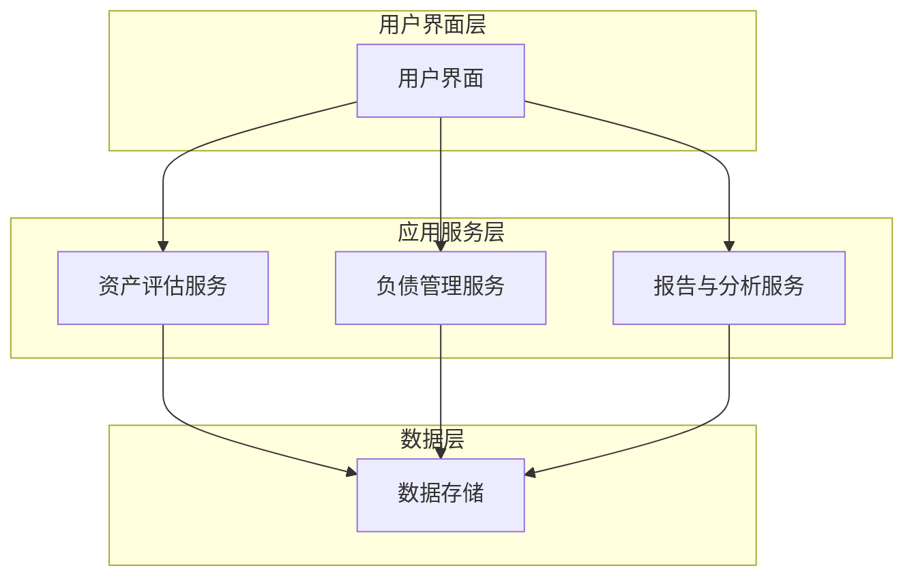
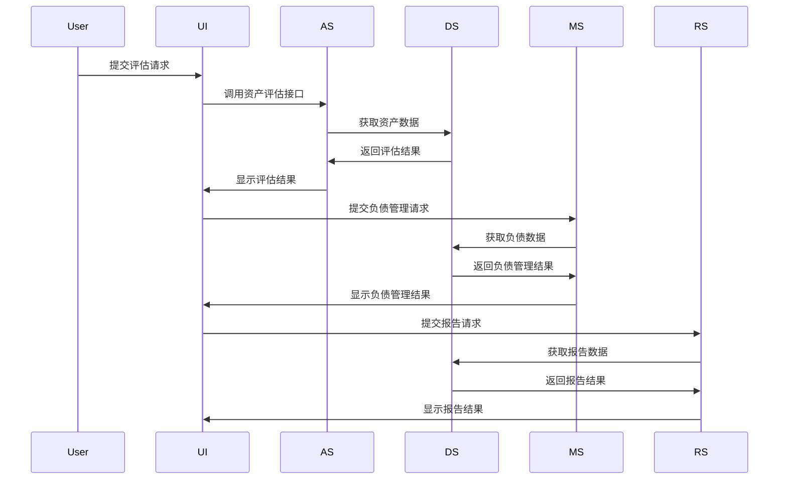

                 


## 引言

### 背景介绍

在当今快速发展的信息技术时代，数据和技术资产在企业运营中扮演着至关重要的角色。然而，随着时间的推移和环境的变化，这些曾经被视为宝贵资产的技术和数据可能会迅速变成沉重的负担，即负债。这种转变不仅仅是一个理论上的问题，它已经在各个行业引发了深远的影响。本文旨在探讨从资产到负债的转变过程，分析其中的原因、影响以及如何进行有效的管理和应对。

#### 问题背景

在过去的几十年中，技术进步带来了数据的大量积累和技术的飞速发展。企业通过投资于新技术和数据，希望能够提高效率、降低成本、增加市场竞争力。然而，随着市场的不断变化和技术的快速迭代，一些曾经被视为优势的技术和数据开始显得过时和冗余。例如，传统的客户关系管理系统（CRM）在数据管理和客户互动方面曾经是企业的宝贵资产，但随着社交媒体和移动技术的兴起，这些系统变得难以适应新的业务需求，从而变成了企业的负担。

#### 问题描述

从资产到负债的转变可以表现为以下几个方面：

1. **技术过时**：随着时间的推移，一些技术可能会变得过时，不再满足企业的需求。这可能导致企业需要投入大量资源进行维护和升级，但回报却越来越低。

2. **数据冗余**：随着数据收集的增加，企业可能会积累大量冗余的数据，这些数据不仅占用存储空间，而且在决策过程中可能产生误导。

3. **系统复杂性**：随着系统的不断扩展和集成，系统的复杂性增加，导致维护成本上升，而系统的稳定性下降。

4. **安全风险**：技术的不断升级和变化可能会带来新的安全风险，如果企业无法及时应对，这些风险可能会转化为严重的负债。

#### 问题解决

为了解决从资产到负债的转变问题，企业需要采取以下措施：

1. **技术评估**：定期评估现有技术的有效性，确定哪些技术可以继续为企业带来价值，哪些需要淘汰或升级。

2. **数据管理**：实施有效的数据管理策略，包括数据清洗、归档和去重，确保数据的准确性和可用性。

3. **系统简化**：通过简化系统架构和优化流程，减少系统的复杂性，降低维护成本。

4. **安全防护**：加强安全防护措施，确保技术资产的安全，防止因安全漏洞而导致的损失。

#### 边界与外延

本文的讨论主要集中在企业内部的技术和数据资产。然而，这个问题的外延非常广泛，它不仅涉及企业内部的技术和业务，还与外部环境、市场动态和法律法规等因素密切相关。因此，在分析从资产到负债的转变时，需要综合考虑这些因素。

### 核心概念与联系

为了更好地理解从资产到负债的转变，我们需要明确一些核心概念，并分析它们之间的关系。

#### 1. 资产与负债

资产是企业拥有并能够为其带来经济利益的资源。负债则是企业需要在未来偿还的债务或义务。在技术领域，资产可以包括专利、软件、数据库等，而负债则可能表现为技术债务、维护成本和安全风险等。

#### 2. 技术过时与迭代

技术过时是指现有技术无法满足新需求或新技术出现后，旧技术变得不再适用。技术迭代是指新技术的不断涌现和旧技术的更新换代。

#### 3. 数据冗余与数据清洗

数据冗余是指数据存储中存在大量重复或无效的数据。数据清洗是指通过删除重复数据、纠正错误数据、补充缺失数据等手段，提高数据的质量。

#### 4. 系统复杂性

系统复杂性是指系统在规模和功能上的扩展导致其结构变得复杂。这种复杂性可能增加维护成本和系统的脆弱性。

#### 概念属性特征对比表格

| 概念       | 定义                                                         | 特征对比                             |
|------------|--------------------------------------------------------------|------------------------------------|
| 资产       | 企业拥有并能够为其带来经济利益的资源                           | 价值创造、可计量、可控               |
| 负债       | 企业需要在未来偿还的债务或义务                                 | 价值消耗、可预见、可控               |
| 技术过时   | 现有技术无法满足新需求或新技术出现后，旧技术变得不再适用         | 功能限制、成本增加、效率降低         |
| 数据冗余   | 数据存储中存在大量重复或无效的数据                             | 占用存储空间、影响数据质量           |
| 系统复杂性 | 系统在规模和功能上的扩展导致其结构变得复杂                       | 维护成本高、稳定性差、风险增加       |

#### ER实体关系图架构

为了更直观地理解这些概念之间的关系，我们可以使用Mermaid绘制ER实体关系图。

```mermaid
erDiagram
    Asset ||--|{ Liability }|-->> System
    Asset ||--|{ Technology }|-->> Environment
    Liability ||--|{ Maintenance }|-->> Cost
    Liability ||--|{ Risk }|-->> Security
    Technology ||--|{ Iteration }|-->> Innovation
    Environment ||--|{ Market }|-->> Regulation
```

在这个ER图中，资产与负债、资产与技术、负债与维护成本、负债与安全风险以及技术与迭代和创新之间存在明确的关联。

### 算法原理讲解

在理解了核心概念后，我们需要探讨从资产到负债的算法原理。这里，我们将使用Mermaid绘制算法流程图，并用Python代码实现该算法。

#### 算法流程图



#### Python代码实现

```python
def assess_assets(assets):
    liabilities = []
    for asset in assets:
        if is_obsolete(asset):
            liabilities.append(update_or sunset_asset(asset))
        else:
            liabilities.append(optimize_asset_usage(asset))
    return liabilities

def is_obsolete(asset):
    # 这里用一个简单的判断逻辑，实际应用中可能更复杂
    return asset['age'] > 5

def update_or_sunset_asset(asset):
    if asset['type'] == 'software':
        return sunset_software(asset)
    elif asset['type'] == 'hardware':
        return update_hardware(asset)

def optimize_asset_usage(asset):
    # 优化逻辑根据具体情况进行
    return asset

def sunset_software(asset):
    # 模拟软件退役
    return {'name': asset['name'], 'status': 'sunset'}

def update_hardware(asset):
    # 模拟硬件升级
    return {'name': asset['name'], 'status': 'updated'}
```

#### 算法原理详细讲解

算法的核心思路是通过评估现有资产（技术）的状态，判断其是否过时，并采取相应的措施来管理这些资产，以减少负债。以下是算法原理的详细讲解：

1. **资产评估**：首先，我们需要对现有的技术资产进行评估，以确定它们是否仍然能够满足企业的需求。这个过程可以通过定义一些指标，如技术年龄、市场需求变化等来进行。

2. **判断技术过时**：在评估过程中，如果一个技术资产的年龄超过了一定的阈值（例如5年），我们可以认为它可能已经过时。

3. **更新或淘汰技术**：对于过时的技术，我们需要决定是否进行升级（更新）或淘汰（退役）。这个决策取决于技术类型和市场需求。例如，软件可以退役，而硬件可能需要升级。

4. **优化技术使用**：对于未过时的技术，我们需要采取措施来优化其使用，以减少维护成本和负债。这可能包括改进使用流程、提高使用效率等。

5. **计算负债**：最后，我们将评估结果汇总，计算每个资产的负债，以便企业能够了解其技术资产的整体财务状况。

#### 数学模型和公式

为了更准确地评估技术资产的价值和负债，我们可以使用数学模型。以下是一个简化的模型，用于计算资产的价值和负债。

$$
V(A) = \frac{P(A)}{C(A)}
$$

其中，$V(A)$ 是资产的价值，$P(A)$ 是资产的潜在收益，$C(A)$ 是资产的维护成本。

$$
L(A) = C(A) \times R(A)
$$

其中，$L(A)$ 是资产对应的负债，$C(A)$ 是资产的维护成本，$R(A)$ 是资产的风险系数。

#### 举例说明

假设我们有一个软件资产，其潜在收益为 $P(A) = 100,000$ 美元，维护成本为 $C(A) = 20,000$ 美元，风险系数 $R(A) = 1.2$。

1. **资产价值**：

$$
V(A) = \frac{100,000}{20,000} = 5
$$

2. **资产负债**：

$$
L(A) = 20,000 \times 1.2 = 24,000
$$

这个例子表明，该软件资产的价值为5，而其负债为24,000美元，这表明该资产可能已经成为企业的负担。

### 系统分析与架构设计方案

#### 问题场景介绍

在现代企业的IT运营中，技术资产的管理是一个复杂且不断演变的过程。随着业务需求的不断变化和技术环境的快速迭代，企业需要确保其技术资产能够持续为企业带来价值，而不是变成负担。为了解决这个问题，企业需要建立一套完整的技术资产管理与评估系统。

#### 项目介绍

本项目旨在构建一个技术资产管理与评估系统，该系统能够对企业的技术资产进行全面的评估，识别潜在的技术负债，并提供相应的管理策略。系统将包括以下几个关键模块：

1. **资产评估模块**：用于评估技术资产的状态，包括是否过时、维护成本、潜在收益等。
2. **负债管理模块**：用于计算技术资产的负债，并提供优化建议。
3. **报告与分析模块**：用于生成报告，分析技术资产的整体状况，帮助管理层做出决策。
4. **用户界面模块**：提供友好的用户界面，使企业用户能够轻松操作和查看系统数据。

#### 系统功能设计（领域模型）

为了实现上述功能，我们需要设计一个详细的领域模型，它将定义系统中的关键实体和它们之间的关系。以下是系统领域模型的一个简化的Mermaid类图：

```mermaid
classDiagram
    Asset <<entity>> 
    Liability <<entity>> 
    Assessment <<useCase>>
    Maintenance <<useCase>> 
    Optimization <<useCase>>
    Report <<useCase>>

    Asset "1" --|> Liability
    Assessment "1" --|> Asset
    Maintenance "1" --|> Asset
    Optimization "1" --|> Asset
    Report "1" --|> Assessment
```

在这个类图中，`Asset` 和 `Liability` 是核心实体，分别代表技术资产和负债。`Assessment`、`Maintenance`、`Optimization` 和 `Report` 是关键用例，用于实现系统的主要功能。

#### 系统架构设计

系统架构设计是确保系统稳定、高效运行的关键。以下是系统架构的Mermaid架构图：



在这个架构图中，用户界面层（UI）提供与用户的交互接口，应用服务层（AS、MS、RS）分别实现资产评估、负债管理和报告与分析的功能，数据层（DS）负责数据的存储和管理。

#### 系统接口设计和系统交互

系统接口设计和系统交互是确保各个模块之间能够无缝协作的关键。以下是系统接口设计和系统交互的Mermaid序列图：



在这个序列图中，用户通过用户界面提交评估、负债管理和报告请求，各个服务模块处理这些请求，并返回相应的结果。

### 项目实战

#### 环境安装

在开始项目实战之前，我们需要搭建一个合适的环境来开发和测试系统。以下是安装所需依赖的步骤：

1. **安装Python**：确保Python环境已安装。可以从Python官方网站下载Python安装程序并安装。

2. **安装依赖管理工具**：安装pip，Python的依赖管理工具。可以使用以下命令：

```bash
curl https://bootstrap.pypa.io/get-pip.py -o get-pip.py
python get-pip.py
```

3. **安装系统依赖**：安装系统依赖，如MySQL数据库。对于Ubuntu系统，可以使用以下命令：

```bash
sudo apt-get update
sudo apt-get install mysql-server mysql-client
```

4. **安装项目依赖**：在项目目录下，运行以下命令安装项目依赖：

```bash
pip install -r requirements.txt
```

#### 系统核心实现源代码

以下是系统核心实现的Python代码示例：

```python
# assets-assessment.py

from asset_management import AssetManager

def main():
    asset_manager = AssetManager()
    assets = asset_manager.load_assets_from_db()
    assessed_assets = asset_manager.assess_assets(assets)
    asset_manager.save_assessed_assets_to_db(assessed_assets)

if __name__ == "__main__":
    main()
```

```python
# asset_management.py

import json
from assessment import assess_asset
from database import AssetDB

class AssetManager:
    def __init__(self):
        self.db = AssetDB()

    def load_assets_from_db(self):
        return self.db.load_assets()

    def assess_assets(self, assets):
        assessed_assets = []
        for asset in assets:
            assessed_asset = assess_asset(asset)
            assessed_assets.append(assessed_asset)
        return assessed_assets

    def save_assessed_assets_to_db(self, assessed_assets):
        self.db.save_assets(assessed_assets)
```

```python
# assessment.py

import json
from liability import calculate_liability

def assess_asset(asset):
    # 实现资产评估逻辑
    potential_revenue = asset['potential_revenue']
    maintenance_cost = asset['maintenance_cost']
    risk_factor = asset['risk_factor']
    value = potential_revenue / maintenance_cost
    liability = calculate_liability(maintenance_cost, risk_factor)
    assessed_asset = {
        'name': asset['name'],
        'value': value,
        'liability': liability
    }
    return assessed_asset
```

```python
# liability.py

import json

def calculate_liability(maintenance_cost, risk_factor):
    # 计算负债逻辑
    liability = maintenance_cost * risk_factor
    return liability
```

```python
# database.py

import pymysql

class AssetDB:
    def __init__(self):
        self.connection = pymysql.connect(
            host='localhost',
            user='root',
            password='password',
            database='assets_db'
        )

    def load_assets(self):
        with self.connection.cursor() as cursor:
            sql = "SELECT * FROM assets;"
            cursor.execute(sql)
            result = cursor.fetchall()
            assets = json.loads(json.dumps(result))
            return assets

    def save_assets(self, assets):
        with self.connection.cursor() as cursor:
            for asset in assets:
                sql = "INSERT INTO assets (name, potential_revenue, maintenance_cost, risk_factor) VALUES (%s, %s, %s, %s);"
                cursor.execute(sql, (asset['name'], asset['potential_revenue'], asset['maintenance_cost'], asset['risk_factor']))
            self.connection.commit()
```

#### 代码应用解读与分析

以上代码是技术资产管理与评估系统的核心部分，主要包括三个文件：`assets-assessment.py`、`asset_management.py` 和 `database.py`。

1. **`assets-assessment.py`**：这是系统的主文件，它初始化资产管理器，加载资产数据，评估资产，并将评估结果保存到数据库。

2. **`asset_management.py`**：这个文件定义了`AssetManager`类，它负责加载资产、评估资产和保存评估结果。`assess_assets`方法是核心方法，它使用`assessment.py`中的`assess_asset`函数来评估资产。

3. **`assessment.py`**：这个文件包含了资产评估的逻辑。`assess_asset`方法计算每个资产的价值和负债。它使用了`liability.py`中的`calculate_liability`方法来计算负债。

4. **`database.py`**：这个文件定义了`AssetDB`类，它负责与MySQL数据库进行交互。`load_assets`方法用于从数据库中加载资产数据，`save_assets`方法用于将评估结果保存到数据库。

在实际应用中，这些代码文件将被集成到一个更大的项目中，并在开发和测试过程中不断优化和完善。

### 实际案例分析和详细讲解剖析

为了更好地理解从资产到负债的转变过程，我们可以通过以下实际案例进行分析和详细讲解。

#### 案例背景

假设我们是一家大型制造企业，在过去的几年中，我们投资了大量资金用于构建一个先进的生产管理系统。这个系统包含了最新的自动化技术、实时数据采集和高级数据分析功能。最初，这个系统被认为是企业的宝贵资产，因为它能够提高生产效率、降低成本、提高产品质量。

然而，随着时间的推移，市场环境和生产需求发生了显著变化。竞争对手采用了更先进的技术，我们的生产系统开始显得过时。同时，系统的维护成本也在不断增加，而它所带来的收益却逐渐减少。

#### 案例分析

1. **技术评估**：通过对生产系统的技术评估，我们发现其功能已经无法满足新的生产需求。许多模块无法与新兴的技术兼容，导致系统的整体性能下降。

2. **数据冗余**：由于系统持续运行多年，积累了大量冗余的数据。这些数据不仅占用存储空间，而且在决策过程中可能产生误导。

3. **系统复杂性**：系统的复杂性随着功能的不断增加而提高。这导致维护成本上升，而系统的稳定性下降。

4. **安全风险**：随着新技术的不断涌现，系统的安全风险也在增加。如果我们无法及时更新和加强安全防护措施，可能会面临严重的安全问题。

#### 详细讲解剖析

1. **技术过时**：我们的生产系统使用了过时的自动化技术，无法与最新的技术兼容。这导致我们在应对新兴市场需求时显得力不从心。

2. **数据冗余**：系统中的大量冗余数据不仅浪费了存储资源，而且在决策过程中可能会产生误导。例如，一些过时的生产数据可能会误导管理层做出错误的决策。

3. **系统复杂性**：随着新功能的不断增加，系统的复杂性也在上升。这使得维护成本上升，而系统的稳定性下降。例如，我们需要投入更多的时间和资源来确保系统在不同环境下的稳定运行。

4. **安全风险**：随着新技术的不断涌现，系统的安全风险也在增加。如果我们无法及时更新和加强安全防护措施，可能会面临严重的安全问题。例如，网络攻击和数据泄露可能会对企业的声誉和财务造成重大影响。

#### 解决方案

1. **技术评估与更新**：定期对生产系统进行技术评估，识别过时的技术，并采取相应的更新措施。这可以包括模块的替换、升级或引入新的技术。

2. **数据管理**：实施有效的数据管理策略，包括数据清洗、归档和去重。这可以减少冗余数据，提高数据的质量和可用性。

3. **系统简化**：通过简化系统架构和优化流程，减少系统的复杂性，降低维护成本。这可以包括取消冗余功能、合并重复模块等。

4. **安全防护**：加强安全防护措施，确保生产系统的安全。这可以包括安装最新的安全软件、定期更新安全补丁、实施严格的访问控制等。

### 项目小结

通过这个实际案例，我们可以看到从资产到负债的转变是如何发生的，以及如何通过有效的管理和策略来应对这一挑战。在这个案例中，我们的生产系统曾经是企业的宝贵资产，但随着时间和技术环境的变化，它变成了沉重的负担。通过技术评估、数据管理、系统简化和安全防护等措施，我们能够有效管理这一转变，确保系统继续为企业带来价值。

### 最佳实践 Tips

在管理技术资产的过程中，以下是一些最佳实践和注意事项：

1. **定期评估**：定期对技术资产进行评估，确保其仍然满足企业的需求。这可以防止技术过时和负债的增加。

2. **数据管理**：实施有效的数据管理策略，包括数据清洗、归档和去重，以确保数据的质量和可用性。

3. **系统优化**：通过优化系统架构和流程，减少系统的复杂性，降低维护成本。

4. **安全防护**：加强安全防护措施，确保技术资产的安全，防止因安全漏洞而导致的损失。

5. **团队协作**：建立跨部门的团队，确保技术资产管理的决策能够综合考虑业务需求、技术能力和资源限制。

### 小结

从资产到负债的转变是企业在技术进步和市场需求变化中不可避免的问题。通过有效的管理和策略，企业可以确保其技术资产继续为企业带来价值，而不是成为负担。本文探讨了这一转变的原因、影响以及如何进行有效的管理和应对。希望读者能够从中获得启示，为企业的技术资产管理提供参考。

### 注意事项

在实施技术资产管理策略时，需要考虑以下注意事项：

1. **成本与收益**：在决策过程中，需要综合考虑成本和收益，确保每项决策都有足够的商业价值。

2. **风险评估**：对技术资产进行评估时，需要考虑潜在的风险，并制定相应的风险应对措施。

3. **灵活性**：在技术资产管理中，保持灵活性至关重要。企业需要能够快速适应市场和技术环境的变化。

4. **持续改进**：技术资产管理是一个持续的过程，企业需要不断优化策略，以应对不断变化的环境。

### 拓展阅读

1. **《企业技术资产管理指南》**：这本书提供了全面的企业技术资产管理策略和实践，适合企业管理者和IT专业人士阅读。

2. **《数据管理最佳实践》**：这本书详细介绍了数据管理的最佳实践，包括数据清洗、归档和去重等。

3. **《系统架构设计：构建可扩展的分布式系统》**：这本书涵盖了系统架构设计的基本原理和最佳实践，对于希望优化系统架构的技术人员具有很高的参考价值。

### 作者信息

作者：AI天才研究院/AI Genius Institute & 禅与计算机程序设计艺术 /Zen And The Art of Computer Programming

本文旨在通过逻辑清晰、结构紧凑、简单易懂的专业技术语言，探讨从资产到负债的转变，为读者提供有深度、有思考、有见解的技术分析。希望读者能够从中获得启发，为企业的技术资产管理提供实用的指导。

