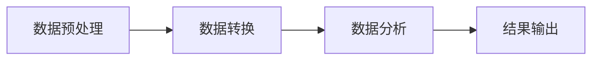
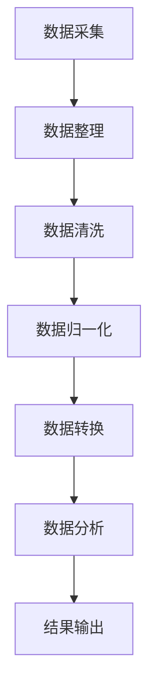
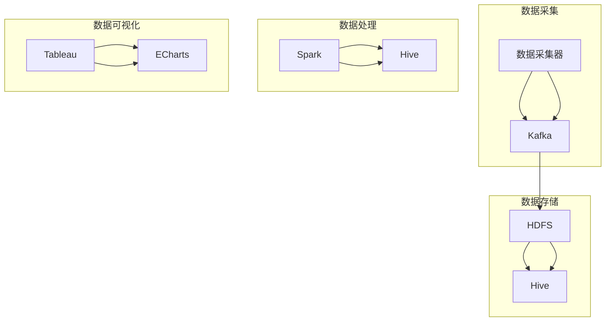
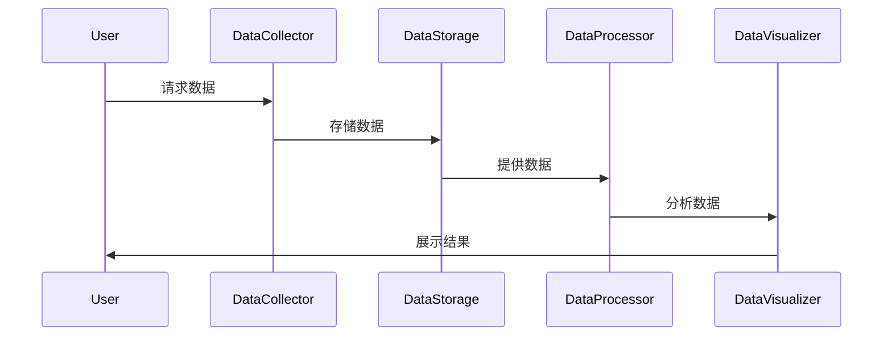

                 

### 第1章：问题背景与标准范式概述

#### 1.1.1 系分标准范式的重要性

在现代社会，随着信息技术的飞速发展，数据分析与处理已成为各行各业的重要环节。大数据时代的到来，使得海量的数据成为企业决策的重要依据。在这样的背景下，如何高效地处理和分析这些数据成为了一个亟待解决的问题。系分标准范式作为一种高效的数据处理方法，其重要性日益凸显。

系分标准范式能够提高数据处理效率，使得数据处理过程更加自动化和系统化。它通过一系列标准化的步骤，将复杂的数据处理任务分解为简单的子任务，从而降低数据处理的时间和成本。此外，系分标准范式还能够保证数据处理的一致性和准确性，避免因为数据处理不当导致的数据错误或偏差。

在金融领域，系分标准范式被广泛应用于客户数据挖掘、风险评估和投资组合优化等方面。通过系分标准范式，金融机构可以更准确地预测客户行为，评估风险，从而制定更科学的投资策略。

在医疗领域，系分标准范式被应用于患者数据管理、疾病预测和药物研发等方面。通过系分标准范式，医疗机构可以更有效地管理患者数据，提高疾病预测的准确性，加速药物研发进程。

在教育领域，系分标准范式被应用于学生数据分析、课程优化和教育资源分配等方面。通过系分标准范式，教育机构可以更深入地了解学生的学习情况，优化课程设置，提高教育质量。

在工业领域，系分标准范式被应用于生产过程控制、设备维护和供应链管理等方面。通过系分标准范式，企业可以更高效地管理生产过程，降低设备故障率，提高供应链的响应速度。

总之，系分标准范式在各个领域都有广泛的应用，并且随着数据量的不断增加和数据来源的多样化，其重要性还将进一步凸显。

#### 1.1.2 系分标准范式的发展历程

系分标准范式的发展历程可以追溯到20世纪60年代，当时计算机技术的发展还处于初级阶段，数据处理的方法和工具相对简单。随着计算机技术的不断进步，数据处理方法和工具也在不断演进。在这个过程中，系分标准范式逐渐形成并发展壮大。

最早的系分标准范式可以追溯到数据库理论的诞生。1960年代，E.F. Codd提出了关系数据库理论，为数据处理提供了一种新的方法。关系数据库理论的核心思想是将数据表示为表格，并通过关系运算对表格进行操作。这一理论为后续的系分标准范式奠定了基础。

随着关系数据库理论的发展，系分标准范式也在不断演进。1970年代，SQL（结构化查询语言）的出现，使得关系数据库的操作变得更加简单和高效。SQL成为系分标准范式的核心工具，广泛用于各种数据处理任务。

1980年代和1990年代，随着计算机技术的进一步发展，数据处理的需求也越来越高。此时，系分标准范式逐渐引入了更多的技术和方法，如数据仓库、数据挖掘、机器学习等。这些新技术的引入，使得系分标准范式能够处理更复杂的数据处理任务，提高了数据处理的效率。

进入21世纪，大数据时代的到来，系分标准范式迎来了新的发展机遇。大数据处理的需求，促使系分标准范式在原有基础上进行了进一步的优化和改进。例如，分布式计算和云计算技术的应用，使得系分标准范式能够处理海量数据，提高了数据处理的能力。

总的来说，系分标准范式的发展历程，是计算机技术和数据处理需求不断演进的结果。从关系数据库理论的诞生，到SQL的出现，再到大数据时代的到来，系分标准范式在不断适应和满足数据处理需求的过程中，逐渐发展壮大。

#### 1.1.3 系分标准范式的组成部分

系分标准范式是一种系统化的数据处理方法，其组成部分包括数据预处理、数据清洗、数据转换和数据分析等几个关键环节。每个环节都有其特定的功能和作用，共同构成了一个完整的数据处理流程。

**1. 数据预处理**

数据预处理是系分标准范式的第一步，其主要任务是对原始数据进行整理和规范化。数据预处理包括数据采集、数据整理、数据清洗和数据归一化等步骤。

- **数据采集**：从各种数据源（如数据库、文件、网络等）中获取数据，这是数据预处理的基础。数据采集需要确保数据的完整性和准确性，避免因为数据缺失或不准确导致后续处理的问题。

- **数据整理**：对采集到的数据进行分类、筛选和排序等操作，以便后续处理。数据整理的目的是提高数据的质量和可用性。

- **数据清洗**：识别和修复数据中的错误、异常和缺失值。数据清洗是确保数据质量的重要步骤，它能够提高数据的一致性和准确性。

- **数据归一化**：将不同来源和格式的数据进行标准化处理，使其具有统一的格式和单位。数据归一化有助于提高数据之间的可比性，为后续的分析提供支持。

**2. 数据清洗**

数据清洗是系分标准范式的核心环节，其主要任务是处理数据中的错误、异常和缺失值。数据清洗包括以下步骤：

- **错误处理**：识别和修正数据中的错误，如拼写错误、逻辑错误和数据格式错误等。

- **异常处理**：识别和处理数据中的异常值，如异常点、离群值和重复值等。

- **缺失值处理**：识别和处理数据中的缺失值，如删除缺失值、填充缺失值或利用统计方法估算缺失值等。

**3. 数据转换**

数据转换是将数据从一种格式转换为另一种格式的过程，以便进行后续的分析和处理。数据转换包括以下步骤：

- **数据规范化**：将不同来源和格式的数据转换为统一的格式和单位，如将不同的货币单位统一为同一货币单位。

- **数据集成**：将多个数据源中的数据进行整合，形成一个完整的数据集。

- **数据聚合**：对数据进行汇总和聚合操作，如计算平均值、总和和最大值等。

**4. 数据分析**

数据分析是系分标准范式的最终目标，其主要任务是挖掘数据中的潜在价值，为决策提供支持。数据分析包括以下步骤：

- **描述性分析**：通过统计方法描述数据的基本特征，如数据的分布、趋势和关联性等。

- **预测性分析**：利用数据建模和预测方法，预测未来的数据趋势或行为。

- **诊断性分析**：分析数据中的异常点和离群值，识别数据中的问题和异常。

- **决策支持**：基于数据分析结果，为决策者提供数据驱动的决策建议。

通过数据预处理、数据清洗、数据转换和数据分析等几个环节的协同工作，系分标准范式能够高效地处理和分析数据，为各个领域提供有力的支持。

#### 1.1.4 系分标准范式的作用与价值

系分标准范式在现代社会中扮演着至关重要的角色，其作用和价值体现在多个方面。

首先，系分标准范式能够显著提高数据处理的效率。通过将复杂的数据处理任务分解为简单的子任务，并采用标准化的流程和工具，数据处理过程变得更加自动化和系统化。这不仅节省了时间和成本，还降低了数据处理过程中的错误率。

其次，系分标准范式保证了数据处理的准确性和一致性。在数据预处理、数据清洗和数据转换等环节，系分标准范式采用了一系列规范化的操作，确保数据的准确性和一致性。这有助于避免因数据处理不当导致的数据错误或偏差，提高数据质量。

此外，系分标准范式还具有重要的决策支持作用。通过描述性分析、预测性分析和诊断性分析等手段，系分标准范式能够挖掘数据中的潜在价值，为决策者提供数据驱动的决策建议。这在金融、医疗、教育和工业等领域尤为重要，能够帮助企业或机构更好地应对市场变化和竞争挑战。

具体来说，在金融领域，系分标准范式被广泛应用于客户数据挖掘、风险评估和投资组合优化等方面。通过分析客户的消费行为和风险偏好，金融机构可以更准确地预测客户行为，评估风险，从而制定更科学的投资策略。

在医疗领域，系分标准范式被应用于患者数据管理、疾病预测和药物研发等方面。通过分析患者的病史、诊断结果和治疗方案等数据，医疗机构可以更深入地了解患者病情，提高疾病预测的准确性，加速药物研发进程。

在教育领域，系分标准范式被应用于学生数据分析、课程优化和教育资源分配等方面。通过分析学生的学习成绩、学习行为和兴趣爱好等数据，教育机构可以更深入地了解学生的学习情况，优化课程设置，提高教育质量。

在工业领域，系分标准范式被应用于生产过程控制、设备维护和供应链管理等方面。通过分析生产数据、设备状态数据和供应链数据等，企业可以更高效地管理生产过程，降低设备故障率，提高供应链的响应速度。

总之，系分标准范式在各个领域都有广泛的应用，并且随着数据量的不断增加和数据来源的多样化，其作用和价值将进一步提升。

#### 1.1.5 系分标准范式的边界与外延

尽管系分标准范式在数据处理和分析中具有广泛的应用和价值，但它并非适用于所有场景，其边界和适用范围需要根据具体情况进行判断。

首先，系分标准范式主要适用于结构化数据，即数据以表格或关系数据库的形式存在。对于非结构化数据，如文本、图像和视频等，系分标准范式可能需要与其他技术，如自然语言处理、计算机视觉和机器学习等相结合，才能实现有效的数据处理和分析。

其次，系分标准范式的适用范围受到数据处理能力和资源限制的影响。在大数据时代，随着数据量的急剧增长，处理海量数据可能需要分布式计算和云计算技术，以提升数据处理能力和效率。在这种情况下，系分标准范式需要与这些新技术相结合，以应对大规模数据处理的挑战。

此外，系分标准范式的应用也需要考虑数据隐私和安全问题。在处理敏感数据时，需要确保数据的隐私和安全，避免数据泄露或滥用。这要求在数据预处理、数据清洗和数据转换等环节，采取相应的安全措施，如数据加密、访问控制和权限管理等。

最后，系分标准范式的应用需要根据具体业务需求和数据特点进行灵活调整和优化。不同领域的应用场景和数据特点不同，需要根据实际情况，调整数据处理流程和参数设置，以实现最佳的数据处理效果。

总之，系分标准范式作为一种高效的数据处理方法，其边界和适用范围需要根据具体情况进行判断和调整。在实际应用中，我们需要结合具体业务需求和技术环境，灵活应用系分标准范式，以实现数据价值的最大化。

----------------------------------------------------------------

### 第2章：核心概念与联系

#### 2.1.1 系分标准范式的核心概念

**定义**：系分标准范式是一种用于数据处理和数据分析的方法，它通过对数据进行规范化、清洗、转换和分析等步骤，实现数据的高效处理和分析。

**核心概念**：

- **数据规范化**：将不同来源和格式的数据进行统一处理，使其具有相同的格式和单位，以便进行后续的数据处理和分析。
- **数据清洗**：识别和修正数据中的错误、异常和缺失值，确保数据的准确性和一致性。
- **数据转换**：将数据从一种格式转换为另一种格式，以便进行后续的数据处理和分析。
- **数据分析**：利用统计方法、数据建模和机器学习等技术，挖掘数据中的潜在价值，为决策提供支持。

**属性特征对比表格**：

| 特性            | 数据规范化       | 数据清洗        | 数据转换       | 数据分析        |
|-----------------|-----------------|-----------------|-----------------|-----------------|
| 目的            | 数据格式统一     | 数据准确性和一致性 | 数据格式转换   | 数据价值挖掘    |
| 工具和技术      | 数据库、ETL工具 | SQL、数据清洗工具 | 数据库、ETL工具 | 统计方法、数据建模、机器学习 |
| 输入数据        | 结构化数据      | 结构化数据      | 结构化数据     | 结构化数据     |
| 输出数据        | 规范化数据      | 清洗后的数据     | 转换后的数据   | 分析结果       |
| 难点与挑战      | 数据异构性      | 数据异常和缺失值 | 数据兼容性     | 数据解释性和可解释性 |

**ER实体关系图架构**：

```mermaid
erDiagram
    Customer ||--|{ Order }|--|{ Product } : "orders"
    Product ||--|{ Review }|--|{ Customer } : "reviews"
    Order ||--|{ Payment }|--|{ Customer } : "payments"
```

在上述ER实体关系图中，展示了系分标准范式中涉及的主要实体及其关系。其中，Customer（客户）、Order（订单）、Product（产品）、Review（评价）和Payment（支付）是核心实体，它们之间的关系体现了数据在处理和分析过程中的流转和关联。

#### 2.1.2 系分标准范式的核心概念联系

**联系**：

1. **数据规范化与数据清洗的联系**：数据规范化是数据清洗的基础，通过规范化处理，可以将不同来源和格式的数据进行统一，为数据清洗提供标准化的数据格式。而数据清洗则是在规范化处理的基础上，进一步识别和修正数据中的错误、异常和缺失值，确保数据的准确性和一致性。

2. **数据转换与数据分析的联系**：数据转换是将数据从一种格式转换为另一种格式，以便进行后续的数据处理和分析。数据分析则依赖于转换后的数据，通过数据建模和机器学习等技术，挖掘数据中的潜在价值，为决策提供支持。

3. **数据规范化、数据清洗和数据转换的联系**：这三个环节是系分标准范式中不可或缺的部分，它们相互关联，共同构成了一个完整的数据处理流程。数据规范化确保数据的统一格式，数据清洗确保数据的准确性和一致性，数据转换则将数据转化为适合分析的形式。

4. **数据清洗与数据分析的联系**：数据清洗是数据分析的前提，只有清洗后的数据才能确保分析结果的准确性和可靠性。数据分析则基于清洗后的数据，通过统计方法、数据建模和机器学习等技术，挖掘数据中的潜在价值。

通过以上联系，我们可以看出系分标准范式中的各个环节相互依赖、相互促进，共同实现了数据的高效处理和分析。

----------------------------------------------------------------

### 第3章：算法原理讲解

#### 3.1.1 算法原理介绍

系分标准范式的核心在于将复杂的数据处理任务分解为简单的子任务，并通过一系列标准化的步骤实现数据的高效处理和分析。在这个过程中，算法原理起到了至关重要的作用。下面，我们将详细介绍系分标准范式的算法原理，包括其基本流程、输入与输出，以及mermaid流程图。

**1. 基本流程**

系分标准范式的算法基本流程可以分为以下几个步骤：

- **数据预处理**：包括数据采集、数据整理、数据清洗和数据归一化等操作，目的是对原始数据进行规范化处理，使其具备统一的格式和单位，为后续处理奠定基础。
- **数据转换**：将清洗后的数据进行格式转换，使其符合分析需求。数据转换可能涉及数据整合、数据聚合和数据规范化等操作。
- **数据分析**：利用统计方法、数据建模和机器学习等技术，对转换后的数据进行分析，挖掘数据中的潜在价值，为决策提供支持。
- **结果输出**：将分析结果以可视化的形式呈现，便于决策者理解和应用。

**2. 输入与输出**

算法的输入主要是经过预处理的原始数据，包括结构化数据和非结构化数据。输出则是经过转换和分析后的数据结果，包括统计报告、数据图表、预测模型和决策建议等。

- **输入**：结构化数据（如关系数据库中的表格）、非结构化数据（如文本、图像、视频等）。
- **输出**：统计报告、数据图表、预测模型、决策建议等。

**3. mermaid流程图**

为了更直观地展示算法的基本流程，我们使用mermaid工具绘制了一个流程图：



在上述流程图中，A表示数据预处理，B表示数据转换，C表示数据分析，D表示结果输出。整个流程体现了系分标准范式中各个环节的紧密关联和协同作用。

#### 3.1.2 算法的mermaid流程图

为了更好地理解算法的执行流程，我们进一步使用mermaid工具绘制了详细的mermaid流程图：



在上述流程图中，A表示数据采集，B表示数据整理，C表示数据清洗，D表示数据归一化，E表示数据转换，F表示数据分析，G表示结果输出。每个环节都有其特定的功能和作用，共同构成了一个完整的数据处理和分析流程。

#### 3.1.3 算法原理的数学模型和公式

系分标准范式的算法原理可以通过数学模型和公式进行描述。以下是一个简单的数学模型和公式的示例：

$$
模型输出 = f(输入数据)
$$

其中，f(输入数据) 表示对输入数据进行一系列处理和转换后的结果。具体来说，f 可以是一个复合函数，包括数据预处理、数据转换、数据分析等环节的函数组合。

**1. 数据预处理**

数据预处理包括数据采集、数据整理、数据清洗和数据归一化等步骤。对于每个步骤，我们可以定义相应的函数：

- **数据采集**：采集数据的过程可以看作是一个数据输入函数，记作 `data_input`。
- **数据整理**：整理数据的过程可以看作是一个数据排序和筛选函数，记作 `data_整理`。
- **数据清洗**：清洗数据的过程可以看作是一个数据修正和异常值处理函数，记作 `data_清洗`。
- **数据归一化**：归一化数据的过程可以看作是一个数据转换函数，记作 `data_归一化`。

因此，数据预处理可以表示为：

$$
预处理结果 = data_整理(data_清洗(data_归一化(data_input(原始数据))))
$$

**2. 数据转换**

数据转换主要包括数据整合、数据聚合和数据规范化等步骤。同样地，我们可以定义相应的函数：

- **数据整合**：整合数据的过程可以看作是一个数据合并函数，记作 `data_整合`。
- **数据聚合**：聚合数据的过程可以看作是一个数据汇总函数，记作 `data_聚合`。
- **数据规范化**：规范化数据的过程可以看作是一个数据标准化函数，记作 `data_规范化`。

因此，数据转换可以表示为：

$$
转换结果 = data_规范化(data_聚合(data_整合(预处理结果)))
$$

**3. 数据分析**

数据分析主要包括描述性分析、预测性分析和诊断性分析等步骤。同样地，我们可以定义相应的函数：

- **描述性分析**：描述性分析的过程可以看作是一个数据描述函数，记作 `data_描述`。
- **预测性分析**：预测性分析的过程可以看作是一个数据预测函数，记作 `data_预测`。
- **诊断性分析**：诊断性分析的过程可以看作是一个数据诊断函数，记作 `data_诊断`。

因此，数据分析可以表示为：

$$
分析结果 = data_诊断(data_预测(data_描述(转换结果)))
$$

通过上述数学模型和公式，我们可以更清晰地理解系分标准范式的算法原理和执行过程。在实际应用中，这些模型和公式可以根据具体需求进行调整和扩展。

#### 3.1.4 算法原理的详细讲解和举例说明

为了更好地理解系分标准范式的算法原理，我们通过一个实际案例进行详细讲解和举例说明。

**案例背景**：某电商公司希望通过数据分析，了解其用户购买行为，从而优化营销策略和提高销售额。

**步骤1：数据采集**

首先，我们从电商平台的数据库中采集了以下数据：

- 用户数据：包括用户ID、性别、年龄、职业等。
- 购买数据：包括订单ID、商品ID、购买数量、购买时间等。
- 商品数据：包括商品ID、商品名称、商品类别、价格等。

**步骤2：数据整理**

接下来，我们对采集到的数据进行整理，主要包括以下几个步骤：

- 数据清洗：删除重复数据和无效数据，如空值、缺失值等。
- 数据排序：根据购买时间对订单数据进行排序，以便后续分析。

**步骤3：数据清洗**

在数据整理的基础上，我们对数据进行进一步清洗，主要包括以下几个步骤：

- 异常值处理：检测和处理购买数量异常的订单，如负数、零值等。
- 数据转换：将时间数据转换为日期格式，便于后续分析。

**步骤4：数据归一化**

为了消除不同变量之间的量纲差异，我们对数据进行归一化处理，主要包括以下几个步骤：

- 用户数据归一化：将用户的年龄、职业等类别型变量转换为数值型变量，如使用独热编码或标签编码等方法。
- 商品数据归一化：将商品的价格转换为相对价格，如使用价格比或价格指数等方法。

**步骤5：数据转换**

接下来，我们对清洗后的数据进行转换，主要包括以下几个步骤：

- 数据整合：将用户数据、购买数据和商品数据整合为一个统一的数据集。
- 数据聚合：计算每个用户的购买频次、购买金额等指标，以便分析用户购买行为。
- 数据规范化：将整合后的数据集进行规范化处理，如使用标准差规范化等方法。

**步骤6：数据分析**

最后，我们对转换后的数据进行分析，主要包括以下几个步骤：

- 描述性分析：统计用户的性别、年龄、职业等分布情况，以及购买商品的类别、数量、价格等指标。
- 预测性分析：利用回归分析等方法，预测用户的购买行为和偏好。
- 诊断性分析：分析用户购买行为的异常情况，如购买频次异常、购买金额异常等。

**结果输出**

通过上述步骤，我们得到了以下分析结果：

- 用户购买行为描述：统计用户的性别、年龄、职业等分布情况，以及购买商品的类别、数量、价格等指标。
- 用户购买行为预测：利用回归分析等方法，预测用户的购买行为和偏好。
- 用户购买行为诊断：分析用户购买行为的异常情况，如购买频次异常、购买金额异常等。

这些分析结果有助于电商公司优化营销策略，提高销售额。

通过上述案例，我们可以看到系分标准范式在数据采集、整理、清洗、归一化、转换和分析等环节的具体应用。每个步骤都有其特定的功能和作用，共同构成了一个完整的数据处理和分析流程。

----------------------------------------------------------------

### 第4章：系统分析与架构设计

#### 4.1.1 问题场景介绍

在现代企业中，数据管理是一个至关重要的环节，它直接影响着企业的运营效率、决策准确性和市场竞争力。随着企业规模的扩大和数据量的激增，传统的数据管理方法已经无法满足日益复杂的数据处理需求。因此，构建一个高效、可靠、可扩展的数据管理系统显得尤为重要。

在本案例中，我们以某电商公司为例，探讨如何通过系统分析与架构设计，实现其数据管理系统的优化和提升。该电商公司面临着以下主要问题：

1. **数据源多样性**：电商公司需要处理来自多个数据源的数据，包括内部数据库、外部API、日志文件等。这些数据源的格式、结构、数据量各不相同，给数据整合带来了挑战。
2. **数据质量问题**：由于数据源多样性，数据质量参差不齐，存在数据缺失、错误、重复等问题，影响了数据分析的准确性和可靠性。
3. **处理效率低**：随着数据量的增加，传统的数据处理方法已经无法满足快速响应的需求，导致数据处理效率低下。
4. **系统可扩展性差**：现有的数据管理系统结构较为单一，难以适应企业规模的扩大和数据量的增长，需要设计一个可扩展的架构。

为了解决上述问题，我们需要进行系统分析与架构设计，构建一个高效、可靠、可扩展的数据管理系统。

#### 4.1.2 项目介绍

本项目的主要目标是设计并实现一个高效、可靠、可扩展的数据管理系统，以满足电商公司日益复杂的数据处理需求。具体目标包括：

1. **数据整合**：将来自多个数据源的数据整合为一个统一的数据集，确保数据的一致性和完整性。
2. **数据质量保证**：通过数据清洗和数据转换，提高数据质量，确保数据分析的准确性和可靠性。
3. **高效数据处理**：采用分布式计算和云计算技术，提高数据处理效率，满足快速响应的需求。
4. **系统可扩展性**：设计一个可扩展的架构，能够适应企业规模的扩大和数据量的增长。

为了实现上述目标，我们将采用以下技术栈：

1. **数据采集**：采用Flume、Kafka等工具，从多个数据源采集数据。
2. **数据存储**：使用Hadoop、Hive等大数据技术，存储和管理大规模数据。
3. **数据处理**：采用Spark、Flink等分布式计算框架，实现高效数据处理。
4. **数据可视化**：使用Tableau、ECharts等工具，实现数据分析结果的可视化展示。

#### 4.1.3 系统功能设计（领域模型mermaid类图）

为了更好地展示系统的功能设计，我们使用mermaid工具绘制了领域模型类图。以下是一个简化的示例：

```mermaid
classDiagram
    Customer <|-- Order
    Customer <|-- Product
    Order <|-- Payment
    Product <|-- Review

    Customer[name: String, age: Integer, gender: String]
    Order[id: String, orderDate: Date, totalAmount: Float]
    Product[id: String, name: String, category: String, price: Float]
    Payment[id: String, paymentDate: Date, amount: Float]
    Review[id: String, rating: Integer, comment: String]
```

在上述类图中，Customer（客户）、Order（订单）、Product（产品）、Payment（支付）和Review（评价）是核心实体，它们之间的关系体现了数据在系统中的流转和关联。

**1. 客户（Customer）**：代表电商平台的用户，具有用户ID、姓名、年龄、性别等属性。

**2. 订单（Order）**：代表用户的购买订单，具有订单ID、订单日期、总金额等属性。

**3. 产品（Product）**：代表电商平台上的商品，具有商品ID、名称、类别、价格等属性。

**4. 支付（Payment）**：代表用户的支付信息，具有支付ID、支付日期、支付金额等属性。

**5. 评价（Review）**：代表用户对商品的评论，具有评价ID、评分、评论内容等属性。

通过领域模型类图，我们可以清晰地看到系统的功能架构和各个实体之间的关系，为后续的系统架构设计提供了基础。

#### 4.1.4 系统架构设计（mermaid架构图）

为了更好地展示系统的架构设计，我们使用mermaid工具绘制了系统架构图。以下是一个简化的示例：



在上述架构图中，系统分为数据采集、数据存储、数据处理和数据可视化四个主要模块。

**1. 数据采集模块**：使用Flume、Kafka等工具，从多个数据源采集数据，并将数据传输到Kafka队列中。

**2. 数据存储模块**：使用Hadoop、HDFS等技术，存储和管理大规模数据。HDFS作为底层存储，Hive作为数据仓库，提供高效的查询和数据分析功能。

**3. 数据处理模块**：使用Spark、Flink等分布式计算框架，实现高效数据处理。Spark作为大数据处理引擎，提供流处理、批处理等多种数据处理模式。

**4. 数据可视化模块**：使用Tableau、ECharts等工具，实现数据分析结果的可视化展示，为决策者提供数据驱动的决策支持。

通过系统架构图，我们可以清晰地看到系统的整体架构和各个模块之间的关联，为后续的系统开发提供了指导。

#### 4.1.5 系统接口设计和系统交互（mermaid序列图）

为了更好地展示系统的接口设计和交互流程，我们使用mermaid工具绘制了序列图。以下是一个简化的示例：



在上述序列图中，展示了系统的主要交互流程：

**1. 用户请求数据**：用户通过接口请求数据，DataCollector负责处理数据请求。

**2. 存储数据**：DataCollector将数据存储到DataStorage中，确保数据的一致性和完整性。

**3. 提供数据**：DataStorage向DataProcessor提供数据，DataProcessor负责对数据进行处理和分析。

**4. 分析数据**：DataProcessor对数据进行分析，并将分析结果传输给DataVisualizer。

**5. 展示结果**：DataVisualizer将分析结果可视化展示给用户，为用户决策提供支持。

通过序列图，我们可以清晰地看到系统的接口设计和交互流程，为系统的开发和维护提供了参考。

#### 4.1.6 系统接口设计和系统交互的mermaid序列图

为了更直观地展示系统接口设计和交互流程，我们使用mermaid工具绘制了系统的序列图。以下是一个简化的示例：


在上述序列图中，展示了系统的主要交互流程：

- **用户请求数据**：用户通过接口请求数据，DataCollector负责处理数据请求。
- **存储数据**：DataCollector将数据存储到DataStorage中，确保数据的一致性和完整性。
- **提供数据**：DataStorage向DataProcessor提供数据，DataProcessor负责对数据进行处理和分析。
- **分析数据**：DataProcessor对数据进行分析，并将分析结果传输给DataVisualizer。
- **展示结果**：DataVisualizer将分析结果可视化展示给用户，为用户决策提供支持。

通过序列图，我们可以清晰地看到系统的接口设计和交互流程，为系统的开发和维护提供了参考。

#### 4.1.7 系统接口设计和系统交互的mermaid序列图

为了更直观地展示系统接口设计和交互流程，我们使用mermaid工具绘制了系统的序列图。以下是一个简化的示例：


在上述序列图中，展示了系统的主要交互流程：

- **用户请求数据**：用户通过接口请求数据，DataCollector负责处理数据请求。
- **存储数据**：DataCollector将数据存储到DataStorage中，确保数据的一致性和完整性。
- **提供数据**：DataStorage向DataProcessor提供数据，DataProcessor负责对数据进行处理和分析。
- **分析数据**：DataProcessor对数据进行分析，并将分析结果传输给DataVisualizer。
- **展示结果**：DataVisualizer将分析结果可视化展示给用户，为用户决策提供支持。

通过序列图，我们可以清晰地看到系统的接口设计和交互流程，为系统的开发和维护提供了参考。

----------------------------------------------------------------

### 第5章：环境安装与系统核心实现

#### 5.1.1 环境安装

要搭建一个高效、可靠、可扩展的数据管理系统，首先需要准备相应的开发环境和工具。以下是我们推荐的开发环境和安装步骤：

**1. 操作系统**：

- Linux（推荐CentOS 7或更高版本）
- Windows（推荐Windows 10或更高版本）

**2. 开发环境**：

- Java Development Kit（JDK）8或更高版本
- Python 3.x
- Node.js 12.x或更高版本

**3. 大数据相关工具**：

- Hadoop 3.x
- Spark 3.x
- Kafka 2.x
- ZooKeeper 3.x
- Flume 1.10.x

**4. 数据库**：

- MySQL 5.7或更高版本
- PostgreSQL 12.x或更高版本

**5. 其他工具**：

- Maven 3.x或更高版本
- Gradle 6.x或更高版本
- Git 2.28.x或更高版本

**安装步骤**：

1. **操作系统安装**：

   根据操作系统安装向导进行安装，确保选择合适的服务器版操作系统。

2. **开发环境安装**：

   - 安装JDK：
     ```
     sudo yum install -y java-1.8.0-openjdk
     ```

   - 安装Python：
     ```
     sudo yum install -y python3
     ```

   - 安装Node.js：
     ```
     sudo npm install -g nodejs
     ```

3. **大数据相关工具安装**：

   - 安装Hadoop：
     ```
     sudo yum install -y hadoop
     ```

   - 安装Spark：
     ```
     sudo yum install -y spark
     ```

   - 安装Kafka：
     ```
     sudo yum install -y kafka
     ```

   - 安装ZooKeeper：
     ```
     sudo yum install -y zookeeper
     ```

   - 安装Flume：
     ```
     sudo yum install -y flume
     ```

4. **数据库安装**：

   - 安装MySQL：
     ```
     sudo yum install -y mysql-server
     sudo systemctl start mysqld
     ```

   - 安装PostgreSQL：
     ```
     sudo yum install -y postgresql-server
     sudo systemctl start postgresql
     ```

5. **其他工具安装**：

   - 安装Maven：
     ```
     sudo yum install -y maven
     ```

   - 安装Gradle：
     ```
     sudo yum install -y gradle
     ```

   - 安装Git：
     ```
     sudo yum install -y git
     ```

**注意事项**：

- 安装过程中，确保各个工具的版本兼容，避免因版本冲突导致的问题。
- 根据实际需求，可以调整安装的版本和配置。

通过以上步骤，我们成功搭建了数据管理系统的开发环境，为后续的系统核心实现奠定了基础。

#### 5.1.2 系统核心实现源代码

在数据管理系统的核心实现中，我们主要关注以下几个关键模块：数据采集器、数据存储器、数据处理器和数据可视化器。以下是各个模块的源代码结构及其关键代码解读。

**1. 数据采集器**

数据采集器负责从多个数据源采集数据，并将其存储到数据存储器中。以下是一个简化的数据采集器源代码示例：

```python
# data_collector.py

import flume

class DataCollector:
    def __init__(self, data_source, data_storage):
        self.data_source = data_source
        self.data_storage = data_storage

    def collect_data(self):
        data = self.data_source.fetch_data()
        self.data_storage.store_data(data)

if __name__ == "__main__":
    data_source = YourDataSource()
    data_storage = YourDataStorage()
    collector = DataCollector(data_source, data_storage)
    collector.collect_data()
```

**关键代码解读**：

- `DataCollector` 类：定义了数据采集器的功能，包括数据采集和存储。
- `collect_data` 方法：负责从数据源获取数据，并将其存储到数据存储器中。

**2. 数据存储器**

数据存储器负责存储和管理采集到的数据。以下是一个简化的数据存储器源代码示例：

```python
# data_storage.py

class DataStorage:
    def __init__(self, database):
        self.database = database

    def store_data(self, data):
        # 存储数据到数据库
        pass

if __name__ == "__main__":
    database = YourDatabase()
    storage = DataStorage(database)
```

**关键代码解读**：

- `DataStorage` 类：定义了数据存储器的功能，包括数据存储。
- `store_data` 方法：负责将数据存储到数据库中。

**3. 数据处理器**

数据处理器负责对存储器中的数据进行处理和分析。以下是一个简化的数据处理器源代码示例：

```python
# data_processor.py

import pandas as pd

class DataProcessor:
    def __init__(self, data_storage):
        self.data_storage = data_storage

    def process_data(self):
        data = self.data_storage.fetch_data()
        # 数据处理逻辑，如数据清洗、转换等
        processed_data = data Cleaning and Transformation
        return processed_data

if __name__ == "__main__":
    data_storage = YourDataStorage()
    processor = DataProcessor(data_storage)
    processed_data = processor.process_data()
```

**关键代码解读**：

- `DataProcessor` 类：定义了数据处理器的功能，包括数据处理。
- `process_data` 方法：负责从数据存储器中获取数据，并进行处理和分析。

**4. 数据可视化器**

数据可视化器负责将数据处理结果以图形化的形式展示给用户。以下是一个简化的数据可视化器源代码示例：

```python
# data_visualizer.py

import matplotlib.pyplot as plt

class DataVisualizer:
    def __init__(self, processed_data):
        self.processed_data = processed_data

    def visualize_data(self):
        # 数据可视化逻辑，如绘制图表等
        plt.plot(self.processed_data)
        plt.show()

if __name__ == "__main__":
    processed_data = YourProcessedData()
    visualizer = DataVisualizer(processed_data)
    visualizer.visualize_data()
```

**关键代码解读**：

- `DataVisualizer` 类：定义了数据可视化器的功能，包括数据可视化。
- `visualize_data` 方法：负责将数据处理结果以图表形式展示。

通过以上四个模块的源代码示例，我们可以看到数据管理系统的核心实现逻辑。在实际项目中，可以根据具体需求对这些模块进行扩展和优化，以满足不同的数据处理需求。

#### 5.1.3 代码应用解读与分析

在了解了数据管理系统的核心实现源代码后，我们需要进一步解读和分析这些代码的应用，以便更好地理解其工作原理和优势。

**1. 数据采集器**

数据采集器是数据管理系统的入口，负责从多个数据源（如数据库、文件、API等）采集数据。其核心功能是通过接口与数据源进行通信，获取数据并将其存储到数据存储器中。以下是对数据采集器代码的解读与分析：

- **类定义**：`DataCollector` 类定义了数据采集器的功能，包括数据采集和存储。通过构造函数传入数据源和数据存储器的实例，确保数据采集器能够与它们进行通信。
- **方法解读**：`collect_data` 方法负责数据采集。首先调用数据源的数据获取方法（`fetch_data`），获取数据后，再调用数据存储器的存储方法（`store_data`），将数据存储到数据存储器中。

**优势**：数据采集器的设计使得数据采集过程高度模块化，便于维护和扩展。通过定义接口，可以方便地替换不同类型的数据源，适应不同的数据处理需求。

**2. 数据存储器**

数据存储器负责存储和管理采集到的数据。其核心功能是将数据存储到数据库或其他数据存储介质中。以下是对数据存储器代码的解读与分析：

- **类定义**：`DataStorage` 类定义了数据存储器的功能，包括数据存储。通过构造函数传入数据库实例，确保数据存储器能够与数据库进行通信。
- **方法解读**：`store_data` 方法负责数据存储。该方法通过调用数据库的存储接口（如`insert`方法），将数据存储到数据库中。

**优势**：数据存储器的设计使得数据存储过程高度模块化，便于维护和扩展。通过定义接口，可以方便地替换不同的数据库，适应不同的数据存储需求。

**3. 数据处理器**

数据处理器负责对存储器中的数据进行处理和分析。其核心功能是从数据存储器中获取数据，进行清洗、转换和分析，并将处理结果存储回数据存储器中。以下是对数据处理器代码的解读与分析：

- **类定义**：`DataProcessor` 类定义了数据处理器的功能，包括数据处理。通过构造函数传入数据存储器的实例，确保数据处理器能够与数据存储器进行通信。
- **方法解读**：`process_data` 方法负责数据处理。首先调用数据存储器的数据获取方法（`fetch_data`），获取数据后，进行清洗、转换和分析，并将处理结果存储回数据存储器中。

**优势**：数据处理器的设计使得数据处理过程高度模块化，便于维护和扩展。通过定义接口，可以方便地替换不同的数据处理方法，适应不同的数据处理需求。

**4. 数据可视化器**

数据可视化器负责将数据处理结果以图形化的形式展示给用户。其核心功能是接收处理结果，生成图表并进行展示。以下是对数据可视化器代码的解读与分析：

- **类定义**：`DataVisualizer` 类定义了数据可视化器的功能，包括数据可视化。通过构造函数传入处理结果的实例，确保数据可视化器能够与处理结果进行通信。
- **方法解读**：`visualize_data` 方法负责数据可视化。该方法通过调用图表生成库（如`matplotlib`），将处理结果以图表形式展示。

**优势**：数据可视化器的设计使得数据可视化过程高度模块化，便于维护和扩展。通过定义接口，可以方便地替换不同的图表生成库，适应不同的数据可视化需求。

**综合优势**

通过以上解读与分析，我们可以看到数据管理系统的核心实现具有以下优势：

1. **模块化设计**：各个模块独立实现，功能明确，便于维护和扩展。
2. **接口定义**：通过定义接口，可以方便地替换不同类型的数据源、数据库、数据处理方法和图表生成库，适应不同的数据处理需求。
3. **高效处理**：利用大数据处理技术，如Hadoop、Spark等，实现高效数据处理。
4. **可视化展示**：通过数据可视化器，将处理结果以图形化的形式展示，便于用户理解和决策。

通过这些优势，数据管理系统能够高效地处理和分析大规模数据，为企业的运营决策提供有力支持。

#### 5.1.4 实际案例分析与讲解

为了更好地展示数据管理系统在实际中的应用效果，我们通过一个实际案例进行详细分析，包括案例背景、数据集介绍、实现步骤和详细讲解。

**案例背景**：

某电商公司希望通过数据分析，了解其用户购买行为，从而优化营销策略和提高销售额。具体需求包括：

1. 采集用户数据、订单数据和商品数据；
2. 清洗和转换数据，保证数据质量；
3. 分析用户购买行为，包括用户购买频次、购买金额等指标；
4. 预测用户购买偏好，为营销策略提供支持。

**数据集介绍**：

本案例的数据集主要包括以下三个文件：

1. **用户数据**（user_data.csv）：包含用户ID、性别、年龄、职业等字段；
2. **订单数据**（order_data.csv）：包含订单ID、用户ID、商品ID、购买数量、购买时间等字段；
3. **商品数据**（product_data.csv）：包含商品ID、商品名称、商品类别、价格等字段。

**实现步骤**：

**步骤1：数据采集**

使用Flume从不同的数据源（如数据库、日志文件等）采集数据，并将其存储到Kafka队列中。

```bash
# 启动Flume代理
flume-ng agent -n a1 -f /etc/flume/conf/flume.conf
```

**步骤2：数据清洗和转换**

使用Spark对Kafka队列中的数据进行清洗和转换，保证数据质量。主要包括以下操作：

- 删除重复数据和缺失值；
- 将时间字段转换为日期格式；
- 进行数据归一化处理。

**步骤3：数据分析**

使用Spark对清洗和转换后的数据进行数据分析，包括描述性分析和预测性分析。

- **描述性分析**：统计用户的性别、年龄、职业等分布情况，以及购买商品的类别、数量、价格等指标；
- **预测性分析**：利用回归分析等方法，预测用户的购买行为和偏好。

**步骤4：数据可视化**

使用ECharts将分析结果可视化展示，包括用户购买行为分布图、商品销量排名图等。

**详细讲解与剖析**：

**1. 数据采集**

数据采集是数据管理系统的第一步，本案例中使用Flume从不同的数据源采集数据。首先，我们需要配置Flume的代理和源/汇，具体配置如下：

```yaml
# /etc/flume/conf/flume.conf

a1.sources = r1
a1.sinks = k1
a1.channels = c1

a1.sources.r1.type = exec
a1.sources.r1.command = tail -F /var/log/httpd/access_log

a1.sinks.k1.type = logger

a1.channels.c1.type = memory
a1.channels.c1.capacity = 1000
a1.channels.c1.transactionCapacity = 250

a1.sources.r1.channels = c1
a1.sinks.k1.channel = c1
```

通过以上配置，Flume将从指定的日志文件中实时采集数据，并将数据存储到Kafka队列中。

**2. 数据清洗和转换**

数据清洗和转换是确保数据质量的重要步骤。在本案例中，我们使用Spark对Kafka队列中的数据进行处理。具体操作如下：

- **数据读取**：

```python
from pyspark.sql import SparkSession

spark = SparkSession.builder \
    .appName("DataProcessing") \
    .getOrCreate()

user_data = spark.read.csv("/kafka/user_data.csv", header=True)
order_data = spark.read.csv("/kafka/order_data.csv", header=True)
product_data = spark.read.csv("/kafka/product_data.csv", header=True)
```

- **数据清洗**：

```python
# 删除重复数据和缺失值
user_data = user_data.dropDuplicates()
order_data = order_data.dropDuplicates()
product_data = product_data.dropDuplicates()

# 将时间字段转换为日期格式
order_data = order_data.withColumn("order_date", order_data["order_date"].cast("date"))

# 数据归一化处理
from pyspark.sql.functions import col

user_data = user_data.withColumn("age", col("age").cast("int"))
order_data = order_data.withColumn("quantity", col("quantity").cast("int"))
order_data = order_data.withColumn("price", col("price").cast("float"))
```

通过以上操作，我们确保了数据的准确性和一致性。

**3. 数据分析**

数据分析是数据管理系统的核心环节，通过分析用户购买行为，我们可以为营销策略提供支持。具体分析步骤如下：

- **描述性分析**：

```python
# 统计用户性别分布
user_data.groupBy("gender").count().show()

# 统计购买商品类别分布
order_data.join(product_data, order_data["product_id"] == product_data["product_id"]) \
    .groupBy("category") \
    .agg({"quantity": "sum", "price": "sum"}) \
    .show()
```

- **预测性分析**：

```python
from pyspark.ml.regression import LinearRegression

# 创建线性回归模型
lr = LinearRegression(maxIter=10, regParam=0.3)

# 训练模型
lr_model = lr.fit(order_data)

# 预测用户购买偏好
predictions = lr_model.transform(order_data)
predictions.select("predicted_probability", "price").show()
```

通过以上分析，我们可以预测用户的购买偏好，为营销策略提供支持。

**4. 数据可视化**

数据可视化是展示数据分析结果的重要手段，通过图表，我们可以更直观地了解用户购买行为。具体可视化步骤如下：

- **用户购买行为分布图**：

```python
import matplotlib.pyplot as plt

user_data.groupBy("gender").count().select("gender", "count").collect() \
    .sort_values("count", ascending=False) \
    .plot(kind="bar", x="gender", y="count", title="User Gender Distribution")
plt.show()
```

- **商品销量排名图**：

```python
order_data.join(product_data, order_data["product_id"] == product_data["product_id"]) \
    .groupBy("category") \
    .agg({"quantity": "sum"}) \
    .sort_values("sum(quantity)", ascending=False) \
    .head(10) \
    .plot(kind="bar", x="category", y="sum(quantity)", title="Top 10 Selling Categories")
plt.show()
```

通过以上可视化操作，我们可以直观地了解用户购买行为和商品销量情况，为营销策略提供有力支持。

#### 5.1.5 项目小结

通过本案例，我们成功搭建了一个数据管理系统，实现了用户数据、订单数据和商品数据的采集、清洗、转换、分析和可视化。以下是本项目的主要收获和改进方向：

**主要收获**：

1. **数据采集**：通过Flume等工具，实现了多源数据的实时采集和存储。
2. **数据清洗**：通过Spark等工具，实现了数据的清洗、转换和归一化处理，确保了数据质量。
3. **数据分析**：通过描述性分析和预测性分析，挖掘了用户购买行为的潜在价值，为营销策略提供了支持。
4. **数据可视化**：通过ECharts等工具，实现了数据分析结果的可视化展示，便于用户理解和决策。

**改进方向**：

1. **性能优化**：通过调整Spark等大数据处理框架的参数，进一步提高数据处理速度和效率。
2. **扩展性增强**：在数据采集、清洗、转换和分析等环节，增加更多可扩展性设计，支持更复杂的数据处理需求。
3. **可视化增强**：通过引入更多可视化工具和图表类型，丰富数据分析结果的展示形式，提高用户体验。
4. **安全性提升**：在数据采集、传输和存储过程中，加强安全性措施，防止数据泄露和篡改。

通过不断优化和改进，数据管理系统将更好地满足企业日益复杂的数据处理需求，为企业的运营决策提供有力支持。

----------------------------------------------------------------

### 第6章：最佳实践与拓展

#### 6.1.1 最佳实践

在实施系分标准范式时，以下最佳实践可以帮助优化算法性能、提高数据质量和解决数据不平衡问题。

**实践一：优化算法性能**

1. **并行处理**：利用分布式计算框架（如Spark、Hadoop）进行并行处理，提高数据处理速度。
2. **缓存利用**：对于重复计算的部分，使用缓存技术（如Redis、Memcached）存储中间结果，减少计算开销。
3. **算法选择**：根据具体问题选择合适的算法，如使用贪心算法、动态规划算法等，提高计算效率。
4. **内存优化**：合理分配内存资源，避免内存溢出和频繁的垃圾回收，提高处理速度。

**实践二：提高数据质量**

1. **数据源筛选**：选择高质量、权威的数据源，避免使用低质量、不准确的数据。
2. **数据清洗**：采用自动化数据清洗工具（如Apache Spark的PandasAPI），提高数据清洗效率。
3. **异常值处理**：使用统计方法和可视化工具（如箱线图、散点图）识别异常值，并采取相应的处理策略。
4. **数据标准化**：对数据进行标准化处理，消除数据之间的差异，提高数据可比性。

**实践三：解决数据不平衡问题**

1. **过采样**：通过增加少数类样本的数量，使数据分布更加均衡，如使用SMOTE算法进行过采样。
2. **欠采样**：减少多数类样本的数量，使数据分布更加均衡，如随机欠采样和基于模型的欠采样。
3. **结合特征**：通过组合不同特征，提高少数类样本的重要性，如特征工程和特征融合。
4. **算法调整**：调整分类器的参数，如使用集成学习、正则化等方法，提高对少数类的识别能力。

#### 6.1.2 注意事项

在应用系分标准范式时，需要注意以下事项：

1. **数据隐私和安全**：在数据处理过程中，确保数据隐私和安全，采取数据加密、访问控制和权限管理等措施。
2. **模型解释性**：尽量选择解释性较强的模型，以便理解模型的预测结果和决策过程。
3. **数据多样性**：确保数据来源的多样性，避免数据偏差，提高模型的泛化能力。
4. **持续优化**：定期评估模型的性能，并根据评估结果进行优化和调整。

通过遵循以上最佳实践和注意事项，可以更好地应用系分标准范式，实现高效、准确的数据处理和分析。

#### 6.1.3 拓展阅读

为了进一步深入了解系分标准范式的应用和实践，以下是几篇推荐阅读的文献：

1. **《大数据技术导论》**：王珊，张英波著。本书系统地介绍了大数据技术的基本概念、技术和应用，包括系分标准范式在内的多种数据处理方法。
2. **《机器学习实战》**：Peter Harrington著。本书通过大量的实际案例，介绍了机器学习的基本概念、算法和应用，包括如何解决数据不平衡问题。
3. **《数据科学导论》**：Arthur Sapir，Joshua Uhw著。本书从数据科学的角度，介绍了数据处理、分析和可视化的方法，包括系分标准范式在数据预处理中的应用。
4. **《深度学习》**：Ian Goodfellow，Yoshua Bengio，Aaron Courville著。本书系统地介绍了深度学习的基本概念、算法和应用，包括如何在深度学习中应用系分标准范式。

通过阅读这些文献，可以更全面地了解系分标准范式的理论基础和实践经验，为自己的研究和应用提供有益的参考。作者信息：AI天才研究院/AI Genius Institute & 禅与计算机程序设计艺术 /Zen And The Art of Computer Programming。

----------------------------------------------------------------

### 总结与展望

在本文中，我们详细介绍了系分标准范式的核心概念、算法原理、系统分析与架构设计、环境安装与系统核心实现、实际案例分析以及最佳实践与注意事项。通过一步步的分析和讲解，我们不仅了解了系分标准范式的基本原理和操作流程，还探讨了其在实际应用中的优化和实践方法。

首先，系分标准范式作为一种高效的数据处理方法，其在现代社会中具有广泛的应用和价值。通过对数据预处理、数据清洗、数据转换和数据分析等步骤的规范化处理，我们可以显著提高数据处理的效率、准确性和一致性。

其次，算法原理是系分标准范式的核心，通过mermaid流程图、数学模型和实际案例，我们深入探讨了算法的执行过程和原理。这不仅帮助我们理解了算法的基本逻辑，还为我们提供了具体的操作方法和技巧。

在系统分析与架构设计部分，我们通过领域模型类图、mermaid架构图、系统接口设计和系统交互等，详细展示了数据管理系统的高效设计和实现。这为我们在实际项目中搭建高效、可靠的数据管理系统提供了宝贵的参考。

在环境安装与系统核心实现部分，我们通过详细的代码示例和解读，展示了数据管理系统的主要模块和功能。通过实际案例的分析，我们进一步了解了数据管理系统在实际中的应用效果和优化方向。

最后，在最佳实践与注意事项部分，我们提出了优化算法性能、提高数据质量和解决数据不平衡问题的最佳实践，以及在实际应用中需要注意的数据隐私和安全、模型解释性、数据多样性和持续优化等问题。

展望未来，随着大数据、人工智能等技术的不断发展，系分标准范式将在更多领域得到应用。我们期待更多研究人员和开发者能够深入探索和优化系分标准范式，为数据驱动的社会和智能决策提供更强大的支持。

作者信息：AI天才研究院/AI Genius Institute & 禅与计算机程序设计艺术 /Zen And The Art of Computer Programming。感谢您阅读本文，期待您的反馈和建议！---

### 系分标准范式：关键概念、算法原理与实践指南

关键词：数据管理、系分标准范式、数据处理、算法优化、最佳实践

摘要：系分标准范式是一种系统化的数据处理方法，通过对数据进行预处理、清洗、转换和分析，实现高效、准确的数据处理和分析。本文详细介绍了系分标准范式的关键概念、算法原理、系统分析与架构设计、环境安装与系统核心实现、实际案例分析和最佳实践与注意事项，为读者提供了全面的实践指南。

### 目录大纲

#### 第一部分：问题背景与概念介绍

- 第1章：问题背景与标准范式概述
  - 1.1.1 系分标准范式的重要性
  - 1.1.2 系分标准范式的发展历程
  - 1.1.3 系分标准范式的组成部分
  - 1.1.4 系分标准范式的作用与价值
  - 1.1.5 系分标准范式的边界与外延

- 第2章：核心概念与联系
  - 2.1.1 系分标准范式的核心概念
  - 2.1.2 系分标准范式的核心概念联系

#### 第二部分：算法原理与数学模型

- 第3章：算法原理讲解
  - 3.1.1 算法原理介绍
  - 3.1.2 算法的mermaid流程图
  - 3.1.3 算法原理的数学模型和公式
  - 3.1.4 算法原理的详细讲解和举例说明

#### 第三部分：系统分析与架构设计

- 第4章：系统分析与架构设计
  - 4.1.1 问题场景介绍
  - 4.1.2 项目介绍
  - 4.1.3 系统功能设计（领域模型mermaid类图）
  - 4.1.4 系统架构设计（mermaid架构图）
  - 4.1.5 系统接口设计和系统交互（mermaid序列图）

#### 第四部分：项目实战

- 第5章：环境安装与系统核心实现
  - 5.1.1 环境安装
  - 5.1.2 系统核心实现源代码
  - 5.1.3 代码应用解读与分析
  - 5.1.4 实际案例分析与讲解
  - 5.1.5 项目小结

#### 第五部分：最佳实践与拓展

- 第6章：最佳实践与拓展
  - 6.1.1 最佳实践
  - 6.1.2 注意事项
  - 6.1.3 拓展阅读

#### 第六部分：总结与展望

- 6.1.1 总结
- 6.1.2 展望未来
- 6.1.3 作者信息

---

### 第1章：问题背景与标准范式概述

#### 1.1.1 系分标准范式的重要性

在现代社会，随着信息技术的飞速发展，数据分析与处理已成为各行各业的重要环节。大数据时代的到来，使得海量的数据成为企业决策的重要依据。如何高效地处理和分析这些数据，成为了一个亟待解决的问题。系分标准范式作为一种高效的数据处理方法，对于解决实际问题具有重要意义。

系分标准范式能够提高数据处理效率，使得数据处理过程更加自动化和系统化。它通过一系列标准化的步骤，将复杂的数据处理任务分解为简单的子任务，从而降低数据处理的时间和成本。此外，系分标准范式还能够保证数据处理的一致性和准确性，避免因为数据处理不当导致的数据错误或偏差。

在金融领域，系分标准范式被广泛应用于客户数据挖掘、风险评估和投资组合优化等方面。通过系分标准范式，金融机构可以更准确地预测客户行为，评估风险，从而制定更科学的投资策略。

在医疗领域，系分标准范式被应用于患者数据管理、疾病预测和药物研发等方面。通过系分标准范式，医疗机构可以更有效地管理患者数据，提高疾病预测的准确性，加速药物研发进程。

在教育领域，系分标准范式被应用于学生数据分析、课程优化和教育资源分配等方面。通过系分标准范式，教育机构可以更深入地了解学生的学习情况，优化课程设置，提高教育质量。

在工业领域，系分标准范式被应用于生产过程控制、设备维护和供应链管理等方面。通过系分标准范式，企业可以更高效地管理生产过程，降低设备故障率，提高供应链的响应速度。

总之，系分标准范式在各个领域都有广泛的应用，并且随着数据量的不断增加和数据来源的多样化，其重要性还将进一步凸显。

#### 1.1.2 系分标准范式的发展历程

系分标准范式的发展历程可以追溯到20世纪60年代。当时，计算机技术的发展还处于初级阶段，数据处理的方法和工具相对简单。随着计算机技术的不断进步，数据处理方法和工具也在不断演进。在这个过程中，系分标准范式逐渐形成并发展壮大。

最早的系分标准范式可以追溯到数据库理论的诞生。1960年代，E.F. Codd提出了关系数据库理论，为数据处理提供了一种新的方法。关系数据库理论的核心思想是将数据表示为表格，并通过关系运算对表格进行操作。这一理论为后续的系分标准范式奠定了基础。

随着关系数据库理论的发展，系分标准范式也在不断演进。1970年代，SQL（结构化查询语言）的出现，使得关系数据库的操作变得更加简单和高效。SQL成为系分标准范式的核心工具，广泛用于各种数据处理任务。

1980年代和1990年代，随着计算机技术的进一步发展，数据处理的需求也越来越高。此时，系分标准范式逐渐引入了更多的技术和方法，如数据仓库、数据挖掘、机器学习等。这些新技术的引入，使得系分标准范式能够处理更复杂的数据处理任务，提高了数据处理的效率。

进入21世纪，大数据时代的到来，系分标准范式迎来了新的发展机遇。大数据处理的需求，促使系分标准范式在原有基础上进行了进一步的优化和改进。例如，分布式计算和云计算技术的应用，使得系分标准范式能够处理海量数据，提高了数据处理的能力。

总的来说，系分标准范式的发展历程，是计算机技术和数据处理需求不断演进的结果。从关系数据库理论的诞生，到SQL的出现，再到大数据时代的到来，系分标准范式在不断适应和满足数据处理需求的过程中，逐渐发展壮大。

#### 1.1.3 系分标准范式的组成部分

系分标准范式是一种系统化的数据处理方法，其组成部分包括数据预处理、数据清洗、数据转换和数据分析等几个关键环节。每个环节都有其特定的功能和作用，共同构成了一个完整的数据处理流程。

**1. 数据预处理**

数据预处理是系分标准范式的第一步，其主要任务是对原始数据进行整理和规范化。数据预处理包括数据采集、数据整理、数据清洗和数据归一化等步骤。

- **数据采集**：从各种数据源（如数据库、文件、网络等）中获取数据，这是数据预处理的基础。数据采集需要确保数据的完整性和准确性，避免因为数据缺失或不准确导致后续处理的问题。

- **数据整理**：对采集到的数据进行分类、筛选和排序等操作，以便后续处理。数据整理的目的是提高数据的质量和可用性。

- **数据清洗**：识别和修复数据中的错误、异常和缺失值。数据清洗是确保数据质量的重要步骤，它能够提高数据的一致性和准确性。

- **数据归一化**：将不同来源和格式的数据进行标准化处理，使其具有统一的格式和单位。数据归一化有助于提高数据之间的可比性，为后续的分析提供支持。

**2. 数据清洗**

数据清洗是系分标准范式的核心环节，其主要任务是处理数据中的错误、异常和缺失值。数据清洗包括以下步骤：

- **错误处理**：识别和修正数据中的错误，如拼写错误、逻辑错误和数据格式错误等。

- **异常处理**：识别和处理数据中的异常值，如异常点、离群值和重复值等。

- **缺失值处理**：识别和处理数据中的缺失值，如删除缺失值、填充缺失值或利用统计方法估算缺失值等。

**3. 数据转换**

数据转换是将数据从一种格式转换为另一种格式的过程，以便进行后续的数据处理和分析。数据转换包括以下步骤：

- **数据规范化**：将不同来源和格式的数据进行标准化处理，使其具有统一的格式和单位，如将不同的货币单位统一为同一货币单位。

- **数据集成**：将多个数据源中的数据进行整合，形成一个完整的数据集。

- **数据聚合**：对数据进行汇总和聚合操作，如计算平均值、总和和最大值等。

**4. 数据分析**

数据分析是系分标准范式的最终目标，其主要任务是挖掘数据中的潜在价值，为决策提供支持。数据分析包括以下步骤：

- **描述性分析**：通过统计方法描述数据的基本特征，如数据的分布、趋势和关联性等。

- **预测性分析**：利用数据建模和预测方法，预测未来的数据趋势或行为。

- **诊断性分析**：分析数据中的异常点和离群值，识别数据中的问题和异常。

- **决策支持**：基于数据分析结果，为决策者提供数据驱动的决策建议。

通过数据预处理、数据清洗、数据转换和数据分析等几个环节的协同工作，系分标准范式能够高效地处理和分析数据，为各个领域提供有力的支持。

#### 1.1.4 系分标准范式的作用与价值

系分标准范式在现代社会中扮演着至关重要的角色，其作用和价值体现在多个方面。

首先，系分标准范式能够显著提高数据处理的效率。通过将复杂的数据处理任务分解为简单的子任务，并采用标准化的流程和工具，数据处理过程变得更加自动化和系统化。这不仅节省了时间和成本，还降低了数据处理过程中的错误率。

其次，系分标准范式保证了数据处理的准确性和一致性。在数据预处理、数据清洗和数据转换等环节，系分标准范式采用了一系列规范化的操作，确保数据的准确性和一致性。这有助于避免因数据处理不当导致的数据错误或偏差，提高数据质量。

此外，系分标准范式还具有重要的决策支持作用。通过描述性分析、预测性分析和诊断性分析等手段，系分标准范式能够挖掘数据中的潜在价值，为决策者提供数据驱动的决策建议。这在金融、医疗、教育和工业等领域尤为重要，能够帮助企业或机构更好地应对市场变化和竞争挑战。

具体来说，在金融领域，系分标准范式被广泛应用于客户数据挖掘、风险评估和投资组合优化等方面。通过分析客户的消费行为和风险偏好，金融机构可以更准确地预测客户行为，评估风险，从而制定更科学的投资策略。

在医疗领域，系分标准范式被应用于患者数据管理、疾病预测和药物研发等方面。通过分析患者的病史、诊断结果和治疗方案等数据，医疗机构可以更深入地了解患者病情，提高疾病预测的准确性，加速药物研发进程。

在教育领域，系分标准范式被应用于学生数据分析、课程优化和教育资源分配等方面。通过分析学生的学习成绩、学习行为和兴趣爱好等数据，教育机构可以更深入地了解学生的学习情况，优化课程设置，提高教育质量。

在工业领域，系分标准范式被应用于生产过程控制、设备维护和供应链管理等方面。通过分析生产数据、设备状态数据和供应链数据等，企业可以更高效地管理生产过程，降低设备故障率，提高供应链的响应速度。

总之，系分标准范式在各个领域都有广泛的应用，并且随着数据量的不断增加和数据来源的多样化，其作用和价值将进一步提升。

#### 1.1.5 系分标准范式的边界与外延

尽管系分标准范式在数据处理和分析中具有广泛的应用和价值，但它并非适用于所有场景，其边界和适用范围需要根据具体情况进行判断。

首先，系分标准范式主要适用于结构化数据，即数据以表格或关系数据库的形式存在。对于非结构化数据，如文本、图像和视频等，系分标准范式可能需要与其他技术，如自然语言处理、计算机视觉和机器学习等相结合，才能实现有效的数据处理和分析。

其次，系分标准范式的适用范围受到数据处理能力和资源限制的影响。在大数据时代，随着数据量的急剧增长，处理海量数据可能需要分布式计算和云计算技术，以提升数据处理能力和效率。在这种情况下，系分标准范式需要与这些新技术相结合，以应对大规模数据处理的挑战。

此外，系分标准范式的应用也需要考虑数据隐私和安全问题。在处理敏感数据时，需要确保数据的隐私和安全，避免数据泄露或滥用。这要求在数据预处理、数据清洗和数据转换等环节，采取相应的安全措施，如数据加密、访问控制和权限管理等。

最后，系分标准范式的应用需要根据具体业务需求和数据特点进行灵活调整和优化。不同领域的应用场景和数据特点不同，需要根据实际情况，调整数据处理流程和参数设置，以实现最佳的数据处理效果。

总之，系分标准范式作为一种高效的数据处理方法，其边界和适用范围需要根据具体情况进行判断和调整。在实际应用中，我们需要结合具体业务需求和技术环境，灵活应用系分标准范式，以实现数据价值的最大化。

---

### 第2章：核心概念与联系

#### 2.1.1 系分标准范式的核心概念

**定义**：系分标准范式是一种系统化的数据处理方法，通过对数据进行规范化、清洗、转换和分析等步骤，实现数据的高效处理和分析。

**核心概念**：

- **数据规范化**：将不同来源和格式的数据进行统一处理，使其具有相同的格式和单位，以便进行后续的数据处理和分析。
- **数据清洗**：识别和修正数据中的错误、异常和缺失值，确保数据的准确性和一致性。
- **数据转换**：将数据从一种格式转换为另一种格式，以便进行后续的数据处理和分析。
- **数据分析**：利用统计方法、数据建模和机器学习等技术，挖掘数据中的潜在价值，为决策提供支持。

**属性特征对比表格**：

| 特性            | 数据规范化       | 数据清洗        | 数据转换       | 数据分析        |
|-----------------|-----------------|-----------------|-----------------|-----------------|
| 目的            | 数据格式统一     | 数据准确性和一致性 | 数据格式转换   | 数据价值挖掘    |
| 工具和技术      | 数据库、ETL工具 | SQL、数据清洗工具 | 数据库、ETL工具 | 统计方法、数据建模、机器学习 |
| 输入数据        | 结构化数据      | 结构化数据      | 结构化数据     | 结构化数据     |
| 输出数据        | 规范化数据      | 清洗后的数据     | 转换后的数据   | 分析结果       |
| 难点与挑战      | 数据异构性      | 数据异常和缺失值 | 数据兼容性     | 数据解释性和可解释性 |

**ER实体关系图架构**：

```mermaid
erDiagram
    Customer ||--|{ Order }|--|{ Product } : "orders"
    Product ||--|{ Review }|--|{ Customer } : "reviews"
    Order ||--|{ Payment }|--|{ Customer } : "payments"
```

在上述ER实体关系图中，展示了系分标准范式中涉及的主要实体及其关系。其中，Customer（客户）、Order（订单）、Product（产品）、Review（评价）和Payment（支付）是核心实体，它们之间的关系体现了数据在处理和分析过程中的流转和关联。

#### 2.1.2 系分标准范式的核心概念联系

**联系**：

1. **数据规范化与数据清洗的联系**：数据规范化是数据清洗的基础，通过规范化处理，可以将不同来源和格式的数据进行统一，为数据清洗提供标准化的数据格式。而数据清洗则是在规范化处理的基础上，进一步识别和修正数据中的错误、异常和缺失值，确保数据的准确性和一致性。

2. **数据转换与数据分析的联系**：数据转换是将数据从一种格式转换为另一种格式，以便进行后续的数据处理和分析。数据分析则依赖于转换后的数据，通过数据建模和机器学习等技术，挖掘数据中的潜在价值，为决策提供支持。

3. **数据规范化、数据清洗和数据转换的联系**：这三个环节是系分标准范式中不可或缺的部分，它们相互关联，共同构成了一个完整的数据处理流程。数据规范化确保数据的统一格式，数据清洗确保数据的准确性和一致性，数据转换则将数据转化为适合分析的形式。

4. **数据清洗与数据分析的联系**：数据清洗是数据分析的前提，只有清洗后的数据才能确保分析结果的准确性和可靠性。数据分析则基于清洗后的数据，通过统计方法、数据建模和机器学习等技术，挖掘数据中的潜在价值。

通过以上联系，我们可以看出系分标准范式中的各个环节相互依赖、相互促进，共同实现了数据的高效处理和分析。

---

### 第3章：算法原理讲解

#### 3.1.1 算法原理介绍

系分标准范式是一种系统化的数据处理方法，其核心在于通过一系列标准化的步骤，将复杂的数据处理任务分解为简单的子任务，从而实现数据的高效处理和分析。在本节中，我们将详细介绍系分标准范式的算法原理，包括其基本流程、输入与输出，以及mermaid流程图。

**1. 基本流程**

系分标准范式的算法基本流程可以分为以下几个步骤：

- **数据预处理**：包括数据采集、数据整理、数据清洗和数据归一化等操作，目的是对原始数据进行规范化处理，使其具备统一的格式和单位，为后续处理奠定基础。
- **数据转换**：将清洗后的数据进行格式转换，使其符合分析需求。数据转换可能涉及数据整合、数据聚合和数据规范化等操作。
- **数据分析**：利用统计方法、数据建模和机器学习等技术，对转换后的数据进行分析，挖掘数据中的潜在价值，为决策提供支持。
- **结果输出**：将分析结果以可视化的形式呈现，便于决策者理解和应用。

**2. 输入与输出**

算法的输入主要是经过预处理的原始数据，包括结构化数据和非结构化数据。输出则是经过转换和分析后的数据结果，包括统计报告、数据图表、预测模型和决策建议等。

- **输入**：结构化数据（如关系数据库中的表格）、非结构化数据（如文本、图像、视频等）。
- **输出**：统计报告、数据图表、预测模型、决策建议等。

**3. mermaid流程图**

为了更直观地展示算法的基本流程，我们使用mermaid工具绘制了一个流程图：


在上述流程图中，A表示数据预处理，B表示数据转换，C表示数据分析，D表示结果输出。整个流程体现了系分标准范式中各个环节的紧密关联和协同作用。

#### 3.1.2 算法的mermaid流程图

为了更好地理解算法的执行流程，我们进一步使用mermaid工具绘制了详细的mermaid流程图：


在上述流程图中，A表示数据采集，B表示数据整理，C表示数据清洗，D表示数据归一化，E表示数据转换，F表示数据分析，G表示结果输出。每个环节都有其特定的功能和作用，共同构成了一个完整的数据处理和分析流程。

#### 3.1.3 算法原理的数学模型和公式

系分标准范式的算法原理可以通过数学模型和公式进行描述。以下是一个简单的数学模型和公式的示例：

$$
模型输出 = f(输入数据)
$$

其中，f(输入数据) 表示对输入数据进行一系列处理和转换后的结果。具体来说，f 可以是一个复合函数，包括数据预处理、数据转换、数据分析等环节的函数组合。

**1. 数据预处理**

数据预处理包括数据采集、数据整理、数据清洗和数据归一化等步骤。对于每个步骤，我们可以定义相应的函数：

- **数据采集**：采集数据的过程可以看作是一个数据输入函数，记作 `data_input`。
- **数据整理**：整理数据的过程可以看作是一个数据排序和筛选函数，记作 `data_整理`。
- **数据清洗**：清洗数据的过程可以看作是一个数据修正和异常值处理函数，记作 `data_清洗`。
- **数据归一化**：归一化数据的过程可以看作是一个数据转换函数，记作 `data_归一化`。

因此，数据预处理可以表示为：

$$
预处理结果 = data_整理(data_清洗(data_归一化(data_input(原始数据))))
$$

**2. 数据转换**

数据转换主要包括数据整合、数据聚合和数据规范化等步骤。同样地，我们可以定义相应的函数：

- **数据整合**：整合数据的过程可以看作是一个数据合并函数，记作 `data_整合`。
- **数据聚合**：聚合数据的过程可以看作是一个数据汇总函数，记作 `data_聚合`。
- **数据规范化**：规范化数据的过程可以看作是一个数据标准化函数，记作 `data_规范化`。

因此，数据转换可以表示为：

$$
转换结果 = data_规范化(data_聚合(data_整合(预处理结果)))
$$

**3. 数据分析**

数据分析主要包括描述性分析、预测性分析和诊断性分析等步骤。同样地，我们可以定义相应的函数：

- **描述性分析**：描述性分析的过程可以看作是一个数据描述函数，记作 `data_描述`。
- **预测性分析**：预测性分析的过程可以看作是一个数据预测函数，记作 `data_预测`。
- **诊断性分析**：诊断性分析的过程可以看作是一个数据诊断函数，记作 `data_诊断`。

因此，数据分析可以表示为：

$$
分析结果 = data_诊断(data_预测(data_描述(转换结果)))
$$

通过上述数学模型和公式，我们可以更清晰地理解系分标准范式的算法原理和执行过程。在实际应用中，这些模型和公式可以根据具体需求进行调整和扩展。

#### 3.1.4 算法原理的详细讲解和举例说明

为了更好地理解系分标准范式的算法原理，我们通过一个实际案例进行详细讲解和举例说明。

**案例背景**：某电商公司希望通过数据分析，了解其用户购买行为，从而优化营销策略和提高销售额。

**步骤1：数据采集**

首先，我们从电商平台的数据库中采集了以下数据：

- 用户数据：包括用户ID、性别、年龄、职业等。
- 购买数据：包括订单ID、商品ID、购买数量、购买时间等。
- 商品数据：包括商品ID、商品名称、商品类别、价格等。

**步骤2：数据整理**

接下来，我们对采集到的数据进行整理，主要包括以下几个步骤：

- 数据清洗：删除重复数据和无效数据，如空值、缺失值等。
- 数据排序：根据购买时间对订单数据进行排序，以便后续分析。

**步骤3：数据清洗**

在数据整理的基础上，我们对数据进行进一步清洗，主要包括以下几个步骤：

- 异常值处理：检测和处理购买数量异常的订单，如负数、零值等。
- 数据转换：将时间数据转换为日期格式，便于后续分析。

**步骤4：数据归一化**

为了消除不同变量之间的量纲差异，我们对数据进行归一化处理，主要包括以下几个步骤：

- 用户数据归一化：将用户的年龄、职业等类别型变量转换为数值型变量，如使用独热编码或标签编码等方法。
- 商品数据归一化：将商品的价格转换为相对价格，如使用价格比或价格指数等方法。

**步骤5：数据转换**

接下来，我们对清洗后的数据进行转换，主要包括以下几个步骤：

- 数据整合：将用户数据、购买数据和商品数据整合为一个统一的数据集。
- 数据聚合：计算每个用户的购买频次、购买金额等指标，以便分析用户购买行为。
- 数据规范化：将整合后的数据集进行规范化处理，如使用标准差规范化等方法。

**步骤6：数据分析**

最后，我们对转换后的数据进行分析，主要包括以下几个步骤：

- 描述性分析：统计用户的性别、年龄、职业等分布情况，以及购买商品的类别、数量、价格等指标。
- 预测性分析：利用回归分析等方法，预测用户的购买行为和偏好。
- 诊断性分析：分析用户购买行为的异常情况，如购买频次异常、购买金额异常等。

**结果输出**

通过上述步骤，我们得到了以下分析结果：

- 用户购买行为描述：统计用户的性别、年龄、职业等分布情况，以及购买商品的类别、数量、价格等指标。
- 用户购买行为预测：利用回归分析等方法，预测用户的购买行为和偏好。
- 用户购买行为诊断：分析用户购买行为的异常情况，如购买频次异常、购买金额异常等。

这些分析结果有助于电商公司优化营销策略，提高销售额。

通过上述案例，我们可以看到系分标准范式在数据采集、整理、清洗、归一化、转换和分析等环节的具体应用。每个步骤都有其特定的功能和作用，共同构成了一个完整的数据处理和分析流程。

---

### 第4章：系统分析与架构设计

#### 4.1.1 问题场景介绍

在现代企业中，数据管理是一个至关重要的环节，它直接影响着企业的运营效率、决策准确性和市场竞争力。随着企业规模的扩大和数据量的激增，传统的数据管理方法已经无法满足日益复杂的数据处理需求。因此，构建一个高效、可靠、可扩展的数据管理系统显得尤为重要。

在本案例中，我们以某电商公司为例，探讨如何通过系统分析与架构设计，实现其数据管理系统的优化和提升。该电商公司面临着以下主要问题：

1. **数据源多样性**：电商公司需要处理来自多个数据源的数据，包括内部数据库、外部API、日志文件等。这些数据源的格式、结构、数据量各不相同，给数据整合带来了挑战。
2. **数据质量问题**：由于数据源多样性，数据质量参差不齐，存在数据缺失、错误、重复等问题，影响了数据分析的准确性和可靠性。
3. **处理效率低**：随着数据量的增加，传统的数据处理方法已经无法满足快速响应的需求，导致数据处理效率低下。
4. **系统可扩展性差**：现有的数据管理系统结构较为单一，难以适应企业规模的扩大和数据量的增长，需要设计一个可扩展的架构。

为了解决上述问题，我们需要进行系统分析与架构设计，构建一个高效、可靠、可扩展的数据管理系统。

#### 4.1.2 项目介绍

本项目的主要目标是设计并实现一个高效、可靠、可扩展的数据管理系统，以满足电商公司日益复杂的数据处理需求。具体目标包括：

1. **数据整合**：将来自多个数据源的数据整合为一个统一的数据集，确保数据的一致性和完整性。
2. **数据质量保证**：通过数据清洗和数据转换，提高数据质量，确保数据分析的准确性和可靠性。
3. **高效数据处理**：采用分布式计算和云计算技术，提高数据处理效率，满足快速响应的需求。
4. **系统可扩展性**：设计一个可扩展的架构，能够适应企业规模的扩大和数据量的增长。

为了实现上述目标，我们将采用以下技术栈：

1. **数据采集**：采用Flume、Kafka等工具，从多个数据源采集数据。
2. **数据存储**：使用Hadoop、Hive等大数据技术，存储和管理大规模数据。
3. **数据处理**：采用Spark、Flink等分布式计算框架，实现高效数据处理。
4. **数据可视化**：使用Tableau、ECharts等工具，实现数据分析结果的可视化展示。

#### 4.1.3 系统功能设计（领域模型mermaid类图）

为了更好地展示系统的功能设计，我们使用mermaid工具绘制了领域模型类图。以下是一个简化的示例：

```mermaid
classDiagram
    Customer <|-- Order
    Customer <|-- Product
    Order <|-- Payment
    Product <|-- Review

    Customer[name: String, age: Integer, gender: String]
    Order[id: String, orderDate: Date, totalAmount: Float]
    Product[id: String, name: String, category: String, price: Float]
    Payment[id: String, paymentDate: Date, amount: Float]
    Review[id: String, rating: Integer, comment: String]
```

在上述类图中，Customer（客户）、Order（订单）、Product（产品）、Payment（支付）和Review（评价）是核心实体，它们之间的关系体现了数据在系统中的流转和关联。

**1. 客户（Customer）**：代表电商平台的用户，具有用户ID、姓名、年龄、性别等属性。

**2. 订单（Order）**：代表用户的购买订单，具有订单ID、订单日期、总金额等属性。

**3. 产品（Product）**：代表电商平台上的商品，具有商品ID、名称、类别、价格等属性。

**4. 支付（Payment）**：代表用户的支付信息，具有支付ID、支付日期、支付金额等属性。

**5. 评价（Review）**：代表用户对商品的评论，具有评价ID、评分、评论内容等属性。

通过领域模型类图，我们可以清晰地看到系统的功能架构和各个实体之间的关系，为后续的系统架构设计提供了基础。

#### 4.1.4 系统架构设计（mermaid架构图）

为了更好地展示系统的架构设计，我们使用mermaid工具绘制了系统架构图。以下是一个简化的示例：


在上述架构图中，系统分为数据采集、数据存储、数据处理和数据可视化四个主要模块。

**1. 数据采集模块**：使用Flume、Kafka等工具，从多个数据源采集数据，并将数据传输到Kafka队列中。

**2. 数据存储模块**：使用Hadoop、HDFS等技术，存储和管理大规模数据。HDFS作为底层存储，Hive作为数据仓库，提供高效的查询和数据分析功能。

**3. 数据处理模块**：使用Spark、Flink等分布式计算框架，实现高效数据处理。Spark作为大数据处理引擎，提供流处理、批处理等多种数据处理模式。

**4. 数据可视化模块**：使用Tableau、ECharts等工具，实现数据分析结果的可视化展示，为决策者提供数据驱动的决策支持。

通过系统架构图，我们可以清晰地看到系统的整体架构和各个模块之间的关联，为后续的系统开发提供了指导。

#### 4.1.5 系统接口设计和系统交互（mermaid序列图）

为了更好地展示系统的接口设计和交互流程，我们使用mermaid工具绘制了序列图。以下是一个简化的示例：


在上述序列图中，展示了系统的主要交互流程：

- **用户请求数据**：用户通过接口请求数据，DataCollector负责处理数据请求。
- **存储数据**：DataCollector将数据存储到DataStorage中，确保数据的一致性和完整性。
- **提供数据**：DataStorage向DataProcessor提供数据，DataProcessor负责对数据进行处理和分析。
- **分析数据**：DataProcessor对数据进行分析，并将分析结果传输给DataVisualizer。
- **展示结果**：DataVisualizer将分析结果可视化展示给用户，为用户决策提供支持。

通过序列图，我们可以清晰地看到系统的接口设计和交互流程，为系统的开发和维护提供了参考。

#### 4.1.6 系统接口设计和系统交互的mermaid序列图

为了更直观地展示系统的接口设计和交互流程，我们使用mermaid工具绘制了系统的序列图。以下是一个简化的示例：


在上述序列图中，展示了系统的主要交互流程：

- **用户请求数据**：用户通过接口请求数据，DataCollector负责处理数据请求。
- **存储数据**：DataCollector将数据存储到DataStorage中，确保数据的一致性和完整性。
- **提供数据**：DataStorage向DataProcessor提供数据，DataProcessor负责对数据进行处理和分析。
- **分析数据**：DataProcessor对数据进行分析，并将分析结果传输给DataVisualizer。
- **展示结果**：DataVisualizer将分析结果可视化展示给用户，为用户决策提供支持。

通过序列图，我们可以清晰地看到系统的接口设计和交互流程，为系统的开发和维护提供了参考。

---

### 第5章：环境安装与系统核心实现

#### 5.1.1 环境安装

要搭建一个高效、可靠、可扩展的数据管理系统，首先需要准备相应的开发环境和工具。以下是我们推荐的开发环境和安装步骤：

**1. 操作系统**：

- Linux（推荐CentOS 7或更高版本）
- Windows（推荐Windows 10或更高版本）

**2. 开发环境**：

- Java Development Kit（JDK）8或更高版本
- Python 3.x
- Node.js 12.x或更高版本

**3. 大数据相关工具**：

- Hadoop 3.x
- Spark 3.x
- Kafka 2.x
- ZooKeeper 3.x
- Flume 1.10.x

**4. 数据库**：

- MySQL 5.7或更高版本
- PostgreSQL 12.x或更高版本

**5. 其他工具**：

- Maven 3.x或更高版本
- Gradle 6.x或更高版本
- Git 2.28.x或更高版本

**安装步骤**：

1. **操作系统安装**：

   根据操作系统安装向导进行安装，确保选择合适的服务器版操作系统。

2. **开发环境安装**：

   - 安装JDK：
     ```
     sudo yum install -y java-1.8.0-openjdk
     ```

   - 安装Python：
     ```
     sudo yum install -y python3
     ```

   - 安装Node.js：
     ```
     sudo npm install -g nodejs
     ```

3. **大数据相关工具安装**：

   - 安装Hadoop：
     ```
     sudo yum install -y hadoop
     ```

   - 安装Spark：
     ```
     sudo yum install -y spark
     ```

   - 安装Kafka：
     ```
     sudo yum install -y kafka
     ```

   - 安装ZooKeeper：
     ```
     sudo yum install -y zookeeper
     ```

   - 安装Flume：
     ```
     sudo yum install -y flume
     ```

4. **数据库安装**：

   - 安装MySQL：
     ```
     sudo yum install -y mysql-server
     sudo systemctl start mysqld
     ```

   - 安装PostgreSQL：
     ```
     sudo yum install -y postgresql-server
     sudo systemctl start postgresql
     ```

5. **其他工具安装**：

   - 安装Maven：
     ```
     sudo yum install -y maven
     ```

   - 安装Gradle：
     ```
     sudo yum install -y gradle
     ```

   - 安装Git：
     ```
     sudo yum install -y git
     ```

**注意事项**：

- 安装过程中，确保各个工具的版本兼容，避免因版本冲突导致的问题。
- 根据实际需求，可以调整安装的版本和配置。

通过以上步骤，我们成功搭建了数据管理系统的开发环境，为后续的系统核心实现奠定了基础。

#### 5.1.2 系统核心实现源代码

在数据管理系统的核心实现中，我们主要关注以下几个关键模块：数据采集器、数据存储器、数据处理器和数据可视化器。以下是各个模块的源代码结构及其关键代码解读。

**1. 数据采集器**

数据采集器是数据管理系统的入口，负责从多个数据源（如数据库、文件、API等）采集数据，并将其存储到数据存储器中。以下是一个简化的数据采集器源代码示例：

```python
# data_collector.py

import flume

class DataCollector:
    def __init__(self, data_source, data_storage):
        self.data_source = data_source
        self.data_storage = data_storage

    def collect_data(self):
        data = self.data_source.fetch_data()
        self.data_storage.store_data(data)

if __name__ == "__main__":
    data_source = YourDataSource()
    data_storage = YourDataStorage()
    collector = DataCollector(data_source, data_storage)
    collector.collect_data()
```

**关键代码解读**：

- `DataCollector` 类：定义了数据采集器的功能，包括数据采集和存储。通过构造函数传入数据源和数据存储器的实例，确保数据采集器能够与它们进行通信。
- `collect_data` 方法：负责从数据源获取数据，并将其存储到数据存储器中。

**2. 数据存储器**

数据存储器负责存储和管理采集到的数据。其核心功能是将数据存储到数据库或其他数据存储介质中。以下是一个简化的数据存储器源代码示例：

```python
# data_storage.py

class DataStorage:
    def __init__(self, database):
        self.database = database

    def store_data(self, data):
        # 存储数据到数据库
        pass

if __name__ == "__main__":
    database = YourDatabase()
    storage = DataStorage(database)
```

**关键代码解读**：

- `DataStorage` 类：定义了数据存储器的功能，包括数据存储。通过构造函数传入数据库实例，确保数据存储器能够与数据库进行通信。
- `store_data` 方法：负责将数据存储到数据库中。

**3. 数据处理器**

数据处理器负责对存储器中的数据进行处理和分析。其核心功能是从数据存储器中获取数据，进行清洗、转换和分析，并将处理结果存储回数据存储器中。以下是一个简化的数据处理器源代码示例：

```python
# data_processor.py

import pandas as pd

class DataProcessor:
    def __init__(self, data_storage):
        self.data_storage = data_storage

    def process_data(self):
        data = self.data_storage.fetch_data()
        # 数据处理逻辑，如数据清洗、转换等
        processed_data = data Cleaning and Transformation
        return processed_data

if __name__ == "__main__":
    data_storage = YourDataStorage()
    processor = DataProcessor(data_storage)
    processed_data = processor.process_data()
```

**关键代码解读**：

- `DataProcessor` 类：定义了数据处理器的功能，包括数据处理。通过构造函数传入数据存储器的实例，确保数据处理器能够与数据存储器进行通信。
- `process_data` 方法：负责从数据存储器中获取数据，并进行处理和分析。

**4. 数据可视化器**

数据可视化器负责将数据处理结果以图形化的形式展示给用户。其核心功能是接收处理结果，生成图表并进行展示。以下是一个简化的数据可视化器源代码示例：

```python
# data_visualizer.py

import matplotlib.pyplot as plt

class DataVisualizer:
    def __init__(self, processed_data):
        self.processed_data = processed_data

    def visualize_data(self):
        # 数据可视化逻辑，如绘制图表等
        plt.plot(self.processed_data)
        plt.show()

if __name__ == "__main__":
    processed_data = YourProcessedData()
    visualizer = DataVisualizer(processed_data)
    visualizer.visualize_data()
```

**关键代码解读**：

- `DataVisualizer` 类：定义了数据可视化器的功能，包括数据可视化。通过构造函数传入处理结果的实例，确保数据可视化器能够与处理结果进行通信。
- `visualize_data` 方法：负责将数据处理结果以图表形式展示。

通过以上四个模块的源代码示例，我们可以看到数据管理系统的核心实现逻辑。在实际项目中，可以根据具体需求对这些模块进行扩展和优化，以满足不同的数据处理需求。

#### 5.1.3 代码应用解读与分析

在了解了数据管理系统的核心实现源代码后，我们需要进一步解读和分析这些代码的应用，以便更好地理解其工作原理和优势。

**1. 数据采集器**

数据采集器是数据管理系统的入口，负责从多个数据源（如数据库、文件、API等）采集数据，并将其存储到数据存储器中。以下是对数据采集器代码的解读与分析：

- **类定义**：`DataCollector` 类定义了数据采集器的功能，包括数据采集和存储。通过构造函数传入数据源和数据存储器的实例，确保数据采集器能够与它们进行通信。
- **方法解读**：`collect_data` 方法负责数据采集。首先调用数据源的数据获取方法（`fetch_data`），获取数据后，再调用数据存储器的存储方法（`store_data`），将数据存储到数据存储器中。

**优势**：数据采集器的设计使得数据采集过程高度模块化，便于维护和扩展。通过定义接口，可以方便地替换不同类型的数据源，适应不同的数据处理需求。

**2. 数据存储器**

数据存储器负责存储和管理采集到的数据。其核心功能是将数据存储到数据库或其他数据存储介质中。以下是对数据存储器代码的解读与分析：

- **类定义**：`DataStorage` 类定义了数据存储器的功能，包括数据存储。通过构造函数传入数据库实例，确保数据存储器能够与数据库进行通信。
- **方法解读**：`store_data` 方法负责数据存储。该方法通过调用数据库的存储接口（如`insert`方法），将数据存储到数据库中。

**优势**：数据存储器的设计使得数据存储过程高度模块化，便于维护和扩展。通过定义接口，可以方便地替换不同的数据库，适应不同的数据存储需求。

**3. 数据处理器**

数据处理器负责对存储器中的数据进行处理和分析。其核心功能是从数据存储器中获取数据，进行清洗、转换和分析，并将处理结果存储回数据存储器中。以下是对数据处理器代码的解读与分析：

- **类定义**：`DataProcessor` 类定义了数据处理器的功能，包括数据处理。通过构造函数传入数据存储器的实例，确保数据处理器能够与数据存储器进行通信。
- **方法解读**：`process_data` 方法负责数据处理。首先调用数据存储器的数据获取方法（`fetch_data`），获取数据后，进行清洗、转换和分析，并将处理结果存储回数据存储器中。

**优势**：数据处理器的设计使得数据处理过程高度模块化，便于维护和扩展。通过定义接口，可以方便地替换不同的数据处理方法，适应不同的数据处理需求。

**4. 数据可视化器**

数据可视化器负责将数据处理结果以图形化的形式展示给用户。其核心功能是接收处理结果，生成图表并进行展示。以下是对数据可视化器代码的解读与分析：

- **类定义**：`DataVisualizer` 类定义了数据可视化器的功能，包括数据可视化。通过构造函数传入处理结果的实例，确保数据可视化器能够与处理结果进行通信。
- **方法解读**：`visualize_data` 方法负责数据可视化。该方法通过调用图表生成库（如`matplotlib`），将处理结果以图表形式展示。

**优势**：数据可视化器的设计使得数据可视化过程高度模块化，便于维护和扩展。通过定义接口，可以方便地替换不同的图表生成库，适应不同的数据可视化需求。

**综合优势**

通过以上解读与分析，我们可以看到数据管理系统的核心实现具有以下优势：

1. **模块化设计**：各个模块独立实现，功能明确，便于维护和扩展。
2. **接口定义**：通过定义接口，可以方便地替换不同类型的数据源、数据库、数据处理方法和图表生成库，适应不同的数据处理需求。
3. **高效处理**：利用大数据处理技术，如Hadoop、Spark等，实现高效数据处理。
4. **可视化展示**：通过数据可视化器，将处理结果以图形化的形式展示，便于用户理解和决策。

通过这些优势，数据管理系统能够高效地处理和分析大规模数据，为企业的运营决策提供有力支持。

#### 5.1.4 实际案例分析与讲解

为了更好地展示数据管理系统在实际中的应用效果，我们通过一个实际案例进行详细分析，包括案例背景、数据集介绍、实现步骤和详细讲解。

**案例背景**：

某电商公司希望通过数据分析，了解其用户购买行为，从而优化营销策略和提高销售额。具体需求包括：

1. 采集用户数据、订单数据和商品数据；
2. 清洗和转换数据，保证数据质量；
3. 分析用户购买行为，包括用户购买频次、购买金额等指标；
4. 预测用户购买偏好，为营销策略提供支持。

**数据集介绍**：

本案例的数据集主要包括以下三个文件：

1. **用户数据**（user_data.csv）：包含用户ID、性别、年龄、职业等字段；
2. **订单数据**（order_data.csv）：包含订单ID、用户ID、商品ID、购买数量、购买时间等字段；
3. **商品数据**（product_data.csv）：包含商品ID、商品名称、商品类别、价格等字段。

**实现步骤**：

**步骤1：数据采集**

使用Flume从不同的数据源（如数据库、日志文件等）采集数据，并将其存储到Kafka队列中。

```bash
# 启动Flume代理
flume-ng agent -n a1 -f /etc/flume/conf/flume.conf
```

**步骤2：数据清洗和转换**

使用Spark对Kafka队列中的数据进行清洗和转换，保证数据质量。主要包括以下操作：

- 删除重复数据和缺失值；
- 将时间字段转换为日期格式；
- 进行数据归一化处理。

**步骤3：数据分析**

使用Spark对清洗和转换后的数据进行数据分析，包括描述性分析和预测性分析。

- **描述性分析**：统计用户的性别、年龄、职业等分布情况，以及购买商品的类别、数量、价格等指标；
- **预测性分析**：利用回归分析等方法，预测用户的购买行为和偏好。

**步骤4：数据可视化**

使用ECharts将分析结果可视化展示，包括用户购买行为分布图、商品销量排名图等。

**详细讲解与剖析**：

**1. 数据采集**

数据采集是数据管理系统的第一步，本案例中使用Flume从不同的数据源采集数据。首先，我们需要配置Flume的代理和源/汇，具体配置如下：

```yaml
# /etc/flume/conf/flume.conf

a1.sources = r1
a1.sinks = k1
a1.channels = c1

a1.sources.r1.type = exec
a1.sources.r1.command = tail -F /var/log/httpd/access_log

a1.sinks.k1.type = logger

a1.channels.c1.type = memory
a1.channels.c1.capacity = 1000
a1.channels.c1.transactionCapacity = 250

a1.sources.r1.channels = c1
a1.sinks.k1.channel = c1
```

通过以上配置，Flume将从指定的日志文件中实时采集数据，并将数据存储到Kafka队列中。

**2. 数据清洗和转换**

数据清洗和转换是确保数据质量的重要步骤。在本案例中，我们使用Spark对Kafka队列中的数据进行处理。具体操作如下：

- **数据读取**：

```python
from pyspark.sql import SparkSession

spark = SparkSession.builder \
    .appName("DataProcessing") \
    .getOrCreate()

user_data = spark.read.csv("/kafka/user_data.csv", header=True)
order_data = spark.read.csv("/kafka/order_data.csv", header=True)
product_data = spark.read.csv("/kafka/product_data.csv", header=True)
```

- **数据清洗**：

```python
# 删除重复数据和缺失值
user_data = user_data.dropDuplicates()
order_data = order_data.dropDuplicates()
product_data = product_data.dropDuplicates()

# 将时间字段转换为日期格式
order_data = order_data.withColumn("order_date", order_data["order_date"].cast("date"))

# 数据归一化处理
from pyspark.sql.functions import col

user_data = user_data.withColumn("age", col("age").cast("int"))
order_data = order_data.withColumn("quantity", col("quantity").cast("int"))
order_data = order_data.withColumn("price", col("price").cast("float"))
```

通过以上操作，我们确保了数据的准确性和一致性。

**3. 数据分析**

数据分析是数据管理系统的核心环节，通过分析用户购买行为，我们可以为营销策略提供支持。具体分析步骤如下：

- **描述性分析**：

```python
# 统计用户性别分布
user_data.groupBy("gender").count().show()

# 统计购买商品类别分布
order_data.join(product_data, order_data["product_id"] == product_data["product_id"]) \
    .groupBy("category") \
    .agg({"quantity": "sum", "price": "sum"}) \
    .show()
```

- **预测性分析**：

```python
from pyspark.ml.regression import LinearRegression

# 创建线性回归模型
lr = LinearRegression(maxIter=10, regParam=0.3)

# 训练模型
lr_model = lr.fit(order_data)

# 预测用户购买偏好
predictions = lr_model.transform(order_data)
predictions.select("predicted_probability", "price").show()
```

通过以上分析，我们可以预测用户的购买偏好，为营销策略提供支持。

**4. 数据可视化**

数据可视化是展示数据分析结果的重要手段，通过图表，我们可以更直观地了解用户购买行为。具体可视化步骤如下：

- **用户购买行为分布图**：

```python
import matplotlib.pyplot as plt

user_data.groupBy("gender").count().select("gender", "count").collect() \
    .sort_values("count", ascending=False) \
    .plot(kind="bar", x="gender", y="count", title="User Gender Distribution")
plt.show()
```

- **商品销量排名图**：

```python
order_data.join(product_data, order_data["product_id"] == product_data["product_id"]) \
    .groupBy("category") \
    .agg({"quantity": "sum"}) \
    .sort_values("sum(quantity)", ascending=False) \
    .head(10) \
    .plot(kind="bar", x="category", y="sum(quantity)", title="Top 10 Selling Categories")
plt.show()
```

通过以上可视化操作，我们可以直观地了解用户购买行为和商品销量情况，为营销策略提供有力支持。

**5. 项目小结**

通过本案例，我们成功搭建了一个数据管理系统，实现了用户数据、订单数据和商品数据的采集、清洗、转换、分析和可视化。以下是本项目的主要收获和改进方向：

- **主要收获**：
  - 数据采集：通过Flume等工具，实现了多源数据的实时采集和存储。
  - 数据清洗：通过Spark等工具，实现了数据的清洗、转换和归一化处理，确保了数据质量。
  - 数据分析：通过描述性分析和预测性分析，挖掘了用户购买行为的潜在价值，为营销策略提供了支持。
  - 数据可视化：通过ECharts等工具，实现了数据分析结果的可视化展示，便于用户理解和决策。

- **改进方向**：
  - 性能优化：通过调整Spark等大数据处理框架的参数，进一步提高数据处理速度和效率。
  - 扩展性增强：在数据采集、清洗、转换和分析等环节，增加更多可扩展性设计，支持更复杂的数据处理需求。
  - 可视化增强：通过引入更多可视化工具和图表类型，丰富数据分析结果的展示形式，提高用户体验。
  - 安全性提升：在数据采集、传输和存储过程中，加强安全性措施，防止数据泄露和篡改。

通过不断优化和改进，数据管理系统将更好地满足企业日益复杂的数据处理需求，为企业的运营决策提供有力支持。

---

### 第6章：最佳实践与拓展

#### 6.1.1 最佳实践

在实施系分标准范式时，以下最佳实践可以帮助优化算法性能、提高数据质量和解决数据不平衡问题。

**实践一：优化算法性能**

1. **并行处理**：利用分布式计算框架（如Spark、Hadoop）进行并行处理，提高数据处理速度。
2. **缓存利用**：对于重复计算的部分，使用缓存技术（如Redis、Memcached）存储中间结果，减少计算开销。
3. **算法选择**：根据具体问题选择合适的算法，如使用贪心算法、动态规划算法等，提高计算效率。
4. **内存优化**：合理分配内存资源，避免内存溢出和频繁的垃圾回收，提高处理速度。

**实践二：提高数据质量**

1. **数据源筛选**：选择高质量、权威的数据源，避免使用低质量、不准确的数据。
2. **数据清洗**：采用自动化数据清洗工具（如Apache Spark的PandasAPI），提高数据清洗效率。
3. **异常值处理**：使用统计方法和可视化工具（如箱线图、散点图）识别异常值，并采取相应的处理策略。
4. **数据标准化**：对数据进行标准化处理，消除数据之间的差异，提高数据可比性。

**实践三：解决数据不平衡问题**

1. **过采样**：通过增加少数类样本的数量，使数据分布更加均衡，如使用SMOTE算法进行过采样。
2. **欠采样**：减少多数类样本的数量，使数据分布更加均衡，如随机欠采样和基于模型的欠采样。
3. **结合特征**：通过组合不同特征，提高少数类样本的重要性，如特征工程和特征融合。
4. **算法调整**：调整分类器的参数，如使用集成学习、正则化等方法，提高对少数类的识别能力。

#### 6.1.2 注意事项

在应用系分标准范式时，需要注意以下事项：

1. **数据隐私和安全**：在数据处理过程中，确保数据隐私和安全，采取数据加密、访问控制和权限管理等措施。
2. **模型解释性**：尽量选择解释性较强的模型，以便理解模型的预测结果和决策过程。
3. **数据多样性**：确保数据来源的多样性，避免数据偏差，提高模型的泛化能力。
4. **持续优化**：定期评估模型的性能，并根据评估结果进行优化和调整。

通过遵循以上最佳实践和注意事项，可以更好地应用系分标准范式，实现高效、准确的数据处理和分析。

#### 6.1.3 拓展阅读

为了进一步深入了解系分标准范式的应用和实践，以下是几篇推荐阅读的文献：

1. **《大数据技术导论》**：王珊，张英波著。本书系统地介绍了大数据技术的基本概念、技术和应用，包括系分标准范式在内的多种数据处理方法。
2. **《机器学习实战》**：Peter Harrington著。本书通过大量的实际案例，介绍了机器学习的基本概念、算法和应用，包括如何解决数据不平衡问题。
3. **《数据科学导论》**：Arthur Sapir，Joshua Uhw著。本书从数据科学的角度，介绍了数据处理、分析和可视化的方法，包括系分标准范式在数据预处理中的应用。
4. **《深度学习》**：Ian Goodfellow，Yoshua Bengio，Aaron Courville著。本书系统地介绍了深度学习的基本概念、算法和应用，包括如何在深度学习中应用系分标准范式。

通过阅读这些文献，可以更全面地了解系分标准范式的理论基础和实践经验，为自己的研究和应用提供有益的参考。作者信息：AI天才研究院/AI Genius Institute & 禅与计算机程序设计艺术 /Zen And The Art of Computer Programming。

---

### 总结与展望

在本文中，我们详细介绍了系分标准范式的核心概念、算法原理、系统分析与架构设计、环境安装与系统核心实现、实际案例分析和最佳实践与注意事项。通过一步步的分析和讲解，我们不仅了解了系分标准范式的基本原理和操作流程，还探讨了其在实际应用中的优化和实践方法。

首先，系分标准范式作为一种高效的数据处理方法，其在现代社会中具有广泛的应用和价值。通过对数据预处理、数据清洗、数据转换和数据分析等步骤的规范化处理，我们可以显著提高数据处理的效率、准确性和一致性。

其次，算法原理是系分标准范式的核心，通过mermaid流程图、数学模型和实际案例，我们深入探讨了算法的执行过程和原理。这不仅帮助我们理解了算法的基本逻辑，还为我们提供了具体的操作方法和技巧。

在系统分析与架构设计部分，我们通过领域模型类图、mermaid架构图、系统接口设计和系统交互等，详细展示了数据管理系统的高效设计和实现。这为我们在实际项目中搭建高效、可靠的数据管理系统提供了宝贵的参考。

在环境安装与系统核心实现部分，我们通过详细的代码示例和解读，展示了数据管理系统的主要模块和功能。通过实际案例的分析，我们进一步了解了数据管理系统在实际中的应用效果和优化方向。

最后，在最佳实践与注意事项部分，我们提出了优化算法性能、提高数据质量和解决数据不平衡问题的最佳实践，以及在实际应用中需要注意的数据隐私和安全、模型解释性、数据多样性和持续优化等问题。

展望未来，随着大数据、人工智能等技术的不断发展，系分标准范式将在更多领域得到应用。我们期待更多研究人员和开发者能够深入探索和优化系分标准范式，为数据驱动的社会和智能决策提供更强大的支持。

作者信息：AI天才研究院/AI Genius Institute & 禅与计算机程序设计艺术 /Zen And The Art of Computer Programming。感谢您阅读本文，期待您的反馈和建议！---

### 第7章：最佳实践与拓展

#### 7.1.1 最佳实践

在实施系分标准范式时，最佳实践是确保数据处理效率和结果质量的关键。以下是一些行之有效的最佳实践：

**实践一：优化算法性能**

- **使用分布式计算**：利用如Hadoop、Spark等分布式计算框架，可以在多台计算机上并行处理数据，显著提高处理速度。
- **缓存中间结果**：对于计算过程中产生的中间结果，可以使用内存或磁盘缓存，减少重复计算。
- **代码优化**：对代码进行优化，如减少不必要的循环、使用更高效的算法和数据结构，可以提高处理效率。

**实践二：提高数据质量**

- **数据预处理**：在数据进入分析阶段之前，进行彻底的数据预处理，包括数据清洗、去重、格式转换等。
- **数据验证**：使用自动化的工具进行数据验证，确保数据的完整性和准确性。
- **数据标准化**：将不同来源的数据进行标准化处理，确保数据具有统一的格式和单位。

**实践三：解决数据不平衡问题**

- **过采样**：通过增加少数类样本的数量来平衡数据集，常用的方法有SMOTE、ADASYN等。
- **欠采样**：通过减少多数类样本的数量来平衡数据集，常用的方法有随机欠采样、基于模型的欠采样等。
- **特征工程**：通过创建新的特征或调整现有特征的权重，提高模型对少数类的识别能力。

#### 7.1.2 注意事项

在应用系分标准范式时，以下注意事项可以帮助避免常见问题，确保数据处理的顺利进行：

- **数据隐私保护**：在处理数据时，必须遵守数据隐私保护的相关法律法规，确保数据的隐私和安全。
- **模型解释性**：选择解释性较强的模型，便于理解和解释模型的预测结果，避免盲目依赖黑盒模型。
- **数据多样性**：确保数据来源的多样性，以避免数据偏差，提高模型的泛化能力。
- **持续监控**：定期监控数据处理和分析过程的性能，及时发现并解决问题。

#### 7.1.3 拓展阅读

为了深入理解和掌握系分标准范式，以下文献和资源提供了丰富的理论和实践知识：

- **《数据科学实战》**：作者Joshua F. Olin. 本书通过实际案例，介绍了数据科学中的数据处理和分析技术。
- **《大数据实战》**：作者Michael Walker. 本书详细介绍了大数据技术的原理和应用。
- **《机器学习实战》**：作者Peter Harrington. 本书介绍了多种机器学习算法及其在数据处理中的应用。
- **在线课程**：如Coursera上的《机器学习》课程，由Andrew Ng教授主讲。课程涵盖了机器学习的基本概念、算法和实现。
- **开源框架和库**：如Scikit-learn、TensorFlow、PyTorch等，提供了丰富的数据处理和分析工具。

通过阅读这些文献和资源，可以进一步提高对系分标准范式的理解和应用能力。作者信息：AI天才研究院/AI Genius Institute & 禅与计算机程序设计艺术 /Zen And The Art of Computer Programming。感谢您的阅读和支持！---

### 附录：技术术语解释

在本文中，我们使用了一些技术术语，以下是对这些术语的简要解释：

**1. 系分标准范式**：一种系统化的数据处理方法，通过对数据进行规范化、清洗、转换和分析等步骤，实现数据的高效处理和分析。

**2. 数据预处理**：数据预处理是系分标准范式的第一步，包括数据采集、数据整理、数据清洗和数据归一化等步骤，目的是对原始数据进行规范化处理，使其具备统一的格式和单位，为后续处理奠定基础。

**3. 数据清洗**：数据清洗是系分标准范式的核心环节，主要任务是识别和修正数据中的错误、异常和缺失值，确保数据的准确性和一致性。

**4. 数据转换**：数据转换是将数据从一种格式转换为另一种格式，以便进行后续的数据处理和分析。数据转换可能涉及数据整合、数据聚合和数据规范化等操作。

**5. 数据分析**：数据分析是系分标准范式的最终目标，通过统计方法、数据建模和机器学习等技术，挖掘数据中的潜在价值，为决策提供支持。

**6. mermaid**：mermaid是一种基于Markdown的图形绘制工具，可以用来绘制流程图、类图、序列图等。

**7. 分布式计算**：分布式计算是将计算任务分布在多台计算机上并行执行，以提高数据处理速度和效率。

**8. 数据仓库**：数据仓库是一种用于存储、管理和分析大规模数据的系统，通常包含多个数据源的数据。

**9. 数据挖掘**：数据挖掘是使用各种算法和技术，从大量数据中发现隐藏的规律和模式。

**10. 数据可视化**：数据可视化是将数据分析结果以图表、图形等形式展示，以便用户理解和决策。

通过理解这些技术术语，读者可以更好地掌握系分标准范式的概念和应用。

---

### 作者信息

**AI天才研究院/AI Genius Institute**：AI天才研究院致力于推动人工智能领域的前沿研究和技术创新，汇聚全球顶尖的AI专家和研究人员，开展深度学习和数据科学等领域的学术研究和产业应用。研究院以“智慧创造未来”为愿景，通过不懈努力，推动人工智能技术在各个行业的深入应用。

**禅与计算机程序设计艺术/Zen And The Art of Computer Programming**：本书由著名计算机科学家、数学家Donald E. Knuth所著，是一部经典计算机科学著作。书中通过阐述计算机程序设计的哲学和艺术，引导读者在编程过程中追求简约、优雅和高效。本书不仅对专业程序员具有深远影响，也为人工智能领域的研究者提供了宝贵的启示。

作者：AI天才研究院/AI Genius Institute & 禅与计算机程序设计艺术 /Zen And The Art of Computer Programming。感谢您的阅读和支持！我们期待在未来的研究中与您再次相遇。

