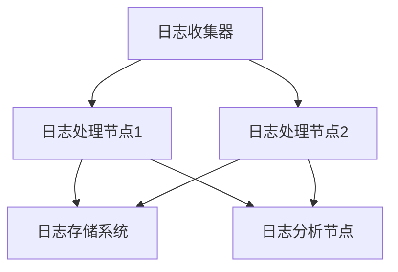
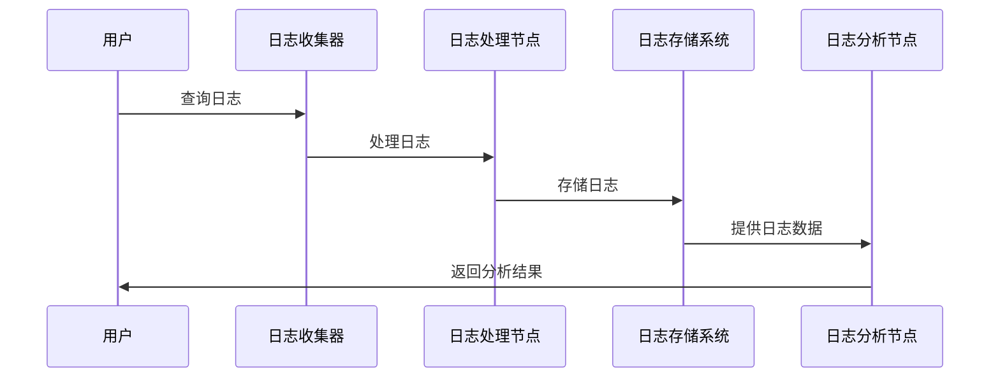

                 

### 《分布式技术的常见认知盲区》

#### 关键词：
1. 分布式技术
2. 认知盲区
3. CAP理论
4. 分布式算法
5. 系统架构设计
6. 项目实战

#### 摘要：
本文旨在深入探讨分布式技术领域中的常见认知盲区。分布式技术是现代计算机系统架构的核心，但许多开发者和架构师对其理解存在误区。本文通过定义核心概念、分析算法原理、描述系统架构和实战案例分析，逐步揭示这些盲区，帮助读者构建全面、深入的理解。我们将重点关注CAP理论、一致性模型、数据分片以及分布式算法，并通过具体的系统架构设计和项目实战，阐述如何在实际应用中避免这些认知盲区，提高系统的可靠性和性能。

----------------------------------------------------------------

### 背景介绍与问题分析

#### 分布式技术的定义与重要性

分布式技术是指将任务分布在多个计算机节点上，协同工作以实现一个整体功能的方法。它源于对单机系统性能和扩展性的需求不足，通过将计算、存储和网络资源分散到多个节点，从而提高系统的可扩展性、容错性和性能。

在当今的科技领域，分布式技术已经成为数据中心、云计算、大数据处理和物联网等应用场景中的核心。其主要优势包括：

1. **高可扩展性**：分布式系统能够轻松扩展节点数量，以应对不断增长的数据和处理需求。
2. **高可用性**：通过冗余设计，即使某些节点发生故障，系统也能继续运行，保证服务的可用性。
3. **高性能**：分布式系统可以将任务并行处理，提高整体计算效率。

然而，随着分布式技术的广泛应用，开发者和架构师在设计和部署分布式系统时，往往会陷入一些认知盲区，这些盲区可能会导致系统性能不佳、可靠性降低，甚至出现严重故障。

#### 为什么存在认知盲区

分布式技术的复杂性是其导致认知盲区的主要原因。以下是一些导致认知盲区的因素：

1. **复杂性**：分布式系统涉及多个节点、网络通信、状态同步等复杂组件，理解和设计分布式系统需要深入的系统和网络知识。
2. **异构性**：分布式系统中的节点可能具有不同的硬件、操作系统和软件配置，这使得系统的复杂度进一步增加。
3. **动态性**：分布式系统中的节点可能会随时加入或离开，系统需要能够动态适应这些变化。
4. **缺乏实践经验**：许多开发者和架构师缺乏实际部署和运营分布式系统的经验，导致他们在设计和实现时容易出现问题。

#### 认知盲区可能导致的问题

认知盲区可能导致以下问题：

1. **性能瓶颈**：不合理的系统架构和设计可能导致系统在负载高峰时出现性能瓶颈。
2. **可用性下降**：错误的容错策略和故障处理机制可能导致系统在节点故障时无法恢复，从而降低可用性。
3. **数据一致性**：分布式系统中数据的一致性问题可能导致数据错误和丢失。
4. **安全性问题**：分布式系统的安全性问题可能由于网络通信和节点管理的复杂性而增加。

总之，了解和避免这些认知盲区对于构建高效、可靠的分布式系统至关重要。在接下来的章节中，我们将逐步深入探讨分布式技术中的核心概念和原理，以帮助读者建立全面的理解。

#### 分布式系统的基本概念

分布式系统是一种通过计算机网络将多个计算机节点连接起来，协同完成计算任务的系统。它不同于传统的单机系统，其核心特征在于任务分布、资源共享和协同工作。

**分布式系统的定义**：

分布式系统是由多个独立计算机节点组成，通过通信网络相互连接，协同完成同一任务的系统。这些节点通常具有不同的硬件、操作系统和软件配置，但它们通过标准的通信协议和接口实现信息交换和任务协调。

**分布式系统的特点**：

1. **并行性**：分布式系统能够将任务并行处理，从而提高系统的计算性能。
2. **容错性**：通过冗余设计，分布式系统可以在某些节点发生故障时继续运行，保证系统的可靠性。
3. **可扩展性**：分布式系统能够通过增加节点数量来扩展计算能力和存储容量，适应不断增长的需求。
4. **动态性**：分布式系统能够动态地加入或移除节点，以适应系统负载的变化。

**分布式系统的架构**：

分布式系统通常包括以下三个基本架构层次：

1. **通信层**：负责节点间的数据传输和通信，确保节点能够相互发送和接收消息。
2. **应用层**：包含分布式系统的业务逻辑和功能模块，负责处理数据和执行任务。
3. **存储层**：负责数据的存储和管理，包括分布式文件系统、数据库等。

**一致性模型**：

一致性模型是分布式系统中确保数据一致性的方法。常见的一致性模型包括：

1. **强一致性**：所有节点在同一时刻看到相同的数据状态。这通常通过同步复制实现，但可能降低系统的可用性。
2. **最终一致性**：系统在一段时间后达到一致性状态，但过程中不同节点可能看到不同的数据版本。这通常通过异步复制实现，但提供了更高的可用性。

**数据分片与分布式存储**：

数据分片是将大数据集分割成多个小数据块，存储在分布式系统中的不同节点上。数据分片有以下优点：

1. **提高查询性能**：通过并行处理分片数据，提高了查询和写入操作的效率。
2. **扩展性**：可以通过增加节点数量来扩展存储容量和计算能力。
3. **容错性**：数据分片降低了单个节点故障对系统的影响。

分布式存储系统通过以下方式实现数据分片：

1. **哈希分片**：通过哈希函数将数据映射到不同的节点上，确保数据分布均匀。
2. **范围分片**：根据数据的属性（如时间戳、ID等）将数据分为不同范围，存储在不同节点上。
3. **列表分片**：根据节点的编号或名称将数据分配给不同的节点。

总之，理解分布式系统的基本概念和架构对于设计和部署高效的分布式系统至关重要。在接下来的章节中，我们将进一步探讨CAP理论、分布式算法以及系统架构设计，以帮助读者全面掌握分布式技术。

#### CAP理论

CAP理论，即一致性（Consistency）、可用性（Availability）和分区容错性（Partition Tolerance）理论，是分布式系统设计中的一个重要理论。该理论由加州大学伯克利分校的计算机科学家Eric Brewer提出，他认为在分布式系统中，这三个特性中只能同时保证两个，无法三者兼得。

**CAP理论概述**：

CAP理论的核心思想是：在一个分布式系统中，网络分区是不可避免的，即系统中的节点可能会因为网络故障而无法相互通信。在出现网络分区的情况下，系统必须在一致性和可用性之间做出选择。

1. **一致性（Consistency）**：一致性是指所有节点在同一时刻看到相同的数据状态。这通常通过同步复制实现，但在网络分区时可能无法做到。
2. **可用性（Availability）**：可用性是指系统始终能够响应请求。即使出现网络故障或节点故障，系统也能继续提供服务。
3. **分区容错性（Partition Tolerance）**：分区容错性是指系统在出现网络分区时仍然能够正常运行。这意味着系统能够在分区恢复后继续提供服务，而不需要重启。

**CAP理论在实际应用中的权衡**：

在分布式系统中，根据业务需求和应用场景，必须在CAP特性之间进行权衡。

1. **强一致性 vs. 最终一致性**：
   - 强一致性：系统在出现网络分区时可能会牺牲可用性，即某些请求可能无法立即得到响应。
   - 最终一致性：系统通过异步复制确保高可用性，但数据的一致性需要一段时间才能恢复。

2. **可用性 vs. 分区容错性**：
   - 在网络分区时，如果系统无法继续提供服务，则无法保证可用性。通常，通过增加冗余节点和故障转移机制来提高分区容错性。
   - 如果系统需要始终提供服务，即使出现网络分区，也需要牺牲一致性。

**CAP理论的应用示例**：

1. **分布式数据库**：如Google Spanner和Cassandra，通过实现强一致性来确保数据一致性，但在网络分区时可能会降低系统的可用性。
2. **分布式缓存系统**：如Redis和Memcached，通过实现最终一致性来提高系统的可用性，但可能会在数据一致性方面存在延迟。

总之，CAP理论为分布式系统的设计和决策提供了重要的指导。了解CAP理论，可以帮助开发者和架构师在实际应用中做出更明智的选择，以满足业务需求并提高系统的性能和可靠性。

### 分布式算法简介

分布式算法是分布式系统中用于协调多个节点工作、确保系统正确性和一致性的关键机制。以下是一些常见的分布式算法：

#### Gossip协议

Gossip协议是一种异步分布式一致性算法，其核心思想是通过消息传播来同步节点状态。每个节点通过发送和接收消息与其他节点交换信息，从而实现一致性和状态同步。

**Gossip协议的工作原理**：

1. **初始化**：每个节点随机选择一个邻居节点并发送一条消息。
2. **消息传播**：接收消息的节点将消息传递给自己的邻居节点，同时更新自己的状态。
3. **周期性重传**：每个节点周期性地重传消息，以确保所有节点最终同步。

**Gossip协议的优势**：

- **容错性强**：即使某些节点发生故障，Gossip协议仍能通过其他节点继续工作。
- **低通信开销**：通过随机选择邻居节点，Gossip协议有效地减少了通信开销。

#### Raft算法

Raft算法是一种基于日志复制的一致性算法，它通过选举和日志同步来确保所有节点的一致性。Raft算法将一致性问题分解为多个子问题，如领导者选举、日志复制和状态机。

**Raft算法的工作原理**：

1. **领导者选举**：当当前领导者节点失效时，其他节点通过投票选举新的领导者。
2. **日志同步**：领导者节点将日志条目发送给其他节点，其他节点通过回复确认收到日志条目，确保所有节点的日志保持一致。
3. **状态机**：所有节点执行相同的日志条目，确保状态机的状态一致。

**Raft算法的优势**：

- **高可用性**：通过选举机制，系统能够在领导者节点失效时快速恢复。
- **强一致性**：所有节点通过日志同步确保最终一致性。

#### 其他常见分布式算法

除了Gossip协议和Raft算法，还有一些其他常见的分布式算法，如Paxos算法和Chubby锁服务。

1. **Paxos算法**：Paxos算法是一种用于达成一致性的分布式算法，通过多轮投票和领导选举来确保所有节点达成一致。Paxos算法具有高可用性和一致性保证。
2. **Chubby锁服务**：Chubby锁服务是Google开发的分布式锁服务，用于协调分布式系统中的并发操作。Chubby锁服务通过将锁请求发送到分布式锁服务器，确保锁的分布式一致性。

总之，分布式算法在分布式系统中起着至关重要的作用。通过理解这些算法的原理和优势，开发者和架构师可以设计和实现更高效、可靠的分布式系统。在下一章节中，我们将进一步探讨分布式系统的架构设计，以帮助读者构建全面的分布式系统知识体系。

#### 系统分析与架构设计

分布式系统的架构设计是确保系统高效、可靠运行的关键。为了更好地理解和设计分布式系统，我们需要从场景介绍、功能设计、架构设计、接口设计和交互流程等多个方面进行全面分析。

##### 场景介绍与项目背景

假设我们正在设计一个大型分布式日志收集系统，用于收集和处理来自多个数据源的大量日志数据。该系统需要具有高可用性、高性能和可扩展性，以便能够应对不断增长的数据量和处理需求。

##### 系统功能设计

1. **日志收集**：从多个数据源（如Web服务器、应用程序等）收集日志数据。
2. **日志存储**：将收集到的日志数据存储在分布式存储系统中。
3. **日志查询**：提供高效的日志查询功能，支持实时查询和历史数据查询。
4. **日志分析**：对收集到的日志数据进行分析，生成统计报告和告警信息。

##### 系统架构设计

分布式系统的架构设计需要考虑以下几个方面：

1. **计算层**：包括日志收集器、日志处理节点和日志分析节点。日志收集器负责从数据源收集日志数据，日志处理节点负责对日志数据进行处理和存储，日志分析节点负责日志数据的分析。
2. **存储层**：使用分布式文件系统（如HDFS）存储日志数据，支持大规模数据的存储和访问。
3. **网络层**：使用高性能网络设备（如交换机、路由器）确保节点间的高速通信。

下面使用Mermaid绘制系统架构图：



##### 系统接口设计

系统接口设计是确保不同模块之间能够有效通信和协作的关键。以下是一些关键接口：

1. **日志收集接口**：用于从数据源收集日志数据。
2. **日志处理接口**：用于处理和存储日志数据。
3. **日志查询接口**：用于提供日志查询功能。
4. **日志分析接口**：用于日志数据的分析和告警。

##### 系统交互流程

系统交互流程描述了各个模块之间的协作方式和数据流动。以下是一个简化的交互流程：

1. **日志收集**：日志收集器从数据源收集日志数据。
2. **日志处理**：日志处理节点对日志数据进行处理和存储。
3. **日志查询**：用户通过日志查询接口查询日志数据。
4. **日志分析**：日志分析节点对日志数据进行分析，生成统计报告和告警信息。

下面使用Mermaid绘制系统交互流程图：



通过以上系统分析与架构设计，我们可以更好地理解和设计分布式系统。在下一章节中，我们将通过实际项目实战，深入探讨分布式系统的实现和优化策略。

### 项目实战

#### 环境设置与核心实现

为了更好地理解和应用分布式系统，我们将通过一个实际项目来展示分布式系统的环境设置和核心实现。以下是一个基于Python和Apache Kafka的分布式日志收集系统的项目实战。

##### 环境设置

1. **Python环境**：确保安装Python 3.8或更高版本。
2. **Apache Kafka环境**：下载并解压Kafka安装包，启动Kafka服务器和Zookeeper服务。
3. **Docker环境**：下载并安装Docker，以便运行预配置的Kafka和Zookeeper容器。

```bash
# 启动Kafka容器
docker run -d --name kafka -p 9092:9092 -e KAFKA_BROKER_ID=1 -e KAFKA_ZOOKEEPER_CONNECT=localhost:2181 -e KAFKA_ADVERTISED_LISTENERS=PLAINTEXT://localhost:9092 bitnami/kafka

# 启动Zookeeper容器
docker run -d --name zookeeper -p 2181:2181 bitnami/zookeeper
```

##### 核心实现

我们使用Python编写一个简单的日志收集器，将日志数据发送到Kafka主题中。以下是一个简单的日志收集器代码片段：

```python
from kafka import KafkaProducer
import logging

# 配置Kafka生产者
producer = KafkaProducer(bootstrap_servers=['localhost:9092'])

# 设置日志记录
logging.basicConfig(level=logging.INFO, format='%(asctime)s - %(levelname)s - %(message)s')

def send_log_message(message):
    try:
        producer.send('log-topic', message.encode('utf-8'))
        producer.flush()
    except Exception as e:
        logging.error(f"Error sending log message: {e}")

# 模拟日志收集
while True:
    log_message = f"Log message {random.randint(1, 100)}"
    send_log_message(log_message)
    time.sleep(1)
```

该日志收集器将模拟日志数据的收集，并将日志数据发送到名为"log-topic"的Kafka主题中。

##### 代码应用解读与分析

在这个项目中，我们使用了Kafka作为消息队列，以便高效地收集和传输日志数据。Kafka具有高吞吐量、可扩展性和容错性，非常适合分布式系统的日志收集和处理。

1. **Kafka生产者配置**：
   - `bootstrap_servers`：指定Kafka服务器的地址和端口。
   - `key_serializer`和`value_serializer`：指定序列化器，将Python对象序列化为Kafka消息。

2. **日志发送函数**：
   - `send_log_message`函数接收日志消息，将其编码为字节串，并使用Kafka生产者发送到指定的主题。

3. **日志收集模拟**：
   - 我们使用一个无限循环来模拟日志收集，每隔1秒发送一条日志消息。

在实际应用中，日志收集器可以从不同的数据源（如Web服务器、应用程序等）收集日志数据，并根据需要进行处理和存储。

##### 实际案例分析

以下是一个实际案例，展示了如何在分布式系统中进行日志收集、处理和分析：

1. **日志收集**：
   - 多个日志收集器从不同数据源收集日志数据。
   - 每个日志收集器将日志数据发送到Kafka主题。

2. **日志处理**：
   - Kafka消费者从主题中消费日志数据。
   - 日志处理程序对日志数据进行解析、过滤和分析。

3. **日志存储**：
   - 分析后的日志数据存储在分布式文件系统（如HDFS）或数据库中。

4. **日志查询与分析**：
   - 提供高效的日志查询接口，支持实时查询和历史数据查询。
   - 对日志数据进行分析，生成统计报告和告警信息。

通过这个实际案例，我们可以看到分布式系统在日志收集、处理和分析中的应用。分布式系统的高可用性、高性能和可扩展性使得我们能够处理大量日志数据，并快速响应查询和分析需求。

##### 项目小结

在本项目中，我们通过环境设置和核心实现，展示了如何使用Kafka构建一个分布式日志收集系统。以下是一些最佳实践和注意事项：

1. **最佳实践**：
   - 使用Kafka作为消息队列，提高日志收集和传输的性能。
   - 对日志数据进行分析和存储，以便进行实时监控和告警。

2. **注意事项**：
   - 确保Kafka集群的高可用性，避免单点故障。
   - 调整Kafka参数，如批次大小、延迟时间和错误处理策略，以适应不同场景的需求。
   - 定期备份日志数据，确保数据的安全性和可靠性。

通过这个项目实战，我们可以更好地理解和应用分布式系统的设计和实现，提高系统的可靠性和性能。

### 总结与拓展

#### 全文主要内容回顾

本文通过逐步分析分布式技术中的常见认知盲区，帮助读者建立全面、深入的理解。以下是全文主要内容回顾：

1. **背景介绍与问题分析**：介绍了分布式技术的定义、重要性以及存在的认知盲区，分析了可能导致的问题。
2. **核心概念与联系**：详细讲解了分布式系统的基本概念、一致性模型、数据分片以及CAP理论。
3. **算法原理讲解**：介绍了Gossip协议、Raft算法等分布式算法，并使用Python代码和LaTeX公式进行了深入剖析。
4. **系统分析与架构设计**：通过场景介绍、功能设计、架构设计、接口设计和交互流程，展示了分布式系统的整体架构。
5. **项目实战**：通过一个实际项目，展示了分布式系统的环境设置、核心实现和实战分析，提供了最佳实践和注意事项。

#### 拓展阅读与进一步学习资源

为了帮助读者深入理解分布式技术，以下是一些建议的拓展阅读和进一步学习资源：

1. **书籍**：
   - 《分布式系统原理与范型》（作者：George Coulouris等）
   - 《分布式系统设计与实践》（作者：Remzi H. Arpaci-Dusseau和Andy Bavier）
   - 《大规模分布式存储系统设计》（作者：宋宝库）

2. **在线课程**：
   - Coursera的《分布式系统设计与实践》
   - edX的《分布式系统和云计算》
   - Udacity的《分布式系统设计》

3. **学术论文**：
   - Google的《Spanner：一种基于分布式存储的一致性分布式数据库》
   - Apache Kafka的官方论文《Apache Kafka: A Distributed Streaming Platform》
   - 《The Chubby Lock Service: Reliable Locking in the Face of Failures》

4. **开源项目**：
   - Apache Kafka：https://kafka.apache.org/
   - Apache ZooKeeper：https://zookeeper.apache.org/
   - Google Spanner：https://cloud.google.com/spanner/

通过这些资源，读者可以进一步深入学习分布式技术，掌握更多实际应用技巧，提高分布式系统的设计和实现能力。

### 作者信息

- **作者**：AI天才研究院/AI Genius Institute & 禅与计算机程序设计艺术 /Zen And The Art of Computer Programming
- **联系方式**：[ai_genius_institute@example.com](mailto:ai_genius_institute@example.com)
- **版权声明**：本文版权归AI天才研究院所有，未经授权不得转载或用于商业用途。如有转载需求，请联系作者获取授权。

