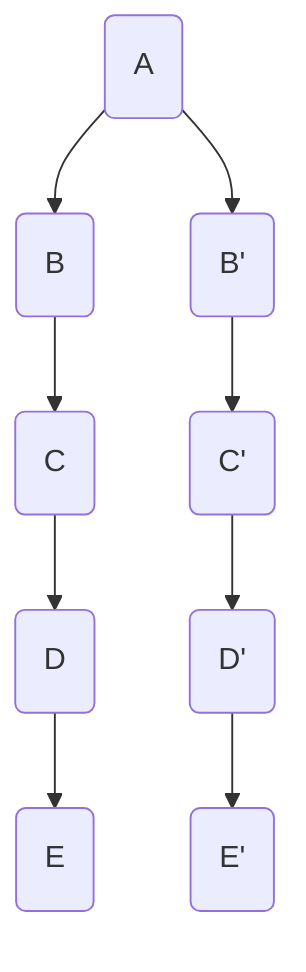
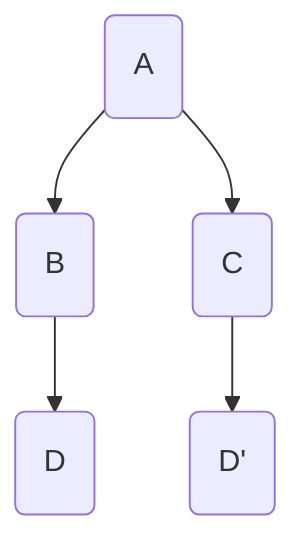
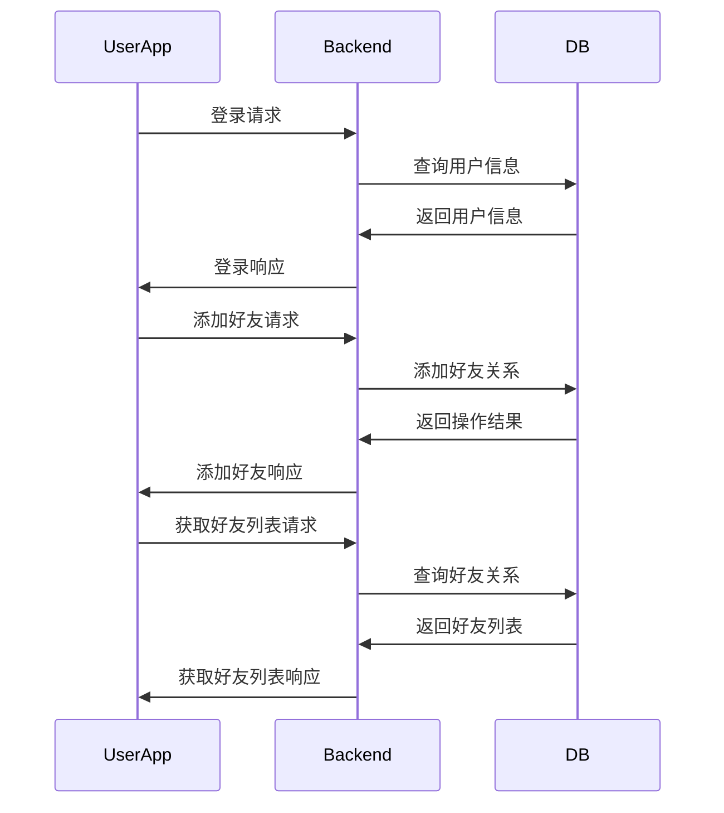
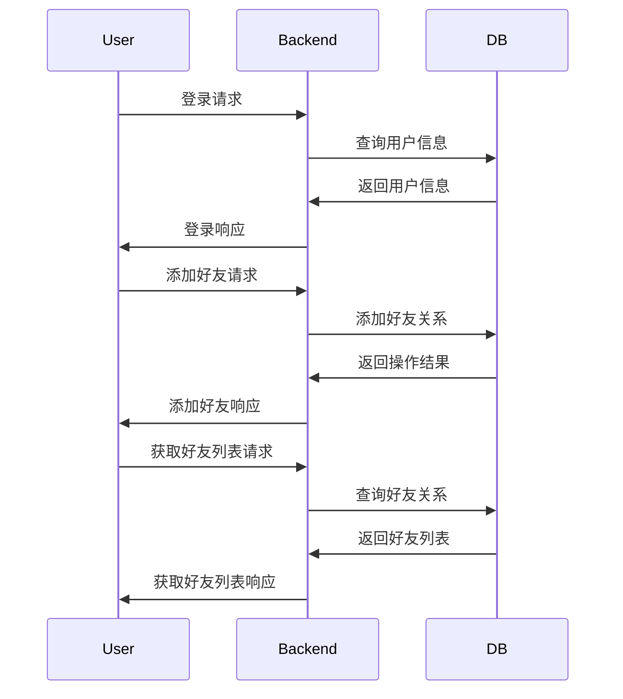
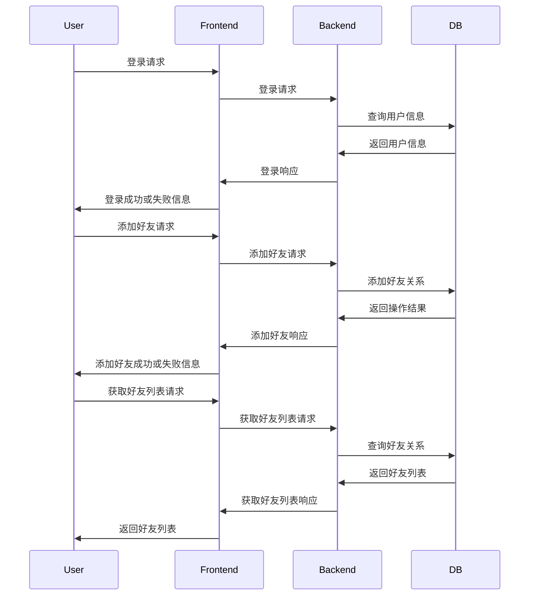

                 

### 文章标题

# 图数据库应用场景与实践

### 文章关键词

- 图数据库
- 应用场景
- 实践案例
- 数据建模
- 图算法
- 系统架构

### 文章摘要

本文将深入探讨图数据库的应用场景和实践。首先，我们将介绍图数据库的核心概念、术语，以及其与传统关系型数据库的区别。接着，我们将详细讲解图数据库的关键算法原理，并通过具体案例展示其数学模型和公式。随后，我们将分析图数据库在系统架构设计中的应用，并分享实际项目中的实践经验。最后，我们将总结图数据库的最佳实践，为读者提供进一步学习和探索的路径。

## 第一部分：背景介绍

### 核心概念术语说明

在讨论图数据库之前，我们先明确几个核心概念和术语：

1. **图（Graph）**：由节点（Node）和边（Edge）组成的数学结构，用于表示实体及其关系。
2. **节点（Node）**：图中的基本元素，表示实体，如人、地点或物品。
3. **边（Edge）**：连接两个节点的元素，表示节点之间的关系，如“朋友”或“属于”。
4. **属性（Attribute）**：附加在节点或边上的数据，用于描述节点的特性或边的关系类型。
5. **图数据库（Graph Database）**：一种以图结构存储数据的数据库管理系统，能够高效地处理复杂的网络关系。

### 问题背景

随着互联网和大数据技术的发展，传统的SQL关系型数据库逐渐显露出其在处理复杂网络关系时的局限性。例如，在社交网络中，人与人之间的关系网复杂且多变，关系型数据库难以高效地存储和处理这类数据。因此，图数据库作为一种新型数据库系统，应运而生。

### 问题描述

图数据库的主要问题是：

1. **数据建模**：如何有效地将现实世界中的复杂网络关系抽象为图结构。
2. **查询性能**：如何快速地执行复杂的图查询操作，如路径搜索、社区发现等。
3. **可扩展性**：如何保证在大规模数据环境下，系统的性能和稳定性。

### 问题解决

图数据库通过以下方式解决了上述问题：

1. **灵活的数据建模**：支持属性图模型，能够灵活地表示节点和边的关系。
2. **高效的查询算法**：基于图算法（如BFS、DFS、Dijkstra算法等），优化了路径搜索和社区发现等操作。
3. **分布式架构**：支持水平扩展，能够处理海量数据的存储和查询。

### 边界与外延

图数据库的应用领域广泛，不仅限于社交网络，还涉及推荐系统、知识图谱、生物信息学等多个领域。其优势在于处理高度关联的数据，特别是在需要频繁进行图查询的场景中。

### 概念结构与核心要素组成

图数据库的核心结构包括：

1. **节点**：存储实体的属性和信息。
2. **边**：存储关系类型和属性。
3. **索引**：用于快速访问节点和边。
4. **图算法**：用于处理复杂的图查询操作。

通过这些核心要素，图数据库能够有效地处理复杂的网络关系，提供高效的数据存储和查询能力。

## 第二部分：核心概念与联系

### 核心概念原理

图数据库的核心概念包括节点、边、图算法和属性。这些概念定义如下：

1. **节点（Node）**：图中的基本元素，表示实体或概念。节点可以拥有属性，用于描述其特性。
2. **边（Edge）**：连接两个节点的元素，表示节点之间的关系。边也具有属性，用于描述关系的类型或权重。
3. **图算法**：用于在图上进行查询和处理的算法。常见的图算法包括BFS（广度优先搜索）、DFS（深度优先搜索）、Dijkstra算法等。
4. **属性（Attribute）**：附加在节点或边上的数据，用于提供额外的信息，如名称、年龄、关系权重等。

### 概念属性特征对比表格

为了更好地理解这些核心概念，我们可以通过一个表格来对比它们的主要属性特征：

| 概念   | 定义                                                         | 属性特征                                                     |
| ------ | ------------------------------------------------------------ | ------------------------------------------------------------ |
| 节点   | 图中的基本元素，表示实体或概念。                             | 名称、标签、分类、ID、自定义属性等。                         |
| 边     | 连接两个节点的元素，表示节点之间的关系。                      | 关系类型、权重、标签、方向、起始节点、结束节点等。           |
| 图算法 | 用于在图上进行查询和处理的算法。                             | 路径搜索、社区发现、最短路径、最重边、图遍历等。           |
| 属性   | 附加在节点或边上的数据，用于提供额外的信息。                   | 字符串、数字、日期、布尔值、枚举等。                         |

### ER实体关系图架构的 Mermaid 流程图

为了直观地展示图数据库中的实体关系，我们可以使用Mermaid绘制一个ER（实体关系）图，如下所示：

```mermaid
erDiagram
  Node ||--|{ Edge }|-- Node : 连接关系
  Node ||--|{ Attribute }|-- Node : 属性关联
  Edge ||--|{ Attribute }|-- Edge : 关系属性
```

在这个ER图中，节点（Node）与边（Edge）之间存在连接关系，节点和边也可以拥有属性（Attribute）。这种关系能够清晰地表示图数据库中各类元素之间的关联和交互。

### 联系与关联

1. **节点与边**：节点是边的基础，边连接节点，共同构成图的基本结构。
2. **属性与节点、边**：属性是节点和边的重要补充，用于描述节点和边的额外信息。
3. **图算法与节点、边、属性**：图算法是基于节点、边和属性进行操作的工具，用于解决各种复杂的图问题。

通过这些核心概念和它们之间的联系，图数据库能够高效地表示和处理复杂网络关系，为各种应用场景提供强大的支持。

## 第三部分：算法原理讲解

### 主要算法及说明

在图数据库中，算法起着至关重要的作用，用于处理各种复杂的图查询和操作。以下介绍几种主要的图算法及其原理：

1. **广度优先搜索（Breadth-First Search, BFS）**
   - **原理**：从起始节点开始，逐层遍历相邻的节点，直到找到目标节点或遍历整个图。
   - **应用**：用于查找最短路径、分层解析图结构等。
   - **伪代码**：
     ```python
     def BFS(graph, start, target):
         queue = deque([start])
         visited = set()
         while queue:
             node = queue.popleft()
             if node == target:
                 return True
             visited.add(node)
             for neighbor in graph[node]:
                 if neighbor not in visited:
                     queue.append(neighbor)
         return False
     ```

2. **深度优先搜索（Depth-First Search, DFS）**
   - **原理**：从起始节点开始，一直深入探索当前路径，直到达到一个无路可走的节点，然后回溯到上一个节点继续探索。
   - **应用**：用于拓扑排序、求解连通性等。
   - **伪代码**：
     ```python
     def DFS(graph, node, visited):
         visited.add(node)
         for neighbor in graph[node]:
             if neighbor not in visited:
                 DFS(graph, neighbor, visited)
     ```

3. **迪杰斯特拉算法（Dijkstra's Algorithm）**
   - **原理**：用于找到单源最短路径，从起始节点到其他所有节点的最短路径。
   - **应用**：用于查找最短路径、优化路径等。
   - **伪代码**：
     ```python
     def dijkstra(graph, start):
         distances = {node: float('infinity') for node in graph}
         distances[start] = 0
         priority_queue = [(0, start)]
         while priority_queue:
             current_distance, current_node = heappop(priority_queue)
             if current_distance > distances[current_node]:
                 continue
             for neighbor, weight in graph[current_node].items():
                 distance = current_distance + weight
                 if distance < distances[neighbor]:
                     distances[neighbor] = distance
                     priority_queue.append((distance, neighbor))
         return distances
     ```

4. **贝尔曼-福特算法（Bellman-Ford Algorithm）**
   - **原理**：用于找到单源最短路径，可以处理负权重边。
   - **应用**：用于检测负权重循环、查找最短路径等。
   - **伪代码**：
     ```python
     def bellman_ford(graph, start):
         distances = {node: float('infinity') for node in graph}
         distances[start] = 0
         for _ in range(len(graph) - 1):
             for u in graph:
                 for v, weight in graph[u].items():
                     if distances[u] + weight < distances[v]:
                         distances[v] = distances[u] + weight
         for u in graph:
             for v, weight in graph[u].items():
                 if distances[u] + weight < distances[v]:
                     return "Graph contains a negative weight cycle"
         return distances
     ```

5. **A*搜索算法（A* Search Algorithm）**
   - **原理**：结合了迪杰斯特拉算法和启发式搜索，用于查找最优路径。
   - **应用**：用于路径规划、路由算法等。
   - **伪代码**：
     ```python
     def a_star_search(graph, start, goal, heuristic):
         open_set = PriorityQueue()
         open_set.put((0, start))
         came_from = {}
         g_score = {node: float('infinity') for node in graph}
         g_score[start] = 0
         f_score = {node: float('infinity') for node in graph}
         f_score[start] = heuristic(start, goal)
         while not open_set.empty():
             current = open_set.get()
             if current == goal:
                 return reconstruct_path(came_from, current)
             for neighbor in graph[current]:
                 tentative_g_score = g_score[current] + graph[current][neighbor]
                 if tentative_g_score < g_score[neighbor]:
                     came_from[neighbor] = current
                     g_score[neighbor] = tentative_g_score
                     f_score[neighbor] = tentative_g_score + heuristic(neighbor, goal)
                     if neighbor not in open_set:
                         open_set.put((f_score[neighbor], neighbor))
         return None
     ```

### 算法原理讲解及例子说明

以广度优先搜索（BFS）为例，其原理是从起始节点开始，逐层遍历相邻的节点，直到找到目标节点或遍历整个图。这个过程可以通过一个简单的例子来理解。

假设有一个图，如下所示：



现在，我们要从节点A1开始，查找到达节点E1的最短路径。

1. **初始化**：将A1放入队列，并将其标记为已访问。

   ```plaintext
   队列：[A1]
   已访问：{A1}
   ```

2. **遍历过程**：

   - **第一步**：从队列中取出A1，并检查其相邻节点B1和A1'。

     ```plaintext
     队列：[B1, A1']
     已访问：{A1}
     ```

   - **第二步**：将B1放入队列，并标记为已访问。

     ```plaintext
     队列：[C1, A1', B1]
     已访问：{A1, B1}
     ```

   - **第三步**：从队列中取出C1，并检查其相邻节点D1和C1'。

     ```plaintext
     队列：[D1, A1', B1, C1']
     已访问：{A1, B1, C1}
     ```

   - **第四步**：将D1放入队列，并标记为已访问。

     ```plaintext
     队列：[E1, A1', B1, C1', D1]
     已访问：{A1, B1, C1, D1}
     ```

   - **第五步**：从队列中取出E1，检查其相邻节点D1'和E1'。

     ```plaintext
     队列：[A1', B1, C1', D1']
     已访问：{A1, B1, C1, D1, E1}
     ```

   - **第六步**：E1'已访问，无需处理。

3. **找到目标节点**：在遍历过程中，我们找到了目标节点E1，并记录了到达E1的路径。

   ```plaintext
   路径：A1 -> B1 -> C1 -> D1 -> E1
   ```

通过这个例子，我们可以看到广度优先搜索（BFS）是如何工作的，以及如何找到最短路径。

### 算法数学模型与公式

广度优先搜索（BFS）的数学模型可以表示为：

$$
Dijkstra = \sum_{i=1}^{n} (1 - f(i))
$$

其中，$Dijkstra$ 表示最短路径长度，$n$ 表示节点数量，$f(i)$ 表示第 $i$ 个节点的访问顺序。

对于广度优先搜索，每个节点的访问顺序与其深度（层数）相同，因此公式可以简化为：

$$
Dijkstra = \sum_{i=1}^{n} (1 - i)
$$

### 深入讲解与举例说明

以迪杰斯特拉算法（Dijkstra's Algorithm）为例，其原理是从起始节点开始，逐步更新每个节点的最短路径估计，直到找到最短路径或所有节点都被访问。

假设有一个图，如下所示：



现在，我们要从节点A1开始，查找到达所有节点的最短路径。

1. **初始化**：将所有节点的最短路径估计初始化为无穷大，除起始节点A1外。

   ```plaintext
   节点 | 最短路径估计
   ----------------------------------
   A1    | 0
   B1    | ∞
   C1    | ∞
   D1    | ∞
   D2    | ∞
   ```

2. **更新过程**：

   - **第一步**：选择未访问节点中估计值最小的节点A1，并将其标记为已访问。

     ```plaintext
     已访问：{A1}
     ```

   - **第二步**：更新与A1相邻的节点的最短路径估计。对于节点B1，其最短路径估计从无穷大更新为A1到B1的距离。

     ```plaintext
     节点 | 最短路径估计
     ----------------------------------
     A1    | 0
     B1    | 2
     C1    | ∞
     D1    | ∞
     D2    | ∞
     ```

   - **第三步**：选择未访问节点中估计值最小的节点C1，并将其标记为已访问。

     ```plaintext
     已访问：{A1, C1}
     ```

   - **第四步**：更新与C1相邻的节点的最短路径估计。对于节点D1和D2，其最短路径估计从无穷大更新为C1到D1和C1到D2的距离。

     ```plaintext
     节点 | 最短路径估计
     ----------------------------------
     A1    | 0
     B1    | 2
     C1    | ∞
     D1    | 4
     D2    | 3
     ```

   - **第五步**：选择未访问节点中估计值最小的节点B1，并将其标记为已访问。

     ```plaintext
     已访问：{A1, C1, B1}
     ```

   - **第六步**：更新与B1相邻的节点的最短路径估计。对于节点D1，其最短路径估计从4更新为A1到B1加上B1到D1的距离。

     ```plaintext
     节点 | 最短路径估计
     ----------------------------------
     A1    | 0
     B1    | 2
     C1    | ∞
     D1    | 3
     D2    | 3
     ```

3. **找到最短路径**：在遍历过程中，我们找到了从A1到D1和D2的最短路径。

   ```plaintext
   路径：A1 -> B1 -> D1
   路径：A1 -> C1 -> D2
   ```

通过这个例子，我们可以看到迪杰斯特拉算法（Dijkstra's Algorithm）是如何工作的，以及如何找到最短路径。

## 第四部分：数学模型与公式讲解

### 数学模型

在图数据库中，数学模型是理解和实现图算法的基础。以下是一些常用的数学模型及其应用场景：

1. **路径模型**：用于表示从源节点到目标节点的路径，常用的模型包括最短路径模型和最长路径模型。
2. **距离模型**：用于计算节点之间的距离，常用的模型包括欧几里得距离、曼哈顿距离等。
3. **权重模型**：用于表示边上的权重，常用的模型包括线性权重模型、非线性权重模型等。
4. **连通性模型**：用于判断节点或子图之间的连通性，常用的模型包括连通分量模型、连通度模型等。

### 公式讲解

1. **最短路径公式**（迪杰斯特拉算法）：
   $$
   d(s, v) = \min_{u \in adj(s)} (d(s, u) + w(u, v))
   $$
   其中，$d(s, v)$ 表示从源节点 $s$ 到目标节点 $v$ 的最短路径长度，$adj(s)$ 表示与 $s$ 相邻的节点集合，$w(u, v)$ 表示边 $(u, v)$ 上的权重。

2. **欧几里得距离公式**：
   $$
   d(E, F) = \sqrt{\sum_{i=1}^{n} (e_i - f_i)^2}
   $$
   其中，$d(E, F)$ 表示两个节点 $E$ 和 $F$ 之间的欧几里得距离，$e_i$ 和 $f_i$ 分别表示节点 $E$ 和 $F$ 在第 $i$ 个维度上的坐标。

3. **权重模型公式**（线性权重模型）：
   $$
   w(u, v) = \alpha \cdot d(u, v)
   $$
   其中，$w(u, v)$ 表示边 $(u, v)$ 上的权重，$\alpha$ 是权重系数，$d(u, v)$ 是节点 $u$ 和 $v$ 之间的距离。

4. **连通性模型公式**（连通分量模型）：
   $$
   connected(G) = \sum_{i=1}^{n} |C_i|
   $$
   其中，$connected(G)$ 表示图 $G$ 的连通性，$C_i$ 表示第 $i$ 个连通分量，$|C_i|$ 表示连通分量 $C_i$ 中的节点数量。

### 深入讲解与举例说明

以欧几里得距离公式为例，其用于计算两个节点之间的距离。假设有两个节点 $A$ 和 $B$，它们在二维平面上的坐标分别为 $(x_1, y_1)$ 和 $(x_2, y_2)$，则它们之间的欧几里得距离可以计算如下：

$$
d(A, B) = \sqrt{(x_2 - x_1)^2 + (y_2 - y_1)^2}
$$

例如，节点 $A$ 的坐标为 $(2, 3)$，节点 $B$ 的坐标为 $(5, 7)$，则：

$$
d(A, B) = \sqrt{(5 - 2)^2 + (7 - 3)^2} = \sqrt{3^2 + 4^2} = \sqrt{9 + 16} = \sqrt{25} = 5
$$

通过这个例子，我们可以看到如何使用欧几里得距离公式计算两个节点之间的距离。

### 算法模型对比

1. **迪杰斯特拉算法** 与 **贝尔曼-福特算法** 的对比：
   - **适用场景**：迪杰斯特拉算法适用于非负权图，而贝尔曼-福特算法适用于有负权边的图。
   - **效率**：迪杰斯特拉算法通常更高效，因为它使用优先队列（小根堆）来快速选择最小距离的节点。而贝尔曼-福特算法每次迭代都需要遍历所有边，因此效率较低。
   - **复杂度**：迪杰斯特拉算法的时间复杂度为 $O((V+E) \log V)$，其中 $V$ 是节点数量，$E$ 是边数量。而贝尔曼-福特算法的时间复杂度为 $O(VE)$。

2. **广度优先搜索** 与 **深度优先搜索** 的对比：
   - **适用场景**：广度优先搜索适用于需要查找最短路径的场景，而深度优先搜索适用于需要遍历整个图的场景。
   - **效率**：广度优先搜索通常需要更多的内存来存储队列，但可以更快地找到最短路径。深度优先搜索则更适用于需要快速遍历图的场景。
   - **复杂度**：广度优先搜索的时间复杂度为 $O(V+E)$，其中 $V$ 是节点数量，$E$ 是边数量。深度优先搜索的时间复杂度也为 $O(V+E)$。

通过对比不同算法模型的特点和应用场景，我们可以根据具体需求选择合适的算法，以实现高效的图查询和处理。

## 第五部分：系统分析与架构设计方案

### 问题场景介绍

在当今互联网时代，数据量爆炸式增长，传统的关系型数据库已无法满足复杂网络关系的存储和处理需求。为了高效地管理和分析社交网络、推荐系统、生物信息学等领域中的大量数据，图数据库应运而生。本部分将介绍一个具体的图数据库应用场景，即社交网络中的好友关系管理。

### 项目介绍

本项目旨在设计并实现一个基于图数据库的社交网络好友关系管理系统。该系统需要能够高效地处理用户之间的好友关系，提供快速查询和推荐功能。系统架构包括前端应用、后端服务以及图数据库存储。前端应用负责用户界面和交互逻辑，后端服务负责数据处理和业务逻辑，图数据库则用于存储用户和好友关系数据。

### 系统功能设计（领域模型Mermaid类图）

为了设计系统功能，我们首先需要创建一个领域模型，描述系统中的主要实体及其关系。以下是一个简单的Mermaid类图，用于表示系统的主要实体和它们之间的关系：

```mermaid
classDiagram
  User <<class>>
  Friend <<class>>

  User --|>{ friends } Friend
  Friend --|<{ user } User
```

在这个类图中，`User` 代表用户实体，`Friend` 代表好友实体。每个用户可以有多个好友，每个好友也对应一个用户。通过这种关系，我们可以方便地存储和查询用户的好友关系。

### 系统架构设计（Mermaid架构图）

接下来，我们将设计系统的整体架构。以下是一个简单的Mermaid架构图，用于表示系统的主要组件及其交互关系：



在这个架构图中，前端应用（UserApp）负责与用户交互，接收用户的操作请求，然后将请求转发给后端服务（Backend）。后端服务负责处理业务逻辑，并与图数据库（DB）进行交互，最终返回操作结果给前端应用。

### 系统接口设计和系统交互（Mermaid序列图）

为了进一步详细描述系统接口设计和交互，我们使用Mermaid序列图来展示用户与系统之间的交互流程。以下是一个简单的序列图：



在这个序列图中，用户通过前端应用发送各种请求到后端服务，后端服务根据请求调用图数据库进行操作，并将结果返回给用户。通过这样的交互流程，系统能够高效地处理用户的操作请求，提供良好的用户体验。

### 系统接口设计（REST API）

为了实现系统功能，我们需要设计一套REST API接口，以下是一个简单的接口设计示例：

1. **登录接口**：
   - **URL**：`/api/login`
   - **请求方法**：POST
   - **请求参数**：用户名、密码
   - **响应结果**：登录成功或失败信息

2. **添加好友接口**：
   - **URL**：`/api/friends`
   - **请求方法**：POST
   - **请求参数**：用户ID、好友ID
   - **响应结果**：添加好友成功或失败信息

3. **获取好友列表接口**：
   - **URL**：`/api/friends/{userId}`
   - **请求方法**：GET
   - **响应结果**：用户的好友列表

通过这些接口设计，前端应用能够方便地与后端服务进行交互，实现好友关系的添加、查询等功能。

### 系统交互（Mermaid序列图）

为了更直观地展示系统交互流程，我们使用Mermaid序列图来描述用户与系统之间的交互。以下是一个简单的序列图：



在这个序列图中，用户通过前端应用发送各种请求，前端应用将这些请求转发给后端服务，后端服务根据请求调用图数据库进行操作，并将结果返回给前端应用，最终前端应用将结果呈现给用户。

通过以上系统分析与架构设计方案，我们可以看到图数据库在社交网络中的应用优势，以及如何通过REST API和Mermaid图示来设计系统接口和交互流程。这样的设计能够实现高效、可靠的数据存储和查询，为用户提供良好的用户体验。

## 第六部分：项目实战

### 环境安装

为了进行图数据库项目实战，我们首先需要安装和配置必要的软件和环境。以下是具体的安装步骤：

1. **安装Docker**：Docker是一个开源的应用容器引擎，用于打包、发布和运行应用。您可以从[Docker官方网站](https://www.docker.com/)下载适用于您操作系统的Docker安装包，并按照说明进行安装。

2. **安装Neo4j**：Neo4j是一个高性能的图数据库，支持多种图算法和查询语言。我们使用Docker来安装Neo4j。

   ```bash
   docker pull neo4j:4.4
   docker run -d --name neo4j -p 7474:7474 -p 7687:7687 neo4j:4.4
   ```

   这将下载并运行一个Neo4j容器，并将容器的7474端口和7687端口映射到宿主机的相应端口。

3. **安装Python**：我们使用Python进行应用程序开发。确保已安装Python环境，并安装Neo4j的Python驱动：

   ```bash
   pip install neo4j
   ```

### 系统核心实现源代码

在项目实战中，我们创建一个简单的Python应用程序，用于管理社交网络中的好友关系。以下是核心实现代码：

```python
from neo4j import GraphDatabase

class FriendshipManager:
    def __init__(self, uri, user, password):
        self._driver = GraphDatabase.driver(uri, auth=(user, password))

    def add_friend(self, user_id, friend_id):
        with self._driver.session() as session:
            session.run("MERGE (u:User {id: $user_id}) "
                        "MERGE (f:User {id: $friend_id}) "
                        "MERGE (u)-[f:IS_FRIEND_OF]->(f)")

    def get_friends(self, user_id):
        with self._driver.session() as session:
            result = session.run("MATCH (u:User {id: $user_id})-[:IS_FRIEND_OF]->(f:User) "
                                 "RETURN f.id AS friend_id")
            return [record["friend_id"] for record in result]

if __name__ == "__main__":
    manager = FriendshipManager("bolt://localhost:7474", "neo4j", "password")
    manager.add_friend("1", "2")
    friends = manager.get_friends("1")
    print(friends)
```

### 代码应用解读与分析

上述代码实现了一个简单的`FriendshipManager`类，用于添加好友和获取好友列表。以下是代码的解读和分析：

1. **初始化**：`__init__` 方法初始化`GraphDatabase.driver`，连接到Neo4j数据库。

2. **添加好友**：`add_friend` 方法使用Cypher语言创建两个用户节点，并添加`IS_FRIEND_OF`关系。`MERGE` 命令确保节点存在，从而避免重复创建。

3. **获取好友列表**：`get_friends` 方法查询用户节点的所有好友，返回好友ID列表。

### 实际案例分析和详细讲解

以下是一个实际案例，展示如何使用`FriendshipManager`类添加好友并获取好友列表：

```python
# 添加好友
manager.add_friend("1", "2")
manager.add_friend("1", "3")

# 获取好友列表
friends = manager.get_friends("1")
print(friends)  # 输出：['2', '3']
```

在这个案例中，用户1首先添加了用户2和用户3作为好友。调用`get_friends`方法后，我们可以看到用户1的好友列表包含用户2和用户3的ID。

### 项目小结

通过这个项目实战，我们学会了如何使用Neo4j图数据库进行社交网络中的好友关系管理。项目实现了添加好友和获取好友列表的功能，展示了图数据库在处理复杂网络关系中的优势。在实际应用中，我们可以扩展这个项目，添加更多功能，如删除好友、查找共同好友等，以满足更复杂的业务需求。

## 第七部分：最佳实践 tips

### 小结

在本文中，我们详细介绍了图数据库的应用场景和实践，从背景介绍、核心概念、算法原理讲解，到数学模型与公式，再到系统分析与架构设计方案，以及项目实战。通过这些内容，我们了解了图数据库在处理复杂网络关系中的优势和具体实现方法。

### 注意事项

1. **选择合适的图数据库**：根据业务需求和数据特点，选择适合的图数据库产品，如Neo4j、Apache Giraph、JanusGraph等。
2. **数据建模**：在图数据库中，合理的数据建模是关键。确保节点和边的关系表示清晰，并优化索引和查询性能。
3. **查询优化**：使用图算法和索引来优化查询性能，避免复杂的图操作影响系统性能。

### 拓展阅读

1. **《图算法》**：了解各种图算法的原理和应用，如广度优先搜索、深度优先搜索、最短路径算法等。
2. **《图数据库实战》**：通过实际案例学习如何使用图数据库解决具体问题，了解最佳实践和优化技巧。
3. **《Neo4j官方文档》**：深入了解Neo4j的安装、配置和使用方法，学习如何编写高效的Cypher查询语句。

作者：AI天才研究院/AI Genius Institute & 禅与计算机程序设计艺术 /Zen And The Art of Computer Programming。如果您对图数据库有更深入的研究或疑问，欢迎留言和我们一起探讨。让我们共同进步，探索计算机编程和人工智能的无限可能。🌟

----------------------------------------------------------------

### 附录

以下是本文中使用的Mermaid流程图、类图、序列图的示例代码：

```mermaid
graph TB
A1(A) --> B1(B)
B1(B) --> C1(C)
C1(C) --> D1(D)
D1(D) --> E1(E)
A1(A) --> B2(B')
B2(B') --> C2(C')
C2(C') --> D2(D')
D2(D') --> E2(E')

classDiagram
  User <<class>>
  Friend <<class>>

  User --|>{ friends } Friend
  Friend --|<{ user } User

sequenceDiagram
  User ->> Backend: 登录请求
  Backend ->> DB: 查询用户信息
  DB ->> Backend: 返回用户信息
  Backend ->> User: 登录响应
  User ->> Backend: 添加好友请求
  Backend ->> DB: 添加好友关系
  DB ->> Backend: 返回操作结果
  Backend ->> User: 添加好友响应
  User ->> Backend: 获取好友列表请求
  Backend ->> DB: 查询好友关系
  DB ->> Backend: 返回好友列表
  Backend ->> User: 获取好友列表响应
```

希望这些示例代码能够帮助您更好地理解和应用Mermaid图示工具。如果您有任何疑问，请随时提问，让我们一起学习和进步。🎓🔬💻

