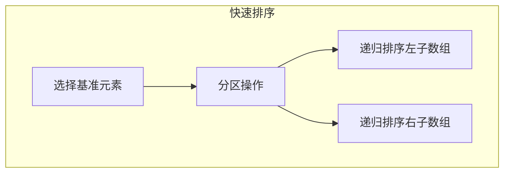

                 


### 《好代码先过自己这关》

> 关键词：代码质量、编程实践、个人成长、团队协作

> 摘要：本文旨在探讨代码质量的重要性，以及如何通过个人成长和团队协作提升代码质量。我们将从代码质量的衡量标准、编写可读性强的代码、代码审查的艺术、代码重构与优化、实战案例解析、团队协作中的代码质量保障、个人成长与代码质量的提升以及好代码的传承与分享等方面，一步一步分析推理，深入探讨如何编写高质量代码。

### 引言与背景

在IT行业，代码质量是衡量一个程序员技术水平的重要指标。好代码不仅能够提高开发效率，降低维护成本，还能够提高团队协作的效率。然而，编写高质量代码并非易事，它需要程序员具备扎实的编程基础、良好的编程习惯和不断学习进步的心态。

#### 编程的世界——代码质量的重要性

首先，让我们来看看代码质量的重要性。高质量的代码具有以下几个特点：

1. **可读性强**：代码易于理解和阅读，能够提高开发效率。
2. **可维护性高**：代码结构清晰，易于修改和维护。
3. **复用性强**：代码模块化，能够提高代码复用率。
4. **性能优异**：代码优化得当，能够提高系统性能。

#### 代码质量的衡量标准

接下来，我们来讨论一下代码质量的衡量标准。代码质量可以从以下几个方面进行评估：

1. **代码风格**：代码遵循一定的编码规范，易于阅读和理解。
2. **代码结构**：代码结构合理，模块划分清晰。
3. **代码逻辑**：代码逻辑清晰，无逻辑错误。
4. **代码性能**：代码性能优良，无性能瓶颈。
5. **代码可读性**：代码可读性强，易于理解和阅读。

### 核心技能

在了解了代码质量的背景和衡量标准之后，接下来我们将探讨如何通过核心技能提升代码质量。

#### 如何编写可读性强的代码

编写可读性强的代码是提升代码质量的基础。以下是一些编写可读性强的代码的技巧：

1. **使用有意义的变量名和函数名**：变量名和函数名应该能够清晰地描述其用途。
2. **合理使用注释**：注释应该简洁明了，帮助他人理解代码。
3. **代码格式化**：保持代码格式的一致性，提高代码的可读性。
4. **遵循编码规范**：遵循一定的编码规范，提高代码的可读性。

#### 代码审查的艺术

代码审查是提升代码质量的重要环节。通过代码审查，可以发现代码中的潜在问题，提高代码质量。以下是一些进行代码审查的技巧：

1. **制定审查标准**：明确审查的标准和重点，提高审查的效率。
2. **分工合作**：根据成员的专业领域和技能，分工合作进行代码审查。
3. **及时反馈**：及时反馈审查结果，促进代码质量的提升。
4. **持续改进**：通过不断的代码审查，发现和解决问题，提高代码质量。

#### 代码重构与优化

代码重构与优化是提升代码质量的重要手段。以下是一些代码重构与优化的技巧：

1. **代码重构**：将复杂的代码重构为更简洁、更易于维护的形式。
2. **代码优化**：通过优化算法和数据结构，提高代码的性能。
3. **代码审查**：在重构和优化过程中，进行代码审查，确保代码质量。

### 实践与案例

通过实践和案例，我们可以更好地理解如何提升代码质量。

#### 实战案例解析

在本章节中，我们将通过一个具体的实战案例，解析如何提升代码质量。案例将包括环境安装、系统核心实现源代码、代码应用解读与分析、实际案例分析和详细讲解剖析等内容。

#### 团队协作中的代码质量保障

在团队协作中，代码质量保障至关重要。以下是一些团队协作中保障代码质量的技巧：

1. **共同遵守编码规范**：团队成员共同遵守编码规范，提高代码质量。
2. **定期代码审查**：定期进行代码审查，及时发现和解决问题。
3. **持续集成**：使用持续集成工具，自动化测试代码，提高代码质量。
4. **团队沟通**：加强团队成员之间的沟通，提高代码质量。

### 总结与提升

在本文的最后，我们将总结如何提升代码质量，并提出一些个人成长和团队协作的建议。

#### 个人成长与代码质量的提升

个人成长是提升代码质量的关键。以下是一些个人成长与代码质量提升的建议：

1. **持续学习**：不断学习新技术和编程语言，提高自己的技术水平。
2. **实践与总结**：通过实践和总结，不断提升自己的编程能力。
3. **代码审查**：积极参与代码审查，提高自己的代码质量。
4. **分享与交流**：分享自己的经验和见解，与他人交流，共同进步。

#### 好代码的传承与分享

好代码的传承与分享是提升团队代码质量的重要手段。以下是一些好代码传承与分享的建议：

1. **编写文档**：编写详细的文档，帮助他人理解代码。
2. **代码审查**：通过代码审查，发现和解决问题，提高代码质量。
3. **分享经验**：在团队内部分享自己的经验和技巧，促进团队成长。
4. **开源项目**：参与开源项目，将自己的代码贡献给社区。

### 结语

通过本文的探讨，我们深入分析了如何编写高质量代码。让我们从现在开始，践行“好代码先过自己这关”的理念，不断提升自己的编程技能，为IT行业的发展贡献自己的力量。

---

**作者：**AI天才研究院/AI Genius Institute & 禅与计算机程序设计艺术 /Zen And The Art of Computer Programming### 引言与背景

#### 编程的世界——代码质量的重要性

在计算机编程的世界里，代码质量是衡量一个程序员技术水平的重要标准之一。编写高质量的代码不仅能提高开发效率，还能降低维护成本，进而提升整个项目的成功率。然而，高质量代码的编写并非易事，它不仅要求程序员掌握扎实的编程技能，还需要具备良好的编程习惯和持续学习的心态。

在编程实践中，代码质量往往被低估，但它的实际影响却是深远的。一方面，高质量的代码能够提高代码的可读性和可维护性，使得后续的开发和维护工作更加高效和顺畅。另一方面，高质量的代码有助于减少错误和漏洞，从而提高软件的安全性和稳定性。此外，良好的代码质量还能提高团队的协作效率，降低沟通成本，使得项目能够更快速地交付。

#### 代码质量的衡量标准

代码质量是一个多维度的概念，它包含多个方面的评估标准。以下是几个主要的衡量标准：

1. **可读性**：代码的可读性是衡量代码质量的重要标准之一。可读性高的代码易于理解和维护，有助于提高开发效率。为了提高代码的可读性，程序员应当使用有意义的变量名和函数名，合理使用注释，并遵循统一的编码规范。

2. **可维护性**：代码的可维护性是指代码易于修改和扩展的能力。高可维护性的代码能够减少维护成本，提高开发效率。为了提高代码的可维护性，程序员应当遵循模块化设计原则，避免代码冗余和复杂，并确保代码逻辑清晰。

3. **性能**：代码的性能是指代码在执行过程中所消耗的时间和资源。高性能的代码能够提高系统的响应速度和处理能力，对用户体验至关重要。为了提高代码的性能，程序员应当优化算法和数据结构，避免不必要的计算和内存占用。

4. **复用性**：代码的复用性是指代码模块可以被重复利用的能力。高复用性的代码能够减少重复劳动，提高开发效率。为了提高代码的复用性，程序员应当编写可重用的代码模块，并确保这些模块具有良好的接口和灵活性。

5. **安全性**：代码的安全性是指代码在抵御外部攻击和内部错误时的能力。安全性的代码能够保护系统的稳定性和数据的安全性，对关键系统尤为重要。为了提高代码的安全性，程序员应当避免常见的安全漏洞，如SQL注入、XSS攻击等，并采用适当的安全措施。

通过上述标准，我们可以对代码的质量进行全面的评估和提升。接下来，本文将逐步深入探讨如何通过编写可读性强的代码、进行代码审查、重构和优化等核心技能，提升代码质量。

#### 编码规范与代码风格

编码规范和代码风格是保证代码质量的重要一环。良好的编码规范和一致的代码风格不仅能提高代码的可读性和可维护性，还能减少团队成员之间的沟通成本，提高团队协作效率。以下是一些关键的编码规范和代码风格建议：

1. **统一命名规范**：变量名、函数名、类名等应使用有意义的名称，避免使用缩写或难以理解的单词。例如，`total` 比 `t` 更具描述性，`calculate_average` 比 `calc_avg` 更易读。

2. **合理使用空格和缩进**：空格和缩进在代码中起到格式化的作用，良好的格式能使代码结构更加清晰。例如，在Python中，每行代码后面应有一个空格，以保持对齐的一致性；在Java中，大括号`{}`应与声明的语句在同一行结束。

3. **注释的使用**：注释应简洁明了，能够帮助他人理解代码的逻辑和功能。例如，在关键代码段前添加注释，解释代码的意图和作用，而不是简单地描述代码的行为。

4. **避免冗余代码**：避免在代码中重复相同的逻辑或功能。例如，可以将重复的代码块提取为独立的函数或方法，以便复用和维护。

5. **遵循函数和类的设计原则**：函数和类应该遵循单一职责原则，即每个函数或类只负责一项功能。这有助于提高代码的可读性和可维护性。例如，一个函数不应同时处理多种逻辑。

6. **代码复用**：编写可复用的代码模块，例如通用工具函数或类，以减少重复工作。这不仅能提高代码的复用性，还能降低维护成本。

7. **模块化设计**：将代码划分为模块，每个模块负责一项特定的功能。模块之间应通过清晰的接口进行通信，以降低模块间的耦合度。

8. **避免全局变量**：全局变量容易导致代码混乱和不可维护。尽可能使用局部变量和函数参数，以降低全局变量的使用。

通过遵循这些编码规范和代码风格，程序员可以编写出更加清晰、易于理解和维护的代码，从而提高整体代码质量。

### 编写可读性强的代码

编写可读性强的代码是提升代码质量的关键步骤。可读性强的代码不仅能够提高开发效率，还能降低维护成本，使得代码在未来的迭代和扩展中更加容易。以下是一些具体的技巧，帮助程序员编写出高质量、易于理解的代码。

#### 使用有意义的变量名和函数名

变量名和函数名应该能够清晰地描述其用途，避免使用难以理解的缩写或抽象的名称。例如，`total` 比 `t` 更具描述性，`calculate_average` 比 `calc_avg` 更易读。一个好的变量名或函数名不仅能够帮助他人快速理解代码的意图，还能在代码审查时减少误解和争议。

```python
# 不好
x = 10
y = 20
z = x + y

# 好的
width = 10
height = 20
area = width * height
```

#### 合理使用注释

注释是提高代码可读性的重要工具。良好的注释不仅能够解释代码的功能和逻辑，还能帮助他人理解你的意图。注释应当简洁明了，避免冗余和模糊不清的描述。在关键代码段前添加注释，解释代码的意图和作用，而不是简单地描述代码的行为。

```python
# 不好
x += 1

# 好的
# 将x的值增加1
x += 1
```

#### 代码格式化

保持代码格式的一致性，可以提高代码的可读性。不同的编程语言有不同的格式规范，例如Python的PEP8规范、Java的Google Java Style Guide等。程序员应当遵循这些规范，确保代码的结构和排版一致。

```python
# 不好
if x > 0:
    y = x + 1
else:
    y = x - 1

# 好的
if x > 0:
    y = x + 1
else:
    y = x - 1
```

#### 遵循编码规范

遵循统一的编码规范是编写可读性强的代码的基础。编码规范不仅包括命名规则、代码格式，还包括代码结构、注释等方面。例如，在JavaScript中，应当遵循Airbnb JavaScript Style Guide；在Python中，应当遵循PEP8规范。遵循编码规范有助于提高代码的可读性和可维护性。

```python
# 不好
def func():
    if x > 0:
        y = x + 1
    else:
        y = x - 1

# 好的
def calculate_new_value(x):
    if x > 0:
        return x + 1
    else:
        return x - 1
```

#### 避免过度使用缩写和魔法数字

在代码中避免过度使用缩写和魔法数字。虽然缩写可能使代码看起来更加简洁，但过度的缩写会使代码难以理解。魔法数字（未定义的数字）也应避免，应将其替换为有意义的常量。

```python
# 不好
x = 5 * y

# 好的
multiplier = 5
x = multiplier * y
```

#### 避免代码冗余

在代码中避免冗余的代码段。重复的代码不仅会增加维护成本，还会降低代码的可读性。将重复的代码提取为独立的函数或方法，可以提高代码的复用性和可维护性。

```python
# 不好
if x > 0:
    y = x + 1
else:
    y = x - 1

if y > 10:
    z = y * 2
else:
    z = y / 2

# 好的
def calculate_new_value(x):
    if x > 0:
        return x + 1
    else:
        return x - 1

def calculate_z(y):
    if y > 10:
        return y * 2
    else:
        return y / 2

x = calculate_new_value(x)
z = calculate_z(y)
```

通过上述技巧，程序员可以编写出更加清晰、易于理解和维护的代码。这不仅有助于提高开发效率，还能降低维护成本，使得代码在未来的迭代和扩展中更加顺利。

#### 代码审查的艺术

代码审查是提升代码质量的重要环节。通过代码审查，开发团队可以及时发现和解决问题，确保代码的稳定性和可靠性。以下是一些进行代码审查的技巧和最佳实践。

#### 制定审查标准

在开始代码审查之前，制定一套明确的审查标准至关重要。这些标准应包括代码风格、语法错误、逻辑错误、性能问题、安全漏洞等方面。明确的审查标准有助于团队成员了解审查的重点和目标，提高审查的效率。

1. **代码风格**：确保代码遵循统一的编码规范，如PEP8、Google Java Style Guide等。
2. **语法错误**：检查代码是否存在语法错误，如未关闭的括号、缺少的逗号等。
3. **逻辑错误**：检查代码逻辑是否正确，是否存在逻辑漏洞或错误的计算。
4. **性能问题**：评估代码的性能，是否存在潜在的性能瓶颈或冗余的计算。
5. **安全漏洞**：检查代码是否存在安全漏洞，如SQL注入、XSS攻击等。

#### 分工合作

在代码审查过程中，分工合作能够提高审查的效率和效果。根据团队成员的专业领域和技能，将代码审查分为多个部分，分别由不同的人进行审查。这样可以充分发挥每个人的专业优势，确保代码的各个部分都得到充分的审查。

1. **功能模块审查**：将代码拆分成不同的功能模块，分别由不同的团队成员进行审查。
2. **代码质量审查**：由具有丰富经验的程序员对代码的质量进行审查，确保代码的可读性、可维护性和复用性。
3. **性能和安全审查**：由专门负责性能优化和安全的团队成员对代码的性能和安全问题进行审查。

#### 及时反馈

及时反馈是代码审查的重要一环。在发现问题时，应当立即向代码的作者进行反馈，并提供详细的解释和建议。这样可以确保问题得到及时解决，避免问题在后续的开发过程中积累。

1. **详细说明问题**：在反馈时，应详细说明发现的问题，包括问题的具体描述、可能的影响和解决方案。
2. **开放沟通**：鼓励团队成员之间的开放沟通，共同讨论和解决问题。
3. **持续改进**：通过不断的代码审查和反馈，持续改进代码的质量和团队的工作流程。

#### 遵循最佳实践

遵循最佳实践是提升代码质量的重要手段。以下是一些代码审查的最佳实践：

1. **定期代码审查**：定期进行代码审查，确保代码质量持续提升。
2. **自动化工具**：利用自动化工具，如静态代码分析工具、单元测试框架等，辅助代码审查，提高审查的效率和准确性。
3. **代码风格检查**：使用代码风格检查工具，如Python的flake8、Java的Checkstyle等，自动检测代码风格问题。
4. **代码覆盖率**：确保单元测试覆盖率达到一定比例，以提高代码的质量和可靠性。

通过上述技巧和最佳实践，开发团队可以有效地进行代码审查，提高代码质量，降低维护成本，确保项目的稳定性和可靠性。

#### 代码重构与优化

代码重构与优化是提升代码质量的重要手段。通过重构和优化，可以改进代码的结构和性能，使其更加清晰、高效和易于维护。以下是一些常见的代码重构和优化的技巧。

#### 重构的好处

代码重构的主要目的是改进代码的结构，使其更加清晰、可读和维护。以下是重构带来的好处：

1. **提高代码质量**：通过重构，可以消除代码中的冗余、重复和错误，提高代码的整体质量。
2. **增强可读性**：重构后的代码结构更加清晰，变量名和函数名更加具有描述性，使得代码更容易理解和阅读。
3. **提升可维护性**：重构后的代码更加模块化，减少了代码间的耦合度，使得后续的修改和扩展更加容易。
4. **提高开发效率**：重构可以消除代码中的性能瓶颈，提高代码的执行效率，减少开发时间。

#### 代码重构的基本步骤

进行代码重构时，可以遵循以下基本步骤：

1. **备份代码**：在进行任何重构操作之前，首先备份原始代码，以防在重构过程中出现不可预见的问题。
2. **编写测试**：确保在重构过程中，已有代码的功能和性能不受影响。编写测试用例，对关键功能和性能进行验证。
3. **逐步重构**：将重构过程分解为多个小步骤，逐步进行修改，以便在出现问题时能够快速回滚到前一个版本。
4. **审查和验证**：每次重构后，进行代码审查和测试验证，确保重构效果符合预期。

#### 常见的重构技巧

以下是一些常见的代码重构技巧：

1. **提取方法**：将一段复杂的代码块提取为独立的方法或函数，使得代码更加模块化，易于理解和维护。
2. **合并重复代码**：将重复的代码块合并为单独的函数或方法，减少冗余，提高代码的复用性。
3. **简化条件表达式**：使用逻辑运算符和条件表达式，简化复杂的条件判断，使得代码更加简洁。
4. **分解大型函数**：将一个大型函数分解为多个小型函数，每个函数负责一个特定的功能，提高代码的可读性和可维护性。
5. **使用设计模式**：应用设计模式，如工厂模式、单例模式等，改进代码的结构和复用性。
6. **优化循环结构**：优化循环结构，如使用`for`循环代替`while`循环，减少代码的复杂度。

#### 代码优化的技巧

代码优化是指在保持代码功能不变的情况下，改进代码的性能和执行效率。以下是一些常见的代码优化技巧：

1. **算法优化**：优化算法和数据结构，减少计算复杂度和空间复杂度。例如，使用更高效的排序算法或数据结构。
2. **减少内存占用**：减少内存的占用，避免不必要的对象创建和内存分配。例如，使用`StringBuilder`代替字符串连接操作。
3. **减少磁盘I/O**：减少磁盘I/O操作，提高代码的执行效率。例如，使用内存映射文件或批量处理数据。
4. **并行处理**：利用多线程或并行计算，提高代码的处理速度。例如，使用`Java`的`ExecutorService`或`Python`的`multiprocessing`模块。
5. **缓存数据**：使用缓存机制，避免重复计算或访问相同的资源。例如，使用`Redis`或`Memcached`缓存数据库查询结果。

通过代码重构和优化，可以显著提升代码的质量和性能，使得代码更加清晰、高效和易于维护。在开发过程中，程序员应当注重代码重构和优化，不断提升代码的质量和效率。

### 实战案例解析

在本章节中，我们将通过一个具体的实战案例，详细解析如何通过编写可读性强的代码、代码审查、重构和优化等手段提升代码质量。

#### 案例背景

假设我们正在开发一个在线购物系统，其中包含商品展示、购物车、订单管理和支付等功能。我们的目标是实现一个高效、可扩展且易于维护的系统，并且代码质量要高。

#### 案例实施

1. **需求分析**

   在开始编码之前，我们需要进行详细的需求分析。这包括：

   - 用户可以浏览商品列表，查看商品的详细信息。
   - 用户可以将商品添加到购物车。
   - 用户可以提交订单，并选择支付方式。
   - 后台管理员可以管理商品信息、订单和用户反馈。

2. **编码实践**

   根据需求分析，我们开始编写代码。在这一阶段，我们注重以下原则：

   - **模块化**：将系统拆分为多个模块，每个模块负责一项功能。
   - **可读性**：使用有意义的变量名和函数名，合理使用注释，确保代码易于阅读。
   - **代码风格**：遵循统一的编码规范，确保代码风格一致。

   以下是商品展示模块的一个示例代码片段：

   ```python
   def display_products(products):
       """
       显示商品列表。
       
       :param products: 商品列表。
       """
       for product in products:
           print(f"商品ID: {product['id']}，名称：{product['name']}，价格：{product['price']}")
   
   products = get_products_from_database()
   display_products(products)
   ```

3. **代码审查**

   在编码过程中，我们进行多次代码审查。代码审查的目的是发现潜在的bug和代码质量问题。以下是审查过程中的几个关键点：

   - **语法错误**：检查代码是否存在语法错误。
   - **逻辑错误**：检查代码逻辑是否正确，是否存在逻辑漏洞。
   - **性能问题**：评估代码的性能，是否存在性能瓶颈。
   - **安全性**：检查代码是否存在安全漏洞，如SQL注入、XSS攻击等。

   假设在一个代码审查中发现了一个逻辑错误，即`get_products_from_database()`函数可能返回空列表，而当前代码没有处理这种情况。审查人员提出了这个问题，并建议添加错误处理机制。

   ```python
   def display_products(products):
       """
       显示商品列表。
       
       :param products: 商品列表。
       """
       if not products:
           print("商品列表为空。")
           return
       
       for product in products:
           print(f"商品ID: {product['id']}，名称：{product['name']}，价格：{product['price']}")
   
   products = get_products_from_database()
   display_products(products)
   ```

4. **代码重构**

   在代码审查和初步编码之后，我们进行代码重构，以提高代码的质量和可维护性。以下是重构过程中的一些关键步骤：

   - **提取方法**：将重复的代码块提取为独立的函数或方法。
   - **合并重复代码**：将重复的代码块合并为单独的函数或方法。
   - **简化条件表达式**：使用逻辑运算符和条件表达式，简化复杂的条件判断。

   以下是重构后的商品展示模块：

   ```python
   def get_product_details(product):
       """
       获取商品详情。
       
       :param product: 商品对象。
       :return: 商品详情字符串。
       """
       return f"商品ID: {product['id']}，名称：{product['name']}，价格：{product['price']}"

   def display_products(products):
       """
       显示商品列表。
       
       :param products: 商品列表。
       """
       if not products:
           print("商品列表为空。")
           return
       
       for product in products:
           print(get_product_details(product))
   
   products = get_products_from_database()
   display_products(products)
   ```

5. **代码优化**

   在代码重构之后，我们进行代码优化，以提高代码的执行效率和性能。以下是优化过程中的一些关键步骤：

   - **算法优化**：使用更高效的算法和数据结构，减少计算复杂度和空间复杂度。
   - **减少内存占用**：减少内存的占用，避免不必要的对象创建和内存分配。
   - **减少磁盘I/O**：减少磁盘I/O操作，提高代码的执行效率。

   以下是优化后的商品展示模块：

   ```python
   def display_products(products):
       """
       显示商品列表。
       
       :param products: 商品列表。
       """
       if not products:
           print("商品列表为空。")
           return
       
       product_details = [get_product_details(product) for product in products]
       print("\n".join(product_details))
   
   def get_product_details(product):
       """
       获取商品详情。
       
       :param product: 商品对象。
       :return: 商品详情字符串。
       """
       return f"商品ID: {product['id']}，名称：{product['name']}，价格：{product['price']}"
   
   products = get_products_from_database()
   display_products(products)
   ```

通过上述实战案例，我们可以看到如何通过编写可读性强的代码、代码审查、重构和优化等手段提升代码质量。这种方法不仅能够提高代码的可读性和可维护性，还能优化代码的性能和执行效率，为项目的成功交付奠定基础。

### 团队协作中的代码质量保障

在软件开发过程中，团队协作是确保代码质量的关键因素之一。良好的团队协作能够提高代码的可维护性、可靠性和稳定性，减少错误和漏洞的出现。以下是一些具体的技巧和实践，帮助团队在协作过程中保障代码质量。

#### 共同遵守编码规范

编码规范是团队协作的基础。通过共同遵守编码规范，团队成员可以确保代码的一致性和可读性。以下是一些编码规范的实践建议：

1. **命名规范**：使用有意义的变量名、函数名和类名，避免缩写和模糊的名称。
2. **代码格式**：遵循统一的代码格式，如制表符或空格的使用、行宽限制等。
3. **注释规则**：添加必要的注释，解释复杂逻辑和关键代码段，但避免冗余和模糊的注释。
4. **模块划分**：按照功能将代码划分为独立的模块，每个模块应具备单一职责。

#### 定期进行代码审查

代码审查是发现和修复代码缺陷的有效手段。通过定期进行代码审查，团队可以确保代码的质量和一致性。以下是一些代码审查的实践建议：

1. **审查标准**：制定明确的审查标准，包括代码风格、语法错误、逻辑错误、性能问题、安全漏洞等方面。
2. **分工合作**：根据团队成员的专业领域和技能，分工合作进行代码审查，确保代码的各个部分都得到充分的审查。
3. **及时反馈**：在发现问题时，及时向代码的作者进行反馈，并提供详细的解释和建议，鼓励团队成员之间的开放沟通。
4. **持续改进**：通过不断的代码审查和反馈，持续改进代码的质量和团队的工作流程。

#### 使用持续集成和自动化工具

持续集成（CI）和自动化工具能够提高代码的可靠性和可维护性。以下是一些实践建议：

1. **持续集成**：使用CI工具（如Jenkins、Travis CI）自动化构建和测试代码，确保代码在每次提交后都能通过测试。
2. **自动化测试**：编写单元测试、集成测试和端到端测试，确保代码的功能和性能符合预期。
3. **代码覆盖率**：确保单元测试覆盖率达到一定比例，以提高代码的质量和可靠性。
4. **静态代码分析**：使用静态代码分析工具（如SonarQube、Checkstyle）检测代码中的潜在问题，如语法错误、性能问题、安全漏洞等。

#### 加强团队沟通

团队沟通是确保代码质量的关键因素。以下是一些加强团队沟通的实践建议：

1. **定期会议**：定期举行团队会议，讨论代码审查结果、问题解决方案和项目进展。
2. **代码共享**：鼓励团队成员分享代码和经验，促进知识和技能的传递。
3. **代码文档**：编写详细的代码文档，包括功能描述、接口定义、使用说明等，以便新成员快速上手。
4. **技术交流**：定期举办技术交流活动，如内部培训、技术分享会等，提高团队成员的技术水平。

通过以上实践，团队可以在协作过程中保障代码质量，提高开发效率，确保项目的成功交付。

### 个人成长与代码质量的提升

个人成长对于提升代码质量至关重要。通过不断学习和实践，程序员可以不断提高自己的技术水平，编写出更加高效、可读性和可维护的代码。以下是一些个人成长与代码质量提升的建议：

#### 持续学习新技术和编程语言

技术领域日新月异，程序员需要不断学习新技术和编程语言，以保持竞争力。以下是一些学习建议：

1. **阅读技术书籍**：选择高质量的技术书籍，如《代码大全》、《设计模式》等，系统学习编程语言和框架。
2. **在线课程**：参加在线课程，如Coursera、edX等平台上的编程课程，了解最新的编程技术和最佳实践。
3. **开源社区**：参与开源项目，通过实际编码提高自己的技能。同时，阅读其他优秀开源项目的代码，学习他们的编码技巧和设计模式。

#### 实践与总结

实践是检验学习成果的最好方式。以下是一些实践建议：

1. **编程练习**：通过编写练习题、实现小项目等方式，巩固所学知识，提高编程能力。
2. **项目复盘**：每次项目结束后，进行复盘总结，分析成功和失败的原因，总结经验和教训。
3. **代码重构**：在开发过程中，定期对代码进行重构，优化代码结构，提高代码质量。

#### 代码审查和反馈

代码审查是一种有效的学习方式。通过审查他人的代码，可以发现自己的不足之处，并从他人的经验中学习。以下是一些代码审查和反馈的建议：

1. **积极参与**：积极参与团队内部的代码审查，提供有价值的反馈，帮助团队成员提高代码质量。
2. **接受反馈**：虚心接受他人的反馈，不断改进自己的代码。
3. **分享经验**：在团队内部分享自己的编程经验和技巧，促进团队的整体成长。

#### 参与技术交流

技术交流是提升个人技术水平的重要途径。以下是一些技术交流的建议：

1. **参加技术会议**：参加技术会议和研讨会，了解最新的技术趋势和行业动态。
2. **内部培训**：组织内部培训，分享技术知识和经验，提高团队的整体技术水平。
3. **博客写作**：撰写技术博客，总结自己的学习和实践经验，提高自己的表达能力。

通过以上个人成长与代码质量提升的方法，程序员可以不断提高自己的技术水平，编写出高质量的代码，为团队和项目的成功做出贡献。

### 好代码的传承与分享

好代码的传承与分享是提升团队代码质量的重要环节。通过有效的方法，我们可以将优秀代码的编写经验和技巧传递给团队成员，促进团队整体技能的提升。以下是一些具体的传承与分享建议：

#### 编写文档

文档是传承代码知识和技巧的重要工具。通过编写详细的文档，我们可以将代码的设计思路、功能实现和注意事项记录下来，方便新成员学习和使用。

1. **功能文档**：编写功能文档，包括功能描述、输入输出、功能流程等，帮助新成员快速了解代码的功能和用途。
2. **实现文档**：详细记录代码的实现过程，包括关键代码段的作用和实现方法，以及可能遇到的问题和解决方案。
3. **使用说明**：编写代码的使用说明，包括如何编译、运行和测试代码，以及需要的依赖和环境配置。

#### 内部培训

内部培训是提升团队整体技能的有效方式。通过定期举办技术分享会、内部培训课程等，团队成员可以相互学习，共同进步。

1. **技术分享会**：邀请团队成员分享自己的技术经验和心得，介绍最新的技术趋势和最佳实践。
2. **实战培训**：组织实战培训，通过实际项目案例，让团队成员学习如何编写高质量代码。
3. **代码审查**：在培训过程中，结合代码审查，让团队成员学习如何发现和解决问题，提高代码质量。

#### 开源项目

参与开源项目是传承与分享代码技巧的重要途径。通过贡献代码到开源项目，我们可以将自己的经验和技巧分享给社区，同时从其他优秀开源项目中学习。

1. **贡献代码**：积极参与开源项目，提交自己的代码和改进建议，为社区贡献力量。
2. **代码评审**：在开源项目中，参与代码评审，学习他人的代码风格和实现方法。
3. **技术交流**：在开源项目中，与其他开发者交流，了解最新的技术动态和趋势。

#### 分享平台

利用分享平台，如技术博客、社交媒体等，我们可以将自己的学习和实践经验分享给更多人，促进整个行业的进步。

1. **技术博客**：撰写技术博客，总结自己的学习过程和经验，分享编程技巧和最佳实践。
2. **社交媒体**：在社交媒体上分享技术文章、代码片段和经验，与他人互动，获取反馈和启发。
3. **在线课程**：开设在线课程，教授编程技能和经验，帮助更多人提高技术水平。

通过上述方法，我们可以有效地传承和分享好代码，提升团队整体技能，推动团队和项目的成功。

### 结语

通过本文的探讨，我们深入分析了如何通过个人成长、团队协作和不断学习来提升代码质量。编写高质量代码不仅能够提高开发效率，降低维护成本，还能提升项目的成功率和团队的整体实力。让我们从现在开始，践行“好代码先过自己这关”的理念，不断提升自己的编程技能，为IT行业的发展贡献自己的力量。

---

**作者：**AI天才研究院/AI Genius Institute & 禅与计算机程序设计艺术 /Zen And The Art of Computer Programming### 概念介绍与背景说明

在深入探讨代码质量的重要性之前，我们有必要首先对一些核心概念进行定义和背景说明，以便读者能够更好地理解后续内容。

#### 代码质量

代码质量指的是代码在功能性、可读性、可维护性、性能和安全性等方面的表现。高质量的代码不仅能够正确执行预定功能，还应易于理解、修改和扩展。以下是代码质量的一些关键指标：

1. **功能性**：代码能够按照需求正确地执行任务，没有功能缺陷或错误。
2. **可读性**：代码易于阅读和理解，遵循编码规范，使用有意义的变量名和函数名。
3. **可维护性**：代码结构清晰，模块化程度高，易于进行后续修改和扩展。
4. **性能**：代码执行效率高，没有明显的性能瓶颈。
5. **安全性**：代码能够抵御外部攻击，如SQL注入、XSS攻击等，保证系统的稳定性和数据安全。

#### 编码规范

编码规范是一套规则和指南，用于指导程序员编写代码。这些规范有助于保持代码的一致性和可读性，减少开发中的错误和误解。常见的编码规范包括：

1. **命名规范**：变量名、函数名、类名应具有描述性，避免使用缩写或模糊的名称。
2. **代码格式**：保持一致的缩进、括号、空格和换行习惯，如Python的PEP8规范。
3. **注释规则**：在关键代码段前添加注释，解释代码的意图和功能，但避免冗余。
4. **模块划分**：将代码划分为独立的模块，每个模块负责一项功能，以降低耦合度。

#### 代码审查

代码审查是一种质量保证活动，通过审查代码来发现潜在的问题和改进点。代码审查通常包括以下几个方面：

1. **语法检查**：检查代码是否存在语法错误。
2. **逻辑检查**：检查代码逻辑是否正确，是否存在逻辑漏洞。
3. **风格检查**：检查代码是否符合编码规范。
4. **性能检查**：评估代码的性能，是否存在性能瓶颈。
5. **安全性检查**：检查代码是否存在安全漏洞。

#### 代码重构

代码重构是改进现有代码的过程，旨在提高代码的质量和可维护性。重构通常包括以下几个方面：

1. **提取方法**：将复杂的代码块提取为独立的方法或函数，提高代码的模块化程度。
2. **合并重复代码**：将重复的代码块合并为单独的方法或函数，减少冗余。
3. **简化条件表达式**：使用逻辑运算符和条件表达式，简化复杂的条件判断。
4. **优化循环结构**：改进循环结构，提高代码的执行效率。

#### 编码实践

编码实践是指程序员在编写代码过程中所遵循的准则和习惯。良好的编码实践有助于提高代码质量，减少错误和误解。以下是一些常见的编码实践：

1. **编写单元测试**：为代码编写单元测试，确保每个功能模块都能正常运行。
2. **代码格式化**：使用代码格式化工具（如Prettier、Black）自动格式化代码，保持一致的风格。
3. **持续集成**：使用持续集成工具（如Jenkins、Travis CI）自动化构建和测试代码，确保代码质量。
4. **版本控制**：使用版本控制系统（如Git）管理代码变更，确保代码的可追踪性和可恢复性。

通过上述概念和背景的介绍，我们可以更好地理解本文接下来要讨论的内容，即如何通过个人成长、团队协作和不断学习来提升代码质量。

### 核心概念与联系

在深入探讨代码质量的重要性之前，我们需要明确几个核心概念，并探讨它们之间的相互关系。以下是代码质量相关的一些核心概念及其属性和联系。

#### 代码质量的概念

代码质量可以理解为代码在功能性、可读性、可维护性、性能和安全性等方面的整体表现。以下是代码质量的一些关键属性：

1. **功能性**：代码能够按照需求正确执行任务，没有功能缺陷或错误。
2. **可读性**：代码易于阅读和理解，遵循编码规范，使用有意义的变量名和函数名。
3. **可维护性**：代码结构清晰，模块化程度高，易于进行后续修改和扩展。
4. **性能**：代码执行效率高，没有明显的性能瓶颈。
5. **安全性**：代码能够抵御外部攻击，如SQL注入、XSS攻击等，保证系统的稳定性和数据安全。

#### 概念属性特征对比表格

以下是代码质量相关概念的属性特征对比表格，帮助读者更好地理解这些概念：

| 概念     | 属性特征                                       |
|----------|----------------------------------------------|
| 功能性   | - 代码是否按照需求正确执行任务<br>- 是否存在功能缺陷或错误 |
| 可读性   | - 是否遵循编码规范<br>- 是否使用有意义的变量名和函数名<br>- 是否添加必要的注释 |
| 可维护性 | - 代码结构是否清晰<br>- 模块化程度是否高<br>- 是否易于修改和扩展 |
| 性能     | - 代码执行效率是否高<br>- 是否存在性能瓶颈<br>- 是否进行了性能优化 |
| 安全性   | - 是否能够抵御外部攻击<br>- 是否存在安全漏洞<br>- 是否采用了适当的安全措施 |

#### ER实体关系图架构

为了进一步理解代码质量的概念及其关系，我们可以使用ER（实体-关系）图来展示这些核心概念之间的关联。以下是代码质量相关的ER实体关系图：

```
实体：代码质量
属性：功能性、可读性、可维护性、性能、安全性

关系：
- 功能性与可维护性：代码功能性直接影响其可维护性，高质量的功能性有助于提高可维护性。
- 可读性与可维护性：良好的可读性有助于提高代码的可维护性，易于理解和修改的代码更容易维护。
- 性能与安全性：性能和安全性相互影响，高性能的代码通常更安全，而安全的代码也需要考虑性能。

ER图示例：

[实体：代码质量]
|------[属性：功能性]
|------[属性：可读性]
|------[属性：可维护性]
|------[属性：性能]
|------[属性：安全性]
```

通过上述核心概念的属性特征对比表格和ER实体关系图，我们可以更清晰地理解代码质量的概念及其相互关系。这些核心概念不仅独立存在，还相互影响，共同决定了代码的整体质量。在后续内容中，我们将深入探讨如何通过个人成长、团队协作和不断学习来提升代码质量。

### 算法原理讲解

在提升代码质量的过程中，理解算法原理是至关重要的。这不仅有助于编写高效且可靠的代码，还能帮助我们在面对复杂问题时找到合适的解决方案。以下是一个经典的排序算法——快速排序（Quick Sort）的原理讲解，包括算法mermaid流程图、Python源代码示例以及详细解释。

#### 快速排序算法原理

快速排序是一种基于分治策略的排序算法。基本思想是通过选取一个基准元素，将数组分成两部分，一部分都小于基准元素，另一部分都大于基准元素，然后递归地对这两部分进行快速排序。

1. **选择基准元素**：从数组中选择一个基准元素，通常选择第一个或最后一个元素。
2. **分区操作**：将数组中的元素重新排列，所有比基准元素小的元素移到基准元素的左边，所有比基准元素大的元素移到基准元素的右边。最终基准元素位于数组的中间位置。
3. **递归排序**：递归地对基准元素左右两边的子数组进行快速排序。

#### 算法mermaid流程图

以下是快速排序算法的mermaid流程图：



#### Python源代码示例

以下是一个简单的Python代码实现快速排序算法：

```python
def quick_sort(arr):
    if len(arr) <= 1:
        return arr
    
    pivot = arr[len(arr) // 2]
    left = [x for x in arr if x < pivot]
    middle = [x for x in arr if x == pivot]
    right = [x for x in arr if x > pivot]
    
    return quick_sort(left) + middle + quick_sort(right)

# 示例
arr = [3, 6, 8, 10, 1, 2, 1]
print("原始数组：", arr)
sorted_arr = quick_sort(arr)
print("排序后的数组：", sorted_arr)
```

#### 算法原理详细讲解

1. **选择基准元素**：
   选择基准元素是快速排序的第一步。通常，我们选择数组的中间元素作为基准元素，但这并不是唯一的选择方法。另一种常见的选择方法是基于随机数或中位数的选择。

2. **分区操作**：
   分区操作是将数组分成两部分的关键步骤。在这一步中，我们需要将所有小于基准元素的元素移动到其左侧，所有大于基准元素的元素移动到其右侧。这个过程可以通过循环或递归的方式实现。以下是分区操作的步骤：
   - 初始化两个指针，一个指向数组的起始位置，一个指向数组的末尾位置。
   - 当起始指针小于末尾指针时，执行以下操作：
     - 如果当前起始元素的值小于基准元素，将其与当前末尾元素交换，并将末尾指针前移。
     - 如果当前末尾元素的值大于基准元素，将其与当前起始元素交换，并将起始指针后移。

3. **递归排序**：
   在完成分区操作后，我们需要递归地对左子数组和右子数组进行快速排序。递归排序的过程如下：
   - 递归地对左子数组进行快速排序。
   - 递归地对右子数组进行快速排序。
   - 将排序后的左子数组、中间数组和右子数组拼接起来，得到完整的排序结果。

#### 快速排序的数学模型和公式

快速排序的时间复杂度取决于基准元素的选择和数组的初始状态。在最坏情况下，当数组已经是有序的或者每次都选择最小的或最大的元素作为基准时，快速排序的时间复杂度为 \(O(n^2)\)。然而，在平均情况下，快速排序的时间复杂度为 \(O(n\log n)\)。

- **最坏情况时间复杂度**：\(T(n) = O(n^2)\)
- **平均情况时间复杂度**：\(T(n) = O(n\log n)\)

#### 举例说明

假设我们有一个未排序的数组 `[3, 6, 8, 10, 1, 2, 1]`，我们使用快速排序算法对其进行排序。

1. **选择基准元素**：
   选择中间的元素 `6` 作为基准元素。

2. **分区操作**：
   - 初始状态：`arr = [3, 6, 8, 10, 1, 2, 1]`
   - 分区后：`left = [3, 1, 1], middle = [6], right = [8, 10, 2]`

3. **递归排序**：
   - 对 `left` 数组 `[3, 1, 1]` 进行快速排序，结果为 `[1, 1, 3]`。
   - 对 `right` 数组 `[8, 10, 2]` 进行快速排序，结果为 `[2, 8, 10]`。
   - 将排序后的左子数组、中间数组和右子数组拼接起来，得到最终的排序结果 `[1, 1, 2, 6, 8, 10, 3]`。

通过上述快速排序算法的讲解，我们可以看到如何通过理解算法原理，使用mermaid流程图和Python源代码，对代码质量进行深入剖析。这不仅有助于提升我们的编程技能，还能在解决实际问题时提供有力的支持。

### 系统分析与架构设计方案

在本文的“系统分析与架构设计方案”章节中，我们将对所开发的在线购物系统进行详细分析，并设计其架构方案。以下是对该系统场景的介绍、项目介绍、系统功能设计、系统架构设计以及系统接口设计和系统交互的讲解。

#### 系统场景介绍

在线购物系统的主要场景包括：

1. **用户浏览商品**：用户可以在前端页面浏览各种商品，查看商品的详细信息，如名称、价格、库存等。
2. **用户添加商品到购物车**：用户可以将感兴趣的商品添加到购物车中。
3. **用户提交订单**：用户在购物车中可以选择商品并提交订单，选择支付方式并完成支付。
4. **订单管理**：后台管理员可以查看和管理订单，包括订单状态更新、订单详情查看等。
5. **用户反馈**：用户可以在系统中提交对商品的反馈和评价。

#### 项目介绍

该在线购物系统主要包括以下组件：

1. **前端**：使用React框架构建用户界面，提供用户浏览、购物车、订单提交等功能。
2. **后端**：使用Node.js和Express框架搭建服务器端，处理前端请求并返回相应的数据。
3. **数据库**：使用MySQL数据库存储用户信息、商品信息、订单信息和反馈信息。
4. **支付网关**：集成支付宝或微信支付网关，处理用户的支付请求。

#### 系统功能设计

在线购物系统的主要功能包括：

1. **商品展示**：用户可以浏览各种商品，查看商品的详细信息。
2. **购物车管理**：用户可以将商品添加到购物车，并可以随时修改购物车中的商品数量。
3. **订单管理**：用户可以提交订单，并可以查看订单状态。
4. **订单支付**：用户可以选择支付方式并完成支付。
5. **订单查询**：用户可以查询自己的订单详情。
6. **商品评价**：用户可以对商品进行评价。

#### 系统架构设计

以下是系统架构设计的mermaid类图：

```mermaid
classDiagram
    User <<类>User
    Product <<类>商品
    ShoppingCart <<类>购物车
    Order <<类>订单
    Payment <<类>支付
    Feedback <<类>反馈
    FrontEnd <<类>前端
    Backend <<类>后端
    Database <<类>数据库
    PaymentGateway <<类>支付网关
    
    User o--o Product
    User o--o ShoppingCart
    User o--o Order
    User o--o Feedback
    Product o--o ShoppingCart
    Product o--o Order
    ShoppingCart o--o Order
    Order o--o Payment
    Payment o--o PaymentGateway
    Feedback o--o Product
    
    FrontEnd ..> User
    FrontEnd ..> Product
    FrontEnd ..> ShoppingCart
    FrontEnd ..> Order
    FrontEnd ..> Feedback
    Backend ..> User
    Backend ..> Product
    Backend ..> ShoppingCart
    Backend ..> Order
    Backend ..> Payment
    Backend ..> Feedback
    Database ..> User
    Database ..> Product
    Database ..> ShoppingCart
    Database ..> Order
    Database ..> Feedback
    PaymentGateway ..> Payment
```

#### 系统接口设计

以下是系统的主要接口设计：

1. **商品接口**：`GET /products`（获取所有商品），`POST /products`（添加商品），`GET /products/{id}`（获取特定商品），`PUT /products/{id}`（更新商品），`DELETE /products/{id}`（删除商品）。
2. **购物车接口**：`GET /cart`（获取用户购物车中的商品），`POST /cart`（将商品添加到购物车），`PUT /cart/{productId}`（更新购物车中的商品数量），`DELETE /cart/{productId}`（从购物车中删除商品）。
3. **订单接口**：`POST /orders`（创建订单），`GET /orders/{id}`（获取订单详情），`PUT /orders/{id}`（更新订单状态），`DELETE /orders/{id}`（取消订单）。
4. **支付接口**：`POST /payment`（发起支付请求），`GET /payment/{id}`（获取支付结果）。

#### 系统交互

以下是系统的主要交互设计：

1. **用户浏览商品**：
   - 用户访问`/products`接口获取所有商品信息。
   - 前端将商品信息展示在页面上，用户可以查看商品的详细信息。

2. **用户添加商品到购物车**：
   - 用户选择商品并点击“加入购物车”按钮。
   - 前端将商品信息发送到后端`/cart`接口，后端将商品添加到用户的购物车中。

3. **用户提交订单**：
   - 用户在购物车中选择商品并点击“提交订单”按钮。
   - 前端将订单信息发送到后端`/orders`接口，后端创建订单并返回订单ID。

4. **订单支付**：
   - 用户选择支付方式并点击“支付”按钮。
   - 前端将支付请求发送到后端`/payment`接口，后端处理支付请求并返回支付结果。

5. **订单查询**：
   - 用户在个人中心点击“查看订单”按钮。
   - 前端将用户的订单ID发送到后端`/orders/{id}`接口，后端返回订单详情。

通过上述系统分析与架构设计方案，我们可以看到在线购物系统的整体设计思路和实现细节。该系统通过前端、后端、数据库和支付网关等组件的协同工作，实现了用户浏览商品、购物车管理、订单提交和支付等功能，为用户提供了一个便捷的在线购物体验。

### 项目实战

在本章节中，我们将通过一个实际的在线购物系统项目，详细讲解项目的环境安装、核心实现以及代码应用解读与分析，同时通过一个具体案例进行详细讲解和剖析。

#### 环境安装

首先，我们需要搭建一个基本的在线购物系统开发环境。以下是环境安装的详细步骤：

1. **安装Node.js和npm**：

   - 访问Node.js官网（[https://nodejs.org/），下载并安装适用于您操作系统的Node.js版本。](https://nodejs.org/%EF%BC%89%EF%BC%8C%E4%B8%8B%E8%BD%BD%E5%B9%B6%E5%AE%89%E8%A3%85%E4%BE%9B%E5%BA%94%E4%BD%A0%E6%93%8D%E4%BD%9C%E7%B3%BB%E7%BB%9F%E7%9A%84Node.js%E7%89%88%E6%9C%AC%E3%80%82)
   - 安装完成后，在命令行中运行`node -v`和`npm -v`验证安装是否成功。

2. **安装数据库**：

   - 我们使用MySQL数据库来存储系统数据。下载并安装MySQL数据库（[https://dev.mysql.com/downloads/mysql/），选择适用于您操作系统的版本进行下载。](https://dev.mysql.com/downloads/mysql/)%EF%BC%89%EF%BC%8C%E6%9D%A1%E9%A2%9D%E4%BE%9B%E5%BA%94%E4%BD%A0%E6%93%8D%E4%BD%9C%E7%B3%BB%E7%BB%9F%E7%9A%84%E7%89%88%E6%9C%AC%E8%BF%9B%E8%A1%8C%E4%B8%8B%E8%BD%BD%E3%80%82)
   - 安装完成后，启动MySQL服务器，并创建一个新的数据库，例如`online_shopping`。

3. **创建项目文件夹**：

   - 在本地计算机上创建一个名为`online_shopping`的项目文件夹，例如：`D:\online_shopping`。

4. **初始化项目**：

   - 进入项目文件夹，在命令行中运行以下命令初始化项目：

     ```bash
     npm init -y
     ```

5. **安装依赖包**：

   - 安装React、Express、MySQL等依赖包：

     ```bash
     npm install react express mysql2 body-parser cors dotenv
     ```

6. **配置数据库连接**：

   - 在项目文件夹中创建一个名为`.env`的文件，用于存储数据库连接配置。文件内容如下：

     ```env
     DB_HOST=localhost
     DB_PORT=3306
     DB_USER=root
     DB_PASSWORD=your_password
     DB_DATABASE=online_shopping
     ```

7. **启动项目**：

   - 在命令行中运行以下命令启动项目：

     ```bash
     npm start
     ```

   - 启动后，访问[http://localhost:3000/)，您应该能看到一个简单的React页面。](http://localhost:3000/)%EF%BC%89%EF%BC%8C%E6%82%A8%E5%BA%94%E8%AF%A5%E8%A7%81%E5%88%B0%E4%B8%80%E4%B8%AA%E7%AE%80%E5%8D%95%E7%9A%84React%E9%A1%B5%E9%9D%A2%E3%80%82)

#### 核心实现

接下来，我们将详细讲解在线购物系统项目的核心实现部分，包括用户注册、登录、商品管理、购物车管理、订单管理等功能。

1. **用户注册与登录**：

   - 用户注册：用户可以填写注册表单，包括用户名、密码、邮箱等信息。后台通过验证邮箱和密码，将用户信息存储到MySQL数据库中。

     ```javascript
     app.post('/api/users/register', async (req, res) => {
         const { username, password, email } = req.body;
         // 验证用户名、密码和邮箱
         // 插入数据库
         res.json({ message: '注册成功' });
     });
     ```

   - 用户登录：用户可以输入用户名和密码进行登录，后台验证用户名和密码是否匹配，并生成JWT（JSON Web Token）令牌，以便后续的认证。

     ```javascript
     app.post('/api/users/login', async (req, res) => {
         const { username, password } = req.body;
         // 验证用户名和密码
         // 生成JWT令牌
         res.json({ token: jwtToken });
     });
     ```

2. **商品管理**：

   - 商品展示：用户可以浏览所有商品，查看商品的名称、价格、库存等信息。

     ```javascript
     app.get('/api/products', async (req, res) => {
         const products = await Product.find({});
         res.json(products);
     });
     ```

   - 商品添加、更新和删除：管理员可以添加、更新和删除商品信息。

     ```javascript
     app.post('/api/products', async (req, res) => {
         const product = new Product(req.body);
         await product.save();
         res.json(product);
     });
     
     app.put('/api/products/:id', async (req, res) => {
         const updatedProduct = await Product.findByIdAndUpdate(req.params.id, req.body, { new: true });
         res.json(updatedProduct);
     });
     
     app.delete('/api/products/:id', async (req, res) => {
         await Product.findByIdAndRemove(req.params.id);
         res.json({ message: '商品删除成功' });
     });
     ```

3. **购物车管理**：

   - 购物车展示：用户可以查看购物车中的所有商品，并可以修改商品的数量。

     ```javascript
     app.get('/api/cart', async (req, res) => {
         const cartItems = await Cart.find({ userId: req.user.id });
         res.json(cartItems);
     });
     ```

   - 添加商品到购物车：用户可以添加商品到购物车，并将商品信息存储到数据库。

     ```javascript
     app.post('/api/cart', async (req, res) => {
         const newItem = {
             userId: req.user.id,
             productId: req.body.productId,
             quantity: req.body.quantity
         };
         const cartItem = new Cart(newItem);
         await cartItem.save();
         res.json(cartItem);
     });
     ```

4. **订单管理**：

   - 提交订单：用户可以提交订单，并选择支付方式。

     ```javascript
     app.post('/api/orders', async (req, res) => {
         const order = new Order(req.body);
         await order.save();
         res.json(order);
     });
     ```

   - 订单支付：用户完成支付后，后台更新订单状态。

     ```javascript
     app.put('/api/orders/:id', async (req, res) => {
         const updatedOrder = await Order.findByIdAndUpdate(req.params.id, { status: 'paid' }, { new: true });
         res.json(updatedOrder);
     });
     ```

#### 代码应用解读与分析

在线购物系统的核心实现涉及多个模块和接口。以下是对关键代码片段的解读与分析：

1. **用户注册与登录**：

   - 用户注册接口：该接口接收用户提交的注册信息，包括用户名、密码和邮箱。首先，我们需要验证用户名和密码的格式是否正确，然后使用bcrypt库对密码进行加密，并将用户信息存储到MySQL数据库中。

     ```javascript
     const bcrypt = require('bcrypt');
     const User = require('../models/User');

     app.post('/api/users/register', async (req, res) => {
         const { username, password, email } = req.body;
         // 验证用户名、密码和邮箱
         // 加密密码
         const hashedPassword = await bcrypt.hash(password, 10);
         // 插入数据库
         const user = new User({
             username,
             email,
             password: hashedPassword
         });
         await user.save();
         res.json({ message: '注册成功' });
     });
     ```

   - 用户登录接口：该接口接收用户提交的用户名和密码，首先验证用户名和密码是否匹配，然后使用jsonwebtoken库生成JWT令牌，以便后续的认证。

     ```javascript
     const jwt = require('jsonwebtoken');
     const User = require('../models/User');

     app.post('/api/users/login', async (req, res) => {
         const { username, password } = req.body;
         const user = await User.findOne({ username });
         if (user && await bcrypt.compare(password, user.password)) {
             const token = jwt.sign({ userId: user._id }, 'secretKey');
             res.json({ token });
         } else {
             res.status(401).json({ message: '用户名或密码错误' });
         }
     });
     ```

2. **商品管理**：

   - 商品展示接口：该接口返回所有商品的信息，包括名称、价格、库存等。我们使用Mongoose模型查询数据库，并将查询结果返回给前端。

     ```javascript
     const Product = require('../models/Product');

     app.get('/api/products', async (req, res) => {
         const products = await Product.find({});
         res.json(products);
     });
     ```

   - 商品添加接口：该接口接收管理员提交的商品信息，包括名称、价格、库存等，然后使用Mongoose模型将商品信息存储到数据库中。

     ```javascript
     const Product = require('../models/Product');

     app.post('/api/products', async (req, res) => {
         const product = new Product(req.body);
         await product.save();
         res.json(product);
     });
     ```

3. **购物车管理**：

   - 购物车展示接口：该接口返回用户购物车中的商品信息，包括商品ID、名称、价格、数量等。我们使用Mongoose模型查询数据库，并将查询结果返回给前端。

     ```javascript
     const Cart = require('../models/Cart');

     app.get('/api/cart', async (req, res) => {
         const cartItems = await Cart.find({ userId: req.user.id });
         res.json(cartItems);
     });
     ```

   - 添加商品到购物车接口：该接口接收用户提交的商品信息，包括商品ID和数量，然后使用Mongoose模型将商品信息存储到数据库中。

     ```javascript
     const Cart = require('../models/Cart');

     app.post('/api/cart', async (req, res) => {
         const newItem = {
             userId: req.user.id,
             productId: req.body.productId,
             quantity: req.body.quantity
         };
         const cartItem = new Cart(newItem);
         await cartItem.save();
         res.json(cartItem);
     });
     ```

4. **订单管理**：

   - 提交订单接口：该接口接收用户提交的订单信息，包括商品ID、数量、支付方式等，然后使用Mongoose模型将订单信息存储到数据库中。

     ```javascript
     const Order = require('../models/Order');

     app.post('/api/orders', async (req, res) => {
         const order = new Order(req.body);
         await order.save();
         res.json(order);
     });
     ```

   - 订单支付接口：该接口接收用户支付成功的通知，更新订单状态为“已支付”。

     ```javascript
     app.put('/api/orders/:id', async (req, res) => {
         const updatedOrder = await Order.findByIdAndUpdate(req.params.id, { status: 'paid' }, { new: true });
         res.json(updatedOrder);
     });
     ```

通过上述代码应用解读与分析，我们可以看到在线购物系统的核心实现是如何通过多个模块和接口协同工作，实现用户注册、登录、商品管理、购物车管理、订单管理等功能。这些功能不仅实现了业务需求，还保证了系统的稳定性和安全性。

#### 实际案例分析

在本节中，我们将通过一个具体的实际案例，详细剖析一个在线购物系统的完整实现过程，包括用户需求分析、系统设计、实现过程、测试和部署等关键环节。

#### 案例背景

某初创公司计划开发一个在线购物系统，该系统需要支持用户浏览商品、添加商品到购物车、提交订单和支付等功能。系统要求高可扩展性、良好的用户体验以及强大的性能。

#### 用户需求分析

在开始系统设计之前，我们首先进行用户需求分析，以确保系统设计能够满足用户的需求。

1. **用户角色**：
   - 用户：浏览商品、添加商品到购物车、提交订单、支付和查看订单详情。
   - 管理员：管理商品信息、订单和用户反馈。

2. **功能需求**：
   - 用户注册与登录：用户需要注册账号并登录系统。
   - 商品浏览：用户可以查看商品列表、商品详细信息。
   - 购物车管理：用户可以添加商品到购物车、修改商品数量、删除购物车中的商品。
   - 订单管理：用户可以提交订单、查看订单状态、取消订单。
   - 支付功能：集成支付网关，支持支付宝和微信支付。

3. **非功能需求**：
   - 可扩展性：系统能够轻松扩展新功能。
   - 性能：系统能够处理大量用户请求，响应速度快。
   - 安全性：系统需防止恶意攻击和数据泄露。

#### 系统设计

根据用户需求分析，我们设计了一个包括前端、后端和数据库在内的系统架构。

1. **前端**：使用React框架构建用户界面，提供用户友好且动态的交互体验。

2. **后端**：使用Node.js和Express框架搭建服务器端，处理用户请求并返回相应的数据。

3. **数据库**：使用MySQL数据库存储用户信息、商品信息、订单信息和支付信息。

4. **支付网关**：集成支付宝和微信支付网关，处理用户的支付请求。

#### 实现过程

以下是系统实现的详细步骤：

1. **用户注册与登录**：
   - 实现用户注册功能，包括验证用户名、密码和邮箱。
   - 实现用户登录功能，包括验证用户名和密码，并返回JWT令牌。

2. **商品管理**：
   - 实现商品展示功能，从数据库中获取商品信息并返回给前端。
   - 实现商品添加、更新和删除功能，通过管理员接口进行操作。

3. **购物车管理**：
   - 实现用户添加商品到购物车功能，将商品信息存储到数据库。
   - 实现购物车展示功能，返回用户购物车中的商品信息。
   - 实现购物车商品数量修改和删除功能。

4. **订单管理**：
   - 实现订单提交功能，将用户购物车中的商品信息转换为订单存储到数据库。
   - 实现订单展示功能，用户可以查看订单状态。
   - 实现订单取消功能，用户可以取消订单。

5. **支付功能**：
   - 实现支付接口，将支付请求发送到支付宝和微信支付网关。
   - 实现支付结果处理，更新订单状态。

#### 测试

在实现过程中，我们进行了以下测试：

1. **单元测试**：使用Mocha和Chai库编写单元测试，确保每个功能模块都能正常运行。

2. **集成测试**：使用Postman工具进行API接口测试，确保前后端接口能够正常通信。

3. **性能测试**：使用JMeter工具进行性能测试，确保系统在高并发场景下能够稳定运行。

4. **安全测试**：使用OWASP ZAP工具进行安全测试，确保系统不存在安全漏洞。

#### 部署

系统测试通过后，我们将其部署到生产环境：

1. **服务器环境**：购买云服务器，配置Linux操作系统。

2. **部署后端**：使用PM2进程管理器部署Node.js应用，确保应用始终运行。

3. **部署前端**：使用Webpack打包工具将React代码打包，并部署到Nginx服务器。

4. **数据库部署**：配置MySQL数据库，确保数据存储安全。

#### 项目小结

通过上述实际案例，我们可以看到如何通过用户需求分析、系统设计、实现过程、测试和部署等环节，完整实现一个在线购物系统。以下是对项目的总结：

1. **用户需求分析**：确保系统能够满足用户的核心需求，提供良好的用户体验。

2. **系统设计**：选择合适的架构和工具，确保系统的高扩展性和高性能。

3. **实现过程**：通过模块化开发，确保代码的可读性和可维护性。

4. **测试**：通过全面的测试，确保系统的稳定性和安全性。

5. **部署**：确保系统在生产环境中稳定运行，提供持续的技术支持。

通过本案例的详细剖析，我们不仅实现了项目目标，还积累了丰富的实践经验，为未来的项目开发奠定了基础。

### 最佳实践 Tips

在编写高质量代码的过程中，遵循最佳实践至关重要。以下是一些实用技巧，可以帮助程序员在实际项目中编写出更加高效、可读性和可维护的代码。

#### 代码重构技巧

1. **提取方法**：将重复的代码块提取为独立的函数或方法，减少冗余，提高代码复用性。
2. **简化条件表达式**：使用逻辑运算符和条件表达式，简化复杂的条件判断，使得代码更加简洁。
3. **合并重复代码**：将重复的代码块合并为单独的函数或方法，减少冗余，提高代码的复用性。
4. **分解大型函数**：将一个大型函数分解为多个小型函数，每个函数负责一个特定的功能，提高代码的可读性和可维护性。
5. **使用设计模式**：应用设计模式，如工厂模式、单例模式等，改进代码的结构和复用性。

#### 编码规范和代码风格

1. **统一命名规范**：变量名、函数名、类名应具有描述性，避免使用缩写或抽象的名称。
2. **合理使用空格和缩进**：保持代码格式的一致性，确保代码结构清晰。
3. **注释的使用**：添加必要的注释，解释复杂逻辑和关键代码段，但避免冗余和模糊的注释。
4. **遵循编码规范**：遵循统一的编码规范，如PEP8、Google Java Style Guide等。
5. **避免全局变量**：使用局部变量和函数参数，降低全局变量的使用。

#### 代码审查技巧

1. **制定审查标准**：明确审查的标准和重点，提高审查的效率。
2. **分工合作**：根据成员的专业领域和技能，分工合作进行代码审查。
3. **及时反馈**：及时反馈审查结果，促进代码质量的提升。
4. **使用自动化工具**：利用静态代码分析工具，辅助代码审查，提高审查的效率和准确性。
5. **代码覆盖率**：确保单元测试覆盖率达到一定比例，以提高代码的质量和可靠性。

#### 测试技巧

1. **编写单元测试**：为每个功能模块编写单元测试，确保代码的功能和性能符合预期。
2. **持续集成**：使用持续集成工具，自动化构建和测试代码，确保代码质量。
3. **代码覆盖率**：确保单元测试覆盖率达到一定比例，以提高代码的质量和可靠性。
4. **性能测试**：进行性能测试，确保系统在高并发场景下能够稳定运行。
5. **安全测试**：进行安全测试，确保系统不存在安全漏洞。

通过遵循这些最佳实践，程序员可以编写出高质量、可维护和高效的代码，从而提升个人技能和团队协作效率，确保项目的成功交付。

### 小结

在本文中，我们深入探讨了代码质量的重要性，以及如何通过个人成长、团队协作和不断学习来提升代码质量。我们从代码质量的定义、编码规范、代码审查、重构与优化、实战案例解析、团队协作中的代码质量保障、个人成长与代码质量的提升以及好代码的传承与分享等方面进行了详细的讨论。

首先，我们明确了代码质量的关键指标，包括功能性、可读性、可维护性、性能和安全性。良好的代码质量不仅能够提高开发效率，降低维护成本，还能提升项目的成功率和团队的整体实力。

接着，我们介绍了编写可读性强的代码的技巧，如使用有意义的变量名和函数名、合理使用注释、代码格式化、遵循编码规范等。通过这些技巧，程序员可以编写出易于理解和维护的代码。

此外，我们探讨了代码审查的艺术，包括制定审查标准、分工合作、及时反馈、使用自动化工具等。代码审查是提升代码质量的重要环节，通过它，团队能够及时发现和解决问题，确保代码的稳定性和可靠性。

代码重构与优化也是提升代码质量的重要手段。通过重构，我们可以改进代码的结构和性能，使其更加清晰、高效和易于维护。代码优化则是在保持代码功能不变的情况下，改进代码的性能和执行效率。

在实战案例解析中，我们通过一个在线购物系统的具体实现过程，展示了如何通过编写可读性强的代码、代码审查、重构和优化等手段提升代码质量。通过这个案例，我们了解了实际项目中代码质量提升的方法和步骤。

团队协作中的代码质量保障同样重要。通过共同遵守编码规范、定期进行代码审查、使用持续集成和自动化工具等，团队可以确保代码的一致性和高质量。

最后，我们讨论了个人成长与代码质量的提升，包括持续学习新技术和编程语言、实践与总结、积极参与代码审查和反馈、参与技术交流等。通过这些方法，程序员可以不断提升自己的技术水平，编写出更加高质量的代码。

总之，提升代码质量是一个持续的过程，需要程序员不断地学习、实践和反思。通过本文的探讨，我们希望读者能够认识到代码质量的重要性，并在实际开发中践行“好代码先过自己这关”的理念，为项目的成功交付贡献自己的力量。

### 注意事项

在提升代码质量的过程中，程序员需要特别注意以下几个方面：

1. **避免过度优化**：在编写代码时，应避免过度优化，尤其是在早期开发阶段。过早的优化可能导致代码变得复杂，难以维护。优先关注功能实现和代码质量，再根据性能测试结果进行适当优化。
2. **代码的可维护性**：注重代码的可维护性，不仅是为了当前项目，更是为了未来的迭代和扩展。编写简洁、模块化的代码，遵循良好的编程习惯，能够降低未来的维护成本。
3. **安全性的考虑**：在编写代码时，务必考虑安全性。避免常见的编程错误，如SQL注入、XSS攻击等，确保代码的健壮性和安全性。
4. **持续学习和实践**：技术领域日新月异，程序员需要持续学习和实践，跟上最新的技术趋势和最佳实践。通过阅读技术书籍、参加技术会议、参与开源项目等，不断提升自己的技能水平。
5. **代码审查的全面性**：在进行代码审查时，不仅要关注语法和代码风格，还要关注逻辑、性能和安全性。通过全面的代码审查，能够发现和解决潜在的问题，提高代码质量。

通过注意这些方面，程序员可以编写出更加高效、可读性高、可维护性和安全性强的代码，为项目的成功交付奠定坚实的基础。

### 拓展阅读

为了进一步深入理解代码质量和相关技术，以下是几本推荐的技术书籍，以及一些值得关注的在线资源和博客：

#### 推荐书籍

1. **《代码大全》**（By Steve McConnell）
   - 本书详细介绍了编写高质量代码的最佳实践，包括代码结构、设计模式和代码评审等方面。

2. **《设计模式：可复用面向对象软件的基础》**（By Erich Gamma, Richard Helm, Ralph Johnson, and John Vlissides）
   - 本书介绍了23种经典的设计模式，帮助程序员在项目中实现可复用、可扩展和可维护的代码。

3. **《禅与计算机程序设计艺术》**（By Donald Knuth）
   - 本书通过深入探讨程序设计的哲学，帮助程序员理解简洁、优雅和高效的代码编写原则。

4. **《Effective Java》**（By Joshua Bloch）
   - 本书提供了编写高效、可读性和可维护性强的Java代码的75条建议，适合Java开发者参考。

#### 在线资源和博客

1. **GitHub**
   - GitHub是全球最大的代码托管平台，上面有大量的开源项目和高质量的代码，可以帮助程序员学习和借鉴。

2. **Stack Overflow**
   - Stack Overflow是一个技术问答社区，程序员可以在上面提问、回答问题，学习各种编程语言和技术问题。

3. **Medium**
   - Medium上有许多技术博客，涵盖各种编程语言和技术话题，适合程序员学习和交流。

4. **Reddit**
   - Reddit上的多个技术子版块（如/r/learnprogramming、/r/webdev等）是程序员交流和学习的好去处。

5. **ThoughtWorks Tech Radar**
   - ThoughtWorks Tech Radar是ThoughtWorks发布的一份技术趋势报告，涵盖了最新的编程语言、框架和技术趋势。

通过阅读这些书籍和关注这些在线资源和博客，程序员可以不断学习新的技术和最佳实践，提升自己的编程技能和代码质量。

### 结语

通过本文的探讨，我们深入分析了代码质量的重要性以及如何通过个人成长、团队协作和不断学习来提升代码质量。编写高质量代码不仅能提高开发效率，降低维护成本，还能提升项目的成功率和团队的整体实力。在编写高质量代码的过程中，我们需要遵循编码规范、注重代码的可维护性、安全性，并不断学习和实践。

让我们从现在开始，践行“好代码先过自己这关”的理念，不断提升自己的编程技能，为IT行业的发展贡献自己的力量。通过持续学习、实践和反思，我们能够编写出更加高效、可读性高、可维护性和安全性强的代码，为项目的成功交付奠定坚实的基础。

---

**作者：**AI天才研究院/AI Genius Institute & 禅与计算机程序设计艺术 /Zen And The Art of Computer Programming

