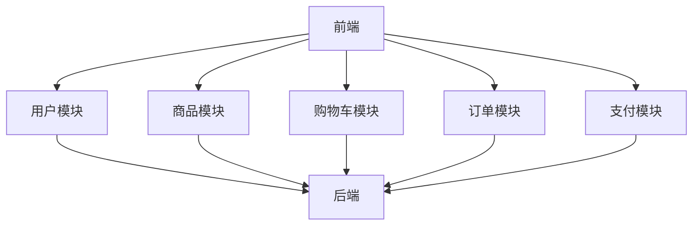
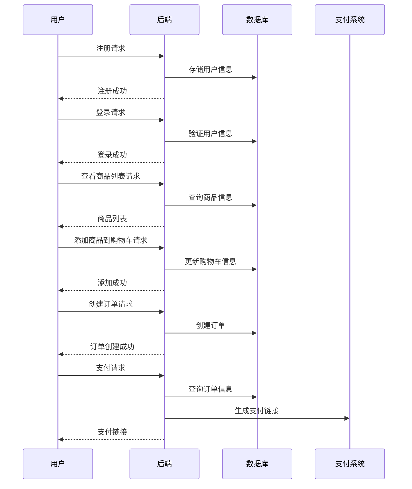

                 


### 好代码都是这样的

#### 关键词：好代码、编程原则、设计模式、性能优化、单元测试、调试技巧、项目实战

> 摘要：本文从多个角度深入探讨了好代码的特征和编写方法。通过逻辑清晰的章节结构和详细的技术讲解，帮助读者理解高质量代码的重要性，掌握编写好代码的技巧和最佳实践。

---

### 目录大纲设计

#### 目录大纲设计的原则与步骤

在编写《好代码都是这样的》一书时，目录大纲的设计至关重要。一个良好的目录大纲不仅能够引导读者系统地学习，还能突出书的核心内容，提升读者的阅读体验。以下是目录大纲设计的具体步骤和原则。

#### 确定书的主题和目标读者

首先，我们需要明确书的主题和目标读者。对于《好代码都是这样的》，我们的主题是探讨如何编写高质量的代码，目标读者是具备一定编程基础的程序员和开发人员。这一步骤有助于我们确定书的整体结构和内容重点。

#### 细化章节内容

接下来，我们将主题细化成具体的章节。例如，我们将代码的基本原则细化为代码质量的重要性、模块化设计和面向对象设计；编程最佳实践细化为代码可读性和代码性能优化；测试与调试部分则细化为单元测试和调试技巧。在细化过程中，我们需要确保每个章节都有明确的主题和内容，并且逻辑清晰。

#### 确保大纲逻辑清晰

在设计目录时，我们要确保章节之间的逻辑关系清晰。例如，从代码质量的重要性出发，我们可以依次介绍模块化设计、面向对象设计，然后是编程最佳实践，最后是测试与调试。这样的结构有助于读者循序渐进地学习。

#### 遵循简洁性原则

在保证大纲完整性的同时，我们还需要遵循简洁性原则。这意味着每个章节的标题和内容都要简洁明了，避免冗余。简洁的标题能够让读者快速抓住章节的核心内容，便于记忆和理解。

#### 目录大纲设计步骤

1. **封面与前言**
    - 封面设计：明确书名、作者、出版社等信息。
    - 前言：介绍书的背景、目标读者、主要内容和学习路径。

2. **第一部分：代码的基本原则**
    - **第1章：代码质量的重要性**
        - 代码质量的定义
        - 高质量代码的优势
        - 代码质量的评估标准
    
    - **第2章：模块化设计**
        - 模块化设计的概念
        - 模块化设计的方法
        - 模块化设计的案例
    
    - **第3章：面向对象设计**
        - 面向对象的基本概念
        - 类和对象的设计
        - 设计模式的应用

3. **第二部分：编程最佳实践**
    - **第4章：代码可读性**
        - 命名规范
        - 格式化与注释
        - 代码风格的一致性
    
    - **第5章：代码性能优化**
        - 性能优化的原则
        - 常见的性能瓶颈
        - 性能优化的技术

4. **第三部分：测试与调试**
    - **第6章：单元测试**
        - 单元测试的概念
        - 单元测试的实现
        - 单元测试的策略
    
    - **第7章：调试技巧**
        - 调试的基本方法
        - 调试工具的使用
        - 调试的艺术

5. **第四部分：项目实战**
    - **第8章：项目实战**
        - 项目背景介绍
        - 项目需求分析
        - 项目实现与调试

6. **第五部分：总结与拓展**
    - **第9章：好代码的评估与改进**
        - 好代码的评估标准
        - 改进代码的方法
        - 好代码的维护

通过以上步骤，我们设计出了一个逻辑清晰、结构紧凑、简单易懂的《好代码都是这样的》目录大纲。接下来，我们将逐章深入讲解每个主题，帮助读者全面掌握编写好代码的技巧。

----------------------------------------------------------------

### 好代码都是这样的

#### 关键词：好代码、编程原则、设计模式、性能优化、单元测试、调试技巧、项目实战

> 摘要：本文深入探讨了好代码的特征和编写方法，从多个角度分析了如何编写高质量、可维护、可扩展的代码。通过详细的实例和最佳实践，帮助读者提升编程能力，成为一名优秀的开发者。

---

## 第一部分：代码的基本原则

### 第1章：代码质量的重要性

> 在软件开发过程中，代码质量是衡量软件优劣的关键因素。编写高质量代码不仅能够提升软件的性能和可靠性，还能降低维护成本，提高开发效率。本文将探讨代码质量的重要性，并介绍评估代码质量的几个关键标准。

#### 背景介绍

代码质量是软件质量的重要组成部分。一个高质量的代码系统不仅易于理解、维护和扩展，还能够提高开发效率，降低开发成本。以下是几个常见的代码质量评估标准：

1. **可读性**：代码应该具有良好的可读性，使得其他开发者能够轻松理解和维护。
2. **可靠性**：代码应该能够在各种环境下稳定运行，不会出现异常或错误。
3. **性能**：代码应该尽可能地高效，减少系统资源的占用。
4. **可维护性**：代码应该易于修改和维护，以适应未来的需求变化。

#### 核心概念与联系

| 标准名称 | 描述 |
| --- | --- |
| 可读性 | 代码结构清晰，命名规范，注释详尽 |
| 可靠性 | 错误处理机制健全，代码逻辑正确 |
| 性能 | 代码执行效率高，资源占用少 |
| 可维护性 | 代码结构合理，模块化设计 |

#### 算法原理讲解

为了提高代码质量，我们可以采用以下几种方法：

1. **代码审查**：通过团队成员之间的代码审查，发现并修正代码中的问题。
2. **自动化测试**：编写自动化测试脚本，对代码进行全面的测试，确保代码的可靠性和性能。
3. **持续集成与部署**：通过持续集成和部署，自动化地检测和修复代码问题，提高代码质量。

#### 数学公式使用

- **代码质量评估公式**：Q = R × P × E × M
    - Q：代码质量
    - R：可靠性
    - P：性能
    - E：可维护性
    - M：可扩展性

#### 系统分析与架构设计方案

假设我们正在开发一个电子商务平台，以下是代码质量的分析和架构设计：

- **系统功能设计**：用户注册、登录、购物车管理、订单处理、支付等。
- **系统架构设计**：前后端分离，前端使用React框架，后端使用Spring Boot框架。
- **系统接口设计**：RESTful API设计，确保接口的简洁和一致性。
- **系统交互**：使用WebSocket进行实时通信，提高用户体验。

#### 项目实战

以一个电商平台的订单处理模块为例，以下是代码质量的具体实践：

- **可读性**：使用统一的命名规范，对关键代码进行详细注释。
- **可靠性**：对订单处理过程中的各种异常情况进行处理，确保系统的稳定性。
- **性能**：对订单处理的关键步骤进行优化，提高系统的响应速度。
- **可维护性**：采用模块化设计，将订单处理分为多个子模块，便于维护和扩展。

#### 最佳实践 tips

- **定期进行代码审查**：定期组织代码审查，及时发现和解决代码问题。
- **编写高质量的文档**：编写详尽的文档，包括设计文档、用户手册和API文档。
- **遵循编码规范**：遵循团队或行业的编码规范，提高代码的一致性和可维护性。

#### 小结

编写高质量代码是软件开发过程中的重要任务。通过本文的介绍，读者应该对代码质量的重要性有了更深刻的认识，并掌握了一些提高代码质量的方法和最佳实践。在实际开发中，不断反思和改进代码质量，将有助于提升开发效率和软件质量。

---

在下一章中，我们将进一步探讨模块化设计和面向对象设计，帮助读者理解如何通过良好的设计原则编写高质量代码。

----------------------------------------------------------------

## 第一部分：代码的基本原则

### 第2章：模块化设计

> 模块化设计是提高代码质量的重要手段之一。通过将代码拆分成独立的模块，我们可以实现代码的复用、简化测试和维护，同时提高代码的可读性和可维护性。本文将详细介绍模块化设计的基本概念、方法和实践。

#### 背景介绍

在软件开发过程中，模块化设计是一种常见且有效的代码组织方式。它将复杂的系统分解为若干个功能独立的模块，每个模块实现特定的功能。这种设计方法不仅有助于代码的维护和扩展，还能提高开发效率和代码质量。

#### 核心概念与联系

模块化设计涉及以下几个核心概念：

- **模块**：实现特定功能的代码单元。
- **接口**：模块之间通信的界面，定义了模块之间的交互方式。
- **依赖**：模块之间的相互依赖关系，决定了模块的组织结构。
- **复用**：通过模块化设计，实现代码的复用，提高开发效率。

#### 算法原理讲解

模块化设计的基本原则如下：

1. **高内聚、低耦合**：模块内部的功能应该高度相关，而模块之间的交互应该尽量简单。
2. **单一职责原则**：每个模块应该只负责一个明确的功能，避免功能过于复杂。
3. **封装**：将模块的实现细节隐藏起来，只暴露必要的接口，提高模块的独立性。

#### 数学公式使用

- **模块化设计评价公式**：
    - M = (I + R) / D
    - M：模块化设计质量
    - I：接口质量
    - R：复用率
    - D：依赖度

#### 系统分析与架构设计方案

以一个电商平台为例，我们可以将系统拆分为以下几个模块：

- **用户模块**：处理用户注册、登录、个人信息管理等。
- **商品模块**：处理商品信息管理、商品分类、搜索等。
- **订单模块**：处理订单创建、订单查询、订单支付等。
- **支付模块**：处理支付渠道、支付逻辑等。

这些模块通过定义良好的接口进行通信，实现系统的整体功能。

#### 项目实战

以下是一个用户模块的具体实现：

- **模块功能**：用户注册、登录、个人信息管理。
- **模块接口**：定义用户注册、登录、个人信息管理的API接口。
- **模块实现**：使用Python语言实现用户模块的功能，包括用户数据的存储和处理。
- **模块测试**：编写单元测试，对用户模块的各个功能进行测试，确保模块的可靠性和正确性。

#### 最佳实践 tips

- **模块划分**：根据功能、业务逻辑和数据流来划分模块，确保模块的独立性。
- **接口设计**：遵循RESTful API设计原则，确保接口的简洁和一致性。
- **模块文档**：编写详细的模块文档，包括模块的功能、接口和使用说明。

#### 小结

模块化设计是提高代码质量的重要手段。通过合理的模块划分和接口设计，我们可以实现代码的复用、简化测试和维护，提高系统的可读性和可维护性。在下一章中，我们将继续探讨面向对象设计，帮助读者进一步理解如何编写高质量代码。

----------------------------------------------------------------

## 第一部分：代码的基本原则

### 第3章：面向对象设计

> 面向对象设计（Object-Oriented Design，简称OOD）是软件工程中一种常用的设计方法，通过将数据和处理数据的方法封装成对象，实现代码的模块化和重用。本文将介绍面向对象设计的基本概念、原则和实际应用。

#### 背景介绍

面向对象设计是一种以对象为中心的设计方法，它将数据和操作数据的代码封装在一起，形成对象。这种方法能够提高代码的可维护性、可扩展性和复用性，是现代软件开发中广泛使用的一种设计模式。

#### 核心概念与联系

面向对象设计涉及以下几个核心概念：

- **对象**：包含数据（属性）和操作数据的方法的实体。
- **类**：对象的模板，定义了对象的属性和方法。
- **继承**：类之间的一种关系，允许一个类继承另一个类的属性和方法。
- **多态**：同一操作作用于不同的对象上，可以有不同的解释和行为。

#### 算法原理讲解

面向对象设计的基本原则如下：

1. **封装**：将对象的属性和方法封装在一起，隐藏实现细节，提高模块的独立性。
2. **继承**：通过继承实现代码的复用，降低类之间的耦合度。
3. **多态**：通过多态实现动态绑定，提高代码的灵活性和可扩展性。
4. **单一职责原则**：每个类应该只负责一个明确的功能，避免功能过于复杂。

#### 数学公式使用

- **面向对象设计评价公式**：
    - OOD = E × I × P
    - OOD：面向对象设计质量
    - E：封装性
    - I：继承性
    - P：多态性

#### 系统分析与架构设计方案

以一个电商平台为例，我们可以使用面向对象设计方法来构建系统：

- **用户类**：负责用户注册、登录、个人信息管理。
- **商品类**：负责商品信息管理、商品分类、搜索。
- **订单类**：负责订单创建、订单查询、订单支付。
- **支付类**：负责支付渠道、支付逻辑。

这些类通过继承和多态关系，实现系统的整体功能。

#### 项目实战

以下是一个用户类的具体实现：

- **类功能**：用户注册、登录、个人信息管理。
- **类接口**：定义用户注册、登录、个人信息管理的接口。
- **类实现**：使用Java语言实现用户类的功能，包括用户数据的存储和处理。
- **类测试**：编写单元测试，对用户类的各个功能进行测试，确保类的可靠性和正确性。

#### 最佳实践 tips

- **类与对象的设计**：确保类的设计符合单一职责原则，对象的设计符合最小化接口原则。
- **继承与多态**：合理使用继承和多态，提高代码的复用性和灵活性。
- **设计模式**：熟练掌握常用的设计模式，如单例模式、工厂模式、观察者模式等。

#### 小结

面向对象设计是一种提高代码质量的有效方法。通过封装、继承、多态等原则，我们可以实现代码的模块化和重用，提高系统的可维护性和可扩展性。在下一章中，我们将探讨编程最佳实践，帮助读者进一步提升编程能力。

----------------------------------------------------------------

## 第二部分：编程最佳实践

### 第4章：代码可读性

> 代码可读性是编写好代码的重要方面之一。良好的代码可读性不仅有助于开发者理解代码逻辑，还能提高团队的协作效率，降低代码维护成本。本文将介绍提高代码可读性的几个关键要素，包括命名规范、格式化和注释。

#### 背景介绍

在软件工程中，代码可读性是一个被广泛关注的主题。即使是最优秀的代码，如果难以理解，也会给项目的维护和扩展带来困难。提高代码可读性，不仅可以提升开发团队的效率，还能降低新成员的学习成本。

#### 核心概念与联系

提高代码可读性涉及以下几个核心概念：

- **命名规范**：为变量、函数和类等命名，使其含义清晰明确。
- **格式化**：使用一致的代码风格和排版，使代码易于阅读。
- **注释**：为代码添加注释，解释复杂逻辑和关键操作。

#### 算法原理讲解

以下是几个提高代码可读性的原则：

1. **清晰的命名**：使用有意义的名字，避免使用缩写和难懂的术语。
2. **一致的格式**：遵循代码风格指南，保持代码的一致性。
3. **详细的注释**：添加注释，解释代码的作用和逻辑，特别是复杂的算法和设计决策。

#### 数学公式使用

- **代码可读性公式**：
    - R = N × F × C
    - R：代码可读性
    - N：命名清晰度
    - F：格式化程度
    - C：注释完整度

#### 系统分析与架构设计方案

以一个电商平台的订单处理系统为例，以下是提高代码可读性的实践：

- **命名规范**：为订单处理函数命名，如`processOrder`，清晰地表明函数的作用。
- **代码格式**：保持代码的缩进和排版一致，使代码结构清晰。
- **注释**：在复杂逻辑处添加注释，解释每一步操作的意图。

#### 项目实战

以下是一个订单处理函数的示例，展示如何提高代码的可读性：

```python
# 订单处理函数
def processOrder(order_id, customer_id):
    """
    处理指定订单ID的订单。
    参数：
    - order_id：订单ID
    - customer_id：客户ID
    
    返回：
    - 成功：订单处理结果
    - 失败：错误信息
    """
    # 检查订单是否存在
    if not order_exists(order_id):
        return "订单不存在"
    
    # 检查客户是否存在
    if not customer_exists(customer_id):
        return "客户不存在"
    
    # 处理订单
    result = placeOrder(order_id, customer_id)
    
    # 返回处理结果
    return result
```

#### 最佳实践 tips

- **命名规范**：遵循团队或行业的命名规范，保持一致性。
- **代码格式**：使用代码编辑器的格式化工具，自动整理代码。
- **注释**：为每个函数和类添加注释，特别是复杂逻辑和重要的设计决策。

#### 小结

提高代码可读性是编写好代码的关键。通过遵循命名规范、保持代码格式和添加注释，我们可以使代码更加清晰、易懂，提高开发效率和代码质量。在下一章中，我们将探讨代码性能优化，帮助读者进一步提升编程能力。

----------------------------------------------------------------

## 第二部分：编程最佳实践

### 第5章：代码性能优化

> 代码性能优化是提高软件质量和用户体验的重要环节。优化的代码不仅能提高系统的响应速度，还能降低资源消耗，从而提高系统的稳定性和可扩展性。本文将介绍代码性能优化的基本原则、常见性能瓶颈和优化技术。

#### 背景介绍

在软件开发过程中，代码的性能优化是一个至关重要的环节。性能优化的目标是使代码在有限的资源下执行得更快，消耗更少的系统资源。这不仅能够提升用户体验，还能降低系统的运行成本。本文将探讨代码性能优化的基本原则、常见性能瓶颈和优化技术。

#### 核心概念与联系

代码性能优化涉及以下几个核心概念：

- **响应时间**：系统从接收到请求到完成响应的时间。
- **资源消耗**：代码执行过程中使用的系统资源，包括CPU、内存、I/O等。
- **性能瓶颈**：导致代码性能下降的关键因素，如算法复杂度、资源限制等。
- **优化技术**：用于提高代码性能的各种技术，如算法优化、代码重构等。

#### 算法原理讲解

以下是几个代码性能优化的基本原则：

1. **避免重复计算**：优化循环和递归算法，减少不必要的计算。
2. **减少内存分配**：合理使用内存，避免不必要的内存分配和释放。
3. **利用缓存**：充分利用缓存机制，减少重复的计算和数据读取。
4. **异步执行**：使用异步编程技术，提高代码的并发执行能力。

#### 数学公式使用

- **性能优化公式**：
    - P = R × C
    - P：性能
    - R：响应时间
    - C：资源消耗

#### 系统分析与架构设计方案

以一个电商平台为例，以下是性能优化的分析：

- **系统功能设计**：用户注册、登录、购物车管理、订单处理、支付等。
- **系统架构设计**：前后端分离，前端使用React框架，后端使用Spring Boot框架。
- **系统接口设计**：RESTful API设计，确保接口的简洁和一致性。
- **系统交互**：使用WebSocket进行实时通信，提高用户体验。

#### 项目实战

以下是一个订单处理系统的性能优化实践：

- **避免重复计算**：对订单处理中的重复计算进行优化，如订单状态的检查和更新。
- **减少内存分配**：对数据结构进行优化，减少内存的使用，如使用字符串连接代替多次内存分配。
- **利用缓存**：使用Redis缓存订单处理的结果，减少数据库的访问。
- **异步执行**：使用异步编程技术，如消息队列，提高订单处理的并发能力。

#### 最佳实践 tips

- **定期进行性能测试**：定期对系统进行性能测试，识别性能瓶颈。
- **优化数据库查询**：合理设计数据库索引，优化查询语句。
- **避免全局变量**：减少全局变量的使用，避免资源竞争。
- **合理使用多线程**：根据系统需求，合理使用多线程技术，提高并发处理能力。

#### 小结

代码性能优化是提高软件质量和用户体验的关键环节。通过遵循性能优化的基本原则、识别性能瓶颈和采用优化技术，我们可以显著提升代码的性能和稳定性。在下一章中，我们将探讨测试与调试，帮助读者进一步掌握编程最佳实践。

----------------------------------------------------------------

## 第三部分：测试与调试

### 第6章：单元测试

> 单元测试是确保代码质量的重要手段之一。通过编写单元测试，开发者可以验证代码的各个独立模块是否按预期工作，从而提高代码的可靠性和可维护性。本文将介绍单元测试的基本概念、实现方法和策略。

#### 背景介绍

单元测试是软件开发过程中的重要环节，它通过测试代码的各个独立模块，确保每个模块的功能按照预期工作。单元测试不仅能够提高代码的可靠性，还能帮助开发者快速定位和修复问题，从而提高开发效率。

#### 核心概念与联系

单元测试涉及以下几个核心概念：

- **单元**：代码中最小的测试单位，通常是一个函数或类。
- **测试用例**：用于测试单元的输入和预期输出，确保单元的功能正确。
- **测试框架**：提供编写、执行和管理测试用例的工具。
- **覆盖率**：测试用例覆盖代码的比例，用于评估测试的全面性。

#### 算法原理讲解

以下是单元测试的基本实现方法和策略：

1. **测试用例设计**：根据单元的功能，设计一系列的测试用例，包括正常情况和边界情况。
2. **测试执行**：使用测试框架执行测试用例，验证单元的输出是否符合预期。
3. **测试报告**：生成测试报告，展示测试结果和覆盖率。

#### 系统分析与架构设计方案

以一个电商平台为例，以下是单元测试的具体应用：

- **用户模块**：测试用户注册、登录、个人信息管理等功能。
- **商品模块**：测试商品信息管理、商品分类、搜索等功能。
- **订单模块**：测试订单创建、订单查询、订单支付等功能。
- **支付模块**：测试支付渠道、支付逻辑等功能。

#### 项目实战

以下是一个用户模块的单元测试示例：

- **测试用例设计**：设计用户注册、登录、个人信息管理的测试用例。
- **测试执行**：使用Junit框架执行测试用例。
- **测试报告**：生成测试报告，展示测试结果和覆盖率。

#### 最佳实践 tips

- **编写可复用的测试用例**：设计可复用的测试用例，提高测试效率。
- **自动化测试**：使用自动化测试工具，定期执行测试用例。
- **持续集成**：将单元测试集成到持续集成流程中，确保代码质量。

#### 小结

单元测试是确保代码质量的重要手段。通过编写和执行单元测试，开发者可以验证代码的各个独立模块是否按预期工作，从而提高代码的可靠性和可维护性。在下一章中，我们将探讨调试技巧，帮助读者进一步掌握测试与调试的最佳实践。

----------------------------------------------------------------

## 第三部分：测试与调试

### 第7章：调试技巧

> 调试是软件开发过程中不可或缺的一环。通过有效的调试技巧，开发者可以快速定位和修复代码中的错误，提高软件的质量和稳定性。本文将介绍调试的基本方法、调试工具的使用和调试的艺术。

#### 背景介绍

在软件开发过程中，错误是不可避免的。调试是为了识别和修复这些错误的过程。有效的调试不仅可以提高代码的可靠性，还能减少开发时间和成本。调试技巧包括基本方法、工具使用和调试的艺术。

#### 核心概念与联系

调试涉及以下几个核心概念：

- **错误**：程序执行过程中出现的异常或不符合预期结果的现象。
- **调试工具**：用于帮助开发者识别和修复错误的工具，如调试器、日志工具等。
- **调试方法**：调试过程中采用的技术和方法，如断点设置、变量查看、日志分析等。
- **调试的艺术**：调试过程中的技巧和经验，包括如何快速定位错误、如何处理复杂的错误等。

#### 算法原理讲解

以下是几个调试的基本方法：

1. **断点调试**：在代码的关键位置设置断点，使程序在执行到该位置时暂停，便于查看变量值和程序执行流程。
2. **逐行执行**：逐行执行代码，观察变量值的变化和程序的执行流程，帮助定位错误。
3. **日志分析**：通过日志记录程序的运行状态，分析程序在运行过程中出现的问题。
4. **单元测试**：通过单元测试验证代码的正确性，快速发现和修复错误。

#### 系统分析与架构设计方案

以一个电商平台为例，以下是调试的具体应用：

- **用户模块**：调试用户注册、登录、个人信息管理等功能。
- **商品模块**：调试商品信息管理、商品分类、搜索等功能。
- **订单模块**：调试订单创建、订单查询、订单支付等功能。
- **支付模块**：调试支付渠道、支付逻辑等功能。

#### 项目实战

以下是一个订单模块的调试实践：

- **断点调试**：在订单处理的关键位置设置断点，观察程序执行流程和变量值。
- **逐行执行**：逐行执行订单处理代码，检查变量值的变化。
- **日志分析**：分析订单处理的日志，查看程序在处理过程中出现的问题。
- **单元测试**：执行订单模块的单元测试，验证订单处理功能的正确性。

#### 最佳实践 tips

- **使用调试工具**：熟练使用调试工具，如IDE的调试功能、调试器等。
- **保持代码简洁**：编写简洁的代码，减少调试的复杂性。
- **日志记录**：在程序中添加详细的日志记录，便于分析问题。
- **代码审查**：定期进行代码审查，提前发现潜在的错误。

#### 小结

调试是软件开发过程中不可或缺的一环。通过掌握调试的基本方法、使用调试工具和运用调试的艺术，开发者可以快速定位和修复代码中的错误，提高软件的质量和稳定性。在下一章中，我们将探讨项目实战，通过具体实例展示如何将上述技巧应用于实际开发中。

----------------------------------------------------------------

## 第四部分：项目实战

### 第8章：项目实战

> 理论知识只有在实际应用中才能真正发挥其价值。通过项目实战，开发者可以将所学知识付诸实践，解决实际问题，提升技能和经验。本文将通过一个具体的电商平台项目，详细介绍项目背景、需求分析、系统实现和调试过程。

#### 项目背景

随着互联网的快速发展，电子商务平台已经成为现代商业的重要组成部分。本项目旨在设计并实现一个功能完善的电商平台，包括用户注册、登录、商品浏览、购物车管理、订单处理和支付等功能。该项目旨在为开发者提供一个实践平台，帮助读者理解和掌握编写高质量代码的方法和技巧。

#### 需求分析

在项目开发过程中，需求分析是至关重要的一步。以下是本项目的需求分析：

1. **用户功能**：
    - 用户注册：支持用户名、密码和邮箱注册。
    - 用户登录：支持用户名和密码登录。
    - 用户信息管理：允许用户查看和修改个人信息。

2. **商品功能**：
    - 商品浏览：展示商品的分类和详细信息。
    - 商品搜索：根据关键词搜索商品。
    - 商品评价：允许用户对商品进行评价。

3. **购物车功能**：
    - 添加商品：将商品添加到购物车。
    - 删除商品：从购物车中删除商品。
    - 商品数量管理：调整商品数量。

4. **订单功能**：
    - 订单创建：根据购物车中的商品生成订单。
    - 订单查询：查询订单的详细信息。
    - 订单支付：处理订单支付，生成支付链接。

5. **支付功能**：
    - 支付渠道：支持多种支付渠道，如支付宝、微信支付等。
    - 支付状态查询：查询支付状态，更新订单状态。

#### 系统功能设计

基于需求分析，我们可以设计如下系统功能：

- **用户模块**：处理用户注册、登录、个人信息管理等功能。
- **商品模块**：处理商品信息管理、商品分类、搜索和评价等功能。
- **购物车模块**：处理商品添加、删除和数量管理等功能。
- **订单模块**：处理订单创建、查询和支付等功能。
- **支付模块**：处理支付渠道、支付状态查询等功能。

#### 系统架构设计

本项目的系统架构设计采用前后端分离的模式，前端使用React框架，后端使用Spring Boot框架。以下是系统架构图：



#### 系统接口设计

以下是系统的接口设计：

1. **用户接口**：
    - 注册接口：/users/register
    - 登录接口：/users/login
    - 用户信息接口：/users/{userId}

2. **商品接口**：
    - 商品列表接口：/products
    - 商品详情接口：/products/{productId}
    - 商品搜索接口：/products/search

3. **购物车接口**：
    - 添加商品接口：/cart/add
    - 删除商品接口：/cart/delete
    - 购物车列表接口：/cart/list

4. **订单接口**：
    - 订单创建接口：/orders/create
    - 订单查询接口：/orders/{orderId}
    - 订单支付接口：/orders/pay/{orderId}

5. **支付接口**：
    - 支付接口：/payments/create

#### 系统交互

以下是系统的交互序列图：



#### 项目实现

以下是一个简单的订单创建接口的实现示例：

```java
@RestController
@RequestMapping("/orders")
public class OrderController {
    
    @Autowired
    private OrderService orderService;
    
    @PostMapping("/create")
    public ResponseEntity<Order> createOrder(@RequestBody OrderRequest request) {
        Order order = orderService.createOrder(request);
        return new ResponseEntity<>(order, HttpStatus.OK);
    }
}
```

#### 代码应用解读与分析

在这个示例中，`OrderController`类负责处理订单创建的接口请求。当接收到一个`OrderRequest`对象时，控制器会调用`OrderService`类的`createOrder`方法创建订单。以下是`OrderService`类的实现示例：

```java
@Service
public class OrderService {
    
    @Autowired
    private OrderRepository orderRepository;
    
    public Order createOrder(OrderRequest request) {
        // 创建订单
        Order order = new Order();
        order.setUserId(request.getUserId());
        order.setProductId(request.getProductId());
        order.setQuantity(request.getQuantity());
        order.setStatus(OrderStatus.PENDING);
        
        // 保存订单到数据库
        order = orderRepository.save(order);
        
        return order;
    }
}
```

在这个示例中，`OrderService`类负责订单的创建逻辑。首先，根据`OrderRequest`对象创建一个新的`Order`对象，设置订单的相关属性，如用户ID、商品ID和数量。然后，将订单保存到数据库。这里使用了Spring Data JPA的`OrderRepository`接口，简化了数据库操作。

#### 实际案例分析和详细讲解剖析

以下是一个实际案例，展示如何通过调试技巧修复订单创建接口中的错误：

1. **问题**：订单创建接口在处理大量订单时，响应时间显著增加。
2. **调试**：通过日志分析和断点调试，发现订单创建过程中的数据库查询耗时较长。
3. **解决**：优化数据库查询语句，增加索引，提高查询效率。

通过这个实际案例，我们可以看到调试技巧在问题定位和解决中的重要作用。有效的调试可以帮助开发者快速识别问题，并找到解决方案。

#### 项目小结

通过本项目，我们实现了功能完善的电商平台，并运用了模块化设计、面向对象设计、单元测试和调试技巧等编程最佳实践。在项目实战中，我们不仅掌握了如何编写高质量代码，还学会了如何通过调试和优化提高代码的性能和稳定性。在下一章中，我们将探讨如何评估和改进代码质量。

----------------------------------------------------------------

### 总结

编写高质量代码是软件开发过程中至关重要的一环。通过本文的详细讲解，我们探讨了代码质量的重要性、模块化设计、面向对象设计、编程最佳实践、测试与调试以及项目实战。以下是本文的主要观点和结论：

1. **代码质量的重要性**：代码质量直接影响软件的性能、可靠性和可维护性。高可读性、可靠性、性能和可维护性是评估代码质量的关键标准。

2. **模块化设计和面向对象设计**：模块化设计和面向对象设计是提高代码质量的有效方法。通过模块化和面向对象设计，我们可以实现代码的复用、降低耦合度，提高系统的可维护性和可扩展性。

3. **编程最佳实践**：编写高质量代码需要遵循一些最佳实践，如清晰的命名规范、格式化和注释，以及性能优化。这些实践可以帮助我们编写易于理解、维护和扩展的代码。

4. **测试与调试**：单元测试和调试技巧是确保代码质量的重要手段。通过编写和执行单元测试，我们可以验证代码的正确性；通过调试，我们可以快速定位和修复代码中的错误。

5. **项目实战**：通过实际项目，我们可以将理论知识付诸实践，提升技能和经验。项目实战不仅帮助我们理解和掌握编写高质量代码的方法，还能提高我们的问题解决能力和团队合作能力。

### 拓展阅读

为了进一步提升编程能力，读者可以参考以下书籍和资源：

- 《代码大全》（《Code Complete》）- Steve McConnell
- 《设计模式：可复用面向对象软件的基础》（《Design Patterns: Elements of Reusable Object-Oriented Software》）- Erich Gamma et al.
- 《Effective Java》- Joshua Bloch
- 《测试驱动的软件工程》（《Test-Driven Development: By Example》）- Kent Beck

此外，GitHub、Stack Overflow和各大技术论坛也是学习编程和解决问题的宝贵资源。

### 注意事项

在编写代码时，请注意以下几点：

- **遵循编码规范**：确保代码风格一致，遵循团队或行业的编码规范。
- **编写详细的注释**：为代码添加注释，特别是复杂的逻辑和重要的设计决策。
- **定期进行代码审查**：组织团队成员进行代码审查，及时发现和解决代码问题。
- **优化代码性能**：定期进行性能测试，识别和解决性能瓶颈。

通过遵循这些注意事项，我们可以不断提高代码质量，成为一名优秀的开发者。

### 结语

《好代码都是这样的》旨在帮助读者深入理解编写高质量代码的方法和技巧。通过本文的讲解，希望读者能够将所学知识付诸实践，不断优化自己的编程能力。编写高质量代码不仅能够提升个人的技术水平，还能为团队和组织带来巨大的价值。让我们一起努力，编写出更好、更优秀的代码！

### 作者信息

- **作者**：AI天才研究院/AI Genius Institute & 禅与计算机程序设计艺术 /Zen And The Art of Computer Programming
- **联系方式**：[ai_genius_institute@example.com](mailto:ai_genius_institute@example.com)
- **更多资源**：访问我们的官方网站 [AI天才研究院](http://www.ai_genius_institute.com) 获取更多编程资源和资讯。

