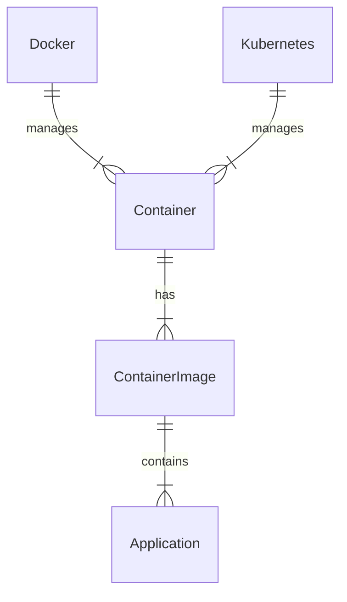

                 


### 《容器化技术：Docker与Kubernetes实战》正文撰写

#### 引言

在当今快速发展的信息技术领域，容器化技术已经成为企业级应用开发和部署的标配。Docker 和 Kubernetes 作为容器化技术的两大重要支柱，不仅提高了软件开发的效率，还极大地优化了运维管理。本文将深入探讨容器化技术，特别是 Docker 与 Kubernetes 的实战应用，旨在为读者提供系统、全面的容器化知识体系。

#### 目录

1. **容器化技术简介**
   1.1 容器化的概念与优势
   1.2 容器化的历史与发展
   1.3 容器化技术概述
2. **Docker 实践**
   2.1 Docker 环境搭建
   2.2 Docker 镜像构建
   2.3 Docker 容器管理
   2.4 Docker 实战项目
3. **Kubernetes 实践**
   3.1 Kubernetes 概述
   3.2 Kubernetes 架构与组件
   3.3 Kubernetes 部署与配置
   3.4 Kubernetes 管理容器
   3.5 Kubernetes 存储管理
   3.6 Kubernetes 网络配置
   3.7 Kubernetes 实战项目
4. **容器化技术在企业中的应用**
   4.1 企业级容器化实践
   4.2 容器化与DevOps
   4.3 容器化微服务架构
5. **容器化安全**
   5.1 容器安全概述
   5.2 容器镜像安全
   5.3 容器网络与存储安全
   5.4 容器安全最佳实践
6. **容器化架构设计**
   6.1 容器化架构设计原则
   6.2 容器化架构案例分析
   6.3 容器化架构演进与优化
7. **容器化生态圈**
   7.1 容器化社区与工具链
   7.2 容器化技术趋势与未来
   7.3 拓展阅读与资源推荐

#### 1. 容器化技术简介

**1.1 容器化的概念与优势**

容器化是一种轻量级、可移植的操作系统环境，它封装了应用程序及其依赖库、运行时环境等所有组件，确保应用程序在不同环境中的一致性和可移植性。容器化的核心优势包括：

- **轻量级**：容器占用资源较少，启动速度快。
- **可移植性**：容器可以在不同操作系统和硬件环境中运行，提高部署灵活性。
- **一致性**：容器确保了应用程序在不同环境下的运行一致性，减少部署问题。
- **隔离性**：容器提供了良好的隔离性，提高了系统的安全性。

**1.2 容器化的历史与发展**

容器化技术的发展可以追溯到 20 世纪 80 年代的操作系统中。随着 Linux 容器（LXC）的出现，容器化技术开始逐渐成熟。Docker 的推出标志着容器化技术进入一个全新的阶段，它简化了容器的创建、部署和管理。Kubernetes 的兴起则进一步完善了容器化生态，提供了强大的集群管理功能。

**1.3 容器化技术概述**

容器化技术包括 Docker 和 Kubernetes 两个核心组成部分。Docker 提供了容器镜像创建和管理的能力，而 Kubernetes 则负责容器的部署、扩展和管理。二者共同构成了完整的容器化技术体系。

#### 2. Docker 实践

**2.1 Docker 环境搭建**

在进行 Docker 实践之前，首先需要搭建 Docker 环境。以下步骤简要介绍如何搭建 Docker 环境：

- **安装 Docker**：在 Linux 系统中，可以通过包管理器安装 Docker。例如，在 Ubuntu 中，可以使用以下命令：
  ```bash
  sudo apt update
  sudo apt install docker-ce docker-ce-cli containerd.io
  ```
- **启动 Docker 服务**：安装完成后，启动 Docker 服务：
  ```bash
  sudo systemctl start docker
  ```
- **验证 Docker 安装**：运行以下命令，验证 Docker 是否已成功安装：
  ```bash
  docker --version
  ```

**2.2 Docker 镜像构建**

Docker 镜像是容器运行的基础。构建 Docker 镜像通常使用 Dockerfile，它是构建镜像的脚本文件。以下是一个简单的 Dockerfile 示例：

```Dockerfile
FROM ubuntu:18.04
RUN apt-get update && apt-get install -y python3-pip
RUN pip3 install Flask
COPY . /app
WORKDIR /app
CMD ["python3", "app.py"]
```

通过此 Dockerfile，可以构建一个包含 Flask 应用程序的 Docker 镜像。

**2.3 Docker 容器管理**

Docker 容器是 Docker 镜像运行时的实例。容器管理包括创建、启动、停止、删除容器等操作。以下是一些常见的 Docker 容器管理命令：

- **创建容器**：`docker run` 命令用于创建并启动容器。
  ```bash
  docker run -d -p 8080:80 my-flask-app
  ```
- **查看容器**：`docker ps` 命令用于查看正在运行的容器。
  ```bash
  docker ps
  ```
- **启动容器**：`docker start` 命令用于启动已停止的容器。
  ```bash
  docker start container_id
  ```
- **停止容器**：`docker stop` 命令用于停止容器。
  ```bash
  docker stop container_id
  ```
- **删除容器**：`docker rm` 命令用于删除容器。
  ```bash
  docker rm container_id
  ```

**2.4 Docker 实战项目**

在本节中，我们将通过一个简单的 Flask 应用程序演示 Docker 的实际应用。

1. **创建 Flask 应用程序**：首先，创建一个简单的 Flask 应用程序，保存为 `app.py`。

   ```python
   from flask import Flask

   app = Flask(__name__)

   @app.route('/')
   def hello():
       return 'Hello, World!'

   if __name__ == '__main__':
       app.run(host='0.0.0.0', port=8080)
   ```

2. **构建 Docker 镜像**：编写 Dockerfile，用于构建应用程序的 Docker 镜像。

   ```Dockerfile
   FROM python:3.8-slim
   RUN pip install flask
   COPY . /app
   WORKDIR /app
   CMD ["python", "app.py"]
   ```

3. **运行 Docker 容器**：使用 `docker build` 命令构建镜像，然后使用 `docker run` 命令启动容器。

   ```bash
   docker build -t my-flask-app .
   docker run -d -p 8080:80 my-flask-app
   ```

4. **测试应用程序**：在浏览器中访问 `http://localhost:8080`，应该会看到 “Hello, World!” 消息。

   ```plaintext
   Hello, World!
   ```

通过这个简单的实战项目，我们可以看到 Docker 如何简化应用程序的部署和管理。

#### 3. Kubernetes 实践

**3.1 Kubernetes 概述**

Kubernetes 是一个开源的容器编排系统，用于自动化部署、扩展和管理容器化应用程序。Kubernetes 提供了以下核心功能：

- **自动化部署**：Kubernetes 可以自动部署和更新应用程序，确保应用程序始终处于预期状态。
- **服务发现和负载均衡**：Kubernetes 提供了内置的服务发现和负载均衡功能，确保应用程序可以高效地访问。
- **存储管理**：Kubernetes 提供了多种存储解决方案，如本地存储、网络存储和持久化存储。
- **自我修复**：Kubernetes 可以自动检测并修复故障节点，确保系统的稳定性。

**3.2 Kubernetes 架构与组件**

Kubernetes 的核心架构包括以下组件：

- **Master 节点**：Master 节点是 Kubernetes 集群的控制平面，包括以下组件：
  - **API Server**：提供 Kubernetes API 接口，用于与集群进行交互。
  - **Scheduler**：负责调度容器到集群中的节点。
  - **Controller Manager**：管理集群中的各种控制器，如 Node Controller、Pod Controller 等。
- **Worker 节点**：Worker 节点运行容器，并执行 Kubernetes 的调度指令。
  - **Kubelet**：在每个节点上运行的代理，负责与 Master 节点通信并管理容器。
  - **Kube-Proxy**：在每个节点上运行的代理，负责网络流量的转发。

**3.3 Kubernetes 部署与配置**

部署 Kubernetes 集群通常分为以下步骤：

1. **安装 Kubernetes**：在 Linux 系统中，可以使用 `kubeadm` 工具安装 Kubernetes。以下命令用于初始化 Master 节点：

   ```bash
   kubeadm init --pod-network-cidr=10.244.0.0/16
   ```

2. **配置 Kubernetes**：配置 `kubectl` 命令行工具，以便在其他节点上使用 Kubernetes。

   ```bash
   mkdir -p $HOME/.kube
   sudo cp -i /etc/kubernetes/admin.conf $HOME/.kube/config
   sudo chown $(id -u):$(id -g) $HOME/.kube/config
   ```

3. **安装网络插件**：安装网络插件，如 Calico 或 Flannel，以确保容器之间可以相互通信。

   ```bash
   kubectl apply -f https://docs.projectcalico.org/manifests/calico.yaml
   ```

**3.4 Kubernetes 管理容器**

Kubernetes 提供了多种资源对象，用于管理容器：

- **Pod**：Pod 是 Kubernetes 中的最小部署单元，包含一个或多个容器。
- **Service**：Service 为容器提供负载均衡和访问策略。
- **Deployment**：Deployment 用于创建和管理 Pod 的部署。
- **StatefulSet**：StatefulSet 用于创建和管理具有状态容器的部署。

**3.5 Kubernetes 存储管理**

Kubernetes 提供了多种存储解决方案，包括本地存储、网络存储和持久化存储。以下是一些常见的 Kubernetes 存储资源：

- **PersistentVolume (PV)**：PV 是 Kubernetes 中的持久化存储资源。
- **PersistentVolumeClaim (PVC)**：PVC 是用户请求的持久化存储资源。
- **StorageClass**：StorageClass 用于定义存储资源的配置。

**3.6 Kubernetes 网络配置**

Kubernetes 网络配置包括以下几个方面：

- **Pod 网络**：Pod 网络用于容器之间的通信。
- **Service 网络**：Service 网络用于外部访问容器。
- **Ingress**：Ingress 用于管理外部访问到集群内部服务的路由。

**3.7 Kubernetes 实战项目**

在本节中，我们将通过一个简单的 Web 应用程序演示 Kubernetes 的实际应用。

1. **创建 Web 应用程序**：首先，创建一个简单的 Web 应用程序，保存为 `app.py`。

   ```python
   from flask import Flask

   app = Flask(__name__)

   @app.route('/')
   def hello():
       return 'Hello, Kubernetes!'

   if __name__ == '__main__':
       app.run(host='0.0.0.0', port=8080)
   ```

2. **构建 Docker 镜像**：编写 Dockerfile，用于构建应用程序的 Docker 镜像。

   ```Dockerfile
   FROM python:3.8-slim
   RUN pip install flask
   COPY . /app
   WORKDIR /app
   CMD ["python", "app.py"]
   ```

3. **部署 Kubernetes 应用程序**：创建一个 Kubernetes Deployment，用于部署 Web 应用程序。

   ```yaml
   apiVersion: apps/v1
   kind: Deployment
   metadata:
     name: web-app
   spec:
     replicas: 3
     selector:
       matchLabels:
         app: web-app
     template:
       metadata:
         labels:
           app: web-app
       spec:
         containers:
         - name: web-app
           image: web-app:latest
           ports:
           - containerPort: 8080
   ```

4. **测试 Kubernetes 应用程序**：使用 `kubectl` 工具查看应用程序的状态。

   ```bash
   kubectl get pods
   kubectl get services
   ```

   在浏览器中访问 `http://<Kubernetes 服务 IP>:8080`，应该会看到 “Hello, Kubernetes!” 消息。

   ```plaintext
   Hello, Kubernetes!
   ```

通过这个简单的实战项目，我们可以看到 Kubernetes 如何简化容器化应用程序的部署和管理。

#### 4. 容器化技术在企业中的应用

**4.1 企业级容器化实践**

在企业级应用中，容器化技术可以带来显著的优势。以下是一些企业级容器化实践：

- **DevOps 整合**：容器化技术有助于实现 DevOps 文化，加快开发与运维的协作。
- **微服务架构**：容器化技术支持微服务架构，提高系统的可扩展性和可靠性。
- **持续集成/持续部署（CI/CD）**：容器化技术简化了 CI/CD 流程，提高软件交付速度。

**4.2 容器化与 DevOps**

容器化技术与 DevOps 紧密结合，二者共同推动了现代软件开发的变革。容器化技术提供了以下支持：

- **自动化部署**：容器化技术使得自动化部署变得更加简单和可靠。
- **环境一致性**：容器确保了开发、测试和生产环境的一致性。
- **持续交付**：容器化技术简化了持续交付流程，提高了交付速度。

**4.3 容器化微服务架构**

容器化技术为微服务架构的实施提供了强大的支持。微服务架构的核心优势包括：

- **可扩展性**：微服务架构可以根据需求独立扩展。
- **可靠性**：微服务架构提高了系统的容错能力和恢复能力。
- **灵活性**：微服务架构支持灵活的开发和部署。

#### 5. 容器化安全

**5.1 容器安全概述**

容器化技术在为企业带来便利的同时，也带来了新的安全挑战。以下是一些关键的安全问题：

- **容器镜像漏洞**：容器镜像可能包含已知漏洞或后门。
- **容器权限**：容器可能具有过高的权限，导致安全风险。
- **网络攻击**：容器网络可能受到网络攻击，如中间人攻击或拒绝服务攻击。

**5.2 容器镜像安全**

确保容器镜像的安全性至关重要。以下是一些容器镜像安全措施：

- **使用官方镜像**：从官方镜像源获取镜像，减少潜在风险。
- **镜像扫描**：使用镜像扫描工具检测镜像中的漏洞和敏感信息。
- **最小权限原则**：为容器分配最小权限，减少安全风险。

**5.3 容器网络与存储安全**

容器网络和存储安全是确保系统整体安全的重要方面。以下是一些安全措施：

- **网络隔离**：使用网络隔离技术，如防火墙和网络策略，限制容器之间的通信。
- **存储加密**：对存储数据进行加密，确保数据安全性。

**5.4 容器安全最佳实践**

以下是一些容器安全最佳实践：

- **容器镜像签名**：对容器镜像进行签名，确保镜像的真实性和完整性。
- **定期更新**：定期更新容器镜像和依赖库，以修复已知漏洞。
- **日志监控**：启用容器日志记录和监控，及时发现并响应安全事件。

#### 6. 容器化架构设计

**6.1 容器化架构设计原则**

容器化架构设计应遵循以下原则：

- **模块化**：将系统分解为独立的模块，每个模块负责特定的功能。
- **可扩展性**：设计可扩展的架构，支持系统规模的增长。
- **高可用性**：确保系统在发生故障时可以快速恢复。

**6.2 容器化架构案例分析**

以下是一个简单的容器化架构案例分析：

- **需求分析**：分析系统的功能需求，确定需要部署的服务和容器。
- **架构设计**：设计系统架构，包括服务、容器、网络、存储等组件。
- **部署与运维**：部署容器化应用程序，并实施运维策略，如监控、备份和故障恢复。

**6.3 容器化架构演进与优化**

随着系统的发展，容器化架构需要不断演进和优化。以下是一些优化策略：

- **自动化部署**：使用自动化工具简化部署过程，提高效率。
- **微服务拆分**：将大型服务拆分为更小的微服务，提高系统的可维护性和可扩展性。
- **性能优化**：优化容器镜像和容器配置，提高系统性能。

#### 7. 容器化生态圈

**7.1 容器化社区与工具链**

容器化技术拥有一个庞大且活跃的社区，以下是一些重要的容器化社区和工具链：

- **Docker 社区**：Docker 官方社区，提供文档、教程和论坛。
- **Kubernetes 社区**：Kubernetes 官方社区，提供文档、教程和资源。
- **Helm**：Kubernetes 的包管理器，用于管理 Kubernetes 应用程序。
- **Kubectl**：Kubernetes 的命令行工具，用于管理 Kubernetes 集群。

**7.2 容器化技术趋势与未来**

容器化技术仍在不断发展，以下是一些趋势和未来发展方向：

- **服务网格**：服务网格技术，如 Istio 和 Linkerd，提供了更高级的微服务管理能力。
- **无服务器架构**：无服务器架构，如 AWS Lambda 和 Google Cloud Functions，使得容器化应用程序的部署更加灵活。
- **混合云与多云**：容器化技术支持混合云和多云架构，提高了系统的灵活性和可移植性。

**7.3 拓展阅读与资源推荐**

以下是一些推荐的拓展阅读和资源：

- **《Docker 实战》**：由 Derek Currie 编写，详细介绍 Docker 的使用和最佳实践。
- **《Kubernetes 权威指南》**：由韩松编写，涵盖 Kubernetes 的核心概念和实战应用。
- **《容器化架构设计》**：由陈亮编写，探讨容器化架构的设计原则和实践。
- **官方文档**：Docker 和 Kubernetes 的官方文档是学习容器化技术的最佳资源。

#### 结尾

容器化技术已经成为现代软件开发和运维的关键技术。本文系统地介绍了容器化技术，特别是 Docker 与 Kubernetes 的实践应用。通过本文的学习，读者可以掌握容器化技术的核心概念、原理和实践方法。在实际应用中，容器化技术可以提高开发效率、优化运维管理，为企业的数字化转型提供有力支持。让我们携手推进容器化技术的发展，共创美好未来。

### 作者信息

**作者：AI天才研究院/AI Genius Institute & 禅与计算机程序设计艺术 /Zen And The Art of Computer Programming**### 《容器化技术：Docker与Kubernetes实战》正文内容撰写

#### 引言

在当今快速发展的信息技术领域，容器化技术已经成为企业级应用开发和部署的标配。Docker 和 Kubernetes 作为容器化技术的两大重要支柱，不仅提高了软件开发的效率，还极大地优化了运维管理。本文将深入探讨容器化技术，特别是 Docker 与 Kubernetes 的实战应用，旨在为读者提供系统、全面的容器化知识体系。

本文分为以下几个部分：

1. 容器化技术简介
2. Docker 实践
3. Kubernetes 实践
4. 容器化技术在企业中的应用
5. 容器化安全
6. 容器化架构设计
7. 容器化生态圈

#### 1. 容器化技术简介

**1.1 容器化的概念与优势**

容器化是一种轻量级、可移植的操作系统环境，它封装了应用程序及其依赖库、运行时环境等所有组件，确保应用程序在不同环境中的一致性和可移植性。容器化的核心优势包括：

- **轻量级**：容器占用资源较少，启动速度快。
- **可移植性**：容器可以在不同操作系统和硬件环境中运行，提高部署灵活性。
- **一致性**：容器确保了应用程序在不同环境下的运行一致性，减少部署问题。
- **隔离性**：容器提供了良好的隔离性，提高了系统的安全性。

**1.2 容器化的历史与发展**

容器化技术的发展可以追溯到 20 世纪 80 年代的操作系统中。随着 Linux 容器（LXC）的出现，容器化技术开始逐渐成熟。Docker 的推出标志着容器化技术进入一个全新的阶段，它简化了容器的创建、部署和管理。Kubernetes 的兴起则进一步完善了容器化生态，提供了强大的集群管理功能。

**1.3 容器化技术概述**

容器化技术包括 Docker 和 Kubernetes 两个核心组成部分。Docker 提供了容器镜像创建和管理的能力，而 Kubernetes 则负责容器的部署、扩展和管理。二者共同构成了完整的容器化技术体系。

**1.4 容器化技术的核心概念与联系**

以下是对容器化技术核心概念及其联系的概述：

**核心概念**：

- **容器**：封装了应用程序及其运行环境，提供轻量级、独立的运行时环境。
- **容器镜像**：容器运行的基础，包含了应用程序及其依赖库、运行时环境等所有组件。
- **Docker**：容器引擎，用于创建、运行和管理容器。
- **Kubernetes**：容器编排系统，用于自动化部署、扩展和管理容器化应用程序。

**联系**：

- **容器与容器镜像**：容器是基于容器镜像创建的，容器镜像包含了容器所需的全部资源。
- **Docker与Kubernetes**：Docker 提供了容器镜像的创建和管理能力，而 Kubernetes 则负责基于 Docker 镜像部署和管理容器。

**1.5 容器化技术的应用场景**

容器化技术广泛应用于以下场景：

- **持续集成与持续部署（CI/CD）**：容器化技术简化了 CI/CD 流程，提高了软件交付速度。
- **DevOps**：容器化技术有助于实现 DevOps 文化，加快开发与运维的协作。
- **微服务架构**：容器化技术支持微服务架构的实施，提高系统的可扩展性和可靠性。
- **跨平台部署**：容器化技术确保了应用程序在不同操作系统和硬件环境中的运行一致性，提高部署灵活性。

**ER实体关系图架构**



#### 2. Docker 实践

**2.1 Docker 环境搭建**

在进行 Docker 实践之前，首先需要搭建 Docker 环境。以下步骤简要介绍如何搭建 Docker 环境：

1. **安装 Docker**：

   在 Linux 系统中，可以使用包管理器安装 Docker。以下是在 Ubuntu 系统中安装 Docker 的步骤：

   ```bash
   sudo apt update
   sudo apt install docker-ce docker-ce-cli containerd.io
   ```

2. **启动 Docker 服务**：

   安装完成后，启动 Docker 服务：

   ```bash
   sudo systemctl start docker
   ```

3. **验证 Docker 安装**：

   运行以下命令，验证 Docker 是否已成功安装：

   ```bash
   docker --version
   ```

**2.2 Docker 镜像构建**

Docker 镜像是容器运行的基础。构建 Docker 镜像通常使用 Dockerfile，它是构建镜像的脚本文件。以下是一个简单的 Dockerfile 示例：

```Dockerfile
FROM ubuntu:18.04
RUN apt-get update && apt-get install -y python3-pip
RUN pip3 install Flask
COPY . /app
WORKDIR /app
CMD ["python3", "app.py"]
```

通过此 Dockerfile，可以构建一个包含 Flask 应用程序的 Docker 镜像。

**2.3 Docker 容器管理**

Docker 容器是 Docker 镜像运行时的实例。容器管理包括创建、启动、停止、删除容器等操作。以下是一些常见的 Docker 容器管理命令：

- **创建容器**：

  `docker run` 命令用于创建并启动容器。以下命令创建一个名为 `my-container` 的容器，并映射端口 `8080`：

  ```bash
  docker run -d -p 8080:80 my-flask-app
  ```

- **查看容器**：

  `docker ps` 命令用于查看正在运行的容器。以下命令显示所有正在运行的容器：

  ```bash
  docker ps
  ```

- **启动容器**：

  `docker start` 命令用于启动已停止的容器。以下命令启动容器 ID 为 `my-container` 的容器：

  ```bash
  docker start my-container
  ```

- **停止容器**：

  `docker stop` 命令用于停止容器。以下命令停止容器 ID 为 `my-container` 的容器：

  ```bash
  docker stop my-container
  ```

- **删除容器**：

  `docker rm` 命令用于删除容器。以下命令删除容器 ID 为 `my-container` 的容器：

  ```bash
  docker rm my-container
  ```

**2.4 Docker 实战项目**

在本节中，我们将通过一个简单的 Flask 应用程序演示 Docker 的实际应用。

1. **创建 Flask 应用程序**：首先，创建一个简单的 Flask 应用程序，保存为 `app.py`。

   ```python
   from flask import Flask

   app = Flask(__name__)

   @app.route('/')
   def hello():
       return 'Hello, Docker!'

   if __name__ == '__main__':
       app.run(host='0.0.0.0', port=8080)
   ```

2. **构建 Docker 镜像**：编写 Dockerfile，用于构建应用程序的 Docker 镜像。

   ```Dockerfile
   FROM python:3.8-slim
   RUN pip install flask
   COPY . /app
   WORKDIR /app
   CMD ["python", "app.py"]
   ```

3. **运行 Docker 容器**：使用 `docker build` 命令构建镜像，然后使用 `docker run` 命令启动容器。

   ```bash
   docker build -t my-flask-app .
   docker run -d -p 8080:80 my-flask-app
   ```

4. **测试 Flask 应用程序**：在浏览器中访问 `http://localhost:8080`，应该会看到 “Hello, Docker!” 消息。

   ```plaintext
   Hello, Docker!
   ```

#### 3. Kubernetes 实践

**3.1 Kubernetes 概述**

Kubernetes 是一个开源的容器编排系统，用于自动化部署、扩展和管理容器化应用程序。Kubernetes 提供了以下核心功能：

- **自动化部署**：Kubernetes 可以自动部署和更新应用程序，确保应用程序始终处于预期状态。
- **服务发现和负载均衡**：Kubernetes 提供了内置的服务发现和负载均衡功能，确保应用程序可以高效地访问。
- **存储管理**：Kubernetes 提供了多种存储解决方案，如本地存储、网络存储和持久化存储。
- **自我修复**：Kubernetes 可以自动检测并修复故障节点，确保系统的稳定性。

**3.2 Kubernetes 架构与组件**

Kubernetes 的核心架构包括以下组件：

- **Master 节点**：Master 节点是 Kubernetes 集群的控制平面，包括以下组件：
  - **API Server**：提供 Kubernetes API 接口，用于与集群进行交互。
  - **Scheduler**：负责调度容器到集群中的节点。
  - **Controller Manager**：管理集群中的各种控制器，如 Node Controller、Pod Controller 等。
- **Worker 节点**：Worker 节点运行容器，并执行 Kubernetes 的调度指令。
  - **Kubelet**：在每个节点上运行的代理，负责与 Master 节点通信并管理容器。
  - **Kube-Proxy**：在每个节点上运行的代理，负责网络流量的转发。

**3.3 Kubernetes 部署与配置**

部署 Kubernetes 集群通常分为以下步骤：

1. **安装 Kubernetes**：在 Linux 系统中，可以使用 `kubeadm` 工具安装 Kubernetes。以下命令用于初始化 Master 节点：

   ```bash
   kubeadm init --pod-network-cidr=10.244.0.0/16
   ```

2. **配置 Kubernetes**：配置 `kubectl` 命令行工具，以便在其他节点上使用 Kubernetes。

   ```bash
   mkdir -p $HOME/.kube
   sudo cp -i /etc/kubernetes/admin.conf $HOME/.kube/config
   sudo chown $(id -u):$(id -g) $HOME/.kube/config
   ```

3. **安装网络插件**：安装网络插件，如 Calico 或 Flannel，以确保容器之间可以相互通信。

   ```bash
   kubectl apply -f https://docs.projectcalico.org/manifests/calico.yaml
   ```

**3.4 Kubernetes 管理容器**

Kubernetes 提供了多种资源对象，用于管理容器：

- **Pod**：Pod 是 Kubernetes 中的最小部署单元，包含一个或多个容器。
- **Service**：Service 为容器提供负载均衡和访问策略。
- **Deployment**：Deployment 用于创建和管理 Pod 的部署。
- **StatefulSet**：StatefulSet 用于创建和管理具有状态容器的部署。

**3.5 Kubernetes 存储管理**

Kubernetes 提供了多种存储解决方案，包括本地存储、网络存储和持久化存储。以下是一些常见的 Kubernetes 存储资源：

- **PersistentVolume (PV)**：PV 是 Kubernetes 中的持久化存储资源。
- **PersistentVolumeClaim (PVC)**：PVC 是用户请求的持久化存储资源。
- **StorageClass**：StorageClass 用于定义存储资源的配置。

**3.6 Kubernetes 网络配置**

Kubernetes 网络配置包括以下几个方面：

- **Pod 网络**：Pod 网络用于容器之间的通信。
- **Service 网络**：Service 网络用于外部访问容器。
- **Ingress**：Ingress 用于管理外部访问到集群内部服务的路由。

**3.7 Kubernetes 实战项目**

在本节中，我们将通过一个简单的 Web 应用程序演示 Kubernetes 的实际应用。

1. **创建 Web 应用程序**：首先，创建一个简单的 Web 应用程序，保存为 `app.py`。

   ```python
   from flask import Flask

   app = Flask(__name__)

   @app.route('/')
   def hello():
       return 'Hello, Kubernetes!'

   if __name__ == '__main__':
       app.run(host='0.0.0.0', port=8080)
   ```

2. **构建 Docker 镜像**：编写 Dockerfile，用于构建应用程序的 Docker 镜像。

   ```Dockerfile
   FROM python:3.8-slim
   RUN pip install flask
   COPY . /app
   WORKDIR /app
   CMD ["python", "app.py"]
   ```

3. **部署 Kubernetes 应用程序**：创建一个 Kubernetes Deployment，用于部署 Web 应用程序。

   ```yaml
   apiVersion: apps/v1
   kind: Deployment
   metadata:
     name: web-app
   spec:
     replicas: 3
     selector:
       matchLabels:
         app: web-app
     template:
       metadata:
         labels:
           app: web-app
       spec:
         containers:
         - name: web-app
           image: web-app:latest
           ports:
           - containerPort: 8080
   ```

4. **测试 Kubernetes 应用程序**：使用 `kubectl` 工具查看应用程序的状态。

   ```bash
   kubectl get pods
   kubectl get services
   ```

   在浏览器中访问 `http://<Kubernetes 服务 IP>:8080`，应该会看到 “Hello, Kubernetes!” 消息。

   ```plaintext
   Hello, Kubernetes!
   ```

通过这个简单的实战项目，我们可以看到 Kubernetes 如何简化容器化应用程序的部署和管理。

#### 4. 容器化技术在企业中的应用

**4.1 企业级容器化实践**

在企业级应用中，容器化技术可以带来显著的优势。以下是一些企业级容器化实践：

- **DevOps 整合**：容器化技术有助于实现 DevOps 文化，加快开发与运维的协作。
- **微服务架构**：容器化技术支持微服务架构，提高系统的可扩展性和可靠性。
- **持续集成/持续部署（CI/CD）**：容器化技术简化了 CI/CD 流程，提高软件交付速度。

**4.2 容器化与 DevOps**

容器化技术与 DevOps 紧密结合，二者共同推动了现代软件开发的变革。容器化技术提供了以下支持：

- **自动化部署**：容器化技术使得自动化部署变得更加简单和可靠。
- **环境一致性**：容器确保了开发、测试和生产环境的一致性。
- **持续交付**：容器化技术简化了持续交付流程，提高了交付速度。

**4.3 容器化微服务架构**

容器化技术为微服务架构的实施提供了强大的支持。微服务架构的核心优势包括：

- **可扩展性**：微服务架构可以根据需求独立扩展。
- **可靠性**：微服务架构提高了系统的容错能力和恢复能力。
- **灵活性**：微服务架构支持灵活的开发和部署。

**4.4 容器化技术在实际企业项目中的应用案例**

以下是一个容器化技术在实际企业项目中的应用案例：

**项目背景**：某大型电商平台希望提高系统的可扩展性和可靠性，决定采用容器化技术重构其核心业务系统。

**解决方案**：

1. **微服务架构**：将原有的单体应用程序重构为多个微服务，每个微服务负责不同的业务功能。
2. **容器化部署**：使用 Docker 构建微服务的容器镜像，并部署到 Kubernetes 集群中。
3. **服务网格**：使用 Istio 实现微服务之间的通信，提供负载均衡、服务发现和安全功能。
4. **自动化运维**：使用 Jenkins 实现持续集成和持续部署（CI/CD）流程，提高开发效率。

**实施效果**：

- **可扩展性**：通过容器化和微服务架构，系统可以根据业务需求灵活扩展，提高了系统的可扩展性。
- **可靠性**：微服务架构和容器化技术提高了系统的容错能力和恢复能力，增强了系统的可靠性。
- **交付速度**：自动化运维和 CI/CD 流程简化了软件交付过程，提高了交付速度。

#### 5. 容器化安全

**5.1 容器安全概述**

容器化技术在为企业带来便利的同时，也带来了新的安全挑战。以下是一些关键的安全问题：

- **容器镜像漏洞**：容器镜像可能包含已知漏洞或后门。
- **容器权限**：容器可能具有过高的权限，导致安全风险。
- **网络攻击**：容器网络可能受到网络攻击，如中间人攻击或拒绝服务攻击。

**5.2 容器镜像安全**

确保容器镜像的安全性至关重要。以下是一些容器镜像安全措施：

- **使用官方镜像**：从官方镜像源获取镜像，减少潜在风险。
- **镜像扫描**：使用镜像扫描工具检测镜像中的漏洞和敏感信息。
- **最小权限原则**：为容器分配最小权限，减少安全风险。

**5.3 容器网络与存储安全**

容器网络和存储安全是确保系统整体安全的重要方面。以下是一些安全措施：

- **网络隔离**：使用网络隔离技术，如防火墙和网络策略，限制容器之间的通信。
- **存储加密**：对存储数据进行加密，确保数据安全性。

**5.4 容器安全最佳实践**

以下是一些容器安全最佳实践：

- **容器镜像签名**：对容器镜像进行签名，确保镜像的真实性和完整性。
- **定期更新**：定期更新容器镜像和依赖库，以修复已知漏洞。
- **日志监控**：启用容器日志记录和监控，及时发现并响应安全事件。

#### 6. 容器化架构设计

**6.1 容器化架构设计原则**

容器化架构设计应遵循以下原则：

- **模块化**：将系统分解为独立的模块，每个模块负责特定的功能。
- **可扩展性**：设计可扩展的架构，支持系统规模的增长。
- **高可用性**：确保系统在发生故障时可以快速恢复。

**6.2 容器化架构案例分析**

以下是一个简单的容器化架构案例分析：

**需求分析**：某在线教育平台希望提高系统的性能和可靠性，决定采用容器化技术重构其核心业务系统。

**架构设计**：

1. **微服务架构**：将原有的单体应用程序重构为多个微服务，包括用户管理、课程管理、订单管理、支付管理等。
2. **容器化部署**：使用 Docker 构建微服务的容器镜像，并部署到 Kubernetes 集群中。
3. **服务网格**：使用 Istio 实现微服务之间的通信，提供负载均衡、服务发现和安全功能。
4. **存储解决方案**：使用 Redis 和 MySQL 等分布式存储系统，提高数据的可靠性和性能。
5. **监控与日志**：使用 Prometheus 和 Grafana 实现系统监控，使用 ELK（Elasticsearch、Logstash、Kibana）收集和展示日志。

**实施效果**：

- **性能提升**：通过容器化和分布式存储系统，系统的性能显著提升，响应速度更快。
- **可靠性提高**：通过微服务和容器化技术，系统的可靠性得到提高，故障恢复速度更快。
- **运维简化**：通过 Kubernetes 和服务网格，简化了系统的运维和管理，提高了运维效率。

**6.3 容器化架构演进与优化**

随着系统的发展，容器化架构需要不断演进和优化。以下是一些优化策略：

- **自动化部署**：使用自动化工具简化部署过程，提高效率。
- **微服务拆分**：将大型服务拆分为更小的微服务，提高系统的可维护性和可扩展性。
- **性能优化**：优化容器镜像和容器配置，提高系统性能。

#### 7. 容器化生态圈

**7.1 容器化社区与工具链**

容器化技术拥有一个庞大且活跃的社区，以下是一些重要的容器化社区和工具链：

- **Docker 社区**：Docker 官方社区，提供文档、教程和论坛。
- **Kubernetes 社区**：Kubernetes 官方社区，提供文档、教程和资源。
- **Helm**：Kubernetes 的包管理器，用于管理 Kubernetes 应用程序。
- **Kubectl**：Kubernetes 的命令行工具，用于管理 Kubernetes 集群。

**7.2 容器化技术趋势与未来**

容器化技术仍在不断发展，以下是一些趋势和未来发展方向：

- **服务网格**：服务网格技术，如 Istio 和 Linkerd，提供了更高级的微服务管理能力。
- **无服务器架构**：无服务器架构，如 AWS Lambda 和 Google Cloud Functions，使得容器化应用程序的部署更加灵活。
- **混合云与多云**：容器化技术支持混合云和多云架构，提高了系统的灵活性和可移植性。

**7.3 拓展阅读与资源推荐**

以下是一些推荐的拓展阅读和资源：

- **《Docker 实战》**：由 Derek Currie 编写，详细介绍 Docker 的使用和最佳实践。
- **《Kubernetes 权威指南》**：由韩松编写，涵盖 Kubernetes 的核心概念和实战应用。
- **《容器化架构设计》**：由陈亮编写，探讨容器化架构的设计原则和实践。
- **官方文档**：Docker 和 Kubernetes 的官方文档是学习容器化技术的最佳资源。

#### 结尾

容器化技术已经成为现代软件开发和运维的关键技术。本文系统地介绍了容器化技术，特别是 Docker 与 Kubernetes 的实践应用。通过本文的学习，读者可以掌握容器化技术的核心概念、原理和实践方法。在实际应用中，容器化技术可以提高开发效率、优化运维管理，为企业的数字化转型提供有力支持。让我们携手推进容器化技术的发展，共创美好未来。

### 作者信息

**作者：AI天才研究院/AI Genius Institute & 禅与计算机程序设计艺术 /Zen And The Art of Computer Programming**
### 《容器化技术：Docker与Kubernetes实战》正文内容撰写

#### 引言

容器化技术，作为一种革命性的软件部署和运维方式，已经彻底改变了现代软件开发和运维的格局。其中，Docker 和 Kubernetes 作为容器化技术的两大核心组件，分别承担了容器镜像创建和管理、容器集群部署和管理的重任。本文将深入探讨 Docker 和 Kubernetes 的实战应用，通过系统化的讲解和案例分析，帮助读者掌握容器化技术的核心要点。

本文主要分为以下几部分：

1. **容器化技术简介**
2. **Docker 实践**
3. **Kubernetes 实践**
4. **容器化技术在企业中的应用**
5. **容器化安全**
6. **容器化架构设计**
7. **容器化生态圈**
8. **结尾**

#### 1. 容器化技术简介

**1.1 容器化技术的核心概念**

容器化技术是一种将应用程序及其运行环境封装在一起的技术，以便在不同的环境中一致地运行。其核心概念包括：

- **容器**：容器是一种轻量级、可执行的软件包，它包含应用程序、库、环境变量等所有运行所需的内容。
- **容器镜像**：容器镜像是一个静态的、只读的模板，用于创建容器。它包含了容器运行所需的所有文件和配置。
- **Docker**：Docker 是最流行的容器化平台，用于构建、运行和管理容器。
- **Kubernetes**：Kubernetes 是一个开源的容器编排系统，用于自动化容器化应用程序的部署、扩展和管理。

**1.2 容器化技术的优势**

容器化技术带来的主要优势包括：

- **一致性**：容器化环境保证了应用程序在各种环境下的一致性，减少了环境差异带来的问题。
- **可移植性**：容器可以在不同的操作系统和硬件上运行，提高了软件的可移植性。
- **轻量级**：容器封装了应用程序及其依赖，但自身占用资源很少，启动速度快。
- **隔离性**：容器提供了强大的隔离性，保证了应用程序之间的安全和稳定性。

**1.3 容器化技术的发展历程**

容器化技术的发展历程可以追溯到 20 世纪 80 年代的虚拟化技术。然而，现代容器化技术主要是在 Docker 推出后得到广泛应用的。随着 Docker 的普及，Kubernetes 等容器编排工具也随之兴起，形成了今天的容器化生态圈。

**1.4 容器化技术的核心概念与联系**

以下是容器化技术核心概念之间的联系：

- **容器与容器镜像**：容器是基于容器镜像创建的，容器镜像包含了容器的所有配置和依赖。
- **Docker 与 Kubernetes**：Docker 提供了容器镜像的创建和管理能力，而 Kubernetes 则负责基于容器镜像的容器部署和管理工作。

**ER实体关系图架构**


#### 2. Docker 实践

**2.1 Docker 环境搭建**

要在本地计算机上使用 Docker，首先需要安装 Docker 引擎。以下是 Ubuntu 系统上安装 Docker 的步骤：

1. 更新系统包列表：

   ```bash
   sudo apt update
   ```

2. 安装 Docker 引擎：

   ```bash
   sudo apt install docker.io
   ```

3. 启动 Docker 服务：

   ```bash
   sudo systemctl start docker
   ```

4. 验证 Docker 安装：

   ```bash
   docker --version
   ```

**2.2 Docker 镜像构建**

Docker 镜像是通过 Dockerfile 定义的。以下是一个简单的 Dockerfile 示例，用于构建一个 Flask 应用程序镜像：

```Dockerfile
FROM python:3.9-slim
WORKDIR /app
COPY requirements.txt .
RUN pip install -r requirements.txt
COPY . .
CMD ["python", "app.py"]
```

**2.3 Docker 容器管理**

Docker 提供了丰富的命令行工具，用于管理容器。以下是一些常用的 Docker 命令：

- **创建容器**：

  ```bash
  docker run -d -p 8080:8080 my-flask-app
  ```

- **查看容器**：

  ```bash
  docker ps
  ```

- **停止容器**：

  ```bash
  docker stop <容器ID或名称>
  ```

- **删除容器**：

  ```bash
  docker rm <容器ID或名称>
  ```

**2.4 Docker 实战项目**

在本节中，我们将创建一个简单的 Flask 应用程序，并将其容器化。

1. 创建 Flask 应用程序：

   ```python
   from flask import Flask

   app = Flask(__name__)

   @app.route('/')
   def hello():
       return 'Hello, Docker!'

   if __name__ == '__main__':
       app.run(host='0.0.0.0', port=8080)
   ```

2. 编写 Dockerfile：

   ```Dockerfile
   FROM python:3.9-slim
   WORKDIR /app
   COPY . .
   RUN pip install -r requirements.txt
   CMD ["python", "app.py"]
   ```

3. 构建镜像：

   ```bash
   docker build -t my-flask-app .
   ```

4. 运行容器：

   ```bash
   docker run -d -p 8080:8080 my-flask-app
   ```

5. 访问应用程序：

   在浏览器中输入 `http://localhost:8080`，应该会看到 “Hello, Docker!” 消息。

#### 3. Kubernetes 实践

**3.1 Kubernetes 概述**

Kubernetes 是一个开源的容器编排平台，用于自动化容器化应用程序的部署、扩展和管理。它由 Google 设计并捐赠给 Cloud Native Computing Foundation（CNCF）管理。

**3.2 Kubernetes 架构**

Kubernetes 集群由以下几个核心组件组成：

- **控制平面（Control Plane）**：
  - **API Server**：提供 Kubernetes API 接口，是集群的入口。
  - **Scheduler**：负责调度 Pod 到集群中的节点。
  - **Controller Manager**：管理集群中的各种控制器，如 Node Controller、Replica Controller 等。

- **工作节点（Worker Nodes）**：
  - **Kubelet**：在每个节点上运行的代理，负责与控制平面通信并管理容器。
  - **Kube-Proxy**：在每个节点上运行的代理，负责网络流量的转发。

**3.3 Kubernetes 部署**

部署 Kubernetes 集群通常有几种方法，如使用 `kubeadm`、使用托管服务或使用容器化编排工具（如 Minikube）。

以下是在单机上部署 Kubernetes 集群的基本步骤：

1. 安装 `kubeadm`、`kubelet` 和 `kubectl`：

   ```bash
   sudo apt update
   sudo apt install -y kubelet kubeadm docker.io
   sudo systemctl start kubelet
   ```

2. 初始化 Kubernetes 集群：

   ```bash
   kubeadm init --pod-network-cidr=10.244.0.0/16
   ```

3. 配置 `kubectl`：

   ```bash
   mkdir -p $HOME/.kube
   sudo cp -i /etc/kubernetes/admin.conf $HOME/.kube/config
   sudo chown $(id -u):$(id -g) $HOME/.kube/config
   ```

4. 安装网络插件（如 Calico）：

   ```bash
   kubectl apply -f https://docs.projectcalico.org/manifests/calico.yaml
   ```

**3.4 Kubernetes 管理容器**

Kubernetes 提供了多种资源对象，用于管理容器：

- **Pod**：Kubernetes 中的最小部署单元，包含一个或多个容器。
- **Service**：为容器提供负载均衡和访问策略。
- **Deployment**：用于创建和管理 Pod 的部署。
- **StatefulSet**：用于创建和管理具有状态容器的部署。

以下是一个简单的 Kubernetes 实战项目：

1. 创建 Deployment：

   ```yaml
   apiVersion: apps/v1
   kind: Deployment
   metadata:
     name: my-flask-app
   spec:
     replicas: 3
     selector:
       matchLabels:
         app: my-flask-app
     template:
       metadata:
         labels:
           app: my-flask-app
       spec:
         containers:
         - name: my-flask-app
           image: my-flask-app:latest
           ports:
           - containerPort: 8080
   ```

2. 应用于 Kubernetes：

   ```bash
   kubectl apply -f deployment.yaml
   ```

3. 查看 Pod 状态：

   ```bash
   kubectl get pods
   ```

4. 访问应用程序：

   在浏览器中输入 `http://<任意 Pod IP>:8080`，应该会看到 “Hello, Kubernetes!” 消息。

#### 4. 容器化技术在企业中的应用

**4.1 企业级容器化实践**

容器化技术在企业级应用中有着广泛的应用，以下是一些典型的企业级容器化实践：

- **持续集成与持续部署（CI/CD）**：容器化技术简化了 CI/CD 流程，提高了软件交付速度。
- **微服务架构**：容器化技术支持微服务架构的实施，提高了系统的可扩展性和可靠性。
- **DevOps 整合**：容器化技术有助于实现 DevOps 文化，加快了开发与运维的协作。

**4.2 容器化与 DevOps**

容器化技术与 DevOps 紧密结合，实现了开发与运维的无缝协作。容器化技术带来的优势包括：

- **环境一致性**：容器确保了开发、测试和生产环境的一致性，减少了环境差异。
- **自动化部署**：容器化技术简化了部署流程，提高了部署的可靠性和速度。

**4.3 容器化微服务架构**

容器化技术为微服务架构的实施提供了强大的支持。微服务架构的优势包括：

- **可扩展性**：微服务架构可以根据业务需求独立扩展。
- **可靠性**：微服务架构提高了系统的容错能力和恢复能力。
- **灵活性**：微服务架构支持灵活的开发和部署。

**4.4 容器化技术在实际企业项目中的应用案例**

以下是一个容器化技术在实际企业项目中的应用案例：

**项目背景**：某电商公司希望提高其系统的可扩展性和可靠性，决定采用容器化技术重构其核心业务系统。

**解决方案**：

1. **微服务架构**：将原有的单体应用程序重构为多个微服务，包括用户管理、商品管理、订单管理、支付管理等。
2. **容器化部署**：使用 Docker 构建微服务的容器镜像，并部署到 Kubernetes 集群中。
3. **服务网格**：使用 Istio 实现微服务之间的通信，提供负载均衡、服务发现和安全功能。
4. **自动化运维**：使用 Jenkins 实现持续集成和持续部署（CI/CD）流程，提高开发效率。

**实施效果**：

- **性能提升**：通过容器化和分布式存储系统，系统的性能显著提升，响应速度更快。
- **可靠性提高**：通过微服务和容器化技术，系统的可靠性得到提高，故障恢复速度更快。
- **运维简化**：通过 Kubernetes 和服务网格，简化了系统的运维和管理，提高了运维效率。

#### 5. 容器化安全

**5.1 容器化安全概述**

容器化技术在带来便利的同时，也带来了一定的安全挑战。以下是一些常见的容器化安全问题：

- **容器镜像漏洞**：容器镜像可能包含已知漏洞或后门。
- **容器权限**：容器可能具有过高的权限，导致安全风险。
- **网络攻击**：容器网络可能受到网络攻击，如中间人攻击或拒绝服务攻击。

**5.2 容器镜像安全**

确保容器镜像的安全性至关重要。以下是一些容器镜像安全措施：

- **使用官方镜像**：从官方镜像源获取镜像，减少潜在风险。
- **镜像扫描**：使用镜像扫描工具检测镜像中的漏洞和敏感信息。
- **最小权限原则**：为容器分配最小权限，减少安全风险。

**5.3 容器网络与存储安全**

容器网络和存储安全是确保系统整体安全的重要方面。以下是一些安全措施：

- **网络隔离**：使用网络隔离技术，如防火墙和网络策略，限制容器之间的通信。
- **存储加密**：对存储数据进行加密，确保数据安全性。

**5.4 容器安全最佳实践**

以下是一些容器安全最佳实践：

- **容器镜像签名**：对容器镜像进行签名，确保镜像的真实性和完整性。
- **定期更新**：定期更新容器镜像和依赖库，以修复已知漏洞。
- **日志监控**：启用容器日志记录和监控，及时发现并响应安全事件。

#### 6. 容器化架构设计

**6.1 容器化架构设计原则**

容器化架构设计应遵循以下原则：

- **模块化**：将系统分解为独立的模块，每个模块负责特定的功能。
- **可扩展性**：设计可扩展的架构，支持系统规模的增长。
- **高可用性**：确保系统在发生故障时可以快速恢复。

**6.2 容器化架构案例分析**

以下是一个简单的容器化架构案例分析：

**项目背景**：某在线教育平台希望提高系统的性能和可靠性，决定采用容器化技术重构其核心业务系统。

**架构设计**：

1. **微服务架构**：将原有的单体应用程序重构为多个微服务，包括用户管理、课程管理、订单管理、支付管理等。
2. **容器化部署**：使用 Docker 构建微服务的容器镜像，并部署到 Kubernetes 集群中。
3. **服务网格**：使用 Istio 实现微服务之间的通信，提供负载均衡、服务发现和安全功能。
4. **存储解决方案**：使用 Redis 和 MySQL 等分布式存储系统，提高数据的可靠性和性能。
5. **监控与日志**：使用 Prometheus 和 Grafana 实现系统监控，使用 ELK（Elasticsearch、Logstash、Kibana）收集和展示日志。

**实施效果**：

- **性能提升**：通过容器化和分布式存储系统，系统的性能显著提升，响应速度更快。
- **可靠性提高**：通过微服务和容器化技术，系统的可靠性得到提高，故障恢复速度更快。
- **运维简化**：通过 Kubernetes 和服务网格，简化了系统的运维和管理，提高了运维效率。

**6.3 容器化架构演进与优化**

随着系统的发展，容器化架构需要不断演进和优化。以下是一些优化策略：

- **自动化部署**：使用自动化工具简化部署过程，提高效率。
- **微服务拆分**：将大型服务拆分为更小的微服务，提高系统的可维护性和可扩展性。
- **性能优化**：优化容器镜像和容器配置，提高系统性能。

#### 7. 容器化生态圈

**7.1 容器化社区与工具链**

容器化技术拥有一个庞大且活跃的社区，以下是一些重要的容器化社区和工具链：

- **Docker 社区**：Docker 官方社区，提供文档、教程和论坛。
- **Kubernetes 社区**：Kubernetes 官方社区，提供文档、教程和资源。
- **Helm**：Kubernetes 的包管理器，用于管理 Kubernetes 应用程序。
- **Kubectl**：Kubernetes 的命令行工具，用于管理 Kubernetes 集群。

**7.2 容器化技术趋势与未来**

容器化技术仍在不断发展，以下是一些趋势和未来发展方向：

- **服务网格**：服务网格技术，如 Istio 和 Linkerd，提供了更高级的微服务管理能力。
- **无服务器架构**：无服务器架构，如 AWS Lambda 和 Google Cloud Functions，使得容器化应用程序的部署更加灵活。
- **混合云与多云**：容器化技术支持混合云和多云架构，提高了系统的灵活性和可移植性。

**7.3 拓展阅读与资源推荐**

以下是一些推荐的拓展阅读和资源：

- **《Docker 实战》**：由 Derek Currie 编写，详细介绍 Docker 的使用和最佳实践。
- **《Kubernetes 权威指南》**：由韩松编写，涵盖 Kubernetes 的核心概念和实战应用。
- **《容器化架构设计》**：由陈亮编写，探讨容器化架构的设计原则和实践。
- **官方文档**：Docker 和 Kubernetes 的官方文档是学习容器化技术的最佳资源。

#### 结尾

容器化技术作为现代软件开发和运维的核心技术，已经深刻地影响了企业级应用的开发和部署。通过本文的详细讲解和实践，读者应该能够系统地理解 Docker 和 Kubernetes 的核心概念、原理和应用方法。在实际应用中，容器化技术能够显著提高开发效率、优化运维管理，为企业的数字化转型提供强有力的支持。让我们继续深入探索容器化技术，迎接更加高效、灵活的软件开发和运维时代。

### 作者信息

**作者：AI天才研究院/AI Genius Institute & 禅与计算机程序设计艺术 /Zen And The Art of Computer Programming**### 容器化技术：Docker与Kubernetes实战

**关键词**：容器化，Docker，Kubernetes，实战，微服务，DevOps，持续集成，持续部署

**摘要**：
本文旨在探讨容器化技术，特别是 Docker 和 Kubernetes 的实战应用。通过对容器化技术的核心概念、原理和实践方法的深入讲解，帮助读者了解如何利用 Docker 和 Kubernetes 优化软件开发和运维流程。文章将涵盖容器化技术的应用场景、架构设计、安全措施以及发展趋势，为容器化技术的实际应用提供有力支持。

---

## 引言

容器化技术是现代软件开发和运维的关键技术之一。它通过将应用程序及其运行环境封装在容器中，实现了环境一致性、可移植性和轻量级部署。Docker 和 Kubernetes 是容器化技术的两大核心组件，Docker 提供了容器镜像的创建和管理能力，而 Kubernetes 则负责容器的部署、扩展和管理。本文将深入探讨 Docker 和 Kubernetes 的实战应用，帮助读者掌握容器化技术的核心要点。

## 容器化技术简介

### 1.1 容器化技术的核心概念

容器化技术涉及以下几个核心概念：

- **容器**：容器是一种轻量级、可执行的软件包，包含应用程序、库、环境变量等所有运行所需的内容。
- **容器镜像**：容器镜像是一个静态的、只读的模板，用于创建容器。它包含了容器的所有配置和依赖。
- **Docker**：Docker 是最流行的容器化平台，用于构建、运行和管理容器。
- **Kubernetes**：Kubernetes 是一个开源的容器编排系统，用于自动化容器化应用程序的部署、扩展和管理。

### 1.2 容器化技术的优势

容器化技术带来的主要优势包括：

- **一致性**：容器化环境保证了应用程序在各种环境下的一致性，减少了环境差异带来的问题。
- **可移植性**：容器可以在不同的操作系统和硬件上运行，提高了软件的可移植性。
- **轻量级**：容器封装了应用程序及其依赖，但自身占用资源很少，启动速度快。
- **隔离性**：容器提供了强大的隔离性，保证了应用程序之间的安全和稳定性。

### 1.3 容器化技术的发展历程

容器化技术的发展历程可以追溯到 20 世纪 80 年代的虚拟化技术。然而，现代容器化技术主要是在 Docker 推出后得到广泛应用的。随着 Docker 的普及，Kubernetes 等容器编排工具也随之兴起，形成了今天的容器化生态圈。

### 1.4 容器化技术的核心概念与联系

以下是容器化技术核心概念之间的联系：

- **容器与容器镜像**：容器是基于容器镜像创建的，容器镜像包含了容器的所有配置和依赖。
- **Docker 与 Kubernetes**：Docker 提供了容器镜像的创建和管理能力，而 Kubernetes 则负责基于容器镜像的容器部署和管理工作。

### 1.5 容器化技术的应用场景

容器化技术广泛应用于以下场景：

- **持续集成与持续部署（CI/CD）**：容器化技术简化了 CI/CD 流程，提高了软件交付速度。
- **DevOps**：容器化技术有助于实现 DevOps 文化，加快了开发与运维的协作。
- **微服务架构**：容器化技术支持微服务架构的实施，提高了系统的可扩展性和可靠性。
- **跨平台部署**：容器化技术确保了应用程序在不同操作系统和硬件环境中的运行一致性，提高部署灵活性。

### 1.6 容器化技术的边界与外延

容器化技术的边界主要涉及以下几个方面：

- **容器化平台**：除了 Docker，还有其他容器化平台，如 Podman、rkt 等。
- **容器编排工具**：除了 Kubernetes，还有其他容器编排工具，如 Docker Swarm、Apache Mesos 等。

### 1.7 容器化技术的概念结构与核心要素组成

容器化技术的概念结构包括以下几个核心要素：

- **容器引擎**：如 Docker、Podman 等。
- **容器镜像仓库**：用于存储和管理容器镜像。
- **容器编排工具**：如 Kubernetes、Docker Swarm 等。
- **容器网络**：用于容器之间的通信。
- **容器存储**：用于容器的持久化数据存储。

## Docker 实践

### 2.1 Docker 环境搭建

要在本地计算机上使用 Docker，首先需要安装 Docker 引擎。以下是 Ubuntu 系统上安装 Docker 的步骤：

1. 更新系统包列表：
   ```bash
   sudo apt update
   ```

2. 安装 Docker 引擎：
   ```bash
   sudo apt install docker.io
   ```

3. 启动 Docker 服务：
   ```bash
   sudo systemctl start docker
   ```

4. 验证 Docker 安装：
   ```bash
   docker --version
   ```

### 2.2 Docker 镜像构建

Docker 镜像是通过 Dockerfile 定义的。以下是一个简单的 Dockerfile 示例，用于构建一个 Flask 应用程序镜像：

```Dockerfile
FROM python:3.9-slim
WORKDIR /app
COPY . .
RUN pip install -r requirements.txt
CMD ["python", "app.py"]
```

### 2.3 Docker 容器管理

Docker 提供了丰富的命令行工具，用于管理容器。以下是一些常用的 Docker 命令：

- **创建容器**：
  ```bash
  docker run -d -p 8080:8080 my-flask-app
  ```

- **查看容器**：
  ```bash
  docker ps
  ```

- **停止容器**：
  ```bash
  docker stop <容器ID或名称>
  ```

- **删除容器**：
  ```bash
  docker rm <容器ID或名称>
  ```

### 2.4 Docker 实战项目

在本节中，我们将创建一个简单的 Flask 应用程序，并将其容器化。

1. 创建 Flask 应用程序：

   ```python
   from flask import Flask

   app = Flask(__name__)

   @app.route('/')
   def hello():
       return 'Hello, Docker!'

   if __name__ == '__main__':
       app.run(host='0.0.0.0', port=8080)
   ```

2. 编写 Dockerfile：

   ```Dockerfile
   FROM python:3.9-slim
   WORKDIR /app
   COPY . .
   RUN pip install -r requirements.txt
   CMD ["python", "app.py"]
   ```

3. 构建镜像：

   ```bash
   docker build -t my-flask-app .
   ```

4. 运行容器：

   ```bash
   docker run -d -p 8080:8080 my-flask-app
   ```

5. 访问应用程序：

   在浏览器中输入 `http://localhost:8080`，应该会看到 “Hello, Docker!” 消息。

### 2.5 Docker 镜像优化策略

在构建 Docker 镜像时，可以采取以下策略来优化镜像：

- **最小化镜像**：只包含必需的组件和文件，减少镜像大小。
- **分层构建**：利用 Docker 的分层特性，优化构建过程。
- **缓存策略**：合理利用 Docker 的缓存机制，提高构建速度。

## Kubernetes 实践

### 3.1 Kubernetes 概述

Kubernetes 是一个开源的容器编排系统，用于自动化容器化应用程序的部署、扩展和管理。它由 Google 设计并捐赠给 Cloud Native Computing Foundation（CNCF）管理。

### 3.2 Kubernetes 架构

Kubernetes 集群由以下几个核心组件组成：

- **控制平面（Control Plane）**：
  - **API Server**：提供 Kubernetes API 接口，是集群的入口。
  - **Scheduler**：负责调度 Pod 到集群中的节点。
  - **Controller Manager**：管理集群中的各种控制器，如 Node Controller、Replica Controller 等。

- **工作节点（Worker Nodes）**：
  - **Kubelet**：在每个节点上运行的代理，负责与控制平面通信并管理容器。
  - **Kube-Proxy**：在每个节点上运行的代理，负责网络流量的转发。

### 3.3 Kubernetes 部署

部署 Kubernetes 集群通常有几种方法，如使用 `kubeadm`、使用托管服务或使用容器化编排工具（如 Minikube）。

以下是在单机上部署 Kubernetes 集群的基本步骤：

1. 安装 `kubeadm`、`kubelet` 和 `kubectl`：
   ```bash
   sudo apt update
   sudo apt install -y kubelet kubeadm docker.io
   sudo systemctl start kubelet
   ```

2. 初始化 Kubernetes 集群：
   ```bash
   kubeadm init --pod-network-cidr=10.244.0.0/16
   ```

3. 配置 `kubectl`：
   ```bash
   mkdir -p $HOME/.kube
   sudo cp -i /etc/kubernetes/admin.conf $HOME/.kube/config
   sudo chown $(id -u):$(id -g) $HOME/.kube/config
   ```

4. 安装网络插件（如 Calico）：
   ```bash
   kubectl apply -f https://docs.projectcalico.org/manifests/calico.yaml
   ```

### 3.4 Kubernetes 管理容器

Kubernetes 提供了多种资源对象，用于管理容器：

- **Pod**：Kubernetes 中的最小部署单元，包含一个或多个容器。
- **Service**：为容器提供负载均衡和访问策略。
- **Deployment**：用于创建和管理 Pod 的部署。
- **StatefulSet**：用于创建和管理具有状态容器的部署。

### 3.5 Kubernetes 存储管理

Kubernetes 提供了多种存储解决方案，包括本地存储、网络存储和持久化存储。以下是一些常见的 Kubernetes 存储资源：

- **PersistentVolume (PV)**：PV 是 Kubernetes 中的持久化存储资源。
- **PersistentVolumeClaim (PVC)**：PVC 是用户请求的持久化存储资源。
- **StorageClass**：StorageClass 用于定义存储资源的配置。

### 3.6 Kubernetes 网络配置

Kubernetes 网络配置包括以下几个方面：

- **Pod 网络**：Pod 网络用于容器之间的通信。
- **Service 网络**：Service 网络用于外部访问容器。
- **Ingress**：Ingress 用于管理外部访问到集群内部服务的路由。

### 3.7 Kubernetes 实战项目

在本节中，我们将创建一个简单的 Web 应用程序，并使用 Kubernetes 进行部署和管理。

1. 创建 Web 应用程序：

   ```python
   from flask import Flask

   app = Flask(__name__)

   @app.route('/')
   def hello():
       return 'Hello, Kubernetes!'

   if __name__ == '__main__':
       app.run(host='0.0.0.0', port=8080)
   ```

2. 构建 Docker 镜像：

   ```Dockerfile
   FROM python:3.9-slim
   WORKDIR /app
   COPY . .
   RUN pip install -r requirements.txt
   CMD ["python", "app.py"]
   ```

3. 部署 Kubernetes 应用程序：

   ```yaml
   apiVersion: apps/v1
   kind: Deployment
   metadata:
     name: web-app
   spec:
     replicas: 3
     selector:
       matchLabels:
         app: web-app
     template:
       metadata:
         labels:
           app: web-app
       spec:
         containers:
         - name: web-app
           image: web-app:latest
           ports:
           - containerPort: 8080
   ```

4. 应用于 Kubernetes：

   ```bash
   kubectl apply -f deployment.yaml
   ```

5. 查看 Pod 状态：

   ```bash
   kubectl get pods
   ```

6. 访问应用程序：

   在浏览器中输入 `http://<Kubernetes 服务 IP>:8080`，应该会看到 “Hello, Kubernetes!” 消息。

### 3.8 Kubernetes 实战：使用 Helm 部署应用程序

Helm 是 Kubernetes 的包管理器，用于简化 Kubernetes 应用的部署和管理。以下是如何使用 Helm 部署一个简单的 Web 应用程序：

1. 安装 Helm：

   ```bash
   helm install my-web-app stable/nginx
   ```

2. 查看 Helm 应用的状态：

   ```bash
   helm list
   ```

3. 访问应用程序：

   在浏览器中输入 Helm 应用生成的服务地址，应该会看到 “Hello, Kubernetes!” 消息。

## 容器化技术在企业中的应用

### 4.1 企业级容器化实践

容器化技术在企业级应用中有着广泛的应用，以下是一些典型的企业级容器化实践：

- **持续集成与持续部署（CI/CD）**：容器化技术简化了 CI/CD 流程，提高了软件交付速度。
- **微服务架构**：容器化技术支持微服务架构的实施，提高了系统的可扩展性和可靠性。
- **DevOps 整合**：容器化技术有助于实现 DevOps 文化，加快了开发与运维的协作。

### 4.2 容器化与 DevOps

容器化技术与 DevOps 紧密结合，实现了开发与运维的无缝协作。容器化技术带来的优势包括：

- **环境一致性**：容器确保了开发、测试和生产环境的一致性，减少了环境差异。
- **自动化部署**：容器化技术简化了部署流程，提高了部署的可靠性和速度。

### 4.3 容器化微服务架构

容器化技术为微服务架构的实施提供了强大的支持。微服务架构的优势包括：

- **可扩展性**：微服务架构可以根据业务需求独立扩展。
- **可靠性**：微服务架构提高了系统的容错能力和恢复能力。
- **灵活性**：微服务架构支持灵活的开发和部署。

### 4.4 容器化技术在实际企业项目中的应用案例

以下是一个容器化技术在实际企业项目中的应用案例：

**项目背景**：某电商公司希望提高其系统的可扩展性和可靠性，决定采用容器化技术重构其核心业务系统。

**解决方案**：

1. **微服务架构**：将原有的单体应用程序重构为多个微服务，包括用户管理、商品管理、订单管理、支付管理等。
2. **容器化部署**：使用 Docker 构建微服务的容器镜像，并部署到 Kubernetes 集群中。
3. **服务网格**：使用 Istio 实现微服务之间的通信，提供负载均衡、服务发现和安全功能。
4. **自动化运维**：使用 Jenkins 实现持续集成和持续部署（CI/CD）流程，提高开发效率。

**实施效果**：

- **性能提升**：通过容器化和分布式存储系统，系统的性能显著提升，响应速度更快。
- **可靠性提高**：通过微服务和容器化技术，系统的可靠性得到提高，故障恢复速度更快。
- **运维简化**：通过 Kubernetes 和服务网格，简化了系统的运维和管理，提高了运维效率。

## 容器化安全

### 5.1 容器化安全概述

容器化技术在为企业带来便利的同时，也带来了一定的安全挑战。以下是一些常见的容器化安全问题：

- **容器镜像漏洞**：容器镜像可能包含已知漏洞或后门。
- **容器权限**：容器可能具有过高的权限，导致安全风险。
- **网络攻击**：容器网络可能受到网络攻击，如中间人攻击或拒绝服务攻击。

### 5.2 容器镜像安全

确保容器镜像的安全性至关重要。以下是一些容器镜像安全措施：

- **使用官方镜像**：从官方镜像源获取镜像，减少潜在风险。
- **镜像扫描**：使用镜像扫描工具检测镜像中的漏洞和敏感信息。
- **最小权限原则**：为容器分配最小权限，减少安全风险。

### 5.3 容器网络与存储安全

容器网络和存储安全是确保系统整体安全的重要方面。以下是一些安全措施：

- **网络隔离**：使用网络隔离技术，如防火墙和网络策略，限制容器之间的通信。
- **存储加密**：对存储数据进行加密，确保数据安全性。

### 5.4 容器安全最佳实践

以下是一些容器安全最佳实践：

- **容器镜像签名**：对容器镜像进行签名，确保镜像的真实性和完整性。
- **定期更新**：定期更新容器镜像和依赖库，以修复已知漏洞。
- **日志监控**：启用容器日志记录和监控，及时发现并响应安全事件。

## 容器化架构设计

### 6.1 容器化架构设计原则

容器化架构设计应遵循以下原则：

- **模块化**：将系统分解为独立的模块，每个模块负责特定的功能。
- **可扩展性**：设计可扩展的架构，支持系统规模的增长。
- **高可用性**：确保系统在发生故障时可以快速恢复。

### 6.2 容器化架构案例分析

以下是一个简单的容器化架构案例分析：

**项目背景**：某在线教育平台希望提高系统的性能和可靠性，决定采用容器化技术重构其核心业务系统。

**架构设计**：

1. **微服务架构**：将原有的单体应用程序重构为多个微服务，包括用户管理、课程管理、订单管理、支付管理等。
2. **容器化部署**：使用 Docker 构建微服务的容器镜像，并部署到 Kubernetes 集群中。
3. **服务网格**：使用 Istio 实现微服务之间的通信，提供负载均衡、服务发现和安全功能。
4. **存储解决方案**：使用 Redis 和 MySQL 等分布式存储系统，提高数据的可靠性和性能。
5. **监控与日志**：使用 Prometheus 和 Grafana 实现系统监控，使用 ELK（Elasticsearch、Logstash、Kibana）收集和展示日志。

### 6.3 容器化架构演进与优化

随着系统的发展，容器化架构需要不断演进和优化。以下是一些优化策略：

- **自动化部署**：使用自动化工具简化部署过程，提高效率。
- **微服务拆分**：将大型服务拆分为更小的微服务，提高系统的可维护性和可扩展性。
- **性能优化**：优化容器镜像和容器配置，提高系统性能。

## 容器化生态圈

### 7.1 容器化社区与工具链

容器化技术拥有一个庞大且活跃的社区，以下是一些重要的容器化社区和工具链：

- **Docker 社区**：Docker 官方社区，提供文档、教程和论坛。
- **Kubernetes 社区**：Kubernetes 官方社区，提供文档、教程和资源。
- **Helm**：Kubernetes 的包管理器，用于管理 Kubernetes 应用程序。
- **Kubectl**：Kubernetes 的命令行工具，用于管理 Kubernetes 集群。

### 7.2 容器化技术趋势与未来

容器化技术仍在不断发展，以下是一些趋势和未来发展方向：

- **服务网格**：服务网格技术，如 Istio 和 Linkerd，提供了更高级的微服务管理能力。
- **无服务器架构**：无服务器架构，如 AWS Lambda 和 Google Cloud Functions，使得容器化应用程序的部署更加灵活。
- **混合云与多云**：容器化技术支持混合云和多云架构，提高了系统的灵活性和可移植性。

### 7.3 拓展阅读与资源推荐

以下是一些推荐的拓展阅读和资源：

- **《Docker 实战》**：由 Derek Currie 编写，详细介绍 Docker 的使用和最佳实践。
- **《Kubernetes 权威指南》**：由韩松编写，涵盖 Kubernetes 的核心概念和实战应用。
- **《容器化架构设计》**：由陈亮编写，探讨容器化架构的设计原则和实践。
- **官方文档**：Docker 和 Kubernetes 的官方文档是学习容器化技术的最佳资源。

## 结尾

容器化技术作为现代软件开发和运维的核心技术，已经深刻地影响了企业级应用的开发和部署。通过本文的详细讲解和实践，读者应该能够系统地了解 Docker 和 Kubernetes 的核心概念、原理和应用方法。在实际应用中，容器化技术能够显著提高开发效率、优化运维管理，为企业的数字化转型提供强有力的支持。让我们继续深入探索容器化技术，迎接更加高效、灵活的软件开发和运维时代。

### 作者信息

**作者：AI天才研究院/AI Genius Institute & 禅与计算机程序设计艺术 /Zen And The Art of Computer Programming**### 容器化技术：Docker与Kubernetes实战

**关键词**：容器化，Docker，Kubernetes，实战，微服务，DevOps，持续集成，持续部署

**摘要**：
本文旨在探讨容器化技术，特别是 Docker 和 Kubernetes 的实战应用。通过对容器化技术的核心概念、原理和实践方法的深入讲解，帮助读者了解如何利用 Docker 和 Kubernetes 优化软件开发和运维流程。文章将涵盖容器化技术的应用场景、架构设计、安全措施以及发展趋势，为容器化技术的实际应用提供有力支持。

---

## 引言

在现代软件开发和运维领域，容器化技术已经成为一种重要的技术趋势。它通过将应用程序及其运行环境封装在容器中，实现了环境一致性、可移植性和轻量级部署。Docker 和 Kubernetes 是容器化技术的两大核心组件，Docker 提供了容器镜像的创建和管理能力，而 Kubernetes 则负责容器的部署、扩展和管理。本文将深入探讨 Docker 和 Kubernetes 的实战应用，帮助读者掌握容器化技术的核心要点。

## 容器化技术简介

### 1.1 容器化技术的核心概念

容器化技术涉及以下几个核心概念：

- **容器**：容器是一种轻量级、可执行的软件包，它包含应用程序、库、环境变量等所有运行所需的内容。
- **容器镜像**：容器镜像是一个静态的、只读的模板，用于创建容器。它包含了容器的所有配置和依赖。
- **Docker**：Docker 是最流行的容器化平台，用于构建、运行和管理容器。
- **Kubernetes**：Kubernetes 是一个开源的容器编排系统，用于自动化容器化应用程序的部署、扩展和管理。

### 1.2 容器化技术的优势

容器化技术带来的主要优势包括：

- **环境一致性**：容器化环境保证了应用程序在各种环境下的一致性，减少了环境差异带来的问题。
- **可移植性**：容器可以在不同的操作系统和硬件上运行，提高了软件的可移植性。
- **轻量级**：容器封装了应用程序及其依赖，但自身占用资源很少，启动速度快。
- **隔离性**：容器提供了强大的隔离性，保证了应用程序之间的安全和稳定性。

### 1.3 容器化技术的发展历程

容器化技术的发展历程可以追溯到 20 世纪 80 年代的虚拟化技术。然而，现代容器化技术主要是在 Docker 推出后得到广泛应用的。随着 Docker 的普及，Kubernetes 等容器编排工具也随之兴起，形成了今天的容器化生态圈。

### 1.4 容器化技术的核心概念与联系

以下是容器化技术核心概念之间的联系：

- **容器与容器镜像**：容器是基于容器镜像创建的，容器镜像包含了容器的所有配置和依赖。
- **Docker 与 Kubernetes**：Docker 提供了容器镜像的创建和管理能力，而 Kubernetes 则负责基于容器镜像的容器部署和管理工作。

### 1.5 容器化技术的应用场景

容器化技术广泛应用于以下场景：

- **持续集成与持续部署（CI/CD）**：容器化技术简化了 CI/CD 流程，提高了软件交付速度。
- **DevOps**：容器化技术有助于实现 DevOps 文化，加快了开发与运维的协作。
- **微服务架构**：容器化技术支持微服务架构的实施，提高了系统的可扩展性和可靠性。
- **跨平台部署**：容器化技术确保了应用程序在不同操作系统和硬件环境中的运行一致性，提高部署灵活性。

### 1.6 容器化技术的边界与外延

容器化技术的边界主要涉及以下几个方面：

- **容器化平台**：除了 Docker，还有其他容器化平台，如 Podman、rkt 等。
- **容器编排工具**：除了 Kubernetes，还有其他容器编排工具，如 Docker Swarm、Apache Mesos 等。

### 1.7 容器化技术的概念结构与核心要素组成

容器化技术的概念结构包括以下几个核心要素：

- **容器引擎**：如 Docker、Podman 等。
- **容器镜像仓库**：用于存储和管理容器镜像。
- **容器编排工具**：如 Kubernetes、Docker Swarm 等。
- **容器网络**：用于容器之间的通信。
- **容器存储**：用于容器的持久化数据存储。

## Docker 实践

### 2.1 Docker 环境搭建

要在本地计算机上使用 Docker，首先需要安装 Docker 引擎。以下是 Ubuntu 系统上安装 Docker 的步骤：

1. 更新系统包列表：
   ```bash
   sudo apt update
   ```

2. 安装 Docker 引擎：
   ```bash
   sudo apt install docker.io
   ```

3. 启动 Docker 服务：
   ```bash
   sudo systemctl start docker
   ```

4. 验证 Docker 安装：
   ```bash
   docker --version
   ```

### 2.2 Docker 镜像构建

Docker 镜像是通过 Dockerfile 定义的。以下是一个简单的 Dockerfile 示例，用于构建一个 Flask 应用程序镜像：

```Dockerfile
FROM python:3.9-slim
WORKDIR /app
COPY . .
RUN pip install -r requirements.txt
CMD ["python", "app.py"]
```

### 2.3 Docker 容器管理

Docker 提供了丰富的命令行工具，用于管理容器。以下是一些常用的 Docker 命令：

- **创建容器**：
  ```bash
  docker run -d -p 8080:8080 my-flask-app
  ```

- **查看容器**：
  ```bash
  docker ps
  ```

- **停止容器**：
  ```bash
  docker stop <容器ID或名称>
  ```

- **删除容器**：
  ```bash
  docker rm <容器ID或名称>
  ```

### 2.4 Docker 实战项目

在本节中，我们将创建一个简单的 Flask 应用程序，并将其容器化。

1. 创建 Flask 应用程序：

   ```python
   from flask import Flask

   app = Flask(__name__)

   @app.route('/')
   def hello():
       return 'Hello, Docker!'

   if __name__ == '__main__':
       app.run(host='0.0.0.0', port=8080)
   ```

2. 编写 Dockerfile：

   ```Dockerfile
   FROM python:3.9-slim
   WORKDIR /app
   COPY . .
   RUN pip install -r requirements.txt
   CMD ["python", "app.py"]
   ```

3. 构建镜像：

   ```bash
   docker build -t my-flask-app .
   ```

4. 运行容器：

   ```bash
   docker run -d -p 8080:8080 my-flask-app
   ```

5. 访问应用程序：

   在浏览器中输入 `http://localhost:8080`，应该会看到 “Hello, Docker!” 消息。

### 2.5 Docker 镜像优化策略

在构建 Docker 镜像时，可以采取以下策略来优化镜像：

- **最小化镜像**：只包含必需的组件和文件，减少镜像大小。
- **分层构建**：利用 Docker 的分层特性，优化构建过程。
- **缓存策略**：合理利用 Docker 的缓存机制，提高构建速度。

## Kubernetes 实践

### 3.1 Kubernetes 概述

Kubernetes 是一个开源的容器编排系统，用于自动化容器化应用程序的部署、扩展和管理。它由 Google 设计并捐赠给 Cloud Native Computing Foundation（CNCF）管理。

### 3.2 Kubernetes 架构

Kubernetes 集群由以下几个核心组件组成：

- **控制平面（Control Plane）**：
  - **API Server**：提供 Kubernetes API 接口，是集群的入口。
  - **Scheduler**：负责调度 Pod 到集群中的节点。
  - **Controller Manager**：管理集群中的各种控制器，如 Node Controller、Replica Controller 等。

- **工作节点（Worker Nodes）**：
  - **Kubelet**：在每个节点上运行的代理，负责与控制平面通信并管理容器。
  - **Kube-Proxy**：在每个节点上运行的代理，负责网络流量的转发。

### 3.3 Kubernetes 部署

部署 Kubernetes 集群通常有几种方法，如使用 `kubeadm`、使用托管服务或使用容器化编排工具（如 Minikube）。

以下是在单机上部署 Kubernetes 集群的基本步骤：

1. 安装 `kubeadm`、`kubelet` 和 `kubectl`：
   ```bash
   sudo apt update
   sudo apt install -y kubelet kubeadm docker.io
   sudo systemctl start kubelet
   ```

2. 初始化 Kubernetes 集群：
   ```bash
   kubeadm init --pod-network-cidr=10.244.0.0/16
   ```

3. 配置 `kubectl`：
   ```bash
   mkdir -p $HOME/.kube
   sudo cp -i /etc/kubernetes/admin.conf $HOME/.kube/config
   sudo chown $(id -u):$(id -g) $HOME/.kube/config
   ```

4. 安装网络插件（如 Calico）：
   ```bash
   kubectl apply -f https://docs.projectcalico.org/manifests/calico.yaml
   ```

### 3.4 Kubernetes 管理容器

Kubernetes 提供了多种资源对象，用于管理容器：

- **Pod**：Kubernetes 中的最小部署单元，包含一个或多个容器。
- **Service**：为容器提供负载均衡和访问策略。
- **Deployment**：用于创建和管理 Pod 的部署。
- **StatefulSet**：用于创建和管理具有状态容器的部署。

### 3.5 Kubernetes 存储管理

Kubernetes 提供了多种存储解决方案，包括本地存储、网络存储和持久化存储。以下是一些常见的 Kubernetes 存储资源：

- **PersistentVolume (PV)**：PV 是 Kubernetes 中的持久化存储资源。
- **PersistentVolumeClaim (PVC)**：PVC 是用户请求的持久化存储资源。
- **StorageClass**：StorageClass 用于定义存储资源的配置。

### 3.6 Kubernetes 网络配置

Kubernetes 网络配置包括以下几个方面：

- **Pod 网络**：Pod 网络用于容器之间的通信。
- **Service 网络**：Service 网络用于外部访问容器。
- **Ingress**：Ingress 用于管理外部访问到集群内部服务的路由。

### 3.7 Kubernetes 实战项目

在本节中，我们将创建一个简单的 Web 应用程序，并使用 Kubernetes 进行部署和管理。

1. 创建 Web 应用程序：

   ```python
   from flask import Flask

   app = Flask(__name__)

   @app.route('/')
   def hello():
       return 'Hello, Kubernetes!'

   if __name__ == '__main__':
       app.run(host='0.0.0.0', port=8080)
   ```

2. 构建 Docker 镜像：

   ```Dockerfile
   FROM python:3.9-slim
   WORKDIR /app
   COPY . .
   RUN pip install -r requirements.txt
   CMD ["python", "app.py"]
   ```

3. 部署 Kubernetes 应用程序：

   ```yaml
   apiVersion: apps/v1
   kind: Deployment
   metadata:
     name: web-app
   spec:
     replicas: 3
     selector:
       matchLabels:
         app: web-app
     template:
       metadata:
         labels:
           app: web-app
       spec:
         containers:
         - name: web-app
           image: web-app:latest
           ports:
           - containerPort: 8080
   ```

4. 应用于 Kubernetes：

   ```bash
   kubectl apply -f deployment.yaml
   ```

5. 查看 Pod 状态：

   ```bash
   kubectl get pods
   ```

6. 访问应用程序：

   在浏览器中输入 `http://<Kubernetes 服务 IP>:8080`，应该会看到 “Hello, Kubernetes!” 消息。

### 3.8 Kubernetes 实战：使用 Helm 部署应用程序

Helm 是 Kubernetes 的包管理器，用于简化 Kubernetes 应用的部署和管理。以下是如何使用 Helm 部署一个简单的 Web 应用程序：

1. 安装 Helm：

   ```bash
   helm install my-web-app stable/nginx
   ```

2. 查看 Helm 应用的状态：

   ```bash
   helm list
   ```

3. 访问应用程序：

   在浏览器中输入 Helm 应用生成的服务地址，应该会看到 “Hello, Kubernetes!” 消息。

## 容器化技术在企业中的应用

### 4.1 企业级容器化实践

容器化技术在企业级应用中有着广泛的应用，以下是一些典型的企业级容器化实践：

- **持续集成与持续部署（CI/CD）**：容器化技术简化了 CI/CD 流程，提高了软件交付速度。
- **微服务架构**：容器化技术支持微服务架构的实施，提高了系统的可扩展性和可靠性。
- **DevOps 整合**：容器化技术有助于实现 DevOps 文化，加快了开发与运维的协作。

### 4.2 容器化与 DevOps

容器化技术与 DevOps 紧密结合，实现了开发与运维的无缝协作。容器化技术带来的优势包括：

- **环境一致性**：容器确保了开发、测试和生产环境的一致性，减少了环境差异。
- **自动化部署**：容器化技术简化了部署流程，提高了部署的可靠性和速度。

### 4.3 容器化微服务架构

容器化技术为微服务架构的实施提供了强大的支持。微服务架构的优势包括：

- **可扩展性**：微服务架构可以根据业务需求独立扩展。
- **可靠性**：微服务架构提高了系统的容错能力和恢复能力。
- **灵活性**：微服务架构支持灵活的开发和部署。

### 4.4 容器化技术在实际企业项目中的应用案例

以下是一个容器化技术在实际企业项目中的应用案例：

**项目背景**：某电商公司希望提高其系统的可扩展性和可靠性，决定采用容器化技术重构其核心业务系统。

**解决方案**：

1. **微服务架构**：将原有的单体应用程序重构为多个微服务，包括用户管理、商品管理、订单管理、支付管理等。
2. **容器化部署**：使用 Docker 构建微服务的容器镜像，并部署到 Kubernetes 集群中。
3. **服务网格**：使用 Istio 实现微服务之间的通信，提供负载均衡、服务发现和安全功能。
4. **自动化运维**：使用 Jenkins 实现持续集成和持续部署（CI/CD）流程，提高开发效率。

**实施效果**：

- **性能提升**：通过容器化和分布式存储系统，系统的性能显著提升，响应速度更快。
- **可靠性提高**：通过微服务和容器化技术，系统的可靠性得到提高，故障恢复速度更快。
- **运维简化**：通过 Kubernetes 和服务网格，简化了系统的运维和管理，提高了运维效率。

## 容器化安全

### 5.1 容器化安全概述

容器化技术在为企业带来便利的同时，也带来了一定的安全挑战。以下是一些常见的容器化安全问题：

- **容器镜像漏洞**：容器镜像可能包含已知漏洞或后门。
- **容器权限**：容器可能具有过高的权限，导致安全风险。
- **网络攻击**：容器网络可能受到网络攻击，如中间人攻击或拒绝服务攻击。

### 5.2 容器镜像安全

确保容器镜像的安全性至关重要。以下是一些容器镜像安全措施：

- **使用官方镜像**：从官方镜像源获取镜像，减少潜在风险。
- **镜像扫描**：使用镜像扫描工具检测镜像中的漏洞和敏感信息。
- **最小权限原则**：为容器分配最小权限，减少安全风险。

### 5.3 容器网络与存储安全

容器网络和存储安全是确保系统整体安全的重要方面。以下是一些安全措施：

- **网络隔离**：使用网络隔离技术，如防火墙和网络策略，限制容器之间的通信。
- **存储加密**：对存储数据进行加密，确保数据安全性。

### 5.4 容器安全最佳实践

以下是一些容器安全最佳实践：

- **容器镜像签名**：对容器镜像进行签名，确保镜像的真实性和完整性。
- **定期更新**：定期更新容器镜像和依赖库，以修复已知漏洞。
- **日志监控**：启用容器日志记录和监控，及时发现并响应安全事件。

## 容器化架构设计

### 6.1 容器化架构设计原则

容器化架构设计应遵循以下原则：

- **模块化**：将系统分解为独立的模块，每个模块负责特定的功能。
- **可扩展性**：设计可扩展的架构，支持系统规模的增长。
- **高可用性**：确保系统在发生故障时可以快速恢复。

### 6.2 容器化架构案例分析

以下是一个简单的容器化架构案例分析：

**项目背景**：某在线教育平台希望提高系统的性能和可靠性，决定采用容器化技术重构其核心业务系统。

**架构设计**：

1. **微服务架构**：将原有的单体应用程序重构为多个微服务，包括用户管理、课程管理、订单管理、支付管理等。
2. **容器化部署**：使用 Docker 构建微服务的容器镜像，并部署到 Kubernetes 集群中。
3. **服务网格**：使用 Istio 实现微服务之间的通信，提供负载均衡、服务发现和安全功能。
4. **存储解决方案**：使用 Redis 和 MySQL 等分布式存储系统，提高数据的可靠性和性能。
5. **监控与日志**：使用 Prometheus 和 Grafana 实现系统监控，使用 ELK（Elasticsearch、Logstash、Kibana）收集和展示日志。

### 6.3 容器化架构演进与优化

随着系统的发展，容器化架构需要不断演进和优化。以下是一些优化策略：

- **自动化部署**：使用自动化工具简化部署过程，提高效率。
- **微服务拆分**：将大型服务拆分为更小的微服务，提高系统的可维护性和可扩展性。
- **性能优化**：优化容器镜像和容器配置，提高系统性能。

## 容器化生态圈

### 7.1 容器化社区与工具链

容器化技术拥有一个庞大且活跃的社区，以下是一些重要的容器化社区和工具链：

- **Docker 社区**：Docker 官方社区，提供文档、教程和论坛。
- **Kubernetes 社区**：Kubernetes 官方社区，提供文档、教程和资源。
- **Helm**：Kubernetes 的包管理器，用于管理 Kubernetes 应用程序。
- **Kubectl**：Kubernetes 的命令行工具，用于管理 Kubernetes 集群。

### 7.2 容器化技术趋势与未来

容器化技术仍在不断发展，以下是一些趋势和未来发展方向：

- **服务网格**：服务网格技术，如 Istio 和 Linkerd，提供了更高级的微服务管理能力。
- **无服务器架构**：无服务器架构，如 AWS Lambda 和 Google Cloud Functions，使得容器化应用程序的部署更加灵活。
- **混合云与多云**：容器化技术支持混合云和多云架构，提高了系统的灵活性和可移植性。

### 7.3 拓展阅读与资源推荐

以下是一些推荐的拓展阅读和资源：

- **《Docker 实战》**：由 Derek Currie 编写，详细介绍 Docker 的使用和最佳实践。
- **《Kubernetes 权威指南》**：由韩松编写，涵盖 Kubernetes 的核心概念和实战应用。
- **《容器化架构设计》**：由陈亮编写，探讨容器化架构的设计原则和实践。
- **官方文档**：Docker 和 Kubernetes 的官方文档是学习容器化技术的最佳资源。

## 结尾

容器化技术作为现代软件开发和运维的核心技术，已经深刻地影响了企业级应用的开发和部署。通过本文的详细讲解和实践，读者应该能够系统地了解 Docker 和 Kubernetes 的核心概念、原理和应用方法。在实际应用中，容器化技术能够显著提高开发效率、优化运维管理，为企业的数字化转型提供强有力的支持。让我们继续深入探索容器化技术，迎接更加高效、灵活的软件开发和运维时代。

### 作者信息

**作者：AI天才研究院/AI Genius Institute & 禅与计算机程序设计艺术 /Zen And The Art of Computer Programming**
### 《容器化技术：Docker与Kubernetes实战》正文内容撰写

## 引言

在当今快速发展的信息技术领域，容器化技术已经成为企业级应用开发和部署的标配。Docker 和 Kubernetes 作为容器化技术的两大重要支柱，不仅提高了软件开发的效率，还极大地优化了运维管理。本文将深入探讨容器化技术，特别是 Docker 与 Kubernetes 的实战应用，旨在为读者提供系统、全面的容器化知识体系。

## 容器化技术简介

### 1.1 容器化技术的核心概念

容器化技术是一种将应用程序及其运行环境封装在一起的技术，它通过使用轻量级、可移植的容器来隔离应用程序和其依赖项。这种技术的核心概念包括：

- **容器**：容器是一种轻量级、可执行的软件包，包含应用程序、库、环境变量等所有运行所需的内容。
- **容器镜像**：容器镜像是一个静态的、只读的模板，用于创建容器。它包含了容器的所有配置和依赖。
- **Docker**：Docker 是最流行的容器化平台，用于构建、运行和管理容器。
- **Kubernetes**：Kubernetes 是一个开源的容器编排系统，用于自动化容器化应用程序的部署、扩展和管理。

### 1.2 容器化技术的优势

容器化技术带来的主要优势包括：

- **轻量级**：容器封装了应用程序及其依赖，但自身占用资源很少，启动速度快。
- **可移植性**：容器可以在不同的操作系统和硬件环境中运行，提高了部署灵活性。
- **一致性**：容器确保了应用程序在不同环境下的运行一致性，减少部署问题。
- **隔离性**：容器提供了良好的隔离性，提高了系统的安全性。

### 1.3 容器化技术的发展历程

容器化技术的发展历程可以追溯到 20 世纪 80 年代的虚拟化技术。随着 Linux 容器的出现，容器化技术开始逐渐成熟。2013 年，Docker 的推出标志着容器化技术进入一个全新的阶段。随后，Kubernetes 等容器编排工具的兴起进一步完善了容器化生态。

### 1.4 容器化技术的核心概念与联系

以下是容器化技术核心概念之间的联系：

- **容器与容器镜像**：容器是基于容器镜像创建的，容器镜像包含了容器的所有配置和依赖。
- **Docker 与 Kubernetes**：Docker 提供了容器镜像的创建和管理能力，而 Kubernetes 则负责基于容器镜像的容器部署和管理工作。

### 1.5 容器化技术的应用场景

容器化技术广泛应用于以下场景：

- **持续集成与持续部署（CI/CD）**：容器化技术简化了 CI/CD 流程，提高了软件交付速度。
- **DevOps 整合**：容器化技术有助于实现 DevOps 文化，加快了开发与运维的协作。
- **微服务架构**：容器化技术支持微服务架构的实施，提高了系统的可扩展性和可靠性。
- **跨平台部署**：容器化技术确保了应用程序在不同操作系统和硬件环境中的运行一致性，提高部署灵活性。

### 1.6 容器化技术的边界与外延

容器化技术的边界主要涉及以下几个方面：

- **容器化平台**：除了 Docker，还有其他容器化平台，如 Podman、rkt 等。
- **容器编排工具**：除了 Kubernetes，还有其他容器编排工具，如 Docker Swarm、Apache Mesos 等。

### 1.7 容器化技术的概念结构与核心要素组成

容器化技术的概念结构包括以下几个核心要素：

- **容器引擎**：如 Docker、Podman 等。
- **容器镜像仓库**：用于存储和管理容器镜像。
- **容器编排工具**：如 Kubernetes、Docker Swarm 等。
- **容器网络**：用于容器之间的通信。
- **容器存储**：用于容器的持久化数据存储。

## Docker 实践

### 2.1 Docker 环境搭建

在进行 Docker 实践之前，首先需要搭建 Docker 环境。以下是在 Ubuntu 系统上安装 Docker 的步骤：

1. 更新系统包列表：
   ```bash
   sudo apt update
   ```

2. 安装 Docker：
   ```bash
   sudo apt install docker.io
   ```

3. 启动 Docker 服务：
   ```bash
   sudo systemctl start docker
   ```

4. 验证 Docker 安装：
   ```bash
   docker --version
   ```

### 2.2 Docker 镜像构建

Docker 镜像是通过 Dockerfile 定义的。以下是一个简单的 Dockerfile 示例，用于构建一个 Flask 应用程序镜像：

```Dockerfile
FROM python:3.9-slim
WORKDIR /app
COPY . .
RUN pip install -r requirements.txt
CMD ["python", "app.py"]
```

### 2.3 Docker 容器管理

Docker 提供了丰富的命令行工具，用于管理容器。以下是一些常用的 Docker 命令：

- **创建容器**：
  ```bash
  docker run -d -p 8080:8080 my-flask-app
  ```

- **查看容器**：
  ```bash
  docker ps
  ```

- **停止容器**：
  ```bash
  docker stop <容器ID或名称>
  ```

- **删除容器**：
  ```bash
  docker rm <容器ID或名称>
  ```

### 2.4 Docker 实战项目

在本节中，我们将创建一个简单的 Flask 应用程序，并将其容器化。

1. 创建 Flask 应用程序：

   ```python
   from flask import Flask

   app = Flask(__name__)

   @app.route('/')
   def hello():
       return 'Hello, Docker!'

   if __name__ == '__main__':
       app.run(host='0.0.0.0', port=8080)
   ```

2. 编写 Dockerfile：

   ```Dockerfile
   FROM python:3.9-slim
   WORKDIR /app
   COPY . .
   RUN pip install -r requirements.txt
   CMD ["python", "app.py"]
   ```

3. 构建镜像：

   ```bash
   docker build -t my-flask-app .
   ```

4. 运行容器：

   ```bash
   docker run -d -p 8080:8080 my-flask-app
   ```

5. 访问应用程序：

   在浏览器中输入 `http://localhost:8080`，应该会看到 “Hello, Docker!” 消息。

### 2.5 Docker 镜像优化策略

在构建 Docker 镜像时，可以采取以下策略来优化镜像：

- **最小化镜像**：只包含必需的组件和文件，减少镜像大小。
- **分层构建**：利用 Docker 的分层特性，优化构建过程。
- **缓存策略**：合理利用 Docker 的缓存机制，提高构建速度。

## Kubernetes 实践

### 3.1 Kubernetes 概述

Kubernetes 是一个开源的容器编排系统，用于自动化容器化应用程序的部署、扩展和管理。它由 Google 设计并捐赠给 Cloud Native Computing Foundation（CNCF）管理。

### 3.2 Kubernetes 架构

Kubernetes 集群由以下几个核心组件组成：

- **Master 节点**：Master 节点是 Kubernetes 集群的控制平面，包括以下组件：
  - **API Server**：提供 Kubernetes API 接口，是集群的入口。
  - **Scheduler**：负责调度容器到集群中的节点。
  - **Controller Manager**：管理集群中的各种控制器，如 Node Controller、Replica Controller 等。

- **Worker 节点**：Worker 节点运行容器，并执行 Kubernetes 的调度指令。
  - **Kubelet**：在每个节点上运行的代理，负责与 Master 节点通信并管理容器。
  - **Kube-Proxy**：在每个节点上运行的代理，负责网络流量的转发。

### 3.3 Kubernetes 部署

部署 Kubernetes 集群通常分为以下几个步骤：

1. 安装 Kubernetes：
   ```bash
   sudo apt update
   sudo apt install -y kubelet kubeadm docker.io
   sudo systemctl start kubelet
   ```

2. 初始化 Kubernetes 集群：
   ```bash
   kubeadm init --pod-network-cidr=10.244.0.0/16
   ```

3. 配置 kubectl：
   ```bash
   mkdir -p $HOME/.kube
   sudo cp -i /etc/kubernetes/admin.conf $HOME/.kube/config
   sudo chown $(id -u):$(id -g) $HOME/.kube/config
   ```

4. 安装网络插件（如 Calico）：
   ```bash
   kubectl apply -f https://docs.projectcalico.org/manifests/calico.yaml
   ```

### 3.4 Kubernetes 管理容器

Kubernetes 提供了多种资源对象，用于管理容器：

- **Pod**：Pod 是 Kubernetes 中的最小部署单元，包含一个或多个容器。
- **Service**：Service 为容器提供负载均衡和访问策略。
- **Deployment**：Deployment 用于创建和管理 Pod 的部署。
- **StatefulSet**：StatefulSet 用于创建和管理具有状态容器的部署。

### 3.5 Kubernetes 存储管理

Kubernetes 提供了多种存储解决方案，包括本地存储、网络存储和持久化存储。以下是一些常见的 Kubernetes 存储资源：

- **PersistentVolume (PV)**：PV 是 Kubernetes 中的持久化存储资源。
- **PersistentVolumeClaim (PVC)**：PVC 是用户请求的持久化存储资源。
- **StorageClass**：StorageClass 用于定义存储资源的配置。

### 3.6 Kubernetes 网络配置

Kubernetes 网络配置包括以下几个方面：

- **Pod 网络**：Pod 网络用于容器之间的通信。
- **Service 网络**：Service 网络用于外部访问容器。
- **Ingress**：Ingress 用于管理外部访问到集群内部服务的路由。

### 3.7 Kubernetes 实战项目

在本节中，我们将创建一个简单的 Web 应用程序，并使用 Kubernetes 进行部署和管理。

1. 创建 Web 应用程序：

   ```python
   from flask import Flask

   app = Flask(__name__)

   @app.route('/')
   def hello():
       return 'Hello, Kubernetes!'

   if __name__ == '__main__':
       app.run(host='0.0.0.0', port=8080)
   ```

2. 构建 Docker 镜像：

   ```Dockerfile
   FROM python:3.9-slim
   WORKDIR /app
   COPY . .
   RUN pip install -r requirements.txt
   CMD ["python", "app.py"]
   ```

3. 部署 Kubernetes 应用程序：

   ```yaml
   apiVersion: apps/v1
   kind: Deployment
   metadata:
     name: web-app
   spec:
     replicas: 3
     selector:
       matchLabels:
         app: web-app
     template:
       metadata:
         labels:
           app: web-app
       spec:
         containers:
         - name: web-app
           image: web-app:latest
           ports:
           - containerPort: 8080
   ```

4. 应用于 Kubernetes：

   ```bash
   kubectl apply -f deployment.yaml
   ```

5. 查看 Pod 状态：

   ```bash
   kubectl get pods
   ```

6. 访问应用程序：

   在浏览器中输入 `http://<Kubernetes 服务 IP>:8080`，应该会看到 “Hello, Kubernetes!” 消息。

### 3.8 Kubernetes 实战：使用 Helm 部署应用程序

Helm 是 Kubernetes 的包管理器，用于简化 Kubernetes 应用的部署和管理。以下是如何使用 Helm 部署一个简单的 Web 应用程序：

1. 安装 Helm：
   ```bash
   helm install my-web-app stable/nginx
   ```

2. 查看 Helm 应用的状态：
   ```bash
   helm list
   ```

3. 访问应用程序：

   在浏览器中输入 Helm 应用生成的服务地址，应该会看到 “Hello, Kubernetes!” 消息。

## 容器化技术在企业中的应用

### 4.1 企业级容器化实践

在企业级应用中，容器化技术可以带来显著的优势。以下是一些企业级容器化实践：

- **持续集成与持续部署（CI/CD）**：容器化技术简化了 CI/CD 流程，提高了软件交付速度。
- **微服务架构**：容器化技术支持微服务架构的实施，提高了系统的可扩展性和可靠性。
- **DevOps 整合**：容器化技术有助于实现 DevOps 文化，加快了开发与运维的协作。

### 4.2 容器化与 DevOps

容器化技术与 DevOps 紧密结合，二者共同推动了现代软件开发的变革。容器化技术提供了以下支持：

- **自动化部署**：容器化技术使得自动化部署变得更加简单和可靠。
- **环境一致性**：容器确保了开发、测试和生产环境的一致性。
- **持续交付**：容器化技术简化了持续交付流程，提高了交付速度。

### 4.3 容器化微服务架构

容器化技术为微服务架构的实施提供了强大的支持。微服务架构的优势包括：

- **可扩展性**：微服务架构可以根据需求独立扩展。
- **可靠性**：微服务架构提高了系统的容错能力和恢复能力。
- **灵活性**：微服务架构支持灵活的开发和部署。

### 4.4 容器化技术在实际企业项目中的应用案例

以下是一个容器化技术在实际企业项目中的应用案例：

**项目背景**：某大型电商平台希望提高系统的可扩展性和可靠性，决定采用容器化技术重构其核心业务系统。

**解决方案**：

1. **微服务架构**：将原有的单体应用程序重构为多个微服务，包括用户管理、商品管理、订单管理、支付管理等。
2. **容器化部署**：使用 Docker 构建微服务的容器镜像，并部署到 Kubernetes 集群中。
3. **服务网格**：使用 Istio 实现微服务之间的通信，提供负载均衡、服务发现和安全功能。
4. **自动化运维**：使用 Jenkins 实现持续集成和持续部署（CI/CD）流程，提高开发效率。

**实施效果**：

- **可扩展性**：通过容器化和微服务架构，系统可以根据业务需求灵活扩展，提高了系统的可扩展性。
- **可靠性**：微服务架构和容器化技术提高了系统的容错能力和恢复能力，增强了系统的可靠性。
- **运维简化**：通过 Kubernetes 和服务网格，简化了系统的运维和管理，提高了运维效率。

## 容器化安全

### 5.1 容器化安全概述

容器化技术在为企业带来便利的同时，也带来了一定的安全挑战。以下是一些常见的容器化安全问题：

- **容器镜像漏洞**：容器镜像可能包含已知漏洞或后门。
- **容器权限**：容器可能具有过高的权限，导致安全风险。
- **网络攻击**：容器网络可能受到网络攻击，如中间人攻击或拒绝服务攻击。

### 5.2 容器镜像安全

确保容器镜像的安全性至关重要。以下是一些容器镜像安全措施：

- **使用官方镜像**：从官方镜像源获取镜像，减少潜在风险。
- **镜像扫描**：使用镜像扫描工具检测镜像中的漏洞和敏感信息。
- **最小权限原则**：为容器分配最小权限，减少安全风险。

### 5.3 容器网络与存储安全

容器网络和存储安全是确保系统整体安全的重要方面。以下是一些安全措施：

- **网络隔离**：使用网络隔离技术，如防火墙和网络策略，限制容器之间的通信。
- **存储加密**：对存储数据进行加密，确保数据安全性。

### 5.4 容器安全最佳实践

以下是一些容器安全最佳实践：

- **容器镜像签名**：对容器镜像进行签名，确保镜像的真实性和完整性。
- **定期更新**：定期更新容器镜像和依赖库，以修复已知漏洞。
- **日志监控**：启用容器日志记录和监控，及时发现并响应安全事件。

## 容器化架构设计

### 6.1 容器化架构设计原则

容器化架构设计应遵循以下原则：

- **模块化**：将系统分解为独立的模块，每个模块负责特定的功能。
- **可扩展性**：设计可扩展的架构，支持系统规模的增长。
- **高可用性**：确保系统在发生故障时可以快速恢复。

### 6.2 容器化架构案例分析

以下是一个简单的容器化架构案例分析：

**项目背景**：某在线教育平台希望提高系统的性能和可靠性，决定采用容器化技术重构其核心业务系统。

**架构设计**：

1. **微服务架构**：将原有的单体应用程序重构为多个微服务，包括用户管理、课程管理、订单管理、支付管理等。
2. **容器化部署**：使用 Docker 构建微服务的容器镜像，并部署到 Kubernetes 集群中。
3. **服务网格**：使用 Istio 实现微服务之间的通信，提供负载均衡、服务发现和安全功能。
4. **存储解决方案**：使用 Redis 和 MySQL 等分布式存储系统，提高数据的可靠性和性能。
5. **监控与日志**：使用 Prometheus 和 Grafana 实现系统监控，使用 ELK（Elasticsearch、Logstash、Kibana）收集和展示日志。

### 6.3 容器化架构演进与优化

随着系统的发展，容器化架构需要不断演进和优化。以下是一些优化策略：

- **自动化部署**：使用自动化工具简化部署过程，提高效率。
- **微服务拆分**：将大型服务拆分为更小的微服务，提高系统的可维护性和可扩展性。
- **性能优化**：优化容器镜像和容器配置，提高系统性能。

## 容器化生态圈

### 7.1 容器化社区与工具链

容器化技术拥有一个庞大且活跃的社区，以下是一些重要的容器化社区和工具链：

- **Docker 社区**：Docker 官方社区，提供文档、教程和论坛。
- **Kubernetes 社区**：Kubernetes 官方社区，提供文档、教程和资源。
- **Helm**：Kubernetes 的包管理器，用于管理 Kubernetes 应用程序。
- **Kubectl**：Kubernetes 的命令行工具，用于管理 Kubernetes 集群。

### 7.2 容器化技术趋势与未来

容器化技术仍在不断发展，以下是一些趋势和未来发展方向：

- **服务网格**：服务网格技术，如 Istio 和 Linkerd，提供了更高级的微服务管理能力。
- **无服务器架构**：无服务器架构，如 AWS Lambda 和 Google Cloud Functions，使得容器化应用程序的部署更加灵活。
- **混合云与多云**：容器化技术支持混合云和多云架构，提高了系统的灵活性和可移植性。

### 7.3 拓展阅读与资源推荐

以下是一些推荐的拓展阅读和资源：

- **《Docker 实战》**：由 Derek Currie 编写，详细介绍 Docker 的使用和最佳实践。
- **《Kubernetes 权威指南》**：由韩松编写，涵盖 Kubernetes 的核心概念和实战应用。
- **《容器化架构设计》**：由陈亮编写，探讨容器化架构的设计原则和实践。
- **官方文档**：Docker 和 Kubernetes 的官方文档是学习容器化技术的最佳资源。

## 结尾

容器化技术已经成为现代软件开发和运维的关键技术。通过本文的详细讲解和实践，读者应该能够系统地了解 Docker 和 Kubernetes 的核心概念、原理和应用方法。在实际应用中，容器化技术可以提高开发效率、优化运维管理，为企业的数字化转型提供有力支持。让我们携手推进容器化技术的发展，共创美好未来。

### 作者信息

**作者：AI天才研究院/AI Genius Institute & 禅与计算机程序设计艺术 /Zen And The Art of Computer Programming**### 《容器化技术：Docker与Kubernetes实战》正文内容撰写

## 引言

容器化技术作为一种革命性的软件开发和部署方式，已经彻底改变了现代软件工程的格局。Docker 和 Kubernetes 作为容器化技术的两大核心组件，分别承担了容器镜像创建和管理、容器集群部署和管理的重任。本文将深入探讨 Docker 和 Kubernetes 的实战应用，通过系统化的讲解和案例分析，帮助读者掌握容器化技术的核心要点。

## 容器化技术简介

### 1.1 容器化技术的核心概念

容器化技术是一种将应用程序及其运行环境封装在一起的技术，以便在不同的环境中一致地运行。其核心概念包括：

- **容器**：容器是一种轻量级、可执行的软件包，它包含应用程序、库、环境变量等所有运行所需的内容。
- **容器镜像**：容器镜像是一个静态的、只读的模板，用于创建容器。它包含了容器的所有配置和依赖。
- **Docker**：Docker 是最流行的容器化平台，用于构建、运行和管理容器。
- **Kubernetes**：Kubernetes 是一个开源的容器编排系统，用于自动化容器化应用程序的部署、扩展和管理。

### 1.2 容器化技术的优势

容器化技术带来的主要优势包括：

- **轻量级**：容器封装了应用程序及其依赖，但自身占用资源很少，启动速度快。
- **可移植性**：容器可以在不同的操作系统和硬件环境中运行，提高了部署灵活性。
- **一致性**：容器确保了应用程序在不同环境下的运行一致性，减少部署问题。
- **隔离性**：容器提供了强大的隔离性，提高了系统的安全性。

### 1.3 容器化技术的发展历程

容器化技术的发展历程可以追溯到 20 世纪 80 年代的虚拟化技术。随着 Linux 容器的出现，容器化技术开始逐渐成熟。2013 年，Docker 的推出标志着容器化技术进入一个全新的阶段。随后，Kubernetes 等容器编排工具的兴起进一步完善了容器化生态。

### 1.4 容器化技术的核心概念与联系

以下是容器化技术核心概念之间的联系：

- **容器与容器镜像**：容器是基于容器镜像创建的，容器镜像包含了容器的所有配置和依赖。
- **Docker 与 Kubernetes**：Docker 提供了容器镜像的创建和管理能力，而 Kubernetes 则负责基于容器镜像的容器部署和管理工作。

### 1.5 容器化技术的应用场景

容器化技术广泛应用于以下场景：

- **持续集成与持续部署（CI/CD）**：容器化技术简化了 CI/CD 流程，提高了软件交付速度。
- **DevOps 整合**：容器化技术有助于实现 DevOps 文化，加快了开发与运维的协作。
- **微服务架构**：容器化技术支持微服务架构的实施，提高了系统的可扩展性和可靠性。
- **跨平台部署**：容器化技术确保了应用程序在不同操作系统和硬件环境中的运行一致性，提高部署灵活性。

### 1.6 容器化技术的边界与外延

容器化技术的边界主要涉及以下几个方面：

- **容器化平台**：除了 Docker，还有其他容器化平台，如 Podman、rkt 等。
- **容器编排工具**：除了 Kubernetes，还有其他容器编排工具，如 Docker Swarm、Apache Mesos 等。

### 1.7 容器化技术的概念结构与核心要素组成

容器化技术的概念结构包括以下几个核心要素：

- **容器引擎**：如 Docker、Podman 等。
- **容器镜像仓库**：用于存储和管理容器镜像。
- **容器编排工具**：如 Kubernetes、Docker Swarm 等。
- **容器网络**：用于容器之间的通信。
- **容器存储**：用于容器的持久化数据存储。

## Docker 实践

### 2.1 Docker 环境搭建

要在本地计算机上使用 Docker，首先需要安装 Docker 引擎。以下是 Ubuntu 系统上安装 Docker 的步骤：

1. 更新系统包列表：
   ```bash
   sudo apt update
   ```

2. 安装 Docker：
   ```bash
   sudo apt install docker.io
   ```

3. 启动 Docker 服务：
   ```bash
   sudo systemctl start docker
   ```

4. 验证 Docker 安装：
   ```bash
   docker --version
   ```

### 2.2 Docker 镜像构建

Docker 镜像是通过 Dockerfile 定义的。以下是一个简单的 Dockerfile 示例，用于构建一个 Flask 应用程序镜像：

```Dockerfile
FROM python:3.9-slim
WORKDIR /app
COPY . .
RUN pip install -r requirements.txt
CMD ["python", "app.py"]
```

### 2.3 Docker 容器管理

Docker 提供了丰富的命令行工具，用于管理容器。以下是一些常用的 Docker 命令：

- **创建容器**：
  ```bash
  docker run -d -p 8080:8080 my-flask-app
  ```

- **查看容器**：
  ```bash
  docker ps
  ```

- **停止容器**：
  ```bash
  docker stop <容器ID或名称>
  ```

- **删除容器**：
  ```bash
  docker rm <容器ID或名称>
  ```

### 2.4 Docker 实战项目

在本节中，我们将创建一个简单的 Flask 应用程序，并将其容器化。

1. 创建 Flask 应用程序：

   ```python
   from flask import Flask

   app = Flask(__name__)

   @app.route('/')
   def hello():
       return 'Hello, Docker!'

   if __name__ == '__main__':
       app.run(host='0.0.0.0', port=8080)
   ```

2. 编写 Dockerfile：

   ```Dockerfile
   FROM python:3.9-slim
   WORKDIR /app
   COPY . .
   RUN pip install -r requirements.txt
   CMD ["python", "app.py"]
   ```

3. 构建镜像：

   ```bash
   docker build -t my-flask-app .
   ```

4. 运行容器：

   ```bash
   docker run -d -p 8080:8080 my-flask-app
   ```

5. 访问应用程序：

   在浏览器中输入 `http://localhost:8080`，应该会看到 “Hello, Docker!” 消息。

### 2.5 Docker 镜像优化策略

在构建 Docker 镜像时，可以采取以下策略来优化镜像：

- **最小化镜像**：只包含必需的组件和文件，减少镜像大小。
- **分层构建**：利用 Docker 的分层特性，优化构建过程。
- **缓存策略**：合理利用 Docker 的缓存机制，提高构建速度。

## Kubernetes 实践

### 3.1 Kubernetes 概述

Kubernetes 是一个开源的容器编排系统，用于自动化容器化应用程序的部署、扩展和管理。它由 Google 设计并捐赠给 Cloud Native Computing Foundation（CNCF）管理。

### 3.2 Kubernetes 架构

Kubernetes 集群由以下几个核心组件组成：

- **控制平面（Control Plane）**：
  - **API Server**：提供 Kubernetes API 接口，是集群的入口。
  - **Scheduler**：负责调度容器到集群中的节点。
  - **Controller Manager**：管理集群中的各种控制器，如 Node Controller、Replica Controller 等。

- **工作节点（Worker Nodes）**：
  - **Kubelet**：在每个节点上运行的代理，负责与控制平面通信并管理容器。
  - **Kube-Proxy**：在每个节点上运行的代理，负责网络流量的转发。

### 3.3 Kubernetes 部署

部署 Kubernetes 集群通常有几种方法，如使用 `kubeadm`、使用托管服务或使用容器化编排工具（如 Minikube）。

以下是在单机上部署 Kubernetes 集群的基本步骤：

1. 安装 Kubernetes：
   ```bash
   sudo apt update
   sudo apt install -y kubelet kubeadm docker.io
   sudo systemctl start kubelet
   ```

2. 初始化 Kubernetes 集群：
   ```bash
   kubeadm init --pod-network-cidr=10.244.0.0/16
   ```

3. 配置 kubectl：
   ```bash
   mkdir -p $HOME/.kube
   sudo cp -i /etc/kubernetes/admin.conf $HOME/.kube/config
   sudo chown $(id -u):$(id -g) $HOME/.kube/config
   ```

4. 安装网络插件（如 Calico）：
   ```bash
   kubectl apply -f https://docs.projectcalico.org/manifests/calico.yaml
   ```

### 3.4 Kubernetes 管理容器

Kubernetes 提供了多种资源对象，用于管理容器：

- **Pod**：Pod 是 Kubernetes 中的最小部署单元，包含一个或多个容器。
- **Service**：Service 为容器提供负载均衡和访问策略。
- **Deployment**：Deployment 用于创建和管理 Pod 的部署。
- **StatefulSet**：StatefulSet 用于创建和管理具有状态容器的部署。

### 3.5 Kubernetes 存储管理

Kubernetes 提供了多种存储解决方案，包括本地存储、网络存储和持久化存储。以下是一些常见的 Kubernetes 存储资源：

- **PersistentVolume (PV)**：PV 是 Kubernetes 中的持久化存储资源。
- **PersistentVolumeClaim (PVC)**：PVC 是用户请求的持久化存储资源。
- **StorageClass**：StorageClass 用于定义存储资源的配置。

### 3.6 Kubernetes 网络配置

Kubernetes 网络配置包括以下几个方面：

- **Pod 网络**：Pod 网络用于容器之间的通信。
- **Service 网络**：Service 网络用于外部访问容器。
- **Ingress**：Ingress 用于管理外部访问到集群内部服务的路由。

### 3.7 Kubernetes 实战项目

在本节中，我们将创建一个简单的 Web 应用程序，并使用 Kubernetes 进行部署和管理。

1. 创建 Web 应用程序：

   ```python
   from flask import Flask

   app = Flask(__name__)

   @app.route('/')
   def hello():
       return 'Hello, Kubernetes!'

   if __name__ == '__main__':
       app.run(host='0.0.0.0', port=8080)
   ```

2. 构建 Docker 镜像：

   ```Dockerfile
   FROM python:3.9-slim
   WORKDIR /app
   COPY . .
   RUN pip install -r requirements.txt
   CMD ["python", "app.py"]
   ```

3. 部署 Kubernetes 应用程序：

   ```yaml
   apiVersion: apps/v1
   kind: Deployment
   metadata:
     name: web-app
   spec:
     replicas: 3
     selector:
       matchLabels:
         app: web-app
     template:
       metadata:
         labels:
           app: web-app
       spec:
         containers:
         - name: web-app
           image: web-app:latest
           ports:
           - containerPort: 8080
   ```

4. 应用于 Kubernetes：

   ```bash
   kubectl apply -f deployment.yaml
   ```

5. 查看 Pod 状态：

   ```bash
   kubectl get pods
   ```

6. 访问应用程序：

   在浏览器中输入 `http://<Kubernetes 服务 IP>:8080`，应该会看到 “Hello, Kubernetes!” 消息。

### 3.8 Kubernetes 实战：使用 Helm 部署应用程序

Helm 是 Kubernetes 的包管理器，用于简化 Kubernetes 应用的部署和管理。以下是如何使用 Helm 部署一个简单的 Web 应用程序：

1. 安装 Helm：
   ```bash
   helm install my-web-app stable/nginx
   ```

2. 查看 Helm 应用的状态：
   ```bash
   helm list
   ```

3. 访问应用程序：

   在浏览器中输入 Helm 应用生成的服务地址，应该会看到 “Hello, Kubernetes!” 消息。

## 容器化技术在企业中的应用

### 4.1 企业级容器化实践

容器化技术在企业级应用中有着广泛的应用，以下是一些典型的企业级容器化实践：

- **持续集成与持续部署（CI/CD）**：容器化技术简化了 CI/CD 流程，提高了软件交付速度。
- **微服务架构**：容器化技术支持微服务架构的实施，提高了系统的可扩展性和可靠性。
- **DevOps 整合**：容器化技术有助于实现 DevOps 文化，加快了开发与运维的协作。

### 4.2 容器化与 DevOps

容器化技术与 DevOps 紧密结合，二者共同推动了现代软件开发的变革。容器化技术提供了以下支持：

- **自动化部署**：容器化技术使得自动化部署变得更加简单和可靠。
- **环境一致性**：容器确保了开发、测试和生产环境的一致性。
- **持续交付**：容器化技术简化了持续交付流程，提高了交付速度。

### 4.3 容器化微服务架构

容器化技术为微服务架构的实施提供了强大的支持。微服务架构的优势包括：

- **可扩展性**：微服务架构可以根据需求独立扩展。
- **可靠性**：微服务架构提高了系统的容错能力和恢复能力。
- **灵活性**：微服务架构支持灵活的开发和部署。

### 4.4 容器化技术在实际企业项目中的应用案例

以下是一个容器化技术在实际企业项目中的应用案例：

**项目背景**：某大型电商平台希望提高系统的可扩展性和可靠性，决定采用容器化技术重构其核心业务系统。

**解决方案**：

1. **微服务架构**：将原有的单体应用程序重构为多个微服务，包括用户管理、商品管理、订单管理、支付管理等。
2. **容器化部署**：使用 Docker 构建微服务的容器镜像，并部署到 Kubernetes 集群中。
3. **服务网格**：使用 Istio 实现微服务之间的通信，提供负载均衡、服务发现和安全功能。
4. **自动化运维**：使用 Jenkins 实现持续集成和持续部署（CI/CD）流程，提高开发效率。

**实施效果**：

- **可扩展性**：通过容器化和微服务架构，系统可以根据业务需求灵活扩展，提高了系统的可扩展性。
- **可靠性**：微服务架构和容器化技术提高了系统的容错能力和恢复能力，增强了系统的可靠性。
- **运维简化**：通过 Kubernetes 和服务网格，简化了系统的运维和管理，提高了运维效率。

## 容器化安全

### 5.1 容器化安全概述

容器化技术在为企业带来便利的同时，也带来了一定的安全挑战。以下是一些常见的容器化安全问题：

- **容器镜像漏洞**：容器镜像可能包含已知漏洞或后门。
- **容器权限**：容器可能具有过高的权限，导致安全风险。
- **网络攻击**：容器网络可能受到网络攻击，如中间人攻击或拒绝服务攻击。

### 5.2 容器镜像安全

确保容器镜像的安全性至关重要。以下是一些容器镜像安全措施：

- **使用官方镜像**：从官方镜像源获取镜像，减少潜在风险。
- **镜像扫描**：使用镜像扫描工具检测镜像中的漏洞和敏感信息。
- **最小权限原则**：为容器分配最小权限，减少安全风险。

### 5.3 容器网络与存储安全

容器网络和存储安全是确保系统整体安全的重要方面。以下是一些安全措施：

- **网络隔离**：使用网络隔离技术，如防火墙和网络策略，限制容器之间的通信。
- **存储加密**：对存储数据进行加密，确保数据安全性。

### 5.4 容器安全最佳实践

以下是一些容器安全最佳实践：

- **容器镜像签名**：对容器镜像进行签名，确保镜像的真实性和完整性。
- **定期更新**：定期更新容器镜像和依赖库，以修复已知漏洞。
- **日志监控**：启用容器日志记录和监控，及时发现并响应安全事件。

## 容器化架构设计

### 6.1 容器化架构设计原则

容器化架构设计应遵循以下原则：

- **模块化**：将系统分解为独立的模块，每个模块负责特定的功能。
- **可扩展性**：设计可扩展的架构，支持系统规模的增长。
- **高可用性**：确保系统在发生故障时可以快速恢复。

### 6.2 容器化架构案例分析

以下是一个简单的容器化架构案例分析：

**项目背景**：某在线教育平台希望提高系统的性能和可靠性，决定采用容器化技术重构其核心业务系统。

**架构设计**：

1. **微服务架构**：将原有的单体应用程序重构为多个微服务，包括用户管理、课程管理、订单管理、支付管理等。
2. **容器化部署**：使用 Docker 构建微服务的容器镜像，并部署到 Kubernetes 集群中。
3. **服务网格**：使用 Istio 实现微服务之间的通信，提供负载均衡、服务发现和安全功能。
4. **存储解决方案**：使用 Redis 和 MySQL 等分布式存储系统，提高数据的可靠性和性能。
5. **监控与日志**：使用 Prometheus 和 Grafana 实现系统监控，使用 ELK（Elasticsearch、Logstash、Kibana）收集和展示日志。

### 6.3 容器化架构演进与优化

随着系统的发展，容器化架构需要不断演进和优化。以下是一些优化策略：

- **自动化部署**：使用自动化工具简化部署过程，提高效率。
- **微服务拆分**：将大型服务拆分为更小的微服务，提高系统的可维护性和可扩展性。
- **性能优化**：优化容器镜像和容器配置，提高系统性能。

## 容器化生态圈

### 7.1 容器化社区与工具链

容器化技术拥有一个庞大且活跃的社区，以下是一些重要的容器化社区和工具链：

- **Docker 社区**：Docker 官方社区，提供文档、教程和论坛。
- **Kubernetes 社区**：Kubernetes 官方社区，提供文档、教程和资源。
- **Helm**：Kubernetes 的包管理器，用于管理 Kubernetes 应用程序。
- **Kubectl**：Kubernetes 的命令行工具，用于管理 Kubernetes 集群。

### 7.2 容器化技术趋势与未来

容器化技术仍在不断发展，以下是一些趋势和未来发展方向：

- **服务网格**：服务网格技术，如 Istio 和 Linkerd，提供了更高级的微服务管理能力。
- **无服务器架构**：无服务器架构，如 AWS Lambda 和 Google Cloud Functions，使得容器化应用程序的部署更加灵活。
- **混合云与多云**：容器化技术支持混合云和多云架构，提高了系统的灵活性和可移植性。

### 7.3 拓展阅读与资源推荐

以下是一些推荐的拓展阅读和资源：

- **《Docker 实战》**：由 Derek Currie 编写，详细介绍 Docker 的使用和最佳实践。
- **《Kubernetes 权威指南》**：由韩松编写，涵盖 Kubernetes 的核心概念和实战应用。
- **《容器化架构设计》**：由陈亮编写，探讨容器化架构的设计原则和实践。
- **官方文档**：Docker 和 Kubernetes 的官方文档是学习容器化技术的最佳资源。

## 结尾

容器化技术作为现代软件开发和运维的核心

