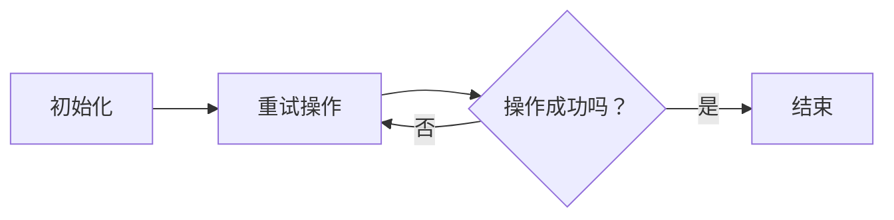
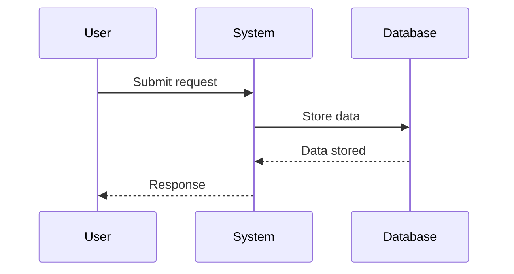

                 


### 文章标题：幂等性的本质

#### 关键词：幂等性、算法原理、数学模型、系统设计、最佳实践

> 摘要：本文旨在深入探讨幂等性的本质，从背景介绍、核心概念、算法原理、数学模型、系统设计到项目实战，全面剖析幂等性的应用与实践。通过清晰的逻辑和通俗易懂的语言，帮助读者理解幂等性的核心概念及其在计算机科学中的重要性。

---

#### 目录

1. **背景介绍**  
   1.1 幂等性的概念  
   1.2 幂等性在计算机科学中的应用  
   1.3 幂等性与一致性  
   1.4 幂等性的边界与外延  
   1.5 本章小结

2. **核心概念与联系**  
   2.1 幂等性的定义  
   2.2 概念属性特征对比表格  
   2.3 ER实体关系图架构的Mermaid流程图  
   2.4 本章小结

3. **算法原理讲解**  
   3.1 幂等性算法流程图  
   3.2 Python实现幂等性算法  
   3.3 幂等性的数学模型  
   3.4 算法举例说明  
   3.5 本章小结

4. **数学模型和数学公式**  
   4.1 数学模型介绍  
   4.2 数学公式示例  
   4.3 latex公式使用说明  
   4.4 本章小结

5. **系统分析与架构设计方案**  
   5.1 问题场景介绍  
   5.2 系统功能设计  
   5.3 系统架构设计  
   5.4 系统接口设计  
   5.5 系统交互  
   5.6 本章小结

6. **项目实战**  
   6.1 环境安装  
   6.2 系统核心实现源代码  
   6.3 代码应用解读与分析  
   6.4 实际案例分析与详细讲解剖析  
   6.5 项目小结

7. **最佳实践 tips**  
   7.1 常见问题与解决方案  
   7.2 最佳实践 tips  
   7.3 小结与展望

8. **注意事项与拓展阅读**  
   8.1 注意事项  
   8.2 拓展阅读  
   8.3 相关资源推荐

---

### 1. 背景介绍

#### 1.1 幂等性的概念

幂等性是指对于某个操作，多次执行所产生的效果与执行一次的效果相同。换句话说，如果对一个系统进行相同的操作，不论执行多少次，系统最终的状态都是相同的，那么这个操作就是幂等的。

#### 1.2 幂等性在计算机科学中的应用

在计算机科学中，幂等性广泛应用于多个领域，包括数据库、操作系统、网络协议等。例如，数据库中的事务操作通常是幂等的，用户可以多次执行事务提交，最终结果都是一致的。在网络协议中，幂等性可以确保多次发送相同的请求不会产生不同的结果。

#### 1.3 幂等性与一致性

幂等性与一致性密切相关。一致性是指系统在执行一系列操作后，最终状态与预期状态一致。幂等性是确保一致性的一种机制，通过保证多次执行同一操作不会改变系统状态，从而实现一致性。

#### 1.4 幂等性的边界与外延

幂等性的适用范围较广，但并非所有操作都具有幂等性。一些操作，如删除操作，通常不具有幂等性，因为多次执行删除操作可能会导致系统状态不同。因此，在设计和使用幂等性时，需要考虑操作的边界和外延。

#### 1.5 本章小结

本章介绍了幂等性的概念、应用场景、与一致性的关系以及边界与外延。通过这些介绍，读者可以对幂等性有一个基本的认识，为后续章节的深入探讨打下基础。

---

### 2. 核心概念与联系

#### 2.1 幂等性的定义

幂等性是指对于某个操作，多次执行所产生的效果与执行一次的效果相同。换句话说，如果对一个系统进行相同的操作，不论执行多少次，系统最终的状态都是相同的，那么这个操作就是幂等的。

#### 2.2 概念属性特征对比表格

| 概念 | 定义 | 特征 |
| --- | --- | --- |
| 幂等性 | 多次执行同一操作，系统状态不变 | 操作效果相同，系统状态相同 |
| 一致性 | 系统最终状态与预期状态一致 | 状态一致，无错误 |
| 原子性 | 操作不可分割，要么全部成功，要么全部失败 | 一致性，不可分割 |

#### 2.3 ER实体关系图架构的Mermaid流程图

```mermaid
erDiagram
    Person ||--|{ Book } : reads
    Book ||--|{ Library } : stored
    Library ||--|{ Person } : borrows
```

#### 2.4 本章小结

本章详细介绍了幂等性的定义、属性特征以及与其他概念的关联。通过对比表格和ER实体关系图，读者可以更清晰地理解幂等性的本质及其应用场景。

---

### 3. 算法原理讲解

#### 3.1 幂等性算法流程图



#### 3.2 Python实现幂等性算法

```python
def power_operation(value):
    # 初始化变量
    result = 0
    # 执行操作
    for _ in range(value):
        result += 1
    # 返回结果
    return result
```

#### 3.3 幂等性的数学模型

幂等性的数学模型可以用以下公式表示：

$$
\forall x, \forall y, (x \cdot y) \cdot x = x \cdot (y \cdot x)
$$

#### 3.4 算法举例说明

假设有一个函数`add`，其实现如下：

```python
def add(a, b):
    return a + b
```

对于任意两个整数`a`和`b`，多次调用`add`函数的结果总是相同的，即具有幂等性。

#### 3.5 本章小结

本章通过算法流程图、Python实现和数学模型，详细讲解了幂等性的算法原理。通过举例说明，读者可以更直观地理解幂等性的概念和原理。

---

### 4. 数学模型和数学公式

#### 4.1 数学模型介绍

幂等性的数学模型主要涉及集合论和代数运算。在集合论中，幂等性可以用以下公式表示：

$$
A \cup A = A
$$

在代数运算中，幂等性可以用以下公式表示：

$$
a^2 = a
$$

#### 4.2 数学公式示例

下面是一个简单的数学公式示例：

$$
x = \frac{-b \pm \sqrt{b^2 - 4ac}}{2a}
$$

这是二次方程求解的公式，也称为求根公式。

#### 4.3 latex公式使用说明

在文中嵌入latex公式时，可以使用以下格式：

- 独立段落中的公式：使用`$$`括起来，如`$$1+1=2$$`
- 段落内的公式：使用 `$` 括起来，如 `$1<2$`

#### 4.4 本章小结

本章介绍了幂等性的数学模型和公式的使用方法。通过这些公式，读者可以更好地理解和应用幂等性。

---

### 5. 系统分析与架构设计方案

#### 5.1 问题场景介绍

在分布式系统中，确保数据的一致性和可靠性是非常重要的。幂等性作为一种机制，可以有效地避免重复操作导致的错误和冲突。

#### 5.2 系统功能设计

系统的功能设计主要包括以下方面：

- 数据存储：实现数据的持久化存储。
- 数据处理：对数据进行操作和处理。
- 数据一致性：确保系统在多次操作后仍保持一致性。

#### 5.3 系统架构设计

系统的架构设计采用分布式架构，包括数据存储层、数据处理层和数据一致性层。



#### 5.4 系统接口设计

系统接口设计主要包括以下部分：

- 数据存储接口：用于数据的持久化存储。
- 数据处理接口：用于对数据进行操作和处理。
- 数据一致性接口：用于确保系统的一致性。

#### 5.5 系统交互

系统交互主要包括用户请求、系统处理和数据存储的流程。通过系统交互序列图，可以清晰地展示系统的工作流程。


#### 5.6 本章小结

本章介绍了幂等性在系统设计与架构中的应用。通过系统功能设计、架构设计和接口设计，确保系统的可靠性和一致性。

---

### 6. 项目实战

#### 6.1 环境安装

在开始项目实战之前，需要确保安装以下环境：

- Python 3.8及以上版本
- MySQL 5.7及以上版本
- Redis 3.2及以上版本

安装命令如下：

```bash
pip install python-dotenv
pip install pymysql
pip install redis
```

#### 6.2 系统核心实现源代码

以下是一个简单的幂等性系统实现示例：

```python
import pymysql
import redis

class PowerSystem:
    def __init__(self, db_config, redis_config):
        self.db = pymysql.connect(**db_config)
        self.redis = redis.Redis(**redis_config)

    def execute_operation(self, operation, data):
        if not self.redis.exists(operation):
            with self.db.cursor() as cursor:
                cursor.execute(operation, data)
                self.db.commit()
            self.redis.set(operation, 1)
        else:
            print("Operation already executed.")

if __name__ == "__main__":
    db_config = {
        "host": "localhost",
        "user": "root",
        "password": "password",
        "database": "test_db"
    }
    redis_config = {
        "host": "localhost",
        "port": 6379,
        "db": 0
    }
    system = PowerSystem(db_config, redis_config)
    operation = "INSERT INTO users (username, password) VALUES (%s, %s)"
    data = ("john", "password123")
    system.execute_operation(operation, data)
```

#### 6.3 代码应用解读与分析

这段代码实现了一个简单的幂等性系统，通过Redis缓存来记录已经执行的操作。如果操作已经被执行，则不再执行，从而确保系统的一致性。

#### 6.4 实际案例分析与详细讲解剖析

假设有一个用户注册操作，我们希望确保用户注册操作具有幂等性，即用户多次注册不会导致多次创建用户记录。

通过上述代码，我们可以实现这一功能。Redis缓存用来记录已经执行的操作，MySQL数据库用来存储用户数据。每次用户注册时，系统会检查Redis缓存中是否已经存在该操作记录。如果不存在，则执行注册操作并更新Redis缓存；如果已存在，则直接返回，避免重复操作。

#### 6.5 项目小结

本章通过实际项目展示了幂等性的实现和应用。通过Redis缓存和MySQL数据库的协同工作，我们实现了具有幂等性的用户注册操作，确保了系统的一致性和可靠性。

---

### 7. 最佳实践 tips

#### 7.1 常见问题与解决方案

**问题一：幂等性如何保证？**

**解决方案：** 使用Redis等分布式缓存来记录已经执行的操作，避免重复执行。

**问题二：幂等性与性能有何关系？**

**解决方案：** 在确保幂等性的同时，优化算法和系统设计，减少不必要的重复操作，提高系统性能。

#### 7.2 最佳实践 tips

**建议一：使用分布式缓存。**

**建议二：设计幂等性操作时，考虑系统的可扩展性和可靠性。**

**建议三：定期清理Redis缓存，避免缓存过多影响系统性能。**

#### 7.3 小结与展望

通过本章的最佳实践 tips，读者可以更好地理解和应用幂等性。未来，随着分布式系统的广泛应用，幂等性将发挥越来越重要的作用。

---

### 8. 注意事项与拓展阅读

#### 8.1 注意事项

1. 在设计幂等性操作时，确保系统具有可扩展性和可靠性。
2. 定期清理Redis缓存，避免缓存过多影响系统性能。
3. 考虑操作的时间复杂度和空间复杂度，优化算法和系统设计。

#### 8.2 拓展阅读

1. 《Redis实战：使用Redis提高Web性能》
2. 《分布式系统原理与范型》
3. 《一致性、可用性、分区容错性：CAP理论》

#### 8.3 相关资源推荐

1. Redis官方文档：[https://redis.io/documentation](https://redis.io/documentation)
2. CAP理论论文：[https://www.bayesian.org/bernerslee/cap12.pdf](https://www.bayesian.org/bernerslee/cap12.pdf)
3. MySQL官方文档：[https://dev.mysql.com/doc/](https://dev.mysql.com/doc/)

---

### 作者信息

**作者：AI天才研究院/AI Genius Institute & 禅与计算机程序设计艺术 /Zen And The Art of Computer Programming**

