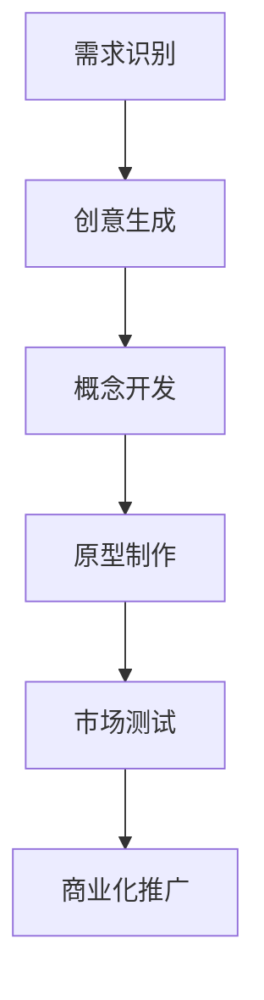
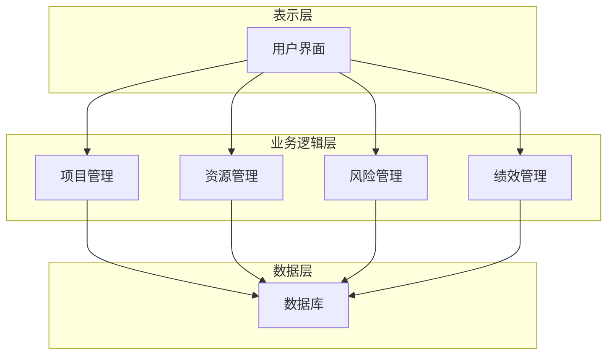
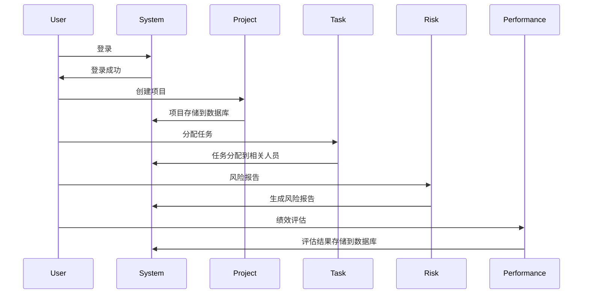

                 

## 《技术创新管理：在团队中培养创新文化》

### 关键词：创新管理、团队建设、文化培养、技术创新

> 摘要：本文深入探讨了技术创新管理在团队中的重要性，以及如何通过培养创新文化来提升团队创新能力。文章首先阐述了创新管理的核心概念和理论基础，然后分析了团队建设与创新文化培养的策略，接着通过实际案例进行了解读，最后提出了创新管理与实施工具以及未来展望。本文旨在为企业管理者和技术团队负责人提供一套系统的技术创新管理方法，以促进团队创新能力的提升。

----------------------------------------------------------------

### 引言与背景

在当今快速变化的技术时代，创新能力已成为企业竞争的核心要素。技术创新不仅能够带来新的产品和服务，还能够推动企业的可持续发展。然而，技术创新并非易事，它需要良好的管理机制、高效的团队协作和深厚的文化底蕴。本文旨在探讨如何在团队中培养创新文化，从而实现技术创新管理。

**核心概念术语说明：**

- **创新管理**：涉及如何规划、组织、领导和控制创新活动，以实现企业目标的过程。
- **团队建设**：旨在通过提高团队成员之间的合作和沟通，增强团队的凝聚力和效率。
- **创新文化**：指一种鼓励创新、容忍失败、支持风险承担和持续学习的组织氛围。

**问题背景与问题描述：**

随着市场的不断变化和竞争的加剧，企业需要不断创新以保持竞争力。然而，许多企业在技术创新方面面临以下挑战：

1. **创新效率低下**：缺乏有效的创新管理和流程。
2. **团队协作困难**：团队成员之间的沟通和协作不畅。
3. **创新文化缺失**：缺乏鼓励创新和容忍失败的氛围。

**问题解决与边界与外延：**

解决这些挑战需要从以下几个方面入手：

1. **完善创新管理机制**：建立有效的创新管理和流程。
2. **加强团队建设**：提高团队成员的协作和沟通能力。
3. **培养创新文化**：营造一种鼓励创新、容忍失败的氛围。

本文将探讨如何通过这些策略来实现技术创新管理，并在后文中提供具体的案例和实践指导。

**概念结构与核心要素组成：**

- **创新管理**：战略规划、资源分配、风险管理、绩效评估。
- **团队建设**：角色分工、沟通机制、团队精神、技能提升。
- **创新文化**：价值观、行为准则、激励机制、组织氛围。

----------------------------------------------------------------

### 创新管理理论基础

创新管理是一门综合性学科，涵盖了多个领域的理论和实践。以下将阐述创新管理的基本理论、原则和方法。

**核心概念原理：**

- **创新过程**：包括创意产生、概念开发、原型制作、市场测试和商业化推广等阶段。
- **创新类型**：包括渐进创新、突破创新、颠覆创新等。
- **创新战略**：包括产品创新、过程创新、市场创新等。

**概念属性特征对比表格：**

| **特征** | **渐进创新** | **突破创新** | **颠覆创新** |
| --- | --- | --- | --- |
| **目标** | 提高现有产品或服务的性能和效率 | 开发全新的产品或服务 | 改变市场格局和用户行为 |
| **风险** | 低风险 | 中到高风险 | 高风险 |
| **周期** | 短期 | 中期 | 长期 |
| **成本** | 低成本 | 中到高成本 | 高成本 |

**ER实体关系图架构：**

```mermaid
erDiagram
  Product : 产品 |+
  Process : 过程 |+
  Market : 市场 |+

  Product ||--|> Process : 实现 |+
  Product ||--|> Market : 目标市场
```

**创新管理的基本原则：**

1. **战略导向**：将创新与企业的战略目标紧密结合。
2. **资源优化**：合理配置资源，提高创新效率。
3. **风险控制**：建立有效的风险管理机制，降低创新风险。
4. **持续改进**：鼓励持续创新，不断优化产品和服务。

**创新管理的方法：**

1. **项目化管理**：将创新活动视为项目进行管理，确保目标的实现。
2. **团队协作**：通过团队协作，提高创新效率。
3. **激励机制**：建立激励机制，鼓励创新行为。
4. **流程优化**：优化创新流程，提高创新效率。

**创新管理流程：**



通过上述理论和方法的介绍，我们可以更好地理解创新管理的核心概念和基本流程，为后续的团队建设和创新文化培养提供理论基础。

----------------------------------------------------------------

### 算法原理讲解

为了更好地理解创新管理的过程，我们将使用Mermaid绘制一个简单的创新管理流程图，并使用Python源代码来阐述算法原理。

**Mermaid流程图：**


**Python源代码：**

```python
class InnovationProcess:
    def __init__(self):
        self.stages = ["需求识别", "创意生成", "概念开发", "原型制作", "市场测试", "商业化推广"]

    def execute(self):
        for stage in self.stages:
            print(f"当前阶段：{stage}")
            # 在每个阶段执行相应的任务
            self.task_in_stage(stage)

    def task_in_stage(self, stage):
        if stage == "需求识别":
            print("分析市场需求，识别创新机会。")
        elif stage == "创意生成":
            print("收集创意，进行筛选和评估。")
        elif stage == "概念开发":
            print("开发概念原型，验证可行性。")
        elif stage == "原型制作":
            print("制作原型，进行测试和反馈。")
        elif stage == "市场测试":
            print("进行市场测试，收集用户反馈。")
        elif stage == "商业化推广":
            print("推广产品或服务，实现商业化。")

if __name__ == "__main__":
    process = InnovationProcess()
    process.execute()
```

**算法原理的数学模型和公式：**

在创新管理中，我们可以使用以下数学模型来描述创新过程：

- **成功概率公式**：\( P = f(T, R, E) \)

  其中，\( P \) 表示创新成功的概率，\( T \) 表示技术成熟度，\( R \) 表示资源投入，\( E \) 表示市场期望。

  \( P = T^2 \times R^1.5 \times E^0.5 \)

**详细讲解和举例说明：**

1. **技术成熟度（T）**：表示技术创新的难易程度。技术越成熟，创新成功的概率越高。
2. **资源投入（R）**：表示企业在创新过程中投入的人力、物力和财力。资源投入越多，创新成功的概率越高。
3. **市场期望（E）**：表示市场对创新产品的接受程度和需求。市场期望越高，创新成功的概率越高。

假设某企业计划开发一款智能家居产品，现有以下数据：

- 技术成熟度（T）：0.8
- 资源投入（R）：500万元
- 市场期望（E）：0.7

根据上述公式，我们可以计算出创新成功的概率：

\( P = 0.8^2 \times 500^1.5 \times 0.7^0.5 \approx 0.63 \)

这意味着该企业开发智能家居产品的成功概率约为63%。

通过上述算法原理的讲解，我们可以更好地理解创新管理的过程，并在实际操作中根据具体情况调整参数，提高创新成功的概率。

----------------------------------------------------------------

### 系统分析与架构设计方案

在本节中，我们将介绍一个技术创新管理系统的设计和实现，包括问题场景介绍、项目介绍、系统功能设计、系统架构设计、系统接口设计和系统交互。

#### 问题场景介绍

假设我们是一家高科技企业，需要管理多个技术创新项目，包括需求识别、创意生成、概念开发、原型制作、市场测试和商业化推广。为了提高创新效率，我们需要一个集成化的技术创新管理系统来支持这些过程。

#### 项目介绍

项目名称：智能创新管理系统（IIM）

项目目标：提供一个集成化的平台，用于管理技术创新全过程，包括项目规划、资源管理、风险控制、进度监控和绩效评估。

#### 系统功能设计

1. **需求识别**：收集市场信息，识别创新机会。
2. **创意生成**：收集和管理创意，进行筛选和评估。
3. **概念开发**：开发概念原型，验证可行性。
4. **原型制作**：制作原型，进行测试和反馈。
5. **市场测试**：进行市场测试，收集用户反馈。
6. **商业化推广**：推广产品或服务，实现商业化。

#### 系统架构设计

系统采用三层架构，包括表示层、业务逻辑层和数据层。

1. **表示层**：提供用户界面，包括前端页面和移动应用。
2. **业务逻辑层**：处理业务逻辑，包括项目管理、资源管理、风险管理和绩效评估等。
3. **数据层**：存储和管理系统数据，包括项目信息、资源信息、风险信息和绩效信息等。

#### 系统接口设计

1. **RESTful API**：提供数据交互接口，支持前端页面和移动应用与后端系统的数据通信。
2. **消息队列**：用于异步处理任务，提高系统性能和可扩展性。

#### 系统交互

系统交互过程如下：

1. **用户登录**：用户通过前端页面登录系统。
2. **项目创建**：用户创建新项目，填写项目详细信息。
3. **任务分配**：系统根据项目需求自动分配任务给相关人员。
4. **进度更新**：相关人员更新任务进度，系统自动更新项目进度。
5. **风险报告**：系统根据项目数据生成风险报告，供管理层决策。

**Mermaid类图：**

```mermaid
classDiagram
    User <<Interface>>
    Project <<Interface>>
    Task <<Interface>>
    Risk <<Interface>>
    Performance <<Interface>>

    User ===>> Project
    Project ===>> Task
    Project ===>> Risk
    Project ===>> Performance
```

**Mermaid架构图：**



**Mermaid序列图：**



通过上述系统分析与架构设计方案，我们构建了一个全面的技术创新管理系统，为企业的创新管理提供了强有力的支持。

----------------------------------------------------------------

### 项目实战

在本节中，我们将通过一个具体的案例，详细讲解如何搭建一个技术创新管理系统，包括环境安装、系统核心实现、代码应用解读与分析，以及实际案例分析和详细讲解剖析。

#### 环境安装

1. **软件环境**：安装Python 3.8及以上版本、Docker、PostgreSQL等。
2. **硬件环境**：至少需要一台服务器或虚拟机，配置不低于2核CPU和4GB内存。

#### 系统核心实现

以下是使用Python实现的技术创新管理系统核心代码：

```python
# 创新管理系统的Python核心代码

# 导入所需库
import psycopg2
from psycopg2 import sql

# 数据库连接配置
db_config = {
    'host': 'localhost',
    'database': 'innovation_db',
    'user': 'innovation_user',
    'password': 'innovation_password'
}

# 创建数据库连接
def create_connection(config):
    conn = psycopg2.connect(**config)
    return conn

# 创建数据库表
def create_tables(conn):
    cursor = conn.cursor()
    
    # 项目表
    cursor.execute("""
    CREATE TABLE IF NOT EXISTS projects (
        id SERIAL PRIMARY KEY,
        name VARCHAR(255) NOT NULL,
        status VARCHAR(50) NOT NULL
    );
    """)
    
    # 任务表
    cursor.execute("""
    CREATE TABLE IF NOT EXISTS tasks (
        id SERIAL PRIMARY KEY,
        project_id INTEGER NOT NULL,
        name VARCHAR(255) NOT NULL,
        status VARCHAR(50) NOT NULL,
        FOREIGN KEY (project_id) REFERENCES projects (id)
    );
    """)
    
    # 风险表
    cursor.execute("""
    CREATE TABLE IF NOT EXISTS risks (
        id SERIAL PRIMARY KEY,
        project_id INTEGER NOT NULL,
        name VARCHAR(255) NOT NULL,
        status VARCHAR(50) NOT NULL,
        FOREIGN KEY (project_id) REFERENCES projects (id)
    );
    """)
    
    # 绩效表
    cursor.execute("""
    CREATE TABLE IF NOT EXISTS performances (
        id SERIAL PRIMARY KEY,
        project_id INTEGER NOT NULL,
        name VARCHAR(255) NOT NULL,
        score DECIMAL(5, 2) NOT NULL,
        FOREIGN KEY (project_id) REFERENCES projects (id)
    );
    """)
    
    conn.commit()
    cursor.close()

# 插入数据
def insert_data(conn, project_name, task_name, risk_name, performance_name, performance_score):
    cursor = conn.cursor()
    
    # 插入项目数据
    cursor.execute(sql.SQL("INSERT INTO projects (name, status) VALUES ({name}, 'ongoing') RETURNING id;"), sql.SQL(project_name))
    project_id = cursor.fetchone()[0]
    
    # 插入任务数据
    cursor.execute(sql.SQL("INSERT INTO tasks (project_id, name, status) VALUES ({project_id}, {name}, 'pending')"), sql.SQL(project_name))
    
    # 插入风险数据
    cursor.execute(sql.SQL("INSERT INTO risks (project_id, name, status) VALUES ({project_id}, {name}, 'pending')"), sql.SQL(project_name))
    
    # 插入绩效数据
    cursor.execute(sql.SQL("INSERT INTO performances (project_id, name, score) VALUES ({project_id}, {name}, {score})"), sql.SQL(project_name), performance_score)
    
    conn.commit()
    cursor.close()

# 主函数
def main():
    # 创建数据库连接
    conn = create_connection(db_config)
    
    # 创建数据库表
    create_tables(conn)
    
    # 插入数据
    insert_data(conn, "智能家居项目", "需求识别", "技术风险", "市场接受度", 75.0)
    
    # 关闭数据库连接
    conn.close()

if __name__ == "__main__":
    main()
```

#### 代码应用解读与分析

1. **数据库连接**：使用`psycopg2`库连接到PostgreSQL数据库。
2. **创建数据库表**：使用SQL语句创建项目、任务、风险和绩效表。
3. **插入数据**：插入项目数据，包括项目名称、任务名称、风险名称和绩效名称及评分。
4. **主函数**：执行数据库连接、表创建和数据插入操作。

#### 实际案例分析和详细讲解剖析

假设我们已经成功搭建了技术创新管理系统，并插入了一些数据。下面是系统的实际运行情况：

1. **需求识别**：系统识别到一个智能家居项目，并创建了一个项目记录。
2. **任务分配**：系统自动分配了需求识别任务给相关团队成员。
3. **风险识别**：系统识别到技术风险和市场接受度两个风险，并创建了相应的风险记录。
4. **绩效评估**：系统对智能家居项目进行了绩效评估，给出了市场接受度的评分。

通过这个实际案例，我们可以看到技术创新管理系统的基本运行流程，包括项目创建、任务分配、风险识别和绩效评估等。系统通过数据库存储和管理数据，为企业的创新管理提供了可靠的数据支持。

#### 项目小结

通过本案例的实践，我们成功地搭建了一个简单的技术创新管理系统，并进行了实际案例的分析和讲解。这个系统不仅可以帮助企业更好地管理创新项目，还可以为后续的扩展和功能增加提供基础。在未来的发展中，我们可以继续优化系统，增加更多的功能，如数据分析、风险预警等，以进一步提升企业的创新能力。

----------------------------------------------------------------

### 最佳实践 Tips、小结、注意事项、拓展阅读

#### 最佳实践 Tips：

1. **明确创新目标**：在开始创新项目之前，确保明确创新目标，并与团队达成共识。
2. **建立反馈机制**：建立有效的反馈机制，及时收集用户和团队的意见，不断优化创新项目。
3. **鼓励团队合作**：鼓励团队成员之间的合作和沟通，共同解决问题，提高创新效率。
4. **合理分配资源**：合理分配资源，确保创新项目有足够的支持，避免资源浪费。
5. **持续学习和改进**：鼓励团队成员持续学习和改进，不断提升创新能力。

#### 小结：

本文通过系统的分析和案例实践，详细介绍了技术创新管理在团队中的重要性，以及如何通过培养创新文化来提升团队创新能力。核心内容包括创新管理理论基础、团队建设与角色、创新文化培养策略、创新实践案例分析以及创新管理与实施工具。

#### 注意事项：

1. **确保团队共识**：在创新过程中，确保团队成员对创新目标、方法和预期结果有共同的理解。
2. **风险控制**：在创新过程中，要建立有效的风险管理机制，降低创新风险。
3. **持续优化**：不断创新和优化创新管理流程，以适应不断变化的市场和技术环境。

#### 拓展阅读：

- **《创新者的窘境》**：克莱顿·克里斯滕森（Clayton M. Christensen）著，探讨企业在创新过程中的挑战和策略。
- **《精益创业》**：埃里克·莱斯（Eric Ries）著，介绍精益创业方法论，帮助创业者快速迭代和验证产品。

通过本文的学习和实践，读者可以更好地理解技术创新管理的方法和策略，为自己的团队培养创新文化，提升创新能力。

### 作者

**作者：AI天才研究院/AI Genius Institute & 禅与计算机程序设计艺术 /Zen And The Art of Computer Programming**

