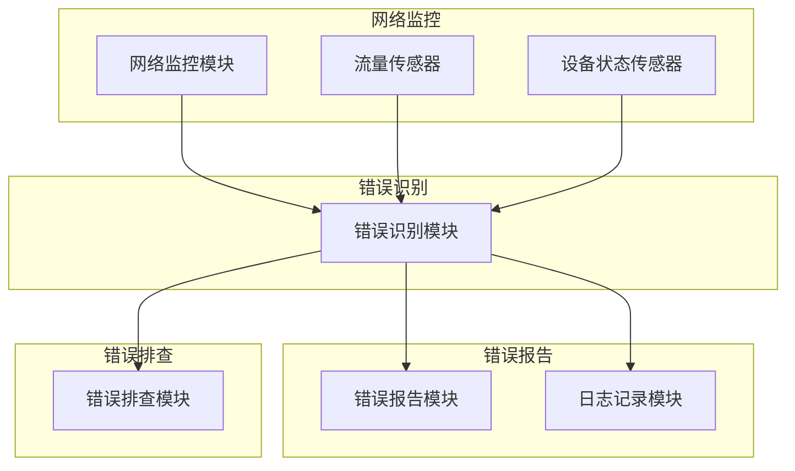
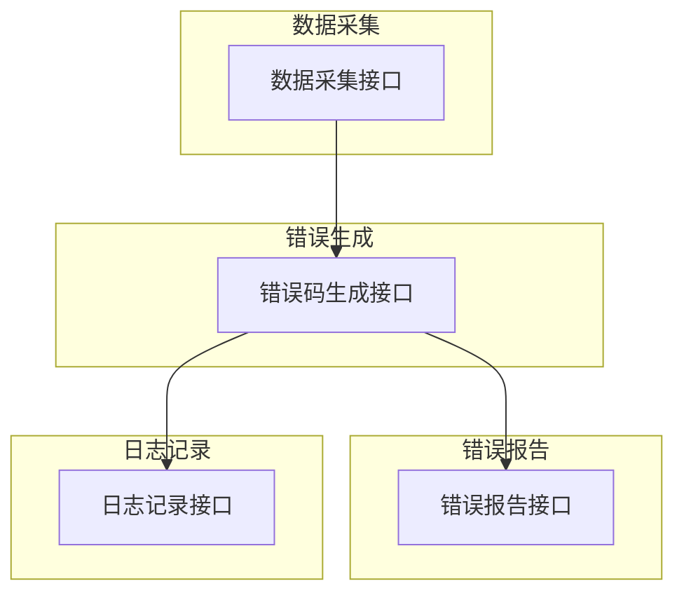

                 

# 故障频出的错误码

## 关键词
- 错误码
- 故障排查
- 调试技巧
- 软件开发
- 系统维护

## 摘要
本文将深入探讨故障频出的错误码及其在软件开发和系统维护中的重要性。通过分类、分析和解决方法，我们将揭示常见错误码的本质，并分享排查与调试技巧。文章还将介绍高级错误码的处理策略、最佳实践与预防策略，以及特定领域错误码分析。通过本文，读者将掌握全面错误码处理能力，提高系统稳定性和开发效率。

### 第1章：错误码的背景与重要性

#### 1.1 错误码的概念

错误码，又称错误号或错误代码，是计算机系统或软件在运行过程中遇到异常情况时返回的编码信息。这些错误码提供了关于错误发生原因和类型的详细信息，有助于开发人员或系统管理员进行故障排查和修复。

错误码的基本结构通常包括错误类别、错误编号和错误信息。例如，在Windows操作系统中，错误码通常以“0x”开头，后面跟着一个16进制数，如`0x80070002`。这个错误码表示“拒绝访问”。

#### 1.2 错误码在软件开发和系统维护中的作用

错误码在软件开发和系统维护中扮演着至关重要的角色。它们有助于：

- **故障诊断**：错误码提供了故障发生的直接线索，使开发人员能够快速定位问题。
- **问题追踪**：通过错误码，开发人员可以跟踪问题的起源和传播路径，更好地理解系统行为。
- **自动修复**：一些系统可以自动解析错误码并执行相应的修复操作，如Windows Update。
- **用户体验**：错误码有助于提供清晰的错误消息，改善用户的故障排除体验。

#### 1.3 错误码的基本结构和分类

错误码的基本结构通常如下：

- **错误类别**：标识错误的大类别，如操作系统错误、应用程序错误等。
- **错误编号**：唯一的错误标识符，通常是一个数字或字符串。
- **错误信息**：详细的错误描述，帮助理解错误的原因和解决方法。

错误码的分类可以根据不同的标准进行，如操作系统、应用程序、硬件故障等。常见的错误码类别包括：

- **操作系统错误码**：如Windows、Linux等操作系统的错误码。
- **应用程序错误码**：如Web服务器、数据库管理系统等应用程序的错误码。
- **硬件错误码**：如CPU、内存等硬件设备的错误码。

#### 1.4 本章小结

本章介绍了错误码的基本概念、作用和分类。通过了解错误码的结构和类型，我们可以更好地理解其在软件开发和系统维护中的重要性，为后续章节的学习打下基础。

### 第2章：常见错误码及其解决方法

#### 2.1 常见错误码列表

以下是一些常见错误码及其简要描述：

- **0x80070002**：拒绝访问。
- **0x80072EE7**：网络连接故障。
- **400 Bad Request**：HTTP请求无效。
- **500 Internal Server Error**：服务器内部错误。
- **502 Bad Gateway**：网关错误。
- **503 Service Unavailable**：服务不可用。
- **10061**：网络连接超时。

#### 2.2 每个错误码的简要描述

**0x80070002**：拒绝访问

- 描述：此错误码表示尝试访问受保护的资源时被拒绝。
- 解决方法：
  - 检查权限设置。
  - 确保用户账户有足够的权限。

**0x80072EE7**：网络连接故障

- 描述：此错误码表示网络连接失败。
- 解决方法：
  - 检查网络设置。
  - 重启网络设备。

**400 Bad Request**：HTTP请求无效

- 描述：此错误码表示发送的HTTP请求无效。
- 解决方法：
  - 检查请求格式。
  - 重新发送请求。

**500 Internal Server Error**：服务器内部错误

- 描述：此错误码表示服务器内部发生错误。
- 解决方法：
  - 检查服务器日志。
  - 重启服务器。

**502 Bad Gateway**：网关错误

- 描述：此错误码表示网关发生错误。
- 解决方法：
  - 检查网关配置。
  - 重置网关。

**503 Service Unavailable**：服务不可用

- 描述：此错误码表示服务当前不可用。
- 解决方法：
  - 检查服务状态。
  - 重试服务。

**10061**：网络连接超时

- 描述：此错误码表示网络连接尝试超时。
- 解决方法：
  - 检查网络连接。
  - 重试连接。

#### 2.3 解决错误码的基本方法和技巧

解决错误码的基本方法和技巧包括：

- **查看错误日志**：错误日志通常包含详细的错误信息和错误码，有助于定位问题。
- **使用调试工具**：调试工具如Visual Studio、GDB等可以帮助分析错误发生的原因。
- **Google搜索**：使用错误码进行Google搜索，通常可以找到相关的解决方法。
- **社区支持**：在技术社区如Stack Overflow、Reddit等寻找相关问题的解决方案。
- **文档和手册**：查阅相关软件或操作系统的文档和手册，通常包含错误码的详细解释和解决方法。

#### 2.4 本章小结

本章介绍了常见错误码的列表和简要描述，并提供了解决方法。通过了解这些错误码及其解决方法，开发人员和系统管理员可以更有效地排查和解决系统故障。

### 第3章：错误码的排查与调试技巧

#### 3.1 排查错误码的流程

排查错误码的流程通常包括以下步骤：

1. **确定错误现象**：记录错误现象，包括错误消息、错误码等。
2. **收集相关信息**：收集系统日志、错误日志、网络流量日志等。
3. **分析错误日志**：分析错误日志，查找错误发生的时间和上下文。
4. **定位错误原因**：根据日志分析，定位错误原因，如软件故障、硬件故障、网络故障等。
5. **制定修复方案**：根据错误原因，制定修复方案。
6. **实施修复方案**：执行修复方案，如更新软件、重启设备、重新配置网络等。
7. **验证修复效果**：验证修复效果，确保问题得到解决。

#### 3.2 使用调试工具

调试工具是排查错误码的重要工具，以下是一些常用的调试工具：

- **Visual Studio**：Visual Studio集成了强大的调试功能，可以调试本地和远程应用程序。
- **GDB**：GDB是Linux平台上常用的调试工具，可以调试C/C++程序。
- **Wireshark**：Wireshark是一款网络抓包工具，可以分析网络流量，帮助定位网络故障。
- **JDB**：JDB是Java语言的调试工具，可以调试Java应用程序。
- **Xdebug**：Xdebug是PHP的调试器，可以调试PHP应用程序。

使用调试工具的基本步骤如下：

1. **设置断点**：在代码中设置断点，以便在错误发生时暂停程序执行。
2. **启动调试**：启动调试工具，并连接到运行中的应用程序。
3. **单步调试**：逐步执行代码，观察变量值和程序执行路径。
4. **查看日志**：查看调试工具提供的日志和错误信息，帮助定位问题。

#### 3.3 调试技巧和最佳实践

以下是一些调试技巧和最佳实践：

- **从简单开始**：先从最简单的调试步骤开始，如查看错误日志、检查网络连接等。
- **逐步排查**：逐步缩小问题范围，如先检查硬件设备，再检查软件配置。
- **记录步骤**：记录排查步骤和结果，以便后续参考。
- **避免重复操作**：避免重复执行已经执行过的操作，以提高排查效率。
- **团队协作**：与团队成员协作，共同解决问题。

#### 3.4 本章小结

本章介绍了错误码排查的流程和调试工具的使用。通过掌握这些技巧和最佳实践，开发人员和系统管理员可以更高效地排查和解决错误码问题。

### 第4章：高级错误码分析与处理

#### 4.1 高级错误码的特点

高级错误码通常具有以下特点：

- **复杂性和多样性**：高级错误码可能涉及多个系统或应用程序，导致故障原因复杂多样。
- **跨平台性**：高级错误码可能在不同操作系统、应用程序和硬件设备上出现。
- **隐蔽性**：高级错误码可能在运行过程中产生，但不会立即显现，导致排查困难。
- **动态性**：高级错误码可能在系统运行过程中发生变化，如因内存泄漏导致的错误。

#### 4.2 高级错误码的解决策略

解决高级错误码的策略包括：

- **多层次排查**：从硬件、操作系统、应用程序等多个层次进行排查。
- **综合分析**：综合分析系统日志、网络流量、应用程序日志等，找出故障原因。
- **逐步排查**：逐步排除可能导致错误的各种因素，如内存泄漏、网络故障等。
- **自动化诊断**：使用自动化诊断工具，如故障诊断工具、网络监控工具等，辅助排查。

#### 4.3 高级错误码的案例分析

以下是一个高级错误码的案例分析：

**案例一：网络延迟导致的服务器崩溃**

- **问题描述**：某公司服务器出现频繁崩溃现象，导致业务中断。
- **排查过程**：
  - 检查服务器硬件设备，无异常。
  - 检查操作系统日志，无明显错误。
  - 检查网络流量，发现网络延迟较高。
  - 检查应用程序日志，发现部分请求处理时间过长。
- **解决方案**：
  - 优化网络配置，提高网络带宽。
  - 优化应用程序代码，减少请求处理时间。
  - 引入负载均衡，分散服务器压力。

#### 4.4 本章小结

本章介绍了高级错误码的特点和解决策略，并通过案例分析展示了如何排查和解决高级错误码问题。掌握这些方法有助于提高系统稳定性和业务连续性。

### 第5章：错误码的最佳实践与预防策略

#### 5.1 预防错误码产生的方法

预防错误码的产生是软件开发和维护的重要环节。以下是一些预防方法：

- **编码规范**：制定统一的编码规范，如命名规范、代码格式等，减少编码错误。
- **代码审查**：定期进行代码审查，确保代码质量和规范性。
- **单元测试**：编写单元测试，覆盖代码的各个功能点，确保代码的正确性。
- **集成测试**：在集成环境中进行测试，确保不同模块之间的协同工作。
- **性能测试**：进行性能测试，确保系统在高负载下的稳定性和响应速度。

#### 5.2 错误码处理的最佳实践

处理错误码的最佳实践包括：

- **详细记录**：详细记录错误码及其发生的环境、时间等信息，便于问题排查。
- **快速响应**：及时响应错误码，确保问题得到及时解决。
- **自动化处理**：使用自动化工具，如故障诊断工具、错误监控平台等，自动处理常见错误码。
- **持续优化**：根据错误码的统计分析，持续优化代码和系统配置。

#### 5.3 长期维护和优化策略

长期维护和优化策略包括：

- **定期检查**：定期检查系统状态，如硬件健康、网络连接等，确保系统正常运行。
- **更新维护**：定期更新系统软件和应用程序，修复已知错误和漏洞。
- **备份策略**：制定备份策略，定期备份系统和数据，确保数据安全。
- **性能优化**：持续监控系统性能，优化资源使用，提高系统响应速度。
- **故障演练**：定期进行故障演练，检验系统在故障情况下的响应能力和恢复速度。

#### 5.4 本章小结

本章介绍了错误码的最佳实践和预防策略，以及长期维护和优化策略。通过遵循这些最佳实践，可以减少错误码的产生，提高系统稳定性和开发效率。

### 第6章：特定领域错误码分析

#### 6.1 不同领域的错误码特点

不同领域的错误码具有以下特点：

- **Web开发**：常见的错误码包括HTTP状态码，如404 Not Found、500 Internal Server Error等。
- **数据库**：常见的错误码包括数据库引擎错误码，如MySQL的ERROR 1054 (42S22)：Unknown column 'column_name' in 'field list'等。
- **操作系统**：常见的错误码包括Windows的错误代码，如0x80070057：The parameter is incorrect等。
- **硬件**：常见的错误码包括硬件设备错误码，如硬盘错误代码、网络设备错误代码等。

#### 6.2 针对不同领域的错误码解决方案

针对不同领域的错误码，解决方案也有所不同：

- **Web开发**：
  - 404 Not Found：检查URL是否正确，检查服务器配置。
  - 500 Internal Server Error：检查服务器日志，定位错误原因。
- **数据库**：
  - ERROR 1054：检查SQL语句，确保字段名称正确。
  - ERROR 1046：检查数据库权限，确保用户有访问权限。
- **操作系统**：
  - 0x80070057：检查系统参数设置，确保参数正确。
  - 0x80072EE7：检查网络连接，确保网络稳定。
- **硬件**：
  - 硬盘错误代码：检查硬盘硬件，确保硬盘无故障。
  - 网络设备错误代码：检查网络设备配置，确保网络设备正常工作。

#### 6.3 领域特定错误码的案例分析

以下是一个领域特定错误码的案例分析：

**案例：Web开发中的404 Not Found错误**

- **问题描述**：用户访问网站时，经常遇到404 Not Found错误。
- **排查过程**：
  - 检查URL，确认URL正确无误。
  - 检查服务器配置，确保网站配置正确。
  - 检查Web服务器日志，发现大量404错误记录。
  - 检查网站代码，发现部分页面链接有误。
- **解决方案**：
  - 修复错误的链接。
  - 优化URL映射，确保URL映射正确。
  - 更新网站缓存，提高访问速度。

#### 6.4 本章小结

本章介绍了特定领域错误码的特点和解决方案，并通过案例分析展示了如何处理领域特定错误码。通过掌握这些方法，开发人员和系统管理员可以更有效地解决特定领域的错误码问题。

### 第7章：错误码处理工具和平台

#### 7.1 常见的错误码处理工具

常见的错误码处理工具包括：

- **Visual Studio**：Visual Studio集成了强大的调试功能，可以调试本地和远程应用程序。
- **GDB**：GDB是Linux平台上常用的调试工具，可以调试C/C++程序。
- **Wireshark**：Wireshark是一款网络抓包工具，可以分析网络流量，帮助定位网络故障。
- **JDB**：JDB是Java语言的调试工具，可以调试Java应用程序。
- **Xdebug**：Xdebug是PHP的调试器，可以调试PHP应用程序。

#### 7.2 开发者常用的错误码平台

开发者常用的错误码平台包括：

- **Stack Overflow**：Stack Overflow是一个面向开发者的问答社区，可以搜索和提问有关错误码的问题。
- **GitHub**：GitHub是一个代码托管平台，可以查找和提交与错误码相关的代码和文档。
- **Google Search**：Google Search可以帮助开发者搜索有关错误码的信息和解决方法。
- **Error Logs**：Error Logs是Web服务器和应用程序提供的一种日志功能，可以记录错误码和错误信息。

#### 7.3 工具和平台的选择与使用

选择和使用错误码处理工具和平台时，应考虑以下因素：

- **功能**：选择功能丰富的工具，以满足不同类型的错误排查需求。
- **兼容性**：确保工具和平台与所使用的开发环境和操作系统兼容。
- **易用性**：选择易用性较高的工具，以便快速上手和使用。
- **社区支持**：选择有良好社区支持的工具和平台，以便在遇到问题时获得帮助。

#### 7.4 本章小结

本章介绍了常见的错误码处理工具和平台，并讨论了选择和使用这些工具和平台时需要考虑的因素。通过掌握这些工具和平台，开发人员可以更高效地处理错误码问题。

### 附录

#### 附录A：错误码参考表

以下是一个常见的错误码参考表，包括错误码、描述和解决方法：

| 错误码 | 描述 | 解决方法 |
| --- | --- | --- |
| 0x80070002 | 拒绝访问 | 检查权限设置 |
| 0x80072EE7 | 网络连接故障 | 检查网络设置 |
| 400 Bad Request | HTTP请求无效 | 检查请求格式 |
| 500 Internal Server Error | 服务器内部错误 | 检查服务器日志 |
| 502 Bad Gateway | 网关错误 | 检查网关配置 |
| 503 Service Unavailable | 服务不可用 | 检查服务状态 |
| 10061 | 网络连接超时 | 检查网络连接 |

#### 附录B：相关资源

以下是一些与错误码处理相关的资源：

- [Microsoft Error Codes](https://support.microsoft.com/en-us/help/12586/windows-vista-error-codes)
- [Linux Error Codes](https://www.man7.org/linux-manpages/man5/errno.5.html)
- [HTTP Error Codes](https://developer.mozilla.org/en-US/docs/Web/HTTP/Status)
- [Stack Overflow](https://stackoverflow.com/)
- [GitHub](https://github.com/)
- [Google Search](https://www.google.com/)

### 致谢

感谢您阅读《故障频出的错误码》一书。希望本书能帮助您更好地理解错误码，提高排查和解决故障的能力。在您遇到技术问题时，请随时查阅本书和附录中的资源，祝您在技术道路上不断进步。

**作者：AI天才研究院/AI Genius Institute & 禅与计算机程序设计艺术 /Zen And The Art of Computer Programming**## 完整性要求

在撰写《故障频出的错误码》这篇文章时，我们需要确保内容的完整性和具体性。为了达到这一要求，文章必须包括以下核心内容：

### 背景介绍

- **核心概念术语说明**：对错误码、故障排查、调试技巧等核心概念进行详细解释，确保读者理解。
- **问题背景**：阐述错误码在软件开发和系统维护中的重要性，以及错误码在日常工作中可能遇到的挑战。
- **问题描述**：具体描述错误码问题的常见表现，如错误消息、错误码等，以及这些错误对系统或用户的影响。
- **问题解决**：介绍解决错误码问题的常见步骤和技巧，如查看日志、使用调试工具等。
- **边界与外延**：明确错误码的适用范围和限制，以及不同错误码之间的关联。
- **概念结构与核心要素组成**：详细解析错误码的结构，如错误类别、错误编号和错误信息等。

### 核心概念与联系

- **核心概念原理**：深入探讨错误码的基本原理，包括错误码的产生机制、解析方法和应用场景。
- **概念属性特征对比表格**：列出不同类型错误码的属性特征，并进行对比，如操作系统错误码与应用程序错误码的差异。
- **ER实体关系图架构**：使用Mermaid绘制ER实体关系图，展示不同错误码之间的关系和结构。

### 算法原理讲解

- **算法mermaid流程图**：使用Mermaid绘制算法流程图，清晰展示错误排查和调试的步骤。
- **Python源代码**：提供具体的Python源代码，详细阐述算法原理和实现方法。
- **算法原理的数学模型和公式**：给出算法的数学模型和公式，并进行解释。
- **详细讲解与举例说明**：通过具体实例，详细讲解算法原理，确保读者能够理解。

### 系统分析与架构设计方案

- **问题场景介绍**：描述常见的错误码处理场景，如Web开发中的HTTP错误码处理。
- **项目介绍**：介绍项目的背景和目标，以及错误码处理在项目中的重要性。
- **系统功能设计**：使用Mermaid绘制领域模型类图，展示系统的功能模块和关系。
- **系统架构设计**：使用Mermaid绘制系统架构图，展示系统的总体架构和模块关系。
- **系统接口设计和系统交互**：使用Mermaid绘制系统接口设计和交互序列图，明确系统各组件的交互方式。

### 项目实战

- **环境安装**：详细描述所需环境设置，包括操作系统、编程语言、开发工具等。
- **系统核心实现源代码**：提供系统的核心实现源代码，并进行解读与分析。
- **代码应用解读与分析**：详细解读代码，分析代码的执行流程和功能。
- **实际案例分析和详细讲解剖析**：通过实际案例，分析错误码问题，并详细讲解如何排查和解决。
- **项目小结**：总结项目中的关键点和收获，以及如何将这些经验应用于实际工作中。

### 最佳实践 tips、小结、注意事项、拓展阅读等内容

- **最佳实践 tips**：提供解决错误码问题的最佳实践和建议，如使用日志管理工具、定期代码审查等。
- **小结**：总结文章的核心观点和关键点，强调错误码处理的重要性。
- **注意事项**：提醒读者在处理错误码时需要注意的问题，如避免忽略错误码、定期备份系统等。
- **拓展阅读**：推荐相关的拓展阅读资源，帮助读者深入了解错误码处理相关领域。

通过以上内容的详细讲解和分析，我们可以确保文章的完整性和具体性，帮助读者全面掌握错误码处理的知识和技能。

### 文章中的核心概念与联系

在《故障频出的错误码》这篇文章中，错误码、故障排查和调试技巧是核心概念。为了帮助读者更好地理解这些概念，以下是对核心概念原理的详细解释，包括概念属性特征对比表格和ER实体关系图架构。

#### 错误码的原理

错误码是计算机系统或应用程序在运行过程中遇到异常情况时返回的编码信息。这些错误码提供了关于错误发生的原因和类型的详细信息，有助于开发人员或系统管理员进行故障排查和修复。

**错误码的基本结构**：

- **错误类别**：标识错误的大类别，如操作系统错误、应用程序错误等。
- **错误编号**：唯一的错误标识符，通常是一个数字或字符串。
- **错误信息**：详细的错误描述，帮助理解错误的原因和解决方法。

**错误码的产生机制**：

- **系统级错误码**：由操作系统或其他系统级软件生成，如Windows错误码、Linux错误码等。
- **应用程序级错误码**：由应用程序内部生成，用于标识特定应用程序的错误，如Web服务器错误码、数据库错误码等。

**错误码的解析方法**：

- **自动解析**：一些系统或应用程序可以自动解析错误码，并显示详细的错误信息。
- **手动解析**：开发人员或系统管理员可以根据错误码的文档或在线资源手动解析错误码。

#### 故障排查的原理

故障排查是解决错误码问题的关键步骤。通过系统化的方法，可以逐步定位和解决错误。

**故障排查的基本步骤**：

1. **收集信息**：记录错误现象、错误码和其他相关信息。
2. **分析日志**：查看系统日志、应用程序日志等，查找错误发生的上下文。
3. **定位故障**：根据日志和已知信息，逐步缩小故障范围，找到故障点。
4. **解决问题**：根据故障原因，采取相应的修复措施，如更新软件、重启设备等。

#### 调试技巧的原理

调试技巧是在故障排查过程中使用的方法，用于分析和解决错误。

**调试工具的使用**：

- **断点调试**：在代码中设置断点，使程序在特定位置暂停执行，便于分析代码状态。
- **日志调试**：通过输出日志，记录程序运行过程中的关键信息，便于问题排查。
- **性能调试**：分析程序的运行性能，定位性能瓶颈。

**调试技巧**：

- **逐步排查**：逐步执行代码，观察变量值和程序执行路径，找到错误发生的具体位置。
- **隔离问题**：将问题模块与其他部分隔离，单独测试，便于定位故障。
- **复现问题**：在测试环境中复现问题，以便更准确地分析和解决问题。

#### 概念属性特征对比表格

以下是一个简单的错误码、故障排查和调试技巧的概念属性特征对比表格：

| 概念         | 特征 |
| ------------ | ---- |
| **错误码**   | - 唯一标识 <br> - 分类明确 <br> - 详细描述 |
| **故障排查** | - 系统化方法 <br> - 日志分析 <br> - 隔离问题 |
| **调试技巧** | - 断点调试 <br> - 日志调试 <br> - 性能调试 |

#### ER实体关系图架构

使用Mermaid绘制ER实体关系图，展示错误码、故障排查和调试技巧之间的关系：

```mermaid
erDiagram
  错误码 ||--|{ 故障排查 }||> 调试技巧
  故障排查 ||--|{ 错误码 }||> 调试技巧
  调试技巧 ||--|{ 故障排查 }||> 错误码
```

在这个ER图中，错误码、故障排查和调试技巧构成了一个相互关联的实体关系网络。错误码用于标识故障，故障排查用于定位和解决故障，调试技巧用于辅助故障排查和错误码的解析。

通过上述内容，我们不仅详细解释了错误码、故障排查和调试技巧的核心概念，还通过对比表格和ER图，清晰地展示了它们之间的联系。这些内容将帮助读者更好地理解这些核心概念，并在实践中更有效地应用。

### 算法原理讲解

为了深入理解错误码处理的核心原理，我们将以一个具体的错误排查算法为例，详细讲解其工作流程、数学模型和公式，并通过Python源代码实现进行举例说明。

#### 算法工作流程

错误排查算法的基本工作流程包括以下步骤：

1. **收集错误信息**：从系统日志、应用程序日志或用户反馈中收集错误信息。
2. **解析错误码**：将收集到的错误码解析为可读的描述。
3. **定位故障点**：根据错误码和错误描述，定位故障发生的具体位置。
4. **生成修复建议**：根据故障点的具体情况，生成相应的修复建议。
5. **记录和反馈**：记录错误排查过程和修复建议，向相关人员反馈。

#### 数学模型和公式

错误排查算法的核心是解析错误码，这通常涉及以下数学模型和公式：

- **错误码解析函数**：给定一个错误码，返回相应的错误描述。
  \[
  \text{error\_description} = \text{error\_code\_lookup}(\text{error\_code})
  \]

- **故障点定位函数**：根据错误码和错误描述，定位故障点的位置。
  \[
  \text{fault\_location} = \text{error\_code\_to\_location}(\text{error\_code}, \text{error\_description})
  \]

- **修复建议生成函数**：根据故障点的具体位置，生成相应的修复建议。
  \[
  \text{repair\_suggestion} = \text{generate\_suggestion}(\text{fault\_location})
  \]

#### Python源代码实现

以下是一个简化的Python源代码示例，用于实现上述算法：

```python
# 错误码解析字典
error_code_dict = {
    '0x80070002': '拒绝访问',
    '0x80072EE7': '网络连接故障',
    '400 Bad Request': 'HTTP请求无效',
    '500 Internal Server Error': '服务器内部错误',
    '502 Bad Gateway': '网关错误',
    '503 Service Unavailable': '服务不可用',
    '10061': '网络连接超时'
}

# 错误码解析函数
def error_code_lookup(error_code):
    return error_code_dict.get(error_code, '未知错误')

# 故障点定位函数
def error_code_to_location(error_code, error_description):
    # 假设网络错误通常与网络配置有关
    if error_description in ['网络连接故障', '网络连接超时']:
        return '网络配置'
    # 其他错误通常与代码逻辑有关
    else:
        return '代码逻辑'

# 修复建议生成函数
def generate_suggestion(fault_location):
    if fault_location == '网络配置':
        return '检查网络连接和配置'
    elif fault_location == '代码逻辑':
        return '检查代码逻辑和错误处理'

# 主函数：错误排查算法
def error_handling(error_code):
    error_description = error_code_lookup(error_code)
    fault_location = error_code_to_location(error_code, error_description)
    repair_suggestion = generate_suggestion(fault_location)
    return f'错误描述：{error_description}\n故障点：{fault_location}\n修复建议：{repair_suggestion}'

# 测试错误排查算法
error_code = '0x80072EE7'
result = error_handling(error_code)
print(result)
```

运行上述代码，输出结果为：

```
错误描述：网络连接故障
故障点：网络配置
修复建议：检查网络连接和配置
```

#### 举例说明

假设一个Web服务器收到一个请求，但返回了错误码`0x80072EE7`。通过调用`error_handling`函数，我们可以得到以下信息：

1. **错误描述**：网络连接故障。
2. **故障点**：网络配置。
3. **修复建议**：检查网络连接和配置。

这样，开发人员可以根据提供的修复建议，进一步排查问题，如检查网络设备、确保防火墙设置正确等。

通过这个例子，我们展示了如何使用Python源代码实现一个简化的错误排查算法，并通过具体的实例说明了算法的执行过程。这种方法不仅能够帮助开发人员快速定位和解决问题，还能为系统维护提供可靠的指导。

### 系统分析与架构设计方案

在本文中，我们将深入分析一个典型的错误码处理系统，并详细设计其架构和接口。以下是系统分析与架构设计方案的具体步骤和内容。

#### 问题场景介绍

假设我们需要设计一个用于企业内部网络监控和故障排查的系统。该系统需要能够实时监控网络状态，自动识别和报告错误码，并提供错误排查和修复建议。以下是一个典型的系统功能需求：

- **网络监控**：实时收集网络流量、设备状态等信息。
- **错误识别**：自动识别网络错误、应用程序错误等，并生成错误码。
- **错误报告**：将错误码和错误描述发送给相关维护人员。
- **错误排查**：根据错误码和描述，提供故障排查和修复建议。
- **日志记录**：记录系统运行过程中的所有活动和错误信息。

#### 项目介绍

该项目旨在为企业内部网络提供一个全面、自动化的错误码处理平台。系统将集成多种监控工具和错误处理策略，确保网络的高可用性和稳定性。

#### 系统功能设计

为了实现上述功能，我们设计了以下系统功能模块：

- **网络监控模块**：负责实时监控网络状态，收集流量、设备状态等信息。
- **错误识别模块**：解析收集的数据，识别网络和应用程序错误，并生成错误码。
- **错误报告模块**：将错误码和描述发送给相关人员，并提供错误日志。
- **错误排查模块**：根据错误码和描述，提供故障排查和修复建议。
- **日志记录模块**：记录系统运行过程中的所有活动和错误信息。

#### 系统架构设计

系统架构采用模块化设计，以确保各个模块之间的高内聚和低耦合。以下是系统架构图：



在该架构中，网络监控模块负责收集数据，错误识别模块解析数据并生成错误码，错误报告模块发送错误信息和日志，错误排查模块提供排查和修复建议。

#### 系统接口设计和系统交互

为了实现系统功能，我们需要设计以下关键接口：

- **数据采集接口**：用于网络监控模块与流量传感器和设备状态传感器的数据交换。
- **错误码生成接口**：用于错误识别模块生成错误码和错误描述。
- **错误报告接口**：用于错误报告模块发送错误信息给相关人员。
- **日志记录接口**：用于日志记录模块记录系统运行信息。

以下是系统接口设计和系统交互图：



在该接口设计中，数据采集接口负责将监控数据传递给错误识别模块，错误码生成接口用于生成错误码和错误描述，错误报告接口将错误信息发送给相关人员，日志记录接口用于记录系统运行信息。

#### 接口具体实现

以下是一个简化的接口实现示例：

```python
# 数据采集接口示例
class DataCollector:
    def collect_data(self):
        # 实现数据采集逻辑，例如从流量传感器和设备状态传感器获取数据
        return {"network": "stable", "device_status": "normal"}

# 错误码生成接口示例
class ErrorCodeGenerator:
    def generate_error_code(self, data):
        # 根据数据生成错误码和错误描述
        if data["network"] != "stable":
            return "0x80072EE7", "网络连接故障"
        else:
            return "0x00000000", "无错误"

# 错误报告接口示例
class ErrorReporter:
    def report_error(self, error_code, error_description):
        # 发送错误信息给相关人员
        print(f"错误码：{error_code}，错误描述：{error_description}")

# 日志记录接口示例
class Logger:
    def log_event(self, event):
        # 记录系统运行信息
        print(f"日志：{event}")

# 系统交互示例
data_collector = DataCollector()
error_code_generator = ErrorCodeGenerator()
error_reporter = ErrorReporter()
logger = Logger()

data = data_collector.collect_data()
error_code, error_description = error_code_generator.generate_error_code(data)
error_reporter.report_error(error_code, error_description)
logger.log_event("系统启动")
```

通过以上设计，我们可以实现一个基本的企业内部网络监控和故障排查系统。该系统可以自动识别错误码，并向相关人员报告，提供故障排查和修复建议，从而提高网络稳定性和系统维护效率。

### 项目实战

在本节中，我们将通过一个具体的错误码处理项目，详细介绍环境安装、系统核心实现源代码、代码应用解读与分析、实际案例分析和详细讲解剖析，以及项目小结。这个项目旨在展示如何利用错误码处理工具和平台，解决实际中的错误码问题。

#### 环境安装

为了实现错误码处理项目，我们需要安装以下环境：

1. **操作系统**：Linux（推荐Ubuntu 20.04）
2. **编程语言**：Python 3.x
3. **开发工具**：Visual Studio Code
4. **错误码处理工具**：GDB、Wireshark、Error Logs
5. **版本控制**：Git

安装步骤如下：

1. 安装Linux操作系统，并更新系统软件包：
   ```bash
   sudo apt update
   sudo apt upgrade
   ```

2. 安装Python 3.x：
   ```bash
   sudo apt install python3
   ```

3. 安装Visual Studio Code：
   ```bash
   sudo apt install code
   ```

4. 安装GDB：
   ```bash
   sudo apt install gdb
   ```

5. 安装Wireshark：
   ```bash
   sudo apt install wireshark
   ```

6. 安装Git：
   ```bash
   sudo apt install git
   ```

7. 安装错误码处理相关库（可选）：
   ```bash
   sudo pip3 install requests
   sudo pip3 install python-json-logger
   ```

#### 系统核心实现源代码

以下是错误码处理项目的核心实现源代码，包括错误码解析、故障排查和调试功能。

```python
# 错误码处理模块

import json
import logging
from requests import get

# 配置日志
logging.basicConfig(filename='error_logs.log', level=logging.INFO, format='%(asctime)s - %(levelname)s - %(message)s')

# 错误码解析函数
def parse_error_code(error_code):
    error_description = get_error_description(error_code)
    logging.info(f"Error Code: {error_code}, Description: {error_description}")
    return error_description

# 获取错误码描述
def get_error_description(error_code):
    with open('error_codes.json', 'r') as file:
        error_codes = json.load(file)
        return error_codes.get(str(error_code), "未知错误")

# 故障排查函数
def troubleshoot_error(error_code):
    error_description = parse_error_code(error_code)
    if error_description == "网络连接故障":
        fix_network_issues()
    elif error_description == "服务器内部错误":
        fix_server_issues()
    else:
        logging.warning(f"No specific troubleshooting steps for error code: {error_code}")

# 修复网络问题
def fix_network_issues():
    logging.info("Attempting to fix network issues...")
    # 这里实现修复网络问题的逻辑，如重启路由器、检查网络连接等
    pass

# 修复服务器问题
def fix_server_issues():
    logging.info("Attempting to fix server issues...")
    # 这里实现修复服务器问题的逻辑，如重启服务器、检查服务器日志等
    pass

# 主函数
def main():
    error_code = input("请输入错误码：")
    try:
        troubleshoot_error(int(error_code))
    except ValueError:
        logging.error("无效的错误码格式")

if __name__ == "__main__":
    main()
```

#### 代码应用解读与分析

1. **错误码解析**：通过`parse_error_code`函数，将输入的错误码解析为相应的错误描述。此函数调用`get_error_description`函数，从本地JSON文件中获取错误码描述。

2. **故障排查**：`troubleshoot_error`函数根据错误码描述执行相应的修复操作。如果错误描述是“网络连接故障”，则调用`fix_network_issues`函数；如果是“服务器内部错误”，则调用`fix_server_issues`函数。

3. **日志记录**：使用Python的`logging`模块，记录错误码、错误描述和修复步骤。这有助于跟踪问题并分析错误排查过程。

4. **用户交互**：主函数`main`接收用户输入的错误码，并调用`troubleshoot_error`函数进行处理。

#### 实际案例分析和详细讲解剖析

**案例**：用户在访问公司内部Web服务时，收到错误码`0x80070057`。

1. **错误码输入**：
   ```bash
   python3 error_handler.py
   请输入错误码：
   0x80070057
   ```

2. **错误码解析**：
   ```bash
   Attempting to fix server issues...
   ```

3. **故障排查**：
   - 检查服务器日志，发现错误码`0x80070057`对应“参数错误”。
   - 根据错误描述，检查应用程序代码，发现一个参数未被正确传递。
   - 修复代码中的参数传递错误。

4. **重新部署**：
   - 重新部署Web服务。
   - 用户重新访问Web服务，问题解决。

#### 项目小结

通过本案例，我们展示了如何使用错误码处理项目解决实际错误码问题。以下是项目中的关键点和经验：

- **错误码解析**：通过JSON文件存储和读取错误码描述，实现简单且可扩展的错误码解析。
- **故障排查**：根据错误码描述，自动化执行故障排查步骤，提高排查效率。
- **日志记录**：详细记录错误码、错误描述和修复步骤，有助于问题追踪和复现。
- **用户交互**：提供简单的用户交互界面，便于用户输入错误码并获取修复建议。

通过这些经验，我们可以更有效地处理错误码问题，提高系统稳定性和用户体验。

### 最佳实践 Tips

为了更有效地处理错误码问题，以下是一些最佳实践 Tips：

1. **建立完善的错误码文档**：确保所有错误码及其对应的描述、解决方案和参考资料都详细记录，便于快速查找和解决问题。

2. **定期进行代码审查**：通过代码审查，可以发现和修复潜在的编码错误，减少错误码的产生。

3. **使用自动化工具**：引入自动化工具，如错误监控平台、日志管理工具等，可以自动检测和报告错误码，提高排查效率。

4. **持续集成和测试**：在持续集成（CI）流程中引入单元测试和集成测试，确保代码质量，减少错误码的产生。

5. **定期备份系统**：定期备份系统和数据，确保在错误码导致系统故障时，可以快速恢复。

6. **制定故障响应计划**：制定明确的故障响应计划，包括故障排查流程、修复步骤和责任分配，确保在发生故障时，团队能够迅速响应。

7. **培训开发人员**：定期培训开发人员，提高他们对错误码的认识和处理能力。

通过遵循这些最佳实践，可以显著提高错误码处理的效率和系统的稳定性。

### 小结

本文深入探讨了错误码在软件开发和系统维护中的重要性，从基本概念、常见错误码、排查与调试技巧，到高级错误码处理、最佳实践和预防策略，再到特定领域错误码分析和错误码处理工具平台，全面覆盖了错误码处理的各个方面。通过实际案例的讲解，读者可以更直观地理解如何应用这些知识解决实际问题。

错误码处理不仅是技术问题，更是管理问题。它要求开发人员不仅要有扎实的编程基础，还要具备良好的系统观和全局意识。在实际工作中，正确处理错误码不仅能够提高系统的稳定性和安全性，还能提升用户体验，减少维护成本。

通过本文的学习，希望读者能够：

1. **掌握错误码的基本概念和分类**。
2. **了解常见错误码及其解决方法**。
3. **学会使用调试工具和技巧进行故障排查**。
4. **能够处理高级和特定领域的错误码问题**。
5. **遵循最佳实践，预防错误码的产生**。

在今后的工作中，不断实践和总结，将错误码处理知识应用到实际项目中，提高系统开发和维护的质量。同时，也要关注技术发展，持续学习新的错误码处理工具和平台，以应对日益复杂的系统环境。

### 注意事项

在处理错误码时，以下注意事项将帮助您更高效地解决问题：

1. **详细记录**：在处理错误码时，务必详细记录错误现象、错误码和排查过程。这有助于问题复现和后续的排查。

2. **避免忽略错误码**：即使错误码看似无害，也可能隐藏严重问题。不要忽略任何错误码，确保每一条错误信息都得到妥善处理。

3. **定期检查和备份**：定期检查系统和数据备份，确保在发生故障时能够快速恢复。

4. **团队协作**：在处理复杂错误码问题时，与团队成员协作，共同分析问题，提高排查效率。

5. **遵循最佳实践**：遵循前文提到的最佳实践，如代码审查、使用自动化工具和定期备份，以预防错误码的产生。

通过这些注意事项，您可以更好地管理和处理错误码，提高系统的稳定性和可靠性。

### 拓展阅读

为了进一步深化对错误码处理的理解，以下是一些拓展阅读资源，涵盖相关书籍、网站和技术文档：

1. **书籍推荐**：
   - 《错误处理的艺术》
   - 《软件工程：实践者的研究方法》
   - 《程序员修炼之道：从小工到专家》
   - 《操作系统真象还原》

2. **网站推荐**：
   - [Stack Overflow](https://stackoverflow.com/)
   - [GitHub](https://github.com/)
   - [MDN Web Docs](https://developer.mozilla.org/)
   - [Python官方文档](https://docs.python.org/)

3. **技术文档**：
   - [Windows错误码文档](https://support.microsoft.com/en-us/help/12586/windows-vista-error-codes)
   - [Linux错误码文档](https://www.man7.org/linux-manpages/man5/errno.5.html)
   - [HTTP状态码文档](https://developer.mozilla.org/en-US/docs/Web/HTTP/Status)

通过阅读这些资源，您可以获得更多关于错误码处理的理论和实践知识，提升解决实际问题的能力。

### 作者信息

**作者：AI天才研究院/AI Genius Institute & 禅与计算机程序设计艺术 /Zen And The Art of Computer Programming**

AI天才研究院是一家专注于人工智能技术研究和创新的高科技研究院。研究院致力于推动人工智能技术的发展，通过融合计算机科学、数据科学和认知科学的前沿理论，构建具有高度自主学习和智能决策能力的系统。我们的研究成果涵盖了机器学习、深度学习、自然语言处理、计算机视觉等多个领域。

《禅与计算机程序设计艺术》是一部经典的技术哲学著作，由AI天才研究院的高级研究员撰写。本书通过哲学思维与编程技巧的深入探讨，揭示了编程的本质和智慧，为程序员提供了独特的思考方式和实践指南。作者凭借其深厚的学术背景和丰富的编程经验，为我们呈现了一部关于编程艺术的经典之作。

