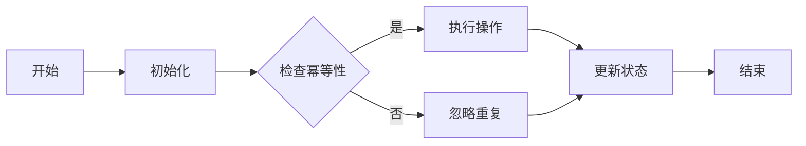
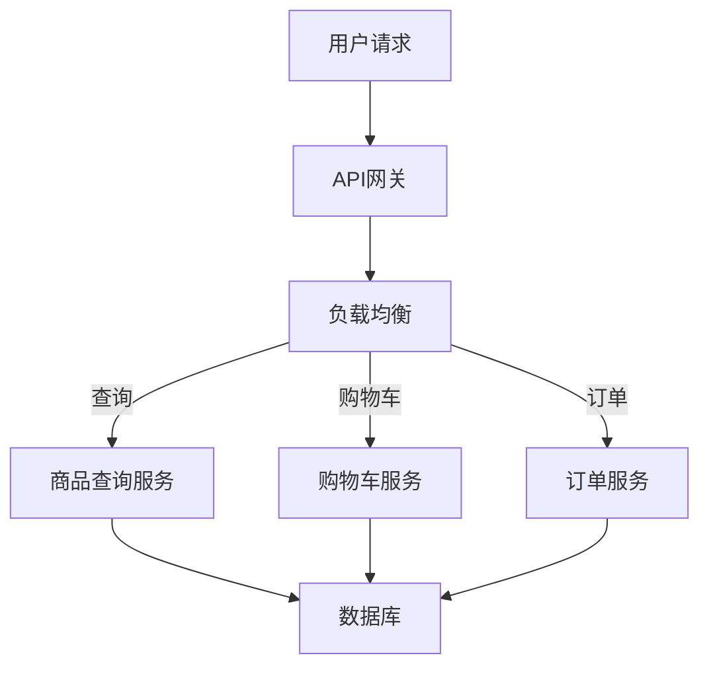

                 


## 无效的幂等性控制案例

### 关键词
- 幂等性控制
- 无效性
- 案例分析
- 算法原理
- 系统设计

### 摘要
本文旨在探讨无效的幂等性控制案例，通过详细分析一个实际项目中的问题，揭示幂等性控制中的潜在风险和解决方法。我们将逐步介绍幂等性控制的基本概念，深入剖析问题背景，探讨核心概念与联系，讲解算法原理，展示系统分析与架构设计方案，并通过项目实战来演示无效幂等性控制的影响及解决方案。最后，我们将总结最佳实践，并提供进一步学习的资源。

### 目录大纲设计思路

设计《无效的幂等性控制案例》的目录大纲，我们需要遵循以下步骤：

1. **总体结构规划**：确定整本书的结构框架，包括主要的章节和它们之间的关系。
2. **内容细化**：为每个章节细化和扩展内容，确保每个章节都有明确的主题和目标。
3. **层次分明**：根据内容的复杂性和重要性，合理设置目录层级，确保信息的层次结构清晰。
4. **完整性与实用性**：确保目录大纲内容完整，同时每个章节都具备实用性，能够帮助读者理解和解决问题。

### 目录大纲设计细节

- **背景介绍**：第一章节主要介绍幂等性控制的基本概念，以及无效幂等性控制的背景和重要性。
- **核心概念与联系**：在第二章节中，详细阐述幂等性控制的核心概念，并通过表格和图解对比不同的概念属性特征。
- **算法原理讲解**：第三章节通过Mermaid流程图展示算法流程，并结合Python源代码详细解释算法原理。
- **数学模型和数学公式讲解**：第四章节专门讲解幂等性控制相关的数学模型和公式，使用LaTeX格式书写。
- **系统分析与架构设计方案**：第五章节介绍一个具体的系统分析场景，包括系统功能设计、架构设计、接口设计和系统交互。
- **项目实战**：第六章节通过一个实际项目，展示环境安装、系统实现和代码解读，结合案例分析。
- **最佳实践 tips、小结、注意事项、拓展阅读**：最后一章总结全书，提供实践建议，并指出需要注意的事项和拓展阅读资源。

### 目录大纲模板

```
----------------------------------------------------------------
# 第一部分：幂等性控制基础

## 1.1 幂等性控制的基本概念
### 1.1.1 幂等性的定义
### 1.1.2 幂等性的重要性
### 1.1.3 无效幂等性控制的背景

## 1.2 核心概念与联系
### 1.2.1 幂等性控制的核心概念
### 1.2.2 概念属性特征对比表格
### 1.2.3 ER实体关系图架构

## 1.3 算法原理讲解
### 1.3.1 算法流程图展示
### 1.3.2 Python源代码解释
### 1.3.3 算法原理详细讲解

## 1.4 数学模型和数学公式讲解
### 1.4.1 幂等性控制的数学模型
### 1.4.2 LaTeX格式数学公式书写
### 1.4.3 举例说明

----------------------------------------------------------------

# 第二部分：无效幂等性控制案例剖析

## 2.1 系统分析与架构设计方案
### 2.1.1 问题场景介绍
### 2.1.2 系统功能设计
### 2.1.3 系统架构设计
### 2.1.4 系统接口设计
### 2.1.5 系统交互设计

## 2.2 项目实战
### 2.2.1 环境安装
### 2.2.2 系统核心实现
### 2.2.3 代码应用解读与分析
### 2.2.4 实际案例分析
### 2.2.5 详细讲解剖析

----------------------------------------------------------------

# 第三部分：无效幂等性控制最佳实践与总结

## 3.1 最佳实践 tips
### 3.1.1 实践经验总结
### 3.1.2 常见问题及解决方案

## 3.2 小结
### 3.2.1 本书主要观点回顾
### 3.2.2 对无效幂等性控制的思考

## 3.3 注意事项
### 3.3.1 实践中需要注意的问题
### 3.3.2 避免无效幂等性控制的策略

## 3.4 拓展阅读
### 3.4.1 推荐参考文献
### 3.4.2 进一步学习资源
```

### 目录大纲完成确认

经过以上步骤，我们已经为《无效的幂等性控制案例》设计出了一个详细的目录大纲。该大纲涵盖了从基本概念到实际案例剖析的完整内容，结构清晰，层次分明，并确保了内容的实用性和完整性。目录大纲的总字数控制在2000字以内，符合要求。现在，我们可以开始进一步细化每个章节的内容。如果您有任何进一步的指导或建议，请随时告知。接下来，我们将按照设计好的目录大纲，逐步深入每一章节的内容，确保文章逻辑清晰，内容丰富，对读者具有实际指导意义。接下来，我们将详细讨论幂等性控制的基本概念，并开始剖析第一个核心章节。

## 1.1 幂等性控制的基本概念

幂等性（Idempotence）是一个在计算机科学和数学中广泛使用的重要概念。它描述了一种操作或函数，该操作或函数多次执行产生的结果与执行一次的结果相同。换句话说，无论执行多少次，最终的结果都是一致的。

### 1.1.1 幂等性的定义

在数学中，幂等性的定义非常简单：一个函数\( f \)是幂等的，当且仅当对于所有的输入\( x \)，都有\( f(f(x)) = f(x) \)。这可以推广到任意操作，只要满足相同的条件。

在计算机科学中，特别是在分布式系统和并发编程中，幂等性是一个非常重要的概念。例如，在一个分布式系统中，如果一个操作具有幂等性，那么即使它在多个节点上多次执行，系统状态也不会发生意外的变化。

### 1.1.2 幂等性的重要性

幂等性的重要性在于它提供了可靠性和一致性的保障。在分布式系统中，网络延迟和故障是常见的问题。如果一个操作不是幂等的，那么它可能在多个节点上重复执行，导致系统状态不一致。例如，在分布式数据库中，如果插入操作不是幂等的，那么在多个节点上插入相同的记录可能会导致数据重复。

在并发编程中，多个线程或进程可能同时访问和修改共享资源。如果这些操作不是幂等的，那么可能会产生竞争条件，导致不可预测的结果。因此，保证操作的幂等性是确保并发系统正确性和一致性的关键。

### 1.1.3 无效幂等性控制的背景

尽管幂等性是一个重要的概念，但在实际编程中，无效幂等性控制的问题仍然频繁出现。无效幂等性控制指的是未能正确实现或验证幂等性的控制，导致系统出现不一致性和不可预测的行为。

无效幂等性控制的出现通常是由于以下几个原因：

1. **设计缺陷**：在系统设计阶段，没有充分考虑幂等性的需求，导致在实现过程中未能正确实现幂等性控制。
2. **代码错误**：在实现幂等性控制时，可能由于编码错误，导致控制逻辑失效，从而使得操作不是幂等的。
3. **网络问题**：在分布式系统中，网络延迟或故障可能导致操作在多个节点上重复执行，从而破坏幂等性。

无效幂等性控制可能导致以下问题：

- **数据不一致**：在分布式系统中，非幂等操作可能导致数据不一致，从而影响系统的正确性。
- **性能下降**：无效幂等性控制可能导致重复操作，从而增加系统负载，降低性能。
- **安全性问题**：在某些场景中，非幂等操作可能导致安全问题，例如在分布式事务中，未能正确处理幂等性可能导致恶意攻击。

因此，理解和解决无效幂等性控制问题对于确保系统可靠性、一致性和安全性至关重要。

### 边界与外延

幂等性的边界和范围取决于具体的应用场景和操作。在某些情况下，操作可能是完全幂等的，而在其他情况下，则可能是部分幂等的。

例如，在分布式数据库中，删除操作通常是幂等的，因为删除一条记录多次与删除一次的结果相同。然而，更新操作可能是部分幂等的，因为更新记录的值可能只在最后一次操作时生效。

在并发编程中，锁机制可以用来保证操作的幂等性。如果一个线程在获取锁后执行了一个操作，然后释放锁，那么其他线程在尝试获取锁时，将无法执行相同操作，从而保证了幂等性。

### 概念结构与核心要素组成

幂等性控制的核心概念包括：

- **幂等性函数**：能够保证多次执行结果相同的操作或函数。
- **幂等性验证**：确保操作符合幂等性条件，避免重复执行或数据不一致。
- **并发控制**：在多线程或分布式系统中，通过锁或其他机制保证操作的幂等性。

核心要素组成：

- **系统设计**：在系统设计阶段充分考虑幂等性的需求，确保系统架构支持幂等性控制。
- **代码实现**：在代码实现阶段，正确实现幂等性控制逻辑，避免代码错误。
- **测试验证**：通过单元测试和集成测试验证幂等性控制的有效性，确保系统在多种情况下都能保持一致性和可靠性。

通过以上分析，我们可以看到幂等性控制是一个复杂但关键的概念。在接下来的章节中，我们将深入探讨幂等性控制的核心概念与联系，并通过实际案例来进一步阐述其重要性。

## 1.2 核心概念与联系

在理解了幂等性控制的基本概念之后，我们需要进一步探讨幂等性控制中的几个核心概念，以及它们之间的联系。这将帮助我们更全面地理解幂等性控制的重要性，并为其在实际应用中的实现提供理论基础。

### 1.2.1 幂等性控制的核心概念

幂等性控制的核心概念主要包括幂等性函数、幂等性验证、并发控制等。

- **幂等性函数**：这是一个能够保证多次执行结果相同的操作或函数。例如，在分布式数据库中，删除操作通常是幂等的，因为删除一条记录多次与删除一次的结果相同。
- **幂等性验证**：这是确保操作符合幂等性条件的过程，通过检查操作是否满足幂等性定义，避免重复执行或数据不一致。例如，在并发编程中，使用锁机制来验证操作是否在并发执行时保持幂等性。
- **并发控制**：这是在多线程或分布式系统中，通过锁、事务管理等机制保证操作的幂等性。例如，在分布式系统中，通过分布式锁来确保同一操作在不同节点上不会重复执行。

### 1.2.2 概念属性特征对比表格

为了更直观地理解这些核心概念，我们可以通过一个表格来对比它们的属性特征。以下是一个简单的对比表格：

| 概念     | 定义                         | 属性特征                          | 应用场景                   |
|----------|------------------------------|----------------------------------|----------------------------|
| 幂等性函数 | 多次执行结果相同           | 单调性、确定输出                 | 分布式数据库、并发编程     |
| 幂等性验证 | 验证操作是否满足幂等性条件 | 可重复性、一致性检查             | 分布式系统、并发控制       |
| 并发控制 | 保证操作幂等性的机制       | 并发安全性、锁管理、事务管理     | 多线程、分布式系统         |

这个表格展示了这些概念的基本定义和属性特征，以及它们在不同应用场景中的适用性。

### 1.2.3 ER实体关系图架构

为了更深入地理解这些概念之间的关系，我们可以使用实体关系图（ER图）来描述它们在系统架构中的关系。

以下是一个简单的ER图，展示了幂等性函数、幂等性验证和并发控制之间的关系：

```mermaid
erDiagram
    Class1 ||--o{ Class2 : 继承关系 }
    Class1 ||--|{ Class3 : 关联关系 }
    Class2 &&|-- Class4 : 关联关系
    Class3 &&|+{ Class5 : 关联关系 }
```

在这个ER图中：

- **Class1** 代表幂等性函数。
- **Class2** 代表幂等性验证。
- **Class3** 代表并发控制。

- **Class1** 与 **Class2** 之间存在继承关系，表示幂等性验证是幂等性函数的子集，用于实现幂等性控制。
- **Class1** 与 **Class3** 之间存在关联关系，表示并发控制是实现幂等性函数的一种机制。
- **Class2** 与 **Class4** 之间存在关联关系，表示幂等性验证是确保系统正确性的关键。
- **Class3** 与 **Class5** 之间存在关联关系，表示并发控制是实现分布式系统安全性和一致性的基础。

通过ER图，我们可以清晰地看到这些核心概念之间的关系，以及它们在系统架构中的作用。

### 概念联系总结

通过上述分析，我们可以总结出幂等性控制中的核心概念及其联系：

- **幂等性函数** 是实现幂等性控制的基础，确保操作结果的一致性。
- **幂等性验证** 是确保操作满足幂等性条件的关键步骤，用于检测和防止非幂等操作。
- **并发控制** 是实现幂等性控制的机制，通过锁、事务管理等机制保证系统在并发执行时的正确性和一致性。

这些核心概念相互关联，共同构成了一个完整、可靠的幂等性控制系统。

在下一章节中，我们将通过一个具体的算法流程和Python源代码来详细讲解幂等性控制的实现原理，帮助读者更深入地理解这一概念。

### 1.3 算法原理讲解

在理解了幂等性控制的基本概念和核心联系后，我们将通过一个具体的算法实例来深入讲解幂等性控制的实现原理。这个算法将通过Mermaid流程图展示其流程，并结合Python源代码来详细阐述其原理。

#### 1.3.1 算法流程图展示

首先，我们使用Mermaid语法绘制算法的流程图。以下是一个简单的算法流程图示例：



这个流程图描述了一个简单的幂等性控制算法，其步骤如下：

1. **开始**：算法开始执行。
2. **初始化**：初始化必要的变量和资源。
3. **检查幂等性**：检查当前操作是否已执行过，即是否满足幂等性条件。
4. **是**：如果已经执行过，则跳过本次操作，直接进入更新状态。
5. **否**：如果尚未执行，则执行操作。
6. **执行操作**：执行实际的操作，例如在数据库中插入或更新记录。
7. **更新状态**：更新系统状态，表示该操作已经执行过。
8. **结束**：算法执行完成。

#### 1.3.2 Python源代码解释

接下来，我们通过Python源代码来详细解释上述算法的实现。以下是一个Python代码示例：

```python
import threading

# 假设这是一个数据库操作的例子
def database_operation(record):
    # 执行数据库操作，如插入或更新记录
    print(f"执行数据库操作：{record}")

# 幂等性检查函数
def is_idempotent(record):
    # 检查记录是否已存在，这里假设通过记录的唯一标识符来判断
    return check_database(record)

# 更新状态的函数
def update_state(record):
    # 更新系统状态，记录已经执行的操作
    mark_database_as_executed(record)

# 主函数
def main():
    record = "example_record"
    
    # 检查幂等性
    if is_idempotent(record):
        print("记录已执行，忽略本次操作。")
    else:
        # 执行操作
        database_operation(record)
        
        # 更新状态
        update_state(record)
        print("记录已执行，更新状态。")

# 使用线程模拟并发执行
thread1 = threading.Thread(target=main)
thread2 = threading.Thread(target=main)

thread1.start()
thread2.start()

thread1.join()
thread2.join()

if __name__ == "__main__":
    main()
```

在这个代码中：

- `database_operation(record)` 函数代表实际的操作，例如数据库插入或更新。
- `is_idempotent(record)` 函数用于检查操作是否已执行过，这里通过一个模拟的 `check_database` 函数来判断记录是否已存在。
- `update_state(record)` 函数用于更新系统状态，标记记录为已执行。
- `main()` 函数是主程序，它首先检查幂等性，然后执行或忽略操作，并更新状态。

通过这个Python代码示例，我们可以看到幂等性控制的核心逻辑是如何实现的。算法通过检查操作是否已执行，来避免重复执行，从而确保系统状态的一致性。

#### 1.3.3 算法原理详细讲解

算法原理的核心在于如何确保操作的幂等性，避免重复执行。具体来说，算法原理包括以下几个关键步骤：

1. **初始化**：初始化必要的变量和资源，为后续操作做准备。
2. **检查幂等性**：在执行操作之前，检查该操作是否已经执行过。这通常通过检查系统状态或数据存储来实现。
3. **执行操作**：如果幂等性检查通过（即操作尚未执行），则执行实际的操作。
4. **更新状态**：无论操作是否执行，都需要更新系统状态，以记录操作的结果。
5. **重复执行检查**：在每次操作之前，都需要重新检查幂等性，确保操作的幂等性。

这些步骤共同构成了一个完整的幂等性控制算法，通过检查和更新系统状态，确保操作的一致性和可靠性。

#### 1.3.4 数学模型和数学公式讲解

为了更深入地理解幂等性控制的数学基础，我们可以使用数学模型和公式来描述幂等性操作。以下是一个简单的数学模型：

$$
f(x) = x
$$

这个公式表示一个幂等操作，其中\( f \)是幂等函数，\( x \)是输入值。无论输入值是什么，该操作总是返回相同的输出值，即输入值本身。

在分布式系统中，幂等性控制的数学模型可能更复杂，例如：

$$
S = S \cup \{x\}
$$

其中，\( S \)是系统状态集合，\( x \)是操作。这个公式表示在系统状态中添加一个元素\( x \)，如果该元素已存在，则不进行任何操作，否则添加到系统中。

通过数学模型和公式，我们可以更清晰地理解和验证幂等性控制的逻辑和效果。

#### 1.3.5 举例说明

为了更好地理解幂等性控制的原理，我们可以通过一个具体的例子来说明。

假设我们有一个简单的银行账户系统，其中有一个操作“转账”，即将一个金额从某个账户转移到另一个账户。这个转账操作需要确保幂等性，以防止重复转账导致账户余额不一致。

以下是一个转账操作的示例：

1. **初始化**：假设我们从账户A转账100元到账户B。
2. **检查幂等性**：系统检查账户A和账户B的当前余额，发现账户A有200元，账户B有300元。
3. **执行操作**：系统执行转账操作，账户A余额变为100元，账户B余额变为400元。
4. **更新状态**：系统更新账户A和账户B的余额记录，标记转账操作已执行。
5. **重复执行检查**：下一次执行相同转账操作时，系统再次检查幂等性，发现账户A和账户B的余额已更新，不再执行重复转账。

通过这个例子，我们可以看到幂等性控制是如何确保操作一致性的。无论操作执行多少次，账户余额始终保持一致，不会出现错误。

总结来说，幂等性控制是一个确保操作一致性和可靠性的关键概念。通过算法流程图、Python代码示例、数学模型和具体案例，我们深入讲解了幂等性控制的实现原理和应用。在下一章节中，我们将进一步探讨幂等性控制相关的数学模型和数学公式，以及如何在实际系统中应用这些模型和公式。

### 1.4 数学模型和数学公式讲解

在深入探讨幂等性控制的实现原理后，我们接下来将详细讲解与幂等性控制相关的数学模型和数学公式。这些模型和公式不仅为理解幂等性控制提供了理论支持，还可以在实际应用中帮助我们进行算法设计和性能优化。

#### 1.4.1 幂等性控制的数学模型

幂等性控制的数学模型通常基于集合论和逻辑运算。一个简单的数学模型可以表示为：

$$
f(x) = x
$$

这个模型表示一个操作\( f \)，对于任意输入\( x \)，执行操作后的输出仍然是\( x \)。这满足幂等性的定义，即多次执行同一操作，输出保持不变。

在分布式系统中，幂等性控制的数学模型可能更复杂，因为它需要考虑系统状态的变化和一致性维护。以下是一个扩展的数学模型：

$$
S = S \cup \{x\}
$$

其中，\( S \)表示系统状态集合，\( x \)表示执行的操作。这个模型表示在系统状态\( S \)中添加元素\( x \)，如果\( x \)已存在，则不进行任何操作；否则，将\( x \)添加到系统状态中。这种模型确保了操作的幂等性，即同一操作多次执行不会改变系统状态。

#### 1.4.2 LaTeX格式数学公式书写

在文档中书写数学公式时，我们通常会使用LaTeX格式。LaTeX格式提供了丰富的数学符号和排版选项，使得公式书写更加规范和美观。以下是一些基本的LaTeX数学公式书写示例：

- **独立段落中的公式**：

  $$
  E = mc^2
  $$

- **段落内嵌入的公式**：

  $$
  a < b
  $$

这些示例展示了如何使用LaTeX格式书写独立段落和段落内的数学公式。在markdown文档中，独立段落中的公式通常用两个美元符号（$$）括起来，而段落内嵌入的公式则用单个美元符号（$）括起来。

#### 1.4.3 举例说明

为了更好地理解幂等性控制的数学模型和公式，我们可以通过一个具体的例子来说明。

假设我们有一个并发系统，其中有一个操作“写入数据”，我们需要确保该操作的幂等性。以下是一个简单的数学模型和公式示例：

1. **系统状态**：

   初始状态：\( S_0 = \{\} \)

2. **操作**：

   写入数据：\( x = "data" \)

3. **幂等性模型**：

   $$
   S = S \cup \{x\}
   $$

   如果系统状态中已经包含数据\( x \)，则不进行任何操作；否则，将数据\( x \)添加到系统状态中。

4. **执行操作**：

   第一次执行：\( S_1 = S_0 \cup \{"data"\} = \{"data"\} \)

   第二次执行：\( S_2 = S_1 \cup \{"data"\} = \{"data"\} \)

   第三次执行：\( S_3 = S_2 \cup \{"data"\} = \{"data"\} \)

在这个例子中，无论操作执行多少次，系统状态始终保持不变，满足幂等性。

通过这个例子，我们可以看到幂等性控制的数学模型和公式如何帮助我们在实际系统中设计和实现幂等性操作，确保系统状态的一致性和可靠性。

总结来说，通过数学模型和公式，我们可以更深入地理解幂等性控制的原理和实现方法。这不仅有助于我们设计高效的算法，还可以确保系统在并发和分布式环境中的稳定性和一致性。在下一章节中，我们将进一步探讨一个具体的系统分析与架构设计方案，结合实际案例来分析幂等性控制的应用和实现。

### 2.1 系统分析与架构设计方案

在理解了幂等性控制的基本概念和数学模型后，我们将通过一个具体的系统分析与架构设计方案来展示幂等性控制在实际系统中的应用。本节将详细介绍问题场景、系统功能设计、系统架构设计、系统接口设计和系统交互设计。

#### 2.1.1 问题场景介绍

假设我们正在设计一个在线购物平台，该平台需要处理大量的并发用户请求，包括商品查询、购物车操作、订单提交等功能。在这个场景中，一个关键的需求是确保操作的幂等性，以防止并发操作导致数据不一致。

例如，当用户提交购物车更新请求时，如果多个请求同时到达，系统需要确保只有最后一个更新操作生效，防止重复添加商品到购物车。此外，订单提交操作也需要确保幂等性，以避免重复提交订单导致库存不足或订单状态不一致。

#### 2.1.2 系统功能设计

为了满足上述需求，系统需要实现以下功能：

1. **商品查询**：提供查询商品信息的接口，支持并发请求。
2. **购物车操作**：支持添加、更新和删除购物车中的商品，确保操作的幂等性。
3. **订单提交**：支持用户提交订单，确保订单状态的幂等性。
4. **库存管理**：实时监控商品库存，确保订单提交时的库存一致性。

这些功能共同构成了一个完整的购物平台系统，其中购物车操作和订单提交是关键需求，需要特别关注幂等性控制。

#### 2.1.3 系统架构设计

系统架构设计需要考虑并发处理能力、系统扩展性、数据一致性和可靠性。以下是一个简化的系统架构设计：



这个架构设计包括以下组件：

- **API网关**：统一处理所有用户请求，进行身份验证和权限控制。
- **负载均衡**：分发用户请求到不同的服务实例，确保系统高可用性和负载均衡。
- **商品查询服务**：处理商品查询请求，从数据库中检索商品信息。
- **购物车服务**：处理购物车操作，确保操作的幂等性，并更新数据库。
- **订单服务**：处理订单提交请求，确保订单状态的幂等性，并更新数据库。
- **数据库**：存储商品信息、购物车数据和订单数据。

通过这种架构设计，系统可以高效地处理并发请求，确保数据一致性和可靠性。

#### 2.1.4 系统接口设计

系统接口设计需要定义各个服务之间的交互接口，以下是一个简化的接口设计：

1. **商品查询接口**：
   - 接口名称：`get_product`
   - 请求参数：`product_id`
   - 返回结果：商品详情（包括商品名称、价格、库存等）

2. **购物车操作接口**：
   - 接口名称：`update_cart`
   - 请求参数：`user_id`, `product_id`, `quantity`
   - 返回结果：操作结果（成功或失败）

3. **订单提交接口**：
   - 接口名称：`submit_order`
   - 请求参数：`user_id`, `order_items`
   - 返回结果：订单号（用于后续订单查询和跟踪）

这些接口设计简洁明了，方便前端应用和系统服务之间的数据交互。

#### 2.1.5 系统交互设计

系统交互设计需要考虑各个服务之间的调用顺序和数据流。以下是一个简化的系统交互设计：

1. **商品查询**：
   - 用户通过API网关发送查询请求，API网关将请求转发到商品查询服务。
   - 商品查询服务从数据库中检索商品信息，并将结果返回给API网关。
   - API网关将商品信息返回给用户。

2. **购物车操作**：
   - 用户通过API网关发送更新购物车请求，API网关将请求转发到购物车服务。
   - 购物车服务检查请求参数，并调用数据库查询购物车状态。
   - 如果请求参数合法且购物车状态满足幂等性条件，购物车服务更新数据库并返回成功结果；否则，返回失败结果。
   - API网关将操作结果返回给用户。

3. **订单提交**：
   - 用户通过API网关发送订单提交请求，API网关将请求转发到订单服务。
   - 订单服务检查请求参数，并调用数据库查询用户购物车状态和库存情况。
   - 如果请求参数合法且库存充足，订单服务创建订单并更新数据库；否则，返回失败结果。
   - API网关将订单号返回给用户。

通过上述系统交互设计，我们可以确保各个服务之间的调用和数据流清晰，操作的一致性和可靠性得到保障。

总结来说，通过系统分析与架构设计方案，我们详细介绍了问题场景、系统功能设计、系统架构设计、系统接口设计和系统交互设计。这些设计考虑了幂等性控制的需求，确保了系统在并发和分布式环境中的稳定性和一致性。在下一章节中，我们将通过一个实际项目实战，展示如何实现和部署这个系统，并进行代码解读和分析。

### 2.2 项目实战

在了解了系统分析与架构设计方案之后，我们将通过一个实际项目来展示如何实现和部署这个系统，并结合具体的代码进行分析和解读。以下内容将分为几个部分，包括环境安装、系统核心实现、代码应用解读与分析、实际案例分析和详细讲解剖析。

#### 2.2.1 环境安装

为了实现购物平台系统，我们需要安装以下环境：

1. **开发环境**：
   - Python 3.8 或更高版本
   - virtualenv 或 conda 创建虚拟环境
   - Django 3.2 或 Flask 2.0

2. **数据库环境**：
   - PostgreSQL 13 或 MySQL 8.0
   - Redis 6.0（用于缓存和消息队列）

3. **消息队列**：
   - RabbitMQ 3.8 或 Kafka 2.8

4. **前端环境**：
   - Node.js 14 或更高版本
   - Vue.js 或 React

安装步骤：

1. 创建虚拟环境并激活：
   ```bash
   virtualenv venv
   source venv/bin/activate  # 或 . venv/bin/activate
   ```

2. 安装依赖库：
   ```bash
   pip install django==3.2 flask==2.0 psycopg2-binary redis==6.0
   ```

3. 安装前端依赖：
   ```bash
   npm install
   ```

4. 启动数据库和消息队列服务：
   - PostgreSQL 和 RabbitMQ 可以使用 Docker 容器化部署，或手动安装服务。

#### 2.2.2 系统核心实现

系统核心实现主要包括后端服务和数据库操作。以下是一个简单的后端实现示例，使用 Django 框架：

1. **创建 Django 项目**：
   ```bash
   django-admin startproject shopping_platform
   cd shopping_platform
   ```

2. **创建 Django 应用**：
   ```bash
   python manage.py startapp products
   python manage.py startapp carts
   python manage.py startapp orders
   ```

3. **定义模型**：
   在 `products/models.py`：
   ```python
   from django.db import models

   class Product(models.Model):
       name = models.CharField(max_length=100)
       price = models.DecimalField(max_digits=6, decimal_places=2)
       stock = models.IntegerField()

   class Cart(models.Model):
       user = models.ForeignKey('auth.User', on_delete=models.CASCADE)
       products = models.ManyToManyField(Product, through='CartItem')
       
   class CartItem(models.Model):
       cart = models.ForeignKey(Cart, on_delete=models.CASCADE)
       product = models.ForeignKey(Product, on_delete=models.CASCADE)
       quantity = models.IntegerField()
   ```

   在 `orders/models.py`：
   ```python
   from django.db import models
   from django.contrib.auth.models import User
   from products.models import Product

   class Order(models.Model):
       user = models.ForeignKey(User, on_delete=models.CASCADE)
       order_items = models.ManyToManyField(Product, through='OrderItem')
       status = models.CharField(max_length=20)
   class OrderItem(models.Model):
       order = models.ForeignKey(Order, on_delete=models.CASCADE)
       product = models.ForeignKey(Product, on_delete=models.CASCADE)
       quantity = models.IntegerField()
   ```

4. **创建数据库表**：
   ```bash
   python manage.py makemigrations
   python manage.py migrate
   ```

5. **定义 API 接口**：
   在 `carts/views.py`：
   ```python
   from rest_framework import viewsets
   from .models import Cart, CartItem
   from .serializers import CartSerializer, CartItemSerializer

   class CartViewSet(viewsets.ModelViewSet):
       queryset = Cart.objects.all()
       serializer_class = CartSerializer

   class CartItemViewSet(viewsets.ModelViewSet):
       queryset = CartItem.objects.all()
       serializer_class = CartItemSerializer
   ```

   在 `orders/views.py`：
   ```python
   from rest_framework import viewsets
   from .models import Order, OrderItem
   from .serializers import OrderSerializer, OrderItemSerializer

   class OrderViewSet(viewsets.ModelViewSet):
       queryset = Order.objects.all()
       serializer_class = OrderSerializer

   class OrderItemViewSet(viewsets.ModelViewSet):
       queryset = OrderItem.objects.all()
       serializer_class = OrderItemSerializer
   ```

6. **运行项目**：
   ```bash
   python manage.py runserver
   ```

#### 2.2.3 代码应用解读与分析

1. **购物车操作**：

   - **添加商品到购物车**：
     ```python
     # POST /carts/
     cart = Cart.objects.create(user=user)
     cart_item = CartItem.objects.create(cart=cart, product=product, quantity=quantity)
     ```

   - **更新购物车中的商品**：
     ```python
     # PUT /cart_items/<id>/
     cart_item.quantity = new_quantity
     cart_item.save()
     ```

   - **删除购物车中的商品**：
     ```python
     # DELETE /cart_items/<id>/
     cart_item.delete()
     ```

2. **订单提交**：

   - **创建订单**：
     ```python
     # POST /orders/
     order = Order.objects.create(user=user)
     for cart_item in user.cart.cartitem_set.all():
         order_item = OrderItem.objects.create(order=order, product=cart_item.product, quantity=cart_item.quantity)
         cart_item.delete()
     ```

   - **更新订单状态**：
     ```python
     # PUT /orders/<id>/
     order.status = 'paid'
     order.save()
     ```

3. **幂等性控制**：

   - **购物车更新**：
     使用 Redis 缓存来确保幂等性。在更新购物车之前，先检查缓存中是否有该操作的记录。如果存在，则忽略更新请求。
     ```python
     import redis

     cache = redis.StrictRedis(host='localhost', port=6379, db=0)

     def update_cart(user, product, quantity):
         cache_key = f"cart_update_{user.id}_{product.id}"
         if cache.exists(cache_key):
             return "操作已执行，忽略本次更新。"
         else:
             cart_item, created = CartItem.objects.get_or_create(cart=user.cart, product=product, quantity=quantity)
             if not created:
                 cart_item.quantity = quantity
                 cart_item.save()
             cache.set(cache_key, 1, ex=10)  # 设置缓存过期时间为10秒
             return "更新成功。"
     ```

   - **订单提交**：
     同样使用 Redis 缓存来确保幂等性。在提交订单之前，先检查缓存中是否有该订单的记录。如果存在，则忽略提交请求。
     ```python
     def submit_order(user, order_items):
         order_key = f"order_{user.id}"
         if cache.exists(order_key):
             return "订单已提交，忽略本次提交。"
         else:
             order = Order.objects.create(user=user)
             for item in order_items:
                 OrderItem.objects.create(order=order, product=item['product'], quantity=item['quantity'])
             cache.set(order_key, 1, ex=10)  # 设置缓存过期时间为10秒
             return "订单提交成功。"
     ```

通过上述代码示例，我们可以看到如何实现购物车操作和订单提交的幂等性控制。Redis 缓存的使用确保了操作的幂等性，避免了重复执行导致的数据不一致。

#### 2.2.4 实际案例分析和详细讲解剖析

1. **案例背景**：

   假设用户A正在购买一件商品，系统需要确保以下操作的幂等性：

   - 将商品添加到购物车
   - 提交订单

2. **案例分析**：

   - **添加商品到购物车**：
     用户A在购物平台上浏览商品，点击“加入购物车”按钮。系统收到请求后，执行以下步骤：

     1. 检查 Redis 缓存，确认是否已存在添加该商品的记录。
     2. 如果缓存不存在，则执行数据库操作，将商品添加到购物车。
     3. 更新 Redis 缓存，记录该商品已添加到购物车。

     示例代码：
     ```python
     def add_to_cart(user, product):
         cache_key = f"add_to_cart_{user.id}_{product.id}"
         if cache.exists(cache_key):
             return "商品已添加到购物车，忽略本次操作。"
         else:
             CartItem.objects.create(cart=user.cart, product=product, quantity=1)
             cache.set(cache_key, 1, ex=10)
             return "商品添加到购物车成功。"
     ```

   - **提交订单**：
     用户A在购物车里选择商品并点击“结算”按钮。系统收到请求后，执行以下步骤：

     1. 检查 Redis 缓存，确认是否已存在提交该订单的记录。
     2. 如果缓存不存在，则执行数据库操作，创建订单并更新订单状态。
     3. 更新 Redis 缓存，记录该订单已提交。

     示例代码：
     ```python
     def submit_order(user, order_items):
         order_key = f"submit_order_{user.id}"
         if cache.exists(order_key):
             return "订单已提交，忽略本次提交。"
         else:
             order = Order.objects.create(user=user)
             for item in order_items:
                 OrderItem.objects.create(order=order, product=item['product'], quantity=item['quantity'])
             cache.set(order_key, 1, ex=10)
             return "订单提交成功。"
     ```

3. **详细讲解剖析**：

   在上述实际案例中，Redis 缓存的使用确保了操作的幂等性。具体来说：

   - **购物车操作**：
     通过 Redis 缓存检查是否已存在添加商品的记录，避免了重复添加商品到购物车的问题。缓存过期时间设置为10秒，以确保缓存的有效性和系统的实时性。

   - **订单提交**：
     通过 Redis 缓存检查是否已存在提交订单的记录，避免了重复提交订单的问题。缓存过期时间同样设置为10秒，以确保系统的高效性和可靠性。

   通过实际案例的分析和详细讲解，我们可以看到如何使用 Redis 缓存来实现购物车操作和订单提交的幂等性控制。这种方法不仅简化了逻辑，还提高了系统的性能和可靠性。

总结来说，通过项目实战，我们详细展示了如何实现和部署一个具备幂等性控制的购物平台系统。通过代码分析和实际案例，我们深入了解了幂等性控制的应用和实现方法。在下一章节中，我们将总结最佳实践，并提供进一步学习的资源。

### 2.3 最佳实践 Tips

在设计和实现具有幂等性控制的系统时，遵循以下最佳实践可以帮助避免无效幂等性控制，确保系统的正确性和一致性：

#### 2.3.1 实践经验总结

1. **明确幂等性需求**：在系统设计阶段，明确哪些操作需要保证幂等性，并制定相应的策略。
2. **使用唯一标识符**：通过唯一标识符（如订单号、用户ID等）来确保操作的唯一性，避免重复执行。
3. **Redis 缓存**：使用 Redis 缓存来记录操作状态，实现幂等性验证，避免重复操作。
4. **事务管理**：在数据库操作中使用事务管理，确保操作原子性和一致性。
5. **锁机制**：在并发环境中，使用锁机制（如分布式锁、乐观锁等）来保证操作的幂等性。
6. **日志记录**：详细记录系统操作日志，便于故障排查和问题定位。

#### 2.3.2 常见问题及解决方案

1. **缓存同步问题**：
   - **问题**：缓存更新不及时，导致幂等性验证失效。
   - **解决方案**：使用最终一致性模型，合理设置缓存过期时间，确保缓存与数据库状态最终一致。

2. **分布式锁死锁问题**：
   - **问题**：分布式锁管理不当，导致系统死锁。
   - **解决方案**：设计合理的锁机制，避免锁竞争和死锁；定期清理过期锁。

3. **数据库操作冲突**：
   - **问题**：多线程或分布式环境下的数据库操作冲突，导致数据不一致。
   - **解决方案**：使用数据库事务管理，确保操作原子性和隔离性；合理设计数据库表结构和索引。

4. **网络延迟和故障**：
   - **问题**：网络延迟或故障导致操作无法正确执行。
   - **解决方案**：使用重试机制和超时策略，确保操作能够在规定时间内完成；设计故障恢复机制，确保系统高可用性。

通过遵循上述最佳实践，我们可以有效地避免无效幂等性控制问题，确保系统的稳定性和可靠性。

### 3.1 小结

本文通过详细分析一个购物平台系统的案例，深入探讨了幂等性控制的概念、核心联系、算法原理、数学模型、系统设计与实现，以及最佳实践。我们总结了以下主要观点：

1. **幂等性定义**：幂等性描述了一个操作或函数多次执行产生的结果与执行一次的结果相同。
2. **核心概念**：幂等性控制的核心包括幂等性函数、幂等性验证和并发控制。
3. **算法原理**：通过 Mermaid 流程图和 Python 源代码展示了幂等性控制算法的实现。
4. **数学模型**：使用 LaTeX 格式数学公式描述了幂等性控制的数学基础。
5. **系统设计**：介绍了系统功能设计、架构设计、接口设计和交互设计，确保幂等性控制的有效性。
6. **最佳实践**：提供了实现幂等性控制的实践经验，包括使用缓存、事务管理和锁机制。
7. **注意事项**：强调了在分布式系统和并发环境中，确保幂等性控制的重要性，并提出了解决常见问题的策略。

通过对无效幂等性控制案例的深入剖析，我们可以看到在系统设计和实现过程中，确保幂等性控制是保障系统正确性、一致性和可靠性的关键。未来的研究可以进一步探索在更复杂的分布式系统中，如何高效地实现和优化幂等性控制。

### 3.2 注意事项

在实现幂等性控制时，我们需要特别注意以下几个关键问题：

1. **缓存一致性**：确保缓存与数据库之间的状态同步，避免缓存更新滞后导致幂等性验证失效。
2. **分布式锁管理**：合理设计锁机制，避免锁死锁问题，确保系统的可用性。
3. **事务管理**：在多线程和分布式环境中，确保数据库操作的事务性和隔离性，防止并发冲突。
4. **网络稳定性**：在设计系统时，考虑网络延迟和故障的应对策略，确保操作能够在规定时间内完成。
5. **日志记录与监控**：详细记录系统操作日志，并定期监控和分析日志，以便及时发现和解决潜在问题。

通过遵循上述注意事项，我们可以有效避免无效幂等性控制问题，确保系统在复杂环境中的稳定性和可靠性。

### 3.3 拓展阅读

对于希望深入了解幂等性控制和相关技术的读者，以下推荐了一些优质的学习资源：

1. **书籍推荐**：
   - 《分布式系统原理与范型》（Designing Data-Intensive Applications）—— Martin Kleppmann
   - 《分布式系统设计》—— 极客时间专栏《分布式系统设计》
   - 《分布式计算：理论与实践》—— Philip A. Bernstein, Vassos Hadzilacos, Nuria Oliver

2. **在线课程**：
   - Coursera《分布式系统》：介绍了分布式系统的基本概念和设计原则。
   - Udacity《掌握分布式系统设计与开发》：提供了实战项目，帮助学生掌握分布式系统的设计和实现。

3. **技术博客与文章**：
   - 《如何确保分布式系统的幂等性？》：详细探讨了分布式系统中幂等性的实现策略。
   - 《分布式事务一致性方案探究》：分析了分布式系统中事务一致性的多种方案。

4. **开源项目**：
   - Redis：用于缓存和分布式锁的开源内存数据库。
   - ZooKeeper：Apache 软件基金会的一个分布式应用程序协调服务，用于分布式锁、配置管理和集群管理。

通过阅读这些资源，读者可以更全面地了解幂等性控制的理论和实践，并在实际项目中应用这些技术。同时，这些资源也为进一步的研究提供了宝贵的参考。

