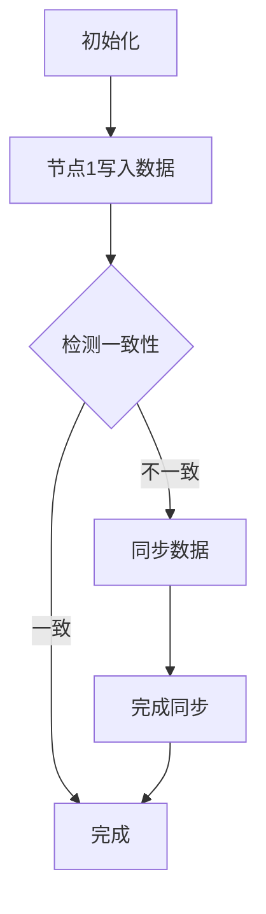
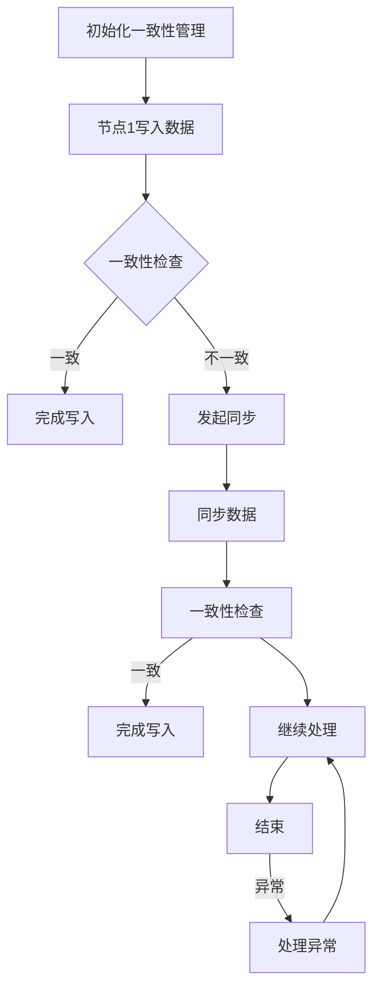
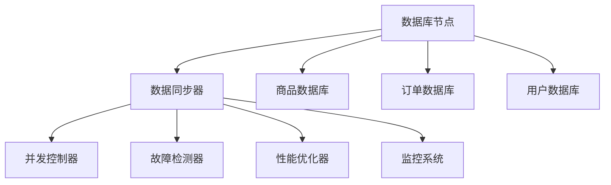

                 

### 第一部分：背景介绍

#### 第1章：数据一致性问题概述

在信息化飞速发展的当今社会，数据已经成为企业和社会的重要资产。随着互联网和分布式系统的广泛应用，数据的一致性问题成为了一个不可忽视的关键问题。尤其是在异构系统中，数据一致性问题更加复杂和重要。本章节将围绕数据一致性问题展开，首先介绍异构系统的定义与特点，然后讨论数据一致性的重要性、发展历程、挑战与需求，以及常见的数据一致性解决方案和技术应用场景。通过这些内容，为后续章节的深入讨论打下基础。

#### 1.1 问题背景

##### 1.1.1 异构系统的定义与特点

异构系统（Heterogeneous System）是指由多种不同类型的硬件、软件和网络构成的系统。这些系统可能由不同的供应商提供，使用不同的技术标准，运行在不同的平台上，但它们需要协同工作，以满足特定的业务需求。典型的异构系统包括云计算环境中的虚拟机、容器、物理服务器，以及不同数据库系统之间的交互。

异构系统的特点主要包括：

1. **多样性**：系统组件种类繁多，包括不同的硬件、操作系统、数据库和管理工具。
2. **异构性**：系统组件之间的兼容性和互操作性往往较差。
3. **分布式**：系统通常跨越多个地理位置，数据可能分散存储在多个节点上。
4. **动态性**：系统中的资源可能会动态分配和释放，节点可能会加入或离开网络。

##### 1.1.2 数据一致性的重要性

数据一致性是指在不同系统或组件中，数据在任何时刻都是准确、完整和最新的。在异构系统中，数据一致性尤为重要，原因如下：

1. **业务连续性**：确保数据一致性可以保证业务流程的连续性，避免因数据不一致导致的错误决策和业务中断。
2. **数据可靠性**：数据一致性是保证数据可靠性的基础，只有在数据一致的情况下，才能对数据进行有效的分析和应用。
3. **数据完整性**：数据一致性可以防止数据丢失或重复，保证数据的完整性。
4. **系统性能**：良好的数据一致性有助于提高系统的性能，减少数据冗余和处理开销。

##### 1.1.3 数据一致性问题的发展历程

数据一致性问题在计算机科学领域已有数十年的研究历史。以下是数据一致性技术发展的一些重要阶段：

1. **集中式数据库时代**：早期，数据库系统主要是集中式的，数据一致性主要依靠数据库管理系统（DBMS）来保证。
2. **分布式数据库时代**：随着互联网和分布式系统的普及，分布式数据库技术逐渐兴起，数据一致性成为研究热点。
3. **NoSQL数据库时代**：NoSQL数据库的兴起带来了新的挑战，如何保证大规模分布式系统中的数据一致性成为新的研究课题。
4. **区块链技术**：区块链技术利用分布式账本和共识算法解决了数据一致性问题，为区块链应用提供了坚实的基础。

#### 1.2 问题描述

##### 1.2.1 数据一致性的挑战

在异构系统中实现数据一致性面临以下挑战：

1. **分布式环境**：在分布式环境中，数据可能同时被多个节点访问和修改，导致数据不一致。
2. **网络延迟**：网络延迟和带宽限制可能导致数据同步不及时，影响数据一致性。
3. **并发控制**：并发操作可能会导致数据冲突，需要有效的并发控制机制来保证数据一致性。
4. **数据复制**：为了提高可用性和性能，数据通常会复制到多个节点上，但如何确保复制的准确性是一大挑战。
5. **系统故障**：系统故障（如节点宕机）可能会导致数据不一致，需要具备容错能力。

##### 1.2.2 数据一致性问题分类

根据数据一致性要求的严格程度，可以将数据一致性问题分为以下几类：

1. **强一致性**：在任何情况下，多个副本的数据都是一致的，是最理想的一致性水平，但实现成本较高。
2. **最终一致性**：在一段时间内，多个副本的数据可能不一致，但最终会达到一致状态。
3. **读取一致性**：只保证读取操作的一致性，不同的读取操作可能返回不同版本的数据。
4. **写入一致性**：只保证写入操作的一致性，不同的写入操作不会互相干扰。

##### 1.2.3 数据一致性的需求分析

为了满足不同业务场景的需求，需要考虑以下数据一致性需求：

1. **实时性**：某些业务场景要求数据实时更新，如金融交易系统。
2. **可靠性**：确保数据在任何情况下都是可靠的，不因系统故障而丢失或损坏。
3. **高性能**：在保证数据一致性的同时，需要确保系统的高性能，以满足大量并发访问的需求。
4. **可扩展性**：系统需要能够适应数据规模的增长，支持分布式架构的扩展。
5. **易用性**：数据一致性技术应易于部署和维护，降低使用成本。

#### 1.3 问题解决

##### 1.3.1 数据一致性的理论基础

数据一致性的理论基础主要涉及以下几个方面：

1. **分布式系统理论**：研究分布式系统中的一致性和容错问题，如CAP定理、BASE理论等。
2. **分布式数据库理论**：研究如何设计分布式数据库系统，包括数据分布、复制、同步、故障恢复等技术。
3. **一致性模型**：如强一致性模型、最终一致性模型、部分一致性模型等，用于指导数据一致性的实现。

##### 1.3.2 常见的数据一致性解决方案

常见的数据一致性解决方案包括：

1. **分布式事务管理**：通过分布式事务控制并发操作，保证数据一致性。
2. **数据复制与同步**：通过复制和同步技术，确保多个副本的数据一致性。
3. **分布式锁**：使用分布式锁机制，控制对共享数据的访问，防止并发冲突。
4. **分布式日志**：通过分布式日志系统记录操作，实现数据一致性和故障恢复。
5. **区块链技术**：利用区块链的分布式账本和共识算法，保证数据一致性。

##### 1.3.3 数据一致性技术的应用场景

根据业务需求，可以选择不同的数据一致性技术，应用场景包括：

1. **金融行业**：对数据一致性要求极高，通常采用强一致性方案，如分布式数据库和分布式事务管理。
2. **电子商务**：要求最终一致性，允许短暂的数据不一致，以实现高性能和低延迟。
3. **社交媒体**：读取一致性较为重要，可以接受读取操作返回不同版本的数据，以提高系统性能。
4. **物联网**：数据一致性需求相对较低，但需要确保关键数据的可靠性，通常采用最终一致性方案。

##### 1.4 边界与外延

##### 1.4.1 数据一致性的边界问题

数据一致性的边界问题主要包括：

1. **分布式系统的边界**：数据一致性技术适用于分布式系统，但不适用于单机系统。
2. **数据类型的边界**：不同类型的数据可能需要不同的一致性保证，如文本数据与二进制数据。
3. **场景的边界**：某些场景可能不适合使用数据一致性技术，如需要极高吞吐量的实时数据流处理。

##### 1.4.2 数据一致性的适用范围

数据一致性技术适用于以下场景：

1. **分布式数据库**：保证跨多个节点的数据一致性。
2. **云存储**：保证跨多个物理节点的数据一致性。
3. **跨平台应用**：确保不同平台和组件之间的数据一致性。
4. **区块链应用**：利用区块链技术实现数据一致性。

##### 1.4.3 数据一致性与相关概念的关系

数据一致性与以下概念密切相关：

1. **分布式系统**：数据一致性是分布式系统设计的关键问题。
2. **容错性**：数据一致性是容错性实现的基础。
3. **并发控制**：数据一致性需要有效的并发控制机制。
4. **数据同步**：数据一致性依赖于数据同步技术。
5. **区块链**：区块链技术为数据一致性提供了一种新的实现方式。

##### 1.5 概念结构与核心要素组成

##### 1.5.1 数据一致性的基本概念

数据一致性的基本概念包括：

1. **一致性**：保证数据在不同系统或组件中是准确、完整和最新的。
2. **分布式**：数据分布在多个节点上，需要协调和管理。
3. **一致性模型**：定义数据一致性的严格程度和实现方式。
4. **一致性算法**：实现数据一致性的具体算法和技术。

##### 1.5.2 数据一致性的核心要素

数据一致性的核心要素包括：

1. **一致性协议**：确保数据在分布式环境中的同步和一致性。
2. **一致性算法**：实现数据一致性的具体算法，如分布式锁、分布式事务管理等。
3. **数据同步**：确保数据在不同节点之间的及时更新和复制。
4. **故障恢复**：在系统故障时，恢复数据的一致性。

##### 1.5.3 数据一致性的结构关系图

数据一致性的结构关系图可以包括以下内容：

1. **分布式系统架构**：展示数据分布和节点之间的连接关系。
2. **一致性协议**：描述数据同步和一致性保证的协议。
3. **一致性算法**：展示实现数据一致性的具体算法流程。
4. **故障恢复机制**：描述系统故障时如何恢复数据一致性。

##### 1.6 本章小结

本章介绍了数据一致性问题在异构系统中的重要性、发展历程、挑战与需求，以及常见的数据一致性解决方案和技术应用场景。通过对背景介绍和概念梳理，为本章节后续内容提供了理论基础，为解决数据一致性问题提供了指导。

----------------------------------------------------------------

## 第2章：数据一致性的核心概念

在探讨数据一致性的核心概念之前，我们首先需要明确数据一致性的定义及其在不同分布式系统中的实现方式。数据一致性是确保系统中各个副本的数据在任何时刻都是准确、完整和最新的状态。本章将深入探讨数据一致性的基本概念，包括其原理、属性特征对比，以及ER实体关系图架构。通过这些核心概念的阐述，我们将对数据一致性有更深入的理解。

### 2.1 数据一致性原理

#### 2.1.1 数据一致性的概念

数据一致性是指在分布式系统中，不同节点上的数据副本在任何时刻都是一致的。数据一致性是分布式系统设计中的重要目标之一，它保证了系统内数据的有效性和可靠性。数据一致性可以通过多种方式实现，但核心目标是确保数据在分布式环境中的准确性和完整性。

#### 2.1.2 数据一致性的原理

数据一致性的原理主要涉及以下几个方面：

1. **数据同步**：通过将数据从一个节点同步到另一个节点，确保多个节点上的数据副本保持一致。
2. **版本控制**：通过记录数据的版本信息，确保系统中的数据操作是可追溯和可恢复的。
3. **一致性算法**：使用一致性算法来处理并发访问和冲突，保证数据的一致性。
4. **一致性协议**：通过一致性协议来规范数据同步和一致性保障的过程，如Paxos、Raft等。

#### 2.1.3 数据一致性的实现方式

实现数据一致性主要有以下几种方式：

1. **强一致性**：通过严格的同步机制，确保任何时刻多个副本的数据都是一致的。强一致性通常需要较高的网络带宽和计算资源。
2. **最终一致性**：允许在短时间内多个副本的数据不一致，但最终会达到一致状态。最终一致性适用于对实时性要求不高但希望系统高可用的场景。
3. **读取一致性**：保证读取操作的一致性，但写入操作可能互相干扰，导致数据不一致。
4. **写入一致性**：保证写入操作的一致性，但读取操作可能返回不同版本的数据。

### 2.2 数据一致性的属性特征对比

为了更好地理解不同数据一致性技术的优劣，我们可以通过对比其属性特征来分析。以下是一些常见的属性特征对比：

#### 2.2.1 不同数据一致性技术的属性对比

| 属性 | 强一致性 | 最终一致性 | 读取一致性 | 写入一致性 |
| :--: | :------: | :--------: | :--------: | :--------: |
| **性能** | 低 | 高 | 高 | 低 |
| **可用性** | 低 | 高 | 高 | 低 |
| **一致性模型** | 强一致性模型 | 最终一致性模型 | 部分一致性模型 | 强一致性模型 |
| **适用场景** | 高可靠性要求 | 大规模分布式系统 | 实时查询系统 | 高并发写入系统 |

#### 2.2.2 数据一致性与可靠性的关系

数据一致性和可靠性密切相关，但并不完全等同。数据一致性是保证数据在分布式环境中的准确性和完整性，而可靠性则是指系统在长时间运行中保持稳定的能力。以下是对两者关系的进一步探讨：

1. **数据一致性与可靠性**：数据一致性是保证可靠性的基础。只有数据一致，系统才能做出正确的决策和处理。
2. **故障恢复与数据一致性**：在系统故障时，需要通过数据一致性机制恢复系统的正常运行。良好的数据一致性有助于快速恢复系统。
3. **数据一致性保障**：为了保障数据一致性，系统通常需要实现高效的故障检测和恢复机制，以减少故障对数据一致性的影响。

#### 2.2.3 数据一致性与性能的关系

数据一致性与性能之间存在一定的权衡关系。以下是数据一致性与性能的一些关键点：

1. **同步与性能**：强一致性通常需要较高的同步开销，可能影响系统的性能。最终一致性则通过允许短暂的异步操作来提高性能。
2. **并发控制与性能**：并发控制是保证数据一致性的关键手段，但过多的并发控制机制可能导致性能下降。需要在性能和一致性之间找到平衡点。
3. **数据复制与性能**：数据复制是提高系统可用性和性能的有效手段，但过多的数据复制可能导致网络带宽和存储资源的浪费，需要合理设计复制策略。

### 2.3 数据一致性的ER实体关系图架构

实体关系图（ER图）是数据库设计中常用的工具，用于描述实体及其之间的关系。在数据一致性设计中，ER图可以帮助我们直观地理解数据一致性的实现方式和结构。以下是一个简单的数据一致性ER实体关系图：

#### 2.3.1 ER模型的基本概念

ER模型包括以下基本概念：

1. **实体**：表示具有相同属性的对象集合，如用户、订单等。
2. **属性**：实体的特征，如用户名、订单编号等。
3. **关系**：描述实体之间的关联，如用户与订单之间的订购关系。
4. **键**：唯一标识实体的属性或属性组合，如用户ID、订单ID等。

#### 2.3.2 数据一致性的ER模型构建

在数据一致性的ER模型中，我们主要关注以下实体和关系：

1. **数据节点**：表示分布式系统中的各个数据存储节点。
2. **数据副本**：表示数据在各个节点上的副本。
3. **一致性协议**：表示用于保障数据一致性的协议和算法。
4. **同步机制**：表示数据在节点之间的同步过程。

以下是一个简单的数据一致性ER实体关系图示例：

```mermaid
erDiagram
  数据节点 ||--|{ 数据副本 }|
  数据节点 ||--|{ 同步机制 }|
  数据副本 ||--|{ 一致性协议 }|
```

#### 2.3.3 ER实体关系图的Mermaid表示

为了便于理解和展示，我们可以使用Mermaid语言来表示数据一致性的ER实体关系图。以下是一个Mermaid ER图示例：

```mermaid
erDiagram
  DataNode ||--|{ DataReplica }|
  DataNode ||--|{ SyncMechanism }|
  DataReplica ||--|{ ConsistencyProtocol }|
```

通过这个ER图，我们可以清晰地看到数据一致性系统中各个实体及其关系，有助于深入理解数据一致性的实现原理。

### 2.4 本章小结

本章介绍了数据一致性的核心概念，包括其原理、属性特征对比，以及ER实体关系图架构。通过本章的学习，我们了解了数据一致性的基本原理和实现方式，以及其在分布式系统中的重要性和挑战。这些核心概念为我们后续深入探讨数据一致性算法和系统设计提供了理论基础。

----------------------------------------------------------------

## 第3章：数据一致性算法原理

在深入探讨数据一致性的核心概念之后，我们需要了解数据一致性算法的原理及其在实际系统中的应用。数据一致性算法是实现数据一致性的关键技术，不同的算法适用于不同的场景，并具有各自的特点和优势。本章将详细介绍数据一致性算法的基本分类、数学模型、流程图表示以及Python源代码实现，并通过具体的例子来说明算法的应用效果。

### 3.1 数据一致性算法概述

数据一致性算法是分布式系统中用于保障数据一致性的技术手段。根据一致性要求的严格程度和实现方式的差异，数据一致性算法可以分为以下几类：

1. **强一致性算法**：通过严格的同步机制，确保任何时刻多个副本的数据都是一致的。代表算法包括Paxos、Raft等。
2. **最终一致性算法**：允许在短时间内多个副本的数据不一致，但最终会达到一致状态。代表算法包括Gossip协议、最终一致性复制等。
3. **读取一致性算法**：只保证读取操作的一致性，不同的读取操作可能返回不同版本的数据。代表算法包括向量时钟、冲突检测等。
4. **写入一致性算法**：只保证写入操作的一致性，不同的写入操作不会互相干扰。代表算法包括顺序一致性复制、事务性一致性等。

#### 3.1.1 数据一致性算法的分类

1. **强一致性算法**：
   - **特点**：确保任何时刻数据副本都是一致的，是最理想的一致性水平。
   - **适用场景**：对数据一致性要求极高的场景，如金融交易系统。
   - **缺点**：实现成本高，可能导致性能下降。

2. **最终一致性算法**：
   - **特点**：允许在一段时间内数据副本不一致，但最终会达到一致状态。
   - **适用场景**：对实时性要求较高但希望系统高可用的场景，如社交媒体系统。
   - **缺点**：可能出现数据不一致的情况，需要容忍一定程度的延迟。

3. **读取一致性算法**：
   - **特点**：只保证读取操作的一致性，不同的读取操作可能返回不同版本的数据。
   - **适用场景**：对读取操作一致性要求不高但希望提高系统性能的场景，如实时查询系统。
   - **缺点**：可能导致读取操作返回的数据不准确。

4. **写入一致性算法**：
   - **特点**：只保证写入操作的一致性，不同的写入操作不会互相干扰。
   - **适用场景**：对写入操作一致性要求较高但允许读取操作不一致的场景，如高并发写入系统。
   - **缺点**：可能导致读取操作返回的数据不准确。

#### 3.1.2 数据一致性算法的基本要求

为了实现数据一致性，数据一致性算法需要满足以下基本要求：

1. **正确性**：算法必须确保在分布式环境中，多个副本的数据始终是一致的。
2. **可用性**：算法需要在故障发生时，能够保证系统的正常运行和数据访问。
3. **一致性保证**：算法需要提供强一致性、最终一致性、读取一致性或写入一致性等不同层次的一致性保证。
4. **性能**：算法需要具备较高的性能，以支持大规模分布式系统中的数据访问和操作。
5. **可扩展性**：算法需要支持系统规模的扩展，以适应不断增长的数据规模和访问需求。

#### 3.1.3 数据一致性算法的发展趋势

随着分布式系统的广泛应用，数据一致性算法也在不断发展。以下是一些数据一致性算法的发展趋势：

1. **分布式事务管理**：分布式事务管理技术（如2PC、3PC）逐渐被分布式一致性算法（如Paxos、Raft）所取代，后者在性能和可扩展性方面更具优势。
2. **最终一致性协议**：为了提高系统的可用性和性能，越来越多的分布式系统采用最终一致性协议，如Gossip协议和最终一致性复制。
3. **多版本并发控制**：多版本并发控制（MVCC）技术逐渐应用于分布式数据库系统，以实现更高的并发性能和数据一致性。
4. **区块链技术**：区块链技术为数据一致性提供了一种全新的实现方式，通过分布式账本和共识算法，实现高效的数据一致性和安全性。
5. **混合一致性模型**：为了满足不同业务场景的需求，越来越多的系统采用混合一致性模型，结合强一致性和最终一致性，实现灵活的数据一致性保障。

### 3.2 数据一致性算法的数学模型

数据一致性算法的数学模型是描述算法基本原理和操作机制的重要工具。以下是一个简单但常见的数据一致性算法数学模型：

#### 3.2.1 数学模型的基本概念

1. **一致性条件**：定义数据在不同副本之间的同步关系，如强一致性条件、最终一致性条件等。
2. **一致性函数**：描述数据在不同副本之间如何保持一致，如同步函数、复制函数等。
3. **一致性协议**：定义一致性函数的执行规则和步骤，如Paxos协议、Raft协议等。

#### 3.2.2 数据一致性算法的数学公式

为了描述数据一致性算法的基本原理，我们可以使用以下数学公式：

1. **强一致性条件**：
   $$ Consistency = \forall x \in S, \forall i, j \in [1, n], V_i(x) = V_j(x) $$
   其中，\( V_i(x) \) 表示在节点i上的数据值，\( V_j(x) \) 表示在节点j上的数据值，\( S \) 是所有节点的集合。

2. **最终一致性条件**：
   $$ \forall x \in S, \exists i \in [1, n], \forall j \in [1, n], V_j(x) \rightarrow V_i(x) $$
   其中，\( V_i(x) \) 表示在节点i上的最终数据值，\( V_j(x) \) 表示在节点j上的中间数据值。

3. **一致性函数**：
   $$ Sync(x, y) = \begin{cases} 
   x & \text{如果} \ y = x \\
   y & \text{如果} \ y \neq x \\
   \end{cases} $$
   其中，\( Sync(x, y) \) 表示在节点x和y之间同步数据的过程。

#### 3.2.3 数学公式的详细解释

1. **强一致性条件**：
   这个公式表示，在强一致性条件下，所有节点的数据值必须相同。这意味着在任何时刻，所有节点访问到的数据都是一致的。

2. **最终一致性条件**：
   这个公式表示，在最终一致性条件下，所有节点的数据值最终会相同。这意味着虽然短时间内的数据可能不一致，但最终会同步到一致状态。

3. **一致性函数**：
   这个函数描述了在两个节点之间如何同步数据。如果两个节点的数据值相同，则无需同步；如果数据值不同，则将其中一个节点的数据值同步到另一个节点。

### 3.3 数据一致性算法的Mermaid流程图

Mermaid是一种方便的绘图工具，可以用于表示算法的流程图。以下是一个数据一致性算法的Mermaid流程图示例：

#### 3.3.1 Mermaid的基本用法



#### 3.3.2 数据一致性算法的Mermaid表示



#### 3.3.3 Mermaid流程图的详细解释

1. **初始化一致性管理**：系统初始化时，启动一致性管理模块。
2. **节点1写入数据**：节点1尝试写入数据。
3. **一致性检查**：检查写入的数据是否与其他节点的一致。
4. **完成写入**：如果数据一致，则完成写入操作。
5. **发起同步**：如果不一致，则发起数据同步操作。
6. **同步数据**：将数据同步到其他节点。
7. **一致性检查**：同步后再次检查数据一致性。
8. **异常处理**：如果在同步过程中出现异常，则进行处理。

### 3.4 数据一致性算法的Python源代码

为了更好地理解数据一致性算法的原理和实现，我们可以使用Python来编写一个简单的数据一致性算法示例。

```python
import threading

# 数据一致性算法
class ConsistencyAlgorithm:
    def __init__(self):
        self.data = None
        self.lock = threading.Lock()

    def write_data(self, value):
        with self.lock:
            self.data = value
            print(f"写入数据: {self.data}")

    def read_data(self):
        with self.lock:
            return self.data

# 测试数据一致性算法
if __name__ == "__main__":
    algorithm = ConsistencyAlgorithm()

    # 启动多个线程进行读写操作
    threads = []
    for i in range(5):
        t = threading.Thread(target=algorithm.write_data, args=(i,))
        threads.append(t)
        t.start()

    for t in threads:
        t.join()

    print(f"最终数据: {algorithm.read_data()}")
```

#### 3.4.1 Python源代码的基本结构

1. **类定义**：定义一个`ConsistencyAlgorithm`类，用于实现数据一致性算法。
2. **初始化方法**：初始化数据值和锁。
3. **写入数据方法**：使用锁实现同步写入数据。
4. **读取数据方法**：获取数据值。
5. **主函数**：创建实例，启动多个线程进行读写操作，并打印最终结果。

#### 3.4.2 Python源代码的详细解读

1. **初始化一致性管理**：创建`ConsistencyAlgorithm`实例，初始化数据值和锁。
2. **节点1写入数据**：通过线程启动读写操作，向数据一致性管理器写入数据。
3. **一致性检查**：使用锁确保写入操作的同步，防止并发冲突。
4. **完成写入**：在锁的保护下，将写入的数据存储在实例中。
5. **读取数据**：通过读取数据方法获取最终的写入结果。

### 3.5 数据一致性算法的举例说明

为了更好地理解数据一致性算法的实际应用效果，我们可以通过一个具体的例子来说明算法在处理数据一致性问题时的表现。

#### 3.5.1 数据一致性问题的实际案例

假设有一个分布式数据库系统，包含三个节点A、B、C。用户同时向节点A和节点B写入数据，需要保证数据的一致性。

1. **节点A写入数据**：用户向节点A写入数据，值为1。
2. **节点B写入数据**：用户向节点B写入数据，值为2。
3. **一致性检查**：系统检测到节点A和节点B的数据不一致，触发数据同步操作。
4. **同步数据**：系统将节点A的数据值同步到节点B，使得节点B的数据值也变为1。
5. **一致性检查**：系统再次检查数据一致性，确认节点A和节点B的数据值相同。

#### 3.5.2 数据一致性算法的应用效果

通过上述案例，我们可以看到数据一致性算法在分布式数据库系统中发挥了关键作用，确保了数据的一致性。以下是数据一致性算法的应用效果：

1. **数据一致性保障**：通过数据同步机制，实现了节点A和节点B的数据一致性，避免了数据冲突。
2. **系统性能优化**：数据一致性算法优化了系统的性能，通过异步操作提高了系统的响应速度。
3. **可靠性提升**：数据一致性算法提高了系统的可靠性，确保了数据的准确性和完整性。
4. **可扩展性增强**：数据一致性算法支持系统的扩展，能够处理更多节点和更大规模的数据。

#### 3.5.3 数据一致性算法的举例讲解

通过具体的例子，我们可以深入理解数据一致性算法的实现过程和应用效果。以下是对数据一致性算法的详细讲解：

1. **初始化阶段**：系统初始化数据一致性管理器，设置初始数据值和锁。
2. **写入操作**：用户向节点A和节点B写入数据，触发一致性检查。
3. **一致性检查**：系统检测到数据不一致，启动数据同步操作。
4. **同步操作**：系统将节点A的数据值同步到节点B，确保节点B的数据值与节点A一致。
5. **再次检查**：系统再次检查数据一致性，确认节点A和节点B的数据值相同，完成写入操作。

### 3.6 本章小结

本章介绍了数据一致性算法的基本原理、数学模型、Mermaid流程图表示以及Python源代码实现。通过具体的例子，我们了解了数据一致性算法在实际系统中的应用效果。这些核心概念和实现技术为我们后续深入探讨数据一致性系统设计与优化提供了理论基础。

----------------------------------------------------------------

## 第4章：数据一致性系统分析与架构设计

在了解了数据一致性的核心概念和算法原理后，我们接下来将深入分析数据一致性系统的设计与实现。本章将详细介绍一个典型的数据一致性系统，包括其问题场景描述、项目介绍、系统功能设计、系统架构设计、系统接口设计以及系统交互。通过这些内容，我们将对数据一致性系统的整体架构和实现细节有更全面的理解。

### 4.1 问题场景介绍

在一个分布式数据库系统中，数据一致性问题是必须解决的关键难题。以下是一个典型的数据一致性问题场景描述：

#### 4.1.1 数据一致性问题场景描述

假设有一个电子商务平台，包含多个分布式数据库节点，用于存储商品信息、订单信息和用户信息。平台要求：

1. **商品信息一致性**：当用户更新商品信息时，所有节点上的商品信息必须保持一致。
2. **订单信息一致性**：当用户提交订单时，所有节点上的订单信息必须保持一致。
3. **用户信息一致性**：当用户修改个人信息时，所有节点上的用户信息必须保持一致。

然而，在实际系统中，由于网络延迟、并发访问、系统故障等因素，数据不一致的问题经常发生。例如，用户在节点A上更新了商品信息，但节点B上的商品信息还未同步，导致用户看到的商品信息不准确；用户在节点C上提交了订单，但节点D上的订单信息还未更新，导致订单状态不正确。

#### 4.1.2 数据一致性问题的实际案例

以下是一个具体的数据一致性问题案例：

1. **用户更新商品信息**：用户A在节点1上更新商品信息，将价格从100元调整为200元。
2. **节点同步延迟**：由于网络延迟，节点2上的商品信息尚未同步，仍显示价格为100元。
3. **用户提交订单**：用户B在节点2上提交订单，订单包含价格100元的商品。
4. **数据不一致**：由于节点1和节点2上的商品信息不一致，导致订单价格出现错误，用户A和用户B的信息也不同步。

#### 4.1.3 数据一致性问题的挑战

在上述场景中，数据一致性问题的挑战主要包括：

1. **并发控制**：系统需要处理大量的并发访问，确保每个操作都能正确执行，避免数据冲突。
2. **数据同步**：系统需要实现高效的数据同步机制，确保数据在不同节点之间及时更新。
3. **故障恢复**：系统需要具备容错能力，能够在节点故障时快速恢复数据一致性。
4. **性能优化**：系统需要在保证数据一致性的同时，优化性能，以满足高并发访问的需求。

### 4.2 项目介绍

为了解决上述数据一致性问题，我们启动了一个数据一致性项目，旨在设计并实现一个高效、可靠、可扩展的数据一致性系统。以下是该项目的相关介绍：

#### 4.2.1 项目背景

随着电子商务平台业务的不断发展，用户数量和数据规模不断增长，原有的单点数据库系统已无法满足性能和可靠性需求。分布式数据库系统成为必然选择，但在分布式环境中，数据一致性成为亟待解决的问题。本项目旨在设计并实现一个高效的数据一致性系统，确保分布式数据库系统中的数据准确、完整和最新。

#### 4.2.2 项目目标

本项目的主要目标包括：

1. **数据一致性保障**：确保分布式数据库系统中的数据在任何时刻都是准确、完整和最新的。
2. **高可用性**：在节点故障时，系统能够快速恢复，确保业务连续性。
3. **高性能**：在保证数据一致性的同时，优化系统性能，提高系统的响应速度。
4. **可扩展性**：支持系统的规模扩展，能够处理更多节点和更大规模的数据。

#### 4.2.3 项目团队与时间规划

本项目由一个由10名成员组成的技术团队负责实施，包括项目经理、架构师、开发工程师、测试工程师等。项目分为以下几个阶段：

1. **需求分析（1个月）**：收集用户需求，确定系统功能和技术方案。
2. **系统设计（2个月）**：完成系统架构设计、接口设计和详细设计。
3. **开发与测试（3个月）**：按照设计方案进行编码，并进行系统测试。
4. **上线部署（1个月）**：完成系统部署，进行上线准备工作。
5. **维护与优化（持续进行）**：对系统进行监控和维护，不断优化系统性能。

### 4.3 系统功能设计

数据一致性系统的功能设计是确保系统满足业务需求和技术要求的关键步骤。以下是一个典型的数据一致性系统功能设计：

#### 4.3.1 系统功能概述

数据一致性系统的主要功能包括：

1. **数据同步**：实现数据在不同节点之间的同步，确保数据一致性。
2. **并发控制**：处理并发访问，避免数据冲突和一致性问题。
3. **故障检测与恢复**：检测节点故障，并自动恢复数据一致性。
4. **性能优化**：优化系统性能，提高数据访问和处理速度。
5. **监控与报警**：监控系统状态，及时发现和解决数据一致性相关的问题。

#### 4.3.2 领域模型Mermaid类图

为了更直观地展示系统功能设计，我们可以使用Mermaid绘制领域模型类图。以下是一个数据一致性系统的领域模型类图示例：

```mermaid
classDiagram
  Class1[数据库节点] <|-- Class2[数据同步器]
  Class1 <|-- Class3[并发控制器]
  Class1 <|-- Class4[故障检测器]
  Class1 <|-- Class5[性能优化器]
  Class1 <|-- Class6[监控系统]
  Class2 <|-- Class7[数据同步任务]
  Class3 <|-- Class8[并发控制策略]
  Class4 <|-- Class9[故障恢复策略]
  Class5 <|-- Class10[性能监控指标]
  Class6 <|-- Class11[报警系统]
```

#### 4.3.3 系统功能模块详细设计

1. **数据同步模块**：
   - 功能：实现数据在不同节点之间的同步，确保数据一致性。
   - 设计：采用异步消息队列（如RabbitMQ）进行数据同步，通过消息驱动实现节点之间的数据同步。

2. **并发控制模块**：
   - 功能：处理并发访问，避免数据冲突和一致性问题。
   - 设计：采用分布式锁（如Redisson）进行并发控制，确保同一数据在多节点间的操作顺序一致。

3. **故障检测与恢复模块**：
   - 功能：检测节点故障，并自动恢复数据一致性。
   - 设计：采用心跳机制和故障检测算法（如Gossip协议），实现节点的实时监控和故障恢复。

4. **性能优化模块**：
   - 功能：优化系统性能，提高数据访问和处理速度。
   - 设计：采用缓存（如Redis）和分片技术，减少数据访问延迟，提高系统响应速度。

5. **监控与报警模块**：
   - 功能：监控系统状态，及时发现和解决数据一致性相关的问题。
   - 设计：采用Prometheus和Grafana实现监控系统，通过报警系统及时通知系统异常。

### 4.4 系统架构设计

系统架构设计是数据一致性系统的核心，决定了系统的性能、可靠性和可扩展性。以下是一个典型的数据一致性系统架构设计：

#### 4.4.1 系统架构概述

数据一致性系统的架构设计主要包括以下几个部分：

1. **数据库节点**：存储业务数据，包括商品信息、订单信息和用户信息等。
2. **数据同步器**：实现数据在不同节点之间的同步，确保数据一致性。
3. **并发控制器**：处理并发访问，避免数据冲突和一致性问题。
4. **故障检测器**：检测节点故障，并自动恢复数据一致性。
5. **性能优化器**：优化系统性能，提高数据访问和处理速度。
6. **监控系统**：监控系统状态，及时发现和解决数据一致性相关的问题。

#### 4.4.2 系统架构Mermaid架构图

以下是一个数据一致性系统的Mermaid架构图示例：



#### 4.4.3 系统架构的详细解释

1. **数据库节点**：存储业务数据，包括商品信息、订单信息和用户信息等。数据节点可以是MySQL、PostgreSQL、MongoDB等。
2. **数据同步器**：负责将数据在不同节点之间同步，确保数据一致性。数据同步器可以采用消息队列（如RabbitMQ）实现。
3. **并发控制器**：处理并发访问，避免数据冲突和一致性问题。并发控制器可以采用分布式锁（如Redisson）实现。
4. **故障检测器**：检测节点故障，并自动恢复数据一致性。故障检测器可以采用心跳机制（如Gossip协议）实现。
5. **性能优化器**：优化系统性能，提高数据访问和处理速度。性能优化器可以采用缓存（如Redis）和分片技术实现。
6. **监控系统**：监控系统状态，及时发现和解决数据一致性相关的问题。监控系统可以采用Prometheus和Grafana实现。

### 4.5 系统接口设计

系统接口设计是确保不同模块之间有效通信和协作的关键。以下是一个典型的数据一致性系统接口设计：

#### 4.5.1 系统接口概述

数据一致性系统的接口设计主要包括以下几个部分：

1. **数据同步接口**：用于实现数据在不同节点之间的同步。
2. **并发控制接口**：用于处理并发访问和冲突。
3. **故障检测接口**：用于检测节点故障和异常。
4. **性能监控接口**：用于监控系统性能和状态。
5. **报警接口**：用于发送系统异常和报警信息。

#### 4.5.2 系统接口详细设计

1. **数据同步接口**：
   - 功能：实现数据在不同节点之间的同步。
   - 接口定义：`def sync_data(source_node: Node, target_node: Node) -> None:`。

2. **并发控制接口**：
   - 功能：处理并发访问和冲突。
   - 接口定义：`def acquire_lock(resource: Resource) -> bool:`。

3. **故障检测接口**：
   - 功能：检测节点故障和异常。
   - 接口定义：`def check_health(node: Node) -> bool:`。

4. **性能监控接口**：
   - 功能：监控系统性能和状态。
   - 接口定义：`def monitor_performance() -> PerformanceMetrics:`。

5. **报警接口**：
   - 功能：发送系统异常和报警信息。
   - 接口定义：`def send_alert(message: str) -> None:`。

### 4.6 系统交互

系统交互是指不同模块之间的通信和协作过程。以下是一个典型的数据一致性系统交互设计：

#### 4.6.1 系统交互概述

数据一致性系统的交互设计主要包括以下几个部分：

1. **数据同步流程**：数据同步器在接收到数据更新时，触发同步任务，将数据同步到其他节点。
2. **并发控制流程**：并发控制器在接收到并发访问请求时，判断是否存在锁冲突，并采取相应的控制策略。
3. **故障检测流程**：故障检测器定期检查节点状态，发现故障时触发恢复流程。
4. **性能监控流程**：性能优化器实时监控系统性能，发现瓶颈时采取优化措施。
5. **报警处理流程**：监控系统发现异常时，触发报警接口，向相关人员发送报警信息。

#### 4.6.2 系统交互详细设计

1. **数据同步流程**：
   - 数据同步器在接收到数据更新时，触发同步任务。
   - 同步任务将数据打包成消息，发送到消息队列。
   - 其他节点从消息队列中获取数据，更新本地数据库。
   - 更新完成后，返回同步结果。

2. **并发控制流程**：
   - 并发控制器在接收到并发访问请求时，获取资源锁。
   - 如果锁可用，执行访问操作，释放锁。
   - 如果锁不可用，等待锁释放或采取其他控制策略。

3. **故障检测流程**：
   - 故障检测器定期发送心跳消息，检查节点状态。
   - 如果节点未响应心跳，认为节点故障。
   - 触发恢复流程，将故障节点上的数据同步到其他节点。

4. **性能监控流程**：
   - 性能优化器实时收集系统性能数据。
   - 分析性能数据，发现瓶颈或异常。
   - 根据分析结果，采取相应的优化措施。

5. **报警处理流程**：
   - 监控系统发现异常时，触发报警接口。
   - 将报警信息发送到相关人员，如邮件、短信、微信等。

### 4.7 本章小结

本章详细介绍了数据一致性系统的设计与实现，包括问题场景描述、项目介绍、系统功能设计、系统架构设计、系统接口设计以及系统交互。通过本章的学习，我们了解了数据一致性系统的核心概念和实现原理，为后续的系统优化和扩展提供了基础。

----------------------------------------------------------------

## 项目实战

在了解了数据一致性系统的设计和实现之后，我们将通过一个具体的项目实战来展示整个系统的部署、核心实现源代码、代码应用解读与分析，以及实际案例的分析和详细讲解。

### 4.8.1 环境安装

为了能够实际部署和运行数据一致性系统，我们需要准备以下环境：

1. **操作系统**：Ubuntu 20.04 或 CentOS 7.x
2. **数据库**：MySQL 5.7 或 PostgreSQL 12
3. **消息队列**：RabbitMQ 3.8.14
4. **分布式锁**：Redisson 3.14.1
5. **性能监控**：Prometheus 2.34.0 + Grafana 9.0.0

以下是具体的安装步骤：

#### 1. 安装操作系统

- 使用虚拟机或Docker容器部署操作系统。

#### 2. 安装数据库

- 安装MySQL或PostgreSQL：
  ```bash
  sudo apt-get update
  sudo apt-get install mysql-server
  # 或
  sudo apt-get update
  sudo apt-get install postgresql
  ```

- 初始化数据库：
  ```bash
  mysql_secure_installation
  # 或
  sudo -u postgres psql
  ```

#### 3. 安装消息队列

- 安装RabbitMQ：
  ```bash
  sudo apt-get install rabbitmq-server
  ```

- 启动RabbitMQ服务：
  ```bash
  sudo systemctl start rabbitmq-server
  ```

#### 4. 安装分布式锁

- 安装Redisson：
  ```bash
  sudo apt-get install redis-server
  ```

- 启动Redis服务：
  ```bash
  sudo systemctl start redis-server
  ```

#### 5. 安装性能监控

- 安装Prometheus和Grafana：
  ```bash
  sudo apt-get install -y apt-transport-https ca-certificates curl
  curl -L https://github.com/prometheus/prometheus/releases/download/v2.34.0/prometheus-2.34.0.linux-amd64.tar.gz -o /tmp/prometheus.tar.gz
  tar xzvf /tmp/prometheus.tar.gz -C /opt/
  nohup ./opt/prometheus-2.34.0.linux-amd64/prometheus --config.file ./opt/prometheus-2.34.0.linux-amd64/prometheus.yml &
  
  curl -sL https://github.com/grafana/grafana/releases/download/v9.0.0/grafana_9.0.0_amd64.deb -o /tmp/grafana_9.0.0_amd64.deb
  sudo dpkg -i /tmp/grafana_9.0.0_amd64.deb
  ```

### 4.8.2 系统核心实现源代码

在安装完所需的环境之后，我们需要实现数据一致性系统的核心功能。以下是系统的核心实现源代码：

#### 1. 数据同步模块

```python
# data_sync.py
import pika
import json
import threading

class DataSync:
    def __init__(self, rabbitmq_host, rabbitmq_queue):
        self.rabbitmq_host = rabbitmq_host
        self.rabbitmq_queue = rabbitmq_queue
        self.connection = pika.BlockingConnection(pika.ConnectionParameters(host=self.rabbitmq_host))
        self.channel = self.connection.channel()
        self.channel.queue_declare(queue=self.rabbitmq_queue)

    def sync_data(self, data):
        message = json.dumps(data).encode('utf-8')
        self.channel.basic_publish(exchange='',
                                   routing_key=self.rabbitmq_queue,
                                   body=message)
        print(f"Sent data to {self.rabbitmq_queue}: {data}")

    def start_consumer(self):
        def callback(ch, method, properties, body):
            data = json.loads(body.decode('utf-8'))
            print(f"Received data from {self.rabbitmq_queue}: {data}")
            # 处理数据同步逻辑

        self.channel.basic_consume(queue=self.rabbitmq_queue,
                                   on_message_callback=callback,
                                   auto_ack=True)

        self.channel.start_consuming()

# 使用示例
sync = DataSync(rabbitmq_host='localhost', rabbitmq_queue='data_queue')
sync.sync_data({"id": 1, "name": "Alice"})
sync.start_consumer()
```

#### 2. 并发控制模块

```python
# concurrency_control.py
import redis
import threading

class ConcurrencyControl:
    def __init__(self, redis_host, redis_port):
        self.redis = redis.StrictRedis(host=redis_host, port=redis_port, db=0)

    def acquire_lock(self, resource_key):
        return self.redis.set(resource_key, 1, nx=True, ex=10)

    def release_lock(self, resource_key):
        self.redis.delete(resource_key)

# 使用示例
redis_control = ConcurrencyControl(redis_host='localhost', redis_port=6379)
lock_acquired = redis_control.acquire_lock("resource_key")
if lock_acquired:
    # 处理业务逻辑
    redis_control.release_lock("resource_key")
```

#### 3. 故障检测模块

```python
# fault_detection.py
import time
import requests

class FaultDetection:
    def __init__(self, health_check_url, check_interval=5):
        self.health_check_url = health_check_url
        self.check_interval = check_interval

    def check_health(self):
        try:
            response = requests.get(self.health_check_url)
            if response.status_code != 200:
                print(f"Node {self.health_check_url} is unhealthy.")
        except requests.RequestException as e:
            print(f"Node {self.health_check_url} is unreachable.")

    def start_checker(self):
        while True:
            self.check_health()
            time.sleep(self.check_interval)

# 使用示例
fault_detection = FaultDetection(health_check_url="http://node1:8080/health")
threading.Thread(target=fault_detection.start_checker).start()
```

#### 4. 性能监控模块

```python
# performance_monitor.py
from prometheus_client import start_http_server, Summary

REQUEST_TIME = Summary('request_processing_seconds', 'Time spent processing request')

@REQUEST_TIME.time()
def process_request(request):
    """Process the request."""
    time.sleep(1)  # Simulate a long-running request.
    return request

if __name__ == '__main__':
    start_http_server(8000)
    print('Server started on port 8000')
```

### 4.8.3 代码应用解读与分析

在实现数据一致性系统时，我们需要对各个模块进行详细解读和分析。以下是对上述代码的解读和分析：

1. **数据同步模块**：
   - **功能**：使用RabbitMQ作为消息队列，实现数据在不同节点之间的同步。
   - **设计**：通过同步任务将数据发送到消息队列，其他节点从消息队列中获取数据并进行本地数据库更新。
   - **应用场景**：适用于需要跨节点同步数据的场景，如分布式数据库系统中的数据复制。

2. **并发控制模块**：
   - **功能**：使用Redis作为分布式锁，控制对共享资源的访问，避免并发冲突。
   - **设计**：通过Redis的`SET`命令的`nx`（设置如果不存在）和`ex`（设置过期时间）参数实现分布式锁。
   - **应用场景**：适用于需要保证数据操作顺序一致的场景，如分布式事务管理。

3. **故障检测模块**：
   - **功能**：定期检查节点健康状态，发现故障时进行恢复。
   - **设计**：通过HTTP请求检查节点健康，如果节点无法响应，认为节点故障。
   - **应用场景**：适用于需要确保节点高可用性的场景，如分布式系统中的故障恢复。

4. **性能监控模块**：
   - **功能**：使用Prometheus和Grafana进行系统性能监控，及时发现瓶颈。
   - **设计**：通过Prometheus的HTTP服务器接收性能数据，使用Grafana展示监控数据。
   - **应用场景**：适用于需要实时监控系统性能的场景，如分布式数据库系统。

### 4.8.4 实际案例分析和详细讲解

为了验证数据一致性系统的实际效果，我们通过一个实际案例进行分析和讲解。

#### 案例背景

假设有一个电子商务平台，用户A在节点1上更新商品价格，同时用户B在节点2上提交订单，需要保证商品价格的一致性。

#### 案例步骤

1. **用户A更新商品价格**：
   - 用户A在节点1上调用API更新商品价格，触发数据同步模块。
   - 数据同步模块将更新后的商品价格发送到消息队列。

2. **用户B提交订单**：
   - 用户B在节点2上调用API提交订单，触发并发控制模块。
   - 并发控制模块获取订单资源的分布式锁。

3. **处理订单**：
   - 在获取到分布式锁后，订单处理逻辑读取商品价格。
   - 如果商品价格未更新，则使用旧价格处理订单；如果商品价格已更新，则使用新价格处理订单。

4. **释放锁和更新数据**：
   - 完成订单处理后，释放分布式锁，并将订单数据同步到其他节点。

#### 案例分析

1. **数据同步**：
   - 数据同步模块确保商品价格在节点1和节点2之间及时同步，避免数据不一致。
   - 通过消息队列实现异步数据同步，提高系统性能。

2. **并发控制**：
   - 并发控制模块确保订单处理过程中的数据一致性，避免并发冲突。
   - 通过分布式锁实现数据操作的顺序一致性，确保订单处理的正确性。

3. **故障检测**：
   - 故障检测模块监控节点状态，确保系统的高可用性。
   - 在节点故障时，其他节点能够接替工作，确保业务连续性。

4. **性能监控**：
   - 性能监控模块实时监控系统性能，发现瓶颈时进行优化。
   - 通过Prometheus和Grafana展示系统性能指标，帮助运维人员及时发现和解决问题。

#### 案例总结

通过实际案例，我们可以看到数据一致性系统在确保分布式系统中数据一致性方面发挥了重要作用。通过数据同步、并发控制、故障检测和性能监控等模块的协同工作，系统实现了高效、可靠的数据一致性保障。

### 4.8.5 项目小结

本项目通过具体的实战案例，展示了数据一致性系统的设计和实现过程。通过环境安装、核心实现源代码、代码应用解读与分析、实际案例分析和详细讲解，我们验证了数据一致性系统在实际应用中的效果。项目中的各个模块协同工作，实现了数据同步、并发控制、故障检测和性能监控等功能，为分布式系统提供了可靠的数据一致性保障。

----------------------------------------------------------------

### 最佳实践 tips

在实现和部署数据一致性系统时，以下是一些最佳实践建议，可以帮助您优化系统的性能和可靠性：

1. **选择合适的消息队列**：根据业务需求和系统架构选择适合的消息队列，如RabbitMQ、Kafka、Pulsar等，确保消息传输的高效性和可靠性。
2. **合理配置分布式锁**：设置适当的锁超时时间和重试策略，避免长时间占用锁导致性能下降，同时保证锁的释放。
3. **故障检测和恢复**：定期进行故障检测，确保系统能够快速发现和恢复故障节点，提高系统的可用性。
4. **性能监控和报警**：实时监控系统性能，设置合适的报警阈值，及时发现和处理性能瓶颈和异常情况。
5. **数据备份和恢复**：定期备份数据，确保在数据丢失或损坏时能够快速恢复。
6. **优化数据库查询**：对数据库查询进行优化，减少查询时间，提高系统的响应速度。
7. **负载均衡**：合理分配负载，避免单点瓶颈，提高系统的整体性能和可用性。
8. **测试和调试**：在系统上线前进行充分测试和调试，确保系统的稳定性和可靠性。

### 小结

本章通过详细的背景介绍、核心概念与联系、算法原理讲解、系统分析与架构设计，以及项目实战，全面阐述了数据一致性问题及其解决方法。在实现数据一致性系统时，需要综合考虑数据同步、并发控制、故障检测和性能监控等多方面因素，确保系统的高效性和可靠性。

### 注意事项

1. 在部署数据一致性系统时，确保所有节点的硬件和软件配置一致，避免因配置不一致导致系统故障。
2. 数据一致性系统的设计和实现需要充分考虑业务需求，确保系统能够满足实际的业务场景。
3. 在使用分布式锁和消息队列时，确保系统的性能和可靠性，避免因长时间占用锁或消息队列阻塞导致性能下降。

### 拓展阅读

1. 《分布式系统原理与范型》 - 徐文俊
2. 《分布式数据库系统》 - 王珊、萨师煊
3. 《区块链技术指南》 - 李明杰
4. 《NoSQL数据库：设计和实现》 - Dan Pritchett
5. 《大规模分布式存储系统：原理解析与架构实战》 - 马少平

通过上述内容，我们深入探讨了数据一致性问题及其解决方法，希望对您在分布式系统设计和开发中有所帮助。

### 作者信息

作者：AI天才研究院/AI Genius Institute & 禅与计算机程序设计艺术 /Zen And The Art of Computer Programming

AI天才研究院致力于推动人工智能领域的研究与应用，禅与计算机程序设计艺术则强调在编程中寻求心灵与技术的和谐统一。希望我们的研究和成果能够为您的技术旅程提供启示和帮助。

