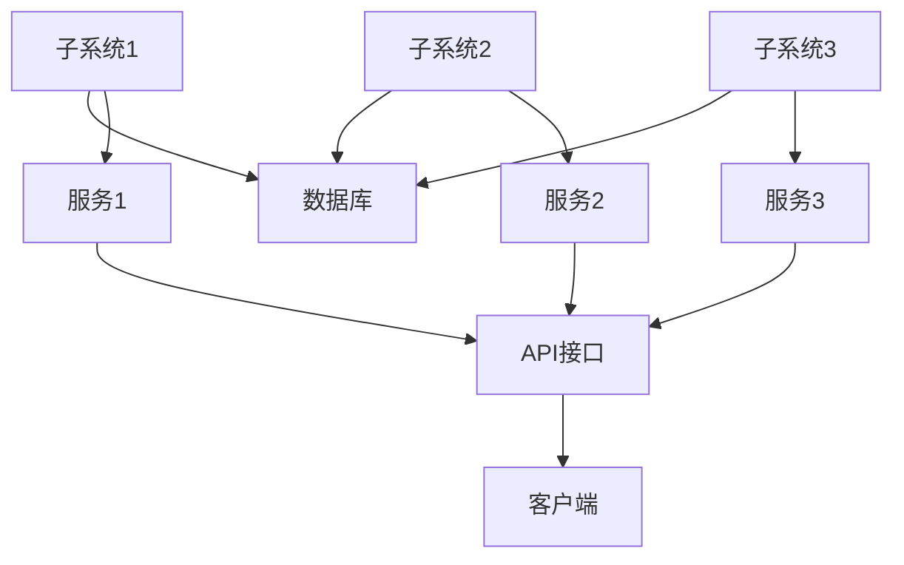
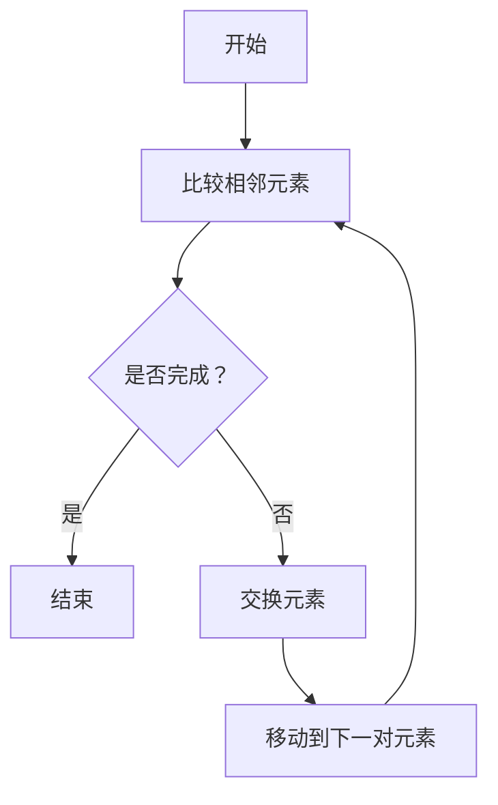

                 

### 架构师的系统思维

系统思维是一种从整体角度理解和分析复杂系统的思维方式，它在当今高度互联和快速变化的IT领域中至关重要。作为一个架构师，掌握系统思维不仅能够帮助你更全面地理解系统的各个组成部分，还能在设计过程中预见潜在的问题，并有效地解决它们。本文将深入探讨系统思维的基础理论、应用实践以及最佳策略，帮助你成为更加卓越的架构师。

**关键词：系统思维、架构设计、微服务、性能优化、测试策略**

**摘要：本文旨在阐述系统思维在架构设计中的重要性，通过详细的案例分析和技术解读，帮助读者理解系统思维的核心概念，掌握系统架构设计原则，并学会应用系统思维解决实际问题。**

### 目录大纲

**《架构师的系统思维》**

---

## 第一部分: 系统思维基础

### 第1章: 系统思维的起源与发展

#### 1.1 系统思维的起源

- 系统思维的历史背景
- 系统思维的重要人物

#### 1.2 系统思维的基本概念

- 系统的定义与属性
- 系统思维的核心理念

#### 1.3 系统思维的实用价值

- 系统思维在软件开发中的应用
- 系统思维在其他领域的应用

### 第2章: 系统架构设计原则

#### 2.1 系统架构设计的基本原则

- 系统可扩展性
- 系统可靠性
- 系统性能

#### 2.2 微服务架构设计

- 微服务的概念与优势
- 微服务架构的设计原则

#### 2.3 服务网格架构设计

- 服务网格的概念与作用
- 服务网格的实现技术

## 第二部分: 系统分析与设计

### 第3章: 系统需求分析与建模

#### 3.1 系统需求分析

- 用户需求分析
- 系统需求分析

#### 3.2 系统建模方法

- Use Case建模
- Activity Diagram建模

### 第4章: 系统架构设计

#### 4.1 系统架构设计流程

- 架构设计的目标
- 架构设计的方法论

#### 4.2 系统架构设计实践

- 大型分布式系统架构设计
- 容器化系统架构设计

### 第5章: 系统接口设计与通信

#### 5.1 RESTful API设计

- RESTful API的概念
- RESTful API的设计原则

#### 5.2 GraphQL API设计

- GraphQL的概念与优势
- GraphQL的设计原则

#### 5.3 通信协议选择

- HTTP协议
- WebSocket协议

## 第三部分: 系统测试与优化

### 第6章: 系统测试策略与工具

#### 6.1 系统测试的基本策略

- 黑盒测试
- 白盒测试

#### 6.2 自动化测试工具

- 测试框架
- 性能测试工具

### 第7章: 系统性能优化

#### 7.1 性能优化的基本方法

- 硬件优化
- 软件优化

#### 7.2 数据库性能优化

- 索引优化
- 查询优化

#### 7.3 网络性能优化

- 网络协议优化
- 网络拓扑优化

---

**目录大纲总结：**

本文目录共分为三个主要部分，分别是系统思维基础、系统分析与设计、系统测试与优化。每个部分都涵盖了系统思维和架构设计的核心内容，旨在通过逐步深入的分析和讲解，帮助读者全面理解和应用系统思维，从而提升系统架构设计的综合能力。

### 第一部分: 系统思维基础

#### 第1章: 系统思维的起源与发展

**1.1 系统思维的起源**

系统思维并非现代才有的概念，其起源可以追溯到20世纪初。在当时的科学和工程领域中，科学家们开始关注复杂系统的整体行为，而非仅仅关注其中的单个组件。这个转变的标志性事件包括奥地利生物学家路德维希·冯·贝塔朗菲（Ludwig von Bertalanffy）提出的“一般系统理论”（General System Theory），该理论为系统思维提供了理论基础。

**1.2 系统思维的重要人物**

在系统思维的发展过程中，有几位关键人物对这一领域产生了深远的影响。首先，贝塔朗菲本人是系统思维理论的奠基人，他的工作为系统思维提供了哲学和科学的基础。其次，系统工程师赫伯特·亚历山大（Herbert Alexander Simon）在其研究中强调了决策和复杂系统的关系，进一步丰富了系统思维的应用范围。

**1.3 系统思维的基本概念**

系统思维的基本概念包括以下几个方面：

1. **系统的定义与属性**：系统是由相互关联的元素组成的整体，这些元素通过相互作用形成了一个统一的整体。系统的属性包括完整性、层次性、动态性和适应性。

2. **系统思维的核心理念**：系统思维强调整体性、关联性和动态性。整体性意味着需要从整体角度看待系统，而不仅仅是关注其中的个别部分。关联性强调系统内部各个元素之间的相互作用和影响。动态性则意味着系统是不断变化的，需要持续地进行监测和调整。

**1.4 系统思维的实用价值**

系统思维在软件开发中的应用非常广泛。例如，在软件架构设计中，系统思维可以帮助架构师识别系统的关键组件，分析它们之间的依赖关系，并设计出更加稳定和高效的系统。此外，系统思维还可以应用于项目管理、团队协作、风险管理和决策制定等多个领域。

**1.5 系统思维在其他领域的应用**

除了软件开发，系统思维在许多其他领域也有广泛的应用。例如，在环境保护中，系统思维可以帮助我们理解生态系统的复杂性，从而制定出更加有效的保护策略。在医疗领域，系统思维可以用于疾病诊断和治疗方案的设计。在商业领域，系统思维可以帮助企业更全面地理解市场环境和竞争态势，制定出更为科学的战略。

#### 第2章: 系统架构设计原则

**2.1 系统架构设计的基本原则**

在系统架构设计中，有几个基本原则是非常重要的，这些原则可以帮助架构师设计出更加稳定、可靠和高效的系统。

1. **可扩展性**：可扩展性是指系统能够适应不断增加的负载和需求。一个良好的系统架构应该能够在不牺牲性能的情况下轻松扩展。

2. **可靠性**：可靠性是指系统在长时间运行中保持稳定的能力。为了确保系统的可靠性，架构师需要设计出冗余机制，以应对硬件故障、软件错误和外部干扰。

3. **性能**：性能是指系统在给定资源约束下处理请求的速度和能力。高性能的系统可以提供更好的用户体验，提高业务效率。

**2.2 微服务架构设计**

微服务架构是一种将应用程序划分为一组小服务的架构风格，每个服务都独立部署和运行。这种架构风格具有以下几个优点：

1. **可扩展性**：由于服务是独立的，因此可以分别对它们进行扩展，从而提高系统的整体性能。

2. **可靠性**：微服务的独立性意味着单个服务的故障不会影响到整个系统的运行。

3. **敏捷性**：微服务架构使得开发、测试和部署变得更加敏捷，从而加快了迭代速度。

微服务架构的设计原则包括：

1. **服务独立性**：每个服务都应该独立运行，互不干扰。

2. **服务自治**：服务应该具备自我管理和自我修复的能力。

3. **服务通信**：服务之间应该通过轻量级的通信协议（如HTTP/REST）进行通信。

**2.3 服务网格架构设计**

服务网格是一种基础设施层的服务，用于管理服务之间的通信。服务网格的主要作用包括：

1. **服务发现**：服务网格可以自动发现和注册服务，从而简化了服务之间的通信。

2. **负载均衡**：服务网格可以根据服务响应时间、可用性等因素进行负载均衡，从而提高系统的性能和可靠性。

3. **安全性**：服务网格可以提供细粒度的安全控制，保护服务之间的通信。

服务网格的实现技术包括：

1. **Istio**：Istio是一种流行的服务网格平台，它提供了丰富的功能，包括服务发现、负载均衡、安全性等。

2. **Linkerd**：Linkerd是一种基于Go语言的服务网格平台，它提供了高性能和易于部署的特点。

#### 第3章: 系统需求分析与建模

**3.1 系统需求分析**

系统需求分析是系统架构设计的第一步，它包括两个主要方面：

1. **用户需求分析**：用户需求分析旨在理解用户的需求和期望。这通常涉及到用户访谈、问卷调查和市场调研等方法。

2. **系统需求分析**：系统需求分析则关注系统的功能和技术要求。这通常涉及到功能需求、性能需求、安全性需求等。

**3.2 系统建模方法**

系统建模是一种将系统需求转化为可视化的表示方法，常用的系统建模方法包括：

1. **Use Case建模**：Use Case建模用于描述系统与外部用户或系统之间的交互。它通过用例图来表示系统的功能和行为。

2. **Activity Diagram建模**：Activity Diagram建模用于描述系统的动态行为。它通过活动图来表示系统的流程和状态转换。

### 第一部分总结

通过本章的内容，我们了解了系统思维的起源与发展，掌握了系统思维的基本概念和实用价值，学习了系统架构设计的基本原则和具体方法。这些知识为我们在后续章节中进行更深入的系统分析和设计奠定了坚实的基础。

### 第二部分：系统分析与设计

#### 第4章: 系统架构设计

**4.1 系统架构设计流程**

系统架构设计是一个复杂而细致的过程，它需要遵循一系列的步骤和原则。以下是系统架构设计的基本流程：

1. **需求分析**：在开始架构设计之前，首先需要明确系统的需求，包括功能需求、性能需求、安全性需求等。

2. **技术调研**：了解并选择适合系统需求的技术和工具，包括编程语言、数据库、中间件等。

3. **架构设计**：基于需求分析和技术调研的结果，设计系统的总体架构，包括数据流、控制流、接口等。

4. **架构评审**：对设计的架构进行评审，确保其符合需求、技术和安全性等各方面的要求。

5. **架构实现**：将设计转化为具体的代码和配置文件，并进行实现。

6. **部署和测试**：将系统部署到生产环境，并进行全面的测试，确保系统的稳定性和可靠性。

**4.2 系统架构设计实践**

1. **大型分布式系统架构设计**

在大型分布式系统中，架构设计的关键在于如何有效地处理数据流和负载均衡。以下是一个典型的分布式系统架构设计：

- **数据流架构**：数据流架构通常包括数据收集、数据处理、数据存储和数据展示等环节。设计时需要考虑数据的传输效率、处理能力和存储容量。

- **负载均衡**：负载均衡是通过将请求分散到多个服务器上来提高系统的性能和可用性。常用的负载均衡策略包括轮询、最小连接数、源IP哈希等。

- **故障转移**：故障转移是指系统在某个节点发生故障时，能够自动切换到备用节点，确保系统的持续运行。

2. **容器化系统架构设计**

容器化技术（如Docker和Kubernetes）为系统架构设计带来了许多便利。以下是容器化系统架构设计的关键点：

- **容器化应用**：将应用及其依赖环境打包成容器镜像，确保在不同环境中的一致性和可移植性。

- **容器编排**：使用容器编排工具（如Kubernetes）来管理容器的部署、扩展和运维。

- **服务发现和负载均衡**：在容器化环境中，服务发现和负载均衡是通过网络服务网格来实现的，如Istio和Linkerd。

- **持久化存储**：容器化系统中，持久化存储可以通过StatefulSet、Persistent Volume和Persistent Volume Claim等来实现。

#### 第5章: 系统接口设计与通信

**5.1 RESTful API设计**

RESTful API是现代Web服务设计的一种常用方式，它基于HTTP协议，使用统一的接口和操作方式。以下是RESTful API设计的关键原则：

- **统一接口**：RESTful API应遵循统一的接口设计原则，包括资源标识、HTTP方法、状态码等。

- **无状态性**：API应保持无状态性，每次请求都应独立处理，不应依赖于之前的请求。

- **可缓存性**：API应支持可缓存性，以提高响应速度和减少服务器负载。

- **安全性**：API设计应考虑安全性，包括身份验证、权限控制和数据加密等。

**5.2 GraphQL API设计**

GraphQL是一种更灵活的API查询语言，它允许客户端指定所需数据的结构，从而减少数据传输和冗余。以下是GraphQL API设计的关键原则：

- **查询灵活**：GraphQL允许客户端指定精确的数据查询，减少了不必要的传输。

- **减少冗余**：通过精确查询，可以减少数据的冗余传输，提高效率。

- **类型系统**：GraphQL具有丰富的类型系统，可以定义复杂的数据结构和操作。

- **性能优化**：GraphQL可以进行查询优化，减少执行时间和资源消耗。

**5.3 通信协议选择**

在选择通信协议时，需要考虑以下几个方面：

- **传输效率**：不同的协议在传输效率上有很大的差异，如HTTP和WebSocket。

- **可靠性**：某些协议（如HTTP）提供了更好的可靠性保证。

- **实时性**：对于需要实时通信的应用，WebSocket是一种更好的选择。

- **安全性**：选择加密协议（如HTTPS）可以确保通信的安全性。

### 第二部分总结

通过本部分的讨论，我们深入了解了系统架构设计的流程和关键实践，学习了RESTful API和GraphQL API的设计原则，以及通信协议的选择策略。这些知识为我们在实际项目中进行系统架构设计提供了重要的指导。

### 第三部分：系统测试与优化

#### 第6章: 系统测试策略与工具

**6.1 系统测试的基本策略**

系统测试是确保系统质量的重要环节，其基本策略包括：

- **黑盒测试**：黑盒测试关注系统的外部行为，不关心内部实现。通过输入测试数据和预期输出，验证系统功能的正确性。

- **白盒测试**：白盒测试关注系统的内部结构和逻辑，通过测试代码的内部路径、条件和分支，确保代码的正确性。

- **集成测试**：集成测试是将各个模块或组件组合在一起，验证它们之间的交互和协作是否正常。

- **性能测试**：性能测试通过模拟高负载情况，评估系统的响应时间、吞吐量和稳定性。

**6.2 自动化测试工具**

自动化测试可以大大提高测试效率和覆盖率，常用的自动化测试工具包括：

- **Selenium**：Selenium是一款功能强大的Web自动化测试工具，可以模拟用户的浏览器操作。

- **JUnit**：JUnit是Java编程语言的一款单元测试框架，用于编写和运行单元测试。

- **JUnit 5**：JUnit 5是JUnit的最新版本，提供了更多的功能和改进，包括并行测试和更灵活的测试生命周期。

- **TestNG**：TestNG是一个开源的测试框架，它提供了更丰富的功能和灵活性，适合复杂测试场景。

#### 第7章: 系统性能优化

**7.1 性能优化的基本方法**

系统性能优化是提高系统响应速度和吞吐量的关键，基本方法包括：

- **硬件优化**：通过升级硬件设备（如CPU、内存、存储等），提高系统的处理能力。

- **软件优化**：通过优化代码、数据库查询和系统配置，提高系统的运行效率。

- **缓存**：使用缓存技术（如Redis、Memcached等），减少数据访问延迟。

- **分库分表**：通过将数据库分为多个库和表，提高数据库的查询和写入性能。

**7.2 数据库性能优化**

数据库性能优化是系统性能优化的重要组成部分，常见的方法包括：

- **索引优化**：通过合理创建索引，提高数据库的查询性能。

- **查询优化**：通过优化SQL查询语句，减少查询执行时间。

- **分区**：通过分区技术，将表分为多个部分，提高查询和写入效率。

**7.3 网络性能优化**

网络性能优化是确保系统之间通信高效稳定的关键，常见的方法包括：

- **网络协议优化**：选择适合应用场景的网络协议，如HTTP/2和HTTP/3。

- **网络拓扑优化**：通过调整网络拓扑结构，减少数据传输延迟。

- **负载均衡**：通过负载均衡器，将请求分配到多个服务器上，提高系统的整体性能。

### 第三部分总结

通过本部分的讨论，我们了解了系统测试和性能优化的重要性，学习了系统测试的基本策略和工具，以及性能优化的方法和实践。这些知识对于确保系统的质量和稳定性具有重要意义。

### 总结与展望

通过本文的深入探讨，我们系统地学习了系统思维的基础理论、架构设计原则、系统分析与设计方法，以及系统测试与优化的策略。这些知识构成了架构师系统思维的完整框架，不仅帮助我们更好地理解系统的整体结构，还能在实践中指导我们设计出高效、稳定和可靠的系统。

**未来展望**：

随着技术的发展和业务需求的不断变化，架构师需要不断更新和扩展自己的知识体系。未来，以下几个方面值得重点关注：

1. **云计算与边缘计算**：随着云计算和边缘计算的发展，架构师需要掌握如何设计云原生应用和边缘计算架构。

2. **人工智能与机器学习**：人工智能和机器学习正在深刻改变各个行业，架构师需要了解如何将AI技术集成到系统中。

3. **服务化架构**：微服务和服务网格等新型架构风格将继续发展，架构师需要深入理解这些技术的原理和应用。

4. **可持续性与绿色IT**：随着环境问题的日益严重，可持续性和绿色IT将成为架构设计的重要考虑因素。

**作者信息**：

作者：AI天才研究院/AI Genius Institute & 禅与计算机程序设计艺术 /Zen And The Art of Computer Programming

通过本文的学习和实践，期待读者能够将系统思维应用于实际项目，不断提升自己的系统架构设计能力，成为一名卓越的架构师。

### 附录

#### 附录A：系统架构图

以下是一个典型的分布式系统架构图，展示了系统的主要组件和它们之间的关系。



#### 附录B：算法流程图

以下是一个简单的排序算法（冒泡排序）的流程图。



#### 附录C：数学公式

以下是一些常用的数学公式。

```latex
$$
\sum_{i=1}^{n} i = \frac{n(n+1)}{2}
$$

$$
x = \frac{-b \pm \sqrt{b^2 - 4ac}}{2a}
$$
```

### 拓展阅读

- 《系统架构设计师教程》
- 《微服务设计》
- 《基于云计算的架构设计与实现》
- 《RESTful API设计》
- 《深入理解云计算》

通过这些拓展阅读，读者可以进一步加深对系统思维和架构设计的理解，为实践和职业发展提供更多的指导。

