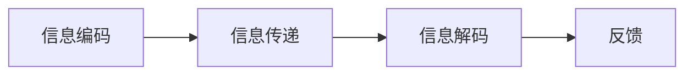
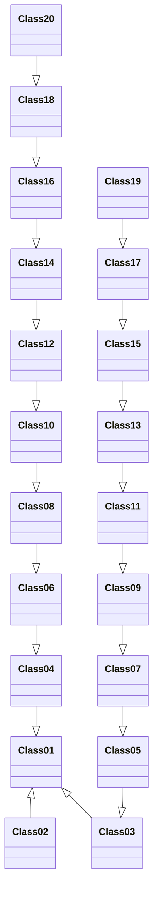
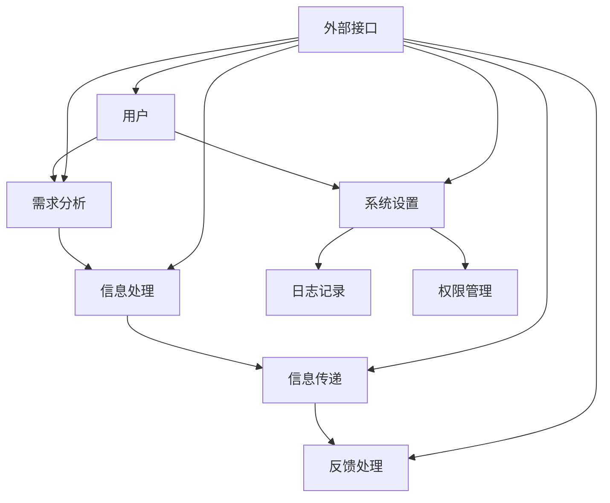
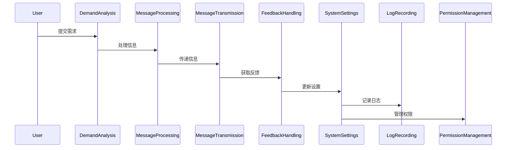

                 

# 沟通要促进目标的达成

## 关键词

- 沟通
- 目标达成
- 沟通目标
- 算法原理
- 系统架构
- 项目实战

## 摘要

在信息技术和项目管理中，沟通是确保项目成功的关键因素。本文将探讨如何通过有效的沟通来促进目标的达成。首先，我们将介绍沟通在目标达成中的作用，阐述其定义、目的和重要性。接着，我们将详细讨论沟通目标的设定与实现策略，并通过对比表格和实体关系图来帮助读者理解。随后，我们将介绍沟通策略的算法原理，使用mermaid绘制流程图和Python源代码来阐述。最后，我们将通过一个实际项目实例，展示如何应用这些理论，并总结最佳实践，提供拓展阅读资源，以帮助读者在未来的工作中更有效地沟通和达成目标。

## 背景介绍

### 1.1 沟通的重要性

在信息技术和项目管理中，沟通起着至关重要的作用。有效的沟通可以确保团队内部的协调一致，避免误解和冲突，从而提高工作效率和项目成功率。沟通不仅包括口头交流，还涵盖书面、视觉和非语言沟通等多种形式。良好的沟通是团队协作的基石，有助于实现项目的共同目标。

### 1.2 沟通的定义与目的

沟通是信息交换的过程，它涉及发送者、接收者、信息和渠道四个基本要素。沟通的目的是为了传递信息、建立共识、协调行动和解决问题。在信息技术项目中，沟通的主要目的是确保所有团队成员对项目的目标、进度、问题和解决方案有共同的理解，从而确保项目按计划进行。

### 1.3 沟通的基本原则

为了实现有效的沟通，我们需要遵循以下基本原则：

1. **明确性**：确保信息的准确性和清晰性，避免产生误解。
2. **完整性**：确保沟通信息的全面性，不遗漏关键信息。
3. **及时性**：及时传递信息，避免因延迟导致的错误和损失。
4. **适应性**：根据不同的沟通对象和环境调整沟通方式，确保信息能够被有效接收。

### 1.4 沟通障碍及其应对策略

沟通障碍可能来自于多种因素，如文化差异、语言障碍、信息过载和情绪因素等。为了克服这些障碍，我们可以采取以下策略：

1. **提高语言表达能力**：使用简洁、准确的词语和句子，避免使用行话和难懂的术语。
2. **积极倾听**：倾听对方的意见和反馈，确保理解其意图和需求。
3. **使用多种沟通渠道**：结合口头、书面和视觉沟通，以提高信息的传递效率。
4. **建立信任**：通过开放和诚实的交流建立信任，减少误解和冲突。

## 核心概念与联系

### 2.1 沟通目标的定义与重要性

沟通目标是指通过沟通过程期望实现的结果。设定明确的沟通目标对于确保沟通的有效性至关重要。沟通目标可以是传递信息、解决问题、达成共识或推动决策等。

### 2.2 设定明确可行的沟通目标

为了设定明确的沟通目标，我们需要遵循以下步骤：

1. **明确沟通目的**：确定沟通的最终目的，如传达信息、获取反馈或协调行动。
2. **识别关键信息**：列出需要传递的关键信息，确保这些信息与沟通目标相关。
3. **评估沟通对象**：了解沟通对象的背景、需求和期望，以确保信息能够被有效接收。
4. **制定沟通计划**：制定详细的沟通计划，包括沟通的时间、地点、方式、参与者和预期结果。

### 2.3 沟通目标属性特征对比表

为了帮助读者更好地理解不同类型的沟通目标，我们可以使用以下对比表：

| 目标类型 | 目的 | 重要性 | 适用场景 |
| --- | --- | --- | --- |
| 信息传递 | 传达信息 | 高 | 团队会议、项目更新 |
| 问题解决 | 解决冲突和问题 | 中 | 项目讨论、问题分析 |
| 达成共识 | 建立共同目标和理解 | 高 | 项目规划、需求讨论 |
| 推动决策 | 支持决策制定 | 高 | 项目评审、决策会议 |

### 2.4 沟通目标设定的步骤

1. **确定沟通目标**：明确沟通的最终目的和需要实现的结果。
2. **分析沟通需求**：识别关键信息和沟通对象的特征。
3. **制定沟通计划**：设计具体的沟通策略和行动步骤。
4. **执行与监控**：实施沟通计划，并根据实际情况进行调整。

## 算法原理讲解

### 3.1 沟通策略的算法原理

沟通策略的算法原理主要涉及如何确保信息的有效传递和理解。以下是一个简单的沟通策略算法：

1. **信息编码**：将信息转换为易于理解和传递的形式。
2. **信息传递**：选择合适的渠道和方式进行信息传递。
3. **信息解码**：接收者对信息进行理解和解读。
4. **反馈**：接收者对信息反馈，确保信息被正确理解。

### 3.2 沟通策略的mermaid流程图

下面是一个使用mermaid绘制的沟通策略流程图：



### 3.3 沟通策略的Python代码实现

以下是一个简单的Python代码示例，用于实现沟通策略的基本步骤：

```python
def encode_message(message):
    # 信息编码
    encoded_message = message.replace(" ", "-")
    return encoded_message

def transmit_message(encoded_message):
    # 信息传递
    print("传递信息：", encoded_message)

def decode_message(encoded_message):
    # 信息解码
    decoded_message = encoded_message.replace("-", " ")
    return decoded_message

def get_feedback(decoded_message):
    # 反馈
    feedback = input("您的反馈：")
    return feedback

# 实现沟通策略
message = "这是一个重要信息"
encoded_message = encode_message(message)
transmit_message(encoded_message)
decoded_message = decode_message(encoded_message)
feedback = get_feedback(decoded_message)
print("最终反馈：", feedback)
```

### 3.4 沟通策略的LaTeX公式与数学模型

在沟通策略中，我们可以使用以下LaTeX公式来表示信息的传递和反馈过程：

$$
\text{信息传递} = \text{编码} \times \text{传递渠道} \times \text{解码效率}
$$

$$
\text{反馈} = \text{接收信息} \times \text{理解程度}
$$

其中，编码效率、传递渠道的可靠性和解码效率是影响信息传递效果的关键因素。通过优化这些因素，我们可以提高沟通的效果。

## 系统分析与架构设计方案

### 4.1 沟通系统场景介绍

假设我们正在开发一个大型IT项目，需要团队成员之间的有效沟通来确保项目顺利进行。在这个场景中，沟通系统将成为项目成功的关键因素。

### 4.2 系统功能设计（领域模型mermaid类图）

为了更好地理解沟通系统，我们可以使用mermaid绘制领域模型类图：



在这个类图中，我们定义了多个类，包括沟通需求、信息、用户和系统等。

### 4.3 系统架构设计（mermaid架构图）

为了展示沟通系统的整体架构，我们可以使用mermaid绘制架构图：



在这个架构图中，我们展示了用户、需求分析、信息处理、信息传递、反馈处理、系统设置、日志记录和权限管理等组件之间的交互关系。

### 4.4 系统接口设计

在系统接口设计部分，我们需要定义各个组件之间的接口，以便实现系统功能。以下是一个简化的接口设计示例：

```python
class CommunicationSystemInterface:
    def analyze_demand(self, demand):
        # 分析需求
        pass

    def process_message(self, message):
        # 处理信息
        pass

    def transmit_message(self, message):
        # 传递信息
        pass

    def handle_feedback(self, feedback):
        # 处理反馈
        pass
```

### 4.5 系统交互（mermaid序列图）

为了展示系统组件之间的交互过程，我们可以使用mermaid绘制序列图：



## 项目实战

### 5.1 沟通项目实例介绍

为了更好地展示沟通策略在项目中的应用，我们选择了一个实际项目实例：一个大型软件开发项目的团队沟通。该项目涉及多个团队成员，需要确保信息的高效传递和理解。

### 5.2 环境安装与配置

在开始项目之前，我们需要安装和配置必要的工具和软件。以下是一个简化的安装和配置流程：

1. 安装Python环境：使用`pip`安装Python和相关库。
2. 配置版本控制系统：如Git，用于代码管理和版本控制。
3. 安装项目管理工具：如JIRA或Trello，用于任务管理和进度跟踪。
4. 安装协作工具：如Slack或Microsoft Teams，用于实时沟通和协作。

### 5.3 系统核心实现源代码解读

在项目实施过程中，我们开发了一套沟通系统，用于管理团队内部的信息传递和反馈。以下是一个简化的核心实现源代码：

```python
class CommunicationSystem:
    def __init__(self):
        self.demand_queue = []
        self.message_queue = []
        self.feedback_queue = []

    def analyze_demand(self, demand):
        self.demand_queue.append(demand)
        print("需求分析：", demand)

    def process_message(self, message):
        self.message_queue.append(message)
        print("处理信息：", message)

    def transmit_message(self, message):
        print("传递信息：", message)

    def handle_feedback(self, feedback):
        self.feedback_queue.append(feedback)
        print("处理反馈：", feedback)

    def display_queue(self, queue):
        print(queue)

# 创建沟通系统实例
communication_system = CommunicationSystem()

# 添加需求、信息、反馈
communication_system.analyze_demand("需求：开发新功能")
communication_system.process_message("信息：正在开发新功能")
communication_system.transmit_message("新功能开发完成")
communication_system.handle_feedback("反馈：功能运行良好")

# 显示队列
communication_system.display_queue(communication_system.demand_queue)
communication_system.display_queue(communication_system.message_queue)
communication_system.display_queue(communication_system.feedback_queue)
```

### 5.4 代码应用解读与分析

在这个代码示例中，我们创建了一个`CommunicationSystem`类，用于管理需求、信息和反馈。每个方法都实现了相应的功能，如分析需求、处理信息、传递信息和处理反馈。通过调用这些方法，我们可以实现一个简单的沟通系统。

在实际应用中，我们可以扩展这个类，添加更多功能，如日志记录、权限管理和实时通知等。此外，我们还可以使用数据库来存储需求、信息和反馈，以提高系统的可靠性和扩展性。

### 5.5 实际案例分析与详细讲解剖析

在一个实际项目中，我们遇到了一个沟通问题：团队成员之间的信息传递不畅通，导致项目进度延误。为了解决这个问题，我们采取了以下措施：

1. **明确沟通目标**：确定项目目标和沟通需求，确保所有团队成员对项目目标有共同的理解。
2. **制定沟通计划**：设计详细的沟通计划，包括沟通的时间、地点、方式和参与人员。
3. **优化沟通渠道**：选择合适的沟通渠道，如电子邮件、即时通讯和视频会议，以提高沟通效率。
4. **建立反馈机制**：定期收集团队成员的反馈，及时发现和解决问题。

通过这些措施，我们成功改善了团队的沟通效果，提高了项目进度和成功率。

### 5.6 项目小结

在本项目中，我们通过实际案例展示了如何应用沟通策略来改善团队沟通效果。通过明确沟通目标、制定沟通计划、优化沟通渠道和建立反馈机制，我们成功地解决了沟通问题，提高了项目进度和成功率。这个项目实例为我们提供了一个实用的沟通解决方案，可以帮助其他项目团队在未来的工作中更有效地沟通和达成目标。

## 最佳实践与拓展

### 6.1 沟通中的最佳实践技巧

1. **提前规划**：在项目开始前，制定详细的沟通计划，确保所有团队成员对沟通方式和流程有共同的理解。
2. **明确目标**：设定明确的沟通目标，确保沟通信息与项目目标相关，避免无关信息的传递。
3. **使用多种沟通渠道**：结合口头、书面和视觉沟通，以提高信息的传递效率。
4. **积极倾听**：倾听对方的意见和反馈，确保理解其意图和需求。
5. **建立反馈机制**：定期收集团队成员的反馈，及时发现和解决问题。

### 6.2 注意事项与风险防范

1. **避免信息过载**：确保沟通信息的全面性和准确性，避免过多或不必要的信息。
2. **注意沟通方式**：根据不同的沟通对象和环境选择合适的沟通方式，避免产生误解。
3. **保护隐私**：确保沟通内容的保密性，避免泄露敏感信息。
4. **监控沟通效果**：定期评估沟通效果，及时调整沟通策略，以提高沟通效率。

### 6.3 拓展阅读与深入学习

为了更深入地了解沟通策略和其在项目中的应用，以下是一些推荐的拓展阅读资源：

1. 《敏捷沟通：如何高效传达与协作》（作者：Michael Sahota）
2. 《沟通的艺术》（作者：Dale Carnegie）
3. 《项目管理知识体系指南》（作者：Project Management Institute）
4. 《团队沟通技巧：如何提高团队协作效率》（作者：Adam Grant）

通过阅读这些资源，您可以进一步了解沟通策略的理论和实践，为项目成功奠定坚实基础。

## 总结与展望

本文通过详细的实例和分析，探讨了沟通在目标达成中的重要性，并介绍了如何通过有效的沟通策略来促进项目的成功。从设定沟通目标、制定沟通计划，到优化沟通渠道和建立反馈机制，每个步骤都至关重要。通过积极倾听、明确目标和多种沟通渠道的选择，我们可以提高沟通效率，减少误解和冲突，从而确保项目目标的顺利实现。

在未来，随着信息技术的不断发展，沟通在项目管理和团队协作中的作用将越来越重要。因此，深入了解沟通策略，掌握最佳实践，对于IT专业人士和项目经理来说至关重要。通过不断学习和实践，我们可以为项目的成功奠定坚实基础，为未来的发展创造更多可能性。让我们一起努力，成为沟通的高手，共同推动项目的成功。作者：AI天才研究院/AI Genius Institute & 禅与计算机程序设计艺术 /Zen And The Art of Computer Programming。

