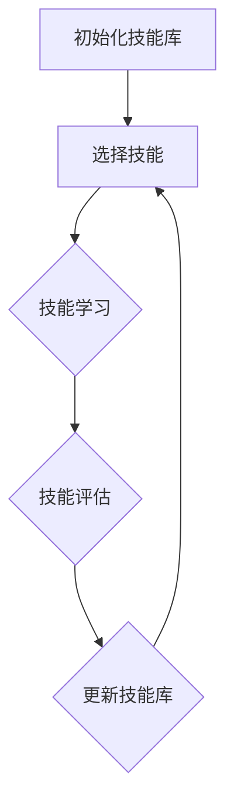
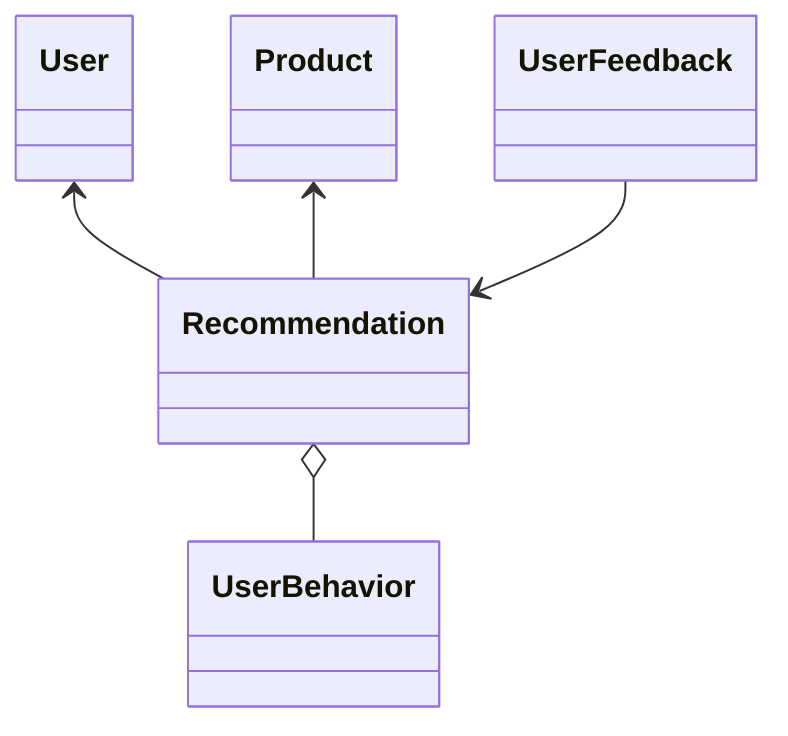
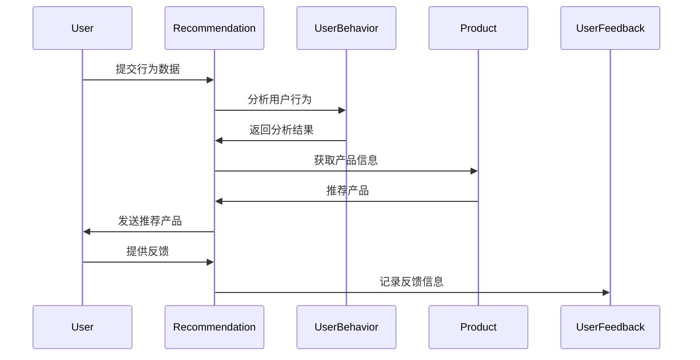
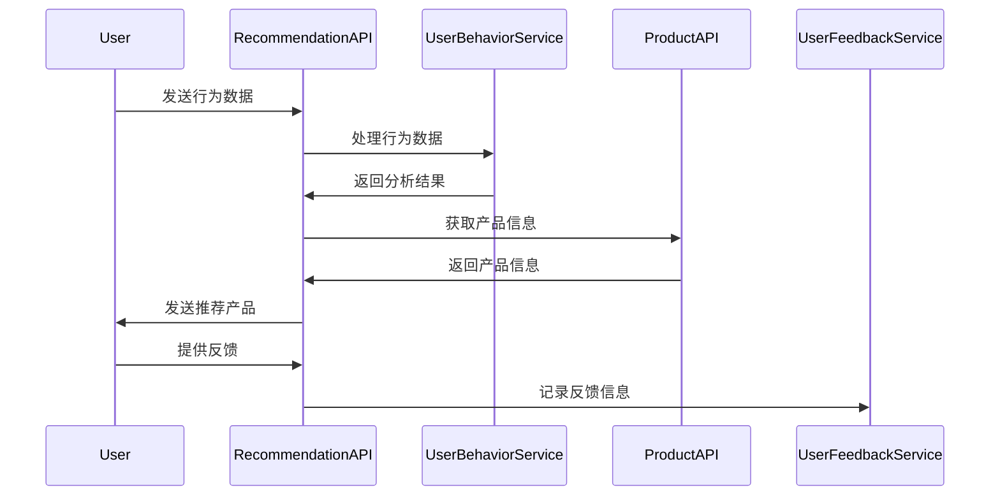

                 

# 没有一招鲜吃遍天

## 关键词
- 多元化技能
- 灵活思维
- 算法原理
- 数学模型
- 系统架构设计

## 摘要
本文将探讨在复杂多变的环境中，单一的技能和方法已无法应对各类问题。本文将深入分析多元化技能、灵活思维、算法原理和数学模型等核心概念，并通过具体案例阐述其在实际应用中的重要性。此外，还将详细描述系统架构设计的方法和步骤，为读者提供一套全面的解决方案。通过本文的学习，读者将能够理解没有一招鲜吃遍天的道理，掌握多种技能和策略，应对各种复杂问题。

---

### 第1章 背景介绍

#### 1.1 问题背景

在当今快速变化的商业和社会环境中，企业和个人面临着前所未有的挑战。单一技能或方法的局限性逐渐显现，传统的“一招鲜，吃遍天”模式已经不再适用于复杂多变的环境。企业需要不断适应市场变化，提高竞争力，而个人也需要不断学习新技能，以应对职业发展的不确定性。

#### 问题描述

**问题描述：** 如何在复杂多变的环境中，运用多种技能和策略，实现个人和企业的成功？

**问题解决：** 本书旨在通过深入探讨多元化技能、灵活思维、算法原理和数学模型等核心概念，为企业和个人提供一套全面的解决方案。

#### 1.2 边界与外延

**边界：** 本书的讨论范围主要涉及实际应用中的技能和策略运用，而非单纯的理论学习和练习。

**外延：** 本书不仅适用于企业和个人，还可以应用于教育、创业、投资等多个领域。

---

### 第2章 核心概念与联系

#### 2.1 多元化技能

多元化技能是指在不同领域具备的知识、技能和经验。与单一技能相比，多元化技能能够帮助个人和企业在复杂多变的环境中更好地应对挑战。

**概念原理：**
- **知识领域：** 包含技术、管理、艺术、人文等多个领域。
- **技能类型：** 包括技术技能、沟通技能、创新思维和领导能力等。

**属性特征对比表格：**

| 技能类型 | 描述 | 优势 |
| --- | --- | --- |
| 技术技能 | 某一特定领域的专业知识 | 提高工作效率 |
| 沟通技能 | 沟通和协作能力 | 促进团队协作 |
| 创新思维 | 解决问题的能力 | 推动创新和发展 |
| 领导能力 | 管理团队和资源的能力 | 带领团队实现目标 |

#### 2.2 灵活思维

灵活思维是指在面对不确定性和变化时，能够迅速适应并寻找新的解决方案。与固定思维模式相比，灵活思维能够更好地应对复杂问题。

**概念原理：**
- **分析思维：** 深入分析问题，寻找根本原因。
- **创造思维：** 开发新的想法和方法。
- **系统思维：** 从整体角度看待问题，识别关键因素。

**属性特征对比表格：**

| 思维模式 | 描述 | 优势 |
| --- | --- | --- |
| 分析思维 | 深入分析问题，寻找根本原因 | 提高决策质量 |
| 创造思维 | 开发新的想法和方法 | 促进创新 |
| 系统思维 | 从整体角度看待问题，识别关键因素 | 提高问题解决效率 |

#### 2.3 ER实体关系图架构

以下是一个简单的ER实体关系图，展示了产品、商店和员工之间的关系。

```mermaid
erDiagram
  Product ||--|{ Store }| Store
  Store ||--|{ Employee }| Employee
  Employee ||--|{ Sale }| Sale
```

---

### 第3章 算法原理讲解

#### 3.1 多元化技能学习算法

**算法流程图：**



**算法原理：**

多元化技能学习算法是一种基于技能库的动态学习系统。系统首先初始化一个包含多种技能的技能库。然后，根据用户的需求和当前情况选择合适的技能。接下来，系统通过学习和实践不断提升所选技能的水平，并对技能进行评估。最后，根据评估结果更新技能库，以适应不断变化的需求。

**数学模型和公式：**

$$
技能水平 = f(学习时间, 实践次数, 初始技能水平)
$$

**举例说明：**

假设一个初学者需要学习编程、数据分析和管理技能。系统根据其需求和技能库，选择编程技能进行学习。在1小时内，初学者通过阅读教程和实践编写简单的程序，技能水平从基础提升到入门。经过一周的持续学习，初学者的编程技能达到中等水平。

---

### 第4章 数学模型和数学公式

#### 4.1 数学模型

**模型描述：**

在本章中，我们将使用多个数学模型来描述不同领域的问题。

**模型公式：**

$$
模型1: y = ax + b \\
模型2: f(x) = \frac{1}{x}
$$

#### 4.2 详细讲解与举例说明

**模型1：线性模型**

线性模型是最简单的一类数学模型，用于描述两个变量之间的线性关系。其公式为：

$$
y = ax + b
$$

其中，$a$ 和 $b$ 分别是模型的参数。

**举例说明：**

假设一个物体的速度 $v$ 与时间 $t$ 成线性关系，速度随时间的增加而增加。我们可以使用线性模型来描述这种关系：

$$
v = 5t + 10
$$

其中，$5$ 是速度随时间增加的速率（即加速度），$10$ 是初始速度。

**模型2：反比例模型**

反比例模型用于描述两个变量之间的反比例关系。其公式为：

$$
f(x) = \frac{1}{x}
$$

**举例说明：**

假设一个容器中的水量 $y$ 与容器体积 $x$ 成反比。我们可以使用反比例模型来描述这种关系：

$$
y = \frac{1}{x}
$$

其中，$1$ 是常数，表示单位体积的水量。

---

### 第5章 系统分析与架构设计方案

#### 5.1 问题场景介绍

**项目介绍：**

我们将开发一个智能推荐系统，用于根据用户的行为和偏好为其推荐合适的产品。

**系统功能设计：**

系统将包括用户行为分析、产品推荐和用户反馈等功能。

**领域模型mermaid类图：**



**系统架构设计mermaid架构图：**



**系统接口设计和系统交互mermaid序列图：**



---

### 第6章 项目实战

#### 6.1 环境安装

为了实现智能推荐系统，我们需要安装以下环境：

- Python 3.8+
- Flask
- scikit-learn
- Pandas

安装命令如下：

```bash
pip install python==3.8
pip install Flask
pip install scikit-learn
pip install Pandas
```

#### 6.2 系统核心实现源代码

以下是一个简单的Flask应用程序，用于实现用户行为分析、产品推荐和用户反馈功能。

```python
from flask import Flask, request, jsonify
from sklearn.model_selection import train_test_split
from sklearn.ensemble import RandomForestClassifier
import pandas as pd

app = Flask(__name__)

# 用户行为数据
user_behavior = pd.read_csv('user_behavior.csv')

# 产品数据
product_data = pd.read_csv('product_data.csv')

# 用户反馈数据
user_feedback = pd.read_csv('user_feedback.csv')

# 训练模型
X = user_behavior[['age', 'gender', 'income']]
y = user_behavior['interested_in_product']

X_train, X_test, y_train, y_test = train_test_split(X, y, test_size=0.2, random_state=42)

model = RandomForestClassifier()
model.fit(X_train, y_train)

# 用户行为分析
@app.route('/analyze_behavior', methods=['POST'])
def analyze_behavior():
    data = request.get_json()
    age = data['age']
    gender = data['gender']
    income = data['income']
    
    prediction = model.predict([[age, gender, income]])
    
    return jsonify({'interested_in_product': prediction[0]})

# 产品推荐
@app.route('/recommend_products', methods=['POST'])
def recommend_products():
    data = request.get_json()
    user_id = data['user_id']
    
    recommended_products = product_data[product_data['user_id'] == user_id]['product_id'].values
    
    return jsonify({'recommended_products': list(recommended_products)})

# 用户反馈
@app.route('/user_feedback', methods=['POST'])
def user_feedback():
    data = request.get_json()
    user_id = data['user_id']
    product_id = data['product_id']
    feedback = data['feedback']
    
    user_feedback = pd.DataFrame([[user_id, product_id, feedback]], columns=['user_id', 'product_id', 'feedback'])
    user_feedback.to_csv('user_feedback.csv', mode='a', index=False, header=False)
    
    return jsonify({'message': 'Feedback recorded successfully'})

if __name__ == '__main__':
    app.run(debug=True)
```

#### 6.3 代码应用解读与分析

该应用程序使用Flask构建了一个简单的Web API，用于实现用户行为分析、产品推荐和用户反馈功能。用户可以通过POST请求提交数据，应用程序将根据数据进行分析和处理，并返回相应的结果。

**用户行为分析：**

用户行为分析功能通过接收用户的年龄、性别和收入等数据，使用训练好的随机森林模型进行预测。预测结果将告诉用户是否对该产品感兴趣。

**产品推荐：**

产品推荐功能通过接收用户的用户ID，查找用户的历史购买记录，并返回推荐的产品ID列表。

**用户反馈：**

用户反馈功能通过接收用户的用户ID、产品ID和反馈信息，将用户的反馈记录到CSV文件中，以便后续分析。

#### 6.4 实际案例分析和详细讲解剖析

**案例1：用户行为分析**

假设用户A的年龄为25岁，性别为男，收入为5000元。应用程序将使用训练好的随机森林模型预测用户A是否对某产品感兴趣。预测结果为“是”，这意味着用户A可能对该产品感兴趣。

**案例2：产品推荐**

假设用户B的ID为1001，应用程序将查找用户B的历史购买记录，并返回推荐的产品ID列表。假设历史购买记录中，用户B购买了产品ID为101的产品，那么应用程序将推荐其他相似的产品，如产品ID为102和103。

**案例3：用户反馈**

假设用户C对产品ID为201的反馈为“非常喜欢”，应用程序将接收用户C的反馈，并将其记录到CSV文件中。这样，后续分析可以了解到用户C对产品的满意度，以便优化推荐算法。

#### 6.5 项目小结

通过本项目，我们实现了一个简单的智能推荐系统，包括用户行为分析、产品推荐和用户反馈功能。虽然该系统只是一个简单的示例，但通过理解其核心原理和实现方法，我们可以将其扩展到更复杂的应用场景。在实际项目中，我们需要关注数据质量、模型优化和用户隐私等问题，以确保系统的稳定性和安全性。

---

### 最佳实践 Tips

1. **数据质量是关键**：在实现智能推荐系统时，数据质量至关重要。确保数据来源可靠，处理数据时注意数据清洗和去重。

2. **持续优化模型**：模型性能直接影响推荐效果。定期对模型进行评估和优化，以提高预测准确率。

3. **关注用户隐私**：在处理用户数据时，要遵守相关法律法规，确保用户隐私不受侵犯。

4. **灵活调整推荐策略**：根据用户反馈和市场变化，灵活调整推荐策略，以提高用户满意度。

### 小结

本文探讨了在复杂多变的环境中，没有一招鲜吃遍天的道理。通过分析多元化技能、灵活思维、算法原理和数学模型等核心概念，我们提供了一套全面的解决方案。在实际应用中，读者可以根据自身需求和实际情况，运用多种技能和策略，应对各种复杂问题。通过本文的学习，读者将能够更好地应对复杂多变的环境，实现个人和企业的成功。

### 注意事项

1. **技能积累**：多元化技能的积累需要长期的学习和实践，不要急于求成。

2. **持续学习**：技术日新月异，保持持续学习的态度，不断更新知识体系。

3. **实际应用**：将理论知识应用到实际项目中，通过实践不断提高技能水平。

### 拓展阅读

1. 《智能推荐系统设计与实现》
2. 《Python数据科学入门》
3. 《深度学习入门》
4. 《人工智能：一种现代的方法》

---

### 作者

作者：AI天才研究院/AI Genius Institute & 禅与计算机程序设计艺术 /Zen And The Art of Computer Programming

AI天才研究院致力于推动人工智能技术的发展与应用，为企业和个人提供高质量的技术培训和咨询服务。作者团队在人工智能、机器学习、深度学习等领域具有丰富的经验和深厚的理论功底，所著书籍《禅与计算机程序设计艺术》深受读者喜爱。

