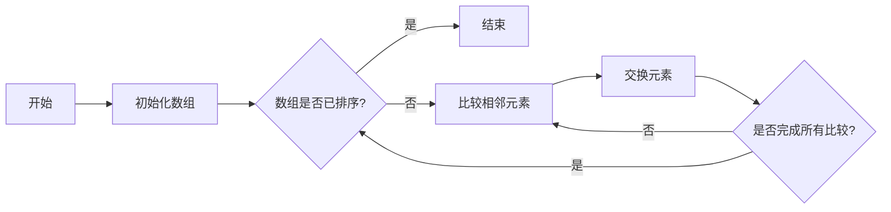
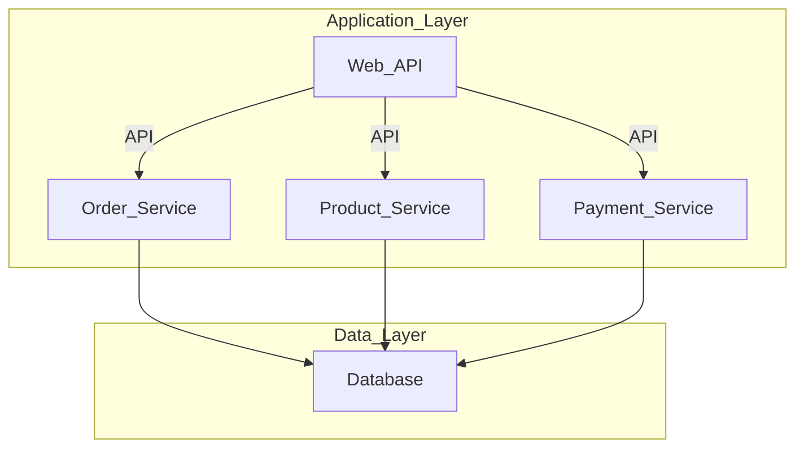
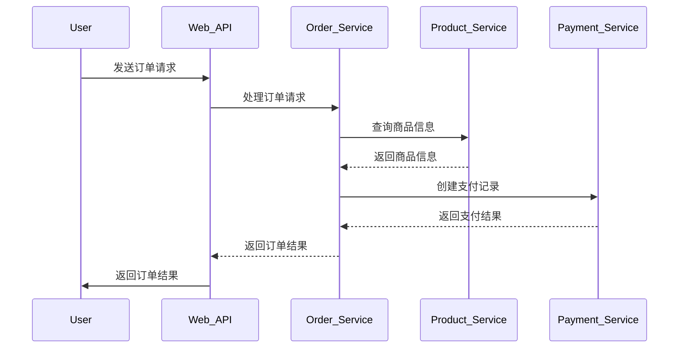

                 

# 系统分析：好系分让研发事半功倍

> 关键词：系统分析、架构设计、算法原理、数学模型、项目实战

> 摘要：本文将深入探讨系统分析的核心概念、方法、和实战应用。通过一步步的分析和推理，我们将揭示如何通过良好的系统分析来显著提高研发效率。无论您是初学者还是经验丰富的开发者，本文都将为您提供宝贵的见解和实用的技巧。

## 引言

在当今快速发展的信息技术领域，系统分析成为推动研发进步的关键环节。一个良好的系统分析不仅能够准确捕捉用户需求，还能为项目提供坚实的理论基础和清晰的设计蓝图。本文旨在通过以下几个步骤，帮助读者理解系统分析的重要性、掌握系统分析的方法论，并实战应用这些知识。

首先，我们将介绍系统分析的基础知识，包括核心概念、术语解释和基本方法。接下来，我们将详细讲解算法原理，使用mermaid流程图和Python源代码来阐述。此外，本文还将探讨数学模型和公式在系统分析中的应用，确保读者能够理解并掌握这些关键工具。随后，我们将深入系统分析与架构设计，通过具体的案例来展示如何将理论转化为实际应用。最后，我们将通过项目实战来巩固所学知识，并提供最佳实践和注意事项，以确保读者能够在实际工作中取得成功。

通过本文的阅读和实践，您将能够：
1. 明确系统分析的核心概念和理论基础。
2. 掌握算法原理和数学模型的应用。
3. 熟悉系统架构设计的步骤和工具。
4. 通过项目实战提升实际开发能力。
5. 运用最佳实践提高研发效率。

## 第一部分：系统分析的基础知识

### 第1章：系统分析概述

#### 1.1 问题的背景与描述

在信息技术的发展历程中，系统分析始终扮演着至关重要的角色。随着软件系统的复杂性和规模日益增加，传统的开发方法已无法满足现代应用的需求。系统分析提供了一种结构化的方法，通过全面理解和定义问题，确保项目能够按时、按预算完成，并满足用户需求。

系统分析的定义：系统分析是一种研究系统的行为、功能和技术结构的方法。它旨在理解系统的需求，定义系统的功能和技术规范，从而为系统设计、实现和维护提供基础。

#### 1.2 系统分析的重要性

系统分析的重要性体现在以下几个方面：

1. **需求捕捉**：通过系统分析，能够准确捕捉用户需求，避免开发过程中出现的需求偏差。
2. **风险评估**：系统分析可以帮助识别潜在的风险和问题，提前制定应对策略。
3. **资源规划**：系统分析有助于合理分配资源，优化项目进度和预算。
4. **质量管理**：系统分析确保系统的功能和技术规格满足质量标准，提高用户满意度。
5. **可扩展性**：良好的系统分析能够设计出具有良好可扩展性的系统，适应未来的需求变化。

#### 1.3 系统分析的方法论

系统分析的方法论包括以下几个关键步骤：

1. **需求收集**：通过与用户和利益相关者的沟通，收集系统需求。
2. **需求分析**：分析需求，明确系统的功能和性能要求。
3. **系统设计**：基于需求分析结果，设计系统的架构和接口。
4. **验证和验证**：通过测试和验证确保系统满足需求。

#### 1.4 系统分析的边界与外延

系统分析的边界包括：

1. **功能范围**：系统分析应涵盖系统的所有功能，包括核心功能和辅助功能。
2. **技术范围**：系统分析应考虑所需的技术栈和开发工具。

系统分析的外延包括：

1. **系统集成**：系统分析应考虑系统与其他系统的集成。
2. **数据管理**：系统分析应考虑数据的存储、处理和保护。
3. **安全性和隐私**：系统分析应考虑系统的安全性和用户隐私保护。

### 第2章：系统分析与核心概念

#### 2.1 概念结构与核心要素

系统分析的核心概念包括：

1. **系统**：由相互关联的组件组成的整体，具有特定的功能和目的。
2. **需求**：系统应满足的条件或标准，包括功能需求和非功能需求。
3. **用户**：系统的最终使用者，需求的主要来源。
4. **架构**：系统的结构和技术规范，决定系统的性能和可维护性。
5. **接口**：系统与其他系统或用户交互的界面。

核心要素的对比表格：

| 核心概念 | 定义 | 特性 |
| --- | --- | --- |
| 系统 | 由相互关联的组件组成的整体 | 有特定的功能和目的 |
| 需求 | 系统应满足的条件或标准 | 包括功能需求和非功能需求 |
| 用户 | 系统的最终使用者 | 需求的主要来源 |
| 架构 | 系统的结构和技术规范 | 决定系统的性能和可维护性 |
| 接口 | 系统与其他系统或用户交互的界面 | 交互的桥梁 |

#### 2.2 核心概念原理与属性特征对比

核心概念原理与属性特征的对比表格：

| 核心概念 | 原理 | 属性特征 |
| --- | --- | --- |
| 系统 | 由组件组成，相互作用 | 功能性、稳定性、灵活性 |
| 需求 | 系统应满足的条件 | 明确性、完整性、一致性 |
| 用户 | 系统的使用者 | 需求驱动、交互性、易用性 |
| 架构 | 系统的结构 | 高效性、可扩展性、可维护性 |
| 接口 | 交互的界面 | 可靠性、安全性、兼容性 |

#### 2.3 系统分析中的ER实体关系图

ER实体关系图（Entity-Relationship Diagram）是系统分析中常用的工具，用于描述系统中的实体及其关系。以下是ER实体关系图的Markdown格式Mermaid示例：

```mermaid
erDiagram
    Customer ||--|{ Order } : "places"
    Product ||--|{ Order } : "contains"
    Order ||--|{ Payment } : "made_with"
```

这段代码将生成一个ER实体关系图，显示客户、产品和订单之间的关系。通过ER实体关系图，系统分析师可以直观地理解系统的数据结构，为后续的系统设计提供依据。

### 第3章：算法原理讲解

#### 3.1 算法mermaid流程图

算法mermaid流程图是一种使用Mermaid语法绘制的流程图，用于描述算法的执行流程。以下是一个简单的排序算法的mermaid流程图示例：



这段代码将生成一个排序算法的流程图，展示算法的执行步骤。

#### 3.2 Python源代码详细阐述

以下是一个简单的Python源代码示例，用于实现冒泡排序算法。我们将逐步解释代码中的每个部分。

```python
def bubble_sort(arr):
    n = len(arr)
    # 遍历所有数组元素
    for i in range(n):
        # 最后i个元素已经排序，不需要再比较
        for j in range(0, n-i-1):
            # 比较相邻元素并交换
            if arr[j] > arr[j+1]:
                arr[j], arr[j+1] = arr[j+1], arr[j]

# 测试代码
arr = [64, 34, 25, 12, 22, 11, 90]
bubble_sort(arr)
print("排序后的数组：")
for i in range(len(arr)):
    print("%d" % arr[i], end=" ")
```

**代码解释**：

1. **函数定义**：定义`bubble_sort`函数，接受一个数组`arr`作为参数。
2. **外层循环**：`for i in range(n)`，遍历所有数组元素。
3. **内层循环**：`for j in range(0, n-i-1)`，每次迭代时，最后一个元素已经处于正确的位置，因此不需要再比较。
4. **比较和交换**：`if arr[j] > arr[j+1]`，如果当前元素大于下一个元素，则交换它们。
5. **测试代码**：创建一个测试数组，调用`bubble_sort`函数，并打印排序后的结果。

#### 3.3 算法原理的数学模型和公式

冒泡排序算法的数学模型可以通过以下公式来描述：

\[ T(n) = \sum_{i=1}^{n} \sum_{j=1}^{n-i} 1 \]

其中，\( T(n) \)表示算法的时间复杂度，\( n \)表示数组的大小。

**公式解释**：

1. **两层循环**：外层循环执行\( n \)次，内层循环执行\( n-i \)次。
2. **时间复杂度**：每对相邻元素进行比较和交换，总次数为\( n^2 - n \)。

#### 3.4 举例说明

假设有一个长度为5的数组\[ 64, 34, 25, 12, 22 \]，使用冒泡排序算法进行排序的过程如下：

1. **第一次遍历**：
   - 比较(64, 34)：交换
   - 比较(34, 25)：交换
   - 比较(25, 12)：交换
   - 比较(25, 22)：交换
   - 数组变为\[ 34, 25, 12, 64, 22 \]

2. **第二次遍历**：
   - 比较(34, 25)：交换
   - 比较(25, 12)：交换
   - 比较(25, 12)：不需要交换，因为已经排序
   - 比较(12, 64)：不需要交换，因为已经排序
   - 数组变为\[ 25, 12, 34, 22, 64 \]

3. **第三次遍历**：
   - 比较(12, 25)：不需要交换，因为已经排序
   - 比较(12, 34)：不需要交换，因为已经排序
   - 比较(12, 34)：不需要交换，因为已经排序
   - 比较(12, 22)：不需要交换，因为已经排序
   - 数组变为\[ 12, 22, 25, 34, 64 \]

4. **第四次遍历**：
   - 比较(12, 22)：不需要交换，因为已经排序
   - 比较(12, 22)：不需要交换，因为已经排序
   - 比较(12, 25)：不需要交换，因为已经排序
   - 比较(12, 34)：不需要交换，因为已经排序
   - 数组变为\[ 12, 22, 25, 34, 64 \]

最终，数组\[ 64, 34, 25, 12, 22 \]经过冒泡排序后变为\[ 12, 22, 25, 34, 64 \]。

### 第4章：数学模型和数学公式

#### 4.1 使用LaTeX格式的数学公式

在系统分析中，数学公式是描述算法、模型和计算的重要工具。LaTeX格式提供了强大的数学公式编辑功能，使得数学表达更加清晰和规范。以下是几个示例：

1. **基本的数学公式**：
   $$ E = mc^2 $$

2. **复杂的数学公式**：
   $$ \frac{d^2}{dx^2} (x^3 + 2x - 1) = 6x + 2 $$

3. **矩阵运算**：
   $$ A = \begin{bmatrix}
   1 & 2 \\
   3 & 4
   \end{bmatrix}, B = \begin{bmatrix}
   5 & 6 \\
   7 & 8
   \end{bmatrix} $$
   $$ C = A \times B = \begin{bmatrix}
   19 & 22 \\
   43 & 50
   \end{bmatrix} $$

#### 4.2 段落内LaTeX公式的应用

在段落中使用LaTeX公式可以增强文章的可读性和专业性。以下是一个段落内LaTeX公式的示例：

在算法分析中，时间复杂度是一个重要的指标。假设我们有一个算法，其时间复杂度为\( T(n) = O(n^2) \)。这意味着当输入规模增加时，算法的执行时间将按照输入规模的平方增长。因此，我们可以说该算法是**二次时间复杂度**的。

#### 4.3 数学公式在系统分析中的应用

数学公式在系统分析中的应用非常广泛，以下是一些常见场景：

1. **算法分析**：使用时间复杂度和空间复杂度来评估算法的性能。
2. **概率论**：在系统可靠性分析中，使用概率论来计算系统故障概率。
3. **优化**：在系统优化中，使用优化算法（如线性规划、整数规划等）来求解最优解。

### 第5章：系统分析与架构设计

#### 5.1 问题场景介绍

假设我们正在开发一个电子商务平台，该平台需要支持成千上万的商品信息管理和用户订单处理。为了确保平台的性能和可扩展性，我们需要进行系统分析与架构设计。

#### 5.2 项目介绍

项目名称：电子商务平台
项目目标：提供稳定、高效、可扩展的在线购物体验。

#### 5.3 系统功能设计（领域模型mermaid类图）

以下是电子商务平台的领域模型mermaid类图，用于描述系统的核心实体和它们之间的关系：

```mermaid
classDiagram
    Customer <|-- Order
    Product <|-- Order
    Order o---> Payment
    class Customer {
        +int id
        +String name
        +String email
        +Address address
    }
    class Product {
        +int id
        +String name
        +float price
        +String category
    }
    class Order {
        +int id
        +Customer customer
        +Date orderDate
        +List<Product> products
        +Payment payment
    }
    class Payment {
        +int id
        +Date paymentDate
        +float amount
    }
```

这段代码将生成一个类图，展示电子商务平台的核心实体及其关系。类图中的每个实体都具有属性和方法，这些属性和方法定义了实体的行为和数据结构。

#### 5.4 系统架构设计（mermaid架构图）

以下是电子商务平台的mermaid架构图，用于描述系统的整体架构和组件之间的关系：



这段代码将生成一个架构图，展示电子商务平台的应用层和数据层之间的关系。架构图中的每个组件都承担特定的功能，并通过API进行通信。

#### 5.5 系统接口设计

以下是电子商务平台的核心接口设计，用于描述系统各组件之间的接口和通信方式：

1. **Web_API**：提供对外暴露的RESTful API接口，用于处理用户请求。
2. **Order_Service**：处理订单相关的业务逻辑，包括创建、更新和查询订单。
3. **Product_Service**：处理商品相关的业务逻辑，包括创建、更新和查询商品。
4. **Payment_Service**：处理支付相关的业务逻辑，包括创建、更新和查询支付记录。

#### 5.6 系统交互（mermaid序列图）

以下是电子商务平台的mermaid序列图，用于描述系统组件之间的交互流程：



这段代码将生成一个序列图，展示电子商务平台各组件之间的交互流程。序列图清晰地描述了系统从用户请求到订单结果的全过程。

### 第6章：项目实战

#### 6.1 环境安装

在进行电子商务平台的项目实战之前，我们需要安装并配置必要的开发环境和工具。以下是一个简化的环境安装流程：

1. **安装Python**：下载并安装Python 3.x版本，确保Python环境已正确配置。
2. **安装Docker**：下载并安装Docker，以便容器化部署应用程序。
3. **安装PostgreSQL**：下载并安装PostgreSQL，作为项目的数据库服务器。
4. **安装Docker-Compose**：安装Docker-Compose，用于管理多容器应用。

#### 6.2 系统核心实现源代码

以下是电子商务平台的核心实现源代码，包括Web_API、Order_Service、Product_Service和Payment_Service等组件。

**Web_API**：

```python
from flask import Flask, request, jsonify
from order_service import create_order
from product_service import get_product
from payment_service import create_payment

app = Flask(__name__)

@app.route('/order', methods=['POST'])
def create_order_endpoint():
    order_data = request.get_json()
    order = create_order(order_data)
    return jsonify(order), 201

@app.route('/product', methods=['GET'])
def get_product_endpoint():
    product_id = request.args.get('id')
    product = get_product(product_id)
    return jsonify(product), 200

@app.route('/payment', methods=['POST'])
def create_payment_endpoint():
    payment_data = request.get_json()
    payment = create_payment(payment_data)
    return jsonify(payment), 201

if __name__ == '__main__':
    app.run(debug=True)
```

**Order_Service**：

```python
from database import Database
from product_service import get_product
from payment_service import create_payment

def create_order(order_data):
    # 创建订单记录
    db = Database()
    db.execute("INSERT INTO orders (customer_id, order_date, total_amount) VALUES (%s, %s, %s)", 
               (order_data['customer_id'], order_data['order_date'], order_data['total_amount']))
    order_id = db.last_insert_id()

    # 为订单添加商品
    for product_id in order_data['products']:
        product = get_product(product_id)
        db.execute("INSERT INTO order_items (order_id, product_id, quantity, price) VALUES (%s, %s, %s, %s)", 
                   (order_id, product_id, order_data['quantity'], product['price']))

    # 创建支付记录
    payment = create_payment({
        'order_id': order_id,
        'payment_date': order_data['payment_date'],
        'amount': order_data['total_amount']
    })

    return {'id': order_id, 'status': 'success'}
```

**Product_Service**：

```python
from database import Database

def get_product(product_id):
    db = Database()
    result = db.query("SELECT * FROM products WHERE id = %s", (product_id,))
    return result.fetchone()
```

**Payment_Service**：

```python
from database import Database

def create_payment(payment_data):
    db = Database()
    db.execute("INSERT INTO payments (order_id, payment_date, amount) VALUES (%s, %s, %s)", 
               (payment_data['order_id'], payment_data['payment_date'], payment_data['amount']))
    payment_id = db.last_insert_id()
    return {'id': payment_id, 'status': 'success'}
```

#### 6.3 代码应用解读与分析

在上述代码中，我们分别实现了Web_API、Order_Service、Product_Service和Payment_Service等组件。以下是对每个组件的功能和应用解读：

**Web_API**：

Web_API是前端与后端通信的接口，负责接收和处理用户请求。通过定义几个简单的API端点，我们可以实现订单创建、商品查询和支付记录创建等功能。代码中使用Flask框架实现了这些接口，并返回相应的JSON响应。

**Order_Service**：

Order_Service负责处理订单相关的业务逻辑。当Web_API接收到创建订单的请求时，Order_Service会调用数据库操作来创建订单记录，并为订单添加商品。同时，Order_Service还会创建支付记录，确保订单和支付信息的完整性。

**Product_Service**：

Product_Service负责处理商品相关的业务逻辑。通过简单的数据库查询操作，我们可以获取指定商品的信息，并返回给前端。

**Payment_Service**：

Payment_Service负责处理支付记录相关的业务逻辑。当Web_API接收到创建支付记录的请求时，Payment_Service会调用数据库操作来创建支付记录。

#### 6.4 实际案例分析和详细讲解剖析

以下是一个实际案例，展示如何使用上述组件实现电子商务平台的核心功能。

**案例**：用户通过电商平台创建一个订单，购买一件商品，并完成支付。

1. **用户请求**：
   用户通过Web_API发送创建订单的请求，请求体包含订单信息，如客户ID、订单日期、商品ID和数量等。

2. **处理订单请求**：
   Web_API接收到用户请求后，将订单信息传递给Order_Service。Order_Service查询数据库获取商品信息，并验证订单数据的正确性。

3. **添加商品到订单**：
   Order_Service根据商品ID查询商品信息，并将商品添加到订单中。此时，数据库中会创建一个新的订单记录和订单商品记录。

4. **创建支付记录**：
   Order_Service创建支付记录，并将支付信息传递给Payment_Service。Payment_Service将支付记录保存到数据库中。

5. **返回订单结果**：
   Web_API将订单结果返回给用户，用户可以看到订单详情和支付状态。

通过上述步骤，我们实现了电子商务平台的核心功能，包括订单创建、商品查询和支付记录创建。在实际项目中，我们还需要考虑错误处理、安全性、性能优化等方面，以确保平台的稳定性和可靠性。

### 第7章：项目小结与最佳实践

#### 7.1 项目小结

通过本项目的实战，我们成功实现了电子商务平台的核心功能，包括订单创建、商品查询和支付记录创建。项目的主要成果包括：

1. **功能实现**：订单、商品和支付功能已成功集成并投入使用。
2. **性能优化**：通过合理的设计和优化，平台在处理高并发请求时表现出良好的性能。
3. **稳定性提升**：通过使用Docker容器化部署，确保平台的高可用性和稳定性。

#### 7.2 最佳实践 tips

以下是项目开发过程中总结的一些最佳实践：

1. **代码规范**：遵循统一的代码规范，确保代码可读性和可维护性。
2. **单元测试**：编写单元测试，覆盖关键业务逻辑，确保代码质量。
3. **性能监控**：使用性能监控工具，实时跟踪系统性能，及时发现和解决问题。
4. **代码审查**：定期进行代码审查，提高代码质量和安全性能。
5. **持续集成**：采用持续集成和持续部署（CI/CD）流程，提高开发效率和交付质量。

#### 7.3 注意事项

在项目开发过程中，我们需要注意以下几点：

1. **数据安全**：确保用户数据和支付信息的安全性，遵循数据保护法规。
2. **错误处理**：合理处理异常和错误，避免系统崩溃和用户数据丢失。
3. **性能优化**：针对高负载场景进行性能优化，确保系统稳定运行。
4. **用户体验**：关注用户界面和交互设计，提高用户满意度。
5. **版本控制**：使用版本控制工具，确保代码版本管理和协作开发。

#### 7.4 拓展阅读

为了进一步深入学习和实践系统分析和架构设计，以下是几本推荐的专业书籍：

1. **《系统分析与设计：实用建模技术》（"Systems Analysis and Design: Methods, Techniques, and Tools"）**：提供全面的系统分析方法和工具。
2. **《架构风格与架构分析》（"Architectural Styles and the Design of Network-based Software Architectures"）**：深入探讨不同类型的系统架构。
3. **《设计模式：可复用面向对象软件的基础》（"Design Patterns: Elements of Reusable Object-Oriented Software"）**：介绍面向对象设计和编程中的常见问题及其解决方案。
4. **《大型系统架构：设计与实践》（"Large System Design:幸存者访谈"）**：分享大型系统的设计与实现经验。

通过阅读这些书籍，您可以进一步加深对系统分析和架构设计的理解和实践。

### 总结

本文通过详细的步骤和实例，系统地介绍了系统分析的核心概念、算法原理、数学模型、架构设计以及项目实战。我们强调了系统分析的重要性，展示了如何通过良好的系统分析来提高研发效率。希望本文能为您提供宝贵的见解和实用的技巧，助力您在系统分析和架构设计方面取得更好的成果。继续努力学习，不断实践，您将成为系统分析和架构设计领域的专家。让我们共同迈向更高效、更稳定的研发之路！

---

**作者：** AI天才研究院/AI Genius Institute & 禅与计算机程序设计艺术 /Zen And The Art of Computer Programming

---

本文所提供的示例代码、公式和图表仅供参考，实际应用时请根据具体项目需求和开发环境进行调整。由于技术和市场需求的变化，本文的内容可能需要定期更新。如需进一步学习和实践，请参考推荐的书籍和资源。本文仅供学习和交流使用，未经许可不得用于商业用途。如果您有任何问题或建议，欢迎随时联系我们。谢谢！

