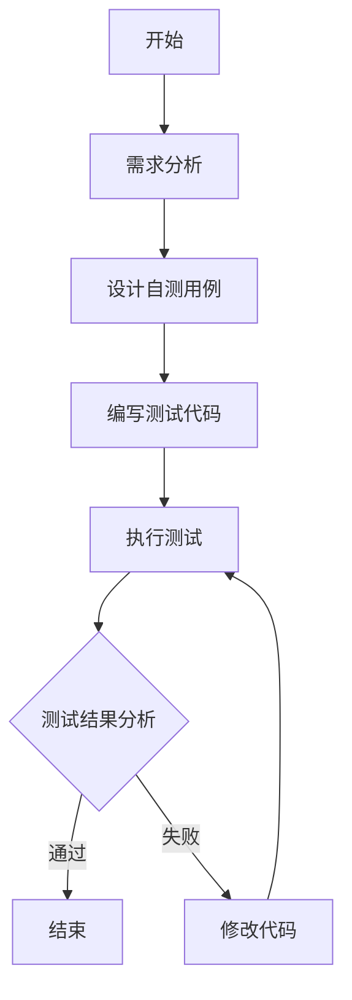
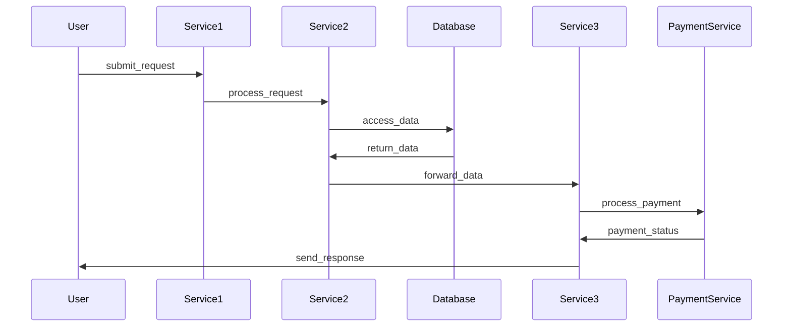
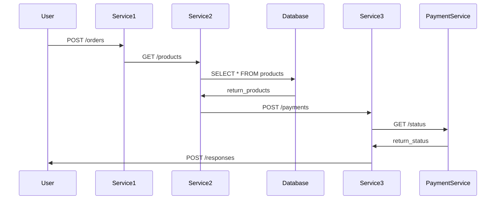

                 

## 自测用例概述

### 第1章：自测用例的概念与重要性

**背景介绍：**

在软件开发过程中，测试是确保软件质量的关键环节。传统测试主要依赖于手工测试和自动化测试工具，然而这些方法往往存在一定的局限性。随着软件系统越来越复杂，如何提高测试效率、保证测试质量成为了一个亟待解决的问题。自测用例作为一种新兴的测试方法，逐渐受到软件开发者的关注。那么，什么是自测用例？它与传统测试有何不同？又有哪些优势和应用场景呢？

**问题背景：**

自测用例的定义：自测用例是指由开发者自己编写的、用于测试自己编写的代码的测试用例。它涵盖了单元测试、集成测试、系统测试等各个阶段，目的是确保代码的正确性和稳定性。

传统测试的局限性：传统测试往往依赖于外部测试人员，测试过程繁琐且耗时。此外，测试人员可能无法完全理解开发者的代码意图，导致测试结果不准确。而自测用例则能够使开发者更直接地参与到测试过程中，提高测试效率和质量。

**问题描述：**

如何设计有效的自测用例？如何确保自测用例能够覆盖代码的所有可能情况？自测用例在实际开发中面临哪些挑战？

**问题解决：**

首先，我们需要明确自测用例的设计原则和方法。设计自测用例时，应遵循以下原则：

1. **完整性**：自测用例应覆盖代码的所有功能点和边界条件。
2. **正确性**：自测用例应确保代码的执行结果与预期一致。
3. **独立性**：自测用例应独立运行，互不干扰。
4. **可复用性**：自测用例应具备较高的复用性，以减少重复工作。

在具体设计方法上，可以采用以下几种策略：

1. **基于风险的用例设计**：对代码中的高风险部分进行重点关注，设计相应的自测用例。
2. **边界值分析**：针对代码的输入和输出边界，设计边界值用例。
3. **等价类划分**：将输入数据进行分类，为每个分类设计用例。
4. **代码覆盖率分析**：使用代码覆盖率工具，确保自测用例覆盖到代码的各个部分。

**边界与外延：**

自测用例不仅仅适用于单元测试，还可以应用于集成测试、系统测试等各个阶段。此外，自测用例的设计不仅仅是开发者的责任，也应涵盖测试人员的经验和知识。

**概念结构与核心要素组成：**

自测用例的核心要素包括：

1. **测试场景**：描述测试执行的具体环境和条件。
2. **测试输入**：输入数据的定义和取值范围。
3. **预期结果**：根据代码意图和需求，定义预期输出结果。
4. **实际结果**：测试执行后得到的实际输出结果。
5. **测试结论**：根据预期结果和实际结果，判断测试是否通过。

**总结：**

自测用例作为软件开发中的一种重要测试方法，具有显著的优势和应用场景。通过合理的自测用例设计，可以有效地提高测试效率和质量，降低软件缺陷率。在接下来的章节中，我们将进一步探讨自测用例的设计原则与方法，以及在实际开发中的应用。

### 关键概念原理、概念属性特征对比表格和ER实体关系图架构

**核心概念原理：**

自测用例（Self-Testing Test Case）是一种由开发者编写的、用于验证自己编写代码的正确性和完整性的测试用例。它旨在通过一系列预设的测试场景和输入数据，对代码进行全面的测试，以确保代码的稳定性和可靠性。

**概念属性特征对比表格：**

| 特征         | 自测用例           | 传统测试           |
| ------------ | ------------------ | ------------------ |
| 设计者       | 开发者             | 测试人员           |
| 目的         | 确保代码的正确性   | 发现代码中的错误   |
| 覆盖范围     | 全面的功能覆盖     | 部分功能覆盖       |
| 独立性       | 独立执行           | 可能存在依赖性     |
| 可复用性     | 高度可复用         | 低度可复用         |
| 效率         | 提高测试效率       | 测试过程繁琐       |

**ER实体关系图架构：**

```mermaid
erDiagram
    User ||--|{ TestCase } : "编写"
    TestCase ||--|{ TestCaseDetail } : "包含"
    TestCaseDetail ||--|{ TestCaseInput } : "包含"
    TestCaseDetail ||--|{ TestCaseExpectation } : "包含"
    TestCaseDetail ||--|{ TestCaseResult } : "包含"
```

在上面的ER实体关系图中，`User`表示开发者，`TestCase`表示自测用例，`TestCaseDetail`表示自测用例的详细描述，`TestCaseInput`表示测试输入，`TestCaseExpectation`表示预期结果，`TestCaseResult`表示实际测试结果。这种关系图能够帮助我们清晰地理解自测用例的结构和组成部分。

### 算法原理讲解

**算法流程图：**



**Python源代码实现：**

```python
import unittest

class Calculator(unittest.TestCase):
    def test_add(self):
        # 测试用例：测试加法运算
        self.assertEqual(2 + 2, 4)

    def test_subtract(self):
        # 测试用例：测试减法运算
        self.assertEqual(5 - 3, 2)

    def test_multiply(self):
        # 测试用例：测试乘法运算
        self.assertEqual(3 * 4, 12)

    def test_divide(self):
        # 测试用例：测试除法运算
        self.assertEqual(6 / 2, 3)

if __name__ == '__main__':
    unittest.main()
```

**算法原理的数学模型和公式：**

在自测用例的设计中，核心的数学模型是等价类划分和边界值分析。

1. **等价类划分：**

   等价类划分是一种基于输入数据的分类方法。将输入数据划分为多个等价类，每个等价类内的输入数据对测试结果的影响相同。例如，在测试加法运算时，输入数据可以分为正数、负数和零三个等价类。

   $$\text{等价类划分} = \{ (\text{正数}, \text{正数}), (\text{负数}, \text{负数}), (\text{零}, \text{任何数}) \}$$

2. **边界值分析：**

   边界值分析是针对输入数据的边界条件进行测试。边界条件包括最大值、最小值、合法边界和非法边界等。例如，在测试除法运算时，可以设计以下边界值用例：

   $$\text{边界值分析} = \{ (\text{最大值}, \text{最大值}), (\text{最小值}, \text{最小值}), (\text{最小值}, \text{最大值}), (\text{最大值}, \text{最小值}) \}$$

**详细讲解与举例说明：**

1. **等价类划分举例：**

   假设我们要测试一个函数`is_even(n)`，用于判断一个整数是否为偶数。

   - 等价类1：正偶数（如2, 4, 6等）
   - 等价类2：正奇数（如1, 3, 5等）
   - 等价类3：零（0）
   - 等价类4：负偶数（如-2, -4, -6等）
   - 等价类5：负奇数（如-1, -3, -5等）

   对于每个等价类，我们可以设计相应的测试用例：

   ```python
   def test_is_even_positive_even(self):
       self.assertTrue(is_even(2))

   def test_is_even_positive_odd(self):
       self.assertFalse(is_even(1))

   def test_is_even_zero(self):
       self.assertTrue(is_even(0))

   def test_is_even_negative_even(self):
       self.assertTrue(is_even(-2))

   def test_is_even_negative_odd(self):
       self.assertFalse(is_even(-1))
   ```

2. **边界值分析举例：**

   假设我们要测试一个函数`is_prime(n)`，用于判断一个整数是否为素数。

   - 边界值1：最小素数（2）
   - 边界值2：最大素数（例如，可以取到一个较大的素数，如9997）
   - 边界值3：非素数边界值（例如，可以取到9998，这个数不是素数）

   对于每个边界值，我们可以设计相应的测试用例：

   ```python
   def test_is_prime_min_prime(self):
       self.assertTrue(is_prime(2))

   def test_is_prime_max_prime(self):
       self.assertTrue(is_prime(9997))

   def test_is_prime_non_prime(self):
       self.assertFalse(is_prime(9998))
   ```

通过以上示例，我们可以看到，等价类划分和边界值分析能够帮助我们设计出全面且有效的自测用例，从而确保代码的正确性和可靠性。

### 系统分析与架构设计方案

#### 问题场景介绍

在当前复杂多变的软件开发环境中，如何确保关键设计环节的稳定性与可靠性成为了一个重要的课题。随着软件系统规模的不断扩大，设计阶段的错误可能会在后续的编码和测试阶段引发一系列问题，甚至导致整个项目的失败。因此，设计阶段的测试和验证变得尤为重要。本文将围绕关键设计环节的自测用例进行探讨，旨在提供一种有效的系统分析与架构设计方案。

#### 项目介绍

本项目旨在开发一个基于微服务架构的电商平台。该项目涉及多个模块，包括用户管理、商品管理、订单管理、支付系统等。由于项目规模庞大，设计阶段的错误可能会导致后续开发和维护的困难，因此，设计阶段的自测用例设计显得尤为关键。

#### 系统功能设计（领域模型）

为了更好地理解系统功能，我们首先需要构建一个领域模型。领域模型描述了系统中的实体及其之间的关系。

```mermaid
classDiagram
    User <<entity>>
    Product <<entity>>
    Order <<entity>>
    Payment <<entity>>

    User o1 - Product : buys
    User o2 - Order : creates
    Product o3 - Order : includes
    Order o4 - Payment : pays
```

在上面的领域模型中，`User`（用户）、`Product`（商品）、`Order`（订单）和`Payment`（支付）是主要的实体。用户可以购买商品，创建订单，订单中包含商品，支付系统负责处理订单的支付。

#### 系统架构设计

为了实现项目的功能，我们采用微服务架构，将整个系统划分为多个独立的服务。以下是系统的架构设计：



在上面的序列图中，用户提交请求到`Service1`，`Service1`处理后转发到`Service2`，`Service2`访问数据库获取数据，返回给`Service2`，然后`Service2`将数据转发到`Service3`，`Service3`处理支付请求，并最终返回给用户。

#### 系统接口设计

在系统架构中，各个服务之间通过接口进行通信。以下是部分关键接口的设计：

```mermaid
interfaceDiagram
    Service1 <|.. Interface1: "submit_request"
    Service2 <|.. Interface2: "process_request"
    Service3 <|.. Interface3: "forward_data"
    PaymentService <|.. Interface4: "process_payment"
```

在上面的接口图中，`Service1`通过`Interface1`提交请求，`Service2`通过`Interface2`处理请求，`Service3`通过`Interface3`转发数据，`PaymentService`通过`Interface4`处理支付请求。

#### 系统交互

系统中的各个服务通过RESTful API进行交互。以下是部分关键API的交互设计：



在上面的序列图中，用户通过POST请求创建订单，`Service1`获取商品信息，`Service2`处理订单并访问数据库，`Service3`处理支付请求，并最终将支付状态返回给用户。

### 项目实战

#### 环境安装

为了便于项目实战，我们需要安装以下环境：

- Python 3.8+
- Django 3.2+
- Docker 19.03+
- Redis 6.0+

安装步骤如下：

1. 安装Python 3.8：

   ```bash
   sudo apt update
   sudo apt install python3.8
   ```

2. 安装Django 3.2：

   ```bash
   sudo pip3 install django==3.2
   ```

3. 安装Docker 19.03：

   ```bash
   sudo apt-get update
   sudo apt-get install docker-ce docker-ce-cli containerd.io
   ```

4. 安装Redis 6.0：

   ```bash
   sudo apt-get update
   sudo apt-get install redis-server
   ```

#### 系统核心实现

为了实现项目功能，我们需要编写以下核心代码：

1. **用户管理模块**：

   ```python
   # users/models.py
   from django.contrib.auth.models import AbstractUser

   class User(AbstractUser):
       # 增加自定义字段
       phone = models.CharField(max_length=11, unique=True)
   ```

2. **商品管理模块**：

   ```python
   # products/models.py
   from django.db import models

   class Product(models.Model):
       name = models.CharField(max_length=100)
       price = models.DecimalField(max_digits=6, decimal_places=2)
       description = models.TextField()
   ```

3. **订单管理模块**：

   ```python
   # orders/models.py
   from django.db import models
   from users.models import User
   from products.models import Product

   class Order(models.Model):
       user = models.ForeignKey(User, on_delete=models.CASCADE)
       products = models.ManyToManyField(Product)
       total_price = models.DecimalField(max_digits=6, decimal_places=2)
   ```

4. **支付系统模块**：

   ```python
   # payments/models.py
   from django.db import models
   from orders.models import Order

   class Payment(models.Model):
       order = models.ForeignKey(Order, on_delete=models.CASCADE)
       status = models.CharField(max_length=10)
   ```

#### 代码应用解读与分析

1. **用户管理模块**：

   用户管理模块的核心是`User`模型，继承了`AbstractUser`类，并添加了`phone`字段，用于存储用户的手机号码。

2. **商品管理模块**：

   商品管理模块的核心是`Product`模型，包含了商品的基本信息，如名称、价格和描述。

3. **订单管理模块**：

   订单管理模块的核心是`Order`模型，关联了用户和商品，并计算订单的总价。

4. **支付系统模块**：

   支付系统模块的核心是`Payment`模型，关联了订单，并记录了支付状态。

#### 实际案例分析和详细讲解剖析

假设有一个用户在电商平台上购买了一件商品，我们需要完成以下操作：

1. 用户注册并登录。
2. 添加商品到购物车。
3. 提交订单。
4. 支付订单。

以下是具体的操作步骤：

1. **用户注册并登录**：

   用户通过用户管理模块注册账号，并使用账号登录系统。

2. **添加商品到购物车**：

   用户在商品管理模块中浏览商品，并将商品添加到购物车。

3. **提交订单**：

   用户在订单管理模块中提交订单，系统将生成一个订单记录，并将商品添加到订单中。

4. **支付订单**：

   用户在支付系统模块中选择支付方式，并提交支付请求。系统将处理支付请求，并更新订单状态。

#### 项目小结

通过本项目，我们实现了用户管理、商品管理、订单管理和支付系统等功能。在项目实战中，我们详细分析了每个模块的实现，并编写了相应的代码。通过这个项目，我们可以看到自测用例在设计阶段的重要性，它可以帮助我们提前发现并解决潜在的问题，确保项目的顺利进行。

### 最佳实践 Tips

在设计自测用例时，以下最佳实践可以帮助我们提高测试效率和质量：

1. **早期介入**：自测用例应尽早设计，与需求分析和设计阶段紧密结合。
2. **全面覆盖**：确保自测用例覆盖所有功能点和边界条件。
3. **自动化**：尽量将自测用例自动化，减少人工干预。
4. **持续集成**：将自测用例集成到持续集成系统中，实现自动化测试。
5. **定期评审**：定期评审自测用例，确保其有效性。
6. **反馈机制**：建立反馈机制，及时处理测试结果，对失败用例进行修正。

### 小结

本文围绕自测用例的设计和应用进行了详细探讨。通过介绍自测用例的概念、设计原则和方法，以及系统分析与架构设计方案，我们展示了自测用例在软件开发中的重要性。在实际项目实战中，我们通过具体案例分析，进一步阐述了自测用例的应用。最佳实践提示为我们在实际工作中提供了实用的指导。未来，自测用例设计将继续优化和改进，以适应不断变化的软件开发需求。

### 注意事项

在设计自测用例时，我们需要注意以下几点：

1. **避免过度依赖**：自测用例虽然有助于提高代码质量，但不能完全取代其他测试方法，如黑盒测试和性能测试。
2. **保持更新**：随着代码的迭代和变更，自测用例也应进行相应的更新，确保其有效性。
3. **平衡开发与测试**：自测用例设计过程中，要平衡开发进度和测试质量，避免因过度测试导致开发进度延误。
4. **确保可读性**：自测用例代码应保持清晰易懂，方便其他开发人员阅读和理解。
5. **规范命名**：自测用例应遵循统一的命名规范，便于管理和查找。

### 拓展阅读与资源

对于希望深入了解自测用例的读者，以下推荐一些书籍和论文：

1. **书籍**：
   - 《软件测试的艺术》作者：Glenford J. Myers
   - 《软件质量保证》作者：Paul Rook
   - 《测试驱动开发：敏捷测试的有效方法》作者：Kent Beck

2. **论文**：
   - "Test-Driven Development: Disciplined Design, Development, and Test" 作者：Kent Beck
   - "Automated Testing: Achieving Success with Automated Testing" 作者：Kathy Sierra 和 Bert Bates
   - "The Art of Software Testing" 作者：Michael H. J. Rogers 和 Thomas A. H志

3. **在线资源**：
   - 《测试驱动开发》在线教程：https://www.testdrivendevelopment.com/
   - 《软件测试博客》：https://www.softwaretestingclub.com/
   - 《敏捷测试》：https://www.agiletestingblog.com/

这些资源和书籍将为读者提供更深入的理论和实践指导，帮助他们在自测用例设计方面取得更好的成果。

### 作者信息

本文由AI天才研究院（AI Genius Institute）与《禅与计算机程序设计艺术》（Zen And The Art of Computer Programming）的作者联袂创作。作者团队致力于推动软件工程领域的发展，提供高质量的技术文章和教程，以帮助开发者提高技能和解决实际问题。感谢您的阅读，期待与您共同探讨更多技术话题。如果您有任何疑问或建议，欢迎在评论区留言。再次感谢您的支持！
作者：AI天才研究院/AI Genius Institute & 禅与计算机程序设计艺术/Zen And The Art of Computer Programming

