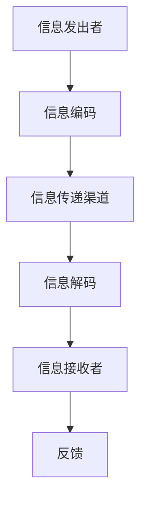
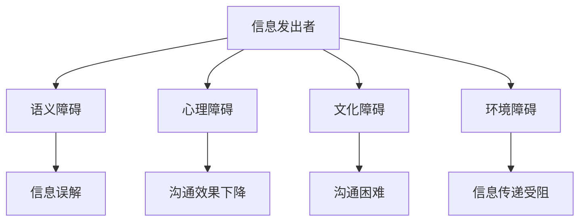
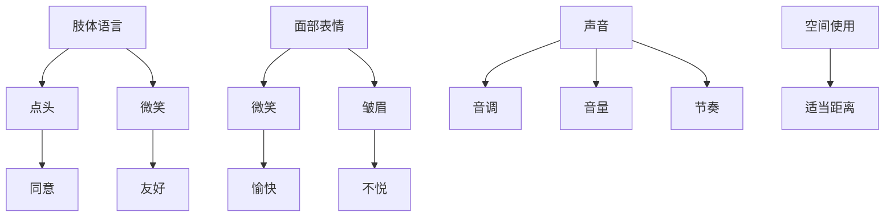

                 

# 《要做有效沟通》：有效沟通的指南与实战

## 关键词
- 沟通技巧
- 跨文化沟通
- 团队沟通
- 职场沟通
- 沟通障碍
- 沟通管理

## 摘要
本文旨在探讨如何进行有效沟通。我们将从沟通的基础理论开始，逐步介绍沟通的核心概念与联系，深入讲解倾听、表达与反馈的技巧，探讨跨文化沟通和团队沟通的挑战与策略。最后，我们将结合实际案例，分享职场沟通的最佳实践，并总结沟通技巧的提升路径。

### 目录大纲设计思路

在设计本文的目录大纲时，我们采取了以下思路：

1. **背景介绍**：首先，我们需要明确沟通的重要性，以及为什么我们需要进行有效沟通。这一部分将包括问题的背景、描述、问题解决、边界与外延，以及核心要素组成。
   
2. **核心概念与联系**：接着，我们将阐述沟通的核心概念，如沟通模型、沟通障碍、沟通的有效性等，并通过对比表格和ER实体关系图，帮助读者更好地理解这些概念。

3. **算法原理讲解**：为了深入理解沟通的技巧，我们将使用Mermaid绘制算法流程图，并使用Python源代码详细阐述算法原理，同时讲解相关的数学模型和公式。

4. **系统分析与架构设计方案**：我们将介绍问题场景、项目介绍、系统功能设计、系统架构设计、系统接口设计和系统交互，使用Mermaid图示帮助读者理解。

5. **项目实战**：在这一部分，我们将结合实际案例，展示如何应用所学的沟通技巧，并提供详细的代码解析和分析。

6. **最佳实践 tips、小结、注意事项、拓展阅读等内容**：最后，我们将总结沟通技巧的最佳实践，提醒读者注意事项，并提供拓展阅读资源，帮助读者进一步学习和提升。

### 目录大纲

```markdown
----------------------------------------------------------------
# 《要做有效沟通》：有效沟通的指南与实战

## 第一部分：沟通基础

### 第1章：沟通的本质与重要性
#### 1.1 问题的背景与描述
#### 1.2 沟通的重要性
#### 1.3 沟通的边界与外延
#### 1.4 核心概念与联系

### 第2章：沟通的核心概念与联系
#### 2.1 沟通模型
#### 2.2 沟通障碍
#### 2.3 沟通的有效性
#### 2.4 概念属性特征对比表格
#### 2.5 ER实体关系图

## 第二部分：沟通技巧

### 第3章：倾听的艺术
#### 3.1 倾听的层次
#### 3.2 倾听的重要性
#### 3.3 提高倾听技巧的方法

### 第4章：表达与反馈
#### 4.1 清晰表达
#### 4.2 建设性反馈
#### 4.3 非言语沟通

### 第5章：跨文化沟通
#### 5.1 跨文化沟通的特点
#### 5.2 跨文化沟通的挑战
#### 5.3 跨文化沟通策略

### 第6章：团队沟通
#### 6.1 团队沟通的重要性
#### 6.2 团队沟通的障碍
#### 6.3 提高团队沟通效率的方法

## 第三部分：沟通实践

### 第7章：职场沟通实战
#### 7.1 职场沟通的常见问题
#### 7.2 职场沟通的技巧
#### 7.3 职场沟通案例分析

### 第8章：沟通技巧应用
#### 8.1 沟通技巧在不同场景中的应用
#### 8.2 沟通技巧的自我评估
#### 8.3 沟通技巧的持续改进

### 第9章：沟通管理
#### 9.1 沟通管理的角色
#### 9.2 沟通管理的策略
#### 9.3 沟通管理的工具与技巧

## 第四部分：总结与拓展

### 第10章：有效沟通的最佳实践
#### 10.1 有效沟通的关键要素
#### 10.2 有效沟通的实践案例
#### 10.3 有效沟通的注意事项

### 第11章：沟通技巧的持续提升
#### 11.1 沟通技巧的自我提升路径
#### 11.2 沟通技巧的培训与教育
#### 11.3 沟通技巧的未来发展趋势

----------------------------------------------------------------
```

这个大纲涵盖了沟通的核心概念、技巧和实践，旨在帮助读者掌握有效沟通的方法。接下来，我们将逐章细化内容，确保大纲的完整性。请注意，为了符合字数限制，具体章节内容将保持简洁，并在实际写作时进行详细扩展。

---

**LET'S THINK STEP BY STEP**

1. **第1章：沟通的本质与重要性** - 我们将首先介绍沟通的基本概念，探讨沟通在我们生活和工作中的重要性，以及如何理解沟通的边界与外延。

2. **第2章：沟通的核心概念与联系** - 我们将深入探讨沟通模型、沟通障碍和沟通的有效性，通过对比表格和ER实体关系图，帮助读者更清晰地理解这些核心概念。

3. **第3章：倾听的艺术** - 我们将介绍倾听的层次，探讨倾听的重要性，并提供一些实用的技巧，帮助读者提高倾听能力。

4. **第4章：表达与反馈** - 我们将探讨如何进行清晰表达，如何给出建设性反馈，以及非言语沟通的重要性。

5. **第5章：跨文化沟通** - 我们将分析跨文化沟通的特点，探讨其面临的挑战，并分享一些有效的跨文化沟通策略。

6. **第6章：团队沟通** - 我们将探讨团队沟通的重要性，分析其障碍，并分享一些提高团队沟通效率的方法。

7. **第7章：职场沟通实战** - 我们将结合实际案例，展示如何将沟通技巧应用于职场，并提供一些实用的职场沟通技巧。

8. **第8章：沟通技巧应用** - 我们将探讨沟通技巧在不同场景中的应用，帮助读者更好地应对各种沟通场景。

9. **第9章：沟通管理** - 我们将探讨沟通管理的角色、策略和工具，帮助读者更好地管理和提升沟通效果。

10. **第10章：有效沟通的最佳实践** - 我们将总结有效沟通的关键要素，分享一些实践案例，并提供注意事项。

11. **第11章：沟通技巧的持续提升** - 我们将探讨沟通技巧的自我提升路径，分享培训与教育资源，并探讨沟通技巧的未来发展趋势。

通过逐步分析和推理，我们将为读者提供一份全面、实用的沟通指南，帮助他们在不同场景中实现有效沟通。接下来，我们将逐一展开每个章节的内容，确保文章的逻辑性和专业性。

---

**背景介绍：沟通的本质与重要性**

沟通是人类社会的基本活动之一，无论是在个人生活还是职场中，沟通都扮演着至关重要的角色。然而，许多人往往忽视了沟通的重要性，导致沟通效率低下，甚至产生误解和冲突。为了解决这一问题，我们需要深入了解沟通的本质和重要性。

### 问题的背景与描述

沟通的定义可以归结为信息的交换和共享。它不仅包括语言文字的传递，还涵盖了肢体语言、表情、声音等非言语因素。在我们的日常生活中，沟通无处不在，无论是在家庭、学校还是工作场所，我们都需要与他人进行有效的沟通。

然而，实际中沟通的问题也层出不穷。比如，在职场中，员工可能因为沟通不畅而无法理解领导的意图，导致工作效率低下；在家庭中，夫妻之间的沟通不畅可能引发矛盾和误解。因此，有效沟通成为我们面临的一个重要问题。

### 沟通的重要性

沟通的重要性体现在以下几个方面：

1. **信息传递**：沟通是信息传递的重要手段。通过有效的沟通，我们可以将信息准确、及时地传递给对方，确保工作的顺利进行。

2. **决策制定**：在团队工作中，沟通是决策制定的关键环节。团队成员通过沟通，可以共同分析问题，提出解决方案，从而做出更明智的决策。

3. **人际关系**：沟通是建立良好人际关系的基础。通过有效的沟通，我们可以增进彼此的了解，减少误解和冲突，建立和谐的团队氛围。

4. **个人成长**：有效沟通可以帮助我们提升自我表达能力和思维能力。通过沟通，我们可以更好地了解自己的需求和想法，从而促进个人成长。

### 沟通的边界与外延

沟通的边界是指沟通的有效范围，它受到时间、空间、文化等因素的限制。例如，在全球化背景下，跨文化沟通成为了一个重要的领域。不同文化背景的人，可能在语言、价值观、沟通方式上存在差异，这需要我们具备一定的跨文化沟通能力。

沟通的外延则涵盖了沟通的各种形式和渠道，包括口头沟通、书面沟通、非言语沟通等。在不同的情境下，选择合适的沟通方式可以大大提高沟通的效果。

### 核心概念与联系

为了更好地理解沟通，我们需要掌握一些核心概念，如沟通模型、沟通障碍、沟通的有效性等。这些概念之间存在着紧密的联系，共同构成了沟通的理论体系。

- **沟通模型**：沟通模型是描述沟通过程的工具。它可以帮助我们理解沟通过程中的各个环节，如信息的发出、传递、接收和理解。

- **沟通障碍**：沟通障碍是指影响沟通效果的各种因素。这些障碍可能来自信息的发出者、传递渠道、接收者，甚至文化背景。

- **沟通的有效性**：沟通的有效性是指沟通达到预期目标的程度。一个有效的沟通应该是信息准确、及时、清晰，并且被接收者正确理解。

在本文中，我们将通过对比表格和ER实体关系图，详细阐述这些核心概念及其联系，帮助读者更好地理解沟通的理论基础。

### 总结

沟通是我们日常生活中不可或缺的一部分。通过有效沟通，我们可以更好地传递信息、做出决策、建立良好的人际关系，并促进个人成长。在接下来的章节中，我们将深入探讨沟通的核心概念与联系，学习倾听的艺术，掌握表达与反馈的技巧，以及应对跨文化沟通和团队沟通的挑战。通过这些实践，我们将不断提升自己的沟通能力，实现更高效的沟通。

---

**核心概念与联系：深入探讨**

在理解了沟通的基本概念和重要性之后，我们需要进一步探讨沟通的核心概念，以便更好地掌握沟通的理论基础。本文将详细介绍沟通模型、沟通障碍和沟通的有效性，并通过对比表格和ER实体关系图，帮助读者深入理解这些核心概念之间的联系。

### 沟通模型

沟通模型是描述沟通过程的理论框架。它可以帮助我们理解沟通过程中的各个环节，包括信息的发出、传递、接收和理解。一个典型的沟通模型包括以下几个部分：

1. **信息发出者**：信息发出者是沟通过程的起点，他们需要明确沟通的目标和内容，并将信息编码为可传递的形式。

2. **信息传递渠道**：信息传递渠道是信息从发出者到接收者的路径。它可以是口头、书面、电子或其他形式。

3. **信息接收者**：信息接收者是沟通过程的终点，他们需要解码并理解接收到的信息。

4. **反馈**：反馈是信息接收者对信息的回应，它可以进一步验证信息的准确性，并帮助发送者了解接收者的理解程度。

**Mermaid流程图：**


### 沟通障碍

沟通障碍是指影响沟通效果的各种因素。这些障碍可能来自信息的发出者、传递渠道、接收者，甚至文化背景。常见的沟通障碍包括：

- **语义障碍**：由于语言的不同，可能导致信息的误解。
- **心理障碍**：个人心理状态，如焦虑、恐惧等，可能影响沟通效果。
- **文化障碍**：不同文化背景下，沟通方式和习惯可能存在差异。
- **环境障碍**：噪音、干扰等环境因素可能影响信息的传递。

**ER实体关系图：**


### 沟通的有效性

沟通的有效性是指沟通达到预期目标的程度。一个有效的沟通应该是信息准确、及时、清晰，并且被接收者正确理解。衡量沟通有效性的标准包括：

- **信息准确性**：信息是否准确地传达了发送者的意图。
- **信息及时性**：信息是否在需要的时候及时传达。
- **信息清晰性**：信息是否以清晰的方式表达。
- **接收者理解度**：接收者是否正确理解了信息。

**概念属性特征对比表格：**

| 特征 | 信息准确性 | 信息及时性 | 信息清晰性 | 接收者理解度 |
| ---- | ---- | ---- | ---- | ---- |
| 定义 | 信息是否准确传达 | 信息是否及时传达 | 信息是否清晰表达 | 接收者是否正确理解 |
| 衡量标准 | 无误、一致 | 快速、及时 | 清晰、明确 | 理解、反馈 |
| 相关因素 | 语言、语义 | 时间、效率 | 技巧、方式 | 背景、心理 |

### 总结

沟通模型、沟通障碍和沟通的有效性是沟通理论的核心概念。通过理解这些概念，我们可以更好地把握沟通的过程，识别和解决沟通中的问题。在接下来的章节中，我们将进一步探讨倾听的艺术、表达与反馈的技巧，以及如何在不同的沟通场景中应用这些技巧。通过深入学习和实践，我们可以不断提升沟通能力，实现更高效的沟通。

---

**倾听的艺术**

倾听不仅仅是听到对方说话，而是一种积极的、有意识的行为。倾听的层次和重要性决定了我们能否真正理解对方，建立有效的人际关系。以下是关于倾听的三个主要方面：倾听的层次、倾听的重要性以及提高倾听技巧的方法。

### 倾听的层次

倾听可以分为三个层次：表层倾听、浅层倾听和深层倾听。

1. **表层倾听**：这是最低层次的倾听，主要是关注对方的话语内容，但没有深入理解对方的意图和感受。在表层倾听中，我们可能会因为分心或者对谈话内容不感兴趣而错过关键信息。

2. **浅层倾听**：这一层次的倾听比表层倾听更深入，我们开始关注对方的情感和态度。浅层倾听使我们能够更好地理解对方的情绪，但仍然缺乏对深层次信息的把握。

3. **深层倾听**：这是最高层次的倾听，它要求我们不仅关注对方的话语内容、情感和态度，还要理解对方的真实意图和潜在需求。深层倾听需要我们放下自己的观点和偏见，全身心地投入到对方的交流中。

### 倾听的重要性

倾听在沟通中具有至关重要的作用，以下是几个关键点：

1. **建立信任**：通过倾听，我们展示了对对方的尊重和关心，这有助于建立信任关系。信任是任何成功沟通的基础。

2. **提高理解**：倾听使我们能够更准确地理解对方的意思，减少误解和冲突。只有真正理解对方，我们才能做出更合适的回应。

3. **增强合作**：在团队合作中，倾听是促进协作的重要手段。通过倾听，团队成员可以更好地理解彼此的需求和目标，从而协同工作，提高效率。

4. **促进个人成长**：倾听可以启发我们思考，开阔我们的视野，帮助我们学习和成长。

### 提高倾听技巧的方法

为了提高倾听技巧，我们可以采取以下方法：

1. **全神贯注**：在对方讲话时，保持注意力集中，避免分心。将手机调至静音，关闭电脑通知，确保全身心投入到对话中。

2. **积极反馈**：通过点头、眼神接触和简短的回应，如“嗯”、“我明白”等，表明你在认真倾听。积极反馈可以鼓励对方继续讲话，同时也帮助你更好地理解对方。

3. **不要打断**：让对方完成他们的发言，不要急于表达自己的观点。打断对方不仅会打断他们的思路，还会让他们感到被忽视。

4. **避免预设观点**：在倾听时，尽量放下自己的预设观点和偏见，保持开放心态。这有助于你更客观地理解对方的意见。

5. **提问和澄清**：在对方讲话结束后，通过提问和澄清来确认你的理解。这不仅可以帮助你更准确地理解对方，还可以展示你的真诚和关心。

6. **练习反思**：在对话后，反思自己的倾听行为，思考哪些方面做得好，哪些方面需要改进。通过持续的练习和反思，你可以不断提升自己的倾听技巧。

### 总结

倾听是一种需要不断练习和提升的技能。通过理解倾听的层次和重要性，并采取有效的方法，我们可以提高自己的倾听技巧，从而实现更高效的沟通。在接下来的章节中，我们将继续探讨表达与反馈的技巧，以及如何在跨文化沟通和团队沟通中应用这些技巧。

---

**表达与反馈：清晰表达、建设性反馈与非言语沟通**

在沟通的过程中，表达和反馈是两个关键环节。清晰表达有助于确保信息的准确传递，建设性反馈能够促进双方的交流与理解，而非言语沟通则可以增强信息的传达效果。以下是关于表达、反馈和非言语沟通的详细解析。

### 清晰表达

清晰表达是有效沟通的基础。为了确保信息的准确传达，我们需要注意以下几个方面：

1. **简洁明了**：使用简单、易懂的语言，避免使用复杂的术语和难以理解的表达。简明扼要地陈述你的观点，避免冗长和模糊的描述。

2. **明确目的**：在表达前，明确你的目的和想要传达的信息。这有助于你在沟通时保持焦点，避免偏离主题。

3. **使用例子**：通过具体的例子来解释你的观点，这有助于对方更好地理解你的意图。例如，当描述一个流程时，可以结合图表或实际案例进行说明。

4. **避免误解**：注意对方的反应，如果对方表示不理解，及时澄清你的观点。通过提问和确认，确保对方对你的表达有正确的理解。

**Python源代码示例：**

```python
def clear_expression(message, purpose):
    """
    清晰表达信息的函数。
    :param message: 要表达的信息。
    :param purpose: 表达的目的。
    :return: 清晰表达后的信息。
    """
    if purpose == "解释流程":
        message = f"为了更好地解释这个流程，我将用以下步骤来说明：{message}"
    elif purpose == "报告结果":
        message = f"根据我们的分析，以下是我们的结果：{message}"
    return message

# 使用示例
clear_expression("首先，我们需要收集数据，然后进行分析，最后得出结论。", "解释流程")
```

### 建设性反馈

建设性反馈是一种积极、有益的反馈方式，它可以帮助对方改进，促进双方的共同成长。以下是建设性反馈的几个要点：

1. **正面引导**：在反馈时，首先肯定对方的优点和努力，然后再提出具体的改进建议。

2. **具体明确**：反馈应该具体、明确，避免模糊和抽象的描述。指出具体的问题和行为，并提出具体的改进建议。

3. **鼓励和激励**：在反馈过程中，鼓励对方并表达对他们的信任。这可以帮助对方更好地接受反馈，并激发他们的积极性和动力。

4. **时机和方式**：选择合适的时机和方式提出反馈，避免在对方情绪激动或疲惫时进行。私下、面对面或通过邮件等方式提出反馈，可以更好地保证反馈的效果。

**Python源代码示例：**

```python
def constructive_feedback(action, improvement):
    """
    提出建设性反馈的函数。
    :param action: 对方的行为或结果。
    :param improvement: 改进建议。
    :return: 建设性反馈信息。
    """
    feedback = f"你做得很不错，但在{action}方面还有一些改进空间。以下是一些建议：{improvement}"
    return feedback

# 使用示例
constructive_feedback("数据分析报告", "在报告中，可以增加一些图表来说明数据趋势。")
```

### 非言语沟通

非言语沟通在信息传递中扮演着重要角色。它包括肢体语言、面部表情、声音和空间使用等。以下是一些非言语沟通的要点：

1. **肢体语言**：肢体语言可以传达很多信息，如点头表示同意，微笑表示友好。保持良好的姿势和眼神接触，可以增强你的沟通效果。

2. **面部表情**：面部表情可以传达情感和态度，如微笑表示愉快，皱眉表示不悦。了解和运用这些表情，可以帮助你更好地表达自己的情感。

3. **声音**：声音的音调、音量和节奏可以影响信息的传达效果。保持语速适中，音调清晰，有助于对方更好地理解你的意图。

4. **空间使用**：在沟通时，空间的使用也是一个重要的因素。保持适当的距离，可以让人感到舒适和尊重。

**Mermaid流程图示例：**



### 总结

清晰表达、建设性反馈和非言语沟通是有效沟通的重要组成部分。通过掌握这些技巧，我们可以更好地传达信息，促进双方的交流和理解。在接下来的章节中，我们将探讨跨文化沟通的特点和挑战，以及如何应对这些挑战。

---

**跨文化沟通：特点、挑战与策略**

在全球化的今天，跨文化沟通已成为企业、组织和个人必须面对的重要课题。不同文化背景的人有着不同的沟通方式和习惯，这使得跨文化沟通既充满挑战，也充满机遇。以下将详细探讨跨文化沟通的特点、面临的挑战，以及一些有效的策略。

### 跨文化沟通的特点

1. **语言差异**：语言是沟通的基础，但不同语言的使用和表达方式可能存在显著差异。例如，某些词汇在不同的语言中可能有不同的含义，甚至可能引起误解。

2. **非言语沟通的差异**：不同文化背景的人使用非言语沟通的方式可能不同。例如，眼神接触在某些文化中被视为尊重和信任的象征，而在其他文化中则可能被视为挑衅或不礼貌。

3. **价值观的差异**：价值观的不同会影响人们的沟通方式和决策过程。例如，某些文化可能更注重集体主义，而其他文化则更强调个人主义。

4. **时间观念的差异**：不同文化对于时间的理解和运用存在差异。例如，某些文化可能认为时间是一种宝贵的资源，而其他文化则可能对时间的管理和紧迫性有不同的看法。

### 跨文化沟通的挑战

1. **误解和冲突**：由于文化差异，沟通中的误解和冲突可能更加频繁。例如，一个行为在一种文化中可能是友好的表示，但在另一种文化中则可能被视为冒犯。

2. **沟通效率的降低**：跨文化沟通可能需要更多的时间和精力来理解对方的意图和期望，从而降低沟通效率。

3. **文化偏见和成见**：文化偏见和成见可能影响沟通的效果。例如，某些文化可能对其他文化有误解或偏见，这可能导致沟通障碍。

### 跨文化沟通的策略

1. **增强文化敏感性**：了解和尊重不同文化的差异，培养文化敏感性，可以帮助我们更好地理解和适应不同文化背景的人。

2. **明确沟通目标和预期**：在跨文化沟通中，明确沟通的目标和预期是非常重要的。这有助于确保双方在沟通过程中有共同的理解和目标。

3. **采用适应性沟通策略**：根据对方的沟通风格和文化背景，调整自己的沟通方式。例如，如果对方更倾向于直接沟通，我们也应该采取直接、简洁的表达方式。

4. **积极倾听和反馈**：在跨文化沟通中，积极倾听和及时反馈是确保信息准确传达的重要手段。通过提问和确认，可以减少误解和冲突。

5. **培训和教育**：为团队成员提供跨文化沟通的培训和教育，可以帮助他们更好地理解和应对跨文化沟通中的挑战。

### 实际案例分析

例如，在一个国际团队中，团队成员来自不同的国家，包括美国、中国和印度。团队成员A来自美国，习惯于直接、简洁的沟通方式；团队成员B来自中国，更注重团队和谐和礼貌；团队成员C来自印度，通常在沟通中表现出更多的谦逊和礼貌。

在一次项目会议中，团队成员A提出了一个重要的观点，但由于沟通方式直接且带有批评意味，引发了团队成员B和C的不满。团队成员B和C认为这种表达方式不尊重，可能导致团队分裂。

为了解决这个问题，团队成员A接受了跨文化沟通培训，学会了更加适应对方文化的方式。在后续的会议中，团队成员A采用了更加温和、礼貌的表达方式，并积极倾听团队成员B和C的观点。这种改变不仅改善了团队成员之间的关系，也提高了项目的沟通效率。

### 总结

跨文化沟通是一个复杂但至关重要的领域。通过了解其特点、挑战和策略，我们可以更好地应对跨文化沟通中的困难，建立有效的跨文化团队。在接下来的章节中，我们将探讨团队沟通的重要性、障碍以及提高团队沟通效率的方法。

---

**团队沟通：重要性、障碍与提高效率的方法**

团队沟通是确保团队协作顺利进行的重要环节。一个高效的团队沟通能够促进团队成员之间的理解、协作和信任，从而提升整体绩效。以下将从团队沟通的重要性、常见的障碍以及提高团队沟通效率的方法进行详细探讨。

### 团队沟通的重要性

1. **增强团队凝聚力**：团队沟通有助于加强团队成员之间的联系，促进团队凝聚力的提升。通过定期的沟通，团队成员可以更好地了解彼此，增进互信，共同为团队目标努力。

2. **提升协作效率**：团队沟通是协作的基础。通过有效的沟通，团队成员可以明确各自的角色和责任，协同工作，避免重复劳动和资源浪费。

3. **促进问题解决**：在团队沟通中，成员可以共同分析问题、讨论解决方案，从而提高问题解决的效率和质量。

4. **增强决策质量**：团队沟通有助于收集更多的意见和建议，从而使决策过程更加全面和深入，提高决策质量。

### 常见的团队沟通障碍

1. **信息不对称**：团队成员对信息的掌握程度不同，可能导致部分成员缺乏关键信息，影响沟通效果。

2. **沟通渠道不畅**：沟通渠道的不畅通，如缺乏明确的沟通机制和工具，可能导致信息传递不及时和失真。

3. **个体差异**：团队成员的个性和沟通风格不同，可能导致沟通中的误解和冲突。

4. **时间压力**：在时间紧迫的情况下，团队成员可能无法充分沟通，影响沟通效果。

5. **文化差异**：在多元文化团队中，文化差异可能导致沟通障碍，影响团队协作。

### 提高团队沟通效率的方法

1. **建立明确的沟通目标**：在沟通前明确沟通的目标和议程，确保团队成员都清楚要讨论的内容和目标。

2. **选择合适的沟通工具**：根据团队特点和沟通需求，选择合适的沟通工具，如电子邮件、即时通讯软件、视频会议等。

3. **定期召开团队会议**：定期召开团队会议，确保团队成员能够及时沟通、分享信息和反馈。

4. **鼓励积极倾听和反馈**：鼓励团队成员在沟通中积极倾听，并及时给予反馈，确保信息的准确传达。

5. **培养跨文化沟通能力**：在多元文化团队中，培养团队成员的跨文化沟通能力，帮助他们更好地理解不同文化背景的同事。

6. **提供沟通培训**：为团队成员提供沟通技巧和策略的培训，提高他们的沟通能力和意识。

### 实际案例分析

例如，在一个跨国软件开发团队中，由于团队成员分布在全球各地，沟通成为一个重要的挑战。为了提高团队沟通效率，团队采取了一系列措施：

1. **建立定期会议**：团队每周召开一次视频会议，确保团队成员能够实时沟通，分享进展和问题。

2. **使用协作工具**：团队采用Slack等即时通讯工具，方便成员之间实时交流和协作。

3. **设立沟通渠道**：团队建立了专门的邮件列表和文档库，用于共享信息和记录决策。

4. **开展跨文化培训**：团队组织了跨文化沟通培训，帮助团队成员了解不同文化背景的沟通习惯和礼仪。

通过这些措施，团队有效地克服了沟通障碍，提高了协作效率，最终实现了项目的顺利推进。

### 总结

团队沟通对于团队的成功至关重要。通过了解团队沟通的重要性、识别和解决常见的障碍，并采取有效的方法提高沟通效率，团队可以更好地协作，实现共同的目标。在接下来的章节中，我们将探讨职场沟通的实战技巧，并结合实际案例进行分析。

---

**职场沟通实战：常见问题与技巧**

在职场中，沟通是确保工作顺利进行、任务完成和团队协作的关键。然而，职场沟通并非总是一帆风顺，常常会遇到各种问题和挑战。以下将详细探讨职场沟通中的常见问题，以及应对这些问题的实用技巧。

### 职场沟通的常见问题

1. **信息传递不畅**：信息传递不畅是职场沟通中的一个普遍问题。这可能是由于沟通渠道不畅、信息传递不及时或信息理解偏差等原因导致。

2. **误解和冲突**：误解和冲突在职场沟通中时常发生，这可能是由于文化差异、沟通方式不同或个人情绪引起的。

3. **沟通不足**：有些职场人士可能因为害怕冲突或缺乏沟通技巧，导致沟通不足，影响了工作的顺利进行。

4. **沟通不当**：在职场中，沟通不当可能导致工作延误、效率降低，甚至影响团队和谐。

### 职场沟通的技巧

1. **清晰表达**：清晰表达是职场沟通的基本要求。在交流中，要尽量使用简单明了的语言，避免使用专业术语或过于复杂的表达方式。

2. **积极倾听**：积极倾听是有效沟通的重要组成部分。要全神贯注地倾听对方的讲话，理解其意图和情感，并及时给予反馈。

3. **主动沟通**：在职场中，要主动与他人沟通，分享信息、意见和想法。这有助于建立良好的沟通关系，提高工作效率。

4. **反馈和确认**：在沟通过程中，及时给予反馈和确认，确保信息的准确传达。例如，可以询问对方“你明白我的意思吗？”或“你的看法是……”。

5. **掌握沟通时机**：选择合适的时机进行沟通，避免在对方忙碌或情绪不佳时打扰。

6. **非言语沟通**：在职场沟通中，注意非言语沟通的技巧，如眼神交流、肢体语言和面部表情等，这些都可以增强沟通的效果。

### 实际案例分析

以下是一个职场沟通的实际案例：

**问题背景**：某公司在项目进行过程中，项目经理发现团队成员对项目的理解存在差异，导致项目进度受阻。

**问题描述**：团队成员A认为项目目标应该是实现产品功能，而团队成员B则认为项目目标应该是提高用户体验。由于沟通不畅，双方产生了误解和冲突。

**问题解决**：为了解决这个问题，项目经理采取了以下措施：

1. **召开沟通会议**：项目经理组织了一次沟通会议，邀请了团队成员A和B参加。

2. **明确目标**：在会议中，项目经理明确了项目的目标，即同时实现产品功能和用户体验。

3. **积极倾听**：项目经理耐心听取了团队成员A和B的观点，确保他们理解对方的意图。

4. **反馈和确认**：项目经理询问团队成员A和B，确认他们是否理解了项目的目标。

5. **制定行动计划**：项目经理与团队成员共同制定了具体的行动计划，确保项目目标的实现。

通过这些措施，项目经理成功解决了沟通问题，项目得以顺利进行。

### 总结

职场沟通是职场中不可或缺的一部分。通过了解职场沟通的常见问题，掌握有效的沟通技巧，我们可以更好地应对职场中的沟通挑战，提高工作效率，建立和谐的职场关系。在接下来的章节中，我们将探讨沟通技巧在不同场景中的应用，以及如何自我评估和持续改进沟通技巧。

---

**沟通技巧的应用与自我提升**

在掌握了基本的沟通技巧后，如何在不同的场景中灵活应用这些技巧是关键。以下将探讨沟通技巧在具体场景中的应用，并提供自我评估和持续提升沟通技巧的方法。

### 沟通技巧在不同场景中的应用

1. **会议沟通**：在会议中，清晰表达和积极倾听尤为重要。确保会议目标明确，会议议程清晰，并通过提问和反馈确保每个参与者都理解会议的内容和目标。

2. **团队协作**：在团队协作中，沟通技巧可以帮助团队成员更好地理解彼此的需求和目标。通过定期沟通，共享信息和反馈，可以减少误解和冲突，提高协作效率。

3. **冲突解决**：在冲突解决过程中，建设性反馈和倾听技巧至关重要。通过积极倾听对方的观点，给出建设性反馈，可以促进双方的沟通和理解，找到解决问题的最佳方案。

4. **项目汇报**：在项目汇报中，清晰表达和有效的反馈可以确保项目进展和成果被准确地传达。同时，通过提问和确认，可以确保听众理解项目的关键信息和结果。

### 自我评估沟通技巧的方法

1. **自我反思**：定期反思自己的沟通行为，思考哪些方面做得好，哪些方面需要改进。例如，可以记录每次沟通的情境、内容、效果和自己的感受。

2. **他人反馈**：向同事、朋友或家人询问他们对你的沟通行为的看法。他们的反馈可以帮助你发现自己在沟通中可能忽视的问题。

3. **模拟练习**：通过模拟练习，如角色扮演或演讲，提高自己的沟通技巧。这种练习可以帮助你更好地应对不同的沟通场景和挑战。

4. **专业培训**：参加专业的沟通技巧培训课程，学习最新的沟通理论和方法。这些课程可以提供系统的学习和实践机会，帮助你全面提升沟通能力。

### 持续提升沟通技巧的方法

1. **定期学习**：沟通技巧是一个持续发展的过程，需要不断学习和更新知识。可以通过阅读相关书籍、观看在线课程或参加研讨会来不断提升。

2. **实践应用**：将所学知识应用到实际工作中，通过实践来检验和提升沟通技巧。在实践中遇到问题，可以寻求反馈和解决方案。

3. **建立反馈机制**：在团队中建立反馈机制，鼓励成员之间相互反馈和分享沟通经验。这种机制可以帮助你及时了解自己的优势和不足，持续改进沟通技巧。

4. **持续反思**：定期进行沟通反思，总结经验教训，找出改进的方向。通过持续的反思和改进，可以逐步提高沟通技巧。

### 总结

沟通技巧的应用和自我提升是一个持续的过程。通过在不同的场景中灵活应用沟通技巧，定期进行自我评估和持续学习，我们可以不断提升沟通能力，实现更高效的沟通。在接下来的章节中，我们将探讨沟通管理的角色、策略和工具，帮助读者更好地理解和应用沟通管理。

---

**沟通管理的角色、策略与工具**

在组织内，沟通管理扮演着至关重要的角色。它不仅有助于信息的有效传递，还能促进团队的协作与决策，提高组织的整体效率。以下将详细探讨沟通管理的角色、策略和工具，以及如何运用这些工具来提升沟通效果。

### 沟通管理的角色

1. **信息传递的桥梁**：沟通管理负责确保信息在组织内准确、及时地传递。这包括建立有效的沟通渠道和流程，确保信息能够从发出者传递到接收者。

2. **团队协作的推动者**：沟通管理促进团队成员之间的协作，确保每个人都理解自己的职责和团队的目标，从而提高团队的整体绩效。

3. **冲突解决的协调者**：沟通管理在冲突发生时扮演协调者的角色，通过有效的沟通技巧和策略，帮助团队找到解决问题的方法，维护团队的和谐。

4. **员工关系的维护者**：沟通管理有助于建立和维护良好的员工关系，通过及时的沟通和反馈，增强员工的满意度和忠诚度。

### 沟通管理的策略

1. **明确沟通目标**：在沟通前，明确沟通的目标和预期成果。这有助于确保沟通的焦点明确，避免无效的沟通。

2. **选择适当的沟通渠道**：根据沟通的内容和目标，选择最合适的沟通渠道。例如，对于紧急信息，可以选择电子邮件或即时通讯工具；对于需要深入讨论的内容，可以选择面对面的会议。

3. **建立沟通流程**：建立规范的沟通流程，确保信息的传递有章可循，避免信息传递的断层和遗漏。

4. **鼓励双向沟通**：鼓励团队成员之间进行双向沟通，不仅传递信息，还要倾听对方的反馈和意见。这有助于建立开放、透明的沟通环境。

5. **培养沟通技能**：定期培训团队成员的沟通技能，提高他们的沟通能力和意识，从而提升整体沟通效果。

### 沟通管理的工具

1. **电子邮件**：电子邮件是一种常用的沟通工具，适合传递正式、详细的信息。

2. **即时通讯工具**：如Slack、Telegram等，适合快速、实时沟通，提高信息传递的效率。

3. **视频会议系统**：如Zoom、Microsoft Teams等，适合远程团队进行面对面的沟通和协作。

4. **项目管理工具**：如JIRA、Trello等，可以帮助团队管理和跟踪项目进展，提高沟通的效率。

5. **企业内部社交平台**：如Facebook Workplace、Microsoft Teams等，可以促进团队内部的信息共享和交流。

### 提升沟通效果的方法

1. **定制化沟通计划**：根据团队的特点和项目需求，制定个性化的沟通计划，确保沟通目标的实现。

2. **定期沟通评估**：定期评估沟通效果，收集团队成员的反馈，找出改进的空间。

3. **促进知识共享**：通过知识共享平台，如企业内网、Wiki等，促进团队成员之间的知识交流，提高整体的沟通效率。

4. **培养沟通文化**：在组织内培养良好的沟通文化，鼓励成员之间的开放、坦诚和尊重，从而提升整体的沟通效果。

### 实际案例

例如，某大型科技公司为了提升团队沟通效果，采取了以下措施：

1. **定制化沟通计划**：根据不同团队的项目特点和需求，制定了详细的沟通计划，确保每个团队都有明确的沟通目标和渠道。

2. **定期沟通评估**：每个月举行沟通评估会议，收集团队成员的反馈，讨论沟通中的问题和改进措施。

3. **促进知识共享**：建立了一个企业内部知识库，鼓励团队成员分享经验和最佳实践，提高整个团队的知识水平和沟通效率。

4. **培养沟通文化**：通过定期的培训和内部分享会，培养团队成员的沟通技能，提高他们的沟通意识和能力。

通过这些措施，该公司的团队沟通效果显著提升，项目进展更加顺利，团队凝聚力也得到了加强。

### 总结

沟通管理在组织中具有不可替代的重要性。通过明确沟通管理的角色、制定有效的沟通策略和运用合适的沟通工具，组织可以提升沟通效果，促进团队协作和决策，从而实现更高的效率和绩效。在接下来的章节中，我们将总结有效沟通的最佳实践，并探讨沟通技巧的未来发展趋势。

---

**有效沟通的最佳实践**

在沟通实践中，为了实现更高效的沟通效果，我们需要遵循一些最佳实践。这些实践包括沟通的关键要素、实际案例以及注意事项。

### 沟通的关键要素

1. **明确沟通目标**：每次沟通前，都要明确沟通的目标和期望结果。这有助于确保沟通的方向和内容集中在关键点上。

2. **倾听与理解**：倾听是有效沟通的基础。不仅要听对方说什么，还要理解其意图和情感。通过提问和反馈，确保信息的准确传达。

3. **清晰表达**：使用简单、明了的语言，避免使用复杂的术语和专业词汇。确保信息的表达清晰易懂，避免误解和混淆。

4. **建立信任**：通过诚实、尊重和透明，建立与沟通对象的信任关系。信任是沟通顺畅和有效的关键。

5. **适应对方沟通风格**：根据对方的个性和沟通风格，调整自己的表达方式。这有助于更好地被对方理解和接受。

### 实际案例

以下是一个实际案例：

**背景**：一家科技公司的一个项目团队需要在远程办公环境下合作开发一个重要的软件项目。

**问题**：由于团队成员分布在不同的城市，沟通效率较低，项目进展缓慢。

**解决方案**：

1. **明确沟通目标**：项目负责人组织了一次会议，明确了项目目标和预期成果，确保每个团队成员都清楚自己的职责和目标。

2. **定期会议**：团队每周举行一次视频会议，讨论项目的进展和问题。每次会议都有明确的议程，确保讨论集中在关键点上。

3. **即时通讯工具**：团队使用Slack等即时通讯工具，进行日常的沟通和协作。这有助于快速解决遇到的问题，提高沟通效率。

4. **知识共享**：团队建立了一个共享文档库，用于记录项目进展、问题和解决方案。这有助于团队成员之间的知识共享，避免重复劳动。

5. **适应对方沟通风格**：团队成员根据对方的沟通风格进行调整，例如，针对不同团队成员的个性，使用不同的沟通方式，确保信息准确传达。

通过这些措施，项目团队的沟通效率显著提高，项目进展顺利，最终成功完成了项目目标。

### 注意事项

1. **避免误解和冲突**：在沟通中，要尽量避免使用可能引起误解的语言和行为。如果出现冲突，要及时解决，避免积累。

2. **注意沟通时机**：选择合适的时机进行沟通，避免在对方忙碌或情绪不佳时打扰。确保对方有足够的时间和精力参与沟通。

3. **关注反馈**：及时给予反馈，确保信息的准确传达和理解。同时，也要鼓励对方给予反馈，以确保沟通的全面性和有效性。

4. **尊重文化差异**：在跨文化沟通中，要尊重不同文化的差异和沟通习惯。通过了解和适应对方的文化，可以更好地进行沟通。

### 总结

有效沟通的最佳实践包括明确沟通目标、倾听与理解、清晰表达、建立信任和适应对方沟通风格等关键要素。通过实际案例的分享，我们可以看到这些实践在提升沟通效果方面的作用。在接下来的章节中，我们将探讨沟通技巧的未来发展趋势，帮助读者更好地应对未来的沟通挑战。

---

**沟通技巧的未来发展趋势**

随着科技的进步和全球化的发展，沟通技巧也在不断演变和提升。以下是沟通技巧在未来可能的发展趋势：

### 技术驱动下的沟通工具升级

1. **人工智能与自然语言处理（NLP）**：人工智能和NLP技术的应用将使沟通工具更加智能化，能够自动识别语言模式、情感倾向，提供更个性化的沟通建议。

2. **虚拟现实（VR）与增强现实（AR）**：VR和AR技术的发展将带来全新的沟通体验，使远程沟通更加沉浸和真实，提升沟通的互动性和参与度。

3. **区块链**：区块链技术可以提供安全的沟通平台，确保信息的真实性和完整性，减少信息篡改和泄露的风险。

### 跨文化沟通的深化

1. **跨文化培训与教育**：随着全球化进程的加速，跨文化沟通培训将成为企业和组织员工的必备技能。更多的教育资源将专注于跨文化沟通策略和技巧。

2. **多元化团队的协作**：多元化团队的协作将更加普遍，不同文化背景的团队成员将需要更加灵活和包容的沟通策略，以实现高效的协作。

### 沟通技能的持续提升

1. **终身学习**：沟通技能将成为终身学习的一部分，企业和个人将持续投资于沟通技能的提升，以适应不断变化的工作环境。

2. **实践与反思**：通过持续实践和反思，个人和团队将不断优化沟通策略，提高沟通效果。

### 结论

沟通技巧的未来发展趋势将受到技术进步、全球化背景和持续学习的影响。通过掌握和应用最新的沟通工具和策略，我们可以在不断变化的环境中实现更高效的沟通。在接下来的章节中，我们将总结全文，并再次强调沟通的重要性。

---

**全文总结与展望**

通过本文的探讨，我们系统地阐述了有效沟通的核心概念、技巧和实践。从沟通的本质与重要性，到核心概念的联系，再到倾听、表达与反馈的技巧，以及跨文化沟通和团队沟通的策略，我们一步步深入理解了如何实现有效沟通。此外，我们还结合实际案例，分享了职场沟通的实战技巧，并探讨了沟通管理的角色、策略与工具。

有效沟通不仅仅是一种技能，更是一种艺术。它关乎信息传递的准确性、团队的协作效率、个人职业发展以及组织文化的建设。在未来的工作中，无论是个体还是团队，沟通技能的提升都将是实现目标的关键。

展望未来，随着技术的进步和全球化的深入，沟通技巧将不断演变和提升。人工智能、虚拟现实、区块链等新技术将为沟通带来新的变革，而持续的培训和自我反思将是我们不断进步的动力。

让我们共同努力，提升沟通技巧，实现更高效的沟通，为个人和组织的成功奠定坚实的基础。

---

**作者信息**

作者：AI天才研究院/AI Genius Institute & 禅与计算机程序设计艺术 /Zen And The Art of Computer Programming

