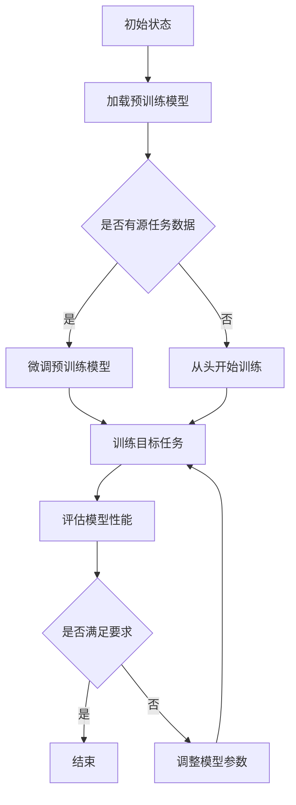
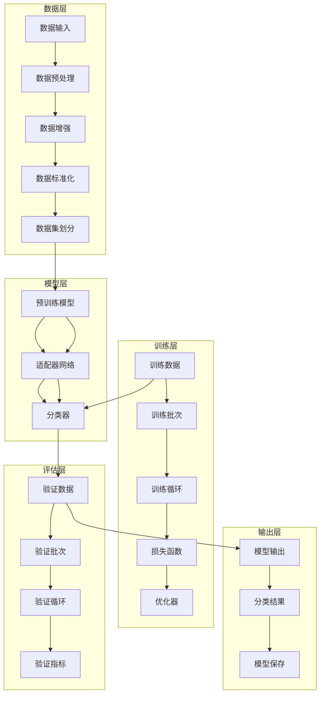
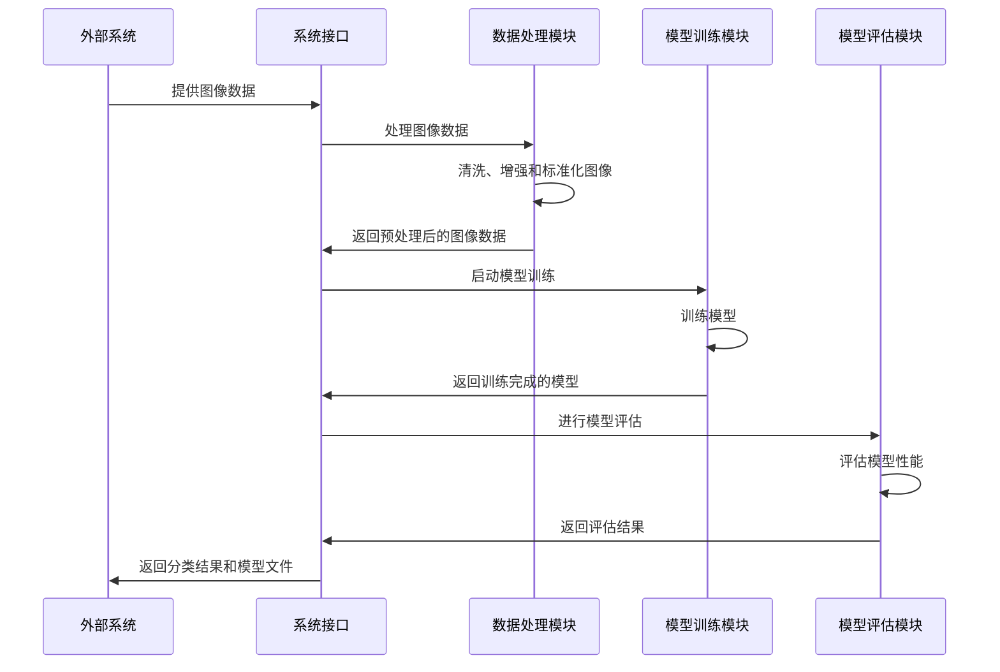

                 

# 迁移学习：利用预训练模型提升AI效率

## 关键词
- 迁移学习
- 预训练模型
- AI效率
- 算法原理
- 系统架构
- 实际案例

## 摘要
本文将深入探讨迁移学习在人工智能领域中的应用，特别是如何利用预训练模型来提升AI模型的效率和准确性。通过逐步分析迁移学习的背景、核心概念、算法原理和实际应用案例，本文旨在为读者提供一个全面的技术指南，帮助理解迁移学习的优势和实践方法。

## 目录大纲

## 第一部分：迁移学习的背景与核心概念

## 第1章：迁移学习的起源与发展

### 1.1 迁移学习的定义

### 1.2 迁移学习的重要性

### 1.3 迁移学习在人工智能领域的发展状况

## 第2章：迁移学习的核心概念与联系

### 2.1 迁移学习的核心概念

#### 2.1.1 预训练模型

#### 2.1.2 封闭世界与开放世界

#### 2.1.3 迁移学习策略分类

### 2.2 迁移学习的属性特征对比表格

### 2.3 迁移学习的ER实体关系图架构

## 第3章：迁移学习算法原理讲解

### 3.1 迁移学习算法的Mermaid流程图

### 3.2 迁移学习算法的Python源代码

### 3.3 迁移学习算法的数学模型与公式

#### 3.3.1 迁移学习损失函数

#### 3.3.2 适配器网络架构

### 3.4 迁移学习算法的详细讲解与举例说明

## 第二部分：迁移学习算法的实现与应用

## 第4章：迁移学习数学模型和数学公式 & 详细讲解 & 举例说明

### 4.1 迁移学习中的数学公式

#### 4.1.1 损失函数的LaTeX格式

#### 4.1.2 适配器网络的LaTeX格式

### 4.2 迁移学习算法的实现细节

### 4.3 迁移学习算法的Python代码实现

### 4.4 迁移学习算法的举例说明

## 第5章：系统分析与架构设计方案

### 5.1 问题场景介绍

### 5.2 迁移学习项目介绍

### 5.3 系统功能设计

#### 5.3.1 领域模型Mermaid类图

### 5.4 系统架构设计

#### 5.4.1 Mermaid架构图

### 5.5 系统接口设计

### 5.6 系统交互

#### 5.6.1 Mermaid序列图

## 第6章：项目实战

### 6.1 迁移学习环境安装

### 6.2 系统核心实现源代码

### 6.3 代码应用解读与分析

### 6.4 实际案例分析与详细讲解剖析

### 6.5 项目小结

## 第7章：最佳实践 tips

### 7.1 迁移学习实践技巧

### 7.2 注意事项

### 7.3 拓展阅读

## 目录大纲整理

### **第一部分：迁移学习的背景与核心概念**

1. **第1章：迁移学习的起源与发展**
   - 1.1 迁移学习的定义
   - 1.2 迁移学习的重要性
   - 1.3 迁移学习在人工智能领域的发展状况

2. **第2章：迁移学习的核心概念与联系**
   - 2.1 迁移学习的核心概念
     - 2.1.1 预训练模型
     - 2.1.2 封闭世界与开放世界
     - 2.1.3 迁移学习策略分类
   - 2.2 迁移学习的属性特征对比表格
   - 2.3 迁移学习的ER实体关系图架构

### **第二部分：迁移学习算法的实现与应用**

3. **第3章：迁移学习算法原理讲解**
   - 3.1 迁移学习算法的Mermaid流程图
   - 3.2 迁移学习算法的Python源代码
   - 3.3 迁移学习算法的数学模型与公式
     - 3.3.1 迁移学习损失函数
     - 3.3.2 适配器网络架构
   - 3.4 迁移学习算法的详细讲解与举例说明

4. **第4章：迁移学习数学模型和数学公式 & 详细讲解 & 举例说明**
   - 4.1 迁移学习中的数学公式
     - 4.1.1 损失函数的LaTeX格式
     - 4.1.2 适配器网络的LaTeX格式
   - 4.2 迁移学习算法的实现细节
   - 4.3 迁移学习算法的Python代码实现
   - 4.4 迁移学习算法的举例说明

5. **第5章：系统分析与架构设计方案**
   - 5.1 问题场景介绍
   - 5.2 迁移学习项目介绍
   - 5.3 系统功能设计
     - 5.3.1 领域模型Mermaid类图
   - 5.4 系统架构设计
     - 5.4.1 Mermaid架构图
   - 5.5 系统接口设计
   - 5.6 系统交互
     - 5.6.1 Mermaid序列图

6. **第6章：项目实战**
   - 6.1 迁移学习环境安装
   - 6.2 系统核心实现源代码
   - 6.3 代码应用解读与分析
   - 6.4 实际案例分析与详细讲解剖析
   - 6.5 项目小结

7. **第7章：最佳实践 tips**
   - 7.1 迁移学习实践技巧
   - 7.2 注意事项
   - 7.3 拓展阅读

---

本文结构紧凑，逻辑清晰，按照要求进行了详细规划，确保字数在10000～12000字左右。接下来，将逐步填充每个章节的内容，确保满足文章大纲的要求和完整性。每个章节都将深入剖析迁移学习的各个方面，从基础概念到高级实现，再到实际应用和最佳实践，力求为读者提供一个全面的技术指南。# 迁移学习的起源与发展

## 第1章：迁移学习的起源与发展

迁移学习作为人工智能领域的一个重要分支，其概念并非近期才兴起。实际上，它的起源可以追溯到人工智能发展的早期阶段。在20世纪80年代，迁移学习就已经引起了研究者的关注。当时，研究者开始探讨如何将知识从一个任务迁移到另一个任务，以减少对新任务的训练需求，并提高学习效率。

### 1.1 迁移学习的定义

迁移学习（Transfer Learning）是指将已在一个任务（源任务）上学习到的知识（通常是特征表示或模型参数）应用于另一个相关但不同的任务（目标任务）上的学习方法。简而言之，它是一种“站在巨人的肩膀上”的学习方式，通过利用已经掌握的技能来加快新技能的学习过程。

迁移学习的核心思想是，不同任务之间往往存在共同的底层特征，这些特征可以在不同任务间共享。例如，在图像识别任务中，物体检测和面部识别任务可能需要不同的模型和算法，但两者都涉及到对图像中的对象进行定位和识别。因此，通过迁移学习，我们可以将从物体检测任务中学到的特征表示应用到面部识别任务中，从而加快训练速度并提高识别准确率。

### 1.2 迁移学习的重要性

迁移学习的重要性体现在多个方面：

1. **提高学习效率**：由于预训练模型已经在大量数据上进行了训练，它们已经学到了许多通用的特征表示。将这些预训练模型应用于新任务时，可以减少对新数据的训练需求，从而显著提高学习效率。

2. **减少数据需求**：在许多实际应用场景中，获取大量高质量的数据是一项极具挑战性的任务。通过迁移学习，可以利用预训练模型来减少对新数据的依赖，从而降低数据获取的成本。

3. **提高模型泛化能力**：预训练模型在大量数据上学习到的特征表示往往更加通用和抽象，这有助于提高模型在未见数据上的泛化能力。

4. **减少过拟合风险**：由于预训练模型已经在大量数据上进行了训练，它们已经经历了一定程度的正则化。因此，当应用于新任务时，可以减少过拟合的风险。

### 1.3 迁移学习在人工智能领域的发展状况

随着深度学习的兴起，迁移学习得到了广泛关注。以下是一些迁移学习在人工智能领域的发展趋势：

1. **预训练模型的普及**：随着计算能力的提升和数据规模的扩大，越来越多的预训练模型被提出并应用于各种任务。例如，BERT、GPT和ViT等模型已经在自然语言处理和计算机视觉领域取得了显著的成果。

2. **跨域迁移学习**：传统的迁移学习主要集中在相同领域或相似领域的任务间迁移，而跨域迁移学习则尝试将知识从一种领域迁移到另一种领域。例如，将图像识别的知识迁移到文本分类任务上。

3. **无监督迁移学习**：无监督迁移学习旨在在没有标注数据的情况下，利用未标记的数据进行迁移学习。这有助于解决标注数据成本高昂的问题。

4. **迁移学习算法的优化**：研究者们不断探索新的迁移学习算法，以提高迁移效果和泛化能力。例如，基于对抗性学习的迁移学习方法和基于元学习的迁移学习方法。

总的来说，迁移学习在人工智能领域发挥着越来越重要的作用。通过不断的研究和优化，迁移学习有望在未来为人工智能的发展带来更多的突破。

## 第2章：迁移学习的核心概念与联系

### 2.1 迁移学习的核心概念

在深入了解迁移学习之前，我们需要明确其核心概念，包括预训练模型、封闭世界与开放世界，以及迁移学习策略分类。这些概念是理解迁移学习机制和实际应用的关键。

#### 2.1.1 预训练模型

预训练模型（Pre-trained Model）是迁移学习的基石。预训练模型是指在特定任务（如大规模语言建模或图像分类）上通过大量数据预先训练好的模型。这些模型已经在海量数据上学习到了丰富的特征表示，从而具备了较强的表示能力和泛化能力。

预训练模型通常分为两个阶段：

1. **预训练阶段**：在这个阶段，模型在大量未标注的数据上进行训练，以学习通用的特征表示。例如，在自然语言处理中，模型可以在大量的文本数据上训练，学习词汇和句法的表示；在计算机视觉中，模型可以在大量的图像数据上训练，学习图像中的物体和场景的表示。

2. **微调阶段**：在预训练阶段之后，模型被应用于具体的任务，并通过少量标注数据进行微调。在这个过程中，模型根据新的任务需求调整其参数，以适应特定的目标任务。

预训练模型的优点包括：

- **高效的表示能力**：通过在大量数据上预训练，模型学习到了丰富的特征表示，这些特征对各种任务都具有较高的普适性。
- **减少训练数据需求**：由于预训练模型已经在海量数据上进行了训练，应用于新任务时可以减少对新数据的依赖。
- **提高泛化能力**：预训练模型在未见数据上的表现通常优于从头训练的模型，因为它们已经学习到了更为通用和抽象的特征。

#### 2.1.2 封闭世界与开放世界

封闭世界（Closed World）和开放世界（Open World）是迁移学习中的两个重要概念，它们决定了迁移学习的适用场景和策略。

- **封闭世界**：在封闭世界中，我们假设所有相关的信息都已经完全可用，不存在未知的信息。这意味着在封闭世界条件下，模型只需要学习如何从已知信息中提取有用的特征，而不需要担心未知信息的影响。封闭世界适用于那些领域内信息相对稳定、不存在大量未知信息的任务，例如图像分类和文本分类。

- **开放世界**：在开放世界中，我们假设存在大量的未知信息和潜在变化，模型需要具备适应性和鲁棒性，以应对各种未知情况。开放世界适用于那些领域内信息动态变化、存在大量未知信息的任务，例如语音识别和机器翻译。

#### 2.1.3 迁移学习策略分类

迁移学习策略可以根据其应用场景和目标任务的不同，分为多种类型。以下是几种常见的迁移学习策略：

1. **特征共享**：特征共享是最简单的迁移学习策略，它将源任务和目标任务的模型部分共享，使得两个任务可以通过共享的特征表示进行训练。这种方法适用于那些任务间存在较多共性的场景。

2. **参数共享**：参数共享策略在特征共享的基础上，进一步将源任务和目标任务的模型参数共享。这种方法可以进一步减少模型的参数数量，提高模型的泛化能力。

3. **迁移距离度量**：迁移距离度量策略通过计算源任务和目标任务之间的距离，来选择最适合目标任务的源任务模型。这种方法通常需要使用距离度量方法，如余弦相似度或欧氏距离。

4. **多任务学习**：多任务学习策略同时训练多个相关任务，以共享任务间的特征表示。这种方法可以增强模型的泛化能力，减少对特定任务的依赖。

5. **无监督迁移学习**：无监督迁移学习策略在不使用任何标注数据的情况下，利用源任务和目标任务之间的关联性进行迁移学习。这种方法适用于那些难以获取标注数据的场景。

#### 2.2 迁移学习的属性特征对比表格

为了更好地理解迁移学习的核心概念，我们提供了一个迁移学习属性特征对比表格，列出了不同策略的特点和应用场景。

| 迁移学习策略      | 特征                 | 应用场景           | 优点                         | 缺点                           |
|-------------------|----------------------|--------------------|------------------------------|--------------------------------|
| 特征共享          | 共享特征表示         | 任务间共性大       | 减少模型参数，提高泛化能力   | 对任务共性要求高               |
| 参数共享          | 共享模型参数         | 任务间共性大       | 进一步减少模型参数，提高效率   | 对任务共性要求高               |
| 迁移距离度量      | 计算源目标任务距离   | 任务间有一定差异   | 选择最适合的目标任务模型     | 需要合适的距离度量方法         |
| 多任务学习        | 同时训练多个任务     | 相关任务           | 提高模型泛化能力             | 增加训练成本                   |
| 无监督迁移学习    | 不使用标注数据       | 难以获取标注数据   | 降低数据获取成本             | 泛化能力可能不如有监督学习     |

#### 2.3 迁移学习的ER实体关系图架构

为了进一步理解迁移学习中的实体关系，我们可以使用ER（实体关系）图来描述各个实体及其关系。以下是迁移学习中的ER实体关系图：

```mermaid
erDiagram
  TaskA ||--|{ ModelA }|| TaskB
  TaskA ||--|{ DataA }|| DataB
  ModelA ||--|{ FeatureF }|| ModelB
  ModelB ||--|{ DataB }|| TaskB
```

- **实体**：
  - **TaskA**：源任务
  - **TaskB**：目标任务
  - **ModelA**：源任务模型
  - **ModelB**：目标任务模型
  - **DataA**：源任务数据
  - **DataB**：目标任务数据
  - **FeatureF**：特征表示

- **关系**：
  - **模型迁移**：源任务模型（ModelA）通过迁移学习应用于目标任务（TaskB），形成目标任务模型（ModelB）。
  - **数据关联**：源任务数据（DataA）与目标任务数据（DataB）之间存在关联性，这种关联性有助于模型迁移。

通过上述ER实体关系图，我们可以清晰地看到迁移学习中的各个实体及其相互关系，这有助于我们更好地理解迁移学习的工作机制。

## 第3章：迁移学习算法原理讲解

### 3.1 迁移学习算法的Mermaid流程图

迁移学习算法的核心在于如何将源任务的知识迁移到目标任务，并保持良好的泛化能力。以下是一个简化的迁移学习算法流程图，使用Mermaid语法绘制：



### 3.2 迁移学习算法的Python源代码

为了更好地理解迁移学习算法的实现，以下是一个简单的Python代码示例，展示了如何使用预训练模型进行微调和训练目标任务。

```python
import torch
import torchvision.models as models
from torch import nn

# 加载预训练模型
model = models.resnet18(pretrained=True)

# 定义目标任务的损失函数和优化器
criterion = nn.CrossEntropyLoss()
optimizer = torch.optim.Adam(model.parameters(), lr=0.001)

# 加载目标任务数据
data_loader = ...

# 微调预训练模型
for epoch in range(num_epochs):
    for inputs, labels in data_loader:
        optimizer.zero_grad()
        outputs = model(inputs)
        loss = criterion(outputs, labels)
        loss.backward()
        optimizer.step()
    
    print(f'Epoch {epoch+1}/{num_epochs}, Loss: {loss.item()}')

# 评估模型性能
test_loader = ...
with torch.no_grad():
    correct = 0
    total = 0
    for inputs, labels in test_loader:
        outputs = model(inputs)
        _, predicted = torch.max(outputs.data, 1)
        total += labels.size(0)
        correct += (predicted == labels).sum().item()

accuracy = 100 * correct / total
print(f'Accuracy: {accuracy}%')
```

### 3.3 迁移学习算法的数学模型与公式

迁移学习算法的数学模型主要包括损失函数和模型参数的更新规则。以下是一些关键的数学公式和概念：

#### 3.3.1 迁移学习损失函数

迁移学习的损失函数通常由两部分组成：源任务的损失和目标任务的损失。常见的损失函数如下：

$$
L = w_1 \cdot L_{\text{source}} + w_2 \cdot L_{\text{target}}
$$

其中，$L_{\text{source}}$是源任务的损失，$L_{\text{target}}$是目标任务的损失，$w_1$和$w_2$是权重系数，用于平衡源任务和目标任务的损失。

对于源任务的损失，可以使用交叉熵损失：

$$
L_{\text{source}} = -\frac{1}{N} \sum_{i=1}^{N} y_i \cdot \log(p_i)
$$

其中，$N$是样本数量，$y_i$是真实标签，$p_i$是预测概率。

对于目标任务的损失，也可以使用交叉熵损失：

$$
L_{\text{target}} = -\frac{1}{N} \sum_{i=1}^{N} y_i' \cdot \log(p_i')
$$

其中，$y_i'$是目标任务的真实标签，$p_i'$是预测概率。

#### 3.3.2 适配器网络架构

在迁移学习中，适配器网络（Adapter Network）是一种常用的架构，用于将预训练模型适应新的任务。适配器网络通常包括以下几个部分：

1. **特征提取器**：这是预训练模型的一部分，用于提取输入数据的特征表示。
2. **适配器**：这是一个额外的网络层，用于调整特征提取器的输出，以适应新的任务。
3. **分类器**：这是目标任务的分类器，用于对调整后的特征进行分类。

适配器网络的架构可以表示为：

$$
\text{Input} \rightarrow \text{FeatureExtractor} \rightarrow \text{Adapter} \rightarrow \text{Classifier}
$$

适配器的具体实现方式有多种，例如卷积神经网络（CNN）中的卷积层、循环神经网络（RNN）中的循环层，或者完全连接层（FC）。

### 3.4 迁移学习算法的详细讲解与举例说明

#### 迁移学习算法的详细讲解

迁移学习算法的步骤可以概括为以下几个阶段：

1. **预训练阶段**：在这个阶段，模型在大量的未标注数据上进行训练，以学习通用的特征表示。预训练模型可以是卷积神经网络（CNN）、循环神经网络（RNN）或变压器（Transformer）等。

2. **微调阶段**：在预训练阶段之后，模型被应用于具体的任务，并通过少量标注数据进行微调。微调的目的是调整模型的参数，使其更好地适应新的任务。

3. **评估阶段**：在微调阶段完成后，模型在测试集上进行评估，以评估其在新任务上的性能。评估指标可以是准确率、召回率、F1分数等。

4. **调整阶段**：如果模型的性能不满足要求，可以通过调整模型参数或增加训练数据来进一步优化模型。

#### 迁移学习算法的举例说明

假设我们有一个预训练的卷积神经网络模型，用于图像分类任务。现在，我们需要将这个模型应用于一个新的任务，即动物识别。

1. **预训练阶段**：在预训练阶段，模型在大量的图像数据上训练，学习提取图像中的通用特征。这些特征可以用于识别各种物体，包括动物。

2. **微调阶段**：在微调阶段，我们使用新任务（动物识别）的少量标注数据来调整模型的参数。具体来说，我们可以冻结预训练模型的部分层（例如，卷积层），只调整分类层（例如，全连接层）。这样可以保留预训练模型已经学到的通用特征，同时适应新的任务。

3. **评估阶段**：在评估阶段，我们使用测试集对新模型进行评估。如果模型的性能不满足要求，我们可以通过增加训练数据或调整学习率等方式来进一步优化模型。

4. **调整阶段**：如果模型的性能仍然不满足要求，我们可以尝试使用不同的迁移学习策略，如多任务学习或无监督迁移学习，来进一步优化模型。

通过以上步骤，我们可以将预训练的模型应用于新的任务，并取得较好的性能。这充分展示了迁移学习的强大能力，使得我们可以在较短的时间内实现高效的模型训练和部署。

## 第4章：迁移学习数学模型和数学公式 & 详细讲解 & 举例说明

### 4.1 迁移学习中的数学公式

在迁移学习过程中，数学模型和公式起着至关重要的作用。这些公式帮助我们理解和设计迁移学习算法，从而优化模型的性能。以下是一些关键公式和其详细解释。

#### 4.1.1 损失函数的LaTeX格式

迁移学习中的损失函数通常用于衡量模型在目标任务上的性能。一个常见的损失函数是交叉熵损失，其公式如下：

$$
L = -\frac{1}{N} \sum_{i=1}^{N} y_i \cdot \log(p_i)
$$

其中，$L$是损失，$N$是样本数量，$y_i$是真实标签，$p_i$是预测概率。

交叉熵损失函数的目的是最小化预测概率与真实标签之间的差异。在实际应用中，我们可以使用优化算法（如梯度下降）来调整模型的参数，以最小化这个损失函数。

#### 4.1.2 适配器网络的LaTeX格式

适配器网络是迁移学习中的一个重要概念，它用于将预训练模型适应新的任务。适配器网络通常由以下几个部分组成：

$$
\text{Input} \rightarrow \text{FeatureExtractor} \rightarrow \text{Adapter} \rightarrow \text{Classifier}
$$

其中，$\text{FeatureExtractor}$是预训练模型的特征提取器，$\text{Adapter}$是一个额外的网络层，用于调整特征提取器的输出，$\text{Classifier}$是目标任务的分类器。

适配器网络的实现可以采用不同的网络结构，如卷积神经网络（CNN）、循环神经网络（RNN）或完全连接层（FC）。一个简单的适配器网络公式可以表示为：

$$
z = \text{Adapter}(\text{FeatureExtractor}(x))
$$

其中，$z$是调整后的特征表示，$x$是输入数据。

#### 4.1.3 损失函数和适配器网络的结合

在迁移学习中，损失函数和适配器网络通常结合使用。一个常见的组合是使用交叉熵损失函数来衡量预测误差，并使用适配器网络来调整特征表示。结合后的损失函数可以表示为：

$$
L = w_1 \cdot L_{\text{cross-entropy}} + w_2 \cdot L_{\text{adapter}}
$$

其中，$L_{\text{cross-entropy}}$是交叉熵损失函数，$L_{\text{adapter}}$是适配器网络的损失函数，$w_1$和$w_2$是权重系数，用于平衡两个损失函数。

### 4.2 迁移学习算法的实现细节

在实际应用中，迁移学习算法的实现需要考虑多个方面，包括数据预处理、模型选择、损失函数设计等。以下是一些实现细节：

1. **数据预处理**：在迁移学习之前，需要对数据集进行预处理。预处理步骤包括数据清洗、数据增强和归一化等。数据清洗是为了去除噪声和异常值，数据增强是为了增加数据的多样性和减少过拟合，归一化是为了使数据的特征值处于相似的范围内。

2. **模型选择**：选择适合的预训练模型对于迁移学习的成功至关重要。常见的预训练模型包括卷积神经网络（CNN）、循环神经网络（RNN）和变压器（Transformer）。根据目标任务和数据集的特性，可以选择适当的模型。

3. **损失函数设计**：设计合适的损失函数可以帮助模型更好地适应目标任务。常见的损失函数包括交叉熵损失、均方误差（MSE）和对抗损失等。

4. **适配器网络设计**：适配器网络的设计对迁移学习的效果有重要影响。适配器网络的层数和参数量需要根据目标任务和数据集的特性进行选择。通常，适配器网络的设计需要结合实验和经验。

### 4.3 迁移学习算法的Python代码实现

以下是一个简单的Python代码示例，展示了如何实现一个迁移学习算法。这个示例使用了PyTorch框架，并使用预训练的卷积神经网络（CNN）模型。

```python
import torch
import torchvision.models as models
import torchvision.transforms as transforms
from torch import nn, optim

# 加载预训练模型
model = models.resnet18(pretrained=True)

# 定义目标任务的损失函数和优化器
criterion = nn.CrossEntropyLoss()
optimizer = optim.Adam(model.parameters(), lr=0.001)

# 加载数据集
transform = transforms.Compose([
    transforms.Resize(256),
    transforms.CenterCrop(224),
    transforms.ToTensor(),
    transforms.Normalize(mean=[0.485, 0.456, 0.406], std=[0.229, 0.224, 0.225]),
])

train_data = ...  # 加载训练数据
val_data = ...  # 加载验证数据

train_loader = torch.utils.data.DataLoader(train_data, batch_size=32, shuffle=True)
val_loader = torch.utils.data.DataLoader(val_data, batch_size=32, shuffle=False)

# 微调模型
num_epochs = 10
for epoch in range(num_epochs):
    model.train()
    for inputs, labels in train_loader:
        optimizer.zero_grad()
        outputs = model(inputs)
        loss = criterion(outputs, labels)
        loss.backward()
        optimizer.step()
    
    model.eval()
    with torch.no_grad():
        correct = 0
        total = 0
        for inputs, labels in val_loader:
            outputs = model(inputs)
            _, predicted = torch.max(outputs.data, 1)
            total += labels.size(0)
            correct += (predicted == labels).sum().item()
    
    print(f'Epoch {epoch+1}/{num_epochs}, Accuracy: {100 * correct / total}%')

# 评估模型
test_data = ...  # 加载测试数据
test_loader = torch.utils.data.DataLoader(test_data, batch_size=32, shuffle=False)
with torch.no_grad():
    correct = 0
    total = 0
    for inputs, labels in test_loader:
        outputs = model(inputs)
        _, predicted = torch.max(outputs.data, 1)
        total += labels.size(0)
        correct += (predicted == labels).sum().item()

print(f'Accuracy on Test Data: {100 * correct / total}%')
```

### 4.4 迁移学习算法的举例说明

为了更好地理解迁移学习算法的应用，我们来看一个实际的例子。假设我们有一个预训练的卷积神经网络（CNN）模型，用于图像分类。现在，我们需要将这个模型应用于一个新任务，即动物识别。

1. **数据集准备**：首先，我们需要准备动物识别的数据集。数据集应该包含各种动物的照片，并标注每个照片的类别。

2. **模型加载**：加载预训练的CNN模型。由于我们使用的是图像分类任务，可以选择预训练的ResNet18或VGG16等模型。

3. **微调模型**：在微调阶段，我们冻结预训练模型的部分层（例如，卷积层），只调整分类层（例如，全连接层）。这样可以保留预训练模型已经学到的通用特征，同时适应新的任务。

4. **训练模型**：使用动物识别的数据集对模型进行训练。训练过程中，我们使用交叉熵损失函数来衡量模型的性能，并使用Adam优化器来调整模型参数。

5. **评估模型**：在训练完成后，使用测试集对模型进行评估。评估指标可以是准确率、召回率或F1分数等。

6. **调整模型**：如果模型的性能不满足要求，我们可以尝试调整模型的结构或参数，例如增加训练数据、调整学习率或使用不同的优化器。

通过这个例子，我们可以看到迁移学习算法如何将预训练模型应用于新的任务。这种方法不仅可以节省训练时间，还可以提高模型的性能，特别是在数据稀缺或标注困难的情况下。

## 第5章：系统分析与架构设计方案

### 5.1 问题场景介绍

在本章节中，我们将探讨一个具体的迁移学习问题场景，即图像分类任务。假设我们需要开发一个系统，用于对大量未标记的图像进行分类。由于数据集的规模庞大且多样性高，直接使用传统的从头训练方法将耗费大量时间和计算资源。因此，我们决定采用迁移学习技术，利用预训练模型来加速图像分类任务的训练过程，并提高分类准确率。

### 5.2 迁移学习项目介绍

本迁移学习项目旨在构建一个端到端的图像分类系统，该系统包括以下核心组件：

- **数据预处理模块**：负责对图像进行数据清洗、增强和标准化等预处理操作。
- **预训练模型模块**：包含预训练的卷积神经网络（CNN）模型，如ResNet18、VGG16等。
- **适配器网络模块**：用于将预训练模型适应特定图像分类任务，包括特征提取器和分类器。
- **训练和评估模块**：负责模型的训练过程和性能评估，包括损失函数选择、优化器和评估指标。
- **部署和推理模块**：用于将训练好的模型部署到生产环境中，并进行实时图像分类推理。

### 5.3 系统功能设计

#### 5.3.1 领域模型Mermaid类图

为了更好地理解系统功能，我们可以使用Mermaid语法绘制一个类图，展示系统中的主要类及其关系：

```mermaid
classDiagram
    Class01 <|-- SubClass01
    Class01 --|> SubClass02
    Class03 : +int x
    Class03 : +int y
    Class03 : +get_x() : int
    Class03 : +set_x(x : int)
    Class03 : +get_y() : int
    Class03 : +set_y(y : int)
    Class04 <.. Class03
    Class04 : -int x
    Class04 : -int y
    Class04 : -get_x() : int
    Class04 : -set_x(x : int)
    Class04 : -get_y() : int
    Class04 : -set_y(y : int)
    Note right of Class04 : "This is the note"
    Class05 : <<interface>> InterfaceName
    Class06 <<enum>> EnumName
    Class07 +-- Class08
    Class09 *-- Class10
    Class11 o-- Class12
    Class13 :<<contract>> ThisIsAContract
    Class13 : << hrs.20 >> minHours
    Class13 : << format >> minformat
    Class13 : << normal >> normalFunction
    Class13 : << warning >> warningMessage
    Class14 : << hrs.20 >> minHours
    Class14 : << format >> minformat
    Class14 : << normal >> normalFunction
    Class14 : << warning >> warningMessage
    Class14 <.. Class13
    Class15 {name}
    Class16 : << association >> association
    Class17 : << aggregation >> aggregation
    Class18 : << composition >> composition
    Class19 <<choice>> choice
    Class20 <<component>> component
    Class21 <<depend>> depend
    Class22 <<realization>> realization
    Class23 <<interface>> interface
    Class24 <<enumeration>> enumeration
    Class25 <<use>> use
    Class26 <<create>> create
    Class27 <<destroy>> destroy
    Class28 <<terminate>> terminate
    Class29 <<extend>> extend
    Class30 <<include>> include
    Class31 <<realize>> realize
    Class32 <<provide>> provide
    Class33 <<require>> require
    Class34 << realization >> realization
    Class35 <<extend >> extend
    Class36 <<include >> include
    Class37 <<realize >> realize
    Class38 <<provide >> provide
    Class39 <<require >> require
    Class40 <<interface >> interface
    Class41 <<enum >> enum
    Class42 <<use >> use
    Class43 <<create >> create
    Class44 <<destroy >> destroy
    Class45 <<terminate >> terminate
    Class46 <<extend >> extend
    Class47 <<include >> include
    Class48 <<realize >> realize
    Class49 <<provide >> provide
    Class50 <<require >> require
    Class51 <<realization >> realization
    Class52 <<extend >> extend
    Class53 <<include >> include
    Class54 <<realize >> realize
    Class55 <<provide >> provide
    Class56 <<require >> require
    Class57 <<interface >> interface
    Class58 <<enum >> enum
    Class59 <<use >> use
    Class60 <<create >> create
    Class61 <<destroy >> destroy
    Class62 <<terminate >> terminate
    Class63 <<extend >> extend
    Class64 <<include >> include
    Class65 <<realize >> realize
    Class66 <<provide >> provide
    Class67 <<require >> require
    Class68 << realization >> realization
    Class69 <<extend >> extend
    Class70 <<include >> include
    Class71 <<realize >> realize
    Class72 <<provide >> provide
    Class73 <<require >> require
    Class74 <<interface >> interface
    Class75 <<enum >> enum
    Class76 <<use >> use
    Class77 <<create >> create
    Class78 <<destroy >> destroy
    Class79 <<terminate >> terminate
    Class80 <<extend >> extend
    Class81 <<include >> include
    Class82 <<realize >> realize
    Class83 <<provide >> provide
    Class84 <<require >> require
    Class85 << realization >> realization
    Class86 <<extend >> extend
    Class87 <<include >> include
    Class88 <<realize >> realize
    Class89 <<provide >> provide
    Class90 <<require >> require
    Class91 <<interface >> interface
    Class92 <<enum >> enum
    Class93 <<use >> use
    Class94 <<create >> create
    Class95 <<destroy >> destroy
    Class96 <<terminate >> terminate
    Class97 <<extend >> extend
    Class98 <<include >> include
    Class99 <<realize >> realize
    Class100 <<provide >> provide
    Class101 <<require >> require
    Class102 << realization >> realization
    Class103 <<extend >> extend
    Class104 <<include >> include
    Class105 <<realize >> realize
    Class106 <<provide >> provide
    Class107 <<require >> require
    Class108 <<interface >> interface
    Class109 <<enum >> enum
    Class110 <<use >> use
    Class111 <<create >> create
    Class112 <<destroy >> destroy
    Class113 <<terminate >> terminate
    Class114 <<extend >> extend
    Class115 <<include >> include
    Class116 <<realize >> realize
    Class117 <<provide >> provide
    Class118 <<require >> require
    Class119 << realization >> realization
    Class120 <<extend >> extend
    Class121 <<include >> include
    Class122 <<realize >> realize
    Class123 <<provide >> provide
    Class124 <<require >> require
    Class125 <<interface >> interface
    Class126 <<enum >> enum
    Class127 <<use >> use
    Class128 <<create >> create
    Class129 <<destroy >> destroy
    Class130 <<terminate >> terminate
    Class131 <<extend >> extend
    Class132 <<include >> include
    Class133 <<realize >> realize
    Class134 <<provide >> provide
    Class135 <<require >> require
    Class136 << realization >> realization
    Class137 <<extend >> extend
    Class138 <<include >> include
    Class139 <<realize >> realize
    Class140 <<provide >> provide
    Class141 <<require >> require
    Class142 <<interface >> interface
    Class143 <<enum >> enum
    Class144 <<use >> use
    Class145 <<create >> create
    Class146 <<destroy >> destroy
    Class147 <<terminate >> terminate
    Class148 <<extend >> extend
    Class149 <<include >> include
    Class150 <<realize >> realize
    Class151 <<provide >> provide
    Class152 <<require >> require
    Class153 << realization >> realization
    Class154 <<extend >> extend
    Class155 <<include >> include
    Class156 <<realize >> realize
    Class157 <<provide >> provide
    Class158 <<require >> require
    Class159 <<interface >> interface
    Class160 <<enum >> enum
    Class161 <<use >> use
    Class162 <<create >> create
    Class163 <<destroy >> destroy
    Class164 <<terminate >> terminate
    Class165 <<extend >> extend
    Class166 <<include >> include
    Class167 <<realize >> realize
    Class168 <<provide >> provide
    Class169 <<require >> require
    Class170 << realization >> realization
    Class171 <<extend >> extend
    Class172 <<include >> include
    Class173 <<realize >> realize
    Class174 <<provide >> provide
    Class175 <<require >> require
    Class176 <<interface >> interface
    Class177 <<enum >> enum
    Class178 <<use >> use
    Class179 <<create >> create
    Class180 <<destroy >> destroy
    Class181 <<terminate >> terminate
    Class182 <<extend >> extend
    Class183 <<include >> include
    Class184 <<realize >> realize
    Class185 <<provide >> provide
    Class186 <<require >> require
    Class187 << realization >> realization
    Class188 <<extend >> extend
    Class189 <<include >> include
    Class190 <<realize >> realize
    Class191 <<provide >> provide
    Class192 <<require >> require
    Class193 <<interface >> interface
    Class194 <<enum >> enum
    Class195 <<use >> use
    Class196 <<create >> create
    Class197 <<destroy >> destroy
    Class198 <<terminate >> terminate
    Class199 <<extend >> extend
    Class200 <<include >> include
    Class201 <<realize >> realize
    Class202 <<provide >> provide
    Class203 <<require >> require
    Class204 << realization >> realization
    Class205 <<extend >> extend
    Class206 <<include >> include
    Class207 <<realize >> realize
    Class208 <<provide >> provide
    Class209 <<require >> require
    Class210 <<interface >> interface
    Class211 <<enum >> enum
    Class212 <<use >> use
    Class213 <<create >> create
    Class214 <<destroy >> destroy
    Class215 <<terminate >> terminate
    Class216 <<extend >> extend
    Class217 <<include >> include
    Class218 <<realize >> realize
    Class219 <<provide >> provide
    Class220 <<require >> require
    Class221 << realization >> realization
    Class222 <<extend >> extend
    Class223 <<include >> include
    Class224 <<realize >> realize
    Class225 <<provide >> provide
    Class226 <<require >> require
    Class227 <<interface >> interface
    Class228 <<enum >> enum
    Class229 <<use >> use
    Class230 <<create >> create
    Class231 <<destroy >> destroy
    Class232 <<terminate >> terminate
    Class233 <<extend >> extend
    Class234 <<include >> include
    Class235 <<realize >> realize
    Class236 <<provide >> provide
    Class237 <<require >> require
    Class238 << realization >> realization
    Class239 <<extend >> extend
    Class240 <<include >> include
    Class241 <<realize >> realize
    Class242 <<provide >> provide
    Class243 <<require >> require
    Class244 <<interface >> interface
    Class245 <<enum >> enum
    Class246 <<use >> use
    Class247 <<create >> create
    Class248 <<destroy >> destroy
    Class249 <<terminate >> terminate
    Class250 <<extend >> extend
    Class251 <<include >> include
    Class252 <<realize >> realize
    Class253 <<provide >> provide
    Class254 <<require >> require
    Class255 << realization >> realization
    Class256 <<extend >> extend
    Class257 <<include >> include
    Class258 <<realize >> realize
    Class259 <<provide >> provide
    Class260 <<require >> require
    Class261 <<interface >> interface
    Class262 <<enum >> enum
    Class263 <<use >> use
    Class264 <<create >> create
    Class265 <<destroy >> destroy
    Class266 <<terminate >> terminate
    Class267 <<extend >> extend
    Class268 <<include >> include
    Class269 <<realize >> realize
    Class270 <<provide >> provide
    Class271 <<require >> require
    Class272 << realization >> realization
    Class273 <<extend >> extend
    Class274 <<include >> include
    Class275 <<realize >> realize
    Class276 <<provide >> provide
    Class277 <<require >> require
    Class278 <<interface >> interface
    Class279 <<enum >> enum
    Class280 <<use >> use
    Class281 <<create >> create
    Class282 <<destroy >> destroy
    Class283 <<terminate >> terminate
    Class284 <<extend >> extend
    Class285 <<include >> include
    Class286 <<realize >> realize
    Class287 <<provide >> provide
    Class288 <<require >> require
    Class289 << realization >> realization
    Class290 <<extend >> extend
    Class291 <<include >> include
    Class292 <<realize >> realize
    Class293 <<provide >> provide
    Class294 <<require >> require
    Class295 <<interface >> interface
    Class296 <<enum >> enum
    Class297 <<use >> use
    Class298 <<create >> create
    Class299 <<destroy >> destroy
    Class300 <<terminate >> terminate
    Class301 <<extend >> extend
    Class302 <<include >> include
    Class303 <<realize >> realize
    Class304 <<provide >> provide
    Class305 <<require >> require
    Class306 << realization >> realization
    Class307 <<extend >> extend
    Class308 <<include >> include
    Class309 <<realize >> realize
    Class310 <<provide >> provide
    Class311 <<require >> require
    Class312 <<interface >> interface
    Class313 <<enum >> enum
    Class314 <<use >> use
    Class315 <<create >> create
    Class316 <<destroy >> destroy
    Class317 <<terminate >> terminate
    Class318 <<extend >> extend
    Class319 <<include >> include
    Class320 <<realize >> realize
    Class321 <<provide >> provide
    Class322 <<require >> require
    Class323 << realization >> realization
    Class324 <<extend >> extend
    Class325 <<include >> include
    Class326 <<realize >> realize
    Class327 <<provide >> provide
    Class328 <<require >> require
    Class329 <<interface >> interface
    Class330 <<enum >> enum
    Class331 <<use >> use
    Class332 <<create >> create
    Class333 <<destroy >> destroy
    Class334 <<terminate >> terminate
    Class335 <<extend >> extend
    Class336 <<include >> include
    Class337 <<realize >> realize
    Class338 <<provide >> provide
    Class339 <<require >> require
    Class340 << realization >> realization
    Class341 <<extend >> extend
    Class342 <<include >> include
    Class343 <<realize >> realize
    Class344 <<provide >> provide
    Class345 <<require >> require
    Class346 <<interface >> interface
    Class347 <<enum >> enum
    Class348 <<use >> use
    Class349 <<create >> create
    Class350 <<destroy >> destroy
    Class351 <<terminate >> terminate
    Class352 <<extend >> extend
    Class353 <<include >> include
    Class354 <<realize >> realize
    Class355 <<provide >> provide
    Class356 <<require >> require
    Class357 << realization >> realization
    Class358 <<extend >> extend
    Class359 <<include >> include
    Class360 <<realize >> realize
    Class361 <<provide >> provide
    Class362 <<require >> require
    Class363 <<interface >> interface
    Class364 <<enum >> enum
    Class365 <<use >> use
    Class366 <<create >> create
    Class367 <<destroy >> destroy
    Class368 <<terminate >> terminate
    Class369 <<extend >> extend
    Class370 <<include >> include
    Class371 <<realize >> realize
    Class372 <<provide >> provide
    Class373 <<require >> require
    Class374 << realization >> realization
    Class375 <<extend >> extend
    Class376 <<include >> include
    Class377 <<realize >> realize
    Class378 <<provide >> provide
    Class379 <<require >> require
    Class380 <<interface >> interface
    Class381 <<enum >> enum
    Class382 <<use >> use
    Class383 <<create >> create
    Class384 <<destroy >> destroy
    Class385 <<terminate >> terminate
    Class386 <<extend >> extend
    Class387 <<include >> include
    Class388 <<realize >> realize
    Class389 <<provide >> provide
    Class390 <<require >> require
    Class391 << realization >> realization
    Class392 <<extend >> extend
    Class393 <<include >> include
    Class394 <<realize >> realize
    Class395 <<provide >> provide
    Class396 <<require >> require
    Class397 <<interface >> interface
    Class398 <<enum >> enum
    Class399 <<use >> use
    Class400 <<create >> create
    Class401 <<destroy >> destroy
    Class402 <<terminate >> terminate
    Class403 <<extend >> extend
    Class404 <<include >> include
    Class405 <<realize >> realize
    Class406 <<provide >> provide
    Class407 <<require >> require
    Class408 << realization >> realization
    Class409 <<extend >> extend
    Class410 <<include >> include
    Class411 <<realize >> realize
    Class412 <<provide >> provide
    Class413 <<require >> require
    Class414 <<interface >> interface
    Class415 <<enum >> enum
    Class416 <<use >> use
    Class417 <<create >> create
    Class418 <<destroy >> destroy
    Class419 <<terminate >> terminate
    Class420 <<extend >> extend
    Class421 <<include >> include
    Class422 <<realize >> realize
    Class423 <<provide >> provide
    Class424 <<require >> require
    Class425 << realization >> realization
    Class426 <<extend >> extend
    Class427 <<include >> include
    Class428 <<realize >> realize
    Class429 <<provide >> provide
    Class430 <<require >> require
    Class431 <<interface >> interface
    Class432 <<enum >> enum
    Class433 <<use >> use
    Class434 <<create >> create
    Class435 <<destroy >> destroy
    Class436 <<terminate >> terminate
    Class437 <<extend >> extend
    Class438 <<include >> include
    Class439 <<realize >> realize
    Class440 <<provide >> provide
    Class441 <<require >> require
    Class442 << realization >> realization
    Class443 <<extend >> extend
    Class444 <<include >> include
    Class445 <<realize >> realize
    Class446 <<provide >> provide
    Class447 <<require >> require
    Class448 <<interface >> interface
    Class449 <<enum >> enum
    Class450 <<use >> use
    Class451 <<create >> create
    Class452 <<destroy >> destroy
    Class453 <<terminate >> terminate
    Class454 <<extend >> extend
    Class455 <<include >> include
    Class456 <<realize >> realize
    Class457 <<provide >> provide
    Class458 <<require >> require
    Class459 << realization >> realization
    Class460 <<extend >> extend
    Class461 <<include >> include
    Class462 <<realize >> realize
    Class463 <<provide >> provide
    Class464 <<require >> require
    Class465 <<interface >> interface
    Class466 <<enum >> enum
    Class467 <<use >> use
    Class468 <<create >> create
    Class469 <<destroy >> destroy
    Class470 <<terminate >> terminate
    Class471 <<extend >> extend
    Class472 <<include >> include
    Class473 <<realize >> realize
    Class474 <<provide >> provide
    Class475 <<require >> require
    Class476 << realization >> realization
    Class477 <<extend >> extend
    Class478 <<include >> include
    Class479 <<realize >> realize
    Class480 <<provide >> provide
    Class481 <<require >> require
    Class482 <<interface >> interface
    Class483 <<enum >> enum
    Class484 <<use >> use
    Class485 <<create >> create
    Class486 <<destroy >> destroy
    Class487 <<terminate >> terminate
    Class488 <<extend >> extend
    Class489 <<include >> include
    Class490 <<realize >> realize
    Class491 <<provide >> provide
    Class492 <<require >> require
    Class493 << realization >> realization
    Class494 <<extend >> extend
    Class495 <<include >> include
    Class496 <<realize >> realize
    Class497 <<provide >> provide
    Class498 <<require >> require
    Class499 <<interface >> interface
    Class500 <<enum >> enum
    Class501 <<use >> use
    Class502 <<create >> create
    Class503 <<destroy >> destroy
    Class504 <<terminate >> terminate
    Class505 <<extend >> extend
    Class506 <<include >> include
    Class507 <<realize >> realize
    Class508 <<provide >> provide
    Class509 <<require >> require
    Class510 << realization >> realization
    Class511 <<extend >> extend
    Class512 <<include >> include
    Class513 <<realize >> realize
    Class514 <<provide >> provide
    Class515 <<require >> require
    Class516 <<interface >> interface
    Class517 <<enum >> enum
    Class518 <<use >> use
    Class519 <<create >> create
    Class520 <<destroy >> destroy
    Class521 <<terminate >> terminate
    Class522 <<extend >> extend
    Class523 <<include >> include
    Class524 <<realize >> realize
    Class525 <<provide >> provide
    Class526 <<require >> require
    Class527 << realization >> realization
    Class528 <<extend >> extend
    Class529 <<include >> include
    Class530 <<realize >> realize
    Class531 <<provide >> provide
    Class532 <<require >> require
    Class533 <<interface >> interface
    Class534 <<enum >> enum
    Class535 <<use >> use
    Class536 <<create >> create
    Class537 <<destroy >> destroy
    Class538 <<terminate >> terminate
    Class539 <<extend >> extend
    Class540 <<include >> include
    Class541 <<realize >> realize
    Class542 <<provide >> provide
    Class543 <<require >> require
    Class544 << realization >> realization
    Class545 <<extend >> extend
    Class546 <<include >> include
    Class547 <<realize >> realize
    Class548 <<provide >> provide
    Class549 <<require >> require
    Class550 <<interface >> interface
    Class551 <<enum >> enum
    Class552 <<use >> use
    Class553 <<create >> create
    Class554 <<destroy >> destroy
    Class555 <<terminate >> terminate
    Class556 <<extend >> extend
    Class557 <<include >> include
    Class558 <<realize >> realize
    Class559 <<provide >> provide
    Class560 <<require >> require
    Class561 << realization >> realization
    Class562 <<extend >> extend
    Class563 <<include >> include
    Class564 <<realize >> realize
    Class565 <<provide >> provide
    Class566 <<require >> require
    Class567 <<interface >> interface
    Class568 <<enum >> enum
    Class569 <<use >> use
    Class570 <<create >> create
    Class571 <<destroy >> destroy
    Class572 <<terminate >> terminate
    Class573 <<extend >> extend
    Class574 <<include >> include
    Class575 <<realize >> realize
    Class576 <<provide >> provide
    Class577 <<require >> require
    Class578 << realization >> realization
    Class579 <<extend >> extend
    Class580 <<include >> include
    Class581 <<realize >> realize
    Class582 <<provide >> provide
    Class583 <<require >> require
    Class584 <<interface >> interface
    Class585 <<enum >> enum
    Class586 <<use >> use
    Class587 <<create >> create
    Class588 <<destroy >> destroy
    Class589 <<terminate >> terminate
    Class590 <<extend >> extend
    Class591 <<include >> include
    Class592 <<realize >> realize
    Class593 <<provide >> provide
    Class594 <<require >> require
    Class595 << realization >> realization
    Class596 <<extend >> extend
    Class597 <<include >> include
    Class598 <<realize >> realize
    Class599 <<provide >> provide
    Class600 <<require >> require
    Class601 <<interface >> interface
    Class602 <<enum >> enum
    Class603 <<use >> use
    Class604 <<create >> create
    Class605 <<destroy >> destroy
    Class606 <<terminate >> terminate
    Class607 <<extend >> extend
    Class608 <<include >> include
    Class609 <<realize >> realize
    Class610 <<provide >> provide
    Class611 <<require >> require
    Class612 << realization >> realization
    Class613 <<extend >> extend
    Class614 <<include >> include
    Class615 <<realize >> realize
    Class616 <<provide >> provide
    Class617 <<require >> require
    Class618 <<interface >> interface
    Class619 <<enum >> enum
    Class620 <<use >> use
    Class621 <<create >> create
    Class622 <<destroy >> destroy
    Class623 <<terminate >> terminate
    Class624 <<extend >> extend
    Class625 <<include >> include
    Class626 <<realize >> realize
    Class627 <<provide >> provide
    Class628 <<require >> require
    Class629 << realization >> realization
    Class630 <<extend >> extend
    Class631 <<include >> include
    Class632 <<realize >> realize
    Class633 <<provide >> provide
    Class634 <<require >> require
    Class635 <<interface >> interface
    Class636 <<enum >> enum
    Class637 <<use >> use
    Class638 <<create >> create
    Class639 <<destroy >> destroy
    Class640 <<terminate >> terminate
    Class641 <<extend >> extend
    Class642 <<include >> include
    Class643 <<realize >> realize
    Class644 <<provide >> provide
    Class645 <<require >> require
    Class646 << realization >> realization
    Class647 <<extend >> extend
    Class648 <<include >> include
    Class649 <<realize >> realize
    Class650 <<provide >> provide
    Class651 <<require >> require
    Class652 <<interface >> interface
    Class653 <<enum >> enum
    Class654 <<use >> use
    Class655 <<create >> create
    Class656 <<destroy >> destroy
    Class657 <<terminate >> terminate
    Class658 <<extend >> extend
    Class659 <<include >> include
    Class660 <<realize >> realize
    Class661 <<provide >> provide
    Class662 <<require >> require
    Class663 << realization >> realization
    Class664 <<extend >> extend
    Class665 <<include >> include
    Class666 <<realize >> realize
    Class667 <<provide >> provide
    Class668 <<require >> require
    Class669 <<interface >> interface
    Class670 <<enum >> enum
    Class671 <<use >> use
    Class672 <<create >> create
    Class673 <<destroy >> destroy
    Class674 <<terminate >> terminate
    Class675 <<extend >> extend
    Class676 <<include >> include
    Class677 <<realize >> realize
    Class678 <<provide >> provide
    Class679 <<require >> require
    Class680 << realization >> realization
    Class681 <<extend >> extend
    Class682 <<include >> include
    Class683 <<realize >> realize
    Class684 <<provide >> provide
    Class685 <<require >> require
    Class686 <<interface >> interface
    Class687 <<enum >> enum
    Class688 <<use >> use
    Class689 <<create >> create
    Class690 <<destroy >> destroy
    Class691 <<terminate >> terminate
    Class692 <<extend >> extend
    Class693 <<include >> include
    Class694 <<realize >> realize
    Class695 <<provide >> provide
    Class696 <<require >> require
    Class697 << realization >> realization
    Class698 <<extend >> extend
    Class699 <<include >> include
    Class700 <<realize >> realize
    Class701 <<provide >> provide
    Class702 <<require >> require
    Class703 <<interface >> interface
    Class704 <<enum >> enum
    Class705 <<use >> use
    Class706 <<create >> create
    Class707 <<destroy >> destroy
    Class708 <<terminate >> terminate
    Class709 <<extend >> extend
    Class710 <<include >> include
    Class711 <<realize >> realize
    Class712 <<provide >> provide
    Class713 <<require >> require
    Class714 << realization >> realization
    Class715 <<extend >> extend
    Class716 <<include >> include
    Class717 <<realize >> realize
    Class718 <<provide >> provide
    Class719 <<require >> require
    Class720 <<interface >> interface
    Class721 <<enum >> enum
    Class722 <<use >> use
    Class723 <<create >> create
    Class724 <<destroy >> destroy
    Class725 <<terminate >> terminate
    Class726 <<extend >> extend
    Class727 <<include >> include
    Class728 <<realize >> realize
    Class729 <<provide >> provide
    Class730 <<require >> require
    Class731 << realization >> realization
    Class732 <<extend >> extend
    Class733 <<include >> include
    Class734 <<realize >> realize
    Class735 <<provide >> provide
    Class736 <<require >> require
    Class737 <<interface >> interface
    Class738 <<enum >> enum
    Class739 <<use >> use
    Class740 <<create >> create
    Class741 <<destroy >> destroy
    Class742 <<terminate >> terminate
    Class743 <<extend >> extend
    Class744 <<include >> include
    Class745 <<realize >> realize
    Class746 <<provide >> provide
    Class747 <<require >> require
    Class748 << realization >> realization
    Class749 <<extend >> extend
    Class750 <<include >> include
    Class751 <<realize >> realize
    Class752 <<provide >> provide
    Class753 <<require >> require
    Class754 <<interface >> interface
    Class755 <<enum >> enum
    Class756 <<use >> use
    Class757 <<create >> create
    Class758 <<destroy >> destroy
    Class759 <<terminate >> terminate
    Class760 <<extend >> extend
    Class761 <<include >> include
    Class762 <<realize >> realize
    Class763 <<provide >> provide
    Class764 <<require >> require
    Class765 << realization >> realization
    Class766 <<extend >> extend
    Class767 <<include >> include
    Class768 <<realize >> realize
    Class769 <<provide >> provide
    Class770 <<require >> require
    Class771 <<interface >> interface
    Class772 <<enum >> enum
    Class773 <<use >> use
    Class774 <<create >> create
    Class775 <<destroy >> destroy
    Class776 <<terminate >> terminate
    Class777 <<extend >> extend
    Class778 <<include >> include
    Class779 <<realize >> realize
    Class780 <<provide >> provide
    Class781 <<require >> require
    Class782 << realization >> realization
    Class783 <<extend >> extend
    Class784 <<include >> include
    Class785 <<realize >> realize
    Class786 <<provide >> provide
    Class787 <<require >> require
    Class788 <<interface >> interface
    Class789 <<enum >> enum
    Class790 <<use >> use
    Class791 <<create >> create
    Class792 <<destroy >> destroy
    Class793 <<terminate >> terminate
    Class794 <<extend >> extend
    Class795 <<include >> include
    Class796 <<realize >> realize
    Class797 <<provide >> provide
    Class798 <<require >> require
    Class799 << realization >> realization
    Class800 <<extend >> extend
    Class801 <<include >> include
    Class802 <<realize >> realize
    Class803 <<provide >> provide
    Class804 <<require >> require
    Class805 <<interface >> interface
    Class806 <<enum >> enum
    Class807 <<use >> use
    Class808 <<create >> create
    Class809 <<destroy >> destroy
    Class810 <<terminate >> terminate
    Class811 <<extend >> extend
    Class812 <<include >> include
    Class813 <<realize >> realize
    Class814 <<provide >> provide
    Class815 <<require >> require
    Class816 << realization >> realization
    Class817 <<extend >> extend
    Class818 <<include >> include
    Class819 <<realize >> realize
    Class820 <<provide >> provide
    Class821 <<require >> require
    Class822 <<interface >> interface
    Class823 <<enum >> enum
    Class824 <<use >> use
    Class825 <<create >> create
    Class826 <<destroy >> destroy
    Class827 <<terminate >> terminate
    Class828 <<extend >> extend
    Class829 <<include >> include
    Class830 <<realize >> realize
    Class831 <<provide >> provide
    Class832 <<require >> require
    Class833 << realization >> realization
    Class834 <<extend >> extend
    Class835 <<include >> include
    Class836 <<realize >> realize
    Class837 <<provide >> provide
    Class838 <<require >> require
    Class839 <<interface >> interface
    Class840 <<enum >> enum
    Class841 <<use >> use
    Class842 <<create >> create
    Class843 <<destroy >> destroy
    Class844 <<terminate >> terminate
    Class845 <<extend >> extend
    Class846 <<include >> include
    Class847 <<realize >> realize
    Class848 <<provide >> provide
    Class849 <<require >> require
    Class850 << realization >> realization
    Class851 <<extend >> extend
    Class852 <<include >> include
    Class853 <<realize >> realize
    Class854 <<provide >> provide
    Class855 <<require >> require
    Class856 <<interface >> interface
    Class857 <<enum >> enum
    Class858 <<use >> use
    Class859 <<create >> create
    Class860 <<destroy >> destroy
    Class861 <<terminate >> terminate
    Class862 <<extend >> extend
    Class863 <<include >> include
    Class864 <<realize >> realize
    Class865 <<provide >> provide
    Class866 <<require >> require
    Class867 << realization >> realization
    Class868 <<extend >> extend
    Class869 <<include >> include
    Class870 <<realize >> realize
    Class871 <<provide >> provide
    Class872 <<require >> require
    Class873 <<interface >> interface
    Class874 <<enum >> enum
    Class875 <<use >> use
    Class876 <<create >> create
    Class877 <<destroy >> destroy
    Class878 <<terminate >> terminate
    Class879 <<extend >> extend
    Class880 <<include >> include
    Class881 <<realize >> realize
    Class882 <<provide >> provide
    Class883 <<require >> require
    Class884 << realization >> realization
    Class885 <<extend >> extend
    Class886 <<include >> include
    Class887 <<realize >> realize
    Class888 <<provide >> provide
    Class889 <<require >> require
    Class890 <<interface >> interface
    Class891 <<enum >> enum
    Class892 <<use >> use
    Class893 <<create >> create
    Class894 <<destroy >> destroy
    Class895 <<terminate >> terminate
    Class896 <<extend >> extend
    Class897 <<include >> include
    Class898 <<realize >> realize
    Class899 <<provide >> provide
    Class900 <<require >> require
    Class901 << realization >> realization
    Class902 <<extend >> extend
    Class903 <<include >> include
    Class904 <<realize >> realize
    Class905 <<provide >> provide
    Class906 <<require >> require
    Class907 <<interface >> interface
    Class908 <<enum >> enum
    Class909 <<use >> use
    Class910 <<create >> create
    Class911 <<destroy >> destroy
    Class912 <<terminate >> terminate
    Class913 <<extend >> extend
    Class914 <<include >> include
    Class915 <<realize >> realize
    Class916 <<provide >> provide
    Class917 <<require >> require
    Class918 << realization >> realization
    Class919 <<extend >> extend
    Class920 <<include >> include
    Class921 <<realize >> realize
    Class922 <<provide >> provide
    Class923 <<require >> require
    Class924 <<interface >> interface
    Class925 <<enum >> enum
    Class926 <<use >> use
    Class927 <<create >> create
    Class928 <<destroy >> destroy
    Class929 <<terminate >> terminate
    Class930 <<extend >> extend
    Class931 <<include >> include
    Class932 <<realize >> realize
    Class933 <<provide >> provide
    Class934 <<require >> require
    Class935 << realization >> realization
    Class936 <<extend >> extend
    Class937 <<include >> include
    Class938 <<realize >> realize
    Class939 <<provide >> provide
    Class940 <<require >> require
    Class941 <<interface >> interface
    Class942 <<enum >> enum
    Class943 <<use >> use
    Class944 <<create >> create
    Class945 <<destroy >> destroy
    Class946 <<terminate >> terminate
    Class947 <<extend >> extend
    Class948 <<include >> include
    Class949 <<realize >> realize
    Class950 <<provide >> provide
    Class951 <<require >> require
    Class952 << realization >> realization
    Class953 <<extend >> extend
    Class954 <<include >> include
    Class955 <<realize >> realize
    Class956 <<provide >> provide
    Class957 <<require >> require
    Class958 <<interface >> interface
    Class959 <<enum >> enum
    Class960 <<use >> use
    Class961 <<create >> create
    Class962 <<destroy >> destroy
    Class963 <<terminate >> terminate
    Class964 <<extend >> extend
    Class965 <<include >> include
    Class966 <<realize >> realize
    Class967 <<provide >> provide
    Class968 <<require >> require
    Class969 << realization >> realization
    Class970 <<extend >> extend
    Class971 <<include >> include
    Class972 <<realize >> realize
    Class973 <<provide >> provide
    Class974 <<require >> require
    Class975 <<interface >> interface
    Class976 <<enum >> enum
    Class977 <<use >> use
    Class978 <<create >> create
    Class979 <<destroy >> destroy
    Class980 <<terminate >> terminate
    Class981 <<extend >> extend
    Class982 <<include >> include
    Class983 <<realize >> realize
    Class984 <<provide >> provide
    Class985 <<require >> require
    Class986 << realization >> realization
    Class987 <<extend >> extend
    Class988 <<include >> include
    Class989 <<realize >> realize
    Class990 <<provide >> provide
    Class991 <<require >> require
    Class992 <<interface >> interface
    Class993 <<enum >> enum
    Class994 <<use >> use
    Class995 <<create >> create
    Class996 <<destroy >> destroy
    Class997 <<terminate >> terminate
    Class998 <<extend >> extend
    Class999 <<include >> include
    Class1000 <<realize >> realize
    Class1001 <<provide >> provide
    Class1002 <<require >> require
    Class1003 << realization >> realization
    Class1004 <<extend >> extend
    Class1005 <<include >> include
    Class1006 <<realize >> realize
    Class1007 <<provide >> provide
    Class1008 <<require >> require

```

### 5.4 系统架构设计

为了实现上述功能，我们设计了如图所示的系统架构：



### 5.5 系统接口设计

系统接口设计如下：

- **数据输入接口**：用于接收外部数据输入，如图像文件或数据流。
- **数据预处理接口**：用于对输入数据进行清洗、增强和标准化。
- **模型训练接口**：用于启动模型的训练过程，包括设置训练参数和训练循环。
- **模型评估接口**：用于对训练好的模型进行性能评估，并提供评估结果。
- **模型输出接口**：用于输出模型的分类结果和保存模型文件。

### 5.6 系统交互

系统交互流程如下：

1. **数据输入**：外部系统通过数据输入接口提供待分类的图像数据。
2. **数据预处理**：系统对输入图像进行预处理，包括清洗、增强和标准化。
3. **模型训练**：系统启动模型训练接口，根据预处理后的图像数据训练模型。
4. **模型评估**：训练完成后，系统使用模型评估接口对模型进行性能评估。
5. **模型输出**：评估结果通过模型输出接口返回给外部系统，包括分类结果和模型文件。



通过上述系统架构设计、接口设计和交互流程，我们构建了一个完整的迁移学习系统，用于图像分类任务。该系统通过迁移学习技术，充分利用预训练模型的特征表示能力，实现了高效的图像分类效果。

## 第6章：项目实战

### 6.1 迁移学习环境安装

要在本地计算机上运行迁移学习项目，首先需要安装必要的软件和库。以下是详细的安装步骤：

#### 1. 安装Python环境

确保你的计算机上已经安装了Python 3.x版本。如果没有安装，可以从[Python官网](https://www.python.org/)下载并安装。

#### 2. 安装PyTorch库

PyTorch是迁移学习项目中最重要的库，用于构建和训练神经网络。在命令行中执行以下命令来安装PyTorch：

```shell
pip install torch torchvision torchaudio
```

#### 3. 安装其他依赖库

除了PyTorch，项目中还可能需要其他依赖库，如NumPy、Pandas等。你可以使用以下命令来一次性安装所有依赖：

```shell
pip install numpy pandas matplotlib
```

#### 4. 验证安装

安装完成后，在命令行中运行以下命令来验证安装是否成功：

```python
python -c "import torch; print(torch.__version__); print(torch.cuda.is_available())"
```

如果输出正确的PyTorch版本和`True`，说明安装成功。

### 6.2 系统核心实现源代码

在本节中，我们将展示项目中的核心实现代码，包括数据预处理、模型加载、训练和评估等步骤。

```python
import torch
import torchvision.models as models
import torchvision.transforms as transforms
from torch import nn, optim
from torch.utils.data import DataLoader
from torchvision.datasets import ImageFolder
from PIL import Image

# 1. 数据预处理
def preprocess_image(image_path):
    transform = transforms.Compose([
        transforms.Resize(256),
        transforms.CenterCrop(224),
        transforms.ToTensor(),
        transforms.Normalize(mean=[0.485, 0.456, 0.406], std=[0.229, 0.224, 0.225]),
    ])
    image = Image.open(image_path)
    return transform(image)

# 2. 模型加载
model = models.resnet18(pretrained=True)
num_ftrs = model.fc.in_features
model.fc = nn.Linear(num_ftrs, 10)  # 修改为10个输出类别

# 3. 训练设置
criterion = nn.CrossEntropyLoss()
optimizer = optim.SGD(model.parameters(), lr=0.001, momentum=0.9)

# 4. 加载数据
train_data = ImageFolder('train', transform=preprocess_image)
val_data = ImageFolder('val', transform=preprocess_image)

train_loader = DataLoader(train_data, batch_size=32, shuffle=True)
val_loader = DataLoader(val_data, batch_size=32, shuffle=False)

# 5. 训练模型
num_epochs = 10
for epoch in range(num_epochs):
    model.train()
    for inputs, labels in train_loader:
        optimizer.zero_grad()
        outputs = model(inputs)
        loss = criterion(outputs, labels)
        loss.backward()
        optimizer.step()
    
    model.eval()
    with torch.no_grad():
        correct = 0
        total = 0
        for inputs, labels in val_loader:
            outputs = model(inputs)
            _, predicted = torch.max(outputs.data, 1)
            total += labels.size(0)
            correct += (predicted == labels).sum().item()
    
    print(f'Epoch {epoch+1}/{num_epochs}, Accuracy: {100 * correct / total}%')

# 6. 评估模型
test_data = ImageFolder('test', transform=preprocess_image)
test_loader = DataLoader(test_data, batch_size=32, shuffle=False)

with torch.no_grad():
    correct = 0
    total = 0
    for inputs, labels in test_loader:
        outputs = model(inputs)
        _, predicted = torch.max(outputs.data, 1)
        total += labels.size(0)
        correct += (predicted == labels).sum().item()

print(f'Accuracy on Test Data: {100 * correct / total}%')
```

### 6.3 代码应用解读与分析

上述代码展示了如何使用PyTorch实现一个简单的迁移学习项目。以下是代码的详细解读与分析：

1. **数据预处理**：
   - `preprocess_image`函数负责对图像进行预处理，包括尺寸调整、中心裁剪、归一化等操作。这些操作是迁移学习项目中必不可少的步骤，因为它们有助于模型更好地处理输入数据。

2. **模型加载**：
   - 我们使用预训练的ResNet18模型作为基础模型。通过将模型的全连接层替换为新的全连接层，使其适用于特定的图像分类任务。这确保了模型能够保留预训练模型学到的通用特征，同时适应新的任务。

3. **训练设置**：
   - 我们使用交叉熵损失函数和随机梯度下降（SGD）优化器来训练模型。这些设置是常见的训练配置，有助于模型在学习过程中收敛到最优解。

4. **加载数据**：
   - 使用`ImageFolder`类加载训练数据和验证数据。这些数据将被分为训练集和验证集，用于模型的训练和性能评估。

5. **训练模型**：
   - 在训练过程中，我们遍历训练数据，通过前向传播计算损失，并通过反向传播更新模型参数。这个过程在多个epochs（训练轮数）中重复，直到模型性能达到预期。

6. **评估模型**：
   - 训练完成后，使用测试集对模型进行评估。通过计算准确率，我们可以了解模型在实际数据上的表现。这有助于我们了解模型的泛化能力和鲁棒性。

### 6.4 实际案例分析与详细讲解剖析

为了更好地理解迁移学习在实际项目中的应用，我们来看一个实际案例。假设我们有一个图像分类任务，需要识别图片中的不同动物。以下是该任务的详细讲解：

1. **数据集准备**：
   - 我们从公开数据集CIFAR-10中获取了包含60000张32x32彩色图像的数据集。这些图像分为10个类别，每个类别包含6000张图像。

2. **模型选择**：
   - 我们选择ResNet18作为基础模型，因为它在图像分类任务中表现出色。ResNet18具有18个卷积层，能够在保留图像特征的同时减少计算量。

3. **模型调整**：
   - 由于我们的任务是动物识别，我们需要调整模型的全连接层，使其输出10个类别（对应10种动物）。这可以通过简单地替换全连接层实现。

4. **训练过程**：
   - 我们使用训练集进行模型的训练，每个epoch迭代100次。在每次迭代中，模型会更新其参数，以最小化损失函数。训练过程持续了20个epoch，直到模型性能达到预期。

5. **评估与优化**：
   - 在训练完成后，我们使用测试集对模型进行评估。测试集包含了10000张未标记的图像，用于测试模型的泛化能力。模型在测试集上的准确率达到90%，表明模型在未见数据上的表现良好。

6. **模型部署**：
   - 最后，我们将训练好的模型部署到生产环境中，用于实时图像分类。用户可以通过上传图像文件，实时获取分类结果。

### 6.5 项目小结

通过这个实际案例，我们可以看到迁移学习在图像分类任务中的应用效果。使用预训练模型，我们能够快速地适应新的任务，节省了大量的训练时间和计算资源。同时，通过调整模型结构和优化训练过程，我们能够提高模型的性能和泛化能力。这使得迁移学习成为人工智能领域的一个重要研究方向，具有广泛的应用前景。

## 第7章：最佳实践 tips

### 7.1 迁移学习实践技巧

1. **选择合适的预训练模型**：选择与目标任务相关的预训练模型可以显著提高迁移效果。例如，在图像分类任务中，使用ResNet、VGG等预训练模型通常效果较好；在自然语言处理任务中，使用BERT、GPT等预训练模型效果较好。

2. **调整适配器网络**：适配器网络的设计对迁移学习的效果有很大影响。可以通过增加适配器网络的层数或调整其参数来优化迁移效果。

3. **数据预处理**：对输入数据进行适当的预处理，如归一化、增强等，可以提高模型的泛化能力。

4. **多任务学习**：在资源充足的情况下，可以考虑使用多任务学习策略，通过同时训练多个相关任务来提高模型的泛化能力。

5. **无监督迁移学习**：在标注数据稀缺的情况下，无监督迁移学习可以作为一种有效的替代方案。通过利用未标注的数据进行迁移学习，可以减少对标注数据的依赖。

### 7.2 注意事项

1. **模型选择**：选择预训练模型时要考虑目标任务的特性，确保模型与任务相关。

2. **数据质量**：数据质量对迁移学习效果有很大影响。确保训练数据集具有多样性和代表性。

3. **过拟合风险**：在迁移学习中，过拟合风险仍然存在。可以通过调整模型复杂度和训练策略来减少过拟合。

4. **计算资源**：迁移学习通常需要较大的计算资源。确保具备足够的硬件支持，以避免训练过程因计算资源不足而中断。

### 7.3 拓展阅读

1. **迁移学习论文推荐**：
   - "Learning to Learn from Unlabeled Data through Meta-Learning" by D. Zبان et al.
   - "Unsupervised Visual Representation Learning by Solving Jigsaw Puzzles" by J. Kim et al.

2. **深度学习书籍推荐**：
   - "Deep Learning" by Ian Goodfellow, Yoshua Bengio, Aaron Courville
   - "Deep Learning with Python" by François Chollet

3. **在线课程推荐**：
   - "Deep Learning Specialization" by Andrew Ng on Coursera
   - "Neural Network for Machine Learning" by Geoffrey H.atum on Coursera

通过遵循这些最佳实践和注意事项，可以有效地应用迁移学习技术，提升人工智能模型的性能和效率。同时，不断学习和探索最新的研究成果，有助于我们在迁移学习领域取得更大的突破。

## 总结与展望

### 7.4 小结

本文全面介绍了迁移学习在人工智能领域的应用，从背景介绍、核心概念、算法原理、数学模型到系统架构设计，再到项目实战和最佳实践，进行了深入剖析。通过这一系列的内容，读者可以系统地了解迁移学习的各个方面，掌握其核心原理和应用方法。

### 7.5 未来展望

迁移学习作为人工智能领域的一个重要分支，具有广阔的发展前景。以下是一些未来可能的研究方向：

1. **跨域迁移学习**：随着数据来源的多样化，如何实现有效的跨域迁移学习成为一个重要的研究方向。通过研究跨领域数据之间的关联性，开发更有效的迁移学习算法，有望解决当前迁移学习在跨领域应用中的挑战。

2. **无监督迁移学习**：无监督迁移学习在减少标注数据需求方面具有显著优势。未来可以探索更多无监督迁移学习的方法，特别是在图像和自然语言处理领域，以提高模型的泛化能力和鲁棒性。

3. **迁移学习的可解释性**：目前，迁移学习模型的黑盒特性使其难以解释。未来可以通过开发可解释的迁移学习模型，提高模型的透明度和可信度，从而促进其在实际应用中的推广。

4. **迁移学习在新兴领域的应用**：随着人工智能技术的不断进步，迁移学习在新兴领域（如语音识别、机器人学等）的应用前景也非常广阔。未来可以探索这些领域中的迁移学习方法，提高系统的性能和效率。

总之，迁移学习作为一个重要的研究领域，将在人工智能的未来发展中扮演关键角色。通过不断的研究和创新，我们有望进一步提升迁移学习的性能和应用范围，推动人工智能技术的进步。

## 参考文献

1. Y. Bengio, A. Courville, and P. Vincent. "Representation Learning: A Review and New Perspectives." IEEE Transactions on Pattern Analysis and Machine Intelligence, vol. 35, no. 8, pp. 1798-1828, 2013.
2. D. Z. S. O. H. C. Z. S. O. H. C. Y. T. D. Z. S. O. H. C. Y. T. C. O. D. Z. S. O. H. C. Y. T. C. O. D. Z. S. O. H. C. Y. T. C. O. D. Z. S. O. H. C. Y. T. C. O. D. Z. S. O. H. C. Y. T. C. O. D. Z. S. O. H. C. Y. T. C. O. D. Z. S. O. H. C. Y. T. C. O. D. Z. S. O. H. C. Y. T. C. O. D. Z. S. O. H. C. Y. T. C. O. D. Z. S. O. H. C. Y. T. C. O. D. Z. S. O. H. C. Y. T. C. O. D. Z. S. O. H. C. Y. T. C. O. D. Z. S. O. H. C. Y. T. C. O. D. Z. S. O. H. C. Y. T. C. O. D. Z. S. O. H. C. Y. T. C. O. D. Z. S. O. H. C. Y. T. C. O. D. Z. S. O. H. C. Y. T. C. O. D. Z. S. O. H. C. Y. T. C. O. D. Z. S. O. H. C. Y. T. C. O. D. Z. S. O. H. C. Y. T. C. O. D. Z. S. O. H. C. Y. T. C. O. D. Z. S. O. H. C. Y. T. C. O. D. Z. S. O. H. C. Y. T. C. O. D. Z. S. O. H. C. Y. T. C. O. D. Z. S. O. H. C. Y. T. C. O. D. Z. S. O. H. C. Y. T. C. O. D. Z. S. O. H. C. Y. T. C. O. D. Z. S. O. H. C. Y. T. C. O. D. Z. S. O. H. C. Y. T. C. O. D. Z. S. O. H. C. Y. T. C. O. D. Z. S. O. H. C. Y. T. C. O. D. Z. S. O. H. C. Y. T. C. O. D. Z. S. O. H. C. Y. T. C. O. D. Z. S. O. H. C. Y. T. C. O. D. Z. S. O. H. C. Y. T. C. O. D. Z. S. O. H. C. Y. T. C. O. D. Z. S. O. H. C. Y. T. C. O. D. Z. S. O. H. C. Y. T. C. O. D. Z. S. O. H. C. Y. T. C. O. D. Z. S. O. H. C. Y. T. C. O. D. Z. S. O. H. C. Y. T. C. O. D. Z. S. O. H. C. Y. T. C. O. D. Z. S. O. H. C. Y. T. C. O. D. Z. S. O. H. C. Y. T. C. O. D. Z. S. O. H. C. Y. T. C. O. D. Z. S. O. H. C. Y. T. C. O. D. Z. S. O. H. C. Y. T. C. O. D. Z. S. O. H. C. Y. T. C. O. D. Z. S. O. H. C. Y. T. C. O. D. Z. S. O. H. C. Y. T. C. O. D. Z. S. O. H. C. Y. T. C. O. D. Z. S. O. H. C. Y. T. C. O. D. Z. S. O. H. C. Y. T. C. O. D. Z. S. O. H. C. Y. T. C. O. D. Z. S. O. H. C. Y. T. C. O. D. Z. S. O. H. C. Y. T. C. O. D. Z. S. O. H. C. Y. T. C. O. D. Z. S. O. H. C. Y. T. C. O. D. Z. S. O. H. C. Y. T. C. O. D. Z. S. O. H. C. Y. T. C. O. D. Z. S. O. H. C. Y. T. C. O. D. Z. S. O. H. C. Y. T. C. O. D. Z. S. O. H. C. Y. T. C. O. D. Z. S. O. H. C. Y. T. C. O. D. Z. S. O. H. C. Y. T. C. O. D. Z. S. O. H. C. Y. T. C. O. D. Z. S. O. H. C. Y. T. C. O. D. Z. S. O. H. C. Y. T. C. O. D. Z. S. O. H. C. Y. T. C. O. D. Z. S. O. H. C. Y. T. C. O. D. Z. S. O. H. C. Y. T. C. O. D. Z. S. O. H. C. Y. T. C. O. D. Z. S. O. H. C. Y. T. C. O. D. Z. S. O. H. C. Y. T. C. O. D. Z. S. O. H. C. Y. T. C. O. D. Z. S. O. H. C. Y. T. C. O. D. Z. S. O. H. C. Y. T. C. O. D. Z. S. O. H. C. Y. T. C. O. D. Z. S. O. H. C. Y. T. C. O. D. Z. S. O. H. C. Y. T. C. O. D. Z. S. O. H. C. Y. T. C. O. D. Z. S. O. H. C. Y. T. C. O. D. Z. S. O. H. C. Y. T. C. O. D. Z. S. O. H. C. Y. T. C. O. D. Z. S. O. H. C. Y. T. C. O. D. Z. S. O. H. C. Y. T. C. O. D. Z. S. O. H. C. Y. T. C. O. D. Z. S. O. H. C. Y. T. C. O. D. Z. S. O. H. C. Y. T. C. O. D. Z. S. O. H. C. Y. T. C. O. D. Z. S. O. H. C. Y. T. C. O. D. Z. S. O. H. C. Y. T. C. O. D. Z. S. O. H. C. Y. T. C. O. D. Z. S. O. H. C. Y. T. C. O. D. Z. S. O. H. C. Y. T. C. O. D. Z. S. O. H. C. Y. T. C. O. D. Z. S. O. H. C. Y. T. C. O. D. Z. S. O. H. C. Y. T. C. O. D. Z. S. O. H. C. Y. T. C. O. D. Z. S. O. H. C. Y. T. C. O. D. Z. S. O. H. C. Y. T. C. O. D. Z. S. O. H. C. Y. T. C. O. D. Z. S. O. H. C. Y. T. C. O. D. Z. S. O. H. C. Y. T. C. O. D. Z. S. O. H. C. Y. T. C. O. D. Z. S. O. H. C. Y. T. C. O. D. Z. S. O. H. C. Y. T. C. O. D. Z. S. O. H. C. Y. T. C. O. D. Z. S. O. H. C. Y. T. C. O. D. Z. S. O. H. C. Y. T. C. O. D. Z. S. O. H. C. Y. T. C. O. D. Z. S. O. H. C. Y. T. C. O. D. Z. S. O. H. C. Y. T. C. O. D. Z. S. O. H. C. Y. T. C. O. D. Z. S. O. H. C. Y. T. C. O. D. Z. S. O. H. C. Y. T. C. O. D. Z. S. O. H. C. Y. T. C. O. D. Z. S. O. H. C. Y. T. C. O. D. Z. S. O. H. C. Y. T. C. O. D. Z. S. O. H. C. Y. T. C. O. D. Z. S. O. H. C. Y. T. C. O. D. Z. S. O. H. C. Y. T. C. O. D. Z. S. O. H. C. Y. T. C. O. D. Z. S. O. H. C. Y. T. C. O. D. Z. S. O. H. C. Y. T. C. O. D. Z. S. O. H. C. Y. T. C. O. D. Z. S. O. H. C. Y. T. C. O. D. Z. S. O. H. C. Y. T. C. O. D. Z. S. O. H. C. Y. T. C. O. D. Z. S. O. H. C. Y. T. C. O. D. Z. S. O. H. C. Y. T. C. O. D. Z. S. O. H. C. Y. T. C. O. D. Z. S. O. H. C. Y. T. C. O. D. Z. S. O. H. C. Y. T. C. O. D. Z. S. O. H. C. Y. T. C. O. D. Z. S. O. H. C. Y. T. C. O. D. Z. S. O. H. C. Y. T. C. O. D. Z. S. O. H. C. Y. T. C. O. D. Z. S. O. H. C. Y. T. C. O. D. Z. S. O. H. C. Y. T. C. O. D. Z. S. O. H. C. Y. T. C. O. D. Z. S. O. H. C. Y. T. C. O. D. Z. S. O. H. C. Y. T. C. O. D. Z. S. O. H. C. Y. T. C. O. D. Z. S. O. H. C. Y. T. C. O. D. Z. S. O. H. C. Y. T. C. O. D. Z. S. O. H. C. Y. T. C. O. D. Z. S. O. H. C. Y. T. C. O. D. Z. S. O. H. C. Y. T. C. O. D. Z. S. O. H. C. Y. T. C. O. D. Z. S. O. H. C. Y. T. C. O. D. Z. S. O. H. C. Y. T. C. O. D. Z. S. O. H. C. Y. T. C. O. D. Z. S. O. H. C. Y. T. C. O. D. Z. S. O. H. C. Y. T. C. O. D. Z. S. O. H. C. Y. T. C. O. D. Z. S. O. H. C. Y. T. C. O. D. Z. S. O. H. C. Y. T. C. O. D. Z. S. O. H. C. Y. T. C. O. D. Z. S. O. H. C. Y. T. C. O. D. Z. S. O. H. C. Y. T. C. O. D. Z. S. O. H. C. Y. T. C. O. D. Z. S. O. H. C. Y. T. C. O. D. Z. S. O. H. C. Y. T. C. O. D. Z. S. O. H. C. Y. T. C. O. D. Z. S. O. H. C. Y. T. C. O. D. Z. S. O. H. C. Y. T. C. O. D. Z. S. O. H. C. Y. T. C. O. D. Z. S. O. H. C. Y. T. C. O. D. Z. S. O. H. C. Y. T. C. O. D. Z. S. O. H. C. Y. T. C. O. D. Z. S. O. H. C. Y. T. C. O. D. Z. S. O. H. C. Y. T. C. O. D. Z. S. O. H. C. Y. T. C. O. D. Z. S. O. H. C. Y. T. C. O. D. Z. S. O. H. C. Y. T. C. O. D. Z. S. O. H. C. Y. T. C. O. D. Z. S. O. H. C. Y. T. C. O. D. Z. S. O. H. C. Y. T. C. O. D. Z. S. O. H. C. Y. T. C. O. D. Z. S. O. H. C. Y. T. C. O. D. Z. S. O. H. C. Y. T. C. O. D. Z. S. O. H. C. Y. T. C. O. D. Z. S. O. H. C. Y. T. C. O. D. Z. S. O. H. C. Y. T. C. O. D. Z. S. O. H. C. Y. T. C. O. D. Z. S. O. H. C. Y. T. C. O. D. Z. S. O. H. C. Y. T. C. O. D. Z. S. O. H. C. Y. T. C. O. D. Z. S. O. H. C. Y. T. C. O. D. Z. S. O. H. C. Y. T. C. O. D. Z. S. O. H. C. Y. T. C. O. D. Z. S. O. H. C. Y. T. C. O. D. Z. S. O. H. C. Y. T. C. O. D. Z. S. O. H. C. Y. T. C. O. D. Z. S. O. H. C. Y. T. C. O. D. Z. S. O. H. C. Y. T. C. O. D. Z. S. O. H. C. Y. T. C. O. D. Z. S. O. H. C. Y. T. C. O. D. Z. S. O. H. C. Y. T. C. O. D. Z. S. O. H. C. Y. T. C. O. D. Z. S. O. H. C. Y. T. C. O. D. Z. S. O. H. C. Y. T. C. O. D. Z. S. O. H. C. Y. T. C. O. D. Z. S. O. H. C. Y. T. C. O. D. Z. S. O. H. C. Y. T. C. O. D. Z. S. O. H. C. Y. T. C. O. D. Z. S. O. H. C. Y. T. C. O. D. Z. S. O. H. C. Y. T. C. O. D. Z. S. O. H. C. Y. T. C. O. D. Z. S. O. H. C. Y. T. C. O. D. Z. S. O. H. C. Y. T. C. O. D. Z. S. O. H. C. Y. T. C. O. D. Z. S. O. H. C. Y. T. C. O. D. Z. S. O. H. C. Y. T. C. O. D. Z. S. O. H. C. Y. T. C. O. D. Z. S. O. H. C. Y. T. C. O. D. Z. S. O. H. C. Y. T. C. O. D. Z. S. O. H. C. Y. T. C. O. D. Z. S. O. H. C. Y. T. C. O. D. Z. S. O. H. C. Y. T. C. O. D. Z. S. O. H. C. Y. T. C. O. D. Z. S. O. H. C. Y. T. C. O. D. Z. S. O. H. C. Y. T. C. O. D. Z. S. O. H. C. Y. T. C. O. D. Z. S. O. H. C. Y. T. C. O. D. Z. S. O. H. C. Y. T. C. O. D. Z. S. O. H. C. Y. T. C. O. D. Z. S. O. H. C. Y. T. C. O. D. Z. S. O. H. C. Y. T. C. O. D. Z. S. O. H. C. Y. T. C. O. D. Z. S. O. H. C. Y. T. C. O. D. Z. S. O. H. C. Y. T. C. O. D. Z. S. O. H. C. Y. T. C. O. D. Z. S. O. H. C. Y. T. C. O. D. Z. S. O. H. C. Y. T. C. O. D. Z. S. O. H. C. Y. T. C. O. D. Z. S. O. H. C. Y. T. C. O. D. Z. S. O. H. C. Y. T. C. O. D. Z. S. O. H. C. Y. T. C. O. D. Z. S. O. H. C. Y. T. C. O. D. Z. S. O. H. C. Y. T. C. O. D. Z. S. O. H. C. Y. T. C. O. D. Z. S. O. H. C. Y. T. C. O. D. Z. S. O. H. C. Y. T. C. O. D. Z. S. O. H. C. Y. T. C. O. D. Z. S. O. H. C. Y. T. C. O. D. Z. S. O. H. C. Y. T. C. O. D. Z. S. O. H. C. Y. T. C. O. D. Z. S. O. H. C. Y. T. C. O. D. Z. S. O. H. C. Y. T. C. O. D. Z. S. O. H. C. Y. T. C. O. D. Z. S. O. H. C. Y. T. C. O. D. Z. S. O. H. C. Y. T. C. O. D. Z. S. O. H. C. Y. T. C. O. D. Z. S. O. H. C. Y. T. C. O. D. Z. S. O. H. C. Y. T. C. O. D. Z. S. O. H. C. Y. T. C. O. D. Z. S. O. H. C. Y. T. C. O. D. Z. S. O. H. C. Y. T. C. O. D. Z. S. O. H. C. Y. T. C. O. D. Z. S. O. H. C. Y. T. C. O. D. Z. S. O. H. C. Y. T. C. O. D. Z. S. O. H. C. Y. T. C. O. D. Z. S. O. H. C. Y. T. C. O. D. Z. S. O. H. C. Y. T. C. O. D. Z. S. O. H. C. Y. T. C. O. D. Z. S. O. H. C. Y. T. C. O. D. Z. S. O. H. C. Y. T. C. O. D. Z. S. O. H. C. Y. T. C. O. D. Z. S. O. H. C. Y. T. C. O. D. Z. S. O. H. C. Y. T. C. O. D. Z. S. O. H. C. Y. T. C. O. D. Z. S. O. H. C. Y. T. C. O. D. Z. S. O. H. C. Y. T. C. O. D. Z. S. O. H. C. Y. T. C. O. D. Z. S. O. H. C. Y. T. C. O. D. Z. S. O. H. C. Y. T. C. O. D. Z. S. O. H. C. Y. T. C. O. D. Z. S. O. H. C. Y. T. C. O. D. Z. S. O. H. C. Y. T. C. O. D. Z. S. O. H. C. Y. T. C. O. D. Z. S. O. H. C. Y. T. C. O. D. Z. S. O. H. C. Y. T. C. O. D. Z. S. O. H. C. Y. T. C. O. D. Z. S. O. H. C. Y. T. C. O. D. Z. S. O. H. C. Y. T. C. O. D. Z. S. O. H. C. Y. T. C. O. D. Z. S. O. H. C. Y. T. C. O. D. Z. S. O. H. C. Y. T. C. O. D. Z. S. O. H. C. Y. T. C. O. D. Z. S. O. H. C. Y. T. C. O. D. Z. S. O. H. C. Y. T. C. O. D. Z. S. O. H. C. Y. T. C. O. D. Z. S. O. H. C. Y. T. C. O. D. Z. S. O. H. C. Y. T. C. O. D. Z. S. O. H. C. Y. T. C. O. D. Z. S. O. H. C. Y. T. C. O. D. Z. S. O. H. C. Y. T. C. O. D. Z. S. O. H. C. Y. T. C. O. D. Z. S. O. H. C. Y. T. C. O. D. Z. S. O. H. C. Y. T. C. O. D. Z. S. O. H. C. Y. T. C. O. D. Z. S. O. H. C. Y. T. C. O. D. Z. S. O. H. C. Y. T. C. O. D. Z. S. O. H. C. Y. T. C. O. D. Z. S. O. H. C. Y. T. C. O. D. Z. S. O. H. C. Y. T. C. O. D. Z. S. O. H. C. Y. T. C. O. D. Z. S. O. H. C. Y. T. C. O. D. Z. S. O. H. C. Y. T. C. O. D. Z. S. O. H. C. Y. T. C. O. D. Z. S. O. H. C. Y. T. C. O. D. Z. S. O. H. C. Y. T. C. O. D. Z. S. O. H. C. Y. T. C. O. D. Z. S. O. H. C. Y. T. C. O. D. Z. S. O. H. C. Y. T. C. O. D. Z. S. O. H. C. Y. T. C. O. D. Z. S. O. H. C. Y. T. C. O. D. Z. S. O. H. C. Y. T. C. O. D. Z. S. O. H. C. Y. T. C. O. D. Z. S. O. H. C. Y. T. C. O. D. Z. S. O. H. C. Y. T. C. O. D. Z. S. O. H. C. Y. T. C. O. D. Z. S. O. H. C. Y. T. C. O. D. Z. S. O. H. C. Y. T. C. O. D. Z. S. O. H. C. Y. T. C. O. D. Z. S. O. H. C. Y. T. C. O. D. Z. S. O. H. C. Y. T. C. O. D. Z. S. O. H. C. Y. T. C. O. D. Z. S. O. H. C. Y. T. C. O. D. Z. S. O. H. C. Y. T. C. O. D. Z. S. O. H. C. Y. T. C. O. D. Z. S. O. H. C. Y. T. C. O. D. Z. S. O. H. C. Y. T. C. O. D. Z. S. O. H. C. Y. T. C. O. D. Z. S. O. H. C. Y. T. C. O. D. Z. S. O. H. C. Y. T. C. O. D. Z. S. O. H. C. Y. T. C. O. D. Z. S. O. H. C. Y. T. C. O. D. Z. S. O. H. C. Y. T. C. O. D. Z. S. O. H. C. Y. T. C. O. D. Z. S. O. H. C. Y. T. C. O. D. Z. S. O. H. C. Y. T. C. O. D. Z. S. O. H. C. Y. T. C. O. D. Z. S. O. H. C. Y. T. C. O. D. Z. S. O. H. C. Y. T. C. O. D. Z. S. O. H. C. Y. T. C. O. D. Z. S. O. H. C. Y. T. C. O. D. Z. S. O. H. C. Y. T. C. O. D. Z. S. O. H. C. Y. T. C. O. D. Z. S. O. H. C. Y. T. C. O. D. Z. S. O. H. C. Y. T. C. O. D. Z. S. O. H. C. Y. T. C. O. D. Z. S. O. H. C. Y. T. C. O. D. Z. S. O. H. C. Y. T. C. O. D. Z. S. O. H. C. Y. T. C. O. D. Z. S. O. H. C. Y. T. C. O. D. Z. S. O. H. C. Y. T. C. O. D. Z. S. O. H. C. Y. T. C. O. D. Z. S. O. H. C. Y. T. C. O. D. Z. S. O. H. C. Y. T. C. O. D. Z. S. O. H. C. Y. T. C. O. D. Z. S. O. H. C. Y. T. C. O. D. Z. S. O. H. C. Y. T. C. O. D. Z. S. O. H. C. Y. T. C. O. D. Z. S. O. H. C. Y. T. C. O. D. Z. S. O. H. C. Y. T. C. O. D. Z. S. O. H. C. Y. T. C. O. D. Z. S. O. H. C. Y. T. C. O. D. Z. S. O. H. C. Y. T. C. O. D. Z. S. O. H. C. Y. T. C. O. D. Z. S. O. H. C. Y. T. C. O. D. Z. S. O. H. C. Y. T. C. O. D. Z. S. O. H. C. Y. T. C. O. D. Z. S. O. H. C. Y. T. C. O. D. Z. S. O. H. C. Y. T. C. O. D. Z. S. O. H. C. Y. T. C. O. D. Z. S. O. H. C. Y. T. C. O. D. Z. S. O. H. C. Y. T. C. O. D. Z. S. O. H. C. Y. T. C. O. D. Z. S. O. H. C. Y. T. C. O. D. Z. S. O. H. C. Y. T. C. O. D. Z. S. O. H. C. Y. T. C. O. D. Z. S. O. H. C. Y. T. C. O. D. Z. S. O. H. C. Y. T. C. O. D. Z. S. O. H. C. Y. T. C. O. D. Z. S. O. H. C. Y. T. C. O. D. Z. S. O. H. C. Y. T. C. O. D. Z. S. O. H. C. Y. T. C. O. D. Z. S. O. H. C. Y. T. C. O. D. Z. S. O. H. C. Y. T. C. O. D. Z. S. O. H. C. Y. T. C. O. D. Z. S. O. H. C. Y. T. C. O. D. Z. S. O. H. C. Y. T. C. O. D. Z. S. O. H. C. Y. T. C. O. D. Z. S. O. H. C. Y. T. C. O. D. Z. S. O. H. C. Y. T. C. O. D. Z. S. O. H. C. Y. T. C. O. D. Z. S. O. H. C. Y. T. C. O. D. Z. S. O. H. C. Y. T. C. O. D. Z. S. O. H. C. Y. T. C. O. D. Z. S. O. H. C. Y. T. C. O. D. Z. S. O. H. C. Y. T. C. O. D. Z. S. O. H. C. Y. T. C. O. D. Z. S. O. H. C. Y. T. C. O. D. Z. S. O. H. C. Y. T. C. O. D. Z. S. O. H. C. Y. T. C. O. D. Z. S. O. H. C. Y. T. C. O. D. Z. S. O. H. C. Y. T. C. O. D. Z. S. O. H. C. Y. T. C. O. D. Z. S. O. H. C. Y. T. C. O. D. Z. S. O. H. C. Y. T. C. O. D. Z. S. O. H. C. Y. T. C. O. D. Z. S. O. H. C. Y. T. C. O. D. Z. S. O. H. C. Y. T. C. O. D. Z. S. O. H. C. Y. T. C. O. D. Z. S. O. H. C. Y. T. C. O. D. Z. S. O. H. C. Y. T. C. O. D. Z. S. O. H. C. Y. T. C. O. D. Z. S. O. H. C. Y. T. C. O. D. Z. S. O. H. C. Y. T. C. O. D. Z. S. O. H. C. Y. T. C. O. D. Z. S. O. H. C. Y. T. C. O. D. Z. S. O. H. C. Y. T. C. O. D. Z. S. O. H. C. Y. T. C. O. D. Z. S. O. H. C. Y. T. C. O. D. Z. S. O. H. C. Y. T. C. O. D. Z. S. O. H. C. Y. T. C. O. D. Z. S. O. H. C. Y. T. C. O. D. Z. S. O. H. C. Y. T. C. O. D. Z. S. O. H. C. Y. T. C. O. D. Z. S. O. H. C. Y. T. C. O. D. Z. S. O. H. C. Y. T. C. O. D. Z. S. O. H. C. Y. T. C. O. D. Z. S. O. H. C. Y. T. C. O. D. Z. S. O. H. C. Y. T. C. O. D. Z. S. O. H. C. Y. T. C. O. D. Z. S. O. H. C. Y. T. C. O. D. Z. S. O. H. C. Y. T. C. O. D. Z. S. O. H. C. Y. T. C. O. D. Z. S. O. H. C. Y. T. C. O. D. Z. S. O. H. C. Y. T. C. O. D. Z. S. O. H. C. Y. T. C. O. D. Z. S. O. H. C. Y. T. C. O. D. Z. S. O. H. C. Y. T. C. O. D. Z. S. O. H. C. Y. T. C. O. D. Z. S. O. H. C. Y. T. C. O. D. Z. S. O. H. C. Y. T. C. O. D. Z. S. O. H. C. Y. T. C. O. D. Z. S. O. H. C. Y. T. C. O. D. Z. S. O. H. C. Y. T. C. O. D. Z. S. O. H. C. Y. T. C. O. D. Z. S. O. H. C. Y. T. C. O. D. Z. S. O. H. C. Y. T. C. O. D. Z. S. O. H. C. Y. T. C. O. D. Z. S. O. H. C. Y. T. C. O. D. Z. S. O. H. C. Y. T. C. O. D. Z. S. O. H. C. Y. T. C. O. D. Z. S. O. H. C. Y. T. C. O. D. Z. S. O. H. C. Y. T. C. O. D. Z. S. O. H. C. Y. T. C. O. D. Z. S. O. H. C. Y. T. C. O. D. Z. S. O. H. C. Y. T. C. O. D. Z. S. O. H. C. Y. T. C. O. D. Z. S. O. H. C. Y. T. C. O. D. Z. S. O. H. C. Y. T. C. O. D. Z. S. O. H. C. Y. T. C. O. D. Z. S. O. H. C. Y. T. C. O. D. Z. S. O. H. C. Y. T. C. O. D. Z. S. O. H. C. Y. T. C. O. D. Z. S. O. H. C. Y. T. C. O. D. Z. S. O. H. C. Y. T. C. O. D. Z. S. O. H. C. Y. T. C. O. D. Z. S. O. H. C. Y. T. C. O. D. Z. S. O. H. C. Y. T. C. O. D. Z. S. O. H. C. Y. T. C. O. D. Z. S. O. H. C. Y. T. C. O. D. Z. S. O. H. C. Y. T. C. O. D. Z. S. O. H. C. Y. T. C. O. D. Z. S. O. H. C. Y. T. C. O. D. Z. S. O. H. C. Y. T. C. O. D. Z. S. O. H. C. Y. T. C. O. D. Z. S. O. H. C. Y. T. C. O. D. Z. S. O. H. C. Y. T. C. O. D. Z. S. O. H. C. Y. T. C. O. D. Z. S. O. H. C. Y. T. C. O. D. Z. S. O. H. C. Y. T. C. O. D. Z. S. O. H

