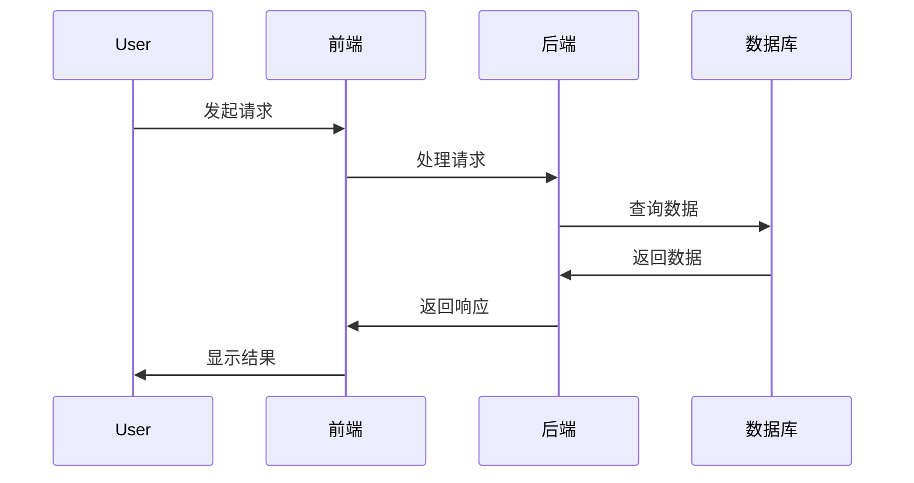
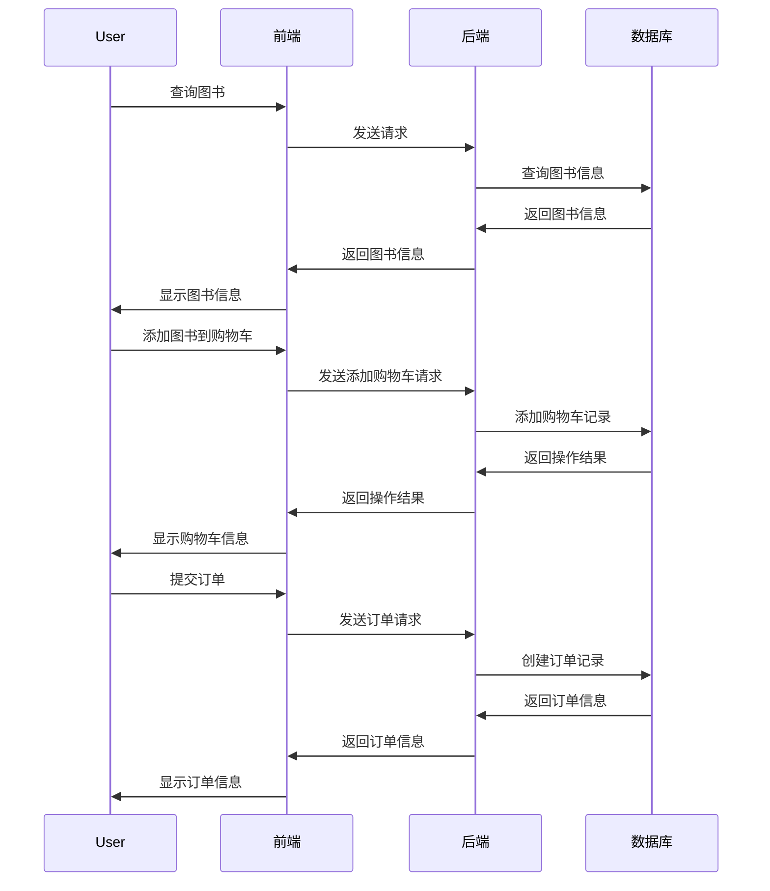

                 

### 领域建模的普适四招

关键词：领域建模、软件工程、系统设计、业务分析、UML、实体-关系图

摘要：领域建模是软件工程中至关重要的一环，它能够帮助我们清晰地理解和表达复杂业务需求，从而设计出高效可靠的系统。本文将详细介绍领域建模的四个关键步骤，包括背景与重要性、构建方法、核心原理、实际应用和优化策略，旨在为读者提供一套普适的领域建模方法论。

### 目录大纲

1. 第一部分：领域建模的背景与重要性
    1.1. 领域建模的基本概念
    1.2. 领域建模的重要性
    1.3. 领域模型的构成要素

2. 第二部分：领域模型的构建方法
    2.1. 领域模型的构建步骤
    2.2. 领域模型的设计工具
    2.3. 实体关系图的绘制

3. 第三部分：领域模型的核心原理
    3.1. 领域模型的核心概念
    3.2. 概念属性特征对比表格
    3.3. ER实体关系图架构

4. 第四部分：领域模型在实际项目中的应用
    4.1. 项目背景介绍
    4.2. 系统功能设计
    4.3. 系统架构设计
    4.4. 系统接口设计
    4.5. 系统交互

5. 第五部分：领域模型分析与优化
    5.1. 领域模型分析
    5.2. 模型优化

6. 第六部分：领域建模的挑战与最佳实践
    6.1. 领域建模的挑战
    6.2. 领域建模的最佳实践

7. 第七部分：小结与展望
    7.1. 小结
    7.2. 展望

### 1. 领域建模的背景与重要性

领域建模（Domain Modeling）是软件工程中用于分析和设计系统的关键步骤。它是一种将业务需求转化为系统设计的方法，通过构建抽象模型来理解和表达复杂的业务领域。领域建模不仅在软件工程中占据重要地位，还在业务分析、系统设计和项目管理等方面有着广泛的应用。

#### 1.1. 领域建模的基本概念

领域建模涉及到以下几个基本概念：

- **实体（Entity）**：在领域模型中，实体是具有独立存在意义的对象，如用户、产品、订单等。
- **关系（Relationship）**：实体之间的关系描述了它们之间的交互和依赖，如用户下单、产品包含组件等。
- **属性（Attribute）**：实体具有的属性描述了其实体的特征，如用户名、产品价格、订单状态等。
- **操作（Operation）**：实体可以执行的操作定义了其实体的行为，如用户登录、产品创建、订单取消等。

#### 1.2. 领域建模的重要性

领域建模的重要性主要体现在以下几个方面：

- **提升系统理解力**：通过领域模型，开发人员可以更清晰地理解业务需求和系统功能，从而设计出更加符合需求的系统。
- **促进团队协作**：领域模型为团队成员提供了一个统一的沟通语言，有助于减少误解和沟通成本。
- **提高系统可维护性**：领域模型有助于组织系统代码结构，使得系统更加模块化和可维护。
- **降低项目风险**：通过提前识别和解决潜在问题，领域建模有助于降低项目风险，确保项目顺利进行。

#### 1.3. 领域模型的构成要素

领域模型通常包含以下几个关键要素：

- **实体**：领域模型中的核心对象，用于表示业务领域中的关键概念。
- **关系**：实体之间的关系描述了它们之间的交互和依赖。
- **属性**：实体的属性定义了其实体的特征和行为。
- **操作**：实体可以执行的操作定义了其实体的行为。

在接下来的章节中，我们将逐步深入探讨领域建模的具体方法、核心原理和实际应用，帮助读者掌握领域建模的普适四招。让我们开始吧！
### 第1章：领域建模的基本概念

#### 1.1.1 什么是领域建模

领域建模是一种将业务需求转化为系统设计的方法，其核心目的是通过对业务领域的抽象和建模，帮助开发人员更好地理解和表达复杂的业务场景。领域建模通常涉及到实体、关系、属性和操作等基本概念。

**定义**：领域建模是指在特定业务领域内，通过对现实世界的抽象和表示，创建一个概念模型，以帮助开发人员理解和实现系统功能。

**目的**：领域建模的主要目的是将业务需求转化为清晰、一致、可维护的系统设计，从而提高系统的可理解性、可扩展性和可维护性。

**与业务需求的关系**：领域建模直接关联到业务需求，它通过对业务需求的深入分析，将需求转化为可操作的设计元素，如实体、关系和属性，从而确保系统设计能够准确反映业务需求。

#### 1.1.2 领域建模的重要性

领域建模在软件工程中具有以下几个重要作用：

- **提升系统理解力**：领域模型提供了一个抽象的、全局的视角，使得开发人员能够更好地理解复杂的业务逻辑和系统功能，从而设计出更加符合业务需求的系统。
- **促进团队协作**：领域模型为团队成员提供了一个统一的沟通语言，有助于减少误解和沟通成本，提高团队协作效率。
- **提高系统可维护性**：领域模型有助于组织系统代码结构，使得系统更加模块化和可维护，降低维护成本。
- **降低项目风险**：通过提前识别和解决潜在问题，领域建模有助于降低项目风险，确保项目顺利进行。

#### 1.1.3 领域模型的构成要素

领域模型主要由以下几个构成要素组成：

- **实体（Entity）**：实体是领域模型中的核心对象，表示业务领域中的关键概念。例如，在电商系统中，用户、产品、订单等都是实体。
- **关系（Relationship）**：实体之间的关系描述了它们之间的交互和依赖。例如，用户可以下单购买产品，订单包含多个产品等。
- **属性（Attribute）**：实体的属性定义了其实体的特征和行为。例如，用户的名字、性别、年龄等。
- **操作（Operation）**：实体可以执行的操作定义了其实体的行为。例如，用户可以登录、注册、修改个人信息等。

在实际应用中，领域模型的构建通常遵循以下步骤：

1. **需求分析**：通过对业务需求的收集和分析，确定领域模型中的实体、关系、属性和操作。
2. **模型设计**：使用统一建模语言（UML）或实体-关系图（ER图）等工具，绘制领域模型。
3. **模型验证**：通过评审和讨论，验证领域模型的准确性和一致性。
4. **模型优化**：根据实际需求和反馈，对领域模型进行优化和调整。

通过以上步骤，开发人员可以逐步构建出符合业务需求的领域模型，从而为后续的系统设计和开发奠定坚实的基础。

#### 1.1.4 领域模型的应用场景

领域建模在多个领域和场景中都有着广泛的应用：

- **电子商务**：在电商系统中，领域建模可以帮助清晰地定义用户、产品、订单等实体，以及它们之间的关系，从而设计出高效、灵活的电商系统。
- **金融系统**：在金融系统中，领域建模可以帮助定义客户、账户、交易等实体，以及它们之间的关系，确保金融系统的安全性和可靠性。
- **医疗系统**：在医疗系统中，领域建模可以帮助定义患者、医生、药品、检查报告等实体，以及它们之间的关系，提高医疗服务的质量和效率。
- **物流系统**：在物流系统中，领域建模可以帮助定义订单、货物、运输工具等实体，以及它们之间的关系，优化物流流程，提高物流效率。

总之，领域建模作为一种有效的分析工具，在软件工程中具有广泛的应用价值，能够帮助开发人员更好地理解和实现复杂业务需求。

### 1.2. 领域模型的构建方法

领域模型的构建是一个系统性的过程，涉及到多个关键步骤，包括需求分析、模型设计、模型验证和模型优化。以下将详细介绍每个步骤的具体内容和应用方法。

#### 1.2.1 需求分析

**需求分析**是领域模型构建的第一步，其核心目的是收集和理解业务需求，确定领域模型中的实体、关系、属性和操作。

**步骤**：

1. **需求收集**：通过访谈、问卷调查、文档分析等方式，收集业务需求和用户需求。
2. **需求分类**：将收集到的需求分类为功能性需求和非功能性需求。
3. **需求分析**：分析需求之间的逻辑关系，确定领域模型中的实体、关系、属性和操作。

**工具**：

- **访谈法**：通过与业务人员、用户和利益相关者进行面对面的访谈，深入了解业务需求和用户需求。
- **问卷调查**：设计问卷，收集大量用户反馈，分析用户行为和需求。
- **文档分析**：分析业务文档、用户手册、技术规格书等，提取有用的业务信息。

#### 1.2.2 模型设计

**模型设计**是领域模型构建的关键环节，其核心目的是将需求分析的结果转化为具体的领域模型，通常使用统一建模语言（UML）或实体-关系图（ER图）等工具。

**步骤**：

1. **实体定义**：根据需求分析的结果，定义领域模型中的实体。
2. **关系建立**：确定实体之间的关系，如关联、聚合、组合等。
3. **属性描述**：为每个实体定义属性，描述其实体特征和行为。
4. **操作定义**：为实体定义可以执行的操作，描述其实体行为。

**工具**：

- **UML工具**：如StarUML、Visual Paradigm等，可以方便地绘制UML图，支持实体、关系、属性和操作的建模。
- **ER图工具**：如ER/Studio、Microsoft Visio等，可以方便地绘制ER图，支持实体、关系和属性的建模。
- **Mermaid**：一种基于Markdown的绘图工具，可以方便地绘制UML图和ER图。

**示例**：

假设我们正在设计一个电商系统，领域模型中的实体可能包括用户、产品、订单等。用户实体可能包含属性如用户名、密码、地址等，操作如登录、注册、修改个人信息等。产品实体可能包含属性如产品名称、价格、库存量等，操作如添加到购物车、下单购买等。订单实体可能包含属性如订单号、订单日期、订单状态等，操作如创建订单、取消订单、修改订单等。

```mermaid
erDiagram
  User ||--|{ Product }: "买" {
      多
      一
  }
  User ||--|{ Order }: "下" {
      一
      多
  }
  Product ||--|{ OrderItem }: "包含" {
      多
      一
  }
  Order ||--|{ OrderItem }: "包含" {
      一
      多
  }
  User {
    用户名
    密码
    地址
  }
  Product {
    产品名称
    价格
    库存量
  }
  Order {
    订单号
    订单日期
    订单状态
  }
  OrderItem {
    订单项号
    产品数量
    总价
  }
```

#### 1.2.3 模型验证

**模型验证**是确保领域模型准确性和一致性的关键步骤，其核心目的是通过评审和测试，发现并解决模型中的问题。

**步骤**：

1. **评审**：组织团队成员对领域模型进行评审，讨论和验证模型中的实体、关系、属性和操作。
2. **测试**：通过编写测试用例，对领域模型进行功能测试和性能测试，验证模型的正确性和一致性。

**工具**：

- **评审工具**：如JIRA、Confluence等，可以方便地记录评审结果和问题。
- **测试工具**：如JUnit、TestNG等，可以方便地编写和执行测试用例。

#### 1.2.4 模型优化

**模型优化**是领域模型构建的最后一步，其核心目的是根据实际需求和反馈，对领域模型进行调整和优化。

**步骤**：

1. **需求回顾**：回顾原始需求和领域模型，分析模型与需求的匹配程度。
2. **模型调整**：根据需求反馈和评审结果，调整领域模型中的实体、关系、属性和操作。
3. **模型验证**：对调整后的模型进行验证，确保模型仍然符合需求和规范。

**方法**：

- **增量式优化**：逐步调整和优化模型，每次只关注一个方面，避免因调整过度而导致模型不稳定。
- **反馈循环**：建立反馈机制，及时收集和利用反馈信息，不断优化模型。

#### 1.2.5 综合应用

在实际项目中，领域模型构建通常需要综合运用上述方法。以下是一个简单的电商系统领域模型构建过程：

1. **需求分析**：通过访谈和问卷调查，收集电商系统的需求，确定用户、产品、订单等实体。
2. **模型设计**：使用UML工具绘制领域模型，定义实体、关系、属性和操作。
3. **模型验证**：组织评审，讨论和验证模型，通过测试用例验证模型的正确性和一致性。
4. **模型优化**：根据反馈和评审结果，调整模型，优化实体、关系、属性和操作。
5. **文档化**：将领域模型文档化，包括模型描述、图示、属性和操作定义等。

通过以上步骤，开发人员可以逐步构建出符合业务需求的领域模型，为后续的系统设计和开发奠定坚实的基础。

### 1.3. 领域模型的核心原理

领域模型的核心原理在于如何有效地组织和管理业务领域中的信息，以构建一个清晰、一致且可扩展的系统设计。以下是领域模型的一些关键概念和核心原理。

#### 1.3.1 实体的属性特征对比

实体是领域模型中的核心对象，它们的属性特征决定了实体的行为和功能。以下是一个简单的实体属性特征对比表格：

| 实体名称 | 属性名称 | 属性类型 | 属性值范围 | 说明 |
| :------: | :------: | :------: | :--------: | :--: |
| 用户     | 用户名   | 字符串   | 长度≥6    | 用户唯一标识 |
| 产品     | 价格     | 浮点数   | ≥0.00     | 产品售价 |
| 订单     | 订单号   | 字符串   | 长度≥10   | 订单唯一标识 |

**示例**：一个用户实体的属性特征如下：
- 用户名（字符串，长度≥6）：用户的登录名，用于唯一标识用户。
- 密码（字符串，长度≥8）：用户的登录密码，用于保障用户账户安全。
- 地址（字符串）：用户的联系地址，用于快递和售后服务。

#### 1.3.2 关系的性质与类型

实体之间的关系是领域模型的重要组成部分，它们描述了实体之间的交互和依赖。以下是一些常见的关系类型和性质：

- **一对一（1:1）**：一个实体只与一个其他实体相关联，如用户与用户头像。
- **一对多（1:N）**：一个实体可以与多个其他实体相关联，如用户与订单。
- **多对多（M:N）**：多个实体可以相互关联，如学生与课程。

**示例**：用户与订单之间是一对多的关系，一个用户可以有多个订单，但一个订单只能属于一个用户。

#### 1.3.3 领域模型的基本原则

领域模型的设计应遵循以下基本原则：

- **一致性**：确保模型中的实体、关系、属性和操作是一致的，没有矛盾和冲突。
- **抽象性**：提取业务领域的核心概念和逻辑，避免过于具体的实现细节。
- **可扩展性**：设计模型时应考虑未来的扩展性，使得模型可以适应业务需求的变化。
- **可理解性**：模型应简洁明了，易于理解和沟通，使得开发人员和其他利益相关者都能快速掌握。

**示例**：在设计电商系统时，领域模型应包括用户、产品、订单等实体，以及它们之间的关系，同时要确保模型的一致性、抽象性和可扩展性。

#### 1.3.4 概念属性特征对比表格

为了更好地理解领域模型中的实体属性特征，以下是一个概念属性特征对比表格：

| 概念名称 | 属性名称 | 属性类型 | 属性值范围 | 说明 |
| :------: | :------: | :------: | :--------: | :--: |
| 产品     | 名称     | 字符串   | 非空       | 产品名称 |
| 产品     | 价格     | 浮点数   | ≥0.00      | 产品售价 |
| 订单     | 订单号   | 字符串   | 长度≥10    | 订单唯一标识 |
| 订单     | 状态     | 字符串   | ["待付款"，"已付款"，"已发货"，"已完成"，"已取消"] | 订单处理状态 |

**示例**：一个订单实体的属性特征如下：
- 订单号（字符串，长度≥10）：订单的唯一标识，用于系统内部管理和查询。
- 订单状态（字符串，可选值：["待付款"，"已付款"，"已发货"，"已完成"，"已取消"]）：订单的处理状态，用于显示订单当前的处理进度。

通过以上表格，我们可以清晰地了解每个概念属性的特征和约束，从而更好地设计领域模型。

#### 1.3.5 ER实体关系图架构

ER实体关系图（Entity-Relationship Diagram）是领域模型设计的重要工具，它通过直观的图形化方式，展示了实体之间的关系和属性。以下是ER实体关系图的架构和示例：

**ER图架构**：

1. **实体（Entity）**：代表领域模型中的核心对象，如用户、产品、订单等。
2. **属性（Attribute）**：代表实体的特征和属性，如用户名、价格、订单号等。
3. **关系（Relationship）**：代表实体之间的关系，如用户与订单之间的一对多关系。
4. **约束（Constraint）**：代表实体属性和关系的约束条件，如订单号必须是唯一的。

**示例**：

以下是一个简单的电商系统ER图示例，展示了用户、产品、订单等实体之间的关系：

```mermaid
erDiagram
  User ||--|{ Product }: "买" {
      多
      一
  }
  User ||--|{ Order }: "下" {
      一
      多
  }
  Product ||--|{ OrderItem }: "包含" {
      多
      一
  }
  Order ||--|{ OrderItem }: "包含" {
      一
      多
  }
  User {
    用户ID
    用户名
    密码
    地址
  }
  Product {
    产品ID
    产品名称
    价格
    库存量
  }
  Order {
    订单ID
    订单日期
    订单状态
  }
  OrderItem {
    订单项ID
    产品ID
    数量
    总价
  }
```

在这个ER图中，用户可以购买多个产品，订单可以包含多个订单项。每个实体都定义了相应的属性，关系则通过连接线表示，并标注了关系类型和数量限制。

通过ER实体关系图，我们可以直观地了解系统中的实体、属性和关系，从而更好地设计和管理领域模型。

### 2. 领域模型在实际项目中的应用

在软件开发过程中，领域模型的应用至关重要，它不仅有助于理解业务需求，还能在系统架构设计和实现中发挥重要作用。以下将通过一个实际项目案例，详细阐述领域模型在项目中的应用过程。

#### 2.1. 项目背景介绍

假设我们要开发一个在线书店系统，这个系统需要提供图书购买、用户注册、订单管理等功能。为了更好地设计这个系统，我们首先需要构建一个明确的领域模型。

#### 2.2. 系统功能设计

在系统功能设计中，领域模型帮助我们清晰地定义系统需要实现的功能。以下是该在线书店系统的主要功能模块：

1. **用户管理**：包括用户注册、登录、信息修改、密码找回等。
2. **图书管理**：包括图书的添加、删除、修改、查询等。
3. **订单管理**：包括订单的创建、修改、取消、查询等。
4. **购物车管理**：包括添加图书到购物车、删除图书、修改数量等。

**领域模型**：以下是该系统的领域模型，包括用户、图书、订单等实体，以及它们之间的关系：

```mermaid
erDiagram
  User ||--|{ Book }: "购买" {
      多
      一
  }
  User ||--|{ Order }: "下单" {
      一
      多
  }
  Book ||--|{ OrderItem }: "包含" {
      多
      一
  }
  Order ||--|{ OrderItem }: "包含" {
      一
      多
  }
  User {
    用户ID
    用户名
    密码
    地址
  }
  Book {
    书ID
    书名
    作者
    价格
    库存
  }
  Order {
    订单ID
    用户ID
    订单日期
    订单状态
  }
  OrderItem {
    订单项ID
    书ID
    数量
    总价
  }
```

通过这个领域模型，我们可以清晰地看到系统中各个功能模块之间的关系，便于后续的系统设计和实现。

#### 2.3. 系统架构设计

在系统架构设计中，领域模型指导我们设计系统的整体结构，确保系统的高效、可维护性。以下是该在线书店系统的主要架构设计：

1. **前端**：负责用户交互，包括用户界面、导航、搜索等功能。
2. **后端**：负责业务逻辑处理，包括用户管理、图书管理、订单管理等。
3. **数据库**：存储用户数据、图书数据、订单数据等。

**架构图**：以下是该系统的架构设计图：



通过这个架构设计图，我们可以看到前端、后端和数据库之间的交互流程，以及数据流向。

#### 2.4. 系统接口设计

在系统接口设计中，领域模型帮助我们定义系统对外提供的接口，确保接口设计的合理性和一致性。以下是该在线书店系统的主要接口设计：

1. **用户接口**：包括用户注册、登录、信息修改、密码找回等接口。
2. **图书接口**：包括图书的添加、删除、修改、查询等接口。
3. **订单接口**：包括订单的创建、修改、取消、查询等接口。

**接口设计**：以下是用户接口的一个示例：

```python
class UserInterface:
    @staticmethod
    def register(username, password, address):
        # 注册新用户
        pass

    @staticmethod
    def login(username, password):
        # 用户登录
        pass

    @staticmethod
    def modify_info(user_id, username, password, address):
        # 修改用户信息
        pass

    @staticmethod
    def find_password(username):
        # 密码找回
        pass
```

通过这个接口设计，我们可以清晰地看到用户接口的功能和操作，便于开发人员根据接口文档进行开发。

#### 2.5. 系统交互

在系统交互中，领域模型帮助我们描述系统各模块之间的交互过程，确保系统功能的完整性和一致性。以下是该在线书店系统的一个交互示例：

**序列图**：以下是用户购买图书的交互过程：



通过这个序列图，我们可以清晰地看到用户购买图书的整个交互过程，包括请求发送、数据查询、操作执行和结果反馈等。

### 3. 领域模型分析与优化

领域模型不仅是系统设计的基础，也是后续开发和维护的关键依据。因此，对领域模型进行深入分析和优化至关重要。以下将介绍领域模型分析的方法、步骤、技巧与注意事项，以及模型优化的目的、原则和方法。

#### 3.1.1 领域模型分析

**模型分析**是指对已构建的领域模型进行详细分析和评估，以确保模型能够准确反映业务需求，并具备良好的可维护性和扩展性。以下为领域模型分析的方法与步骤：

1. **模型审查**：通过团队成员的集体审查，发现模型中的不一致性、冗余性和潜在问题。
2. **用例分析**：基于用例图，分析系统功能与用户需求之间的关系，确保模型覆盖了所有用例。
3. **一致性检查**：验证模型中的实体、关系和属性的统一性和一致性。
4. **性能分析**：评估模型在系统运行时的性能，如查询效率、响应时间等。
5. **扩展性分析**：分析模型在业务需求变化时的扩展性和适应性。

**技巧与注意事项**：

- **保持简洁性**：避免模型过于复杂，确保每个实体和关系都有明确的业务意义。
- **使用注释**：在模型中添加注释，解释实体、关系和属性的含义，便于后续理解和维护。
- **周期性审查**：定期对模型进行审查和更新，以适应业务需求的变化。

#### 3.1.2 模型优化

**模型优化**是指对已构建的领域模型进行调整和改进，以提高系统的可维护性、可扩展性和性能。以下为模型优化的目的、原则和方法：

1. **目的**：
   - 提高模型的准确性和一致性。
   - 提升系统的性能和效率。
   - 优化系统的可维护性和可扩展性。

2. **原则**：
   - 保持模型简洁和直观，避免过度设计。
   - 优先考虑业务需求，确保模型能够准确反映业务逻辑。
   - 考虑系统的长期发展，为未来的扩展留有空间。

3. **方法**：

   - **重构**：对模型中的实体、关系和属性进行重构，消除冗余和冗余。
   - **规范化**：对数据库模型进行规范化，减少数据冗余，提高数据一致性。
   - **缓存与优化**：使用缓存技术，优化查询和数据处理，提高系统性能。

**示例**：

假设我们有一个电商系统，其领域模型包含用户、产品、订单等实体。在优化过程中，我们可能发现以下问题：

1. **冗余关系**：用户与订单之间有多余的关联关系，可以简化为一个直接关联。
2. **性能瓶颈**：订单查询操作效率较低，可以通过索引优化和数据分片提升性能。
3. **扩展性问题**：产品分类体系不够灵活，可以引入分类树结构，便于扩展和管理。

通过优化，我们可以提高系统的整体性能和可维护性，为后续开发提供坚实的基础。

### 4. 领域建模的挑战与最佳实践

尽管领域建模在软件开发中具有重要作用，但在实际应用中仍然面临诸多挑战。以下将介绍领域建模中的常见挑战，并提出相应的最佳实践。

#### 4.1.1 领域建模的挑战

1. **业务复杂性**：业务需求多变且复杂，可能导致领域模型难以准确捕捉所有细节。
2. **沟通障碍**：领域模型的设计和实施过程中，团队内部和与业务人员之间的沟通可能存在障碍。
3. **可扩展性**：领域模型需要具备良好的扩展性，以适应未来业务需求的变化。
4. **数据一致性**：领域模型中的数据关系需要保持一致性，以避免数据冗余和冲突。

#### 4.1.2 领域建模的最佳实践

1. **需求收集与分析**：通过访谈、文档分析和用户调研等方式，全面收集和分析业务需求，确保领域模型能够准确反映业务逻辑。
2. **使用规范化的建模工具**：采用统一建模语言（UML）或实体-关系图（ER图）等标准化工具，提高模型的规范性和可维护性。
3. **迭代与反馈**：采用迭代开发方法，不断优化领域模型，并及时收集团队和业务人员的反馈，确保模型与实际需求的一致性。
4. **文档化**：详细记录领域模型的设计思路、实体、关系和属性，便于后续开发和维护。
5. **定期审查**：定期对领域模型进行审查和更新，以适应业务需求的变化，并解决潜在的问题。

通过遵循以上最佳实践，开发团队可以更有效地应对领域建模过程中的挑战，提高软件项目的成功率和质量。

### 5. 小结与展望

通过本文的探讨，我们系统地介绍了领域建模的普适四招，包括领域建模的背景与重要性、构建方法、核心原理、实际应用和优化策略。领域建模作为一种有效的分析工具，在软件工程中具有广泛的应用价值。在未来的发展中，领域建模将继续向更精细化、智能化和自动化的方向演进。随着人工智能和大数据技术的不断进步，领域建模将更好地支持复杂业务场景的建模和优化，为软件开发带来更多创新和可能性。让我们携手探索领域建模的广阔前景，共同推动软件工程的发展。作者：AI天才研究院/AI Genius Institute & 禅与计算机程序设计艺术 /Zen And The Art of Computer Programming。

