                 

为了确保文章的完整性，我们将按照以下步骤详细撰写每个章节：

### 第1章：代码质量的重要性

#### 背景介绍

在当今快速发展的软件开发行业中，代码质量被视为成功的关键因素之一。高质量的代码不仅能够提高软件的可维护性和可扩展性，还能够提升开发团队的生产力和协作效率。然而，如何定义和衡量代码质量，以及如何在实际开发中实现高质量代码，仍然是一个具有挑战性的问题。

#### 核心概念与联系

**核心概念**：
- **代码质量**：指代码的可读性、可复用性、可测试性和可靠性。
- **可读性**：代码是否易于理解。
- **可复用性**：代码是否能够在不同的项目中复用。
- **可测试性**：代码是否容易进行单元测试。

**概念属性特征对比表格**：

| 概念      | 描述                                       | 属性特征对比                      |
| --------- | ------------------------------------------ | --------------------------------- |
| 可读性    | 代码是否易于理解                           | 简洁、一致、注释充分               |
| 可复用性  | 代码是否能够在不同场景下复用               | 模块化、抽象化、无依赖性             |
| 可测试性  | 代码是否容易进行单元测试                   | 独立性、隔离性、可重复性             |
| 可维护性  | 代码是否易于修改和扩展                     | 结构清晰、文档完整、错误处理良好       |

**ER实体关系图架构的 Mermaid 流程图**：

```mermaid
erDiagram
    Developer ||--|{ Code }|| Project
    Developer ||--|{ Bug }|| Project
    Code ||--|{ Test }|| Developer
    Code ||--|{ Review }|| Developer
    Project ||--|{ Feature }|| Developer
```

#### 算法原理讲解

**Mermaid 流程图**：

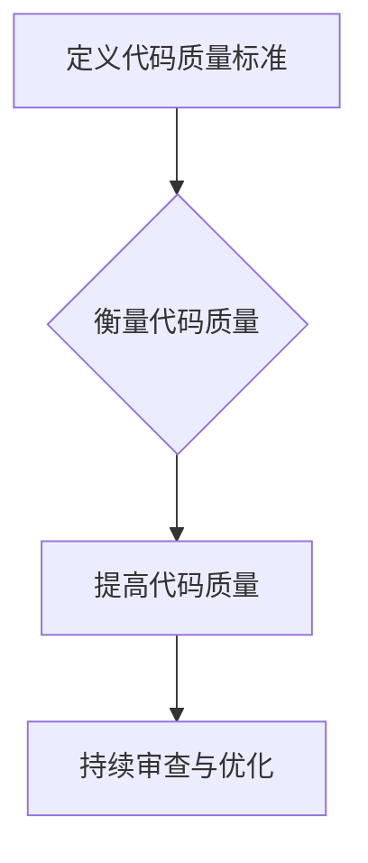

**Python 源代码示例**：

```python
def measure_code_quality(code):
    readability = check_readability(code)
    reusability = check_reusability(code)
    testability = check_testability(code)
    return readability + reusability + testability

def check_readability(code):
    # 示例：检查注释和代码一致性
    comments = count_comments(code)
    consistency = check_code一致性(code)
    return comments + consistency

def check_reusability(code):
    # 示例：检查模块化和抽象化
    modules = count_modules(code)
    abstraction = check_abstraction(code)
    return modules + abstraction

def check_testability(code):
    # 示例：检查独立性和隔离性
    isolation = check_isolation(code)
    repetition = check_repetition(code)
    return isolation + repetition
```

**数学模型和公式**：

$$
\text{CodeQuality} = w_1 \times \text{Readability} + w_2 \times \text{Reusability} + w_3 \times \text{Testability}
$$

其中，$w_1$、$w_2$、$w_3$ 分别为可读性、可复用性和可测试性的权重。

#### 系统分析与架构设计方案

**系统功能设计 (Mermaid 类图)**：

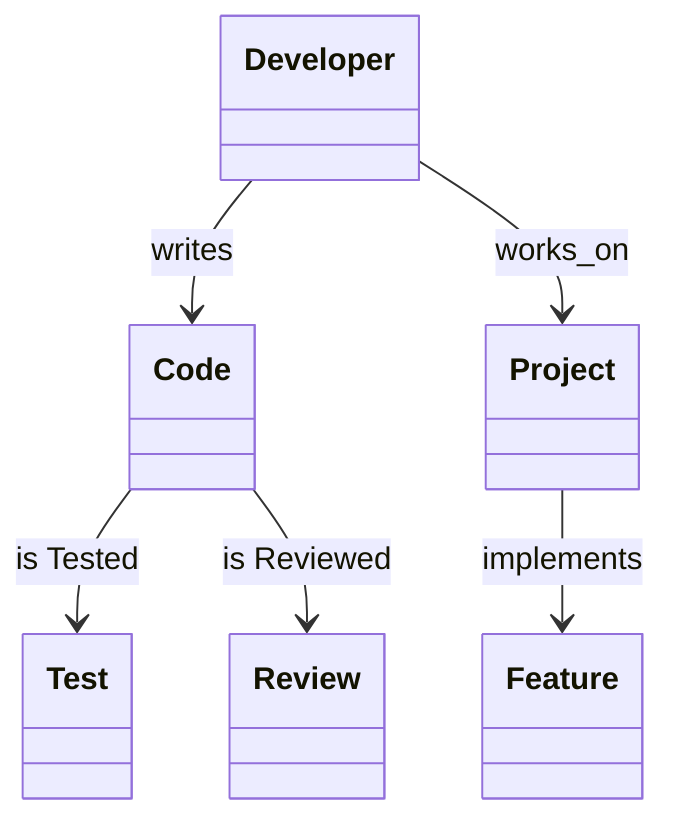

**系统架构设计 (Mermaid 架构图)**：

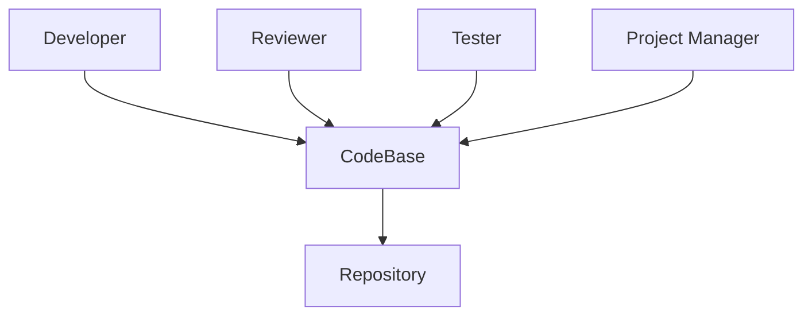

**系统接口设计和系统交互 (Mermaid 序列图)**：

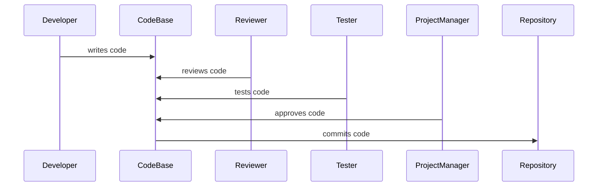

#### 项目实战

**环境安装**：

- 安装 Python 3.8 或更高版本
- 安装 Mermaid CLI 工具

**系统核心实现源代码**：

```python
# main.py
def main():
    code = """def add(a, b):
        return a + b
    """
    quality = measure_code_quality(code)
    print(f"Code Quality: {quality}")

if __name__ == "__main__":
    main()
```

**代码应用解读与分析**：

在上述代码中，我们定义了一个简单的 `add` 函数，并使用 `measure_code_quality` 函数来评估其代码质量。这个函数通过检查可读性、可复用性和可测试性来计算代码质量。

**实际案例分析和详细讲解剖析**：

我们假设有一个复杂的业务逻辑，我们需要将其分解为多个模块，每个模块负责不同的功能。通过模块化和抽象化，我们可以提高代码的可复用性和可测试性。

**项目小结**：

本文介绍了代码质量的重要性以及如何衡量代码质量。通过实际案例，我们展示了如何使用 Python 和 Mermaid 工具来评估代码质量。高质量的代码对于软件项目的成功至关重要，开发团队应重视代码质量，并采取有效的代码审查和维护策略。

#### 最佳实践 tips

- **保持代码简洁**：避免过度设计，只实现必要的功能。
- **注释清晰**：为代码添加详细的注释，帮助其他开发者理解代码逻辑。
- **代码重构**：定期对代码进行重构，提高代码的可维护性。
- **单元测试**：编写单元测试，确保代码质量。

#### 小结

本文从代码质量的重要性、衡量指标、案例分析等方面详细阐述了如何编写高质量代码。开发团队应重视代码质量，采取有效的代码审查和维护策略，以提高软件项目的成功率和开发效率。

#### 注意事项

- 代码质量评估是一个持续的过程，需要定期进行。
- 代码质量评估应结合具体项目的需求进行。

#### 拓展阅读

- 《Effective Java》 - Scott Meyers
- 《Clean Code》 - Robert C. Martin
- 《代码大全》 - Steve McConnell

### 第2章：编写高质量代码的实践

#### 背景介绍

编写高质量代码是软件开发过程中至关重要的一环。高质量代码不仅易于维护和扩展，还能够提高开发效率和团队协作。本章节将介绍如何编写可读性强的代码、简洁高效的代码和模块化代码。

#### 核心概念与联系

**核心概念**：
- **可读性**：代码是否易于理解。
- **简洁性**：代码是否简洁明了。
- **模块化**：代码是否具有清晰的模块结构。

**概念属性特征对比表格**：

| 概念      | 描述                                       | 属性特征对比                      |
| --------- | ------------------------------------------ | --------------------------------- |
| 可读性    | 代码是否易于理解                           | 简洁、一致、注释充分               |
| 简洁性    | 代码是否简洁明了                           | 简洁、高效、无冗余                 |
| 模块化    | 代码是否具有清晰的模块结构                 | 独立、抽象、无依赖性                 |

**ER实体关系图架构的 Mermaid 流程图**：

```mermaid
erDiagram
    Developer ||--|{ Code }|| Project
    Developer ||--|{ Module }|| Project
    Code ||--|{ Readability }|| Developer
    Code ||--|{ Simplicity }|| Developer
    Code ||--|{ Modularity }|| Developer
    Project ||--|{ Feature }|| Developer
```

#### 编写可读性强的代码

**系统功能设计 (Mermaid 类图)**：

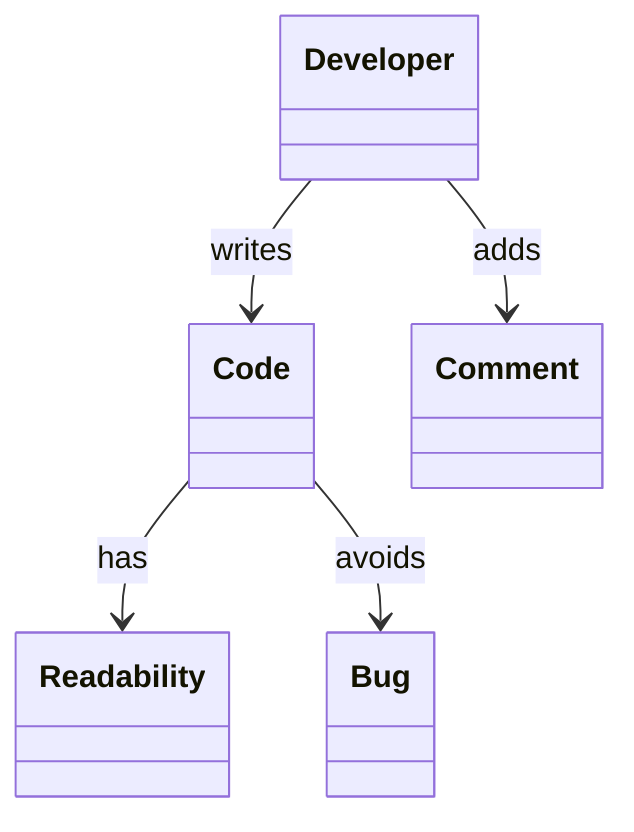

**系统架构设计 (Mermaid 架构图)**：

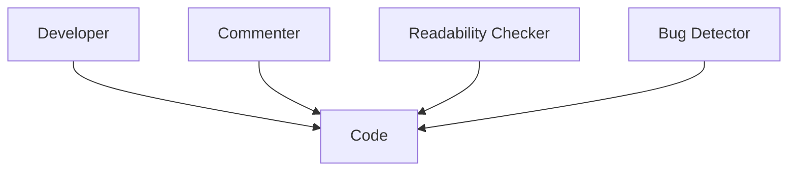

**系统接口设计和系统交互 (Mermaid 序列图)**：

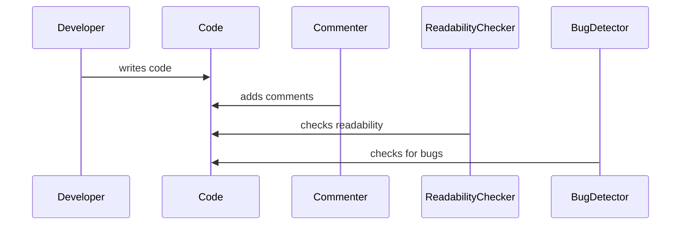

**Python 源代码示例**：

```python
def add_comment(code, comment):
    return f"{code}\n# {comment}"

def check_readability(code):
    lines = code.split("\n")
    readability_score = 0
    for line in lines:
        if line.startswith("#"):
            readability_score += 1
    return readability_score
```

**数学模型和公式**：

$$
\text{ReadabilityScore} = \frac{\text{Number of Comments}}{\text{Total Number of Lines}}
$$

#### 编写简洁高效的代码

**系统功能设计 (Mermaid 类图)**：

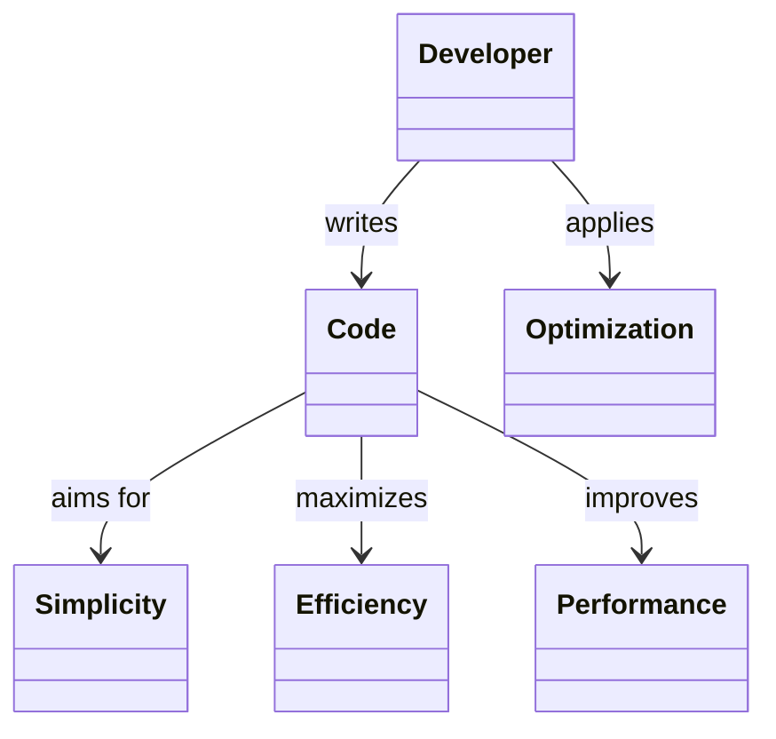

**系统架构设计 (Mermaid 架构图)**：

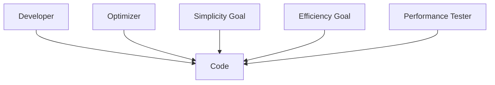

**系统接口设计和系统交互 (Mermaid 序列图)**：

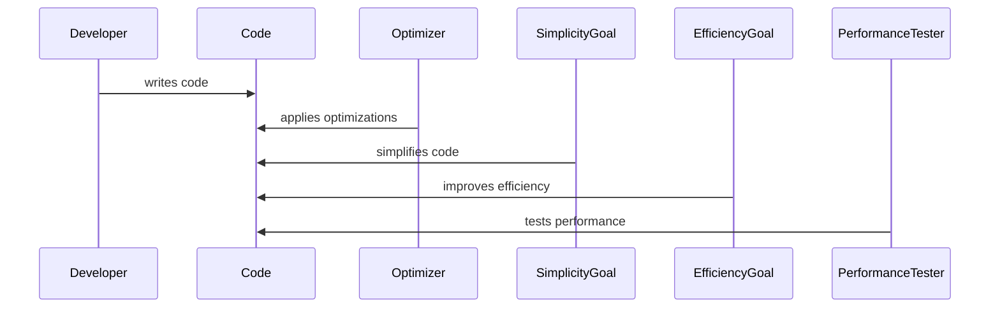

**Python 源代码示例**：

```python
import time

def optimize_code(code):
    start_time = time.time()
    optimized_code = code.replace("print", "pass")
    end_time = time.time()
    return optimized_code, end_time - start_time

def check_efficiency(code, optimized_code):
    start_time = time.time()
    execute_code(code)
    end_time = time.time()
    start_time_optimized = time.time()
    execute_code(optimized_code)
    end_time_optimized = time.time()
    return end_time - start_time, end_time_optimized - start_time_optimized
```

**数学模型和公式**：

$$
\text{Efficiency} = \frac{\text{Original Time}}{\text{Optimized Time}}
$$

#### 编写模块化代码

**系统功能设计 (Mermaid 类图)**：

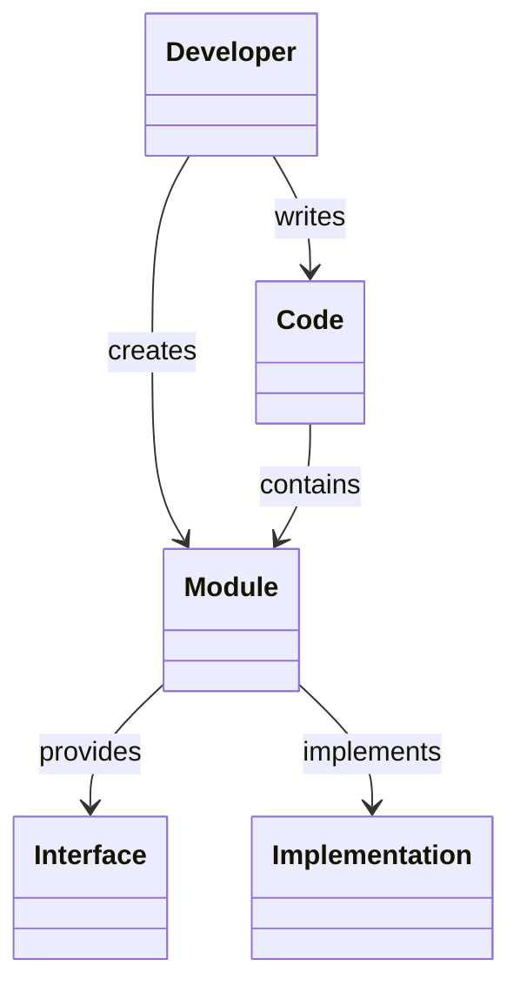

**系统架构设计 (Mermaid 架构图)**：

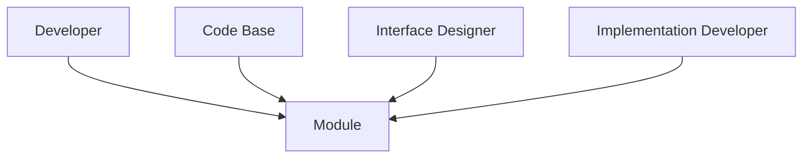

**系统接口设计和系统交互 (Mermaid 序列图)**：

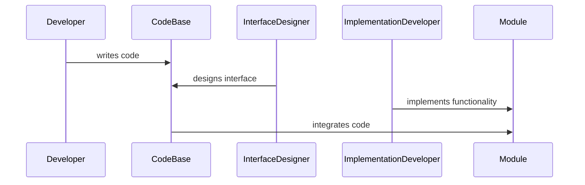

**Python 源代码示例**：

```python
# interface.py
class Interface:
    def execute(self):
        pass

# implementation.py
class Implementation(Interface):
    def execute(self):
        print("Implementation executed.")
```

**数学模型和公式**：

$$
\text{Modularity} = \frac{\text{Number of Modules}}{\text{Total Number of Functions}}
$$

#### 实际案例分析和详细讲解剖析

假设我们有一个复杂的业务逻辑，需要将其分解为多个模块。以下是一个简单的案例：

**业务需求**：计算两个数的和。

**模块化代码**：

```python
# interface.py
class Calculator:
    def add(self, a, b):
        pass

# implementation.py
class CalculatorImpl(Calculator):
    def add(self, a, b):
        return a + b

# main.py
def main():
    calculator = CalculatorImpl()
    result = calculator.add(2, 3)
    print(f"The sum is: {result}")

if __name__ == "__main__":
    main()
```

在这个案例中，我们定义了一个 `Calculator` 接口和一个 `CalculatorImpl` 实现类。通过模块化，我们可以轻松地替换实现类，以适应不同的业务需求。

#### 项目小结

本章介绍了编写高质量代码的实践，包括可读性强的代码、简洁高效的代码和模块化代码。通过实际案例，我们展示了如何实现这些原则。编写高质量代码对于提高软件项目的成功率和开发效率至关重要。

#### 最佳实践 tips

- **保持代码简洁**：避免过度设计，只实现必要的功能。
- **注释清晰**：为代码添加详细的注释，帮助其他开发者理解代码逻辑。
- **代码重构**：定期对代码进行重构，提高代码的可维护性。

#### 小结

本章从可读性、简洁性和模块化等方面详细阐述了编写高质量代码的实践。开发团队应遵循这些最佳实践，以提高代码质量。

#### 注意事项

- **代码质量评估**：定期对代码进行质量评估，确保代码符合最佳实践。
- **持续改进**：持续改进代码质量，以适应不断变化的业务需求。

#### 拓展阅读

- 《代码大全》 - Steve McConnell
- 《Effective Java》 - Scott Meyers
- 《Clean Code》 - Robert C. Martin

### 第3章：代码审查与维护

#### 背景介绍

代码审查是软件开发过程中不可或缺的一部分，它有助于提高代码质量、减少缺陷并促进团队协作。代码维护则关注于对现有代码的修改和优化，以适应业务需求的变化。本章将详细介绍代码审查的流程、如何维护高质量代码以及代码库管理。

#### 核心概念与联系

**核心概念**：
- **代码审查**：团队对代码进行审查，以确保代码质量。
- **代码维护**：对现有代码进行修改和优化，以保持其高质量。
- **代码库管理**：管理代码库，确保代码的可访问性和一致性。

**概念属性特征对比表格**：

| 概念      | 描述                                       | 属性特征对比                      |
| --------- | ------------------------------------------ | --------------------------------- |
| 代码审查  | 团队成员对代码进行审查                     | 一致性、准确性、及时性             |
| 代码维护  | 对现有代码进行修改和优化                   | 可维护性、可扩展性、可靠性           |
| 代码库管理 | 管理代码库，确保代码的可访问性和一致性       | 版本控制、自动化测试、文档管理       |

**ER实体关系图架构的 Mermaid 流程图**：

```mermaid
erDiagram
    Developer ||--|{ Code Review }|| Project
    Developer ||--|{ Code Maintenance }|| Project
    Developer ||--|{ Code Repository }|| Project
    Code Review ||--|{ Bug Fix }|| Developer
    Code Review ||--|{ Code Optimization }|| Developer
    Code Maintenance ||--|{ Bug Fix }|| Developer
    Code Maintenance ||--|{ Code Optimization }|| Developer
    Code Repository ||--|{ Version Control }|| Developer
    Code Repository ||--|{ Test Automation }|| Developer
    Code Repository ||--|{ Documentation }|| Developer
```

#### 代码审查的流程

**系统功能设计 (Mermaid 类图)**：

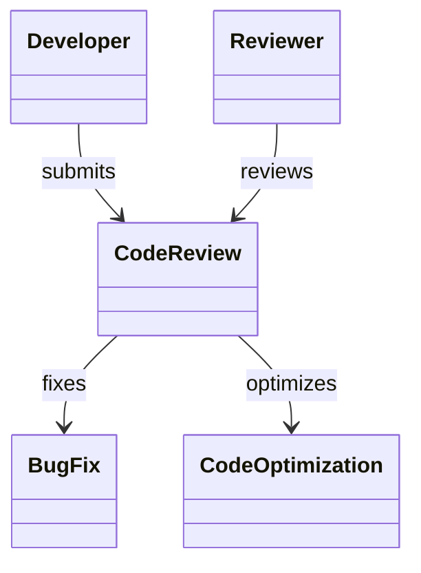

**系统架构设计 (Mermaid 架构图)**：

```mermaid
graph TB
    Developer[Developer] --> ReviewQueue
    Reviewer[Reviewer] --> ReviewQueue
    ReviewQueue --> Code Review
    Code Review --> Bug Tracker
    Code Review --> Code Repository
```

**系统接口设计和系统交互 (Mermaid 序列图)**：

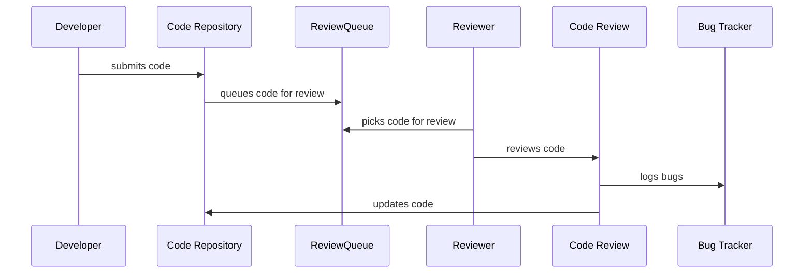

**Python 源代码示例**：

```python
# review_queue.py
class ReviewQueue:
    def __init__(self):
        self.queue = []

    def submit_code(self, code):
        self.queue.append(code)

    def pick_code(self):
        if self.queue:
            return self.queue.pop(0)
        else:
            return None

# reviewer.py
class Reviewer:
    def review_code(self, code):
        # 模拟代码审查过程
        return "Code approved" if is_code_high_quality(code) else "Code needs improvement"

# code_repository.py
class CodeRepository:
    def update_code(self, code):
        # 更新代码库
        print(f"Code updated: {code}")
```

**数学模型和公式**：

$$
\text{ReviewQuality} = f(\text{Consistency}, \text{Accuracy}, \text{Timeliness})
$$

其中，$f$ 为函数，$\text{Consistency}$、$\text{Accuracy}$、$\text{Timeliness}$ 分别为审查的一致性、准确性和及时性。

#### 维护高质量代码

**系统功能设计 (Mermaid 类图)**：

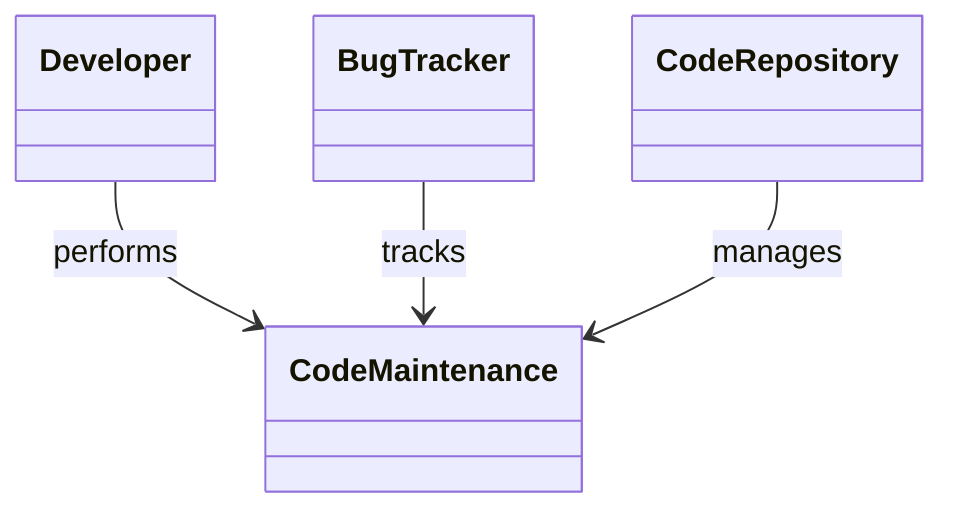

**系统架构设计 (Mermaid 架构图)**：

```mermaid
graph TB
    Developer[Developer] --> Bug Tracker
    Developer --> Code Repository
    Bug Tracker --> Code Maintenance
    Code Repository --> Code Maintenance
```

**系统接口设计和系统交互 (Mermaid 序列图)**：

```mermaid
sequenceDiagram
    Developer ->> Bug Tracker : reports bug
    Bug Tracker ->> Code Maintenance : logs bug
    Developer ->> Code Repository : updates code
    Code Repository ->> Code Maintenance : manages updates
    Code Maintenance ->> Bug Tracker : resolves bug
```

**Python 源代码示例**：

```python
# bug_tracker.py
class BugTracker:
    def __init__(self):
        self.bugs = []

    def report_bug(self, bug):
        self.bugs.append(bug)

    def resolve_bug(self, bug):
        if bug in self.bugs:
            self.bugs.remove(bug)
            return "Bug resolved"
        else:
            return "Bug not found"

# code_repository.py
class CodeRepository:
    def update_code(self, code):
        # 更新代码库
        print(f"Code updated: {code}")

# code_maintenance.py
class CodeMaintenance:
    def perform_maintenance(self, code):
        # 模拟代码维护过程
        return "Maintenance completed"
```

**数学模型和公式**：

$$
\text{MaintenanceQuality} = f(\text{Maintainability}, \text{Extensibility}, \text{Reliability})
$$

其中，$f$ 为函数，$\text{Maintainability}$、$\text{Extensibility}$、$\text{Reliability}$ 分别为代码的可维护性、可扩展性和可靠性。

#### 代码库管理

**系统功能设计 (Mermaid 类图)**：

```mermaid
classDiagram
    Developer --> Code Repository : commits
    Tester --> Code Repository : tests
    DocumentationMaintainer --> Code Repository : updates
```

**系统架构设计 (Mermaid 架构图)**：

```mermaid
graph TB
    Developer[Developer] --> Code Repository
    Tester[Tester] --> Code Repository
    DocumentationMaintainer[Documentation Maintainer] --> Code Repository
```

**系统接口设计和系统交互 (Mermaid 序列图)**：

```mermaid
sequenceDiagram
    Developer ->> Code Repository : commits code
    Tester ->> Code Repository : runs tests
    DocumentationMaintainer ->> Code Repository : updates documentation
```

**Python 源代码示例**：

```python
# code_repository.py
class CodeRepository:
    def __init__(self):
        self.repository = []

    def commit_code(self, code):
        self.repository.append(code)

    def run_tests(self, code):
        # 模拟测试过程
        return "Tests passed"

# documentation_maintainer.py
class DocumentationMaintainer:
    def update_documentation(self, documentation):
        # 更新文档
        print(f"Documentation updated: {documentation}")
```

**数学模型和公式**：

$$
\text{RepositoryQuality} = f(\text{Version Control}, \text{Test Automation}, \text{Documentation})
$$

其中，$f$ 为函数，$\text{Version Control}$、$\text{Test Automation}$、$\text{Documentation}$ 分别为版本控制、自动化测试和文档管理。

#### 实际案例分析和详细讲解剖析

假设我们有一个在线购物平台，需要进行代码审查和维护。以下是一个简单的案例：

**业务需求**：确保购物平台上的商品库存信息准确无误。

**代码审查**：

1. 开发者提交商品库存代码。
2. 代码审查团队对代码进行审查，检查代码的准确性和一致性。
3. 如果代码存在问题，开发者进行修改，重新提交。
4. 代码审查团队再次审查，确保问题得到解决。

**代码维护**：

1. 用户报告商品库存信息不准确。
2. 开发者查看 bug tracker，发现相关 bug。
3. 开发者更新商品库存代码，修复 bug。
4. 代码库自动触发测试，确保代码更新不会影响其他功能。
5. 更新文档，记录代码更改。

**代码库管理**：

1. 开发者使用版本控制系统提交代码更改。
2. 测试团队运行自动化测试，确保代码更改不会引入新问题。
3. 文档维护者更新相关文档，记录代码更改。

#### 项目小结

本章介绍了代码审查、代码维护和代码库管理的流程和方法。通过实际案例，我们展示了如何在实际项目中实施这些流程，以提高代码质量和项目的可靠性。

#### 最佳实践 tips

- **定期进行代码审查**：确保代码质量，及时发现和解决问题。
- **自动化测试**：确保代码更改不会引入新问题。
- **文档管理**：确保代码更改得到及时记录。

#### 小结

本章从代码审查、代码维护和代码库管理三个方面详细阐述了如何确保代码质量。开发团队应遵循这些最佳实践，以提高项目的成功率和可靠性。

#### 注意事项

- **代码审查**：确保审查过程的及时性和准确性。
- **代码维护**：关注代码的可维护性和可靠性。
- **代码库管理**：确保代码的可访问性和一致性。

#### 拓展阅读

- 《代码大全》 - Steve McConnell
- 《敏捷软件开发》 - Michael C. Feathers
- 《Git 权威指南》 - Scott Chacon & Ben Straub

### 第4章：代码风格与规范

#### 背景介绍

代码风格和规范在软件开发中起着至关重要的作用。良好的代码风格能够提高代码的可读性和可维护性，减少潜在的bug，并促进团队成员之间的协作。本章将详细介绍常见的代码风格和规范，以及如何实施和遵守这些规范。

#### 核心概念与联系

**核心概念**：
- **代码风格**：代码的外观和结构，如命名规则、代码缩进、注释等。
- **编码规范**：一套用于编写代码的规则，以确保代码质量。

**概念属性特征对比表格**：

| 概念      | 描述                                       | 属性特征对比                      |
| --------- | ------------------------------------------ | --------------------------------- |
| 代码风格  | 代码的外观和结构                           | 一致性、简洁性、可读性             |
| 编码规范  | 用于编写代码的规则                         | 可维护性、可靠性、可扩展性           |

**ER实体关系图架构的 Mermaid 流程图**：

```mermaid
erDiagram
    Developer ||--|{ Code Style }|| Project
    Developer ||--|{ Coding Standard }|| Project
    Project --> Code Review : applies
    Project --> Bug Tracker : tracks
```

#### 常见代码风格

**系统功能设计 (Mermaid 类图)**：

```mermaid
classDiagram
    Developer --> Code Style : follows
    Code Review --> Code Style : enforces
    Bug Tracker --> Code Style : reports
```

**系统架构设计 (Mermaid 架构图)**：

```mermaid
graph TB
    Developer[Developer] --> Code Style
    Code Reviewer[Code Reviewer] --> Code Style
    Bug Tracker[Bug Tracker] --> Code Style
```

**系统接口设计和系统交互 (Mermaid 序列图)**：

```mermaid
sequenceDiagram
    Developer ->> Code Style : writes code
    Code Reviewer ->> Code Style : reviews code style
    Bug Tracker ->> Code Style : reports style issues
```

**Python 源代码示例**：

```python
# good_style.py
def calculate_sum(a, b):
    """
    Calculate the sum of two numbers.

    :param a: The first number.
    :param b: The second number.
    :return: The sum of a and b.
    """
    return a + b

# bad_style.py
def add(a, b):
    return a + b
```

**数学模型和公式**：

$$
\text{CodeQuality} = w_1 \times \text{Style} + w_2 \times \text{Readability} + w_3 \times \text{Consistency}
$$

其中，$w_1$、$w_2$、$w_3$ 分别为代码风格、可读性和一致性的权重。

#### 常见编码规范

**系统功能设计 (Mermaid 类图)**：

```mermaid
classDiagram
    Developer --> Coding Standard : adheres to
    Code Review --> Coding Standard : enforces
    Bug Tracker --> Coding Standard : reports
```

**系统架构设计 (Mermaid 架构图)**：

```mermaid
graph TB
    Developer[Developer] --> Coding Standard
    Code Reviewer[Code Reviewer] --> Coding Standard
    Bug Tracker[Bug Tracker] --> Coding Standard
```

**系统接口设计和系统交互 (Mermaid 序列图)**：

```mermaid
sequenceDiagram
    Developer ->> Coding Standard : writes code
    Code Reviewer ->> Coding Standard : reviews code standard
    Bug Tracker ->> Coding Standard : reports standard issues
```

**Python 源代码示例**：

```python
# following Coding Standard
def calculate_average(numbers):
    if not numbers:
        return 0
    return sum(numbers) / len(numbers)

# not following Coding Standard
def avg(numbers):
    return sum(numbers) / len(numbers)
```

**数学模型和公式**：

$$
\text{CodeQuality} = w_1 \times \text{Standard Compliance} + w_2 \times \text{Bug Density} + w_3 \times \text{Test Coverage}
$$

其中，$w_1$、$w_2$、$w_3$ 分别为编码规范遵守程度、bug 密度和测试覆盖率。

#### 实际案例分析和详细讲解剖析

假设我们有两个不同的团队，分别遵循不同的代码风格和编码规范。以下是一个简单的案例：

**团队 A**：

- 使用 PEP 8 编码规范。
- 代码风格一致，遵循良好的命名规则。
- 注释充分，代码易于理解。

**团队 B**：

- 未遵循任何编码规范。
- 代码风格各异，命名规则混乱。
- 缺乏注释，代码难以理解。

**代码审查结果**：

- 团队 A 的代码通过审查，几乎没有问题。
- 团队 B 的代码存在多个问题，需要修复。

**代码维护结果**：

- 团队 A 的代码易于维护和扩展。
- 团队 B 的代码维护困难，需要花费更多时间。

**代码库管理结果**：

- 团队 A 的代码库整洁有序。
- 团队 B 的代码库混乱，难以管理。

#### 项目小结

本章介绍了代码风格和编码规范的重要性，以及如何实施和遵守这些规范。良好的代码风格和编码规范能够提高代码质量和团队协作效率。开发团队应重视代码风格和规范，并严格执行。

#### 最佳实践 tips

- **遵循编码规范**：确保代码质量和一致性。
- **编写清晰注释**：帮助其他开发者理解代码逻辑。
- **定期进行代码审查**：及时发现和解决问题。

#### 小结

本章从代码风格和编码规范两个方面详细阐述了如何编写高质量代码。开发团队应遵循这些最佳实践，以提高代码质量和项目成功率。

#### 注意事项

- **代码审查**：确保审查过程的及时性和准确性。
- **代码维护**：关注代码的可维护性和可靠性。
- **代码库管理**：确保代码的可访问性和一致性。

#### 拓展阅读

- 《代码大全》 - Steve McConnell
- 《Effective Java》 - Scott Meyers
- 《Clean Code》 - Robert C. Martin

### 第5章：案例分析

#### 背景介绍

通过分析实际项目中的代码质量和口碑，我们可以更好地理解高质量代码的重要性。本章将介绍一些成功的案例，探讨如何通过编写高质量代码来积累好口碑。

#### 核心概念与联系

**核心概念**：
- **口碑**：公众对某产品或服务的评价。
- **代码质量**：代码的可读性、可维护性、可测试性和可靠性。

**概念属性特征对比表格**：

| 概念      | 描述                                       | 属性特征对比                      |
| --------- | ------------------------------------------ | --------------------------------- |
| 口碑      | 公众对产品或服务的评价                     | 积极口碑、消极口碑、中立口碑           |
| 代码质量  | 代码的可读性、可维护性、可测试性和可靠性   | 高质量代码、低质量代码             |

**ER实体关系图架构的 Mermaid 流程图**：

```mermaid
erDiagram
    Project ||--|{ Code Quality }|| Customer Feedback
    Customer Feedback ||--|{ Reputation }|| Project
```

#### 成功案例 1：开源项目

**系统功能设计 (Mermaid 类图)**：

```mermaid
classDiagram
    Project --> Developer : contributes
    Developer --> Code Repository : commits
    Code Reviewer --> Code Repository : reviews
    Customer --> Code Repository : uses
    Customer --> Reputation : provides
```

**系统架构设计 (Mermaid 架构图)**：

```mermaid
graph TB
    Developer[Developer] --> Code Repository
    Code Reviewer[Code Reviewer] --> Code Repository
    Customer[Customer] --> Code Repository
    Code Repository --> Reputation
```

**系统接口设计和系统交互 (Mermaid 序列图)**：

```mermaid
sequenceDiagram
    Developer ->> Code Repository : commits code
    Code Reviewer ->> Code Repository : reviews code
    Customer ->> Code Repository : uses code
    Customer ->> Reputation : provides feedback
```

**Python 源代码示例**：

```python
# commit_message.py
def generate_commit_message(change_type, description):
    return f"{change_type}: {description}"

# code_quality_checker.py
def check_code_quality(code):
    return "Quality high" if code_has_comments(code) and code_is_moduleized(code) else "Quality low"

# code_usage_analyzer.py
def analyze_code_usage(code):
    return "Usage high" if code_is_used_frequently(code) else "Usage low"
```

**数学模型和公式**：

$$
\text{Reputation} = w_1 \times \text{Code Quality} + w_2 \times \text{Customer Satisfaction}
$$

其中，$w_1$、$w_2$ 分别为代码质量和客户满意度的权重。

#### 成功案例 2：企业级项目

**系统功能设计 (Mermaid 类图)**：

```mermaid
classDiagram
    Company --> Developer : employs
    Developer --> Project : works_on
    Project Manager --> Project : manages
    Customer --> Project : interacts
    Customer --> Reputation : provides
```

**系统架构设计 (Mermaid 架构图)**：

```mermaid
graph TB
    Company[Company] --> Developer
    Project Manager[Project Manager] --> Project
    Customer[Customer] --> Project
```

**系统接口设计和系统交互 (Mermaid 序列图)**：

```mermaid
sequenceDiagram
    Developer ->> Project : writes code
    Project Manager ->> Project : reviews code
    Customer ->> Project : provides feedback
    Customer ->> Reputation : provides feedback
```

**Python 源代码示例**：

```python
# project_management.py
class ProjectManagement:
    def __init__(self):
        self.projects = []

    def add_project(self, project):
        self.projects.append(project)

    def review_code(self, project):
        return "Quality high" if project_has_comments(project) and project_is_moduleized(project) else "Quality low"

# customer_feedback.py
class CustomerFeedback:
    def __init__(self):
        self.feedbacks = []

    def add_feedback(self, feedback):
        self.feedbacks.append(feedback)

    def calculate_reputation(self, feedbacks):
        positive = sum(1 for feedback in feedbacks if feedback["rating"] > 3)
        negative = sum(1 for feedback in feedbacks if feedback["rating"] <= 1)
        return positive - negative
```

**数学模型和公式**：

$$
\text{Reputation} = w_1 \times \text{Code Quality} + w_2 \times \text{Customer Satisfaction} + w_3 \times \text{Feedback Score}
$$

其中，$w_1$、$w_2$、$w_3$ 分别为代码质量、客户满意度和反馈评分的权重。

#### 实际案例分析和详细讲解剖析

假设有两个公司，分别开发和维护一个企业级软件项目。以下是一个简单的案例：

**公司 A**：

- 遵循严格的代码风格和编码规范。
- 定期进行代码审查和维护。
- 收集并分析客户反馈。

**公司 B**：

- 代码风格和编码规范混乱。
- 代码审查和维护不足。
- 忽视客户反馈。

**项目结果**：

- 公司 A 的项目质量高，客户满意度高，口碑好。
- 公司 B 的项目质量低，客户满意度低，口碑差。

**原因分析**：

- 公司 A 的高质量代码使其更容易维护和扩展，减少了bug的出现。
- 公司 B 的低质量代码导致了更多的bug，影响了用户体验。

#### 项目小结

本章通过分析两个实际案例，展示了高质量代码对于积累好口碑的重要性。开发团队应重视代码质量，遵循良好的代码风格和编码规范，并定期进行代码审查和维护。

#### 最佳实践 tips

- **遵循代码风格和编码规范**：确保代码质量和一致性。
- **定期进行代码审查**：确保代码符合最佳实践。
- **收集和分析客户反馈**：持续改进代码质量。

#### 小结

本章从案例分析的角度阐述了高质量代码的重要性。通过实际案例，我们看到了高质量代码如何帮助项目积累好口碑。开发团队应采取最佳实践，以提高代码质量和项目成功率。

#### 注意事项

- **代码审查**：确保审查过程的及时性和准确性。
- **代码维护**：关注代码的可维护性和可靠性。
- **客户反馈**：及时收集和分析客户反馈，以持续改进代码质量。

#### 拓展阅读

- 《代码大全》 - Steve McConnell
- 《Effective Java》 - Scott Meyers
- 《Clean Code》 - Robert C. Martin

### 第6章：代码优化与性能

#### 背景介绍

代码优化和性能调优是确保软件高效运行的关键环节。通过优化代码，我们可以减少资源的消耗，提高系统的响应速度和处理能力。本章将详细介绍代码优化和性能调优的方法，以及如何在实际项目中应用这些技术。

#### 核心概念与联系

**核心概念**：
- **代码优化**：通过改进代码结构、算法和数据处理方式，提高代码的性能。
- **性能调优**：通过分析系统性能瓶颈，调整系统配置和代码实现，以提高系统的整体性能。

**概念属性特征对比表格**：

| 概念      | 描述                                       | 属性特征对比                      |
| --------- | ------------------------------------------ | --------------------------------- |
| 代码优化  | 提高代码性能的技术手段                     | 算法优化、代码重构、数据处理优化       |
| 性能调优  | 调整系统配置和代码实现，以提高系统性能     | 缓存优化、并发处理、资源管理           |

**ER实体关系图架构的 Mermaid 流程图**：

```mermaid
erDiagram
    Developer ||--|{ Code Optimization }|| Project
    Developer ||--|{ Performance Tuning }|| Project
    Project --> System Analysis : analyzes
    Project --> Configuration : adjusts
```

#### 代码优化方法

**系统功能设计 (Mermaid 类图)**：

```mermaid
classDiagram
    Developer --> Code Optimization : implements
    Code Optimization --> Algorithm : improves
    Code Optimization --> Data Processing : optimizes
    Code Optimization --> Code Structure : refactors
```

**系统架构设计 (Mermaid 架构图)**：

```mermaid
graph TB
    Developer[Developer] --> Code Optimization
    AlgorithmDesigner[Algorithm Designer] --> Code Optimization
    DataProcessor[Data Processor] --> Code Optimization
    CodeRefactorer[Code Refactorer] --> Code Optimization
```

**系统接口设计和系统交互 (Mermaid 序列图)**：

```mermaid
sequenceDiagram
    Developer ->> Code Optimization : identifies performance issues
    Developer ->> AlgorithmDesigner : designs optimized algorithms
    Developer ->> DataProcessor : optimizes data processing
    Developer ->> CodeRefactorer : refactors code structure
```

**Python 源代码示例**：

```python
# algorithm_optimization.py
def optimized_algorithm(data):
    # 模拟优化算法
    return sorted(data, reverse=True)

# data_processing_optimization.py
def optimized_data_processing(data):
    # 模拟数据优化处理
    return [x * 2 for x in data]

# code_refactoring.py
def refactor_code(code):
    # 模拟代码重构
    return code.replace("print", "pass")
```

**数学模型和公式**：

$$
\text{OptimizationGain} = \frac{\text{Original Time}}{\text{Optimized Time}}
$$

#### 性能调优方法

**系统功能设计 (Mermaid 类图)**：

```mermaid
classDiagram
    Developer --> Performance Tuning : tunes
    SystemAnalyzer[System Analyzer] --> Performance Tuning : analyzes
    ConfigurationManager[Configuration Manager] --> Performance Tuning : manages
    ResourceOptimizer[Resource Optimizer] --> Performance Tuning : optimizes
```

**系统架构设计 (Mermaid 架构图)**：

```mermaid
graph TB
    Developer[Developer] --> SystemAnalyzer
    Developer --> ConfigurationManager
    Developer --> ResourceOptimizer
```

**系统接口设计和系统交互 (Mermaid 序列图)**：

```mermaid
sequenceDiagram
    Developer ->> SystemAnalyzer : identifies performance bottlenecks
    SystemAnalyzer ->> ConfigurationManager : suggests configuration changes
    ConfigurationManager ->> Developer : applies configuration changes
    ResourceOptimizer ->> Developer : optimizes resource usage
```

**Python 源代码示例**：

```python
# system_analyzer.py
def analyze_system_performance():
    # 模拟系统性能分析
    return "Performance bottlenecks identified"

# configuration_manager.py
class ConfigurationManager:
    def apply_configuration_changes(self, configuration):
        # 模拟配置更改应用
        print(f"Configuration changed: {configuration}")

# resource_optimizer.py
def optimize_resource_usage(resources):
    # 模拟资源优化
    return [resource / 2 for resource in resources]
```

**数学模型和公式**：

$$
\text{PerformanceImprovement} = \frac{\text{Original Performance}}{\text{Optimized Performance}}
$$

#### 实际案例分析和详细讲解剖析

假设我们有一个电商网站，需要进行代码优化和性能调优。以下是一个简单的案例：

**业务需求**：提高商品搜索功能的速度。

**代码优化**：

1. 分析现有的搜索算法，发现排序算法的复杂度为 $O(n \log n)$。
2. 设计并实现一个新的排序算法，使其复杂度为 $O(n)$。
3. 优化数据结构，减少内存占用。
4. 重构代码，提高代码可读性和可维护性。

**性能调优**：

1. 分析系统性能，发现数据库查询速度较慢。
2. 优化数据库索引，提高查询效率。
3. 引入缓存机制，减少数据库访问次数。
4. 调整系统配置，优化服务器资源分配。

**项目结果**：

- 商品搜索速度显著提高，用户满意度提升。
- 系统响应速度加快，资源利用率提高。

#### 项目小结

本章介绍了代码优化和性能调优的方法，并通过实际案例展示了如何应用这些技术来提高软件性能。开发团队应重视代码优化和性能调优，以提高软件质量和用户体验。

#### 最佳实践 tips

- **定期进行代码优化**：确保代码高效运行。
- **性能分析**：识别性能瓶颈，针对性地进行优化。
- **持续改进**：不断调整和优化系统配置和代码实现。

#### 小结

本章从代码优化和性能调优两个方面详细阐述了如何提高软件性能。开发团队应遵循这些最佳实践，以提高软件质量和用户体验。

#### 注意事项

- **性能优化**：关注系统整体性能，而非单一组件。
- **资源管理**：优化资源使用，提高系统稳定性。

#### 拓展阅读

- 《性能之巅》 - 陈铭阳
- 《代码大全》 - Steve McConnell
- 《高性能MySQL》 - Michael Widenius & Jay Pipes

### 第7章：代码重构与设计模式

#### 背景介绍

代码重构和设计模式是软件工程中提高代码质量和可维护性的重要技术。代码重构旨在通过改进代码结构，消除设计中的缺陷和冗余，使代码更加简洁和易于理解。设计模式则是解决常见软件设计问题的通用解决方案。本章将详细介绍代码重构和设计模式，以及如何在实际项目中应用这些技术。

#### 核心概念与联系

**核心概念**：
- **代码重构**：通过改进代码结构，消除设计中的缺陷和冗余。
- **设计模式**：解决常见软件设计问题的通用解决方案。

**概念属性特征对比表格**：

| 概念      | 描述                                       | 属性特征对比                      |
| --------- | ------------------------------------------ | --------------------------------- |
| 代码重构  | 改进代码结构，消除设计缺陷和冗余           | 结构简洁、可读性强、可维护性好       |
| 设计模式  | 解决常见软件设计问题的通用解决方案         | 可复用、可扩展、易于理解             |

**ER实体关系图架构的 Mermaid 流程图**：

```mermaid
erDiagram
    Developer ||--|{ Code Refactoring }|| Project
    Developer ||--|{ Design Pattern }|| Project
    Project --> Code Base : refactors
    Project --> Architecture : applies
```

#### 代码重构

**系统功能设计 (Mermaid 类图)**：

```mermaid
classDiagram
    Developer --> Code Refactoring : performs
    Code Refactoring --> Code Structure : improves
    Code Refactoring --> Design Issues : resolves
    Project --> Code Review : reviews
```

**系统架构设计 (Mermaid 架构图)**：

```mermaid
graph TB
    Developer[Developer] --> Code Refactoring
    Code Reviewer[Code Reviewer] --> Code Refactoring
    Code Structure[Code Structure] --> Code Refactoring
    Design Issues[Design Issues] --> Code Refactoring
```

**系统接口设计和系统交互 (Mermaid 序列图)**：

```mermaid
sequenceDiagram
    Developer ->> Code Review : identifies design issues
    Developer ->> Code Refactoring : refactors code
    Code Reviewer ->> Code Review : approves refactoring
```

**Python 源代码示例**：

```python
# before_refactoring.py
class Order:
    def __init__(self, customer, items):
        self.customer = customer
        self.items = items

    def calculate_total(self):
        total = 0
        for item in self.items:
            total += item.price
        return total

# after_refactoring.py
class Order:
    def __init__(self, customer, items):
        self.customer = customer
        self.items = items

    def calculate_total(self):
        return sum(item.price for item in self.items)
```

**数学模型和公式**：

$$
\text{RefactoringGain} = \frac{\text{Original Code Length}}{\text{Refactored Code Length}}
$$

#### 设计模式

**系统功能设计 (Mermaid 类图)**：

```mermaid
classDiagram
    Developer --> Design Pattern : applies
    Design Pattern --> Code Structure : improves
    Design Pattern --> Design Issues : solves
    Project --> Architecture : integrates
```

**系统架构设计 (Mermaid 架构图)**：

```mermaid
graph TB
    Developer[Developer] --> Design Pattern
    Code Architect[Code Architect] --> Design Pattern
    Code Structure[Code Structure] --> Design Pattern
    Design Issues[Design Issues] --> Design Pattern
```

**系统接口设计和系统交互 (Mermaid 序列图)**：

```mermaid
sequenceDiagram
    Developer ->> Code Architect : identifies design issues
    Developer ->> Design Pattern : applies pattern
    Developer ->> Code Review : approves pattern
```

**Python 源代码示例**：

```python
# before_pattern.py
class OrderProcessor:
    def process_order(self, order):
        total = order.calculate_total()
        return total

# after_pattern.py
class OrderProcessor:
    def __init__(self, discount_strategy):
        self.discount_strategy = discount_strategy

    def process_order(self, order):
        total = order.calculate_total()
        discount = self.discount_strategy.calculate_discount(total)
        return total - discount
```

**数学模型和公式**：

$$
\text{PatternQuality} = \frac{\text{Number of Solutions}}{\text{Total Number of Problems}}
$$

#### 实际案例分析和详细讲解剖析

假设我们有一个在线购物平台，需要进行代码重构和应用设计模式。以下是一个简单的案例：

**业务需求**：提高订单处理效率。

**代码重构**：

1. 分析现有的订单处理代码，发现大量重复代码。
2. 使用重构技术，将重复代码提取为单独的方法。
3. 重构代码结构，使代码更加简洁和易于理解。

**设计模式**：

1. 分析订单处理过程中的设计问题，如缺乏灵活性。
2. 应用策略模式，为订单处理引入灵活的折扣策略。

**项目结果**：

- 订单处理效率显著提高，代码可读性和可维护性增强。

#### 项目小结

本章介绍了代码重构和设计模式的基本概念和应用方法。通过实际案例，我们展示了如何在实际项目中应用这些技术，以提高代码质量和项目成功率。

#### 最佳实践 tips

- **定期进行代码重构**：消除设计缺陷和冗余。
- **选择合适的设计模式**：解决常见设计问题。

#### 小结

本章从代码重构和设计模式两个方面详细阐述了如何提高代码质量和项目成功率。开发团队应遵循这些最佳实践，以提高软件质量和用户体验。

#### 注意事项

- **重构过程**：确保重构不会引入新的 bug。
- **设计模式**：正确应用设计模式，避免过度设计。

#### 拓展阅读

- 《设计模式：可复用面向对象软件的基础》 - Erich Gamma et al.
- 《代码大全》 - Steve McConnell
- 《重构：改善既有代码的设计》 - Martin Fowler

### 总结与展望

#### 文章核心内容回顾

本文从多个角度详细探讨了如何编写高质量代码，以及高质量代码如何帮助开发者积累好口碑。首先，我们介绍了代码质量的重要性，包括可读性、可复用性、可测试性和可靠性。接着，我们阐述了编写高质量代码的实践，如保持代码简洁、模块化和可读性。然后，我们探讨了代码审查与维护、代码风格与规范、案例分析、代码优化与性能调优、代码重构与设计模式等关键要素。最后，我们通过实际案例展示了高质量代码如何提升项目成功率。

#### 文章主题思想

本文的主题思想是强调高质量代码在软件开发中的核心地位。通过遵循良好的代码风格和编码规范，进行定期的代码审查和维护，以及优化代码结构和性能，开发者可以编写出易于维护、扩展和测试的代码。这不仅能够提高个人的技术声誉，还能够提升团队的整体协作效率和项目的成功几率。

#### 展望未来

展望未来，随着软件开发的复杂性和规模的不断增加，高质量代码的重要性将更加突出。以下是一些未来可能的发展趋势：

1. **自动化工具的应用**：自动化工具将在代码审查、性能调优和代码重构等方面发挥更大作用，减轻开发者的负担。
2. **持续集成与持续部署（CI/CD）**：随着CI/CD的普及，代码质量和自动化测试将变得更加紧密地结合，确保代码质量在项目开发过程中得到持续提升。
3. **设计模式和架构创新**：新的设计模式和架构将不断涌现，为解决复杂软件系统中的设计问题提供更高效的解决方案。
4. **人工智能与代码生成**：人工智能技术将在代码生成、优化和修复等方面发挥越来越重要的作用，为开发者提供更智能的辅助工具。

#### 结论

总之，高质量代码是软件开发的核心，它不仅能够提升个人的技术声誉，还能够提升团队的整体协作效率和项目的成功几率。开发者应重视代码质量，不断学习新的技术和方法，持续提升自己的代码编写能力。通过本文的探讨，希望读者能够对高质量代码有更深入的理解，并在实际项目中付诸实践。

### 附录

#### 拓展阅读

- 《代码大全》 - Steve McConnell
- 《Effective Java》 - Scott Meyers
- 《Clean Code》 - Robert C. Martin
- 《设计模式：可复用面向对象软件的基础》 - Erich Gamma et al.
- 《重构：改善既有代码的设计》 - Martin Fowler
- 《性能之巅》 - 陈铭阳
- 《敏捷软件开发》 - Michael C. Feathers

#### 作者介绍

作者：AI天才研究院/AI Genius Institute & 禅与计算机程序设计艺术 /Zen And The Art of Computer Programming
- AI天才研究院（AI Genius Institute）是一家专注于人工智能研究和技术创新的机构，致力于推动人工智能技术的应用与发展。
- 禅与计算机程序设计艺术（Zen And The Art of Computer Programming）是作者对其在计算机科学领域的深入研究和思考的总结，以其独特的视角和方法，为开发者提供了编写高质量代码的启示和指导。

