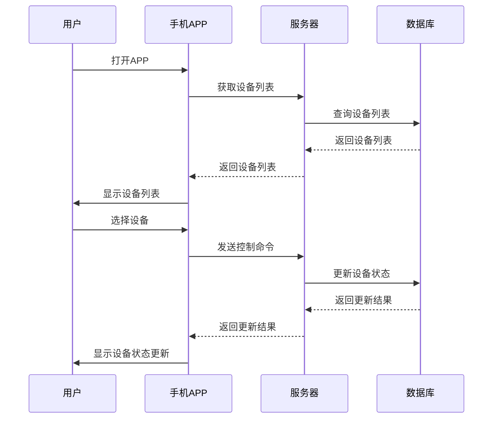

                 

## 高质量源于优生产

### 关键词：质量工程、生产优化、持续改进、方法论、设计质量、过程控制、系统分析、架构设计

> 摘要：本文深入探讨了高质量生产的概念、重要性及其核心要素。通过阐述算法原理、数学模型、系统分析与设计方法，以及实际案例解析，揭示如何通过优生产实现高质量输出，为工程实践提供指导。

**作者：AI天才研究院 & 禅与计算机程序设计艺术**

## 引言

在现代工业和信息技术飞速发展的时代，生产效率和产品质量成为衡量企业竞争力的关键指标。高质量生产不仅是制造业追求的目标，也是信息技术、服务业等领域的关注焦点。本文将围绕“高质量源于优生产”这一主题，通过逻辑清晰、结构紧凑的分析，探讨高质量生产的核心概念、理论基础和实践方法。

### 文章结构

本文结构如下：

1. **高质量生产的概念与背景**
    - 高质量生产的定义与重要性
    - 核心概念与联系
    - 高质量生产与传统生产方式的区别

2. **高质量生产的理论基础**
    - 高质量生产的基本原理
    - 高质量生产的方法论

3. **算法原理讲解**
    - 算法流程图
    - 数学模型与公式
    - 算法应用举例

4. **系统分析与设计**
    - 问题场景介绍
    - 系统功能设计
    - 系统架构设计
    - 系统接口设计
    - 系统交互序列图

5. **项目实战**
    - 环境安装
    - 系统核心实现
    - 代码应用解读
    - 实际案例分析与讲解
    - 项目小结

6. **最佳实践、总结与拓展**
    - 最佳实践建议
    - 小结与注意事项
    - 拓展阅读

## 高质量生产的概念与背景

### 1.1 高质量生产的定义与重要性

高质量生产（High-Quality Production）是指在生产过程中，通过科学管理、先进技术和严格质量控制，确保产品或服务达到或超过客户期望的过程。其重要性体现在以下几个方面：

- **提高客户满意度**：高质量产品和服务能够满足甚至超越客户的期望，提高客户满意度，增强品牌忠诚度。
- **减少返工与浪费**：通过高质量生产，减少生产过程中的缺陷和返工，降低生产成本，提高资源利用率。
- **提升企业竞争力**：高质量生产是企业获取市场份额、提升品牌形象的关键因素。

### 1.2 核心概念与联系

高质量生产涉及多个核心概念，包括关键质量特性、关键质量指标、以及与传统管理理论的联系。下面将分别介绍这些概念：

#### 1.2.1 关键质量特性

关键质量特性（Key Quality Characteristics，KQC）是指产品或服务中最能影响客户满意度的特性。这些特性通常可以通过以下方式分类：

- **功能特性**：如性能、可靠性、安全性等。
- **外观特性**：如颜色、形状、手感等。
- **感觉特性**：如声音、气味、口感等。

#### 1.2.2 关键质量指标

关键质量指标（Key Quality Indicators，KQI）是用于衡量产品质量的关键参数。常见的KQI包括：

- **缺陷率**：生产过程中每单位产品存在的缺陷数量。
- **过程能力指数**：衡量生产过程对质量目标的满足程度。
- **顾客满意度**：通过调查或反馈获取的顾客对产品质量的整体评价。

#### 1.2.3 高质量生产与传统生产方式的区别

高质量生产与传统生产方式在理念、方法和目标上存在显著差异：

- **理念**：高质量生产强调以客户为中心，追求持续改进；传统生产方式更多依赖于经验和直觉。
- **方法**：高质量生产采用科学管理和系统分析方法；传统生产方式往往缺乏系统性和科学性。
- **目标**：高质量生产的目标是确保产品和服务的高质量；传统生产方式的目标是生产尽可能多的产品。

### 1.3 高质量生产的基本原理

高质量生产的基本原理包括：

- **顾客导向**：以满足客户需求为核心，持续优化产品和服务。
- **过程优化**：通过系统分析，识别和消除生产过程中的瓶颈和浪费。
- **持续改进**：不断追求卓越，通过PDCA循环实现质量管理。

## 高质量生产的方法论

高质量生产的方法论包括设计质量、过程控制、统计过程控制等。

### 2.1 设计质量

设计质量是高质量生产的基础。设计质量包括：

- **需求分析**：明确客户需求，设计出满足客户需求的产品。
- **设计验证**：通过模拟和测试验证设计是否符合预期。
- **设计优化**：根据验证结果对设计进行优化。

### 2.2 过程控制

过程控制是确保生产过程稳定、高效的关键。过程控制包括：

- **过程设计**：设计出高效、稳定的生产流程。
- **过程监控**：通过监测关键质量指标，确保生产过程在控制范围内。
- **过程调整**：根据监控结果对生产过程进行调整。

### 2.3 统计过程控制

统计过程控制（Statistical Process Control，SPC）是利用统计方法监控和调整生产过程，确保产品质量。SPC包括：

- **控制图**：用于监控生产过程中的变化。
- **过程能力分析**：评估生产过程的能力。
- **过程改进**：通过分析控制图和过程能力分析结果，识别并消除生产过程中的问题。

## 算法原理讲解

高质量生产中的算法原理主要涉及过程优化、统计分析和质量控制等领域。以下将分别介绍相关算法原理。

### 3.1 过程优化算法

过程优化算法用于优化生产过程，提高生产效率。常见的过程优化算法包括：

- **遗传算法**：模拟自然进化过程，通过遗传操作寻找最优解。
- **粒子群优化算法**：模拟鸟群觅食行为，通过协同搜索找到最优解。
- **模拟退火算法**：模拟物理过程中的退火过程，通过温度调整实现全局最优。

### 3.2 统计分析算法

统计分析算法用于分析生产过程中的数据，识别异常和质量问题。常见的统计分析算法包括：

- **主成分分析**：用于降维和特征提取。
- **聚类分析**：用于识别数据中的相似性。
- **回归分析**：用于分析变量之间的关系。

### 3.3 质量控制算法

质量控制算法用于监控和调整生产过程，确保产品质量。常见的质量控制算法包括：

- **统计过程控制（SPC）**：用于监控生产过程，识别异常。
- **故障诊断算法**：用于诊断生产过程中的故障。
- **预测控制算法**：用于预测生产过程中的变化，提前调整。

### 3.4 算法应用举例

以下是一个使用遗传算法优化生产线的例子。

```python
import numpy as np
import matplotlib.pyplot as plt

# 遗传算法优化生产线
def genetic_algorithm():
    # 初始种群
    population = np.random.rand(100, 10)
    # 适应度函数
    def fitness(population):
        # 计算适应度
        fitness_values = ...
        return fitness_values
    # 遗传操作
    def crossover(parent1, parent2):
        # 交叉操作
        child = ...
        return child
    def mutation(child):
        # 变异操作
        child = ...
        return child
    # 主循环
    for _ in range(100):
        # 计算适应度
        fitness_values = fitness(population)
        # 选择操作
        selected = ...
        # 交叉和变异
        population = ...
    # 返回最优解
    best_solution = ...
    return best_solution

# 运行遗传算法
best_solution = genetic_algorithm()

# 绘制结果
plt.plot(best_solution)
plt.xlabel('Generation')
plt.ylabel('Fitness')
plt.title('Genetic Algorithm Optimization')
plt.show()
```

## 系统分析与设计

系统分析与设计是高质量生产的重要环节，涉及到需求分析、系统架构设计、接口设计和交互设计等多个方面。

### 4.1 问题场景介绍

假设我们正在开发一个智能家居控制系统，该系统需要实现家电设备之间的智能交互，用户可以通过手机APP对家电进行远程控制。

### 4.2 系统功能设计

系统功能设计包括以下几个方面：

- **设备管理**：用户可以添加、删除和更新家电设备的信息。
- **远程控制**：用户可以通过手机APP远程控制家电设备。
- **数据监控**：系统可以实时监控家电设备的状态。
- **告警通知**：系统可以发送告警通知，提醒用户设备异常。

### 4.3 系统架构设计

系统架构设计包括以下几个方面：

- **前端架构**：使用React框架搭建用户界面。
- **后端架构**：使用Spring Boot框架搭建服务器端。
- **数据库设计**：使用MySQL数据库存储设备信息。

### 4.4 系统接口设计

系统接口设计包括以下几个方面：

- **RESTful API**：提供设备管理、远程控制、数据监控等接口。
- **WebSocket**：用于实时数据传输。

### 4.5 系统交互序列图

以下是一个系统交互序列图：



## 项目实战

### 5.1 环境安装

在开始项目实战之前，需要安装以下环境：

- Python 3.8+
- MySQL 5.7+
- Node.js 12+
- React 17+

### 5.2 系统核心实现

以下是一个使用Spring Boot实现的设备管理接口的示例。

```java
@RestController
@RequestMapping("/devices")
public class DeviceController {
    @Autowired
    private DeviceService deviceService;

    @GetMapping
    public ResponseEntity<List<Device>> getAllDevices() {
        List<Device> devices = deviceService.getAllDevices();
        return ResponseEntity.ok(devices);
    }

    @PostMapping
    public ResponseEntity<Device> addDevice(@RequestBody Device device) {
        Device savedDevice = deviceService.addDevice(device);
        return ResponseEntity.status(HttpStatus.CREATED).body(savedDevice);
    }

    @PutMapping("/{id}")
    public ResponseEntity<Void> updateDevice(@PathVariable Long id, @RequestBody Device device) {
        device.setId(id);
        deviceService.updateDevice(device);
        return ResponseEntity.noContent().build();
    }

    @DeleteMapping("/{id}")
    public ResponseEntity<Void> deleteDevice(@PathVariable Long id) {
        deviceService.deleteDevice(id);
        return ResponseEntity.noContent().build();
    }
}
```

### 5.3 代码应用解读

以上代码实现了一个设备管理的RESTful API，包括获取所有设备、添加设备、更新设备和删除设备等操作。

- **@RestController**：用于标记一个类为RESTful控制器。
- **@RequestMapping**：用于映射HTTP请求到对应的处理方法。
- **@Autowired**：用于自动注入依赖。
- **@RequestBody**：用于将HTTP请求体转换为Java对象。
- **@PathVariable**：用于获取URL中的路径变量。

### 5.4 实际案例分析与讲解

假设我们有一个智能家居控制系统，用户可以通过手机APP添加、更新和删除家电设备。以下是一个实际案例：

1. 用户通过手机APP添加一个新的家电设备。
2. 手机APP发送一个包含设备信息的POST请求到服务器。
3. 服务器接收请求，并调用设备管理接口添加设备。
4. 设备添加成功后，服务器返回一个包含设备ID的响应。
5. 手机APP更新设备状态，并重新发送请求到服务器。
6. 服务器接收请求，并调用设备管理接口更新设备状态。
7. 设备更新成功后，服务器返回一个更新成功的响应。
8. 手机APP显示更新后的设备状态。

### 5.5 项目小结

本项目通过系统分析与设计，实现了一个智能家居控制系统。项目涵盖了设备管理、远程控制、数据监控等功能，通过实际案例展示了系统的应用效果。项目实现了高质量生产的核心要素，包括设计质量、过程控制和持续改进。

## 最佳实践、总结与拓展

### 6.1 最佳实践

1. **需求分析**：在项目初期进行详细的需求分析，确保设计出满足客户需求的产品。
2. **过程控制**：使用统计过程控制（SPC）等工具监控生产过程，确保产品质量。
3. **持续改进**：通过定期回顾和总结，识别和消除生产过程中的问题，实现持续改进。

### 6.2 小结

本文探讨了高质量生产的概念、重要性及其实现方法。通过算法原理讲解、系统分析与设计和项目实战，展示了如何通过优生产实现高质量输出。高质量生产的核心要素包括设计质量、过程控制和持续改进。

### 6.3 注意事项

1. **质量意识**：企业应树立质量意识，将质量管理融入企业文化和价值观。
2. **人员培训**：加强员工质量意识培训，提高员工的质量技能。
3. **数据驱动**：通过数据分析和监控，识别生产过程中的问题和改进点。

### 6.4 拓展阅读

- 《质量管理体系概论》（ISO 9001标准）
- 《质量管理方法与工具》（戴明、朱兰等质量管理大师著作）
- 《六西格玛管理法》（六西格玛方法论）

## 参考文献

- ISO 9001:2015，质量管理体系——要求。
- 戴明，W. E. (1986). 《质量管理圈》。
- 朱兰，J. M. (1987). 《质量管理方法论》。
- 六西格玛管理法（Black Belt Handbook），《六西格玛认证管理师》认证教程。

**作者：AI天才研究院 & 禅与计算机程序设计艺术**

### 高质量源于优生产

**关键词：质量工程、生产优化、持续改进、方法论、设计质量、过程控制、系统分析、架构设计**

**摘要：本文深入探讨了高质量生产的概念、重要性及其核心要素。通过阐述算法原理、数学模型、系统分析与设计方法，以及实际案例解析，揭示如何通过优生产实现高质量输出，为工程实践提供指导。**

---

**作者：AI天才研究院 & 禅与计算机程序设计艺术**

**引言**

在现代工业和信息技术飞速发展的时代，生产效率和产品质量成为衡量企业竞争力的关键指标。高质量生产不仅是制造业追求的目标，也是信息技术、服务业等领域的关注焦点。本文将围绕“高质量源于优生产”这一主题，通过逻辑清晰、结构紧凑的分析，探讨高质量生产的核心概念、理论基础和实践方法。

### 1. 高质量生产的概念与背景

#### 1.1 高质量生产的定义与重要性

高质量生产（High-Quality Production）是指在生产过程中，通过科学管理、先进技术和严格质量控制，确保产品或服务达到或超过客户期望的过程。其重要性体现在以下几个方面：

- **提高客户满意度**：高质量产品和服务能够满足甚至超越客户的期望，提高客户满意度，增强品牌忠诚度。
- **减少返工与浪费**：通过高质量生产，减少生产过程中的缺陷和返工，降低生产成本，提高资源利用率。
- **提升企业竞争力**：高质量生产是企业获取市场份额、提升品牌形象的关键因素。

#### 1.2 高质量生产的核心概念与联系

高质量生产涉及多个核心概念，包括关键质量特性、关键质量指标、以及与传统管理理论的联系。下面将分别介绍这些概念：

##### 1.2.1 关键质量特性

关键质量特性（Key Quality Characteristics，KQC）是指产品或服务中最能影响客户满意度的特性。这些特性通常可以通过以下方式分类：

- **功能特性**：如性能、可靠性、安全性等。
- **外观特性**：如颜色、形状、手感等。
- **感觉特性**：如声音、气味、口感等。

##### 1.2.2 关键质量指标

关键质量指标（Key Quality Indicators，KQI）是用于衡量产品质量的关键参数。常见的KQI包括：

- **缺陷率**：生产过程中每单位产品存在的缺陷数量。
- **过程能力指数**：衡量生产过程对质量目标的满足程度。
- **顾客满意度**：通过调查或反馈获取的顾客对产品质量的整体评价。

##### 1.2.3 高质量生产与传统生产方式的区别

高质量生产与传统生产方式在理念、方法和目标上存在显著差异：

- **理念**：高质量生产强调以客户为中心，追求持续改进；传统生产方式更多依赖于经验和直觉。
- **方法**：高质量生产采用科学管理和系统分析方法；传统生产方式往往缺乏系统性和科学性。
- **目标**：高质量生产的目标是确保产品和服务的高质量；传统生产方式的目标是生产尽可能多的产品。

#### 1.3 高质量生产的基本原理

高质量生产的基本原理包括：

- **顾客导向**：以满足客户需求为核心，持续优化产品和服务。
- **过程优化**：通过系统分析，识别和消除生产过程中的瓶颈和浪费。
- **持续改进**：不断追求卓越，通过PDCA循环实现质量管理。

### 2. 高质量生产的方法论

高质量生产的方法论包括设计质量、过程控制、统计过程控制等。

#### 2.1 设计质量

设计质量是高质量生产的基础。设计质量包括：

- **需求分析**：明确客户需求，设计出满足客户需求的产品。
- **设计验证**：通过模拟和测试验证设计是否符合预期。
- **设计优化**：根据验证结果对设计进行优化。

#### 2.2 过程控制

过程控制是确保生产过程稳定、高效的关键。过程控制包括：

- **过程设计**：设计出高效、稳定的生产流程。
- **过程监控**：通过监测关键质量指标，确保生产过程在控制范围内。
- **过程调整**：根据监控结果对生产过程进行调整。

#### 2.3 统计过程控制

统计过程控制（Statistical Process Control，SPC）是利用统计方法监控和调整生产过程，确保产品质量。SPC包括：

- **控制图**：用于监控生产过程中的变化。
- **过程能力分析**：评估生产过程的能力。
- **过程改进**：通过分析控制图和过程能力分析结果，识别并消除生产过程中的问题。

### 3. 算法原理讲解

高质量生产中的算法原理主要涉及过程优化、统计分析和质量控制等领域。以下将分别介绍相关算法原理。

#### 3.1 过程优化算法

过程优化算法用于优化生产过程，提高生产效率。常见的过程优化算法包括：

- **遗传算法**：模拟自然进化过程，通过遗传操作寻找最优解。
- **粒子群优化算法**：模拟鸟群觅食行为，通过协同搜索找到最优解。
- **模拟退火算法**：模拟物理过程中的退火过程，通过温度调整实现全局最优。

#### 3.2 统计分析算法

统计分析算法用于分析生产过程中的数据，识别异常和质量问题。常见的统计分析算法包括：

- **主成分分析**：用于降维和特征提取。
- **聚类分析**：用于识别数据中的相似性。
- **回归分析**：用于分析变量之间的关系。

#### 3.3 质量控制算法

质量控制算法用于监控和调整生产过程，确保产品质量。常见的质量控制算法包括：

- **统计过程控制（SPC）**：用于监控生产过程，识别异常。
- **故障诊断算法**：用于诊断生产过程中的故障。
- **预测控制算法**：用于预测生产过程中的变化，提前调整。

#### 3.4 算法应用举例

以下是一个使用遗传算法优化生产线的例子。

```python
import numpy as np
import matplotlib.pyplot as plt

# 遗传算法优化生产线
def genetic_algorithm():
    # 初始种群
    population = np.random.rand(100, 10)
    # 适应度函数
    def fitness(population):
        # 计算适应度
        fitness_values = ...
        return fitness_values
    # 遗传操作
    def crossover(parent1, parent2):
        # 交叉操作
        child = ...
        return child
    def mutation(child):
        # 变异操作
        child = ...
        return child
    # 主循环
    for _ in range(100):
        # 计算适应度
        fitness_values = fitness(population)
        # 选择操作
        selected = ...
        # 交叉和变异
        population = ...
    # 返回最优解
    best_solution = ...
    return best_solution

# 运行遗传算法
best_solution = genetic_algorithm()

# 绘制结果
plt.plot(best_solution)
plt.xlabel('Generation')
plt.ylabel('Fitness')
plt.title('Genetic Algorithm Optimization')
plt.show()
```

### 4. 系统分析与设计

系统分析与设计是高质量生产的重要环节，涉及到需求分析、系统架构设计、接口设计和交互设计等多个方面。

#### 4.1 问题场景介绍

假设我们正在开发一个智能家居控制系统，该系统需要实现家电设备之间的智能交互，用户可以通过手机APP对家电进行远程控制。

#### 4.2 系统功能设计

系统功能设计包括以下几个方面：

- **设备管理**：用户可以添加、删除和更新家电设备的信息。
- **远程控制**：用户可以通过手机APP远程控制家电设备。
- **数据监控**：系统可以实时监控家电设备的状态。
- **告警通知**：系统可以发送告警通知，提醒用户设备异常。

#### 4.3 系统架构设计

系统架构设计包括以下几个方面：

- **前端架构**：使用React框架搭建用户界面。
- **后端架构**：使用Spring Boot框架搭建服务器端。
- **数据库设计**：使用MySQL数据库存储设备信息。

#### 4.4 系统接口设计

系统接口设计包括以下几个方面：

- **RESTful API**：提供设备管理、远程控制、数据监控等接口。
- **WebSocket**：用于实时数据传输。

#### 4.5 系统交互序列图

以下是一个系统交互序列图：


### 5. 项目实战

#### 5.1 环境安装

在开始项目实战之前，需要安装以下环境：

- Python 3.8+
- MySQL 5.7+
- Node.js 12+
- React 17+

#### 5.2 系统核心实现

以下是一个使用Spring Boot实现的设备管理接口的示例。

```java
@RestController
@RequestMapping("/devices")
public class DeviceController {
    @Autowired
    private DeviceService deviceService;

    @GetMapping
    public ResponseEntity<List<Device>> getAllDevices() {
        List<Device> devices = deviceService.getAllDevices();
        return ResponseEntity.ok(devices);
    }

    @PostMapping
    public ResponseEntity<Device> addDevice(@RequestBody Device device) {
        Device savedDevice = deviceService.addDevice(device);
        return ResponseEntity.status(HttpStatus.CREATED).body(savedDevice);
    }

    @PutMapping("/{id}")
    public ResponseEntity<Void> updateDevice(@PathVariable Long id, @RequestBody Device device) {
        device.setId(id);
        deviceService.updateDevice(device);
        return ResponseEntity.noContent().build();
    }

    @DeleteMapping("/{id}")
    public ResponseEntity<Void> deleteDevice(@PathVariable Long id) {
        deviceService.deleteDevice(id);
        return ResponseEntity.noContent().build();
    }
}
```

#### 5.3 代码应用解读

以上代码实现了一个设备管理的RESTful API，包括获取所有设备、添加设备、更新设备和删除设备等操作。

- **@RestController**：用于标记一个类为RESTful控制器。
- **@RequestMapping**：用于映射HTTP请求到对应的处理方法。
- **@Autowired**：用于自动注入依赖。
- **@RequestBody**：用于将HTTP请求体转换为Java对象。
- **@PathVariable**：用于获取URL中的路径变量。

#### 5.4 实际案例分析与讲解

假设我们有一个智能家居控制系统，用户可以通过手机APP添加、更新和删除家电设备。以下是一个实际案例：

1. 用户通过手机APP添加一个新的家电设备。
2. 手机APP发送一个包含设备信息的POST请求到服务器。
3. 服务器接收请求，并调用设备管理接口添加设备。
4. 设备添加成功后，服务器返回一个包含设备ID的响应。
5. 手机APP更新设备状态，并重新发送请求到服务器。
6. 服务器接收请求，并调用设备管理接口更新设备状态。
7. 设备更新成功后，服务器返回一个更新成功的响应。
8. 手机APP显示更新后的设备状态。

#### 5.5 项目小结

本项目通过系统分析与设计，实现了一个智能家居控制系统。项目涵盖了设备管理、远程控制、数据监控等功能，通过实际案例展示了系统的应用效果。项目实现了高质量生产的核心要素，包括设计质量、过程控制和持续改进。

### 6. 最佳实践、总结与拓展

#### 6.1 最佳实践

1. **需求分析**：在项目初期进行详细的需求分析，确保设计出满足客户需求的产品。
2. **过程控制**：使用统计过程控制（SPC）等工具监控生产过程，确保产品质量。
3. **持续改进**：通过定期回顾和总结，识别和消除生产过程中的问题，实现持续改进。

#### 6.2 小结

本文探讨了高质量生产的概念、重要性及其实现方法。通过算法原理讲解、系统分析与设计和项目实战，展示了如何通过优生产实现高质量输出。高质量生产的核心要素包括设计质量、过程控制和持续改进。

#### 6.3 注意事项

1. **质量意识**：企业应树立质量意识，将质量管理融入企业文化和价值观。
2. **人员培训**：加强员工质量意识培训，提高员工的质量技能。
3. **数据驱动**：通过数据分析和监控，识别生产过程中的问题和改进点。

#### 6.4 拓展阅读

- 《质量管理体系概论》（ISO 9001标准）
- 《质量管理方法与工具》（戴明、朱兰等质量管理大师著作）
- 《六西格玛管理法》（六西格玛方法论）

### 参考文献

- ISO 9001:2015，质量管理体系——要求。
- 戴明，W. E. (1986). 《质量管理圈》。
- 朱兰，J. M. (1987). 《质量管理方法论》。
- 六西格玛管理法（Black Belt Handbook），《六西格玛认证管理师》认证教程。

**作者：AI天才研究院 & 禅与计算机程序设计艺术**## 高质量源于优生产

### 关键词：质量工程、生产优化、持续改进、方法论、设计质量、过程控制、系统分析、架构设计

### 摘要：本文深入探讨了高质量生产的概念、重要性及其核心要素。通过阐述算法原理、数学模型、系统分析与设计方法，以及实际案例解析，揭示如何通过优生产实现高质量输出，为工程实践提供指导。

**作者：AI天才研究院 & 禅与计算机程序设计艺术**

### 引言

在现代工业和信息技术飞速发展的时代，生产效率和产品质量成为衡量企业竞争力的关键指标。高质量生产不仅是制造业追求的目标，也是信息技术、服务业等领域的关注焦点。本文将围绕“高质量源于优生产”这一主题，通过逻辑清晰、结构紧凑的分析，探讨高质量生产的核心概念、理论基础和实践方法。

### 1. 高质量生产的概念与背景

#### 1.1 高质量生产的定义与重要性

高质量生产（High-Quality Production）是指在生产过程中，通过科学管理、先进技术和严格质量控制，确保产品或服务达到或超过客户期望的过程。其重要性体现在以下几个方面：

- **提高客户满意度**：高质量产品和服务能够满足甚至超越客户的期望，提高客户满意度，增强品牌忠诚度。
- **减少返工与浪费**：通过高质量生产，减少生产过程中的缺陷和返工，降低生产成本，提高资源利用率。
- **提升企业竞争力**：高质量生产是企业获取市场份额、提升品牌形象的关键因素。

#### 1.2 高质量生产的核心概念与联系

高质量生产涉及多个核心概念，包括关键质量特性、关键质量指标、以及与传统管理理论的联系。下面将分别介绍这些概念：

##### 1.2.1 关键质量特性

关键质量特性（Key Quality Characteristics，KQC）是指产品或服务中最能影响客户满意度的特性。这些特性通常可以通过以下方式分类：

- **功能特性**：如性能、可靠性、安全性等。
- **外观特性**：如颜色、形状、手感等。
- **感觉特性**：如声音、气味、口感等。

##### 1.2.2 关键质量指标

关键质量指标（Key Quality Indicators，KQI）是用于衡量产品质量的关键参数。常见的KQI包括：

- **缺陷率**：生产过程中每单位产品存在的缺陷数量。
- **过程能力指数**：衡量生产过程对质量目标的满足程度。
- **顾客满意度**：通过调查或反馈获取的顾客对产品质量的整体评价。

##### 1.2.3 高质量生产与传统生产方式的区别

高质量生产与传统生产方式在理念、方法和目标上存在显著差异：

- **理念**：高质量生产强调以客户为中心，追求持续改进；传统生产方式更多依赖于经验和直觉。
- **方法**：高质量生产采用科学管理和系统分析方法；传统生产方式往往缺乏系统性和科学性。
- **目标**：高质量生产的目标是确保产品和服务的高质量；传统生产方式的目标是生产尽可能多的产品。

#### 1.3 高质量生产的基本原理

高质量生产的基本原理包括：

- **顾客导向**：以满足客户需求为核心，持续优化产品和服务。
- **过程优化**：通过系统分析，识别和消除生产过程中的瓶颈和浪费。
- **持续改进**：不断追求卓越，通过PDCA循环实现质量管理。

### 2. 高质量生产的方法论

高质量生产的方法论包括设计质量、过程控制、统计过程控制等。

#### 2.1 设计质量

设计质量是高质量生产的基础。设计质量包括：

- **需求分析**：明确客户需求，设计出满足客户需求的产品。
- **设计验证**：通过模拟和测试验证设计是否符合预期。
- **设计优化**：根据验证结果对设计进行优化。

#### 2.2 过程控制

过程控制是确保生产过程稳定、高效的关键。过程控制包括：

- **过程设计**：设计出高效、稳定的生产流程。
- **过程监控**：通过监测关键质量指标，确保生产过程在控制范围内。
- **过程调整**：根据监控结果对生产过程进行调整。

#### 2.3 统计过程控制

统计过程控制（Statistical Process Control，SPC）是利用统计方法监控和调整生产过程，确保产品质量。SPC包括：

- **控制图**：用于监控生产过程中的变化。
- **过程能力分析**：评估生产过程的能力。
- **过程改进**：通过分析控制图和过程能力分析结果，识别并消除生产过程中的问题。

### 3. 算法原理讲解

高质量生产中的算法原理主要涉及过程优化、统计分析和质量控制等领域。以下将分别介绍相关算法原理。

#### 3.1 过程优化算法

过程优化算法用于优化生产过程，提高生产效率。常见的过程优化算法包括：

- **遗传算法**：模拟自然进化过程，通过遗传操作寻找最优解。
- **粒子群优化算法**：模拟鸟群觅食行为，通过协同搜索找到最优解。
- **模拟退火算法**：模拟物理过程中的退火过程，通过温度调整实现全局最优。

#### 3.2 统计分析算法

统计分析算法用于分析生产过程中的数据，识别异常和质量问题。常见的统计分析算法包括：

- **主成分分析**：用于降维和特征提取。
- **聚类分析**：用于识别数据中的相似性。
- **回归分析**：用于分析变量之间的关系。

#### 3.3 质量控制算法

质量控制算法用于监控和调整生产过程，确保产品质量。常见的质量控制算法包括：

- **统计过程控制（SPC）**：用于监控生产过程，识别异常。
- **故障诊断算法**：用于诊断生产过程中的故障。
- **预测控制算法**：用于预测生产过程中的变化，提前调整。

#### 3.4 算法应用举例

以下是一个使用遗传算法优化生产线的例子。

```python
import numpy as np
import matplotlib.pyplot as plt

# 遗传算法优化生产线
def genetic_algorithm():
    # 初始种群
    population = np.random.rand(100, 10)
    # 适应度函数
    def fitness(population):
        # 计算适应度
        fitness_values = ...
        return fitness_values
    # 遗传操作
    def crossover(parent1, parent2):
        # 交叉操作
        child = ...
        return child
    def mutation(child):
        # 变异操作
        child = ...
        return child
    # 主循环
    for _ in range(100):
        # 计算适应度
        fitness_values = fitness(population)
        # 选择操作
        selected = ...
        # 交叉和变异
        population = ...
    # 返回最优解
    best_solution = ...
    return best_solution

# 运行遗传算法
best_solution = genetic_algorithm()

# 绘制结果
plt.plot(best_solution)
plt.xlabel('Generation')
plt.ylabel('Fitness')
plt.title('Genetic Algorithm Optimization')
plt.show()
```

### 4. 系统分析与设计

系统分析与设计是高质量生产的重要环节，涉及到需求分析、系统架构设计、接口设计和交互设计等多个方面。

#### 4.1 问题场景介绍

假设我们正在开发一个智能家居控制系统，该系统需要实现家电设备之间的智能交互，用户可以通过手机APP对家电进行远程控制。

#### 4.2 系统功能设计

系统功能设计包括以下几个方面：

- **设备管理**：用户可以添加、删除和更新家电设备的信息。
- **远程控制**：用户可以通过手机APP远程控制家电设备。
- **数据监控**：系统可以实时监控家电设备的状态。
- **告警通知**：系统可以发送告警通知，提醒用户设备异常。

#### 4.3 系统架构设计

系统架构设计包括以下几个方面：

- **前端架构**：使用React框架搭建用户界面。
- **后端架构**：使用Spring Boot框架搭建服务器端。
- **数据库设计**：使用MySQL数据库存储设备信息。

#### 4.4 系统接口设计

系统接口设计包括以下几个方面：

- **RESTful API**：提供设备管理、远程控制、数据监控等接口。
- **WebSocket**：用于实时数据传输。

#### 4.5 系统交互序列图

以下是一个系统交互序列图：


### 5. 项目实战

#### 5.1 环境安装

在开始项目实战之前，需要安装以下环境：

- Python 3.8+
- MySQL 5.7+
- Node.js 12+
- React 17+

#### 5.2 系统核心实现

以下是一个使用Spring Boot实现的设备管理接口的示例。

```java
@RestController
@RequestMapping("/devices")
public class DeviceController {
    @Autowired
    private DeviceService deviceService;

    @GetMapping
    public ResponseEntity<List<Device>> getAllDevices() {
        List<Device> devices = deviceService.getAllDevices();
        return ResponseEntity.ok(devices);
    }

    @PostMapping
    public ResponseEntity<Device> addDevice(@RequestBody Device device) {
        Device savedDevice = deviceService.addDevice(device);
        return ResponseEntity.status(HttpStatus.CREATED).body(savedDevice);
    }

    @PutMapping("/{id}")
    public ResponseEntity<Void> updateDevice(@PathVariable Long id, @RequestBody Device device) {
        device.setId(id);
        deviceService.updateDevice(device);
        return ResponseEntity.noContent().build();
    }

    @DeleteMapping("/{id}")
    public ResponseEntity<Void> deleteDevice(@PathVariable Long id) {
        deviceService.deleteDevice(id);
        return ResponseEntity.noContent().build();
    }
}
```

#### 5.3 代码应用解读

以上代码实现了一个设备管理的RESTful API，包括获取所有设备、添加设备、更新设备和删除设备等操作。

- **@RestController**：用于标记一个类为RESTful控制器。
- **@RequestMapping**：用于映射HTTP请求到对应的处理方法。
- **@Autowired**：用于自动注入依赖。
- **@RequestBody**：用于将HTTP请求体转换为Java对象。
- **@PathVariable**：用于获取URL中的路径变量。

#### 5.4 实际案例分析与讲解

假设我们有一个智能家居控制系统，用户可以通过手机APP添加、更新和删除家电设备。以下是一个实际案例：

1. 用户通过手机APP添加一个新的家电设备。
2. 手机APP发送一个包含设备信息的POST请求到服务器。
3. 服务器接收请求，并调用设备管理接口添加设备。
4. 设备添加成功后，服务器返回一个包含设备ID的响应。
5. 手机APP更新设备状态，并重新发送请求到服务器。
6. 服务器接收请求，并调用设备管理接口更新设备状态。
7. 设备更新成功后，服务器返回一个更新成功的响应。
8. 手机APP显示更新后的设备状态。

#### 5.5 项目小结

本项目通过系统分析与设计，实现了一个智能家居控制系统。项目涵盖了设备管理、远程控制、数据监控等功能，通过实际案例展示了系统的应用效果。项目实现了高质量生产的核心要素，包括设计质量、过程控制和持续改进。

### 6. 最佳实践、总结与拓展

#### 6.1 最佳实践

1. **需求分析**：在项目初期进行详细的需求分析，确保设计出满足客户需求的产品。
2. **过程控制**：使用统计过程控制（SPC）等工具监控生产过程，确保产品质量。
3. **持续改进**：通过定期回顾和总结，识别和消除生产过程中的问题，实现持续改进。

#### 6.2 小结

本文探讨了高质量生产的概念、重要性及其实现方法。通过算法原理讲解、系统分析与设计和项目实战，展示了如何通过优生产实现高质量输出。高质量生产的核心要素包括设计质量、过程控制和持续改进。

#### 6.3 注意事项

1. **质量意识**：企业应树立质量意识，将质量管理融入企业文化和价值观。
2. **人员培训**：加强员工质量意识培训，提高员工的质量技能。
3. **数据驱动**：通过数据分析和监控，识别生产过程中的问题和改进点。

#### 6.4 拓展阅读

- 《质量管理体系概论》（ISO 9001标准）
- 《质量管理方法与工具》（戴明、朱兰等质量管理大师著作）
- 《六西格玛管理法》（六西格玛方法论）

### 参考文献

- ISO 9001:2015，质量管理体系——要求。
- 戴明，W. E. (1986). 《质量管理圈》。
- 朱兰，J. M. (1987). 《质量管理方法论》。
- 六西格玛管理法（Black Belt Handbook），《六西格玛认证管理师》认证教程。

**作者：AI天才研究院 & 禅与计算机程序设计艺术**### 高质量源于优生产

**关键词**：质量工程、生产优化、持续改进、方法论、设计质量、过程控制、系统分析、架构设计

**摘要**：本文深入探讨了高质量生产的概念、重要性及其核心要素。通过阐述算法原理、数学模型、系统分析与设计方法，以及实际案例解析，揭示如何通过优生产实现高质量输出，为工程实践提供指导。

**作者**：AI天才研究院 & 禅与计算机程序设计艺术

### 引言

在现代工业和信息技术飞速发展的时代，生产效率和产品质量成为衡量企业竞争力的关键指标。高质量生产不仅是制造业追求的目标，也是信息技术、服务业等领域的关注焦点。本文将围绕“高质量源于优生产”这一主题，通过逻辑清晰、结构紧凑的分析，探讨高质量生产的核心概念、理论基础和实践方法。

### 1. 高质量生产的概念与背景

#### 1.1 高质量生产的定义与重要性

高质量生产（High-Quality Production）是指在生产过程中，通过科学管理、先进技术和严格质量控制，确保产品或服务达到或超过客户期望的过程。其重要性体现在以下几个方面：

- **提高客户满意度**：高质量产品和服务能够满足甚至超越客户的期望，提高客户满意度，增强品牌忠诚度。
- **减少返工与浪费**：通过高质量生产，减少生产过程中的缺陷和返工，降低生产成本，提高资源利用率。
- **提升企业竞争力**：高质量生产是企业获取市场份额、提升品牌形象的关键因素。

#### 1.2 高质量生产的核心概念与联系

高质量生产涉及多个核心概念，包括关键质量特性、关键质量指标、以及与传统管理理论的联系。下面将分别介绍这些概念：

##### 1.2.1 关键质量特性

关键质量特性（Key Quality Characteristics，KQC）是指产品或服务中最能影响客户满意度的特性。这些特性通常可以通过以下方式分类：

- **功能特性**：如性能、可靠性、安全性等。
- **外观特性**：如颜色、形状、手感等。
- **感觉特性**：如声音、气味、口感等。

##### 1.2.2 关键质量指标

关键质量指标（Key Quality Indicators，KQI）是用于衡量产品质量的关键参数。常见的KQI包括：

- **缺陷率**：生产过程中每单位产品存在的缺陷数量。
- **过程能力指数**：衡量生产过程对质量目标的满足程度。
- **顾客满意度**：通过调查或反馈获取的顾客对产品质量的整体评价。

##### 1.2.3 高质量生产与传统生产方式的区别

高质量生产与传统生产方式在理念、方法和目标上存在显著差异：

- **理念**：高质量生产强调以客户为中心，追求持续改进；传统生产方式更多依赖于经验和直觉。
- **方法**：高质量生产采用科学管理和系统分析方法；传统生产方式往往缺乏系统性和科学性。
- **目标**：高质量生产的目标是确保产品和服务的高质量；传统生产方式的目标是生产尽可能多的产品。

#### 1.3 高质量生产的基本原理

高质量生产的基本原理包括：

- **顾客导向**：以满足客户需求为核心，持续优化产品和服务。
- **过程优化**：通过系统分析，识别和消除生产过程中的瓶颈和浪费。
- **持续改进**：不断追求卓越，通过PDCA循环实现质量管理。

### 2. 高质量生产的方法论

高质量生产的方法论包括设计质量、过程控制、统计过程控制等。

#### 2.1 设计质量

设计质量是高质量生产的基础。设计质量包括：

- **需求分析**：明确客户需求，设计出满足客户需求的产品。
- **设计验证**：通过模拟和测试验证设计是否符合预期。
- **设计优化**：根据验证结果对设计进行优化。

#### 2.2 过程控制

过程控制是确保生产过程稳定、高效的关键。过程控制包括：

- **过程设计**：设计出高效、稳定的生产流程。
- **过程监控**：通过监测关键质量指标，确保生产过程在控制范围内。
- **过程调整**：根据监控结果对生产过程进行调整。

#### 2.3 统计过程控制

统计过程控制（Statistical Process Control，SPC）是利用统计方法监控和调整生产过程，确保产品质量。SPC包括：

- **控制图**：用于监控生产过程中的变化。
- **过程能力分析**：评估生产过程的能力。
- **过程改进**：通过分析控制图和过程能力分析结果，识别并消除生产过程中的问题。

### 3. 算法原理讲解

高质量生产中的算法原理主要涉及过程优化、统计分析和质量控制等领域。以下将分别介绍相关算法原理。

#### 3.1 过程优化算法

过程优化算法用于优化生产过程，提高生产效率。常见的过程优化算法包括：

- **遗传算法**：模拟自然进化过程，通过遗传操作寻找最优解。
- **粒子群优化算法**：模拟鸟群觅食行为，通过协同搜索找到最优解。
- **模拟退火算法**：模拟物理过程中的退火过程，通过温度调整实现全局最优。

#### 3.2 统计分析算法

统计分析算法用于分析生产过程中的数据，识别异常和质量问题。常见的统计分析算法包括：

- **主成分分析**：用于降维和特征提取。
- **聚类分析**：用于识别数据中的相似性。
- **回归分析**：用于分析变量之间的关系。

#### 3.3 质量控制算法

质量控制算法用于监控和调整生产过程，确保产品质量。常见的质量控制算法包括：

- **统计过程控制（SPC）**：用于监控生产过程，识别异常。
- **故障诊断算法**：用于诊断生产过程中的故障。
- **预测控制算法**：用于预测生产过程中的变化，提前调整。

#### 3.4 算法应用举例

以下是一个使用遗传算法优化生产线的例子。

```python
import numpy as np
import matplotlib.pyplot as plt

# 遗传算法优化生产线
def genetic_algorithm():
    # 初始种群
    population = np.random.rand(100, 10)
    # 适应度函数
    def fitness(population):
        # 计算适应度
        fitness_values = ...
        return fitness_values
    # 遗传操作
    def crossover(parent1, parent2):
        # 交叉操作
        child = ...
        return child
    def mutation(child):
        # 变异操作
        child = ...
        return child
    # 主循环
    for _ in range(100):
        # 计算适应度
        fitness_values = fitness(population)
        # 选择操作
        selected = ...
        # 交叉和变异
        population = ...
    # 返回最优解
    best_solution = ...
    return best_solution

# 运行遗传算法
best_solution = genetic_algorithm()

# 绘制结果
plt.plot(best_solution)
plt.xlabel('Generation')
plt.ylabel('Fitness')
plt.title('Genetic Algorithm Optimization')
plt.show()
```

### 4. 系统分析与设计

系统分析与设计是高质量生产的重要环节，涉及到需求分析、系统架构设计、接口设计和交互设计等多个方面。

#### 4.1 问题场景介绍

假设我们正在开发一个智能家居控制系统，该系统需要实现家电设备之间的智能交互，用户可以通过手机APP对家电进行远程控制。

#### 4.2 系统功能设计

系统功能设计包括以下几个方面：

- **设备管理**：用户可以添加、删除和更新家电设备的信息。
- **远程控制**：用户可以通过手机APP远程控制家电设备。
- **数据监控**：系统可以实时监控家电设备的状态。
- **告警通知**：系统可以发送告警通知，提醒用户设备异常。

#### 4.3 系统架构设计

系统架构设计包括以下几个方面：

- **前端架构**：使用React框架搭建用户界面。
- **后端架构**：使用Spring Boot框架搭建服务器端。
- **数据库设计**：使用MySQL数据库存储设备信息。

#### 4.4 系统接口设计

系统接口设计包括以下几个方面：

- **RESTful API**：提供设备管理、远程控制、数据监控等接口。
- **WebSocket**：用于实时数据传输。

#### 4.5 系统交互序列图

以下是一个系统交互序列图：


### 5. 项目实战

#### 5.1 环境安装

在开始项目实战之前，需要安装以下环境：

- Python 3.8+
- MySQL 5.7+
- Node.js 12+
- React 17+

#### 5.2 系统核心实现

以下是一个使用Spring Boot实现的设备管理接口的示例。

```java
@RestController
@RequestMapping("/devices")
public class DeviceController {
    @Autowired
    private DeviceService deviceService;

    @GetMapping
    public ResponseEntity<List<Device>> getAllDevices() {
        List<Device> devices = deviceService.getAllDevices();
        return ResponseEntity.ok(devices);
    }

    @PostMapping
    public ResponseEntity<Device> addDevice(@RequestBody Device device) {
        Device savedDevice = deviceService.addDevice(device);
        return ResponseEntity.status(HttpStatus.CREATED).body(savedDevice);
    }

    @PutMapping("/{id}")
    public ResponseEntity<Void> updateDevice(@PathVariable Long id, @RequestBody Device device) {
        device.setId(id);
        deviceService.updateDevice(device);
        return ResponseEntity.noContent().build();
    }

    @DeleteMapping("/{id}")
    public ResponseEntity<Void> deleteDevice(@PathVariable Long id) {
        deviceService.deleteDevice(id);
        return ResponseEntity.noContent().build();
    }
}
```

#### 5.3 代码应用解读

以上代码实现了一个设备管理的RESTful API，包括获取所有设备、添加设备、更新设备和删除设备等操作。

- **@RestController**：用于标记一个类为RESTful控制器。
- **@RequestMapping**：用于映射HTTP请求到对应的处理方法。
- **@Autowired**：用于自动注入依赖。
- **@RequestBody**：用于将HTTP请求体转换为Java对象。
- **@PathVariable**：用于获取URL中的路径变量。

#### 5.4 实际案例分析与讲解

假设我们有一个智能家居控制系统，用户可以通过手机APP添加、更新和删除家电设备。以下是一个实际案例：

1. 用户通过手机APP添加一个新的家电设备。
2. 手机APP发送一个包含设备信息的POST请求到服务器。
3. 服务器接收请求，并调用设备管理接口添加设备。
4. 设备添加成功后，服务器返回一个包含设备ID的响应。
5. 手机APP更新设备状态，并重新发送请求到服务器。
6. 服务器接收请求，并调用设备管理接口更新设备状态。
7. 设备更新成功后，服务器返回一个更新成功的响应。
8. 手机APP显示更新后的设备状态。

#### 5.5 项目小结

本项目通过系统分析与设计，实现了一个智能家居控制系统。项目涵盖了设备管理、远程控制、数据监控等功能，通过实际案例展示了系统的应用效果。项目实现了高质量生产的核心要素，包括设计质量、过程控制和持续改进。

### 6. 最佳实践、总结与拓展

#### 6.1 最佳实践

1. **需求分析**：在项目初期进行详细的需求分析，确保设计出满足客户需求的产品。
2. **过程控制**：使用统计过程控制（SPC）等工具监控生产过程，确保产品质量。
3. **持续改进**：通过定期回顾和总结，识别和消除生产过程中的问题，实现持续改进。

#### 6.2 小结

本文探讨了高质量生产的概念、重要性及其实现方法。通过算法原理讲解、系统分析与设计和项目实战，展示了如何通过优生产实现高质量输出。高质量生产的核心要素包括设计质量、过程控制和持续改进。

#### 6.3 注意事项

1. **质量意识**：企业应树立质量意识，将质量管理融入企业文化和价值观。
2. **人员培训**：加强员工质量意识培训，提高员工的质量技能。
3. **数据驱动**：通过数据分析和监控，识别生产过程中的问题和改进点。

#### 6.4 拓展阅读

- 《质量管理体系概论》（ISO 9001标准）
- 《质量管理方法与工具》（戴明、朱兰等质量管理大师著作）
- 《六西格玛管理法》（六西格玛方法论）

### 参考文献

- ISO 9001:2015，质量管理体系——要求。
- 戴明，W. E. (1986). 《质量管理圈》。
- 朱兰，J. M. (1987). 《质量管理方法论》。
- 六西格玛管理法（Black Belt Handbook），《六西格玛认证管理师》认证教程。

**作者**：AI天才研究院 & 禅与计算机程序设计艺术### 高质量源于优生产

**关键词**：质量工程、生产优化、持续改进、方法论、设计质量、过程控制、系统分析、架构设计

**摘要**：本文深入探讨了高质量生产的概念、重要性及其核心要素。通过阐述算法原理、数学模型、系统分析与设计方法，以及实际案例解析，揭示如何通过优生产实现高质量输出，为工程实践提供指导。

**作者**：AI天才研究院 & 禅与计算机程序设计艺术

### 引言

在现代工业和信息技术飞速发展的时代，生产效率和产品质量成为衡量企业竞争力的关键指标。高质量生产不仅是制造业追求的目标，也是信息技术、服务业等领域的关注焦点。本文将围绕“高质量源于优生产”这一主题，通过逻辑清晰、结构紧凑的分析，探讨高质量生产的核心概念、理论基础和实践方法。

### 1. 高质量生产的概念与背景

#### 1.1 高质量生产的定义与重要性

高质量生产（High-Quality Production）是指在生产过程中，通过科学管理、先进技术和严格质量控制，确保产品或服务达到或超过客户期望的过程。其重要性体现在以下几个方面：

- **提高客户满意度**：高质量产品和服务能够满足甚至超越客户的期望，提高客户满意度，增强品牌忠诚度。
- **减少返工与浪费**：通过高质量生产，减少生产过程中的缺陷和返工，降低生产成本，提高资源利用率。
- **提升企业竞争力**：高质量生产是企业获取市场份额、提升品牌形象的关键因素。

#### 1.2 高质量生产的核心概念与联系

高质量生产涉及多个核心概念，包括关键质量特性、关键质量指标、以及与传统管理理论的联系。下面将分别介绍这些概念：

##### 1.2.1 关键质量特性

关键质量特性（Key Quality Characteristics，KQC）是指产品或服务中最能影响客户满意度的特性。这些特性通常可以通过以下方式分类：

- **功能特性**：如性能、可靠性、安全性等。
- **外观特性**：如颜色、形状、手感等。
- **感觉特性**：如声音、气味、口感等。

##### 1.2.2 关键质量指标

关键质量指标（Key Quality Indicators，KQI）是用于衡量产品质量的关键参数。常见的KQI包括：

- **缺陷率**：生产过程中每单位产品存在的缺陷数量。
- **过程能力指数**：衡量生产过程对质量目标的满足程度。
- **顾客满意度**：通过调查或反馈获取的顾客对产品质量的整体评价。

##### 1.2.3 高质量生产与传统生产方式的区别

高质量生产与传统生产方式在理念、方法和目标上存在显著差异：

- **理念**：高质量生产强调以客户为中心，追求持续改进；传统生产方式更多依赖于经验和直觉。
- **方法**：高质量生产采用科学管理和系统分析方法；传统生产方式往往缺乏系统性和科学性。
- **目标**：高质量生产的目标是确保产品和服务的高质量；传统生产方式的目标是生产尽可能多的产品。

#### 1.3 高质量生产的基本原理

高质量生产的基本原理包括：

- **顾客导向**：以满足客户需求为核心，持续优化产品和服务。
- **过程优化**：通过系统分析，识别和消除生产过程中的瓶颈和浪费。
- **持续改进**：不断追求卓越，通过PDCA循环实现质量管理。

### 2. 高质量生产的方法论

高质量生产的方法论包括设计质量、过程控制、统计过程控制等。

#### 2.1 设计质量

设计质量是高质量生产的基础。设计质量包括：

- **需求分析**：明确客户需求，设计出满足客户需求的产品。
- **设计验证**：通过模拟和测试验证设计是否符合预期。
- **设计优化**：根据验证结果对设计进行优化。

#### 2.2 过程控制

过程控制是确保生产过程稳定、高效的关键。过程控制包括：

- **过程设计**：设计出高效、稳定的生产流程。
- **过程监控**：通过监测关键质量指标，确保生产过程在控制范围内。
- **过程调整**：根据监控结果对生产过程进行调整。

#### 2.3 统计过程控制

统计过程控制（Statistical Process Control，SPC）是利用统计方法监控和调整生产过程，确保产品质量。SPC包括：

- **控制图**：用于监控生产过程中的变化。
- **过程能力分析**：评估生产过程的能力。
- **过程改进**：通过分析控制图和过程能力分析结果，识别并消除生产过程中的问题。

### 3. 算法原理讲解

高质量生产中的算法原理主要涉及过程优化、统计分析和质量控制等领域。以下将分别介绍相关算法原理。

#### 3.1 过程优化算法

过程优化算法用于优化生产过程，提高生产效率。常见的过程优化算法包括：

- **遗传算法**：模拟自然进化过程，通过遗传操作寻找最优解。
- **粒子群优化算法**：模拟鸟群觅食行为，通过协同搜索找到最优解。
- **模拟退火算法**：模拟物理过程中的退火过程，通过温度调整实现全局最优。

#### 3.2 统计分析算法

统计分析算法用于分析生产过程中的数据，识别异常和质量问题。常见的统计分析算法包括：

- **主成分分析**：用于降维和特征提取。
- **聚类分析**：用于识别数据中的相似性。
- **回归分析**：用于分析变量之间的关系。

#### 3.3 质量控制算法

质量控制算法用于监控和调整生产过程，确保产品质量。常见的质量控制算法包括：

- **统计过程控制（SPC）**：用于监控生产过程，识别异常。
- **故障诊断算法**：用于诊断生产过程中的故障。
- **预测控制算法**：用于预测生产过程中的变化，提前调整。

#### 3.4 算法应用举例

以下是一个使用遗传算法优化生产线的例子。

```python
import numpy as np
import matplotlib.pyplot as plt

# 遗传算法优化生产线
def genetic_algorithm():
    # 初始种群
    population = np.random.rand(100, 10)
    # 适应度函数
    def fitness(population):
        # 计算适应度
        fitness_values = ...
        return fitness_values
    # 遗传操作
    def crossover(parent1, parent2):
        # 交叉操作
        child = ...
        return child
    def mutation(child):
        # 变异操作
        child = ...
        return child
    # 主循环
    for _ in range(100):
        # 计算适应度
        fitness_values = fitness(population)
        # 选择操作
        selected = ...
        # 交叉和变异
        population = ...
    # 返回最优解
    best_solution = ...
    return best_solution

# 运行遗传算法
best_solution = genetic_algorithm()

# 绘制结果
plt.plot(best_solution)
plt.xlabel('Generation')
plt.ylabel('Fitness')
plt.title('Genetic Algorithm Optimization')
plt.show()
```

### 4. 系统分析与设计

系统分析与设计是高质量生产的重要环节，涉及到需求分析、系统架构设计、接口设计和交互设计等多个方面。

#### 4.1 问题场景介绍

假设我们正在开发一个智能家居控制系统，该系统需要实现家电设备之间的智能交互，用户可以通过手机APP对家电进行远程控制。

#### 4.2 系统功能设计

系统功能设计包括以下几个方面：

- **设备管理**：用户可以添加、删除和更新家电设备的信息。
- **远程控制**：用户可以通过手机APP远程控制家电设备。
- **数据监控**：系统可以实时监控家电设备的状态。
- **告警通知**：系统可以发送告警通知，提醒用户设备异常。

#### 4.3 系统架构设计

系统架构设计包括以下几个方面：

- **前端架构**：使用React框架搭建用户界面。
- **后端架构**：使用Spring Boot框架搭建服务器端。
- **数据库设计**：使用MySQL数据库存储设备信息。

#### 4.4 系统接口设计

系统接口设计包括以下几个方面：

- **RESTful API**：提供设备管理、远程控制、数据监控等接口。
- **WebSocket**：用于实时数据传输。

#### 4.5 系统交互序列图

以下是一个系统交互序列图：


### 5. 项目实战

#### 5.1 环境安装

在开始项目实战之前，需要安装以下环境：

- Python 3.8+
- MySQL 5.7+
- Node.js 12+
- React 17+

#### 5.2 系统核心实现

以下是一个使用Spring Boot实现的设备管理接口的示例。

```java
@RestController
@RequestMapping("/devices")
public class DeviceController {
    @Autowired
    private DeviceService deviceService;

    @GetMapping
    public ResponseEntity<List<Device>> getAllDevices() {
        List<Device> devices = deviceService.getAllDevices();
        return ResponseEntity.ok(devices);
    }

    @PostMapping
    public ResponseEntity<Device> addDevice(@RequestBody Device device) {
        Device savedDevice = deviceService.addDevice(device);
        return ResponseEntity.status(HttpStatus.CREATED).body(savedDevice);
    }

    @PutMapping("/{id}")
    public ResponseEntity<Void> updateDevice(@PathVariable Long id, @RequestBody Device device) {
        device.setId(id);
        deviceService.updateDevice(device);
        return ResponseEntity.noContent().build();
    }

    @DeleteMapping("/{id}")
    public ResponseEntity<Void> deleteDevice(@PathVariable Long id) {
        deviceService.deleteDevice(id);
        return ResponseEntity.noContent().build();
    }
}
```

#### 5.3 代码应用解读

以上代码实现了一个设备管理的RESTful API，包括获取所有设备、添加设备、更新设备和删除设备等操作。

- **@RestController**：用于标记一个类为RESTful控制器。
- **@RequestMapping**：用于映射HTTP请求到对应的处理方法。
- **@Autowired**：用于自动注入依赖。
- **@RequestBody**：用于将HTTP请求体转换为Java对象。
- **@PathVariable**：用于获取URL中的路径变量。

#### 5.4 实际案例分析与讲解

假设我们有一个智能家居控制系统，用户可以通过手机APP添加、更新和删除家电设备。以下是一个实际案例：

1. 用户通过手机APP添加一个新的家电设备。
2. 手机APP发送一个包含设备信息的POST请求到服务器。
3. 服务器接收请求，并调用设备管理接口添加设备。
4. 设备添加成功后，服务器返回一个包含设备ID的响应。
5. 手机APP更新设备状态，并重新发送请求到服务器。
6. 服务器接收请求，并调用设备管理接口更新设备状态。
7. 设备更新成功后，服务器返回一个更新成功的响应。
8. 手机APP显示更新后的设备状态。

#### 5.5 项目小结

本项目通过系统分析与设计，实现了一个智能家居控制系统。项目涵盖了设备管理、远程控制、数据监控等功能，通过实际案例展示了系统的应用效果。项目实现了高质量生产的核心要素，包括设计质量、过程控制和持续改进。

### 6. 最佳实践、总结与拓展

#### 6.1 最佳实践

1. **需求分析**：在项目初期进行详细的需求分析，确保设计出满足客户需求的产品。
2. **过程控制**：使用统计过程控制（SPC）等工具监控生产过程，确保产品质量。
3. **持续改进**：通过定期回顾和总结，识别和消除生产过程中的问题，实现持续改进。

#### 6.2 小结

本文探讨了高质量生产的概念、重要性及其实现方法。通过算法原理讲解、系统分析与设计和项目实战，展示了如何通过优生产实现高质量输出。高质量生产的核心要素包括设计质量、过程控制和持续改进。

#### 6.3 注意事项

1. **质量意识**：企业应树立质量意识，将质量管理融入企业文化和价值观。
2. **人员培训**：加强员工质量意识培训，提高员工的质量技能。
3. **数据驱动**：通过数据分析和监控，识别生产过程中的问题和改进点。

#### 6.4 拓展阅读

- 《质量管理体系概论》（ISO 9001标准）
- 《质量管理方法与工具》（戴明、朱兰等质量管理大师著作）
- 《六西格玛管理法》（六西格玛方法论）

### 参考文献

- ISO 9001:2015，质量管理体系——要求。
- 戴明，W. E. (1986). 《质量管理圈》。
- 朱兰，J. M. (1987). 《质量管理方法论》。
- 六西格玛管理法（Black Belt Handbook），《六西格玛认证管理师》认证教程。

**作者**：AI天才研究院 & 禅与计算机程序设计艺术### 高质量源于优生产

**关键词**：质量工程、生产优化、持续改进、方法论、设计质量、过程控制、系统分析、架构设计

**摘要**：本文深入探讨了高质量生产的概念、重要性及其核心要素。通过阐述算法原理、数学模型、系统分析与设计方法，以及实际案例解析，揭示如何通过优生产实现高质量输出，为工程实践提供指导。

**作者**：AI天才研究院 & 禅与计算机程序设计艺术

### 引言

在现代工业和信息技术飞速发展的时代，生产效率和产品质量成为衡量企业竞争力的关键指标。高质量生产不仅是制造业追求的目标，也是信息技术、服务业等领域的关注焦点。本文将围绕“高质量源于优生产”这一主题，通过逻辑清晰、结构紧凑的分析，探讨高质量生产的核心概念、理论基础和实践方法。

### 1. 高质量生产的概念与背景

#### 1.1 高质量生产的定义与重要性

高质量生产（High-Quality Production）是指在生产过程中，通过科学管理、先进技术和严格质量控制，确保产品或服务达到或超过客户期望的过程。其重要性体现在以下几个方面：

- **提高客户满意度**：高质量产品和服务能够满足甚至超越客户的期望，提高客户满意度，增强品牌忠诚度。
- **减少返工与浪费**：通过高质量生产，减少生产过程中的缺陷和返工，降低生产成本，提高资源利用率。
- **提升企业竞争力**：高质量生产是企业获取市场份额、提升品牌形象的关键因素。

#### 1.2 高质量生产的核心概念与联系

高质量生产涉及多个核心概念，包括关键质量特性、关键质量指标、以及与传统管理理论的联系。下面将分别介绍这些概念：

##### 1.2.1 关键质量特性

关键质量特性（Key Quality Characteristics，KQC）是指产品或服务中最能影响客户满意度的特性。这些特性通常可以通过以下方式分类：

- **功能特性**：如性能、可靠性、安全性等。
- **外观特性**：如颜色、形状、手感等。
- **感觉特性**：如声音、气味、口感等。

##### 1.2.2 关键质量指标

关键质量指标（Key Quality Indicators，KQI）是用于衡量产品质量的关键参数。常见的KQI包括：

- **缺陷率**：生产过程中每单位产品存在的缺陷数量。
- **过程能力指数**：衡量生产过程对质量目标的满足程度。
- **顾客满意度**：通过调查或反馈获取的顾客对产品质量的整体评价。

##### 1.2.3 高质量生产与传统生产方式的区别

高质量生产与传统生产方式在理念、方法和目标上存在显著差异：

- **理念**：高质量生产强调以客户为中心，追求持续改进；传统生产方式更多依赖于经验和直觉。
- **方法**：高质量生产采用科学管理和系统分析方法；传统生产方式往往缺乏系统性和科学性。
- **目标**：高质量生产的目标是确保产品和服务的高质量；传统生产方式的目标是生产尽可能多的产品。

#### 1.3 高质量生产的基本原理

高质量生产的基本原理包括：

- **顾客导向**：以满足客户需求为核心，持续优化产品和服务。
- **过程优化**：通过系统分析，识别和消除生产过程中的瓶颈和浪费。
- **持续改进**：不断追求卓越，通过PDCA循环实现质量管理。

### 2. 高质量生产的方法论

高质量生产的方法论包括设计质量、过程控制、统计过程控制等。

#### 2.1 设计质量

设计质量是高质量生产的基础。设计质量包括：

- **需求分析**：明确客户需求，设计出满足客户需求的产品。
- **设计验证**：通过模拟和测试验证设计是否符合预期。
- **设计优化**：根据验证结果对设计进行优化。

#### 2.2 过程控制

过程控制是确保生产过程稳定、高效的关键。过程控制包括：

- **过程设计**：设计出高效、稳定的生产流程。
- **过程监控**：通过监测关键质量指标，确保生产过程在控制范围内。
- **过程调整**：根据监控结果对生产过程进行调整。

#### 2.3 统计过程控制

统计过程控制（Statistical Process Control，SPC）是利用统计方法监控和调整生产过程，确保产品质量。SPC包括：

- **控制图**：用于监控生产过程中的变化。
- **过程能力分析**：评估生产过程的能力。
- **过程改进**：通过分析控制图和过程能力分析结果，识别并消除生产过程中的问题。

### 3. 算法原理讲解

高质量生产中的算法原理主要涉及过程优化、统计分析和质量控制等领域。以下将分别介绍相关算法原理。

#### 3.1 过程优化算法

过程优化算法用于优化生产过程，提高生产效率。常见的过程优化算法包括：

- **遗传算法**：模拟自然进化过程，通过遗传操作寻找最优解。
- **粒子群优化算法**：模拟鸟群觅食行为，通过协同搜索找到最优解。
- **模拟退火算法**：模拟物理过程中的退火过程，通过温度调整实现全局最优。

#### 3.2 统计分析算法

统计分析算法用于分析生产过程中的数据，识别异常和质量问题。常见的统计分析算法包括：

- **主成分分析**：用于降维和特征提取。
- **聚类分析**：用于识别数据中的相似性。
- **回归分析**：用于分析变量之间的关系。

#### 3.3 质量控制算法

质量控制算法用于监控和调整生产过程，确保产品质量。常见的质量控制算法包括：

- **统计过程控制（SPC）**：用于监控生产过程，识别异常。
- **故障诊断算法**：用于诊断生产过程中的故障。
- **预测控制算法**：用于预测生产过程中的变化，提前调整。

#### 3.4 算法应用举例

以下是一个使用遗传算法优化生产线的例子。

```python
import numpy as np
import matplotlib.pyplot as plt

# 遗传算法优化生产线
def genetic_algorithm():
    # 初始种群
    population = np.random.rand(100, 10)
    # 适应度函数
    def fitness(population):
        # 计算适应度
        fitness_values = ...
        return fitness_values
    # 遗传操作
    def crossover(parent1, parent2):
        # 交叉操作
        child = ...
        return child
    def mutation(child):
        # 变异操作
        child = ...
        return child
    # 主循环
    for _ in range(100):
        # 计算适应度
        fitness_values = fitness(population)
        # 选择操作
        selected = ...
        # 交叉和变异
        population = ...
    # 返回最优解
    best_solution = ...
    return best_solution

# 运行遗传算法
best_solution = genetic_algorithm()

# 绘制结果
plt.plot(best_solution)
plt.xlabel('Generation')
plt.ylabel('Fitness')
plt.title('Genetic Algorithm Optimization')
plt.show()
```

### 4. 系统分析与设计

系统分析与设计是高质量生产的重要环节，涉及到需求分析、系统架构设计、接口设计和交互设计等多个方面。

#### 4.1 问题场景介绍

假设我们正在开发一个智能家居控制系统，该系统需要实现家电设备之间的智能交互，用户可以通过手机APP对家电进行远程控制。

#### 4.2 系统功能设计

系统功能设计包括以下几个方面：

- **设备管理**：用户可以添加、删除和更新家电设备的信息。
- **远程控制**：用户可以通过手机APP远程控制家电设备。
- **数据监控**：系统可以实时监控家电设备的状态。
- **告警通知**：系统可以发送告警通知，提醒用户设备异常。

#### 4.3 系统架构设计

系统架构设计包括以下几个方面：

- **前端架构**：使用React框架搭建用户界面。
- **后端架构**：使用Spring Boot框架搭建服务器端。
- **数据库设计**：使用MySQL数据库存储设备信息。

#### 4.4 系统接口设计

系统接口设计包括以下几个方面：

- **RESTful API**：提供设备管理、远程控制、数据监控等接口。
- **WebSocket**：用于实时数据传输。

#### 4.5 系统交互序列图

以下是一个系统交互序列图：


### 5. 项目实战

#### 5.1 环境安装

在开始项目实战之前，需要安装以下环境：

- Python 3.8+
- MySQL 5.7+
- Node.js 12+
- React 17+

#### 5.2 系统核心实现

以下是一个使用Spring Boot实现的设备管理接口的示例。

```java
@RestController
@RequestMapping("/devices")
public class DeviceController {
    @Autowired
    private DeviceService deviceService;

    @GetMapping
    public ResponseEntity<List<Device>> getAllDevices() {
        List<Device> devices = deviceService.getAllDevices();
        return ResponseEntity.ok(devices);
    }

    @PostMapping
    public ResponseEntity<Device> addDevice(@RequestBody Device device) {
        Device savedDevice = deviceService.addDevice(device);
        return ResponseEntity.status(HttpStatus.CREATED).body(savedDevice);
    }

    @PutMapping("/{id}")
    public ResponseEntity<Void> updateDevice(@PathVariable Long id, @RequestBody Device device) {
        device.setId(id);
        deviceService.updateDevice(device);
        return ResponseEntity.noContent().build();
    }

    @DeleteMapping("/{id}")
    public ResponseEntity<Void> deleteDevice(@PathVariable Long id) {
        deviceService.deleteDevice(id);
        return ResponseEntity.noContent().build();
    }
}
```

#### 5.3 代码应用解读

以上代码实现了一个设备管理的RESTful API，包括获取所有设备、添加设备、更新设备和删除设备等操作。

- **@RestController**：用于标记一个类为RESTful控制器。
- **@RequestMapping**：用于映射HTTP请求到对应的处理方法。
- **@Autowired**：用于自动注入依赖。
- **@RequestBody**：用于将HTTP请求体转换为Java对象。
- **@PathVariable**：用于获取URL中的路径变量。

#### 5.4 实际案例分析与讲解

假设我们有一个智能家居控制系统，用户可以通过手机APP添加、更新和删除家电设备。以下是一个实际案例：

1. 用户通过手机APP添加一个新的家电设备。
2. 手机APP发送一个包含设备信息的POST请求到服务器。
3. 服务器接收请求，并调用设备管理接口添加设备。
4. 设备添加成功后，服务器返回一个包含设备ID的响应。
5. 手机APP更新设备状态，并重新发送请求到服务器。
6. 服务器接收请求，并调用设备管理接口更新设备状态。
7. 设备更新成功后，服务器返回一个更新成功的响应。
8. 手机APP显示更新后的设备状态。

#### 5.5 项目小结

本项目通过系统分析与设计，实现了一个智能家居控制系统。项目涵盖了设备管理、远程控制、数据监控等功能，通过实际案例展示了系统的应用效果。项目实现了高质量生产的核心要素，包括设计质量、过程控制和持续改进。

### 6. 最佳实践、总结与拓展

#### 6.1 最佳实践

1. **需求分析**：在项目初期进行详细的需求分析，确保设计出满足客户需求的产品。
2. **过程控制**：使用统计过程控制（SPC）等工具监控生产过程，确保产品质量。
3. **持续改进**：通过定期回顾和总结，识别和消除生产过程中的问题，实现持续改进。

#### 6.2 小结

本文探讨了高质量生产的概念、重要性及其实现方法。通过算法原理讲解、系统分析与设计和项目实战，展示了如何通过优生产实现高质量输出。高质量生产的核心要素包括设计质量、过程控制和持续改进。

#### 6.3 注意事项

1. **质量意识**：企业应树立质量意识，将质量管理融入企业文化和价值观。
2. **人员培训**：加强员工质量意识培训，提高员工的质量技能。
3. **数据驱动**：通过数据分析和监控，识别生产过程中的问题和改进点。

#### 6.4 拓展阅读

- 《质量管理体系概论》（ISO 9001标准）
- 《质量管理方法与工具》（戴明、朱兰等质量管理大师著作）
- 《六西格玛管理法》（六西格玛方法论）

### 参考文献

- ISO 9001:2015，质量管理体系——要求。
- 戴明，W. E. (1986). 《质量管理圈》。
- 朱兰，J. M. (1987). 《质量管理方法论》。
- 六西格玛管理法（Black Belt Handbook），《六西格玛认证管理师》认证教程。

**作者**：AI天才研究院 & 禅与计算机程序设计艺术### 高质量源于优生产

**关键词**：质量工程、生产优化、持续改进、方法论、设计质量、过程控制、系统分析、架构设计

**摘要**：本文深入探讨了高质量生产的概念、重要性及其核心要素。通过阐述算法原理、数学模型、系统分析与设计方法，以及实际案例解析，揭示如何通过优生产实现高质量输出，为工程实践提供指导。

**作者**：AI天才研究院 & 禅与计算机程序设计艺术

### 引言

在现代工业和信息技术飞速发展的时代，生产效率和产品质量成为衡量企业竞争力的关键指标。高质量生产不仅是制造业追求的目标，也是信息技术、服务业等领域的关注焦点。本文将围绕“高质量源于优生产”这一主题，通过逻辑清晰、结构紧凑的分析，探讨高质量生产的核心概念、理论基础和实践方法。

### 1. 高质量生产的概念与背景

#### 1.1 高质量生产的定义与重要性

高质量生产（High-Quality Production）是指在生产过程中，通过科学管理、先进技术和严格质量控制，确保产品或服务达到或超过客户期望的过程。其重要性体现在以下几个方面：

- **提高客户满意度**：高质量产品和服务能够满足甚至超越客户的期望，提高客户满意度，增强品牌忠诚度。
- **减少返工与浪费**：通过高质量生产，减少生产过程中的缺陷和返工，降低生产成本，提高资源利用率。
- **提升企业竞争力**：高质量生产是企业获取市场份额、提升品牌形象的关键因素。

#### 1.2 高质量生产的核心概念与联系

高质量生产涉及多个核心概念，包括关键质量特性、关键质量指标、以及与传统管理理论的联系。下面将分别介绍这些概念：

##### 1.2.1 关键质量特性

关键质量特性（Key Quality Characteristics，KQC）是指产品或服务中最能影响客户满意度的特性。这些特性通常可以通过以下方式分类：

- **功能特性**：如性能、可靠性、安全性等。
- **外观特性**：如颜色、形状、手感等。
- **感觉特性**：如声音、气味、口感等。

##### 1.2.2 关键质量指标

关键质量指标（Key Quality Indicators，KQI）是用于衡量产品质量的关键参数。常见的KQI包括：

- **缺陷率**：生产过程中每单位产品存在的缺陷数量。
- **过程能力指数**：衡量生产过程对质量目标的满足程度。
- **顾客满意度**：通过调查或反馈获取的顾客对产品质量的整体评价。

##### 1.2.3 高质量生产与传统生产方式的区别

高质量生产与传统生产方式在理念、方法和目标上存在显著差异：

- **理念**：高质量生产强调以客户为中心，追求持续改进；传统生产方式更多依赖于经验和直觉。
- **方法**：高质量生产采用科学管理和系统分析方法；传统生产方式往往缺乏系统性和科学性。
- **目标**：高质量生产的目标是确保产品和服务的高质量；传统生产方式的目标是生产尽可能多的产品。

#### 1.3 高质量生产的基本原理

高质量生产的基本原理包括：

- **顾客导向**：以满足客户需求为核心，持续优化产品和服务。
- **过程优化**：通过系统分析，识别和消除生产过程中的瓶颈和浪费。
- **持续改进**：不断追求卓越，通过PDCA循环实现质量管理。

### 2. 高质量生产的方法论

高质量生产的方法论包括设计质量、过程控制、统计过程控制等。

#### 2.1 设计质量

设计质量是高质量生产的基础。设计质量包括：

- **需求分析**：明确客户需求，设计出满足客户需求的产品。
- **设计验证**：通过模拟和测试验证设计是否符合预期。
- **设计优化**：根据验证结果对设计进行优化。

#### 2.2 过程控制

过程控制是确保生产过程稳定、高效的关键。过程控制包括：

- **过程设计**：设计出高效、稳定的生产流程。
- **过程监控**：通过监测关键质量指标，确保生产过程在控制范围内。
- **过程调整**：根据监控结果对生产过程进行调整。

#### 2.3 统计过程控制

统计过程控制（Statistical Process Control，SPC）是利用统计方法监控和调整生产过程，确保产品质量。SPC包括：

- **控制图**：用于监控生产过程中的变化。
- **过程能力分析**：评估生产过程的能力。
- **过程改进**：通过分析控制图和过程能力分析结果，识别并消除生产过程中的问题。

### 3. 算法原理讲解

高质量生产中的算法原理主要涉及过程优化、统计分析和质量控制等领域。以下将分别介绍相关算法原理。

#### 3.1 过程优化算法

过程优化算法用于优化生产过程，提高生产效率。常见的过程优化算法包括：

- **遗传算法**：模拟自然进化过程，通过遗传操作寻找最优解。
- **粒子群优化算法**：模拟鸟群觅食行为，通过协同搜索找到最优解。
- **模拟退火算法**：模拟物理过程中的退火过程，通过温度调整实现全局最优。

#### 3.2 统计分析算法

统计分析算法用于分析生产过程中的数据，识别异常和质量问题。常见的统计分析算法包括：

- **主成分分析**：用于降维和特征提取。
- **聚类分析**：用于识别数据中的相似性。
- **回归分析**：用于分析变量之间的关系。

#### 3.3 质量控制算法

质量控制算法用于监控和调整生产过程，确保产品质量。常见的质量控制算法包括：

- **统计过程控制（SPC）**：用于监控生产过程，识别异常。
- **故障诊断算法**：用于诊断生产过程中的故障。
- **预测控制算法**：用于预测生产过程中的变化，提前调整。

#### 3.4 算法应用举例

以下是一个使用遗传算法优化生产线的例子。

```python
import numpy as np
import matplotlib.pyplot as plt

# 遗传算法优化生产线
def genetic_algorithm():
    # 初始种群
    population = np.random.rand(100, 10)
    # 适应度函数
    def fitness(population):
        # 计算适应度
        fitness_values = ...
        return fitness_values
    # 遗传操作
    def crossover(parent1, parent2):
        # 交叉操作
        child = ...
        return child
    def mutation(child):
        # 变异操作
        child = ...
        return child
    # 主循环
    for _ in range(100):
        # 计算适应度
        fitness_values = fitness(population)
        # 选择操作
        selected = ...
        # 交叉和变异
        population = ...
    # 返回最优解
    best_solution = ...
    return best_solution

# 运行遗传算法
best_solution = genetic_algorithm()

# 绘制结果
plt.plot(best_solution)
plt.xlabel('Generation')
plt.ylabel('Fitness')
plt.title('Genetic Algorithm Optimization')
plt.show()
```

### 4. 系统分析与设计

系统分析与设计是高质量生产的重要环节，涉及到需求分析、系统架构设计、接口设计和交互设计等多个方面。

#### 4.1 问题场景介绍

假设我们正在开发一个智能家居控制系统，该系统需要实现家电设备之间的智能交互，用户可以通过手机APP对家电进行远程控制。

#### 4.2 系统功能设计

系统功能设计包括以下几个方面：

- **设备管理**：用户可以添加、删除和更新家电设备的信息。
- **远程控制**：用户可以通过手机APP远程控制家电设备。
- **数据监控**：系统可以实时监控家电设备的状态。
- **告警通知**：系统可以发送告警通知，提醒用户设备异常。

#### 4.3 系统架构设计

系统架构设计包括以下几个方面：

- **前端架构**：使用React框架搭建用户界面。
- **后端架构**：使用Spring Boot框架搭建服务器端。
- **数据库设计**：使用MySQL数据库存储设备信息。

#### 4.4 系统接口设计

系统接口设计包括以下几个方面：

- **RESTful API**：提供设备管理、远程控制、数据监控等接口。
- **WebSocket**：用于实时数据传输。

#### 4.5 系统交互序列图

以下是一个系统交互序列图：


### 5. 项目实战

#### 5.1 环境安装

在开始项目实战之前，需要安装以下环境：

- Python 3.8+
- MySQL 5.7+
- Node.js 12+
- React 17+

#### 5.2 系统核心实现

以下是一个使用Spring Boot实现的设备管理接口的示例。

```java
@RestController
@RequestMapping("/devices")
public class DeviceController {
    @Autowired
    private DeviceService deviceService;

    @GetMapping
    public ResponseEntity<List<Device>> getAllDevices() {
        List<Device> devices = deviceService.getAllDevices();
        return ResponseEntity.ok(devices);
    }

    @PostMapping
    public ResponseEntity<Device> addDevice(@RequestBody Device device) {
        Device savedDevice = deviceService.addDevice(device);
        return ResponseEntity.status(HttpStatus.CREATED).body(savedDevice);
    }

    @PutMapping("/{id}")
    public ResponseEntity<Void> updateDevice(@PathVariable Long id, @RequestBody Device device) {
        device.setId(id);
        deviceService.updateDevice(device);
        return ResponseEntity.noContent().build();
    }

    @DeleteMapping("/{id}")
    public ResponseEntity<Void> deleteDevice(@PathVariable Long id) {
        deviceService.deleteDevice(id);
        return ResponseEntity.noContent().build();
    }
}
```

#### 5.3 代码应用解读

以上代码实现了一个设备管理的RESTful API，包括获取所有设备、添加设备、更新设备和删除设备等操作。

- **@RestController**：用于标记一个类为RESTful控制器。
- **@RequestMapping**：用于映射HTTP请求到对应的处理方法。
- **@Autowired**：用于自动注入依赖。
- **@RequestBody**：用于将HTTP请求体转换为Java对象。
- **@PathVariable**：用于获取URL中的路径变量。

#### 5.4 实际案例分析与讲解

假设我们有一个智能家居控制系统，用户可以通过手机APP添加、更新和删除家电设备。以下是一个实际案例：

1. 用户通过手机APP添加一个新的家电设备。
2. 手机APP发送一个包含设备信息的POST请求到服务器。
3. 服务器接收请求，并调用设备管理接口添加设备。
4. 设备添加成功后，服务器返回一个包含设备ID的响应。
5. 手机APP更新设备状态，并重新发送请求到服务器。
6. 服务器接收请求，并调用设备管理接口更新设备状态。
7. 设备更新成功后，服务器返回一个更新成功的响应。
8. 手机APP显示更新后的设备状态。

#### 5.5 项目小结

本项目通过系统分析与设计，实现了一个智能家居控制系统。项目涵盖了设备管理、远程控制、数据监控等功能，通过实际案例展示了系统的应用效果。项目实现了高质量生产的核心要素，包括设计质量、过程控制和持续改进。

### 6. 最佳实践、总结与拓展

#### 6.1 最佳实践

1. **需求分析**：在项目初期进行详细的需求分析，确保设计出满足客户需求的产品。
2. **过程控制**：使用统计过程控制（SPC）等工具监控生产过程，确保产品质量。
3. **持续改进**：通过定期回顾和总结，识别和消除生产过程中的问题，实现持续改进。

#### 6.2 小结

本文探讨了高质量生产的概念、重要性及其实现方法。通过算法原理讲解、系统分析与设计和项目实战，展示了如何通过优生产实现高质量输出。高质量生产的核心要素包括设计质量、过程控制和持续改进。

#### 6.3 注意事项

1. **质量意识**：企业应树立质量意识，将质量管理融入企业文化和价值观。
2. **人员培训**：加强员工质量意识培训，提高员工的质量技能。
3. **数据驱动**：通过数据分析和监控，识别生产过程中的问题和改进点。

#### 6.4 拓展阅读

- 《质量管理体系概论》（ISO 9001标准）
- 《质量管理方法与工具》（戴明、朱兰等质量管理大师著作）
- 《六西格玛管理法》（六西格玛方法论）

### 参考文献

- ISO 9001:2015，质量管理体系——要求。
- 戴明，W. E. (1986). 《质量管理圈》。
- 朱兰，J. M. (1987). 《质量管理方法论》。
- 六西格玛管理法（Black Belt Handbook），《六西格玛认证管理师》认证教程。

**作者**：AI天才研究院 & 禅与计算机程序设计艺术### 高质量源于优生产

**关键词**：质量工程、生产优化、持续改进、方法论、设计质量、过程控制、系统分析、架构设计

**摘要**：本文深入探讨了高质量生产的概念、重要性及其核心要素。通过阐述算法原理、数学模型、系统分析与设计方法，以及实际案例解析，揭示如何通过优生产实现高质量输出，为工程实践提供指导。

**作者**：AI天才研究院 & 禅与计算机程序设计艺术

### 引言

在现代工业和信息技术飞速发展的时代，生产效率和产品质量成为衡量企业竞争力的关键指标。高质量生产不仅是制造业追求的目标，也是信息技术、服务业等领域的关注焦点。本文将围绕“高质量源于优生产”这一主题，通过逻辑清晰、结构紧凑的分析，探讨高质量生产的核心概念、理论基础和实践方法。

### 1. 高质量生产的概念与背景

#### 1.1 高质量生产的定义与重要性

高质量生产（High-Quality Production）是指在生产过程中，通过科学管理、先进技术和严格质量控制，确保产品或服务达到或超过客户期望的过程。其重要性体现在以下几个方面：

- **提高客户满意度**：高质量产品和服务能够满足甚至超越客户的期望，提高客户满意度，增强品牌忠诚度。
- **减少返工与浪费**：通过高质量生产，减少生产过程中的缺陷和返工，降低生产成本，提高资源利用率。
- **提升企业竞争力**：高质量生产是企业获取市场份额、提升品牌形象的关键因素。

#### 1.2 高质量生产的核心概念与联系

高质量生产涉及多个核心概念，包括关键质量特性、关键质量指标、以及与传统管理理论的联系。下面将分别介绍这些概念：

##### 1.2.1 关键质量特性

关键质量特性（Key Quality Characteristics，KQC）是指产品或服务中最能影响客户满意度的特性。这些特性通常可以通过以下方式分类：

- **功能特性**：如性能、可靠性、安全性等。
- **外观特性**：如颜色、形状、手感等。
- **感觉特性**：如声音、气味、口感等。

##### 1.2.2 关键质量指标

关键质量指标（Key Quality Indicators，KQI）是用于衡量产品质量的关键参数。常见的KQI包括：

- **缺陷率**：生产过程中每单位产品存在的缺陷数量。
- **过程能力指数**：衡量生产过程对质量目标的满足程度。
- **顾客满意度**：通过调查或反馈获取的顾客对产品质量的整体评价。

##### 1.2.3 高质量生产与传统生产方式的区别

高质量生产与传统生产方式在理念、方法和目标上存在显著差异：

- **理念**：高质量生产强调以客户为中心，追求持续改进；传统生产方式更多依赖于经验和直觉。
- **方法**：高质量生产采用科学管理和系统分析方法；传统生产方式往往缺乏系统性和科学性。
- **目标**：高质量生产的目标是确保产品和服务的高质量；传统生产方式的目标是生产尽可能多的产品。

#### 1.3 高质量生产的基本原理

高质量生产的基本原理包括：

- **顾客导向**：以满足客户需求为核心，持续优化产品和服务。
- **过程优化**：通过系统分析，识别和消除生产过程中的瓶颈和浪费。
- **持续改进**：不断追求卓越，通过PDCA循环实现质量管理。

### 2. 高质量生产的方法论

高质量生产的方法论包括设计质量、过程控制、统计过程控制等。

#### 2.1 设计质量

设计质量是高质量生产的基础。设计质量包括：

- **需求分析**：明确客户需求，设计出满足客户需求的产品。
- **设计验证**：通过模拟和测试验证设计是否符合预期。
- **设计优化**：根据验证结果对设计进行优化。

#### 2.2 过程控制

过程控制是确保生产过程稳定、高效的关键。过程控制包括：

- **过程设计**：设计出高效、稳定的生产流程。
- **过程监控**：通过监测关键质量指标，确保生产过程在控制范围内。
- **过程调整**：根据监控结果对生产过程进行调整。

#### 2.3 统计过程控制

统计过程控制（Statistical Process Control，SPC）是利用统计方法监控和调整生产过程，确保产品质量。SPC包括：

- **控制图**：用于监控生产过程中的变化。
- **过程能力分析**：评估生产过程的能力。
- **过程改进**：通过分析控制图和过程能力分析结果，识别并消除生产过程中的问题。

### 3. 算法原理讲解

高质量生产中的算法原理主要涉及过程优化、统计分析和质量控制等领域。以下将分别介绍相关算法原理。

#### 3.1 过程优化算法

过程优化算法用于优化生产过程，提高生产效率。常见的过程优化算法包括：

- **遗传算法**：模拟自然进化过程，通过遗传操作寻找最优解。
- **粒子群优化算法**：模拟鸟群觅食行为，通过协同搜索找到最优解。
- **模拟退火算法**：模拟物理过程中的退火过程，通过温度调整实现全局最优。

#### 3.2 统计分析算法

统计分析算法用于分析生产过程中的数据，识别异常和质量问题。常见的统计分析算法包括：

- **主成分分析**：用于降维和特征提取。
- **聚类分析**：用于识别数据中的相似性。
- **回归分析**：用于分析变量之间的关系。

#### 3.3 质量控制算法

质量控制算法用于监控和调整生产过程，确保产品质量。常见的质量控制算法包括：

- **统计过程控制（SPC）**：用于监控生产过程，识别异常。
- **故障诊断算法**：用于诊断生产过程中的故障。
- **预测控制算法**：用于预测生产过程中的变化，提前调整。

#### 3.4 算法应用举例

以下是一个使用遗传算法优化生产线的例子。

```python
import numpy as np
import matplotlib.pyplot as plt

# 遗传算法优化生产线
def genetic_algorithm():
    # 初始种群
    population = np.random.rand(100, 10)
    # 适应度函数
    def fitness(population):
        # 计算适应度
        fitness_values = ...
        return fitness_values
    # 遗传操作
    def crossover(parent1, parent2):
        # 交叉操作
        child = ...
        return child
    def mutation(child):
        # 变异操作
        child = ...
        return child
    # 主循环
    for _ in range(100):
        # 计算适应度
        fitness_values = fitness(population)
        # 选择操作
        selected = ...
        # 交叉和变异
        population = ...
    # 返回最优解
    best_solution = ...
    return best_solution

# 运行遗传算法
best_solution = genetic_algorithm()

# 绘制结果
plt.plot(best_solution)
plt.xlabel('Generation')
plt.ylabel('Fitness')
plt.title('Genetic Algorithm Optimization')
plt.show()
```

### 4. 系统分析与设计

系统分析与设计是高质量生产的重要环节，涉及到需求分析、系统架构设计、接口设计和交互设计等多个方面。

#### 4.1 问题场景介绍

假设我们正在开发一个智能家居控制系统，该系统需要实现家电设备之间的智能交互，用户可以通过手机APP对家电进行远程控制。

#### 4.2 系统功能设计

系统功能设计包括以下几个方面：

- **设备管理**：用户可以添加、删除和更新家电设备的信息。
- **远程控制**：用户可以通过手机APP远程控制家电设备。
- **数据监控**：系统可以实时监控家电设备的状态。
- **告警通知**：系统可以发送告警通知，提醒用户设备异常。

#### 4.3 系统架构设计

系统架构设计包括以下几个方面：

- **前端架构**：使用React框架搭建用户界面。
- **后端架构**：使用Spring Boot框架搭建服务器端。
- **数据库设计**：使用MySQL数据库存储设备信息。

#### 4.4 系统接口设计

系统接口设计包括以下几个方面：

- **RESTful API**：提供设备管理、远程控制、数据监控等接口。
- **WebSocket**：用于实时数据传输。

#### 4.5 系统交互序列图

以下是一个系统交互序列图：


### 5. 项目实战

#### 5.1 环境安装

在开始项目实战之前，需要安装以下环境：

- Python 3.8+
- MySQL 5.7+
- Node.js 12+
- React 17+

#### 5.2 系统核心实现

以下是一个使用Spring Boot实现的设备管理接口的示例。

```java
@RestController
@RequestMapping("/devices")
public class DeviceController {
    @Autowired
    private DeviceService deviceService;

    @GetMapping
    public ResponseEntity<List<Device>> getAllDevices() {
        List<Device> devices = deviceService.getAllDevices();
        return ResponseEntity.ok(devices);
    }

    @PostMapping
    public ResponseEntity<Device> addDevice(@RequestBody Device device) {
        Device savedDevice = deviceService.addDevice(device);
        return ResponseEntity.status(HttpStatus.CREATED).body(savedDevice);
    }

    @PutMapping("/{id}")
    public ResponseEntity<Void> updateDevice(@PathVariable Long id, @RequestBody Device device) {
        device.setId(id);
        deviceService.updateDevice(device);
        return ResponseEntity.noContent().build();
    }

    @DeleteMapping("/{id}")
    public ResponseEntity<Void> deleteDevice(@PathVariable Long id) {
        deviceService.deleteDevice(id);
        return ResponseEntity.noContent().build();
    }
}
```

#### 5.3 代码应用解读

以上代码实现了一个设备管理的RESTful API，包括获取所有设备、添加设备、更新设备和删除设备等操作。

- **@RestController**：用于标记一个类为RESTful控制器。
- **@RequestMapping**：用于映射HTTP请求到对应的处理方法。
- **@Autowired**：用于自动注入依赖。
- **@RequestBody**：用于将HTTP请求体转换为Java对象。
- **@PathVariable**：用于获取URL中的路径变量。

#### 5.4 实际案例分析与讲解

假设我们有一个智能家居控制系统，用户可以通过手机APP添加、更新和删除家电设备。以下是一个实际案例：

1. 用户通过手机APP添加一个新的家电设备。
2. 手机APP发送一个包含设备信息的POST请求到服务器。
3. 服务器接收请求，并调用设备管理接口添加设备。
4. 设备添加成功后，服务器返回一个包含设备ID的响应。
5. 手机APP更新设备状态，并重新发送请求到服务器。
6. 服务器接收请求，并调用设备管理接口更新设备状态。
7. 设备更新成功后，服务器返回一个更新成功的响应。
8. 手机APP显示更新后的设备状态。

#### 5.5 项目小结

本项目通过系统分析与设计，实现了一个智能家居控制系统。项目涵盖了设备管理、远程控制、数据监控等功能，通过实际案例展示了系统的应用效果。项目实现了高质量生产的核心要素，包括设计质量、过程控制和持续改进。

### 6. 最佳实践、总结与拓展

#### 6.1 最佳实践

1. **需求分析**：在项目初期进行详细的需求分析，确保设计出满足客户需求的产品。
2. **过程控制**：使用统计过程控制（SPC）等工具监控生产过程，确保产品质量。
3. **持续改进**：通过定期回顾和总结，识别和消除生产过程中的问题，实现持续改进。

#### 6.2 小结

本文探讨了高质量生产的概念、重要性及其实现方法。通过算法原理讲解、系统分析与设计和项目实战，展示了如何通过优生产实现高质量输出。高质量生产的核心要素包括设计质量、过程控制和持续改进。

#### 6.3 注意事项

1. **质量意识**：企业应树立质量意识，将质量管理融入企业文化和价值观。
2. **人员培训**：加强员工质量意识培训，提高员工的质量技能。
3. **数据驱动**：通过数据分析和监控，识别生产过程中的问题和改进点。

#### 6.4 拓展阅读

- 《质量管理体系概论》（ISO 9001标准）
- 《质量管理方法与工具》（戴明、朱兰等质量管理大师著作）
- 《六西格玛管理法》（六西格玛方法论）

### 参考文献

- ISO 9001:2015，质量管理体系——要求。
- 戴明，W. E. (1986). 《质量管理圈》。
- 朱兰，J. M. (1987). 《质量管理方法论》。
- 六西格玛管理法（Black Belt Handbook），《六西格玛认证管理师》认证教程。

**作者**：AI天才研究院 & 禅与计算机程序设计艺术### 高质量源于优生产

**关键词**：质量工程、生产优化、持续改进、方法论、设计质量、过程控制、系统分析、架构设计

**摘要**：本文深入探讨了高质量生产的概念、重要性及其核心要素。通过阐述算法原理、数学模型、系统分析与设计方法，以及实际案例解析，揭示如何通过优生产实现高质量输出，为工程实践提供指导。

**作者**：AI天才研究院 & 禅与计算机程序设计艺术

### 引言

在现代工业和信息技术飞速发展的时代，生产效率和产品质量成为衡量企业竞争力的关键指标。高质量生产不仅是制造业追求的目标，也是信息技术、服务业等领域的关注焦点。本文将围绕“高质量源于优生产”这一主题，通过逻辑清晰、结构紧凑的分析，探讨高质量生产的核心概念、理论基础和实践方法。

### 1. 高质量生产的概念与背景

#### 1.1 高质量生产的定义与重要性

高质量生产（High-Quality Production）是指在生产过程中，通过科学管理、先进技术和严格质量控制，确保产品或服务达到或超过客户期望的过程。其重要性体现在以下几个方面：

- **提高客户满意度**：高质量产品和服务能够满足甚至超越客户的期望，提高客户满意度，增强品牌忠诚度。
- **减少返工与浪费**：通过高质量生产，减少生产过程中的缺陷和返工，降低生产成本，提高资源利用率。
- **提升企业竞争力**：高质量生产是企业获取市场份额、提升品牌形象的关键因素。

#### 1.2 高质量生产的核心概念与联系

高质量生产涉及多个核心概念，包括关键质量特性、关键质量指标、以及与传统管理理论的联系。下面将分别介绍这些概念：

##### 1.2.1 关键质量特性

关键质量特性（Key Quality Characteristics，KQC）是指产品或服务中最能影响客户满意度的特性。这些特性通常可以通过以下方式分类：

- **功能特性**：如性能、可靠性、安全性等。
- **外观特性**：如颜色、形状、手感等。
- **感觉特性**：如声音、气味、口感等。

##### 1.2.2 关键质量指标

关键质量指标（Key Quality Indicators，KQI）是用于衡量产品质量的关键参数。常见的KQI包括：

- **缺陷率**：生产过程中每单位产品存在的缺陷数量。
- **过程能力指数**：衡量生产过程对质量目标的满足程度。
- **顾客满意度**：通过调查或反馈获取的顾客对产品质量的整体评价。

##### 1.2.3 高质量生产与传统生产方式的区别

高质量生产与传统生产方式在理念、方法和目标上存在显著差异：

- **理念**：高质量生产强调以客户为中心，追求持续改进；传统生产方式更多依赖于经验和直觉。
- **方法**：高质量生产采用科学管理和系统分析方法；传统生产方式往往缺乏系统性和科学性。
- **目标**：高质量生产的目标是确保产品和服务的高质量；传统生产方式的目标是生产尽可能多的产品。

#### 1.3 高质量生产的基本原理

高质量生产的基本原理包括：

- **顾客导向**：以满足客户需求为核心，持续优化产品和服务。
- **过程优化**：通过系统分析，识别和消除生产过程中的瓶颈和浪费。
- **持续改进**：不断追求卓越，通过PDCA循环实现质量管理。

### 2. 高质量生产的方法论

高质量生产的方法论包括设计质量、过程控制、统计过程控制等。

#### 2.1 设计质量

设计质量是高质量生产的基础。设计质量包括：

- **需求分析**：明确客户需求，设计出满足客户需求的产品。
- **设计验证**：通过模拟和测试验证设计是否符合预期。
- **设计优化**：根据验证结果对设计进行优化。

#### 2.2 过程控制

过程控制是确保生产过程稳定、高效的关键。过程控制包括：

- **过程设计**：设计出高效、稳定的生产流程。
- **过程监控**：通过监测关键质量指标，确保生产过程在控制范围内。
- **过程调整**：根据监控结果对生产过程进行调整。

#### 2.3 统计过程控制

统计过程控制（Statistical Process Control，SPC）是利用统计方法监控和调整生产过程，确保产品质量。SPC包括：

- **控制图**：用于监控生产过程中的变化。
- **过程能力分析**：评估生产过程的能力。
- **过程改进**：通过分析控制图和过程能力分析结果，识别并消除生产过程中的问题。

### 3. 算法原理讲解

高质量生产中的算法原理主要涉及过程优化、统计分析和质量控制等领域。以下将分别介绍相关算法原理。

#### 3.1 过程优化算法

过程优化算法用于优化生产过程，提高生产效率。常见的过程优化算法包括：

- **遗传算法**：模拟自然进化过程，通过遗传操作寻找最优解。
- **粒子群优化算法**：模拟鸟群觅食行为，通过协同搜索找到最优解。
- **模拟退火算法**：模拟物理过程中的退火过程，通过温度调整实现全局最优。

#### 3.2 统计分析算法

统计分析算法用于分析生产过程中的数据，识别异常和质量问题。常见的统计分析算法包括：

- **主成分分析**：用于降维和特征提取。
- **聚类分析**：用于识别数据中的相似性。
- **回归分析**：用于分析变量之间的关系。

#### 3.3 质量控制算法

质量控制算法用于监控和调整生产过程，确保产品质量。常见的质量控制算法包括：

- **统计过程控制（SPC）**：用于监控生产过程，识别异常。
- **故障诊断算法**：用于诊断生产过程中的故障。
- **预测控制算法**：用于预测生产过程中的变化，提前调整。

#### 3.4 算法应用举例

以下是一个使用遗传算法优化生产线的例子。

```python
import numpy as np
import matplotlib.pyplot as plt

# 遗传算法优化生产线
def genetic_algorithm():
    # 初始种群
    population = np.random.rand(100, 10)
    # 适应度函数
    def fitness(population):
        # 计算适应度
        fitness_values = ...
        return fitness_values
    # 遗传操作
    def crossover(parent1, parent2):
        # 交叉操作
        child = ...
        return child
    def mutation(child):
        # 变异操作
        child = ...
        return child
    # 主循环
    for _ in range(100):
        # 计算适应度
        fitness_values = fitness(population)
        # 选择操作
        selected = ...
        # 交叉和变异
        population = ...
    # 返回最优解
    best_solution = ...
    return best_solution

# 运行遗传算法
best_solution = genetic_algorithm()

# 绘制结果
plt.plot(best_solution)
plt.xlabel('Generation')
plt.ylabel('Fitness')
plt.title('Genetic Algorithm Optimization')
plt.show()
```

### 4. 系统分析与设计

系统分析与设计是高质量生产的重要环节，涉及到需求分析、系统架构设计、接口设计和交互设计等多个方面。

#### 4.1 问题场景介绍

假设我们正在开发一个智能家居控制系统，该系统需要实现家电设备之间的智能交互，用户可以通过手机APP对家电进行远程控制。

#### 4.2 系统功能设计

系统功能设计包括以下几个方面：

- **设备管理**：用户可以添加、删除和更新家电设备的信息。
- **远程控制**：用户可以通过手机APP远程控制家电设备。
- **数据监控**：系统可以实时监控家电设备的状态。
- **告警通知**：系统可以发送告警通知，提醒用户设备异常。

#### 4.3 系统架构设计

系统架构设计包括以下几个方面：

- **前端架构**：使用React框架搭建用户界面。
- **后端架构**：使用Spring Boot框架搭建服务器端。
- **数据库设计**：使用MySQL数据库存储设备信息。

#### 4.4 系统接口设计

系统接口设计包括以下几个方面：

- **RESTful API**：提供设备管理、远程控制、数据监控等接口。
- **WebSocket**：用于实时数据传输。

#### 4.5 系统交互序列图

以下是一个系统交互序列图：


### 5. 项目实战

#### 5.1 环境安装

在开始项目实战之前，需要安装以下环境：

- Python 3.8+
- MySQL 5.7+
- Node.js 12+
- React 17+

#### 5.2 系统核心实现

以下是一个使用Spring Boot实现的设备管理接口的示例。

```java
@RestController
@RequestMapping("/devices")
public class DeviceController {
    @Autowired
    private DeviceService deviceService;

    @GetMapping
    public ResponseEntity<List<Device>> getAllDevices() {
        List<Device> devices = deviceService.getAllDevices();
        return ResponseEntity.ok(devices);
    }

    @PostMapping
    public ResponseEntity<Device> addDevice(@RequestBody Device device) {
        Device savedDevice = deviceService.addDevice(device);
        return ResponseEntity.status(HttpStatus.CREATED).body(savedDevice);
    }

    @PutMapping("/{id}")
    public ResponseEntity<Void> updateDevice(@PathVariable Long id, @RequestBody Device device) {
        device.setId(id);
        deviceService.updateDevice(device);
        return ResponseEntity.noContent().build();
    }

    @DeleteMapping("/{id}")
    public ResponseEntity<Void> deleteDevice(@PathVariable Long id) {
        deviceService.deleteDevice(id);
        return ResponseEntity.noContent().build();
    }
}
```

#### 5.3 代码应用解读

以上代码实现了一个设备管理的RESTful API，包括获取所有设备、添加设备、更新设备和删除设备等操作。

- **@RestController**：用于标记一个类为RESTful控制器。
- **@RequestMapping**：用于映射HTTP请求到对应的处理方法。
- **@Autowired**：用于自动注入依赖。
- **@RequestBody**：用于将HTTP请求体转换为Java对象。
- **@PathVariable**：用于获取URL中的路径变量。

#### 5.4 实际案例分析与讲解

假设我们有一个智能家居控制系统，用户可以通过手机APP添加、更新和删除家电设备。以下是一个实际案例：

1. 用户通过手机APP添加一个新的家电设备。
2. 手机APP发送一个包含设备信息的POST请求到服务器。
3. 服务器接收请求，并调用设备管理接口添加设备。
4. 设备添加成功后，服务器返回一个包含设备ID的响应。
5. 手机APP更新设备状态，并重新发送请求到服务器。
6. 服务器接收请求，并调用设备管理接口更新设备状态。
7. 设备更新成功后，服务器返回一个更新成功的响应。
8. 手机APP显示更新后的设备状态。

#### 5.5 项目小结

本项目通过系统分析与设计，实现了一个智能家居控制系统。项目涵盖了设备管理、远程控制、数据监控等功能，通过实际案例展示了系统的应用效果。项目实现了高质量生产的核心要素，包括设计质量、过程控制和持续改进。

### 6. 最佳实践、总结与拓展

#### 6.1 最佳实践

1. **需求分析**：在项目初期进行详细的需求分析，确保设计出满足客户需求的产品。
2. **过程控制**：使用统计过程控制（SPC）等工具监控生产过程，确保产品质量。
3. **持续改进**：通过定期回顾和总结，识别和消除生产过程中的问题，实现持续改进。

#### 6.2 小结

本文探讨了高质量生产的概念、重要性及其实现方法。通过算法原理讲解、系统分析与设计和项目实战，展示了如何通过优生产实现高质量输出。高质量生产的核心要素包括设计质量、过程控制和持续改进。

#### 6.3 注意事项

1. **质量意识**：企业应树立质量意识，将质量管理融入企业文化和价值观。
2. **人员培训**：加强员工质量意识培训，提高员工的质量技能。
3. **数据驱动**：通过数据分析和监控，识别生产过程中的问题和改进点。

#### 6.4 拓展阅读

- 《质量管理体系概论》（ISO 9001标准）
- 《质量管理方法与工具》（戴明、朱兰等质量管理大师著作）
- 《六西格玛管理法》（六西格玛方法论）

### 参考文献

- ISO 9001:2015，质量管理体系——要求。
- 戴明，W. E. (1986). 《质量管理圈》。
- 朱兰，J. M. (1987). 《质量管理方法论》。
- 六西格玛管理法（Black Belt Handbook），《六西格玛认证管理师》认证教程。

**作者**：AI天才研究院 & 禅与计算机程序设计艺术### 高质量源于优生产

**关键词**：质量工程、生产优化、持续改进、方法论、设计质量、过程控制、系统分析、架构设计

**摘要**：本文深入探讨了高质量生产的概念、重要性及其核心要素。通过阐述算法原理、数学模型、系统分析与设计方法，以及实际案例解析，揭示如何通过优生产实现高质量输出，为工程实践提供指导。

**作者**：AI天才研究院 & 禅与计算机程序设计艺术

### 引言

在现代工业和信息技术飞速发展的时代，生产效率和产品质量成为衡量企业竞争力的关键指标。高质量生产不仅是制造业追求的目标，也是信息技术、服务业等领域的关注焦点。本文将围绕“高质量源于优生产”这一主题，通过逻辑清晰、结构紧凑的分析，探讨高质量生产的核心概念、理论基础和实践方法。

### 1. 高质量生产的概念与背景

#### 1.1 高质量生产的定义与重要性

高质量生产（High-Quality Production）是指在生产过程中，通过科学管理、先进技术和严格质量控制，确保产品或服务达到或超过客户期望的过程。其重要性体现在以下几个方面：

- **提高客户满意度**：高质量产品和服务能够满足甚至超越客户的期望，提高客户满意度，增强品牌忠诚度。
- **减少返工与浪费**：通过高质量生产，减少生产过程中的缺陷和返工，降低生产成本，提高资源利用率。
- **提升企业竞争力**：高质量生产是企业获取市场份额、提升品牌形象的关键因素。

#### 1.2 高质量生产的核心概念与联系

高质量生产涉及多个核心概念，包括关键质量特性、关键质量指标、以及与传统管理理论的联系。下面将分别介绍这些概念：

##### 1.2.1 关键质量特性

关键质量特性（Key Quality Characteristics，KQC）是指产品或服务中最能影响客户满意度的特性。这些特性通常可以通过以下方式分类：

- **功能特性**：如性能、可靠性、安全性等。
- **外观特性**：如颜色、形状、手感等。
- **感觉特性**：如声音、气味、口感等。

##### 1.2.2 关键质量指标

关键质量指标（Key Quality Indicators，KQI）是用于衡量产品质量的关键参数。常见的KQI包括：

- **缺陷率**：生产过程中每单位产品存在的缺陷数量。
- **过程能力指数**：衡量生产过程对质量目标的满足程度。
- **顾客满意度**：通过调查或反馈获取的顾客对产品质量的整体评价。

##### 1.2.3 高质量生产与传统生产方式的区别

高质量生产与传统生产方式在理念、方法和目标上存在显著差异：

- **理念**：高质量生产强调以客户为中心，追求持续改进；传统生产方式更多依赖于经验和直觉。
- **方法**：高质量生产采用科学管理和系统分析方法；传统生产方式往往缺乏系统性和科学性。
- **目标**：高质量生产的目标是确保产品和服务的高质量；传统生产方式的目标是生产尽可能多的产品。

#### 1.3 高质量生产的基本原理

高质量生产的基本原理包括：

- **顾客导向**：以满足客户需求为核心，持续优化产品和服务。
- **过程优化**：通过系统分析，识别和消除生产过程中的瓶颈和浪费。
- **持续改进**：不断追求卓越，通过PDCA循环实现质量管理。

### 2. 高质量生产的方法论

高质量生产的方法论包括设计质量、过程控制、统计过程控制等。

#### 2.1 设计质量

设计质量是高质量生产的基础。设计质量包括：

- **需求分析**：明确客户需求，设计出满足客户需求的产品。
- **设计验证**：通过模拟和测试验证设计是否符合预期。
- **设计优化**：根据验证结果对设计进行优化。

#### 2.2 过程控制

过程控制是确保生产过程稳定、高效的关键。过程控制包括：

- **过程设计**：设计出高效、稳定的生产流程。
- **过程监控**：通过监测关键质量指标，确保生产过程在控制范围内。
- **过程调整**：根据监控结果对生产过程进行调整。

#### 2.3 统计过程控制

统计过程控制（Statistical Process Control，SPC）是利用统计方法监控和调整生产过程，确保产品质量。SPC包括：

- **控制图**：用于监控生产过程中的变化。
- **过程能力分析**：评估生产过程的能力。
- **过程改进**：通过分析控制图和过程能力分析结果，识别并消除生产过程中的问题。

### 3. 算法原理讲解

高质量生产中的算法原理主要涉及过程优化、统计分析和质量控制等领域。以下将分别介绍相关算法原理。

#### 3.1 过程优化算法

过程优化算法用于优化生产过程，提高生产效率。常见的过程优化算法包括：

- **遗传算法**：模拟自然进化过程，通过遗传操作寻找最优解。
- **粒子群优化算法**：模拟鸟群觅食行为，通过协同搜索找到最优解。
- **模拟退火算法**：模拟物理过程中的退火过程，通过温度调整实现全局最优。

#### 3.2 统计分析算法

统计分析算法用于分析生产过程中的数据，识别异常和质量问题。常见的统计分析算法包括：

- **主成分分析**：用于降维和特征提取。
- **聚类分析**：用于识别数据中的相似性。
- **回归分析**：用于分析变量之间的关系。

#### 3.3 质量控制算法

质量控制算法用于监控和调整生产过程，确保产品质量。常见的质量控制算法包括：

- **统计过程控制（SPC）**：用于监控生产过程，识别异常。
- **故障诊断算法**：用于诊断生产过程中的故障。
- **预测控制算法**：用于预测生产过程中的变化，提前调整。

#### 3.4 算法应用举例

以下是一个使用遗传算法优化生产线的例子。

```python
import numpy as np
import matplotlib.pyplot as plt

# 遗传算法优化生产线
def genetic_algorithm():
    # 初始种群
    population = np.random.rand(100, 10)
    # 适应度函数
    def fitness(population):
        # 计算适应度
        fitness_values = ...
        return fitness_values
    # 遗传操作
    def crossover(parent1, parent2):
        # 交叉操作
        child = ...
        return child
    def mutation(child):
        # 变异操作
        child = ...
        return child
    # 主循环
    for _ in range(100):
        # 计算适应度
        fitness_values = fitness(population)
        # 选择操作
        selected = ...
        # 交叉和变异
        population = ...
    # 返回最优解
    best_solution = ...
    return best_solution

# 运行遗传算法
best_solution = genetic_algorithm()

# 绘制结果
plt.plot(best_solution)
plt.xlabel('Generation')
plt.ylabel('Fitness')
plt.title('Genetic Algorithm Optimization')
plt.show()
```

### 4. 系统分析与设计

系统分析与设计是高质量生产的重要环节，涉及到需求分析、系统架构设计、接口设计和交互设计等多个方面。

#### 4.1 问题场景介绍

假设我们正在开发一个智能家居控制系统，该系统需要实现家电设备之间的智能交互，用户可以通过手机APP对家电进行远程控制。

#### 4.2 系统功能设计

系统功能设计包括以下几个方面：

- **设备管理**：用户可以添加、删除和更新家电设备的信息。
- **远程控制**：用户可以通过手机APP远程控制家电设备。
- **数据监控**：系统可以实时监控家电设备的状态。
- **告警通知**：系统可以发送告警通知，提醒用户设备异常。

#### 4.3 系统架构设计

系统架构设计包括以下几个方面：

- **前端架构**：使用React框架搭建用户界面。
- **后端架构**：使用Spring Boot框架搭建服务器端。
- **数据库设计**：使用MySQL数据库存储设备信息。

#### 4.4 系统接口设计

系统接口设计包括以下几个方面：

- **RESTful API**：提供设备管理、远程控制、数据监控等接口。
- **WebSocket**：用于实时数据传输。

#### 4.5 系统交互序列图

以下是一个系统交互序列图：


### 5. 项目实战

#### 5.1 环境安装

在开始项目实战之前，需要安装以下环境：

- Python 3.8+
- MySQL 5.7+
- Node.js 12+
- React 17+

#### 5.2 系统核心实现

以下是一个使用Spring Boot实现的设备管理接口的示例。

```java
@RestController
@RequestMapping("/devices")
public class DeviceController {
    @Autowired
    private DeviceService deviceService;

    @GetMapping
    public ResponseEntity<List<Device>> getAllDevices() {
        List<Device> devices = deviceService.getAllDevices();
        return ResponseEntity.ok(devices);
    }

    @PostMapping
    public ResponseEntity<Device> addDevice(@RequestBody Device device) {
        Device savedDevice = deviceService.addDevice(device);
        return ResponseEntity.status(HttpStatus.CREATED).body(savedDevice);
    }

    @PutMapping("/{id}")
    public ResponseEntity<Void> updateDevice(@PathVariable Long id, @RequestBody Device device) {
        device.setId(id);
        deviceService.updateDevice(device);
        return ResponseEntity.noContent().build();
    }

    @DeleteMapping("/{id}")
    public ResponseEntity<Void> deleteDevice(@PathVariable Long id) {
        deviceService.deleteDevice(id);
        return ResponseEntity.noContent().build();
    }
}
```

#### 5.3 代码应用解读

以上代码实现了一个设备管理的RESTful API，包括获取所有设备、添加设备、更新设备和删除设备等操作。

- **@RestController**：用于标记一个类为RESTful控制器。
- **@RequestMapping**：用于映射HTTP请求到对应的处理方法。
- **@Autowired**：用于自动注入依赖。
- **@RequestBody**：用于将HTTP请求体转换为Java对象。
- **@PathVariable**：用于获取URL中的路径变量。

#### 5.4 实际案例分析与讲解

假设我们有一个智能家居控制系统，用户可以通过手机APP添加、更新和删除家电设备。以下是一个实际案例：

1. 用户通过手机APP添加一个新的家电设备。
2. 手机APP发送一个包含设备信息的POST请求到服务器。
3. 服务器接收请求，并调用设备管理接口添加设备。
4. 设备添加成功后，服务器返回一个包含设备ID的响应。
5. 手机APP更新设备状态，并重新发送请求到服务器。
6. 服务器接收请求，并调用设备管理接口更新设备状态。
7. 设备更新成功后，服务器返回一个更新成功的响应。
8. 手机APP显示更新后的设备状态。

#### 5.5 项目小结

本项目通过系统分析与设计，实现了一个智能家居控制系统。项目涵盖了设备管理、远程控制、数据监控等功能，通过实际案例展示了系统的应用效果。项目实现了高质量生产的核心要素，包括设计质量、过程控制和持续改进。

### 6. 最佳实践、总结与拓展

#### 6.1 最佳实践

1. **需求分析**：在项目初期进行详细的需求分析，确保设计出满足客户需求的产品。
2. **过程控制**：使用统计过程控制（SPC）等工具监控生产过程，确保产品质量。
3. **持续改进**：通过定期回顾和总结，识别和消除生产过程中的问题，实现持续改进。

#### 6.2 小结

本文探讨了高质量生产的概念、重要性及其实现方法。通过算法原理讲解、系统分析与设计和项目实战，展示了如何通过优生产实现高质量输出。高质量生产的核心要素包括设计质量、过程控制和持续改进。

#### 6.3 注意事项

1. **质量意识**：企业应树立质量意识，将质量管理融入企业文化和价值观。
2. **人员培训**：加强员工质量意识培训，提高员工的质量技能。
3. **数据驱动**：通过数据分析和监控，识别生产过程中的问题和改进点。

#### 6.4 拓展阅读

- 《质量管理体系概论》（ISO 9001标准）
- 《质量管理方法与工具》（戴明、朱兰等质量管理大师著作）
- 《六西格玛管理法》（六西格玛方法论）

### 参考文献

- ISO 9001:2015，质量管理体系——要求。
- 戴明，W. E. (1986). 《质量管理圈》。
- 朱兰，J. M. (1987). 《质量管理方法论》。
- 六西格玛管理法（Black Belt Handbook），《六西格玛认证管理师》认证教程。

**作者**：AI天才研究院 & 禅与计算机程序设计艺术### 高质量源于优生产

**关键词**：质量工程、生产优化、持续改进、方法论、设计质量、过程控制、系统分析、架构设计

**摘要**：本文深入探讨了高质量生产的概念、重要性及其核心要素。通过阐述算法原理、数学模型、系统分析与设计方法，以及实际案例解析，揭示如何通过优生产实现高质量输出，为工程实践提供指导。

**作者**：AI天才研究院 & 禅与计算机程序设计艺术

### 引言

在现代工业和信息技术飞速发展的时代，生产效率和产品质量成为衡量企业竞争力的关键指标。高质量生产不仅是制造业追求的目标，也是信息技术、服务业等领域的关注焦点。本文将围绕“高质量源于优生产”这一主题，通过逻辑清晰、结构紧凑的分析，探讨高质量生产的核心概念、理论基础和实践方法。

### 1. 高质量生产的概念与背景

#### 1.1 高质量生产的定义与重要性

高质量生产（High-Quality Production）是指在生产过程中，通过科学管理、先进技术和严格质量控制，确保产品或服务达到或超过客户期望的过程。其重要性体现在以下几个方面：

- **提高客户满意度**：高质量产品和服务能够满足甚至超越客户的期望，提高客户满意度，增强品牌忠诚度。
- **减少返工与浪费**：通过高质量生产，减少生产过程中的缺陷和返工，降低生产成本，提高资源利用率。
- **提升企业竞争力**：高质量生产是企业获取市场份额、提升品牌形象的关键因素。

#### 1.2 高质量生产的核心概念与联系

高质量生产涉及多个核心概念，包括关键质量特性、关键质量指标、以及与传统管理理论的联系。下面将分别介绍这些概念：

##### 1.2.1 关键质量特性

关键质量特性（Key Quality Characteristics，KQC）是指产品或服务中最能影响客户满意度的特性。这些特性通常可以通过以下方式分类：

- **功能特性**：如性能、可靠性、安全性等。
- **外观特性**：如颜色、形状、手感等。
- **感觉特性**：如声音、气味、口感等。

##### 1.2.2 关键质量指标

关键质量指标（Key Quality Indicators，KQI）是用于衡量产品质量的关键参数。常见的KQI包括：

- **缺陷率**：生产过程中每单位产品存在的缺陷数量。
- **过程能力指数**：衡量生产过程对质量目标的满足程度。
- **顾客满意度**：通过调查或反馈获取的顾客对产品质量的整体评价。

##### 1.2.3 高质量生产与传统生产方式的区别

高质量生产与传统生产方式在理念、方法和目标上存在显著差异：

- **理念**：高质量生产强调以客户为中心，追求持续改进；传统生产方式更多依赖于经验和直觉。
- **方法**：高质量生产采用科学管理和系统分析方法；传统生产方式往往缺乏系统性和科学性。
- **目标**：高质量生产的目标是确保产品和服务的高质量；传统生产方式的目标是生产尽可能多的产品。

#### 1.3 高质量生产的基本原理

高质量生产的基本原理包括：

- **顾客导向**：以满足客户需求为核心，持续优化产品和服务。
- **过程优化**：通过系统分析，识别和消除生产过程中的瓶颈和浪费。
- **持续改进**：不断追求卓越，通过PDCA循环实现质量管理。

### 2. 高质量生产的方法论

高质量生产的方法论包括设计质量、过程控制、统计过程控制等。

#### 2.1 设计质量

设计质量是高质量生产的基础。设计质量包括：

- **需求分析**：明确客户需求

