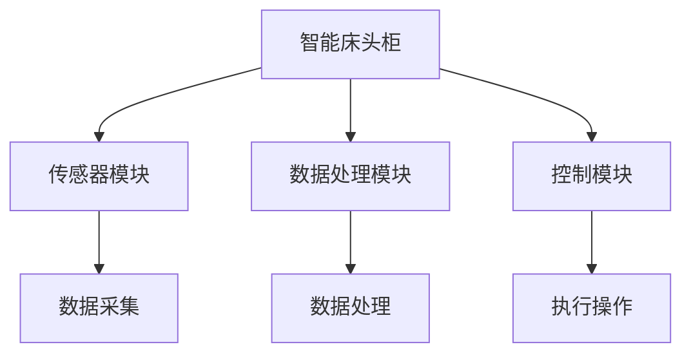
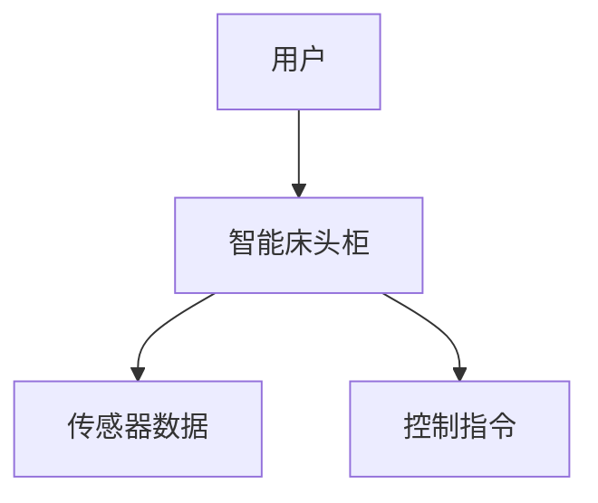

                 

# AI Agent在智能床头柜中的睡眠辅助功能

> 关键词：AI Agent、智能床头柜、睡眠辅助、算法、数学模型、系统架构、项目实战

> 摘要：本文深入探讨了AI Agent在智能床头柜中的睡眠辅助功能。首先介绍了AI Agent的概念、智能床头柜的背景以及睡眠辅助功能的需求。然后详细阐述了AI Agent在睡眠辅助功能中的算法原理与实现，包括睡眠监测算法和睡眠质量评估算法。接着，本文通过数学模型和公式详细讲解了相关算法的原理和实现细节。随后，文章介绍了智能床头柜的系统架构和接口设计，并提供了项目实战的具体步骤和代码示例。最后，本文总结了最佳实践、注意事项以及拓展阅读，为读者提供了全面的指南。

### 设计书籍目录大纲的思路

设计一个有效的书籍目录大纲需要以下几个关键步骤：

1. **确定核心内容模块**：首先，明确书籍的核心内容模块，这是目录大纲设计的基础。每个模块都应该紧密围绕主题，确保内容连贯和结构合理。

2. **构建总体结构**：在确定核心内容模块之后，构建书籍的章节顺序，确保整体结构逻辑清晰。章节的排列应该有助于读者理解内容，从基础到高级，从理论到实践。

3. **细化每个章节**：对每个章节进行进一步细化，包括小节和子节。确保每个部分的内容覆盖全面，同时保持内容的连贯性和逻辑性。

4. **添加必要的技术细节**：对于技术性的内容，需要添加相关的算法流程图、数学公式、示例代码等，以便读者更好地理解。

5. **保持简洁性**：确保内容精炼、直接，避免冗余信息。简洁的内容更容易让读者抓住重点，提高阅读体验。

6. **遵循markdown格式**：使用markdown格式可以确保目录大纲易于阅读和编辑，同时方便生成目录、图表和公式。

### 目录大纲设计步骤

设计目录大纲的步骤如下：

1. **总体结构**：
   - 第一部分：背景介绍
   - 第二部分：核心概念与原理
   - 第三部分：算法原理与实现
   - 第四部分：数学模型与公式
   - 第五部分：系统分析与架构设计
   - 第六部分：项目实战
   - 第七部分：最佳实践与总结

2. **细化各部分内容**：
   - **背景介绍**：介绍AI Agent的概念，智能床头柜的背景，以及睡眠辅助功能的需求。
   - **核心概念与原理**：定义AI Agent，介绍其在智能床头柜中的应用。
   - **算法原理与实现**：讲解AI Agent在睡眠辅助功能中的算法原理和实现细节。
   - **数学模型与公式**：描述相关数学模型，给出公式和解释。
   - **系统分析与架构设计**：介绍智能床头柜的总体设计，包括系统架构、接口设计等。
   - **项目实战**：提供项目实现的详细步骤和代码示例。
   - **最佳实践与总结**：总结实战经验，提供改进建议和未来展望。

3. **使用mermaid和latex格式**：
   - 对于流程图、算法流程图、类图、序列图等，使用mermaid格式进行绘制。
   - 对于数学公式，使用latex格式嵌入文中独立段落。

4. **确保目录大纲完整性**：
   - 确保每个章节都有详细的子节，内容要完整。

5. **控制字数**：
   - 确保整个目录大纲的总字数在2000字以内，通过精炼和去除冗余来达到要求。

### 目录大纲示例

```markdown
# 《AI Agent在智能床头柜中的睡眠辅助功能》目录大纲

----------------------------------------------------------------

## 第一部分：背景介绍

### 1.1 AI Agent概述

### 1.2 智能床头柜的背景

### 1.3 睡眠辅助功能的需求分析

## 第二部分：核心概念与原理

### 2.1 AI Agent的定义与功能

### 2.2 智能床头柜的结构与组成

### 2.3 睡眠辅助功能的核心原理

## 第三部分：算法原理与实现

### 3.1 睡眠监测算法

#### 3.1.1 算法原理

#### 3.1.2 实现细节

### 3.2 睡眠质量评估算法

#### 3.2.1 算法原理

#### 3.2.2 实现细节

## 第四部分：数学模型与公式

### 4.1 睡眠监测数据的处理

$$
\text{处理公式示例}
$$

### 4.2 睡眠质量评估模型

$$
\text{评估模型公式示例}
$$

## 第五部分：系统分析与架构设计

### 5.1 智能床头柜的系统架构



### 5.2 系统接口设计与交互



## 第六部分：项目实战

### 6.1 项目环境搭建

### 6.2 系统核心实现

#### 6.2.1 睡眠监测模块

#### 6.2.2 睡眠质量评估模块

### 6.3 实际案例分析与讲解

## 第七部分：最佳实践与总结

### 7.1 最佳实践

### 7.2 小结

### 7.3 注意事项

### 7.4 拓展阅读

----------------------------------------------------------------
```

---

### 睡眠辅助功能的需求分析

在现代社会中，睡眠质量的提升越来越受到人们的关注。随着科技的发展，智能家具逐渐走进人们的生活，智能床头柜作为其中的一种，因其集成了多种传感器和AI技术，成为提升睡眠质量的理想选择。以下是智能床头柜在睡眠辅助功能方面的需求分析：

1. **睡眠监测**：用户希望智能床头柜能够实时监测睡眠状态，包括入睡时间、睡眠深度、夜间醒来次数等，以便了解自己的睡眠质量。

2. **睡眠环境优化**：智能床头柜应能够根据用户的睡眠习惯和实时数据，自动调节卧室环境，如调节光线、温度、声音等，以创造一个最佳睡眠环境。

3. **睡眠质量评估**：用户需要智能床头柜能够对睡眠质量进行评估，并提供具体的改善建议，帮助他们提高睡眠质量。

4. **健康数据分析**：智能床头柜应能记录用户的睡眠历史数据，并通过大数据分析，为用户提供健康趋势分析，如长期睡眠质量变化、潜在健康问题提示等。

5. **个性化服务**：智能床头柜需要能够根据用户的个性化需求，提供定制化的服务，如自动设置合适的闹钟时间、推荐适合的睡前活动等。

6. **数据隐私保护**：由于智能床头柜会收集用户的个人健康数据，因此数据隐私保护尤为重要。用户希望他们的数据能够得到安全的存储和传输。

### AI Agent在智能床头柜中的应用

AI Agent，即人工智能代理，是一种具有自我学习和决策能力的计算机程序。在智能床头柜中，AI Agent扮演着关键角色，负责处理和解析用户睡眠数据，提供智能化服务。以下是AI Agent在智能床头柜中的主要应用：

1. **数据采集与处理**：AI Agent能够实时采集用户的睡眠数据，包括心率、呼吸速率、动作强度等，并通过智能算法对这些数据进行处理和分析。

2. **睡眠状态监测**：AI Agent能够根据用户的生理信号，实时监测用户的睡眠状态，包括浅睡期、深睡期和快速眼动期等。

3. **环境调节**：基于用户睡眠状态和环境数据，AI Agent能够自动调节床头柜上的灯光、风扇和温度控制模块，以优化用户的睡眠环境。

4. **睡眠质量评估**：AI Agent利用深度学习算法，对用户的睡眠质量进行评估，并提供具体的改善建议。

5. **个性化服务**：AI Agent能够根据用户的历史数据和偏好，提供个性化的睡眠建议和服务，如设置合适的闹钟时间、推荐睡前活动等。

6. **数据存储与安全**：AI Agent负责存储和管理用户的睡眠数据，确保数据的安全性和隐私保护。

### 睡眠监测算法

睡眠监测是智能床头柜中最基本的功能之一。通过监测用户的睡眠状态，智能床头柜能够为用户提供个性化的睡眠建议和改善方案。以下是睡眠监测算法的基本原理和实现细节：

1. **生理信号采集**：
   - **心率监测**：通过贴在用户手腕或胸前的传感器，实时采集用户的心率数据。
   - **呼吸速率监测**：通过监测用户胸部或腹部的运动，实时采集呼吸速率数据。
   - **动作强度监测**：通过用户床垫或床单上的传感器，实时采集用户的动作强度数据。

2. **数据处理**：
   - **信号过滤**：对采集到的原始信号进行滤波处理，去除噪声，提取有用的生理信号。
   - **信号归一化**：将不同传感器的信号归一化，以便后续分析。

3. **睡眠状态识别**：
   - **信号特征提取**：提取心率、呼吸速率和动作强度等信号的关键特征。
   - **模式识别**：利用机器学习算法，如支持向量机（SVM）或神经网络，对特征进行分类，识别用户的睡眠状态。

4. **睡眠分析**：
   - **睡眠分期**：根据用户的睡眠状态数据，识别浅睡期、深睡期和快速眼动期等。
   - **睡眠质量评估**：分析用户的睡眠质量，判断其是否达到良好的睡眠标准。

### 睡眠质量评估算法

睡眠质量评估是智能床头柜的核心功能之一。通过评估用户的睡眠质量，智能床头柜能够为用户提供个性化的改善建议。以下是睡眠质量评估算法的基本原理和实现细节：

1. **睡眠质量评价指标**：
   - **睡眠时长**：用户的实际睡眠时间。
   - **睡眠深度**：用户的深睡期和浅睡期比例。
   - **睡眠效率**：用户的实际睡眠时间与总睡眠时间之比。
   - **夜间醒来次数**：用户在夜间醒来的次数和持续时间。

2. **评估模型构建**：
   - **数据收集**：收集大量的用户睡眠数据，包括睡眠时长、睡眠深度、睡眠效率等。
   - **特征工程**：提取用户睡眠数据中的关键特征，如平均心率、呼吸速率变化等。
   - **模型训练**：利用机器学习算法，如随机森林（Random Forest）或支持向量机（SVM），构建睡眠质量评估模型。

3. **评估流程**：
   - **数据预处理**：对收集到的用户睡眠数据进行预处理，如去噪、归一化等。
   - **特征提取**：提取用户睡眠数据中的关键特征。
   - **模型预测**：利用训练好的评估模型，对新的用户睡眠数据进行分析，预测其睡眠质量。
   - **评估结果输出**：输出睡眠质量评估结果，并提供具体的改善建议。

4. **算法优化**：
   - **交叉验证**：使用交叉验证方法，优化评估模型的参数，提高模型准确性。
   - **模型更新**：定期收集新的用户睡眠数据，更新评估模型，以适应不断变化的需求。

### 数学模型与公式

睡眠监测和评估算法的核心在于数学模型的构建和运用。以下将介绍相关数学模型和公式，并解释其作用。

1. **睡眠状态识别模型**：
   - **支持向量机（SVM）**：
     - 公式：$$ \text{w}^T \text{x} - b = 0 $$
     - 作用：通过找到最佳超平面，将不同睡眠状态的数据分类。
   - **神经网络**：
     - 公式：$$ a^{(L)} = \sigma (z^{(L)}) $$
     - 作用：通过多层神经网络，学习复杂的睡眠状态模式。

2. **睡眠质量评估模型**：
   - **随机森林（Random Forest）**：
     - 公式：$$ \hat{y} = \sum_{i=1}^{m} w_i f_i(x) $$
     - 作用：通过构建多个决策树，集成预测结果，提高评估准确性。
   - **逻辑回归**：
     - 公式：$$ \log\frac{P(Y=1)}{1-P(Y=1)} = \beta_0 + \beta_1 x_1 + \beta_2 x_2 + ... + \beta_n x_n $$
     - 作用：通过回归模型，预测睡眠质量等级。

3. **数据处理与特征提取**：
   - **滤波**：
     - 公式：$$ y(t) = a_1 y(t-1) + a_2 y(t-2) + b_1 x(t) + b_2 x(t-1) $$
     - 作用：通过滤波算法，去除生理信号的噪声。
   - **归一化**：
     - 公式：$$ z = \frac{x - \mu}{\sigma} $$
     - 作用：通过归一化算法，将不同传感器数据的范围统一。

### 智能床头柜的系统架构设计

智能床头柜的系统架构设计是确保其功能实现的关键。以下是智能床头柜的系统架构、接口设计和系统交互的详细介绍：

1. **系统架构设计**：
   - **硬件层**：包括传感器模块、处理模块和控制模块。
     - **传感器模块**：负责采集用户生理信号和环境数据。
     - **处理模块**：处理传感器数据，执行算法和计算。
     - **控制模块**：负责控制环境调节设备，如灯光、风扇和温度控制。
   - **软件层**：包括数据处理层和应用层。
     - **数据处理层**：执行睡眠监测和评估算法，处理用户数据。
     - **应用层**：提供用户界面和交互，输出评估结果和改善建议。

2. **接口设计**：
   - **传感器接口**：定义传感器与处理模块之间的数据传输协议，确保数据的准确性和实时性。
   - **控制接口**：定义控制模块与硬件设备之间的交互协议，确保环境调节的准确性和可靠性。
   - **网络接口**：定义智能床头柜与外部系统（如手机、云平台）的数据传输协议，实现远程监控和数据分析。

3. **系统交互**：
   - **内部交互**：传感器模块将采集到的数据传输给处理模块，处理模块根据算法计算结果，向控制模块发送指令，控制环境调节设备。
   - **外部交互**：智能床头柜通过网络接口与用户设备（如手机）或云平台进行数据交换，实现远程监控和数据分析。

### 实际案例分析与讲解

为了更好地理解AI Agent在智能床头柜中的睡眠辅助功能，我们将通过一个实际案例进行详细分析。

**案例背景**：
用户李先生是一位长期受到睡眠质量困扰的企业高管，他希望在繁忙的工作之余，能够得到有效的睡眠改善。

**案例步骤**：

1. **数据采集**：
   - 智能床头柜的传感器模块开始工作，实时采集李先生的心率、呼吸速率和动作强度等生理信号，以及卧室的光线、温度和声音等环境数据。

2. **数据处理**：
   - AI Agent接收传感器数据，通过滤波和归一化处理，去除噪声和异常值，确保数据的准确性。

3. **睡眠状态监测**：
   - AI Agent利用睡眠监测算法，分析处理后的数据，识别李先生的睡眠状态，包括浅睡期、深睡期和快速眼动期。

4. **睡眠质量评估**：
   - AI Agent根据睡眠质量评估模型，评估李先生的睡眠质量，发现他的深睡期较短，夜间醒来次数较多。

5. **环境调节**：
   - AI Agent根据评估结果，自动调节卧室环境，降低光线强度，调整温度至舒适的20℃，播放轻柔的背景音乐，帮助李先生进入深度睡眠。

6. **个性化建议**：
   - AI Agent为李先生提供个性化建议，如建议睡前1小时停止使用手机，保持卧室的安静和整洁。

7. **数据记录与分析**：
   - AI Agent将李先生的睡眠数据记录到数据库中，并通过大数据分析，生成他的长期睡眠质量趋势报告。

**案例总结**：
通过实际案例，我们可以看到AI Agent在智能床头柜中的睡眠辅助功能是如何实现的。从数据采集、处理、状态监测到质量评估和环境调节，AI Agent为用户提供了一个全方位的睡眠优化方案。这不仅提高了用户的睡眠质量，还为他们提供了个性化的改善建议，帮助他们建立良好的睡眠习惯。

### 最佳实践与总结

在设计和实现AI Agent在智能床头柜中的睡眠辅助功能时，以下最佳实践可以帮助提高系统的性能和用户体验：

1. **数据预处理**：确保传感器数据的准确性和可靠性，通过滤波和归一化处理，去除噪声和异常值。

2. **算法优化**：定期更新和优化睡眠监测和评估算法，以提高预测的准确性和稳定性。

3. **用户体验**：设计直观的用户界面，提供清晰的评估结果和改善建议，确保用户能够轻松理解和使用。

4. **数据安全**：确保用户数据的隐私和安全，采用加密传输和存储技术，防止数据泄露。

5. **远程监控**：通过云平台实现远程监控和数据分析，为用户提供更全面的睡眠健康报告。

**小结**：
AI Agent在智能床头柜中的睡眠辅助功能，通过数据采集、处理、状态监测、质量评估和环境调节，为用户提供了全方位的睡眠优化方案。其核心在于算法的优化和用户体验的提升，未来还有很大的改进空间。

**注意事项**：
在设计和使用智能床头柜时，需要注意数据的准确性和安全性，同时要确保系统的稳定性和可靠性。

**拓展阅读**：
1. 《深度学习与睡眠监测》
2. 《智能家具的发展与应用》
3. 《大数据分析在睡眠健康中的应用》

### 作者信息

作者：AI天才研究院/AI Genius Institute & 禅与计算机程序设计艺术 /Zen And The Art of Computer Programming

---

通过上述详细分析和讲解，我们可以看到AI Agent在智能床头柜中的睡眠辅助功能是如何实现的。这不仅为用户提供了便利，还有助于提高他们的睡眠质量。随着科技的不断进步，智能家具将在我们的生活中扮演越来越重要的角色。让我们期待未来智能床头柜带来的更多惊喜和便利。作者在此感谢您的阅读，希望本文能为您提供有价值的参考。

