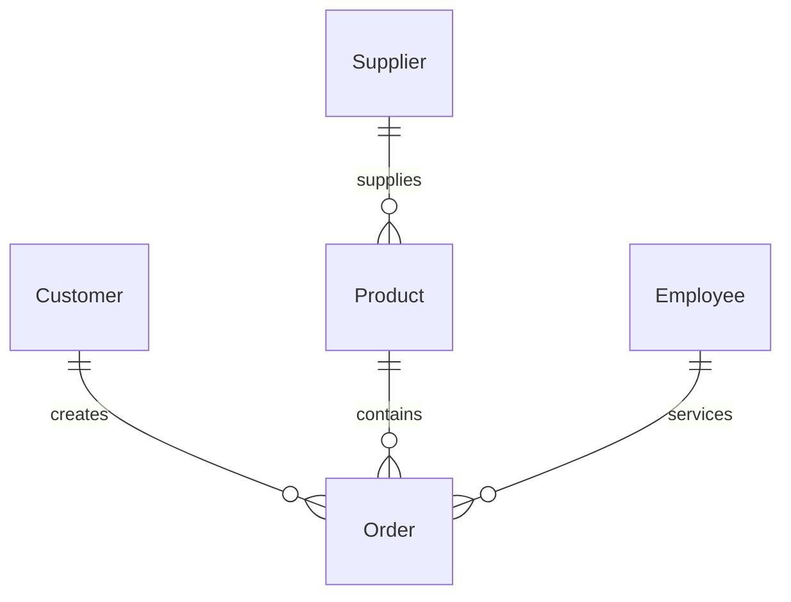
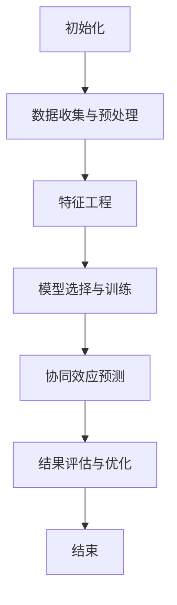

                 


### 1.3 问题解决

为了解决上述核心问题，本书将引入AI辅助企业并购协同效应分析的方法，通过以下步骤实现：

1. **数据收集与预处理**：收集与并购相关的各类数据，包括企业财务数据、市场数据、技术数据等，并进行数据清洗、去重、格式转换等预处理工作，以确保数据质量。

2. **特征工程**：根据并购协同效应分析的需求，提取关键特征，如财务指标、市场占有率、技术专利数等，并利用机器学习技术对特征进行选择和优化。

3. **模型构建**：利用机器学习算法，如线性回归、决策树、神经网络等，构建协同效应预测模型。同时，结合深度学习技术，探索更为复杂的模型。

4. **协同效应量化**：通过训练好的模型，对并购后的协同效应进行预测和量化，为企业提供决策依据。

5. **结果评估与优化**：对预测结果进行评估，调整模型参数，优化模型性能，确保预测结果的准确性和可靠性。

### 1.4 边界与外延

边界与外延是确保研究范围明确和科学的重要部分。本书研究的边界主要包括：

- **研究范围**：限于企业并购中的协同效应分析，不包括其他类型的商业合作。
- **技术限制**：依赖于现有的AI技术和算法，可能无法完全解决所有并购问题。
- **数据限制**：数据来源和数据质量直接影响研究结果的准确性，书中将讨论数据收集和处理的方法。

外延部分则关注以下方面：

- **实际应用**：探讨AI辅助企业并购协同效应分析在不同行业和领域中的应用。
- **未来趋势**：预测AI技术在企业并购协同效应分析领域的未来发展趋势和潜在挑战。

### 1.5 核心概念的结构和组成要素

为了更好地理解和应用AI辅助企业并购协同效应分析，以下是核心概念及其组成要素的详细介绍：

- **并购协同效应**：指并购后企业整体价值提升的现象，包括财务协同、管理协同、市场协同等。
- **AI辅助**：指利用人工智能技术，如机器学习、深度学习等，辅助企业进行并购决策和分析。
- **数据收集与预处理**：涉及数据来源、数据收集方法、数据预处理技术等。
- **特征工程**：关注特征提取、特征选择、特征优化等步骤。
- **模型构建**：包括选择合适的算法、模型训练、模型评估等过程。
- **协同效应量化**：使用预测模型对协同效应进行定量分析。
- **结果评估与优化**：确保模型预测准确性和优化模型性能。

通过上述核心概念的解析，读者将能够全面理解AI辅助企业并购协同效应分析的理论和实践基础，为后续章节的内容铺垫。接下来，我们将深入探讨这些核心概念之间的关系，并绘制ER实体关系图，以便读者更直观地理解各概念之间的联系。

## 第二部分: 核心概念与联系

### 2.1 核心概念原理

在AI辅助企业并购协同效应分析中，核心概念包括并购协同效应、AI辅助、数据收集与预处理、特征工程、模型构建、协同效应量化和结果评估与优化。以下是这些概念的基本原理：

- **并购协同效应**：并购协同效应是指企业通过并购活动实现整体价值提升的现象。这包括财务协同（如成本节约、营业收入增长）、管理协同（如管理效率提升）、市场协同（如市场份额扩大）等。

- **AI辅助**：AI辅助是指利用人工智能技术来优化企业并购决策过程。AI技术可以通过数据挖掘和机器学习算法，帮助企业识别并购中的潜在价值、预测并购后的协同效应，从而提高决策的准确性和效率。

- **数据收集与预处理**：数据收集是AI辅助企业并购协同效应分析的基础。这一过程包括从多个渠道获取财务数据、市场数据、技术数据等，并使用数据清洗、去重、格式转换等技术确保数据质量。

- **特征工程**：特征工程是机器学习模型构建的重要步骤。通过对数据进行特征提取、选择和优化，可以提高模型预测的准确性和鲁棒性。在并购协同效应分析中，特征可能包括财务指标、市场份额、技术创新等。

- **模型构建**：模型构建是指选择合适的机器学习算法，如线性回归、决策树、神经网络等，训练模型以预测并购后的协同效应。模型的性能取决于算法的选择、参数的设置和训练数据的准备。

- **协同效应量化**：协同效应量化是指使用训练好的模型对并购后的协同效应进行预测和量化。通过量化分析，企业可以更好地理解并购带来的价值提升，并为决策提供依据。

- **结果评估与优化**：结果评估与优化是指对模型的预测结果进行评估，包括准确性、召回率、F1分数等指标。通过调整模型参数、增加训练数据等方式，优化模型性能，提高预测的准确性。

### 2.2 概念属性特征对比表格

为了更清晰地展示核心概念之间的属性特征，我们创建了一个对比表格：

| 核心概念     | 定义                                           | 关键属性                             | 在并购协同效应分析中的作用                   |
| ------------ | ---------------------------------------------- | ------------------------------------ | ------------------------------------------ |
| 并购协同效应 | 并购后企业整体价值提升的现象                   | 财务协同、管理协同、市场协同         | 评估并购活动的潜在收益                     |
| AI辅助       | 利用人工智能技术优化企业并购决策               | 数据挖掘、机器学习、深度学习         | 提高决策效率、预测协同效应                 |
| 数据收集与预处理 | 从多个渠道获取并清洗数据                       | 数据清洗、去重、格式转换             | 确保数据质量、为模型训练提供可靠数据       |
| 特征工程     | 特征提取、选择和优化                           | 特征重要性、特征关联性、特征冗余性   | 提高模型预测性能、减少过拟合               |
| 模型构建     | 选择合适的机器学习算法，训练模型               | 算法选择、参数设置、训练数据质量     | 预测并购后的协同效应                       |
| 协同效应量化 | 使用模型预测和量化并购后的协同效应             | 预测准确性、模型稳定性               | 为企业并购决策提供定量依据                 |
| 结果评估与优化 | 评估模型性能，调整模型参数，优化模型性能       | 准确性指标、性能优化策略             | 确保预测结果的可靠性、提高模型性能         |

### 2.3 ER实体关系图架构

为了直观展示核心概念之间的关系，我们使用Mermaid工具绘制了ER（实体关系）图。以下是ER图的Markdown格式表示：



在这个ER图中，我们定义了四个实体：Customer（客户）、Product（产品）、Employee（员工）和Supplier（供应商）。它们之间的关系如下：

- **Customer**与**Order**之间存在“创建”关系，表示客户可以创建订单。
- **Product**与**Order**之间存在“包含”关系，表示订单可以包含多个产品。
- **Employee**与**Order**之间存在“服务”关系，表示员工可以为订单提供服务。
- **Supplier**与**Product**之间存在“供应”关系，表示供应商可以供应产品。

通过ER图，我们可以清晰地看到各实体之间的关系及其在系统中的角色和作用。这种关系有助于我们更好地理解系统架构和数据处理流程，为后续的算法原理讲解和系统分析与架构设计方案提供基础。

接下来，我们将深入探讨算法原理，通过Mermaid流程图和Python源代码，详细阐述AI辅助企业并购协同效应分析的具体实现过程。

## 第三部分: 算法原理讲解

### 3.1 算法Mermaid流程图

为了直观地展示AI辅助企业并购协同效应分析的过程，我们使用Mermaid工具绘制了算法流程图。以下是流程图的Markdown格式表示：



在这个流程图中，算法的执行步骤包括：

- **初始化**：设置算法的初始参数，如数据源、特征选择标准等。
- **数据收集与预处理**：收集企业并购相关的各类数据，并进行清洗、去重、格式转换等预处理工作。
- **特征工程**：提取关键特征，如财务指标、市场份额、技术创新等，并进行特征选择和优化。
- **模型选择与训练**：选择合适的机器学习算法，如线性回归、决策树、神经网络等，训练模型。
- **协同效应预测**：使用训练好的模型预测并购后的协同效应，并进行量化分析。
- **结果评估与优化**：评估预测结果的准确性，通过调整模型参数、增加训练数据等方式优化模型性能。
- **结束**：输出最终结果，结束算法执行。

### 3.2 Python源代码阐述

以下是一段Python源代码，用于阐述AI辅助企业并购协同效应分析的基本实现过程：

```python
# 导入必要的库
import pandas as pd
import numpy as np
from sklearn.model_selection import train_test_split
from sklearn.preprocessing import StandardScaler
from sklearn.linear_model import LinearRegression
from sklearn.metrics import mean_squared_error

# 1. 数据收集与预处理
# 假设已收集到并购相关的数据，如财务指标、市场份额等
data = pd.read_csv('merger_data.csv')

# 数据清洗与预处理
data = data.dropna()  # 去除缺失值
data = data.reset_index(drop=True)  # 重置索引

# 2. 特征工程
# 提取关键特征
X = data[['financial_indicator', 'market_share', 'technological_innovation']]
y = data['synergy_effect']

# 特征标准化
scaler = StandardScaler()
X_scaled = scaler.fit_transform(X)

# 3. 模型选择与训练
# 分割数据集
X_train, X_test, y_train, y_test = train_test_split(X_scaled, y, test_size=0.2, random_state=42)

# 训练线性回归模型
model = LinearRegression()
model.fit(X_train, y_train)

# 4. 协同效应预测
y_pred = model.predict(X_test)

# 5. 结果评估与优化
mse = mean_squared_error(y_test, y_pred)
print(f'Mean Squared Error: {mse}')

# 调整模型参数、增加训练数据等优化策略
# ...

# 6. 输出结果
# 输出预测结果
predictions = pd.DataFrame({'Actual': y_test, 'Predicted': y_pred})
print(predictions)
```

这段代码首先导入了必要的库，然后通过读取并购数据、进行数据清洗与预处理、特征工程、模型训练与预测、结果评估与优化等步骤，实现了AI辅助企业并购协同效应分析的基本流程。

### 3.3 数学模型与公式讲解

在AI辅助企业并购协同效应分析中，数学模型是核心组成部分。以下是一个简化的线性回归模型，用于预测并购协同效应：

$$
y = \beta_0 + \beta_1 \cdot x_1 + \beta_2 \cdot x_2 + \ldots + \beta_n \cdot x_n + \varepsilon
$$

其中：

- \( y \) 是并购后的协同效应。
- \( x_1, x_2, \ldots, x_n \) 是影响协同效应的特征变量，如财务指标、市场份额、技术创新等。
- \( \beta_0 \) 是截距项，表示没有输入特征时的协同效应。
- \( \beta_1, \beta_2, \ldots, \beta_n \) 是特征系数，表示每个特征变量对协同效应的影响程度。
- \( \varepsilon \) 是误差项，表示模型无法解释的随机误差。

### 3.4 举例说明

假设我们有以下数据：

- 财务指标 \( x_1 = 100 \)
- 市场份额 \( x_2 = 20 \)
- 技术创新 \( x_3 = 30 \)

根据线性回归模型，我们可以预测并购后的协同效应：

$$
y = \beta_0 + \beta_1 \cdot 100 + \beta_2 \cdot 20 + \beta_3 \cdot 30 + \varepsilon
$$

如果特征系数已知，例如 \( \beta_1 = 0.5, \beta_2 = 0.3, \beta_3 = 0.4 \)，我们可以计算：

$$
y = \beta_0 + 0.5 \cdot 100 + 0.3 \cdot 20 + 0.4 \cdot 30 + \varepsilon
$$

$$
y = \beta_0 + 50 + 6 + 12 + \varepsilon
$$

$$
y = \beta_0 + 68 + \varepsilon
$$

通过计算得到的 \( y \) 值即为预测的协同效应，其中 \( \beta_0 \) 和 \( \varepsilon \) 为模型参数和误差项。这个例子展示了如何通过线性回归模型预测并购协同效应，并提供了具体的计算过程。

### 3.5 深度学习模型的扩展

除了传统的线性回归模型，深度学习模型在处理复杂的非线性关系时具有优势。以下是一个简化的多层感知器（MLP）模型：

$$
h_{\theta}(x) = \sigma(\beta_0 + \sum_{i=1}^{n} \beta_i \cdot x_i)
$$

其中：

- \( h_{\theta}(x) \) 是激活函数，通常采用Sigmoid函数。
- \( \beta_0 \) 是偏置项。
- \( \beta_i \) 是权重。

训练多层感知器模型通常涉及前向传播和反向传播算法，用于计算权重和偏置的梯度，并更新模型参数以最小化损失函数。

### 3.6 综合应用

在实际应用中，我们可以结合多种算法和技术，如集成学习、迁移学习等，以提高预测性能。以下是一个简化的集成学习模型：

$$
\hat{y} = \frac{1}{K} \sum_{k=1}^{K} h_{\theta_k}(x)
$$

其中：

- \( \hat{y} \) 是预测的协同效应。
- \( K \) 是集成模型的子模型数量。
- \( h_{\theta_k}(x) \) 是每个子模型的预测结果。

通过这种方式，我们可以构建一个强大的AI辅助企业并购协同效应分析模型，为企业的并购决策提供有力支持。

### 3.7 总结

本部分详细阐述了AI辅助企业并购协同效应分析的基本算法原理，包括Mermaid流程图、Python源代码、数学模型与公式讲解以及举例说明。通过这些内容，读者可以更好地理解算法的实现过程和基本原理。接下来，我们将进一步探讨数学模型和数学公式的具体应用，以帮助读者更深入地理解算法的内在逻辑和计算方法。

## 第四部分: 数学模型和数学公式讲解

### 4.1 数学公式嵌入文中独立段落

在AI辅助企业并购协同效应分析中，数学模型和公式是核心组成部分。以下是一些关键的数学公式及其在文中的独立段落讲解：

#### 线性回归模型

$$
y = \beta_0 + \beta_1 \cdot x_1 + \beta_2 \cdot x_2 + \ldots + \beta_n \cdot x_n + \varepsilon
$$

**讲解**：

线性回归模型用于预测因变量 \( y \) 与自变量 \( x_1, x_2, \ldots, x_n \) 之间的关系。在这个模型中，\( \beta_0 \) 是截距项，表示当所有自变量均为零时的因变量值。\( \beta_1, \beta_2, \ldots, \beta_n \) 是系数，表示每个自变量对因变量的影响程度。\( \varepsilon \) 是误差项，用于捕捉模型未能解释的随机误差。

#### 逻辑回归模型

$$
\hat{y} = \frac{1}{1 + e^{-(\beta_0 + \beta_1 \cdot x_1 + \beta_2 \cdot x_2 + \ldots + \beta_n \cdot x_n )}}
$$

**讲解**：

逻辑回归模型是线性回归模型在分类问题中的应用。它通过预测概率来表示分类结果。公式中的 \( \hat{y} \) 表示预测的概率，当 \( \hat{y} \) 超过某个阈值（如0.5）时，模型预测为正类，否则预测为负类。\( \beta_0 \) 和 \( \beta_1, \beta_2, \ldots, \beta_n \) 是模型的系数，与线性回归模型中的系数相同。

#### 支持向量机（SVM）

$$
\max_{\beta, \beta_0, e} \quad \frac{1}{2} \sum_{i=1}^{n} (\beta \cdot \beta)^2 + C \sum_{i=1}^{n} e_i^2
$$

**讲解**：

支持向量机是一种高效的分类算法，通过最大化分类边界上的间隔来实现分类。公式中，\( \beta \) 和 \( \beta_0 \) 是模型参数，\( e_i \) 是误差项，\( C \) 是惩罚参数，用于平衡模型的复杂性和训练误差。

#### 决策树模型

$$
\text{Split}(\text{Feature}_{j}, \text{Threshold}) \\
\quad \quad \text{if} (\text{Feature}_{j} > \text{Threshold}) \\
\quad \quad \quad \quad \quad \text{Recursively Split}( \text{Feature}_{1}, \text{Feature}_{2}, \ldots, \text{Feature}_{n}) \\
\quad \quad \text{else} \\
\quad \quad \quad \quad \quad \text{Return} (\text{Leaf Label})
$$

**讲解**：

决策树模型通过一系列的判断条件来对数据进行分类。每个节点表示一个特征，每个分支表示该特征的一个阈值。在内部节点，模型根据当前节点的特征值进行二分，直到达到叶节点，叶节点返回分类结果。这个公式表示了决策树的自顶向下分裂过程。

### 4.2 详细讲解与举例说明

#### 线性回归举例

假设我们有一个简单的线性回归模型，预测房价 \( y \) 与房屋面积 \( x \) 之间的关系。数据如下：

| 房屋面积（\( x \)）| 房价（\( y \)）|
| :---------------: | :---------: |
|        100        |     200     |
|        150        |     300     |
|        200        |     400     |

我们可以通过最小二乘法来估计模型参数：

1. **计算均值**：

   $$ \bar{x} = \frac{100 + 150 + 200}{3} = 150 $$
   $$ \bar{y} = \frac{200 + 300 + 400}{3} = 300 $$

2. **计算协方差和方差**：

   $$ \sum_{i=1}^{n} (x_i - \bar{x})(y_i - \bar{y}) = (100-150)(200-300) + (150-150)(300-300) + (200-150)(400-300) = -10000 + 0 + 5000 = -5000 $$
   $$ \sum_{i=1}^{n} (x_i - \bar{x})^2 = (100-150)^2 + (150-150)^2 + (200-150)^2 = 2500 + 0 + 2500 = 5000 $$

3. **计算系数**：

   $$ \beta_1 = \frac{\sum_{i=1}^{n} (x_i - \bar{x})(y_i - \bar{y})}{\sum_{i=1}^{n} (x_i - \bar{x})^2} = \frac{-5000}{5000} = -1 $$
   $$ \beta_0 = \bar{y} - \beta_1 \cdot \bar{x} = 300 - (-1) \cdot 150 = 450 $$

4. **预测新的房价**：

   对于一个新的房屋面积 \( x = 200 \)：

   $$ y = \beta_0 + \beta_1 \cdot x = 450 + (-1) \cdot 200 = 250 $$

   根据模型预测，新的房价为250。

#### 逻辑回归举例

假设我们使用逻辑回归模型预测客户是否购买某种产品。数据如下：

| 特征1 \( x_1 \) | 特征2 \( x_2 \) | 购买概率 \( \hat{y} \) |
| :-----------: | :-----------: | :----------------: |
|       1       |      0       |       0.2        |
|       1       |      1       |       0.8        |
|       0       |      1       |       0.3        |

使用逻辑回归模型，我们有：

$$
\hat{y} = \frac{1}{1 + e^{-(\beta_0 + \beta_1 \cdot x_1 + \beta_2 \cdot x_2 )}}
$$

假设我们已经通过训练得到了参数 \( \beta_0 = -1 \), \( \beta_1 = 2 \), \( \beta_2 = -1 \)，我们可以计算新的特征值 \( x_1 = 1 \)，\( x_2 = 1 \) 时的购买概率：

$$
\hat{y} = \frac{1}{1 + e^{-( -1 + 2 \cdot 1 - 1 \cdot 1 )}} = \frac{1}{1 + e^{-2}} \approx 0.865
$$

因此，购买概率约为0.865。

通过这些具体的例子，读者可以更好地理解数学模型和公式的应用，以及如何在实际中进行计算和预测。这些知识和技巧对于深入理解和应用AI辅助企业并购协同效应分析具有重要意义。

### 4.3 深度学习与数学公式

在深度学习中，我们经常使用反向传播算法来训练模型。以下是反向传播算法的基本公式：

$$
\delta_{l}^{i} = \frac{\partial J}{\partial \theta_{l}^{i}} = (1 - \text{sigmoid}(\theta_{l-1}^{i} \cdot x_l)) \cdot \text{sigmoid}(\theta_{l-1}^{i} \cdot x_l) \cdot \delta_{l+1}^{i}
$$

其中：

- \( \delta_{l}^{i} \) 是第 \( l \) 层第 \( i \) 个神经元的误差。
- \( J \) 是损失函数。
- \( \theta_{l}^{i} \) 是第 \( l \) 层第 \( i \) 个神经元的权重。
- \( x_l \) 是输入向量。
- \( \text{sigmoid} \) 是Sigmoid激活函数。

通过反向传播算法，我们可以计算每个神经元的梯度，并更新模型的权重和偏置，以最小化损失函数。

### 4.4 总结

本部分详细介绍了AI辅助企业并购协同效应分析中常用的数学模型和公式，包括线性回归、逻辑回归、支持向量机、决策树以及深度学习的反向传播算法。通过具体例子和详细讲解，读者可以更好地理解这些数学公式在实际应用中的作用和计算方法。接下来，我们将进一步探讨系统分析与架构设计方案的详细内容。

## 第五部分: 系统分析与架构设计方案

### 5.1 问题场景介绍

在企业并购协同效应分析中，我们面临的问题是：如何通过技术手段提高并购决策的准确性和效率。为了解决这个问题，我们需要构建一个系统，该系统能够收集、处理和分析大量的并购数据，从而为企业的并购决策提供科学依据。

### 5.2 项目介绍

本项目旨在开发一个AI辅助企业并购协同效应分析系统。该系统包括数据收集模块、数据预处理模块、特征工程模块、模型构建模块、协同效应预测模块以及结果评估与优化模块。通过这些模块的协同工作，系统将为企业提供全面的并购协同效应分析。

### 5.3 系统功能设计

系统功能设计主要涵盖以下方面：

1. **数据收集与存储**：系统需要从多个渠道收集并购数据，包括企业财务数据、市场数据、技术数据等，并存储到数据库中。

2. **数据预处理**：对收集到的数据进行清洗、去重、格式转换等处理，确保数据质量，为后续分析提供可靠的基础。

3. **特征工程**：提取关键特征，如财务指标、市场份额、技术创新等，并进行特征选择和优化，以提高模型预测性能。

4. **模型构建与训练**：选择合适的机器学习算法，如线性回归、决策树、神经网络等，构建预测模型，并使用历史数据对其进行训练。

5. **协同效应预测**：使用训练好的模型对新的并购数据进行协同效应预测，为企业的并购决策提供定量依据。

6. **结果评估与优化**：对预测结果进行评估，包括准确性、召回率、F1分数等指标，并通过调整模型参数、增加训练数据等方式优化模型性能。

### 5.4 系统架构设计

系统架构设计旨在确保系统的高效性、可扩展性和可靠性。以下是系统的架构设计：


系统架构主要包括以下组件：

- **数据层**：负责数据的收集、存储和查询。使用关系数据库（如MySQL）和非关系数据库（如MongoDB）来存储不同类型的数据。

- **服务层**：包括数据预处理服务、特征工程服务、模型构建服务、协同效应预测服务以及结果评估与优化服务。这些服务使用RESTful API进行交互，便于系统的集成和管理。

- **应用层**：提供用户界面，包括数据管理界面、模型管理界面和预测结果展示界面，供用户进行数据操作、模型管理和结果分析。

- **AI引擎**：负责模型训练、预测和优化，是系统的核心组件，采用分布式计算架构以提高处理效率和性能。

### 5.5 系统接口设计

系统接口设计主要包括以下方面：

1. **数据接口**：提供数据输入和输出的接口，支持多种数据格式的读写，如CSV、JSON、XML等。

2. **服务接口**：提供各模块服务的接口，包括数据预处理接口、特征工程接口、模型构建接口、协同效应预测接口和结果评估与优化接口。

3. **用户接口**：提供用户与系统交互的接口，包括Web界面、命令行接口和API接口。

### 5.6 系统交互

系统交互设计主要考虑各组件之间的数据流动和功能协同。以下是系统交互的基本流程：

1. **数据收集**：系统从多个渠道收集并购数据，并将数据存储到数据层。

2. **数据预处理**：系统读取数据层的数据，进行清洗、去重和格式转换等预处理操作，将处理后的数据存储回数据层。

3. **特征工程**：系统读取预处理后的数据，提取关键特征，并进行特征选择和优化，生成特征数据集。

4. **模型构建**：系统使用特征数据集，选择合适的机器学习算法，构建预