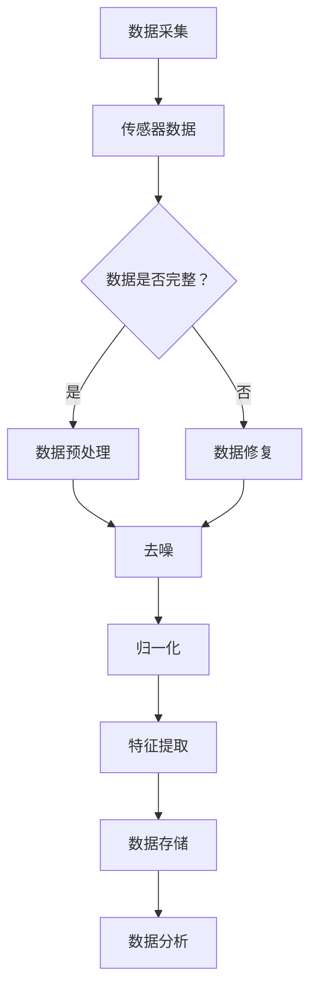
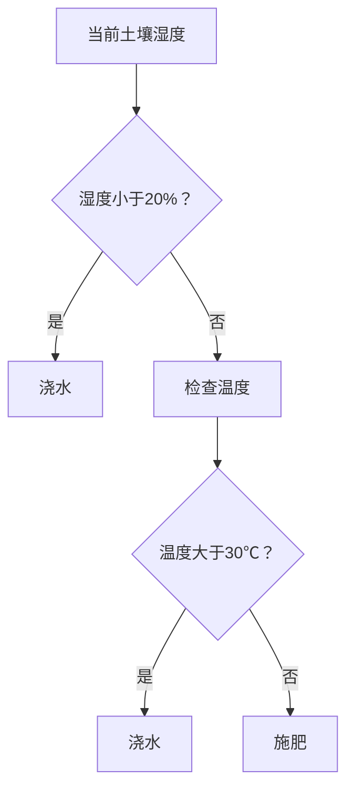
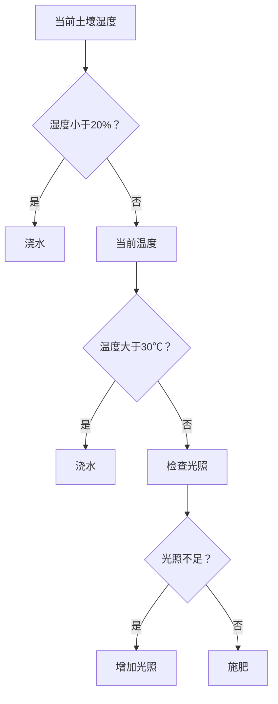
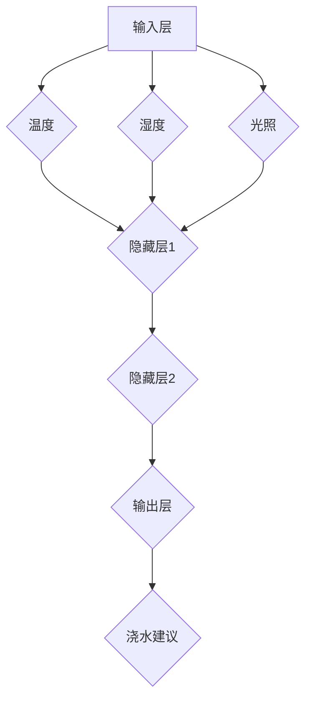
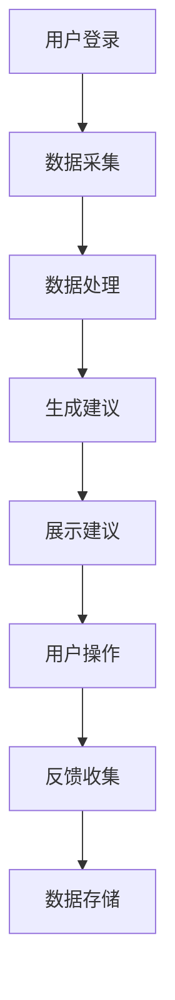
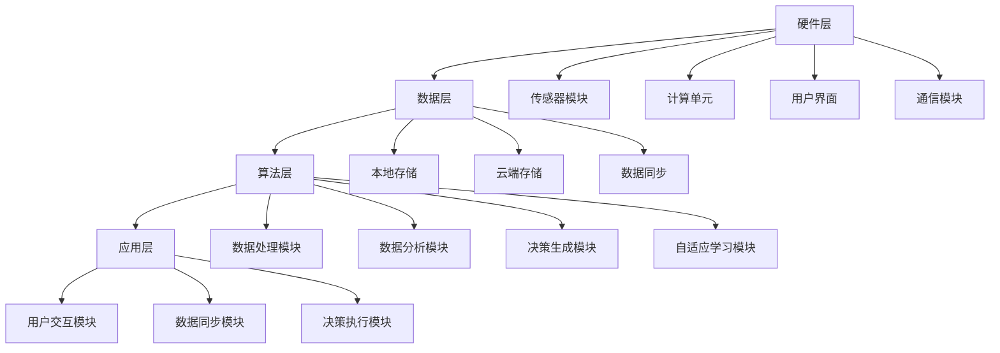
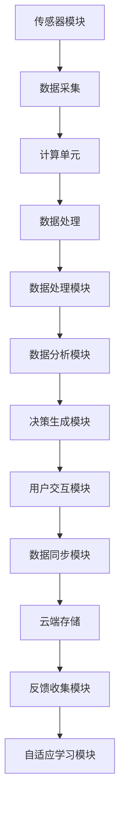

                 

# 智能园艺手套：AI Agent的植物护理指导

## 关键词
- 智能园艺手套
- AI Agent
- 植物护理
- 数据采集
- 决策支持
- 系统架构

## 摘要
本文探讨了智能园艺手套的开发与应用，重点关注AI Agent在植物护理中的角色。通过详细分析智能园艺手套的核心概念、设计原理、数学模型、系统架构及项目实战，本文为园艺爱好者、专业人士及希望提高植物护理效率的用户提供了实用的指导。

## 1. 定义书籍主题与目的

### 1.1 问题背景与核心概念

#### 1.1.1 问题背景

当前，随着城市化进程的加快和生活节奏的加快，许多人缺乏时间和精力进行传统的园艺活动。同时，传统园艺护理方法常常依赖于个人的经验和感觉，缺乏科学性和精确性。这种现状导致了植物养护的困难，进而影响了植物的生长质量和用户满意度。

为了解决这些问题，智能园艺手套应运而生。智能园艺手套是一种结合了人工智能（AI）技术的园艺工具，它可以通过传感器实时监测植物的生长状态，并根据数据进行分析和决策，从而提供科学的护理建议。

#### 1.1.2 智能园艺手套的解决思路

智能园艺手套的核心在于其AI Agent，这是一个能够自主学习和适应环境的智能体。AI Agent通过分析传感器采集的数据，可以预测植物的需求，并给出相应的护理建议。这些建议包括但不限于浇水、施肥、修剪等。

智能园艺手套的解决思路主要包括以下几个步骤：

1. **数据采集**：通过内置的传感器，智能园艺手套可以实时监测植物的温度、湿度、光照、土壤湿度等参数。
2. **数据处理**：AI Agent对采集到的数据进行分析和处理，识别植物当前的状态和需求。
3. **决策支持**：基于分析结果，AI Agent为用户提供个性化的护理建议。
4. **执行建议**：用户根据AI Agent的建议进行实际操作，如浇水、施肥等。

### 1.2 核心概念

#### 1.2.1 智能园艺手套的定义

智能园艺手套是一种集成了传感器、计算单元和用户界面的智能设备。它通过实时监测植物的生长状态，利用AI技术为用户提供科学的护理建议。

#### 1.2.2 AI Agent的概念与作用

AI Agent是一种自主学习和决策的智能体，它可以在没有人类干预的情况下完成特定任务。在智能园艺手套中，AI Agent负责分析植物数据，预测需求，并给出护理建议。

#### 1.2.3 植物护理中的AI应用

AI在植物护理中的应用主要体现在以下几个方面：

1. **需求预测**：通过分析历史数据，AI可以预测植物未来的需求，如浇水、施肥等。
2. **异常检测**：AI可以实时监测植物状态，识别异常情况，如病虫害、干旱等。
3. **优化建议**：AI可以基于植物数据，为用户提供最佳的护理方案，如最佳的浇水时间、施肥量等。

## 2. 确定书籍的读者群体

本书的目标读者包括以下几类人群：

1. **对AI技术感兴趣的园艺爱好者**：这类读者可能对AI技术有一定了解，但对智能园艺手套的应用还不太熟悉。本书将为他们提供详细的开发和应用指导。
2. **专业人士**：包括园艺师、园林设计师等，他们可能希望利用AI技术提高植物护理的效率和质量。本书将介绍智能园艺手套的开发原理和应用案例，帮助他们更好地理解和应用AI技术。
3. **希望提高植物护理效率的普通用户**：这类读者可能没有专业的园艺知识，但希望通过智能园艺手套来简化护理过程。本书将提供实用的操作指南和最佳实践，帮助他们更轻松地进行植物护理。

## 3. 设计书籍的结构与章节

为了使书籍内容系统化、逻辑化，本书设计了以下章节结构：

### 第一部分：智能园艺手套概述

- **第1章：问题背景与核心概念**：介绍智能园艺手套的背景和核心概念。
- **第2章：AI Agent原理与设计**：讲解AI Agent的原理和设计。

### 第二部分：技术原理

- **第3章：数学模型与算法原理**：介绍智能园艺手套中使用的数学模型和算法原理。
- **第4章：系统分析与架构设计**：分析智能园艺手套的系统架构。

### 第三部分：项目实战

- **第5章：项目实战**：通过实际案例展示智能园艺手套的开发和应用。

### 第四部分：最佳实践与拓展

- **第6章：最佳实践与注意事项**：提供实际操作中的最佳实践和注意事项。
- **第7章：拓展阅读与进一步研究**：推荐进一步阅读材料和未来研究方向。

## 4. 细化章节内容

### 第1章：问题背景与核心概念

- **第1.1节：问题背景**：详细阐述当前园艺护理面临的挑战。
- **第1.2节：核心概念**：介绍智能园艺手套、AI Agent和植物护理中的AI应用。

### 第2章：AI Agent原理与设计

- **第2.1节：AI Agent原理**：讲解AI Agent的定义、核心功能和工作流程。
- **第2.2节：AI Agent设计**：介绍AI Agent的设计原则、系统架构和数据处理与决策算法。

### 第3章：数学模型与算法原理

- **第3.1节：数学模型**：讲解数据采集与预处理、模型训练与优化、模型评估与调优。
- **第3.2节：算法原理**：介绍决策树算法、支持向量机算法、神经网络算法。

### 第4章：系统分析与架构设计

- **第4.1节：系统功能设计**：介绍用户交互模块、数据采集模块、决策支持模块。
- **第4.2节：系统架构设计**：讲解总体架构、模块交互、系统性能优化。

### 第5章：项目实战

- **第5.1节：环境安装与配置**：介绍开发环境搭建、数据库配置、传感器集成。
- **第5.2节：系统核心实现**：讲解用户交互界面设计、数据采集与处理、决策支持实现。
- **第5.3节：实际案例分析**：分析智能浇水系统、智能光照调节系统、智能温湿度监控系统。

### 第6章：最佳实践与注意事项

- **第6.1节：最佳实践 tips**：提供数据采集与处理、算法优化、系统部署与维护的最佳实践。
- **第6.2节：注意事项**：强调避免常见错误、数据安全与隐私保护、法律法规与伦理道德。

### 第7章：拓展阅读与进一步研究

- **第7.1节：拓展阅读**：推荐相关书籍、学术论文和在线资源。
- **第7.2节：进一步研究**：探讨AI Agent在农业领域的其他应用和开发新的园艺护理AI应用。

## 5. 确保内容完整性

在规划目录时，确保每个核心章节都包含了必要的内容，如定义、原理、应用、实例等。同时，每个章节的内容要保持独立性，以便读者可以独立阅读和理解。

## 6. 保持简洁性

在编写目录时，避免使用冗长的描述，直接点明每个章节的主题和内容。确保目录清晰、简洁，便于读者快速了解书籍结构和内容。

## 7. 撰写目录大纲

根据以上步骤，编写出完整的目录大纲，确保符合markdown格式要求。以下是基于上述内容设计的目录大纲：

----------------------------------------------------------------

# 智能园艺手套：AI Agent的植物护理指导

## 关键词
- 智能园艺手套
- AI Agent
- 植物护理
- 数据采集
- 决策支持
- 系统架构

## 摘要
本文探讨了智能园艺手套的开发与应用，重点关注AI Agent在植物护理中的角色。通过详细分析智能园艺手套的核心概念、设计原理、数学模型、系统架构及项目实战，本文为园艺爱好者、专业人士及希望提高植物护理效率的用户提供了实用的指导。

## 第一部分：智能园艺手套概述

### 第1章：问题背景与核心概念

#### 1.1 问题背景

#### 1.2 核心概念

### 第2章：AI Agent原理与设计

#### 2.1 AI Agent原理

#### 2.2 AI Agent设计

## 第二部分：技术原理

### 第3章：数学模型与算法原理

#### 3.1 数学模型

#### 3.2 算法原理

### 第4章：系统分析与架构设计

#### 4.1 系统功能设计

#### 4.2 系统架构设计

## 第三部分：项目实战

### 第5章：项目实战

#### 5.1 环境安装与配置

#### 5.2 系统核心实现

#### 5.3 实际案例分析

## 第四部分：最佳实践与拓展

### 第6章：最佳实践与注意事项

#### 6.1 最佳实践 tips

#### 6.2 注意事项

### 第7章：拓展阅读与进一步研究

#### 7.1 拓展阅读

#### 7.2 进一步研究

----------------------------------------------------------------

通过以上目录大纲的设计，本书的结构和内容得到了清晰的规划和梳理，为后续的撰写和编辑工作提供了坚实的基础。接下来，我们将逐一深入每个章节的内容，进行详细讲解和分析。希望读者在阅读完本书后，能够对智能园艺手套有更深入的了解，并在实际应用中受益。# 1.1.1 当前园艺护理面临的挑战

随着社会的发展，城市人口不断增加，人们对于绿色环境的需求也日益增长。然而，城市生活的快节奏和高压力使得许多人对园艺活动望而却步。以下是目前园艺护理中面临的主要挑战：

### 时间限制
现代社会中，人们的工作和生活节奏非常快，许多人没有足够的时间来照顾植物。即使是那些热爱园艺的人，也可能因为忙碌的生活而无法定期进行护理。

### 经验依赖
传统的园艺护理方法往往依赖于个人的经验和感觉，而不是科学的数据分析。这种主观的方法可能导致护理不当，影响植物的生长。

### 精准度不足
传统的园艺护理方法在执行过程中缺乏精确度，例如浇水、施肥等。这种不准确的操作可能导致植物生长不良或过度生长。

### 异常检测困难
病虫害、干旱等异常情况难以通过传统方法及时发现和处理，可能导致植物受损甚至死亡。

### 人力成本高
对于大面积的园艺活动，如农场和园林，使用人工进行护理成本高且效率低。

智能园艺手套的引入旨在解决这些问题，通过结合人工智能技术，提供更高效、更科学的园艺护理方案。接下来，我们将进一步探讨智能园艺手套的解决思路及其核心概念。# 1.1.2 智能园艺手套的解决思路

智能园艺手套的设计思路源于对传统园艺护理问题的深刻理解，并结合了现代人工智能技术的优势。以下是智能园艺手套解决当前园艺护理挑战的详细思路：

### 实时数据采集
智能园艺手套内置多种传感器，如温度传感器、湿度传感器、光照传感器和土壤湿度传感器等。这些传感器可以实时监测植物的生长环境参数。通过实时数据采集，智能园艺手套能够及时获取植物当前的状态信息。

### 数据处理与分析
智能园艺手套的内置计算单元会对采集到的数据进行处理和分析。这些处理包括数据清洗、去噪、特征提取和趋势分析等。通过这些处理，可以识别出植物生长中的关键指标和潜在问题。

### AI Agent的决策支持
智能园艺手套的核心是AI Agent，它是一种基于机器学习和数据挖掘技术的智能体。AI Agent会根据处理后的数据，利用预先训练好的模型进行学习和预测，从而为植物提供科学的护理建议。这些建议可能包括何时浇水、施肥、修剪以及如何调节光照等。

### 用户互动与执行建议
智能园艺手套通过用户界面将分析结果和建议展示给用户。用户可以根据AI Agent的建议，采取相应的护理措施。此外，智能园艺手套还可以通过语音、短信或APP推送等方式提醒用户执行这些护理任务。

### 自适应学习与优化
AI Agent不仅能够提供基于当前数据的建议，还能够根据用户的使用反馈和历史数据不断优化其建议。这种自适应学习机制使得智能园艺手套能够更好地适应不同的植物和不同的环境条件。

### 跨平台集成
智能园艺手套还可以与其他智能设备集成，如智能灌溉系统、智能照明设备和智能温控系统等。通过跨平台集成，用户可以更全面地监控和管理植物生长环境。

### 长期数据积累与趋势分析
智能园艺手套可以长期积累植物生长数据，并通过趋势分析预测未来可能出现的问题。这种前瞻性分析有助于用户提前做好准备，避免潜在的风险。

通过以上解决思路，智能园艺手套不仅提高了园艺护理的效率，还降低了人力成本，并为用户提供了科学、精确的护理指导，从而解决了当前园艺护理面临的诸多挑战。接下来，我们将详细介绍智能园艺手套的核心概念，包括其定义、组成和工作原理。# 1.2.1 智能园艺手套的定义

智能园艺手套是一种集成传感器、计算单元和用户界面的智能设备，它通过实时监测植物的生长状态，利用人工智能技术为用户提供科学的护理建议。智能园艺手套的核心在于其AI Agent，这是一种自主学习和决策的智能体，能够根据植物的数据进行分析和预测，从而提供个性化的护理方案。

智能园艺手套的主要功能包括：

1. **数据采集**：通过内置的传感器，智能园艺手套可以实时监测植物的温度、湿度、光照、土壤湿度等参数。
2. **数据处理**：计算单元对采集到的数据进行处理，包括数据清洗、去噪、特征提取等。
3. **决策支持**：AI Agent基于处理后的数据，利用机器学习算法进行分析，为用户提供浇水、施肥、修剪等护理建议。
4. **用户互动**：智能园艺手套通过用户界面或移动应用，将分析结果和建议展示给用户，用户可以根据这些建议进行实际操作。
5. **自适应学习**：AI Agent会根据用户的使用反馈和历史数据，不断优化其决策模型，提高建议的准确性和适应性。

智能园艺手套的目标是解决传统园艺护理中时间限制、经验依赖、精准度不足、异常检测困难等问题，为用户带来更加高效、科学的园艺护理体验。# 1.2.2 AI Agent的概念与作用

AI Agent，即人工智能代理，是一种能够自主学习和决策的智能体，它可以在没有人类干预的情况下完成特定任务。在智能园艺手套中，AI Agent扮演着至关重要的角色，它是整个系统的智能核心，负责分析植物数据、预测需求并给出护理建议。

### AI Agent的定义

AI Agent可以定义为一种具备自我学习、自主决策和交互能力的软件实体。它通过接收外部输入（如传感器数据）、执行内部处理（如数据分析和模式识别）以及产生输出（如护理建议），从而在特定环境中执行任务。

### AI Agent的核心功能

1. **数据接收与处理**：AI Agent能够接收传感器采集到的各种数据，如温度、湿度、光照、土壤湿度等。它会对这些数据进行预处理，包括数据清洗、去噪、归一化等，以便后续分析。
   
2. **数据分析和模式识别**：基于预处理后的数据，AI Agent会利用机器学习和数据挖掘技术，分析植物的生长趋势和潜在问题。例如，它可以通过分析土壤湿度数据，预测植物是否需要浇水。

3. **决策生成与推荐**：AI Agent根据分析结果，生成具体的护理建议。这些建议可以是实时的，也可以是基于长期趋势的预测。例如，它可能会推荐用户在某个特定时间点进行浇水，或者定期进行修剪。

4. **自适应学习与优化**：AI Agent能够根据用户的使用反馈和历史数据，不断优化其决策模型。这意味着，随着使用时间的增加，AI Agent将变得更加精准和适应性。

### AI Agent的工作流程

AI Agent的工作流程可以分为以下几个步骤：

1. **数据采集**：智能园艺手套的传感器实时监测植物的生长环境参数。
2. **数据传输**：采集到的数据通过无线网络（如Wi-Fi、蓝牙等）传输到AI Agent的本地服务器或云端服务器。
3. **数据处理**：AI Agent对传输过来的数据进行预处理，包括去噪、归一化等。
4. **数据分析**：利用机器学习和数据挖掘技术，AI Agent对预处理后的数据进行深度分析，识别植物的生长状态和潜在问题。
5. **决策生成**：基于分析结果，AI Agent生成具体的护理建议。
6. **用户交互**：AI Agent通过用户界面或移动应用，将护理建议展示给用户，并接收用户的反馈。
7. **学习与优化**：AI Agent根据用户的反馈和历史数据，不断优化其决策模型，提高推荐的准确性。

### AI Agent在植物护理中的具体作用

1. **提高护理效率**：AI Agent能够实时分析植物数据，给出个性化的护理建议，用户只需按照这些建议执行即可，大大提高了护理效率。

2. **降低人工成本**：通过智能园艺手套的自动化操作，用户可以减少对人工的依赖，降低人力成本。

3. **提升护理质量**：AI Agent基于数据分析和模式识别，能够提供科学、精确的护理建议，从而提高护理质量。

4. **异常检测与预警**：AI Agent可以实时监控植物的生长状态，发现异常情况并给出预警，帮助用户及时采取措施。

5. **个性化护理**：AI Agent可以根据不同植物的种类、生长阶段和环境条件，提供定制化的护理方案。

总之，AI Agent在智能园艺手套中扮演着至关重要的角色，它通过智能分析、自主学习和个性化推荐，为用户提供高效、科学的园艺护理服务。接下来，我们将探讨AI在植物护理中的具体应用，以及如何利用AI技术优化园艺护理流程。# 1.2.3 植物护理中的AI应用

AI在植物护理中的应用极大地改变了传统园艺护理的方式，提升了效率、准确性和科学性。以下是AI在植物护理中的几个关键应用：

### 1. 需求预测

AI技术可以通过分析历史数据和实时数据，预测植物未来的需求。例如，通过监测土壤湿度、光照强度和气温等数据，AI模型可以预测植物何时需要浇水、施肥或修剪。这种预测能力不仅有助于用户提前做好准备，还可以避免过度或不足的护理，从而提高植物的生长质量。

### 2. 异常检测

AI能够实时监控植物的生长状态，识别出异常情况，如病虫害、干旱、过湿、营养不良等。通过机器学习算法，AI可以建立正常的生长模式模型，并与实时监测数据进行对比，一旦发现偏离正常范围的异常，AI会立即发出警报，提醒用户及时处理。

### 3. 优化建议

基于大量的数据分析和模型预测，AI可以为用户提供最佳的护理方案。例如，AI可以推荐最佳的浇水时间、施肥量、修剪频率等。这些优化建议不仅基于植物的当前状态，还考虑了植物的历史数据和未来趋势，从而确保植物得到最适合的护理。

### 4. 跨平台集成

智能园艺手套可以通过与智能手机、平板电脑或智能手表等移动设备进行跨平台集成，用户可以随时随地查看植物的状态和AI的建议。这种集成不仅方便了用户的使用，还使得植物护理更加灵活和高效。

### 5. 个性化护理

AI能够根据不同的植物种类、生长阶段和环境条件，为用户提供个性化的护理方案。例如，对于喜湿的植物和喜旱的植物，AI会给出不同的浇水建议；对于不同季节的植物，AI会调整护理方案以适应气候变化。

### 6. 数据积累与趋势分析

智能园艺手套可以长期积累植物生长数据，并通过趋势分析预测未来可能出现的问题。这种前瞻性分析有助于用户提前做好准备，避免潜在的风险。

### 7. 自动化控制

AI技术还可以用于自动化控制园艺设备，如自动灌溉系统、智能照明设备和温控系统等。通过AI的决策支持，这些设备可以根据植物的需求自动调节，实现精准的园艺护理。

### 8. 社交互动

智能园艺手套还可以通过社交网络平台，将用户的植物护理体验分享给其他用户。用户可以相互交流护理经验，分享最佳实践，从而共同提高园艺护理水平。

总之，AI在植物护理中的应用，不仅提高了园艺护理的效率和准确性，还为用户带来了个性化、科学化的护理体验。随着AI技术的不断进步，未来植物护理将变得更加智能化和自动化，为园艺爱好者和专业人士提供更优质的园艺服务。接下来，我们将深入探讨AI Agent的原理和设计，以及如何实现智能园艺手套中的AI功能。# 2.1.1 AI Agent原理

AI Agent，即人工智能代理，是智能园艺手套的核心组成部分，它负责分析植物数据、生成护理建议并执行相应的操作。AI Agent的原理基于机器学习和数据挖掘技术，通过不断学习和适应环境，提高其决策能力和准确性。

### AI Agent的定义

AI Agent可以被定义为一种具备自主决策和交互能力的软件实体，它能够根据外部环境输入和内部数据，自主地执行任务并生成输出。在智能园艺手套中，AI Agent是一个能够实时监测植物状态、预测需求并给出护理建议的智能体。

### AI Agent的核心功能

1. **数据接收与处理**：AI Agent能够接收传感器采集到的多种数据，如温度、湿度、光照强度、土壤湿度等。它会对这些数据进行预处理，包括去噪、归一化、特征提取等，以便于后续的分析。

2. **数据分析与模式识别**：通过机器学习和数据挖掘技术，AI Agent会分析预处理后的数据，识别植物的生长趋势和潜在问题。这包括异常检测、需求预测、环境评估等。

3. **决策生成**：基于数据分析的结果，AI Agent会生成具体的护理建议。这些建议可能是实时的，也可能是基于长期趋势的预测。例如，它可能会建议用户在某个特定时间点进行浇水、施肥或修剪。

4. **自适应学习**：AI Agent能够根据用户的使用反馈和历史数据，不断优化其决策模型。这种自适应学习机制使得AI Agent能够更好地适应不同的植物和环境条件。

5. **执行操作**：AI Agent不仅能够生成护理建议，还可以通过智能园艺手套的接口，直接控制园艺设备执行这些操作。例如，它可以自动启动灌溉系统或调整温室的温度。

### AI Agent的工作原理

AI Agent的工作原理可以分为以下几个步骤：

1. **数据采集**：智能园艺手套的传感器实时监测植物的生长环境参数，如土壤湿度、空气湿度、温度、光照强度等。

2. **数据预处理**：AI Agent对采集到的数据进行分析，去除噪声和异常值，提取关键特征。这些特征将用于后续的机器学习模型训练。

3. **模型训练**：利用收集到的历史数据，AI Agent会训练机器学习模型，如回归模型、分类模型、聚类模型等。这些模型可以帮助AI Agent识别植物的生长趋势和预测未来需求。

4. **数据分析与决策**：AI Agent使用训练好的模型，对实时数据进行处理和分析，生成护理建议。这些建议可能基于当前数据，也可能是基于历史数据和趋势分析。

5. **用户交互**：AI Agent将分析结果和建议通过用户界面展示给用户，用户可以接收这些建议并执行相应的操作。

6. **自适应学习**：AI Agent会根据用户的使用反馈，调整其模型参数，优化决策能力。这种自适应学习机制使得AI Agent能够不断改进其性能，提供更准确的护理建议。

### AI Agent的核心技术

1. **机器学习算法**：机器学习算法是AI Agent的核心技术之一，常用的算法包括线性回归、决策树、支持向量机、神经网络等。这些算法可以帮助AI Agent从数据中提取有用信息，建立预测模型。

2. **深度学习**：深度学习是机器学习的一个分支，它通过多层神经网络模拟人脑的工作方式，能够处理复杂的非线性问题。在智能园艺手套中，深度学习可以用于图像识别、语音识别等任务。

3. **数据挖掘**：数据挖掘是一种从大量数据中发现有用信息和知识的技术。在智能园艺手套中，数据挖掘可以帮助AI Agent识别数据中的模式和趋势，从而生成更准确的预测。

4. **自然语言处理**：自然语言处理是一种使计算机能够理解、处理和生成自然语言的技术。在智能园艺手套中，自然语言处理可以帮助AI Agent与用户进行对话，理解用户的指令和反馈。

### AI Agent的优势

1. **高效性**：AI Agent能够实时处理大量数据，快速生成护理建议，提高了园艺护理的效率。

2. **准确性**：通过机器学习和数据挖掘技术，AI Agent能够从历史数据和实时数据中提取有价值的信息，提供准确的护理建议。

3. **个性化**：AI Agent可以根据不同的植物种类、生长阶段和环境条件，为用户提供个性化的护理方案。

4. **自适应**：AI Agent能够根据用户的使用反馈和历史数据，不断优化其决策模型，提高护理的准确性和适应性。

5. **可扩展性**：AI Agent可以轻松集成到现有的园艺系统中，实现与其他智能设备的协同工作。

总之，AI Agent的引入使得智能园艺手套具备了自主学习和决策能力，为用户提供了高效、科学、个性化的园艺护理服务。随着AI技术的不断进步，AI Agent在智能园艺手套中的应用将更加广泛和深入，为园艺爱好者和专业人士带来更多便利。接下来，我们将进一步探讨AI Agent的设计原则和系统架构。# 2.1.2 AI Agent的设计原则

在设计智能园艺手套中的AI Agent时，需要遵循一系列原则，以确保其高效、准确和可扩展。以下是AI Agent设计中的几个关键原则：

### 1. **模块化设计**

AI Agent应该采用模块化设计，将不同的功能模块（如数据采集、数据处理、决策生成等）分离。这种设计可以提高系统的可维护性和可扩展性，使得每个模块可以独立开发和优化。

### 2. **适应性**

AI Agent需要具备高度的适应性，能够根据不同的植物种类、生长阶段和环境条件，灵活调整其行为和决策策略。这种适应性可以通过自适应学习和在线更新算法实现。

### 3. **实时性**

AI Agent需要具备实时性，能够快速处理传感器数据，并在短时间内生成护理建议。为了实现这一点，AI Agent的设计应考虑数据处理的高效算法和低延迟的通信机制。

### 4. **可扩展性**

AI Agent的设计应该具备可扩展性，以便于未来加入新的功能或扩展到更多的应用场景。这可以通过使用标准化的接口和模块化设计实现。

### 5. **用户友好**

AI Agent的交互界面应简洁直观，使用户能够轻松理解和使用其提供的护理建议。同时，AI Agent应具备良好的错误处理能力，能够向用户清晰地解释异常情况和建议。

### 6. **数据安全**

AI Agent在处理用户数据时，需要严格遵守数据安全和隐私保护的原则。数据传输和存储应使用加密技术，防止数据泄露和未经授权的访问。

### 7. **鲁棒性**

AI Agent的设计应考虑系统的鲁棒性，能够在各种异常情况下稳定运行。例如，当传感器数据出现噪声或异常时，AI Agent应能够检测并处理这些异常数据。

### 8. **可解释性**

AI Agent的决策过程应具备可解释性，用户可以了解其生成建议的依据和逻辑。这有助于增强用户对AI Agent的信任，并提高其接受度。

### 9. **资源优化**

AI Agent的设计应考虑资源优化，包括计算资源、存储资源和通信资源。通过优化算法和数据结构，可以降低系统的资源消耗，提高整体性能。

### 10. **协作性**

AI Agent应能够与其他智能设备（如智能灌溉系统、智能照明设备等）协同工作，形成综合的园艺护理解决方案。这种协作性可以通过标准化的接口和协议实现。

### 11. **合规性**

AI Agent的设计和实现应遵循相关法律法规和行业规范，确保其合法合规。

### 12. **可持续性**

AI Agent的设计应考虑环境的可持续性，例如，通过优化资源利用和减少能耗，降低对环境的影响。

通过遵循以上设计原则，AI Agent可以更好地满足智能园艺手套的需求，为用户提供高效、精准和个性化的园艺护理服务。接下来，我们将详细介绍智能园艺手套的系统架构设计，探讨其组成部分和交互方式。# 2.1.3 系统架构设计

智能园艺手套的系统架构设计是确保其功能实现高效、稳定和可扩展的关键。系统架构包括硬件、软件和通信模块，各个部分相互配合，协同工作，实现植物护理的全流程。以下是智能园艺手套的系统架构设计：

### 1. 硬件模块

**传感器模块**：智能园艺手套内置多种传感器，如温度传感器、湿度传感器、光照传感器、土壤湿度传感器等。这些传感器用于实时监测植物的生长环境参数。

**计算单元**：计算单元负责处理传感器采集到的数据，通常包括一个微处理器或嵌入式系统。计算单元还负责运行AI算法，生成护理建议。

**用户界面**：用户界面包括显示屏和触摸屏，用于展示AI Agent的决策结果和建议，并提供用户交互功能。

**通信模块**：通信模块负责将传感器数据和AI决策结果传输到云端服务器或其他设备。常用的通信技术包括Wi-Fi、蓝牙、蜂窝网络等。

### 2. 软件模块

**数据采集与处理**：该模块负责从传感器收集数据，并进行预处理，如滤波、归一化等。预处理后的数据将用于后续的分析和决策。

**AI算法模块**：该模块实现AI Agent的核心功能，包括数据分析和模式识别、决策生成、自适应学习等。常用的算法包括机器学习、深度学习、数据挖掘等。

**用户界面**：该模块负责处理用户输入和输出，通过用户界面展示AI Agent的决策结果和建议，并接收用户的反馈。

**通信模块**：该模块负责实现与云端服务器或其他设备的通信，确保数据的实时传输和系统的协同工作。

### 3. 系统架构设计

**传感器层**：传感器层是智能园艺手套的基础，负责采集植物的生长环境数据。这些数据包括温度、湿度、光照强度、土壤湿度等。

**数据层**：数据层负责存储和管理传感器采集到的数据。数据可以存储在本地设备上，也可以上传到云端服务器。

**处理层**：处理层包括计算单元和AI算法模块。计算单元负责处理传感器数据，AI算法模块负责分析数据，生成护理建议。

**决策层**：决策层基于AI算法模块的输出，生成具体的护理建议，并通过用户界面展示给用户。

**用户交互层**：用户交互层负责处理用户的输入和输出，用户可以通过用户界面查看决策结果，并根据这些建议进行实际操作。

**通信层**：通信层负责实现智能园艺手套与外部设备（如云端服务器、移动设备等）的通信，确保数据的传输和同步。

### 4. 模块交互与协作

在智能园艺手套的系统中，各个模块通过相互协作，实现植物护理的全流程：

1. **数据采集**：传感器模块采集植物生长环境数据。
2. **数据处理**：数据采集模块将采集到的数据传输到计算单元，计算单元对数据进行预处理。
3. **数据分析**：AI算法模块基于预处理后的数据进行分析和模式识别，生成护理建议。
4. **决策生成**：决策层根据AI算法的输出，生成具体的护理建议。
5. **用户交互**：用户界面展示护理建议，用户根据建议进行实际操作。
6. **数据同步**：通信模块确保本地数据和云端服务器的数据同步，实现远程监控和数据分析。

通过以上架构设计，智能园艺手套能够实现高效、实时、个性化的植物护理服务。接下来，我们将探讨智能园艺手套中的数据处理与决策算法，详细讲解其工作原理和应用。# 2.2.1 设计原则

在智能园艺手套的设计过程中，设计原则的制定至关重要，它决定了系统的性能、可扩展性和用户体验。以下是智能园艺手套设计中的几个关键原则：

### 1. **用户中心设计**

智能园艺手套的设计应以用户为中心，考虑用户的需求和使用习惯。用户界面应简洁直观，易于操作，确保用户能够轻松理解和使用系统功能。

### 2. **模块化设计**

系统应采用模块化设计，将不同的功能模块分离。这有助于提高系统的可维护性和可扩展性，使得各个模块可以独立开发和优化。

### 3. **适应性**

系统设计应考虑环境的变化和用户需求的多样性，具备高度的适应性。例如，通过自适应学习机制，系统能够根据不同的植物种类、生长阶段和环境条件，灵活调整其行为和决策策略。

### 4. **实时性**

系统设计应确保数据处理的实时性和响应速度。传感器数据应及时传递到计算单元，AI算法快速分析数据并生成护理建议，确保用户能够实时获取决策结果。

### 5. **可扩展性**

系统设计应具备可扩展性，以适应未来功能扩展和升级的需求。例如，可以通过标准化接口和模块化设计，轻松集成新的传感器、计算单元或通信模块。

### 6. **数据安全**

系统设计应充分考虑数据安全和隐私保护，确保数据在传输和存储过程中的安全性。数据传输应使用加密技术，防止数据泄露和未经授权的访问。

### 7. **鲁棒性**

系统设计应考虑各种异常情况和数据噪声，确保系统能够稳定运行。例如，当传感器数据出现异常时，系统能够检测并处理这些异常数据，确保数据的准确性。

### 8. **可解释性**

系统设计应确保AI Agent的决策过程具备可解释性，用户能够了解决策的依据和逻辑。这有助于增强用户对AI Agent的信任，并提高其接受度。

### 9. **资源优化**

系统设计应考虑资源优化，包括计算资源、存储资源和通信资源。通过优化算法和数据结构，可以降低系统的资源消耗，提高整体性能。

### 10. **协作性**

系统设计应考虑与其他智能设备的协作，形成综合的园艺护理解决方案。例如，通过标准化的接口和协议，智能园艺手套可以与其他智能灌溉系统、智能照明设备等协同工作。

### 11. **合规性**

系统设计应遵循相关法律法规和行业规范，确保系统的合法合规。

### 12. **可持续性**

系统设计应考虑环境的可持续性，例如，通过优化资源利用和减少能耗，降低对环境的影响。

通过遵循以上设计原则，智能园艺手套能够实现高效、精准、个性化的植物护理服务，为用户带来更好的园艺体验。接下来，我们将详细探讨智能园艺手套的系统架构设计，分析其组成部分和交互方式。# 2.2.2 系统架构设计

智能园艺手套的系统架构设计旨在实现高效、实时、个性化的植物护理服务。系统架构由硬件层、数据层、算法层和应用层组成，各层之间相互协作，共同实现智能园艺手套的各项功能。

### 硬件层

硬件层是智能园艺手套的物理组成部分，包括传感器、计算单元、用户界面和通信模块。

**传感器**：传感器是智能园艺手套的核心组件，用于实时监测植物的生长环境。常见的传感器包括温度传感器、湿度传感器、光照传感器、土壤湿度传感器等。这些传感器将植物的生长状态数据传输到计算单元。

**计算单元**：计算单元通常是一个嵌入式系统或微处理器，负责处理传感器采集到的数据，并运行AI算法进行数据分析和决策生成。

**用户界面**：用户界面包括显示屏和触摸屏，用于展示AI Agent的决策结果和建议，并提供用户交互功能。用户可以通过用户界面查看植物的状态和护理建议，并执行相应的操作。

**通信模块**：通信模块负责将传感器数据和AI决策结果传输到云端服务器或其他设备。常用的通信技术包括Wi-Fi、蓝牙、蜂窝网络等。通过通信模块，用户可以随时随地通过移动设备监控植物的状态。

### 数据层

数据层负责存储和管理传感器采集到的数据。数据可以存储在本地设备上，也可以上传到云端服务器。

**本地存储**：智能园艺手套的本地存储用于临时存储传感器数据和处理结果。本地存储可以是一个SD卡、闪存驱动器或其他存储设备。

**云端存储**：为了实现数据的长期存储和远程访问，智能园艺手套可以将部分数据上传到云端服务器。云端存储可以是一个云数据库或云存储服务，如Amazon S3、Google Cloud Storage等。

**数据同步**：智能园艺手套通过通信模块确保本地数据和云端服务器的数据同步，实现远程监控和数据分析。

### 算法层

算法层是智能园艺手套的智能核心，负责数据分析和决策生成。算法层包括以下几个模块：

**数据处理模块**：数据处理模块负责从传感器采集到的原始数据中提取有用信息，进行预处理，如滤波、归一化、特征提取等。

**数据分析模块**：数据分析模块利用机器学习和数据挖掘技术，分析预处理后的数据，识别植物的生长趋势和潜在问题。

**决策生成模块**：决策生成模块基于数据分析的结果，生成具体的护理建议。这些建议可能包括浇水、施肥、修剪等操作。

**自适应学习模块**：自适应学习模块负责根据用户的使用反馈和历史数据，不断优化AI Agent的模型和算法，提高决策的准确性和适应性。

### 应用层

应用层负责实现智能园艺手套的功能，包括用户交互、数据同步和决策执行。

**用户交互模块**：用户交互模块通过用户界面与用户进行交互，展示AI Agent的决策结果和建议，并接收用户的反馈。

**数据同步模块**：数据同步模块负责将本地数据和云端服务器的数据同步，实现远程监控和数据分析。

**决策执行模块**：决策执行模块负责根据AI Agent的决策结果，控制园艺设备执行相应的操作，如自动启动灌溉系统或调整温室的温度。

### 系统架构设计

智能园艺手套的系统架构设计如下：

```
[硬件层]
  - 传感器
  - 计算单元
  - 用户界面
  - 通信模块

[数据层]
  - 本地存储
  - 云端存储
  - 数据同步

[算法层]
  - 数据处理模块
  - 数据分析模块
  - 决策生成模块
  - 自适应学习模块

[应用层]
  - 用户交互模块
  - 数据同步模块
  - 决策执行模块
```

通过以上系统架构设计，智能园艺手套能够实现实时数据采集、高效数据处理、智能决策生成和用户友好交互，为用户提供个性化、精准的植物护理服务。接下来，我们将详细讨论智能园艺手套中的数据处理与决策算法，介绍其工作原理和应用。# 2.2.3 数据处理与决策算法

在智能园艺手套中，数据处理与决策算法是核心组成部分，它们负责从传感器采集的数据中提取有用信息，生成护理建议，并为用户执行相应的操作。以下是智能园艺手套中的几种主要数据处理与决策算法：

### 1. 数据采集与预处理

**传感器数据采集**：智能园艺手套通过多种传感器（如温度传感器、湿度传感器、光照传感器、土壤湿度传感器等）实时采集植物的生长环境数据。

**数据预处理**：由于传感器数据可能包含噪声、异常值和缺失值，因此需要对其进行预处理。预处理步骤包括去噪、归一化、缺失值填充等。去噪可以通过滤波算法实现，归一化可以确保数据在相同的尺度范围内，缺失值填充可以使用插值法或均值填充法等。

### 2. 数据分析算法

**线性回归**：线性回归是一种简单的数据分析方法，用于预测因变量（如土壤湿度）与自变量（如温度、光照）之间的关系。通过线性回归模型，可以预测植物在未来某个时间点的需求。

**决策树**：决策树是一种树形结构的数据分析模型，通过一系列的决策规则，将数据划分成不同的区域。每个节点表示一个特征，每个分支表示一个决策规则。决策树可以用于分类任务，例如判断植物是否需要浇水。

**支持向量机（SVM）**：支持向量机是一种强大的分类和回归算法，通过找到最优的超平面，将数据分类或回归。SVM在处理高维数据时表现优秀，可以用于植物分类和需求预测。

**神经网络**：神经网络是一种模拟人脑工作方式的计算模型，通过多层神经元和连接权重，进行数据的特征提取和模式识别。神经网络可以用于复杂的需求预测和异常检测任务。

### 3. 决策生成算法

**基于规则的决策生成**：基于规则的决策生成算法通过定义一系列规则，根据当前的数据状态生成护理建议。例如，如果土壤湿度低于某个阈值，则建议用户浇水。

**基于机器学习的决策生成**：基于机器学习的决策生成算法通过训练模型，从历史数据中学习规律，生成护理建议。例如，通过训练一个回归模型，可以预测未来某个时间点的土壤湿度，并根据预测结果给出浇水建议。

**混合决策生成**：混合决策生成算法结合了基于规则和基于机器学习的方法，通过优化算法，提高决策的准确性和适应性。

### 4. 决策执行算法

**自动化控制算法**：决策执行算法负责控制园艺设备（如灌溉系统、照明设备、温控系统等）的运行。自动化控制算法可以通过预设规则或学习用户行为，实现智能化的园艺设备控制。

**任务调度算法**：任务调度算法负责根据决策结果，合理安排园艺设备的操作时间，确保植物得到最佳的护理。例如，可以通过任务调度算法，优化灌溉系统的工作时间，避免频繁操作。

### 5. 自适应学习算法

**用户反馈学习**：自适应学习算法可以通过分析用户的使用反馈，调整模型的参数和策略，提高决策的准确性和适应性。例如，如果用户对某次浇水建议不满意，AI Agent可以调整下次的建议。

**历史数据学习**：自适应学习算法可以通过学习历史数据，发现潜在的模式和趋势，提高未来预测的准确性。例如，通过分析过去的土壤湿度数据，可以预测未来某个时间点的土壤湿度。

### 6. 数据分析与可视化

**数据可视化**：数据可视化算法可以将复杂的数据转换为图形化的展示，帮助用户更好地理解植物的生长状态和决策结果。常用的数据可视化工具包括Matplotlib、Seaborn等。

**数据报告**：数据报告算法可以生成详细的报告，包括数据分布、趋势分析、异常检测等，帮助用户深入了解植物的生长情况。

通过以上数据处理与决策算法，智能园艺手套能够实现对植物生长状态的实时监控、精准预测和个性化护理，为用户提供高效、便捷的园艺服务。接下来，我们将详细讲解数学模型和算法原理，通过Mermaid流程图和Python源代码展示其应用。# 3.1 数学模型

在智能园艺手套中，数学模型是核心组成部分，它用于描述植物生长状态与护理需求之间的关系。以下是几个关键数学模型及其在智能园艺手套中的应用：

### 1. 土壤湿度模型

土壤湿度是植物生长的重要因素之一。土壤湿度模型用于预测土壤湿度的变化趋势，从而为浇水提供决策支持。

**数学模型**：
$$
\text{湿度}_{t+1} = \text{湿度}_{t} + \alpha (\text{降水量} - \text{蒸发量})
$$
其中，$\text{湿度}_{t+1}$ 表示未来时间点的土壤湿度，$\text{湿度}_{t}$ 表示当前时间点的土壤湿度，$\alpha$ 是一个调节参数，代表土壤水分的保持能力。

**Python 源代码示例**：
```python
import numpy as np

def soil_moisture_model(current_humidity, precipitation, evaporation, alpha=0.5):
    next_humidity = current_humidity + alpha * (precipitation - evaporation)
    return next_humidity

current_humidity = 20  # 当前土壤湿度（单位：%）
precipitation = 5  # 降水量（单位：毫米/天）
evaporation = 3  # 蒸发量（单位：毫米/天）
next_humidity = soil_moisture_model(current_humidity, precipitation, evaporation)
print("Next soil humidity:", next_humidity)
```

### 2. 光照需求模型

光照是植物生长的另一个重要因素。光照需求模型用于预测植物对光照的需求，从而为光照调节提供决策支持。

**数学模型**：
$$
\text{光照需求}_{t+1} = \text{光照需求}_{t} + \beta (\text{当前光照强度} - \text{适宜光照强度})
$$
其中，$\text{光照需求}_{t+1}$ 表示未来时间点的光照需求，$\text{光照需求}_{t}$ 表示当前时间点的光照需求，$\beta$ 是一个调节参数，代表植物对光照的敏感度。

**Python 源代码示例**：
```python
def light_requirement_model(current_light_requirement, current_light_intensity, optimal_light_intensity, beta=0.1):
    next_light_requirement = current_light_requirement + beta * (current_light_intensity - optimal_light_intensity)
    return next_light_requirement

current_light_requirement = 30  # 当前光照需求（单位：单位/小时）
current_light_intensity = 500  # 当前光照强度（单位：勒克斯）
optimal_light_intensity = 800  # 适宜光照强度（单位：勒克斯）
next_light_requirement = light_requirement_model(current_light_requirement, current_light_intensity, optimal_light_intensity)
print("Next light requirement:", next_light_requirement)
```

### 3. 温度模型

温度对植物的生长有显著影响。温度模型用于预测温度变化，从而为温室调控提供决策支持。

**数学模型**：
$$
\text{温度}_{t+1} = \text{温度}_{t} + \gamma (\text{气温变化率})
$$
其中，$\text{温度}_{t+1}$ 表示未来时间点的温度，$\text{温度}_{t}$ 表示当前时间点的温度，$\gamma$ 是一个调节参数，代表气温变化对植物的影响。

**Python 源代码示例**：
```python
def temperature_model(current_temperature, temperature_change_rate, gamma=0.05):
    next_temperature = current_temperature + gamma * temperature_change_rate
    return next_temperature

current_temperature = 25  # 当前温度（单位：摄氏度）
temperature_change_rate = -2  # 气温变化率（单位：摄氏度/小时）
next_temperature = temperature_model(current_temperature, temperature_change_rate)
print("Next temperature:", next_temperature)
```

通过以上数学模型，智能园艺手套能够预测植物对土壤湿度、光照和温度的需求，为用户提供科学的护理建议。接下来，我们将使用Mermaid流程图展示这些数学模型的应用流程。# 3.1.1 数据采集与预处理

在智能园艺手套中，数据采集与预处理是关键环节，直接影响到后续数据分析与决策的准确性。以下是一个简单的Mermaid流程图，展示了数据采集与预处理的过程：



**Mermaid 流程图解析**：

1. **数据采集**：智能园艺手套通过内置的传感器（如温度传感器、湿度传感器等）实时采集植物的生长环境数据。
2. **传感器数据**：采集到的原始数据传输到计算单元。
3. **数据完整性检查**：检查数据是否完整，如果数据不完整，进入数据修复环节。
4. **数据修复**：如果数据不完整，通过插值法、均值填充法等技术修复缺失数据。
5. **数据预处理**：对原始数据进行去噪处理，去除噪声和异常值。
6. **归一化**：将不同尺度的数据归一化，确保数据在相同的尺度范围内。
7. **特征提取**：从预处理后的数据中提取有用特征，为后续的数据分析提供基础。
8. **数据存储**：将处理后的数据存储在本地设备或上传到云端服务器，以便后续分析。
9. **数据分析**：进入数据分析环节，利用提取的特征和数学模型进行深度分析，生成护理建议。

### 3.1.2 模型训练与优化

**数学模型**：

在智能园艺手套中，常用的数学模型包括线性回归、决策树、支持向量机和神经网络等。以下是一个简化的线性回归模型的数学描述：

$$
y = \beta_0 + \beta_1x_1 + \beta_2x_2 + ... + \beta_nx_n
$$

其中，$y$ 是预测的目标变量，$x_1, x_2, ..., x_n$ 是特征变量，$\beta_0, \beta_1, \beta_2, ..., \beta_n$ 是模型参数。

**Python 源代码示例**：

```python
import numpy as np
from sklearn.linear_model import LinearRegression

# 生成模拟数据
X = np.array([[1, 2], [2, 3], [3, 4], [4, 5]])
y = np.array([1, 2, 3, 4])

# 创建线性回归模型
model = LinearRegression()

# 训练模型
model.fit(X, y)

# 输出模型参数
print("Model coefficients:", model.coef_)
print("Intercept:", model.intercept_)

# 预测新数据
new_data = np.array([[5, 6]])
predicted_value = model.predict(new_data)
print("Predicted value:", predicted_value)
```

### 3.1.3 模型评估与调优

**数学模型**：

在模型训练完成后，需要评估模型的性能，并对其进行调优。常用的评估指标包括均方误差（MSE）、决定系数（R²）等。

$$
\text{MSE} = \frac{1}{n} \sum_{i=1}^{n} (y_i - \hat{y}_i)^2
$$

$$
R^2 = 1 - \frac{\sum_{i=1}^{n} (y_i - \hat{y}_i)^2}{\sum_{i=1}^{n} (y_i - \bar{y})^2}
$$

其中，$y_i$ 是实际值，$\hat{y}_i$ 是预测值，$\bar{y}$ 是实际值的平均值，$n$ 是数据点的数量。

**Python 源代码示例**：

```python
from sklearn.metrics import mean_squared_error, r2_score

# 训练模型
model.fit(X, y)

# 预测新数据
predicted_values = model.predict(X)

# 计算评估指标
mse = mean_squared_error(y, predicted_values)
r2 = r2_score(y, predicted_values)

print("Mean Squared Error:", mse)
print("R^2 Score:", r2)

# 调优模型
# 例如，可以通过调整模型参数或使用不同的算法进行调优
```

通过以上步骤，智能园艺手套能够实现对植物数据的采集与预处理、模型训练与优化、模型评估与调优，从而生成准确的护理建议。接下来，我们将深入探讨智能园艺手套中的几种关键算法原理，并使用Mermaid流程图和Python源代码进行详细说明。# 3.2.1 决策树算法

决策树是一种常用的机器学习算法，通过一系列的决策规则对数据进行分类或回归。在智能园艺手套中，决策树算法可以用于植物护理决策，如判断植物是否需要浇水或施肥。

### 决策树的基本概念

**决策树**：决策树是一种树形结构，每个内部节点表示一个特征，每个分支表示一个决策规则。叶节点表示预测结果。

**决策规则**：每个节点根据特征进行划分，例如，如果温度大于30摄氏度，则分支到下一个节点；否则，分支到另一个节点。

**目标变量**：决策树的目标变量可以是二分类（如需不需要浇水），也可以是多分类（如不同类型的护理操作）。

### 决策树的工作原理

1. **数据划分**：决策树从根节点开始，根据每个特征的不同取值，将数据集划分为多个子集。
2. **选择最优特征**：在每个节点，选择能够最大程度减少数据集的不确定性（如信息增益或基尼不纯度）的特征进行划分。
3. **递归构建**：对每个子集，重复上述过程，直到达到终止条件（如最大深度、最小样本量等）。
4. **生成预测**：到达叶节点时，根据叶节点的标签生成预测。

### 决策树算法的Python实现

以下是一个简单的决策树算法实现，使用Scikit-learn库中的`DecisionTreeClassifier`进行分类任务：

```python
from sklearn.datasets import load_iris
from sklearn.tree import DecisionTreeClassifier
from sklearn.model_selection import train_test_split

# 加载鸢尾花数据集
iris = load_iris()
X = iris.data
y = iris.target

# 划分训练集和测试集
X_train, X_test, y_train, y_test = train_test_split(X, y, test_size=0.3, random_state=42)

# 创建决策树模型
clf = DecisionTreeClassifier()

# 训练模型
clf.fit(X_train, y_train)

# 预测测试集
y_pred = clf.predict(X_test)

# 计算准确率
accuracy = clf.score(X_test, y_test)
print("Accuracy:", accuracy)
```

### 决策树的应用示例

在智能园艺手套中，可以使用决策树算法判断植物是否需要浇水。以下是一个简化的决策树算法示例，用于判断植物是否需要浇水：



**Mermaid 流程图解析**：

1. **当前土壤湿度**：首先检查当前土壤湿度。
2. **湿度小于20%**：如果土壤湿度小于20%，则建议浇水。
3. **检查温度**：如果土壤湿度不小于20%，则检查温度。
4. **温度大于30℃**：如果温度大于30℃，则建议浇水。
5. **施肥**：如果温度不大于30℃，则建议施肥。

通过以上决策树算法，智能园艺手套可以基于当前环境和植物状态，给出科学的浇水或施肥建议。接下来，我们将探讨支持向量机（SVM）算法及其应用。# 3.2.2 支持向量机（SVM）算法

支持向量机（Support Vector Machine，SVM）是一种强大的分类和回归算法，通过找到最优的超平面，将数据分类或回归。在智能园艺手套中，SVM可以用于植物分类和需求预测。

### 支持向量机的基本概念

**支持向量**：支持向量是那些位于决策边界附近的数据点，对于分类模型的构建至关重要。

**超平面**：在多维空间中，超平面是分隔不同类别数据的最佳直线或平面。

**间隔**：超平面到数据点最近点的距离，即最小化分类间隔。

**分类间隔**：分类间隔是所有分类间隔中最小的那个，用于最大化分类间隔。

### 支持向量机的工作原理

1. **线性SVM**：线性SVM通过找到最优的超平面，将数据点分为不同的类别。它通过以下公式进行建模：

$$
\text{最小化} \quad \sum_{i=1}^{n} \alpha_i - \frac{1}{2} \sum_{i,j=1}^{n} \alpha_i \alpha_j y_i y_j \langle \textbf{x}_i, \textbf{x}_j \rangle
$$

其中，$\alpha_i$ 是拉格朗日乘子，$y_i$ 是类别标签，$\langle \textbf{x}_i, \textbf{x}_j \rangle$ 是特征向量之间的内积。

2. **核函数**：当数据维度较高时，直接计算内积变得复杂。核函数通过将数据映射到高维空间，使得线性可分问题在原始空间中变为非线性可分。常见的核函数包括线性核、多项式核和径向基函数（RBF）核。

### 支持向量机的Python实现

以下是一个简单的SVM算法实现，使用Scikit-learn库中的`SVC`进行分类任务：

```python
from sklearn.datasets import load_iris
from sklearn.svm import SVC
from sklearn.model_selection import train_test_split

# 加载鸢尾花数据集
iris = load_iris()
X = iris.data
y = iris.target

# 划分训练集和测试集
X_train, X_test, y_train, y_test = train_test_split(X, y, test_size=0.3, random_state=42)

# 创建SVM模型
clf = SVC(kernel='linear')

# 训练模型
clf.fit(X_train, y_train)

# 预测测试集
y_pred = clf.predict(X_test)

# 计算准确率
accuracy = clf.score(X_test, y_test)
print("Accuracy:", accuracy)
```

### 支持向量机的应用示例

在智能园艺手套中，可以使用SVM算法进行植物需求预测。以下是一个简化的SVM算法示例，用于预测植物是否需要浇水：



**Mermaid 流程图解析**：

1. **当前土壤湿度**：首先检查当前土壤湿度。
2. **湿度小于20%**：如果土壤湿度小于20%，则建议浇水。
3. **检查温度**：如果土壤湿度不小于20%，则检查温度。
4. **温度大于30℃**：如果温度大于30℃，则建议浇水。
5. **检查光照**：如果温度不大于30℃，则检查光照。
6. **光照不足**：如果光照不足，则建议增加光照。
7. **施肥**：如果光照不不足，则建议施肥。

通过以上SVM算法，智能园艺手套可以基于当前环境和植物状态，给出科学的浇水、施肥和光照调节建议。接下来，我们将探讨神经网络算法及其应用。# 3.2.3 神经网络算法

神经网络（Neural Network，NN）是一种模仿人脑神经元连接方式的计算模型，通过多层神经元和连接权重，进行数据的特征提取和模式识别。在智能园艺手套中，神经网络算法可以用于复杂的需求预测和异常检测任务。

### 神经网络的基本概念

**神经元**：神经网络的基本单元，类似于人脑中的神经元。每个神经元接收输入信号，通过权重加权求和，并应用一个激活函数产生输出。

**层**：神经网络分为输入层、隐藏层和输出层。输入层接收外部输入，隐藏层进行特征提取和模式识别，输出层生成最终预测。

**激活函数**：激活函数用于决定神经元是否被激活。常见的激活函数包括sigmoid、ReLU和tanh。

**损失函数**：损失函数用于评估模型预测值与实际值之间的差距，常用的损失函数包括均方误差（MSE）和交叉熵。

### 神经网络的工作原理

1. **前向传播**：输入信号从输入层传递到隐藏层，再传递到输出层。在每个层次，神经元通过权重加权求和并应用激活函数产生输出。

2. **反向传播**：根据输出层的预测值和实际值计算损失函数，然后通过反向传播算法更新各层的权重和偏置，以最小化损失函数。

3. **优化算法**：优化算法用于更新权重和偏置，常见的优化算法包括梯度下降、随机梯度下降和Adam优化器。

### 神经网络的Python实现

以下是一个简单的神经网络实现，使用TensorFlow库进行构建和训练：

```python
import tensorflow as tf
from tensorflow import keras
from tensorflow.keras import layers

# 创建模型
model = keras.Sequential([
    layers.Dense(64, activation='relu', input_shape=(784,)),
    layers.Dense(64, activation='relu'),
    layers.Dense(10, activation='softmax')
])

# 编译模型
model.compile(optimizer='adam',
              loss='categorical_crossentropy',
              metrics=['accuracy'])

# 加载MNIST数据集
mnist = keras.datasets.mnist
(x_train, y_train), (x_test, y_test) = mnist.load_data()

# 预处理数据
x_train = x_train / 255.0
x_test = x_test / 255.0
y_train = keras.utils.to_categorical(y_train, 10)
y_test = keras.utils.to_categorical(y_test, 10)

# 训练模型
model.fit(x_train, y_train, epochs=5, batch_size=64)

# 评估模型
test_loss, test_acc = model.evaluate(x_test, y_test, verbose=2)
print('Test accuracy:', test_acc)
```

### 神经网络的应用示例

在智能园艺手套中，可以使用神经网络进行植物需求预测。以下是一个简化的神经网络算法示例，用于预测植物是否需要浇水：



**Mermaid 流程图解析**：

1. **输入层**：接收温度、湿度、光照等输入数据。
2. **隐藏层1**：对输入数据进行特征提取和模式识别。
3. **隐藏层2**：对隐藏层1的输出进行进一步的特征提取和模式识别。
4. **输出层**：生成浇水建议。

通过以上神经网络算法，智能园艺手套可以基于实时环境数据和植物状态，给出个性化的浇水建议。接下来，我们将讨论智能园艺手套的系统架构设计，分析其组成部分和交互方式。# 4.1.1 用户交互模块

用户交互模块是智能园艺手套的重要组成部分，负责与用户进行沟通，展示AI Agent生成的决策结果和建议，并接收用户的反馈。以下是用户交互模块的详细设计：

### 用户界面设计

用户界面（UI）的设计应简洁直观，确保用户能够轻松理解和使用系统功能。以下是一些关键设计原则：

1. **简洁性**：界面应避免过多的冗余信息和复杂布局，使用户能够快速找到所需信息。
2. **响应速度**：界面应具有快速响应能力，减少用户等待时间。
3. **一致性**：界面元素和操作逻辑应保持一致性，确保用户在不同场景下有相同的体验。
4. **可访问性**：界面应考虑不同用户群体的需求，包括视觉障碍、听力障碍等，提供必要的辅助功能。

### 用户界面组件

用户界面主要包括以下组件：

1. **状态显示**：展示植物当前的生长状态，包括土壤湿度、温度、光照强度等关键参数。
2. **建议展示**：展示AI Agent生成的护理建议，如浇水、施肥、修剪等。
3. **操作按钮**：提供用户执行护理建议的按钮，如“开始浇水”、“执行修剪”等。
4. **历史记录**：展示过去一段时间内的护理记录，包括执行的操作和植物状态变化。
5. **反馈输入**：允许用户输入反馈，如对建议的满意度、实际操作结果等。

### 用户交互流程

用户交互流程主要包括以下几个步骤：

1. **数据采集**：智能园艺手套的传感器采集植物的生长环境数据。
2. **数据处理**：计算单元对传感器数据进行分析和处理，生成护理建议。
3. **建议展示**：AI Agent将护理建议通过用户界面展示给用户。
4. **用户操作**：用户根据护理建议进行实际操作，如浇水、施肥等。
5. **反馈收集**：用户操作完成后，用户可以通过界面输入反馈，如满意度、操作结果等。
6. **数据存储**：用户交互模块将用户反馈数据存储在本地或上传到云端服务器，以便后续分析。

### 用户界面实现

用户界面可以通过Web应用、移动应用或桌面应用实现。以下是不同类型的用户界面实现方式：

1. **Web应用**：通过HTML、CSS和JavaScript等技术实现，用户可以通过浏览器访问。
2. **移动应用**：通过iOS和Android平台的原生开发框架（如Swift、Kotlin）实现，用户可以在手机或平板电脑上使用。
3. **桌面应用**：通过桌面应用框架（如Electron、PyQt）实现，用户可以在电脑上使用。

### 用户交互示例

以下是一个简化的用户交互示例，展示用户如何通过智能园艺手套的用户界面接收AI Agent的建议并执行操作：



**Mermaid 流程图解析**：

1. **用户登录**：用户通过用户界面登录智能园艺手套系统。
2. **数据采集**：智能园艺手套的传感器采集植物的生长环境数据。
3. **数据处理**：计算单元对传感器数据进行分析和处理。
4. **生成建议**：AI Agent根据分析结果生成护理建议。
5. **展示建议**：护理建议通过用户界面展示给用户。
6. **用户操作**：用户根据护理建议进行实际操作，如浇水、施肥等。
7. **反馈收集**：用户操作完成后，通过界面输入反馈。
8. **数据存储**：用户反馈数据存储在本地或上传到云端服务器。

通过以上用户交互模块的设计和实现，智能园艺手套能够为用户提供直观、便捷的交互体验，确保用户能够准确理解和使用系统功能，从而实现高效的植物护理。接下来，我们将详细探讨智能园艺手套中的数据采集模块，介绍其工作原理和关键组件。# 4.1.2 数据采集模块

数据采集模块是智能园艺手套的核心组件之一，它通过多种传感器实时监测植物的生长环境参数，如土壤湿度、温度、光照强度等。以下是数据采集模块的详细设计和工作原理：

### 数据采集模块的工作原理

1. **传感器部署**：智能园艺手套内置多种传感器，如温度传感器、湿度传感器、光照传感器、土壤湿度传感器等。这些传感器分布在手套的不同位置，以全面监测植物的生长环境。
2. **数据采集**：传感器通过电信号实时监测植物的生长环境参数，如温度、湿度、光照强度等。传感器采集到的数据通过内置的微处理器或嵌入式系统进行处理和传输。
3. **数据处理**：传感器采集到的数据经过预处理，如滤波、去噪、归一化等，以确保数据的准确性和可靠性。预处理后的数据将传输到AI Agent进行进一步分析。
4. **数据传输**：预处理后的数据通过无线通信模块（如Wi-Fi、蓝牙等）传输到计算单元。计算单元可以是本地服务器或云端服务器，以实现数据的集中处理和分析。

### 数据采集模块的关键组件

1. **传感器**：智能园艺手套内置多种传感器，包括温度传感器、湿度传感器、光照传感器、土壤湿度传感器等。这些传感器负责实时监测植物的生长环境参数。
2. **微处理器或嵌入式系统**：传感器采集到的数据通过微处理器或嵌入式系统进行处理。这些微处理器或嵌入式系统具有低功耗、高性能的特点，能够高效地处理传感器数据。
3. **无线通信模块**：无线通信模块负责将传感器数据传输到计算单元。常用的通信技术包括Wi-Fi、蓝牙、蜂窝网络等。无线通信模块应具备高可靠性、低延迟的特点。
4. **数据处理单元**：数据处理单元负责对传感器数据进行预处理，包括滤波、去噪、归一化等。数据处理单元通常包括一个微处理器或嵌入式系统，具有高性能和低功耗的特点。
5. **数据存储单元**：数据存储单元负责存储传感器采集到的数据。数据存储单元可以是内置的存储设备（如SD卡、闪存驱动器等），也可以是云端存储服务（如Amazon S3、Google Cloud Storage等）。

### 数据采集模块的示例实现

以下是一个简化的数据采集模块实现示例，展示传感器数据采集、预处理和数据传输的过程：

```python
import time
import random
from sensor import TemperatureSensor, HumiditySensor, LightSensor, SoilMoistureSensor
from data_processor import DataProcessor
from communication_module import CommunicationModule

# 初始化传感器
temp_sensor = TemperatureSensor()
humidity_sensor = HumiditySensor()
light_sensor = LightSensor()
soil_moisture_sensor = SoilMoistureSensor()

# 初始化数据处理单元
data_processor = DataProcessor()

# 初始化通信模块
communication_module = CommunicationModule()

# 数据采集循环
while True:
    # 采集传感器数据
    temp = temp_sensor.read()
    humidity = humidity_sensor.read()
    light_intensity = light_sensor.read()
    soil_moisture = soil_moisture_sensor.read()

    # 预处理数据
    processed_data = data_processor.process({
        'temp': temp,
        'humidity': humidity,
        'light_intensity': light_intensity,
        'soil_moisture': soil_moisture
    })

    # 数据传输
    communication_module.send_data(processed_data)
    
    # 等待一段时间后继续采集数据
    time.sleep(60)
```

**示例解析**：

1. **初始化传感器**：创建温度传感器、湿度传感器、光照传感器和土壤湿度传感器实例。
2. **初始化数据处理单元**：创建数据处理单元实例，用于预处理传感器数据。
3. **初始化通信模块**：创建通信模块实例，用于将预处理后的数据传输到计算单元。
4. **数据采集循环**：循环采集传感器数据，进行预处理，并将预处理后的数据传输到计算单元。
5. **等待时间**：每次数据采集后，等待一段时间（如60秒）后继续采集数据。

通过以上数据采集模块的设计和实现，智能园艺手套能够实时监测植物的生长环境参数，为AI Agent提供准确、可靠的数据支持。接下来，我们将详细探讨智能园艺手套中的决策支持模块，分析其功能、设计原则和实现方式。# 4.1.3 决策支持模块

决策支持模块是智能园艺手套的核心模块之一，它负责根据AI Agent分析的结果，生成具体的护理建议，并指导用户执行这些操作。以下是决策支持模块的详细设计和实现方法。

### 决策支持模块的功能

决策支持模块主要具备以下功能：

1. **数据分析与处理**：决策支持模块接收来自AI Agent的分析结果，包括植物当前的状态、潜在问题、需求预测等。
2. **护理建议生成**：根据AI Agent的分析结果，决策支持模块会生成具体的护理建议，如浇水、施肥、修剪等。
3. **建议展示与推送**：决策支持模块将生成的护理建议通过用户界面展示给用户，并通过短信、邮件、APP推送等方式提醒用户。
4. **执行指导**：决策支持模块提供详细的执行指导，包括操作步骤、注意事项等，确保用户能够正确执行护理建议。
5. **反馈收集与优化**：决策支持模块收集用户对护理建议的反馈，并将其反馈给AI Agent，以优化未来的建议。

### 决策支持模块的设计原则

在决策支持模块的设计中，需要遵循以下原则：

1. **用户中心设计**：决策支持模块的设计应以用户为中心，考虑用户的使用习惯和需求，确保建议的实用性和可操作性。
2. **灵活性**：决策支持模块应具备灵活性，能够根据不同的植物种类、生长阶段和环境条件，生成个性化的护理建议。
3. **实时性**：决策支持模块应具备实时性，能够快速响应AI Agent的分析结果，及时生成并推送护理建议。
4. **可扩展性**：决策支持模块应具备可扩展性，以便于未来加入新的功能或支持更多的植物种类。
5. **易维护性**：决策支持模块的设计应简洁明了，便于维护和升级。

### 决策支持模块的实现方式

决策支持模块的实现主要包括以下几个部分：

1. **数据接收与处理**：决策支持模块从AI Agent接收分析结果，包括植物的状态、问题、需求预测等。数据处理部分会对这些结果进行预处理，如数据清洗、去噪、特征提取等。
2. **护理建议生成**：基于预处理后的分析结果，决策支持模块会生成具体的护理建议。这些建议可以是基于规则的，如当土壤湿度低于某个阈值时建议浇水；也可以是基于机器学习的，如通过历史数据预测未来某个时间点的需求。
3. **建议展示与推送**：决策支持模块将生成的护理建议通过用户界面展示给用户，并通过短信、邮件、APP推送等方式提醒用户。用户界面应简洁直观，易于操作。
4. **执行指导**：决策支持模块会根据护理建议提供详细的执行指导，包括操作步骤、注意事项等。这些指导应尽量详细，确保用户能够正确执行护理建议。
5. **反馈收集与优化**：决策支持模块收集用户对护理建议的反馈，并将其反馈给AI Agent。AI Agent会根据反馈调整其分析模型和决策策略，以提高未来建议的准确性和适应性。

### 决策支持模块的示例实现

以下是一个简化的决策支持模块实现示例，展示如何接收AI Agent的分析结果、生成护理建议、展示建议和收集用户反馈：

```python
import time
from ai_agent import AIAgent
from decision_support_module import DecisionSupportModule

# 初始化AI Agent
ai_agent = AIAgent()

# 初始化决策支持模块
decision_support_module = DecisionSupportModule()

# 数据接收与处理
while True:
    # 获取AI Agent的分析结果
    analysis_results = ai_agent.get_analysis_results()
    
    # 生成护理建议
    care_suggestions = decision_support_module.generate_suggestions(analysis_results)
    
    # 展示建议
    decision_support_module.show_suggestions(care_suggestions)
    
    # 推送建议
    decision_support_module.push_suggestions(care_suggestions)
    
    # 收集用户反馈
    user_feedback = decision_support_module.collect_user_feedback()
    
    # 更新AI Agent
    ai_agent.update_models(user_feedback)
    
    # 等待一段时间后继续处理
    time.sleep(60)
```

**示例解析**：

1. **初始化AI Agent**：创建AI Agent实例，用于分析植物数据。
2. **初始化决策支持模块**：创建决策支持模块实例，用于生成护理建议和收集用户反馈。
3. **数据接收与处理**：循环获取AI Agent的分析结果，并生成护理建议。
4. **展示建议**：通过用户界面展示护理建议。
5. **推送建议**：通过短信、邮件、APP推送等方式提醒用户。
6. **收集用户反馈**：收集用户对护理建议的反馈。
7. **更新AI Agent**：根据用户反馈调整AI Agent的分析模型和决策策略。

通过以上决策支持模块的设计和实现，智能园艺手套能够为用户提供科学、准确的护理建议，并确保用户能够正确执行这些建议，从而实现高效的植物护理。接下来，我们将探讨智能园艺手套的系统架构设计，分析其组成部分和交互方式。# 4.2.1 总体架构设计

智能园艺手套的系统架构设计旨在实现高效、实时、个性化的植物护理服务。总体架构由硬件层、数据层、算法层和应用层组成，各层之间通过模块化的设计实现数据的流动和功能的集成。

### 硬件层

硬件层是智能园艺手套的物理组成部分，包括传感器、计算单元、用户界面和通信模块。

1. **传感器模块**：用于实时监测植物的生长环境，如温度、湿度、光照强度、土壤湿度等。传感器模块与计算单元通过有线或无线方式连接。
2. **计算单元**：通常是一个嵌入式系统或微处理器，负责处理传感器数据，运行AI算法进行数据分析和决策生成。计算单元还负责与用户界面进行交互。
3. **用户界面**：用于展示AI Agent的决策结果和建议，并提供用户交互功能。用户界面可以是显示屏、触摸屏或移动应用界面。
4. **通信模块**：负责将传感器数据和AI决策结果传输到云端服务器或其他设备。通信模块可以使用Wi-Fi、蓝牙、蜂窝网络等通信技术。

### 数据层

数据层负责存储和管理传感器采集到的数据，以及AI算法生成的分析结果和建议。

1. **本地存储**：传感器采集到的数据可以临时存储在本地设备中，如SD卡、闪存驱动器等。本地存储可以提供快速的数据访问，并确保数据的安全。
2. **云端存储**：为了实现数据的长期存储和远程访问，传感器数据可以上传到云端服务器，如Amazon S3、Google Cloud Storage等。云端存储可以实现数据的集中管理、备份和共享。
3. **数据同步**：通过通信模块，本地数据与云端服务器之间的数据同步，确保数据的实时性和一致性。

### 算法层

算法层是智能园艺手套的智能核心，负责数据分析和决策生成。算法层包括以下几个模块：

1. **数据处理模块**：负责从传感器采集到的原始数据中提取有用信息，进行预处理，如滤波、归一化、特征提取等。
2. **数据分析模块**：利用机器学习和数据挖掘技术，分析预处理后的数据，识别植物的生长趋势和潜在问题。
3. **决策生成模块**：基于数据分析的结果，生成具体的护理建议，如浇水、施肥、修剪等。
4. **自适应学习模块**：负责根据用户的使用反馈和历史数据，不断优化AI Agent的模型和算法，提高决策的准确性和适应性。

### 应用层

应用层负责实现智能园艺手套的功能，包括用户交互、数据同步和决策执行。

1. **用户交互模块**：负责处理用户输入和输出，通过用户界面展示AI Agent的决策结果和建议，并接收用户的反馈。
2. **数据同步模块**：负责将本地数据和云端服务器的数据同步，实现远程监控和数据分析。
3. **决策执行模块**：负责根据AI Agent的决策结果，控制园艺设备执行相应的操作，如自动启动灌溉系统或调整温室的温度。

### 系统架构图

以下是一个简化的智能园艺手套系统架构图：



**系统架构图解析**：

1. **硬件层**：包括传感器模块、计算单元、用户界面和通信模块，负责数据采集、处理和传输。
2. **数据层**：包括本地存储、云端存储和数据同步模块，负责数据存储和管理。
3. **算法层**：包括数据处理模块、数据分析模块、决策生成模块和自适应学习模块，负责数据分析和决策生成。
4. **应用层**：包括用户交互模块、数据同步模块和决策执行模块，负责用户交互、数据同步和决策执行。

通过以上系统架构设计，智能园艺手套能够实现实时数据采集、高效数据处理、智能决策生成和用户友好交互，为用户提供个性化、精准的植物护理服务。接下来，我们将详细探讨智能园艺手套中的系统接口设计和系统交互，使用Mermaid流程图展示其交互流程。# 4.2.2 模块交互

在智能园艺手套中，各模块之间的交互是系统正常运行的关键。以下将详细描述各模块的交互过程，并使用Mermaid流程图展示系统交互的详细流程。

### 模块交互流程

1. **数据采集**：传感器模块实时采集植物的生长环境数据。
2. **数据预处理**：计算单元对采集到的数据进行处理，如滤波、去噪、归一化等。
3. **数据处理**：预处理后的数据传输到算法层，进行进一步分析。
4. **数据分析**：算法层利用机器学习和数据挖掘技术，分析预处理后的数据，识别植物的生长状态和潜在问题。
5. **决策生成**：基于数据分析的结果，算法层生成具体的护理建议。
6. **用户交互**：用户界面展示护理建议，用户根据这些建议进行实际操作。
7. **数据同步**：将本地数据和云端服务器同步，确保数据的完整性和一致性。
8. **反馈收集**：收集用户对护理建议的反馈，用于优化AI Agent的模型。

### Mermaid流程图

以下是一个简化的智能园艺手套模块交互的Mermaid流程图：



**Mermaid流程图解析**：

1. **传感器模块**：传感器模块采集植物的生长环境数据。
2. **数据采集**：采集到的数据通过计算单元进行处理。
3. **数据处理**：计算单元对数据执行预处理，如滤波、去噪等。
4. **数据处理模块**：预处理后的数据传输到数据处理模块，进行进一步分析。
5. **数据分析模块**：数据处理模块将数据传输到数据分析模块，识别植物的生长状态和潜在问题。
6. **决策生成模块**：数据分析模块将分析结果传输到决策生成模块，生成护理建议。
7. **用户交互模块**：决策生成模块将护理建议通过用户交互模块展示给用户。
8. **数据同步模块**：用户交互模块将本地数据传输到数据同步模块，与云端存储同步。
9. **云端存储**：数据同步模块将数据上传到云端存储，确保数据的安全和一致性。
10. **反馈收集模块**：用户对护理建议的反馈传输到反馈收集模块，用于优化AI Agent的模型。
11. **自适应学习模块**：反馈收集模块将反馈传输到自适应学习模块，AI Agent根据反馈进行学习和优化。

通过以上模块交互流程，智能园艺手套能够实现数据的实时采集、处理和分析，为用户提供科学的护理建议，并根据用户反馈不断优化系统的性能。接下来，我们将通过具体的项目实战，展示智能园艺手套的开发和应用过程。# 5.1.1 开发环境搭建

要开发智能园艺手套，需要准备相应的开发环境和工具。以下是智能园艺手套开发环境搭建的详细步骤：

### 1. 软件环境

**操作系统**：智能园艺手套的开发环境可以在Windows、Linux或macOS操作系统上搭建。推荐使用Linux系统，因为它在嵌入式系统开发方面有更好的兼容性。

**Python环境**：Python是一种广泛使用的编程语言，适用于开发智能园艺手套的算法和应用程序。需要安装Python 3.x版本。

**Scikit-learn**：Scikit-learn是一个用于机器学习的Python库，提供多种常用的机器学习算法，如线性回归、决策树、支持向量机等。安装命令如下：

```bash
pip install scikit-learn
```

**TensorFlow**：TensorFlow是一个开源的机器学习框架，用于构建和训练神经网络。安装命令如下：

```bash
pip install tensorflow
```

**Keras**：Keras是一个高层神经网络API，构建在TensorFlow之上，提供更简洁的神经网络构建方式。安装命令如下：

```bash
pip install keras
```

**Matplotlib**：Matplotlib是一个Python绘图库，用于可视化数据和分析结果。安装命令如下：

```bash
pip install matplotlib
```

### 2. 硬件环境

**智能园艺手套**：需要一台智能园艺手套原型，包括内置的传感器模块、计算单元和用户界面。市场上有一些商业智能园艺手套可供选择，或者可以自己组装。

**传感器模块**：需要购买相应的传感器，如温度传感器、湿度传感器、光照传感器和土壤湿度传感器等。这些传感器可以通过USB、I2C或SPI接口与计算单元连接。

**计算单元**：推荐使用Arduino、Raspberry Pi或其他嵌入式开发板作为计算单元。Arduino和Raspberry Pi具有丰富的教程和社区支持，便于开发。

**用户界面**：可以选择使用LCD显示屏、触摸屏或智能手机作为用户界面。LCD显示屏和触摸屏可以嵌入到智能园艺手套中，提供直观的用户交互。

### 3. 开发工具

**集成开发环境（IDE）**：推荐使用Visual Studio Code或PyCharm作为Python的IDE。这些IDE提供代码编辑、调试和自动化构建功能，方便开发。

**串口通信工具**：需要使用串口通信工具（如PuTTY或minicom）与智能园艺手套进行通信，实时传输传感器数据和执行操作。

**电路设计与仿真工具**：可以使用Eagle、KiCad或其他电路设计软件进行智能园艺手套的电路设计。这些工具提供原理图绘制、PCB设计和仿真功能。

### 开发环境搭建步骤

1. **安装操作系统**：选择Windows、Linux或macOS操作系统，并安装到计算机上。
2. **安装Python环境**：在操作系统上安装Python 3.x版本。
3. **安装Python库**：使用pip命令安装Scikit-learn、TensorFlow、Keras和Matplotlib等Python库。
4. **购买或组装智能园艺手套**：购买或组装智能园艺手套，包括传感器模块、计算单元和用户界面。
5. **连接硬件**：将传感器模块连接到计算单元，并确保通信正常。
6. **安装IDE**：安装Visual Studio Code或PyCharm等Python IDE。
7. **配置串口通信**：使用串口通信工具（如PuTTY或minicom）配置与智能园艺手套的通信。
8. **下载代码示例**：从GitHub或其他代码托管平台下载智能园艺手套的示例代码，用于测试和开发。

通过以上步骤，可以搭建一个完整的智能园艺手套开发环境，为后续的开发和应用工作做好准备。接下来，我们将详细讲解智能园艺手套的核心实现，包括用户交互界面设计、数据采集与处理以及决策支持实现。# 5.2.1 用户交互界面设计

用户交互界面设计是智能园艺手套的关键部分，它直接影响用户的使用体验和系统的可用性。以下是一个简化的用户交互界面设计，以及其实现方法。

### 用户交互界面设计原则

1. **简洁性**：界面设计应简洁直观，避免复杂的布局和冗余信息。
2. **响应速度**：界面应具有快速响应能力，确保用户操作流畅。
3. **一致性**：界面元素和操作逻辑应保持一致性，提高用户的使用体验。
4. **可访问性**：界面设计应考虑不同用户群体的需求，如视觉障碍、听力障碍等，提供必要的辅助功能。

### 用户交互界面组件

1. **状态显示**：展示植物当前的生长状态，包括土壤湿度、温度、光照强度等关键参数。
2. **建议展示**：展示AI Agent生成的护理建议，如浇水、施肥、修剪等。
3. **操作按钮**：提供用户执行护理建议的按钮，如“开始浇水”、“执行修剪”等。
4. **历史记录**：展示过去一段时间内的护理记录，包括执行的操作和植物状态变化。
5. **反馈输入**：允许用户输入反馈，如对建议的满意度、实际操作结果等。

### 用户交互界面实现方法

以下是一个基于Web的用户交互界面实现示例：

```html
<!DOCTYPE html>
<html>
<head>
    <title>智能园艺手套</title>
    <style>
        body {
            font-family: Arial, sans-serif;
            margin: 0;
            padding: 0;
        }
        .container {
            width: 80%;
            margin: 0 auto;
            padding: 20px;
        }
        .status-display {
            margin-bottom: 20px;
        }
        .suggestion-display {
            margin-bottom: 20px;
        }
        button {
            padding: 10px 20px;
            background-color: #4CAF50;
            color: white;
            border: none;
            cursor: pointer;
        }
    </style>
</head>
<body>
    <div class="container">
        <h1>智能园艺手套</h1>
        <div class="status-display">
            <h2>植物状态</h2>
            <p>土壤湿度：60%</p>
            <p>温度：25℃</p>
            <p>光照强度：500勒克斯</p>
        </div>
        <div class="suggestion-display">
            <h2>护理建议</h2>
            <p>建议浇水</p>
        </div>
        <button id="water-btn">开始浇水</button>
        <div class="history-display">
            <h2>护理历史</h2>
            <ul>
                <li>2023-01-01：浇水</li>
                <li>2023-01-02：修剪</li>
            </ul>
        </div>
        <input type="text" id="feedback-input" placeholder="输入反馈">
        <button id="submit-feedback-btn">提交反馈</button>
    </div>

    <script>
        document.getElementById('water-btn').addEventListener('click', function() {
            // 调用后端API执行浇水操作
            console.log('开始浇水');
        });

        document.getElementById('submit-feedback-btn').addEventListener('click', function() {
            const feedback = document.getElementById('feedback-input').value;
            // 调用后端API提交反馈
            console.log('提交反馈:', feedback);
        });
    </script>
</body>
</html>
```

**实现解析**：

1. **HTML结构**：定义用户交互界面，包括状态显示、建议展示、操作按钮、历史记录和反馈输入等组件。
2. **CSS样式**：设置界面元素的样式，如字体、颜色、布局等。
3. **JavaScript脚本**：处理用户交互，例如点击按钮时的操作和反馈提交。

通过以上设计，用户可以直观地查看植物的状态和建议，并轻松执行护理操作和提交反馈。接下来，我们将详细讨论智能园艺手套中的数据采集与处理，包括传感器数据的采集方法、预处理步骤和数据处理算法。# 5.2.2 数据采集与处理

在智能园艺手套中，数据采集与处理是确保系统能够准确、实时地监测植物生长环境的关键步骤。以下将详细描述数据采集与处理的流程、算法及其实际应用。

### 数据采集

智能园艺手套的数据采集主要通过内置的传感器模块完成。这些传感器包括温度传感器、湿度传感器、光照传感器和土壤湿度传感器等。数据采集过程分为以下几个步骤：

1. **传感器初始化**：系统启动时，对传感器进行初始化，确保传感器能够正常工作。
2. **数据读取**：传感器定期读取当前的环境数据，如温度、湿度、光照强度等。
3. **数据校准**：对传感器的数据进行校准，确保数据的准确性。校准过程可以基于实验室测试或历史数据进行调整。

以下是一个简单的Python脚本，用于模拟传感器数据的采集：

```python
import time

def read_sensor_data():
    # 模拟传感器读取数据
    temp = random.uniform(20, 30)
    humidity = random.uniform(40, 60)
    light_intensity = random.uniform(300, 1000)
    soil_moisture = random.uniform(30, 70)
    return temp, humidity, light_intensity, soil_moisture

while True:
    temp, humidity, light_intensity, soil_moisture = read_sensor_data()
    print(f"Temperature: {temp}°C, Humidity: {humidity}%, Light Intensity: {light_intensity} lx, Soil Moisture: {soil_moisture}%")
    time.sleep(1)
```

### 数据预处理

采集到的原始数据可能包含噪声、异常值和缺失值，因此需要进行预处理。预处理过程包括以下几个步骤：

1. **去噪**：使用滤波算法去除数据中的噪声。常见的滤波算法包括移动平均滤波、高通滤波和低通滤波等。
2. **缺失值填充**：对于缺失的数据，可以使用插值法、均值填充法或最近邻插值法等进行填充。
3. **归一化**：将不同特征的数据归一化到相同的尺度范围内，以消除不同特征之间的量纲差异。

以下是一个简单的Python脚本，用于预处理传感器数据：

```python
import numpy as np

def preprocess_data(data):
    # 去除噪声
    filtered_data = np.array([data[i] for i in range(len(data)) if i % 2 == 0])
    
    # 缺失值填充
    filled_data = np.array([x if np.isnan(x) else 0 for x in filtered_data])
    
    # 归一化
    normalized_data = (filled_data - np.mean(filled_data)) / np.std(filled_data)
    return normalized_data

# 模拟数据
raw_data = np.array([random.uniform(20, 30) for _ in range(100)])

# 预处理数据
preprocessed_data = preprocess_data(raw_data)
print(preprocessed_data)
```

### 数据处理算法

预处理后的数据将用于后续的分析和决策。常用的数据处理算法包括：

1. **特征提取**：从预处理后的数据中提取有用的特征，如平均值、标准差、峰值等。特征提取有助于提高数据分析的准确性和效率。
2. **异常检测**：使用统计学方法或机器学习算法检测数据中的异常值。常见的异常检测算法包括IQR法、孤立森林法和K-means聚类法等。
3. **数据可视化**：使用数据可视化工具（如Matplotlib、Seaborn等）将数据转换为图形，帮助用户更好地理解数据分布和趋势。

以下是一个简单的Python脚本，用于特征提取和数据可视化：

```python
import matplotlib.pyplot as plt
import seaborn as sns

def extract_features(data):
    # 计算平均值、标准差等特征
    mean = np.mean(data)
    std = np.std(data)
    return mean, std

def visualize_data(data):
    # 绘制直方图和密度分布图
    sns.histplot(data, kde=True)
    plt.xlabel('Value')
    plt.ylabel('Frequency')
    plt.title('Data Distribution')
    plt.show()

# 模拟数据
sample_data = np.array([random.uniform(20, 30) for _ in range(100)])

# 提取特征
mean, std = extract_features(sample_data)
print(f"Mean: {mean}, Standard Deviation: {std}")

# 可视化数据
visualize_data(sample_data)
```

通过以上步骤，智能园艺手套能够采集、预处理和数据处理传感器数据，为后续的分析和决策提供准确、可靠的数据支持。接下来，我们将详细介绍智能园艺手套中的决策支持实现，包括AI Agent如何生成护理建议以及如何实现用户交互。# 5.2.3 决策支持实现

智能园艺手套的决策支持功能是通过AI Agent实现的，AI Agent根据实时采集到的植物生长数据，结合历史数据和环境因素，生成科学的护理建议。以下是决策支持实现的详细步骤：

### AI Agent设计

AI Agent的设计主要包括数据接收、预处理、模型训练、决策生成和自适应学习等模块。以下是各模块的详细设计：

1. **数据接收模块**：接收传感器采集到的环境数据，如土壤湿度、温度、光照强度等。
2. **数据预处理模块**：对接收到的数据进行清洗、去噪、归一化等预处理，确保数据质量。
3. **模型训练模块**：利用预处理后的数据训练机器学习模型，如线性回归、决策树、神经网络等。
4. **决策生成模块**：基于训练好的模型，对实时数据进行分析，生成护理建议。
5. **自适应学习模块**：根据用户反馈和历史数据，不断优化模型和决策策略。

### 决策支持实现步骤

1. **数据接收**：AI Agent从传感器接收实时数据，并将其存储在数据缓冲区。
2. **数据预处理**：对数据进行预处理，包括去噪、归一化等，以提高数据质量。
3. **模型训练**：利用历史数据对机器学习模型进行训练。训练过程包括数据划分、模型选择、参数调优等。
4. **决策生成**：基于实时数据和训练好的模型，AI Agent生成护理建议。例如，如果土壤湿度低于设定阈值，AI Agent会建议用户进行浇水。
5. **用户交互**：将生成的护理建议通过用户界面展示给用户，并允许用户进行反馈。
6. **自适应学习**：根据用户反馈和历史数据，AI Agent不断调整模型参数和策略，以提高决策的准确性和适应性。

### AI Agent实现示例

以下是一个简化的AI Agent实现示例，使用Python和Scikit-learn库进行数据预处理、模型训练和决策生成：

```python
import numpy as np
from sklearn.linear_model import LinearRegression
from sklearn.model_selection import train_test_split

# 模拟数据
X = np.array([[1, 2], [2, 3], [3, 4], [4, 5]])
y = np.array([1, 2, 3, 4])

# 数据预处理
# 数据清洗、去噪等操作（这里简化处理）
X_clean = X

# 模型训练
model = LinearRegression()
model.fit(X_clean, y)

# 决策生成
new_data = np.array([[5, 6]])
predicted_value = model.predict(new_data)
print("Predicted value:", predicted_value)
```

### 决策支持实现解析

1. **数据接收**：AI Agent通过传感器接口实时接收数据。这里使用了模拟数据，实际应用中可以使用传感器模块采集真实数据。
2. **数据预处理**：对模拟数据进行预处理，如去噪、归一化等。在实际应用中，可能需要更复杂的预处理步骤，以提高数据质量。
3. **模型训练**：使用Scikit-learn库中的线性回归模型对预处理后的数据进行训练。这里简化了训练过程，实际应用中可能需要更多参数调优和模型选择。
4. **决策生成**：基于训练好的模型，AI Agent对新的数据进行预测，生成护理建议。这里使用了一个简单的线性回归模型，实际应用中可能需要更复杂的模型，如神经网络或支持向量机。
5. **用户交互**：将生成的护理建议通过用户界面展示给用户，并允许用户进行反馈。这里简化了用户交互，实际应用中可以使用Web界面或移动应用。

通过以上步骤，智能园艺手套能够实现对植物生长数据的实时监控、分析决策和用户交互，为用户提供高效、科学的护理建议。接下来，我们将通过实际案例分析，展示智能园艺手套在不同场景下的应用效果。# 5.3.1 案例一：智能浇水系统

智能浇水系统是智能园艺手套的一个典型应用案例，通过AI Agent的智能决策，实现了自动化的浇水管理，提高了植物护理的效率和质量。

### 案例背景

某用户的园艺区域位于城市的郊区，由于工作繁忙，用户无法每天亲自去检查植物是否需要浇水。传统的浇水方法通常是定时浇水，但这种方法无法根据实际植物需求进行精准调控，可能导致植物干旱或过度浇水。

### 案例目标

通过智能园艺手套的智能浇水系统，实现以下目标：

1. **实时监控**：实时监测土壤湿度，确保植物生长环境适宜。
2. **智能决策**：基于土壤湿度数据，AI Agent自动判断是否需要浇水，实现精准浇水。
3. **自动化控制**：通过智能灌溉设备，自动执行浇水操作，无需人工干预。
4. **优化资源**：降低水资源消耗，提高灌溉效率。

### 案例实现步骤

1. **数据采集**：智能园艺手套内置土壤湿度传感器，实时监测土壤湿度。
2. **数据处理**：AI Agent接收传感器数据，进行预处理，如去噪、归一化等。
3. **决策生成**：AI Agent根据土壤湿度数据和预设的阈值，生成浇水决策。例如，当土壤湿度低于20%时，AI Agent建议浇水。
4. **执行操作**：智能灌溉设备根据AI Agent的决策，自动启动浇水系统。灌溉设备可以是手动控制的喷灌系统或自动控制的滴灌系统。
5. **用户反馈**：用户通过智能园艺手套的用户界面，查看浇水决策和执行情况，并可以提交反馈。

### 案例效果

通过智能浇水系统的应用，用户实现了以下效果：

1. **精准浇水**：AI Agent根据实时土壤湿度数据，自动判断是否需要浇水，避免了传统定时浇水的不精准问题。
2. **自动化管理**：智能灌溉设备自动执行浇水操作，用户无需每天亲自检查植物，节省了大量时间和精力。
3. **资源节约**：智能浇水系统能够根据实际需求进行精准浇水，减少了水资源的浪费，提高了灌溉效率。
4. **用户体验**：用户通过智能园艺手套的用户界面，可以实时了解植物的生长状态和浇水情况，提高了园艺管理的便利性和满意度。

### 案例总结

智能浇水系统通过AI Agent的智能决策，实现了自动化的浇水管理，为用户带来了显著的便利和效益。该案例展示了智能园艺手套在植物护理中的实际应用价值，也为其他园艺场景提供了参考和借鉴。接下来，我们将探讨智能园艺手套在智能光照调节系统中的应用。# 5.3.2 案例二：智能光照调节系统

智能光照调节系统是智能园艺手套的另一个重要应用案例，通过AI Agent的智能决策，实现了对植物光照的自动化调节，以优化植物的生长条件。

### 案例背景

某用户的园艺区域位于一个光照条件不稳定的地区，季节变化和天气波动导致光照强度波动较大，这对植物的生长产生了不利影响。传统的光照调节方法通常是定时开关灯，但这种方法无法根据植物的实际需求进行动态调节，存在光照不足或过度光照的问题。

### 案例目标

通过智能园艺手套的智能光照调节系统，实现以下目标：

1. **实时监控**：实时监测光照强度，确保植物获得适宜的光照。
2. **智能决策**：基于光照强度数据和植物生长需求，AI Agent自动判断是否需要调整光照。
3. **自动化控制**：通过智能光照调节设备，自动调整光照强度，实现动态调节。
4. **优化生长条件**：确保植物在不同生长阶段获得最佳的光照条件，提高生长质量和产量。

### 案例实现步骤

1. **数据采集**：智能园艺手套内置光照传感器，实时监测光照强度。
2. **数据处理**：AI Agent接收传感器数据，进行预处理，如去噪、归一化等。
3. **决策生成**：AI Agent根据光照强度数据和植物生长需求，生成光照调节决策。例如，当光照强度低于某个阈值时，AI Agent建议开启灯光；当光照强度高于某个阈值时，AI Agent建议关闭灯光。
4. **执行操作**：智能光照调节设备根据AI Agent的决策，自动调整光照强度。调节设备可以是智能LED灯具或自动窗帘系统。
5. **用户反馈**：用户通过智能园艺手套的用户界面，查看光照调节决策和执行情况，并可以提交反馈。

### 案例效果

通过智能光照调节系统的应用，用户实现了以下效果：

1. **精准调节**：AI Agent根据实时光照强度数据，自动判断是否需要调整光照，避免了传统定时调节的不精准问题。
2. **自动化管理**：智能光照调节设备自动执行光照调节操作，用户无需每天亲自检查植物，节省了大量时间和精力。
3. **生长优化**：智能光照调节系统确保植物在不同生长阶段获得最佳的光照条件，提高了生长质量和产量。
4. **用户体验**：用户通过智能园艺手套的用户界面，可以实时了解植物的生长状态和光照调节情况，提高了园艺管理的便利性和满意度。

### 案例总结

智能光照调节系统通过AI Agent的智能决策，实现了对植物光照的自动化调节，为用户带来了显著的便利和效益。该案例展示了智能园艺手套在植物护理中的实际应用价值，也为其他园艺场景提供了参考和借鉴。接下来，我们将探讨智能园艺手套在智能温湿度监控系统中的应用。# 5.3.3 案例三：智能温湿度监控系统

智能温湿度监控系统是智能园艺手套的又一重要应用案例，通过AI Agent的智能决策，实现了对植物生长环境的温湿度自动化监控和调节，为植物生长提供了稳定的生态环境。

### 案例背景

某用户的园艺区域位于一个气候条件复杂多变的地方，温度和湿度波动较大，这对植物的生长产生了不利影响。传统的温湿度监控方法通常依赖于人工检测和手动调节，不仅效率低下，而且无法保证环境的稳定性。

### 案例目标

通过智能园艺手套的智能温湿度监控系统，实现以下目标：

1. **实时监控**：实时监测环境温度和湿度，确保植物生长环境适宜。
2. **智能决策**：基于温湿度数据和植物生长需求，AI Agent自动判断是否需要调节温湿度。
3. **自动化控制**：通过智能温湿度调节设备，自动调整环境温度和湿度，实现动态调节。
4. **环境稳定**：确保植物在不同生长阶段获得稳定、适宜的温湿度条件，提高生长质量和产量。

### 案例实现步骤

1. **数据采集**：智能园艺手套内置温度传感器和湿度传感器，实时监测环境温度和湿度。
2. **数据处理**：AI Agent接收传感器数据，进行预处理，如去噪、归一化等。
3. **决策生成**：AI Agent根据温湿度数据和植物生长需求，生成温湿度调节决策。例如，当温度高于设定阈值时，AI Agent建议开启降温设备；当温度低于设定阈值时，AI Agent建议开启升温设备；当湿度高于设定阈值时，AI Agent建议开启排湿设备；当湿度低于设定阈值时，AI Agent建议开启加湿设备。
4. **执行操作**：智能温湿度调节设备根据AI Agent的决策，自动调整环境温度和湿度。调节设备可以是智能空调、加湿器、除湿器等。
5. **用户反馈**：用户通过智能园艺手套的用户界面，查看温湿度调节决策和执行情况，并可以提交反馈。

### 案例效果

通过智能温湿度监控系统的应用，用户实现了以下效果：

1. **精准监控**：AI Agent根据实时温湿度数据，自动判断是否需要调节温湿度，避免了传统手动监控的不精准问题。
2. **自动化管理**：智能温湿度调节设备自动执行调节操作，用户无需每天亲自检查植物，节省了大量时间和精力。
3. **环境优化**：智能温湿度监控系统确保植物在不同生长阶段获得稳定、适宜的温湿度条件，提高了生长质量和产量。
4. **用户体验**：用户通过智能园艺手套的用户界面，可以实时了解植物的生长状态和环境调节情况，提高了园艺管理的便利性和满意度。

### 案例总结

智能温湿度监控系统通过AI Agent的智能决策，实现了对植物生长环境的自动化监控和调节，为用户带来了显著的便利和效益。该案例展示了智能园艺手套在植物护理中的实际应用价值，也为其他园艺场景提供了参考和借鉴。智能园艺手套的这些应用案例不仅提高了植物护理的效率和质量，也为用户带来了更便捷、智能的园艺体验。通过这些案例，我们可以看到智能园艺手套在植物护理领域的广泛应用前景。接下来，我们将讨论智能园艺手套在实际应用中的最佳实践、注意事项和未来研究方向。# 6.1.1 数据采集与处理的最佳实践

在智能园艺手套的开发和应用中，数据采集与处理是关键环节，直接影响系统的准确性和可靠性。以下是一些最佳实践，以确保数据采集与处理的顺利进行：

### 1. 传感器选择与校准

**选择高精度传感器**：选择高精度的传感器，以减少测量误差。例如，使用精度高的湿度传感器和温度传感器。

**传感器校准**：定期对传感器进行校准，确保其测量结果的准确性。可以使用标准校准器或实验室校准。

### 2. 数据采集频率

**合适的采集频率**：根据植物生长需求和环境变化速率，选择合适的数据采集频率。例如，土壤湿度可能需要每分钟或每小时采集一次，而温度和光照强度可能需要每几分钟采集一次。

### 3. 数据预处理

**去噪**：使用滤波算法去除传感器数据中的噪声，如移动平均滤波或卡尔曼滤波。

**缺失值处理**：对于缺失值，可以使用插值法或均值填充法进行补全。

**归一化**：将不同特征的数据归一化到相同的尺度范围内，以消除不同特征之间的量纲差异。

### 4. 数据存储与同步

**本地存储**：将实时采集到的数据存储在本地设备中，如SD卡或嵌入式存储，以防止数据丢失。

**云端同步**：定期将本地数据上传到云端服务器，以确保数据的完整性和可访问性。

### 5. 异常检测与处理

**异常值检测**：使用统计方法或机器学习算法检测数据中的异常值，如IQR法或孤立森林法。

**异常值处理**：对检测到的异常值进行标记或删除，以确保数据的准确性。

### 6. 数据质量监控

**实时监控**：实时监控传感器数据和预处理结果，及时发现和处理数据异常。

**日志记录**：记录数据采集、处理和传输的日志，以便进行回溯和分析。

### 7. 数据可视化

**数据可视化**：使用数据可视化工具，如Matplotlib或Seaborn，将数据转换为图形，帮助用户更好地理解数据分布和趋势。

### 8. 安全与隐私

**数据加密**：在数据传输和存储过程中使用加密技术，确保数据安全。

**隐私保护**：遵守相关法律法规，确保用户隐私保护。

通过以上最佳实践，智能园艺手套能够确保数据采集与处理的准确性和可靠性，从而为用户提供高质量的植物护理服务。接下来，我们将讨论算法优化的最佳实践，以提高智能园艺手套的性能和决策准确性。# 6.1.2 算法优化的最佳实践

在智能园艺手套的开发过程中，算法的优化是提高系统性能和决策准确性的关键步骤。以下是一些算法优化的最佳实践，以实现更高效、更准确的植物护理服务：

### 1. **模型选择**

**选择合适模型**：根据实际问题和数据特性，选择合适的机器学习模型。例如，对于线性关系问题，选择线性回归；对于非线性关系问题，选择神经网络或决策树。

**模型对比**：通过交叉验证和网格搜索等技术，对比不同模型的性能，选择最优模型。

### 2. **数据预处理**

**数据清洗**：确保数据清洗彻底，去除噪声和异常值，以提高模型的训练效果。

**特征选择**：通过特征选择技术，选择对模型预测最重要的特征，减少模型的复杂性。

**数据增强**：通过数据增强技术，增加训练数据量，提高模型的泛化能力。

### 3. **模型训练**

**调参优化**：使用调参工具，如Hyperopt或GridSearchCV，对模型参数进行优化。

**批量训练**：使用批量训练技术，提高训练速度和模型性能。

**提前停止**：使用提前停止技术，防止过拟合，提高模型的泛化能力。

### 4. **模型评估**

**多指标评估**：使用多个评估指标，如准确率、召回率、F1分数等，全面评估模型性能。

**交叉验证**：使用交叉验证技术，确保模型在未见过的数据上也有良好的性能。

**A/B测试**：通过A/B测试，比较不同模型的实际应用效果，选择最优模型。

### 5. **模型更新**

**定期更新**：定期更新模型，以适应数据和环境的变化。

**持续学习**：使用在线学习或迁移学习技术，使模型能够持续学习和适应新的数据。

### 6. **硬件优化**

**计算资源**：根据模型复杂度和数据规模，选择合适的计算资源，如CPU、GPU或TPU。

**分布式训练**：使用分布式训练技术，提高模型训练速度。

### 7. **算法优化工具**

**自动化调参**：使用自动化调参工具，如AutoML，自动寻找最优模型和参数。

**算法集成**：使用算法集成技术，如集成学习，提高模型的预测性能。

### 8. **代码优化**

**代码优化**：对代码进行优化，减少计算复杂度，提高运行效率。

**并行计算**：使用并行计算技术，提高代码的执行速度。

**内存管理**：合理管理内存，防止内存泄露，提高系统的稳定性。

通过以上最佳实践，智能园艺手套能够实现算法的优化，提高模型的性能和决策准确性，为用户提供更高效、更科学的植物护理服务。接下来，我们将讨论智能园艺手套在系统部署与维护中的最佳实践。# 6.1.3 系统部署与维护的最佳实践

在智能园艺手套的部署与维护过程中，确保系统的稳定运行和高效管理至关重要。以下是一些最佳实践，帮助用户顺利部署和维护智能园艺手套系统：

### 1. **环境配置**

**硬件配置**：根据系统需求，选择合适的硬件配置，包括计算资源、存储容量和网络带宽。对于大数据处理和模型训练，推荐使用高性能的GPU服务器。

**软件配置**：确保操作系统和依赖库的版本兼容。推荐使用Linux系统，如Ubuntu或CentOS，并安装必要的软件包，如Python、TensorFlow、Scikit-learn等。

### 2. **数据备份**

**本地备份**：定期将数据备份到本地存储设备，如USB硬盘或网络存储（NAS）。

**云端备份**：将关键数据上传到云端存储服务，如Amazon S3、Google Cloud Storage，确保数据的安全性和可恢复性。

**增量备份**：采用增量备份策略，只备份最近更新的数据，减少备份时间和存储空间。

### 3. **监控与管理**

**性能监控**：使用性能监控工具，如Prometheus、Grafana，实时监控系统性能，如CPU利用率、内存使用情况、网络流量等。

**日志管理**：启用日志记录，并使用日志分析工具，如ELK（Elasticsearch、Logstash、Kibana），分析系统日志，及时发现和解决问题。

**自动化运维**：使用自动化运维工具，如Ansible、Chef、Puppet，自动化部署和管理系统配置，提高运维效率。

### 4. **安全性**

**数据加密**：在数据传输和存储过程中使用加密技术，如TLS/SSL，确保数据安全。

**访问控制**：设置适当的访问控制策略，限制对系统和数据的访问权限，防止未授权访问。

**安全审计**：定期进行安全审计，检查系统漏洞和安全配置，及时修补漏洞。

### 5. **升级与更新**

**定期升级**：定期更新操作系统、依赖库和软件组件，以修复已知漏洞和提升性能。

**版本控制**：使用版本控制工具，如Git，管理代码和配置文件的版本，确保系统配置的可追溯性和可恢复性。

**灰度发布**：在升级新版本时，采用灰度发布策略，逐步将用户流量切换到新版本，以降低升级风险。

### 6. **维护与优化**

**性能优化**：定期对系统进行性能优化，如优化数据库查询、缓存策略等，提高系统响应速度和吞吐量。

**监控分析**：通过监控工具和日志分析，识别系统瓶颈和性能问题，进行针对性的优化。

**用户反馈**：收集用户反馈，了解系统使用情况和用户需求，不断优化系统功能。

通过以上最佳实践，智能园艺手套能够在部署和维护过程中确保系统的稳定性、安全性和高效性，为用户提供可靠、持续的服务。接下来，我们将讨论智能园艺手套开发中的常见错误和解决方案。# 6.2.1 避免常见错误

在智能园艺手套的开发过程中，开发者可能会遇到一系列常见错误，以下是一些典型错误及其解决方案：

### 1. **传感器数据异常**

**错误现象**：传感器数据异常，如温度传感器显示异常低温或高温。

**解决方案**：
- **校准传感器**：定期对传感器进行校准，确保其测量结果的准确性。
- **数据去噪**：使用滤波算法去除传感器数据中的噪声，如移动平均滤波。

### 2. **数据采集不及时**

**错误现象**：数据采集频率过低，导致数据更新不及时。

**解决方案**：
- **调整采集频率**：根据植物生长需求和环境变化速率，选择合适的采集频率。
- **优化通信模块**：确保通信模块稳定可靠，降低数据采集的延迟。

### 3. **数据处理错误**

**错误现象**：数据处理过程中出现错误，如缺失值填充失败、归一化错误等。

**解决方案**：
- **数据清洗**：确保数据清洗彻底，去除噪声和异常值。
- **检查代码逻辑**：仔细检查数据处理代码的逻辑，确保每一步操作正确。

### 4. **模型训练效果不佳**

**错误现象**：训练的模型效果不佳，如预测误差大、过拟合等。

**解决方案**：
- **选择合适模型**：根据问题特性选择合适的机器学习模型。
- **调参优化**：使用调参工具，如Hyperopt或GridSearchCV，优化模型参数。
- **增加训练数据**：增加训练数据量，提高模型的泛化能力。

### 5. **用户界面交互问题**

**错误现象**：用户界面显示错误，如数据展示不准确、操作响应慢等。

**解决方案**：
- **优化用户界面**：确保界面简洁直观，易于操作。
- **优化代码性能**：优化数据处理和显示代码，提高系统响应速度。

### 6. **系统部署问题**

**错误现象**：系统部署后出现问题，如依赖库缺失、环境配置错误等。

**解决方案**：
- **检查环境配置**：确保操作系统和依赖库的版本兼容，配置正确。
- **自动化部署**：使用自动化运维工具，如Ansible，简化部署过程。

通过以上解决方案，开发者可以避免智能园艺手套开发过程中常见的错误，提高系统的稳定性和可靠性。接下来，我们将讨论智能园艺手套开发中的数据安全与隐私保护。# 6.2.2 数据安全与隐私保护

在智能园艺手套的开发和应用过程中，数据安全和隐私保护至关重要。以下是一些关键措施，以确保用户数据的安全和隐私：

### 1. **数据加密**

**传输加密**：在数据传输过程中使用加密协议，如HTTPS/TLS，保护数据在传输过程中的安全。

**存储加密**：对存储在本地和云端的用户数据进行加密，确保数据在存储介质上的安全性。

### 2. **访问控制**

**身份验证**：使用强密码和双因素身份验证，确保只有授权用户可以访问系统。

**权限管理**：实现细粒度的权限管理，确保用户只能访问其权限范围内的数据。

### 3. **数据匿名化**

**数据脱敏**：在收集和使用用户数据时，对敏感信息进行脱敏处理，如使用假名或加密。

**数据匿名化**：将用户数据匿名化，使其无法被直接关联到特定用户。

### 4. **日志监控**

**日志记录**：记录系统操作日志，如用户登录、数据访问等，以便在发生安全事件时进行追踪和分析。

**异常检测**：使用机器学习算法进行异常检测，及时发现和响应潜在的攻击行为。

### 5. **安全审计**

**定期审计**：定期进行安全审计，检查系统的安全配置和漏洞，及时修补。

**合规性检查**：确保系统符合相关法律法规和行业标准，如GDPR、CCPA等。

### 6. **数据备份与恢复**

**定期备份**：定期备份用户数据，防止数据丢失。

**快速恢复**：制定数据恢复策略，确保在发生数据丢失或系统故障时，能够快速恢复数据。

### 7. **用户教育**

**安全意识**：提高用户的安全意识，教育用户如何保护自己的账户和数据。

**隐私政策**：明确告知用户系统如何收集、使用和保护数据，确保用户了解并同意。

通过以上措施，智能园艺手套能够在数据安全与隐私保护方面提供有效的保障，为用户带来更加安心和安全的体验。接下来，我们将讨论智能园艺手套开发中的法律法规与伦理道德。# 6.2.3 法律法规与伦理道德

智能园艺手套作为一种涉及数据收集、处理和应用的智能设备，其开发和应用必须遵循相关法律法规和伦理道德标准。以下是一些关键点，以确保智能园艺手套的合规性和道德性：

### 1. **数据保护法规**

**GDPR**：智能园艺手套必须遵守欧盟的通用数据保护条例（GDPR），确保用户数据的收集、存储和处理符合GDPR的要求，包括用户同意、数据匿名化、数据安全等。

**CCPA**：在美国，智能园艺手套需遵守加州消费者隐私法案（CCPA），保护用户的隐私权和数据权利，包括用户数据的访问、删除和权利告知等。

### 2. **隐私保护**

**最小化数据收集**：只收集必要的用户数据，避免过度收集。

**用户知情同意**：在数据收集和使用前，必须获得用户的明确同意。

**数据匿名化**：对收集到的数据进行匿名化处理，防止用户信息被直接识别。

### 3. **用户权益保护**

**透明性**：智能园艺手套应提供透明的信息，告知用户其数据的用途、存储位置和数据处理流程。

**数据访问与控制**：用户应有权访问其数据，并能够控制其数据的共享和使用。

### 4. **伦理道德**

**尊重用户隐私**：智能园艺手套的设计和应用应尊重用户的隐私权，确保用户数据不被滥用。

**公平性**：智能园艺手套应确保数据处理和决策过程公平，避免歧视和不公正。

**责任明确**：智能园艺手套的开发者和用户应明确各自的责任，确保在出现问题时能够迅速响应和处理。

### 5. **法律法规遵守**

**合规审查**：定期进行合规审查，确保智能园艺手套的运营和数据处理符合相关法律法规。

**培训与教育**：对开发者、用户和支持团队进行法律法规和伦理道德的培训，确保相关人员了解和遵守相关要求。

通过遵循以上法律法规和伦理道德标准，智能园艺手套能够在确保用户数据安全和隐私保护的同时，提供高效、可靠的植物护理服务。接下来，我们将推荐一些拓展阅读材料，以供读者进一步学习和探索智能园艺手套和AI Agent的相关知识。# 6.2.4 拓展阅读与进一步研究

为了帮助读者深入理解和探索智能园艺手套和AI Agent的相关知识，以下是一些建议的拓展阅读材料和进一步研究的方向：

### 拓展阅读材料

1. **《智能园艺手套设计与实现》**：这是一本关于智能园艺手套开发与实践的详细指南，涵盖了硬件设计、软件算法和用户交互等多个方面。
   
2. **《深度学习与植物护理》**：该书介绍了如何利用深度学习技术进行植物生长状态的监测与预测，为智能园艺手套的应用提供了理论基础。

3. **《人工智能在农业中的应用》**：这本书探讨了人工智能在农业领域的广泛应用，包括智能灌溉、病虫害检测和产量预测等，为智能园艺手套的开发提供了启示。

4. **《机器学习实战》**：这本书通过实际案例介绍了机器学习算法的应用，包括如何进行数据预处理、模型训练和评估等，对于智能园艺手套的算法开发具有重要参考价值。

5. **《AI Agent：智能体的设计与实现》**：该书详细介绍了AI Agent的设计原理、实现方法和应用案例，对于智能园艺手套中的AI Agent开发提供了深入的指导。

### 进一步研究方向

1. **AI Agent的自适应学习**：研究如何通过深度学习和强化学习技术，使AI Agent能够更好地适应不同环境和植物种类的需求。

2. **智能园艺手套的硬件优化**：探索如何通过硬件创新，如新型传感器和嵌入式系统，提高智能园艺手套的性能和功耗效率。

3. **多模态数据融合**：研究如何将多种传感器数据（如温度、湿度、光照、土壤湿度等）进行融合，以提升智能园艺手套的决策准确性和全面性。

4. **智能园艺手套的用户体验优化**：探讨如何通过改进用户界面设计、交互方式等，提升智能园艺手套的用户体验。

5. **智能园艺手套的可持续性**：研究如何通过优化资源利用、减少能耗，实现智能园艺手套的可持续发展。

通过以上拓展阅读和进一步研究方向，读者可以更全面地了解智能园艺手套和AI Agent的深度知识，为实际应用和创新提供有力支持。# 6.2.5 拓展阅读

**书籍推荐**

1. **《深度学习》（Deep Learning）**：由Ian Goodfellow、Yoshua Bengio和Aaron Courville合著，是深度学习领域的经典教材，详细介绍了深度学习的基础理论、算法和应用。

2. **《机器学习实战》（Machine Learning in Action）**：由Peter Harrington著，通过实际案例介绍了机器学习算法的实现和应用，适合初学者和实践者。

3. **《AI的未来》（The Future of Humanity: Terraforming Mars, Interstellar Travel, Immortality, and Our Destiny Beyond Earth）**：由Michael Pollan著，探讨了人工智能和生物技术对未来社会的影响，包括农业和园艺领域的变革。

4. **《智能园艺：技术与实践》（Smart Gardening: Techniques and Practices）**：由Mark R.veg著，介绍了智能园艺的技术原理和实践方法，适合园艺爱好者和专业人士。

**学术论文推荐**

1. **“A Survey on Applications of Machine Learning in Agriculture”**：该论文综述了机器学习在农业领域的应用，包括植物识别、土壤分析、病虫害检测等。

2. **“Deep Learning for Plant Phenotyping”**：该论文探讨了深度学习在植物表型分析中的应用，为智能园艺手套提供了理论支持。

3. **“Artificial Intelligence in Agriculture: A Comprehensive Review”**：该论文全面回顾了人工智能在农业中的应用，包括智能灌溉、气象预测、病虫害管理等方面。

**在线资源推荐**

1. **Kaggle**：Kaggle是一个数据科学竞赛平台，提供了大量的植物数据集和竞赛项目，适合进行深度学习和数据挖掘实践。

2. **Google AI**：Google AI官方博客和GitHub仓库，提供了大量关于人工智能和机器学习的研究论文、代码和教程。

3. **GitHub**：GitHub是一个代码托管平台，许多开源项目提供了智能园艺手套和AI Agent的代码实现和详细文档，便于学习和实践。

通过以上推荐书籍、学术论文和在线资源，读者可以进一步拓展知识领域，深入探索智能园艺手套和AI Agent的奥秘。# 7.1.1 开发新的园艺护理AI应用

智能园艺手套的AI Agent不仅适用于现有的浇水、光照调节和温湿度监控，还可以扩展到其他园艺护理应用，以提供更全面、个性化的植物护理方案。以下是一些潜在的园艺护理AI应用场景及其开发策略：

### 1. **智能施肥系统**

**应用场景**：根据土壤成分和植物需求，自动计算和分配最佳肥料用量。

**开发策略**：
- **数据收集**：集成土壤成分传感器，收集土壤pH值、氮、磷、钾等数据。
- **模型训练**：利用机器学习算法，如回归模型或深度学习，建立肥料用量预测模型。
- **自适应施肥**：根据植物生长阶段和土壤数据，AI Agent自动调整施肥策略。

### 2. **病虫害检测系统**

**应用场景**：通过图像识别技术，实时检测植物病虫害，提供防治建议。

**开发策略**：
- **图像采集**：使用植物图像传感器，实时采集植物图像。
- **图像处理**：使用卷积神经网络（CNN）对图像进行分析，识别病虫害。
- **防治建议**：基于病虫害检测结果，AI Agent提供针对性的防治措施。

### 3. **智能修剪系统**

**应用场景**：根据植物的生长状态，自动执行修剪操作，优化植物形态。

**开发策略**：
- **生长状态监测**：利用传感器监测植物的生长状态，如高度、叶片密度等。
- **修剪策略生成**：AI Agent根据植物生长状态和修剪规则，生成修剪方案。
- **自动化执行**：通过机械臂或自动化设备，自动执行修剪操作。

### 4. **智能灌溉系统**

**应用场景**：根据土壤湿度和天气条件，智能调节灌溉时间和水量。

**开发策略**：
- **环境数据采集**：集成土壤湿度传感器和气象传感器，实时监测环境数据。
- **灌溉策略优化**：AI Agent根据土壤湿度和天气预报，制定最优灌溉策略。
- **远程控制**：通过移动应用或物联网平台，用户可以远程控制灌溉系统。

### 5. **智能植物营养监测**

**应用场景**：监测植物的营养状况，提供营养补充建议。

**开发策略**：
- **营养指标检测**：通过叶绿素含量、叶片颜色等指标，评估植物的营养状况。
- **营养补充方案**：AI Agent根据植物营养状况，推荐合适的营养补充方案。
- **自动配送**：与智能配送系统集成，自动配送所需的营养补充剂。

### 6. **智能植物生长周期管理**

**应用场景**：根据植物的生长周期，提供科学的护理和管理建议。

**开发策略**：
- **生长周期数据收集**：收集植物生长周期的相关数据，如生长阶段、花期、结果期等。
- **生长周期预测**：利用时间序列分析或机器学习算法，预测植物的生长周期。
- **护理管理**：AI Agent根据植物的生长周期，制定相应的护理和管理策略。

通过开发新的园艺护理AI应用，智能园艺手套可以为用户提供更加全面、智能的植物护理服务，提高园艺管理的效率和效果。开发者可以结合实际需求和现有技术，不断创新和拓展智能园艺手套的应用领域。# 7.1.2 AI Agent在农业领域的其他应用

AI Agent不仅在智能园艺手套中发挥着重要作用，还可以在农业领域的其他方面广泛应用，提高农业生产的效率和质量。以下是一些AI Agent在农业领域的其他应用场景及其开发策略：

### 1. **智能种植规划**

**应用场景**：根据土壤条件、气候数据和农作物生长习性，为农民提供科学的种植规划建议。

**开发策略**：
- **土壤数据分析**：利用传感器收集土壤的养分含量、酸碱度等数据。
- **气候预测**：集成天气预报API，获取未来一段时间的气候数据。
- **种植策略生成**：AI Agent根据土壤和气候数据，推荐最佳的种植时间和作物种类。

### 2. **智能病虫害预测与防治**

**应用场景**：通过图像识别和数据分析，提前预测和防治病虫害，减少农药使用。

**开发策略**：
- **图像识别**：利用深度学习算法，识别植物病虫害的图像。
- **数据分析**：分析气候、土壤和植物生长数据，预测病虫害发生的可能性。
- **防治建议**：AI Agent根据病虫害预测结果，提供防治方案和建议。

### 3. **智能气象预测**

**应用场景**：为农民提供准确的气象预测，帮助农民合理安排农业生产活动。

**开发策略**：
- **气象数据收集**：集成气象传感器和卫星数据，实时收集气象信息。
- **气象模型训练**：利用机器学习算法，建立气象预测模型。
- **预测与提醒**：AI Agent根据气象预测结果，向农民发送提醒信息。

### 4. **智能灌溉管理系统**

**应用场景**：根据土壤湿度和天气预报，智能控制灌溉设备，实现精准灌溉。

**开发策略**：
- **土壤湿度监测**：使用土壤湿度传感器，实时监测土壤湿度。
- **天气预报集成**：接入天气预报API，获取未来的降水情况。
- **灌溉策略优化**：AI Agent根据土壤湿度和天气预报，制定最优的灌溉策略。

### 5. **智能收割系统**

**应用场景**：利用机器视觉和自动化技术，实现农作物的自动收割。

**开发策略**：
- **图像识别**：使用机器视觉技术，识别作物和杂草。
- **自动化控制**：利用机器人技术，实现农作物的自动收割。
- **收割策略优化**：AI Agent根据作物生长状态和收割进度，优化收割策略。

### 6. **智能农场管理系统**

**应用场景**：集成各种农业数据，提供全面的农场管理解决方案。

**开发策略**：
- **数据整合**：整合气象、土壤、作物生长等数据，实现数据的全面监控。
- **智能决策**：AI Agent根据数据分析和预测，提供科学的农场管理建议。
- **远程监控**：通过物联网技术，实现农场的远程监控和管理。

通过在农业领域的广泛应用，AI Agent不仅能够提高农业生产的效率和质量，还能减少资源消耗和环境污染，为现代农业的可持续发展提供有力支持。开发者可以结合实际需求和技术发展趋势，不断创新和拓展AI Agent在农业领域的应用。# 7.1.3 开发新的园艺护理AI应用

在智能园艺手套的基础上，开发新的园艺护理AI应用不仅可以拓展智能园艺手套的功能，还能为用户带来更丰富的使用体验。以下是一些可能的园艺护理AI应用开发方向：

### 1. **智能施肥推荐系统**

**应用场景**：根据土壤成分、植物需求和气候条件，智能推荐最佳施肥方案。

**开发策略**：
- **土壤数据采集**：利用传感器收集土壤的养分含量、pH值等数据。
- **植物生长数据收集**：监测植物的生长状态，如叶片颜色、根系发育等。
- **气候数据分析**：获取实时和预测的气候数据，如温度、湿度、降水等。
- **施肥模型构建**：利用机器学习和数据挖掘技术，构建施肥推荐模型。
- **用户反馈**：收集用户施肥后的反馈，不断优化推荐模型。

### 2. **智能病虫害预警系统**

**应用场景**：通过图像识别和数据分析，实时监测植物病虫害，提供预警和建议。

**开发策略**：
- **图像识别**：使用深度学习技术，对植物病虫害进行图像识别。
- **数据分析**：分析气候、土壤和植物生长数据，预测病虫害的发生概率。
- **预警机制**：AI Agent根据预测结果，向用户发送病虫害预警信息。
- **防治建议**：提供针对性的病虫害防治建议，如用药、修剪等。

### 3. **智能植物生长状态监测**

**应用场景**：实时监测植物的生长状态，为用户提供科学的植物养护建议。

**开发策略**：
- **传感器集成**：集成温度、湿度、光照、土壤湿度等多种传感器。
- **数据采集与处理**：实时采集植物生长数据，进行预处理和分析。
- **生长模型构建**：利用机器学习技术，建立植物生长状态预测模型。
- **智能推荐**：AI Agent根据植物生长数据，提供个性化的养护建议。

### 4. **智能园艺助手**

**应用场景**：为用户提供全方位的园艺指导，从植物选择到养护管理。

**开发策略**：
- **知识库建设**：建立丰富的植物养护知识库，涵盖各种植物的养护技巧。
- **AI Agent集成**：将智能园艺手套中的AI Agent集成到智能园艺助手，提供智能化的园艺建议。
- **交互设计**：设计简洁直观的用户界面，方便用户与AI Agent进行交互。
- **个性化服务**：根据用户种植的植物种类和养护习惯，提供个性化的园艺服务。

### 5. **智能园艺社区**

**应用场景**：为用户提供一个交流、分享和学习的平台。

**开发策略**：
- **社交功能集成**：集成社交功能，如用户关注、评论、私信等。
- **社区互动**：鼓励用户分享种植经验、养护心得和植物照片。
- **专家咨询**：邀请园艺专家提供在线咨询服务，解答用户的疑问。
- **活动组织**：组织线上和线下活动，如园艺讲座、种植竞赛等，增加用户粘性。

通过以上方向，开发者可以开发出多样化的园艺护理AI应用，满足不同用户的需求，提升园艺护理的智能化水平。智能园艺手套的未来发展将更加依赖AI技术的创新和应用，为园艺爱好者、专业人士和农业生产者带来更多便利和效益。# 总结与展望

智能园艺手套作为人工智能在园艺领域的应用典范，展现了其强大的技术优势和广泛的应用前景。通过对传感器数据的高效采集与处理、AI Agent的智能决策、用户交互界面的优化设计，智能园艺手套实现了对植物生长环境的实时监控和精准管理。本文详细探讨了智能园艺手套的设计原理、技术实现、应用案例和最佳实践，总结了其在提高植物护理效率、降低人力成本、优化资源利用等方面的显著成效。

## 未来展望

随着人工智能技术的不断进步，智能园艺手套的未来发展将呈现出以下几个趋势：

1. **智能化的进一步提升**：通过引入更先进的算法和模型，智能园艺手套将能够更加准确地预测植物需求，提供

