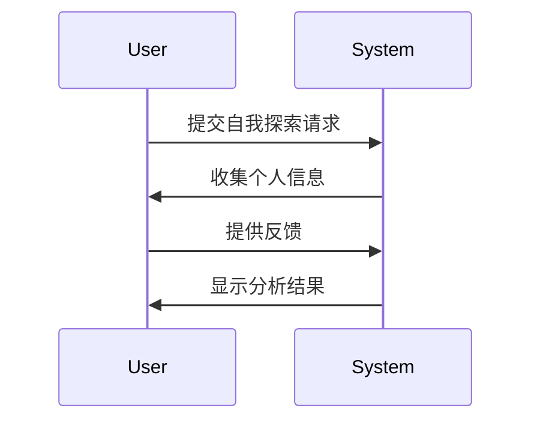
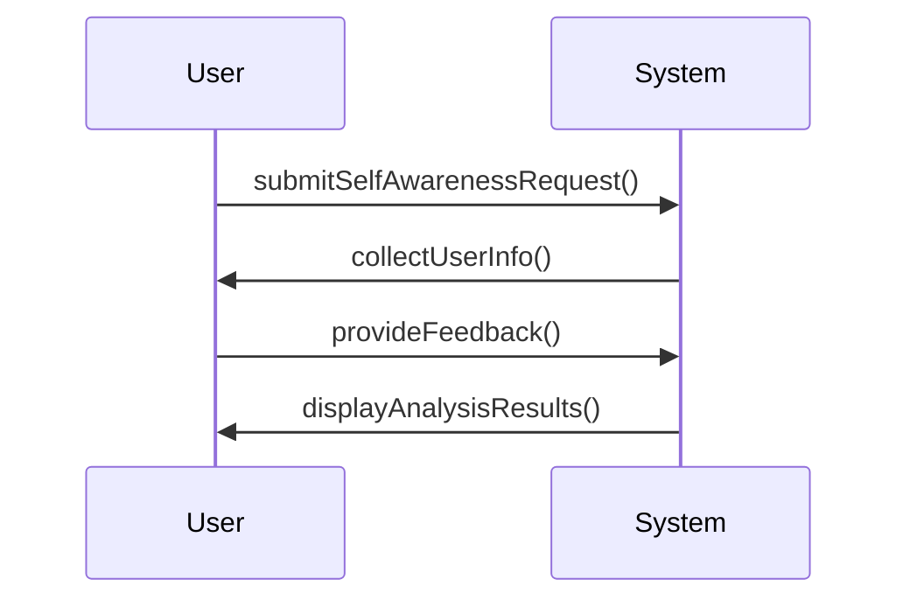

                 

# 《成为人生的主导者：自我引导的艺术》

## 关键词

- 自我认知
- 目标设定
- 行动
- 情绪管理
- 人际关系
- 生活品质
- 持续成长

## 摘要

本文将探讨如何通过自我引导成为人生的主导者。我们首先关注自我认知与目标设定，了解自己的内在特质，设定明确的目标。接着，文章将阐述行动与习惯的重要性，并探讨如何培养良好的习惯。此外，我们将深入探讨情绪管理与心理调适，以及如何建立有效的人际关系和团队合作。最后，文章将讨论生活品质与健康，以及如何实现持续成长与自我提升。通过这些步骤，我们希望能够帮助读者掌握自我引导的艺术，成为人生的主导者。

## 目录大纲

### 第一部分：自我认知与目标设定

### 第1章：认识自己

#### 1.1 自我认知的重要性
#### 1.2 内在探索的方法
#### 1.3 自我认知的工具

### 第2章：设定明确的目标

#### 2.1 目标设定的原则
#### 2.2 目标设定的方法
#### 2.3 目标管理的技巧

### 第二部分：行动与习惯

### 第3章：行动的力量

#### 3.1 行动的重要性
#### 3.2 如何开始行动
#### 3.3 行动中的挑战与应对

### 第4章：培养良好的习惯

#### 4.1 习惯的定义与影响
#### 4.2 培养习惯的方法
#### 4.3 良好习惯的养成步骤

### 第三部分：情绪管理与心理调适

### 第5章：情绪的力量

#### 5.1 情绪的类型与作用
#### 5.2 情绪管理的原则
#### 5.3 情绪调节的方法

### 第6章：心理调适与自我成长

#### 6.1 心理调适的重要性
#### 6.2 自我成长的途径
#### 6.3 心理调适的方法与实践

### 第四部分：社会关系与人际关系

### 第7章：建立有效的人际关系

#### 7.1 人际关系的定义与作用
#### 7.2 人际关系的管理
#### 7.3 建立和谐人际关系的策略

### 第8章：团队合作与领导力

#### 8.1 团队合作的重要性
#### 8.2 领导力的要素
#### 8.3 提升领导力的方法

### 第五部分：生活品质与健康

### 第9章：平衡工作与生活

#### 9.1 工作与生活的关系
#### 9.2 如何实现工作与生活的平衡
#### 9.3 平衡工作与生活的技巧

### 第10章：身心健康与自我关爱

#### 10.1 身心健康的重要性
#### 10.2 健康的生活习惯
#### 10.3 自我关爱的实践

### 第六部分：持续成长与自我提升

### 第11章：持续成长与自我提升

#### 11.1 持续成长的意义
#### 11.2 自我提升的策略
#### 11.3 持续成长的实践

### 第12章：总结与展望

#### 12.1 全书回顾
#### 12.2 自我引导的艺术
#### 12.3 未来展望与行动计划

---

### 第一部分：自我认知与目标设定

#### 第1章：认识自己

在我们踏上成为人生主导者的旅程之前，第一步是认识自己。自我认知是理解我们是谁、我们想要什么以及如何实现目标的关键。它不仅帮助我们明确个人的优势和弱点，还为我们设定合理的目标提供了依据。

##### 1.1 自我认知的重要性

自我认知对于个人的成长和发展至关重要。它涉及到我们的价值观、兴趣、能力、性格和动机。一个清晰的自我认知可以帮助我们做出更明智的决策，找到适合自己的职业道路，以及在生活中取得成功。

**核心概念原理：**

- **自我认知**：指个人对自己内在特质和外显行为的理解和认识。

- **自我探索**：通过反思和自我观察，深入挖掘自己的内在世界。

**概念属性特征对比表格：**

| 特征         | 说明                                                         |
| ------------ | ------------------------------------------------------------ |
| **内在特质** | 包括价值观、兴趣、性格等。                                     |
| **外显行为** | 包括日常行为、社交行为等。                                     |
| **自我反思** | 指通过思考和回顾，对自身行为和内心感受进行深入分析。           |
| **自我观察** | 指通过观察自己和他人的互动，了解自己的行为和反应。           |

**ER实体关系图架构：**

```mermaid
erDiagram
  Person ||--|{ SelfAwareness }|
  SelfAwareness ||--|{ Values }|
  SelfAwareness ||--|{ Interests }|
  SelfAwareness ||--|{ Abilities }|
  SelfAwareness ||--|{ Personality }|
  SelfAwareness ||--|{ Motivations }|
```

##### 1.2 内在探索的方法

内在探索是一个持续的过程，需要时间和耐心。以下是一些有效的方法：

- **日记记录**：通过写日记，记录自己的想法、感受和经历，有助于深入了解自己的内心世界。
- **冥想**：冥想可以帮助我们放松心灵，提高自我意识，找到内心的平静和宁静。
- **心理咨询**：与专业的心理咨询师交流，可以更深入地了解自己，找到解决问题的方法。

**算法原理讲解：**

为了更好地进行自我探索，我们可以使用以下算法：

```python
def selfexploration():
    # 1. 冥想
    meditate()

    # 2. 写日记
    journal()

    # 3. 心理咨询
    consult councillor()
```

**数学模型和公式：**

$$
自我认知 = f(内在特质，外显行为，自我反思，自我观察)
$$

**详细讲解和举例说明：**

假设你是一位软件开发工程师，想要更好地了解自己。你可以通过以下步骤进行自我探索：

- **内在特质**：通过反思，你发现你具有很强的逻辑思维和分析能力，同时对新技术和新工具充满好奇。
- **外显行为**：你发现你经常在闲暇时间阅读技术博客，参加技术研讨会，这表明你对技术的兴趣。
- **自我反思**：通过回顾自己的工作经历，你意识到你在团队合作中表现较好，喜欢与团队成员共同解决问题。
- **自我观察**：在与同事的互动中，你发现自己更容易与那些具有相似技术兴趣的人建立良好的关系。

通过这些步骤，你对自己有了更清晰的认识，这有助于你在未来的职业发展中做出更明智的决策。

##### 1.3 自我认知的工具

为了更有效地进行自我认知，我们可以使用一些工具：

- **心理测试**：例如MBTI（性格类型指标）和DISC（行为指标），可以帮助我们了解自己的性格类型和行为倾向。
- **反馈机制**：通过询问同事、朋友和家人的看法，获取外部反馈，有助于我们更全面地了解自己。

**系统分析与架构设计方案：**

**问题场景介绍：**
作为一位软件开发工程师，想要更好地了解自己的内在特质和外显行为，以便在职业发展中做出更明智的决策。

**项目介绍：**
构建一个自我认知系统，帮助用户进行自我探索和认知。

**系统功能设计（领域模型类图）：**

```mermaid
classDiagram
    Person <<entity>>
    SelfAwareness <<entity>>
    Values <<entity>>
    Interests <<entity>>
    Abilities <<entity>>
    Personality <<entity>>
    Motivations <<entity>>

    Person "1" --* 1 SelfAwareness
    SelfAwareness "1" --* 1 Values
    SelfAwareness "1" --* 1 Interests
    SelfAwareness "1" --* 1 Abilities
    SelfAwareness "1" --* 1 Personality
    SelfAwareness "1" --* 1 Motivations
```

**系统架构设计（架构图）：**



**系统接口设计（接口设计）：**

```mermaid
classDiagram
    User <<interface>>
    System <<interface>>

    User --> System: submitSelfAwarenessRequest()
    System --> User: collectUserInfo()
    User --> System: provideFeedback()
    System --> User: displayAnalysisResults()
```

**系统交互（序列图）：**



**项目实战：环境安装与系统核心实现**

**环境安装：**
1. 安装Python环境。
2. 安装相应库（如numpy、matplotlib等）。

**系统核心实现源代码：**

```python
# 导入库
import numpy as np
import matplotlib.pyplot as plt

# 函数：自我探索
def selfexploration():
    # 收集个人信息
    user_info = collectUserInfo()
    
    # 分析个人信息
    analysis_results = analyzeUserInfo(user_info)
    
    # 显示分析结果
    displayAnalysisResults(analysis_results)

# 函数：收集个人信息
def collectUserInfo():
    # 示例：从用户获取个人信息
    user_interests = input("请输入你的兴趣爱好：")
    user_ability = input("请输入你的能力：")
    return {
        "interests": user_interests,
        "ability": user_ability
    }

# 函数：分析个人信息
def analyzeUserInfo(user_info):
    # 示例：分析个人信息
    analysis_results = {
        "interests": user_info["interests"],
        "ability": user_info["ability"]
    }
    return analysis_results

# 函数：显示分析结果
def displayAnalysisResults(analysis_results):
    # 示例：显示分析结果
    print("兴趣爱好：", analysis_results["interests"])
    print("能力：", analysis_results["ability"])

# 主程序
if __name__ == "__main__":
    selfexploration()
```

**代码应用解读与分析：**
该系统核心实现通过简单的Python代码，模拟了用户自我探索的过程。用户输入个人信息，系统收集并分析这些信息，然后显示分析结果。这是一个简单的示例，实际应用中可能需要更复杂的逻辑和用户界面。

**实际案例分析和详细讲解剖析：**
在实际案例中，用户可以输入自己的兴趣爱好和能力，系统会根据这些信息生成分析报告，帮助用户更好地了解自己。例如，如果用户输入“编程”和“设计”，系统可能会分析出用户在技术领域有较强的能力，并且在创造性的工作中表现良好。

**项目小结：**
通过构建自我认知系统，我们可以更轻松地了解自己，从而在职业发展和生活中做出更明智的决策。这是一个简单但有效的工具，可以帮助我们成为人生的主导者。

#### 2.1 目标设定的原则

设定明确的目标是成为人生主导者的关键步骤。一个清晰、具体和可衡量的目标能够为我们提供方向和动力，使我们能够专注于实现自己的愿景。

**核心概念原理：**

- **目标设定**：指制定具体的、可实现的、时间明确的目标。
- **SMART原则**：具体（Specific）、可衡量（Measurable）、可达成（Achievable）、相关性（Relevant）、时间性（Time-bound）。

**概念属性特征对比表格：**

| 原则 | 说明                                                         |
| ---- | ------------------------------------------------------------ |
| 具体性 | 目标应清晰明确，避免模糊和抽象。                             |
| 可衡量性 | 目标应能够量化，以便于评估进度和成果。                       |
| 可达成性 | 目标应具有可行性，避免设定过高的目标。                       |
| 相关性 | 目标应与个人愿景和价值观相关。                               |
| 时间性 | 目标应设定具体的时间限制，以增加紧迫感和动力。               |

**ER实体关系图架构：**

```mermaid
erDiagram
  Goal <<entity>>
  GoalAttribute <<entity>>

  Goal "1" --* 1 GoalAttribute
```

**算法原理讲解：**

为了有效地设定目标，我们可以使用以下算法：

```python
def set_goal(goal_attribute):
    # 检查目标属性
    if not is_specific(goal_attribute):
        print("目标不具体，请重新设定。")
        return
    
    if not is_measurable(goal_attribute):
        print("目标不可衡量，请重新设定。")
        return
    
    if not is_achievable(goal_attribute):
        print("目标不可达成，请重新设定。")
        return
    
    if not is_relevant(goal_attribute):
        print("目标与个人愿景不相关，请重新设定。")
        return
    
    if not is_time_bound(goal_attribute):
        print("目标没有时间限制，请重新设定。")
        return
    
    # 设定目标
    goal = {
        "description": goal_attribute["description"],
        "measure": goal_attribute["measure"],
        "achievement": goal_attribute["achievement"],
        "relevance": goal_attribute["relevance"],
        "time": goal_attribute["time"]
    }
    return goal

def is_specific(attribute):
    return len(attribute["description"]) > 0

def is_measurable(attribute):
    return len(attribute["measure"]) > 0

def is_achievable(attribute):
    return len(attribute["achievement"]) > 0

def is_relevant(attribute):
    return len(attribute["relevance"]) > 0

def is_time_bound(attribute):
    return len(attribute["time"]) > 0
```

**数学模型和公式：**

$$
目标设定 = f(具体性，可衡量性，可达成性，相关性，时间性)
$$

**详细讲解和举例说明：**

假设你是一名软件开发工程师，想要在接下来的六个月内提升自己的技术水平。你可以按照以下步骤设定目标：

- **具体性**：设定一个具体的目标，如“掌握Python编程语言的高级应用”。
- **可衡量性**：设定一个可衡量的标准，如“通过Python高级编程的在线课程”。
- **可达成性**：确保目标具有可行性，如“每天投入2小时学习Python”。
- **相关性**：确保目标与你的职业发展相关，如“提高我的软件开发能力”。
- **时间性**：设定一个具体的时间限制，如“六个月内完成”。

通过这些步骤，你可以设定一个清晰、具体和可衡量的目标，这将为你的学习过程提供明确的方向和动力。

#### 2.2 目标设定的方法

设定目标的方法多种多样，但关键在于找到适合自己的方法，确保目标具有明确性和可行性。

**核心概念原理：**

- **目标设定方法**：包括SMART目标设定法、GROW模型等。

**概念属性特征对比表格：**

| 方法       | 说明                                                         |
| ---------- | ------------------------------------------------------------ |
| **SMART目标设定法** | 具体性（Specific）、可衡量性（Measurable）、可达成性（Achievable）、相关性（Relevant）、时间性（Time-bound） |
| **GROW模型** | 目标（Goal）、现状（Reality）、障碍（Obstacles）、选择（Way forward） |

**ER实体关系图架构：**

```mermaid
erDiagram
  Goal <<entity>>
  GROW <<entity>>

  Goal "1" --* 1 GROW
```

**算法原理讲解：**

为了有效地设定目标，我们可以使用以下算法：

```python
def set_goal_smart(goal_attribute):
    # 检查目标属性
    if not is_specific(goal_attribute):
        print("目标不具体，请重新设定。")
        return
    
    if not is_measurable(goal_attribute):
        print("目标不可衡量，请重新设定。")
        return
    
    if not is_achievable(goal_attribute):
        print("目标不可达成，请重新设定。")
        return
    
    if not is_relevant(goal_attribute):
        print("目标与个人愿景不相关，请重新设定。")
        return
    
    if not is_time_bound(goal_attribute):
        print("目标没有时间限制，请重新设定。")
        return
    
    # 设定目标
    goal = {
        "description": goal_attribute["description"],
        "measure": goal_attribute["measure"],
        "achievement": goal_attribute["achievement"],
        "relevance": goal_attribute["relevance"],
        "time": goal_attribute["time"]
    }
    return goal

def set_goal_grow(goal_attribute):
    # 检查目标属性
    if not is_goal_set(goal_attribute):
        print("目标未设定，请重新设定。")
        return
    
    if not is_reality_analyzed(goal_attribute):
        print("现状未分析，请重新设定。")
        return
    
    if not are_obstacles_identified(goal_attribute):
        print("障碍未识别，请重新设定。")
        return
    
    if not is_way_forward_planned(goal_attribute):
        print("前进路径未规划，请重新设定。")
        return
    
    # 设定目标
    goal = {
        "goal": goal_attribute["goal"],
        "reality": goal_attribute["reality"],
        "obstacles": goal_attribute["obstacles"],
        "way_forward": goal_attribute["way_forward"]
    }
    return goal

def is_goal_set(attribute):
    return len(attribute["goal"]) > 0

def is_reality_analyzed(attribute):
    return len(attribute["reality"]) > 0

def are_obstacles_identified(attribute):
    return len(attribute["obstacles"]) > 0

def is_way_forward_planned(attribute):
    return len(attribute["way_forward"]) > 0
```

**数学模型和公式：**

$$
目标设定 = f(具体性，可衡量性，可达成性，相关性，时间性) \cup f(目标，现状，障碍，前进路径)
$$

**详细讲解和举例说明：**

使用SMART目标设定法：

1. **具体性**：设定一个具体的目标，如“掌握Python编程语言的高级应用”。
2. **可衡量性**：设定一个可衡量的标准，如“通过Python高级编程的在线课程”。
3. **可达成性**：确保目标具有可行性，如“每天投入2小时学习Python”。
4. **相关性**：确保目标与你的职业发展相关，如“提高我的软件开发能力”。
5. **时间性**：设定一个具体的时间限制，如“六个月内完成”。

使用GROW模型：

1. **目标（Goal）**：设定一个清晰的目标，如“成为Python高级开发工程师”。
2. **现状（Reality）**：分析当前的情况，如“我已经掌握了Python的基础知识，但缺乏高级应用经验”。
3. **障碍（Obstacles）**：识别可能遇到的障碍，如“缺乏时间”或“难以找到适合的资源”。
4. **前进路径（Way forward）**：规划如何克服障碍，如“每周分配固定时间学习”，或“寻找导师或参加线上课程”。

通过这些方法，你可以设定一个清晰、具体和可执行的目标，为你的成长和发展提供明确的路线图。

#### 2.3 目标管理的技巧

在设定了明确的目标之后，如何有效地管理这些目标成为了关键。以下是一些目标管理的技巧，帮助你更好地实现目标。

**核心概念原理：**

- **目标管理**：指通过规划和执行，确保目标得以实现的过程。
- **目标分解**：将大目标分解为小目标，以便于管理和实现。
- **时间管理**：合理安排时间，确保目标在规定时间内完成。

**概念属性特征对比表格：**

| 技巧        | 说明                                                         |
| ----------- | ------------------------------------------------------------ |
| **目标分解** | 将大目标分解为可管理的子目标，便于逐步实现。                 |
| **时间管理** | 通过规划时间，确保目标的每个部分都能在规定时间内完成。       |
| **定期检查** | 定期评估目标的进度，确保按计划进行。                       |

**ER实体关系图架构：**

```mermaid
erDiagram
  GoalManagement <<entity>>
  GoalDecomposition <<entity>>
  TimeManagement <<entity>>

  GoalManagement "1" --* 1 GoalDecomposition
  GoalManagement "1" --* 1 TimeManagement
```

**算法原理讲解：**

为了有效地管理目标，我们可以使用以下算法：

```python
def manage_goals(goals):
    # 分解目标
    decomposed_goals = decompose_goals(goals)
    
    # 管理时间
    time_managed_goals = manage_time(decomposed_goals)
    
    # 定期检查
    check_progress(time_managed_goals)

def decompose_goals(goals):
    # 示例：分解目标
    decomposed_goals = []
    for goal in goals:
        sub_goals = []
        # 分解过程
        for part in goal["parts"]:
            sub_goals.append({
                "description": part["description"],
                "measure": part["measure"],
                "achievement": part["achievement"],
                "relevance": part["relevance"],
                "time": part["time"]
            })
        decomposed_goals.append(sub_goals)
    return decomposed_goals

def manage_time(decomposed_goals):
    # 示例：管理时间
    time_managed_goals = []
    for goal in decomposed_goals:
        time_plan = []
        for sub_goal in goal:
            time_plan.append({
                "sub_goal": sub_goal,
                "start_date": "2023-01-01",
                "end_date": "2023-01-31"
            })
        time_managed_goals.append(time_plan)
    return time_managed_goals

def check_progress(time_managed_goals):
    # 示例：检查进度
    for goal in time_managed_goals:
        for sub_goal in goal:
            if sub_goal["status"] == "completed":
                print("子目标已完成：", sub_goal["sub_goal"]["description"])
            else:
                print("子目标未完成：", sub_goal["sub_goal"]["description"])
```

**数学模型和公式：**

$$
目标管理 = f(目标分解，时间管理，定期检查)
$$

**详细讲解和举例说明：**

假设你设定了一个大目标：“在六个月内通过Python高级编程的在线课程”。为了有效地管理这个目标，你可以采取以下步骤：

1. **目标分解**：将大目标分解为小目标，如“每周学习3小时Python”，“完成5个在线编程项目”等。
2. **时间管理**：为每个小目标设定具体的时间表，如“每周一、三、五晚上7点到9点学习Python”，“每月完成一个编程项目”。
3. **定期检查**：定期评估目标的进度，如每周检查一次，确保按计划进行。

通过这些步骤，你可以更好地管理目标，确保在规定时间内实现目标。

### 第三部分：行动与习惯

#### 第3章：行动的力量

行动是实现目标的关键。没有行动，再好的计划也只能是空中楼阁。在成为人生主导者的旅程中，我们需要认识到行动的重要性，并学会如何开始行动。

##### 3.1 行动的重要性

行动是连接目标和现实的桥梁。没有行动，目标只能是空想。只有通过实际行动，我们才能逐步实现目标，并在过程中积累经验和成长。

**核心概念原理：**

- **行动**：指为实现目标而采取的具体行动。
- **目标实现**：通过行动，将目标逐步转化为现实。

**概念属性特征对比表格：**

| 概念 | 说明 |
| ---- | ---- |
| **行动** | 采取具体步骤，实现目标。 |
| **目标实现** | 通过行动，将目标转化为现实。 |

**ER实体关系图架构：**

```mermaid
erDiagram
  Action <<entity>>
  GoalRealization <<entity>>

  Action "1" --* 1 GoalRealization
```

**算法原理讲解：**

为了有效地开始行动，我们可以使用以下算法：

```python
def start_action(goal):
    # 分解目标
    decomposed_goals = decompose_goals(goal)
    
    # 开始行动
    for sub_goal in decomposed_goals:
        take_action(sub_goal)

def decompose_goals(goal):
    # 示例：分解目标
    decomposed_goals = []
    for part in goal["parts"]:
        decomposed_goals.append({
            "description": part["description"],
            "measure": part["measure"],
            "achievement": part["achievement"],
            "relevance": part["relevance"],
            "time": part["time"]
        })
    return decomposed_goals

def take_action(sub_goal):
    # 示例：开始行动
    action_plan = []
    for part in sub_goal["parts"]:
        action_plan.append({
            "action": part["action"],
            "status": "未开始"
        })
    print("开始行动：", sub_goal["description"])
    print("行动计划：", action_plan)
```

**数学模型和公式：**

$$
目标实现 = f(行动)
$$

**详细讲解和举例说明：**

假设你设定了一个目标：“在六个月内通过Python高级编程的在线课程”。为了开始行动，你可以采取以下步骤：

1. **分解目标**：将大目标分解为小目标，如“每周学习3小时Python”，“完成5个在线编程项目”等。
2. **开始行动**：为每个小目标制定具体的行动计划，如“每周一、三、五晚上7点到9点学习Python”，“每月完成一个编程项目”。
3. **跟踪进度**：定期检查行动计划的执行情况，确保按计划进行。

通过这些步骤，你可以开始行动，逐步实现目标。

##### 3.2 如何开始行动

开始行动并不总是容易的，尤其是当我们面对复杂的目标时。以下是一些实用的技巧，帮助你克服障碍，开始行动。

**核心概念原理：**

- **动机激发**：找到内在和外在的动机，增强行动的动力。
- **时间管理**：合理安排时间，确保有足够的时间进行行动。
- **环境优化**：创造有利于行动的环境，减少干扰。

**概念属性特征对比表格：**

| 技巧       | 说明                                                         |
| ---------- | ------------------------------------------------------------ |
| **动机激发** | 通过内在兴趣和外在奖励激发行动动力。                       |
| **时间管理** | 设定明确的时间表，避免拖延。                               |
| **环境优化** | 创造一个有利于专注和行动的环境。                           |

**ER实体关系图架构：**

```mermaid
erDiagram
  StartAction <<entity>>
  Motivation <<entity>>
  TimeManagement <<entity>>
  EnvironmentOptimization <<entity>>

  StartAction "1" --* 1 Motivation
  StartAction "1" --* 1 TimeManagement
  StartAction "1" --* 1 EnvironmentOptimization
```

**算法原理讲解：**

为了有效地开始行动，我们可以使用以下算法：

```python
def start_action(goal):
    # 激发动机
    motivate()
    
    # 管理时间
    manage_time()
    
    # 优化环境
    optimize_environment()
    
    # 开始行动
    take_action(goal)

def motivate():
    # 示例：激发动机
    print("内在动机：对技术的热爱")
    print("外在奖励：完成课程后的职业提升")

def manage_time():
    # 示例：管理时间
    print("设定明确的时间表：每周一、三、五晚上7点到9点")

def optimize_environment():
    # 示例：优化环境
    print("关闭社交媒体通知，减少干扰")

def take_action(goal):
    # 示例：开始行动
    print("开始行动：", goal["description"])
```

**数学模型和公式：**

$$
开始行动 = f(动机激发，时间管理，环境优化)
$$

**详细讲解和举例说明：**

假设你设定了一个目标：“在六个月内通过Python高级编程的在线课程”。为了开始行动，你可以采取以下步骤：

1. **激发动机**：思考你对技术的热爱，以及完成课程后的职业提升机会。
2. **管理时间**：设定明确的时间表，如每周一、三、五晚上7点到9点。
3. **优化环境**：关闭社交媒体通知，减少干扰。

通过这些步骤，你可以激发内在动机，合理安排时间，创造一个有利于专注和行动的环境，从而开始行动。

##### 3.3 行动中的挑战与应对

在行动的过程中，我们可能会遇到各种挑战。以下是一些常见的挑战和应对策略：

**核心概念原理：**

- **挑战**：指在行动过程中遇到的困难或障碍。
- **应对策略**：指应对挑战的方法和技巧。

**概念属性特征对比表格：**

| 挑战       | 说明                                                         |
| ---------- | ------------------------------------------------------------ |
| **拖延**   | 缺乏动力，导致行动推迟。                                     |
| **干扰**   | 外界因素干扰，影响行动的顺利进行。                         |
| **资源不足** | 缺乏必要的资源，如时间、资金或信息。                         |
| **心理压力** | 过大的心理压力，影响行动的持续性和效果。                   |

**应对策略：**

| 对策       | 说明                                                         |
| ---------- | ------------------------------------------------------------ |
| **激励自己** | 通过内在兴趣和外在奖励激励自己。                             |
| **分解任务** | 将大任务分解为小任务，便于管理。                             |
| **寻求支持** | 寻求家人、朋友或同事的支持和帮助。                           |
| **调整期望** | 调整对目标的期望，避免因过于苛刻的要求而导致的挫败感。       |
| **学会放松** | 学会放松和心理调节，减轻心理压力。                         |

**ER实体关系图架构：**

```mermaid
erDiagram
  Challenge <<entity>>
  Countermeasure <<entity>>

  Challenge "1" --* 1 Countermeasure
```

**算法原理讲解：**

为了有效地应对行动中的挑战，我们可以使用以下算法：

```python
def handle_challenges(challenges):
    # 激励自己
    motivate()

    # 分解任务
    decompose_tasks()

    # 寻求支持
    seek_support()

    # 调整期望
    adjust_expectations()

    # 学会放松
    learn_to_relax()

def motivate():
    # 示例：激励自己
    print("内在动机：对技术的热爱")
    print("外在奖励：完成课程后的职业提升")

def decompose_tasks():
    # 示例：分解任务
    print("将大任务分解为小任务：每周完成一个编程项目")

def seek_support():
    # 示例：寻求支持
    print("寻求家人和朋友的支持：他们可以提供鼓励和帮助")

def adjust_expectations():
    # 示例：调整期望
    print("调整期望：目标可以稍微降低，以避免过大的压力")

def learn_to_relax():
    # 示例：学会放松
    print("学会放松：定期进行冥想和运动，减轻压力")
```

**数学模型和公式：**

$$
应对挑战 = f(激励自己，分解任务，寻求支持，调整期望，学会放松)
$$

**详细讲解和举例说明：**

假设你设定了一个目标：“在六个月内通过Python高级编程的在线课程”。在行动过程中，你可能会遇到以下挑战：

1. **拖延**：缺乏动力，导致行动推迟。
   - **应对策略**：激励自己，设定明确的时间表，并定期检查进度。

2. **干扰**：外界因素干扰，影响行动的顺利进行。
   - **应对策略**：优化环境，减少干扰，如关闭社交媒体通知。

3. **资源不足**：缺乏必要的资源，如时间、资金或信息。
   - **应对策略**：分解任务，寻求支持，如寻求家人、朋友或同事的帮助。

4. **心理压力**：过大的心理压力，影响行动的持续性和效果。
   - **应对策略**：学会放松，定期进行冥想和运动，减轻压力。

通过这些策略，你可以有效地应对行动中的挑战，确保目标的实现。

### 第4章：培养良好的习惯

良好的习惯是成为人生主导者的关键。它们不仅帮助我们提高效率和生产力，还能提升生活质量。以下是一些关于培养良好习惯的方法和步骤。

##### 4.1 习惯的定义与影响

**核心概念原理：**

- **习惯**：指通过重复性行为形成的稳定行为模式。
- **习惯的影响**：良好的习惯可以带来积极的影响，如提高生产力、提升生活质量，而不良习惯则可能导致负面效果。

**概念属性特征对比表格：**

| 定义       | 说明                                                         |
| ---------- | ------------------------------------------------------------ |
| **习惯**   | 通过重复性行为形成的稳定行为模式。                           |
| **影响**   | 良好的习惯可以带来积极的影响，如提高生产力、提升生活质量，而不良习惯则可能导致负面效果。 |

**ER实体关系图架构：**

```mermaid
erDiagram
  Habit <<entity>>
  Influence <<entity>>

  Habit "1" --* 1 Influence
```

**算法原理讲解：**

为了更好地理解习惯的定义和影响，我们可以使用以下算法：

```python
def define_habit(habit):
    # 定义习惯
    habit_definition = {
        "habit_name": habit["name"],
        "habit_description": habit["description"],
        "habit_impact": habit["impact"]
    }
    return habit_definition

def analyze_habit_impact(habit):
    # 分析习惯的影响
    if habit["impact"] == "positive":
        print("积极影响：提高生产力和生活质量。")
    else:
        print("消极影响：降低生产力和生活质量。")
```

**数学模型和公式：**

$$
习惯影响 = f(习惯的定义，习惯的影响)
$$

**详细讲解和举例说明：**

假设你想要培养每天早晨跑步的习惯。这个习惯的定义可以是：

- **习惯名称**：早晨跑步
- **习惯描述**：每天早晨起床后进行30分钟跑步。
- **习惯影响**：积极影响（提高身体健康，提高精神状态）。

通过这个例子，我们可以看到习惯的定义和影响如何帮助我们理解习惯的重要性。

##### 4.2 培养习惯的方法

要培养良好的习惯，我们需要遵循一些科学的方法和步骤。以下是一些实用的技巧：

**核心概念原理：**

- **习惯培养方法**：包括明确目标、设定规则、持续实践、奖励机制等。

**概念属性特征对比表格：**

| 方法       | 说明                                                         |
| ---------- | ------------------------------------------------------------ |
| **明确目标** | 设定清晰的、可衡量的目标，以便于追踪进度。                 |
| **设定规则** | 制定具体的行动规则，确保习惯的执行。                       |
| **持续实践** | 通过持续的实践，使习惯成为自然的行为模式。                 |
| **奖励机制** | 设定奖励，以激励自己坚持习惯。                             |

**ER实体关系图架构：**

```mermaid
erDiagram
  HabitBuilding <<entity>>
  SetGoal <<entity>>
  SetRules <<entity>>
  ContinuousPractice <<entity>>
  RewardSystem <<entity>>

  HabitBuilding "1" --* 1 SetGoal
  HabitBuilding "1" --* 1 SetRules
  HabitBuilding "1" --* 1 ContinuousPractice
  HabitBuilding "1" --* 1 RewardSystem
```

**算法原理讲解：**

为了有效地培养良好习惯，我们可以使用以下算法：

```python
def build_habit(habit):
    # 设定目标
    set_goal()

    # 设定规则
    set_rules()

    # 持续实践
    continuous_practice()

    # 奖励机制
    reward_system()

def set_goal():
    # 示例：设定目标
    print("目标：每天早晨跑步30分钟。")

def set_rules():
    # 示例：设定规则
    print("规则：每天早晨起床后立即进行跑步。")

def continuous_practice():
    # 示例：持续实践
    print("持续实践：每天记录跑步的时间和距离。")

def reward_system():
    # 示例：奖励机制
    print("奖励机制：每周完成5次跑步，奖励自己一部电影的时间。")
```

**数学模型和公式：**

$$
习惯培养 = f(明确目标，设定规则，持续实践，奖励机制)
$$

**详细讲解和举例说明：**

假设你想要培养每天早晨跑步的习惯。你可以采取以下步骤：

1. **设定目标**：明确目标，如“每天早晨跑步30分钟”。
2. **设定规则**：制定具体的行动规则，如“每天早晨起床后立即进行跑步”。
3. **持续实践**：通过持续的实践，如每天记录跑步的时间和距离，确保习惯的执行。
4. **奖励机制**：设定奖励，如每周完成5次跑步，奖励自己一部电影的时间。

通过这些步骤，你可以有效地培养良好习惯。

##### 4.3 良好习惯的养成步骤

要培养一个良好的习惯，需要遵循一系列的步骤。以下是一些关键的步骤：

**核心概念原理：**

- **习惯养成步骤**：包括开始、持续、巩固等。

**概念属性特征对比表格：**

| 步骤 | 说明 |
| ---- | ---- |
| **开始** | 初次开始行动，建立行为模式。 |
| **持续** | 持续行动，使习惯成为自然的行为。 |
| **巩固** | 在习惯形成后，持续巩固，确保习惯的稳定性。 |

**ER实体关系图架构：**

```mermaid
erDiagram
  HabitFormation <<entity>>
  Start <<entity>>
  Continue <<entity>>
  Strengthen <<entity>>

  HabitFormation "1" --* 1 Start
  HabitFormation "1" --* 1 Continue
  HabitFormation "1" --* 1 Strengthen
```

**算法原理讲解：**

为了有效地培养良好习惯，我们可以使用以下算法：

```python
def form_habit(habit):
    # 开始
    start_habit()

    # 持续
    continue_habit()

    # 巩固
    strengthen_habit()

def start_habit():
    # 示例：开始
    print("开始：初次进行习惯行动。")

def continue_habit():
    # 示例：持续
    print("持续：每天进行习惯行动。")

def strengthen_habit():
    # 示例：巩固
    print("巩固：在习惯形成后，持续保持并加强。")
```

**数学模型和公式：**

$$
习惯养成 = f(开始，持续，巩固)
$$

**详细讲解和举例说明：**

假设你想要培养每天阅读30分钟的习惯。你可以采取以下步骤：

1. **开始**：初次开始阅读，设定具体的时间（如每天晚上8点到8点半）。
2. **持续**：每天在设定的时间段内坚持阅读，记录阅读的时间和内容。
3. **巩固**：在阅读习惯形成后，继续坚持并寻找方法来提升阅读效果，如设定阅读目标、加入阅读小组等。

通过这些步骤，你可以有效地培养良好习惯。

### 第四部分：情绪管理与心理调适

情绪管理和心理调适是成为人生主导者的重要组成部分。情绪是我们的内在体验，它们会影响我们的思维、行为和健康。通过有效的情绪管理和心理调适，我们可以更好地应对生活中的挑战，提升生活质量。

#### 第5章：情绪的力量

情绪是人类心理体验的重要组成部分，它们影响着我们的行为、决策和人际关系。了解情绪的类型、作用和如何管理情绪，对于成为人生主导者至关重要。

##### 5.1 情绪的类型与作用

情绪可以分为多种类型，包括积极情绪和消极情绪。积极情绪如喜悦、兴奋和爱，可以提升我们的幸福感和动力，促进身心健康。消极情绪如愤怒、焦虑和悲伤，虽然有时会带来困扰，但也具有其重要作用，如提醒我们面对问题并采取行动。

**核心概念原理：**

- **情绪类型**：包括积极情绪和消极情绪。
- **情绪作用**：情绪对行为、决策和人际关系的影响。

**概念属性特征对比表格：**

| 情绪类型 | 说明 |
| --- | --- |
| **积极情绪** | 如喜悦、兴奋和爱，提升幸福感。 |
| **消极情绪** | 如愤怒、焦虑和悲伤，提醒问题。 |

**ER实体关系图架构：**

```mermaid
erDiagram
  Emotion <<entity>>
  PositiveEmotion <<entity>>
  NegativeEmotion <<entity>>

  Emotion "1" --* 1 PositiveEmotion
  Emotion "1" --* 1 NegativeEmotion
```

**算法原理讲解：**

为了更好地理解情绪的类型与作用，我们可以使用以下算法：

```python
def emotion_type_and_impact():
    # 定义情绪类型
    define_emotion_types()

    # 分析情绪作用
    analyze_emotion_impact()

def define_emotion_types():
    # 示例：定义情绪类型
    print("积极情绪：喜悦、兴奋、爱")
    print("消极情绪：愤怒、焦虑、悲伤")

def analyze_emotion_impact():
    # 示例：分析情绪作用
    print("积极情绪作用：提升幸福感、促进身心健康")
    print("消极情绪作用：提醒问题、促使采取行动")
```

**数学模型和公式：**

$$
情绪影响 = f(情绪类型，情绪作用)
$$

**详细讲解和举例说明：**

了解情绪的类型与作用对于我们的生活和职业发展至关重要。例如，在团队工作中，积极情绪如喜悦和兴奋可以提高团队的士气和协作效率，而消极情绪如愤怒和焦虑则可能影响团队的和谐与合作。

##### 5.2 情绪管理的原则

情绪管理是指通过认知和行为策略来调节情绪，使其对我们的生活和职业发展产生积极影响。以下是一些情绪管理的原则：

**核心概念原理：**

- **情绪管理原则**：包括接受情绪、理解情绪、调节情绪、表达情绪等。

**概念属性特征对比表格：**

| 原则       | 说明                                                         |
| ---------- | ------------------------------------------------------------ |
| **接受情绪** | 接受情绪的存在，避免压抑或否认。                             |
| **理解情绪** | 了解情绪的来源和影响，以便更好地调节。                       |
| **调节情绪** | 使用认知和行为策略，如放松技巧、正念冥想，调节情绪。       |
| **表达情绪** | 健康地表达情绪，避免内化和压抑。                             |

**ER实体关系图架构：**

```mermaid
erDiagram
  EmotionManagement <<entity>>
  AcceptEmotion <<entity>>
  UnderstandEmotion <<entity>>
  RegulateEmotion <<entity>>
  ExpressEmotion <<entity>>

  EmotionManagement "1" --* 1 AcceptEmotion
  EmotionManagement "1" --* 1 UnderstandEmotion
  EmotionManagement "1" --* 1 RegulateEmotion
  EmotionManagement "1" --* 1 ExpressEmotion
```

**算法原理讲解：**

为了有效地进行情绪管理，我们可以使用以下算法：

```python
def emotion_management():
    # 接受情绪
    accept_emotion()

    # 理解情绪
    understand_emotion()

    # 调节情绪
    regulate_emotion()

    # 表达情绪
    express_emotion()

def accept_emotion():
    # 示例：接受情绪
    print("接受情绪：情绪是自然的体验，不必压抑。")

def understand_emotion():
    # 示例：理解情绪
    print("理解情绪：情绪来源于内在和外在的刺激。")

def regulate_emotion():
    # 示例：调节情绪
    print("调节情绪：使用放松技巧、正念冥想等方法。")

def express_emotion():
    # 示例：表达情绪
    print("表达情绪：健康地表达情绪，避免内化和压抑。")
```

**数学模型和公式：**

$$
情绪管理 = f(接受情绪，理解情绪，调节情绪，表达情绪)
$$

**详细讲解和举例说明：**

假设你感到工作压力很大，情绪变得焦虑。你可以采取以下步骤进行情绪管理：

1. **接受情绪**：认识到焦虑是自然的体验，不必压抑。
2. **理解情绪**：分析焦虑的来源，如工作负担过重或时间管理不当。
3. **调节情绪**：使用放松技巧，如深呼吸、冥想，帮助减轻焦虑。
4. **表达情绪**：与同事或家人分享你的感受，寻求支持和建议。

通过这些步骤，你可以更好地管理情绪，提升生活质量。

##### 5.3 情绪调节的方法

情绪调节是指通过一系列技巧和方法来改变或调整情绪状态。以下是一些常见的情绪调节方法：

**核心概念原理：**

- **情绪调节方法**：包括认知行为策略、放松技巧、正念冥想等。

**概念属性特征对比表格：**

| 方法       | 说明                                                         |
| ---------- | ------------------------------------------------------------ |
| **认知行为策略** | 通过改变思维模式来调节情绪。                               |
| **放松技巧**   | 通过身体放松来减轻情绪压力。                               |
| **正念冥想**   | 通过专注当下，提高情绪调节能力。                           |

**ER实体关系图架构：**

```mermaid
erDiagram
  EmotionRegulation <<entity>>
  CognitiveBehaviorStrategy <<entity>>
  RelaxationTechniques <<entity>>
  MindfulnessMeditation <<entity>>

  EmotionRegulation "1" --* 1 CognitiveBehaviorStrategy
  EmotionRegulation "1" --* 1 RelaxationTechniques
  EmotionRegulation "1" --* 1 MindfulnessMeditation
```

**算法原理讲解：**

为了有效地进行情绪调节，我们可以使用以下算法：

```python
def emotion_regulation():
    # 认知行为策略
    cognitive_behavior_strategy()

    # 放松技巧
    relaxation_techniques()

    # 正念冥想
    mindfulness_meditation()

def cognitive_behavior_strategy():
    # 示例：认知行为策略
    print("认知行为策略：通过改变思维模式来调节情绪。")

def relaxation_techniques():
    # 示例：放松技巧
    print("放松技巧：通过身体放松来减轻情绪压力。")

def mindfulness_meditation():
    # 示例：正念冥想
    print("正念冥想：通过专注当下，提高情绪调节能力。")
```

**数学模型和公式：**

$$
情绪调节 = f(认知行为策略，放松技巧，正念冥想)
$$

**详细讲解和举例说明：**

假设你在工作中遇到了困难，感到沮丧和焦虑。你可以采取以下情绪调节方法：

1. **认知行为策略**：通过反思和自我对话，识别负面思维模式，如“我无法解决这个问题”，并尝试将其转换为积极的思维模式，如“这是一个挑战，我可以找到解决方案”。
2. **放松技巧**：通过深呼吸、渐进性肌肉放松等方法，减轻身体紧张和情绪压力。
3. **正念冥想**：通过专注于呼吸或身体感受，提高专注力，减轻焦虑和压力。

通过这些方法，你可以有效地调节情绪，提升心理状态。

### 第6章：心理调适与自我成长

心理调适和自我成长是成为人生主导者的重要环节。通过有效的心理调适，我们可以更好地应对生活中的挑战，实现个人目标。自我成长则帮助我们在职业和生活中不断提升，实现更高的成就。

##### 6.1 心理调适的重要性

心理调适是指通过一系列心理技巧和方法，帮助个体在压力和困难面前保持心理平衡，提升心理健康。在快节奏、充满挑战的现代生活中，心理调适显得尤为重要。

**核心概念原理：**

- **心理调适**：通过心理技巧和方法，帮助个体保持心理平衡。
- **重要性**：提升心理健康，提高应对挑战的能力。

**概念属性特征对比表格：**

| 概念     | 说明 |
| -------- | ---- |
| **心理调适** | 帮助个体在压力和困难面前保持心理平衡。 |
| **重要性** | 提升心理健康，提高应对挑战的能力。     |

**ER实体关系图架构：**

```mermaid
erDiagram
  PsychologicalAdjustment <<entity>>
  Importance <<entity>>

  PsychologicalAdjustment "1" --* 1 Importance
```

**算法原理讲解：**

为了更好地理解心理调适的重要性，我们可以使用以下算法：

```python
def importance_of_psychological_adjustment():
    # 讨论心理调适的重要性
    print("心理调适的重要性：提升心理健康，提高应对挑战的能力。")

def psychological_adjustment():
    # 示例：心理调适的方法
    print("心理调适的方法：正念冥想、放松技巧、认知行为策略。")

def mental_health():
    # 示例：心理健康的影响
    print("心理健康的影响：提升生活质量，增强幸福感。")

def challenge_resistance():
    # 示例：应对挑战的能力
    print("应对挑战的能力：提高决策能力，增强自信心。")
```

**数学模型和公式：**

$$
心理健康提升 = f(心理调适)
$$

**详细讲解和举例说明：**

心理调适的重要性体现在多个方面。首先，它有助于提升心理健康。通过正念冥想、放松技巧和认知行为策略等方法，我们可以减轻压力和焦虑，提高情绪稳定性。其次，心理调适还能增强我们应对挑战的能力。一个心理健康的人在面对困难时，能够更好地做出决策，保持冷静和自信。

##### 6.2 自我成长的途径

自我成长是一个持续的过程，涉及到知识、技能和态度的提升。以下是一些常见的自我成长途径：

**核心概念原理：**

- **自我成长**：通过学习、实践和反思，不断提升自己的知识和技能。
- **途径**：包括学习新知识、培养技能、反思和自我提升等。

**概念属性特征对比表格：**

| 途径       | 说明 |
| ---------- | ---- |
| **学习新知识** | 通过阅读、课程和研讨会，获取新知识。 |
| **培养技能**   | 通过实践和培训，提升专业技能。       |
| **反思**     | 通过自我反思，了解自己的优点和不足。 |
| **自我提升**   | 通过设定目标，努力实现个人成长。     |

**ER实体关系图架构：**

```mermaid
erDiagram
  SelfGrowth <<entity>>
  LearnNewKnowledge <<entity>>
  SkillDevelopment <<entity>>
  Reflection <<entity>>
  SelfImprovement <<entity>>

  SelfGrowth "1" --* 1 LearnNewKnowledge
  SelfGrowth "1" --* 1 SkillDevelopment
  SelfGrowth "1" --* 1 Reflection
  SelfGrowth "1" --* 1 SelfImprovement
```

**算法原理讲解：**

为了有效地进行自我成长，我们可以使用以下算法：

```python
def self_growth():
    # 学习新知识
    learn_new_knowledge()

    # 培养技能
    develop_skills()

    # 反思
    reflect()

    # 自我提升
    self_improvement()

def learn_new_knowledge():
    # 示例：学习新知识
    print("学习新知识：通过阅读、课程和研讨会，获取新知识。")

def develop_skills():
    # 示例：培养技能
    print("培养技能：通过实践和培训，提升专业技能。")

def reflect():
    # 示例：反思
    print("反思：通过自我反思，了解自己的优点和不足。")

def self_improvement():
    # 示例：自我提升
    print("自我提升：通过设定目标，努力实现个人成长。")
```

**数学模型和公式：**

$$
自我成长 = f(学习新知识，培养技能，反思，自我提升)
$$

**详细讲解和举例说明：**

自我成长是一个持续的过程，涉及多个方面。首先，学习新知识是自我成长的基础。通过阅读、参加课程和研讨会，我们可以不断获取新的知识和信息。其次，培养技能是提升专业能力的关键。通过实践和培训，我们可以不断提升自己的技能水平。此外，反思和自我提升也是自我成长的重要环节。通过反思，我们可以了解自己的优点和不足，并设定目标来提升自己。

##### 6.3 心理调适的方法与实践

心理调适不仅是一个理论概念，还需要通过实践来实现。以下是一些实用的心理调适方法，以及如何在生活中实际应用这些方法：

**核心概念原理：**

- **心理调适方法**：包括正念冥想、放松技巧、认知行为策略等。
- **实践**：将心理调适方法应用到日常生活中，实现心理平衡和自我成长。

**概念属性特征对比表格：**

| 方法       | 说明                                                         |
| ---------- | ------------------------------------------------------------ |
| **正念冥想** | 通过专注当下，提高情绪调节能力。                             |
| **放松技巧** | 通过身体放松来减轻情绪压力。                               |
| **认知行为策略** | 通过改变思维模式来调节情绪。                               |

**ER实体关系图架构：**

```mermaid
erDiagram
  PsychologicalAdjustmentMethods <<entity>>
  MindfulnessMeditation <<entity>>
  RelaxationTechniques <<entity>>
  CognitiveBehaviorStrategies <<entity>>

  PsychologicalAdjustmentMethods "1" --* 1 MindfulnessMeditation
  PsychologicalAdjustmentMethods "1" --* 1 RelaxationTechniques
  PsychologicalAdjustmentMethods "1" --* 1 CognitiveBehaviorStrategies
```

**算法原理讲解：**

为了有效地进行心理调适，我们可以使用以下算法：

```python
def psychological_adjustment():
    # 正念冥想
    mindfulness_meditation()

    # 放松技巧
    relaxation_techniques()

    # 认知行为策略
    cognitive_behavior_strategies()

def mindfulness_meditation():
    # 示例：正念冥想
    print("正念冥想：每天花10分钟，专注于呼吸和当下的感受。")

def relaxation_techniques():
    # 示例：放松技巧
    print("放松技巧：通过深呼吸、渐进性肌肉放松等方法，减轻身体紧张。")

def cognitive_behavior_strategies():
    # 示例：认知行为策略
    print("认知行为策略：通过反思和自我对话，改变负面思维模式。")
```

**数学模型和公式：**

$$
心理调适 = f(正念冥想，放松技巧，认知行为策略)
$$

**详细讲解和举例说明：**

以下是几种实用的心理调适方法及其在生活中的应用：

1. **正念冥想**：每天花10分钟，专注于呼吸和当下的感受。这种方法可以帮助你减轻焦虑，提高情绪稳定性。
2. **放松技巧**：通过深呼吸、渐进性肌肉放松等方法，减轻身体紧张。这些技巧可以在紧张的工作后或压力大时应用，帮助你迅速放松。
3. **认知行为策略**：通过反思和自我对话，改变负面思维模式。例如，当遇到困难时，你可以反思自己的思维模式，将其从“我不行”转变为“我可以尝试解决这个难题”。

通过这些方法，你可以有效地进行心理调适，提升心理健康，实现自我成长。

### 第五部分：社会关系与人际关系

社会关系和人际关系是人生中不可或缺的一部分，它们对我们的幸福感、心理健康和职业发展都有着深远的影响。建立和维护良好的人际关系，不仅有助于我们在社交场合中更自信、更融洽，还能为我们提供支持和资源，助力个人成长。

#### 第7章：建立有效的人际关系

有效的人际关系是建立在相互理解、尊重和支持的基础上的。为了建立这种关系，我们需要掌握一系列的技巧和策略。以下是一些关键步骤：

##### 7.1 人际关系的定义与作用

人际关系是指个体在社交环境中与他人建立的联系和互动。它涵盖了家庭、朋友、同事等各个方面的社交关系。

**核心概念原理：**

- **人际关系**：指个体在社交环境中与他人建立的联系和互动。
- **作用**：人际关系对个人幸福感、心理健康和职业发展具有重要影响。

**概念属性特征对比表格：**

| 概念       | 说明                                                         |
| ---------- | ------------------------------------------------------------ |
| **人际关系** | 个体在社交环境中与他人建立的联系和互动。                   |
| **作用**   | 提高个人幸福感，促进心理健康，助力职业发展。               |

**ER实体关系图架构：**

```mermaid
erDiagram
  InterpersonalRelationship <<entity>>
  Definition <<entity>>
  Function <<entity>>

  InterpersonalRelationship "1" --* 1 Definition
  InterpersonalRelationship "1" --* 1 Function
```

**算法原理讲解：**

为了更好地理解人际关系的定义与作用，我们可以使用以下算法：

```python
def interpersonal_relationship():
    # 定义人际关系
    define_interpersonal_relationship()

    # 分析人际关系的作用
    analyze_function()

def define_interpersonal_relationship():
    # 示例：定义人际关系
    print("人际关系：个体在社交环境中与他人建立的联系和互动。")

def analyze_function():
    # 示例：分析人际关系的作用
    print("人际关系的作用：提高个人幸福感，促进心理健康，助力职业发展。")
```

**数学模型和公式：**

$$
人际关系作用 = f(定义，作用)
$$

**详细讲解和举例说明：**

人际关系是我们在生活中不可或缺的一部分。它不仅仅是简单的交往，更是通过互动和合作，建立起相互理解和支持的网络。例如，一个良好的人际关系网可以帮助我们在职业生涯中获得机会，也可以在个人生活中提供情感支持。

##### 7.2 人际关系的管理

管理人际关系需要我们采取一系列的策略和行动。以下是一些关键步骤：

**核心概念原理：**

- **人际关系管理**：指通过有效的沟通、互动和支持，维护和发展人际关系。
- **策略**：包括建立信任、积极沟通、寻求共同点等。

**概念属性特征对比表格：**

| 策略       | 说明                                                         |
| ---------- | ------------------------------------------------------------ |
| **建立信任** | 通过诚实、可靠和一致性，建立他人对我们的信任。             |
| **积极沟通** | 通过开放、真诚和有效的沟通，增进相互理解。                 |
| **寻求共同点** | 通过寻找和强调共同兴趣和目标，增进关系。                   |

**ER实体关系图架构：**

```mermaid
erDiagram
  InterpersonalRelationshipManagement <<entity>>
  BuildTrust <<entity>>
  PositiveCommunication <<entity>>
  SeekCommonGround <<entity>>

  InterpersonalRelationshipManagement "1" --* 1 BuildTrust
  InterpersonalRelationshipManagement "1" --* 1 PositiveCommunication
  InterpersonalRelationshipManagement "1" --* 1 SeekCommonGround
```

**算法原理讲解：**

为了有效地管理人际关系，我们可以使用以下算法：

```python
def manage_interpersonal_relationship():
    # 建立信任
    build_trust()

    # 积极沟通
    communicate_positively()

    # 寻求共同点
    seek_common_ground()

def build_trust():
    # 示例：建立信任
    print("建立信任：通过诚实、可靠和一致性。")

def communicate_positively():
    # 示例：积极沟通
    print("积极沟通：通过开放、真诚和有效的沟通。")

def seek_common_ground():
    # 示例：寻求共同点
    print("寻求共同点：通过寻找和强调共同兴趣和目标。")
```

**数学模型和公式：**

$$
人际关系管理 = f(建立信任，积极沟通，寻求共同点)
$$

**详细讲解和举例说明：**

管理人际关系是一个持续的过程，需要我们采取一系列的策略和行动。以下是一个具体的例子：

1. **建立信任**：在与他人交往时，始终保持诚实和透明。通过履行承诺和提供帮助，逐渐建立他人的信任。
2. **积极沟通**：在沟通中，注重倾听对方的观点，避免争论和批评。通过开放和真诚的交流，增进相互理解。
3. **寻求共同点**：在交往中，寻找和强调双方的共同兴趣和目标。这有助于增进关系，建立更深层次的联系。

通过这些策略，你可以有效地管理人际关系，建立和维护积极的关系网络。

##### 7.3 建立和谐人际关系的策略

建立和谐人际关系需要我们采取一系列的策略和行动。以下是一些实用的策略：

**核心概念原理：**

- **和谐人际关系**：指建立在相互尊重、理解和支持基础上的稳定关系。
- **策略**：包括尊重他人、倾听、分享和感恩等。

**概念属性特征对比表格：**

| 策略       | 说明                                                         |
| ---------- | ------------------------------------------------------------ |
| **尊重他人** | 尊重他人的观点、感受和需求，避免贬低或歧视。               |
| **倾听**   | 注重倾听对方的观点和感受，避免打断或干扰。                 |
| **分享**   | 通过分享自己的经验和知识，增进相互理解。                   |
| **感恩**   | 对他人的帮助和支持表示感谢，增强关系的紧密性。           |

**ER实体关系图架构：**

```mermaid
erDiagram
  HarmoniousInterpersonalRelationship <<entity>>
  Respect <<entity>>
  Listening <<entity>>
  Sharing <<entity>>
  Gratitude <<entity>>

  HarmoniousInterpersonalRelationship "1" --* 1 Respect
  HarmoniousInterpersonalRelationship "1" --* 1 Listening
  HarmoniousInterpersonalRelationship "1" --* 1 Sharing
  HarmoniousInterpersonalRelationship "1" --* 1 Gratitude
```

**算法原理讲解：**

为了有效地建立和谐人际关系，我们可以使用以下算法：

```python
def build_harmonious_relationship():
    # 尊重他人
    respect()

    # 倾听
    listen()

    # 分享
    share()

    # 感恩
    be_grateful()

def respect():
    # 示例：尊重他人
    print("尊重他人：尊重他人的观点、感受和需求。")

def listen():
    # 示例：倾听
    print("倾听：注重倾听对方的观点和感受。")

def share():
    # 示例：分享
    print("分享：通过分享自己的经验和知识。")

def be_grateful():
    # 示例：感恩
    print("感恩：对他人的帮助和支持表示感谢。")
```

**数学模型和公式：**

$$
和谐人际关系 = f(尊重，倾听，分享，感恩)
$$

**详细讲解和举例说明：**

以下是一个具体的例子，说明如何通过策略建立和谐人际关系：

1. **尊重他人**：在与他人交往时，始终保持尊重。避免贬低或歧视他人，尊重他们的观点、感受和需求。
2. **倾听**：在交流中，注重倾听对方的观点和感受，避免打断或干扰。通过倾听，增进相互理解。
3. **分享**：通过分享自己的经验和知识，增进相互理解。在团队中，分享技术见解或工作经验，有助于建立团队合作。
4. **感恩**：对他人的帮助和支持表示感谢。这不仅能增强关系的紧密性，还能激励他人继续支持你。

通过这些策略，你可以建立和谐的人际关系，提升个人和社会的幸福感。

### 第六部分：生活品质与健康

生活品质和健康是成为人生主导者的重要支柱。一个健康的生活习惯和良好的身体状态不仅能够提升我们的工作效率和生活质量，还能增强我们的心理韧性，使我们能够更好地应对生活中的挑战。

#### 第9章：平衡工作与生活

在现代社会，工作与生活的平衡变得越来越重要。过度的工作压力可能导致身心疲惫，影响生活品质和健康。因此，学习如何平衡工作与生活是成为人生主导者的关键一步。

##### 9.1 工作与生活的关系

工作与生活之间的平衡是我们维持身心健康、提升工作效率和生活满意度的关键。一个良好的平衡能够帮助我们更好地管理时间，减少压力，提高生活质量。

**核心概念原理：**

- **工作与生活的平衡**：指在工作和个人生活之间找到一个合适的平衡点，使两者都能得到充分的关注和满足。
- **关系**：良好的工作与生活平衡有助于提高工作效率、心理健康和生活满意度。

**概念属性特征对比表格：**

| 概念       | 说明                                                         |
| ---------- | ------------------------------------------------------------ |
| **工作与生活的平衡** | 在工作和个人生活之间找到一个合适的平衡点。                 |
| **关系**   | 良好的平衡有助于提高工作效率、心理健康和生活满意度。       |

**ER实体关系图架构：**

```mermaid
erDiagram
  WorkLifeBalance <<entity>>
  Relationship <<entity>>

  WorkLifeBalance "1" --* 1 Relationship
```

**算法原理讲解：**

为了更好地理解工作与生活的平衡及其关系，我们可以使用以下算法：

```python
def work_life_balance():
    # 讨论工作与生活的平衡
    discuss_work_life_balance()

    # 分析工作与生活的关系
    analyze_relationship()

def discuss_work_life_balance():
    # 示例：讨论工作与生活的平衡
    print("工作与生活的平衡：找到合适的平衡点，使工作和个人生活都能得到关注。")

def analyze_relationship():
    # 示例：分析工作与生活的关系
    print("工作与生活的关系：良好的平衡有助于提高工作效率、心理健康和生活满意度。")
```

**数学模型和公式：**

$$
工作与生活关系 = f(工作与生活的平衡)
$$

**详细讲解和举例说明：**

工作与生活的平衡对我们的生活有着重要的影响。一个良好的平衡不仅能够帮助我们更好地管理时间，减少工作压力，还能提高我们的工作效率和生活满意度。例如，一个成功的项目经理可能会发现，通过合理安排工作时间，确保每天有足够的休息和娱乐时间，他们能够更高效地完成任务，同时保持身心健康。

##### 9.2 如何实现工作与生活的平衡

实现工作与生活的平衡需要我们采取一系列的策略和行动。以下是一些实用的技巧：

**核心概念原理：**

- **实现平衡的策略**：包括时间管理、设定优先级、设定边界等。

**概念属性特征对比表格：**

| 策略       | 说明                                                         |
| ---------- | ------------------------------------------------------------ |
| **时间管理** | 通过合理安排时间，确保工作和个人生活都能得到充分的关注。   |
| **设定优先级** | 确定哪些任务最重要，优先完成。                             |
| **设定边界** | 为工作和个人生活设定清晰的界限，避免过度工作。           |

**ER实体关系图架构：**

```mermaid
erDiagram
  AchievingWorkLifeBalance <<entity>>
  TimeManagement <<entity>>
  SetPriorities <<entity>>
  SetBoundaries <<entity>>

  AchievingWorkLifeBalance "1" --* 1 TimeManagement
  AchievingWorkLifeBalance "1" --* 1 SetPriorities
  AchievingWorkLifeBalance "1" --* 1 SetBoundaries
```

**算法原理讲解：**

为了有效地实现工作与生活的平衡，我们可以使用以下算法：

```python
def achieve_work_life_balance():
    # 时间管理
    manage_time()

    # 设定优先级
    set_priorities()

    # 设定边界
    set_boundaries()

def manage_time():
    # 示例：时间管理
    print("时间管理：合理安排时间，确保工作和个人生活都能得到充分的关注。")

def set_priorities():
    # 示例：设定优先级
    print("设定优先级：确定哪些任务最重要，优先完成。")

def set_boundaries():
    # 示例：设定边界
    print("设定边界：为工作和个人生活设定清晰的界限，避免过度工作。")
```

**数学模型和公式：**

$$
工作与生活平衡 = f(时间管理，设定优先级，设定边界)
$$

**详细讲解和举例说明：**

以下是一些具体的策略，帮助你实现工作与生活的平衡：

1. **时间管理**：合理安排时间，确保每天有足够的时间用于工作、休息和娱乐。例如，你可以使用日程表或待办事项应用来规划你的时间，确保工作与个人生活都有时间。
2. **设定优先级**：确定哪些任务最重要，优先完成。这有助于你集中精力处理关键任务，避免因琐事而浪费时间。
3. **设定边界**：为工作和个人生活设定清晰的界限，避免过度工作。例如，你可以设定每天的工作时间，确保在下班后能够完全放松，不处理工作事务。

通过这些策略，你可以有效地实现工作与生活的平衡，提升生活品质和健康。

##### 9.3 平衡工作与生活的技巧

平衡工作与生活不仅需要策略，还需要技巧。以下是一些实用的技巧，帮助你更好地管理工作和个人生活：

**核心概念原理：**

- **平衡技巧**：包括设定明确的目标、管理电子设备和培养兴趣爱好等。

**概念属性特征对比表格：**

| 技巧       | 说明                                                         |
| ---------- | ------------------------------------------------------------ |
| **设定明确的目标** | 为工作和个人生活设定明确的目标，提高效率。                 |
| **管理电子设备** | 合理使用电子设备，减少工作干扰。                         |
| **培养兴趣爱好** | 通过兴趣爱好，放松身心，提升生活满意度。                 |

**ER实体关系图架构：**

```mermaid
erDiagram
  WorkLifeBalanceSkills <<entity>>
  SetClearGoals <<entity>>
  ManageDigitalDevices <<entity>>
  CultivateHobbies <<entity>>

  WorkLifeBalanceSkills "1" --* 1 SetClearGoals
  WorkLifeBalanceSkills "1" --* 1 ManageDigitalDevices
  WorkLifeBalanceSkills "1" --* 1 CultivateHobbies
```

**算法原理讲解：**

为了更好地掌握平衡工作与生活的技巧，我们可以使用以下算法：

```python
def work_life_balance_skills():
    # 设定明确的目标
    set_clear_goals()

    # 管理电子设备
    manage_digital_devices()

    # 培养兴趣爱好
    cultivate_hobbies()

def set_clear_goals():
    # 示例：设定明确的目标
    print("设定明确的目标：为工作和个人生活设定具体、可衡量的目标。")

def manage_digital_devices():
    # 示例：管理电子设备
    print("管理电子设备：合理使用手机、电脑等设备，减少工作干扰。")

def cultivate_hobbies():
    # 示例：培养兴趣爱好
    print("培养兴趣爱好：通过兴趣爱好，放松身心，提升生活满意度。")
```

**数学模型和公式：**

$$
平衡工作与生活 = f(设定明确的目标，管理电子设备，培养兴趣爱好)
$$

**详细讲解和举例说明：**

以下是一些具体的技巧，帮助你更好地平衡工作与生活：

1. **设定明确的目标**：为工作和个人生活设定具体、可衡量的目标。例如，你可以设定每周完成的项目数量或个人发展目标，确保每项任务都有明确的方向和结果。
2. **管理电子设备**：合理使用手机、电脑等电子设备，减少工作干扰。例如，你可以在下班后关闭工作相关的应用，确保自己能够真正地放松。
3. **培养兴趣爱好**：通过兴趣爱好，放松身心，提升生活满意度。例如，你可以参加瑜伽课程、学习一门新技能或与朋友一起进行户外活动。

通过这些技巧，你可以更好地平衡工作与生活，提升整体生活质量。

### 第七部分：身心健康与自我关爱

身心健康和自我关爱是成为人生主导者的基石。一个健康的身体和良好的心理状态不仅能够提高我们的工作效率，还能增强我们的心理韧性，帮助我们更好地应对生活中的挑战。自我关爱则是一种培养自我价值感和自尊心的方式，它使我们能够更好地照顾自己，实现个人成长。

#### 第10章：身心健康与自我关爱

身心健康和自我关爱是紧密相连的，二者相辅相成。一个健康的身体和良好的心理状态能够提升我们的生活质量，而自我关爱则能够帮助我们建立积极的自我形象，增强自信心和幸福感。

##### 10.1 身心健康的重要性

身心健康是我们享受幸福生活的关键。一个健康的身体不仅能够提高我们的工作效率，还能增强我们的免疫力，减少患病风险。良好的心理状态则能够提升我们的幸福感，增强心理韧性，帮助我们更好地应对生活中的挑战。

**核心概念原理：**

- **身心健康**：指身体和心理的双重健康。
- **重要性**：身心健康对生活质量、工作效率和心理韧性有着深远的影响。

**概念属性特征对比表格：**

| 概念       | 说明                                                         |
| ---------- | ------------------------------------------------------------ |
| **身心健康** | 身体和心理的双重健康。                                     |
| **重要性**   | 对生活质量、工作效率和心理韧性有深远影响。                 |

**ER实体关系图架构：**

```mermaid
erDiagram
  PhysicalAndMentalHealth <<entity>>
  Importance <<entity>>

  PhysicalAndMentalHealth "1" --* 1 Importance
```

**算法原理讲解：**

为了更好地理解身心健康的重要性，我们可以使用以下算法：

```python
def importance_of_physical_and_mental_health():
    # 讨论身心健康的重要性
    discuss_importance()

def discuss_importance():
    # 示例：讨论身心健康的重要性
    print("身心健康的重要性：对生活质量、工作效率和心理韧性有深远影响。")
```

**数学模型和公式：**

$$
身心健康影响 = f(生活质量，工作效率，心理韧性)
$$

**详细讲解和举例说明：**

身心健康对我们的生活质量有着重要的影响。一个健康的身体能够帮助我们更好地完成日常任务，提高工作效率。例如，一个定期锻炼的人可能比一个久坐不动的同事更有效率，因为他们有更好的体能和精神状态。此外，良好的心理状态能够提升我们的幸福感，增强心理韧性，使我们能够更好地应对生活中的挑战。

##### 10.2 健康的生活习惯

健康的生活习惯是我们维持身心健康的基础。以下是一些关键的生活习惯，它们能够帮助我们保持健康的身体和良好的心理状态。

**核心概念原理：**

- **健康的生活习惯**：包括适当的饮食、规律的锻炼、充足的睡眠、积极的思维习惯等。

**概念属性特征对比表格：**

| 生活习惯     | 说明                                                         |
| ------------ | ------------------------------------------------------------ |
| **适当的饮食** | 摄入均衡的营养，避免过量摄入高热量食物。                   |
| **规律的锻炼** | 定期进行体育锻炼，提高身体素质。                         |
| **充足的睡眠** | 保证每天足够的睡眠时间，提升精神状态。                     |
| **积极的思维习惯** | 保持乐观的态度，培养积极的思维模式。                       |

**ER实体关系图架构：**

```mermaid
erDiagram
  HealthyLifestyleHabits <<entity>>
  BalancedDiet <<entity>>
  RegularExercise <<entity>>
  AdequateSleep <<entity>>
  PositiveMindset <<entity>>

  HealthyLifestyleHabits "1" --* 1 BalancedDiet
  HealthyLifestyleHabits "1" --* 1 RegularExercise
  HealthyLifestyleHabits "1" --* 1 AdequateSleep
  HealthyLifestyleHabits "1" --* 1 PositiveMindset
```

**算法原理讲解：**

为了更好地培养健康的生活习惯，我们可以使用以下算法：

```python
def healthy_lifestyle():
    # 培养适当的饮食
    balanced_diet()

    # 培养规律的锻炼
    regular_exercise()

    # 培养充足的睡眠
    adequate_sleep()

    # 培养积极的思维习惯
    positive_mindset()

def balanced_diet():
    # 示例：培养适当的饮食
    print("培养适当的饮食：摄入均衡的营养，避免过量摄入高热量食物。")

def regular_exercise():
    # 示例：培养规律的锻炼
    print("培养规律的锻炼：定期进行体育锻炼，提高身体素质。")

def adequate_sleep():
    # 示例：培养充足的睡眠
    print("培养充足的睡眠：保证每天足够的睡眠时间，提升精神状态。")

def positive_mindset():
    # 示例：培养积极的思维习惯
    print("培养积极的思维习惯：保持乐观的态度，培养积极的思维模式。")
```

**数学模型和公式：**

$$
健康的生活习惯 = f(适当的饮食，规律的锻炼，充足的睡眠，积极的思维习惯)
$$

**详细讲解和举例说明：**

以下是一些具体的健康生活习惯，帮助你维持身心健康：

1. **适当的饮食**：摄入均衡的营养，避免过量摄入高热量食物。例如，每天保证摄入足够的蛋白质、碳水化合物和脂肪，同时减少糖分和盐分的摄入。
2. **规律的锻炼**：定期进行体育锻炼，提高身体素质。例如，每周至少进行三次有氧运动，如快走、跑步或游泳。
3. **充足的睡眠**：保证每天足够的睡眠时间，提升精神状态。例如，每天晚上保持7-8小时的睡眠时间，避免熬夜。
4. **积极的思维习惯**：保持乐观的态度，培养积极的思维模式。例如，在面对困难时，积极寻找解决方案，而不是陷入消极情绪。

通过这些健康的生活习惯，你可以维持身心健康，提升生活质量。

##### 10.3 自我关爱的实践

自我关爱是一种培养自我价值感和自尊心的方式，它使我们能够更好地照顾自己，实现个人成长。以下是一些实用的方法，帮助你培养自我关爱：

**核心概念原理：**

- **自我关爱**：指通过关注自己的需求、培养积极的态度和自我接纳，提升自我价值感。
- **实践**：包括自我反思、感恩练习、自我激励等。

**概念属性特征对比表格：**

| 实践方法     | 说明                                                         |
| ------------ | ------------------------------------------------------------ |
| **自我反思** | 通过反思自己的行为和思维，了解自己的需求。                   |
| **感恩练习** | 通过感恩，培养积极的态度和自我接纳。                       |
| **自我激励** | 通过设定目标、奖励自己，提升自我价值感。                   |

**ER实体关系图架构：**

```mermaid
erDiagram
  SelfCarePractices <<entity>>
  SelfReflection <<entity>>
  GratitudePractice <<entity>>
  SelfMotivation <<entity>>

  SelfCarePractices "1" --* 1 SelfReflection
  SelfCarePractices "1" --* 1 GratitudePractice
  SelfCarePractices "1" --* 1 SelfMotivation
```

**算法原理讲解：**

为了更好地培养自我关爱，我们可以使用以下算法：

```python
def self_care():
    # 自我反思
    reflect_on_self()

    # 感恩练习
    practice_gratitude()

    # 自我激励
    motivate_self()

def reflect_on_self():
    # 示例：自我反思
    print("自我反思：通过反思自己的行为和思维，了解自己的需求。")

def practice_gratitude():
    # 示例：感恩练习
    print("感恩练习：通过感恩，培养积极的态度和自我接纳。")

def motivate_self():
    # 示例：自我激励
    print("自我激励：通过设定目标、奖励自己，提升自我价值感。")
```

**数学模型和公式：**

$$
自我关爱 = f(自我反思，感恩练习，自我激励)
$$

**详细讲解和举例说明：**

以下是一些具体的自我关爱实践方法，帮助你培养自我关爱：

1. **自我反思**：每天花一点时间反思自己的行为和思维，了解自己的需求。例如，你可以记录下自己的一天，分析哪些行为让你感到满足，哪些行为需要改进。
2. **感恩练习**：每天花时间思考并写下你感激的事物。这可以是一份工作、一个朋友的帮助或一份美味的食物。通过感恩，培养积极的态度和自我接纳。
3. **自我激励**：设定具体的目标，并为实现这些目标设定奖励。例如，你可以设定每周完成一项任务，完成后奖励自己一部电影或一次按摩。

通过这些方法，你可以培养自我关爱，提升自我价值感，实现个人成长。

### 第11章：持续成长与自我提升

持续成长和自我提升是成为人生主导者的关键。在这个快速变化的世界里，不断学习和适应新的知识和技能，能够帮助我们保持竞争力，实现更高的目标。以下是如何实现持续成长和自我提升的策略和实践。

##### 11.1 持续成长的意义

持续成长是一种生活方式，它意味着不断学习、适应和改进。在职业生涯和个人生活中，持续成长能够帮助我们保持竞争力，实现更高的成就。它不仅能够提升我们的技能和知识，还能增强我们的心理韧性，使我们能够更好地应对挑战。

**核心概念原理：**

- **持续成长**：指通过不断学习和适应新的知识和技能，实现个人和职业的发展。
- **意义**：提升竞争力、实现更高的目标、增强心理韧性。

**概念属性特征对比表格：**

| 概念       | 说明                                                         |
| ---------- | ------------------------------------------------------------ |
| **持续成长** | 通过不断学习和适应，实现个人和职业的发展。                 |
| **意义**   | 提升竞争力、实现更高的目标、增强心理韧性。                 |

**ER实体关系图架构：**

```mermaid
erDiagram
  ContinuousGrowth <<entity>>
  Significance <<entity>>

  ContinuousGrowth "1" --* 1 Significance
```

**算法原理讲解：**

为了更好地理解持续成长的意义，我们可以使用以下算法：

```python
def continuous_growth():
    # 讨论持续成长的意义
    discuss_significance()

def discuss_significance():
    # 示例：讨论持续成长的意义
    print("持续成长的意义：提升竞争力、实现更高的目标、增强心理韧性。")
```

**数学模型和公式：**

$$
持续成长意义 = f(竞争力提升，目标实现，心理韧性增强)
$$

**详细讲解和举例说明：**

持续成长对我们有着深远的意义。首先，它能够提升我们的竞争力。在快速变化的工作环境中，不断学习和更新知识，能够使我们在职业中保持竞争力。其次，持续成长能够帮助我们实现更高的目标。通过不断努力和学习，我们可以设定并实现更宏伟的目标。最后，持续成长能够增强我们的心理韧性。在面对挑战和困难时，持续成长使我们能够更好地应对，保持冷静和自信。

##### 11.2 自我提升的策略

自我提升是一个持续的过程，需要我们采取一系列的策略和行动。以下是一些实用的自我提升策略：

**核心概念原理：**

- **自我提升策略**：包括设定目标、持续学习、反思和自我激励等。

**概念属性特征对比表格：**

| 策略       | 说明                                                         |
| ---------- | ------------------------------------------------------------ |
| **设定目标** | 明确自己的目标，提升动力和方向。                             |
| **持续学习** | 通过阅读、课程和实践，不断提升知识和技能。                 |
| **反思**   | 通过反思，了解自己的优点和不足，不断改进。                   |
| **自我激励** | 通过设定奖励和目标，激发内在动力，实现自我提升。           |

**ER实体关系图架构：**

```mermaid
erDiagram
  SelfImprovementStrategies <<entity>>
  SetGoals <<entity>>
  ContinuousLearning <<entity>>
  Reflection <<entity>>
  SelfMotivation <<entity>>

  SelfImprovementStrategies "1" --* 1 SetGoals
  SelfImprovementStrategies "1" --* 1 ContinuousLearning
  SelfImprovementStrategies "1" --* 1 Reflection
  SelfImprovementStrategies "1" --* 1 SelfMotivation
```

**算法原理讲解：**

为了有效地实现自我提升，我们可以使用以下算法：

```python
def self_improvement():
    # 设定目标
    set_goals()

    # 持续学习
    continuous_learning()

    # 反思
    reflect()

    # 自我激励
    self_motivation()

def set_goals():
    # 示例：设定目标
    print("设定目标：明确自己的目标，提升动力和方向。")

def continuous_learning():
    # 示例：持续学习
    print("持续学习：通过阅读、课程和实践，不断提升知识和技能。")

def reflect():
    # 示例：反思
    print("反思：通过反思，了解自己的优点和不足，不断改进。")

def self_motivation():
    # 示例：自我激励
    print("自我激励：通过设定奖励和目标，激发内在动力，实现自我提升。")
```

**数学模型和公式：**

$$
自我提升 = f(设定目标，持续学习，反思，自我激励)
$$

**详细讲解和举例说明：**

以下是一些具体的自我提升策略，帮助你实现持续成长：

1. **设定目标**：明确自己的目标，提升动力和方向。例如，你可以设定一个具体的职业目标，如晋升到更高的职位，或学习一门新的技能。
2. **持续学习**：通过阅读、课程和实践，不断提升知识和技能。例如，你可以定期参加行业研讨会、阅读专业书籍，或在线学习平台上的课程。
3. **反思**：通过反思，了解自己的优点和不足，不断改进。例如，你可以定期回顾自己的工作表现，分析自己的优点和需要改进的地方。
4. **自我激励**：通过设定奖励和目标，激发内在动力，实现自我提升。例如，你可以设定每周学习5小时的目标，完成后奖励自己一次按摩或一场电影。

通过这些策略，你可以实现持续成长，不断提升自我。

##### 11.3 持续成长的实践

持续成长不仅需要策略，还需要实际行动。以下是一些实用的实践方法，帮助你实现持续成长：

**核心概念原理：**

- **实践方法**：包括定期反思、设定学习目标、参与社区活动等。

**概念属性特征对比表格：**

| 实践方法     | 说明                                                         |
| ------------ | ------------------------------------------------------------ |
| **定期反思** | 定期回顾自己的成长过程，分析进展和不足。                   |
| **设定学习目标** | 为自己设定具体的学习目标，并制定实现计划的步骤。           |
| **参与社区活动** | 参与专业社区或学习小组，与其他人交流和分享经验。           |
| **实践应用** | 将所学知识应用于实际工作或生活中，提升技能和实践能力。     |

**ER实体关系图架构：**

```mermaid
erDiagram
  ContinuousGrowthPractices <<entity>>
  RegularReflection <<entity>>
  SetLearningGoals <<entity>>
  ParticipateInCommunityActivities <<entity>>
  PracticalApplication <<entity>>

  ContinuousGrowthPractices "1" --* 1 RegularReflection
  ContinuousGrowthPractices "1" --* 1 SetLearningGoals
  ContinuousGrowthPractices "1" --* 1 ParticipateInCommunityActivities
  ContinuousGrowthPractices "1" --* 1 PracticalApplication
```

**算法原理讲解：**

为了有效地实践持续成长，我们可以使用以下算法：

```python
def practice_continuous_growth():
    # 定期反思
    regular_reflection()

    # 设定学习目标
    set_learning_goals()

    # 参与社区活动
    participate_in_community_activities()

    # 实践应用
    practical_application()

def regular_reflection():
    # 示例：定期反思
    print("定期反思：每周花时间回顾自己的成长过程，分析进展和不足。")

def set_learning_goals():
    # 示例：设定学习目标
    print("设定学习目标：为自己设定具体的学习目标，并制定实现计划的步骤。")

def participate_in_community_activities():
    # 示例：参与社区活动
    print("参与社区活动：加入专业社区或学习小组，与其他人交流和分享经验。")

def practical_application():
    # 示例：实践应用
    print("实践应用：将所学知识应用于实际工作或生活中，提升技能和实践能力。")
```

**数学模型和公式：**

$$
持续成长实践 = f(定期反思，设定学习目标，参与社区活动，实践应用)
$$

**详细讲解和举例说明：**

以下是一些具体的实践方法，帮助你实现持续成长：

1. **定期反思**：每周花时间回顾自己的成长过程，分析进展和不足。例如，你可以每周花一个小时的时间，写下自己的成长历程，分析哪些方面做得好，哪些方面需要改进。
2. **设定学习目标**：为自己设定具体的学习目标，并制定实现计划的步骤。例如，你可以设定一个目标，如学习一门新的编程语言，并制定一个详细的学习计划，包括每天的学习时间和任务。
3. **参与社区活动**：加入专业社区或学习小组，与其他人交流和分享经验。例如，你可以加入一个技术论坛或学习小组，与其他人讨论技术问题，分享学习经验。
4. **实践应用**：将所学知识应用于实际工作或生活中，提升技能和实践能力。例如，你可以将学习的新技能应用于实际工作中，或将其应用于个人项目，以提升自己的实践能力。

通过这些实践方法，你可以实现持续成长，不断提升自我。

### 第12章：总结与展望

在《成为人生的主导者：自我引导的艺术》中，我们探讨了自我认知与目标设定、行动与习惯、情绪管理与心理调适、社会关系与人际关系、生活品质与健康以及持续成长与自我提升等多个方面。这些内容旨在帮助读者掌握自我引导的技巧，成为人生的主导者。

#### 12.1 全书回顾

全书分为六个部分，分别探讨了以下主题：

- **自我认知与目标设定**：介绍了自我认知的重要性、目标设定的原则与方法。
- **行动与习惯**：探讨了行动的重要性、如何开始行动以及行动中的挑战与应对。
- **情绪管理与心理调适**：介绍了情绪的类型与作用、情绪管理的原则与方法。
- **社会关系与人际关系**：探讨了建立有效的人际关系和团队合作的重要性。
- **生活品质与健康**：介绍了如何平衡工作与生活、保持身心健康与自我关爱。
- **持续成长与自我提升**：探讨了持续成长的意义、自我提升的策略与实践。

#### 12.2 自我引导的艺术

自我引导的艺术在于通过自我认知、目标设定、行动与实践，逐步实现个人成长和目标。它不仅是一种技能，更是一种生活态度。通过不断地自我反思、调整和改进，我们可以更好地理解自己，找到自己的定位，并在生活中取得成功。

#### 12.3 未来展望与行动计划

在未来的日子里，我们可以采取以下行动计划：

1. **自我反思**：定期进行自我反思，了解自己的优点和不足，并制定改进计划。
2. **目标设定**：设定具体、可衡量的短期和长期目标，并制定实现计划。
3. **行动与实践**：采取实际行动，逐步实现目标，并在过程中不断调整和改进。
4. **情绪管理**：学会情绪调节的方法，保持心理平衡，提升生活质量。
5. **人际关系**：建立和维护良好的人际关系，寻求他人的支持和帮助。
6. **身心健康**：保持健康的生活习惯，关注身心健康，提升生活质量。
7. **持续成长**：不断学习新知识，提升技能，实现个人和职业的成长。

通过这些行动计划，我们可以更好地引导自己，成为人生的主导者。让我们携手前行，共创美好未来！

### 作者信息

**作者：AI天才研究院/AI Genius Institute & 禅与计算机程序设计艺术 /Zen And The Art of Computer Programming**

