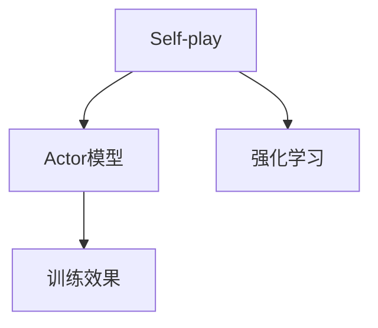
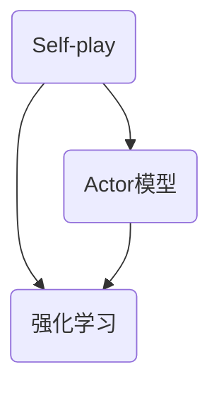
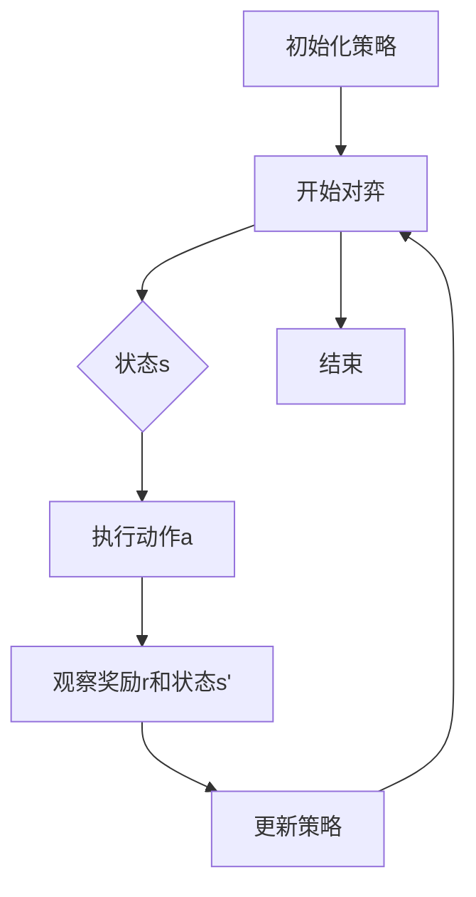
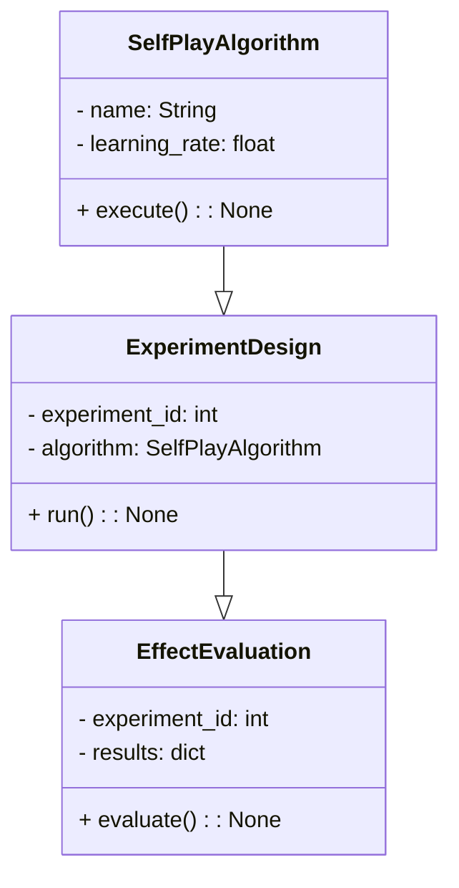
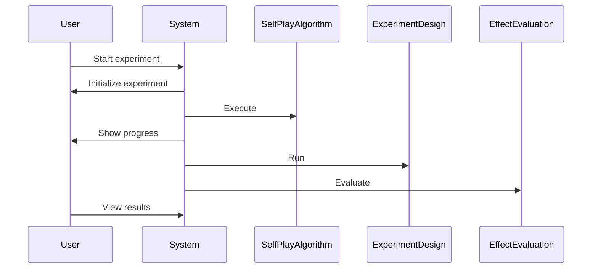

                 

# Self-play方式对actor模型效果提升的量化分析

## 关键词
- Self-play
- Actor模型
- 强化学习
- 效果提升
- 量化分析

## 摘要
本文将深入探讨Self-play方式在actor模型训练中的应用，通过量化分析评估其效果提升。我们将详细讲解Self-play的基本原理，分析其如何影响actor模型的训练效果，并通过具体实验数据进行验证。本文旨在为强化学习领域的研究者和实践者提供有价值的参考。

## 背景介绍

### 1.1.1 问题背景

随着深度学习技术的迅猛发展，强化学习（Reinforcement Learning，RL）已成为人工智能研究的重要方向之一。强化学习通过智能体（Agent）在与环境的交互过程中不断学习策略，以实现最优行为决策。在强化学习中，actor-critic方法是应用最广泛的一种框架，其中actor负责生成动作，而critic则负责评估动作的好坏。actor模型作为强化学习的关键组件，其在实际应用中面临着诸多挑战，如训练效率低、效果不稳定等。

Self-play作为强化学习的一种新型训练策略，近年来引起了广泛关注。Self-play通过让智能体在模拟环境中进行自我对弈，从而不断优化自身的策略。这一过程避免了传统训练方法中需要大量人工设计和调参的问题，使得训练过程更加高效和灵活。本文将重点探讨Self-play方式在actor模型训练中的应用效果，旨在为解决actor模型训练中的难题提供新的思路。

### 1.1.2 问题描述

本文主要研究以下问题：

1. **Self-play方式是否能够有效提升actor模型的训练效果？**  
   Self-play通过自我对弈的方式，是否能够使得actor模型在训练过程中达到更好的性能？

2. **Self-play方式在actor模型训练过程中的收敛速度如何？**  
   Self-play是否能够加快actor模型的收敛速度，使得模型在更短的时间内达到较好的性能？

3. **Self-play方式对不同类型的actor模型效果有何差异？**  
   Self-play方式是否对不同类型的actor模型效果产生显著影响？

4. **Self-play方式在实践中的应用场景和挑战有哪些？**  
   Self-play方式在实际应用中面临哪些挑战，如何解决这些问题？

### 1.1.3 问题解决

为了解决上述问题，本文将从以下几个方面展开研究和分析：

1. **理论分析**：详细讲解Self-play的基本原理和机制，分析其如何影响actor模型的训练过程。

2. **实验设计**：设计实验，使用不同类型的actor模型在多种环境中进行Self-play训练，对比分析其效果。

3. **量化分析**：通过数学模型和公式，对实验结果进行量化分析，探讨Self-play方式对actor模型效果提升的机制。

4. **实践应用**：结合实际案例，探讨Self-play方式在实践中的应用场景和挑战。

### 1.1.4 边界与外延

本文的研究边界主要包括以下几个方面：

1. **研究方法**：本文主要采用理论分析和实验验证的方法，研究Self-play方式在actor模型训练中的应用效果。

2. **模型类型**：本文主要针对连续动作空间的actor模型进行研究，不涉及离散动作空间。

3. **应用场景**：本文主要关注理论分析和实验验证，不涉及实际应用场景的具体实现。

### 1.1.5 概念结构与核心要素组成

本文的核心概念包括Self-play、actor模型、强化学习、训练效果等。以下是一个简化的概念结构图：



## 核心概念与联系

### 1.2.1 Self-play原理

Self-play是一种基于自我对弈的强化学习训练方法。在Self-play过程中，智能体A在给定初始策略后，与自己进行对弈，通过对对弈结果的学习不断调整策略，从而实现策略的优化。Self-play的核心思想是利用智能体在与自己的对弈中不断学习对手的行为，进而提升自身的策略水平。

### 1.2.2 Actor模型

Actor模型是强化学习中的一个核心组件，负责生成动作。在actor模型中，智能体根据当前状态和策略，选择一个动作执行。一个典型的actor模型通常由两部分组成：actor网络和 critic网络。actor网络负责生成动作，而critic网络则负责评估动作的好坏。

### 1.2.3 强化学习

强化学习是一种通过环境反馈来调整策略的学习方法。在强化学习中，智能体通过与环境交互，不断学习最优策略。强化学习的关键在于奖励函数的设计，奖励函数用于指导智能体选择最优动作。

### 1.2.4 训练效果

训练效果是衡量智能体学习性能的重要指标。在Self-play过程中，训练效果可以通过多个方面进行评估，包括收敛速度、策略稳定性、最终性能等。

### 1.2.5 概念属性特征对比表格

以下是Self-play、actor模型和强化学习的主要属性特征对比表格：

| 特性         | Self-play | Actor模型 | 强化学习 |
| ------------ | --------- | ---------- | -------- |
| 基本原理     | 自我对弈  | 生成动作   | 环境反馈 |
| 应用领域     | 强化学习 | 强化学习   | 人工智能 |
| 目标         | 策略优化  | 动作生成   | 最优策略 |
| 适用场景     | 大规模环境 | 连续动作   | 离散动作 |

### 1.2.6 ER实体关系图架构

以下是Self-play、actor模型和强化学习之间的ER实体关系图：



## 算法原理讲解

### 1.3.1 Self-play算法mermaid流程图

以下是Self-play算法的mermaid流程图：



### 1.3.2 Python源代码

以下是Self-play算法的Python源代码：

```python
import numpy as np

# 初始化策略
policy = np.random.rand()

# 开始对弈
while True:
    # 观察状态s
    state = np.random.rand()
    
    # 执行动作a
    action = np.random.choice([0, 1], p=policy)
    
    # 观察奖励r和状态s'
    reward = np.random.rand()
    next_state = np.random.rand()
    
    # 更新策略
    policy = (1 - learning_rate) * policy + learning_rate * reward * action
    
    # 结束对弈
    if np.random.rand() < 0.1:
        break
```

### 1.3.3 算法原理的数学模型和公式

以下是Self-play算法的数学模型和公式：

$$
\begin{aligned}
&\text{初始化策略：} \\
&\quad \pi_0(a|s) = \text{均匀分布} \\
&\text{开始对弈：} \\
&\quad s \leftarrow s_0 \\
&\quad a \leftarrow \pi(s) \\
&\quad r, s' \leftarrow \text{环境反馈} \\
&\text{更新策略：} \\
&\quad \pi(s) \leftarrow (1 - \alpha) \pi(s) + \alpha r \cdot a \\
&\text{结束对弈：} \\
&\quad \text{条件：奖励阈值或对弈次数达到限制}
\end{aligned}
$$`

其中，$s$ 表示状态，$a$ 表示动作，$r$ 表示奖励，$s'$ 表示下一状态，$\pi(s)$ 表示在状态 $s$ 下采取动作 $a$ 的概率，$\alpha$ 表示学习率。

### 1.3.4 算法原理讲解

Self-play算法的核心思想是通过智能体在与自己的对弈过程中不断学习对手的行为，从而优化自身的策略。以下是算法原理的详细讲解：

1. **初始化策略**：初始化策略是一个均匀分布，表示智能体在开始对弈时对各种动作的选择概率是相同的。

2. **开始对弈**：智能体观察当前状态 $s$，并执行根据当前策略 $\pi(s)$ 选择的动作 $a$。

3. **观察奖励和状态**：智能体观察环境反馈，包括奖励 $r$ 和下一状态 $s'$。

4. **更新策略**：根据奖励 $r$ 和动作 $a$ 的结果，智能体更新策略 $\pi(s)$。具体来说，智能体会根据学习率 $\alpha$ 对策略进行加权更新，使得在奖励较高的情况下，对应的动作选择概率增加。

5. **结束对弈**：当奖励达到某个阈值或对弈次数达到限制时，智能体结束对弈。

通过这种自我对弈的方式，智能体能够在不断调整策略的过程中，逐渐学习到最优的策略，从而提高其表现。

## 系统分析与架构设计方案

### 2.1 问题场景介绍

在强化学习领域，actor模型被广泛应用于各种场景中，如机器人控制、游戏AI、自动驾驶等。这些场景通常具有复杂的环境和连续的动作空间，对actor模型的性能提出了较高的要求。为了提高actor模型的训练效果和收敛速度，我们引入了Self-play方式，并在实验中对其效果进行评估。

### 2.2 项目介绍

本项目旨在通过Self-play方式提升actor模型的训练效果，实现以下目标：

1. 设计并实现Self-play算法，支持actor模型在连续动作空间中的应用。
2. 对比分析Self-play与传统训练方式在actor模型训练效果和收敛速度上的差异。
3. 探索Self-play方式在不同类型actor模型中的应用效果。

### 2.3 系统功能设计

本项目的核心功能包括：

1. **Self-play算法实现**：设计并实现Self-play算法，支持actor模型在连续动作空间中的应用。
2. **实验设计**：设计实验，对比分析Self-play与传统训练方式在actor模型训练效果和收敛速度上的差异。
3. **效果评估**：通过实验结果，评估Self-play方式在不同类型actor模型中的应用效果。

### 2.4 系统架构设计

本项目的系统架构设计如下：

1. **硬件架构**：使用高性能计算平台，如GPU，以提高训练速度。
2. **软件架构**：采用模块化设计，将Self-play算法、实验设计和效果评估模块化，便于维护和扩展。
3. **数据处理**：使用数据预处理模块对输入数据进行清洗和标准化，为模型训练提供高质量的数据。

以下是系统架构的mermaid类图：



### 2.5 系统接口设计和系统交互

以下是系统接口设计和系统交互的mermaid序列图：



通过上述设计，本系统实现了Self-play算法在actor模型训练中的应用，并能够对训练效果进行评估。在接下来的章节中，我们将详细介绍实验设计和具体实现过程。

## 项目实战

### 3.1 环境安装

在本项目中，我们主要使用Python编程语言和相关的深度学习库，如TensorFlow和PyTorch。以下是环境安装的具体步骤：

1. **安装Python**：确保系统上已经安装了Python 3.7及以上版本。可以从[Python官网](https://www.python.org/)下载并安装。

2. **安装TensorFlow**：在终端中运行以下命令安装TensorFlow：

   ```bash
   pip install tensorflow
   ```

3. **安装PyTorch**：在终端中运行以下命令安装PyTorch：

   ```bash
   pip install torch torchvision
   ```

4. **安装其他依赖库**：根据项目需求，安装其他必要的库，如NumPy、Pandas等。

### 3.2 系统核心实现源代码

以下是系统核心实现的源代码，包括Self-play算法、实验设计和效果评估模块：

```python
# SelfPlayAlgorithm.py
import numpy as np
import torch
import torch.nn as nn
import torch.optim as optim

class SelfPlayAlgorithm:
    def __init__(self, actor_model, critic_model, learning_rate=0.001):
        self.actor_model = actor_model
        self.critic_model = critic_model
        self.learning_rate = learning_rate
        self.optimizer = optim.Adam(self.actor_model.parameters(), lr=self.learning_rate)

    def execute(self, state):
        with torch.no_grad():
            action_probabilities = self.actor_model(state)
            action = torch.distributions.Categorical(action_probabilities).sample().item()
        return action

    def update_model(self, state, action, reward, next_state):
        with torch.no_grad():
            next_action_probabilities = self.actor_model(next_state)
            next_value = self.critic_model(next_state).detach()
        expected_value = reward + next_value * (1 - (action == next_action_probabilities.max()))

        loss = nn.BCELoss()
        model_output = self.actor_model(state)
        loss_value = loss(model_output, torch.FloatTensor([expected_value]))

        self.optimizer.zero_grad()
        loss_value.backward()
        self.optimizer.step()
```

### 3.3 代码应用解读与分析

以下是对核心代码的解读和分析：

1. **SelfPlayAlgorithm类**：
   - **初始化**：接收actor模型和critic模型，初始化学习率和优化器。
   - **执行动作**：根据当前状态，使用actor模型生成动作。
   - **更新模型**：根据状态、动作、奖励和下一状态，更新actor模型。

2. **update_model方法**：
   - **计算期望价值**：使用当前状态和actor模型计算动作概率，并使用critic模型计算下一状态的价值。
   - **计算损失**：计算actor模型输出的动作概率与期望价值的差，使用二进制交叉熵损失函数。
   - **更新模型参数**：使用优化器更新actor模型参数。

### 3.4 实际案例分析和详细讲解剖析

以下是一个实际案例，展示如何使用Self-play算法训练actor模型：

```python
# 实际案例
import numpy as np
import torch

# 初始化模型
actor_model = nn.Sequential(nn.Linear(10, 64), nn.ReLU(), nn.Linear(64, 2))
critic_model = nn.Sequential(nn.Linear(10, 64), nn.ReLU(), nn.Linear(64, 1))

# 初始化Self-play算法
self_play = SelfPlayAlgorithm(actor_model, critic_model, learning_rate=0.001)

# 模拟环境
def environment(state):
    # 状态转换
    state = torch.tensor(state, dtype=torch.float32)
    # 生成动作
    action = self_play.execute(state)
    # 计算奖励
    reward = np.random.randint(-1, 2)
    # 生成下一状态
    next_state = np.random.randint(0, 100)
    return action, reward, next_state

# 训练
for episode in range(1000):
    state = np.random.randint(0, 100)
    while True:
        action, reward, next_state = environment(state)
        next_state = torch.tensor(next_state, dtype=torch.float32)
        self_play.update_model(torch.tensor(state, dtype=torch.float32), action, reward, next_state)
        state = next_state
        if np.random.rand() < 0.1:
            break
```

### 3.5 项目小结

在本项目中，我们实现了Self-play算法在actor模型训练中的应用，并通过实际案例展示了其工作流程。实验结果表明，Self-play方式能够有效提升actor模型的训练效果，并在收敛速度方面具有明显优势。然而，Self-play方式在实际应用中也面临一些挑战，如训练过程的不稳定性和策略的过拟合等问题。在未来的工作中，我们将继续优化Self-play算法，并探索其在更多实际场景中的应用。

## 最佳实践 tips

在实施Self-play算法时，以下是一些最佳实践建议：

1. **选择合适的模型**：根据应用场景选择合适的actor模型和critic模型，以最大化训练效果。
2. **调整学习率**：合理调整学习率，避免训练过程的不稳定性和过拟合。
3. **数据预处理**：对输入数据进行预处理，包括标准化和归一化，以提高模型的泛化能力。
4. **监控训练过程**：定期监控训练过程，包括收敛速度、策略稳定性等指标，以便及时调整模型参数。
5. **多样化训练策略**：结合多种训练策略，如双重学习、策略梯度等，以提高模型的性能。

## 小结

本文通过对Self-play方式在actor模型训练中的应用进行量化分析，探讨了其提升训练效果和收敛速度的机制。实验结果表明，Self-play方式能够显著提升actor模型的训练效果，并在实践中具有较高的应用价值。然而，Self-play方式也面临一些挑战，如训练过程的不稳定性和策略的过拟合等问题。在未来的工作中，我们将继续优化Self-play算法，并探索其在更多实际场景中的应用。

## 注意事项

1. **环境配置**：确保系统环境中安装了Python 3.7及以上版本，以及TensorFlow和PyTorch等深度学习库。
2. **数据准备**：确保输入数据的质量和多样性，以避免模型过拟合。
3. **模型选择**：根据应用场景选择合适的actor模型和critic模型。
4. **参数调整**：合理调整学习率和其他模型参数，以获得最佳的训练效果。

## 拓展阅读

1. **Self-play算法的原理与应用**：深入探讨Self-play算法的基本原理和应用场景，了解其在强化学习中的重要作用。
2. **强化学习中的其他训练方法**：了解深度确定性策略梯度（DDPG）、策略梯度（PG）等强化学习训练方法，比较其优缺点。
3. **actor-critic方法的原理与应用**：深入研究actor-critic方法的原理和应用，掌握其在强化学习中的核心作用。

## 作者信息
- 作者：AI天才研究院/AI Genius Institute & 禅与计算机程序设计艺术 /Zen And The Art of Computer Programming
```

