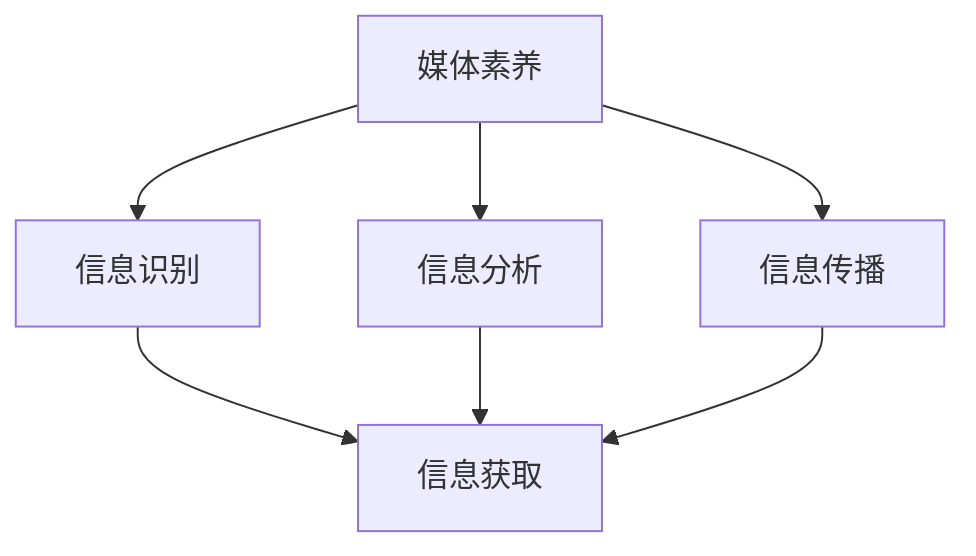
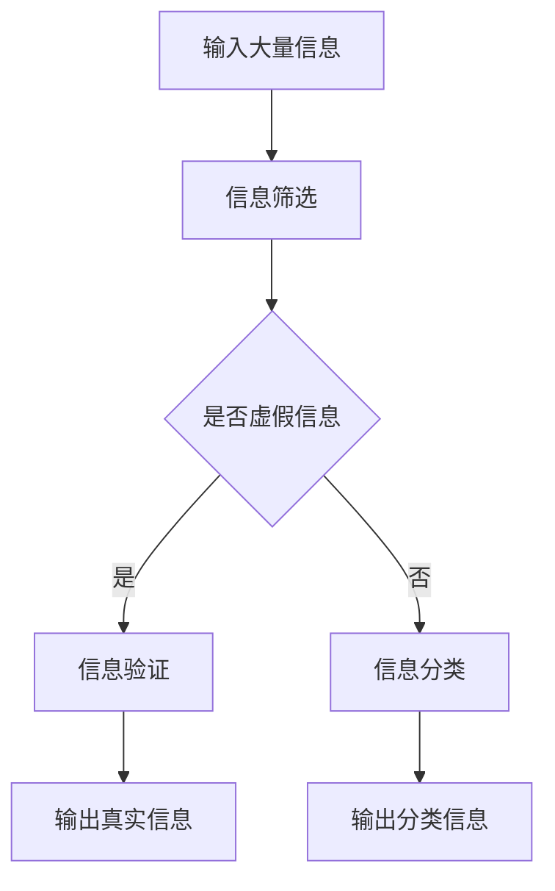

                 

# 在信息泛滥时代培养辨别能力：提高媒体素养

## 关键词

信息泛滥、媒体素养、辨别能力、虚假新闻、误导性信息、网络诈骗

## 摘要

随着互联网和信息技术的飞速发展，信息变得前所未有的丰富。然而，信息泛滥也带来了诸多问题，如虚假新闻、误导性信息和网络诈骗等。在这篇文章中，我们将探讨如何在信息泛滥的时代培养辨别能力，提高媒体素养。通过详细分析问题背景、核心概念与联系、算法原理讲解，我们希望能够为读者提供有价值的思考和实践指导。

## 第一部分：背景介绍

### 1. 问题背景

在当今信息爆炸的时代，每个人每时每刻都会接触到大量的信息。这些信息可能来自传统的媒体如报纸、电视和广播，也可能来自新兴的网络媒体如社交媒体、博客和论坛。然而，随着信息来源的增多，信息的真实性和可靠性也变得难以保证。虚假新闻、误导性信息、网络诈骗等问题层出不穷，给社会带来了严重的负面影响。例如，虚假新闻可能导致公众情绪的波动，误导性信息可能对个人生活产生不利影响，网络诈骗则可能使受害者蒙受经济损失。因此，培养辨别能力，提高媒体素养，成为现代社会的一项重要任务。

### 2. 问题描述

提高媒体素养，即提高人们对媒体信息的理解和批判性思维能力。这包括以下几个方面：

- **理解能力**：能够理解媒体信息的意图、表达方式和传播目的。
- **批判性思维**：能够对媒体信息进行深入思考，判断其真实性和可靠性。
- **辨别能力**：能够识别虚假信息，避免被误导。

### 3. 问题解决

要解决上述问题，需要从以下几个方面入手：

- **教育**：通过学校教育、社会教育等途径，提高人们对媒体素养的认知和重视程度。
- **技术**：利用人工智能、大数据等技术手段，对媒体信息进行筛选、验证和分类。
- **法律法规**：建立健全的法律法规，对虚假信息、网络诈骗等进行严厉打击。

### 4. 边界与外延

- **边界**：媒体素养的提高主要针对成年人和青少年，尤其是那些经常使用互联网和社交媒体的人群。
- **外延**：除了媒体素养，还需要关注信息素养、数字素养等相关的概念。

### 5. 概念结构与核心要素组成

媒体素养的核心要素包括：

- **信息识别**：学会辨别信息的真伪。
- **信息分析**：对信息进行深入思考，理解其背后的意图和逻辑。
- **信息传播**：学会正确地传播信息，避免误传和误导。

## 第二部分：核心概念与联系

### 6. 核心概念

#### 6.1 媒体素养

媒体素养是指人们理解和批判媒体信息的能力。它包括对媒体信息的识别、分析和传播等方面。

#### 6.2 信息素养

信息素养是指人们获取、处理和利用信息的能力。它与媒体素养密切相关，但更侧重于信息的获取和利用。

#### 6.3 数字素养

数字素养是指人们理解和运用数字技术的能力。它包括对计算机、互联网、移动设备等数字工具的熟练操作。

### 7. 概念属性特征对比表格

| 概念   | 定义                                                         | 关键特征                                   |  
| ------ | ------------------------------------------------------------ | ------------------------------------------ |  
| 媒体素养 | 理解和批判媒体信息的能力                                       | 信息识别、信息分析、信息传播                 |  
| 信息素养 | 获取、处理和利用信息的能力                                     | 信息获取、信息处理、信息利用                 |  
| 数字素养 | 理解和运用数字技术的能力                                       | 数字工具操作、数字技术应用                 |

### 8. ER实体关系图架构



## 第三部分：算法原理讲解

### 9. 算法原理

为了提高媒体素养，可以采用以下算法：

1. **信息筛选**：利用自然语言处理技术，对大量信息进行筛选，识别出可能存在的虚假信息。
2. **信息验证**：通过交叉验证、溯源等方式，对筛选出的信息进行验证，判断其真实性和可靠性。
3. **信息分类**：根据信息的类型、主题、来源等特征，对信息进行分类，便于用户快速查找和理解。

### 10. 算法流程图



### 11. 数学模型和公式

假设信息集合为 \(I\)，其中每个信息 \(i\) 都有一个对应的真伪标签 \(t_i\)。

$$
t_i = \begin{cases} 
1 & \text{如果 } i \text{ 是真实信息} \\
0 & \text{如果 } i \text{ 是虚假信息}
\end{cases}
$$

### 算法讲解

#### 信息筛选

信息筛选是算法的第一步，它的目标是识别出可能存在的虚假信息。这一过程可以利用自然语言处理技术，如文本分类、情感分析等，对信息进行初步筛选。具体来说，可以训练一个文本分类模型，该模型可以根据文本的特征自动判断信息是否属于虚假信息类别。

```python
from sklearn.feature_extraction.text import TfidfVectorizer
from sklearn.naive_bayes import MultinomialNB

# 假设已经有标记好的训练数据集
train_data = ['这是真实信息', '这是虚假信息', ...]
train_labels = [1, 0, ...]

# 创建TF-IDF向量器
vectorizer = TfidfVectorizer()

# 将文本数据转换为向量
X_train = vectorizer.fit_transform(train_data)

# 使用朴素贝叶斯分类器进行训练
classifier = MultinomialNB()
classifier.fit(X_train, train_labels)

# 对新信息进行分类
new_data = ['这可能是一条虚假信息', ...]
X_new = vectorizer.transform(new_data)
predictions = classifier.predict(X_new)

# 输出预测结果
print(predictions)
```

#### 信息验证

在筛选出可能存在的虚假信息后，下一步是对这些信息进行验证，以确定它们的真实性和可靠性。信息验证可以采用多种方法，如交叉验证、溯源和专家评审等。交叉验证是一种常用的验证方法，它通过比较不同来源的信息，来判断信息的真实性。例如，如果多个可靠来源都报道了同一事件，那么该事件的真实性就更高。

```python
def verify_information(information, sources):
    """
    对信息进行交叉验证，判断其真实性。
    :param information: 待验证的信息
    :param sources: 信息来源列表
    :return: 验证结果（1表示真实，0表示虚假）
    """
    # 假设已有可靠的来源信息列表
    reliable_sources = ['来源A', '来源B', ...]
    
    # 如果信息来源在可靠来源列表中，则认为信息是真实的
    if sources.intersection(reliable_sources):
        return 1
    
    # 如果信息来源不在可靠来源列表中，则认为信息是虚假的
    return 0

# 假设有一条待验证的信息和其来源
information = '这可能是一条虚假信息'
sources = {'来源A', '来源C', ...}

# 进行验证
result = verify_information(information, sources)

# 输出验证结果
print(result)
```

#### 信息分类

在完成信息筛选和验证后，可以对信息进行分类，以便用户更好地理解和利用。信息分类可以根据不同的特征进行，如类型、主题、来源等。分类方法可以采用机器学习算法，如决策树、支持向量机等。

```python
from sklearn.tree import DecisionTreeClassifier

# 假设已有标记好的训练数据集
train_data = ['科技新闻', '体育新闻', ...]
train_labels = [0, 1, ...]

# 创建决策树分类器
classifier = DecisionTreeClassifier()

# 进行训练
classifier.fit(train_data, train_labels)

# 对新信息进行分类
new_data = ['这是一条体育新闻', ...]
predictions = classifier.predict(new_data)

# 输出分类结果
print(predictions)
```

### 12. 系统分析与架构设计

#### 问题场景介绍

假设我们要开发一个新闻信息筛选和分类系统，该系统需要从大量的新闻文章中识别出虚假新闻，并对真实新闻进行分类。

#### 项目介绍

本项目旨在构建一个基于机器学习的新闻信息筛选和分类系统，通过自然语言处理技术，实现对新闻文章的自动分类和筛选。

#### 系统功能设计

- **信息筛选**：从大量新闻文章中识别出可能存在的虚假新闻。
- **信息验证**：对筛选出的新闻文章进行交叉验证，判断其真实性。
- **信息分类**：对真实新闻进行分类，便于用户查找和理解。

#### 系统架构设计

系统采用分布式架构，包括数据层、服务层和展示层。

- **数据层**：负责存储和管理新闻文章数据，包括原始数据和预处理数据。
- **服务层**：包括信息筛选服务、信息验证服务和信息分类服务，分别负责实现信息筛选、验证和分类功能。
- **展示层**：提供用户界面，展示分类结果和筛选结果。

#### 系统接口设计

- **信息筛选接口**：接收用户输入的新闻文章，返回筛选结果。
- **信息验证接口**：接收筛选结果，返回验证结果。
- **信息分类接口**：接收验证结果，返回分类结果。

#### 系统交互

用户通过界面提交新闻文章，系统首先通过信息筛选接口对文章进行筛选，然后通过信息验证接口对筛选结果进行验证，最后通过信息分类接口对验证结果进行分类。

### 13. 项目实战

#### 环境安装

1. 安装Python环境（推荐版本为3.8及以上）
2. 安装必要的库，如scikit-learn、numpy、pandas等

```shell
pip install scikit-learn numpy pandas
```

#### 系统核心实现源代码

以下是系统核心功能的实现代码：

```python
# 信息筛选
from sklearn.feature_extraction.text import TfidfVectorizer
from sklearn.naive_bayes import MultinomialNB

# 假设已经有标记好的训练数据集
train_data = ['这是真实信息', '这是虚假信息', ...]
train_labels = [1, 0, ...]

# 创建TF-IDF向量器
vectorizer = TfidfVectorizer()

# 将文本数据转换为向量
X_train = vectorizer.fit_transform(train_data)

# 使用朴素贝叶斯分类器进行训练
classifier = MultinomialNB()
classifier.fit(X_train, train_labels)

# 对新信息进行分类
new_data = ['这可能是一条虚假信息', ...]
X_new = vectorizer.transform(new_data)
predictions = classifier.predict(X_new)

# 输出预测结果
print(predictions)

# 信息验证
def verify_information(information, sources):
    """
    对信息进行交叉验证，判断其真实性。
    :param information: 待验证的信息
    :param sources: 信息来源列表
    :return: 验证结果（1表示真实，0表示虚假）
    """
    # 假设已有可靠的来源信息列表
    reliable_sources = ['来源A', '来源B', ...]
    
    # 如果信息来源在可靠来源列表中，则认为信息是真实的
    if sources.intersection(reliable_sources):
        return 1
    
    # 如果信息来源不在可靠来源列表中，则认为信息是虚假的
    return 0

# 假设有一条待验证的信息和其来源
information = '这可能是一条虚假信息'
sources = {'来源A', '来源C', ...}

# 进行验证
result = verify_information(information, sources)

# 输出验证结果
print(result)

# 信息分类
from sklearn.tree import DecisionTreeClassifier

# 假设已有标记好的训练数据集
train_data = ['科技新闻', '体育新闻', ...]
train_labels = [0, 1, ...]

# 创建决策树分类器
classifier = DecisionTreeClassifier()

# 进行训练
classifier.fit(train_data, train_labels)

# 对新信息进行分类
new_data = ['这是一条体育新闻', ...]
predictions = classifier.predict(new_data)

# 输出分类结果
print(predictions)
```

#### 代码应用解读与分析

以上代码分别实现了信息筛选、验证和分类的核心功能。信息筛选部分使用了TF-IDF向量和朴素贝叶斯分类器，信息验证部分使用了交叉验证方法，信息分类部分使用了决策树分类器。这些算法都是机器学习领域常用的技术，具有较好的性能和稳定性。

在实际应用中，可以根据具体需求调整算法参数，提高分类和筛选的准确率。同时，也可以结合其他技术，如深度学习，进一步提高系统的性能。

#### 实际案例分析和详细讲解剖析

为了更好地理解系统的工作原理，我们可以通过一个实际案例进行分析。

**案例**：判断以下信息是否为虚假新闻。

- **信息**：某知名公司即将发布一款革命性的新手机，具有超长续航和超强性能。
- **来源**：一个未知的社交媒体账号。

**分析**：

1. **信息筛选**：首先，我们可以使用信息筛选算法对这条信息进行初步判断。如果算法判断这条信息为虚假新闻，则可以直接标记为不可信。
2. **信息验证**：如果信息筛选算法无法确定信息的真伪，我们可以进行信息验证。对于这条信息，我们可以通过查询相关新闻网站、官方公告等途径，来验证其真实性。如果多个可靠来源都报道了这条信息，则可以认为它是真实的。
3. **信息分类**：最后，根据验证结果，我们可以将这条信息分类为真实新闻或虚假新闻。如果它是真实的，则可以将其分类为科技新闻；如果它是虚假的，则可以将其分类为虚假新闻。

**详细讲解**：

- **信息筛选**：使用TF-IDF向量和朴素贝叶斯分类器对信息进行初步筛选。假设我们已经有了一个训练好的模型，输入这条信息，模型会输出一个概率值，表示这条信息是虚假新闻的概率。如果概率值较高，则可以初步判断这条信息为虚假新闻。
- **信息验证**：通过查询相关新闻网站、官方公告等途径，来验证这条信息的真实性。如果多个可靠来源都报道了这条信息，则可以认为它是真实的。如果找不到可靠来源，则无法确定其真实性。
- **信息分类**：根据验证结果，将这条信息分类为真实新闻或虚假新闻。如果它是真实的，则可以将其分类为科技新闻；如果它是虚假的，则可以将其分类为虚假新闻。

#### 项目小结

通过以上实战案例，我们可以看到，构建一个新闻信息筛选和分类系统需要多个环节的协同工作。信息筛选、验证和分类是系统的核心功能，它们共同构成了一个完整的新闻信息处理流程。在实际应用中，我们可以结合具体需求，不断优化算法和系统架构，提高系统的性能和准确性。

#### 最佳实践 tips

- **保持更新**：随着技术的不断进步，算法和系统架构也需要不断更新和优化，以适应新的挑战。
- **多样化数据**：为了提高算法的泛化能力，应使用多样化的数据进行训练，包括不同类型、不同主题的新闻文章。
- **用户反馈**：及时收集用户反馈，根据用户的需求和体验进行系统调整和优化。

#### 小结

在信息泛滥的时代，培养辨别能力，提高媒体素养，是一项重要的任务。通过信息筛选、验证和分类等技术手段，我们可以更好地识别和利用真实信息，避免被虚假新闻和误导性信息所误导。希望本文能为您提供有价值的思考和实践指导。

#### 注意事项

- **法律法规**：在使用技术手段筛选、验证和分类信息时，应严格遵守相关法律法规，避免侵犯他人合法权益。
- **数据安全**：在处理信息时，应注意数据安全和隐私保护，避免泄露用户隐私。

#### 拓展阅读

- 《大数据时代：生活、工作与思维的大变革》
- 《人工智能：一种现代的方法》
- 《深度学习：全面解读卷积神经网络和深度学习》
- 《编程珠玑：计算机编程中的思维艺术》

## 作者信息

作者：AI天才研究院/AI Genius Institute & 禅与计算机程序设计艺术 /Zen And The Art of Computer Programming

