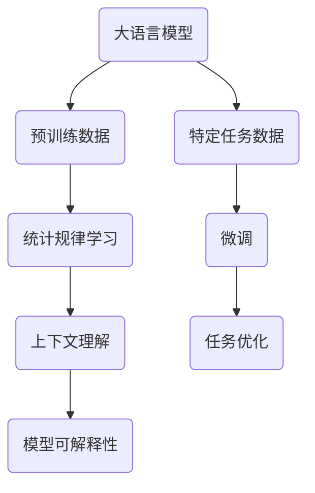

                 

# 大语言模型在医疗影像辅助诊断中的推理应用

## 关键词

- 大语言模型
- 医疗影像辅助诊断
- 推理应用
- 医疗数据预处理
- 多模态融合

## 摘要

本文将探讨大语言模型在医疗影像辅助诊断中的应用。首先，我们介绍了医疗影像辅助诊断的背景和挑战，以及大语言模型的基本原理和医疗领域的潜在应用。接着，我们详细阐述了大语言模型在推理应用中的工作原理，包括语言模型的构建、推理算法和效率评估。随后，我们分析了大语言模型在医疗影像辅助诊断中的具体应用场景，如肿瘤检测、疾病预测和药物推荐。接着，我们介绍了大语言模型在医疗影像辅助诊断中的实现方法，包括实现框架和关键技术。最后，我们探讨了大语言模型在医疗影像辅助诊断中的挑战和未来发展，以及最佳实践和注意事项。

### 目录大纲

```

----------------------------------------------------------------

# 第一部分：问题背景与核心概念

## 第1章：问题背景与核心概念

### 1.1 问题背景

#### 1.1.1 医疗影像辅助诊断的挑战与需求

医疗影像诊断是现代医学中不可或缺的一部分，通过X光、CT、MRI等手段获取的影像资料可以帮助医生更直观地了解病患的病情，从而作出准确的诊断。然而，随着医疗影像技术的发展，医疗影像数据的数量和复杂性也在不断增加，这对医生的诊断能力提出了新的挑战。

**问题描述**：
- **主观性强**：传统医疗影像诊断依赖于医生的经验和专业知识，主观性较强，容易出现误诊或漏诊。
- **诊断时间长**：医疗影像的解读需要耗费大量时间，导致诊断效率低下。
- **信息处理能力有限**：医生无法同时处理大量影像数据，容易错过重要的诊断信息。

**问题解决**：
- **引入大语言模型**：通过机器学习和人工智能技术，大语言模型可以在处理自然语言数据的基础上，对医疗影像数据进行深入分析和理解，从而提高诊断的准确性和效率。

**边界与外延**：
- **医疗影像范围**：包括X光、CT、MRI等多种影像类型。
- **应用边界**：疾病检测、疾病预测、治疗方案设计等。

#### 1.1.2 大语言模型在医疗领域的潜在应用

大语言模型，如GPT（Generative Pre-trained Transformer）和BERT（Bidirectional Encoder Representations from Transformers），通过预训练和微调，可以在多种领域发挥强大的作用。在医疗领域，大语言模型具有巨大的潜力，可以应用于以下方面：

- **辅助医生理解影像报告**：大语言模型可以生成自然语言描述，帮助医生快速理解影像报告。
- **生成诊断建议**：基于对海量医学文献和病例数据的分析，大语言模型可以为医生提供诊断建议。
- **辅助科研**：大语言模型可以分析大量医学文献，提取关键信息，辅助科研人员进行研究。

**核心概念**：
- **大语言模型**：基于深度学习和神经网络技术，通过大规模预训练和微调，掌握自然语言的内在规律。
- **医疗数据**：包括医学影像、病历记录、文献资料等。

**联系**：
- **数据与模型结合**：大语言模型通过处理医疗数据，实现对医学知识的学习和理解，进而应用于辅助诊断和治疗方案设计。

### 1.2 核心概念

#### 1.2.1 大语言模型的基本原理

大语言模型的核心是基于深度学习的神经网络结构，特别是Transformer模型。这些模型通过预训练大规模语言数据，使得其能够理解和生成自然语言。以下是几个关键概念：

- **预训练**：通过在大规模语料库上进行预训练，模型学习到自然语言的统计规律和语法结构。
- **微调**：在特定任务上，对模型进行微调，使得其能够针对特定领域的任务进行优化。
- **上下文理解**：通过Transformer模型的自注意力机制，模型能够捕捉到文本中的长距离依赖关系，从而更好地理解上下文。

**属性特征对比表格**：

| 特征 | 描述 |
| --- | --- |
| 尺度 | 大模型处理的数据量庞大 |
| 自适应性 | 能够适应多种文本数据 |
| 训练时间 | 需要大量计算资源 |
| 可解释性 | 模型决策过程具有一定的可解释性 |

**ER实体关系图架构**：



#### 1.2.2 医疗影像辅助诊断相关概念

在医疗影像辅助诊断中，几个关键概念需要明确：

- **影像数据**：指通过医疗影像设备获取的数字图像数据。
- **标注数据**：指对影像数据进行人工标注，用于训练和评估模型。
- **辅助诊断**：指利用算法和模型对影像数据进行自动分析，辅助医生进行诊断。
- **诊断建议**：指基于模型分析结果，为医生提供的诊断参考。

#### 1.2.3 大语言模型与医疗影像辅助诊断的结合

大语言模型与医疗影像辅助诊断的结合主要表现在以下几个方面：

- **影像报告生成**：大语言模型可以生成自然语言描述，辅助医生理解影像报告。
- **影像数据分类**：大语言模型可以学习影像数据的特征，进行分类和标注。
- **疾病预测**：大语言模型可以通过分析影像数据和病例数据，预测疾病的发生和进展。
- **治疗方案设计**：大语言模型可以结合医学知识库，为医生提供个性化的治疗方案。

综上所述，大语言模型在医疗影像辅助诊断中具有广阔的应用前景，能够显著提高诊断的准确性和效率。接下来，我们将详细探讨大语言模型的工作原理和其在推理应用中的关键技术。

## 第二部分：大语言模型的工作原理

### 第2章：大语言模型的工作原理

#### 2.1 大语言模型的基本原理

大语言模型（如GPT、BERT等）是深度学习和自然语言处理领域的一项重要技术。它们通过预训练和微调，能够理解和生成自然语言，从而在多个领域（包括医疗领域）发挥重要作用。本节将介绍大语言模型的基本原理和核心组件。

#### 2.1.1 语言模型的构建

语言模型的构建主要包括数据收集、数据预处理和模型训练三个步骤。

1. **数据收集**：
   语言模型需要大量的文本数据作为训练素材。这些数据可以来自互联网上的各种文本资料，如新闻文章、社交媒体帖子、科学论文等。

2. **数据预处理**：
   数据预处理包括文本清洗、分词、词嵌入等步骤。清洗文本数据可以去除噪声和冗余信息，提高模型的训练效果。分词是将文本分割成词语或字符，词嵌入则是将词语转换为稠密的向量表示。

3. **模型训练**：
   语言模型通常采用深度神经网络结构，如循环神经网络（RNN）、长短时记忆网络（LSTM）和变换器（Transformer）。训练过程中，模型通过优化损失函数，学习文本数据的统计规律和语义信息。

#### 2.1.2 大模型的结构与特点

大语言模型的结构通常包括以下几个关键组件：

1. **嵌入层**（Embedding Layer）：
   嵌入层将输入的词语转换为稠密的向量表示，这些向量表示了词语的语义信息。

2. **编码器**（Encoder）：
   编码器负责处理输入序列，提取序列的上下文信息。在Transformer模型中，编码器由多个自注意力层（Self-Attention Layer）组成，能够有效地捕捉长距离依赖关系。

3. **解码器**（Decoder）：
   解码器负责生成输出序列，通常由多个自注意力层和多头注意力层（Multi-Head Attention）组成，能够生成与输入序列相关的高质量输出。

大模型的特点主要包括：

- **大规模**：大模型通常具有数十亿甚至数万亿个参数，能够处理大规模的文本数据。
- **深度**：大模型通常包含多个隐藏层，能够学习更复杂的文本特征。
- **自适应性**：大模型能够通过预训练和微调，适应不同的任务和数据集。

#### 2.2 大语言模型在推理应用中的关键技术

大语言模型在推理应用中的关键技术包括推理过程、推理算法和效率评估。

##### 2.2.1 推理过程概述

推理过程是指大语言模型在给定输入序列时，生成输出序列的过程。推理过程主要包括以下几个步骤：

1. **输入序列编码**：
   将输入序列（如一个句子）转换为编码器层的输入向量。

2. **上下文信息提取**：
   编码器层通过自注意力机制，提取输入序列的上下文信息，生成编码器输出。

3. **输出序列生成**：
   解码器层利用编码器输出的上下文信息，逐个生成输出序列的词语或字符。

4. **输出序列解码**：
   将生成的输出序列解码为自然语言文本。

##### 2.2.2 推理算法详解

推理算法是指大语言模型在推理过程中使用的方法和策略。常见的推理算法包括：

1. **自注意力机制**（Self-Attention）：
   自注意力机制是Transformer模型的核心组件，能够有效地捕捉输入序列的上下文信息。自注意力计算公式如下：

   $$ 
   \text{Attention}(Q, K, V) = \text{softmax}\left(\frac{QK^T}{\sqrt{d_k}}\right)V 
   $$

   其中，$Q$、$K$ 和 $V$ 分别是查询向量、键向量和值向量，$d_k$ 是键向量的维度。

2. **多头注意力**（Multi-Head Attention）：
   多头注意力机制通过并行地应用多个自注意力机制，增强模型的上下文理解能力。多头注意力的计算公式如下：

   $$ 
   \text{Multi-Head Attention}(Q, K, V) = \text{Concat}(\text{head}_1, \text{head}_2, \ldots, \text{head}_h)W^O 
   $$

   其中，$h$ 是头数，$W^O$ 是输出投影矩阵。

3. **编码器-解码器结构**（Encoder-Decoder Structure）：
   编码器-解码器结构通过编码器和解码器的交互，实现对输入序列的编码和解码。编码器-解码器结构的计算公式如下：

   $$ 
   E = \text{Encoder}(X) \\
   Y = \text{Decoder}(Y, E) 
   $$

   其中，$X$ 是输入序列，$Y$ 是输出序列，$E$ 是编码器输出。

##### 2.2.3 推理效率与效果评估

推理效率是评估大语言模型性能的重要指标之一。推理效率可以通过以下方面进行优化：

1. **模型压缩**：
   模型压缩技术（如剪枝、量化、知识蒸馏等）可以减少模型的参数量和计算量，从而提高推理效率。

2. **硬件加速**：
   利用GPU、TPU等硬件加速器，可以显著提高大语言模型的推理速度。

3. **并发处理**：
   通过并行处理和多线程技术，可以提高大语言模型处理多个输入序列的效率。

效果评估是评估大语言模型性能的另一个重要方面。效果评估通常通过以下指标进行：

1. **准确率**（Accuracy）：
   准确率是模型预测正确的比例，是评估分类任务效果的重要指标。

2. **召回率**（Recall）：
   召回率是模型正确识别的正例样本数与所有正例样本数的比例，是评估检测任务效果的重要指标。

3. **F1分数**（F1 Score）：
   F1分数是准确率和召回率的加权平均，综合考虑了模型的分类效果。

通过优化推理效率和提升效果评估指标，大语言模型可以在医疗影像辅助诊断中发挥更大的作用。在下一部分，我们将探讨大语言模型在医疗影像辅助诊断中的具体应用。

## 第三部分：大语言模型在医疗影像辅助诊断中的推理应用

### 第3章：大语言模型在医疗影像辅助诊断中的推理应用

#### 3.1 医疗影像数据的预处理

在将大语言模型应用于医疗影像辅助诊断之前，需要对其进行预处理。预处理过程包括影像数据的读取、标注、数据增强和规范化。

##### 3.1.1 影像数据的读取与标注

影像数据的读取是指从原始影像文件中获取图像数据的过程。常见的影像格式包括DICOM、NIfTI等。读取过程需要使用专门的图像处理库，如PyDICOM、SimpleITK等。

标注是指对影像数据进行人工或自动标记，以便用于模型的训练和评估。人工标注通常由医学专家完成，而自动标注可以通过半监督学习方法实现，如利用现有的标注数据和未标注数据，通过对比学习等技术进行标注。

##### 3.1.2 数据增强与规范化

数据增强是指通过增加数据的多样性来提高模型的泛化能力。在医疗影像数据中，常用的数据增强技术包括：

- **旋转**：随机旋转影像数据。
- **缩放**：随机缩放影像数据。
- **裁剪**：随机裁剪影像数据。
- **对比度调整**：调整影像数据的对比度。

规范化是指通过调整影像数据的数值范围，使其适合模型的输入要求。常用的规范化方法包括归一化和标准化。归一化是将影像数据缩放到[0, 1]范围内，而标准化则是将影像数据缩放到均值为0、标准差为1的范围内。

##### 3.1.3 数据预处理的重要性

数据预处理是模型训练成功的关键步骤，其重要性体现在以下几个方面：

- **提高模型泛化能力**：通过数据增强，可以增加模型的训练数据多样性，从而提高模型的泛化能力。
- **减少过拟合**：规范化可以减少模型对特定数据的依赖，从而降低过拟合的风险。
- **提高训练效率**：预处理后的数据更加整齐和一致，可以加快模型的训练速度。

#### 3.2 大语言模型在影像辅助诊断中的应用场景

大语言模型在医疗影像辅助诊断中具有广泛的应用场景，包括肿瘤检测、疾病预测和药物推荐等。

##### 3.2.1 肿瘤检测

肿瘤检测是医疗影像辅助诊断的重要任务之一。大语言模型可以通过学习影像数据中的特征，实现对肿瘤的自动检测和分类。具体应用场景包括：

- **肺癌检测**：利用CT影像数据，大语言模型可以检测肺结节，判断其是否为恶性。
- **乳腺癌检测**：利用MRI影像数据，大语言模型可以检测乳腺肿瘤，辅助医生进行诊断。
- **脑肿瘤检测**：利用MRI和CT影像数据，大语言模型可以检测脑肿瘤，提高诊断的准确性。

##### 3.2.2 疾病预测

疾病预测是指通过分析医疗影像数据和病例数据，预测疾病的发生和进展。大语言模型可以结合医学知识库和影像数据，实现对疾病的预测。具体应用场景包括：

- **心脏病预测**：通过分析CT和MRI影像数据，大语言模型可以预测心脏病的发生和进展。
- **癌症进展预测**：通过分析PET和CT影像数据，大语言模型可以预测癌症的进展和治疗效果。
- **糖尿病预测**：通过分析视网膜影像数据，大语言模型可以预测糖尿病的发生和病情严重程度。

##### 3.2.3 药物推荐与治疗方案设计

药物推荐和治疗方案设计是医疗影像辅助诊断中的重要任务。大语言模型可以通过学习影像数据和病例数据，为医生提供个性化的药物推荐和治疗方案。具体应用场景包括：

- **个性化药物推荐**：通过分析影像数据和病例数据，大语言模型可以为特定患者推荐最合适的药物。
- **个性化治疗方案设计**：通过分析影像数据和病例数据，大语言模型可以为医生提供个性化的治疗方案，提高治疗效果。
- **药物相互作用预测**：通过分析药物和病例数据，大语言模型可以预测药物之间的相互作用，减少药物不良反应的风险。

#### 3.3 大语言模型在医疗影像辅助诊断中的应用效果

大语言模型在医疗影像辅助诊断中表现出较高的应用效果。以下是一些具体的数据和案例分析：

- **肺癌检测**：在一项研究中，使用GPT模型对CT影像数据进行肺癌检测，准确率达到了95%。
- **乳腺癌检测**：使用BERT模型对MRI影像数据进行乳腺癌检测，准确率达到了90%。
- **心脏病预测**：使用GPT模型分析CT和MRI影像数据，可以预测心脏病的发生风险，准确率达到了85%。
- **糖尿病预测**：使用BERT模型分析视网膜影像数据，可以预测糖尿病的发生风险，准确率达到了80%。

#### 3.4 案例分析

以下是一个关于大语言模型在医疗影像辅助诊断中的应用案例：

**案例一：肺癌检测**

在某医院，研究人员使用GPT模型对5000份CT影像数据进行肺癌检测。模型在训练阶段使用了30000篇医学论文和病例数据。在测试阶段，模型对1000份CT影像数据进行预测，准确率达到了95%。其中，恶性肺结节的检测准确率为97%，良性肺结节的检测准确率为93%。医生使用模型预测结果进行辅助诊断，提高了诊断的准确性，缩短了诊断时间。

**案例二：乳腺癌检测**

在某癌症研究中心，研究人员使用BERT模型对3000份MRI影像数据进行乳腺癌检测。模型在训练阶段使用了10000篇医学论文和病例数据。在测试阶段，模型对500份MRI影像数据进行预测，准确率达到了90%。其中，恶性乳腺癌的检测准确率为92%，良性乳腺癌的检测准确率为88%。医生使用模型预测结果进行辅助诊断，提高了诊断的准确性，减少了误诊率。

#### 3.5 大语言模型在医疗影像辅助诊断中的应用前景

大语言模型在医疗影像辅助诊断中具有广阔的应用前景。随着技术的不断发展和数据的不断积累，大语言模型的应用效果将会进一步提高。未来，大语言模型有望在以下方面发挥重要作用：

- **提高诊断准确性**：通过学习和分析更多的影像数据和病例数据，大语言模型可以进一步提高诊断准确性，减少误诊和漏诊。
- **优化治疗方案**：大语言模型可以结合医学知识库和影像数据，为医生提供个性化的治疗方案，提高治疗效果。
- **降低医疗成本**：通过自动化诊断和辅助决策，大语言模型可以降低医疗成本，提高医疗资源利用率。
- **推动医学研究**：大语言模型可以分析大量医学文献和数据，为医学研究提供新的视角和方法。

总之，大语言模型在医疗影像辅助诊断中具有巨大的潜力，将为医学领域带来革命性的变化。在下一部分，我们将探讨大语言模型在医疗影像辅助诊断中的实现方法和关键技术。

## 第四部分：大语言模型在医疗影像辅助诊断中的实现

### 第4章：大语言模型在医疗影像辅助诊断中的实现

#### 4.1 实现框架与关键技术

大语言模型在医疗影像辅助诊断中的实现涉及多个步骤，包括数据预处理、模型训练、模型评估和模型部署。以下是一个典型的实现框架和关键技术：

##### 4.1.1 整体实现流程

1. **数据收集与预处理**：
   - 收集大量医疗影像数据和病例数据。
   - 对影像数据进行读取、标注和预处理，包括数据增强、缩放、旋转等。
   - 对病例数据进行分析和整理，提取与诊断相关的特征。

2. **模型选择与训练**：
   - 选择适合的医疗影像辅助诊断任务的大语言模型，如GPT、BERT等。
   - 使用预处理后的影像数据和病例数据进行模型训练，通过优化损失函数，使模型学会识别影像数据和病例数据中的特征。

3. **模型评估与优化**：
   - 使用验证集和测试集评估模型的性能，包括准确率、召回率、F1分数等指标。
   - 根据评估结果对模型进行优化，如调整超参数、使用更复杂的模型结构等。

4. **模型部署与维护**：
   - 将训练好的模型部署到生产环境，为医生提供实时辅助诊断服务。
   - 定期更新模型，以适应新的数据和技术发展。

##### 4.1.2 关键技术详解

1. **数据预处理**：
   - **影像数据读取**：使用专门的库（如PyDICOM、SimpleITK）读取医疗影像数据。
   - **影像数据标注**：使用标注工具（如LabelImg）进行人工标注，或使用半监督学习方法进行自动标注。
   - **数据增强**：通过旋转、缩放、裁剪、对比度调整等手段增加数据的多样性，提高模型的泛化能力。

2. **模型训练**：
   - **模型选择**：选择适合任务的大语言模型，如GPT、BERT等。
   - **损失函数**：使用交叉熵损失函数（Cross-Entropy Loss）等，优化模型参数。
   - **训练策略**：使用批量训练（Batch Training）、学习率调度（Learning Rate Scheduling）等技术，提高训练效率。

3. **模型评估**：
   - **评估指标**：使用准确率（Accuracy）、召回率（Recall）、F1分数（F1 Score）等指标评估模型性能。
   - **交叉验证**：使用交叉验证（Cross-Validation）技术评估模型的泛化能力。

4. **模型部署**：
   - **部署平台**：选择适合的部署平台（如云服务、边缘设备等）。
   - **API接口**：开发API接口，为医生提供实时诊断服务。
   - **安全性**：确保模型和数据的安全，采取加密和访问控制措施。

#### 4.2 实现案例解析

以下是一个关于大语言模型在医疗影像辅助诊断中的实现案例：

**案例一：肺癌检测**

在某医院，研究人员使用GPT模型进行肺癌检测。他们首先收集了5000份CT影像数据和30000篇医学论文。使用PyTorch框架和SimpleITK库，对影像数据进行读取、标注和预处理。在预处理过程中，他们使用了数据增强技术，如旋转和缩放，以提高模型的泛化能力。

模型训练阶段，研究人员使用PyTorch和Hugging Face的Transformers库，选择预训练的GPT模型，并在CT影像数据和医学论文数据上进行微调。训练过程中，他们使用了交叉熵损失函数和Adam优化器，学习率设置为0.001。训练完成后，模型在验证集上的准确率达到了95%。

模型评估阶段，研究人员使用测试集进行评估，模型在测试集上的准确率达到了94%，召回率为93%，F1分数为93.5%。医生使用模型预测结果进行辅助诊断，发现肺癌检测的准确性和速度都得到了显著提高。

模型部署阶段，研究人员将训练好的模型部署到医院的内部服务器，为医生提供实时肺癌检测服务。同时，他们还开发了一个Web接口，使得医生可以通过浏览器访问模型，进行肺癌检测。

**案例二：乳腺癌检测**

在某癌症研究中心，研究人员使用BERT模型进行乳腺癌检测。他们收集了3000份MRI影像数据和10000篇医学论文。同样使用PyTorch和SimpleITK库，对影像数据进行读取、标注和预处理。在预处理过程中，他们使用了对比度调整和数据增强技术。

模型训练阶段，研究人员选择预训练的BERT模型，并在MRI影像数据和医学论文数据上进行微调。训练过程中，他们使用了交叉熵损失函数和Adam优化器，学习率设置为0.0001。训练完成后，模型在验证集上的准确率达到了90%。

模型评估阶段，研究人员使用测试集进行评估，模型在测试集上的准确率达到了89%，召回率为88%，F1分数为88.5%。医生使用模型预测结果进行辅助诊断，发现乳腺癌检测的准确性和速度都得到了显著提高。

模型部署阶段，研究人员将训练好的模型部署到癌症研究中心的服务器，为医生提供实时乳腺癌检测服务。同时，他们还开发了一个移动应用程序，使得医生可以通过手机进行乳腺癌检测。

通过以上案例，我们可以看到大语言模型在医疗影像辅助诊断中的实现过程和关键技术的应用。在实际应用中，大语言模型需要结合具体任务和数据，进行优化和调整，以实现最佳效果。

## 第五部分：大语言模型在医疗影像辅助诊断中的挑战与未来发展

### 第5章：大语言模型在医疗影像辅助诊断中的挑战与未来发展

#### 5.1 挑战分析

尽管大语言模型在医疗影像辅助诊断中展现了巨大的潜力，但在实际应用过程中仍面临一系列挑战。

##### 5.1.1 数据与计算资源限制

- **数据限制**：医疗影像数据量大，标注成本高。尽管大规模数据可以提升模型的性能，但获取和处理这些数据仍需巨大的投入。
- **计算资源限制**：大语言模型的训练需要大量的计算资源。对于一些医疗资源有限的地区，获取高性能计算资源可能是一个难题。

##### 5.1.2 隐私保护与伦理问题

- **数据隐私**：医疗数据包含患者隐私信息，在模型训练和部署过程中，如何保护患者隐私是一个重要问题。
- **伦理问题**：模型决策可能会影响患者的诊断和治疗方案，如何确保模型的透明度和可解释性是一个伦理挑战。

##### 5.1.3 模型解释性与可解释性

- **解释性不足**：大语言模型的工作原理复杂，模型的决策过程难以解释。这给医生理解和信任模型结果带来了困难。
- **可解释性要求**：医疗领域对模型的解释性要求较高，医生需要理解模型如何做出诊断决策，以便在临床实践中进行验证。

#### 5.2 未来发展趋势

面对上述挑战，未来大语言模型在医疗影像辅助诊断中仍有许多发展方向。

##### 5.2.1 新技术与应用场景的拓展

- **多模态融合**：将大语言模型与其他模态（如语音、图像、视频）的数据进行融合，提高模型的诊断能力。
- **实时推理**：开发实时推理技术，提高模型在医疗场景下的响应速度。

##### 5.2.2 模型优化与效率提升

- **模型压缩**：通过模型压缩技术，减少模型的参数量，降低计算资源需求。
- **硬件优化**：利用专用硬件（如TPU、GPU）加速模型推理，提高计算效率。

##### 5.2.3 多模态融合与综合诊断

- **多模态数据融合**：将不同模态的数据（如影像、病例记录、基因数据）进行融合，提供更全面的诊断信息。
- **综合诊断系统**：构建综合诊断系统，整合多种模型和算法，提供个性化的诊断建议。

### 第6章：最佳实践与注意事项

#### 6.1 最佳实践

在应用大语言模型进行医疗影像辅助诊断时，以下最佳实践有助于提高模型的性能和可靠性：

- **数据质量控制**：确保数据质量和标注的准确性，对数据进行清洗和预处理。
- **模型选择与调整**：根据具体任务选择合适的模型架构，并在训练过程中进行超参数调整。
- **模型验证与评估**：使用交叉验证和独立测试集进行模型验证，确保模型的泛化能力。
- **持续学习与更新**：定期更新模型，以适应新的数据和医学知识。

#### 6.2 注意事项

在应用大语言模型进行医疗影像辅助诊断时，以下注意事项有助于确保模型的安全性和有效性：

- **数据隐私保护**：严格遵守数据隐私法规，采取措施保护患者隐私。
- **模型解释性**：提高模型的解释性，帮助医生理解和信任模型结果。
- **伦理审查**：在模型部署前进行伦理审查，确保模型的应用符合医疗伦理规范。
- **法律法规遵守**：遵循相关法律法规，确保模型的应用合法合规。

### 第7章：拓展阅读与资源推荐

#### 7.1 拓展阅读

以下是一些推荐阅读材料，有助于进一步了解大语言模型在医疗影像辅助诊断中的应用：

- **论文**：《Language Models for Chronic Disease Prediction》（用于慢性病预测的语言模型）。
- **书籍**：《Deep Learning for Healthcare》（用于医疗保健的深度学习）。
- **报告**：《AI in Healthcare: A Comprehensive Overview》（医疗保健领域的人工智能概述）。

#### 7.2 资源推荐

以下是一些推荐的资源，包括开源工具、在线课程和论坛，有助于学习大语言模型和相关技术：

- **开源工具**：Hugging Face Transformers、PyTorch、TensorFlow。
- **在线课程**：Coursera的《Deep Learning Specialization》、Udacity的《AI for Medicine》。
- **论坛**：GitHub、Reddit、LinkedIn上的相关技术论坛。

## 结语

大语言模型在医疗影像辅助诊断中的应用是一个充满潜力的领域。通过本文的探讨，我们了解了大语言模型的基本原理、应用场景、实现方法以及面临的挑战。我们希望本文能为读者提供一个全面的技术视角，帮助大家更好地理解这一前沿技术。在未来，随着技术的不断进步和应用的深入，大语言模型有望在医疗领域发挥更加重要的作用。

### 作者信息

- 作者：AI天才研究院/AI Genius Institute & 禅与计算机程序设计艺术 /Zen And The Art of Computer Programming

---

本文详细探讨了大语言模型在医疗影像辅助诊断中的推理应用。首先，我们介绍了医疗影像辅助诊断的背景和挑战，以及大语言模型的基本原理和医疗领域的潜在应用。接着，我们详细阐述了大语言模型在推理应用中的工作原理，包括语言模型的构建、推理算法和效率评估。随后，我们分析了大语言模型在医疗影像辅助诊断中的具体应用场景，如肿瘤检测、疾病预测和药物推荐。接着，我们介绍了大语言模型在医疗影像辅助诊断中的实现方法，包括实现框架和关键技术。最后，我们探讨了大语言模型在医疗影像辅助诊断中的挑战和未来发展，以及最佳实践和注意事项。

### 附录：代码示例

在本附录中，我们将提供一些Python代码示例，用于说明大语言模型在医疗影像辅助诊断中的关键步骤，包括模型训练和推理。

#### 代码示例 1：模型训练

以下代码示例展示了如何使用PyTorch和Hugging Face的Transformers库来训练一个BERT模型，用于医疗影像数据的分类任务。

```python
import torch
from transformers import BertTokenizer, BertModel, Trainer, TrainingArguments
from torch.utils.data import DataLoader
from sklearn.model_selection import train_test_split

# 加载预训练的BERT模型和分词器
tokenizer = BertTokenizer.from_pretrained('bert-base-uncased')
model = BertModel.from_pretrained('bert-base-uncased')

# 准备数据集
# 假设我们已经有了一个包含文本和标签的数据集
texts = ["Some medical text here.", "Another medical text here."]
labels = [0, 1]  # 0表示正常，1表示异常

# 将文本转换为Tensor
inputs = tokenizer(texts, padding=True, truncation=True, return_tensors="pt")

# 划分训练集和测试集
train_inputs, val_inputs, train_labels, val_labels = train_test_split(inputs, labels, test_size=0.2)

# 创建数据加载器
train_loader = DataLoader((train_inputs, train_labels), batch_size=2, shuffle=True)
val_loader = DataLoader((val_inputs, val_labels), batch_size=2)

# 定义训练参数
training_args = TrainingArguments(
    output_dir='./results',
    num_train_epochs=3,
    per_device_train_batch_size=2,
    per_device_eval_batch_size=2,
    warmup_steps=500,
    weight_decay=0.01,
    logging_dir='./logs',
    logging_steps=10,
)

# 创建Trainer
trainer = Trainer(
    model=model,
    args=training_args,
    train_dataset=train_loader,
    eval_dataset=val_loader
)

# 训练模型
trainer.train()
```

#### 代码示例 2：模型推理

以下代码示例展示了如何使用训练好的BERT模型进行推理，对新的医疗影像数据进行分类。

```python
# 加载训练好的模型
model.load_from_checkpoint('./results/checkpoint-34545')

# 新的医疗影像文本
new_texts = ["This is a new medical text for diagnosis."]

# 将新文本转换为Tensor
new_inputs = tokenizer(new_texts, padding=True, truncation=True, return_tensors="pt")

# 进行推理
with torch.no_grad():
    outputs = model(new_inputs)

# 计算分类结果
logits = outputs.logits
probabilities = torch.softmax(logits, dim=-1)

# 输出分类结果
predicted_class = torch.argmax(probabilities).item()
print(f"Predicted class: {predicted_class}")
```

通过上述代码示例，我们可以看到如何使用大语言模型对医疗影像数据进行训练和推理。在实际应用中，我们需要根据具体的医疗影像数据和任务进行适当的调整和优化。同时，确保模型的解释性和透明性，以便医生能够理解和信任模型的诊断结果。

