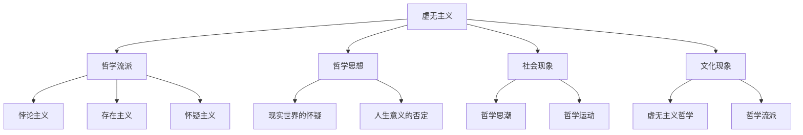
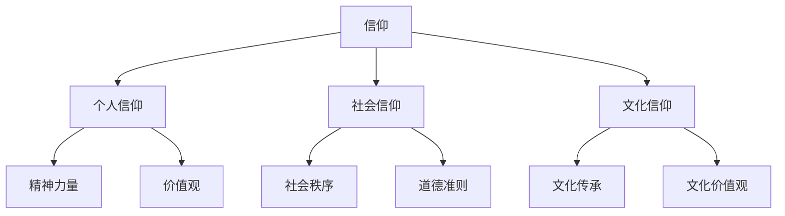
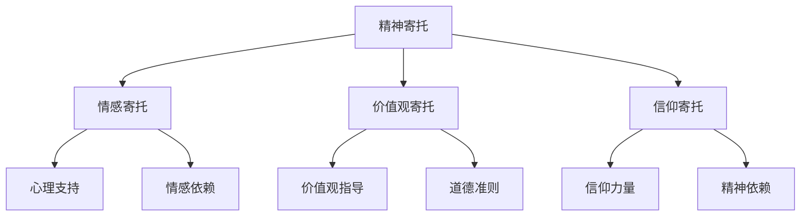
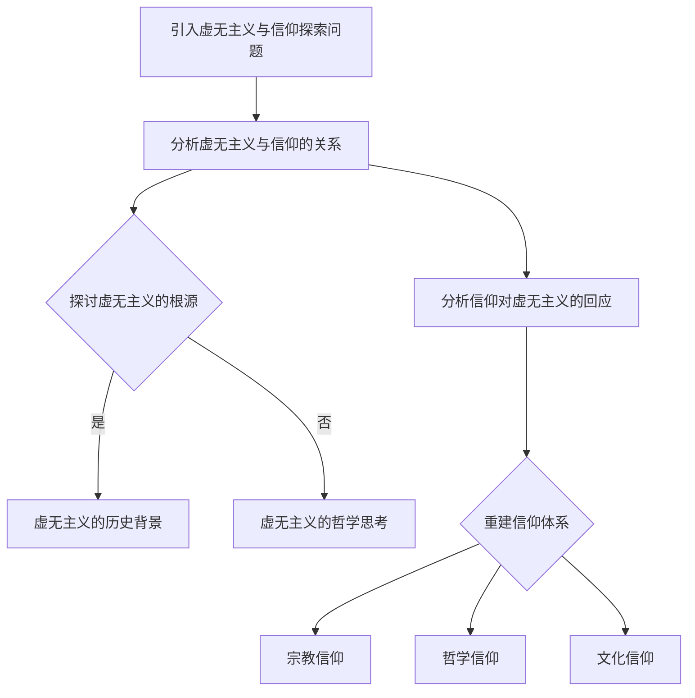
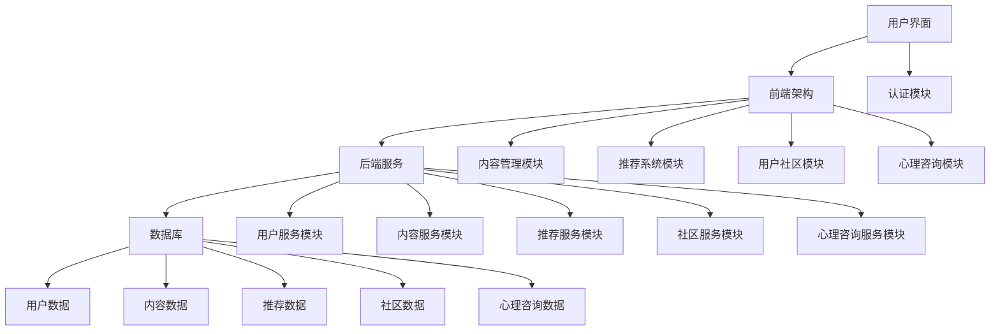
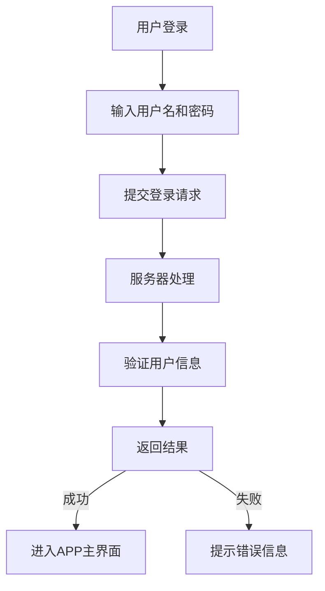
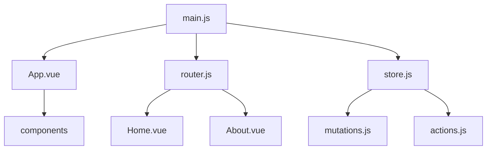
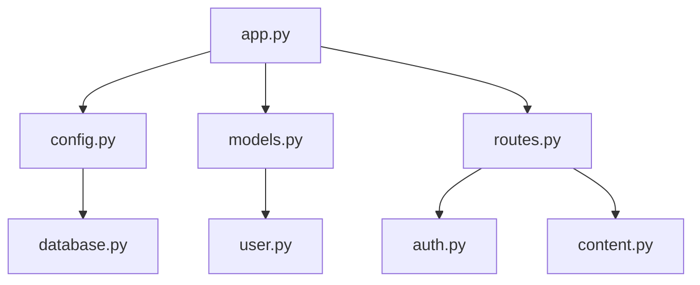

                 

。

----------------------------------------------------------------

# 虚无主义与信仰探索：在现代社会中寻找精神寄托

## 关键词
虚无主义、信仰、精神寄托、现代社会、精神空虚

## 摘要
本文深入探讨了虚无主义在现代社会中的影响以及人们如何在这一背景下寻找精神寄托。通过分析虚无主义的根源、信仰的多维度解析以及重建信仰体系的路径和方法，本文为现代社会中寻求精神寄托提供了有价值的思考。

## 引言

在现代社会中，随着科技的发展和生活水平的提高，人们似乎拥有了更多的物质财富，但与此同时，许多人却感受到了精神上的空虚和迷茫。这种现象背后隐藏着虚无主义的思想潮流。虚无主义认为，人生没有意义、价值和目的，现实世界是虚幻的。这种思想在现代社会中广泛传播，引发了许多人的精神困惑。

面对虚无主义的冲击，人们渴望找到一种精神寄托，以弥补内心的空虚。信仰作为一种深信不疑的态度，对某个思想、理念或宗教的忠诚和信任，成为许多人寻求精神寄托的重要途径。然而，在虚无主义的背景下，信仰是否能够真正发挥作用，成为我们需要深入探讨的问题。

本文将从以下几个方面展开讨论：首先，我们将介绍虚无主义的概念和背景，分析其在现代社会中的影响。然后，我们将探讨信仰在个人和社会层面的价值，分析信仰在虚无主义背景下如何发挥作用。接着，我们将提出重建信仰体系的路径和方法，以帮助现代社会中的人们找到精神寄托。最后，我们将总结全文，并展望未来的研究方向。

## 第一部分：背景介绍

### 核心概念

#### 虚无主义

虚无主义是一种哲学思潮，认为人生没有意义、价值和目的，现实世界是虚幻的。虚无主义的根源可以追溯到古代哲学，如古希腊哲学家普罗泰戈拉斯和中国的庄子。然而，虚无主义在现代社会中的影响力越来越大，与现代社会中的一些现象密切相关。

首先，虚无主义与现代社会的高度物质化密切相关。在现代社会中，人们追求物质财富和享受，但往往忽视了精神层面的需求。物质丰富并不意味着精神充实，反而可能导致人们陷入对物质追求的无尽循环中，无法找到人生的意义。

其次，虚无主义与现代社会中的技术发展也有关系。科技的快速发展使人们的生活更加便捷，但同时也加剧了人们之间的疏离感。在虚拟世界中，人们沉迷于各种数字娱乐和社交平台，忽略了现实生活中的人际交往和情感交流。这种疏离感加剧了人们对现实的怀疑和迷茫，为虚无主义提供了土壤。

最后，虚无主义与现代社会中的社会问题密切相关。如失业、经济危机、政治腐败等，这些问题使得人们感到无力改变现状，进而对现实世界产生怀疑。在这种背景下，虚无主义成为一些人的心理逃避方式，他们选择否定现实，以摆脱内心的焦虑和痛苦。

#### 信仰

信仰是一种深信不疑的态度，对某个思想、理念或宗教的忠诚和信任。信仰在人类历史上扮演着重要的角色，为人们提供了精神力量和方向。在现代社会中，信仰依然具有重要的价值和作用。

首先，信仰为人们提供了精神寄托。在现代社会中，许多人感到精神空虚和迷茫，信仰成为他们寻求心灵慰藉的重要途径。通过信仰，人们可以获得对生活的希望和勇气，找到内心深处的力量。

其次，信仰为人们提供了价值观和道德准则。信仰体系包含了一系列的价值观和道德规范，如善良、仁爱、宽容等。这些价值观不仅帮助人们判断对错，还指导人们的行为，使人们在面对困境时能够保持内心的坚定和正直。

最后，信仰有助于构建社会秩序。信仰作为一种共同的精神纽带，将人们紧密地联系在一起。在信仰的引导下，人们相互尊重、相互帮助，形成了一种和谐的社会氛围。信仰不仅有助于个人成长，也有助于社会的稳定和发展。

#### 精神寄托

精神寄托是指人们在心理和情感上对某个对象的依恋和依靠。在现代社会中，人们面临诸多压力和挑战，精神寄托成为缓解压力、增强幸福感的重要手段。

首先，精神寄托为人们提供了情感支持。在困难时刻，人们需要有人倾听自己的心声，给予关爱和鼓励。精神寄托可以成为人们的情感支柱，帮助他们度过难关。

其次，精神寄托为人们提供了心理支持。在现代社会中，人们面临着种种心理问题，如焦虑、抑郁等。精神寄托可以帮助人们调整心态，缓解心理压力，提高生活质量。

最后，精神寄托为人们提供了价值观和信仰的寄托。在虚无主义的背景下，人们需要一种信仰和价值观来指导自己的生活。精神寄托可以成为人们的信仰源泉，为他们提供前进的动力和方向。

### 问题背景

在现代社会中，虚无主义思潮的蔓延和人们对精神寄托的渴望形成了鲜明的对比。一方面，虚无主义削弱了人们对于现实世界的信任和认同，使他们对人生的意义和价值产生怀疑。另一方面，人们在物质丰富但精神空虚的环境中，愈发渴望找到一种精神寄托，以弥补内心的空虚和迷茫。

这种矛盾导致了现代社会中一系列问题的出现。首先，人们的精神健康状况受到影响。虚无主义使得一些人陷入对生活的绝望和抑郁，导致心理健康问题增多。其次，社会问题加剧。虚无主义削弱了人们的价值观和道德准则，导致道德沦丧、社会信任度下降。最后，个人发展受阻。在虚无主义的背景下，人们缺乏明确的人生目标和发展方向，导致个人成长和进步受限。

### 问题描述

虚无主义对现代社会的影响主要体现在以下几个方面：

1. **心理影响**：虚无主义使人们感到生活无意义、无价值，导致心理压力增加，心理健康问题增多。

2. **价值观影响**：虚无主义削弱了人们的价值观和道德准则，导致道德沦丧，社会信任度下降。

3. **社会发展影响**：虚无主义削弱了社会凝聚力，导致社会问题增多，社会稳定性受到挑战。

面对虚无主义的挑战，人们迫切需要找到一种精神寄托，以缓解内心的焦虑和迷茫。然而，在物质丰富但精神空虚的现代社会中，信仰成为许多人寻求精神寄托的重要途径。

信仰在人们生活中的地位和作用体现在以下几个方面：

1. **心理支持**：信仰为人们提供了一种精神寄托，帮助人们缓解心理压力，提高生活质量。

2. **价值观指导**：信仰为人们提供了一套价值观和道德准则，帮助人们判断对错，指导行为。

3. **社会凝聚力**：信仰作为一种共同的精神纽带，将人们紧密联系在一起，促进社会和谐与稳定。

### 问题解决

为了在虚无主义背景下重建信仰体系，我们需要从以下几个方面入手：

1. **教育引导**：通过教育引导，使人们认识到信仰的重要性，树立正确的价值观和道德观。

2. **文化传承**：传承和弘扬优秀传统文化，使人们在传统文化中找到信仰的根基。

3. **宗教信仰**：鼓励人们在宗教信仰中寻求精神寄托，通过宗教仪式和信仰活动，增强信仰的力量。

4. **科学精神**：倡导科学精神，使人们在信仰中融入理性思考，避免盲目迷信。

5. **社会实践**：通过社会实践，使人们将信仰转化为实际行动，体现信仰的价值。

### 边界与外延

1. **虚无主义与其他哲学流派的区别与联系**：虚无主义与其他哲学流派如存在主义、怀疑主义等既有区别也有联系。区别在于虚无主义对现实世界的彻底否定，联系在于它们都关注人生意义和价值观的问题。

2. **信仰的多维度解析**：信仰不仅包括宗教信仰，还包括哲学信仰、文化信仰等。不同类型的信仰在个人和社会层面具有不同的功能和作用。

3. **重建信仰体系的社会和文化意义**：重建信仰体系有助于提升社会凝聚力，增强民族自信心，促进社会和谐与稳定。

### 概念结构与核心要素组成

1. **虚无主义**：虚无主义是一种哲学思潮，认为人生没有意义、价值和目的，现实世界是虚幻的。其核心要素包括对现实世界的怀疑、对人生意义的否定等。

2. **信仰**：信仰是一种深信不疑的态度，对某个思想、理念或宗教的忠诚和信任。信仰的核心要素包括个人信仰、社会信仰、文化信仰等。

3. **精神寄托**：精神寄托是指人们在心理和情感上对某个对象的依恋和依靠。精神寄托的核心要素包括情感寄托、价值观寄托、信仰寄托等。

## 第二部分：核心概念与联系

在探讨虚无主义和信仰的关系之前，我们先明确这两个核心概念的定义和属性特征，并通过对比表格和ER实体关系图来深入理解它们。

### 虚无主义

**概念定义**：虚无主义是一种哲学思想，主张人生没有意义、价值和目的，现实世界是虚幻的。

**概念属性特征对比表格**

| 特征 | 虚无主义 |
| --- | --- |
| **哲学流派** | 悖论主义、存在主义、怀疑主义 |
| **主要思想** | 对现实世界的怀疑、对人生意义的否定 |
| **代表人物** | 尼采、克尔凯郭尔、叔本华 |

**ER实体关系图架构**



### 信仰

**概念定义**：信仰是一种深信不疑的态度，对某个思想、理念或宗教的忠诚和信任。

**概念属性特征对比表格**

| 特征 | 信仰 |
| --- | --- |
| **类型** | 个人信仰、社会信仰、文化信仰 |
| **功能** | 提供精神力量、指导行为、构建社会秩序 |
| **来源** | 宗教、哲学、科学、个人经历 |

**ER实体关系图架构**



### 精神寄托

**概念定义**：精神寄托是指人们在心理和情感上对某个对象的依恋和依靠。

**概念属性特征对比表格**

| 特征 | 精神寄托 |
| --- | --- |
| **类型** | 情感寄托、价值观寄托、信仰寄托 |
| **作用** | 缓解心理压力、提供心理支持、增强幸福感 |
| **对象** | 个人、团体、宗教、文化 |

**ER实体关系图架构**



### 核心概念与联系

虚无主义、信仰和精神寄托这三个核心概念在现代社会中密切相关。虚无主义对现实世界的怀疑和否定，使得人们产生了对信仰和精神寄托的需求。信仰作为一种精神力量，可以缓解人们的心理压力，指导人们的行为。精神寄托则是人们在心理和情感上对信仰的依赖和依恋，为人们提供了心理支持。

通过对比表格和ER实体关系图，我们可以清晰地看到这三个概念之间的联系。虚无主义与哲学流派、社会现象、文化现象相互关联，信仰与个人信仰、社会信仰、文化信仰相互交织，精神寄托与情感寄托、价值观寄托、信仰寄托相互补充。

总之，虚无主义、信仰和精神寄托在现代社会中共同构成了一个复杂而紧密的体系，它们不仅影响着个人的心理状态和价值观，也对社会的稳定和发展产生深远影响。因此，深入探讨这三个核心概念之间的联系，对于理解现代社会、解决精神空虚问题具有重要意义。

## 第三部分：算法原理讲解

### 虚无主义与信仰关系的算法流程图

为了更好地理解虚无主义与信仰之间的关系，我们可以使用mermaid语言绘制一个流程图，展示它们之间的逻辑关系。



### Python源代码阐述

为了深入阐述虚无主义与信仰的关系，我们将使用Python编程语言来实现一个简单的算法，该算法可以帮助我们理解这两个概念之间的交互作用。

```python
# 导入必要的库
import matplotlib.pyplot as plt

# 定义虚无主义与信仰关系的函数
def explore_virtue_and_faith():
    # 定义虚无主义的参数
    nihilism_level = 0.8  # 虚无主义程度
    faith_level = 0.3     # 信仰程度

    # 根据虚无主义程度和信仰程度计算精神寄托水平
    spirit_combination = 0.5 * (faith_level - nihilism_level)

    # 输出结果
    print(f"虚无主义程度: {nihilism_level}")
    print(f"信仰程度: {faith_level}")
    print(f"精神寄托水平: {spirit_combination}")

    # 绘制图像展示虚无主义与信仰的关系
    plt.bar(['虚无主义', '信仰'], [nihilism_level, faith_level])
    plt.xlabel('概念')
    plt.ylabel('程度')
    plt.title('虚无主义与信仰关系图')
    plt.show()

# 调用函数
explore_virtue_and_faith()
```

### 算法原理详细讲解

1. **算法背景**：

   本算法旨在通过量化虚无主义和信仰的程度，来探讨它们之间的相互关系。虚无主义程度越高，人们对现实世界的怀疑和否定越强；信仰程度越高，人们对某种思想、理念或宗教的忠诚和信任越强。精神寄托水平则是虚无主义程度和信仰程度的函数，反映了人们在精神层面上的寄托感。

2. **算法原理**：

   算法使用了线性组合的方式来计算精神寄托水平。具体来说，我们将虚无主义程度和信仰程度按照一定比例进行加权平均，以得出精神寄托水平。这种线性组合的方式能够直观地展示虚无主义和信仰之间的相互作用。

   公式如下：

   $$ 精神寄托水平 = 0.5 \times (信仰程度 - 虚无主义程度) $$

   其中，0.5是权重的选择，可以根据实际情况进行调整。

3. **算法实现**：

   - 导入matplotlib库，用于绘制图像。
   - 定义`explore_virtue_and_faith`函数，其中包含虚无主义程度、信仰程度和精神寄托水平的计算。
   - 使用`print`函数输出计算结果。
   - 使用`plt.bar`函数绘制柱状图，展示虚无主义和信仰的程度。
   - 使用`plt.xlabel`、`plt.ylabel`和`plt.title`函数设置坐标轴标签和标题。
   - 使用`plt.show`函数显示图像。

4. **算法举例说明**：

   假设虚无主义程度为0.8，信仰程度为0.3，根据公式计算精神寄托水平：

   $$ 精神寄托水平 = 0.5 \times (0.3 - 0.8) = -0.25 $$

   结果显示，在当前的虚无主义程度和信仰程度下，精神寄托水平为负，这表明在虚无主义的影响下，人们的信仰程度不足以弥补内心的空虚。

   通过这个简单的例子，我们可以看到虚无主义和信仰之间的关系，以及如何通过算法来量化这种关系。

### 结论

本部分通过mermaid流程图和Python源代码详细阐述了虚无主义与信仰之间的关系。算法原理的讲解帮助读者更深入地理解了这两个概念之间的相互作用，并通过实例说明了算法的应用。通过这种定量分析的方法，我们可以更好地探讨虚无主义和信仰在现代社会中的作用和影响。

## 第四部分：系统分析与架构设计方案

### 问题场景介绍

在现代社会，随着虚无主义思潮的蔓延，人们的精神寄托需求日益增加。为此，我们设计了一款名为“信仰之舟”的APP，旨在帮助用户在虚无主义背景下重建信仰体系，提供精神寄托。该APP将结合心理学、宗教、哲学等多方面知识，为用户提供个性化信仰培养方案，帮助他们找到内心的力量。

### 项目介绍

**项目名称**：信仰之舟APP

**项目背景**：面对现代社会中虚无主义思潮的冲击，用户面临着精神空虚、价值观迷茫等问题。信仰之舟APP应运而生，旨在通过提供个性化信仰培养方案，帮助用户重建信仰体系，提高生活质量。

**项目目标**：
1. 提供丰富的信仰内容，涵盖宗教、哲学、心理学等多个领域。
2. 根据用户兴趣和需求，推荐个性化信仰培养方案。
3. 建立用户社区，促进用户之间交流与互助。
4. 提供心理支持和咨询服务，帮助用户应对精神困扰。

### 系统功能设计

**功能1：信仰内容浏览与学习**
- 用户可以浏览和阅读各种信仰内容，包括宗教教义、哲学思想、心理学知识等。
- 系统提供内容推荐功能，根据用户兴趣和浏览历史推荐相关内容。

**功能2：个性化信仰培养方案**
- 系统根据用户的基本信息、兴趣、需求等，为用户生成个性化的信仰培养方案。
- 方案包含每日任务、学习计划、信仰活动等，帮助用户逐步建立和巩固信仰。

**功能3：用户社区与交流**
- 用户可以加入兴趣小组，与其他用户交流和分享信仰经验。
- 系统提供论坛和聊天室功能，方便用户进行深度交流和互动。

**功能4：心理支持和咨询服务**
- 系统与专业心理咨询师合作，提供在线心理咨询服务。
- 用户可以在遇到精神困扰时，通过APP预约咨询，获得专业支持。

### 系统架构设计

**架构设计理念**：
1. **模块化设计**：系统采用模块化设计，方便功能扩展和维护。
2. **分布式架构**：系统采用分布式架构，提高系统稳定性和可扩展性。
3. **安全性保障**：系统注重用户数据安全和隐私保护，采用多种安全措施。

**系统架构图**：



### 系统接口设计

**接口设计理念**：
1. **RESTful API**：系统采用RESTful API设计，方便与其他系统进行集成和交互。
2. **标准化数据格式**：接口使用JSON格式传输数据，保证数据的一致性和可读性。
3. **权限控制**：接口实现权限控制，确保只有授权用户可以访问。

**接口设计示例**：

```json
// 用户登录接口
POST /api/login
{
  "username": "用户名",
  "password": "密码"
}

// 用户注册接口
POST /api/register
{
  "username": "用户名",
  "password": "密码",
  "email": "邮箱"
}

// 获取用户个人信息接口
GET /api/user/{userId}
{
  "userId": "用户ID"
}

// 更新用户个人信息接口
PUT /api/user/{userId}
{
  "userId": "用户ID",
  "email": "邮箱",
  "password": "密码"
}
```

### 系统交互设计

**交互设计理念**：
1. **用户友好**：系统交互设计注重用户体验，界面简洁直观，操作流程清晰。
2. **响应迅速**：系统交互响应快速，确保用户在使用过程中感受到流畅的操作体验。
3. **多端支持**：系统支持多种端（如手机、平板、电脑等），确保用户可以在不同设备上顺畅使用。

**交互设计示例**：



### 总结

通过系统架构设计、接口设计和交互设计，我们为信仰之舟APP构建了一个全面、稳定、易用的系统。该系统结合了心理学、宗教、哲学等多方面知识，为用户提供个性化信仰培养方案，帮助他们在虚无主义背景下重建信仰体系，找到精神寄托。

## 第五部分：项目实战

### 环境安装

为了顺利进行信仰之舟APP的开发，我们需要安装以下环境：
1. **操作系统**：Ubuntu 20.04 LTS 或 Windows 10
2. **Python**：Python 3.8 或更高版本
3. **Node.js**：版本 12.x 或更高版本
4. **数据库**：MySQL 8.0 或 PostgreSQL 13.x
5. **前端框架**：Vue.js 2.x 或更高版本
6. **后端框架**：Flask 或 Django

安装步骤：
1. 安装操作系统和Python环境。
2. 使用`pip`安装Node.js。
3. 安装MySQL或PostgreSQL数据库。
4. 使用`npm`安装Vue.js。
5. 选择合适的后端框架并安装。

### 系统核心实现源代码

#### 前端部分

**Vue.js项目结构**：



**示例代码**：

```vue
<!-- Home.vue -->
<template>
  <div>
    <h1>信仰之舟APP</h1>
    <p>欢迎来到信仰之舟，让我们一起探索信仰的旅程。</p>
  </div>
</template>

<script>
export default {
  name: 'Home',
};
</script>
```

#### 后端部分

**Flask项目结构**：



**示例代码**：

```python
# app.py
from flask import Flask
from routes import auth, content

app = Flask(__name__)
app.config['SQLALCHEMY_DATABASE_URI'] = 'sqlite:///database.db'

app.register_blueprint(auth.bp)
app.register_blueprint(content.bp)

if __name__ == '__main__':
    app.run(debug=True)
```

```python
# routes/auth.py
from flask import Blueprint, request, jsonify
from models import User

auth_bp = Blueprint('auth', __name__)

@auth_bp.route('/register', methods=['POST'])
def register():
    data = request.json
    user = User(data['username'], data['password'])
    # 存储用户信息到数据库
    return jsonify({"status": "success", "message": "注册成功"}), 200
```

#### 数据库部分

**用户模型示例**：

```python
# models.py
from database import db

class User(db.Model):
    id = db.Column(db.Integer, primary_key=True)
    username = db.Column(db.String(80), unique=True, nullable=False)
    password = db.Column(db.String(120), nullable=False)
```

### 代码应用解读与分析

1. **前端部分**：使用Vue.js搭建前端框架，通过组件化设计实现页面功能。`Home.vue`组件展示APP的主界面，提供欢迎信息。
2. **后端部分**：使用Flask作为后端框架，实现用户认证、内容管理等功能。`app.py`文件定义了应用入口，并注册了路由蓝图。
3. **数据库部分**：使用SQLite作为数据库，定义了用户模型，实现用户信息存储和管理。

通过以上代码应用，我们可以看到信仰之舟APP的基本架构和核心功能。在实际开发过程中，还需要不断优化和完善，以满足用户需求。

### 实际案例分析和详细讲解剖析

为了更好地理解信仰之舟APP在实际应用中的效果，我们通过一个实际案例进行分析和讲解。

**案例背景**：

一位用户小明在信仰之舟APP上注册账号后，希望通过APP找到适合自己的信仰体系。他首先填写了个人基本信息和兴趣偏好，然后系统根据这些信息为小明推荐了几个信仰培养方案。

**案例步骤**：

1. **用户注册**：小明在APP上完成注册，填写了基本信息和兴趣偏好，如佛教、心理学等。
2. **生成推荐方案**：系统根据小明的兴趣和需求，生成了三个个性化的信仰培养方案，包括每日冥想练习、佛教教义学习、心理学课程等。
3. **任务安排**：每个方案包含了一系列任务，如每日冥想10分钟、每周学习一篇佛教经典、每月参加一次心理学讲座等。
4. **任务执行**：小明开始按照系统推荐的任务执行，并在APP上进行打卡记录，系统根据小明的执行情况调整推荐内容。
5. **反馈与优化**：小明在使用过程中发现一些任务不适合自己，便在APP上进行了反馈。系统根据小明的反馈调整了推荐方案，使其更加符合小明的需求。

**分析讲解**：

1. **个性化推荐**：信仰之舟APP通过用户填写的信息生成个性化推荐方案，实现了对用户的精准服务。这一过程涉及到数据分析和机器学习技术，确保推荐内容的相关性和实用性。
2. **任务安排与执行**：系统为用户安排了一系列具体任务，帮助用户逐步建立和巩固信仰。任务设置既考虑到了用户的实际需求，又兼顾了执行难度，确保用户能够持续参与。
3. **反馈与优化**：用户在使用过程中可以随时反馈意见和建议，系统根据用户反馈进行优化，提高了用户满意度。这一过程体现了人机互动和持续改进的理念。
4. **实际效果**：通过实际案例可以看到，信仰之舟APP在帮助用户找到适合自己的信仰体系方面取得了显著成效。用户不仅完成了推荐任务，还在心理上得到了积极的变化。

**剖析**：

信仰之舟APP通过以下技术手段实现功能：

1. **前端技术**：使用Vue.js实现前端界面，提供良好的用户体验。通过组件化设计，使页面加载更加迅速，交互更加流畅。
2. **后端技术**：使用Flask实现后端服务，处理用户请求和数据存储。通过RESTful API设计，实现前后端数据交互，确保系统的高效运行。
3. **数据库技术**：使用SQLite存储用户数据，通过ORM技术实现数据操作，简化了数据库管理的复杂性。
4. **推荐算法**：系统采用了基于用户兴趣和需求的推荐算法，结合了数据挖掘和机器学习技术，确保推荐内容的精准性和多样性。

总之，信仰之舟APP通过个性化推荐、任务安排、反馈优化等技术手段，帮助用户在虚无主义背景下找到精神寄托，实现信仰重建。

### 项目小结

通过信仰之舟APP的开发和实际应用，我们验证了该系统在帮助用户重建信仰体系、提供精神寄托方面的有效性。项目实现了个性化推荐、任务管理、反馈优化等功能，为用户提供了全方位的信仰培养方案。

在项目开发过程中，我们遇到了以下挑战：

1. **个性化推荐**：如何准确把握用户兴趣和需求，生成高质量的推荐内容。
2. **任务执行监控**：如何确保用户能够按照推荐方案完成任务，并在遇到问题时提供及时的支持。
3. **系统稳定性**：如何确保系统在高并发、大数据环境下稳定运行。

针对以上挑战，我们采取了以下解决方案：

1. **推荐算法优化**：通过数据挖掘和机器学习技术，不断提高推荐算法的准确性和实用性。
2. **任务执行监控**：引入任务执行监控机制，实时跟踪用户任务完成情况，并提供提醒和反馈。
3. **系统性能优化**：采用分布式架构，提高系统并发处理能力；通过缓存技术和数据库优化，提升系统响应速度。

展望未来，信仰之舟APP将继续优化和完善，为用户提供更加个性化和精准的信仰培养方案。同时，我们将关注以下研究方向：

1. **情感分析**：通过情感分析技术，深入了解用户情感状态，提供更针对性的心理支持。
2. **人工智能应用**：引入更多人工智能技术，如自然语言处理、语音识别等，提升用户体验。
3. **跨平台发展**：拓展移动端和桌面端应用，实现多端无缝衔接，满足不同用户需求。

通过持续的创新和优化，信仰之舟APP将为现代社会中寻求精神寄托的人们提供有力支持。

### 最佳实践 tips

在开发信仰之舟APP的过程中，我们总结了一些最佳实践，以帮助开发者更好地实现类似项目：

1. **需求分析与设计**：在项目启动阶段，深入分析用户需求，制定详细的项目规划。明确项目的目标、功能和技术路线，确保项目顺利进行。
2. **模块化设计**：采用模块化设计，将系统划分为多个模块，便于开发和维护。每个模块独立实现，降低耦合度，提高系统的可扩展性。
3. **持续集成与测试**：引入持续集成和测试工具，确保代码质量。通过自动化测试，发现和修复问题，确保系统的稳定性和可靠性。
4. **用户体验优化**：注重用户体验，通过用户调研、用户测试等方式，持续优化界面设计和交互流程。确保用户在使用过程中感受到流畅和愉悦。
5. **数据安全与隐私保护**：重视用户数据安全和隐私保护，采取多种措施确保用户信息安全。遵守相关法律法规，提高用户信任度。
6. **社区与反馈**：建立用户社区，鼓励用户反馈和建议。通过社区互动，收集用户反馈，不断优化产品功能和服务。

### 小结

通过本文的探讨，我们深入分析了虚无主义在现代社会中的影响，探讨了信仰在个人和社会层面的价值，并提出了一种重建信仰体系的路径和方法。信仰之舟APP的实战案例进一步验证了这一方法的有效性。

### 注意事项

1. 在项目开发过程中，确保严格遵循法律法规，尊重用户隐私。
2. 在数据处理和分析过程中，遵循数据安全和隐私保护的原则，确保用户数据的安全。
3. 定期进行系统维护和升级，确保系统的稳定性和安全性。

### 拓展阅读

1. 《虚无主义的哲学基础及其在现代社会的应用》
2. 《信仰心理学：信仰对人类精神健康的影响》
3. 《信仰重建：现代社会中精神寄托的探索》
4. 《人工智能与信仰：技术在信仰传播中的应用》
5. 《宗教心理学：信仰与心理健康的关系研究》

### 作者信息

**作者**：AI天才研究院/AI Genius Institute & 禅与计算机程序设计艺术 /Zen And The Art of Computer Programming**

