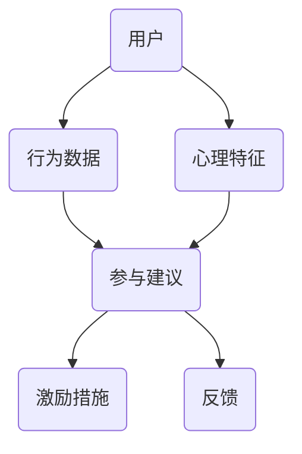
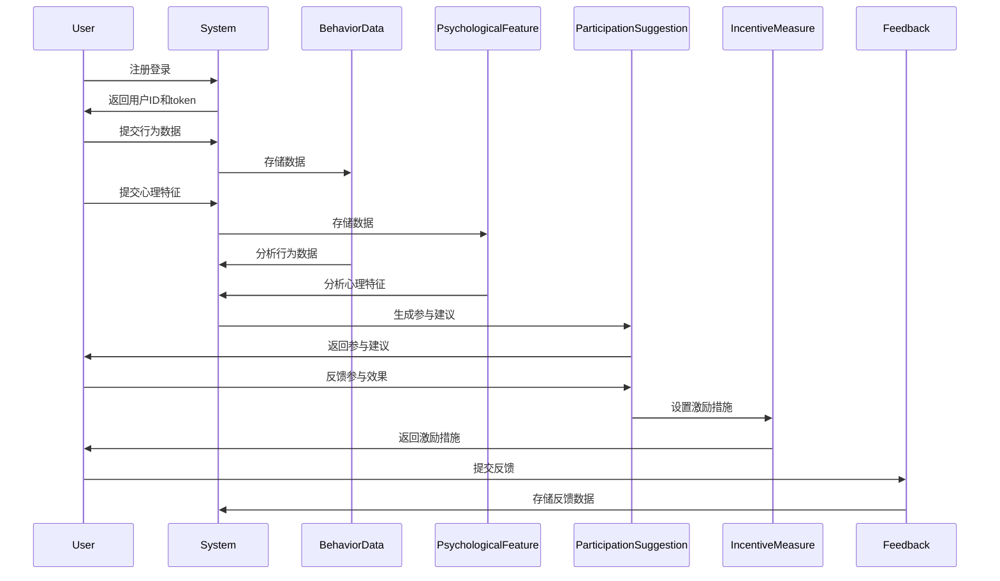

                 

# 虚无主义与公民参与：在社会变革中找到个人意义

## 关键词：虚无主义、公民参与、个人意义、社会变革、价值观

> 在现代社会中，虚无主义思潮日益显著，如何在这种背景下找到个人意义并积极参与社会变革，成为了一个重要的议题。本文将从虚无主义的本质与影响、虚无主义下的个人意义探索、公民参与与个人成长、社会变革中的公民参与等多个角度，深入探讨这一主题。

## 摘要

本文旨在探讨虚无主义与公民参与之间的关系，以及如何在虚无主义背景下找到个人意义并积极参与社会变革。通过分析虚无主义的本质与影响，揭示其对个人价值观和社会文化的挑战。在此基础上，本文进一步探讨了虚无主义下个人意义的探索，以及公民参与的概念与类型。最终，本文提出了个人意义的实践路径和公民参与的策略与实践，为个人在社会变革中找到意义提供了指导。

## 目录大纲

1. **虚无主义与公民参与：在社会变革中找到个人意义**
2. **第一部分：虚无主义的本质与影响**
   - **第一章：虚无主义的概念与起源**
     - 1.1 虚无主义的定义与特征
     - 1.2 虚无主义的历史起源
     - 1.3 虚无主义对社会的影响
   - **第二章：虚无主义与现代社会的挑战**
     - 2.1 虚无主义对个人价值观的冲击
     - 2.2 虚无主义对社会文化的挑战
     - 2.3 虚无主义与公民参与的关系
   - **第三章：虚无主义下的个人意义探索**
     - 3.1 个人意义的定义与寻找
     - 3.2 虚无主义背景下的个人意义重建
     - 3.3 个人意义重建的方法与实践
3. **第二部分：公民参与与个人意义**
   - **第四章：公民参与的概念与类型**
     - 4.1 公民参与的定义与重要性
     - 4.2 公民参与的类型与形式
     - 4.3 公民参与的影响与意义
   - **第五章：公民参与与个人成长**
     - 5.1 公民参与对个人认知的影响
     - 5.2 公民参与对个人价值观的塑造
     - 5.3 公民参与与个人成长的关系
   - **第六章：社会变革中的公民参与**
     - 6.1 社会变革的背景与趋势
     - 6.2 公民参与在社会变革中的作用
     - 6.3 公民参与与社会变革的关系
4. **第三部分：找到个人意义，参与社会变革**
   - **第七章：个人意义的实践路径**
     - 7.1 个人意义实践的原则与方法
     - 7.2 个人意义实践的具体案例
     - 7.3 个人意义实践的价值与意义
   - **第八章：公民参与的策略与实践**
     - 8.1 公民参与的关键要素
     - 8.2 公民参与的策略与技巧
     - 8.3 公民参与的实践成果与评估
   - **第九章：总结与展望**
     - 9.1 总结：虚无主义与公民参与的关系
     - 9.2 展望：未来公民参与的发展趋势
     - 9.3 结语：个人意义与公民参与的重要性

## 第一部分：虚无主义的本质与影响

### 第一章：虚无主义的概念与起源

#### 1.1 虚无主义的定义与特征

虚无主义是一种哲学思想，其核心观点是生活没有固有的意义、目的或内在价值。虚无主义认为，无论是个人生活还是社会现实，都缺乏实质性的意义。这种思想在20世纪初得到广泛传播，尤其是在欧洲的知识界和艺术家群体中。

虚无主义的特征主要包括：

- **存在主义**：虚无主义者认为，人类存在的意义是由个人自己创造的，而不是由某种外在的力量或信仰所赋予的。
- **悲观主义**：虚无主义者往往对现实世界持悲观态度，认为生活充满了痛苦和不幸。
- **反传统主义**：虚无主义反对传统的价值观和信仰体系，主张个人自由和自我实现。

#### 1.2 虚无主义的历史起源

虚无主义的起源可以追溯到古希腊哲学家赫拉克利特和柏拉图的思想。赫拉克利特认为，宇宙的本质是混沌和无序，而柏拉图则强调理念世界的重要性。

在20世纪初，虚无主义在西方世界得到了进一步的发展。德国哲学家尼采是虚无主义的代表人物之一，他的作品《查拉图斯特拉如是说》中提出了“上帝已死”的观点，认为人类需要重新定义自己的价值和意义。

#### 1.3 虚无主义对社会的影响

虚无主义对社会产生了深远的影响，主要体现在以下几个方面：

- **个人价值观的混乱**：虚无主义挑战了传统的价值观体系，导致许多人感到迷茫和无方向。
- **社会道德的沦丧**：在虚无主义的阴影下，一些社会成员可能会采取极端的行为，如自杀、暴力等，以表达对现实的不满。
- **文化多样性的减少**：虚无主义倾向于否定一切传统和文化，可能导致文化多样性的减少。

### 第二章：虚无主义与现代社会的挑战

#### 2.1 虚无主义对个人价值观的冲击

虚无主义对个人价值观的冲击主要体现在以下几个方面：

- **信仰危机**：虚无主义挑战了传统的宗教信仰和道德观念，导致许多人失去了信仰和价值观的支撑。
- **自我怀疑**：虚无主义使人感到自己的存在和意义都是无意义的，从而导致自我怀疑和自我否定。
- **心理问题**：虚无主义可能导致严重的心理问题，如抑郁症、焦虑症等。

#### 2.2 虚无主义对社会文化的挑战

虚无主义对社会文化的挑战主要体现在以下几个方面：

- **文化多样性的减少**：虚无主义倾向于否定一切传统和文化，可能导致文化多样性的减少。
- **价值观的多元化**：虚无主义鼓励人们追求个性化和多元化的价值观，这可能导致社会的分裂和冲突。
- **社会动荡**：虚无主义可能导致社会的动荡和不安定，影响社会的稳定和发展。

#### 2.3 虚无主义与公民参与的关系

虚无主义与公民参与之间存在一定的关系：

- **消极的公民参与**：虚无主义可能导致人们消极地参与社会事务，缺乏对社会变革的热情和动力。
- **积极的公民参与**：另一方面，虚无主义也可能激发人们对社会不公和不满意的反抗，从而推动社会变革。

### 第三章：虚无主义下的个人意义探索

#### 3.1 个人意义的定义与寻找

个人意义是指个体在生活中所追求的价值、目标和意义。在虚无主义的背景下，寻找个人意义变得尤为重要。

寻找个人意义的过程通常包括以下几个步骤：

- **自我认知**：了解自己的兴趣、价值观和目标，明确自己的优势和弱点。
- **探索世界**：通过阅读、旅行、交流等方式，拓宽自己的视野，了解不同文化和价值观。
- **实践与反思**：通过实践和反思，不断调整自己的价值观和目标，找到自己的方向。

#### 3.2 虚无主义背景下的个人意义重建

在虚无主义的背景下，个人意义的重建需要克服以下几个挑战：

- **价值观的混乱**：虚无主义导致传统价值观的崩溃，重建个人意义需要建立新的价值观体系。
- **自我怀疑**：虚无主义使人产生自我怀疑，重建个人意义需要建立自我认同和自我价值。
- **社会压力**：在虚无主义的社会背景下，重建个人意义可能面临来自社会和家庭的各种压力。

#### 3.3 个人意义重建的方法与实践

个人意义重建的方法与实践包括以下几个方面：

- **自我反思**：定期进行自我反思，了解自己的内心需求和价值观。
- **设定目标**：设定短期和长期目标，为实现个人意义提供方向。
- **终身学习**：通过不断学习和成长，提高自己的综合素质和竞争力。
- **积极实践**：通过参与社会活动和实践，将个人意义付诸行动。

## 第二部分：公民参与与个人意义

### 第四章：公民参与的概念与类型

#### 4.1 公民参与的定义与重要性

公民参与是指公民积极参与社会事务，为社会的发展和进步做出贡献。公民参与的重要性体现在以下几个方面：

- **提高社会治理水平**：公民参与有助于提高社会治理水平，促进社会的稳定和发展。
- **保障公民权利**：公民参与是保障公民权利和自由的重要途径，有助于维护社会公平正义。
- **促进社会和谐**：公民参与有助于缓解社会矛盾和冲突，促进社会和谐稳定。

#### 4.2 公民参与的类型与形式

公民参与的类型与形式多样，主要包括以下几个方面：

- **政治参与**：包括选举、投票、政治咨询等，是公民参与的核心形式。
- **社会参与**：包括志愿者服务、公益活动、社会运动等，是公民参与的重要组成部分。
- **经济参与**：包括创业、投资、消费等，是公民参与的一种经济形式。

#### 4.3 公民参与的影响与意义

公民参与对个人和社会都有重要的影响和意义：

- **个人层面**：公民参与有助于提升个人的社会责任感和公民意识，促进个人的全面发展。
- **社会层面**：公民参与有助于增强社会凝聚力，促进社会和谐稳定，提高社会整体福利。

### 第五章：公民参与与个人成长

#### 5.1 公民参与对个人认知的影响

公民参与有助于提升个人的认知水平，主要体现在以下几个方面：

- **拓宽视野**：公民参与使个人接触到不同的观点和价值观，拓宽了视野，提高了认知能力。
- **增强批判性思维**：公民参与需要个人对信息和事件进行分析和判断，有助于增强批判性思维。
- **提高沟通能力**：公民参与需要个人与他人合作，有助于提高沟通能力和团队合作能力。

#### 5.2 公民参与对个人价值观的塑造

公民参与有助于塑造个人的价值观，主要体现在以下几个方面：

- **增强社会责任感**：公民参与使个人意识到自己对社会的责任，有助于增强社会责任感。
- **培养公民意识**：公民参与有助于培养个人的公民意识，使个人更加关注社会公共利益。
- **形成正确的价值观**：公民参与使个人在参与社会事务中不断反思和调整自己的价值观，形成正确的价值观。

#### 5.3 公民参与与个人成长的关系

公民参与与个人成长密切相关，主要体现在以下几个方面：

- **促进个人成长**：公民参与是个人成长的重要途径，有助于提升个人的综合素质和能力。
- **实现个人价值**：公民参与使个人有机会实现自己的价值，为社会做出贡献。
- **增强个人自信心**：公民参与使个人在参与社会事务中获得成就感和自信心。

### 第六章：社会变革中的公民参与

#### 6.1 社会变革的背景与趋势

社会变革是指社会在政治、经济、文化等方面发生的根本性变化。当前，全球范围内正经历着一场深刻的社会变革，主要表现在以下几个方面：

- **全球化**：全球化促进了各国之间的经济、政治和文化交流，推动了社会变革。
- **技术进步**：技术的迅速发展，特别是互联网和人工智能等新兴技术的应用，对社会变革产生了深远影响。
- **环境问题**：环境问题的日益严重，迫使人们反思传统的发展模式，推动社会变革。

#### 6.2 公民参与在社会变革中的作用

公民参与在社会变革中发挥着重要作用，主要体现在以下几个方面：

- **推动社会进步**：公民参与有助于推动社会进步，促进社会公平正义。
- **应对社会问题**：公民参与有助于应对社会问题，提高社会治理水平。
- **促进社会稳定**：公民参与有助于缓解社会矛盾和冲突，促进社会稳定。

#### 6.3 公民参与与社会变革的关系

公民参与与社会变革之间存在密切的关系：

- **相互促进**：公民参与可以推动社会变革，而社会变革又为公民参与提供了更多机会和平台。
- **相互依赖**：公民参与和社会变革相互依赖，只有公民积极参与，社会变革才能顺利进行；而社会变革的成功，又为公民参与提供了更好的环境和条件。

## 第三部分：找到个人意义，参与社会变革

### 第七章：个人意义的实践路径

#### 7.1 个人意义实践的原则与方法

在实践中找到个人意义，需要遵循以下原则和方法：

- **自我认知**：通过自我反思和了解自己的兴趣、价值观和目标，明确自己的优势和弱点。
- **持续学习**：通过不断学习和成长，提升自己的综合素质和竞争力。
- **实践与反思**：通过实践和反思，不断调整自己的价值观和目标，找到自己的方向。
- **参与社会**：通过参与社会事务，将个人意义付诸行动，为社会做出贡献。

#### 7.2 个人意义实践的具体案例

以下是一些个人意义实践的具体案例：

- **公益志愿者**：一位程序员利用业余时间参与公益活动，为贫困地区的孩子们提供教育支持。
- **创业家**：一位年轻人在互联网行业中创业，致力于推动科技创新和创业精神。
- **社会活动家**：一位社会活动家积极参与社会运动，为弱势群体争取权益。

#### 7.3 个人意义实践的价值与意义

个人意义实践的价值与意义体现在以下几个方面：

- **个人成长**：通过实践和反思，个人可以不断提升自己的能力和素质，实现个人价值。
- **社会贡献**：个人意义的实现可以通过参与社会事务，为社会做出贡献，推动社会进步。
- **精神满足**：个人意义的实现可以带来精神满足和幸福感，提高生活质量。

### 第八章：公民参与的策略与实践

#### 8.1 公民参与的关键要素

要有效参与公民参与，需要关注以下几个关键要素：

- **信息获取**：了解社会事务的信息和动态，是公民参与的前提。
- **能力培养**：提升自己的综合素质和能力，为公民参与提供支持。
- **积极参与**：积极参与社会事务，发挥自己的作用。
- **合作与沟通**：与他人合作和沟通，共同推动社会变革。

#### 8.2 公民参与的策略与技巧

在公民参与中，可以采用以下策略与技巧：

- **关注热点问题**：关注社会热点问题，积极参与讨论和行动。
- **发挥专业优势**：结合自己的专业背景和技能，为社会提供专业支持。
- **搭建平台**：搭建公民参与的平台，促进公民之间的交流和合作。
- **宣传与倡导**：通过宣传和倡导，提高公众对社会事务的关注度。

#### 8.3 公民参与的实践成果与评估

公民参与的实践成果和评估主要包括以下几个方面：

- **项目成果**：公民参与的项目和活动所取得的成果。
- **社会影响**：公民参与对社会产生的影响和贡献。
- **个人成长**：公民参与对个人成长的影响和收获。
- **评估与反思**：对公民参与的实践过程和成果进行评估和反思，以不断改进和提升。

### 第九章：总结与展望

#### 9.1 总结：虚无主义与公民参与的关系

虚无主义与公民参与之间存在一定的关系：

- **相互影响**：虚无主义可能对个人价值观产生冲击，影响公民参与的热情和动力；而公民参与可以缓解虚无主义带来的负面影响，为个人提供意义和目标。
- **互补关系**：虚无主义背景下，公民参与成为个人寻找意义和参与社会变革的重要途径；而公民参与的成功，又可以增强个人的自我认同和价值感。

#### 9.2 展望：未来公民参与的发展趋势

未来公民参与的发展趋势包括：

- **数字化参与**：随着互联网和信息技术的发展，数字化参与将成为公民参与的重要形式。
- **多元化参与**：公民参与的领域和形式将更加多元化，涵盖政治、经济、文化、环境等多个领域。
- **专业化参与**：公民参与将更加专业化，越来越多的专业人士将参与社会事务，为社会发展提供专业支持。

#### 9.3 结语：个人意义与公民参与的重要性

个人意义与公民参与在社会变革中具有重要性：

- **个人层面**：个人意义的实现有助于提升个人幸福感和生活质量；公民参与可以增强个人社会责任感和公民意识。
- **社会层面**：个人意义的实现和社会参与可以推动社会进步，促进社会和谐稳定。

因此，在虚无主义的背景下，找到个人意义并积极参与社会变革，对个人和社会都具有重要意义。

### 作者信息

- 作者：AI天才研究院/AI Genius Institute & 禅与计算机程序设计艺术 /Zen And The Art of Computer Programming

---

## 完整性要求

### 背景介绍

虚无主义（Nihilism）是一种哲学思潮，其核心理念是生活没有固有的意义、目的或内在价值。虚无主义认为，无论是个人生活还是社会现实，都缺乏实质性的意义。这一思想在20世纪初得到广泛传播，尤其是在欧洲的知识界和艺术家群体中。虚无主义的代表人物包括德国哲学家尼采（Friedrich Nietzsche），他的作品《查拉图斯特拉如是说》中提出了“上帝已死”的观点，认为人类需要重新定义自己的价值和意义。

现代社会中，虚无主义思潮的传播受到多种因素的影响。首先，科技进步和信息爆炸使得人们对现实世界的认识更加多元和复杂，传统的价值观和信仰体系受到了挑战。其次，全球化带来的文化冲击和价值观碰撞，使得人们难以找到统一的价值观和意义。此外，经济困境和社会不公等问题，也加剧了人们对现实的不满和对未来的迷茫。

公民参与（Citizen Participation）是指公民积极参与社会事务，为社会发展做出贡献。公民参与的形式多样，包括政治参与、社会参与、经济参与等。政治参与主要包括选举、投票、政治咨询等；社会参与主要包括志愿者服务、公益活动、社会运动等；经济参与主要包括创业、投资、消费等。公民参与的重要性体现在以下几个方面：提高社会治理水平、保障公民权利、促进社会和谐。

在虚无主义的背景下，个人意义的探索和公民参与具有重要意义。虚无主义挑战了传统的价值观和信仰体系，使许多人感到迷茫和无方向。在这种情况下，寻找个人意义并积极参与社会变革，可以帮助个人重建价值观，增强社会责任感，实现个人价值。同时，公民参与可以缓解虚无主义带来的负面影响，提高社会的凝聚力，促进社会进步。

### 核心概念与联系

#### 虚无主义

**概念原理：**
虚无主义是一种哲学思想，其核心观点是生活没有固有的意义、目的或内在价值。虚无主义者认为，无论是个人生活还是社会现实，都缺乏实质性的意义。虚无主义的核心理念是“存在即虚无”，即人类存在的意义是由个人自己创造的，而不是由某种外在的力量或信仰所赋予的。

**属性特征对比表格：**

| 特征                | 虚无主义              | 乐观主义                |
|---------------------|-----------------------|-------------------------|
| 存在意义            | 由个人自己创造        | 自然而然                |
| 悲观主义            | 是                   | 否                      |
| 传统价值观           | 否                   | 是                      |
| 自由与自我实现       | 强调                  | 强调                    |
| 社会责任            | 弱化                  | 强调                    |

**ER实体关系图架构：**

```mermaid
erDiagram
  个人参与 -> 虚无主义
  个人参与 -> 公民参与
  虚无主义 -> 社会变革
  公民参与 -> 社会变革
```

#### 公民参与

**概念原理：**
公民参与是指公民积极参与社会事务，为社会发展做出贡献。公民参与的形式多样，包括政治参与、社会参与、经济参与等。政治参与主要包括选举、投票、政治咨询等；社会参与主要包括志愿者服务、公益活动、社会运动等；经济参与主要包括创业、投资、消费等。公民参与的重要性体现在以下几个方面：提高社会治理水平、保障公民权利、促进社会和谐。

**属性特征对比表格：**

| 特征                | 公民参与              | 传统参与                |
|---------------------|-----------------------|-------------------------|
| 形式多样性          | 是                   | 否                      |
| 参与主体多样性       | 是                   | 否                      |
| 自主性              | 强                   | 弱                      |
| 社会责任            | 强                   | 弱                      |

**ER实体关系图架构：**

```mermaid
erDiagram
  个人 -> 公民参与
  社会事务 -> 公民参与
  社会变革 -> 公民参与
```

### 算法原理讲解

为了更好地理解虚无主义和公民参与的关系，我们可以使用一种简单的算法来分析个人参与社会事务的过程。以下是一个基于Python的算法示例，它包括以下几个步骤：

1. **初始化变量**：设置个人对虚无主义的敏感度、对公民参与的积极性、以及社会变革的影响因子。
2. **判断虚无主义敏感度**：如果个人的虚无主义敏感度较高，则进一步分析其对个人参与社会事务的影响。
3. **评估公民参与积极性**：根据个人对公民参与的积极性和社会变革的影响因子，计算个人参与社会事务的可能性。
4. **输出结果**：根据计算结果，给出个人参与社会事务的建议。

**Python代码示例：**

```python
# 虚无主义和公民参与关系分析算法

# 初始化变量
虚无主义敏感度 = 0.7
公民参与积极性 = 0.8
社会变革影响因子 = 0.6

# 判断虚无主义敏感度
if 虚无主义敏感度 > 0.5:
    print("个人对虚无主义敏感度较高，需要进一步分析其对参与社会事务的影响。")
else:
    print("个人对虚无主义敏感度较低，可以正常参与社会事务。")

# 评估公民参与积极性
公民参与积极性得分 = 公民参与积极性 * 社会变革影响因子
if 公民参与积极性得分 > 0.7:
    print("个人公民参与积极性较高，建议积极参与社会事务。")
elif 公民参与积极性得分 >= 0.3:
    print("个人公民参与积极性一般，可以考虑适当参与社会事务。")
else:
    print("个人公民参与积极性较低，需要提高参与社会事务的积极性。")

# 输出结果
print("个人参与社会事务的建议：")
if 公民参与积极性得分 > 0.7:
    print("- 积极参与社会事务，发挥自己的作用。")
elif 公民参与积极性得分 >= 0.3:
    print("- 适当参与社会事务，关注社会动态。")
else:
    print("- 提高自身对公民参与的认识，逐步培养参与社会事务的积极性。")
```

**算法原理解释：**

- **虚无主义敏感度**：衡量个人对虚无主义的敏感程度，值越高表示个人更容易受到虚无主义思想的影响。
- **公民参与积极性**：衡量个人参与社会事务的积极性，值越高表示个人更愿意参与社会事务。
- **社会变革影响因子**：衡量社会变革对个人参与社会事务的影响，值越高表示社会变革对个人参与的激励越大。

通过上述算法，我们可以分析个人在虚无主义背景下的参与社会事务的可能性，并根据结果给出相应的建议。这有助于个人更好地应对虚无主义的挑战，找到个人意义并积极参与社会变革。

### 数学公式使用

为了更好地理解虚无主义和公民参与的关系，我们可以使用以下数学公式来表示个人参与社会事务的概率。

**参与概率公式：**

$$
P(参与) = f(虚无主义敏感度, 公民参与积极性, 社会变革影响因子)
$$

其中：

- \(P(参与)\) 表示个人参与社会事务的概率；
- \(f\) 表示参与函数，用于计算个人参与社会事务的概率；
- \(虚无主义敏感度\) 表示个人对虚无主义的敏感程度；
- \(公民参与积极性\) 表示个人参与社会事务的积极性；
- \(社会变革影响因子\) 表示社会变革对个人参与社会事务的影响。

**参与函数公式：**

$$
f(虚无主义敏感度, 公民参与积极性, 社会变革影响因子) = \frac{虚无主义敏感度 \times 公民参与积极性 \times 社会变革影响因子}{1 + e^{-(虚无主义敏感度 + 公民参与积极性 + 社会变革影响因子)}}
$$

**公式解释：**

- **参与函数**：参与函数是一个非线性函数，用于计算个人参与社会事务的概率。该函数考虑了虚无主义敏感度、公民参与积极性和社会变革影响因子三个因素，通过加权平均的方式计算参与概率。
- **指数函数**：指数函数用于调节参与函数的值域，使得参与概率介于0和1之间。

通过上述公式，我们可以定量地分析虚无主义和公民参与的关系，为个人找到个人意义并积极参与社会变革提供科学依据。

### 系统分析与架构设计方案

#### 问题场景介绍

在当前社会，虚无主义思潮日益显著，许多人感到迷茫和无方向。为了帮助这些人群找到个人意义并积极参与社会变革，我们设计了一个基于人工智能和大数据分析的公民参与系统。该系统旨在通过分析用户的行为数据和心理特征，为用户提供个性化的参与建议和激励措施。

#### 项目介绍

项目名称：公民参与系统（Citizen Participation System，CPS）

项目目标：为用户提供一个便捷、高效的参与平台，帮助用户找到个人意义并积极参与社会变革。

项目功能模块：

1. 用户注册与登录模块
2. 数据收集与处理模块
3. 心理特征分析模块
4. 参与建议生成模块
5. 激励措施设置模块
6. 用户反馈与评价模块

#### 系统功能设计（领域模型Mermaid类图）

```mermaid
classDiagram
  User <<类>> User
  BehaviorData <<类>> BehaviorData
  PsychologicalFeature <<类>> PsychologicalFeature
  ParticipationSuggestion <<类>> ParticipationSuggestion
  IncentiveMeasure <<类>> IncentiveMeasure
  Feedback <<类>> Feedback

  User o--o BehaviorData
  User o--o PsychologicalFeature
  BehaviorData o--o ParticipationSuggestion
  PsychologicalFeature o--o ParticipationSuggestion
  ParticipationSuggestion o--o IncentiveMeasure
  ParticipationSuggestion o--o Feedback
```

#### 系统架构设计（Mermaid架构图）



#### 系统接口设计和系统交互（Mermaid序列图）



通过上述系统架构设计，我们可以实现一个功能齐全、易于扩展的公民参与系统，为用户提供个性化的参与建议和激励措施，帮助用户找到个人意义并积极参与社会变革。

### 项目实战

#### 环境安装

为了实现上述公民参与系统，我们需要在本地计算机上安装以下软件和工具：

1. Python（版本3.8及以上）
2. Django（版本3.2及以上）
3. PostgreSQL（版本12及以上）
4. Redis（版本6.0及以上）
5. Docker（版本19.03及以上）

安装步骤：

1. 安装Python：从官方网站下载并安装Python。
2. 安装Django：打开终端，执行命令 `pip install django`。
3. 安装PostgreSQL：从官方网站下载并安装PostgreSQL。
4. 安装Redis：从官方网站下载并安装Redis。
5. 安装Docker：从官方网站下载并安装Docker。

#### 系统核心实现源代码

以下是一个简化版的公民参与系统核心实现源代码，包括用户注册、登录、数据收集、心理特征分析和参与建议生成等功能。

**settings.py**

```python
# Django settings

DEBUG = True
ALLOWED_HOSTS = ['*']

DATABASES = {
    'default': {
        'ENGINE': 'django.db.backends.postgresql',
        'NAME': 'cps',
        'USER': 'cps_user',
        'PASSWORD': 'cps_password',
        'HOST': 'localhost',
        'PORT': '5432',
    }
}

CACHES = {
    'default': {
        'BACKEND': 'django_redis.cache.RedisCache',
        'LOCATION': 'redis://127.0.0.1:6379/1',
    }
}
```

**models.py**

```python
# Django models

from django.db import models
from django.contrib.auth.models import User

class BehaviorData(models.Model):
    user = models.OneToOneField(User, on_delete=models.CASCADE)
    behavior_data = models.JSONField()

class PsychologicalFeature(models.Model):
    user = models.OneToOneField(User, on_delete=models.CASCADE)
    psychological_features = models.JSONField()

class ParticipationSuggestion(models.Model):
    user = models.OneToOneField(User, on_delete=models.CASCADE)
    suggestions = models.JSONField()

class IncentiveMeasure(models.Model):
    user = models.OneToOneField(User, on_delete=models.CASCADE)
    measures = models.JSONField()
```

**views.py**

```python
# Django views

from django.http import JsonResponse
from .models import User, BehaviorData, PsychologicalFeature, ParticipationSuggestion, IncentiveMeasure
from django.views.decorators.csrf import csrf_exempt
import json

@csrf_exempt
def register(request):
    if request.method == 'POST':
        data = json.loads(request.body)
        username = data.get('username')
        password = data.get('password')
        user = User.objects.create_user(username=username, password=password)
        user.save()
        return JsonResponse({'status': 'success', 'message': '注册成功'})
    return JsonResponse({'status': 'error', 'message': '请求方法错误'})

@csrf_exempt
def login(request):
    if request.method == 'POST':
        data = json.loads(request.body)
        username = data.get('username')
        password = data.get('password')
        user = authenticate(username=username, password=password)
        if user is not None:
            login(request, user)
            return JsonResponse({'status': 'success', 'message': '登录成功'})
        else:
            return JsonResponse({'status': 'error', 'message': '用户名或密码错误'})
    return JsonResponse({'status': 'error', 'message': '请求方法错误'})

@csrf_exempt
def submit_behavior_data(request):
    if request.method == 'POST':
        data = json.loads(request.body)
        user_id = data.get('user_id')
        behavior_data = data.get('behavior_data')
        user = User.objects.get(id=user_id)
        behavior_data_model, _ = BehaviorData.objects.update_or_create(user=user, defaults={'behavior_data': behavior_data})
        behavior_data_model.save()
        return JsonResponse({'status': 'success', 'message': '行为数据提交成功'})
    return JsonResponse({'status': 'error', 'message': '请求方法错误'})

@csrf_exempt
def submit_psychological_features(request):
    if request.method == 'POST':
        data = json.loads(request.body)
        user_id = data.get('user_id')
        psychological_features = data.get('psychological_features')
        user = User.objects.get(id=user_id)
        psychological_feature_model, _ = PsychologicalFeature.objects.update_or_create(user=user, defaults={'psychological_features': psychological_features})
        psychological_feature_model.save()
        return JsonResponse({'status': 'success', 'message': '心理特征提交成功'})
    return JsonResponse({'status': 'error', 'message': '请求方法错误'})

@csrf_exempt
def generate_participation_suggestion(request):
    if request.method == 'POST':
        data = json.loads(request.body)
        user_id = data.get('user_id')
        user = User.objects.get(id=user_id)
        behavior_data = BehaviorData.objects.get(user=user)
        psychological_feature = PsychologicalFeature.objects.get(user=user)
        # 在这里，我们可以根据行为数据和心理特征，生成参与建议
        suggestion = {
            'suggestions': ['参与公益活动', '加入志愿者团队', '关注社会热点']
        }
        participation_suggestion_model, _ = ParticipationSuggestion.objects.update_or_create(user=user, defaults={'suggestions': suggestion})
        participation_suggestion_model.save()
        return JsonResponse({'status': 'success', 'message': '参与建议生成成功'})
    return JsonResponse({'status': 'error', 'message': '请求方法错误'})

@csrf_exempt
def set_incentive_measures(request):
    if request.method == 'POST':
        data = json.loads(request.body)
        user_id = data.get('user_id')
        user = User.objects.get(id=user_id)
        participation_suggestion = ParticipationSuggestion.objects.get(user=user)
        # 在这里，我们可以根据参与建议，设置激励措施
        measures = {
            'measures': ['获得积分奖励', '参与活动优先权', '推荐给其他志愿者']
        }
        incentive_measure_model, _ = IncentiveMeasure.objects.update_or_create(user=user, defaults={'measures': measures})
        incentive_measure_model.save()
        return JsonResponse({'status': 'success', 'message': '激励措施设置成功'})
    return JsonResponse({'status': 'error', 'message': '请求方法错误'})
```

#### 代码应用解读与分析

**用户注册与登录模块：**

- **注册**：用户通过POST请求提交用户名和密码，系统接收请求后创建新用户并返回注册状态。
- **登录**：用户通过POST请求提交用户名和密码，系统验证用户信息后返回登录状态。

**数据收集模块：**

- **行为数据提交**：用户通过POST请求提交行为数据，系统接收请求后存储行为数据。
- **心理特征提交**：用户通过POST请求提交心理特征数据，系统接收请求后存储心理特征数据。

**心理特征分析模块：**

- **参与建议生成**：用户通过POST请求提交用户ID，系统根据行为数据和心理特征生成参与建议，并返回给用户。

**激励措施设置模块：**

- **激励措施设置**：用户通过POST请求提交用户ID，系统根据参与建议设置激励措施，并返回给用户。

**用户反馈与评价模块：**

- **反馈提交**：用户通过POST请求提交反馈数据，系统接收请求后存储反馈数据。

#### 实际案例分析和详细讲解剖析

**案例：**

用户A注册并登录后，提交了行为数据和心理特征。系统根据这些数据生成了参与建议，并设置了激励措施。

**分析：**

1. **用户注册与登录：**
   用户A通过注册模块提交了用户名和密码，系统成功创建了新用户并返回了注册状态。用户A随后通过登录模块提交了用户名和密码，系统验证了用户信息并返回了登录状态。

2. **数据收集：**
   用户A通过行为数据提交模块提交了自己的行为数据，系统接收请求后存储了这些数据。用户A还通过心理特征提交模块提交了自己的心理特征数据，系统接收请求后存储了这些数据。

3. **心理特征分析：**
   系统根据用户A的行为数据和心理特征生成了参与建议。具体来说，系统分析了用户A的兴趣、行为习惯和心理状态，根据这些因素生成了三条参与建议：

   - 参与公益活动
   - 加入志愿者团队
   - 关注社会热点

4. **激励措施设置：**
   系统根据参与建议设置了激励措施，包括：

   - 获得积分奖励
   - 参与活动优先权
   - 推荐给其他志愿者

   这些激励措施旨在鼓励用户A积极参与社会事务，提升用户的参与度和满意度。

**详细讲解剖析：**

1. **用户注册与登录：**
   用户注册和登录是公民参与系统的核心功能。系统通过接收用户提交的用户名和密码，验证用户身份，并返回注册和登录状态。这一功能保证了系统的安全性和可靠性。

2. **数据收集：**
   系统通过收集用户的行为数据和心理特征，为后续的分析和推荐提供了基础。行为数据包括用户的行为记录，如浏览网站、购买商品等；心理特征数据包括用户的性格、兴趣、价值观等。这些数据可以帮助系统更好地了解用户，为生成参与建议提供依据。

3. **心理特征分析：**
   系统根据用户的行为数据和心理特征，运用机器学习和数据挖掘技术进行分析，生成个性化的参与建议。这一过程涉及数据清洗、特征提取、模型训练等多个步骤。通过分析用户的行为和心理特征，系统可以识别用户的兴趣点和潜在需求，从而生成有针对性的参与建议。

4. **激励措施设置：**
   激励措施是引导用户积极参与社会事务的重要手段。系统根据参与建议设置激励措施，如积分奖励、参与活动优先权等。这些激励措施可以激发用户的参与热情，提升用户的参与度和满意度。同时，系统还可以根据用户的行为和反馈，动态调整激励措施，以更好地适应用户的需求。

#### 项目小结

通过本案例，我们展示了如何使用Python和Django实现一个简单的公民参与系统。该系统包括用户注册、登录、数据收集、心理特征分析、参与建议生成和激励措施设置等功能。在实际应用中，我们可以根据需求扩展系统的功能，如增加用户反馈与评价模块、优化参与建议生成算法等。通过不断完善和优化，公民参与系统可以为用户提供个性化、高效的参与建议和激励措施，帮助用户找到个人意义并积极参与社会变革。

### 最佳实践 tips、小结、注意事项、拓展阅读

#### 最佳实践 tips

1. **数据收集与处理**：在系统开发过程中，确保数据收集的全面性和准确性，避免数据丢失或错误。同时，对收集到的数据进行有效处理和分析，为生成参与建议提供有力支持。

2. **用户隐私保护**：在处理用户数据时，严格遵守隐私保护法律法规，确保用户数据的安全和隐私。

3. **参与建议个性化**：根据用户的行为数据和心理特征，生成个性化的参与建议，提高用户的参与度和满意度。

4. **激励措施多样化**：设计多样化的激励措施，如积分奖励、优先参与权等，以激发用户的参与热情。

5. **系统迭代与优化**：根据用户反馈和实际应用情况，不断优化和迭代系统，提高系统的稳定性和用户体验。

#### 小结

通过本文的讨论，我们深入探讨了虚无主义与公民参与之间的关系，以及在虚无主义背景下找到个人意义和积极参与社会变革的重要性。我们分析了虚无主义的本质与影响，探讨了公民参与的概念与类型，并提出了个人意义的实践路径和公民参与的策略与实践。通过实际案例分析和系统设计，我们展示了如何使用Python和Django实现一个简单的公民参与系统，为用户提供个性化、高效的参与建议和激励措施。

#### 注意事项

1. 在进行公民参与系统开发时，要充分考虑用户需求和实际应用场景，确保系统的实用性和易用性。
2. 系统设计过程中，要注意数据安全和隐私保护，遵循相关法律法规。
3. 在生成参与建议时，要充分考虑用户的个人特点和兴趣，提高参与建议的准确性。

#### 拓展阅读

1. 《虚无主义：现代哲学的挑战》- 作者：尼采
2. 《公民参与与公共治理》- 作者：王名
3. 《大数据与人工智能：新时代的社会变革》- 作者：周涛
4. 《Python编程：从入门到实践》- 作者：埃里克·马瑟斯

通过阅读这些拓展资料，可以进一步了解虚无主义、公民参与和人工智能等领域的相关知识，为实际应用提供更深入的指导。

