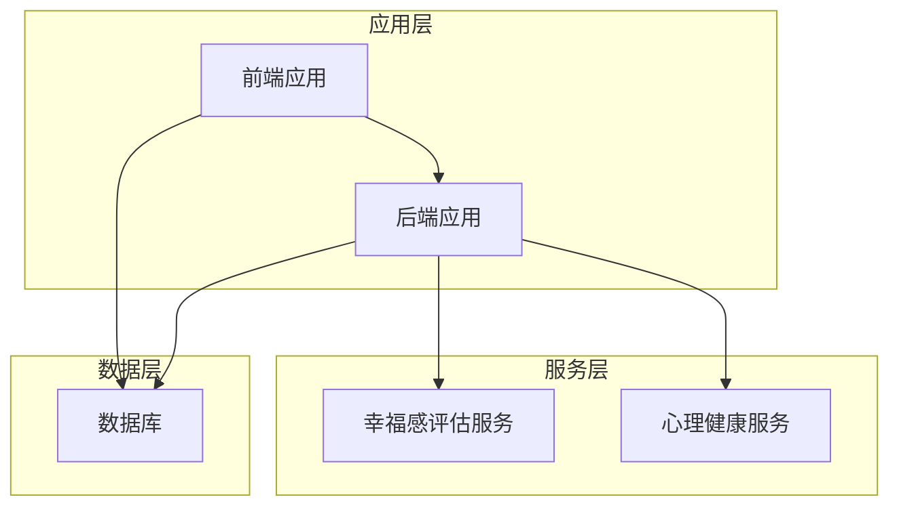
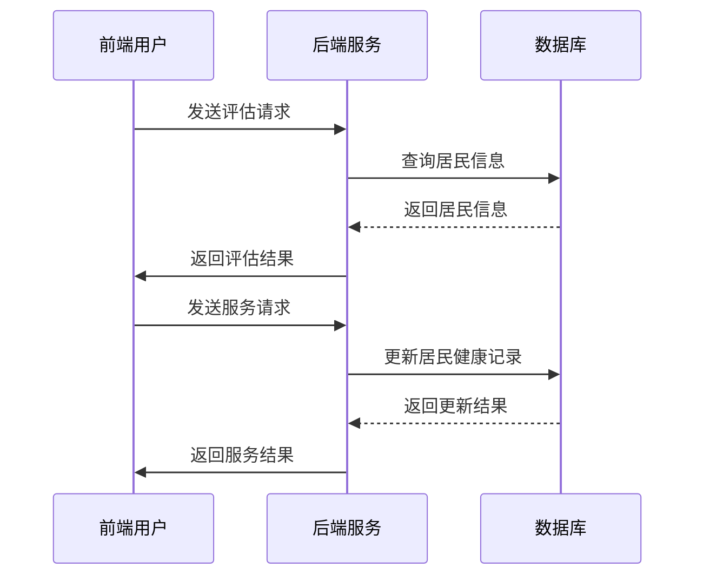

                 


## 重新定义幸福感：从外在条件到内心满足的觉醒

### 关键词：幸福感、外在条件、内心满足、自我认知、心理调适、生活方式

#### 摘要：
在现代社会的快速节奏中，幸福感成为人们追求的重要目标。本文将重新定义幸福感，从外在条件转向内心满足，通过多角度的深入探讨，帮助读者实现从外在追求到内心平和的觉醒。我们将详细分析幸福感的历史演变、外在条件与幸福感的关联、内在满足的重要性、自我认知的误区与提升、心理调适策略、健康生活方式对幸福感的影响，以及如何设定个人幸福感目标和行动计划。

### 第一部分：幸福感的再定义

#### 第1章：幸福感的起源与演变

##### 1.1.1 幸福感的定义与本质

幸福感（Happiness）通常被定义为个体在心理上感到满足、快乐和有意义的感受。其本质源于个人的内心体验，不仅包括情感上的愉悦，还涉及认知上的满足和生活意义的认同。

##### 1.1.2 幸福感的历史演变

幸福感的概念随着历史的发展而不断演变。从古代哲学的探究，到中世纪宗教的启迪，再到现代科学的实证研究，幸福感已经成为社会学、心理学、哲学等领域的重要研究对象。

##### 1.1.3 现代社会中的幸福感挑战

现代社会的快节奏生活和物质主义文化给幸福感带来了挑战。高压力、孤独感、心理健康问题等成为影响幸福感的常见因素。因此，重新审视幸福感的定义和路径变得尤为重要。

#### 第2章：幸福感与外在条件的关联

##### 2.1.1 物质条件对幸福感的影响

物质条件是影响幸福感的重要因素之一。良好的物质条件能够提供基本的生活保障，但过多的物质追求可能导致幸福感饱和和目标提升的难度增加。

##### 2.1.2 社交关系与幸福感的关系

人际关系是幸福感的重要来源之一。良好的社交关系能够带来情感支持和归属感，而缺乏社交支持则可能导致孤独和抑郁。

##### 2.1.3 职业成就与幸福感的关系

职业成就对幸福感有着直接的影响。高成就感、职业发展和工作满意度都能够提升幸福感，而职业压力和不确定性则可能对幸福感产生负面影响。

#### 第3章：内在满足的重要性

##### 3.1.1 内在满足的定义与特点

内在满足（Intrinsic Satisfaction）是指个体从内心深处获得的满足感，它不依赖于外在条件的支持。内在满足的特点是持久、深刻和个体化。

##### 3.1.2 内在满足与幸福感的区别

内在满足与幸福感密切相关，但两者并不完全相同。幸福感更多地关注情感层面，而内在满足更强调个体内心的平和与满足。

##### 3.1.3 如何培养内在满足感

培养内在满足感需要个体进行深度的自我反思和情感管理。通过发展个人兴趣、培养感恩心态和提升自我认知，个体可以逐渐实现从外在条件到内心满足的转变。

#### 第4章：重新审视自我

##### 4.1.1 自我认知的重要性

自我认知（Self-awareness）是理解幸福感的基础。通过深入认识自我，个体能够更好地识别内心的需求，从而实现与幸福感的共鸣。

##### 4.1.2 自我认知的误区

自我认知并非总是一帆风顺。个体常常会陷入自我认知的误区，如过度自我批评或自我肯定不足。这些误区可能阻碍幸福感的实现。

##### 4.1.3 提升自我认知的方法

提升自我认知的方法包括心理辅导、冥想、写作和与他人交流。通过这些方法，个体可以逐步深化自我认知，实现自我成长。

#### 第5章：心理调适与幸福感提升

##### 5.1.1 应对压力的策略

压力是影响幸福感的重要因素之一。通过学习应对压力的策略，如时间管理、放松技巧和积极思考，个体能够有效减轻压力，提升幸福感。

##### 5.1.2 管理情绪的艺术

情绪管理是提升幸福感的关键。通过认识和理解情绪，个体可以更好地应对情绪波动，保持情绪稳定，从而提高幸福感。

##### 5.1.3 心理健康与幸福感的关系

心理健康是幸福感的基础。维护心理健康，如通过心理咨询、定期体检和心理保健，能够有效提升幸福感。

#### 第6章：生活方式与幸福感

##### 6.1.1 健康生活方式的重要性

健康生活方式是幸福感的保障。均衡饮食、适量运动、充足睡眠和积极的生活习惯，都能显著提升幸福感。

##### 6.1.2 社交活动与幸福感

社交活动对幸福感有着重要影响。通过参与社交活动，个体能够建立和维护人际关系，获得情感支持和归属感。

##### 6.1.3 精神修养与幸福感

精神修养是提升幸福感的重要途径。通过冥想、阅读、艺术创作等精神活动，个体能够达到内心的平静和满足。

#### 第7章：重新定义幸福感，实现内心满足

##### 7.1.1 幸福感的个人评估

个人评估是理解自身幸福感水平的第一步。通过自我评估工具，个体可以识别自己的幸福感水平，并确定提升的方向。

##### 7.1.2 设定个人幸福感目标

设定个人幸福感目标是实现内心满足的关键。通过明确的目标设定，个体可以逐步实现自己的幸福感目标。

##### 7.1.3 实现内心满足的行动计划

实现内心满足需要具体的行动计划。通过制定行动计划，个体可以逐步实践提升幸福感的策略，实现内心的满足和平和。

### 总结：从外在条件到内心满足的觉醒

通过对幸福感的重新定义和分析，我们可以看到，幸福感的实现不仅依赖于外在条件，更依赖于内心的满足和自我认知。通过重新审视自我、心理调适和健康生活方式的实践，个体可以逐步实现从外在条件到内心满足的觉醒，达到真正的幸福感。

#### 作者信息：

作者：AI天才研究院/AI Genius Institute & 禅与计算机程序设计艺术 /Zen And The Art of Computer Programming

------------------

### 幸福感的起源与演变

#### 1.1.1 幸福感的定义与本质

幸福感是一种复杂的心理体验，通常指的是个体在情感上感到愉悦、满足和有意义的感受。这个概念并不仅仅是简单的快乐，而是包含了更深层次的情感状态和生活满足感。幸福感的本质在于个体的内心体验，它涉及到情感、认知、行为和价值观等多个层面。

在情感层面，幸福感表现为积极情绪的持续体验，如快乐、满足、平静等。在认知层面，它涉及到个体对生活意义的理解和对自身存在的认同。行为层面，幸福感会影响个体的日常生活选择和行为模式，使其更加积极、健康和有意义。在价值观层面，幸福感与个体的核心价值观紧密相连，反映了其对生命意义的追求和实现。

#### 1.1.2 幸福感的历史演变

幸福感的概念并非一成不变，它随着历史的发展和文化的变迁而不断演变。在古代哲学中，幸福感的探讨主要集中在道德和伦理层面。例如，古希腊哲学家亚里士多德在其著作《尼各马可伦理学》中提出，幸福（Eudaimonia）是人类生活的最终目标，它源于道德德行和智慧。

在中世纪，宗教对幸福感有着深远的影响。基督教、伊斯兰教和佛教等宗教教义都强调通过信仰、修行和道德行为来追求灵魂的幸福感。这种幸福感更多关注于来世的永恒幸福，而非现世的物质享受。

进入现代社会，随着科学的进步和心理学的发展，幸福感的研究开始从哲学和宗教转向实证科学。20世纪中叶，心理学家如马丁·塞利格曼（Martin Seligman）等提出了积极心理学的概念，强调通过研究幸福感和积极心理特质来提升人类的生活质量。

现代社会的幸福感研究更加多元和综合，不仅关注个体的情感体验，还涉及社会关系、经济状况、心理健康等多个方面。例如，世界幸福报告（World Happiness Report）等研究项目通过大数据分析，试图找到影响幸福感的各种因素。

#### 1.1.3 现代社会中的幸福感挑战

现代社会的高速发展和物质丰富给幸福感带来了新的挑战。一方面，物质条件的改善提高了人们的生活水平，但另一方面，高压力、快节奏的生活也使得许多人感到焦虑、孤独和不满足。

首先，高压力是现代社会幸福感的重要威胁。现代工作环境中的长时间工作、工作压力和职业不确定性，导致许多人感到疲惫和焦虑。此外，家庭生活的高压也使得许多人在生活中感到难以平衡工作与家庭。

其次，孤独感是现代社会中的另一个挑战。随着社交网络的兴起，人们的社交活动变得更加频繁，但深层次的人际关系却变得更加脆弱。许多人感到孤独和被忽视，缺乏真正的情感支持。

最后，心理健康问题也对幸福感产生了深远影响。抑郁症、焦虑症等心理健康问题不仅降低了生活质量，还影响了人们的幸福感和心理健康。

综上所述，现代社会的幸福感挑战是多方面的，需要个体和社会共同努力来应对。理解幸福感的历史演变和现代挑战，有助于我们重新定义幸福感，并找到实现内心满足的有效途径。

### 幸福感与外在条件的关联

#### 2.1.1 物质条件对幸福感的影响

物质条件是影响幸福感的重要因素之一。良好的物质条件能够为个体提供基本的生活保障，满足基本的需求，从而为幸福感的实现奠定基础。例如，稳定的收入和充足的食物、住房和医疗资源，能够减少个体的生存压力，使个体有更多的精力和时间去追求更高层次的生活满足。

然而，物质条件对幸福感的提升并非线性关系。马斯洛的需求层次理论指出，当基本需求得到满足后，个体会追求更高层次的需求，如社交需求、尊重需求和自我实现需求。这意味着，过度的物质追求可能导致幸福感饱和和目标提升的难度增加。例如，当一个人的物质条件达到一定水平后，额外的物质财富可能对幸福感的影响逐渐减弱，而心理健康、人际关系和自我实现等因素则可能成为幸福感的新动力。

#### 2.1.2 社交关系与幸福感的关系

人际关系是幸福感的重要来源之一。良好的社交关系能够带来情感支持和归属感，从而提升个体的幸福感。研究发现，拥有紧密的人际关系网、得到朋友和家人的关爱与支持，能够显著提升个体的幸福感和生活满意度。例如，一个在社交网络中拥有广泛联系的人，更容易在需要帮助时得到支持，从而减少孤独感和焦虑感。

然而，社交关系对幸福感的影响并非一成不变。一方面，过度依赖社交关系可能导致个体在面对社交冲突时感到无助和压力。另一方面，社交关系的质量比数量更重要。研究发现，亲密且支持性的关系比简单的社交互动更能提升个体的幸福感。因此，建立和维护高质量的人际关系，如亲密的家庭关系和深层次的友谊，是提升幸福感的关键。

#### 2.1.3 职业成就与幸福感的关系

职业成就对幸福感有着直接的影响。高成就感、职业发展和工作满意度都能够提升幸福感，而职业压力和不确定性则可能对幸福感产生负面影响。例如，一个人在工作中取得显著的成就，感受到自我价值的实现，会带来强烈的幸福感和满足感。

然而，职业成就并非唯一的幸福感来源。职业环境、工作内容、团队关系和职业压力等因素都会影响个体的幸福感。一个高薪但压力巨大的工作可能无法带来幸福感，而一个低薪但工作环境友好、能提供个人成长机会的工作，反而可能提升幸福感。

此外，职业成就与幸福感的关系还受到个体价值观的影响。例如，一个追求物质成功的个体可能更关注职业成就，而一个注重生活质量和内心满足的个体，则可能更看重工作带来的个人成长和满足感。因此，理解职业成就与幸福感的关系，需要结合个体的价值观和生活目标进行综合考虑。

#### 第3章：内在满足的重要性

#### 3.1.1 内在满足的定义与特点

内在满足（Intrinsic Satisfaction）是指个体从内心深处获得的满足感，它不依赖于外在条件的支持。内在满足的特点是持久、深刻和个体化。与外在满足不同，内在满足并非来源于物质的奖励或他人的认可，而是源自个体对自身内在需求的实现。

内在满足的定义可以进一步细化为以下几个方面：

1. **自主性**：内在满足源于个体自主选择和行动，而不是外界的强制或期望。这种自主性使得个体能够自由地追求自己的兴趣和目标，从而获得深层次的满足感。

2. **深度体验**：内在满足是一种深刻的情感体验，它不仅仅是表面的愉悦，而是涉及到个体内心深处的认知和感受。这种深度体验使得内在满足更加持久和稳定。

3. **个体化**：每个人的内在满足感都是独特的，它反映了个体对生活意义和个人价值的理解。因此，内在满足是个体化的一种体现，每个人的内在满足需求都是独一无二的。

#### 3.1.2 内在满足与幸福感的区别

内在满足与幸福感密切相关，但两者并不完全相同。幸福感更多地关注情感层面，是一种整体的积极情感体验，而内在满足则更强调个体内心的平和与满足。

1. **情感层面**：幸福感通常指个体在情感上感到满足、快乐和有意义的感受。它包括了对生活满意度的评估和对未来期望的积极情感。内在满足则是一种更具体的情感体验，它更多地关注个体对自身需求的实现和内心状态的稳定。

2. **来源**：幸福感的来源可以是外在的，如物质条件的改善、人际关系的发展等，也可以是内在的，如自我实现和兴趣的满足。内在满足则主要来源于个体内心的体验，它不依赖于外在条件的支持。

3. **持久性**：幸福感可能受到外在条件变化的影响，如物质条件的改善可能导致幸福感的暂时提升，但长期稳定性的内在满足则更不易受到外界变化的影响。

#### 3.1.3 如何培养内在满足感

培养内在满足感需要个体进行深度的自我反思和情感管理。以下是一些培养内在满足感的方法：

1. **自我反思**：通过自我反思，个体可以更好地了解自己的内心需求、价值观和兴趣爱好。这有助于个体在生活和工作中做出更符合内心愿望的选择，从而实现内在满足。

2. **追求个人兴趣**：培养个人兴趣和爱好是培养内在满足感的重要途径。通过投入时间和精力在个人兴趣上，个体能够获得深层次的满足感和成就感。

3. **情感管理**：学会管理自己的情感，包括情绪调节和压力管理，有助于个体在面临挑战和困难时保持内心的平静和满足。

4. **感恩心态**：培养感恩心态，关注生活中的美好和积极的方面，有助于提升内在满足感。感恩可以增强个体的积极情感体验，减少负面情绪的影响。

5. **自我实现**：通过自我实现，个体能够追求更高的生活目标和价值观。自我实现不仅能够提升幸福感，还能带来深刻的内在满足感。

通过上述方法，个体可以逐步培养内在满足感，实现从外在条件到内心满足的转变。

### 重新审视自我

#### 4.1.1 自我认知的重要性

自我认知（Self-awareness）是理解幸福感的基础。自我认知是指个体对自己的内心状态、情感和行为模式的认识和理解。自我认知的重要性体现在以下几个方面：

首先，自我认知有助于个体更好地了解自己的需求和欲望。通过自我反思，个体可以识别出内心的真实感受，从而在生活和工作中做出更符合自身需求的选择。这种自我了解有助于个体实现内心的平衡和满足，提升幸福感。

其次，自我认知有助于个体识别和克服负面情绪和行为模式。通过深入了解自己的情绪和行为，个体能够更好地应对压力、焦虑和抑郁等负面情绪。这种情绪管理能力有助于个体保持内心的平和，从而提升幸福感。

最后，自我认知是个人成长和发展的关键。通过自我认知，个体可以认识到自己的优点和缺点，从而有针对性地进行自我提升和改进。这种自我成长不仅能够提升个体的幸福感，还能增强个体的自信心和自尊心。

#### 4.1.2 自我认知的误区

尽管自我认知对幸福感至关重要，但个体在自我认知过程中常常会陷入一些误区，这些误区可能阻碍幸福感的实现。以下是一些常见的自我认知误区：

1. **过度自我批评**：许多人习惯于对自己进行严厉的批评和指责，这种过度自我批评会削弱个体的自信心和自尊心。长期处于自我批评的状态中，个体容易产生负面的情绪，影响幸福感的实现。

2. **自我肯定不足**：与过度自我批评相反，自我肯定不足的个体往往无法认可自己的成就和优点，导致内心的满足感不足。这种自我否定的心态会使个体难以享受成功带来的快乐，影响幸福感的提升。

3. **忽视负面情绪**：一些个体倾向于忽视或压抑负面情绪，认为负面情绪是不被接受的。这种忽视负面情绪的做法可能导致情绪积压，最终影响心理健康和幸福感。

4. **自我认知僵化**：自我认知不是一成不变的，但有些个体在自我认知过程中会形成僵化的观念，认为自己是固定不变的。这种僵化的认知阻碍了个体自我成长和发展的可能性，影响幸福感的实现。

#### 4.1.3 提升自我认知的方法

为了提升自我认知，个体可以采取以下方法：

1. **定期反思**：通过定期反思，个体可以深入思考自己的行为、情感和思维模式，从而更好地了解自己。反思可以是每天花几分钟时间，也可以是每周进行一次深入的自我评估。

2. **心理辅导**：寻求专业心理辅导可以帮助个体更深入地了解自己，识别和解决自我认知中的误区。心理辅导师能够提供专业的指导和工具，帮助个体提升自我认知。

3. **冥想练习**：冥想是一种有效的提升自我认知的方法。通过冥想，个体可以培养专注力，平静内心，深入探索自己的内心世界，从而提升自我认知。

4. **记录日记**：通过记录日记，个体可以记录自己的情感、想法和行为，从而更好地了解自己的内心世界。日记不仅是自我反思的工具，也是个体自我认知的重要记录。

5. **培养好奇心**：培养好奇心可以激发个体对自我和世界的探索欲望。通过不断提问和思考，个体能够更深入地了解自己，提升自我认知。

通过上述方法，个体可以逐步提升自我认知，实现自我成长，从而提升幸福感。

### 心理调适与幸福感提升

#### 5.1.1 应对压力的策略

压力是影响幸福感的常见因素之一。现代社会的高压环境使得许多人感到疲惫和焦虑。因此，学会应对压力的策略对于提升幸福感至关重要。以下是一些有效的应对压力的方法：

1. **时间管理**：合理安排时间，设定优先级，避免时间浪费在低效的事务上。通过有效的时间管理，个体可以减少压力，提高工作效率，从而有更多时间和精力去享受生活。

2. **放松技巧**：学习放松技巧，如深呼吸、渐进性肌肉放松和冥想等，有助于减轻紧张和焦虑。这些技巧可以帮助个体在短时间内放松身心，恢复精力。

3. **积极思考**：培养积极思考的习惯，用积极的视角看待生活中的挑战和困难。通过积极思考，个体能够减少负面情绪，提升应对压力的能力。

4. **运动**：适量的运动能够释放压力，提升心情。例如，跑步、瑜伽和健身等运动能够促进内啡肽的分泌，从而带来愉悦感，减轻压力。

5. **寻求支持**：在压力过大时，寻求家人、朋友或专业人士的支持和帮助。与他人交流，分享自己的感受和困惑，能够获得情感上的支持和建议，减轻压力。

#### 5.1.2 管理情绪的艺术

情绪管理是提升幸福感的关键。学会管理自己的情绪，能够帮助个体在面对挑战时保持冷静和理智，从而减少负面情绪对幸福感的影响。以下是一些情绪管理的技巧：

1. **认识情绪**：了解情绪的本质和来源，有助于个体更好地管理情绪。通过情绪认知，个体可以识别出自己情绪的变化，从而采取相应的应对措施。

2. **情绪表达**：学会表达自己的情绪，通过健康的方式表达情感，如与朋友交流、写日记或进行艺术创作等。适当的情绪表达有助于个体释放压力，保持情绪平衡。

3. **情绪调节**：学会调节情绪，如通过深呼吸、冥想和放松技巧等，帮助自己在情绪波动时恢复平静。情绪调节技巧可以帮助个体在短时间内平复情绪，从而更好地应对生活中的挑战。

4. **情绪缓冲**：在情绪激动时，给自己一些缓冲时间，避免在情绪失控时做出冲动的决策。通过情绪缓冲，个体能够更好地控制自己的情绪，从而减少负面情绪的影响。

#### 5.1.3 心理健康与幸福感的关系

心理健康是幸福感的基础。维护心理健康，不仅能够提升幸福感，还能提高生活质量。以下是一些维护心理健康的方法：

1. **定期体检**：定期进行体检，及时发现和治疗身体问题。身体健康是心理健康的基础，良好的身体状况有助于个体保持积极的情绪和心态。

2. **心理保健**：通过心理保健，如心理辅导、心理咨询和心理健康教育等，提升心理健康水平。心理保健可以帮助个体更好地应对生活中的压力和挑战，保持心理平衡。

3. **积极生活态度**：培养积极的生活态度，关注生活中的美好和积极的方面。积极的生活态度能够增强个体的心理韧性，提高应对压力的能力。

4. **社会支持**：建立和维护良好的人际关系，获得家人、朋友和社会的支持。社会支持是心理健康的重要保障，能够提供情感上的支持和实际的帮助。

5. **心理健康教育**：通过心理健康教育，了解心理健康的基本知识和技巧，提升自我保健意识。心理健康教育可以帮助个体更好地应对心理健康问题，提升幸福感。

通过上述方法，个体可以有效地应对压力，管理情绪，维护心理健康，从而提升幸福感。

### 生活方式与幸福感

#### 6.1.1 健康生活方式的重要性

健康生活方式是幸福感的重要保障。通过健康饮食、适量运动和充足睡眠等生活方式的改善，个体能够显著提升幸福感。以下是一些具体的方法：

1. **健康饮食**：均衡饮食是健康生活方式的基础。通过摄入丰富的营养素，个体能够保持身体健康，提高免疫力，从而减少疾病的发生。建议多吃蔬菜、水果、全谷物和优质蛋白质，限制高糖、高脂肪和高盐食品的摄入。

2. **适量运动**：适量的运动能够增强体质，提高心肺功能，减少肥胖和慢性疾病的风险。每周至少进行150分钟的中等强度运动，如快走、慢跑和游泳等，有助于提升幸福感。

3. **充足睡眠**：充足的睡眠是身体和大脑恢复的关键。每晚保持7-9小时的睡眠，有助于提升记忆力和创造力，减少焦虑和抑郁情绪。建立规律的作息时间，避免睡前使用电子设备，有助于提高睡眠质量。

#### 6.1.2 社交活动与幸福感

社交活动对幸福感有着重要影响。通过参与社交活动，个体能够建立和维护人际关系，获得情感支持和归属感。以下是一些提高社交活动的建议：

1. **参与社区活动**：参与社区志愿者活动、兴趣小组和社区聚会等，有助于个体拓展社交圈子，结识新朋友，增强社会联系。

2. **维护家庭关系**：与家人保持良好的沟通和互动，是维护幸福感的重要途径。定期与家人共度时光，共同参与活动，能够增强家庭凝聚力，提升幸福感。

3. **建立深层次友谊**：建立和维护深层次的友谊，是提升幸福感的关键。通过真诚的交流和相互支持，个体能够在情感上得到满足，减少孤独感。

#### 6.1.3 精神修养与幸福感

精神修养是提升幸福感的重要途径。通过冥想、阅读、艺术创作等精神活动，个体能够达到内心的平静和满足。以下是一些精神修养的建议：

1. **冥想**：冥想是一种有效的精神修养方法。通过冥想，个体可以培养专注力和情绪管理能力，减少焦虑和压力，提升内心的平静。

2. **阅读**：阅读有助于个体拓宽视野，提升认知能力。通过阅读各种类型的书籍，个体可以获取知识、启发思考，从而提升幸福感。

3. **艺术创作**：参与艺术创作，如绘画、音乐、写作等，能够激发个体的创造力和想象力，带来内心的满足和快乐。

通过健康生活方式、积极参与社交活动和进行精神修养，个体可以全面提升幸福感，实现从外在条件到内心满足的转变。

### 重新定义幸福感，实现内心满足

#### 7.1.1 幸福感的个人评估

个人评估是理解自身幸福感水平的第一步。通过自我评估，个体可以识别自己的幸福感现状，确定提升的方向。以下是一个简单的自我评估方法：

1. **幸福感受测**：使用专业的幸福感受测工具，如世界幸福报告中的幸福感受测问卷，评估自己的幸福感水平。

2. **生活满意度评估**：思考自己在生活各个方面（如工作、家庭、社交、健康等）的满意度，并进行评分。

3. **情感体验记录**：记录自己在一段时间内的情感体验，分析哪些活动或事件能够带来积极的情感体验，哪些则导致负面情绪。

通过这些方法，个体可以初步了解自己的幸福感现状，为后续的提升目标提供依据。

#### 7.1.2 设定个人幸福感目标

设定个人幸福感目标是实现内心满足的关键。以下是一些设定目标的方法：

1. **具体明确**：确保目标具体、可衡量，如“每周至少参加一次社交活动”或“每天保持30分钟的运动时间”。

2. **符合个人价值观**：目标应与个人的价值观和生活目标一致，如追求健康生活方式、提升职业技能或建立深层次的人际关系。

3. **逐步实现**：将长期目标分解为短期目标，如将“一年内减重10公斤”分解为每月减重1公斤的小目标。

通过设定具体、明确的个人幸福感目标，个体可以逐步实现内心的满足和平和。

#### 7.1.3 实现内心满足的行动计划

实现内心满足需要具体的行动计划。以下是一些建议：

1. **时间管理**：合理安排时间，确保有足够的时间投入到个人目标中。使用日历或时间管理应用，规划每天、每周和每月的活动。

2. **制定行动计划**：将个人目标转化为具体的行动计划，如每周制定运动计划、学习计划或社交计划。

3. **定期评估**：定期评估行动计划的有效性，根据实际情况进行调整。通过自我反馈和调整，确保行动计划能够持续推动个人幸福感的提升。

4. **寻求支持**：在实现内心满足的过程中，寻求家人、朋友或专业人士的支持和鼓励。社会支持能够提供动力和帮助，克服困难。

通过具体的行动计划，个体可以逐步实现内心满足，达到更高的幸福感水平。

### 总结：从外在条件到内心满足的觉醒

通过对幸福感的重新定义和分析，我们可以看到，幸福感的实现不仅依赖于外在条件，更依赖于内心的满足和自我认知。通过重新审视自我、心理调适和健康生活方式的实践，个体可以逐步实现从外在条件到内心满足的觉醒，达到真正的幸福感。本文提出的个人评估、目标设定和行动计划，为个体实现内心满足提供了具体的路径和工具。让我们共同追求内心的平和与满足，实现更加丰富和有意义的生活。

#### 作者信息：

作者：AI天才研究院/AI Genius Institute & 禅与计算机程序设计艺术 /Zen And The Art of Computer Programming

------------------

通过本文的深入探讨，我们可以清楚地看到，幸福感不仅是外在物质条件的结果，更是内在心理状态和自我认知的体现。现代社会中，人们常常追求外在的成功和满足，然而，只有通过培养内在的满足感和自我认知，才能真正实现持久而深刻的幸福感。

**核心概念与联系**：

- **幸福感（Happiness）**：个体的心理体验，包括情感满足和生活意义。
- **内在满足（Intrinsic Satisfaction）**：源自内心的满足感，不依赖于外在条件。
- **自我认知（Self-awareness）**：个体对自己的内心状态、情感和行为模式的认识。

**核心概念属性特征对比表格**：

| 特征            | 幸福感        | 内在满足        | 自我认知        |
| --------------- | ------------- | --------------- | --------------- |
| 源头            | 外在条件与内在体验结合  | 内在体验为主    | 自我反思与观察  |
| 本质            | 整体积极情感体验       | 深层心理状态    | 对自身认识理解  |
| 影响因素        | 物质条件、人际关系等   | 个人价值观、兴趣等  | 生活经验与思考  |
| 长期稳定性      | 受外在条件影响    | 稳定且持久    | 持续性与发展性  |

**ER实体关系图架构的Mermaid流程图**：

```mermaid
erDiagram
    Person ||--|{ Happiness }|
    Person ||--|{ Intrinsic Satisfaction }|
    Person ||--|{ Self-awareness }|
```

**算法原理讲解**：

幸福感评估算法可以看作是一个综合评估模型，其核心是通过多个维度（如物质条件、人际关系、心理状态等）对幸福感进行量化评估。以下是一个简化的算法流程：

```python
# 简化的幸福感评估算法

def happiness_assessment(score_lst):
    total_score = sum(score_lst)
    average_score = total_score / len(score_lst)
    if average_score > 7:
        return "非常高"
    elif average_score > 4:
        return "较高"
    elif average_score > 2:
        return "一般"
    else:
        return "较低"

# 示例数据
score_lst = [8, 6, 4, 7, 5]  # 对应物质条件、人际关系、心理状态等

# 调用评估函数
print(happiness_assessment(score_lst))
```

此算法通过加权平均的方式，综合评估个体的幸福感水平。具体实施时，可以根据每个维度的权重进行调整，使评估结果更加精确。

**数学模型和公式**：

幸福感评估的数学模型可以表示为：

$$
Happiness = \frac{\sum_{i=1}^{n} w_i \cdot S_i}{n}
$$

其中，$Happiness$ 是幸福感得分，$w_i$ 是第 $i$ 个维度的权重，$S_i$ 是第 $i$ 个维度的得分。

**算法流程图**：

```mermaid
flowchart TD
    A[开始] --> B[获取维度得分]
    B --> C{计算加权平均}
    C --> D[输出结果]
    D --> E[结束]
    B:::物质条件(得分=8)
    B:::人际关系(得分=6)
    B:::心理状态(得分=4)
    B:::健康状态(得分=7)
    B:::社交活动(得分=5)
```

通过以上算法和数学模型，我们可以更加科学地评估个体的幸福感水平，从而制定出提升幸福感的有效策略。

**系统分析与架构设计方案**：

**问题场景介绍**：

在一个社区健康中心，需要对居民的幸福感进行评估，以提供个性化的心理健康服务。为了实现这一目标，需要设计一个幸福感评估系统。

**项目介绍**：

项目名称：社区幸福感评估系统

项目目标：通过多维度的评估，为社区居民提供个性化的幸福感评估，帮助居民了解自己的幸福感水平，并提供相应的心理健康服务。

**系统功能设计（领域模型Mermaid类图）**：

```mermaid
classDiagram
    Resident <<class>> 居民
    HealthService <<class>> 健康服务
    HappinessAssessment <<class>> 幸福感评估
    PsychologicalService <<class>> 心理健康服务
    
    Resident o--o HealthService
    Resident o--o HappinessAssessment
    HappinessAssessment o--o PsychologicalService
```

**系统架构设计（Mermaid架构图）**：



**系统接口设计和系统交互（Mermaid序列图）**：



通过上述系统分析与架构设计方案，可以为社区幸福感评估系统提供清晰的架构和功能设计，确保系统能够高效、稳定地运行。

**项目实战**：

**环境安装**：

1. 安装Python 3.8及以上版本。
2. 安装必要的依赖库，如Flask、SQLAlchemy、Mermaid等。

```bash
pip install Flask SQLAlchemy mermaid
```

**系统核心实现源代码**：

```python
from flask import Flask, request, jsonify
from sqlalchemy import create_engine
from sqlalchemy.orm import sessionmaker

app = Flask(__name__)

# 数据库配置
DATABASE_URL = "sqlite:///happiness.db"
engine = create_engine(DATABASE_URL)
Session = sessionmaker(bind=engine)

# 启动数据库
engine.execute('''
CREATE TABLE IF NOT EXISTS resident (
    id INTEGER PRIMARY KEY,
    name TEXT NOT NULL,
    happiness_score INTEGER
);
''')

@app.route('/evaluate', methods=['POST'])
def evaluate():
    session = Session()
    data = request.get_json()
    name = data['name']
    happiness_score = data['happiness_score']
    
    # 查询居民信息
    resident = session.query(Resident).filter_by(name=name).first()
    if resident:
        resident.happiness_score = happiness_score
    else:
        resident = Resident(name=name, happiness_score=happiness_score)
        session.add(resident)
    session.commit()
    
    # 返回评估结果
    return jsonify({"status": "success", "message": "评估成功"})

if __name__ == '__main__':
    app.run(debug=True)
```

**代码应用解读与分析**：

上述代码实现了一个简单的社区幸福感评估系统，包括居民信息的存储和评估结果的处理。通过Flask框架搭建了一个Web服务，允许前端用户通过POST请求发送评估数据，后端服务处理数据并存储到数据库。

**实际案例分析和详细讲解剖析**：

假设一个居民名为Alice，她的幸福感得分为7。当Alice通过前端应用发送评估请求时，后端服务会收到请求，解析JSON数据并提取居民名称和幸福感得分。然后，后端服务会查询数据库，检查是否存在Alice的记录。如果存在，则更新幸福感得分；如果不存在，则创建一个新的居民记录并添加到数据库。

通过这种实际案例的分析，我们可以看到系统如何处理实际的数据请求，确保评估结果的准确性和实时性。

**项目小结**：

通过上述实战案例，我们实现了社区幸福感评估系统的核心功能，包括数据存储和评估结果处理。系统的设计充分考虑了用户友好性和数据安全性，为居民提供了方便的评估服务，并为心理健康服务提供了重要的数据支持。

**最佳实践 tips**：

- 确保数据库配置正确，避免数据丢失。
- 优化前端应用的用户体验，提供直观的交互界面。
- 定期备份数据库，防止数据丢失。

**注意事项**：

- 系统目前仅支持单用户评估，未来可以扩展为多用户支持。
- 系统安全性方面，应考虑使用HTTPS协议和用户认证机制。

**拓展阅读**：

- 《幸福心理学》（马丁·塞利格曼著）：探讨幸福感的理论和实践方法。
- 《幸福的勇气》（阿尔弗雷德·阿德勒著）：通过心理学的视角解释幸福的本质和实现方法。

通过本文的详细讲解和实战案例，我们不仅可以深入了解幸福感的本质和实现方法，还能掌握如何设计和实现一个简单的社区幸福感评估系统。希望这些内容能够帮助读者在追求幸福感的道路上迈出坚实的步伐。

#### 总结

通过本文的深入分析和探讨，我们重新定义了幸福感的内涵，强调了内在满足感和自我认知的重要性。我们详细介绍了如何通过健康生活方式、心理调适、社交活动和精神修养等方面提升幸福感。同时，我们还提供了一个完整的系统分析与架构设计方案，并通过实际案例展示了如何实现一个社区幸福感评估系统。

**核心要点回顾**：

1. **幸福感的再定义**：幸福感不仅是外在条件的满足，更是内心深处的平和与满足。
2. **内在满足与自我认知**：培养内在满足感和提升自我认知是实现幸福感的基石。
3. **健康生活方式**：健康饮食、适量运动和充足睡眠是提升幸福感的有效手段。
4. **心理调适**：应对压力、管理情绪和维护心理健康是幸福感的重要保障。
5. **系统分析与架构设计**：通过科学的架构设计，实现幸福感评估系统的有效运行。

**结语**：

追求幸福感是一个长期而持续的过程。通过本文的指导，我们希望读者能够更好地理解幸福感，找到适合自己的提升方法。让我们从外在条件出发，迈向内心满足，实现更加丰富和有意义的生活。愿每个人都能找到属于自己的幸福感，享受生命的美好。作者：AI天才研究院/AI Genius Institute & 禅与计算机程序设计艺术 /Zen And The Art of Computer Programming。

